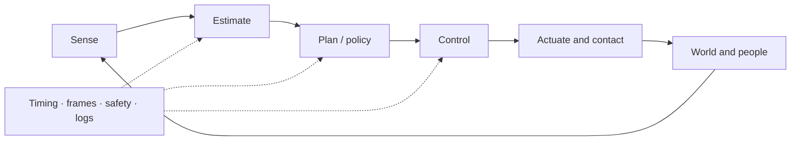
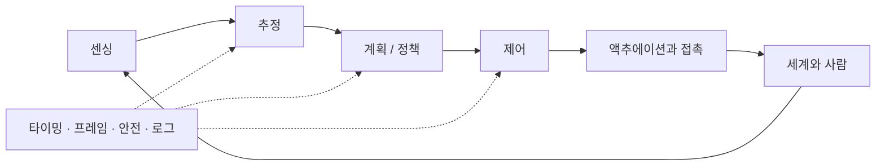

## English

Robotics is a closed physical system: sensing produces uncertain observations, estimation forms a belief, planning selects feasible behavior, control stabilizes execution, and contact and embodiment determine what the world actually permits.

**Start here.** The common track is sections A–G, read in order — section D is pages 5–8, with 5.5 — and it ends with the cumulative problem set and the capstone (M); sections H–L are optional branches, taken when your work needs one. Three labels appear below and never conflict: the letters A–M group pages by topic, the page numbers 1–26 are the study order, and the session numbers 1–104 of the schedule are 60–90-minute sittings in that order (5. Control Theory is group D, page 5, sessions 61–65).

### A. Geometry, mechanics & motion

- [[04-robotics/modern-robotics-book|1. Modern Robotics]] — book guide and scope
- [[04-robotics/modern-robotics/index|2. Modern Robotics Summary]] — chapters 2–6 and 8–13; chapters 10–13 are read later, alongside the pages they serve (see the study-order note below)
- Chapter 7 (closed-chain kinematics) is intentionally optional: this track prioritizes open-chain manipulation, control, physical interaction, and field/mobile robotics literacy.
- On the dissertation path ([[07-research-program/index|7. Research Program §8]]), [[02-foundations/manipulator-kinematics-dynamics|10. Manipulator Kinematics & Dynamics]] comes before ch.2–6, right after the foundations gate: it derives the kinematics it needs on P2 itself (the catalog's planar two-link arm, [[02-foundations/lab-plants|0.6]]), and supplies the dynamics half those summaries stop short of and the operational-space inertia that makes section E readable.

> [!tip] Learn with one running task · 하나의 과제로 배우기
> Use “move a tool to a panel and make controlled contact” as a running example. The arm is plant **P2** (*plant*: control's word for the system being controlled) and the panel has stiffness of plant **P3**, both frozen in [[02-foundations/lab-plants|0.6 Lab Plants]]. Geometry expresses the target in the robot's frame. Forward kinematics predicts the tip from joint angles; inverse kinematics asks which joint angles can reach that target. The Jacobian relates small motions, and dynamics turns desired acceleration into torque. Estimation supplies the uncertain state; planning chooses a feasible route; feedback corrects motion; contact control determines the force–motion response at the panel.
>
> At each page, write what comes in, what goes out and one condition under which it fails, then do that page's **problem set**. After kinematics, explain why a reachable point may still require a different tool orientation. After estimation, distinguish a measurement from a state estimate. After control, explain why small tracking error does not guarantee a safe contact force. These checkpoints connect the pages into one system rather than a list of techniques.

### B. State, perception & belief

- [[04-robotics/state-estimation-slam|3. State Estimation, Localization & SLAM]] — state versus observation, Bayes/Kalman filtering, sensor fusion, factor graphs, drift and loop closure
- [[04-robotics/sensor-models|3.2 Sensor Models & Noise]] — the measurement model $z=h(x)+b+n$, noise density to per-sample σ, how integration turns bias and noise into drift, quantization, and reading an Allan-deviation plot (Tier A on **P6**, the catalog's cart on a rail with its clocks, [[02-foundations/lab-plants|0.6]])
- [[04-robotics/geometric-perception-calibration|3.5 Geometric Perception & Calibration]] — camera models, depth, point clouds, registration/ICP, intrinsic/extrinsic/hand–eye calibration, reprojection error
- [[04-robotics/perception-sensors-rigs|3.6 Perception Sensors & Rigs]] — how cameras, stereo and depth cameras, LiDARs and radars form their measurements and where they fail on a site, extrinsics between different sensors, and time stamps, triggers and clocks (Tier A on 3.5's wrist rig carried past the facade of S1, the construction track's panel-placement task, [[05-construction-robotics/site-engineering|2.5]])
- Learned visual perception lives in [[03-deep-learning/index|Deep Learning]]; this page explains how sensor evidence becomes a time-indexed robot belief.

### C. Planning & decision-making

- [[04-robotics/planning-decision-making|4. Planning & Decision-Making]] — graph search, sampling, trajectory optimization, TAMP, uncertainty, replanning, and learned planning

### D. Feedback & control

Depth target: classical control solid; MPC to formulation and representative applications—enough to read modern robotics papers.

1. [[04-robotics/control-theory-ce397|5. Control Theory]] — state space, modes and eigenvalue stability, transfer functions and poles, controllability/observability, pole placement, PID, observers (self-contained; the CE397 packet is the deep dive)
2. [[04-robotics/system-identification|5.5 System Identification]] — fitting a model to data: least squares, persistent excitation, where the noise enters and the bias it leaves, validation, and back to continuous time (Tier A on **P4**, the catalog's leaky heater ([[02-foundations/lab-plants|0.6]]), then **P2**'s inertial parameters)
3. [[04-robotics/lqr-lqg|6. LQR & LQG]] — optimal feedback and estimator–controller separation
4. [[04-robotics/mpc|7. Model Predictive Control]] — finite-horizon optimization, constraints and replanning
5. [[04-robotics/convex-mpc-legged|8. Convex MPC for Legged Robots]] — representative high-rate application

### E. Physical interaction

- [[04-robotics/contact-force-tactile|9. Contact, Force & Tactile Interaction]] — friction, contact modes, force/impedance/admittance control, tactile sensing, deformable materials

### F. Embodiment & deployment

- [[04-robotics/robot-systems-deployment|10. Robot Systems, Embodiment & Deployment]] — action interfaces, timing, frames, middleware, reliability, simulation, logging, and failure diagnosis
- [[04-robotics/actuators-drives|10.5 Actuators & Drives]] — the DC motor's two equations, torque constant and back-EMF, the torque–speed line, reflected inertia $n^2J_m$, current loop inside position loop, thermal versus peak torque, backdrivability (Tier A on **P2**)

### G. Humans & safety

- [[04-robotics/hri-safety|11. Human–Robot Interaction & Safety]] — autonomy levels, authority, intervention, human studies, hazard and risk literacy

### H. Manipulation specialization

Optional relative to the common track above. 12, 13 and 15 are on the dissertation path of [[07-research-program/index|7. Research Program §8]], and 14 and 16 join it when its §9 says. Read them after section E.

One survey is worth reading before all five, because it is the citation a manipulation thesis introduction is expected to engage with: **Billard & Kragic, "Trends and challenges in robot manipulation," *Science* 364(6446), eaat8414, 2019** — a field-level statement of what manipulation still cannot do, and the frame reviewers will place a new contribution inside. Its companion on the learning side is **Kroemer, Niekum & Konidaris, "A Review of Robot Learning for Manipulation," *JMLR* 22(30), pp. 1–82, 2021** — note the year: it circulates as a 2019 preprint and is often miscited that way.

- [[04-robotics/teleoperation-demonstration|12. Teleoperation & Demonstration Collection]] — bilateral architectures, transparency versus stability, why delay breaks passivity, interface tradeoffs, retargeting, and what makes demonstration data good
- [[04-robotics/force-compliance-control|13. Force & Compliance Control]] — impedance versus admittance and their implementation limits in stiff contact, hybrid position/force, operational-space control, and the contact-transition arithmetic that decides what a controller can do at all
- [[04-robotics/tactile-visuotactile|14. Tactile & Visuotactile Sensing]] — what each sensor family actually outputs, slip and contact-state estimation, what fusion buys, and why sensor latency makes touch a decision signal
- [[04-robotics/grasping|15. Grasping]] — friction cones, form versus force closure, the epsilon quality metric, and how the analytic theory became the label generator for learned grasping
- [[04-robotics/navigation-mobile-manipulation|16. Navigation & Mobile Manipulation]] — why the navigation goal is a manipulation-ready pose, reachability and capability maps, base placement, and the error budget that decides whether a tolerance can be met at all

### I. Unstructured-environment navigation

Also optional relative to the common track — this is the **navigation** pillar of
[[07-research-program/index|7. Research Program]], and the field it surveys moved a long way
between 2020 and 2026. Read after section B.

- [[04-robotics/traversability-off-road|17. Traversability & Off-Road Autonomy]] — traversability as a learned, robot-specific, velocity-conditioned affordance rather than a geometric predicate; where the supervision comes from; the adaptation-versus-generalization split; and what SubT and RACER established
- [[04-robotics/legged-locomotion|18. Legged Locomotion]] — privileged teacher-student distillation, and what each landmark result actually claimed as opposed to what it is cited for
- [[04-robotics/semantic-language-navigation|19. Semantic & Language-Driven Navigation]] — ObjectNav and VLN definitions and metrics, how continuous and graph-based formulations differ, language-queryable maps, and what happened to the benchmarks

### J. Human perception & intent

The perception layer that human-centered robotics actually runs on — and the one the
common track above does not cover. This is the **HRI/prediction** pillar of
[[07-research-program/index|7. Research Program]]. Read after section B; section G gives the
decision layer these pages feed.

- [[04-robotics/video-action-understanding|20. Video Representation & Action Understanding]] — recognition versus localization versus anticipation, scene bias and the single-frame baseline, backbone families and their temporal receptive field, and why one anticipation number hides the result
- [[04-robotics/human-pose-gaze|21. Human Pose, Hands & Gaze]] — the representation ladder from 2D keypoints to parametric bodies, what MPJPE means in millimetres, why head pose is substituted for gaze at range, and the motion cues that need no keypoints
- [[04-robotics/egocentric-perception|22. Egocentric & First-Person Perception]] — how the first-person viewpoint changes observability, the gaze → head → hand → contact cue cascade, where head motion stops proxying attention, and the gap from daily-life benchmarks to a helmet camera
- [[04-robotics/human-intent-prediction|23. Human Intent & Trajectory Prediction]] — intent versus trajectory, the usable horizon $\Delta^*$ against required lead time, calibration and conformal prediction as the decision interface, base rates, and the human-masked ablation
- [[04-robotics/xr-human-robot-collaboration|23.5 XR for Human–Robot Collaboration]] — the device classes from VR headsets to display smart glasses and what each shows and senses, what a developer can read from a Quest 3 and a Ray-Ban Display, a hologram's registration budget on S1 and why it cannot check ±5 mm, and the research map from intent displays to egocentric robot learning

### K. Haptics & teleoperation specialization

Read after sections D–E and before designing a force-feedback interface or a haptic human study.

- [[04-robotics/haptics-teleoperation/index|24. Haptics & Teleoperation]] — human touch and psychophysics, tactile-display design, device kinematics and actuation, sampled virtual-contact stability, rendering algorithms, bilateral teleoperation, experimental evidence, teleoperation architectures and delay, and rendering in practice

### L. Build track

Read alongside section F (10. Robot Systems), from the first page you want to run on a computer.

- [[04-robotics/ros2/index|25. ROS 2]] — the build track: C++ for robot code, middleware concepts, workspaces and launch, the failures that do not stop the program, robot description and TF, simulation and ros2_control, MoveIt 2, Nav2, debugging and reproducibility, and what changes on real hardware

### M. Capstone

Do this last, after the cumulative problem set below.

- [[04-robotics/capstone-panel-contact|26. Capstone: Tool to Panel, Controlled Contact]] — the running task end to end in one simulation: fuse the panel range, plan around the uncertainty-inflated C-obstacle, time the path at the joints and at the tip, track it, switch to impedance, press, and name the page whose limit each failing design violates

Note: page numbers are the recommended study order — Modern Robotics (1–2) → estimation (3, 3.2) → geometric perception and sensors (3.5, 3.6) → planning (4) → control (5, 5.5, 6–8) → contact (9) → systems (10, 10.5) → humans & safety (11), then the specialization pages (12–16 manipulation, 17–19 navigation, 20–23.5 human perception & intent, 24 haptics & teleoperation, 25 the ROS 2 build track), and 26 the capstone. The later Modern Robotics chapters are read alongside the page they serve rather than all at the start: ch.10 with 4. Planning, ch.11 after 5. Control Theory, ch.12 with 15. Grasping, ch.13 with 16. Navigation.

### Session schedule · 학습 일정

One row is one 60–90-minute session of the common track, in the study order of the note above — so MR ch.10 sits inside the planning sessions, MR ch.11 follows the control-theory sessions, and MR ch.12–13 move to the manipulation branch below the table; [[02-foundations/overview|0. Overview]] sets that unit and keeps the pacing table these counts feed. A **bold** number marks a page's first pass — its object and worked case plus the sections its First-pass callout names — and the bold rows alone are the Literacy pass; all rows together are the Working pass. Sizing: every page opens with its object and worked case, done by hand; the numbered sections follow at about 1,500–2,500 words a session; a Tier A page adds a session for its lab and sweep; and the problem set with the self-check closes the page, sharing a session with the last sections when the page is short. The last column says what to check, not what the answer is: the numbers live in each page's worked case and Solutions, so the table can be read before the work without giving it away.

| # | Page and sections | Activity | Check that ends the session |
|---:|---|---|---|
| **1** | [[04-robotics/modern-robotics-book\|1]] all, and the hub [[04-robotics/modern-robotics/index\|2]] | first pass + problem set | One question of your own routed to its chapter by the worked case's rule; both Tier C sets checked against their Solutions, including the joint torques of a $+x$ press. |
| **2** | [[04-robotics/modern-robotics/ch02-configuration-space\|MR ch.2]] object, diagram, worked case, §2 | first pass + worked case by hand | With the answers covered: the C-obstacle shaded on the torus, its two pinches, and contacts A and B placed on it (Steps 3–6, Step 5's share taken as given); then, page closed, why the tip $(1,1)$ is not a configuration and why the lens removes no dimension while contact removes one (Steps 6–7); self-check 4. |
| 3 | MR ch.2 §1, §1.5 and §3 | first pass | P2's Grübler count, and the move $(170^\circ,0^\circ)\to(-170^\circ,0^\circ)$ read on the torus and on the flat chart (§1); the tool heading $45^\circ$ at $(1,1)$ that no configuration reaches (§1.5); the Pfaffian row $A$ at $(0^\circ,90^\circ)$ and the tip velocity of the rates it allows (§3). |
| 4 | MR ch.2 self-check, problem set | problem set | Solutions: the angles at which the wall at $x=1.5$ pinches the C-obstacle and the range of the straight arm that penetrates it; whether the dimension, the dof or the task's feasibility changes. |
| **5** | [[04-robotics/modern-robotics/ch03-rigid-body-motions\|MR ch.3]] object, diagram, worked case, §1–2 | first pass + worked case by hand | $T_{sb}$ of the tip at the frozen pose written with the page closed; $[\hat z]p=(-1,1,0)$, and the angular velocity $(0,0,-0.2)$ read from $\dot R$ at an elbow rate of $-0.2$ rad/s (Worked case, §1–§2); self-check 1. |
| 6 | MR ch.3 §3–4 | first pass | The space and body twists $(0,0,1;\,0,0,0)$ and $(0,0,1;\,1,1,0)$ of the same motion, and why the space twist's $v_s$ is not the tip velocity; the adjoint map carrying $J_b$'s columns to $J_s$'s (§4). |
| 7 | MR ch.3 §5 | first pass | The elbow screw's $G(\pi/2)$ and $e^{[\mathcal S_2]\pi/2}$ by the closed form (5.1); the same screw recovered by the logarithm, $\operatorname{tr}R=1$ giving $\theta=\pi/2$ (5.3); the listing's round trip run. |
| 8 | MR ch.3 §6 | first pass | The tip wrench $\mathcal F_s=(0,0,-10;\ 0,-10,0)$ paired with both joint screws: $\tau=(-10,0)$ N·m, the same $-10$ W in $\{s\}$ and $\{b\}$; the non-example that drops the moment and claims $0$ W. |
| 9 | MR ch.3 self-check, problem set | problem set | Solutions: at the raised pose $(90^\circ,0^\circ)$, the shoulder's space and body twists and which of the two changed with the pose; the tool headings P2 can hold with its tip at $(1,1)$, and why SE(2) is where the tool's poses live but not P2's configuration space. |
| **10** | [[04-robotics/modern-robotics/ch04-forward-kinematics\|MR ch.4]] object, diagram, §1–2, worked case | first pass + worked case by hand | PoE and geometry checked to agree on the tip at $\theta=(0^\circ,90^\circ)$ and at $(90^\circ,90^\circ)$; why the swapped order moves the tip without changing $R$; self-check 1. |
| 11 | MR ch.4 self-check, problem set | problem set | Solutions: $T$ at branch B, $\theta=(90^\circ,-90^\circ)$, by PoE and by geometry; what a $0.2$ m tool changes among $M$, $\mathcal S_1$ and $\mathcal S_2$, and where it puts the tool at $(0^\circ,90^\circ)$. |
| **12** | [[04-robotics/modern-robotics/ch05-velocity-kinematics\|MR ch.5]] object, diagram, worked case, §2 | first pass + worked case by hand | The Worked case redone with its answers covered — $J$ from the two arrows at the tip, $J^{-1}$, the joint rates for $v=(0,-0.25)$ and the torque of the $10$ N press — then why §2's frozen-$J$ run ends $12$ cm off in $x$. |
| 13 | MR ch.5 §1, §3–4 | first pass | $J_s$ and $J_b$ at the catalog pose, and $J_s$'s elbow column $(0,0,1;\,1,0,0)$ at $(90^\circ,90^\circ)$; the statics box at rest, $J_s^\top\mathcal F_s=(-10,0)$; the singular pose $(0,0)$, where $J^\top(10,0)=(0,0)$; the ellipsoid's semi-axes $1.618$ and $0.618$ at the catalog pose, and $\mu_1=57.3$ at $(0^\circ,5^\circ)$. |
| 14 | MR ch.5 self-check, problem set 1–2 | problem set | Solutions 1–2: the $(0^\circ,30^\circ)$ columns and ellipse; branch B's $J$, its inverse, and $\tau=J^\top F$ for the press and for $F=(2,-5)$. |
| 15 | MR ch.5 problem set 3 | lab and sweep | Live and frozen $J$ run at $T=0.01$ and their end points compared with the page's; then only $T$ changed to $0.05$, and what changes named. |
| **16** | [[04-robotics/modern-robotics/ch06-inverse-kinematics\|MR ch.6]] object, diagram, worked case | first pass + worked case by hand | The two branches of $(1,1)$ by the law of cosines and atan2, and where their mean puts the tip; page closed, why a solver seeded at that mean gets no step for any $\lambda$; then, ten degrees off at $(45^\circ,10^\circ)$, how far the undamped step moves the joints and how much damping at $\lambda=0.3$ reduces $\lVert e\rVert$, computed then compared. |
| 17 | MR ch.6 §1–4 | first pass | The solution set of $(1,1)$ — two branches — and of $(2.5,0)$ — empty; Newton–Raphson from $(20^\circ,70^\circ)$ with residuals $0.347$, $0.066$, $0.0021$, and §3's run from $(45^\circ,90^\circ)$ to $(90^\circ,90^\circ)$, $\lVert e\rVert=1.08\to0.477\to0.0685$; damped least squares at $\lambda=0.3$ cutting the gain from $12.8$ to $0.81$. |
| 18 | MR ch.6 self-check, problem set | problem set | Solutions: the two branches of $(1,0.5)$ and where their mean puts the tip; which branch ch.5's live run landed on; what a $100^\circ$ elbow limit removes. |
| **19** | [[04-robotics/modern-robotics/ch08-dynamics\|MR ch.8]] object, diagram, worked case Steps 1–4 and 7 | first pass + worked case by hand | At rest only the gravity term survives: $\tau=g(\theta)$ at the frozen pose by hand, and a check that forward dynamics fed that torque holds the arm still. |
| 20 | MR ch.8 worked case Steps 5–6, §1–3 | first pass | At $\dot\theta=(1,-1)$ the velocity term $c=(1,1)$, split into Coriolis $(2,0)$ and centripetal $(-1,1)$; gravity $(19.62,\,0)$ at the catalog pose; $\tau=(23.62,\,2)$ for $\ddot\theta=(1,0)$, and back again by forward dynamics; and Step 6's $(20.62,\,1)$ recovered by Newton–Euler. |
| 21 | MR ch.8 self-check, problem set | problem set | Solutions: $M$, $\det M$, $M^{-1}$ and the eigenvalues at $(30^\circ,60^\circ)$, why $g_2=0$ there too, and the responses to one extra N·m at the three poses. |
| **22** | [[04-robotics/modern-robotics/ch09-trajectory-generation\|MR ch.9]] object, diagram, worked case | first pass + worked case by hand | The cubic's crossover $\Delta\theta^\dagger$ computed, and which limit binds each move on the page, including self-check 4's $0.5$ rad move, where the cubic is acceleration-bound. |
| 23 | MR ch.9 §1–3 | first pass | Path against trajectory: $\theta(0.5)=(45^\circ,0^\circ)$ reached at $2.163$ s by the trapezoid and $2.945$ s by the cubic; the cubic's $5.890$ s against the quintic's $7.363$ s; the time-optimal $4.327$ s, and why the speed bound makes it a trapezoid rather than the $2.507$ s triangle. |
| 24 | MR ch.9 self-check, problem set | problem set | Solutions: the profile shapes under the new drive ($1.6$ rad/s, $0.5$ rad/s²) and the flip's duration against the frozen limits'. |
| **25** | [[04-robotics/state-estimation-slam\|3]] object, diagram, worked case | first pass + worked case by hand | The predict step ($\hat x^-$, $P^-$), then $S$, $K$ and the gate, redone with the solution covered; the Joseph form checked to give the same $P^+$. |
| **26** | 3 §1–4, §6 | first pass | §4's corridor carried by hand through its second step, to $(0.146, 0.313, 0.542)$; the four quantities of §2 kept apart in one sentence each; self-check 2, the §6 update redone with a sensor sixteen times noisier ($K=0.2$, $P^+=3.2$ cm²). |
| 27 | 3 §5 | first pass | §5's two-state example redone by hand: how far the unmeasured rate moves ($0.214$ cm per step) and why its variance falls from $1$ to $0.643$; then, for an estimator named in a paper, its family in §5 and the Kalman assumption that family gives up. |
| 28 | 3 §7–8 | first pass | Why odometry drifts ($0.8+k$ cm² after $k$ predict-only steps) and what one loop closure corrects (§7–§7.1); $x_1$ marginalized out of §7.3's three-pose chain by hand, and why the zero fills in ($\Lambda_{02}=0$ becomes $-0.5$); §8's two-satellite case read as loose against tight coupling. The collapsed notes of §7.2 and §7.4 can wait. |
| 29 | 3 §8.5, §9 | first pass | §8.5's two-track example by hand: the GNN and greedy assignment costs, and JPDA's association probabilities. |
| 30 | 3 problem set 1–2, self-check | problem set | Solutions: the two gate half-widths ($5.02$ and $5.85$ cm), and where a rejected reading leaves the belief — no update, or a zero-gain one? |
| 31 | 3 problem set 3 | lab and sweep | The lab's three branches printed and set against your item-2 derivation; the sweep table filled, and what raising $Q$, or scaling $Q$ and $R$ together, does to the gain and to the gate ($K_{ss}=0.618$ at both $(1,1)$ and $(4,4)$, while the gate widens from $4.85$ to $9.71$ cm). |
| **32** | [[04-robotics/sensor-models\|3.2]] object, diagram, worked case | first pass + worked case by hand | The three measurement variances (encoder, camera, range sensor), each from its sensor's own specification. |
| **33** | 3.2 §1–3 | first pass | A noise density turned into a per-sample σ at two rates (self-check 1), and the Worked case's $1$ s column redone from §3's growth laws, to $0.710$ mm; the tilt chain from gyro bias to false acceleration said in one sentence ($1.5$ mrad and $14.7\,\mathrm{mm/s^2}$ at $10$ s; self-check 2). |
| **34** | 3.2 §6's definition box and slope table, §7 | lab and sweep | $N$ and $B$ read back from the lab's Allan deviation by §6's rules ($\hat N=1.007\times10^{-4}$, $\hat B=1.475\times10^{-4}$ on seed 0), and the listing's drift laws set against simulation at $1$ s ($0.583$ against $0.577$ mm); self-check 5. |
| 35 | 3.2 §4–5, the rest of §6, §8 | first pass | When the encoder's $\Delta^2/12$ is honest and when it is a bias (§4); why averaging removes the range sensor's noise but not its $4$ mm offset, and what that offset does at contact (§5); what a missing flat bottom does to a $B$ reading (§6, $1.81B$ at $K=2\times10^{-4}$); where $N$, $B$ and $K$ end up in an IMU-driven filter (§8). |
| 36 | 3.2 self-check, problem set | problem set + lab and sweep | Solutions 1–2 (the quantization step and its $\sigma_q$ at 4096 counts/m); problem 3's record-length sweep printed. |
| **37** | [[04-robotics/geometric-perception-calibration\|3.5]] object, diagram, worked case, §1 up to its distortion model | first pass + worked case by hand | The RMS reprojection error, then the metric error it hides at $X=0.5$ m, at the image's edge and at $3$ m — and which of the two the RMS certifies, the fit or the metre; $K(0.5,\,0.2,\,2.0)^\top=(940,\,600,\,2)$, a homogeneous pixel that becomes $(470,\,300)$ only after the division, and the camera centre $-R^\top t$ (§1). |
| **38** | 3.5 §1's distortion model and reprojection error, §5's opening and hand–eye subsection, §7 | first pass | $L$'s $2.30$ px distortion shift, a bias no averaging removes, and the three conditions that make the reprojection error the metric (§1); on the rig, the camera motion $B$ of one elbow turn and the $11.3$ mm mismatch left by assuming $X=I$, and why a planar arm cannot calibrate the mount along its joint axis (§5); which calibration a sub-pixel residual does not certify, the fit or the metre (§5, §7). |
| 39 | 3.5 §2.5 | first pass | The flat, edge and corner patches' Harris responses $0$, $-1125$ and $7375$ and their Shi–Tomasi scores by hand; $L$'s match rejected by the ratio test at $0.20/0.23=0.87$ although the nearest candidate is the right one; §2.5's listing run. |
| 40 | 3.5 §2, §2.6 | first pass | Depth from disparity $Z=fb/d$ and its $\pm1$ px error (§2); the candidate at $(434,\,303)$ turned from an algebraic residual into $3.0$ px off its epipolar line, one triangulation by hand, and the repeated texture's match at $(440,\,300)$ (a $2$ cm repeat) that passes the check and lands $40$ cm too far (§2.6). |
| 41 | 3.5 §2.7 | first pass + worked case by hand | P3P on $A$, $B$, $C$ by hand: the true pose and the two impostors, tilted $22.62^\circ$ about $AB$ and $28.07^\circ$ about $AC$, that fit those corners exactly; the fourth corner $D$ landing $12.5$ and $16.0$ px from its detection under them; the homography giving $R=I$, $t=(0,0,2)$ m in closed form; the one-view spreads, $\pm13.2$ mm in distance and $\pm2.70^\circ$ in tilt, each from its lever. |
| 42 | 3.5 §5's intrinsic calibration, §3 | first pass | $K$ recovered by the listing from three views tilted $30^\circ$ at $2$ m, why fronto-parallel views never pin $f$ or $c$, and the $15.0$ px edge difference that lets $0.5$ px of corner noise cost $91$ px of $f$ (§5); the landmark $L$ carried into the gripper frame, $(0.5,\,0.2,\,1.96)$ m, and the $3.6$ cm a $1^\circ$ hand–eye error adds there (§3). |
| 43 | 3.5 §4, §6, §7.5 | first pass | One ICP iteration — correspondences, then the best rigid fit — and the wall whose point-to-plane cost is flat along it (§4); metric scale three ways, each the same $Z^2$ law with its own baseline $\beta$ (§6); the gain $\lambda=22.4\,\mathrm{s^{-1}}$ at which a $70$ ms delay destabilizes visual servoing, from $\lambda\tau=\pi/2$ (§7.5). |
| 44 | 3.5 self-check, problem set | problem set | Solutions: the projected pixel, the disparity and the depth; problem 2(e)'s PnP spreads at $Z=4$ m, predicted from §2.7's three levers before they are checked; self-check 10's camera position, and why tilt, not distance, is the weak number; problem 3(a)'s $6.97$ mm mismatch from a $10^\circ$ elbow turn, and the $1$ cm along the joint axis that no motion of P2 reveals. |
| **45** | [[04-robotics/perception-sensors-rigs\|3.6]] object, diagram, §1–2 | first pass | The shaded facade's SNR $19.2$ at $2$ ms against the shot-noise limit $20$, and why no exposure holds the glint's $80$ dB on a $66$ dB sensor (§1); the $1.50$ px blur of a $10$ ms exposure, the $1.80$ px rolling-shutter skew, and the moving rig's exposure window from $0.632$ to $3.333$ ms (§2). |
| 46 | 3.6 §3–4 | first pass | $\sigma_Z=39.3$ mm at the facade from $\sigma_d=\sqrt2\,\sigma_u$, and the $1.43$ m nearer than which stereo beats the LiDAR's flat $20$ mm (§3); the $100$ MHz time-of-flight camera reading the facade at $0.501$ m, and the second frequency that leaves $2.000$ m the only range both readings fit, out to $7.495$ m (§4). |
| 47 | 3.6 §5–6 | first pass | The LiDAR's $7.0\times34.9$ mm spacing and $16$ mm spots at the facade, and the $23.1$ mm a single cloud stamp costs the column that sees $L$ (§5); the radar's $14.99$ cm range cell and $9.55^\circ$ angle cell, the worker's $1.600$ m/s read back from a phase step, and why a worker crossing in front has no Doppler (§6). |
| 48 | 3.6 §7–8 | first pass | One site condition of §7 traced to the physical step that breaks and the sensor that takes over (§7); $L$ carried from the LiDAR's $(2.0,\,-0.5,\,-0.5)$ m to pixel $(470,\,300)$, and a $1^\circ$ extrinsic error — $11.18$ px at $2$ m, $10.51$ px at $10$ m — told from a $1$ cm one by how each changes with range (§8). |
| **49** | 3.6 §9 and the worked case | first pass + worked case by hand | The end-of-readout stamp's $17$ ms and $8.5$ mm, the two free-running cameras' $80$ mm, and a clock offset from four PTP stamps (§9); then the ledger rebuilt by hand with the solution covered, and which single measurement stays inside S1's $\pm5$ mm on its own, and on what conditions. |
| 50 | 3.6 §10 | lab and sweep | The listing's printout checked against the Worked case, and what the first-order laws cannot show: the simulated stereo spread and its $+49.4$ mm bias at $8$ m, and the radar's separations over $36$ phases at one and two cells; then one knob changed — the base's speed or the radar's bandwidth — and what moves named. |
| 51 | 3.6 §11, self-check, problem set | problem set | Solutions: self-check 1's exposure window at $1.0$ m/s; the variant's stereo error at $4$ m for both baselines, its radar cells at $4$ GHz and its late stamp; problem 3's filled listing printed and set against those numbers. |
| **52** | [[04-robotics/planning-decision-making\|4]] object, diagram, §1–2 | first pass | The five spaces of §2 named for P2 at the panel, and the panel's C-obstacle written as a set in $\mathcal C$ with its test $d(\theta)$; the disc robot's four centres sorted into $\mathcal C_{\text{obs}}$ and $\mathcal C_{\text{free}}$, and why the grown box is the wrong C-obstacle. |
| **53** | 4 §3–4 and the worked case | first pass + worked case by hand | From $q_\text{start}=(90^\circ,0^\circ)$, both IK branches' straight edges tested with $d(s)$ and costed under joint-space length and the max-norm, what A\* returns and which metric breaks the tie — redone with the page covered. |
| **54** | [[04-robotics/modern-robotics/ch10-motion-planning\|MR ch.10]] object, diagram, worked case | first pass + worked case by hand | The roadmap's shortest route and its length, and how much longer it is than the blocked direct edge, found by hand then compared. |
| 55 | MR ch.10 §1–3 | first pass | A to E to B at $\pi\sqrt2=4.4429$ rad with $d\le0$ throughout; the three completeness notions on P2: the exact roadmap's $4.7124$ rad, A\* on the $30^\circ$ grid at $3.7922$ rad, and a roadmap that fails with probability near $0.75^n$. |
| 56 | MR ch.10 self-check, problem set | problem set | Solutions: the direct edge's clearance with the wall at $1.5$, and the blocked-node count set against the true blocked area. |
| 57 | 4 §5, §5.5 | first pass | §5.5's listing run; for a planner named in a paper, its family and what that family cannot promise. |
| 58 | 4 §6–7 | first pass | What replanning under uncertainty adds to a trajectory optimizer, in two sentences. |
| 59 | 4 §8–9 | first pass | Which guarantees survive a learned piece: a learned heuristic still rules out branch A while $\varepsilon<\sqrt2$, and a learned sampler misses §5's 1% passage with probability $0.8^{20}=0.012$ against $0.99^{20}=0.818$ (§8); the Wilson interval $[0.70,\,0.97]$ for 18 of 20 (§9). |
| 60 | 4 self-check, problem set | problem set | Solutions: the straight edge from $q_h=(45^\circ,45^\circ)$ to $q_B$ — its three costs, its deepest penetration from the quadratic in $\cos w$, and the stretch it spends inside the panel; the detour's excess in radians and seconds; and why A\* on $\{q_h,q_A,q_B\}$ returns a goal the task rejects. |
| **61** | [[04-robotics/control-theory-ce397\|5]] object, picture, worked case, §1–3 and §5 | first pass + worked case by hand | P4 by hand with the page covered: the open-loop steady state under $d=0.5$ and what $u=-9x$ leaves of it, then the held and Euler multipliers at $K=9$, $T=0.1$ s (Worked case); the mass–spring–damper as $\dot x=Ax+Bu$, its eigenvalues read as modes (§2–3), and its $\zeta$, $\omega_n$, settling time and overshoot (§5). |
| **62** | 5 §4 and §10 | first pass | Stable, asymptotically stable and Hurwitz told apart; the $T=0.1$ s bounds rederived for the held loop and under Euler, and why $K=99$ fails under both (§4); §10's questions put to one control claim. |
| 63 | 5 §5.5 | first pass | The three margins read off §5.5's Nyquist figure, why only $s_m$ bounds the other two, and why sensitivity and complementary sensitivity cannot both be small at one frequency. |
| 64 | 5 §6–9 | first pass | Controllability and observability of a two-state example by rank (§6); one pole-placement gain by hand (§7). |
| 65 | 5 self-check, problem set | lab and sweep + problem set | The five runs of problem 3 under both integrators and where each ends, against the page; the largest $T$ at which $K=99$ survives under each integrator, and the swept bounds against $2/T-1$ and $\coth(T/2)$. |
| **66** | [[04-robotics/modern-robotics/ch11-robot-control\|MR ch.11]] object, picture, worked case, §2 | first pass + worked case by hand | Computed torque against PD at the catalog pose, $(49.62,\,10)$ against $(29.62,\,0)$ N·m and $(10,\,0)$ against $(5,\,-5)$ rad/s²; $F=\Lambda a=(1,\,2)$ N and $J^\top F+g=(20.62,\,-1)$ N·m for $a=(1,1)$, by hand then compared; plain PD's sag $e=(0.215,\,0.023)$ rad, which a tenfold $K_p$ cuts to $0.020$ rad at the shoulder but not to zero (§2). |
| 67 | MR ch.11 §1, §3 | first pass | The error dynamics $\ddot e+20\dot e+100e=0$ and its double root $-10$ (§1); the press's setpoint offset $e=K_p^{-1}J^\top F=(-0.1,\,0)$ rad and the tip it aims at, $0.14$ m from the contact point, against 13's $0.020$ m (§3). |
| 68 | MR ch.11 self-check, problem set | problem set | Solutions: the computed-torque command and the acceleration it produces for the elbow error, set against PD's coupled response; plain PD's sag at $K_p=400$, $e=(0.050,\,0.0013)$ rad; the $5$ N press's setpoint, $7$ cm from the contact point against impedance's $1$ cm. |
| **69** | [[04-robotics/system-identification\|5.5]] object, picture, worked case, §1 | first pass + worked case by hand | P4's exact $a$ and $b$ at $T=0.1$ s; the five-reading estimate by the $2\times2$ normal equations, redone with the page covered, its residuals checked orthogonal to both columns, and $\tau$ back with its one-sd band; §1's four conditions named on the worked case. |
| **70** | 5.5 §2–4 | first pass | Why the sampled model is exact (§2); least squares and its covariance on the regression, by hand (§3); when $\Phi^\top\Phi$ is singular and why the input decides it (§4); self-check 1. |
| **71** | 5.5 §5–7 | first pass | Which noise structure leaves a bias under sensor noise, and why the covariance cannot show it (§5); a held-out free-run check (§6); $\tau$ and $K_{\mathrm{dc}}$ back from $(\hat a,\hat b)$, with the $\tau/T$ amplification (§7); self-checks 3–4. |
| 72 | 5.5 §8 | lab and sweep | The three-input lab run read against §4–§6: which input fails to excite and how its covariance shows it, which error tells the inputs apart, and how the output-error bias grows with $\sigma$. |
| 73 | 5.5 §9–10, self-check | first pass | P2's inertial parameters written as one linear regression (§9); §10's questions put to one identification claim. |
| 74 | 5.5 problem set | problem set + lab and sweep | Solutions: the exact $a$, $b$ at $T=0.2$ s; the rank problem 3's closed-loop record prints at $r=0$, and why. |
| **75** | [[04-robotics/lqr-lqg\|6]] object, picture, worked case, §1, §2 | first pass + worked case by hand | P4's LQR by hand at $Q=4$, $R=1$ — $P=K=1.236$, pole $-2.236$, $x_{ss}=0.447$ — and the check $J=P$; the Riccati equation read term by term (§1); §2's two conditions named, and what each one buys. |
| **76** | 6 §1.5, §3–4, self-check, problem set | first pass + problem set | The discrete algebraic Riccati equation (DARE) by hand on the discrete integrator, $P=1.618$, $K=0.618$ (§1.5); Solutions: $P=K=1$, pole $-2$ and $x_{ss}=0.5$ at $Q=3$, $R=1$, and the $Q/R=99$ at which LQR itself picks the hand gain $K=9$. |
| **77** | [[04-robotics/mpc\|7]] object, picture and worked case, §1, §3 | first pass + worked case by hand | The Worked case's plan from $x=0.5$ redone with the page covered — the three predicted states and why even the last input stays on the rail ($-Kx_2=-1.26$) — and the offset $0.154$ the loop settles at and what removes it; two of §3's failure modes found in a paper's MPC section. |
| 78 | 7 §2, §4–5, self-check, problem set | first pass + problem set | Solutions: with $d=1.5$, the steady states $[0.5,\ 2.5]$ and why no controller holds $x$ below $0.5$; the hard limit $x\le0.3$ infeasible at every tick and the softened plan's predicted slack $0.057$ against the plant's $0.2$; at half the rail, $\mathcal X_f=[-0.809,\ 0.809]$ and the feasible set $\lvert x\rvert\le1.809$. |
| **79** | [[04-robotics/convex-mpc-legged\|8]] object, picture, §1–2 | first pass | The paper's QP sized at $N=10$ — $120$ decision variables and $160$ pyramid inequalities — and the approximation behind each of the five moves named; the pyramid's corner at $\mu=0.6$, $84.9$ N against the cone's $60$ N (§2). |
| 80 | 8 §3–4, worked case, steps 1–7 | first pass + worked case by hand | Why the QP is always feasible yet claims no stability (§3, $58.86$ N per stance foot); $\alpha$ and $e_0/\alpha$, and the $2\times2$ normal equations solved at $\lambda=1$ with the solution covered, then compared; why no row binds (stance rows slack, swing rows only $0\le0$). |
| 81 | 8 §5, self-check, problem set | lab and sweep + problem set | Solutions: starting $5$ cm high, $e_0/\alpha$ and the unconstrained $f_z^{\mathrm{tot}}$, and which row binds; the sweep table filled. |
| **82** | [[04-robotics/contact-force-tactile\|9]] object, diagram, worked case | first pass + worked case by hand | From gap to grip: the normal force at first touch, while closing and at rest (Step 2), and the friction margins of the wipe and of the grip, both on the same assumed $\mu$; then Step 6 redone at $\mu=0.45$ with the answers covered. |
| **83** | 9 §1, §5–6, §8 | first pass | Position, force, impedance and admittance told apart by what each commands and what each measures (§5), then all four placed against §6's 1 cm wall error; what a $\mu$ randomization range buys, and at what press (§8). |
| 84 | 9 §2–4 | first pass | A friction cone's half-angle and the largest sticking tangential force by hand, and on the running object which linearization authorises a slipping wipe and which refuses a safe one (§2); form against force closure on one grasp (§4). |
| 85 | 9 §7, §9, self-check, problem set | problem set | The contact-state traces read mode by mode, and why the estimate needs a window of samples (§7); the four force metrics and what each must report beside it (§9); Solutions: the normal force at $8$ mm and the tangential force $\mu=0.35$ allows; whether the $1$ N wipe holds, and what gives way instead. |
| **86** | [[04-robotics/robot-systems-deployment\|10]] object, diagram, worked case, §1–3 | first pass + worked case by hand | P6's $70$ ms budget rebuilt with the page covered — $3.5$ vision periods, $14$ ticks, and its place in §3's sum as $L-\tfrac12T_{\text{cam}}$ — and the $200$ ms goal's $130$ ms, $40$ stale ticks and $41$ counts. |
| 87 | 10 §4–6 | first pass | §4's panel-cell TF tree drawn with each edge's direction and stamp; §6's example tree traced to the tick where `batteryOK` fails, and one task's preconditions, timeout and recovery written. |
| 88 | 10 §6.5–11 | first pass | §6.5's listing run, with the order conjunct that rejects its log; §9's ladder applied to the panel task, down to what shadow mode logs; one field failure placed in §10's taxonomy. |
| 89 | 10 self-check, problem set | lab and sweep + problem set | Solutions: the upgraded cart's count size, both periods, $80$ ms over budget, $75$ stale ticks and $153.6$ counts; the queue-depth sweep's four printed rows, and why its ages are lower bounds. |
| **90** | [[04-robotics/actuators-drives\|10.5]] object, diagram, worked case | first pass + worked case by hand | One joint torque followed down the drive chain into amps, volts, watts and kelvin; the equivalent inertia $J_{eq}=n^2J_m+M_{11}/\eta$ at the catalog numbers, against the mass matrix's entry; Steps 2–5 redone at $n=80$ with the answers covered. |
| **91** | 10.5 §1–3 | first pass | The two motor equations (§1); a $100{:}1$ gearbox's torque ratio $\eta n$ and the joint's $J_{eq}$ (§2); one drive's torque–speed line drawn with both ends, and what halving $n$ does to it (§3). |
| **92** | 10.5 §4–6 | first pass | Reflected inertia $n^2J_m$ set against the link's, and the ratio where they match (§4); why the current loop comes first, with both time constants in numbers (§5); the continuous torque heat allows, and how long a hold above it lasts (§6). |
| 93 | 10.5 §8, problem set 3 | lab and sweep | The seven-ratio sweep rerun at $V_s=48$ V; which rows change, and why the others do not. |
| 94 | 10.5 §7, §9, self-check, problem set 1–2 | problem set | The backdrive torque of a push with the windings open, how fast the released arm sinks with them shorted, and how far reading current as torque overstates the lift's peak (§7); Solutions: the $n=50$ drive's region, and which limit binds its hold and which its lift; the current and temperature rise at the worst gravity pose, and whether that pose can be held indefinitely; $n^\ast$ for the elbow and at the straight and folded poses. |
| **95** | [[04-robotics/hri-safety\|11]] object, diagram, worked case | first pass + worked case by hand | The separation distance $S_p=1.24$ m term by term, and which term dominates; the $0.99$ m that remains if the robot stops dead. |
| **96** | 11 §1–3, §6, §10 | first pass | The two spectra of §1–2 kept apart; §6's safety vocabulary used correctly in §10's worked interpretation. |
| 97 | 11 §3.5, §4–5, §7–9 | first pass | Goal inference and the QMDP action of §3.5 explained on two candidate goals; one design flaw of §7 named in a human study. |
| 98 | 11 self-check, problem set | problem set | Solutions: the new $S_p$, $1.44$ m, and where the field must start, $3.69$ m; why speed cannot buy back a heavier tool and a slower tracker together ($v_r\le0.029$ m/s). |
| 99 | The cumulative problem set below, then the common-track lines of 26's Prerequisites checklist | problem set | All four parts of problem 2 checked against the Solutions; every common-track line of 26's checklist reproduced with its solution covered. |
| **100** | [[04-robotics/force-compliance-control\|13]] §1, §2, §5 and [[04-robotics/haptics-teleoperation/rendering-sampling-stability\|24.4]] §2, then the two lines of 26's checklist outside the common track | first pass | The two sections the capstone needs from the specialisations: impedance versus admittance and the contact transition (13), and the sampled-wall bound (24.4) — each stated in one line from memory, and their two checklist numbers reproduced: $D_d=63.2$ N·s/m with $22.4$ N in $14.05$ ms, and $K\le2b/T=1600$ N/m. |
| **101** | [[04-robotics/capstone-panel-contact\|26]] object, diagram, worked case steps 1–4, §2–3 | first pass + worked case by hand | The planner's face, $1.0892$ m, and the capped cruise, $0.38$ rad/s, derived with the page covered. |
| **102** | 26 worked case steps 5–9, §4–5 | first pass + worked case by hand | The report — first contact at $6.684$ s, the $9.84$ N peak against the $11$ N limit — and the $\pm5.96$ N band that limit sits in. |
| 103 | 26 §6, §1, §7 | lab and sweep | The whole-loop lab run and its sweep read: the row where each check binds alone; one thing §7 says the simulation cannot certify. |
| 104 | 26 self-check, problem set | problem set + lab and sweep | Solutions: the fused range and the planner's face position; the sweep table's $t_c$, $F_{\text{pk}}$ and verdicts filled. |

**Totals.** 104 sessions for the Working pass, 41 of them bold. A Literacy pass is the bold rows, or one session a page — 26, counting session 100 — when only each object and worked case are read. Plan on up to a fifth more for problems redone and labs debugged.

The specializations branch from the common track rather than add to it. At the same sizing — about 1,600 words a session across the table above — each group runs from one session a page for a first pass to its Working pass:

- **H. Manipulation (12–16):** 7–36 sessions over five pages (15 is a Tier A lab) and the two Modern Robotics chapters read alongside them — [[04-robotics/modern-robotics/ch12-grasping|MR ch.12]] with 15 and [[04-robotics/modern-robotics/ch13-wheeled-mobile-robots|MR ch.13]] with 16, two sessions each.
- **I. Unstructured-environment navigation (17–19):** 3–15 sessions over three pages, 17 a Tier A lab.
- **J. Human perception & intent (20–23.5):** 5–25 sessions over five pages, 23 and 23.5 Tier A labs.
- **K. Haptics & teleoperation (24):** 10–28 sessions over the hub and its nine sub-pages, three of them Tier A labs (24.4, 24.8, 24.9). The track is course-driven; for the research program alone its core is 24.4, 24.5, 24.8 and §5–§6 of 24.9, about 4–13 sessions ([[07-research-program/index|Research Program §6]]).
- **L. Build track (25):** 13–64 sessions over the hub and its twelve sub-pages, 25.0 C++ among them, before the build time a real workspace adds.

### Where this track leads

These components converge in VLA, world-model, and learning-based-control systems, then meet field constraints in [[05-construction-robotics/index|Construction Robotics]]. Use [[06-research-practice/index|Research Practice]] to design and evaluate new work rather than only read it, and [[07-research-program/index|Research Program]] to decide which of these pages your own work actually needs at depth.

### Cumulative problem set · 누적 과제

One running task, plants **P2** and **P3** from [[02-foundations/lab-plants|0.6]]. Do this after A–E, not instead of the per-page sets. No new simulator.

1. **Draw.** P2 at $\theta=(0^\circ,90^\circ)$ with the tool at $(1,1)$, a panel at $y=0.95$ whose stiffness is P3's $k_w$ (the forearm passes in front of the panel, out of the drawing plane, so only the tool at the tip can reach it). Arrow the Jacobian columns, the $-y$ contact force, and the 70 ms clock of **P6** if a camera is in the loop.
2. **Derive.** (a) Joint rates for $v=(0,-0.05)$ from [[04-robotics/modern-robotics/ch05-velocity-kinematics|MR ch.5]]. (b) Holding torque for $F_\text{cmd}=(0,-10)$ including gravity, from [[02-foundations/manipulator-kinematics-dynamics|10]]. (c) If the panel is a virtual wall rendered on a P3-scale handle, the $K\le 2b/T$ bound at $T=10^{-3}$ from [[04-robotics/haptics-teleoperation/rendering-sampling-stability|24.4]]. (d) A range to the panel of 12 cm with the prior of P5, the catalog's range estimate ([[02-foundations/lab-plants|0.6]]) — fused distance from [[02-foundations/probability|3]].
3. **Interpret.** Small tracking error in $y$ does not make the 10 N safe: name the missing term ($\Lambda$, inner-loop causality, or late vision — pick the one this pose actually changes). What page did you just use?

> [!tip]- Solutions
> 1. Elbow $(1,0)$, tip $(1,1)$, wall $5\,\mathrm{cm}$ below the tip in $y$ ($1-0.95$). Columns $(-1,1)$ and $(-1,0)$.
> 2. (a) $\dot\theta=J^{-1}(0,-0.05)=(-0.05,0.05)$. (b) $\tau=g+J^\top F_\text{cmd}=(19.62,0)+(-10,0)=(9.62,0)$. (c) $2b/T=1600\,\mathrm{N/m}$; catalog $k_w=400$ passes. (d) $11.6\,\mathrm{cm}$.
> 3. At this pose $\Lambda_y=2\,\mathrm{kg}$, so the same 10 N is not the same acceleration as in $x$ ($\Lambda_x=1$). A stiff position inner loop is the other usual lie ([[04-robotics/force-compliance-control|13]]). Late vision is P6, a different failure.

The same numbers, assembled into one loop and simulated with a sweep: [[04-robotics/capstone-panel-contact|26. Capstone]].

## 한국어

로보틱스는 닫힌 물리 시스템이다: 센싱은 불확실한 관측을 만들고, 추정은 belief를 형성하고,
계획은 실행 가능한 행동을 고르고, 제어는 실행을 안정화한다. 접촉과 embodiment는 세계가
실제로 허용하는 것을 결정하고, 타이밍·프레임·안전·로깅이 전체를 연결한다.

**여기서 시작.** 공통 트랙은 A–G절이고 순서대로 읽는다 — D절은 5–8번 페이지와 5.5다 — 그리고 누적 과제와 캡스톤(M)으로 끝난다. H–L절은 선택 가지이니 연구에 필요할 때 하나를 고른다. 아래에는 세 가지 표지가 나오며 서로 충돌하지 않는다: A–M 글자는 주제별 묶음, 1–26 페이지 번호는 학습 순서, 학습 일정의 회차 번호 1–104는 그 순서를 따른 60–90분짜리 한 번의 공부다(5. 제어 이론은 D절, 5번 페이지, 61–65회차).

### A. 기하·역학·운동

- [[04-robotics/modern-robotics-book|1. Modern Robotics]] — 책 가이드와 범위
- [[04-robotics/modern-robotics/index|2. Modern Robotics Summary]] — 2–6장, 8–13장. 10–13장은 나중에, 그 장이 받쳐 주는 페이지와 함께 읽는다(아래 학습 순서 참고)
- 7장(폐쇄 사슬 기구학)은 의도적으로 선택 사항이다: 이 트랙은 개연쇄 매니퓰레이션, 제어, 물리 상호작용, 현장/모바일 로보틱스 문해력을 우선한다.
- 학위논문 경로([[07-research-program/index|7. 연구 프로그램 §8]])에서는 [[02-foundations/manipulator-kinematics-dynamics|10. 매니퓰레이터 기구학·동역학]]을 2~6장보다 먼저, 기초 통과 점검 바로 뒤에 읽는다. 필요한 기구학을 P2(카탈로그의 평면 2링크 팔, [[02-foundations/lab-plants|0.6]]) 위에서 스스로 유도하고, 그 요약들이 못 미치고 멈춘 동역학 절반과 E절을 읽을 수 있게 만드는 작업 공간 관성을 준다.

> [!tip] 하나의 과제로 배우기 · Learn with one running task
> “도구를 패널까지 옮겨 힘을 조절하며 접촉한다”를 계속 같은 예로 쓴다. 팔은 장치 **P2**, 패널 강성은 장치 **P3**이며 둘 다 [[02-foundations/lab-plants|0.6 Lab Plants]]에 고정되어 있다. 기하는 목표를 로봇 프레임으로 표현한다. 순기구학은 관절각에서 도구 끝을 예측하고, 역기구학은 목표에 도달할 관절각을 묻는다. 자코비안은 작은 운동을 연결하고 동역학은 원하는 가속도를 토크로 바꾼다. 추정은 불확실한 상태를 주고, 계획은 가능한 경로를 고르고, 피드백은 운동을 보정하며, 접촉 제어는 패널에서의 힘–운동 반응을 정한다.
>
> 각 페이지에서 입력·출력과 실패 조건 하나를 적는다. 기구학 뒤에는 도달 가능한 점이라도 도구 방향을 따로 확인해야 하는 이유를 설명한다. 추정 뒤에는 측정값과 상태 추정값을 나눈다. 제어 뒤에는 작은 추종 오차가 접촉력의 안전을 보장하지 않는 이유를 설명한다. 이 확인점들이 기법 목록을 하나의 시스템으로 연결한다.

### B. 상태·인지·belief

- [[04-robotics/state-estimation-slam|3. State Estimation, Localization & SLAM]] — 상태 vs 관측, 베이즈/칼만 필터링, 센서 융합, factor graph, drift와 loop closure
- [[04-robotics/sensor-models|3.2 Sensor Models & Noise]] — 측정 모델 $z=h(x)+b+n$, 잡음 밀도에서 샘플당 σ로, 적분이 바이어스와 잡음을 drift로 바꾸는 방식, 양자화, 앨런 편차 그림 읽기(**P6**, 곧 카탈로그의 레일 위 카트([[02-foundations/lab-plants|0.6]]) 위의 Tier A)
- [[04-robotics/geometric-perception-calibration|3.5 Geometric Perception & Calibration]] — 카메라 모델, 깊이, 포인트 클라우드, registration/ICP, intrinsic/extrinsic/hand–eye 보정, reprojection error
- [[04-robotics/perception-sensors-rigs|3.6 Perception Sensors & Rigs]] — 카메라, 스테레오와 깊이 카메라, LiDAR, 레이더가 측정을 만드는 방식과 현장에서 실패하는 곳, 서로 다른 센서 사이의 외부 보정, 그리고 타임스탬프·트리거·시계(S1, 곧 건설 트랙의 패널 설치 과제([[05-construction-robotics/site-engineering|2.5]])의 외벽을 지나는 3.5 손목 리그 위의 Tier A)
- 학습된 시각 인식은 [[03-deep-learning/index|딥러닝]]에 있다; 이 페이지는 센서 증거가 시간 인덱스된 로봇 belief가 되는 과정을 설명한다.

### C. 계획·의사결정

- [[04-robotics/planning-decision-making|4. Planning & Decision-Making]] — 그래프 탐색, 샘플링, 궤적 최적화, TAMP, 불확실성, replanning, 학습 기반 계획

### D. Feedback·제어

깊이 목표: 고전 제어는 탄탄히, MPC는 정식화와 대표 응용까지 — 현대 로보틱스 논문을 읽기에 충분하게.

1. [[04-robotics/control-theory-ce397|5. Control Theory]] — 상태공간, 모드와 고유값 안정성, 전달함수와 극점, 가제어성/가관측성, 극점 배치, PID, 관측기 (자체 완결; CE397 패킷은 심화)
2. [[04-robotics/system-identification|5.5 System Identification]] — 데이터에 모델 맞추기: 최소제곱, 지속적 여기, 잡음이 들어오는 곳과 그것이 남기는 편향, 검증, 연속 시간으로 되돌리기(**P4**, 곧 카탈로그의 새는 히터([[02-foundations/lab-plants|0.6]]) 위의 Tier A, 그다음 **P2**의 관성 파라미터)
3. [[04-robotics/lqr-lqg|6. LQR & LQG]] — 최적 피드백과 추정기–제어기 분리
4. [[04-robotics/mpc|7. Model Predictive Control]] — 유한 지평 최적화, 제약, replanning
5. [[04-robotics/convex-mpc-legged|8. Convex MPC for Legged Robots]] — 대표적 고주기 응용

### E. 물리 상호작용

- [[04-robotics/contact-force-tactile|9. Contact, Force & Tactile Interaction]] — 마찰, 접촉 모드, 힘/임피던스/어드미턴스 제어, 촉각 센싱, 유연 재료

### F. Embodiment·배포

- [[04-robotics/robot-systems-deployment|10. Robot Systems, Embodiment & Deployment]] — 행동 인터페이스, 타이밍, 프레임, 미들웨어, 신뢰성, 시뮬레이션, 로깅, 실패 진단
- [[04-robotics/actuators-drives|10.5 Actuators & Drives]] — DC 모터의 두 방정식, 토크 상수와 역기전력, 토크–속도 선, 반사 관성 $n^2J_m$, 위치 루프 안의 전류 루프, 열 한계 대 최대 토크, 역구동성(**P2** 위의 Tier A)

### G. 사람·안전

- [[04-robotics/hri-safety|11. Human–Robot Interaction & Safety]] — 자율성 수준, 권한, 개입, 인간 대상 연구, hazard·risk 문해력

### H. 매니퓰레이션 전문화

위의 공통 트랙에 대해 선택 사항이다. 12, 13, 15는 [[07-research-program/index|7. 연구 프로그램 §8]]의 학위논문 경로에 있고, 14와 16은 그 §9가 말할 때 합류한다. E절 다음에 읽는다.

다섯 편보다 먼저 읽을 서베이가 하나 있다. 매니퓰레이션 논문 서론이 상대해야 하는 인용이기 때문이다: **Billard & Kragic, "Trends and challenges in robot manipulation," *Science* 364(6446), eaat8414, 2019** — 매니퓰레이션이 아직 하지 못하는 것에 대한 분야 수준의 진술이고, 리뷰어가 새 기여를 놓고 볼 프레임이다. 학습 쪽 짝은 **Kroemer, Niekum & Konidaris, "A Review of Robot Learning for Manipulation," *JMLR* 22(30), pp. 1–82, 2021**이다 — 연도에 주의하라. 2019년 프리프린트로 유통되어 그렇게 잘못 인용되는 일이 잦다.

- [[04-robotics/teleoperation-demonstration|12. 원격조작과 시연 수집]] — 양방향 아키텍처, 투명성 대 안정성, 지연이 수동성을 깨는 이유, 인터페이스 절충, 리타게팅, 그리고 좋은 시연 데이터의 조건
- [[04-robotics/force-compliance-control|13. 힘·컴플라이언스 제어]] — 임피던스 대 어드미턴스와 단단한 접촉에서의 구현 한계, 하이브리드 위치/힘, 작업 공간 제어, 그리고 제어기가 무엇을 할 수 있는지를 결정하는 접촉 천이의 산수
- [[04-robotics/tactile-visuotactile|14. 촉각·시촉각 센싱]] — 각 센서 계열이 실제로 출력하는 것, 미끄러짐과 접촉 상태 추정, 융합이 사는 것, 그리고 센서 지연이 촉각을 결정 신호로 만드는 이유
- [[04-robotics/grasping|15. 파지]] — 마찰 원뿔, form 대 force closure, 엡실론 품질 지표, 그리고 해석 이론이 학습 파지의 라벨 생성기가 된 경위
- [[04-robotics/navigation-mobile-manipulation|16. 내비게이션과 모바일 조작]] — 내비게이션 목표가 왜 조작 가능한 자세인가, 도달성·능력 지도, base placement, 그리고 공차 충족 가능성을 결정하는 오차 예산

### I. 비정형 환경 내비게이션

이것도 공통 트랙에 대해 선택 사항이다 — [[07-research-program/index|7. 연구 프로그램]]의
**내비게이션** 기둥이며, 이 페이지들이 다루는 분야는 2020년과 2026년 사이에 크게 움직였다.
B절 다음에 읽는다.

- [[04-robotics/traversability-off-road|17. Traversability와 오프로드 자율성]] — 기하학적 술어가 아니라 로봇마다 다르고 속도에 조건부인 학습된 어포던스로서의 traversability, 지도 신호의 출처, 적응 대 일반화의 분기, 그리고 SubT와 RACER가 확립한 것
- [[04-robotics/legged-locomotion|18. 레그드 로코모션]] — privileged teacher-student 증류, 그리고 각 대표 결과가 인용되는 바가 아니라 실제로 주장한 것
- [[04-robotics/semantic-language-navigation|19. 의미·언어 기반 내비게이션]] — ObjectNav과 VLN의 정의와 지표, 연속·그래프 기반 정식화의 차이, 언어로 질의하는 지도, 그리고 벤치마크에 무슨 일이 있었는가

### J. 사람 인지와 의도

인간 중심 로보틱스가 실제로 그 위에서 돌아가는 인지 계층 — 그리고 위 공통 트랙이 다루지
않는 계층. [[07-research-program/index|7. Research Program]]의 **HRI·예측** 기둥이다.
B절 다음에 읽는다; 이 페이지들이 먹이는 결정 계층은 G절에 있다.

- [[04-robotics/video-action-understanding|20. Video Representation & Action Understanding]] — 인식 vs 위치추정 vs 예측, 장면 편향과 단일 프레임 베이스라인, 백본 계보와 시간 수용 영역, 그리고 anticipation 숫자 하나가 결과를 가리는 방식
- [[04-robotics/human-pose-gaze|21. Human Pose, Hands & Gaze]] — 2D 키포인트에서 파라메트릭 신체까지의 표현 사다리, MPJPE의 mm 단위 의미, 원거리에서 머리 자세가 시선을 대체하는 이유, 키포인트가 필요 없는 움직임 단서
- [[04-robotics/egocentric-perception|22. Egocentric & First-Person Perception]] — 1인칭 시점이 관측 가능성을 바꾸는 방식, 시선 → 머리 → 손 → 접촉 단서 사슬, 머리 움직임이 주의 대용이기를 멈추는 지점, 일상 벤치마크에서 헬멧 카메라까지의 격차
- [[04-robotics/human-intent-prediction|23. Human Intent & Trajectory Prediction]] — 의도 vs 궤적, 필요 선행 시간 대비 가용 지평 $\Delta^*$, 결정 인터페이스로서의 보정과 conformal prediction, 기저율, 사람 마스킹 ablation
- [[04-robotics/xr-human-robot-collaboration|23.5 XR for Human–Robot Collaboration]] — VR 헤드셋에서 디스플레이 스마트 글라스까지 기기 부류와 각각이 보여 주고 감지하는 것, Quest 3와 Ray-Ban Display에서 개발자가 읽을 수 있는 것, S1에서 홀로그램의 정합 예산과 그것이 ±5 mm를 검사하지 못하는 이유, 의도 디스플레이에서 1인칭 로봇 학습까지의 연구 지도

### K. 햅틱·원격조작 전문화

D–E절 다음에 읽으며, 힘 반향 인터페이스나 햅틱 인간 대상 연구를 설계하기 전에 필요한 전문 트랙이다.

- [[04-robotics/haptics-teleoperation/index|24. Haptics & Teleoperation]] — 인간 촉각과 심리물리, 촉각 디스플레이 설계, 장치 기구학·구동, 샘플링된 가상 접촉의 안정성, 렌더링 알고리즘, 양방향 원격조작, 실험 증거, 원격조작 구조와 지연, 실제 렌더링

### L. 만드는 트랙

F절(10. 로봇 시스템)과 나란히, 컴퓨터에서 무언가를 돌려 보고 싶어지는 첫 페이지부터 읽는다.

- [[04-robotics/ros2/index|25. ROS 2]] — 만드는 트랙: 로봇 코드를 위한 C++, 미들웨어 개념, 워크스페이스와 런치, 프로그램을 멈추지 않는 실패들, 로봇 기술과 TF, 시뮬레이션과 ros2_control, MoveIt 2, Nav2, 디버깅과 재현성, 그리고 실물 하드웨어에서 달라지는 것

### M. 캡스톤

맨 마지막에, 아래 누적 과제 다음에 한다.

- [[04-robotics/capstone-panel-contact|26. Capstone: Tool to Panel, Controlled Contact]] — 관통 과제를 시뮬레이션 하나로 끝까지: 패널 거리를 융합하고, 불확실성으로 부풀린 C-장애물을 피해 계획하고, 관절과 말단에서 경로 시간을 정하고, 추종하고, 임피던스로 전환해 누르고, 실패하는 설계마다 어느 페이지의 한계를 어겼는지 댄다

참고: 페이지 번호는 권장 학습 순서다 — Modern Robotics(1–2) → 추정(3, 3.2) → 기하 인식과 센서(3.5, 3.6) → 계획(4) → 제어(5, 5.5, 6–8) →
접촉(9) → 시스템(10, 10.5) → 사람·안전(11), 그다음 전문화 페이지들(12–16 매니퓰레이션, 17–19 내비게이션, 20–23.5 사람 인지·의도, 24 햅틱·원격조작, 25 ROS 2 만드는 트랙), 그리고 26 캡스톤. Modern Robotics의 뒤쪽 장들은 처음에 몰아 읽지 않고 그 장이 받쳐 주는 페이지와 함께 읽는다: 10장은 4. 계획과 함께, 11장은 5. 제어 이론 다음에, 12장은 15. 파지와 함께, 13장은 16. 내비게이션과 함께.

### 학습 일정 · Session schedule

한 행이 공통 트랙의 60–90분 학습 회차 하나이고, 순서는 위 참고의 학습 순서를 따른다 — 그래서 MR 10장은 계획 회차들 사이에, MR 11장은 제어 이론 회차 바로 뒤에 놓이고, MR 12–13장은 표 아래의 매니퓰레이션 가지로 옮겨 간다. 그 단위와, 이 회차 수가 들어가는 페이스 표는 [[02-foundations/overview|0. Overview]]에 있다. **굵은** 번호는 페이지의 첫 읽기 — 대상과 끝까지 계산, 그리고 처음이라면 콜아웃이 지목한 절 — 를 표시한다. 굵은 행만 하면 Literacy 통과이고, 모든 행을 하면 Working 통과다. 분량 산정: 각 페이지는 대상과 끝까지 계산을 손으로 하는 회차로 연다. 번호 붙은 절은 회차당 영어 약 1,500–2,500단어씩 이어지고, Tier A 페이지는 실습과 스윕 회차를 하나 더 둔다. 과제와 스스로 점검이 페이지를 닫으며, 짧은 페이지에서는 마지막 절과 한 회차를 나눈다. 마지막 열은 무엇을 확인할지를 말할 뿐 답을 적지 않는다. 숫자는 각 페이지의 끝까지 계산과 정답에 있으니, 공부하기 전에 이 표를 읽어도 답이 새지 않는다.

| # | 페이지와 절 | 활동 | 회차를 끝내는 확인 |
|---:|---|---|---|
| **1** | [[04-robotics/modern-robotics-book\|1]] 전체와 허브 [[04-robotics/modern-robotics/index\|2]] | 첫 읽기 + 과제 | 자기 질문 하나를 계산 예제의 규칙으로 해당 장에 배분한다. 두 페이지의 Tier C 과제를 정답과 맞춰 보고, $+x$ 누름의 관절 토크도 확인한다. |
| **2** | [[04-robotics/modern-robotics/ch02-configuration-space\|MR 2장]] 대상·그림·끝까지 계산, §2 | 첫 읽기 + 손 계산 | 답을 가린 채 원환면에 C-장애물을 칠하고, 오므라드는 두 점과 접촉 A, B를 그 위에 놓는다(3–6단계, 5단계의 비율은 주어진 값으로). 이어 페이지를 덮고 말단 $(1,1)$이 왜 컨피규레이션이 아닌지, 렌즈는 차원을 줄이지 않는데 접촉은 왜 하나를 줄이는지 말한다(6–7단계). 스스로 점검 4번. |
| 3 | MR 2장 §1, §1.5, §3 | 첫 읽기 | P2의 그뤼블러 계산, 그리고 $(170^\circ,0^\circ)$에서 $(-170^\circ,0^\circ)$로 가는 이동을 원환면과 평평한 도표에서 각각 읽기(§1). $(1,1)$에서 어떤 컨피규레이션도 닿지 못하는 도구 방향 $45^\circ$(§1.5). $(0^\circ,90^\circ)$에서 파피안 제약의 행 $A$와, 그것이 허용하는 관절 속도가 주는 말단 속도(§3). |
| 4 | MR 2장 스스로 점검, 과제 | 과제 | 정답과 대조: $x=1.5$의 벽이 C-장애물을 오므리는 각과 곧게 편 팔이 그것을 파고드는 범위, 그리고 차원·자유도·과제의 실행 가능성이 바뀌는지. |
| **5** | [[04-robotics/modern-robotics/ch03-rigid-body-motions\|MR 3장]] 대상·그림·끝까지 계산, §1–2 | 첫 읽기 + 손 계산 | 고정 자세에서 말단의 $T_{sb}$를 페이지를 덮고 쓴다. $[\hat z]p=(-1,1,0)$, 그리고 엘보 속도 $-0.2$ rad/s에서 $\dot R$로 읽은 각속도 $(0,0,-0.2)$('대상으로 한 번 끝까지', §1–§2). 스스로 점검 1번. |
| 6 | MR 3장 §3–4 | 첫 읽기 | 같은 운동의 공간 트위스트 $(0,0,1;\,0,0,0)$와 물체 트위스트 $(0,0,1;\,1,1,0)$, 그리고 공간 트위스트의 $v_s$가 말단 속도가 아닌 이유. $J_b$의 열을 $J_s$의 열로 옮기는 수반 사상(§4). |
| 7 | MR 3장 §5 | 첫 읽기 | 엘보 스크류의 $G(\pi/2)$와 $e^{[\mathcal S_2]\pi/2}$를 닫힌 형태로 구한다(5.1). $\operatorname{tr}R=1$에서 $\theta=\pi/2$를 읽어 로그로 같은 스크류를 되찾는다(5.3). 목록의 왕복 검사를 돌린다. |
| 8 | MR 3장 §6 | 첫 읽기 | 말단 렌치 $\mathcal F_s=(0,0,-10;\ 0,-10,0)$를 두 관절 스크류 축과 짝지어 $\tau=(-10,0)$ N·m를 얻는다. $\{s\}$와 $\{b\}$에서 같은 $-10$ W. 모멘트를 뺀 비예가 $0$ W를 주장하는 이유. |
| 9 | MR 3장 스스로 점검, 과제 | 과제 | 정답과 대조: 세운 자세 $(90^\circ,0^\circ)$에서 어깨의 공간 트위스트와 물체 트위스트, 그리고 둘 중 자세와 함께 바뀐 쪽. 말단을 $(1,1)$에 둔 채 P2가 가질 수 있는 도구 방향, 그리고 SE(2)가 도구 자세의 공간이면서 P2의 컨피규레이션 공간은 아닌 이유. |
| **10** | [[04-robotics/modern-robotics/ch04-forward-kinematics\|MR 4장]] 대상·그림, §1–2, 끝까지 계산 | 첫 읽기 + 손 계산 | $\theta=(0^\circ,90^\circ)$와 $(90^\circ,90^\circ)$에서 PoE와 기하가 말단 위치에 대해 일치하는지 확인하고, 순서를 바꾼 곱이 왜 $R$은 그대로 둔 채 말단을 옮기는지 말한다. 스스로 점검 1번. |
| 11 | MR 4장 스스로 점검, 과제 | 과제 | 정답과 대조: 가지 B, $\theta=(90^\circ,-90^\circ)$의 $T$를 PoE와 기하로. $0.2$ m 도구가 $M$, $\mathcal S_1$, $\mathcal S_2$ 가운데 무엇을 바꾸는지, 그리고 $(0^\circ,90^\circ)$에서 도구를 어디에 놓는지. |
| **12** | [[04-robotics/modern-robotics/ch05-velocity-kinematics\|MR 5장]] 대상·그림·끝까지 계산, §2 | 첫 읽기 + 손 계산 | 답을 가리고 '대상으로 한 번 끝까지'를 다시 한다. 말단의 두 화살표에서 읽는 $J$, $J^{-1}$, $v=(0,-0.25)$에 필요한 관절 속도, $10$ N 누르기의 토크. 그리고 §2의 고정 $J$ 실행이 왜 $x$로 $12$ cm 벗어나 끝나는지. |
| 13 | MR 5장 §1, §3–4 | 첫 읽기 | 카탈로그 자세의 $J_s$와 $J_b$, $(90^\circ,90^\circ)$에서 $J_s$의 엘보 열 $(0,0,1;\,1,0,0)$. 정지한 팔의 정역학 상자, $J_s^\top\mathcal F_s=(-10,0)$. $J^\top(10,0)=(0,0)$이 되는 특이 자세 $(0,0)$. 카탈로그 자세에서 타원체의 반축 $1.618$과 $0.618$, $(0^\circ,5^\circ)$에서 $\mu_1=57.3$. |
| 14 | MR 5장 스스로 점검, 과제 1–2 | 과제 | 정답 1–2와 대조한다. $(0^\circ,30^\circ)$의 열과 타원, 가지 B의 $J$와 그 역행렬, 누르기와 $F=(2,-5)$에 대한 $\tau=J^\top F$. |
| 15 | MR 5장 과제 3 | 실습과 스윕 | $T=0.01$에서 매 스텝 $J$와 고정 $J$를 돌려 끝점을 페이지와 비교한다. 그다음 $T$만 $0.05$로 바꾸고 무엇이 달라지는지 말한다. |
| **16** | [[04-robotics/modern-robotics/ch06-inverse-kinematics\|MR 6장]] 대상·그림·끝까지 계산 | 첫 읽기 + 손 계산 | 코사인 법칙과 atan2로 구한 $(1,1)$의 가지 둘과 그 평균이 말단을 두는 곳. 페이지를 덮고, 그 평균에서 시작한 해법이 어떤 $\lambda$에서도 스텝을 얻지 못하는 이유. 이어서 10도 벗어난 $(45^\circ,10^\circ)$에서 감쇠 없는 스텝이 관절을 얼마나 움직이는지, $\lambda=0.3$의 감쇠가 $\lVert e\rVert$를 얼마나 줄이는지 계산한 뒤 비교한다. |
| 17 | MR 6장 §1–4 | 첫 읽기 | $(1,1)$의 해 집합은 가지 둘, $(2.5,0)$의 해 집합은 공집합. $(20^\circ,70^\circ)$에서 시작한 뉴턴–랩슨의 잔차 $0.347$, $0.066$, $0.0021$, 그리고 $(45^\circ,90^\circ)$에서 $(90^\circ,90^\circ)$로 가는 §3의 실행 $\lVert e\rVert=1.08\to0.477\to0.0685$. $\lambda=0.3$의 감쇠 최소제곱이 이득을 $12.8$에서 $0.81$로 줄인다. |
| 18 | MR 6장 스스로 점검, 과제 | 과제 | 정답과 대조: $(1,0.5)$의 가지 둘과 그 평균이 말단을 두는 곳, 5장의 매 스텝 갱신 실행이 내려앉은 가지, $100^\circ$ 엘보 한계가 없애는 영역. |
| **19** | [[04-robotics/modern-robotics/ch08-dynamics\|MR 8장]] 대상·그림·끝까지 계산 1–4단계와 7단계 | 첫 읽기 + 손 계산 | 정지 상태에서는 중력 항만 남는다: 고정 자세의 $\tau=g(\theta)$를 손으로 구하고, 그 토크를 넣은 순동역학이 팔을 그대로 붙잡아 두는지 확인한다. |
| 20 | MR 8장 끝까지 계산 5–6단계, §1–3 | 첫 읽기 | $\dot\theta=(1,-1)$에서 속도 항 $c=(1,1)$을 코리올리 $(2,0)$와 원심(MR의 centripetal) $(-1,1)$로 가른다. 카탈로그 자세의 중력 $(19.62,\,0)$. $\ddot\theta=(1,0)$에 필요한 $\tau=(23.62,\,2)$를 구하고 순동역학으로 되돌린다. 그리고 6단계의 $(20.62,\,1)$을 뉴턴–오일러로 다시 얻는다. |
| 21 | MR 8장 스스로 점검, 과제 | 과제 | 정답과 대조: $(30^\circ,60^\circ)$의 질량 행렬, 행렬식, 역행렬, 고유값, 거기서도 $g_2=0$인 이유, 추가 $1$ N·m에 대한 세 자세의 반응. |
| **22** | [[04-robotics/modern-robotics/ch09-trajectory-generation\|MR 9장]] 대상·그림·끝까지 계산 | 첫 읽기 + 손 계산 | 3차 다항식의 교차점 $\Delta\theta^\dagger$를 구하고, 스스로 점검 4번의 $0.5$ rad 이동까지 포함해 페이지의 이동이 각각 어느 한계에 묶이는지 말한다. $0.5$ rad에서는 3차가 가속도에 묶인다. |
| 23 | MR 9장 §1–3 | 첫 읽기 | 경로 대 궤적: $\theta(0.5)=(45^\circ,0^\circ)$에 사다리꼴은 $2.163$ s, 3차는 $2.945$ s에 닿는다. 3차의 $5.890$ s 대 5차의 $7.363$ s. 최소 시간 $4.327$ s, 그리고 속도 한계 때문에 $2.507$ s짜리 삼각형이 아니라 사다리꼴이 되는 이유. |
| 24 | MR 9장 스스로 점검, 과제 | 과제 | 정답과 대조: 새 구동계($1.6$ rad/s, $0.5$ rad/s²)에서의 프로파일 모양과, 고정 한계 대비 엘보 뒤집기의 소요 시간. |
| **25** | [[04-robotics/state-estimation-slam\|3]] 대상·과제 그림·끝까지 계산 | 첫 읽기 + 손 계산 | 예측 단계($\hat x^-$, $P^-$)와 이어서 $S$, $K$, 게이트를 풀이를 가리고 다시 한다. Joseph 형태가 같은 $P^+$를 주는지 확인한다. |
| **26** | 3 §1–4, §6 | 첫 읽기 | §4의 복도를 손으로 둘째 스텝까지 끌고 가 $(0.146, 0.313, 0.542)$에 닿는다. §2의 네 양을 한 문장씩으로 구분한다. 스스로 점검 2, 곧 분산이 열여섯 배인 센서로 다시 하는 §6의 갱신($K=0.2$, $P^+=3.2$ cm²). |
| 27 | 3 §5 | 첫 읽기 | §5의 두 상태 예제를 손으로 다시 한다. 재지 않는 속도가 얼마나 움직이는지(스텝당 $0.214$ cm), 그 분산이 왜 $1$에서 $0.643$으로 줄어드는지. 그다음 논문에 나온 추정기 하나를 §5의 계열에 넣고, 그 계열이 버리는 칼만 가정을 댄다. |
| 28 | 3 §7–8 | 첫 읽기 | 오도메트리가 왜 드리프트하는지(예측만 $k$ 스텝 하면 $0.8+k$ cm²)와 loop closure 하나가 무엇을 고치는지(§7–§7.1). §7.3의 세 pose 사슬에서 $x_1$을 손으로 주변화하고 0이 왜 메워지는지 말한다($\Lambda_{02}=0$이 $-0.5$가 된다). §8의 위성 두 개 경우를 loosely 대 tightly coupled로 읽는다. §7.2와 §7.4의 접힌 노트는 나중에 읽어도 된다. |
| 29 | 3 §8.5, §9 | 첫 읽기 | §8.5의 트랙 두 개 예제를 손으로: GNN과 greedy의 배정 비용, JPDA의 연관 확률. |
| 30 | 3 과제 1–2, 스스로 점검 | 과제 | 정답과 대조: 게이트 반폭 둘($5.02$와 $5.85$ cm), 그리고 기각된 측정이 믿음을 어디에 두는지 — 갱신이 없는 것인가, 이득 0의 갱신인가? |
| 31 | 3 과제 3 | 실습과 스윕 | 실습의 세 갈래를 찍어 2번의 유도와 대조한다. 스윕 표를 채우고, $Q$를 키우거나 $Q$와 $R$을 함께 키우는 것이 이득과 게이트에 각각 무엇을 하는지 말한다($(1,1)$과 $(4,4)$에서 $K_{ss}=0.618$로 같지만 게이트는 $4.85$에서 $9.71$ cm로 넓어진다). |
| **32** | [[04-robotics/sensor-models\|3.2]] 대상·과제 그림·끝까지 계산 | 첫 읽기 + 손 계산 | 측정 분산 셋(엔코더, 카메라, 거리 센서)을 각 센서의 사양에서 구한다. |
| **33** | 3.2 §1–3 | 첫 읽기 | 잡음 밀도를 두 주기에서 샘플당 σ로 바꾸고(스스로 점검 1), §3의 증가 법칙으로 계산 절의 $1$ s 열을 다시 해 $0.710$ mm에 닿는다. 자이로 바이어스에서 가짜 가속도까지의 기울기 사슬을 한 문장으로 말한다($10$ s에 $1.5$ mrad와 $14.7\,\mathrm{mm/s^2}$, 스스로 점검 2). |
| **34** | 3.2 §6의 정의 상자와 기울기 표, §7 | 실습과 스윕 | §6의 규칙으로 실습의 앨런 편차에서 $N$과 $B$를 다시 읽고(시드 0에서 $\hat N=1.007\times10^{-4}$, $\hat B=1.475\times10^{-4}$), 코드의 드리프트 법칙을 $1$ s에서 시뮬레이션과 비교한다($0.577$에 대해 $0.583$ mm). 스스로 점검 5. |
| 35 | 3.2 §4–5, §6의 나머지, §8 | 첫 읽기 | 엔코더의 $\Delta^2/12$가 언제 정직하고 언제 바이어스인가(§4). 평균이 거리 센서의 잡음은 지우고 $4$ mm 오프셋은 왜 남기는지, 그 오프셋이 접촉에서 무엇을 하는지(§5). 평평한 바닥이 없을 때 $B$ 읽기에 무슨 일이 생기는지(§6, $K=2\times10^{-4}$에서 $1.81B$). IMU가 구동하는 필터에서 $N$, $B$, $K$가 각각 어디로 가는지(§8). |
| 36 | 3.2 스스로 점검, 과제 | 과제 + 실습과 스윕 | 정답 1–2(4096 counts/m에서 양자화 간격과 $\sigma_q$)와 대조한다. 과제 3의 기록 길이 스윕을 찍는다. |
| **37** | [[04-robotics/geometric-perception-calibration\|3.5]] 대상·과제 그림·끝까지 계산, §1의 왜곡 모델 앞까지 | 첫 읽기 + 손 계산 | RMS 재투영 오차를 구하고, 그것이 $X=0.5$ m, 이미지 가장자리, $3$ m에서 숨기는 미터 오차를 구한다 — 그리고 RMS가 보증하는 것이 적합인지 미터인지 말한다. 나눗셈을 거쳐야 $(470,\,300)$이 되는 동차 픽셀 $K(0.5,\,0.2,\,2.0)^\top=(940,\,600,\,2)$와 카메라 중심 $-R^\top t$(§1). |
| **38** | 3.5 §1의 왜곡 모델과 재투영 오차, §5의 첫머리와 손–눈 소절, §7 | 첫 읽기 | 평균으로는 줄지 않는 편향인 $L$의 왜곡 이동 $2.30$ px와, 재투영 오차를 그 지표로 만드는 조건 셋(§1). 리그에서 엘보를 한 번 돌렸을 때의 카메라 운동 $B$, $X=I$로 가정하면 남는 $11.3$ mm 어긋남, 그리고 평면 팔이 관절축 방향의 장착 성분을 보정하지 못하는 이유(§5). 서브픽셀 잔차가 보증하지 않는 것이 적합인지 미터인지(§5, §7). |
| 39 | 3.5 §2.5 | 첫 읽기 | 평탄·에지·코너 패치의 Harris 응답 $0$, $-1125$, $7375$와 Shi–Tomasi 점수를 손으로. 가장 가까운 후보가 참 짝인데도 비율 검사 $0.20/0.23=0.87$에서 기각되는 $L$의 매칭. §2.5의 listing 실행. |
| 40 | 3.5 §2, §2.6 | 첫 읽기 | 시차에서 깊이 $Z=fb/d$와 그 $\pm1$ px 오차(§2). $(434,\,303)$의 후보를 대수적 잔차에서 epipolar 선까지의 $3.0$ px로 바꾸고, 삼각측량 한 번을 손으로 하고, 검사를 통과하고도 $40$ cm 멀리 가는 $(440,\,300)$의 반복 무늬($2$ cm 주기) 매칭을 본다(§2.6). |
| 41 | 3.5 §2.7 | 첫 읽기 + 손 계산 | $A$, $B$, $C$ 위의 P3P를 손으로: 참 자세, 그리고 세 코너에 정확히 맞는 가짜 자세 둘 — $AB$ 둘레로 $22.62^\circ$, $AC$ 둘레로 $28.07^\circ$ 기운 타깃. 가짜 자세에서 넷째 코너 $D$가 검출 위치에서 $12.5$ px와 $16.0$ px 떨어지는 것. homography로 닫힌 형태에서 얻는 $R=I$, $t=(0,0,2)$ m. 이미지 한 장의 퍼짐 — 거리 $\pm13.2$ mm, 기울기 $\pm2.70^\circ$ — 을 각각의 지렛대에서. |
| 42 | 3.5 §5의 내부 파라미터 보정, §3 | 첫 읽기 | $2$ m에서 $30^\circ$ 기울인 시점 셋으로 코드가 $K$를 복원하는 것, 정면 시점만으로는 왜 $f$와 $c$가 끝내 정해지지 않는지, 그리고 코너 잡음 $0.5$ px가 $f$를 $91$ px 흔들게 하는 $15.0$ px의 모서리 길이 차(§5). 랜드마크 $L$을 그리퍼 좌표계로 옮기면 $(0.5,\,0.2,\,1.96)$ m이고, 손–눈 회전 오차 $1^\circ$가 거기에 $3.6$ cm를 더한다(§3). |
| 43 | 3.5 §4, §6, §7.5 | 첫 읽기 | ICP 한 반복 — 대응을 정하고 최적 강체 정합 — 과 점대평면 비용이 벽을 따라 평평한 경우(§4). 미터 척도를 얻는 세 길이 모두 같은 $Z^2$ 법칙에 기선 $\beta$만 다르다는 것(§6). $\lambda\tau=\pi/2$에서 유도한, $70$ ms 지연이 visual servoing을 불안정하게 만드는 게인 $\lambda=22.4\,\mathrm{s^{-1}}$(§7.5). |
| 44 | 3.5 스스로 점검, 과제 | 과제 | 정답과 대조: 투영된 픽셀, 시차, 깊이. 과제 2(e)에서 $Z=4$ m의 PnP 퍼짐을 §2.7의 세 지렛대로 먼저 예측하고 대조한다. 스스로 점검 10의 카메라 위치와, 약한 수가 거리가 아니라 기울기인 이유. 과제 3(a)에서 엘보를 $10^\circ$ 돌렸을 때의 $6.97$ mm 어긋남과, P2의 어떤 운동으로도 드러나지 않는 관절축 방향의 $1$ cm. |
| **45** | [[04-robotics/perception-sensors-rigs\|3.6]] 대상·과제 그림, §1–2 | 첫 읽기 | 그늘진 파사드의 SNR $19.2$($2$ ms)를 샷 잡음 한계 $20$과 견주고, $66$ dB 센서의 어떤 노출도 글린트의 $80$ dB를 담지 못하는 이유를 말한다(§1). $10$ ms 노출의 블러 $1.50$ px, 롤링 셔터 스큐 $1.80$ px, 그리고 움직이는 리그의 노출 창 $0.632$–$3.333$ ms(§2). |
| 46 | 3.6 §3–4 | 첫 읽기 | $\sigma_d=\sqrt2\,\sigma_u$에서 파사드의 $\sigma_Z=39.3$ mm, 그리고 스테레오가 LiDAR의 평평한 $20$ mm를 이기는 $1.43$ m 안쪽(§3). 파사드를 $0.501$ m로 읽는 $100$ MHz ToF 카메라, 그리고 $7.495$ m까지 두 판독이 함께 맞는 거리를 $2.000$ m 하나로 남기는 둘째 주파수(§4). |
| 47 | 3.6 §5–6 | 첫 읽기 | 파사드에서 LiDAR의 간격 $7.0\times34.9$ mm와 $16$ mm 점, 그리고 클라우드 스탬프 하나가 $L$을 보는 열에 치르게 하는 $23.1$ mm(§5). 레이더의 거리 셀 $14.99$ cm와 각도 셀 $9.55^\circ$, 위상 걸음에서 다시 읽는 작업자의 $1.600$ m/s, 그리고 앞을 가로지르는 작업자에게 도플러가 없는 이유(§6). |
| 48 | 3.6 §7–8 | 첫 읽기 | §7의 현장 조건 하나를 무너지는 물리 단계와 대신 맡는 센서까지 따라간다(§7). $L$을 LiDAR의 $(2.0,\,-0.5,\,-0.5)$ m에서 픽셀 $(470,\,300)$으로 옮기고, $1^\circ$ 외부 파라미터 오차 — $2$ m에서 $11.18$ px, $10$ m에서 $10.51$ px — 를 거리에 따라 달리 변하는 $1$ cm 오차와 가른다(§8). |
| **49** | 3.6 §9와 끝까지 계산 | 첫 읽기 + 손 계산 | 판독 끝에 찍은 스탬프의 $17$ ms와 $8.5$ mm, 자유 구동하는 카메라 둘의 $80$ mm, 그리고 PTP 스탬프 넷에서 구하는 시계 오프셋(§9). 이어서 풀이를 가리고 장부를 손으로 다시 세우고, S1의 $\pm5$ mm 안에 혼자 남는 측정이 무엇이고 어떤 조건에서 그런지 말한다. |
| 50 | 3.6 §10 | 실습과 스윕 | listing의 출력을 계산 절과 대조하고, 1차 법칙이 보여 주지 못하는 것을 본다: $8$ m에서 시뮬레이션한 스테레오 퍼짐과 $+49.4$ mm 편향, 셀 하나와 둘에서 위상 $36$개에 걸친 레이더의 분리. 그다음 손잡이 하나 — 베이스의 속도나 레이더의 대역폭 — 를 바꾸고 무엇이 움직이는지 말한다. |
| 51 | 3.6 §11, 스스로 점검, 과제 | 과제 | 정답과 대조: 스스로 점검 1의 $1.0$ m/s 노출 창. 변형의 $4$ m 스테레오 오차(기선 둘), $4$ GHz 레이더 셀, 늦은 스탬프. 과제 3의 채운 listing을 찍어 그 숫자들과 견준다. |
| **52** | [[04-robotics/planning-decision-making\|4]] 대상·그림, §1–2 | 첫 읽기 | §2의 다섯 공간을 패널 앞의 P2에 대해 이름 붙이고, 패널의 C-장애물을 검사 $d(\theta)$와 함께 $\mathcal C$ 안의 집합으로 쓴다. 원판 로봇의 네 중심을 $\mathcal C_{\text{obs}}$와 $\mathcal C_{\text{free}}$로 가르고, 키운 상자가 왜 틀린 C-장애물인지 말한다. |
| **53** | 4 §3–4와 끝까지 계산 | 첫 읽기 + 손 계산 | $q_\text{start}=(90^\circ,0^\circ)$에서 IK 가지 둘의 직선 간선을 $d(s)$로 검사하고 관절 공간 길이와 max-norm으로 비용을 매긴 뒤, A\*가 돌려주는 답과 어느 척도가 동률을 깨는지를 페이지를 가린 채 다시 한다. |
| **54** | [[04-robotics/modern-robotics/ch10-motion-planning\|MR 10장]] 대상·그림·끝까지 계산 | 첫 읽기 + 손 계산 | 로드맵의 최단 경로와 그 길이, 막힌 직선 간선보다 얼마나 긴지를 손으로 구한 뒤 비교한다. |
| 55 | MR 10장 §1–3 | 첫 읽기 | A에서 E를 거쳐 B까지 $\pi\sqrt2=4.4429$ rad, 내내 $d\le0$. P2 위의 완전성 세 가지: 정확한 로드맵의 $4.7124$ rad, $30^\circ$ 격자 위 A\*의 $3.7922$ rad, 그리고 실패 확률이 $0.75^n$ 가까이인 로드맵. |
| 56 | MR 10장 스스로 점검, 과제 | 과제 | 정답과 대조: 벽이 $1.5$에 있을 때 직선 간선의 여유, 그리고 막힌 노드 수 대 실제 막힌 넓이. |
| 57 | 4 §5, §5.5 | 첫 읽기 | §5.5의 listing 실행. 논문에 나온 planner 하나의 계열과, 그 계열이 약속하지 못하는 것. |
| 58 | 4 §6–7 | 첫 읽기 | 불확실성 아래의 replanning이 궤적 최적화에 더하는 것을 두 문장으로. |
| 59 | 4 §8–9 | 첫 읽기 | 학습된 부품이 들어와도 남는 보장: 학습한 휴리스틱은 $\varepsilon<\sqrt2$인 동안 가지 A를 여전히 배제하고, 학습한 표본기가 §5의 1% 통로를 놓칠 확률은 균일 표본 추출의 $0.99^{20}=0.818$ 대신 $0.8^{20}=0.012$다(§8). 20번 중 18번 성공의 Wilson 구간 $[0.70,\,0.97]$(§9). |
| 60 | 4 스스로 점검, 과제 | 과제 | 정답과 대조: $q_h=(45^\circ,45^\circ)$에서 $q_B$로 가는 직선 간선 — 비용 셋, $\cos w$의 이차식으로 구한 가장 깊은 침투, 패널 안에 머무는 구간 — 과, 우회가 라디안과 초로 더 드는 양, 그리고 $\{q_h,q_A,q_B\}$ 위의 A\*가 과제가 거부하는 목표를 돌려주는 이유. |
| **61** | [[04-robotics/control-theory-ce397\|5]] 대상·그림·끝까지 계산, §1–3, §5 | 첫 읽기 + 손 계산 | 페이지를 가리고 P4를 손으로: $d=0.5$ 아래 개루프 정상 상태와 $u=-9x$가 그중 남기는 것, 그다음 $K=9$, $T=0.1$ s의 유지 배수와 오일러 배수(끝까지 계산). $\dot x=Ax+Bu$로 쓴 질량-스프링-댐퍼, 모드로 읽는 그 고유값(§2–3), 그리고 그 $\zeta$, $\omega_n$, 정착 시간, 오버슈트(§5). |
| **62** | 5 §4, §10 | 첫 읽기 | 안정, 점근 안정, Hurwitz를 구분한다. $T=0.1$ s의 경계를 유지된 루프와 오일러로 다시 유도하고 $K=99$가 둘 다에서 실패하는 이유를 말한다(§4). §10의 질문을 제어 주장 하나에 던진다. |
| 63 | 5 §5.5 | 첫 읽기 | §5.5의 나이퀴스트 그림에서 읽는 세 여유, 나머지 둘에 하한을 주는 것이 왜 $s_m$뿐인지, 그리고 감도와 상보 감도가 한 주파수에서 함께 작을 수 없는 이유. |
| 64 | 5 §6–9 | 첫 읽기 | 상태 둘인 예의 가제어성과 가관측성을 랭크로 판정한다(§6). 극점 배치 이득 하나를 손으로(§7). |
| 65 | 5 스스로 점검, 과제 | 실습과 스윕 + 과제 | 과제 3의 다섯 실행을 두 적분기로 돌려 각각이 끝나는 곳을 페이지와 대조한다. 적분기마다 $K=99$가 살아남는 가장 큰 $T$, 그리고 훑은 경계를 $2/T-1$, $\coth(T/2)$와 견준다. |
| **66** | [[04-robotics/modern-robotics/ch11-robot-control\|MR 11장]] 대상·그림·끝까지 계산, §2 | 첫 읽기 + 손 계산 | 카탈로그 자세에서 계산 토크 대 PD, $(49.62,\,10)$ 대 $(29.62,\,0)$ N·m와 $(10,\,0)$ 대 $(5,\,-5)$ rad/s². $a=(1,1)$에 대한 $F=\Lambda a=(1,\,2)$ N과 $J^\top F+g=(20.62,\,-1)$ N·m를 손으로 구한 뒤 비교한다. 순수 PD의 처짐 $e=(0.215,\,0.023)$ rad는 $K_p$를 열 배로 올려도 어깨에서 $0.020$ rad까지만 줄고 0이 되지 않는다(§2). |
| 67 | MR 11장 §1, §3 | 첫 읽기 | 오차 동역학 $\ddot e+20\dot e+100e=0$과 그 중근 $-10$(§1). 누르기의 설정점 오프셋 $e=K_p^{-1}J^\top F=(-0.1,\,0)$ rad과, 접촉점에서 $0.14$ m 떨어진 그 말단 대 13의 $0.020$ m(§3). |
| 68 | MR 11장 스스로 점검, 과제 | 과제 | 정답과 대조: 엘보 오차에 대한 계산 토크 명령과 그것이 내는 가속도, 그리고 PD의 결합된 응답. $K_p=400$에서 순수 PD의 처짐 $e=(0.050,\,0.0013)$ rad. 접촉점에서 $7$ cm 떨어진 $5$ N 누르기의 설정점 대 임피던스의 $1$ cm. |
| **69** | [[04-robotics/system-identification\|5.5]] 대상·그림·끝까지 계산, §1 | 첫 읽기 + 손 계산 | $T=0.1$ s에서 P4의 정확한 $a$, $b$. 판독값 다섯 개의 추정을 페이지를 가리고 $2\times2$ 정규방정식으로 다시 풀고, 잔차가 두 열에 모두 직교하는지 확인하고, $\tau$로 되돌려 그 1 표준편차 구간을 구한다. §1의 네 조건을 끝까지 계산 위에서 짚는다. |
| **70** | 5.5 §2–4 | 첫 읽기 | 샘플 모델이 왜 정확한지(§2). 회귀의 최소제곱과 그 공분산을 손으로(§3). $\Phi^\top\Phi$가 특이해지는 때와 그것을 입력이 정하는 이유(§4). 스스로 점검 1. |
| **71** | 5.5 §5–7 | 첫 읽기 | 방정식 오차와 출력 오차 중 어느 잡음 구조가 센서 잡음 아래 편향을 남기고, 공분산이 왜 그것을 보여 주지 못하는지(§5). 떼어 둔 데이터의 자유 주행 검사(§6). $(\hat a,\hat b)$에서 $\tau$와 $K_{\mathrm{dc}}$로, $\tau/T$ 증폭과 함께(§7). 스스로 점검 3–4. |
| 72 | 5.5 §8 | 실습과 스윕 | 입력 셋 실습 실행을 §4–§6에 비추어 읽는다: 어느 입력이 여기에 실패하고 공분산이 그것을 어떻게 보여 주는지, 입력들을 구분하는 것은 어느 오차인지, 출력 오차의 편향이 $\sigma$에 따라 어떻게 자라는지. |
| 73 | 5.5 §9–10, 스스로 점검 | 첫 읽기 | P2의 관성 파라미터를 선형 회귀 하나로 쓴다(§9). §10의 질문을 식별 주장 하나에 던진다. |
| 74 | 5.5 과제 | 과제 + 실습과 스윕 | 정답과 대조: $T=0.2$ s의 정확한 $a$, $b$. 과제 3의 폐루프 기록이 $r=0$에서 찍는 랭크와 그 이유. |
| **75** | [[04-robotics/lqr-lqg\|6]] 대상·그림·끝까지 계산, §1, §2 | 첫 읽기 + 손 계산 | $Q=4$, $R=1$에서 P4의 LQR을 손으로 — $P=K=1.236$, 극점 $-2.236$, $x_{ss}=0.447$ — 그리고 $J=P$ 검산. 리카티 방정식을 항마다 읽는다(§1). §2의 두 조건을 대고 각각이 무엇을 사는지 말한다. |
| **76** | 6 §1.5, §3–4, 스스로 점검, 과제 | 첫 읽기 + 과제 | 이산 적분기에서 손으로 푼 이산 대수 리카티 방정식(DARE), $P=1.618$, $K=0.618$(§1.5). 정답과 대조: $Q=3$, $R=1$에서 $P=K=1$, 극점 $-2$, $x_{ss}=0.5$, 그리고 LQR이 스스로 손 이득 $K=9$를 고르는 $Q/R=99$. |
| **77** | [[04-robotics/mpc\|7]] 대상·그림·끝까지 계산, §1, §3 | 첫 읽기 + 손 계산 | 페이지를 가리고 $x=0.5$에서의 계획을 다시 푼다 — 예측 상태 셋과, 마지막 입력까지 레일에 남는 이유($-Kx_2=-1.26$) — 그리고 루프가 자리 잡는 오프셋 $0.154$와 그것을 없애는 방법. 논문의 MPC 절에서 §3의 실패 모드 두 개를 찾는다. |
| 78 | 7 §2, §4–5, 스스로 점검, 과제 | 첫 읽기 + 과제 | 정답과 대조: $d=1.5$에서 정상상태 $[0.5,\ 2.5]$와 어떤 제어기도 $x$를 $0.5$ 아래로 붙들 수 없는 이유; 경성 한계 $x\le0.3$이 매 틱 실행 불가능한 것과 연화한 계획이 예측하는 슬랙 $0.057$ 대 장치의 실제 $0.2$; 레일 절반에서 $\mathcal X_f=[-0.809,\ 0.809]$와 실행 가능 집합 $\lvert x\rvert\le1.809$. |
| **79** | [[04-robotics/convex-mpc-legged\|8]] 대상, 그림, §1–2 | 첫 읽기 | $N=10$에서 논문의 QP 크기 — 결정 변수 $120$개와 피라미드 부등식 $160$개 — 와 다섯 선택마다 뒤에 있는 근사. $\mu=0.6$에서 피라미드 모서리의 $84.9$ N 대 원뿔의 $60$ N(§2). |
| 80 | 8 §3–4, 대상으로 한 번 끝까지 1–7단계 | 첫 읽기 + 손 계산 | QP가 늘 실행 가능하면서도 안정성은 주장하지 않는 이유(§3, 디딤발마다 $58.86$ N). 풀이를 가리고 $\alpha$와 $e_0/\alpha$를 구하고 $\lambda=1$에서 $2\times2$ 정규방정식을 푼 뒤 비교한다. 걸리는 행이 없는 이유(디딤발 행은 여유, 유각 발 행은 $0\le0$일 뿐)를 말한다. |
| 81 | 8 §5, 스스로 점검, 과제 | 실습과 스윕 + 과제 | 정답과 대조: $5$ cm 높게 시작할 때 $e_0/\alpha$와 제약 없는 $f_z^{\mathrm{tot}}$, 그리고 어느 행이 걸리는지. 스윕 표를 채운다. |
| **82** | [[04-robotics/contact-force-tactile\|9]] 대상·과제 그림·끝까지 계산 | 첫 읽기 + 손 계산 | 간극에서 파지까지: 처음 닿을 때·다가오는 동안·정지했을 때의 법선력(2단계), 그리고 같은 가정값 $\mu$ 위의 닦기와 파지의 마찰 여유. 끝으로 답을 가리고 6단계를 $\mu=0.45$에서 다시 한다. |
| **83** | 9 §1, §5–6, §8 | 첫 읽기 | 위치·힘·임피던스·어드미턴스를 각각 무엇을 명령하고 무엇을 재는지로 구분하고(§5), 넷을 모두 §6의 1 cm 벽 오차에 대 본다. $\mu$의 무작위화 범위가 무엇을, 어떤 누름으로 사 주는지(§8). |
| 84 | 9 §2–4 | 첫 읽기 | 마찰 원뿔의 반각과 붙어 있을 수 있는 최대 접선력을 손으로, 그리고 계속 쓰는 대상에서 어느 선형화가 미끄러질 닦기를 허가하고 어느 쪽이 안전한 닦기를 거절하는지(§2). 파지 하나에서 form closure 대 force closure(§4). |
| 85 | 9 §7, §9, 스스로 점검, 과제 | 과제 | 접촉 상태 궤적을 모드마다 읽고, 추정에 샘플 하나가 아니라 창이 필요한 이유(§7). 네 힘 지표가 각각 옆에 무엇을 적어야 하는지(§9). 정답과 대조: $8$ mm에서의 법선력과 $\mu=0.35$가 허용하는 접선력. $1$ N 닦기가 버티는지, 그리고 대신 무엇이 버티지 못하는지. |
| **86** | [[04-robotics/robot-systems-deployment\|10]] 대상·과제 그림·끝까지 계산, §1–3 | 첫 읽기 + 손 계산 | 페이지를 가리고 P6의 $70$ ms 예산을 다시 세운다 — 비전 주기 $3.5$개, 틱 $14$개, §3의 합에서 $L-\tfrac12T_{\text{cam}}$으로 놓이는 자리 — 그리고 $200$ ms 묵은 목표의 $130$ ms, 낡은 틱 $40$개, $41$카운트. |
| 87 | 10 §4–6 | 첫 읽기 | §4의 패널 셀 TF 트리를 간선마다 방향과 스탬프를 붙여 그린다. §6의 예제 트리를 `batteryOK`가 실패하는 tick까지 따라가고, 작업 하나의 전제 조건, timeout, 복구를 쓴다. |
| 88 | 10 §6.5–11 | 첫 읽기 | §6.5의 listing을 돌리고, 그 로그를 거부하는 순서 연언항까지 확인한다. §9의 사다리를 패널 과제에 적용하고, shadow mode가 무엇을 기록하는지까지 말한다. 현장 실패 하나를 §10의 분류에 넣는다. |
| 89 | 10 스스로 점검, 과제 | 실습과 스윕 + 과제 | 정답과 대조: 업그레이드한 카트의 카운트 크기, 두 주기, 예산 초과 $80$ ms, 낡은 틱 $75$개, $153.6$카운트. 큐 깊이 스윕이 찍는 네 행과, 그 나이들이 하한인 이유. |
| **90** | [[04-robotics/actuators-drives\|10.5]] 대상·과제 그림·끝까지 계산 | 첫 읽기 + 손 계산 | 관절 토크 하나를 구동 사슬을 따라 암페어·볼트·와트·켈빈으로 바꾼다. 카탈로그 숫자로 등가 관성 $J_{eq}=n^2J_m+M_{11}/\eta$를 구해 질량 행렬 원소와 견준다. 끝으로 답을 가리고 2–5단계를 $n=80$에서 다시 한다. |
| **91** | 10.5 §1–3 | 첫 읽기 | 모터의 두 방정식(§1), $100{:}1$ 기어박스의 토크 비 $\eta n$과 관절의 $J_{eq}$(§2), 구동계 하나의 토크–속도 선을 양 끝까지 그리고 $n$을 절반으로 하면 무엇이 되는지(§3). |
| **92** | 10.5 §4–6 | 첫 읽기 | 반사 관성 $n^2J_m$을 링크의 관성과 비교하고 둘이 같아지는 감속비를 찾는다(§4). 두 시정수를 숫자로 들어 전류 루프가 먼저인 이유(§5). 열이 허락하는 연속 토크와 그것을 넘는 유지가 얼마나 가는지(§6). |
| 93 | 10.5 §8, 과제 3 | 실습과 스윕 | 일곱 기어비 스윕을 $V_s=48$ V로 다시 돌린다. 어느 행이 바뀌는지, 나머지는 왜 그대로인지. |
| 94 | 10.5 §7, §9, 스스로 점검, 과제 1–2 | 과제 | 권선을 열었을 때 미는 힘의 역구동 토크, 단락했을 때 놓인 팔이 내려앉는 속도, 그리고 전류를 토크로 읽으면 들어올리기의 최대 토크를 얼마나 부풀리는지(§7). 정답과 대조: $n=50$ 구동계의 영역과, 그 유지와 들어올리기를 각각 어느 한계가 묶는지. 중력이 가장 큰 자세의 전류와 온도 상승, 그리고 그 자세를 무기한 버틸 수 있는지. 엘보와 편·접은 자세의 $n^\ast$. |
| **95** | [[04-robotics/hri-safety\|11]] 대상·과제 그림·끝까지 계산 | 첫 읽기 + 손 계산 | 이격 거리 $S_p=1.24$ m를 항마다 구하고 어느 항이 지배하는지 본다. 로봇을 완전히 세워도 남는 $0.99$ m. |
| **96** | 11 §1–3, §6, §10 | 첫 읽기 | §1–2의 두 스펙트럼을 섞지 않는다. §10의 해석 예제에서 §6의 안전 어휘를 바르게 쓴다. |
| 97 | 11 §3.5, §4–5, §7–9 | 첫 읽기 | §3.5의 목표 추론과 QMDP 행동을 후보 목표 둘로 설명한다. 인간 대상 연구 하나에서 §7의 설계 결함 하나를 찾는다. |
| 98 | 11 스스로 점검, 과제 | 과제 | 정답과 대조: 새 $S_p$ $1.44$ m와 감지 영역이 시작해야 하는 곳 $3.69$ m. 더 무거운 도구와 더 느린 추적기를 속도로 함께 되살 수 없는 이유($v_r\le0.029$ m/s). |
| 99 | 아래 누적 과제, 그다음 26 선수 지식 체크리스트의 공통 트랙 줄들 | 과제 | 과제 2의 네 부분을 정답과 대조한다. 26 체크리스트의 공통 트랙 줄마다 풀이를 가리고 재현한다. |
| **100** | [[04-robotics/force-compliance-control\|13]] §1, §2, §5와 [[04-robotics/haptics-teleoperation/rendering-sampling-stability\|24.4]] §2, 그다음 26 체크리스트의 공통 트랙 밖 두 줄 | 첫 읽기 | 캡스톤이 전문화 트랙에서 빌려 오는 두 절: 임피던스 대 어드미턴스와 접촉 천이(13), 샘플된 벽의 한계(24.4) — 각각을 기억으로 한 줄씩 말하고, 체크리스트의 두 숫자를 재현한다: $D_d=63.2$ N·s/m와 $14.05$ ms 동안 $22.4$ N, 그리고 $K\le2b/T=1600$ N/m. |
| **101** | [[04-robotics/capstone-panel-contact\|26]] 대상·과제 그림·끝까지 계산 1–4단계, §2–3 | 첫 읽기 + 손 계산 | 페이지를 가리고 계획기의 면 $1.0892$ m와 제한한 순항 $0.38$ rad/s를 유도한다. |
| **102** | 26 끝까지 계산 5–9단계, §4–5 | 첫 읽기 + 손 계산 | 보고 — 첫 접촉 $6.684$ s, $11$ N 한계 대비 최대 $9.84$ N — 와 그 한계가 들어 있는 $\pm5.96$ N 띠. |
| 103 | 26 §6, §1, §7 | 실습과 스윕 | 루프 전체 실습을 돌리고 스윕을 읽는다: 검사마다 혼자 묶는 행. §7이 시뮬레이션으로 보증할 수 없다고 말하는 것 하나. |
| 104 | 26 스스로 점검, 과제 | 과제 + 실습과 스윕 | 정답과 대조: 융합 거리와 planner의 면 위치. 스윕 표의 $t_c$, $F_{\text{pk}}$, 판정을 채운다. |

**합계.** Working 통과는 104회이고 그중 굵은 회차가 41회다. Literacy 통과는 굵은 회차만 하는 것이고, 대상과 끝까지 계산만 읽으면 페이지당 1회로 100회차를 포함해 26회다. 다시 푸는 과제와 실습 디버깅을 위해 최대 5분의 1을 더 잡는다.

전문화는 공통 트랙에 더해지는 것이 아니라 거기서 갈라진다. 같은 산정 — 위 표 전체에서 회차당 약 1,600단어 — 으로, 각 묶음은 첫 읽기(페이지당 1회)에서 Working 통과까지 다음 범위다:

- **H. 매니퓰레이션(12–16):** 다섯 페이지(15는 Tier A 실습)와 그와 함께 읽는 Modern Robotics 두 장 — 15와 함께 [[04-robotics/modern-robotics/ch12-grasping|MR 12장]], 16과 함께 [[04-robotics/modern-robotics/ch13-wheeled-mobile-robots|MR 13장]], 각각 2회 — 에 7–36회.
- **I. 비정형 환경 내비게이션(17–19):** 세 페이지(17은 Tier A 실습)에 3–15회.
- **J. 사람 인지와 의도(20–23.5):** 다섯 페이지(23과 23.5는 Tier A 실습)에 5–25회.
- **K. 햅틱·원격조작(24):** 허브와 하위 페이지 아홉(그중 셋은 Tier A 실습: 24.4, 24.8, 24.9)에 10–28회. 과목이 이끈 트랙이고, 연구 프로그램만 보면 핵심은 24.4, 24.5, 24.8, 24.9의 §5–§6으로 약 4–13회다([[07-research-program/index|연구 프로그램 §6]]).
- **L. 만드는 트랙(25):** 허브와 25.0 C++를 포함한 하위 페이지 열두 개에 13–64회. 실제 워크스페이스가 더하는 빌드 시간은 빠져 있다.

### 이 트랙이 향하는 곳

이 구성요소들은 VLA·월드모델·학습 기반 제어 시스템에서 합류한 뒤,
[[05-construction-robotics/index|건설로봇]]의 현장 제약과 만난다. 새 연구를 읽는 것을 넘어
설계·평가할 때는 [[06-research-practice/index|Research Practice]]를, 이 페이지들 중 무엇을
실제로 깊이 알아야 하는지 정할 때는 [[07-research-program/index|Research Program]]을 쓰라.

### 누적 과제 · Cumulative problem set

관통 과제. [[02-foundations/lab-plants|0.6]]의 **P2**와 **P3**. A–E 다음에. 시뮬레이터를 하나 더 만들지 마라.

1. **그리기.** $\theta=(0^\circ,90^\circ)$의 P2, 도구 $(1,1)$, $y=0.95$의 패널(강성은 P3의 $k_w$. 전완은 그림 평면 밖, 패널 앞으로 지나가므로 패널에 닿을 수 있는 것은 말단의 도구뿐이다). 야코비안 열, $-y$ 접촉력, 카메라가 있으면 **P6**의 70 ms 시계.
2. **유도.** (a) $v=(0,-0.05)$의 관절 속도. (b) $F_\text{cmd}=(0,-10)$의 유지 토크(중력 포함). (c) P3 핸들에 같은 벽을 렌더링할 때 $T=10^{-3}$의 $K\le 2b/T$. (d) P5 사전으로 패널 거리 12 cm의 융합.
3. **해석.** $y$의 작은 추종 오차가 10 N을 안전하게 만들지 않는다. 빠진 항을 하나 대고($\Lambda$, 내부 루프 인과, 늦은 비전) 방금 쓴 페이지를 대라.

> [!tip]- 정답 · Solutions
> 1. 엘보 $(1,0)$, 말단 $(1,1)$, 벽은 말단 아래 $5\,\mathrm{cm}$($1-0.95$). 열 $(-1,1)$, $(-1,0)$.
> 2. (a) $(-0.05,0.05)$. (b) $(9.62,0)$. (c) $1600\,\mathrm{N/m}$; $k_w=400$ 통과. (d) $11.6\,\mathrm{cm}$.
> 3. 이 자세에서 $\Lambda_y=2\,\mathrm{kg}$이라 같은 10 N이 $x$에서와 같은 가속도가 아니다. 뻣뻣한 위치 내부 루프는 다른 흔한 거짓말([[04-robotics/force-compliance-control|13]]). 늦은 비전은 P6로 다른 실패다.

같은 숫자들을 루프 하나로 조립해 스윕과 함께 시뮬레이션한 것: [[04-robotics/capstone-panel-contact|26. Capstone]].
