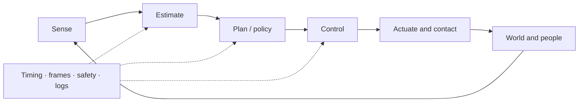
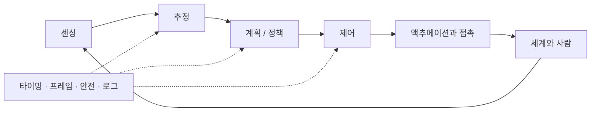

## English

Robotics is a closed physical system: sensing produces uncertain observations, estimation forms a belief, planning selects feasible behavior, control stabilizes execution, and contact and embodiment determine what the world actually permits.

### A. Geometry, mechanics & motion

- [[04-robotics/modern-robotics-book|1. Modern Robotics]] — book guide and scope
- [[04-robotics/modern-robotics/index|2. Modern Robotics Summary]] — chapters 2–6 and 8–13
- Chapter 7 (closed-chain kinematics) is intentionally optional: this track prioritizes open-chain manipulation, control, physical interaction, and field/mobile robotics literacy.
- On the manipulation-first path, follow ch.2–6 with [[02-foundations/manipulator-kinematics-dynamics|10. Manipulator Kinematics & Dynamics]] — the dynamics half those summaries stop short of, and the operational-space inertia that makes section E readable.

> [!tip] Learn with one running task · 하나의 과제로 배우기
> Use “move a tool to a panel and make controlled contact” as a running example. The arm is plant **P2** and the panel has stiffness of plant **P3**, both frozen in [[02-foundations/lab-plants|0.6 Lab Plants]]. Geometry expresses the target in the robot's frame. Forward kinematics predicts the tip from joint angles; inverse kinematics asks which joint angles can reach that target. The Jacobian relates small motions, and dynamics turns desired acceleration into torque. Estimation supplies the uncertain state; planning chooses a feasible route; feedback corrects motion; contact control determines the force–motion response at the panel.
>
> At each page, write what comes in, what goes out and one condition under which it fails, then do that page's **problem set**. After kinematics, explain why a reachable point may still require a different tool orientation. After estimation, distinguish a measurement from a state estimate. After control, explain why small tracking error does not guarantee a safe contact force. These checkpoints connect the pages into one system rather than a list of techniques.

### B. State, perception & belief

- [[04-robotics/state-estimation-slam|3. State Estimation, Localization & SLAM]] — state versus observation, Bayes/Kalman filtering, sensor fusion, factor graphs, drift and loop closure
- [[04-robotics/sensor-models|3.2 Sensor Models & Noise]] — the measurement model $z=h(x)+b+n$, noise density to per-sample σ, how integration turns bias and noise into drift, quantization, and reading an Allan-deviation plot (Tier A on **P6**)
- [[04-robotics/geometric-perception-calibration|3.5 Geometric Perception & Calibration]] — camera models, depth, point clouds, registration/ICP, intrinsic/extrinsic/hand–eye calibration, reprojection error
- Learned visual perception lives in [[03-deep-learning/index|Deep Learning]]; this page explains how sensor evidence becomes a time-indexed robot belief.

### C. Planning & decision-making

- [[04-robotics/planning-decision-making|4. Planning & Decision-Making]] — graph search, sampling, trajectory optimization, TAMP, uncertainty, replanning, and learned planning

### D. Feedback & control

Depth target: classical control solid; MPC to formulation and representative applications—enough to read modern robotics papers.

1. [[04-robotics/control-theory-ce397|5. Control Theory]] — state space, modes and eigenvalue stability, transfer functions and poles, controllability/observability, pole placement, PID, observers (self-contained; the CE397 packet is the deep dive)
2. [[04-robotics/system-identification|5.5 System Identification]] — fitting a model to data: least squares, persistent excitation, where the noise enters and the bias it leaves, validation, and back to continuous time (Tier A on **P4**, then **P2**'s inertial parameters)
3. [[04-robotics/lqr-lqg|6. LQR & LQG]] — optimal feedback and estimator–controller separation
4. [[04-robotics/mpc|7. Model Predictive Control]] — finite-horizon optimization, constraints and replanning
5. [[04-robotics/convex-mpc-legged|8. Convex MPC for Legged Robots]] — representative high-rate application

### E. Physical interaction

- [[04-robotics/contact-force-tactile|9. Contact, Force & Tactile Interaction]] — friction, contact modes, force/impedance/admittance control, tactile sensing, deformable materials

### F. Embodiment & deployment

- [[04-robotics/robot-systems-deployment|10. Robot Systems, Embodiment & Deployment]] — action interfaces, timing, frames, middleware, reliability, simulation, logging, and failure diagnosis
- [[04-robotics/actuators-drives|10.5 Actuators & Drives]] — the DC motor's two equations, torque constant and back-EMF, the torque–speed line, reflected inertia $n^2J_m$, current loop inside position loop, thermal versus peak torque, backdrivability (Tier A on **P2**)

### G. Humans & safety

- [[04-robotics/hri-safety|11. Human–Robot Interaction & Safety]] — autonomy levels, authority, intervention, human studies, hazard and risk literacy

### H. Manipulation specialization

Optional relative to the common track above — these belong to the manipulation-first path in [[07-research-program/index|7. Research Program]]. Read them after section E.

One survey is worth reading before all five, because it is the citation a manipulation thesis introduction is expected to engage with: **Billard & Kragic, "Trends and challenges in robot manipulation," *Science* 364(6446), eaat8414, 2019** — a field-level statement of what manipulation still cannot do, and the frame reviewers will place a new contribution inside. Its companion on the learning side is **Kroemer, Niekum & Konidaris, "A Review of Robot Learning for Manipulation," *JMLR* 22(30), pp. 1–82, 2021** — note the year: it circulates as a 2019 preprint and is often miscited that way.

- [[04-robotics/teleoperation-demonstration|12. Teleoperation & Demonstration Collection]] — bilateral architectures, transparency versus stability, why delay breaks passivity, interface tradeoffs, retargeting, and what makes demonstration data good
- [[04-robotics/force-compliance-control|13. Force & Compliance Control]] — impedance versus admittance and their implementation limits in stiff contact, hybrid position/force, operational-space control, and the contact-transition arithmetic that decides what a controller can do at all
- [[04-robotics/tactile-visuotactile|14. Tactile & Visuotactile Sensing]] — what each sensor family actually outputs, slip and contact-state estimation, what fusion buys, and why sensor latency makes touch a decision signal
- [[04-robotics/grasping|15. Grasping]] — friction cones, form versus force closure, the epsilon quality metric, and how the analytic theory became the label generator for learned grasping
- [[04-robotics/navigation-mobile-manipulation|16. Navigation & Mobile Manipulation]] — why the navigation goal is a manipulation-ready pose, reachability and capability maps, base placement, and the error budget that decides whether a tolerance can be met at all

### I. Unstructured-environment navigation

Also optional relative to the common track — this is the **navigation** pillar of
[[07-research-program/index|7. Research Program]], and the field it surveys moved a long way
between 2020 and 2026. Read after section B.

- [[04-robotics/traversability-off-road|17. Traversability & Off-Road Autonomy]] — traversability as a learned, robot-specific, velocity-conditioned affordance rather than a geometric predicate; where the supervision comes from; the adaptation-versus-generalization split; and what SubT and RACER established
- [[04-robotics/legged-locomotion|18. Legged Locomotion]] — privileged teacher-student distillation, and what each landmark result actually claimed as opposed to what it is cited for
- [[04-robotics/semantic-language-navigation|19. Semantic & Language-Driven Navigation]] — ObjectNav and VLN definitions and metrics, how continuous and graph-based formulations differ, language-queryable maps, and what happened to the benchmarks

### J. Human perception & intent

The perception layer that human-centered robotics actually runs on — and the one the
common track above does not cover. This is the **HRI/prediction** pillar of
[[07-research-program/index|7. Research Program]]. Read after section B; section G gives the
decision layer these pages feed.

- [[04-robotics/video-action-understanding|20. Video Representation & Action Understanding]] — recognition versus localization versus anticipation, scene bias and the single-frame baseline, backbone families and their temporal receptive field, and why one anticipation number hides the result
- [[04-robotics/human-pose-gaze|21. Human Pose, Hands & Gaze]] — the representation ladder from 2D keypoints to parametric bodies, what MPJPE means in millimetres, why head pose is substituted for gaze at range, and the motion cues that need no keypoints
- [[04-robotics/egocentric-perception|22. Egocentric & First-Person Perception]] — how the first-person viewpoint changes observability, the gaze → head → hand → contact cue cascade, where head motion stops proxying attention, and the gap from daily-life benchmarks to a helmet camera
- [[04-robotics/human-intent-prediction|23. Human Intent & Trajectory Prediction]] — intent versus trajectory, the usable horizon $\Delta^*$ against required lead time, calibration and conformal prediction as the decision interface, base rates, and the human-masked ablation

### K. Haptics & teleoperation specialization

Read after sections D–E and before designing a force-feedback interface or a haptic human study.

- [[04-robotics/haptics-teleoperation/index|24. Haptics & Teleoperation]] — human touch and psychophysics, tactile-display design, device kinematics and actuation, sampled virtual-contact stability, rendering algorithms, bilateral teleoperation, and experimental evidence

### L. Build track

Read alongside section F (10. Robot Systems), from the first page you want to run on a computer.

- [[04-robotics/ros2/index|25. ROS 2]] — the build track: middleware concepts, workspaces and launch, the failures that do not stop the program, robot description and TF, simulation and ros2_control, MoveIt 2, Nav2, debugging and reproducibility, and what changes on real hardware

### M. Capstone

Do this last, after the cumulative problem set below.

- [[04-robotics/capstone-panel-contact|26. Capstone: Tool to Panel, Controlled Contact]] — the running task end to end in one simulation: fuse the panel range, plan around the uncertainty-inflated C-obstacle, time the path at the joints and at the tip, track it, switch to impedance, press, and name the page whose limit each failing design violates

Note: page numbers are the recommended study order — Modern Robotics (1–2) → estimation (3, 3.2) → geometric perception (3.5) → planning (4) → control (5, 5.5, 6–8) → contact (9) → systems (10, 10.5) → humans & safety (11), then the specialization pages (12–16 manipulation, 17–19 navigation, 20–23 human perception & intent, 24 haptics & teleoperation, 25 the ROS 2 build track), and 26 the capstone.

### Session schedule · 학습 일정

One row is one 60–90-minute session of the common track, in the study order of the note above; [[02-foundations/overview|0. Overview]] sets that unit and keeps the pacing table these counts feed. A **bold** number marks a page's first pass — its object and worked case plus the sections its First-pass callout names — and the bold rows alone are the Literacy pass; all rows together are the Working pass. Sizing: every page opens with its object and worked case, done by hand; the numbered sections follow at about 1,500–2,500 words a session; a Tier A page adds a session for its lab and sweep; and the problem set with the self-check closes the page, sharing a session with the last sections when the page is short.

| # | Page and sections | Activity | Check that ends the session |
|---:|---|---|---|
| **1** | [[04-robotics/modern-robotics-book\|1]] all, and the hub [[04-robotics/modern-robotics/index\|2]] | first pass + problem set | One question of your own routed to its chapter by the worked case's rule; both Tier C sets match their Solutions (a $+x$ press gives $\tau=(-10,-10)$ N·m). |
| **2** | [[04-robotics/modern-robotics/ch02-configuration-space\|MR ch.2]] plant, diagram, worked case | first pass + worked case by hand | The C-obstacle shaded on the torus with the solution covered: $18.478\,\%$ of it blocked, and the contact set one-dimensional. |
| 3 | MR ch.2 §1–3, self-check, problem set | problem set | Solutions: the wall at $x=1.5$ pinches at $\theta_1=\pm60^\circ$ and blocks $8.515\,\%$; the dimension and the dof do not change. |
| **4** | [[04-robotics/modern-robotics/ch03-rigid-body-motions\|MR ch.3]] homework diagram, §1–4 | first pass + worked case by hand | $T_{sb}$ of the tip at the frozen pose written by hand, and why the space twist's $v_s$ is not the tip velocity (§4). |
| 5 | MR ch.3 self-check, problem set | problem set | Solutions: the elbow-axis twist $\omega_s=(0,0,1)$, $v_s=(0,-1,0)$, and SE(2) as the configuration group. |
| **6** | [[04-robotics/modern-robotics/ch04-forward-kinematics\|MR ch.4]] homework diagram, PoE, worked example, worked case | first pass + worked case by hand | PoE and geometry agree on the tip: $(1,1)$ at $\theta=(0^\circ,90^\circ)$ and $(-1,1)$ at $(90^\circ,90^\circ)$. |
| 7 | MR ch.4 self-check, problem set | problem set | Solutions: $\mathcal S_1=(0,0,1;0,0,0)$, $\mathcal S_2=(0,0,1;0,-1,0)$, $M$ at $p=(2,0,0)$. |
| **8** | [[04-robotics/modern-robotics/ch05-velocity-kinematics\|MR ch.5]] homework diagram, §1–2 | first pass + worked case by hand | $J=\begin{pmatrix}-1&-1\\1&0\end{pmatrix}$, $J^{-1}$ and $\dot\theta=(-0.25,\,0.25)$ rad/s for $v=(0,-0.25)$, with the solution covered. |
| 9 | MR ch.5 §3–4, self-check, problem set 1–2 | problem set | Solutions 1–2, including $\tau=J^\top(2,-5)=(-7,-2)$ N·m. |
| 10 | MR ch.5 problem set 3 | lab and sweep | Live $J$ ends near $(0.999,\,0.500)$ and frozen $J$ near $(0.878,\,0.521)$ at $T=0.01$; then only $T$ changed to $0.05$. |
| **11** | [[04-robotics/modern-robotics/ch06-inverse-kinematics\|MR ch.6]] homework diagram, worked case | first pass + worked case by hand | Near the singularity the undamped step moves $7.51$ rad and throws the tip; damping at $\lambda=0.3$ brings $\lVert e\rVert$ down to $0.506$. |
| 12 | MR ch.6 §1–4, self-check, problem set | problem set | Solutions: the branches $(0^\circ,90^\circ)$ and $(90^\circ,-90^\circ)$; their mean $(45^\circ,0^\circ)$ puts the tip at $(1.41,\,1.41)$, not on the target. |
| **13** | [[04-robotics/modern-robotics/ch08-dynamics\|MR ch.8]] plant, diagram, worked case | first pass + worked case by hand | At rest only $g$ survives: $\tau=g=(19.62,\,0)$ N·m, and forward dynamics returns $\ddot\theta=0$. |
| 14 | MR ch.8 §1–3, self-check, problem set | problem set | Solutions: straight pose $M=\begin{pmatrix}5&2\\2&1\end{pmatrix}$, $\det M=1$, eigenvalues $5.8284$ and $0.1716$. |
| **15** | [[04-robotics/modern-robotics/ch09-trajectory-generation\|MR ch.9]] plant, diagram, worked case | first pass + worked case by hand | The cubic's crossover $\Delta\theta^\dagger=0.853$ rad, and why both moves on the page are velocity-bound. |
| 16 | MR ch.9 §1–3, self-check, problem set | problem set | Solutions: the re-geared move is a triangle, $5.013$ s against $4.327$ s ($+15.9\,\%$). |
| **17** | [[04-robotics/modern-robotics/ch10-motion-planning\|MR ch.10]] plant, diagram, worked case | first pass + worked case by hand | The roadmap returns $A\to E\to B$ at $\pi\sqrt2=4.4429$ rad, $26.5\,\%$ over the blocked direct edge. |
| 18 | MR ch.10 §1–3, self-check, problem set | problem set | Solutions: with the wall at $1.5$ the direct edge clears by $8.6$ cm; $9$ blocked nodes against $12.3$ cells of true area. |
| **19** | [[04-robotics/modern-robotics/ch11-robot-control\|MR ch.11]] plant, diagram, worked case | first pass + worked case by hand | Computed torque against PD at the catalog pose; $F=\Lambda a=(1,\,2)$ N and $\tau=(1,\,-1)$ N·m for $a=(1,1)$. |
| 20 | MR ch.11 §1–3, self-check, problem set | problem set | Solutions: computed torque $\tau=(29.62,\,10)$ N·m gives $\ddot\theta=(0,\,10)$; PD gives the coupled $(-5,\,15)$. |
| **21** | [[04-robotics/modern-robotics/ch12-grasping\|MR ch.12]] plant, diagram, worked case | first pass + worked case by hand | Force closure for every $\mu>0$, yet $f_n^{\min}=W/(2\mu)=49.05$ N at $\mu=0.05$: directions against magnitudes. |
| 22 | MR ch.12 §1–3, self-check, problem set | problem set | Solutions: $\alpha=11.310^\circ$, $\lambda=(1,1,1,1)$, rank 3 — neither knob changes the verdict. |
| **23** | [[04-robotics/modern-robotics/ch13-wheeled-mobile-robots\|MR ch.13]] plant, diagram, worked case | first pass + worked case by hand | $35$ mm of staleness inside P6's $70$ ms budget, and a one-tick velocity quantum of $0.0977$ m/s. |
| 24 | MR ch.13 §1–3, self-check, problem set | problem set | Solutions: $643.398$ counts per wheel for the quarter turn; the heading error is $32$–$48$ times smaller than slip's $2.70^\circ$. |
| **25** | [[04-robotics/state-estimation-slam\|3]] object, diagram, worked case | first pass + worked case by hand | Predict $10.6$ cm and $P^-=1.8$, then $S=2.8$, $K=0.6429$ and the gate, redone covered; the Joseph form returns the same $P^+=0.6429$. |
| **26** | 3 §1–4, §6 | first pass | §6's scalar update redone by hand to $11.6$ cm and $0.8\,\mathrm{cm}^2$; the four quantities of §2 kept apart in one sentence each. |
| 27 | 3 §5 | first pass | For an estimator named in a paper, its family in §5 and the Kalman assumption that family gives up. |
| 28 | 3 §7–8 | first pass | What odometry drifts in, and what one loop closure corrects (§7). |
| 29 | 3 §8.5, §9 | first pass | §8.5's two-track example by hand: GNN's $4.25$ against greedy's $8.25$, and JPDA's $0.119:0.881$. |
| 30 | 3 problem set 3 | lab and sweep | (a) prints $(10.536,\,0.643,\,\text{True})$ and (b) $(10.6,\,1.8,\,\text{False})$; the $q=Q/R$ sweep table filled. |
| 31 | 3 problem set 1–2, self-check | problem set | Gate half-widths $5.02$ and $5.85$ cm; a rejected reading leaves the belief at $(10.6,\,1.8)$ — no update, not a zero-gain one. |
| **32** | [[04-robotics/sensor-models\|3.2]] object, diagram, worked case | first pass + worked case by hand | The three measurement variances: $1.99\times10^{-8}$ (encoder), $6.94\times10^{-7}$ (camera), $10^{-4}\,\mathrm{m^2}$ (range). |
| **33** | 3.2 §1–3 | first pass | A noise density turned into a per-sample σ at two rates (§2); for each error term, what one integration makes of it (§3). |
| **34** | 3.2 §7 | lab and sweep | The listing's drift laws: $0.583$ against $0.577$ mm and $0.221$ against $0.219$ mm at 1 s; $N$ and $B$ read back off the Allan plot. |
| 35 | 3.2 §4–6, §8 | first pass | Three numbers read off one Allan-deviation plot (§6), and where each goes in $Q$ or $R$ (§8). |
| 36 | 3.2 self-check, problem set | problem set + lab and sweep | Solutions 1–2 ($\Delta=0.244$ mm, $\sigma_q=0.0705$ mm at 4096 counts/m); problem 3's record-length sweep printed. |
| **37** | [[04-robotics/geometric-perception-calibration\|3.5]] object, diagram, worked case | first pass + worked case by hand | RMS reprojection $0.370$ px, yet $1.67$ mm of error at $X=0.5$ m and $10.0$ mm at $3$ m — a statement about the fit, not about the metre. |
| **38** | 3.5 §1, §5, §7 | first pass | A table point projected to a pixel with the full pinhole model (§1); which calibration a sub-pixel residual does not certify (§5). |
| 39 | 3.5 §2, §2.5, §2.6 | first pass | Depth from disparity $Z=fb/d$ and its $\pm1$ px error (§2); §2.5's listing run; one triangulation by hand (§2.6). |
| 40 | 3.5 §3–4, §6, §7.5 | first pass | One ICP iteration — correspondences, then the best rigid fit (§4); what visual servoing closes its loop on (§7.5). |
| 41 | 3.5 self-check, problem set | problem set | Solutions: $u_1=395$, $d'=18$ px, $Z=4.0$ m; the $4$ cm sits in $X$ of $AX=XB$, which a $0.37$ px residual cannot certify. |
| **42** | [[04-robotics/planning-decision-making\|4]] homework diagram, §1, §3–4 and the worked case | first pass + worked case by hand | Both IK branches cost $\pi/2$ under the max-norm, a $1.571$ s tie at 1 rad/s; joint-Euclidean prefers A by $\sqrt2$. |
| **43** | 4 §2 | first pass | The five spaces of §2 named for P2 at the panel, and the panel's C-obstacle written as a set in $\mathcal C$. |
| 44 | 4 §5, §5.5 | first pass | §5.5's listing run; for a planner named in a paper, its family and what that family cannot promise. |
| 45 | 4 §6–7 | first pass | What replanning under uncertainty adds to a trajectory optimizer, in two sentences. |
| 46 | 4 §8–9, self-check, problem set | problem set | Solutions: $x(s)=1$ only at $s=1$, so the open segment is free; search knows nothing of $k_w$, $\mu$ or $F_n$. |
| **47** | [[04-robotics/control-theory-ce397\|5]] homework diagram, §1–3 | first pass + worked case by hand | §1's heater: open loop sits at $1+d=1.5$; $u=-9x$ leaves $d/(1+K)=0.05$, ten times smaller. |
| **48** | 5 §4, §10 | first pass | Stable, asymptotically stable and Hurwitz told apart; §4's P4-under-Euler bound redone; §10's questions put to one control claim. |
| 49 | 5 §5, §5.5 | first pass | The three margins of §5.5's worked loop, and why sensitivity and complementary sensitivity cannot both be small at one frequency. |
| 50 | 5 §6–9 | first pass | Controllability and observability of a two-state example by rank (§6); one pole-placement gain by hand (§7). |
| 51 | 5 self-check, problem set | lab and sweep + problem set | The four runs of problem 3: A to $1$, B to $0$, C to $0.2$, D diverging at $T=0.1$; pole $-(1+K)$ and $K<19$ at $T=0.1$. |
| **52** | [[04-robotics/system-identification\|5.5]] object, diagram, worked case | first pass + worked case by hand | Exact $a=0.904837$, $b=0.095163$; the five-reading estimate turned back into $\tau$, whose one-sd band is $0.853$–$1.116$ s. |
| **53** | 5.5 §1–4 | first pass | Least squares on the regression by hand (§3); when $\Phi^\top\Phi$ is singular, and why the input decides it (§4). |
| **54** | 5.5 §8 | lab and sweep | The three-input lab run: the step fails to excite and its covariance shows how; only the held-out error tells the inputs apart. |
| 55 | 5.5 §5–7 | first pass | The bias equation error leaves and output error does not (§5); a held-out simulation check (§6); $\tau$ back from $a$ (§7). |
| 56 | 5.5 §9–10, self-check | first pass | P2's inertial parameters written as one linear regression (§9); §10's questions put to one identification claim. |
| 57 | 5.5 problem set | problem set + lab and sweep | Solutions: $a=0.818731$, $b=0.181269$ at $T=0.2$ s; problem 3's closed-loop record prints rank $1$ at $r=0$. |
| **58** | [[04-robotics/lqr-lqg\|6]] homework diagram, §1–2 | first pass | The Riccati equation read term by term (§1); §2's two conditions named, and what each one buys. |
| **59** | 6 §3–4, self-check, problem set | worked case by hand + problem set | Solutions: $P=K=\sqrt2-1=0.414$, pole $-1.414$, $x_{ss}=0.707$; at $K=4$, $-5$ and $0.2$. |
| **60** | [[04-robotics/mpc\|7]] homework diagram, §1, §3–4 | first pass | When the QP is convex (§1); two of §3's failure modes found in a paper's MPC section. |
| 61 | 7 §2, self-check, problem set | problem set | Solutions: $u=-99$ is illegal under $\lvert u\rvert\le1$, so the steady state lands in $[0,2]$ — MPC exists because of the constraint. |
| **62** | [[04-robotics/convex-mpc-legged\|8]] object, diagram and the five modelling moves | first pass | The paper's QP sized: $120$ decision variables and $160$ pyramid inequalities at $N=10$; the approximation behind each move named. |
| 63 | 8 worked on Q, steps 1–7 | worked case by hand | $\alpha=1.5\times10^{-4}$, $e_0/\alpha=-200$ N, and the $2\times2$ normal equations solved at $\lambda=1$ with the solution covered. |
| 64 | 8 steps 8–10, self-check, problem set | lab and sweep + problem set | Solutions: starting $5$ cm high gives $e_0/\alpha=333.3$ N and $f_z^{\mathrm{tot}}=-10.49$ N, so the unilateral row binds; the sweep table filled. |
| **65** | [[04-robotics/contact-force-tactile\|9]] object, diagram, worked case | first pass + worked case by hand | From gap to grip: $f_n=2.08$ N while closing; the wipe's margin exactly zero and the grip's $1.9\,\%$, both on the same assumed $\mu$. |
| **66** | 9 §1, §5–6 | first pass | Position, force, impedance and admittance told apart by what each commands and what each measures (§5), then placed in §6's wall-wiping task. |
| 67 | 9 §2–4 | first pass | A friction cone's half-angle and the largest sticking tangential force by hand (§2); form against force closure on one grasp (§4). |
| 68 | 9 §7–9, self-check, problem set | problem set | Solutions: $f_n=3.20$ N at $8$ mm; $\mu=0.35$ allows $1.12$ N, so the $1$ N wipe holds and the panel drops instead. |
| **69** | [[04-robotics/robot-systems-deployment\|10]] homework diagram, §1–3, §10 | first pass | The $70$ ms observation-to-action budget rebuilt from its four parts (§3); one field failure placed in §10's taxonomy. |
| 70 | 10 §4–6 | first pass | A TF tree for the panel cell with each transform's direction named (§4); one task's preconditions, timeout and recovery written (§6). |
| 71 | 10 §6.5–9, §11 | first pass | §6.5's listing run; §9's staged-deployment ladder applied to the panel task. |
| 72 | 10 self-check, problem set | lab and sweep + problem set | The template prints $0.488$, $0.130$, $40$, $20$, $40.96$: a $200$ ms-old frame is $130$ ms over budget and $40$ control ticks stale. |
| **73** | [[04-robotics/actuators-drives\|10.5]] object, diagram, worked case | first pass + worked case by hand | One joint torque turned into amps, volts, watts and kelvin; $J_{eq}=n^2J_m+M_{11}/\eta=4.75\,\mathrm{kg\,m^2}$. |
| **74** | 10.5 §1–3 | first pass | The two motor equations (§1), and one drive's torque–speed line drawn with both ends (§3). |
| **75** | 10.5 §4–7 | first pass | Reflected inertia $n^2J_m$ set against the link's (§4); the continuous torque heat allows (§6). |
| 76 | 10.5 §8, problem set 3 | lab and sweep | The seven-ratio sweep rerun at $V_s=48$ V; which rows change, and why the rows $n=30$ to $150$ do not. |
| 77 | 10.5 §9, self-check, problem set 1–2 | problem set | Solutions: the $n=200$ drive's $160$ N·m current limit; at the worst gravity pose $i=2.742$ A and $\Delta T=75.2$ K, held indefinitely. |
| **78** | [[04-robotics/hri-safety\|11]] object, diagram, worked case | first pass + worked case by hand | $S_p=1.24$ m term by term, with $S_h$ over half of it; stopping the robot dead still leaves $0.99$ m. |
| **79** | 11 §1–3, §6, §10 | first pass | The two spectra of §1–2 kept apart; §6's safety vocabulary used correctly in §10's worked interpretation. |
| 80 | 11 §3.5, §4–5, §7–9 | first pass | Goal inference and the QMDP action of §3.5 explained on two candidate goals; one design flaw of §7 named in a human study. |
| 81 | 11 self-check, problem set | problem set | Solutions: $S_p=1.36$ m and the field at $3.61$ m — speed scaling cannot buy the latency back. |
| 82 | The cumulative problem set below | problem set | All of problem 2 matches: $(-0.05,\,0.05)$, $(9.62,\,0)$, $1600$ N/m, $11.6$ cm. |
| **83** | [[04-robotics/capstone-panel-contact\|26]] object, diagram, worked case | first pass + worked case by hand | The report: first contact at $6.684$ s, peak $9.84$ N inside the $11$ N limit — and the $\pm5.96$ N band that limit sits in. |
| **84** | 26 §5–6 | first pass + lab and sweep | The whole-loop lab run; each of §5's four checks traced to the page that owns it. |
| 85 | 26 §1–4, §7 | first pass | The inflated C-obstacle (§2) and the tip-speed cap (§3) derived at the catalog numbers; one thing §7 says the simulation cannot certify. |
| 86 | 26 self-check, problem set | problem set + lab and sweep | Solutions: fused $8.4$ cm and the planner's face at $1.0572$ m; the sweep table's $t_c$, $F_{\text{pk}}$ and verdicts filled. |

**Totals.** 86 sessions for the Working pass, 40 of them bold. A Literacy pass is the bold rows, or one session a page — 26 — when only each object and worked case are read. Plan on up to a fifth more for problems redone and labs debugged.

The specializations branch from the common track rather than add to it. At the same sizing — about 1,600 words a session across the table above — each group runs from one session a page for a first pass to its Working pass:

- **H. Manipulation (12–16):** 5–28 sessions over five Tier B pages.
- **I. Unstructured-environment navigation (17–19):** 3–13 sessions over three Tier B pages.
- **J. Human perception & intent (20–23):** 4–15 sessions over four Tier B pages.
- **K. Haptics & teleoperation (24):** 8–19 sessions over the hub and its seven sub-pages, one of them a Tier A lab.
- **L. Build track (25):** 12–44 sessions over the hub and its eleven sub-pages, before the build time a real workspace adds.

### Where this track leads

These components converge in VLA, world-model, and learning-based-control systems, then meet field constraints in [[05-construction-robotics/index|Construction Robotics]]. Use [[06-research-practice/index|Research Practice]] to design and evaluate new work rather than only read it, and [[07-research-program/index|Research Program]] to decide which of these pages your own work actually needs at depth.

### Cumulative problem set · 누적 과제

One running task, plants **P2** and **P3** from [[02-foundations/lab-plants|0.6]]. Do this after A–E, not instead of the per-page sets. No new simulator.

1. **Draw.** P2 at $\theta=(0^\circ,90^\circ)$ with the tool at $(1,1)$, a panel at $y=0.95$ whose stiffness is P3's $k_w$ (the forearm passes in front of the panel, out of the drawing plane, so only the tool at the tip can reach it). Arrow the Jacobian columns, the $-y$ contact force, and the 70 ms clock of **P6** if a camera is in the loop.
2. **Derive.** (a) Joint rates for $v=(0,-0.05)$ from [[04-robotics/modern-robotics/ch05-velocity-kinematics|MR ch.5]]. (b) Holding torque for $F_\text{cmd}=(0,-10)$ including gravity, from [[02-foundations/manipulator-kinematics-dynamics|10]]. (c) If the panel is a virtual wall rendered on a P3-scale handle, the $K\le 2b/T$ bound at $T=10^{-3}$ from [[04-robotics/haptics-teleoperation/rendering-sampling-stability|24.4]]. (d) A range to the panel of 12 cm with P5's prior — fused distance from [[02-foundations/probability|3]].
3. **Interpret.** Small tracking error in $y$ does not make the 10 N safe: name the missing term ($\Lambda$, inner-loop causality, or late vision — pick the one this pose actually changes). What page did you just use?

> [!tip]- Solutions
> 1. Elbow $(1,0)$, tip $(1,1)$, wall $5\,\mathrm{cm}$ below the tip in $y$ ($1-0.95$). Columns $(-1,1)$ and $(-1,0)$.
> 2. (a) $\dot\theta=J^{-1}(0,-0.05)=(-0.05,0.05)$. (b) $\tau=g+J^\top F_\text{cmd}=(19.62,0)+(-10,0)=(9.62,0)$. (c) $2b/T=1600\,\mathrm{N/m}$; catalog $k_w=400$ passes. (d) $11.6\,\mathrm{cm}$.
> 3. At this pose $\Lambda_y=2\,\mathrm{kg}$, so the same 10 N is not the same acceleration as in $x$ ($\Lambda_x=1$). A stiff position inner loop is the other usual lie ([[04-robotics/force-compliance-control|13]]). Late vision is P6, a different failure.

The same numbers, assembled into one loop and simulated with a sweep: [[04-robotics/capstone-panel-contact|26. Capstone]].

## 한국어

로보틱스는 닫힌 물리 시스템이다: 센싱은 불확실한 관측을 만들고, 추정은 belief를 형성하고,
계획은 실행 가능한 행동을 고르고, 제어는 실행을 안정화한다. 접촉과 embodiment는 세계가
실제로 허용하는 것을 결정하고, 타이밍·프레임·안전·로깅이 전체를 연결한다.

### A. 기하·역학·운동

- [[04-robotics/modern-robotics-book|1. Modern Robotics]] — 책 가이드와 범위
- [[04-robotics/modern-robotics/index|2. Modern Robotics Summary]] — 2–6장, 8–13장
- 7장(폐쇄 사슬 기구학)은 의도적으로 선택 사항이다: 이 트랙은 개연쇄 매니퓰레이션, 제어, 물리 상호작용, 현장/모바일 로보틱스 문해력을 우선한다.
- 매니퓰레이션 우선 경로에서는 2~6장 다음에 [[02-foundations/manipulator-kinematics-dynamics|10. 매니퓰레이터 기구학·동역학]]을 읽는다 — 그 요약들이 못 미치고 멈춘 동역학 절반, 그리고 E절을 읽을 수 있게 만드는 작업 공간 관성.

> [!tip] 하나의 과제로 배우기 · Learn with one running task
> “도구를 패널까지 옮겨 힘을 조절하며 접촉한다”를 계속 같은 예로 쓴다. 팔은 장치 **P2**, 패널 강성은 장치 **P3**이며 둘 다 [[02-foundations/lab-plants|0.6 Lab Plants]]에 고정되어 있다. 기하는 목표를 로봇 프레임으로 표현한다. 순기구학은 관절각에서 도구 끝을 예측하고, 역기구학은 목표에 도달할 관절각을 묻는다. 자코비안은 작은 운동을 연결하고 동역학은 원하는 가속도를 토크로 바꾼다. 추정은 불확실한 상태를 주고, 계획은 가능한 경로를 고르고, 피드백은 운동을 보정하며, 접촉 제어는 패널에서의 힘–운동 반응을 정한다.
>
> 각 페이지에서 입력·출력과 실패 조건 하나를 적는다. 기구학 뒤에는 도달 가능한 점이라도 도구 방향을 따로 확인해야 하는 이유를 설명한다. 추정 뒤에는 측정값과 상태 추정값을 나눈다. 제어 뒤에는 작은 추종 오차가 접촉력의 안전을 보장하지 않는 이유를 설명한다. 이 확인점들이 기법 목록을 하나의 시스템으로 연결한다.

### B. 상태·인지·belief

- [[04-robotics/state-estimation-slam|3. State Estimation, Localization & SLAM]] — 상태 vs 관측, 베이즈/칼만 필터링, 센서 융합, factor graph, drift와 loop closure
- [[04-robotics/sensor-models|3.2 Sensor Models & Noise]] — 측정 모델 $z=h(x)+b+n$, 잡음 밀도에서 샘플당 σ로, 적분이 바이어스와 잡음을 drift로 바꾸는 방식, 양자화, 앨런 편차 그림 읽기(**P6** 위의 Tier A)
- [[04-robotics/geometric-perception-calibration|3.5 Geometric Perception & Calibration]] — 카메라 모델, 깊이, 포인트 클라우드, registration/ICP, intrinsic/extrinsic/hand–eye 보정, reprojection error
- 학습된 시각 인식은 [[03-deep-learning/index|딥러닝]]에 있다; 이 페이지는 센서 증거가 시간 인덱스된 로봇 belief가 되는 과정을 설명한다.

### C. 계획·의사결정

- [[04-robotics/planning-decision-making|4. Planning & Decision-Making]] — 그래프 탐색, 샘플링, 궤적 최적화, TAMP, 불확실성, replanning, 학습 기반 계획

### D. Feedback·제어

깊이 목표: 고전 제어는 탄탄히, MPC는 정식화와 대표 응용까지 — 현대 로보틱스 논문을 읽기에 충분하게.

1. [[04-robotics/control-theory-ce397|5. Control Theory]] — 상태공간, 모드와 고유값 안정성, 전달함수와 극점, 가제어성/가관측성, 극점 배치, PID, 관측기 (자체 완결; CE397 패킷은 심화)
2. [[04-robotics/system-identification|5.5 System Identification]] — 데이터에 모델 맞추기: 최소제곱, 지속적 여기, 잡음이 들어오는 곳과 그것이 남기는 편향, 검증, 연속 시간으로 되돌리기(**P4** 위의 Tier A, 그다음 **P2**의 관성 파라미터)
3. [[04-robotics/lqr-lqg|6. LQR & LQG]] — 최적 피드백과 추정기–제어기 분리
4. [[04-robotics/mpc|7. Model Predictive Control]] — 유한 지평 최적화, 제약, replanning
5. [[04-robotics/convex-mpc-legged|8. Convex MPC for Legged Robots]] — 대표적 고주기 응용

### E. 물리 상호작용

- [[04-robotics/contact-force-tactile|9. Contact, Force & Tactile Interaction]] — 마찰, 접촉 모드, 힘/임피던스/어드미턴스 제어, 촉각 센싱, 유연 재료

### F. Embodiment·배포

- [[04-robotics/robot-systems-deployment|10. Robot Systems, Embodiment & Deployment]] — 행동 인터페이스, 타이밍, 프레임, 미들웨어, 신뢰성, 시뮬레이션, 로깅, 실패 진단
- [[04-robotics/actuators-drives|10.5 Actuators & Drives]] — DC 모터의 두 방정식, 토크 상수와 역기전력, 토크–속도 선, 반사 관성 $n^2J_m$, 위치 루프 안의 전류 루프, 열 한계 대 최대 토크, 역구동성(**P2** 위의 Tier A)

### G. 사람·안전

- [[04-robotics/hri-safety|11. Human–Robot Interaction & Safety]] — 자율성 수준, 권한, 개입, 인간 대상 연구, hazard·risk 문해력

### H. 매니퓰레이션 전문화

위의 공통 트랙에 대해 선택 사항이다 — [[07-research-program/index|7. 연구 프로그램]]의 매니퓰레이션 우선 경로에 속한다. E절 다음에 읽는다.

다섯 편보다 먼저 읽을 서베이가 하나 있다. 매니퓰레이션 논문 서론이 상대해야 하는 인용이기 때문이다: **Billard & Kragic, "Trends and challenges in robot manipulation," *Science* 364(6446), eaat8414, 2019** — 매니퓰레이션이 아직 하지 못하는 것에 대한 분야 수준의 진술이고, 리뷰어가 새 기여를 놓고 볼 프레임이다. 학습 쪽 짝은 **Kroemer, Niekum & Konidaris, "A Review of Robot Learning for Manipulation," *JMLR* 22(30), pp. 1–82, 2021**이다 — 연도에 주의하라. 2019년 프리프린트로 유통되어 그렇게 잘못 인용되는 일이 잦다.

- [[04-robotics/teleoperation-demonstration|12. 원격조작과 시연 수집]] — 양방향 아키텍처, 투명성 대 안정성, 지연이 수동성을 깨는 이유, 인터페이스 절충, 리타게팅, 그리고 좋은 시연 데이터의 조건
- [[04-robotics/force-compliance-control|13. 힘·컴플라이언스 제어]] — 임피던스 대 어드미턴스와 단단한 접촉에서의 구현 한계, 하이브리드 위치/힘, 작업 공간 제어, 그리고 제어기가 무엇을 할 수 있는지를 결정하는 접촉 천이의 산수
- [[04-robotics/tactile-visuotactile|14. 촉각·시촉각 센싱]] — 각 센서 계열이 실제로 출력하는 것, 미끄러짐과 접촉 상태 추정, 융합이 사는 것, 그리고 센서 지연이 촉각을 결정 신호로 만드는 이유
- [[04-robotics/grasping|15. 파지]] — 마찰 원뿔, form 대 force closure, 엡실론 품질 지표, 그리고 해석 이론이 학습 파지의 라벨 생성기가 된 경위
- [[04-robotics/navigation-mobile-manipulation|16. 내비게이션과 모바일 조작]] — 내비게이션 목표가 왜 조작 가능한 자세인가, 도달성·능력 지도, base placement, 그리고 공차 충족 가능성을 결정하는 오차 예산

### I. 비정형 환경 내비게이션

이것도 공통 트랙에 대해 선택 사항이다 — [[07-research-program/index|7. 연구 프로그램]]의
**내비게이션** 기둥이며, 이 페이지들이 다루는 분야는 2020년과 2026년 사이에 크게 움직였다.
B절 다음에 읽는다.

- [[04-robotics/traversability-off-road|17. Traversability와 오프로드 자율성]] — 기하학적 술어가 아니라 로봇마다 다르고 속도에 조건부인 학습된 어포던스로서의 traversability, 지도 신호의 출처, 적응 대 일반화의 분기, 그리고 SubT와 RACER가 확립한 것
- [[04-robotics/legged-locomotion|18. 레그드 로코모션]] — privileged teacher-student 증류, 그리고 각 대표 결과가 인용되는 바가 아니라 실제로 주장한 것
- [[04-robotics/semantic-language-navigation|19. 의미·언어 기반 내비게이션]] — ObjectNav과 VLN의 정의와 지표, 연속·그래프 기반 정식화의 차이, 언어로 질의하는 지도, 그리고 벤치마크에 무슨 일이 있었는가

### J. 사람 인지와 의도

인간 중심 로보틱스가 실제로 그 위에서 돌아가는 인지 계층 — 그리고 위 공통 트랙이 다루지
않는 계층. [[07-research-program/index|7. Research Program]]의 **HRI·예측** 기둥이다.
B절 다음에 읽는다; 이 페이지들이 먹이는 결정 계층은 G절에 있다.

- [[04-robotics/video-action-understanding|20. Video Representation & Action Understanding]] — 인식 vs 위치추정 vs 예측, 장면 편향과 단일 프레임 베이스라인, 백본 계보와 시간 수용 영역, 그리고 anticipation 숫자 하나가 결과를 가리는 방식
- [[04-robotics/human-pose-gaze|21. Human Pose, Hands & Gaze]] — 2D 키포인트에서 파라메트릭 신체까지의 표현 사다리, MPJPE의 mm 단위 의미, 원거리에서 머리 자세가 시선을 대체하는 이유, 키포인트가 필요 없는 움직임 단서
- [[04-robotics/egocentric-perception|22. Egocentric & First-Person Perception]] — 1인칭 시점이 관측 가능성을 바꾸는 방식, 시선 → 머리 → 손 → 접촉 단서 사슬, 머리 움직임이 주의 대용이기를 멈추는 지점, 일상 벤치마크에서 헬멧 카메라까지의 격차
- [[04-robotics/human-intent-prediction|23. Human Intent & Trajectory Prediction]] — 의도 vs 궤적, 필요 선행 시간 대비 가용 지평 $\Delta^*$, 결정 인터페이스로서의 보정과 conformal prediction, 기저율, 사람 마스킹 ablation

### K. 햅틱·원격조작 전문화

D–E절 다음에 읽으며, 힘 반향 인터페이스나 햅틱 인간 대상 연구를 설계하기 전에 필요한 전문 트랙이다.

- [[04-robotics/haptics-teleoperation/index|24. Haptics & Teleoperation]] — 인간 촉각과 심리물리, 촉각 디스플레이 설계, 장치 기구학·구동, 샘플링된 가상 접촉의 안정성, 렌더링 알고리즘, 양방향 원격조작, 실험 증거

### L. 만드는 트랙

F절(10. 로봇 시스템)과 나란히, 컴퓨터에서 무언가를 돌려 보고 싶어지는 첫 페이지부터 읽는다.

- [[04-robotics/ros2/index|25. ROS 2]] — 만드는 트랙: 미들웨어 개념, 워크스페이스와 런치, 프로그램을 멈추지 않는 실패들, 로봇 기술과 TF, 시뮬레이션과 ros2_control, MoveIt 2, Nav2, 디버깅과 재현성, 그리고 실물 하드웨어에서 달라지는 것

### M. 캡스톤

맨 마지막에, 아래 누적 과제 다음에 한다.

- [[04-robotics/capstone-panel-contact|26. Capstone: Tool to Panel, Controlled Contact]] — 관통 과제를 시뮬레이션 하나로 끝까지: 패널 거리를 융합하고, 불확실성으로 부풀린 C-장애물을 피해 계획하고, 관절과 말단에서 경로 시간을 정하고, 추종하고, 임피던스로 전환해 누르고, 실패하는 설계마다 어느 페이지의 한계를 어겼는지 댄다

참고: 페이지 번호는 권장 학습 순서다 — Modern Robotics(1–2) → 추정(3, 3.2) → 기하 인식(3.5) → 계획(4) → 제어(5, 5.5, 6–8) →
접촉(9) → 시스템(10, 10.5) → 사람·안전(11), 그다음 전문화 페이지들(12–16 매니퓰레이션, 17–19 내비게이션, 20–23 사람 인지·의도, 24 햅틱·원격조작, 25 ROS 2 만드는 트랙), 그리고 26 캡스톤.

### 학습 일정 · Session schedule

한 행이 공통 트랙의 60–90분 학습 회차 하나이고, 순서는 위 참고의 학습 순서를 따른다. 그 단위와, 이 회차 수가 들어가는 페이스 표는 [[02-foundations/overview|0. Overview]]에 있다. **굵은** 번호는 페이지의 첫 읽기 — 대상과 끝까지 계산, 그리고 처음이라면 콜아웃이 지목한 절 — 를 표시한다. 굵은 행만 하면 Literacy 통과이고, 모든 행을 하면 Working 통과다. 분량 산정: 각 페이지는 대상과 끝까지 계산을 손으로 하는 회차로 연다. 번호 붙은 절은 회차당 영어 약 1,500–2,500단어씩 이어지고, Tier A 페이지는 실습과 스윕 회차를 하나 더 둔다. 과제와 스스로 점검이 페이지를 닫으며, 짧은 페이지에서는 마지막 절과 한 회차를 나눈다.

| # | 페이지와 절 | 활동 | 회차를 끝내는 확인 |
|---:|---|---|---|
| **1** | [[04-robotics/modern-robotics-book\|1]] 전체와 허브 [[04-robotics/modern-robotics/index\|2]] | 첫 읽기 + 과제 | 자기 질문 하나를 계산 예제의 규칙으로 해당 장에 배분한다. 두 페이지의 Tier C 과제가 정답과 맞는다($+x$ 누름이면 $\tau=(-10,-10)$ N·m). |
| **2** | [[04-robotics/modern-robotics/ch02-configuration-space\|MR 2장]] 장치·과제 그림·끝까지 계산 | 첫 읽기 + 손 계산 | 풀이를 가리고 토러스에 C-장애물을 칠한다. $18.478\,\%$가 막히고, 접촉 집합은 1차원이다. |
| 3 | MR 2장 §1–3, 스스로 점검, 과제 | 과제 | 정답: $x=1.5$의 벽은 $\theta_1=\pm60^\circ$에서 좁아지고 $8.515\,\%$를 막는다. 차원과 자유도는 그대로다. |
| **4** | [[04-robotics/modern-robotics/ch03-rigid-body-motions\|MR 3장]] 과제 그림, §1–4 | 첫 읽기 + 손 계산 | 고정 자세에서 말단의 $T_{sb}$를 손으로 쓰고, 공간 twist의 $v_s$가 말단 속도가 아닌 이유를 말한다(§4). |
| 5 | MR 3장 스스로 점검, 과제 | 과제 | 정답: 팔꿈치 축 twist $\omega_s=(0,0,1)$, $v_s=(0,-1,0)$, 그리고 형상 군은 SE(2)다. |
| **6** | [[04-robotics/modern-robotics/ch04-forward-kinematics\|MR 4장]] 과제 그림, PoE, 2R 계산 예제, 끝까지 계산 | 첫 읽기 + 손 계산 | PoE와 기하가 말단에서 일치한다: $\theta=(0^\circ,90^\circ)$에서 $(1,1)$, $(90^\circ,90^\circ)$에서 $(-1,1)$. |
| 7 | MR 4장 스스로 점검, 과제 | 과제 | 정답: $\mathcal S_1=(0,0,1;0,0,0)$, $\mathcal S_2=(0,0,1;0,-1,0)$, $M$의 $p=(2,0,0)$. |
| **8** | [[04-robotics/modern-robotics/ch05-velocity-kinematics\|MR 5장]] 과제 그림, §1–2 | 첫 읽기 + 손 계산 | 풀이를 가리고 $J=\begin{pmatrix}-1&-1\\1&0\end{pmatrix}$, $J^{-1}$, $v=(0,-0.25)$의 $\dot\theta=(-0.25,\,0.25)$ rad/s를 구한다. |
| 9 | MR 5장 §3–4, 스스로 점검, 과제 1–2 | 과제 | 정답 1–2, $\tau=J^\top(2,-5)=(-7,-2)$ N·m 포함. |
| 10 | MR 5장 과제 3 | 실습과 스윕 | $T=0.01$에서 매 스텝 $J$는 $(0.999,\,0.500)$ 근처, 고정 $J$는 $(0.878,\,0.521)$ 근처에서 끝난다. 그다음 $T$만 $0.05$로 바꾼다. |
| **11** | [[04-robotics/modern-robotics/ch06-inverse-kinematics\|MR 6장]] 과제 그림, 끝까지 계산 | 첫 읽기 + 손 계산 | 특이점 근처에서 감쇠 없는 스텝은 $7.51$ rad를 움직여 말단을 내던지고, $\lambda=0.3$의 감쇠는 $\lVert e\rVert$를 $0.506$으로 줄인다. |
| 12 | MR 6장 §1–4, 스스로 점검, 과제 | 과제 | 정답: 가지 $(0^\circ,90^\circ)$와 $(90^\circ,-90^\circ)$. 둘의 평균 $(45^\circ,0^\circ)$은 말단을 목표가 아닌 $(1.41,\,1.41)$에 둔다. |
| **13** | [[04-robotics/modern-robotics/ch08-dynamics\|MR 8장]] 장치·과제 그림·끝까지 계산 | 첫 읽기 + 손 계산 | 정지 상태에서는 $g$만 남는다: $\tau=g=(19.62,\,0)$ N·m이고 순동역학이 $\ddot\theta=0$을 돌려준다. |
| 14 | MR 8장 §1–3, 스스로 점검, 과제 | 과제 | 정답: 편 자세에서 $M=\begin{pmatrix}5&2\\2&1\end{pmatrix}$, $\det M=1$, 고유값 $5.8284$와 $0.1716$. |
| **15** | [[04-robotics/modern-robotics/ch09-trajectory-generation\|MR 9장]] 장치·과제 그림·끝까지 계산 | 첫 읽기 + 손 계산 | 3차 다항식의 교차점 $\Delta\theta^\dagger=0.853$ rad와, 페이지의 두 이동이 모두 속도에 묶이는 이유. |
| 16 | MR 9장 §1–3, 스스로 점검, 과제 | 과제 | 정답: 기어를 바꾼 이동은 삼각형 프로파일이고 $4.327$ s 대신 $5.013$ s다($+15.9\,\%$). |
| **17** | [[04-robotics/modern-robotics/ch10-motion-planning\|MR 10장]] 장치·과제 그림·끝까지 계산 | 첫 읽기 + 손 계산 | 로드맵이 $A\to E\to B$를 $\pi\sqrt2=4.4429$ rad로 돌려준다. 막힌 직선 간선보다 $26.5\,\%$ 길다. |
| 18 | MR 10장 §1–3, 스스로 점검, 과제 | 과제 | 정답: 벽이 $1.5$에 있으면 직선 간선이 $8.6$ cm 여유로 통과한다. 막힌 노드 $9$개 대 실제 넓이 $12.3$칸. |
| **19** | [[04-robotics/modern-robotics/ch11-robot-control\|MR 11장]] 장치·과제 그림·끝까지 계산 | 첫 읽기 + 손 계산 | 카탈로그 자세에서 계산 토크 대 PD. $a=(1,1)$이면 $F=\Lambda a=(1,\,2)$ N, $\tau=(1,\,-1)$ N·m. |
| 20 | MR 11장 §1–3, 스스로 점검, 과제 | 과제 | 정답: 계산 토크 $\tau=(29.62,\,10)$ N·m은 $\ddot\theta=(0,\,10)$을, PD는 결합된 $(-5,\,15)$를 준다. |
| **21** | [[04-robotics/modern-robotics/ch12-grasping\|MR 12장]] 장치·과제 그림·끝까지 계산 | 첫 읽기 + 손 계산 | 모든 $\mu>0$에서 force closure인데도 $\mu=0.05$면 $f_n^{\min}=W/(2\mu)=49.05$ N이다. 방향과 크기는 다른 질문이다. |
| 22 | MR 12장 §1–3, 스스로 점검, 과제 | 과제 | 정답: $\alpha=11.310^\circ$, $\lambda=(1,1,1,1)$, 랭크 3 — 어느 손잡이도 판정을 바꾸지 않는다. |
| **23** | [[04-robotics/modern-robotics/ch13-wheeled-mobile-robots\|MR 13장]] 장치·과제 그림·끝까지 계산 | 첫 읽기 + 손 계산 | P6의 $70$ ms 예산 안에서 $35$ mm가 묵고, 한 틱으로 잰 속도의 양자는 $0.0977$ m/s다. |
| 24 | MR 13장 §1–3, 스스로 점검, 과제 | 과제 | 정답: 제자리 90° 회전에 바퀴당 $643.398$ count. 방향 오차는 미끄러짐의 $2.70^\circ$보다 $32$–$48$배 작다. |
| **25** | [[04-robotics/state-estimation-slam\|3]] 대상·과제 그림·끝까지 계산 | 첫 읽기 + 손 계산 | 예측 $10.6$ cm와 $P^-=1.8$, 이어서 $S=2.8$, $K=0.6429$와 게이트를 가리고 다시 한다. Joseph 형태도 같은 $P^+=0.6429$를 준다. |
| **26** | 3 §1–4, §6 | 첫 읽기 | §6의 스칼라 갱신을 손으로 다시 해 $11.6$ cm, $0.8\,\mathrm{cm}^2$에 닿는다. §2의 네 양을 한 문장씩으로 구분한다. |
| 27 | 3 §5 | 첫 읽기 | 논문에 나온 추정기 하나를 §5의 계열에 넣고, 그 계열이 버리는 칼만 가정을 댄다. |
| 28 | 3 §7–8 | 첫 읽기 | 오도메트리가 무엇에서 드리프트하는지, loop closure 하나가 무엇을 고치는지(§7). |
| 29 | 3 §8.5, §9 | 첫 읽기 | §8.5의 트랙 두 개 예제를 손으로: GNN $4.25$ 대 greedy $8.25$, JPDA $0.119:0.881$. |
| 30 | 3 과제 3 | 실습과 스윕 | (a)는 $(10.536,\,0.643,\,\text{True})$, (b)는 $(10.6,\,1.8,\,\text{False})$를 찍는다. $q=Q/R$ 스윕 표를 채운다. |
| 31 | 3 과제 1–2, 스스로 점검 | 과제 | 게이트 반폭 $5.02$, $5.85$ cm. 기각된 측정은 믿음을 $(10.6,\,1.8)$에 그대로 둔다 — 이득 0의 갱신이 아니라 갱신 자체가 없다. |
| **32** | [[04-robotics/sensor-models\|3.2]] 대상·과제 그림·끝까지 계산 | 첫 읽기 + 손 계산 | 측정 분산 셋: $1.99\times10^{-8}$(엔코더), $6.94\times10^{-7}$(카메라), $10^{-4}\,\mathrm{m^2}$(거리 센서). |
| **33** | 3.2 §1–3 | 첫 읽기 | 잡음 밀도를 두 주기에서 샘플당 σ로 바꾼다(§2). 오차 항마다 한 번의 적분이 그것을 무엇으로 만드는지 말한다(§3). |
| **34** | 3.2 §7 | 실습과 스윕 | listing의 드리프트 법칙: 1 s에서 $0.583$ 대 $0.577$ mm, $0.221$ 대 $0.219$ mm. 앨런 그림에서 $N$과 $B$를 다시 읽는다. |
| 35 | 3.2 §4–6, §8 | 첫 읽기 | 앨런 편차 그림 하나에서 숫자 셋을 읽고(§6), 각각이 $Q$와 $R$ 중 어디로 가는지 말한다(§8). |
| 36 | 3.2 스스로 점검, 과제 | 과제 + 실습과 스윕 | 정답 1–2(4096 counts/m에서 $\Delta=0.244$ mm, $\sigma_q=0.0705$ mm). 과제 3의 기록 길이 스윕을 찍는다. |
| **37** | [[04-robotics/geometric-perception-calibration\|3.5]] 대상·과제 그림·끝까지 계산 | 첫 읽기 + 손 계산 | RMS 재투영 오차 $0.370$ px인데도 $X=0.5$ m에서 $1.67$ mm, $3$ m에서 $10.0$ mm가 틀린다 — 적합에 대한 진술이지 미터에 대한 진술이 아니다. |
| **38** | 3.5 §1, §5, §7 | 첫 읽기 | 테이블의 점 하나를 핀홀 모델 전체로 픽셀에 투영한다(§1). sub-pixel 잔차가 보증하지 않는 보정이 무엇인지 말한다(§5). |
| 39 | 3.5 §2, §2.5, §2.6 | 첫 읽기 | 시차에서 깊이 $Z=fb/d$와 그 $\pm1$ px 오차(§2). §2.5의 listing 실행. 삼각측량 한 번을 손으로(§2.6). |
| 40 | 3.5 §3–4, §6, §7.5 | 첫 읽기 | ICP 한 반복 — 대응을 정하고 최적 강체 정합(§4). visual servoing이 무엇에 대해 루프를 닫는지(§7.5). |
| 41 | 3.5 스스로 점검, 과제 | 과제 | 정답: $u_1=395$, $d'=18$ px, $Z=4.0$ m. $4$ cm는 $AX=XB$의 $X$ 안에 있고 $0.37$ px 잔차는 그것을 보증하지 못한다. |
| **42** | [[04-robotics/planning-decision-making\|4]] 과제 그림, §1, §3–4와 끝까지 계산 | 첫 읽기 + 손 계산 | max-norm에서 IK 가지 둘의 비용은 모두 $\pi/2$, 1 rad/s에서 $1.571$ s로 비긴다. 관절 유클리드 거리는 A를 $\sqrt2$배 선호한다. |
| **43** | 4 §2 | 첫 읽기 | §2의 다섯 공간을 패널 앞의 P2에 대해 이름 붙이고, 패널의 C-장애물을 $\mathcal C$ 안의 집합으로 쓴다. |
| 44 | 4 §5, §5.5 | 첫 읽기 | §5.5의 listing 실행. 논문에 나온 planner 하나의 계열과, 그 계열이 약속하지 못하는 것. |
| 45 | 4 §6–7 | 첫 읽기 | 불확실성 아래의 replanning이 궤적 최적화에 더하는 것을 두 문장으로. |
| 46 | 4 §8–9, 스스로 점검, 과제 | 과제 | 정답: $x(s)=1$은 $s=1$에서만 성립하므로 열린 선분은 자유롭다. 탐색은 $k_w$, $\mu$, $F_n$을 모른다. |
| **47** | [[04-robotics/control-theory-ce397\|5]] 과제 그림, §1–3 | 첫 읽기 + 손 계산 | §1의 히터: 개루프는 $1+d=1.5$에 머물고, $u=-9x$는 $d/(1+K)=0.05$만 남긴다. 열 배 작다. |
| **48** | 5 §4, §10 | 첫 읽기 | 안정, 점근 안정, Hurwitz를 구분한다. §4의 Euler 적분 P4 경계를 다시 하고, §10의 질문을 제어 주장 하나에 던진다. |
| 49 | 5 §5, §5.5 | 첫 읽기 | §5.5 예제 루프의 세 여유, 그리고 감도와 상보 감도가 한 주파수에서 함께 작을 수 없는 이유. |
| 50 | 5 §6–9 | 첫 읽기 | 상태 둘인 예의 가제어성과 가관측성을 랭크로 판정한다(§6). 극점 배치 이득 하나를 손으로(§7). |
| 51 | 5 스스로 점검, 과제 | 실습과 스윕 + 과제 | 과제 3의 네 실행: A는 $1$, B는 $0$, C는 $0.2$로 가고 D는 $T=0.1$에서 발산한다. 극점 $-(1+K)$, $T=0.1$에서 $K<19$. |
| **52** | [[04-robotics/system-identification\|5.5]] 대상·과제 그림·끝까지 계산 | 첫 읽기 + 손 계산 | 정확한 $a=0.904837$, $b=0.095163$. 측정 다섯 개의 추정을 $\tau$로 되돌리면 1 표준편차 구간이 $0.853$–$1.116$ s다. |
| **53** | 5.5 §1–4 | 첫 읽기 | 회귀의 최소제곱을 손으로(§3). $\Phi^\top\Phi$가 특이해지는 때와, 그것을 입력이 정하는 이유(§4). |
| **54** | 5.5 §8 | 실습과 스윕 | 입력 셋 실습 실행: 계단 입력은 여기에 실패하고 공분산이 그 모양을 보여 준다. 입력들을 구분하는 것은 held-out 오차뿐이다. |
| 55 | 5.5 §5–7 | 첫 읽기 | equation error가 남기고 output error는 남기지 않는 편향(§5). held-out 시뮬레이션 검사(§6). $a$에서 $\tau$로(§7). |
| 56 | 5.5 §9–10, 스스로 점검 | 첫 읽기 | P2의 관성 파라미터를 선형 회귀 하나로 쓴다(§9). §10의 질문을 식별 주장 하나에 던진다. |
| 57 | 5.5 과제 | 과제 + 실습과 스윕 | 정답: $T=0.2$ s에서 $a=0.818731$, $b=0.181269$. 과제 3의 폐루프 기록은 $r=0$에서 랭크 $1$을 찍는다. |
| **58** | [[04-robotics/lqr-lqg\|6]] 과제 그림, §1–2 | 첫 읽기 | Riccati 방정식을 항마다 읽는다(§1). §2의 두 조건을 대고 각각이 무엇을 사는지 말한다. |
| **59** | 6 §3–4, 스스로 점검, 과제 | 손 계산 + 과제 | 정답: $P=K=\sqrt2-1=0.414$, 극점 $-1.414$, $x_{ss}=0.707$. $K=4$에서는 $-5$와 $0.2$. |
| **60** | [[04-robotics/mpc\|7]] 과제 그림, §1, §3–4 | 첫 읽기 | QP가 볼록인 때(§1). 논문의 MPC 절에서 §3의 실패 모드 두 개를 찾는다. |
| 61 | 7 §2, 스스로 점검, 과제 | 과제 | 정답: $\lvert u\rvert\le1$에서 $u=-99$는 불가능하므로 정상 상태는 $[0,2]$에 놓인다 — MPC는 제약 때문에 존재한다. |
| **62** | [[04-robotics/convex-mpc-legged\|8]] 대상, 과제 그림, 모델링 수 다섯 개 | 첫 읽기 | 논문의 QP 크기: $N=10$에서 결정 변수 $120$개, 피라미드 부등식 $160$개. 수마다 뒤에 있는 근사를 댄다. |
| 63 | 8 Q로 끝까지, 1–7단계 | 손 계산 | 풀이를 가리고 $\alpha=1.5\times10^{-4}$, $e_0/\alpha=-200$ N, $\lambda=1$에서 $2\times2$ 정규방정식을 푼다. |
| 64 | 8 8–10단계, 스스로 점검, 과제 | 실습과 스윕 + 과제 | 정답: $5$ cm 높게 시작하면 $e_0/\alpha=333.3$ N, $f_z^{\mathrm{tot}}=-10.49$ N이므로 단방향 행이 걸린다. 스윕 표를 채운다. |
| **65** | [[04-robotics/contact-force-tactile\|9]] 대상·과제 그림·끝까지 계산 | 첫 읽기 + 손 계산 | 틈에서 파지까지: 닫히는 동안 $f_n=2.08$ N. 닦기의 여유는 정확히 0, 파지는 $1.9\,\%$이고 둘 다 같은 가정값 $\mu$ 위에 있다. |
| **66** | 9 §1, §5–6 | 첫 읽기 | 위치·힘·임피던스·어드미턴스를 각각 무엇을 명령하고 무엇을 재는지로 구분하고(§5), §6의 벽 닦기 과제에 놓는다. |
| 67 | 9 §2–4 | 첫 읽기 | 마찰 원뿔의 반각과 붙어 있을 수 있는 최대 접선력을 손으로(§2). 파지 하나에서 form closure 대 force closure(§4). |
| 68 | 9 §7–9, 스스로 점검, 과제 | 과제 | 정답: $8$ mm에서 $f_n=3.20$ N. $\mu=0.35$는 $1.12$ N까지 허용하므로 $1$ N 닦기는 버티고 대신 패널이 떨어진다. |
| **69** | [[04-robotics/robot-systems-deployment\|10]] 과제 그림, §1–3, §10 | 첫 읽기 | 관측에서 행동까지 $70$ ms 예산을 네 부분으로 다시 세운다(§3). 현장 실패 하나를 §10의 분류에 넣는다. |
| 70 | 10 §4–6 | 첫 읽기 | 패널 셀의 TF 트리를 변환마다 방향을 붙여 그린다(§4). 작업 하나의 전제 조건, timeout, 복구를 쓴다(§6). |
| 71 | 10 §6.5–9, §11 | 첫 읽기 | §6.5의 listing 실행. §9의 단계적 배포 사다리를 패널 과제에 적용한다. |
| 72 | 10 스스로 점검, 과제 | 실습과 스윕 + 과제 | 템플릿이 $0.488$, $0.130$, $40$, $20$, $40.96$을 찍는다: $200$ ms 묵은 프레임은 예산을 $130$ ms 넘고 제어 틱 $40$개만큼 낡았다. |
| **73** | [[04-robotics/actuators-drives\|10.5]] 대상·과제 그림·끝까지 계산 | 첫 읽기 + 손 계산 | 관절 토크 하나를 암페어·볼트·와트·켈빈으로 바꾼다. $J_{eq}=n^2J_m+M_{11}/\eta=4.75\,\mathrm{kg\,m^2}$. |
| **74** | 10.5 §1–3 | 첫 읽기 | 모터의 두 방정식(§1)과, 구동기 하나의 토크–속도 선을 양 끝까지 그린다(§3). |
| **75** | 10.5 §4–7 | 첫 읽기 | 반사 관성 $n^2J_m$을 링크의 관성과 비교한다(§4). 열이 허락하는 연속 토크(§6). |
| 76 | 10.5 §8, 과제 3 | 실습과 스윕 | 일곱 기어비 스윕을 $V_s=48$ V로 다시 돌린다. 어느 행이 바뀌는지, $n=30$–$150$ 행은 왜 그대로인지. |
| 77 | 10.5 §9, 스스로 점검, 과제 1–2 | 과제 | 정답: $n=200$ 구동기의 전류 한계 $160$ N·m. 중력이 가장 큰 자세에서 $i=2.742$ A, $\Delta T=75.2$ K로 무기한 버틴다. |
| **78** | [[04-robotics/hri-safety\|11]] 대상·과제 그림·끝까지 계산 | 첫 읽기 + 손 계산 | $S_p=1.24$ m를 항마다 구하고 그 절반 이상이 $S_h$임을 본다. 로봇을 완전히 세워도 $0.99$ m가 남는다. |
| **79** | 11 §1–3, §6, §10 | 첫 읽기 | §1–2의 두 스펙트럼을 섞지 않는다. §10의 해석 예제에서 §6의 안전 어휘를 바르게 쓴다. |
| 80 | 11 §3.5, §4–5, §7–9 | 첫 읽기 | §3.5의 목표 추론과 QMDP 행동을 후보 목표 둘로 설명한다. 인간 대상 연구 하나에서 §7의 설계 결함 하나를 찾는다. |
| 81 | 11 스스로 점검, 과제 | 과제 | 정답: $S_p=1.36$ m, 감지 영역은 $3.61$ m에서 시작 — 속도 조절로는 지연을 되사지 못한다. |
| 82 | 아래 누적 과제 | 과제 | 과제 2가 모두 맞는다: $(-0.05,\,0.05)$, $(9.62,\,0)$, $1600$ N/m, $11.6$ cm. |
| **83** | [[04-robotics/capstone-panel-contact\|26]] 대상·과제 그림·끝까지 계산 | 첫 읽기 + 손 계산 | 보고: 첫 접촉 $6.684$ s, 최대 $9.84$ N으로 $11$ N 한계 안 — 그리고 그 한계가 들어 있는 $\pm5.96$ N 띠. |
| **84** | 26 §5–6 | 첫 읽기 + 실습과 스윕 | 루프 전체 실습 실행. §5의 네 검사를 각각 그것을 소유한 페이지까지 추적한다. |
| 85 | 26 §1–4, §7 | 첫 읽기 | 부풀린 C-장애물(§2)과 말단 속도 상한(§3)을 카탈로그 숫자로 유도한다. §7이 시뮬레이션으로 보증할 수 없다고 말하는 것 하나. |
| 86 | 26 스스로 점검, 과제 | 과제 + 실습과 스윕 | 정답: 융합 $8.4$ cm, planner의 면 $1.0572$ m. 스윕 표의 $t_c$, $F_{\text{pk}}$, 판정을 채운다. |

**합계.** Working 통과는 86회이고 그중 굵은 회차가 40회다. Literacy 통과는 굵은 회차만 하는 것이고, 대상과 끝까지 계산만 읽으면 페이지당 1회로 26회다. 다시 푸는 과제와 실습 디버깅을 위해 최대 5분의 1을 더 잡는다.

전문화는 공통 트랙에 더해지는 것이 아니라 거기서 갈라진다. 같은 산정 — 위 표 전체에서 회차당 약 1,600단어 — 으로, 각 묶음은 첫 읽기(페이지당 1회)에서 Working 통과까지 다음 범위다:

- **H. 매니퓰레이션(12–16):** Tier B 다섯 페이지에 5–28회.
- **I. 비정형 환경 내비게이션(17–19):** Tier B 세 페이지에 3–13회.
- **J. 사람 인지와 의도(20–23):** Tier B 네 페이지에 4–15회.
- **K. 햅틱·원격조작(24):** 허브와 하위 페이지 일곱(그중 하나는 Tier A 실습)에 8–19회.
- **L. 만드는 트랙(25):** 허브와 하위 페이지 열한 개에 12–44회. 실제 워크스페이스가 더하는 빌드 시간은 빠져 있다.

### 이 트랙이 향하는 곳

이 구성요소들은 VLA·월드모델·학습 기반 제어 시스템에서 합류한 뒤,
[[05-construction-robotics/index|건설로봇]]의 현장 제약과 만난다. 새 연구를 읽는 것을 넘어
설계·평가할 때는 [[06-research-practice/index|Research Practice]]를, 이 페이지들 중 무엇을
실제로 깊이 알아야 하는지 정할 때는 [[07-research-program/index|Research Program]]을 쓰라.

### 누적 과제 · Cumulative problem set

관통 과제. [[02-foundations/lab-plants|0.6]]의 **P2**와 **P3**. A–E 다음에. 시뮬레이터를 하나 더 만들지 마라.

1. **그리기.** $\theta=(0^\circ,90^\circ)$의 P2, 도구 $(1,1)$, $y=0.95$의 패널(강성은 P3의 $k_w$. 전완은 그림 평면 밖, 패널 앞으로 지나가므로 패널에 닿을 수 있는 것은 말단의 도구뿐이다). 야코비안 열, $-y$ 접촉력, 카메라가 있으면 **P6**의 70 ms 시계.
2. **유도.** (a) $v=(0,-0.05)$의 관절 속도. (b) $F_\text{cmd}=(0,-10)$의 유지 토크(중력 포함). (c) P3 핸들에 같은 벽을 렌더링할 때 $T=10^{-3}$의 $K\le 2b/T$. (d) P5 사전으로 패널 거리 12 cm의 융합.
3. **해석.** $y$의 작은 추종 오차가 10 N을 안전하게 만들지 않는다. 빠진 항을 하나 대고($\Lambda$, 내부 루프 인과, 늦은 비전) 방금 쓴 페이지를 대라.

> [!tip]- 정답 · Solutions
> 1. 엘보 $(1,0)$, 말단 $(1,1)$, 벽은 말단 아래 $5\,\mathrm{cm}$($1-0.95$). 열 $(-1,1)$, $(-1,0)$.
> 2. (a) $(-0.05,0.05)$. (b) $(9.62,0)$. (c) $1600\,\mathrm{N/m}$; $k_w=400$ 통과. (d) $11.6\,\mathrm{cm}$.
> 3. 이 자세에서 $\Lambda_y=2\,\mathrm{kg}$이라 같은 10 N이 $x$에서와 같은 가속도가 아니다. 뻣뻣한 위치 내부 루프는 다른 흔한 거짓말([[04-robotics/force-compliance-control|13]]). 늦은 비전은 P6로 다른 실패다.

같은 숫자들을 루프 하나로 조립해 스윕과 함께 시뮬레이션한 것: [[04-robotics/capstone-panel-contact|26. Capstone]].
