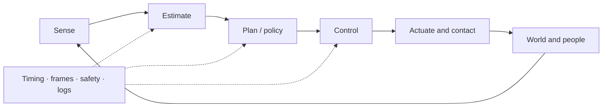
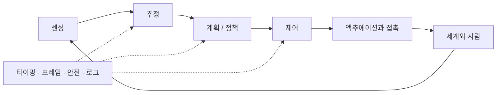

## English

Robotics is a closed physical system: sensing produces uncertain observations, estimation forms a belief, planning selects feasible behavior, control stabilizes execution, and contact and embodiment determine what the world actually permits.

### A. Geometry, mechanics & motion

- [[04-robotics/modern-robotics-book|1. Modern Robotics]] — book guide and scope
- [[04-robotics/modern-robotics/index|2. Modern Robotics Summary]] — chapters 2–6 and 8–13
- Chapter 7 (closed-chain kinematics) is intentionally optional: this track prioritizes open-chain manipulation, control, physical interaction, and field/mobile robotics literacy.

### B. State, perception & belief

- [[04-robotics/state-estimation-slam|3. State Estimation, Localization & SLAM]] — state versus observation, Bayes/Kalman filtering, sensor fusion, factor graphs, drift and loop closure
- [[04-robotics/geometric-perception-calibration|3.5 Geometric Perception & Calibration]] — camera models, depth, point clouds, registration/ICP, intrinsic/extrinsic/hand–eye calibration, reprojection error
- Learned visual perception lives in [[03-deep-learning/index|Deep Learning]]; this page explains how sensor evidence becomes a time-indexed robot belief.

### C. Planning & decision-making

- [[04-robotics/planning-decision-making|4. Planning & Decision-Making]] — graph search, sampling, trajectory optimization, TAMP, uncertainty, replanning, and learned planning

### D. Feedback & control

Depth target: classical control solid; MPC to formulation and representative applications—enough to read modern robotics papers.

1. [[04-robotics/control-theory-ce397|5. Control Theory]] — state space, stability, controllability and observability
2. [[04-robotics/lqr-lqg|6. LQR & LQG]] — optimal feedback and estimator–controller separation
3. [[04-robotics/mpc|7. Model Predictive Control]] — finite-horizon optimization, constraints and replanning
4. [[04-robotics/convex-mpc-legged|8. Convex MPC for Legged Robots]] — representative high-rate application

### E. Physical interaction

- [[04-robotics/contact-force-tactile|9. Contact, Force & Tactile Interaction]] — friction, contact modes, force/impedance/admittance control, tactile sensing, deformable materials

### F. Embodiment & deployment

- [[04-robotics/robot-systems-deployment|10. Robot Systems, Embodiment & Deployment]] — action interfaces, timing, frames, middleware, reliability, simulation, logging, and failure diagnosis

### G. Humans & safety

- [[04-robotics/hri-safety|11. Human–Robot Interaction & Safety]] — autonomy levels, authority, intervention, human studies, hazard and risk literacy

Note: page numbers are the recommended study order — estimation (3) → geometric perception (3.5) → planning (4) → control (5–8) → contact (9) → systems (10) → humans & safety (11).

### Where this track leads

These components converge in VLA, world-model, and learning-based-control systems, then meet field constraints in [[05-construction-robotics/index|Construction Robotics]]. Use [[06-research-practice/index|Research Practice]] to design and evaluate new work rather than only read it.

## 한국어

로보틱스는 닫힌 물리 시스템이다: 센싱은 불확실한 관측을 만들고, 추정은 belief를 형성하고,
계획은 실행 가능한 행동을 고르고, 제어는 실행을 안정화한다. 접촉과 embodiment는 세계가
실제로 허용하는 것을 결정하고, 타이밍·프레임·안전·로깅이 전체를 연결한다.

### A. 기하·역학·운동

- [[04-robotics/modern-robotics-book|1. Modern Robotics]] — 책 가이드와 범위
- [[04-robotics/modern-robotics/index|2. Modern Robotics Summary]] — 2–6장, 8–13장
- 7장(폐쇄 사슬 기구학)은 의도적으로 선택 사항이다: 이 트랙은 개연쇄 매니퓰레이션, 제어, 물리 상호작용, 현장/모바일 로보틱스 문해력을 우선한다.

### B. 상태·인지·belief

- [[04-robotics/state-estimation-slam|3. State Estimation, Localization & SLAM]] — 상태 vs 관측, 베이즈/칼만 필터링, 센서 융합, factor graph, drift와 loop closure
- [[04-robotics/geometric-perception-calibration|3.5 Geometric Perception & Calibration]] — 카메라 모델, 깊이, 포인트 클라우드, registration/ICP, intrinsic/extrinsic/hand–eye 보정, reprojection error
- 학습된 시각 인식은 [[03-deep-learning/index|딥러닝]]에 있다; 이 페이지는 센서 증거가 시간 인덱스된 로봇 belief가 되는 과정을 설명한다.

### C. 계획·의사결정

- [[04-robotics/planning-decision-making|4. Planning & Decision-Making]] — 그래프 탐색, 샘플링, 궤적 최적화, TAMP, 불확실성, replanning, 학습 기반 계획

### D. Feedback·제어

깊이 목표: 고전 제어는 탄탄히, MPC는 정식화와 대표 응용까지 — 현대 로보틱스 논문을 읽기에 충분하게.

1. [[04-robotics/control-theory-ce397|5. Control Theory]] — 상태공간, 안정성, 가제어성과 가관측성
2. [[04-robotics/lqr-lqg|6. LQR & LQG]] — 최적 피드백과 추정기–제어기 분리
3. [[04-robotics/mpc|7. Model Predictive Control]] — 유한 지평 최적화, 제약, replanning
4. [[04-robotics/convex-mpc-legged|8. Convex MPC for Legged Robots]] — 대표적 고주기 응용

### E. 물리 상호작용

- [[04-robotics/contact-force-tactile|9. Contact, Force & Tactile Interaction]] — 마찰, 접촉 모드, 힘/임피던스/어드미턴스 제어, 촉각 센싱, 유연 재료

### F. Embodiment·배포

- [[04-robotics/robot-systems-deployment|10. Robot Systems, Embodiment & Deployment]] — 행동 인터페이스, 타이밍, 프레임, 미들웨어, 신뢰성, 시뮬레이션, 로깅, 실패 진단

### G. 사람·안전

- [[04-robotics/hri-safety|11. Human–Robot Interaction & Safety]] — 자율성 수준, 권한, 개입, 인간 대상 연구, hazard·risk 문해력

### 이 트랙이 향하는 곳

이 구성요소들은 VLA·월드모델·학습 기반 제어 시스템에서 합류한 뒤,
[[05-construction-robotics/index|건설로봇]]의 현장 제약과 만난다. 새 연구를 읽는 것을 넘어
설계·평가할 때는 [[06-research-practice/index|Research Practice]]를 쓰라.

참고: 페이지 번호는 권장 학습 순서다 — 추정(3) → 기하 인식(3.5) → 계획(4) → 제어(5–8) →
접촉(9) → 시스템(10) → 사람·안전(11).
