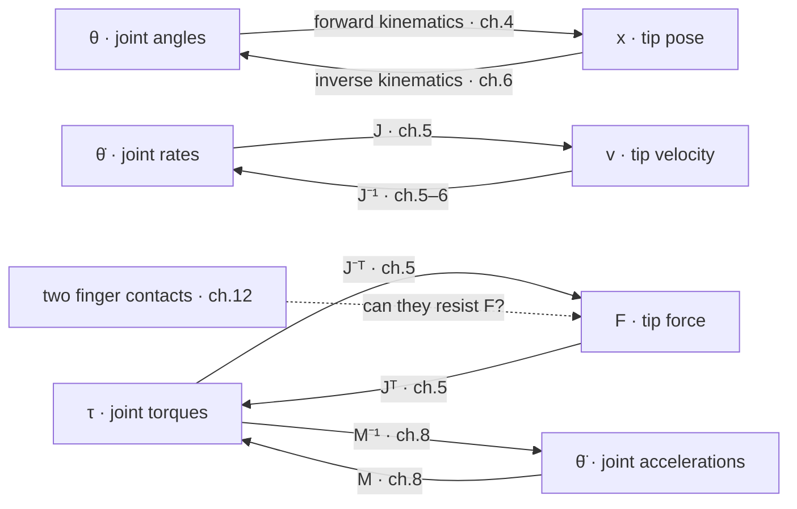
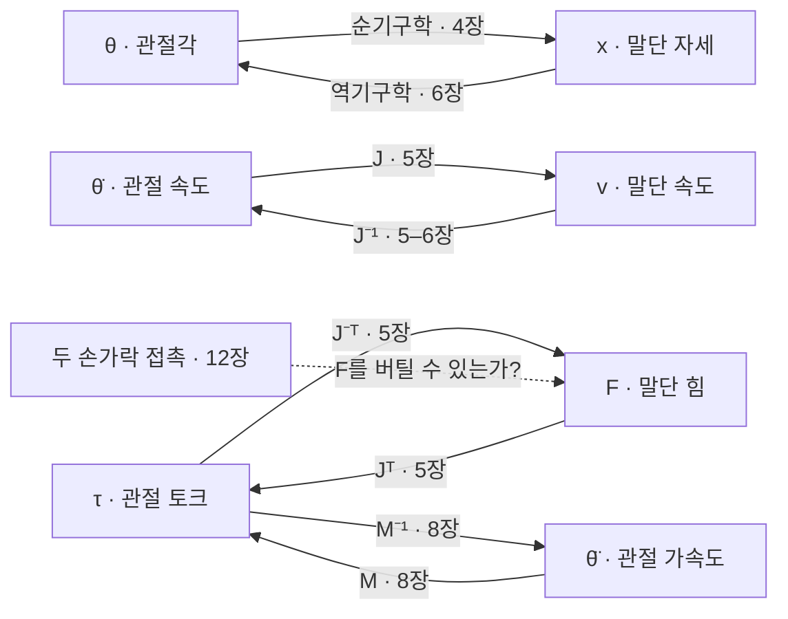

**Lynch & Park, Cambridge University Press 2017** — [Free official preprint PDF](http://modernrobotics.org) · [Course wiki (videos, software)](http://hades.mech.northwestern.edu/index.php/Modern_Robotics) · [Coursera specialization](https://www.coursera.org/specializations/modernrobotics)

## English

*Group A, the root of it. Every word this track uses for geometry and dynamics comes from this
textbook; the chapter summaries are in [[04-robotics/modern-robotics/index|2. Modern Robotics Summary]], and groups B through J are written in its vocabulary.*

> [!info] Depth target · 깊이 목표
> Track-level ★: read the summarized chapters alongside the book until screw-theory notation (twists, wrenches, PoE, Jacobians) reads fluently. Full exercise sets are optional.
> 트랙 수준 ★: 스크류 이론 표기(twist·wrench·PoE·야코비안)가 술술 읽힐 때까지 요약과 원서를 함께 본다. 연습문제 전체 풀이는 선택이다.

> [!note] Prerequisites · 선수 지식
> **P2** from [[02-foundations/lab-plants|0.6 Lab Plants]] — the planar 2R arm with its frozen $J$ and $M$ · [[02-foundations/linear-algebra|1. Linear Algebra]] (matrix inverse and transpose)
> [[02-foundations/lab-plants|0.6 Lab Plants]]의 **P2** — 평면 2R 팔과 고정된 $J$, $M$ · [[02-foundations/linear-algebra|1. 선형대수]](역행렬과 전치)

> [!note] First pass · 처음이라면
> This page is a map, not a chapter. Read the routing rule in the worked case, route one question of your own with it, then open the chapter it names. The maps themselves are derived on the chapter pages, never here.
> 이 페이지는 장이 아니라 지도다. 계산 예제의 배분 규칙을 읽고, 자기 질문 하나를 그 규칙으로 배분한 다음, 규칙이 지목한 장을 펴라. 사상 자체는 각 장 페이지에서 유도하지 여기서 하지 않는다.

### Running object · 이 페이지의 대상

**P2** from [[02-foundations/lab-plants|0.6 Lab Plants]], at the pose that page freezes: unit links $L_1 = L_2 = 1$ m, point masses $m_1 = m_2 = 1$ kg, angles $\theta = (0^\circ, 90^\circ)$, tip at $(1, 1)$ m, and the two matrices the catalog fixes there,

$$J=\begin{pmatrix}-1&-1\\1&0\end{pmatrix},\qquad M=\begin{pmatrix}3&1\\1&1\end{pmatrix},\qquad \det J = 1$$

so $J$ is invertible at this pose and every route below is a multiplication by $J$, $J^{-1}$, $J^{\top}$, $J^{-\top}$, $M$ or $M^{-1}$. The arm is taken in the horizontal plane, so gravity never enters; the running task is the wiki's own — *move a tool to a panel and make controlled contact* — with the panel a line under the tip and $-y$ the direction into it.

*Scope: this page teaches **routing** — which chapter of the book answers which question about that arm, and how to tell from the question alone. It does not derive a single one of those maps. The Jacobian is derived on [[04-robotics/modern-robotics/ch05-velocity-kinematics|MR ch.5 §1–2]], the mass matrix on [[04-robotics/modern-robotics/ch08-dynamics|MR ch.8]], and the chapter summaries live in [[04-robotics/modern-robotics/index|2. Modern Robotics Summary]]. Chapter 7 (closed chains) is out of this wiki's scope.*

### The picture · 그림으로 먼저 보기

The picture for this page is the routing map: the arm's six quantities in two columns — joint side $\theta$, $\dot\theta$, $\tau$ and tip side $x$, $v$, $F$, one row each for pose, velocity and force — joined in every row by a forward map and an inverse map, each labelled with the chapter that defines it, and $\ddot\theta$ joined to $\tau$ by $M$ and $M^{-1}$ (ch.8). On P2 at its catalog pose, with the tip on the panel at $(1,1)$ m sliding at $0.2$ m/s in $+x$ and pressing with $10$ N in $-y$, the two routes through ch.5 give $\dot\theta = (0,\ -0.2)$ rad/s and $\tau = (-10,\ 0)$ N·m. The press loads only the shoulder and the slide moves only the elbow, and both answers come out of the one matrix $J$.

### Worked case · 대상으로 한 번 끝까지

> [!info] Definition — a routing question
> **What kind of thing it is:** not a robotics fact but a **triple** $(g, a, \Phi)$ — a *given* quantity $g$, an *asked* quantity $a$, and the map $\Phi$ with $a = \Phi(g)$. A sentence in a paper becomes routable only once all three are named.
> **Three conditions.** (1) $g$ and $a$ are each one of the six quantities of the arm: configuration $\theta$, tip pose $x$, joint rate $\dot\theta$, tip velocity $v$, joint torque $\tau$, tip force $F$. (2) They differ in **direction** — joints → tip is *forward*, tip → joints is *inverse* — or in **differential order** $n$, which is $0$ for pose, $1$ for velocity and static force, $2$ for acceleration, or in both. (3) Exactly one map in the book carries $g$ to $a$, and the chapter that defines that map is the route:
> $$\operatorname{route}(g \to a) = \operatorname{ch}\big(n(g,a),\ d(g,a)\big)$$
> where $n$ is the differential order separating the two quantities and $d \in \{\text{forward},\ \text{inverse}\}$ is the direction, so the pair $(n, d)$ is an index into the table below and nothing else about the wording matters.
> **Example.** "What joint torques hold 10 N against the panel?" is the triple $(F,\ \tau,\ J^{\top})$: order 1, inverse, so the route is ch.5.
> **Non-example.** "Can the arm reach the panel at all?" names no $g$ and no $a$ — it asks about the *set* of reachable $x$, not a map between two quantities, so this table has no cell for it and it belongs to the configuration-space and workspace material of ch.2 and ch.4. A second non-example: "does the policy generalize to a new panel" is not a question about this arm at all, and it routes out of the book entirely, to [[02-foundations/ml-practice|9. ML Practice & Evaluation]].
> **Why it matters.** Nobody reads a 500-page book front to back at Literacy depth, and no paper ever writes "see ch.5". Routing is the skill that turns "the method solves a QP over end-effector twists" into "that is ch.5's $J$, so read ch.5 first" — and, just as often, into "that claim is not in this book."

**The routing table.** Read off the order and the direction; the cell names the map and its chapter.

| differential order $n$ | forward — joints → tip | inverse — tip → joints |
|---|---|---|
| 0 · pose | $x = f(\theta)$, product of exponentials — [[04-robotics/modern-robotics/ch04-forward-kinematics\|ch.4]] | $\theta$ from $x$ — [[04-robotics/modern-robotics/ch06-inverse-kinematics\|ch.6]] |
| 1 · velocity | $v = J\dot\theta$ — [[04-robotics/modern-robotics/ch05-velocity-kinematics\|ch.5]] | $\dot\theta = J^{-1}v$ — [[04-robotics/modern-robotics/ch05-velocity-kinematics\|ch.5]] |
| 1 · static force | $F = J^{-\top}\tau$ — [[04-robotics/modern-robotics/ch05-velocity-kinematics\|ch.5 §3]] | $\tau = J^{\top}F$ — [[04-robotics/modern-robotics/ch05-velocity-kinematics\|ch.5 §3]] |
| 2 · dynamics | $\ddot\theta = M^{-1}(\tau - h)$ — [[04-robotics/modern-robotics/ch08-dynamics\|ch.8]] | $\tau = M(\theta)\ddot\theta + h$ — [[04-robotics/modern-robotics/ch08-dynamics\|ch.8]] |

Here $h = h(\theta, \dot\theta)$ collects the velocity-product and gravity terms, which vanish for P2 at rest in the horizontal plane. Five questions are not a map between two of the six quantities at one instant, and each has its own chapter: how many numbers $\theta$ holds and what space they live in is [[04-robotics/modern-robotics/ch02-configuration-space|ch.2]]; a whole time history $\theta(t)$ meeting speed and acceleration limits is [[04-robotics/modern-robotics/ch09-trajectory-generation|ch.9]]; a collision-free path through that space is [[04-robotics/modern-robotics/ch10-motion-planning|ch.10]]; a feedback law from measured error to commanded torque is [[04-robotics/modern-robotics/ch11-robot-control|ch.11]]; and whether a set of contacts can resist a wrench is [[04-robotics/modern-robotics/ch12-grasping|ch.12]]. A base that drives instead of standing still is [[04-robotics/modern-robotics/ch13-wheeled-mobile-robots|ch.13]].

**The stated question.** *P2 sits at the catalog pose with its tip on the panel at $(1,1)$ m. The tip must slide along the panel at $0.2$ m/s in $+x$ while pressing into it with $10$ N in $-y$. What do the two joints do?*

**Route 1 — given $v$, asked $\dot\theta$.** Both are velocities, so $n = 1$; the given is at the tip and the answer is at the joints, so $d$ is inverse. The cell says ch.5, with

$$\dot\theta = J^{-1}v, \qquad J^{-1} = \begin{pmatrix}0&1\\-1&-1\end{pmatrix}$$

since $\det J = 1$ makes the inverse the adjugate itself. Substituting $v = (0.2,\ 0)$ m/s,

$$\dot\theta = \begin{pmatrix}0&1\\-1&-1\end{pmatrix}\begin{pmatrix}0.2\\0\end{pmatrix} = \begin{pmatrix}0\\-0.2\end{pmatrix}\ \mathrm{rad/s}$$

so the shoulder holds still and the elbow turns at $-0.2$ rad/s. Check it forward: $J\dot\theta = (-1)(0) + (-1)(-0.2) = 0.2$ in $x$ and $(1)(0) + (0)(-0.2) = 0$ in $y$, which is the commanded $v$.

**Route 2 — given $F$, asked $\tau$.** Still $n = 1$, still inverse, but the quantities are forces, so the third row applies — the same chapter, the same matrix transposed rather than inverted:

$$\tau = J^{\top}F = \begin{pmatrix}-1&1\\-1&0\end{pmatrix}\begin{pmatrix}0\\-10\end{pmatrix} = \begin{pmatrix}-10\\0\end{pmatrix}\ \mathrm{N{\cdot}m}$$

because the first column of $J^{\top}$ picks up the $y$ component with coefficient $1$ while the second picks up none of it. Pressing into the panel is pure shoulder. Sliding along it was pure elbow. The task splits cleanly across the two joints, and both halves came out of one matrix — which is the reason velocity and statics share a chapter rather than sitting in two.

**The check that the route was right.** A static answer is only right while the accelerations are small, so test it instead of assuming it. Ramping the tip from rest to $0.2$ m/s over $0.2$ s needs $\ddot\theta = (0,\ -1)$ rad/s², and P2's frozen mass matrix turns that into

$$\tau_{\text{inertial}} = M\ddot\theta = \begin{pmatrix}3&1\\1&1\end{pmatrix}\begin{pmatrix}0\\-1\end{pmatrix} = \begin{pmatrix}-1\\-1\end{pmatrix}\ \mathrm{N{\cdot}m}$$

so the shoulder carries $-10$ N·m of contact and $-1$ N·m of inertia — a 10% correction, and the ch.5 route stands. The elbow's contact torque is exactly $0$, so its entire command, $-1$ N·m, is the dynamics term: for that joint ch.5 answers nothing and ch.8 answers everything. **A route that is correct for one joint can be empty for the other**, which is why you route the quantity rather than the sentence.

**The rest of the same task, routed.** Getting the tip to $(1,1)$ from a start configuration is $x \to \theta$, order 0 inverse — ch.6. Doing it within joint speed limits is a time history — ch.9. Doing it without clipping the panel edge is a path — ch.10. Holding the $10$ N while the measured error moves is a feedback law — ch.11. Whether the gripper's contacts hold the tool against the $10$ N reaction is a wrench question — ch.12. Six chapters for one sentence of task description, and the routing table is what assigns them.

### 1. What the book is

**What it is**: the standard modern textbook for robot kinematics, dynamics, planning, and
control — built on the screw-theory/exponential-coordinates formulation (rather than
classical D-H parameters), which is exactly the formulation modern manipulation research
uses. The authors provide the **full book PDF free** at the official site, plus video
lectures and software (Python/MATLAB/Mathematica) on the course wiki, and a 6-course
Coursera specialization.

### 2. The study path used in this wiki

Chapter summaries live in [[04-robotics/modern-robotics/index|2. Modern Robotics Summary]]; the order below is the routing table read top to bottom.

1. Configuration space (Ch. 2) — DoF, topology, constraints
2. Rigid-body motions (Ch. 3) — rotation matrices, twists, **SE(3)**, exponential coordinates
3. Forward kinematics (Ch. 4) — product of exponentials
4. Velocity kinematics & statics (Ch. 5) — the **Jacobian** (the same object as
   [[02-foundations/calculus-backprop|backprop's Jacobian]])
5. Inverse kinematics (Ch. 6) → Dynamics (Ch. 8) → Trajectory generation (Ch. 9) →
   Motion planning (Ch. 10) → Robot control (Ch. 11) → Grasping (Ch. 12) →
   Wheeled mobile robots (Ch. 13)

### 3. Why it matters for this wiki

**Why it matters for this wiki**: every VLA paper's action space (end-effector poses,
joint commands) and every simulator's dynamics assume this material; SE(3) fluency is the
entry ticket to manipulation research.

### Problem set · 과제

Tier C. Claim-reading and routing, on **P2** to a panel ([[02-foundations/lab-plants|0.6]]). This page is the book guide, not a chapter: it routes the maps, and the chapter pages derive them. Using only this page, its prerequisites, and the plant catalog.

1. **Draw.** The six-box routing map at the top of the page, with a matrix and a chapter number on every arrow. Then add a seventh box — *the two finger contacts on the panel* — and draw the arrow that asks whether they can resist a given tip wrench $F$. Which chapter owns that arrow, and why is it not ch.5?
2. **Derive.** Same pose, same panel, one change: the tip now presses **along $+x$** with $10$ N, into the panel edge, instead of into its face. Name $(g, a, \Phi)$, read off $(n, d)$, name the chapter, then substitute. What does each joint carry, and how does that differ from the worked case?
3. **Interpret.** Which sentence on this page is the claim that MR uses screw theory / PoE instead of D–H, and what observation would falsify the separate claim that "SE(3) fluency is the entry ticket to manipulation and VLA papers"?

> [!note]- How to draw it · 그리는 법
> - Six boxes in two columns: the joint-side quantities $\theta$, $\dot\theta$, $\tau$ on the left, the tip-side quantities $x$, $v$, $F$ on the right; top row pose, middle row velocity, bottom row force.
> - An arrow each way between the two boxes of every row, each labelled with the map that carries it and the chapter that defines it. Arrows pointing right are forward, joints to tip; arrows pointing left are inverse, tip to joints.
> - The force row carries $J$ transposed, not inverted: $\tau = J^{\top}F$ points left like $\dot\theta = J^{-1}v$, but with a different matrix. A force arrow labelled $J^{-1}$ has mixed up the velocity row and the force row.
> - The dynamics box $\ddot\theta$ below the force row, joined to $\tau$, not to $F$, by $M$ one way and $M^{-1}$ the other, with its chapter number.
> - The seventh box, the two finger contacts on the panel, with the arrow that asks whether they can resist a given tip wrench $F$. Before writing a chapter on that arrow, test it against the three conditions of a routing question.
> - The arm to one side: P2 at $\theta = (0^\circ, 90^\circ)$, shoulder at the origin, elbow at $(1,0)$, tip at $(1,1)$, the panel as a horizontal line just under the tip, and at the tip the worked case's slide arrow, $0.2$ m/s in $+x$, and press arrow, $10$ N in $-y$.
> - The worked case's two answers beside the joints they belong to, $\dot\theta = (0,\ -0.2)$ rad/s and $\tau = (-10,\ 0)$ N·m. A correct drawing shows at a glance that the press loads one joint and the slide moves the other.

> [!tip]- Solutions
> 1. Ch.12. The arrow is not a map between two of the six quantities: it asks whether the set of wrenches the contacts *can* apply contains the one required — force closure, a question about a set, like the reach non-example in the definition. Ch.5's $J^{\top}$ assumes the tip force already exists and only converts it to torques.
> 2. The triple is $(F,\ \tau,\ J^{\top})$, order 1, inverse — ch.5, the same cell as the worked case. Substituting $F = (10,\ 0)$ N gives $\tau = J^{\top}F = (-10,\ -10)$ N·m: **both** joints carry $10$ N·m, where the $-y$ press loaded only the shoulder. Same arm, same pose, same chapter, and a different direction of push redistributes the whole load — which is what a Jacobian is for.
> 3. The "What it is" paragraph in §1: built on screw-theory/exponential coordinates rather than classical D–H — that sentence *is* the claim. The entry-ticket claim would be falsified by a widely used manipulation or VLA paper whose action space and losses never refer to poses, twists, or Jacobians (joint-chunk policies still *interpret* chunks through FK). One counter-example would weaken "entry ticket", not the book's formulation.

### Self-check

1. A paper writes "we regress 6-DoF end-effector deltas at 10 Hz." Name the given and the asked, and say which chapter defines the map that turns those deltas into joint commands.
2. Why do velocity and static force route to the *same* chapter, when one is a motion and the other a force?
3. Which chapter of the book does the panel task never need, and what would have to change about P2 for it to be needed?

> [!tip]- Answers
> 1. The given is a tip-pose increment and the asked is a joint command. Read literally it is order 0, inverse — ch.6, inverse kinematics. Read as a twist over the 100 ms step it is order 1, inverse — ch.5's $\dot\theta = J^{-1}v$, which is what a resolved-rate loop actually runs. Both routes are legitimate and the paper usually does not say which, so that ambiguity is itself the thing to ask about.
> 2. Because one matrix serves both: $v = J\dot\theta$ and $\tau = J^{\top}F$ use the same $J$ at the same pose, so a single derivation answers both questions and the chapter that derives $J$ owns both rows ([[04-robotics/modern-robotics/ch05-velocity-kinematics|ch.5 §3]] calls this statics duality). It also means a pose where $J$ is singular breaks both at once.
> 3. Ch.13, wheeled mobile robots: P2's base is bolted down, so no question in the task has a base velocity as its given or asked. Mount the same arm on a driving base and every route gains a term, which is exactly what ch.13 adds.

## 한국어

*A군의 뿌리다. 이 트랙이 기하와 역학에 쓰는 어휘가 전부 이 교재에서 나온다. 챕터 요약은
[[04-robotics/modern-robotics/index|2. Modern Robotics 요약]]에 있고, B~J군이 그 어휘로 쓰여 있다.*

### 이 페이지의 대상 · Running object

[[02-foundations/lab-plants|0.6 Lab Plants]]의 **P2**를 그 페이지가 고정한 자세에서 쓴다. 단위 링크 $L_1 = L_2 = 1$ m, 점질량 $m_1 = m_2 = 1$ kg, 각도 $\theta = (0^\circ, 90^\circ)$, 말단 $(1, 1)$ m, 그리고 카탈로그가 그 자세에서 고정한 두 행렬:

$$J=\begin{pmatrix}-1&-1\\1&0\end{pmatrix},\qquad M=\begin{pmatrix}3&1\\1&1\end{pmatrix},\qquad \det J = 1$$

이므로 이 자세에서 $J$는 가역이고, 아래의 모든 배분은 $J$, $J^{-1}$, $J^{\top}$, $J^{-\top}$, $M$, $M^{-1}$ 중 하나를 곱하는 일이다. 팔은 수평면에 있다고 두어 중력은 등장하지 않는다. 관통 과제는 이 위키의 것 — *도구를 패널까지 옮겨 힘을 조절하며 접촉한다* — 이고, 패널은 말단 아래의 직선, $-y$가 패널 안쪽 방향이다.

*범위: 이 페이지는 **배분**을 가르친다. 그 팔에 대한 어떤 질문을 책의 어느 장이 답하는지, 그리고 질문만 보고 그것을 어떻게 아는지다. 그 사상들은 여기서 하나도 유도하지 않는다. 야코비안은 [[04-robotics/modern-robotics/ch05-velocity-kinematics|MR 5장 §1–2]]에서, 질량 행렬은 [[04-robotics/modern-robotics/ch08-dynamics|MR 8장]]에서 유도하고, 챕터 요약은 [[04-robotics/modern-robotics/index|2. Modern Robotics 요약]]에 있다. 7장(폐쇄 연쇄)은 이 위키의 범위 밖이다.*

### 그림으로 먼저 보기 · The picture

이 페이지의 그림은 배분 지도로, 팔의 여섯 양을 관절 쪽 $\theta$, $\dot\theta$, $\tau$와 말단 쪽 $x$, $v$, $F$의 두 열에 자세·속도·힘마다 한 줄씩 놓고, 줄마다 순방향 사상과 역방향 사상으로 이어 각각에 그것을 정의하는 장을 적으며, $\ddot\theta$는 $M$과 $M^{-1}$로 $\tau$에 잇는다(8장). 카탈로그 자세의 P2에서 패널 위 $(1,1)$ m에 있는 말단이 $+x$로 $0.2$ m/s 미끄러지며 $-y$로 $10$ N을 누르면, 5장을 지나는 두 배분이 $\dot\theta = (0,\ -0.2)$ rad/s와 $\tau = (-10,\ 0)$ N·m을 준다. 누름은 어깨에만 실리고 미끄러짐은 팔꿈치만 만들며, 두 답이 모두 한 행렬 $J$에서 나온다.

### 대상으로 한 번 끝까지 · Worked case

> [!info] 정의 — 배분 질문(routing question)
> **무엇인가:** 로보틱스 사실이 아니라 **삼중쌍** $(g, a, \Phi)$이다. *주어진* 양 $g$, *묻는* 양 $a$, 그리고 $a = \Phi(g)$인 사상 $\Phi$. 논문의 한 문장은 셋을 모두 이름 붙였을 때에만 배분 가능해진다.
> **세 조건.** (1) $g$와 $a$는 각각 팔의 여섯 양 중 하나다. 관절 좌표 $\theta$, 말단 자세 $x$, 관절 속도 $\dot\theta$, 말단 속도 $v$, 관절 토크 $\tau$, 말단 힘 $F$. (2) 둘은 **방향**에서 다르거나 — 관절 → 말단이 *순방향*, 말단 → 관절이 *역방향* — **미분 차수** $n$에서 다르거나(자세는 $0$, 속도와 정역학적 힘은 $1$, 가속도는 $2$), 둘 다에서 다르다. (3) 책에서 $g$를 $a$로 나르는 사상은 정확히 하나이고, 그 사상을 정의하는 장이 곧 배분 결과다.
> $$\operatorname{route}(g \to a) = \operatorname{ch}\big(n(g,a),\ d(g,a)\big)$$
> $n$은 두 양을 가르는 미분 차수, $d \in \{\text{순방향},\ \text{역방향}\}$는 방향이므로, 쌍 $(n, d)$가 아래 표의 색인이고 문장의 나머지 표현은 아무 상관이 없다.
> **예.** "패널에 10 N을 유지하려면 관절 토크가 얼마인가"는 삼중쌍 $(F,\ \tau,\ J^{\top})$이다. 차수 1, 역방향이므로 배분 결과는 5장이다.
> **반례.** "팔이 패널에 닿기는 하는가"는 $g$도 $a$도 이름 붙이지 않는다. 두 양 사이의 사상이 아니라 도달 가능한 $x$의 *집합*을 묻는 질문이므로 이 표에 칸이 없고, 2장과 4장의 컨피규레이션 공간·작업 공간 내용에 속한다. 두 번째 반례: "정책이 새 패널에 일반화되는가"는 애초에 이 팔에 대한 질문이 아니라 책 밖으로, [[02-foundations/ml-practice|9. ML 실무와 평가]]로 배분된다.
> **왜 중요한가.** Literacy 깊이에서 500쪽짜리 책을 처음부터 끝까지 읽는 사람은 없고, 논문은 절대 "5장을 보라"고 써 주지 않는다. 배분은 "이 방법은 말단 트위스트에 대한 QP를 푼다"를 "그건 5장의 $J$니까 5장을 먼저 읽자"로 바꾸는 기술이고, 그만큼 자주 "그 주장은 이 책에 없다"로도 바꾼다.

**배분 표.** 차수와 방향을 읽어 내면 칸이 사상과 장을 알려 준다.

| 미분 차수 $n$ | 순방향 — 관절 → 말단 | 역방향 — 말단 → 관절 |
|---|---|---|
| 0 · 자세 | $x = f(\theta)$, 지수곱 — [[04-robotics/modern-robotics/ch04-forward-kinematics\|4장]] | $x$에서 $\theta$ — [[04-robotics/modern-robotics/ch06-inverse-kinematics\|6장]] |
| 1 · 속도 | $v = J\dot\theta$ — [[04-robotics/modern-robotics/ch05-velocity-kinematics\|5장]] | $\dot\theta = J^{-1}v$ — [[04-robotics/modern-robotics/ch05-velocity-kinematics\|5장]] |
| 1 · 정역학 힘 | $F = J^{-\top}\tau$ — [[04-robotics/modern-robotics/ch05-velocity-kinematics\|5장 §3]] | $\tau = J^{\top}F$ — [[04-robotics/modern-robotics/ch05-velocity-kinematics\|5장 §3]] |
| 2 · 동역학 | $\ddot\theta = M^{-1}(\tau - h)$ — [[04-robotics/modern-robotics/ch08-dynamics\|8장]] | $\tau = M(\theta)\ddot\theta + h$ — [[04-robotics/modern-robotics/ch08-dynamics\|8장]] |

$h = h(\theta, \dot\theta)$는 속도곱 항과 중력 항을 모은 것이고, 수평면에 정지한 P2에서는 사라진다. 한 순간의 여섯 양 사이 사상이 아닌 질문이 다섯 가지 있고 각각 자기 장이 있다. $\theta$가 숫자 몇 개이고 어떤 공간에 사는지는 [[04-robotics/modern-robotics/ch02-configuration-space|2장]], 속도·가속도 한계를 지키는 시간 이력 $\theta(t)$ 전체는 [[04-robotics/modern-robotics/ch09-trajectory-generation|9장]], 그 공간을 지나는 충돌 없는 경로는 [[04-robotics/modern-robotics/ch10-motion-planning|10장]], 측정 오차에서 명령 토크로 가는 피드백 법칙은 [[04-robotics/modern-robotics/ch11-robot-control|11장]], 접촉 집합이 어떤 렌치를 견딜 수 있는지는 [[04-robotics/modern-robotics/ch12-grasping|12장]]이다. 고정 대신 달리는 베이스는 [[04-robotics/modern-robotics/ch13-wheeled-mobile-robots|13장]]이다.

**주어진 질문.** *P2가 카탈로그 자세로 말단을 패널 위 $(1,1)$ m에 두고 있다. 말단은 $-y$로 $10$ N을 누르면서 $+x$로 $0.2$ m/s로 패널을 따라 미끄러져야 한다. 두 관절은 무엇을 하는가?*

**배분 1 — 주어진 것 $v$, 묻는 것 $\dot\theta$.** 둘 다 속도이므로 $n = 1$이고, 주어진 것이 말단에 있고 답이 관절에 있으므로 $d$는 역방향이다. 해당 칸은 5장이고

$$\dot\theta = J^{-1}v, \qquad J^{-1} = \begin{pmatrix}0&1\\-1&-1\end{pmatrix}$$

인데 $\det J = 1$이라서 역행렬이 수반행렬 그 자체가 되기 때문이다. $v = (0.2,\ 0)$ m/s를 대입하면

$$\dot\theta = \begin{pmatrix}0&1\\-1&-1\end{pmatrix}\begin{pmatrix}0.2\\0\end{pmatrix} = \begin{pmatrix}0\\-0.2\end{pmatrix}\ \mathrm{rad/s}$$

이므로 어깨는 가만히 있고 팔꿈치만 $-0.2$ rad/s로 돈다. 순방향으로 검산하면 $J\dot\theta$의 $x$ 성분이 $(-1)(0) + (-1)(-0.2) = 0.2$, $y$ 성분이 $(1)(0) + (0)(-0.2) = 0$으로 명령한 $v$와 같다.

**배분 2 — 주어진 것 $F$, 묻는 것 $\tau$.** 여전히 $n = 1$, 여전히 역방향이지만 양이 힘이므로 셋째 행이다. 같은 장, 같은 행렬을 역행렬 대신 전치해서 쓴다.

$$\tau = J^{\top}F = \begin{pmatrix}-1&1\\-1&0\end{pmatrix}\begin{pmatrix}0\\-10\end{pmatrix} = \begin{pmatrix}-10\\0\end{pmatrix}\ \mathrm{N{\cdot}m}$$

$J^{\top}$의 첫 행이 $y$ 성분을 계수 $1$로 받고 둘째 행은 전혀 받지 않기 때문이다. 패널을 누르는 것은 순전히 어깨다. 패널을 따라 미끄러지는 것은 순전히 팔꿈치였다. 과제가 두 관절로 깔끔하게 갈라지고, 두 답이 모두 한 행렬에서 나왔다. 속도와 정역학이 두 장으로 나뉘지 않고 한 장을 공유하는 이유가 이것이다.

**배분이 옳았는지의 검산.** 정역학 답은 가속도가 작을 때에만 옳으므로, 가정하지 말고 확인한다. 말단을 정지에서 $0.2$ s 동안 $0.2$ m/s까지 올리려면 $\ddot\theta = (0,\ -1)$ rad/s²가 필요하고, P2의 고정된 질량 행렬이 그것을

$$\tau_{\text{inertial}} = M\ddot\theta = \begin{pmatrix}3&1\\1&1\end{pmatrix}\begin{pmatrix}0\\-1\end{pmatrix} = \begin{pmatrix}-1\\-1\end{pmatrix}\ \mathrm{N{\cdot}m}$$

으로 바꾼다. 그래서 어깨는 접촉에서 $-10$ N·m, 관성에서 $-1$ N·m를 받는다. 10%의 보정이고 5장 배분은 유효하다. 팔꿈치의 접촉 토크는 정확히 $0$이므로 그 관절의 명령 전체인 $-1$ N·m가 통째로 동역학 항이다. 그 관절에 대해서는 5장이 아무것도 답하지 않고 8장이 전부를 답한다. **한 관절에 옳은 배분이 다른 관절에는 비어 있을 수 있다.** 문장이 아니라 양을 배분해야 하는 이유다.

**같은 과제의 나머지, 배분하면.** 시작 자세에서 말단을 $(1,1)$로 보내는 것은 $x \to \theta$, 차수 0 역방향 — 6장. 관절 속도 한계 안에서 그렇게 하는 것은 시간 이력 — 9장. 패널 모서리를 긁지 않고 그렇게 하는 것은 경로 — 10장. 측정 오차가 움직이는 동안 $10$ N을 유지하는 것은 피드백 법칙 — 11장. 그리퍼의 접촉이 $10$ N의 반작용에 도구를 붙잡아 두는지는 렌치 질문 — 12장. 과제 설명 한 문장에 여섯 장이고, 그것을 나눠 주는 것이 배분 표다.

### 1. 무엇인가

**무엇인가**: 로봇 기구학·동역학·플래닝·제어의 현대 표준 교과서 — 고전 D-H 파라미터 대신
스크류 이론/지수 좌표 정식화를 쓰는데, 이것이 정확히 현대 매니퓰레이션 연구가 쓰는
표기다. 저자들이 공식 사이트에서 **책 전체 PDF를 무료로** 제공하고, 코스 위키에 강의
영상과 소프트웨어(Python/MATLAB/Mathematica), Coursera에 6과목 특화 과정이 있다.

### 2. 이 위키의 학습 경로

챕터 요약은 [[04-robotics/modern-robotics/index|2. Modern Robotics Summary]]에 있다. 아래 순서는 배분 표를 위에서 아래로 읽은 것이다.

1. Configuration space (2장) — 자유도, 위상, 제약
2. 강체 운동 (3장) — 회전 행렬, twist, **SE(3)**, 지수 좌표
3. 정기구학 (4장) — product of exponentials
4. 속도 기구학과 정역학 (5장) — **야코비안**
   ([[02-foundations/calculus-backprop|역전파의 야코비안]]과 같은 대상)
5. 역기구학 (6장) → 동역학 (8장) → 궤적 생성 (9장) → 모션 플래닝 (10장) → 로봇 제어 (11장) → 파지 (12장) → 바퀴 이동 로봇 (13장)

### 3. 이 위키에서 중요한 이유

**이 위키에서 중요한 이유**: 모든 VLA 논문의 행동 공간(말단 자세, 관절 명령)과 모든
시뮬레이터의 동역학이 이 내용을 전제한다; SE(3)에 능숙해지는 것이 매니퓰레이션 연구의
입장권이다.

### 과제 · Problem set

Tier C. 주장 읽기와 배분, 관통 과제 [[02-foundations/lab-plants|0.6]]의 **P2**를 패널까지. 이 페이지는 책 가이드이지 장이 아니다. 사상을 배분할 뿐 유도는 각 장 페이지가 한다. 이 페이지와 선수 지식, 장치 카탈로그만 쓴다.

1. **그리기.** 맨 위의 상자 여섯 개 배분 지도를 화살표마다 행렬과 장 번호를 적어 그려라. 그다음 일곱째 상자 — *패널 위의 손가락 접촉 두 개* — 를 더하고, 그 접촉이 주어진 말단 렌치 $F$를 견딜 수 있는지 묻는 화살표를 그려라. 그 화살표는 어느 장의 것이고, 왜 5장이 아닌가?
2. **유도.** 같은 자세, 같은 패널, 한 가지만 바꾼다. 말단이 패널 면이 아니라 **$+x$ 방향으로** 모서리를 향해 $10$ N을 누른다. $(g, a, \Phi)$를 이름 붙이고 $(n, d)$를 읽어 장을 정한 뒤 대입하라. 각 관절이 무엇을 받고, 계산 예제와 어떻게 다른가?
3. **해석.** 이 페이지의 어느 문장이 MR이 D–H 대신 스크류 이론 / PoE를 쓴다는 주장이고, "SE(3) 유창성이 매니퓰레이션·VLA 논문의 입장권이다"라는 별개의 주장을 깨는 관측은 무엇인가?

> [!note]- 그리는 법 · How to draw it
> - 두 열의 상자 여섯 개. 왼쪽 열은 관절 쪽 양 $\theta$, $\dot\theta$, $\tau$, 오른쪽 열은 말단 쪽 양 $x$, $v$, $F$. 윗줄이 자세, 가운데 줄이 속도, 아랫줄이 힘이다.
> - 줄마다 두 상자 사이에 양방향 화살표를 긋고, 화살표마다 그것을 나르는 사상과 그것을 정의하는 장을 적는다. 오른쪽으로 가는 화살표가 순방향(관절 → 말단), 왼쪽으로 가는 화살표가 역방향(말단 → 관절)이다.
> - 힘 줄은 $J$의 역행렬이 아니라 전치를 나른다. $\tau = J^{\top}F$는 $\dot\theta = J^{-1}v$처럼 왼쪽을 향하지만 행렬이 다르다. 힘 화살표에 $J^{-1}$을 적었다면 속도 줄과 힘 줄을 섞은 것이다.
> - 힘 줄 아래의 동역학 상자 $\ddot\theta$는 $F$가 아니라 $\tau$와 잇고, 한쪽 화살표에 $M$, 다른 쪽에 $M^{-1}$, 그리고 장 번호를 적는다.
> - 일곱째 상자, 곧 패널 위의 손가락 접촉 두 개와, 그 접촉이 주어진 말단 렌치 $F$를 견딜 수 있는지 묻는 화살표. 그 화살표에 장 번호를 적기 전에 배분 질문의 세 조건에 대어 본다.
> - 팔은 옆에. $\theta = (0^\circ, 90^\circ)$의 P2: 어깨는 원점, 팔꿈치는 $(1,0)$, 말단은 $(1,1)$, 패널은 말단 바로 아래의 수평선. 말단에는 계산 예제의 미끄러짐 화살표($+x$ 방향 $0.2$ m/s)와 누름 화살표($-y$ 방향 $10$ N)를 그린다.
> - 계산 예제의 두 답을 해당 관절 옆에 적는다. $\dot\theta = (0,\ -0.2)$ rad/s와 $\tau = (-10,\ 0)$ N·m. 제대로 그린 그림은 누름이 한 관절에 실리고 미끄러짐은 다른 관절이 만든다는 것을 한눈에 보여 준다.

> [!tip]- 정답 · Solutions
> 1. 12장. 그 화살표는 여섯 양 중 둘 사이의 사상이 아니다. 접촉이 *낼 수 있는* 렌치의 집합이 요구되는 렌치를 포함하는지를 묻는 질문 — 힘 닫힘(force closure)이고, 정의의 도달 가능성 반례와 같은 종류의 집합 질문이다. 5장의 $J^{\top}$는 말단 힘이 이미 존재한다고 전제하고 그것을 토크로 바꿀 뿐이다.
> 2. 삼중쌍은 $(F,\ \tau,\ J^{\top})$, 차수 1, 역방향 — 계산 예제와 같은 칸인 5장이다. $F = (10,\ 0)$ N을 대입하면 $\tau = J^{\top}F = (-10,\ -10)$ N·m으로 **두** 관절이 모두 $10$ N·m를 받는다. $-y$ 누름은 어깨만 썼는데 말이다. 같은 팔, 같은 자세, 같은 장인데 미는 방향 하나가 부하 전체를 재분배한다. 야코비안이 있는 이유가 그것이다.
> 3. §1의 "무엇인가" 단락: 고전 D–H 대신 스크류 이론/지수 좌표 — 그 문장이 곧 주장이다. 입장권 주장은 행동 공간과 손실이 자세·트위스트·야코비안을 한 번도 안 가리키는 널리 쓰인 매니퓰레이션·VLA 논문이 깬다(관절 청크 정책도 FK로 청크를 *해석*한다). 반례 하나는 "입장권"을 약화할 뿐 책의 정식화를 깨지 않는다.

### 스스로 점검

1. 어떤 논문이 "말단 6자유도 변위를 10 Hz로 회귀한다"고 쓴다. 주어진 것과 묻는 것을 이름 붙이고, 그 변위를 관절 명령으로 바꾸는 사상을 정의하는 장을 말하라.
2. 하나는 운동이고 하나는 힘인데, 속도와 정역학적 힘은 왜 *같은* 장으로 배분되는가?
3. 패널 과제가 절대 쓰지 않는 장은 어느 것이고, 그것이 필요해지려면 P2의 무엇이 바뀌어야 하는가?

> [!tip]- 정답 · Answers
> 1. 주어진 것은 말단 자세 변위, 묻는 것은 관절 명령이다. 문자 그대로 읽으면 차수 0, 역방향 — 역기구학인 6장이다. 100 ms 구간의 트위스트로 읽으면 차수 1, 역방향 — 5장의 $\dot\theta = J^{-1}v$이고, 실제 resolved-rate 루프가 도는 방식이 이쪽이다. 둘 다 정당한 배분이고 논문은 보통 어느 쪽인지 말하지 않으므로, 그 모호함 자체가 물어야 할 지점이다.
> 2. 한 행렬이 둘을 모두 감당하기 때문이다. $v = J\dot\theta$와 $\tau = J^{\top}F$가 같은 자세의 같은 $J$를 쓰므로 유도 하나가 두 질문에 답하고, $J$를 유도한 장이 두 행을 모두 갖는다([[04-robotics/modern-robotics/ch05-velocity-kinematics|5장 §3]]이 이를 정역학 쌍대성이라 부른다). 동시에, $J$가 특이인 자세는 둘을 한꺼번에 깨뜨린다는 뜻이기도 하다.
> 3. 13장, 바퀴 이동 로봇이다. P2의 베이스는 고정되어 있어 과제의 어떤 질문도 베이스 속도를 주어진 것이나 묻는 것으로 갖지 않는다. 같은 팔을 달리는 베이스에 올리면 모든 배분에 항이 하나씩 붙고, 그것이 정확히 13장이 더하는 내용이다.

### Connections · 연결

- Prereqs · 선수: [[02-foundations/linear-algebra|1. 선형대수]] (회전 행렬, 고유값) · [[02-foundations/calculus-backprop|2. 미적분]] (야코비안) · [[02-foundations/se3-geometry|8. SE(3)]] (this book's core object, introduced gently there first · 이 책의 핵심 대상을 먼저 부드럽게 소개한 곳)
- Next · 다음: [[04-robotics/modern-robotics/index|2. Modern Robotics Summary]] → [[04-robotics/state-estimation-slam|3. State Estimation]] (트랙 순서를 따른다)

### After reading · 읽고 나면 말할 수 있어야 하는 것

- [ ] Say why MR uses screw theory / exponential coordinates instead of D–H parameters · MR이 D-H 파라미터 대신 스크류 이론·지수 좌표를 쓰는 이유를 말할 수 있다
- [ ] Route a stated question to its chapter by naming the given, the asked, and the map between them · 주어진 것·묻는 것·둘 사이의 사상을 이름 붙여 질문을 해당 장으로 배분할 수 있다
- [ ] Name which chapter answers which question (configuration, pose, FK, Jacobian, IK, dynamics, control) · 어느 장이 어느 질문(컨피규레이션·자세·FK·야코비안·IK·동역학·제어)에 답하는지 말할 수 있다
- [ ] Explain why SE(3) fluency is the entry ticket to reading manipulation and VLA papers · SE(3) 유창성이 매니퓰레이션·VLA 논문 독해의 입장권인 이유를 설명할 수 있다
