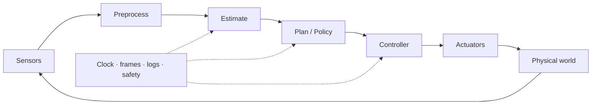
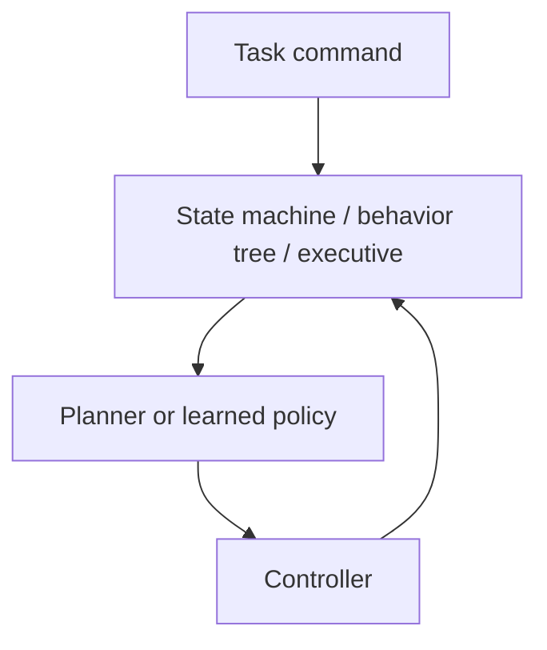
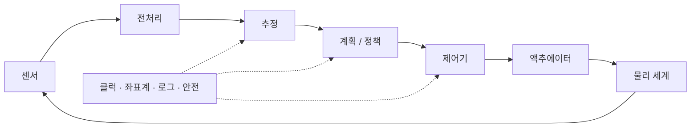
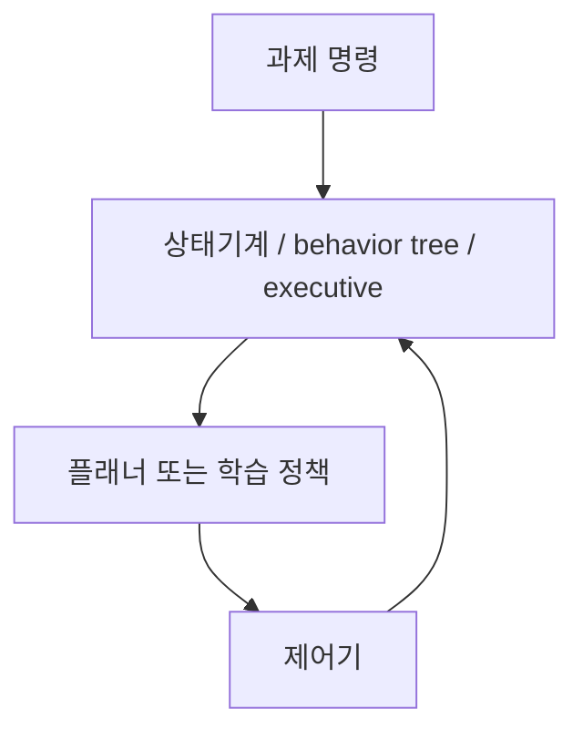

## English

*Group F. Stands on [[04-robotics/state-estimation-slam|3]], [[04-robotics/planning-decision-making|4]], [[04-robotics/control-theory-ce397|5]] plus signal processing and [[02-foundations/se3-geometry|SE(3)]].
What an algorithm still needs before it is a robot: clocks, frames, rates, logs, and the failures that live between blocks.*

A paper algorithm becomes a robot only when sensors, clocks, coordinate frames, computers, networks, controllers, actuators, safety logic, and logging work together. Systems literacy lets a reader determine what was actually deployed and where a reported improvement may have originated.

*Scope: this page teaches the runtime concerns that sit between an algorithm and a robot — the loop, action interfaces, the latency budget with its deadlines and jitter, frames and the TF tree, middleware vocabulary, the execution layer and its behavior trees, the architecture lineages behind that layer and the formal task specifications of §6.5 (linear temporal logic, model checking versus reactive synthesis, realizability, the GR(1) fragment and signal temporal logic, taught from Boolean propositions up), reliability, staged deployment and the failure taxonomy. It does not teach ROS 2 itself, which is the eleven pages of [[04-robotics/ros2/index|25. ROS 2]], nor control design ([[04-robotics/control-theory-ce397|5. Control]]), estimation ([[04-robotics/state-estimation-slam|3. State Estimation]]) or planning ([[04-robotics/planning-decision-making|4. Planning]]). It teaches what to check about them, and it is not an electronics or installation tutorial.*

> [!info] Depth target
> Decompose a robot into its runtime pipeline; interpret action interfaces, timing, frames, middleware, reliability, simulation, and logging; and diagnose failures at subsystem boundaries. This is not a ROS installation or electronics tutorial.

> [!note] Prerequisites
> [[02-foundations/lab-plants|0.6 Lab Plants]] (plant P6) · [[02-foundations/signal-processing|Signal Processing]] · [[02-foundations/se3-geometry|3D Geometry & SE(3)]] · [[04-robotics/state-estimation-slam|State Estimation]] · [[04-robotics/planning-decision-making|Planning]] · [[04-robotics/control-theory-ce397|Control Theory]]. §6.5's temporal logic assumes no logic course: it defines the propositions and connectives it uses.

> [!note] First pass · 처음이라면
> This is a checklist page more than a narrative. First pass: the picture, §1 for the loop, §3 for the timing budget — the single most common source of results that do not reproduce — with its worked P6 case, and §10 for the failure taxonomy. Second pass, with a specific system in front of you: §2 (action interfaces), §4 (frames), §5 (middleware), §6 (the execution layer), §6.5 (architecture lineages and temporal-logic specifications, the page's one formal subsection), §7–§9 (reliability, calibration, staged deployment) and §11 (resources).

### The picture · 그림으로 먼저 보기

<svg viewBox="0 0 560 356" style="max-width:100%;height:auto" role="img" aria-label="P6 on one time axis in milliseconds: vision ticks every 20 ms above, control ticks every 5 ms below, the five instants of one cycle, the 70 ms budget bar with its sampling segment, and a 200 ms stale goal drawn lighter">
  <line x1="96.6" y1="142" x2="530" y2="142" stroke="currentColor" stroke-width="1.2" stroke-opacity="0.8"/>
  <line x1="96.6" y1="118" x2="96.6" y2="142" stroke="currentColor" stroke-width="1.3" stroke-opacity="0.85"/>
  <line x1="136" y1="118" x2="136" y2="142" stroke="currentColor" stroke-width="1.3" stroke-opacity="0.85"/>
  <line x1="175.4" y1="118" x2="175.4" y2="142" stroke="currentColor" stroke-width="1.3" stroke-opacity="0.85"/>
  <line x1="214.8" y1="118" x2="214.8" y2="142" stroke="currentColor" stroke-width="1.3" stroke-opacity="0.85"/>
  <line x1="254.2" y1="118" x2="254.2" y2="142" stroke="currentColor" stroke-width="1.3" stroke-opacity="0.85"/>
  <line x1="293.6" y1="118" x2="293.6" y2="142" stroke="currentColor" stroke-width="1.3" stroke-opacity="0.85"/>
  <line x1="333" y1="118" x2="333" y2="142" stroke="currentColor" stroke-width="1.3" stroke-opacity="0.85"/>
  <line x1="372.4" y1="118" x2="372.4" y2="142" stroke="currentColor" stroke-width="1.3" stroke-opacity="0.85"/>
  <line x1="411.8" y1="118" x2="411.8" y2="142" stroke="currentColor" stroke-width="1.3" stroke-opacity="0.85"/>
  <line x1="451.2" y1="118" x2="451.2" y2="142" stroke="currentColor" stroke-width="1.3" stroke-opacity="0.85"/>
  <line x1="490.6" y1="118" x2="490.6" y2="142" stroke="currentColor" stroke-width="1.3" stroke-opacity="0.85"/>
  <line x1="530" y1="118" x2="530" y2="142" stroke="currentColor" stroke-width="1.3" stroke-opacity="0.85"/>
  <line x1="96.6" y1="142" x2="96.6" y2="149" stroke="currentColor" stroke-width="0.9" stroke-opacity="0.6"/>
  <line x1="106.5" y1="142" x2="106.5" y2="149" stroke="currentColor" stroke-width="0.9" stroke-opacity="0.6"/>
  <line x1="116.3" y1="142" x2="116.3" y2="149" stroke="currentColor" stroke-width="0.9" stroke-opacity="0.6"/>
  <line x1="126.2" y1="142" x2="126.2" y2="149" stroke="currentColor" stroke-width="0.9" stroke-opacity="0.6"/>
  <line x1="136" y1="142" x2="136" y2="149" stroke="currentColor" stroke-width="0.9" stroke-opacity="0.6"/>
  <line x1="145.8" y1="142" x2="145.8" y2="149" stroke="currentColor" stroke-width="0.9" stroke-opacity="0.6"/>
  <line x1="155.7" y1="142" x2="155.7" y2="149" stroke="currentColor" stroke-width="0.9" stroke-opacity="0.6"/>
  <line x1="165.6" y1="142" x2="165.6" y2="149" stroke="currentColor" stroke-width="0.9" stroke-opacity="0.6"/>
  <line x1="175.4" y1="142" x2="175.4" y2="149" stroke="currentColor" stroke-width="0.9" stroke-opacity="0.6"/>
  <line x1="185.2" y1="142" x2="185.2" y2="149" stroke="currentColor" stroke-width="0.9" stroke-opacity="0.6"/>
  <line x1="195.1" y1="142" x2="195.1" y2="149" stroke="currentColor" stroke-width="0.9" stroke-opacity="0.6"/>
  <line x1="204.9" y1="142" x2="204.9" y2="149" stroke="currentColor" stroke-width="0.9" stroke-opacity="0.6"/>
  <line x1="214.8" y1="142" x2="214.8" y2="149" stroke="currentColor" stroke-width="0.9" stroke-opacity="0.6"/>
  <line x1="224.7" y1="142" x2="224.7" y2="149" stroke="currentColor" stroke-width="0.9" stroke-opacity="0.6"/>
  <line x1="234.5" y1="142" x2="234.5" y2="149" stroke="currentColor" stroke-width="0.9" stroke-opacity="0.6"/>
  <line x1="244.3" y1="142" x2="244.3" y2="149" stroke="currentColor" stroke-width="0.9" stroke-opacity="0.6"/>
  <line x1="254.2" y1="142" x2="254.2" y2="149" stroke="currentColor" stroke-width="0.9" stroke-opacity="0.6"/>
  <line x1="264.1" y1="142" x2="264.1" y2="149" stroke="currentColor" stroke-width="0.9" stroke-opacity="0.6"/>
  <line x1="273.9" y1="142" x2="273.9" y2="149" stroke="currentColor" stroke-width="0.9" stroke-opacity="0.6"/>
  <line x1="283.8" y1="142" x2="283.8" y2="149" stroke="currentColor" stroke-width="0.9" stroke-opacity="0.6"/>
  <line x1="293.6" y1="142" x2="293.6" y2="149" stroke="currentColor" stroke-width="0.9" stroke-opacity="0.6"/>
  <line x1="303.4" y1="142" x2="303.4" y2="149" stroke="currentColor" stroke-width="0.9" stroke-opacity="0.6"/>
  <line x1="313.3" y1="142" x2="313.3" y2="149" stroke="currentColor" stroke-width="0.9" stroke-opacity="0.6"/>
  <line x1="323.1" y1="142" x2="323.1" y2="149" stroke="currentColor" stroke-width="0.9" stroke-opacity="0.6"/>
  <line x1="333" y1="142" x2="333" y2="149" stroke="currentColor" stroke-width="0.9" stroke-opacity="0.6"/>
  <line x1="342.9" y1="142" x2="342.9" y2="149" stroke="currentColor" stroke-width="0.9" stroke-opacity="0.6"/>
  <line x1="352.7" y1="142" x2="352.7" y2="149" stroke="currentColor" stroke-width="0.9" stroke-opacity="0.6"/>
  <line x1="362.5" y1="142" x2="362.5" y2="149" stroke="currentColor" stroke-width="0.9" stroke-opacity="0.6"/>
  <line x1="372.4" y1="142" x2="372.4" y2="149" stroke="currentColor" stroke-width="0.9" stroke-opacity="0.6"/>
  <line x1="382.2" y1="142" x2="382.2" y2="149" stroke="currentColor" stroke-width="0.9" stroke-opacity="0.6"/>
  <line x1="392.1" y1="142" x2="392.1" y2="149" stroke="currentColor" stroke-width="0.9" stroke-opacity="0.6"/>
  <line x1="401.9" y1="142" x2="401.9" y2="149" stroke="currentColor" stroke-width="0.9" stroke-opacity="0.6"/>
  <line x1="411.8" y1="142" x2="411.8" y2="149" stroke="currentColor" stroke-width="0.9" stroke-opacity="0.6"/>
  <line x1="421.6" y1="142" x2="421.6" y2="149" stroke="currentColor" stroke-width="0.9" stroke-opacity="0.6"/>
  <line x1="431.5" y1="142" x2="431.5" y2="149" stroke="currentColor" stroke-width="0.9" stroke-opacity="0.6"/>
  <line x1="441.4" y1="142" x2="441.4" y2="149" stroke="currentColor" stroke-width="0.9" stroke-opacity="0.6"/>
  <line x1="451.2" y1="142" x2="451.2" y2="149" stroke="currentColor" stroke-width="0.9" stroke-opacity="0.6"/>
  <line x1="461.1" y1="142" x2="461.1" y2="149" stroke="currentColor" stroke-width="0.9" stroke-opacity="0.6"/>
  <line x1="470.9" y1="142" x2="470.9" y2="149" stroke="currentColor" stroke-width="0.9" stroke-opacity="0.6"/>
  <line x1="480.8" y1="142" x2="480.8" y2="149" stroke="currentColor" stroke-width="0.9" stroke-opacity="0.6"/>
  <line x1="490.6" y1="142" x2="490.6" y2="149" stroke="currentColor" stroke-width="0.9" stroke-opacity="0.6"/>
  <line x1="500.4" y1="142" x2="500.4" y2="149" stroke="currentColor" stroke-width="0.9" stroke-opacity="0.6"/>
  <line x1="510.3" y1="142" x2="510.3" y2="149" stroke="currentColor" stroke-width="0.9" stroke-opacity="0.6"/>
  <line x1="520.1" y1="142" x2="520.1" y2="149" stroke="currentColor" stroke-width="0.9" stroke-opacity="0.6"/>
  <line x1="530" y1="142" x2="530" y2="149" stroke="currentColor" stroke-width="0.9" stroke-opacity="0.6"/>
  <text x="136" y="162" font-size="11" fill="currentColor" text-anchor="middle" fill-opacity="0.8">0</text>
  <text x="175.4" y="162" font-size="11" fill="currentColor" text-anchor="middle" fill-opacity="0.8">20</text>
  <text x="214.8" y="162" font-size="11" fill="currentColor" text-anchor="middle" fill-opacity="0.8">40</text>
  <text x="254.2" y="162" font-size="11" fill="currentColor" text-anchor="middle" fill-opacity="0.8">60</text>
  <text x="293.6" y="162" font-size="11" fill="currentColor" text-anchor="middle" fill-opacity="0.8">80</text>
  <text x="333" y="162" font-size="11" fill="currentColor" text-anchor="middle" fill-opacity="0.8">100</text>
  <text x="372.4" y="162" font-size="11" fill="currentColor" text-anchor="middle" fill-opacity="0.8">120</text>
  <text x="411.8" y="162" font-size="11" fill="currentColor" text-anchor="middle" fill-opacity="0.8">140</text>
  <text x="451.2" y="162" font-size="11" fill="currentColor" text-anchor="middle" fill-opacity="0.8">160</text>
  <text x="490.6" y="162" font-size="11" fill="currentColor" text-anchor="middle" fill-opacity="0.8">180</text>
  <text x="530" y="162" font-size="11" fill="currentColor" text-anchor="middle" fill-opacity="0.8">200 ms</text>
  <text x="530" y="111" font-size="11" fill="currentColor" text-anchor="end" fill-opacity="0.85">vision · 50 Hz: a tall tick every 20 ms</text>
  <text x="530" y="178" font-size="11" fill="currentColor" text-anchor="end" fill-opacity="0.85">control · 200 Hz: a short tick every 5 ms</text>
  <circle cx="136" cy="142" r="2.4" fill="currentColor" fill-opacity="1"/>
  <text x="136" y="110" font-size="11.5" fill="currentColor" text-anchor="middle">exposure midpoint</text>
  <circle cx="244.3" cy="142" r="2.4" fill="currentColor" fill-opacity="1"/>
  <path d="M244.3 138 V32 H285.9" fill="none" stroke="currentColor" stroke-width="0.9" stroke-opacity="0.6" stroke-dasharray="2 2"/>
  <text x="289.9" y="36" font-size="11.5" fill="currentColor">vision publish</text>
  <circle cx="258.1" cy="142" r="2.4" fill="currentColor" fill-opacity="1"/>
  <path d="M258.1 138 V50 H285.9" fill="none" stroke="currentColor" stroke-width="0.9" stroke-opacity="0.6" stroke-dasharray="2 2"/>
  <text x="289.9" y="54" font-size="11.5" fill="currentColor">controller’s TF lookup</text>
  <circle cx="264.1" cy="142" r="2.4" fill="currentColor" fill-opacity="1"/>
  <path d="M264.1 138 V68 H285.9" fill="none" stroke="currentColor" stroke-width="0.9" stroke-opacity="0.6" stroke-dasharray="2 2"/>
  <text x="289.9" y="72" font-size="11.5" fill="currentColor">controller tick that consumes the goal</text>
  <circle cx="273.9" cy="142" r="2.4" fill="currentColor" fill-opacity="1"/>
  <path d="M273.9 138 V86 H285.9" fill="none" stroke="currentColor" stroke-width="0.9" stroke-opacity="0.6" stroke-dasharray="2 2"/>
  <text x="289.9" y="90" font-size="11.5" fill="currentColor">current reaches the motor</text>
  <rect x="96.6" y="190" width="19.7" height="16" fill="none" stroke="currentColor" stroke-width="1" stroke-opacity="0.55" stroke-dasharray="3 2"/>
  <rect x="116.3" y="190" width="19.7" height="16" fill="currentColor" fill-opacity="0.12" stroke="currentColor" stroke-width="1" stroke-opacity="0.8" stroke-dasharray="3 2"/>
  <rect x="136" y="190" width="137.9" height="16" fill="currentColor" fill-opacity="0.24" stroke="currentColor" stroke-width="1.3"/>
  <text x="204.9" y="202" font-size="11.5" fill="currentColor" text-anchor="middle" font-weight="600">70 ms budget</text>
  <text x="204.9" y="223" font-size="11" fill="currentColor" text-anchor="middle">70/20 = 3.5 vision periods</text>
  <text x="204.9" y="237" font-size="11" fill="currentColor" text-anchor="middle">70/5 = 14 control ticks</text>
  <text x="91.6" y="195" font-size="11" fill="currentColor" text-anchor="end">sampling</text>
  <text x="91.6" y="209" font-size="11" fill="currentColor" text-anchor="end">½T<tspan dy="3">cam</tspan><tspan dy="-3" dx="3">= 10 ms</tspan></text>
  <text x="91.6" y="223" font-size="11" fill="currentColor" text-anchor="end" fill-opacity="0.75">worst 20 ms</text>
  <line x1="273.9" y1="206" x2="273.9" y2="260" stroke="currentColor" stroke-width="0.9" stroke-opacity="0.5" stroke-dasharray="3 3"/>
  <rect x="136" y="262" width="394" height="10" fill="currentColor" fill-opacity="0.09" stroke="currentColor" stroke-width="1" stroke-opacity="0.5"/>
  <text x="130" y="271" font-size="11" fill="currentColor" text-anchor="end" fill-opacity="0.85">200 ms late</text>
  <text x="530" y="256" font-size="11" fill="currentColor" text-anchor="end" fill-opacity="0.85">40 ticks on a stale goal (200/5)</text>
  <path d="M273.9 278 v6 H530.0 v-6" fill="none" stroke="currentColor" stroke-width="1" stroke-opacity="0.7"/>
  <text x="401.9" y="298" font-size="11" fill="currentColor" text-anchor="middle">200 − 70 = 130 ms over budget</text>
  <text x="12" y="312" font-size="11" fill="currentColor">At 0.10 m/s the cart moves 20 mm while that goal ages 200 ms:</text>
  <text x="12" y="326" font-size="11" fill="currentColor">20 mm ÷ 0.488 mm per count (1000/2048) = 41 counts the goal never knew about.</text>
  <text x="12" y="344" font-size="11" fill="currentColor" fill-opacity="0.7">P6 fixes only the bar’s two ends; the three instants inside it are illustrative.</text>
</svg>

**P6** from [[02-foundations/lab-plants|0.6 Lab Plants]], the cart at its catalog rates on one time axis in milliseconds: vision ticks every $20\,\mathrm{ms}$ above, control ticks every $5\,\mathrm{ms}$ below, and the five instants of one cycle, from the exposure midpoint to current reaching the motor, inside the $70\,\mathrm{ms}$ budget of $3.5$ vision periods and $14$ control ticks, with the sampling term $\tfrac12 T_{\text{cam}}=10\,\mathrm{ms}$ (worst $20\,\mathrm{ms}$) as a segment of its own. The lighter bar is a goal that reaches the controller $200\,\mathrm{ms}$ late: $130\,\mathrm{ms}$ over budget, $40$ control ticks on a stale goal, and at $0.10\,\mathrm{m/s}$ the cart has moved $20\,\mathrm{mm}$, $41$ counts of $0.488\,\mathrm{mm}$, that the goal never knew about. P6 fixes only the budget bar's two ends; the three instants inside it are illustrative.

### 1. The closed robot stack



The blocks can run at different rates. A 30 Hz camera, 10 Hz policy, and 1 kHz motor controller are not inconsistent, but their data age and interfaces must be designed explicitly.

> [!tip] The four axes a robot system is actually designed along
> The stack above is a data-flow picture. The *design* picture — the one that decides whether
> a system works on a deadline — is Eppner et al.'s post-mortem of the winning entry to the
> Amazon Picking Challenge 2015 (RSS 2016). They argue a robotic system is placed along four
> spectra, and that the winning system's placement along each of them differed from most other entries:
>
> | Axis | The trade |
> |---|---|
> | **Modularity vs. integration** | clean interfaces are debuggable; tightly integrated ones exploit information a module boundary would have discarded |
> | **Generality vs. assumptions** | every assumption you are willing to state buys performance and costs a failure mode when it breaks |
> | **Computation vs. embodiment** | a compliant gripper or a funnel-shaped fixture solves in mechanics what would otherwise be a perception and control problem |
> | **Planning vs. feedback** | deliberating in advance versus reacting during execution, and how much of each the task's uncertainty justifies |
>
> The third axis is the one most often skipped by a learning-first reader, and it is the same
> observation [[04-robotics/grasping|15 §5]] makes about extrinsic dexterity: geometry you
> arrange in advance is capability you do not have to compute.
>
> The paper also names concrete choices on two other axes. On *modularity vs. integration*, the
> team matched perception to the gripper: a suction cup succeeds once it touches any pickable side,
> so object recognition only had to deliver a rough bounding-box pose, not an exact one. On
> *planning vs. feedback*, picks came from pre-defined sequences of force-guarded feedback
> controllers switched by sensor events (touch the object, then turn on suction), with the arm on a
> mobile base so that motion planning was mostly unnecessary.

### 2. Embodiment and action interfaces

Embodiment includes morphology, actuator and transmission, sensing, compliance, payload, limits, and environment coupling. Motors, hydraulics, gearing, backlash, saturation, underactuation, and bandwidth determine which actions are meaningful. One geared electric drive opened up, with its two equations, torque–speed line, reflected inertia and thermal limit, is [[04-robotics/actuators-drives|10.5 Actuators & Drives]].

When a paper says “action,” identify whether it means joint position, velocity, torque, motor current, end-effector pose, [[04-robotics/force-compliance-control|impedance target]] (a desired stiffness and damping around a reference, not a position to hit exactly), or a high-level skill. The same learned model can behave differently when the low-level interface and control rate change. An end-effector-pose action does not reach a motor until [[04-robotics/modern-robotics/ch06-inverse-kinematics|inverse kinematics (MR ch.6)]] resolves it — including its branch choices and singularities — and a waypoint action does not become motion until [[04-robotics/modern-robotics/ch09-trajectory-generation|time scaling (MR ch.9)]] gives it a velocity profile inside the actuator limits. On a wheeled base, both sit on the [[04-robotics/modern-robotics/ch13-wheeled-mobile-robots|nonholonomic kinematics of MR ch.13]].

### 3. Timing and a latency budget

| Component | Example latency |
|---|---:|
| Camera exposure/readout | 15 ms |
| Network inference | 40 ms |
| Communication | 10 ms |
| Command processing | 5 ms |
| **Observation-to-action** | **70 ms** |

At 1 m/s, 70 ms corresponds to 7 cm of motion before the new command has effect. Frequency is not latency: a 30 Hz system may still act on old frames. Check sampling rate, inference rate, jitter, deadline misses, queueing, timestamp policy, and whether latency was measured end-to-end. Whether a distance like those 7 cm is too large depends on what it would correct: set against an estimate's σ, it is the staleness distance of [[04-robotics/capstone-panel-contact|26. Capstone §5]].

**The budget, as a sum.** **Observation-to-action latency** $L$ is the elapsed time from the physical event to the moment the command derived from that event takes effect on the actuator. It is not one measurement but a sum of named terms, each of which some component owns:

$$L=\tfrac12 T_{\text{cam}}+t_{\text{exp}}+t_{\text{tx}}+t_{\text{inf}}+t_{\text{dec}}+T_{\text{ctrl}}$$

The terms add because the stages are in series and each must finish before the next begins. Each one:

- $\tfrac12 T_{\text{cam}}$ — **sampling latency**. The event occurs at a uniformly random moment inside one frame period $T_{\text{cam}}$, so on average it waits half a period before it is sampled at all, and a full period in the worst case. This is the term that does not appear in a block diagram and is the reason a *rate* is not a *latency*.
- $t_{\text{exp}}$ — **exposure and readout**, from the start of integration to the last row leaving the sensor.
- $t_{\text{tx}}$ — **transport**, the wire or bus to whichever computer runs the model.
- $t_{\text{inf}}$ — **inference**, the forward pass itself. This is the only term most papers report.
- $t_{\text{dec}}$ — **decoding and IPC**, turning a network output into a command message and delivering it.
- $T_{\text{ctrl}}$ — **actuation**, one controller period before the command is applied.

**Non-example:** adding the *rates* is not a budget. "A 30 Hz camera, a 25 Hz policy and a 500 Hz controller" does not reduce to any latency at all, because rates do not add, and the fastest stage in a series chain still contributes its own fixed delay. Two systems with identical rates can differ by 50 ms in $L$ purely in queueing and timestamp policy.

**Deadline and jitter, defined.** A periodic task with period $T$ is **released** at $r_k=r_0+kT$ and finishes at $f_k$, so its **response time** is $R_k=f_k-r_k$. Its **deadline** $D$ is the time after release by which it must finish, usually $D=T$, and a **deadline miss** is any instance with $R_k>D$. The strength of the deadline is a separate claim from its value, and there are three:

- **hard** — a single miss is a system failure (the loop holding a stiff contact, a brake release);
- **firm** — a late result is worthless and is discarded, but discarding it is survivable (a dropped perception frame);
- **soft** — a late result is degraded but still worth having (a map update, an operator display).

**Jitter** is the *spread* of a timing quantity across instances, never its mean, and it is reported peak-to-peak:

$$J=\max_k R_k-\min_k R_k$$

since what a deadline argument needs is the extreme and not the centre — a standard deviation hides exactly the tail that misses. Release jitter and output jitter are defined the same way on the other two instants.

> [!example] Worked example · 계산 예제
> P6's control loop at 200 Hz, so $T=D=5$ ms. Five measured response times: $1.2, 1.5, 4.8, 1.3, 1.4$ ms. The mean is $2.04$ ms, the peak-to-peak jitter is $4.8-1.2=\mathbf{3.6}$ ms, there are **zero** deadline misses, and the margin at the worst instance is $5.0-4.8=0.2$ ms — that tick used $96\%$ of its period.
>
> **Non-example — quoting the mean as the rate.** $1000/2.04=490$ Hz describes a loop that does not exist. The loop is 200 Hz, and one tick in five came within $0.2$ ms of missing. The mean is the number that looks good in a table; the maximum is the number that decides whether the system works. Move the identical task under the $1$ ms haptic deadline named below and **all five** instances miss, with no change to the mean at all.

**Worked: plant P6.** Encoder $N=2048$ counts/m, so one count is $1000/2048=0.488\,\mathrm{mm}$. Vision at $50\,\mathrm{Hz}$ ($20\,\mathrm{ms}$), control at $200\,\mathrm{Hz}$ ($5\,\mathrm{ms}$), budget $70\,\mathrm{ms}$ from camera mid-exposure to force ([[02-foundations/lab-plants|0.6]]). A vision message $200\,\mathrm{ms}$ old at the controller is $130\,\mathrm{ms}$ over budget and $200/5=40$ stale ticks. At $0.10\,\mathrm{m/s}$ the cart travels $20\,\mathrm{mm}$ ($41$ counts) in that age. The estimator on [[04-robotics/state-estimation-slam|3]] cannot save you: the goal is late, not noisy. The problem set is this timeline as a drawing. The silent-failure drill (TF stamp, QoS) is [[04-robotics/ros2/qos-executors-time|25.5]]. What P6's sensors do contribute as noise, sensor by sensor, is modelled on [[04-robotics/sensor-models|3.2 Sensor Models & Noise]]. Budgets tighten by more than an
order of magnitude when the loop renders stiff contact: a haptic servo must close in about 1 ms with bounded jitter,
against this page's 70 ms observation-to-action budget,
so the millisecond is the unit rather than the frame
([[04-robotics/haptics-teleoperation/rendering-sampling-stability|24.4 Rendering, Sampling & Stability]]).

<svg viewBox="0 0 470 200" style="max-width:100%;height:auto" role="img" aria-label="the 70 ms observation-to-action budget drawn to scale">
  <rect x="60.0" y="60" width="69.0" height="30" fill="currentColor" fill-opacity="0.30" stroke="currentColor" stroke-width="1.1"/><rect x="129.0" y="60" width="184.0" height="30" fill="currentColor" fill-opacity="0.16" stroke="currentColor" stroke-width="1.1"/><rect x="313.0" y="60" width="46.0" height="30" fill="currentColor" fill-opacity="0.30" stroke="currentColor" stroke-width="1.1"/><rect x="359.0" y="60" width="23.0" height="30" fill="currentColor" fill-opacity="0.16" stroke="currentColor" stroke-width="1.1"/>
  <g stroke="currentColor" stroke-width="1" opacity="0.4"><line x1="60" y1="104" x2="382.0" y2="104"/><line x1="60" y1="98" x2="60" y2="110"/><line x1="382.0" y1="98" x2="382.0" y2="110"/></g>
  <g stroke="currentColor" stroke-width="1" opacity="0.35" stroke-dasharray="3 3"><line x1="60" y1="40" x2="60" y2="60"/><line x1="382.0" y1="40" x2="382.0" y2="60"/></g>
  <g font-size="10.5" fill="currentColor" text-anchor="middle">
    <text x="94.5" y="80">15</text><text x="221.0" y="80">40</text><text x="336.0" y="80">10</text><text x="370.5" y="80">5</text>
    <text x="64.0" y="52">light hits the sensor</text><text x="378.0" y="52">command takes effect</text>
    <text x="221.0" y="122">70 ms observation &#8594; action</text>
  </g>
  <g font-size="10.5" fill="currentColor">
    <text x="60" y="146">camera 15 &#183; inference 40 &#183; comms 10 &#183; command 5 (ms), to scale</text>
    <text x="60" y="161">at 1 m/s the robot travels 7 cm inside this bar</text>
  </g>
  <g font-size="11" fill="currentColor">
    <text x="20" y="180" opacity="0.9">Inference is over half the budget. And note that &#8220;we run at 30 Hz&#8221;</text>
    <text x="20" y="195" opacity="0.9">answers a different question than &#8220;how stale was the frame you acted on?&#8221;</text>
  </g>
</svg>


> [!example] Worked example · 계산 예제
> **Adding up one loop.** Take a representative visuomotor stack: 30 Hz camera (mean sampling
> latency $\tfrac{1}{2}\times 33.3 = 16.7$ ms), exposure and readout 12 ms, transport to the GPU
> host 5 ms, policy inference 40 ms, action decoding and IPC 3 ms, and a 500 Hz joint
> controller (2 ms). Total $16.7 + 12 + 5 + 40 + 3 + 2 = \mathbf{79}$ ms.
>
> **What it costs, twice over.** As *staleness*: the end-effector moving at 0.3 m/s has
> travelled $0.3 \times 0.079 = 24$ mm by the time its own image produces an action. Against a
> $\pm 10$ mm grasp tolerance you must either slow to $0.010/0.079 = 0.13$ m/s or predict
> forward. As *dead time in a feedback loop*, a delay $T$ contributes $360 fT$ degrees of
> phase lag at a signal frequency $f$ in Hz, because a delay of $T$ seconds is the fraction $fT$ of one period.
> If the loop had 90° margin before the delay and must retain 45°, the delay may use at most 45° at the
> crossover frequency $f$: $360fT\le 45°$, so $f\le 45°/(360T)$. With $T=0.079$ s this
> gives the illustrative crossover budget $(90°-45°)/(360T)=\mathbf{1.6}$ Hz. This is not
> a universal cap: the plant and controller determine the pre-delay margin, and adding delay
> can move the crossover. [[04-robotics/control-theory-ce397|5. Control §5.5]] derives this
> conditional budget and explains when it applies.
>
> **Mean versus worst case.** The jitter distinction of the P6 callout above re-reads this total. The $79$ ms ($78.7$ ms before rounding) is the *mean* budget; replacing the sampling term $\tfrac12 T_{\text{cam}}=16.7$ ms by its worst case $T_{\text{cam}}=33.3$ ms gives $16.7+78.7=\mathbf{95.3}$ ms. That $16.7$ ms gap is jitter and not bias, so no calibration removes it: a controller tuned on the mean budget meets a disturbance that is $16.7/78.7=21\%$ staler than designed, and at $0.3$ m/s the end-effector's staleness runs from $0.3\times0.0787=24$ mm to $0.3\times0.0953=29$ mm between one frame and the next.
>
> **The reading this gives you.** Halving inference time (40 → 20 ms) moves the total to 59 ms
> and, under the same illustrative 90°/45° assumptions, the budget to
> $0.785/0.059 = 13.3$ rad/s, i.e. 2.1 Hz — real, but a 1.3× gain,
> not the 2× the headline suggests, because inference is only half the budget. It also tells you what to ask of any paper
> reporting a policy frequency: 10 Hz inference is not a 10 Hz loop, and the difference is
> everything the rest of this table holds.

### 4. Coordinate frames and TF trees

Common frames include world, map, odom, base, sensor, end-effector, tool, and object. Every transform needs a direction and timestamp. A plausible numeric matrix in the wrong convention can create a systematic failure that learning cannot repair reliably.

**A transform, and the direction that names it.** A transform ${}^{a}T_{b}\in SE(3)$ has two readings that are the same matrix: it takes the coordinates of a point in frame $b$ to its coordinates in frame $a$, and it *is* the pose of frame $b$ expressed in frame $a$. Written with both indices, transforms chain by cancelling the inner one, and invert by transposing the rotation:

$${}^{a}T_{c}={}^{a}T_{b}\,{}^{b}T_{c},\qquad {}^{b}T_{a}=\big({}^{a}T_{b}\big)^{-1}=\begin{pmatrix}R^{\top} & -R^{\top}t\\ 0 & 1\end{pmatrix}$$

The inverse takes that form because undoing the transform must undo the rotation before it undoes the translation. **Non-example, and this is the "plausible matrix" above:** the inverse is *not* the same rotation with a negated translation. Take ${}^{a}T_{b}$ with a $90°$ yaw and $t=(1,0)$ m. The correct inverse translation is $-R^{\top}t=(0,1)$ m, while negating gives $(-1,0)$ m — identical magnitude, perfectly plausible in a log, and $1.41$ m wrong. [[02-foundations/se3-geometry|SE(3)]] supplies this algebra; a TF tree supplies the runtime bookkeeping.

**A TF tree, defined.** It is a directed graph whose nodes are frames and whose edges are timestamped parent-to-child transforms, subject to three conditions that make it a *tree*: every frame has exactly one parent; exactly one frame, the root, has none; and there are no cycles. Three consequences follow, and each is a failure mode when it is violated. There is exactly one path between any two frames, so a lookup is unambiguous and is just the composition along that path. Two publishers writing the same child frame is an error rather than a merge, because a frame with two parents is not a tree — the effect is a transform that flickers between two answers. And because every edge carries a stamp, a lookup is a query *at a time*, interpolated between the stamps that bracket it; a query outside the buffer fails rather than extrapolating, which is the correct behaviour and a common source of "it works in the bag but not live".

**The conventions worth memorising.** REP-103 fixes axes and units: right-handed, $x$ forward, $y$ left, $z$ up on a robot body, ENU in geographic frames, SI units and radians. REP-105 fixes the mobile-robot chain, `map` → `odom` → `base_link` → sensor frames, each the parent of the next. `odom` is continuous but drifts without bound; `map` is drift-free but discontinuous. The reason for *that* ordering is the one-parent rule: `base_link` already has `odom` as its parent and cannot have a second, so a localisation system may not re-parent it and publishes the `map` → `odom` edge instead, folding the entire global correction into that single transform. Every "the map jumped" story is that edge being rewritten.

For example, suppose the base sits at $(1.0, 2.0)$ m in odom and a goal is stored in map at $(5.0, 2.0)$ m. While `map` → `odom` is the identity the goal is at odom $(5.0, 2.0)$, $4.00$ m ahead. A loop closure now corrects the global estimate by 30 cm, which is published as a `map` → `odom` translation of $(0.30, 0)$ m, so the same stored goal is at odom $(4.70, 2.0)$ and is $3.70$ m ahead: the goal moved 30 cm while the robot did not move at all. A path held in odom did not move, which is the whole reason a local controller is fed odom. The problem is not necessarily a bad transform matrix; it can be combining correct transforms from incompatible times. **The reading this gives you.** Trace each goal, observation, and command through its frame and timestamp. State where global correction is allowed to change a reference and how the downstream controller handles that change.

### 5. Middleware literacy

| Concept | Role |
|---|---|
| node | running component |
| topic/message | asynchronous data stream and schema |
| service | request/response operation |
| action | longer operation with feedback/cancellation |
| TF | time-indexed frame transforms |
| bag/log | recorded streams for replay and analysis |
| QoS | delivery, durability, reliability, and queue policy |

ROS is one implementation ecosystem, not the system architecture itself. “Runs on ROS” says little about latency, determinism, safety, or deployment quality.

### 6. Behavior orchestration and task execution

Between the task command and the planner/controller usually sits an **execution layer**
— a finite-state machine (FSM), behavior tree, or task executive — that decides *which*
planner, policy, or controller runs now, and what happens when it fails.



Core vocabulary: **states/behaviors** with **transitions** fired by **guards**
(conditions); **preconditions** checked before an action and **postconditions** verified
after; **timeouts** and **retries**; **fallbacks** and **recovery behaviors** when a
step fails; **action servers** with feedback and **cancellation**. A worked skeleton:

```
Idle → Detect object → Plan grasp → Execute → Verify
                                        ├─ success → Place
                                        └─ failure → Replan / Request help / Safe stop
```

Behavior trees compose these modularly and are common in field systems; FSMs are simpler
but tangle as states multiply.

**Behavior tree, defined by what a tick returns.** A behavior tree is a rooted tree whose leaves are **actions** (do something) and **conditions** (test something), and whose interior nodes are **control-flow nodes**. It is executed by a **tick**: a signal injected at the root at a fixed rate and propagated to children according to each node's type. Every ticked node returns exactly one of three statuses, and that three-valued return is the entire design:

$$\text{tick}(n)\in\{\,\textsf{Success},\ \textsf{Failure},\ \textsf{Running}\,\}$$

**Running** is the status an FSM has no equivalent for, since it means "started, not finished, tick me again": a long action therefore does not block the tree, and the status propagates upward, because a node with a Running child is itself Running. The three node families are each defined by what they return:

- **Sequence** — ticks its children left to right. Returns **Failure** at the first child that fails, **Running** at the first that is Running, and **Success** only when every child has succeeded. It is a logical **AND** over its children, and it is how a precondition is written: put the condition first, and the action after it never runs while the condition is false.
- **Fallback** (also called **selector**) — ticks left to right and returns **Success** at the first child that succeeds, **Running** at the first that is Running, and **Failure** only when every child has failed. It is a logical **OR**, and it is the recovery construct, since the children after the first are the alternatives tried in order.
- **Decorator** — has **exactly one child**, and transforms either the child's returned status or whether the child is ticked at all. `Inverter` swaps Success and Failure; `RetryUntilSuccessful(n)` re-ticks a failing child up to $n$ times; `Timeout(ms)` fails a child that runs too long; `RateController(hz)` ticks its child only at the given rate and repeats the last status in between. The one-child rule is exactly what separates a decorator from a control-flow node.

**The tick contract** is the part that gets skipped and then produces bugs. Three clauses: a tick re-enters from the **root** every cycle, so conditions are re-evaluated continuously and an action that is already Running is abandoned the moment an earlier sibling's condition turns false — that reactivity is what a tree buys over a chain of calls. A node that was Running and is no longer on the ticked path must therefore be explicitly **halted**, so every action node owes a halt implementation as well as a tick. And status is *returned*, never stored as a transition, because there are no edges between siblings at all.

*Example.* `Fallback[ Sequence[ batteryOK, Sequence[ ComputePath, FollowPath ] ], Sequence[ ClearCostmaps, Spin ] ]`. The robot navigates while the battery holds; if either navigation step returns Failure the fallback moves on to the recovery branch; and if `batteryOK` goes false mid-drive, the very next tick from the root fails the inner sequence at its condition, halts `FollowPath` without waiting for it to finish, and enters recovery. [[04-robotics/ros2/navigation-nav2|25.9 Nav2 §2]] reads one production tree, including the composite variants (`PipelineSequence`, `RecoveryNode`) and the 1 Hz replanning decorator.

**Non-example.** A tree is not an if-then-else chain evaluated once at the start of the task, and a sequence is not a program's `;` — read it that way and the re-ticking looks like wasted work instead of the mechanism. Nor is it a state machine with nicer syntax: an FSM keeps its control flow in transition edges, of which there can be up to $n(n-1)$, and every recovery rule must be duplicated on each state it can fire from, whereas a tree's control flow is only sibling order plus a three-valued return. That is what makes recovery **scoped** — the nearest enclosing fallback decides who recovers, so a planner failure need not invoke the whole system's last resort.

*Why it matters when reading.* When a paper says the robot "recovered" or "retried", a fallback node did it and not the policy: check who detects failure, who chooses the response, and what counts as terminal.

### 6.5 Architecture lineages and formal task specifications

The execution layer of §6 is the middle tier of a design robotics reached after two extremes failed, and temporal logic states what that design must guarantee precisely enough to check or to generate it.

**Three lineages.**

- **Sense–plan–act** (the Shakey-era deliberative pipeline): sensing builds a world model, a planner reasons on it, a controller executes. The planner is a bottleneck the controller waits on, and the controller never sees sensors directly, so the robot cannot react while it thinks.
- **Subsumption** (Brooks 1986): parallel reactive behaviours, each wiring sensors to actuators; a higher layer *suppresses* a lower one's input or *inhibits* its output. No world model, so reaction is fast; no long-horizon planning either.
- **Three-layer** (Gat 1998): a fast *controller*, a *sequencer* (executive) that picks the active behaviour and handles failure, and a slow *deliberator*. Each runs at its own rate, and only the deliberator may be slow.

| Tier | Rate | ROS 2 realisation |
|---|---|---|
| controller | fastest | `ros2_control` controller manager, `update_rate` default 100 Hz ([[04-robotics/ros2/simulation-and-control\|ROS 2 control]]) |
| sequencer | medium | behaviour tree; Nav2's `bt_navigator` re-ticks the planner once per second by default ([[04-robotics/ros2/navigation-nav2\|Nav2 §2]]) |
| deliberator | per task | task planner or TAMP ([[04-robotics/planning-decision-making\|4 §7]]), or a VLA/LLM planner emitting goals |

Tiers talk through §5's split: topics carry data, services and actions carry commands with a reply. **The reading this gives you.** "The LLM plans" replaces the deliberator only; recovery still lives in the sequencer and stability in the controller.

**Temporal logic.** A **proposition** is a named fact that is true or false at each step, such as $\mathit{near}$ or $\mathit{stop}$, and the Boolean connectives combine propositions within one step: $\neg\varphi$ (not), $\varphi\wedge\psi$ (and), $\varphi\vee\psi$ (or), and $\varphi\rightarrow\psi$ (if $\varphi$ then $\psi$), which is false only when $\varphi$ holds and $\psi$ does not, so it is true *vacuously* at every step where $\varphi$ is false. Temporal logic is logic about sequences over time: a formula is judged true or false of a whole run — a list of steps, each recording which propositions hold — rather than of one moment. LTL (Pnueli 1977) adds four operators to Boolean propositions over discrete steps: $\mathsf{X}\,\varphi$ (next step), $\mathsf{F}\,\varphi$ (eventually), $\mathsf{G}\,\varphi$ (always), $\varphi\,\mathsf{U}\,\psi$ ($\varphi$ at every step until $\psi$, which must occur). Patterns: safety $\mathsf{G}\,\neg\mathit{collision}$; liveness $\mathsf{G}\mathsf{F}\,\mathit{atCharger}$ (from every step, a charger visit still lies ahead, so on an infinite run the robot returns infinitely often); response $\mathsf{G}(\mathit{req}\rightarrow\mathsf{F}\,\mathit{grant})$; sequencing $\mathsf{F}(a\wedge\mathsf{F}\,b)$.

*Model checking* asks whether every behaviour of a given design satisfies $\varphi$, and returns yes or a counterexample. *Reactive synthesis* builds a controller that satisfies $\varphi$ against every sequence of environment inputs, choosing each output from the past alone, because a real robot must act before it sees the next input.

That causality is what separates two words. $\varphi$ is *satisfiable* if some input–output run meets it, and *realizable* if one controller wins against all inputs. With environment inputs $\mathit{req},\mathit{obst}$ and output $\mathit{move}$, $\mathsf{G}(\mathit{req}\rightarrow\mathsf{X}\,\mathit{move})\wedge\mathsf{G}(\mathit{obst}\rightarrow\neg\mathit{move})$ is satisfiable (any obstacle-free run), but not realizable: $\mathit{req}$ at $t$ and $\mathit{obst}$ at $t+1$ leave no valid $\mathit{move}$ at $t+1$.

Synthesis for full LTL is doubly exponential in formula size (Pnueli & Rosner 1989). Roughly, turning the formula into an automaton costs one exponential, and making that automaton deterministic, so the controller always knows which obligations are pending, costs another. So robotics uses fragments such as GR(1), *Generalized Reactivity(1)* (initial conditions, `always` step constraints, `always eventually` goals), solvable in time polynomial in the game's state space (Piterman, Pnueli & Sa'ar 2006) and applied to reactive mission and motion planning by Kress-Gerwin, Fainekos & Pappas (2009).

For continuous signals, signal temporal logic adds time intervals and real-valued predicates, with a robustness score saying by how much a signal satisfies or violates the formula (Maler & Nickovic 2004; Donzé & Maler 2010). For "distance always above 2 m" the score is the worst margin: a run whose closest approach is 2.5 m scores $+0.5$ m, and one that dips to 1.8 m scores $-0.2$ m.

**Writing a spec.** "Always keep 2 m from any worker; eventually deliver panel A then panel B; if the zone sensor fails, stop." Let $\mathit{near}$ = within 2 m of a worker (from perception), $\mathit{fail}$ = zone-sensor fault, $\mathit{dA},\mathit{dB}$ = panel delivered, $\mathit{stop}$ = zero velocity commanded. Reading "stop" as "by the next step, and stay stopped":

$$\varphi = \mathsf{G}\,\neg\mathit{near} \;\wedge\; \mathsf{F}(\mathit{dA}\wedge\mathsf{F}\,\mathit{dB}) \;\wedge\; \mathsf{G}(\mathit{fail}\rightarrow\mathsf{X}\,\mathsf{G}\,\mathit{stop})$$

This is satisfiable — any fault-free run that keeps clear of workers and delivers A then B meets it — but not realizable as written, and one environment strategy shows why. The environment controls $\mathit{fail}$, so let it raise $\mathit{fail}$ at $t_0$, before anything has been delivered. The third conjunct then demands $\mathit{stop}$ at every step from $t_1$ on; a robot commanded to zero velocity delivers nothing; so $\mathsf{F}(\mathit{dA}\wedge\mathsf{F}\,\mathit{dB})$ is false on that run whatever the controller chooses. One input sequence that defeats every controller proves the formula not realizable, the same argument as the $\mathit{req}/\mathit{obst}$ example above. So weaken the liveness part to $\mathsf{F}(\mathit{dA}\wedge\mathsf{F}\,\mathit{dB})\vee\mathsf{F}\,\mathit{fail}$, which that strategy satisfies, or state as an assumption that no fault occurs before the deliveries.

> [!example] Worked example · 계산 예제
> **Assumption: finite-trace semantics.** The logged steps $t_0,\dots,t_5$ are the whole run; $\mathsf{G}$ and $\mathsf{F}$ range over the remaining steps, and $\mathsf{X}$ at the last step is false. Trace: $t_0\,\{\}$, $t_1\,\{\mathit{dB}\}$, $t_2\,\{\mathit{dA}\}$, $t_3\,\{\mathit{fail}\}$, $t_4\,\{\mathit{stop}\}$, $t_5\,\{\mathit{stop}\}$.
>
> **$\mathsf{F}(\mathit{dA}\wedge\mathsf{F}\,\mathit{dB})$ is false.** $\mathit{dA}$ holds only at $t_2$, and the only $\mathit{dB}$ is at $t_1$, before it. The unordered $\mathsf{F}\,\mathit{dA}\wedge\mathsf{F}\,\mathit{dB}$ is true; only the nested form sees that B went first.
>
> **$\mathsf{G}(\mathit{fail}\rightarrow\mathsf{X}\,\mathsf{G}\,\mathit{stop})$ is true.** The implication is vacuous except at $t_3$, where it needs $\mathit{stop}$ at $t_4$ and $t_5$, which holds. The same-step $\mathsf{G}(\mathit{fail}\rightarrow\mathit{stop})$ is false at $t_3$: one step of reaction is a requirement decision, not notation.
>
> **The reading this gives you.** With $\mathsf{G}\,\neg\mathit{near}$ true, the full $\varphi$ is false but the weakened spec is true: this run is a correct fault stop, not a failed delivery.

```python
def ev(f, tr, i=0):  # LTL on a finite trace; X at the last step is false
    op, a = f[0], f[1:]
    if op == 'ap':  return a[0] in tr[i]
    if op == 'not': return not ev(a[0], tr, i)
    if op == 'and': return ev(a[0], tr, i) and ev(a[1], tr, i)
    if op == 'or':  return ev(a[0], tr, i) or ev(a[1], tr, i)
    if op == 'imp': return not ev(a[0], tr, i) or ev(a[1], tr, i)
    if op == 'X':   return i + 1 < len(tr) and ev(a[0], tr, i + 1)
    if op == 'F':   return any(ev(a[0], tr, j) for j in range(i, len(tr)))
    if op == 'G':   return all(ev(a[0], tr, j) for j in range(i, len(tr)))
    if op == 'U':   return any(ev(a[1], tr, j) and all(ev(a[0], tr, k) for k in range(i, j))
                               for j in range(i, len(tr)))

dA, dB, fail, stop, near = (('ap', s) for s in ['dA', 'dB', 'fail', 'stop', 'near'])
tr = [set(), {'dB'}, {'dA'}, {'fail'}, {'stop'}, {'stop'}]
seq = ('F', ('and', dA, ('F', dB)))
react = ('G', ('imp', fail, ('X', ('G', stop))))
print(ev(seq, tr), ev(('and', ('F', dA), ('F', dB)), tr))         # False True
print(ev(react, tr), ev(('G', ('imp', fail, stop)), tr))           # True False
safe = ('G', ('not', near))
print(ev(('and', safe, ('and', seq, react)), tr),                  # False
      ev(('and', safe, ('and', ('or', seq, ('F', fail)), react)), tr))  # True
```

**What to check in papers.** *Who controls each proposition*: if workers can walk toward the robot, $\mathsf{G}\,\neg\mathit{near}$ needs an assumption about human motion or must become a response; the distance itself is a standards question ([[04-robotics/hri-safety|HRI & Safety §6]]). *Grounding*: the guarantee is about the abstraction, only as good as the perception that sets $\mathit{near}$ and the controller that realises $\mathit{stop}$. *Semantics*: infinite-trace LTL and finite-trace evaluation of a log can disagree, most visibly on $\mathsf{X}$ and $\mathsf{G}$ at the end of the run.

### 7. Reliability and safety mechanisms

- Watchdog: detects missing or unhealthy updates.
- Heartbeat: periodic liveness signal.
- Timeout: declares data or command stale.
- Graceful degradation: continues with reduced capability.
- Fail-safe state: moves toward a condition intended to reduce risk.
- Emergency stop: independent means to halt hazardous motion.

Best-effort average timing is different from deterministic deadline behavior. Safety claims require system-level evidence, not merely a stable policy output.

A dead node can leave a live command because downstream hardware may retain the last accepted setpoint. For example, if a planner stops publishing while the actuator continues its previous motion, absence of new commands is not a stop command. A heartbeat can reveal liveness, but freshness and validity of the actual control data need their own checks. **The reading this gives you.** Ask who detects silence, who owns the timeout, and what command the hardware executes afterward. Test resumption as well as stopping; an old queued command should not silently regain authority when the node returns.

### 8. Calibration, configuration, and reproducibility

Record intrinsic/extrinsic calibration, zero offsets, units, frame conventions, controller gains, firmware, model weights, software commit, hardware revision, and runtime configuration. A random seed does not reproduce an experiment when calibration and physical hardware differ.

### 9. Simulation and staged deployment

| Stage | Purpose |
|---|---|
| simulation | fast and controlled development |
| software-in-the-loop | exercise software interfaces around simulated plant/sensors |
| hardware-in-the-loop | include physical compute/controllers or hardware interfaces |
| shadow mode | observe live inputs without commanding the robot |
| staged deployment | increase speed, autonomy, and environment difficulty gradually |

For a worked instance of this ladder on a force-producing device — bring-up in safe layers,
then a debugging order that separates numerical instability from mechanical resonance from a
friction limit cycle — see
[[04-robotics/haptics-teleoperation/rendering-sampling-stability|24.4 Rendering, Sampling & Stability §6]].

A [[05-construction-robotics/digital-twin-workflows|digital twin]] (a model of a specific real site or machine, kept updated from it) is not automatically a validated predictor. Ask what is synchronized, calibrated, and experimentally checked. [[05-construction-robotics/sim-to-real|Domain randomization]] (training across randomly varied simulator parameters so the real world looks like one more sample) covers only the factors and ranges that were randomized.

### 10. Failure taxonomy

Separate sensor, estimation, planning, policy, control, communication, compute, mechanical, operator, and environment failures. The visible final event may be downstream: a collision can originate from stale sensing, wrong localization, infeasible planning, poor tracking, or actuator saturation. The worked case of [[06-research-practice/failure-analysis-system-evaluation|3. Failure Analysis & System Evaluation]] applies this separation to a whole log, F1 — six failures in 200 hours of a test rig, each with one initiating category and its contributing faults and outcome kept beside it.

For example, a collision at t = 12.4 s can originate in a pose stream that stopped refreshing at t = 10.3 s. Accurate tracking of the resulting wrong path is evidence against a tracking-error diagnosis. The complete hypothetical investigation is in [[06-research-practice/failure-analysis-system-evaluation|Failure Analysis §7]]. **The reading this gives you.** Record the earliest observed contract violation separately from the downstream outcome. A missing freshness check can contribute to propagation even after the initiating estimator defect is found, so the fix may need to cross a subsystem boundary.

### 11. Resource constraints

Onboard/offboard compute changes latency, network dependence, power, thermal limits, privacy, and failure modes. Report compute, memory, bandwidth, battery/power, thermal throttling, payload, and real-time load—not model parameter count alone.

### After reading

- Draw a sense–estimate–plan–control–act pipeline.
- Identify the physical command represented by “action.”
- Distinguish rate, latency, jitter, and deadline.
- Trace a transform with correct direction and timestamp.
- Explain why ROS use or simulation success is not deployment evidence.
- Locate the execution layer (FSM/behavior tree) and what it does on failure.
- Assign a failure to its likely originating subsystem rather than its final symptom.

> [!tip] Going deeper · 더 깊이
> There is no robotics-systems textbook, and the absence is itself the field's complaint. The closest substitutes are three, and none of them is about robots exclusively: Eppner et al. (RSS 2016) on what the Amazon Picking Challenge actually taught, which is the rare paper written about integration instead of a method; the [ROS 2 concepts](https://docs.ros.org/en/rolling/Concepts.html) documentation for §5, read as a specification rather than a tutorial; and the [NASA Systems Engineering Handbook](https://www.nasa.gov/reference/systems-engineering-handbook/) for the vocabulary of §7 and §8, which robotics borrows without citing. Tedrake's [manipulation notes](https://manipulation.csail.mit.edu/) carry the systems chapters closest to this page's framing.

### Self-check

1. Why can a 50 Hz policy still have 200 ms latency?
2. Which records are needed to replay a field failure?
3. Why might an offboard VLA fail despite unchanged model accuracy?
4. What does hardware-in-the-loop establish—and not establish?
5. In a three-layer architecture, which tier may be slow, and in which tiers do Nav2's recovery subtree and a `ros2_control` joint controller sit?
6. On the finite trace $\{a\},\{b\},\{a\},\{\}$, is $\mathsf{G}(a\rightarrow\mathsf{X}\,b)$ true? Does a formula holding on every logged run show that it is realizable?

> [!tip]- Answers
> 1. Queues, batching, old timestamps, transport, and asynchronous stages can preserve high throughput while increasing age. 2. Synchronized raw sensors, transforms, commands, feedback, clocks, configuration, software/hardware versions, and operator events. 3. Network delay/loss, stale observations, deadline misses, or safe fallback. 4. It validates selected hardware/software interfaces and timing; it does not by itself validate real-world perception, contact, or task safety. 5. Only the deliberator may be slow; the recovery subtree is sequencer (executive) logic, and the joint controller is the controller tier. 6. False: $a$ at $t_2$ needs $b$ at $t_3$, which is empty (the step-$t_0$ obligation is met at $t_1$). No: logs are sample runs, so they show at most satisfiability; realizability needs one controller that wins against every environment input sequence, which is a synthesis question.

### Problem set · 과제

Tier A. Plant **P6** from [[02-foundations/lab-plants|0.6]]. The weekend ROS 2 path is [[04-robotics/ros2/index|25]]; this page is the budget and the log.

Encoder $N=2048$ counts/m. Vision publishes a goal at $50\,\mathrm{Hz}$. Controller samples the encoder and commands a motor at $200\,\mathrm{Hz}$. End-to-end budget, camera mid-exposure $\to$ applied force: $70\,\mathrm{ms}$.

1. **Draw.** The picture above, one cycle as a timeline: exposure midpoint, vision publish, TF lookup, controller tick, current to the motor. Mark the $70\,\mathrm{ms}$ budget as a bar. Put the $50\,\mathrm{Hz}$ and $200\,\mathrm{Hz}$ periods on the same axis.
2. **Derive.** (a) One encoder count in millimetres. (b) Vision period and control period. (c) If the vision message is $200\,\mathrm{ms}$ old at the controller, by how much is the budget blown, and how many control ticks ran on a stale goal? (d) A $0.10\,\mathrm{m/s}$ cart: how many millimetres does it move during those $200\,\mathrm{ms}$, and how many encoder counts is that?
3. **Do.** Fill `?`. Print counts, ticks, millimetres. No plant ODE.

```python
N, v, age, budget = 2048, 0.10, 0.200, 0.070
mm_per_count = ?
vision_T, control_T = ?, ?          # 1/50, 1/200
over = ?                             # age - budget
stale_ticks = ?                      # age / control_T
travel_mm = ?                        # v * age * 1000
travel_counts = ?                    # v * age * N
print(mm_per_count, over, stale_ticks, travel_mm, travel_counts)
```

> [!note]- How to draw it · 그리는 법
> - A single time axis in milliseconds: tall ticks every $20\,\mathrm{ms}$ above it for the vision node, short ticks every $5\,\mathrm{ms}$ below it for the controller. Both on the *same* axis is the point: two rates are two tick spacings, and nothing drawn so far is a latency.
> - The five instants, left to right: the exposure midpoint, the vision publish, the controller's TF lookup, the controller tick that consumes the goal, and current reaching the motor.
> - A bar spanning the first and the last, labelled $70\,\mathrm{ms}$, with both counts written beneath it: how many vision periods and how many control ticks it covers.
> - The sampling term $\tfrac12 T_{\text{cam}}=10\,\mathrm{ms}$ (worst case $20\,\mathrm{ms}$) as a segment of its own, not hidden inside the camera box: a budget that is not a whole number of vision periods is the ordinary case.
> - The stale overlay, in a lighter line from the same exposure midpoint: a $200\,\mathrm{ms}$ bar for a goal that reached the controller that late, with its excess over the budget and the control ticks it spans written along it.
> - Under the axis, the consequence in the units the encoder speaks: how far the cart travels at $0.10\,\mathrm{m/s}$ during that age, in millimetres and in encoder counts.
> - The drawing is wrong the moment an arrow labelled "$200\,\mathrm{Hz}$" stands in for a delay, or a noise cloud appears around the goal. Its whole job is to keep rate, latency and noise as three separate marks, because the failure it explains is a *late* goal, and no estimator on [[04-robotics/state-estimation-slam|3. State Estimation]] repairs lateness.

> [!tip]- Solutions
> 1. Vision ticks every $20\,\mathrm{ms}$; control every $5\,\mathrm{ms}$. The budget bar is 3.5 vision periods long. Force is applied on a control edge, not on a vision edge.
> 2. (a) $1000/2048=0.488\,\mathrm{mm}$. (b) $20\,\mathrm{ms}$, $5\,\mathrm{ms}$. (c) $200-70=130\,\mathrm{ms}$ over; $200/5=40$ stale ticks. (d) $0.10\times 0.200=0.020\,\mathrm{m}=20\,\mathrm{mm}=41$ counts. The estimator on [[04-robotics/state-estimation-slam|3]] cannot save you: the goal is late, not noisy.
> 3. `1000/N`, `1/50`, `1/200`, `age-budget`, `age/control_T`, `v*age*1000`, `v*age*N`. Prints $0.488$, $0.130$, $40$, $20$, $40.96$. “Nothing happens” on this plant is often a TF stamp or a QoS mismatch, not a wrong $K$ — that drill is [[04-robotics/ros2/qos-executors-time|25.5]].

### Sources

- C. Eppner, S. Höfer, R. Jonschkowski, R. Martín-Martín, A. Sieverling, V. Wall, O. Brock, "Lessons from the Amazon Picking Challenge: Four Aspects of Building Robotic Systems," *RSS 2016* (journal version: *Autonomous Robots*, 2018, DOI 10.1007/s10514-018-9761-2) — the challenge ran in 2015; the paper is 2016.

- R. A. Brooks, "A Robust Layered Control System for a Mobile Robot," *IEEE Journal of Robotics and Automation*, 2(1):14–23, 1986 — subsumption.
- N. J. Nilsson, "Shakey the Robot," SRI International Technical Note 323, 1984.
- E. Gat, "On Three-Layer Architectures," in D. Kortenkamp, R. P. Bonasso, R. Murphy (eds.), *Artificial Intelligence and Mobile Robots*, AAAI Press / MIT Press, 1998.
- A. Pnueli, "The Temporal Logic of Programs," *FOCS 1977*.
- A. Pnueli, R. Rosner, "On the Synthesis of a Reactive Module," *POPL 1989* — doubly exponential LTL synthesis.
- N. Piterman, A. Pnueli, Y. Sa'ar, "Synthesis of Reactive(1) Designs," *VMCAI 2006*, LNCS 3855 — GR(1).
- M. Kress-Gerwin, G. E. Fainekos, G. J. Pappas, "Temporal-Logic-Based Reactive Mission and Motion Planning," *IEEE Transactions on Robotics*, 25(6), 2009.
- O. Maler, D. Nickovic, "Monitoring Temporal Properties of Continuous Signals," *FORMATS/FTRTFT 2004*, LNCS 3253 — signal temporal logic.
- A. Donzé, O. Maler, "Robust Satisfaction of Temporal Logic over Real-Valued Signals," *FORMATS 2010*, LNCS 6246.
- G. De Giacomo, M. Y. Vardi, "Linear Temporal Logic and Linear Dynamic Logic on Finite Traces," *IJCAI 2013* — finite-trace semantics.
- E. M. Clarke, O. Grumberg, D. Kroening, D. Peled, H. Veith, *Model Checking*, 2nd ed., MIT Press, 2018.

- [ROS 2 Concepts](https://docs.ros.org/en/rolling/Concepts.html)
- [MIT Manipulation (Tedrake) — systems chapters](https://manipulation.csail.mit.edu/)
- [NASA Systems Engineering Handbook](https://www.nasa.gov/reference/systems-engineering-handbook/)

## 한국어

*F군이다. [[04-robotics/state-estimation-slam|3]]·[[04-robotics/planning-decision-making|4]]·[[04-robotics/control-theory-ce397|5]]번과 신호처리·[[02-foundations/se3-geometry|SE(3)]] 위에 선다.
알고리즘이 로봇이 되기까지 더 필요한 것 — 클럭, 좌표계, 주기, 로그, 그리고 블록 사이에 사는 실패들.*

논문의 알고리즘은 센서, 클럭, 좌표계, 컴퓨터, 네트워크, 제어기, 액추에이터, 안전 로직,
로깅이 함께 작동할 때에만 로봇이 된다. 시스템 문해력은 실제로 무엇이 배포됐고, 보고된
개선이 어느 하위 시스템에서 비롯됐을 수 있는지를 읽게 해 준다.

*범위: 이 페이지는 알고리즘과 로봇 사이에 앉은 런타임 사안들을 가르친다 — 루프, 행동 인터페이스, 데드라인과 지터를 포함한 지연 예산, 좌표계와 TF 트리, 미들웨어 어휘, 실행 계층과 그 behavior tree, 그 계층 뒤의 아키텍처 계보와 §6.5의 형식적 작업 명세(선형 시간 논리, 모델 검사와 반응형 합성의 차이, 실현 가능성, GR(1) 부분 논리, signal temporal logic을 불리언 명제부터 쌓아 올린다), 신뢰성, 단계적 배포와 실패 분류. ROS 2 자체는 가르치지 않는다. 그것은 [[04-robotics/ros2/index|25. ROS 2]]의 열한 페이지다. 제어 설계([[04-robotics/control-theory-ce397|5. 제어]]), 상태 추정([[04-robotics/state-estimation-slam|3. 상태 추정]]), 계획([[04-robotics/planning-decision-making|4. 계획]])도 마찬가지다. 이 페이지가 가르치는 것은 그것들에 대해 무엇을 확인할지이며, 전자공학이나 설치 튜토리얼이 아니다.*

> [!info] 깊이 목표
> 로봇을 런타임 파이프라인으로 분해한다; 행동 인터페이스, 타이밍, 좌표계, 미들웨어,
> 신뢰성, 시뮬레이션, 로깅을 해석한다; 하위 시스템 경계에서 실패를 진단한다. ROS 설치법이나
> 전자공학 튜토리얼이 아니다.

> [!note] 선수 지식
> [[02-foundations/lab-plants|0.6 Lab Plants]](플랜트 P6) · [[02-foundations/signal-processing|신호처리]] · [[02-foundations/se3-geometry|3D 기하와 SE(3)]] · [[04-robotics/state-estimation-slam|상태 추정]] · [[04-robotics/planning-decision-making|계획]] · [[04-robotics/control-theory-ce397|제어 이론]]. §6.5의 시간 논리는 논리학 강의를 가정하지 않는다. 쓰는 명제와 연결사를 그 자리에서 정의한다.

> [!note] 처음이라면 · First pass
> 이 페이지는 서사보다 체크리스트에 가깝다. 1차 통과: 그림, §1의 루프, §3의 지연 예산 — 재현되지 않는 결과의 가장 흔한 출처 — 과 그 안의 P6 계산, 그리고 §10의 실패 분류. 2차 통과는 특정 시스템을 앞에 놓고 한다: §2(행동 인터페이스), §4(좌표계), §5(미들웨어), §6(실행 계층), §6.5(아키텍처 계보와 시간 논리 명세, 이 페이지에서 유일하게 형식적인 절), §7~§9(신뢰성, 보정, 단계적 배포), §11(자원).

### 그림으로 먼저 보기 · The picture

<svg viewBox="0 0 560 356" style="max-width:100%;height:auto" role="img" aria-label="P6를 밀리초 시간축 하나에 그린 그림: 위에 20 ms마다 비전 눈금, 아래에 5 ms마다 제어 눈금, 한 주기의 다섯 시점, 샘플링 구간이 붙은 70 ms 예산 막대, 옅게 그린 200 ms짜리 늦은 목표">
  <line x1="96.6" y1="142" x2="530" y2="142" stroke="currentColor" stroke-width="1.2" stroke-opacity="0.8"/>
  <line x1="96.6" y1="118" x2="96.6" y2="142" stroke="currentColor" stroke-width="1.3" stroke-opacity="0.85"/>
  <line x1="136" y1="118" x2="136" y2="142" stroke="currentColor" stroke-width="1.3" stroke-opacity="0.85"/>
  <line x1="175.4" y1="118" x2="175.4" y2="142" stroke="currentColor" stroke-width="1.3" stroke-opacity="0.85"/>
  <line x1="214.8" y1="118" x2="214.8" y2="142" stroke="currentColor" stroke-width="1.3" stroke-opacity="0.85"/>
  <line x1="254.2" y1="118" x2="254.2" y2="142" stroke="currentColor" stroke-width="1.3" stroke-opacity="0.85"/>
  <line x1="293.6" y1="118" x2="293.6" y2="142" stroke="currentColor" stroke-width="1.3" stroke-opacity="0.85"/>
  <line x1="333" y1="118" x2="333" y2="142" stroke="currentColor" stroke-width="1.3" stroke-opacity="0.85"/>
  <line x1="372.4" y1="118" x2="372.4" y2="142" stroke="currentColor" stroke-width="1.3" stroke-opacity="0.85"/>
  <line x1="411.8" y1="118" x2="411.8" y2="142" stroke="currentColor" stroke-width="1.3" stroke-opacity="0.85"/>
  <line x1="451.2" y1="118" x2="451.2" y2="142" stroke="currentColor" stroke-width="1.3" stroke-opacity="0.85"/>
  <line x1="490.6" y1="118" x2="490.6" y2="142" stroke="currentColor" stroke-width="1.3" stroke-opacity="0.85"/>
  <line x1="530" y1="118" x2="530" y2="142" stroke="currentColor" stroke-width="1.3" stroke-opacity="0.85"/>
  <line x1="96.6" y1="142" x2="96.6" y2="149" stroke="currentColor" stroke-width="0.9" stroke-opacity="0.6"/>
  <line x1="106.5" y1="142" x2="106.5" y2="149" stroke="currentColor" stroke-width="0.9" stroke-opacity="0.6"/>
  <line x1="116.3" y1="142" x2="116.3" y2="149" stroke="currentColor" stroke-width="0.9" stroke-opacity="0.6"/>
  <line x1="126.2" y1="142" x2="126.2" y2="149" stroke="currentColor" stroke-width="0.9" stroke-opacity="0.6"/>
  <line x1="136" y1="142" x2="136" y2="149" stroke="currentColor" stroke-width="0.9" stroke-opacity="0.6"/>
  <line x1="145.8" y1="142" x2="145.8" y2="149" stroke="currentColor" stroke-width="0.9" stroke-opacity="0.6"/>
  <line x1="155.7" y1="142" x2="155.7" y2="149" stroke="currentColor" stroke-width="0.9" stroke-opacity="0.6"/>
  <line x1="165.6" y1="142" x2="165.6" y2="149" stroke="currentColor" stroke-width="0.9" stroke-opacity="0.6"/>
  <line x1="175.4" y1="142" x2="175.4" y2="149" stroke="currentColor" stroke-width="0.9" stroke-opacity="0.6"/>
  <line x1="185.2" y1="142" x2="185.2" y2="149" stroke="currentColor" stroke-width="0.9" stroke-opacity="0.6"/>
  <line x1="195.1" y1="142" x2="195.1" y2="149" stroke="currentColor" stroke-width="0.9" stroke-opacity="0.6"/>
  <line x1="204.9" y1="142" x2="204.9" y2="149" stroke="currentColor" stroke-width="0.9" stroke-opacity="0.6"/>
  <line x1="214.8" y1="142" x2="214.8" y2="149" stroke="currentColor" stroke-width="0.9" stroke-opacity="0.6"/>
  <line x1="224.7" y1="142" x2="224.7" y2="149" stroke="currentColor" stroke-width="0.9" stroke-opacity="0.6"/>
  <line x1="234.5" y1="142" x2="234.5" y2="149" stroke="currentColor" stroke-width="0.9" stroke-opacity="0.6"/>
  <line x1="244.3" y1="142" x2="244.3" y2="149" stroke="currentColor" stroke-width="0.9" stroke-opacity="0.6"/>
  <line x1="254.2" y1="142" x2="254.2" y2="149" stroke="currentColor" stroke-width="0.9" stroke-opacity="0.6"/>
  <line x1="264.1" y1="142" x2="264.1" y2="149" stroke="currentColor" stroke-width="0.9" stroke-opacity="0.6"/>
  <line x1="273.9" y1="142" x2="273.9" y2="149" stroke="currentColor" stroke-width="0.9" stroke-opacity="0.6"/>
  <line x1="283.8" y1="142" x2="283.8" y2="149" stroke="currentColor" stroke-width="0.9" stroke-opacity="0.6"/>
  <line x1="293.6" y1="142" x2="293.6" y2="149" stroke="currentColor" stroke-width="0.9" stroke-opacity="0.6"/>
  <line x1="303.4" y1="142" x2="303.4" y2="149" stroke="currentColor" stroke-width="0.9" stroke-opacity="0.6"/>
  <line x1="313.3" y1="142" x2="313.3" y2="149" stroke="currentColor" stroke-width="0.9" stroke-opacity="0.6"/>
  <line x1="323.1" y1="142" x2="323.1" y2="149" stroke="currentColor" stroke-width="0.9" stroke-opacity="0.6"/>
  <line x1="333" y1="142" x2="333" y2="149" stroke="currentColor" stroke-width="0.9" stroke-opacity="0.6"/>
  <line x1="342.9" y1="142" x2="342.9" y2="149" stroke="currentColor" stroke-width="0.9" stroke-opacity="0.6"/>
  <line x1="352.7" y1="142" x2="352.7" y2="149" stroke="currentColor" stroke-width="0.9" stroke-opacity="0.6"/>
  <line x1="362.5" y1="142" x2="362.5" y2="149" stroke="currentColor" stroke-width="0.9" stroke-opacity="0.6"/>
  <line x1="372.4" y1="142" x2="372.4" y2="149" stroke="currentColor" stroke-width="0.9" stroke-opacity="0.6"/>
  <line x1="382.2" y1="142" x2="382.2" y2="149" stroke="currentColor" stroke-width="0.9" stroke-opacity="0.6"/>
  <line x1="392.1" y1="142" x2="392.1" y2="149" stroke="currentColor" stroke-width="0.9" stroke-opacity="0.6"/>
  <line x1="401.9" y1="142" x2="401.9" y2="149" stroke="currentColor" stroke-width="0.9" stroke-opacity="0.6"/>
  <line x1="411.8" y1="142" x2="411.8" y2="149" stroke="currentColor" stroke-width="0.9" stroke-opacity="0.6"/>
  <line x1="421.6" y1="142" x2="421.6" y2="149" stroke="currentColor" stroke-width="0.9" stroke-opacity="0.6"/>
  <line x1="431.5" y1="142" x2="431.5" y2="149" stroke="currentColor" stroke-width="0.9" stroke-opacity="0.6"/>
  <line x1="441.4" y1="142" x2="441.4" y2="149" stroke="currentColor" stroke-width="0.9" stroke-opacity="0.6"/>
  <line x1="451.2" y1="142" x2="451.2" y2="149" stroke="currentColor" stroke-width="0.9" stroke-opacity="0.6"/>
  <line x1="461.1" y1="142" x2="461.1" y2="149" stroke="currentColor" stroke-width="0.9" stroke-opacity="0.6"/>
  <line x1="470.9" y1="142" x2="470.9" y2="149" stroke="currentColor" stroke-width="0.9" stroke-opacity="0.6"/>
  <line x1="480.8" y1="142" x2="480.8" y2="149" stroke="currentColor" stroke-width="0.9" stroke-opacity="0.6"/>
  <line x1="490.6" y1="142" x2="490.6" y2="149" stroke="currentColor" stroke-width="0.9" stroke-opacity="0.6"/>
  <line x1="500.4" y1="142" x2="500.4" y2="149" stroke="currentColor" stroke-width="0.9" stroke-opacity="0.6"/>
  <line x1="510.3" y1="142" x2="510.3" y2="149" stroke="currentColor" stroke-width="0.9" stroke-opacity="0.6"/>
  <line x1="520.1" y1="142" x2="520.1" y2="149" stroke="currentColor" stroke-width="0.9" stroke-opacity="0.6"/>
  <line x1="530" y1="142" x2="530" y2="149" stroke="currentColor" stroke-width="0.9" stroke-opacity="0.6"/>
  <text x="136" y="162" font-size="11" fill="currentColor" text-anchor="middle" fill-opacity="0.8">0</text>
  <text x="175.4" y="162" font-size="11" fill="currentColor" text-anchor="middle" fill-opacity="0.8">20</text>
  <text x="214.8" y="162" font-size="11" fill="currentColor" text-anchor="middle" fill-opacity="0.8">40</text>
  <text x="254.2" y="162" font-size="11" fill="currentColor" text-anchor="middle" fill-opacity="0.8">60</text>
  <text x="293.6" y="162" font-size="11" fill="currentColor" text-anchor="middle" fill-opacity="0.8">80</text>
  <text x="333" y="162" font-size="11" fill="currentColor" text-anchor="middle" fill-opacity="0.8">100</text>
  <text x="372.4" y="162" font-size="11" fill="currentColor" text-anchor="middle" fill-opacity="0.8">120</text>
  <text x="411.8" y="162" font-size="11" fill="currentColor" text-anchor="middle" fill-opacity="0.8">140</text>
  <text x="451.2" y="162" font-size="11" fill="currentColor" text-anchor="middle" fill-opacity="0.8">160</text>
  <text x="490.6" y="162" font-size="11" fill="currentColor" text-anchor="middle" fill-opacity="0.8">180</text>
  <text x="530" y="162" font-size="11" fill="currentColor" text-anchor="middle" fill-opacity="0.8">200 ms</text>
  <text x="530" y="111" font-size="11" fill="currentColor" text-anchor="end" fill-opacity="0.85">비전 · 50 Hz: 20 ms마다 긴 눈금</text>
  <text x="530" y="178" font-size="11" fill="currentColor" text-anchor="end" fill-opacity="0.85">제어 · 200 Hz: 5 ms마다 짧은 눈금</text>
  <circle cx="136" cy="142" r="2.4" fill="currentColor" fill-opacity="1"/>
  <text x="136" y="110" font-size="11.5" fill="currentColor" text-anchor="middle">노출 중간점</text>
  <circle cx="244.3" cy="142" r="2.4" fill="currentColor" fill-opacity="1"/>
  <path d="M244.3 138 V32 H285.9" fill="none" stroke="currentColor" stroke-width="0.9" stroke-opacity="0.6" stroke-dasharray="2 2"/>
  <text x="289.9" y="36" font-size="11.5" fill="currentColor">비전 발행</text>
  <circle cx="258.1" cy="142" r="2.4" fill="currentColor" fill-opacity="1"/>
  <path d="M258.1 138 V50 H285.9" fill="none" stroke="currentColor" stroke-width="0.9" stroke-opacity="0.6" stroke-dasharray="2 2"/>
  <text x="289.9" y="54" font-size="11.5" fill="currentColor">제어기의 TF 조회</text>
  <circle cx="264.1" cy="142" r="2.4" fill="currentColor" fill-opacity="1"/>
  <path d="M264.1 138 V68 H285.9" fill="none" stroke="currentColor" stroke-width="0.9" stroke-opacity="0.6" stroke-dasharray="2 2"/>
  <text x="289.9" y="72" font-size="11.5" fill="currentColor">목표를 소비하는 제어 틱</text>
  <circle cx="273.9" cy="142" r="2.4" fill="currentColor" fill-opacity="1"/>
  <path d="M273.9 138 V86 H285.9" fill="none" stroke="currentColor" stroke-width="0.9" stroke-opacity="0.6" stroke-dasharray="2 2"/>
  <text x="289.9" y="90" font-size="11.5" fill="currentColor">모터로 전류가 나감</text>
  <rect x="96.6" y="190" width="19.7" height="16" fill="none" stroke="currentColor" stroke-width="1" stroke-opacity="0.55" stroke-dasharray="3 2"/>
  <rect x="116.3" y="190" width="19.7" height="16" fill="currentColor" fill-opacity="0.12" stroke="currentColor" stroke-width="1" stroke-opacity="0.8" stroke-dasharray="3 2"/>
  <rect x="136" y="190" width="137.9" height="16" fill="currentColor" fill-opacity="0.24" stroke="currentColor" stroke-width="1.3"/>
  <text x="204.9" y="202" font-size="11.5" fill="currentColor" text-anchor="middle" font-weight="600">70 ms 예산</text>
  <text x="204.9" y="223" font-size="11" fill="currentColor" text-anchor="middle">70/20 = 3.5 비전 주기</text>
  <text x="204.9" y="237" font-size="11" fill="currentColor" text-anchor="middle">70/5 = 14 제어 틱</text>
  <text x="91.6" y="195" font-size="11" fill="currentColor" text-anchor="end">샘플링</text>
  <text x="91.6" y="209" font-size="11" fill="currentColor" text-anchor="end">½T<tspan dy="3">cam</tspan><tspan dy="-3" dx="3">= 10 ms</tspan></text>
  <text x="91.6" y="223" font-size="11" fill="currentColor" text-anchor="end" fill-opacity="0.75">최악 20 ms</text>
  <line x1="273.9" y1="206" x2="273.9" y2="260" stroke="currentColor" stroke-width="0.9" stroke-opacity="0.5" stroke-dasharray="3 3"/>
  <rect x="136" y="262" width="394" height="10" fill="currentColor" fill-opacity="0.09" stroke="currentColor" stroke-width="1" stroke-opacity="0.5"/>
  <text x="130" y="271" font-size="11" fill="currentColor" text-anchor="end" fill-opacity="0.85">200 ms 늦음</text>
  <text x="530" y="256" font-size="11" fill="currentColor" text-anchor="end" fill-opacity="0.85">낡은 목표 위의 40틱 (200/5)</text>
  <path d="M273.9 278 v6 H530.0 v-6" fill="none" stroke="currentColor" stroke-width="1" stroke-opacity="0.7"/>
  <text x="401.9" y="298" font-size="11" fill="currentColor" text-anchor="middle">200 − 70 = 130 ms 예산 초과</text>
  <text x="12" y="312" font-size="11" fill="currentColor">0.10 m/s면 그 목표가 200 ms 늙는 동안 카트가 20 mm를 간다:</text>
  <text x="12" y="326" font-size="11" fill="currentColor">카운트당 0.488 mm(1000/2048)이므로 목표가 전혀 몰랐던 41 카운트다.</text>
  <text x="12" y="344" font-size="11" fill="currentColor" fill-opacity="0.7">P6이 정하는 것은 막대의 두 끝뿐이고, 그 사이 세 시점은 예시 위치다.</text>
</svg>

[[02-foundations/lab-plants|0.6 Lab Plants]]의 **P6** 카트를 카탈로그 주기 그대로 밀리초 시간축 하나에 그린 것으로, 위에는 $20\,\mathrm{ms}$마다 비전 눈금, 아래에는 $5\,\mathrm{ms}$마다 제어 눈금이 있고, 노출 중간점부터 모터에 전류가 나가는 순간까지 한 주기의 다섯 시점이 비전 주기 $3.5$개, 제어 틱 $14$개인 $70\,\mathrm{ms}$ 예산 안에 들며, 샘플링 항 $\tfrac12 T_{\text{cam}}=10\,\mathrm{ms}$(최악 $20\,\mathrm{ms}$)는 따로 한 구간이다. 옅은 막대는 제어기에 $200\,\mathrm{ms}$ 늦게 도착한 목표로, 예산을 $130\,\mathrm{ms}$ 넘기고 낡은 목표 위에서 제어 틱 $40$개가 돌며, 그동안 $0.10\,\mathrm{m/s}$의 카트는 목표가 전혀 몰랐던 $20\,\mathrm{mm}$, 곧 $0.488\,\mathrm{mm}$짜리 카운트 $41$개만큼 움직였다. P6이 정하는 것은 예산 막대의 두 끝뿐이고, 그 사이 세 시점은 예시 위치다.

### 1. 닫힌 로봇 스택



블록들은 서로 다른 주기로 돌 수 있다. 30 Hz 카메라, 10 Hz 정책, 1 kHz 모터 제어기는
모순이 아니다 — 하지만 데이터의 나이(age)와 인터페이스는 명시적으로 설계해야 한다.

> [!tip] 로봇 시스템이 실제로 설계되는 네 축
> 위의 스택은 데이터 흐름 그림이다. *설계* 그림 — 마감이 있는 상황에서 시스템이 돌아가느냐를
> 가르는 그림 — 은 Eppner 등이 Amazon Picking Challenge 2015 우승 시스템을 사후 분석한
> 것(RSS 2016)이다. 로봇 시스템은 네 개의 스펙트럼 위에 놓이며, 우승 시스템은 각 스펙트럼 위에서
> 대부분의 다른 참가작과 다른 **위치**를 골랐다는 주장이다:
>
> | 축 | 무엇과 무엇을 바꾸는가 |
> |---|---|
> | **모듈성 대 통합** | 깨끗한 인터페이스는 디버깅이 되고, 촘촘히 통합된 쪽은 모듈 경계가 버렸을 정보를 활용한다 |
> | **일반성 대 가정** | 기꺼이 명시하는 가정 하나하나가 성능을 사고, 그 가정이 깨질 때의 실패 모드를 지불한다 |
> | **연산 대 신체화** | 순응형 그리퍼나 깔때기 모양 지그는 원래라면 인식·제어 문제였을 것을 역학으로 푼다 |
> | **계획 대 피드백** | 미리 숙고할 것인가 실행 중에 반응할 것인가, 그리고 과제의 불확실성이 각각을 얼마나 정당화하는가 |
>
> 학습 중심으로 읽는 사람이 가장 자주 건너뛰는 것이 세 번째 축이고, 이는 [[04-robotics/grasping|15 §5]]의
> extrinsic dexterity와 같은 관찰이다 — **미리 배치해 둔 기하는 계산하지 않아도 되는 능력이다.**
>
> 논문은 다른 두 축에서도 구체적 선택을 밝힌다. *모듈성 대 통합*에서는 인식을 그리퍼에 맞췄다:
> 흡착 컵은 집을 수 있는 면 하나에 닿기만 하면 성공하므로, 물체 인식은 정확한 pose가 아니라
> 대략적인 바운딩 박스 pose만 내면 됐다. *계획 대 피드백*에서는 미리 정한 힘 감시 피드백 제어기
> 열을 센서 이벤트(물체에 닿으면 흡착을 켠다)로 전환해 집기 동작을 만들었고, 팔을 이동 베이스에
> 올려 모션 플래닝이 대부분 필요 없게 했다.

### 2. Embodiment와 행동 인터페이스

Embodiment는 형태, 액추에이터와 전동 장치, 센싱, 컴플라이언스, 페이로드, 한계, 환경
결합을 포함한다. 모터·유압·기어비·백래시·포화·부족구동·대역폭이 어떤 행동이 의미
있는지를 결정한다. 기어 달린 전기 구동계 하나를 열어 본 것, 곧 두 방정식, 토크–속도 선, 반사 관성, 열 한계가 [[04-robotics/actuators-drives|10.5 액추에이터·구동계]]다.

논문이 "action"이라 하면 그것이 관절 위치·속도·토크·모터 전류·말단 pose·[[04-robotics/force-compliance-control|임피던스 타깃]]
(정확히 도달할 위치가 아니라 기준 주위의 원하는 강성과 감쇠)·상위 스킬 중 무엇인지 확인하라. 같은 학습 모델도 저수준 인터페이스와 제어 주기가
바뀌면 다르게 행동할 수 있다. 말단 pose 행동은
[[04-robotics/modern-robotics/ch06-inverse-kinematics|역기구학(MR 6장)]]이 — 가지 선택과
특이점까지 포함해 — 풀어 주기 전까지 모터에 닿지 않고, 웨이포인트 행동은
[[04-robotics/modern-robotics/ch09-trajectory-generation|시간 스케일링(MR 9장)]]이 액추에이터
한계 안의 속도 프로파일을 줄 때 비로소 운동이 된다. 바퀴 베이스에서는 이 둘이
[[04-robotics/modern-robotics/ch13-wheeled-mobile-robots|MR 13장의 비홀로노믹 기구학]] 위에
앉는다.

### 3. 타이밍과 지연 예산

| 구성요소 | 예시 지연 |
|---|---:|
| 카메라 노출/판독 | 15 ms |
| 네트워크 추론 | 40 ms |
| 통신 | 10 ms |
| 명령 처리 | 5 ms |
| **관측→행동** | **70 ms** |

1 m/s에서 70 ms는 새 명령이 효과를 내기 전 7 cm의 이동에 해당한다. 그 7 cm가 너무 큰지는 그것이 무엇을 고치느냐에 달렸다. 추정의 σ와 견준 것이 [[04-robotics/capstone-panel-contact|26. 캡스톤 §5]]의 낡음 거리다.

**예산을 합으로 쓰면.** **관측-행동 지연** $L$은 물리적 사건이 일어난 순간부터 그 사건에서 나온 명령이 구동기에 효과를 내는 순간까지의 경과 시간이다. 측정값 하나가 아니라 이름 붙은 항들의 합이고, 각 항에는 그것을 책임지는 구성 요소가 있다:

$$L=\tfrac12 T_{\text{cam}}+t_{\text{exp}}+t_{\text{tx}}+t_{\text{inf}}+t_{\text{dec}}+T_{\text{ctrl}}$$

단계들이 직렬이고 앞 단계가 끝나야 다음이 시작되므로 항들이 더해진다. 각 항은:

- $\tfrac12 T_{\text{cam}}$ — **샘플링 지연**. 사건은 한 프레임 주기 $T_{\text{cam}}$ 안의 임의의 순간에 일어나므로, 표본으로 잡히기까지 평균 반 주기, 최악의 경우 한 주기를 기다린다. 블록 다이어그램에 나타나지 않는 항이자 *주파수*가 *지연*이 아닌 이유다.
- $t_{\text{exp}}$ — **노출과 판독**. 적분 시작부터 마지막 행이 센서를 떠날 때까지.
- $t_{\text{tx}}$ — **전송**. 모델을 돌리는 컴퓨터까지의 선이나 버스.
- $t_{\text{inf}}$ — **추론**. 순전파 그 자체. 대부분의 논문이 보고하는 유일한 항이다.
- $t_{\text{dec}}$ — **디코딩과 IPC**. 신경망 출력을 명령 메시지로 바꾸고 전달하는 데 드는 시간.
- $T_{\text{ctrl}}$ — **구동**. 명령이 적용되기까지의 제어 주기 하나.

**반례:** *주파수*를 더하는 것은 예산이 아니다. "30 Hz 카메라, 25 Hz 정책, 500 Hz 제어기"는 어떤 지연으로도 환원되지 않는다. 주파수는 더해지지 않고, 직렬 사슬에서는 가장 빠른 단계도 제 몫의 고정 지연을 보태기 때문이다. 주파수가 똑같은 두 시스템이 큐잉과 타임스탬프 정책만으로 $L$에서 50 ms 차이가 날 수 있다.

**데드라인과 지터의 정의.** 주기 $T$인 주기 작업은 $r_k=r_0+kT$에 **릴리스**되어 $f_k$에 끝나므로 **응답 시간**은 $R_k=f_k-r_k$다. **데드라인** $D$는 릴리스 이후 그때까지는 끝나야 하는 시각이고(보통 $D=T$), $R_k>D$인 인스턴스가 **데드라인 미스**다. 데드라인의 강도는 그 값과는 별개의 주장이고, 세 가지가 있다:

- **hard** — 한 번의 미스가 시스템 실패다(단단한 접촉을 쥐고 있는 루프, 브레이크 해제);
- **firm** — 늦은 결과는 쓸모가 없어 버려지지만 버려도 살아남는다(놓친 인지 프레임);
- **soft** — 늦은 결과는 질이 떨어져도 여전히 값이 있다(지도 갱신, 운전자 화면).

**지터**는 인스턴스에 걸친 타이밍 양의 *퍼짐*이지 결코 그 평균이 아니며, 최대-최소로 보고한다:

$$J=\max_k R_k-\min_k R_k$$

데드라인 논증에 필요한 것은 중심이 아니라 극단이기 때문이다 — 표준편차는 미스를 내는 꼬리를 정확히 가려 버린다. 릴리스 지터와 출력 지터도 나머지 두 시점에 대해 같은 방식으로 정의한다.

> [!example] 계산 예제 · Worked example
> P6의 제어 루프는 200 Hz이므로 $T=D=5$ ms다. 측정된 응답 시간 다섯 개: $1.2, 1.5, 4.8, 1.3, 1.4$ ms. 평균은 $2.04$ ms, 최대-최소 지터는 $4.8-1.2=\mathbf{3.6}$ ms, 데드라인 미스는 **0회**, 그리고 최악의 인스턴스에서 여유는 $5.0-4.8=0.2$ ms — 그 틱은 제 주기의 $96\%$를 썼다.
>
> **반례 — 평균을 주파수로 인용하기.** $1000/2.04=490$ Hz는 존재하지 않는 루프를 묘사한다. 루프는 200 Hz이고, 다섯 틱 중 하나는 미스까지 $0.2$ ms를 남겼다. 평균은 표에서 보기 좋은 수이고, 최댓값은 시스템이 동작하는지를 결정하는 수다. 똑같은 작업을 아래에 나오는 햅틱 $1$ ms 데드라인으로 옮기면 평균은 하나도 달라지지 않은 채 **다섯 개 전부**가 미스한다.

**계산: 장치 P6.** 엔코더 $N=2048$ counts/m, 한 카운트 $0.488\,\mathrm{mm}$. 비전 $50\,\mathrm{Hz}$($20\,\mathrm{ms}$), 제어 $200\,\mathrm{Hz}$($5\,\mathrm{ms}$), 노출 중간부터 힘까지 예산 $70\,\mathrm{ms}$([[02-foundations/lab-plants|0.6]]). 제어기에서 $200\,\mathrm{ms}$ 늙은 비전은 예산 초과 $130\,\mathrm{ms}$, 낡은 틱 40개. $0.10\,\mathrm{m/s}$면 그 나이 동안 $20\,\mathrm{mm}$(41 카운트). [[04-robotics/state-estimation-slam|3]]의 추정기는 구하지 못한다. 목표가 늦은 것이지 잡음이 아니다. 과제는 이 타임라인을 그림으로 묻는 것이다. 조용한 실패(TF 스탬프, QoS)는 [[04-robotics/ros2/qos-executors-time|25.5]]. P6의 센서들이 실제로 보태는 잡음은 센서마다 [[04-robotics/sensor-models|3.2 센서 모델과 잡음]]에 모델링되어 있다.

루프가 단단한 접촉을 렌더링하면
예산이 한 자릿수 넘게 빡빡해진다. 이 페이지의 관측-행동 예산 70 ms에 견주어 햅틱 서보는 유계 지터로 약 1 ms 안에 닫혀야 하므로 단위가 프레임이 아니라
밀리초다 ([[04-robotics/haptics-teleoperation/rendering-sampling-stability|24.4 렌더링·샘플링·안정성]]).

<svg viewBox="0 0 470 200" style="max-width:100%;height:auto" role="img" aria-label="70 ms 관측&#8594;행동 예산을 실제 비율로 그린 그림">
  <rect x="60.0" y="60" width="69.0" height="30" fill="currentColor" fill-opacity="0.30" stroke="currentColor" stroke-width="1.1"/><rect x="129.0" y="60" width="184.0" height="30" fill="currentColor" fill-opacity="0.16" stroke="currentColor" stroke-width="1.1"/><rect x="313.0" y="60" width="46.0" height="30" fill="currentColor" fill-opacity="0.30" stroke="currentColor" stroke-width="1.1"/><rect x="359.0" y="60" width="23.0" height="30" fill="currentColor" fill-opacity="0.16" stroke="currentColor" stroke-width="1.1"/>
  <g stroke="currentColor" stroke-width="1" opacity="0.4"><line x1="60" y1="104" x2="382.0" y2="104"/><line x1="60" y1="98" x2="60" y2="110"/><line x1="382.0" y1="98" x2="382.0" y2="110"/></g>
  <g stroke="currentColor" stroke-width="1" opacity="0.35" stroke-dasharray="3 3"><line x1="60" y1="40" x2="60" y2="60"/><line x1="382.0" y1="40" x2="382.0" y2="60"/></g>
  <g font-size="10.5" fill="currentColor" text-anchor="middle">
    <text x="94.5" y="80">15</text><text x="221.0" y="80">40</text><text x="336.0" y="80">10</text><text x="370.5" y="80">5</text>
    <text x="64.0" y="52">빛이 센서에 닿음</text><text x="378.0" y="52">명령이 효과를 냄</text>
    <text x="221.0" y="122">70 ms 관측 &#8594; 행동</text>
  </g>
  <g font-size="10.5" fill="currentColor">
    <text x="60" y="146">카메라 15 &#183; 추론 40 &#183; 통신 10 &#183; 명령 5 (ms), 실제 비율</text>
    <text x="60" y="161">1 m/s면 이 막대 안에서 로봇이 7 cm를 간다</text>
  </g>
  <g font-size="11" fill="currentColor">
    <text x="20" y="186" opacity="0.9">추론이 예산의 절반을 넘는다 &#8212; &#8220;30 Hz로 돈다&#8221;는 &#8220;그 프레임이 얼마나 낡았나&#8221;와 다른 질문이다.</text>
  </g>
</svg>

 **주파수는 지연이
아니다**: 30 Hz 시스템도 옛 프레임 위에서 행동할 수 있다. 샘플링 주기, 추론 주기, 지터,
데드라인 미스, 큐잉, 타임스탬프 정책, 그리고 지연이 끝-끝으로 측정됐는지 확인하라.

> [!example] 계산 예제 · Worked example
> **루프 하나를 더해 보기.** 대표적인 시각–운동 스택을 잡자: 30 Hz 카메라(평균 샘플링 지연
> $\tfrac{1}{2}\times 33.3 = 16.7$ ms), 노출과 판독 12 ms, GPU 호스트로의 전송 5 ms, 정책 추론
> 40 ms, 행동 디코딩과 프로세스 간 통신 3 ms, 500 Hz 관절 제어기(2 ms). 합
> $16.7 + 12 + 5 + 40 + 3 + 2 = \mathbf{79}$ ms.
>
> **대가는 두 번 치른다.** *낡음*으로: 0.3 m/s로 움직이는 엔드이펙터는 자기 이미지가 행동을
> 만들어 낼 때쯤 이미 $0.3 \times 0.079 = 24$ mm를 갔다. $\pm 10$ mm 파지 허용 오차 앞에서는
> $0.010/0.079 = 0.13$ m/s로 늦추거나 앞을 예측해야 한다. *피드백 루프의 죽은 시간*으로 보면
> 지연 $T$는 신호 주파수 $f$(Hz)에서 $360 fT$도의 위상 지연을 더한다. $T$초 지연이 한 주기의 $fT$만큼이기 때문이다.
> 지연 전 여유가 90°이고 45°를 남겨야 한다고 가정하면, 교차 주파수 $f$에서 지연이 쓸 수 있는 몫은
> 최대 45°다: $360fT\le 45°$, 따라서 $f\le 45°/(360T)$. $T=0.079$ s를 넣으면 예시 교차 주파수 예산은 $(90°-45°)/(360T)=\mathbf{1.6}$ Hz다. 이것은
> 보편 상한이 아니다. 지연 전 여유는 플랜트와 제어기가 정하고, 지연을 넣으면 교차 주파수도
> 움직일 수 있다. [[04-robotics/control-theory-ce397|5. 제어 §5.5]]가 이 조건부 예산을 유도한다.
>
> **평균과 최악.** 위 P6 콜아웃의 지터 구분이 이 합을 다시 읽게 한다. $79$ ms(반올림 전 $78.7$ ms)는 *평균* 예산이다. 샘플링 항 $\tfrac12 T_{\text{cam}}=16.7$ ms를 최악값 $T_{\text{cam}}=33.3$ ms로 바꾸면 $16.7+78.7=\mathbf{95.3}$ ms가 된다. 그 $16.7$ ms 차이는 편향이 아니라 지터이므로 어떤 보정으로도 없앨 수 없다. 평균 예산에 맞춰 튜닝한 제어기는 설계보다 $16.7/78.7=21\%$ 더 늙은 외란을 만나고, $0.3$ m/s에서 말단의 낡음은 프레임마다 $0.3\times0.0787=24$ mm와 $0.3\times0.0953=29$ mm 사이를 오간다.
>
> **여기서 얻는 독법.** 추론 시간을 절반으로(40 → 20 ms) 줄이면 합은 59 ms이고, 위와 같은
> 90°/45° 가정의 예시 예산은 $0.785/0.059 = 13.3$ rad/s, 즉 2.1 Hz가 된다 — 실질적인 개선이지만 표제가 암시하는
> 2배가 아니라 1.3배다. 추론이 예산의 절반뿐이기 때문이다. 그리고 정책 주파수를 보고하는 어떤 논문에든 무엇을 물어야 하는지도
> 알려 준다: 10 Hz 추론은 10 Hz 루프가 아니고, 그 차이가 이 표의 나머지 전부다.

### 4. 좌표계와 TF 트리

흔한 프레임: world, map, odom, base, sensor, end-effector, tool, object. 모든 변환에는
방향과 타임스탬프가 필요하다. 그럴듯한 숫자 행렬이라도 관례가 틀리면 학습이 안정적으로
고칠 수 없는 계통적 실패를 만든다.

**변환, 그리고 그 이름을 정하는 방향.** 변환 ${}^{a}T_{b}\in SE(3)$에는 같은 행렬에 대한 두 가지 독법이 있다. 프레임 $b$에서 표현한 점의 좌표를 프레임 $a$의 좌표로 옮기고, 동시에 프레임 $a$에서 표현한 프레임 $b$의 pose *이다*. 위아래 첨자를 다 쓰면 변환은 안쪽 첨자가 지워지며 이어지고, 회전을 전치해서 역을 얻는다:

$${}^{a}T_{c}={}^{a}T_{b}\,{}^{b}T_{c},\qquad {}^{b}T_{a}=\big({}^{a}T_{b}\big)^{-1}=\begin{pmatrix}R^{\top} & -R^{\top}t\\ 0 & 1\end{pmatrix}$$

역이 이 꼴인 것은 변환을 되돌리려면 평행이동을 되돌리기 전에 회전을 먼저 되돌려야 하기 때문이다. **반례, 그리고 이것이 위에서 말한 "그럴듯한 행렬"이다:** 역은 같은 회전에 평행이동만 부호를 뒤집은 것이 *아니다*. ${}^{a}T_{b}$가 $90°$ 요와 $t=(1,0)$ m라고 하자. 올바른 역의 평행이동은 $-R^{\top}t=(0,1)$ m인데, 부호만 뒤집으면 $(-1,0)$ m가 나온다 — 크기는 똑같고 로그에서 완벽하게 그럴듯하며 $1.41$ m 틀렸다. [[02-foundations/se3-geometry|SE(3)]]가 이 대수를 주고, TF 트리가 런타임 장부를 준다.

**TF 트리의 정의.** 노드가 프레임이고 간선이 타임스탬프가 찍힌 부모→자식 변환인 방향 그래프이되, 그것을 *트리*로 만드는 조건이 셋이다. 모든 프레임은 부모가 정확히 하나이고, 부모가 없는 프레임은 뿌리 하나뿐이며, 순환이 없다. 여기서 귀결이 셋 따라 나오고 각각은 조건이 깨졌을 때의 실패 양상이다. 임의의 두 프레임 사이 경로가 정확히 하나이므로 조회가 모호하지 않고 그 경로를 따른 합성일 뿐이다. 같은 자식 프레임을 두 발행자가 쓰는 것은 병합이 아니라 오류다. 부모가 둘인 프레임은 트리가 아니기 때문이고, 증상은 두 답 사이를 깜빡이는 변환이다. 그리고 모든 간선이 스탬프를 지니므로 조회는 *시각에 대한* 질의이고 그 시각을 감싸는 두 스탬프 사이에서 보간된다. 버퍼 밖의 질의는 외삽하지 않고 실패하는데, 이것이 올바른 동작이자 "bag에서는 되는데 실시간에서는 안 된다"의 흔한 출처다.

**외워 둘 관례.** REP-103이 축과 단위를 고정한다. 오른손 좌표계, 로봇 몸체에서 $x$ 앞, $y$ 왼쪽, $z$ 위, 지리 프레임에서는 ENU, 단위는 SI와 라디안. REP-105는 이동 로봇의 사슬 `map` → `odom` → `base_link` → 센서 프레임을 고정하며, 각각이 다음의 부모다. `odom`은 연속이지만 한없이 드리프트하고, `map`은 드리프트가 없지만 불연속이다. *그* 순서인 이유는 부모가 하나라는 규칙이다. `base_link`는 이미 `odom`을 부모로 가지고 둘을 가질 수 없으므로 위치추정 시스템은 그것의 부모를 바꿀 수 없고, 대신 `map` → `odom` 간선을 발행해 전역 보정 전체를 그 변환 하나에 접어 넣는다. "지도가 튀었다"는 이야기는 전부 그 간선이 다시 쓰인 것이다.

예를 들어 베이스가 odom에서 $(1.0, 2.0)$ m에 있고 목표가 map에서 $(5.0, 2.0)$ m로 저장되어 있다고 하자. `map` → `odom`이 항등인 동안 목표는 odom $(5.0, 2.0)$, 즉 $4.00$ m 앞이다. 이제 루프 폐쇄가 전역 추정을 30 cm 보정하고 이것이 `map` → `odom`의 평행이동 $(0.30, 0)$ m로 발행되면, 저장된 그대로의 목표가 odom $(4.70, 2.0)$, $3.70$ m 앞이 된다. 로봇은 전혀 움직이지 않았는데 목표가 30 cm 움직인 것이다. odom에 쥐고 있던 경로는 움직이지 않았고, 지역 제어기에 odom을 먹이는 이유 전부가 그것이다. 행렬이 틀린 것이 아니라 서로 다른 시각의 올바른 변환을 섞은 문제일 수 있다. **여기서 얻는 독법.** 목표·관측·명령의 좌표계와 시각을 추적한다. 전역 보정이 어디서 기준을 바꾸고 하류 제어기가 이를 어떻게 처리하는지 밝힌다.

### 5. 미들웨어 문해력

| 개념 | 역할 |
|---|---|
| node | 실행 중인 구성요소 |
| topic/message | 비동기 데이터 스트림과 스키마 |
| service | 요청/응답 연산 |
| action | 피드백·취소가 있는 긴 연산 |
| TF | 시간 인덱스된 프레임 변환 |
| bag/log | 재생·분석용 기록 스트림 |
| QoS | 전달·보존·신뢰성·큐 정책 |

ROS는 하나의 구현 생태계이지 시스템 구조 그 자체가 아니다. "ROS에서 돈다"는 지연,
결정론, 안전, 배포 품질에 대해 거의 말해 주지 않는다.

### 6. 행동 오케스트레이션과 과제 실행

과제 명령과 플래너/제어기 사이에는 보통 **실행 계층**이 있다 — 유한상태기계(FSM),
behavior tree, 또는 task executive — 지금 *어느* 플래너·정책·제어기를 돌릴지, 실패하면
무엇을 할지를 결정한다.



핵심 어휘: **가드**(조건)로 발화되는 **전이**를 가진 **상태/행동**; 행동 전에 검사하는
**precondition**과 후에 검증하는 **postcondition**; **timeout**과 **retry**; 단계가
실패했을 때의 **fallback**과 **recovery behavior**; 피드백과 **취소**가 있는 **action
server**. 뼈대 예제:

```
Idle → 물체 감지 → 파지 계획 → 실행 → 검증
                                  ├─ 성공 → 놓기
                                  └─ 실패 → 재계획 / 도움 요청 / 안전 정지
```

Behavior tree는 이를 모듈적으로 합성하고 필드 시스템에서 흔하다; FSM은 단순하지만
상태가 늘면 얽힌다.

**tick이 무엇을 반환하는가로 정의하는 behavior tree.** Behavior tree는 잎이 **action**(무언가를 한다)과 **condition**(무언가를 검사한다)이고 내부 노드가 **제어 흐름 노드**인 뿌리 있는 트리다. 실행은 **tick**으로 이루어진다. 정해진 주기로 뿌리에 주입되어 각 노드의 종류에 따라 자식으로 전파되는 신호다. tick된 모든 노드는 세 상태 중 정확히 하나를 반환하고, 이 3값 반환이 설계의 전부다:

$$\text{tick}(n)\in\{\,\textsf{Success},\ \textsf{Failure},\ \textsf{Running}\,\}$$

**Running**은 FSM에 대응물이 없는 상태다. "시작했고 아직 안 끝났으니 다시 tick하라"는 뜻이므로 긴 action이 트리를 막지 않고, Running인 자식을 가진 노드는 자신도 Running이기 때문에 위로 전파된다. 세 노드 계열은 각각 무엇을 반환하는지로 정의된다:

- **Sequence** — 자식을 왼쪽에서 오른쪽으로 tick한다. 실패하는 첫 자식에서 **Failure**, Running인 첫 자식에서 **Running**, 모든 자식이 성공했을 때만 **Success**를 반환한다. 자식들에 대한 논리 **AND**이고, 선행 조건을 쓰는 방법이 이것이다. 조건을 앞에 두면 조건이 거짓인 동안 뒤의 action은 절대 돌지 않는다.
- **Fallback**(**selector**라고도 한다) — 왼쪽에서 오른쪽으로 tick하며, 성공하는 첫 자식에서 **Success**, Running인 첫 자식에서 **Running**, 모든 자식이 실패했을 때만 **Failure**를 반환한다. 논리 **OR**이며, 첫째 뒤의 자식들이 순서대로 시도되는 대안이므로 이것이 복구 구성물이다.
- **Decorator** — 자식이 **정확히 하나**이고, 그 자식이 반환한 상태나 자식을 tick할지 여부 자체를 바꾼다. `Inverter`는 Success와 Failure를 맞바꾸고, `RetryUntilSuccessful(n)`은 실패하는 자식을 최대 $n$번 다시 tick하며, `Timeout(ms)`는 너무 오래 도는 자식을 실패시키고, `RateController(hz)`는 주어진 주기로만 자식을 tick하고 그 사이에는 마지막 상태를 되풀이한다. 자식이 하나라는 규칙이 decorator를 제어 흐름 노드와 갈라놓는 바로 그것이다.

**tick 계약**은 건너뛰었다가 버그를 만드는 부분이다. 조항이 셋이다. tick은 매 주기 **뿌리**에서 다시 들어오므로 조건이 계속 재평가되고, 앞선 형제의 조건이 거짓이 되는 순간 이미 Running이던 action이 버려진다 — 호출 사슬에 견주어 트리가 사 주는 것이 그 반응성이다. 따라서 Running이었다가 tick 경로에서 빠진 노드는 명시적으로 **halt**되어야 하고, 그래서 모든 action 노드는 tick뿐 아니라 halt 구현까지 진다. 그리고 상태는 *반환*될 뿐 전이로 저장되지 않는다. 형제 사이에는 애초에 간선이 없기 때문이다.

*예.* `Fallback[ Sequence[ batteryOK, Sequence[ ComputePath, FollowPath ] ], Sequence[ ClearCostmaps, Spin ] ]`. 배터리가 버티는 동안 로봇은 주행한다. 주행 단계 중 하나가 Failure를 반환하면 fallback이 복구 가지로 넘어간다. 그리고 주행 중에 `batteryOK`가 거짓이 되면 뿌리에서 오는 바로 다음 tick이 안쪽 sequence를 그 조건에서 실패시키고, `FollowPath`가 끝나기를 기다리지 않고 halt한 뒤 복구로 들어간다. [[04-robotics/ros2/navigation-nav2|25.9 Nav2 §2]]가 실제 제품의 트리 하나를 읽는다. 합성 변종(`PipelineSequence`, `RecoveryNode`)과 1 Hz 재계획 decorator까지 들어 있다.

**반례.** 트리는 과제 시작 때 한 번 평가되는 if-then-else 사슬이 아니고, sequence는 프로그램의 `;`이 아니다 — 그렇게 읽으면 다시 tick하는 것이 메커니즘이 아니라 낭비로 보인다. 문법만 예쁜 상태 기계도 아니다. FSM은 제어 흐름을 전이 간선에 두고 그 수가 최대 $n(n-1)$까지 가며 복구 규칙 하나하나를 그것이 발동할 수 있는 모든 상태마다 복제해야 하는 반면, 트리의 제어 흐름은 형제의 순서와 3값 반환뿐이다. 이것이 복구에 **범위**를 주는 장치다. 가장 가까운 바깥 fallback이 누가 복구할지를 정하므로, 플래너의 실패가 시스템 전체의 최후 수단을 부를 필요가 없다.

*읽을 때 왜 중요한가.* 논문이 로봇이 "회복했다", "재시도했다"고 하면 정책이 아니라 fallback 노드가 한 일이다. 누가 실패를 감지하고, 누가 대응을 고르고, 무엇이 종료 조건인지 확인하라.

### 6.5 아키텍처 계보와 형식적 작업 명세

§6의 실행 계층은 두 극단이 실패한 뒤 로보틱스가 도달한 설계의 가운데 층이고, 시간 논리는 그 설계가 보장해야 할 것을 검사하거나 생성할 수 있을 만큼 정확하게 적는 언어다.

**세 계보.**

- **Sense–plan–act** (Shakey 시대의 숙고형 파이프라인): 센싱이 세계 모델을 만들고, 플래너가 그 위에서 추론하고, 제어기가 실행한다. 제어기는 병목인 플래너를 기다려야 하고, 센서를 직접 보지 못하므로 로봇은 생각하는 동안 반응하지 못한다.
- **Subsumption** (Brooks 1986): 각자 센서를 액추에이터에 잇는 반응형 행동들이 병렬로 돈다. 상위 층은 하위 층의 입력을 *억제*(suppress)하거나 출력을 *차단*(inhibit)한다. 세계 모델이 없어 반응은 빠르지만 긴 지평의 계획도 없다.
- **Three-layer** (Gat 1998): 빠른 *controller*, 활성 행동을 고르고 실패를 처리하는 *sequencer*(executive), 느린 *deliberator*. 층마다 제 주기로 돌고, 느려도 되는 것은 deliberator뿐이다.

| 층 | 주기 | ROS 2에서의 구현 |
|---|---|---|
| controller | 가장 빠름 | `ros2_control` 컨트롤러 매니저, `update_rate` 기본 100 Hz ([[04-robotics/ros2/simulation-and-control\|ROS 2 제어]]) |
| sequencer | 중간 | behavior tree; Nav2의 `bt_navigator`는 기본 트리에서 플래너를 1초에 한 번 다시 tick한다 ([[04-robotics/ros2/navigation-nav2\|Nav2 §2]]) |
| deliberator | 과제 단위 | 과제 플래너나 TAMP ([[04-robotics/planning-decision-making\|4 §7]]), 또는 목표를 내놓는 VLA/LLM 플래너 |

층 사이 통신은 §5의 구분을 따른다: 토픽은 데이터를, 서비스와 액션은 응답이 있는 명령을 나른다. **여기서 얻는 독법.** "LLM이 계획한다"는 deliberator만 바꾼 것이다. 회복은 여전히 sequencer에, 안정성은 여전히 controller에 있다.

**시간 논리.** **명제**(proposition)는 $\mathit{near}$나 $\mathit{stop}$처럼 단계마다 참 또는 거짓인 이름 붙은 사실이고, 불리언 연결사는 한 단계 안에서 명제를 묶는다: $\neg\varphi$(아니다), $\varphi\wedge\psi$(그리고), $\varphi\vee\psi$(또는), 그리고 $\varphi\rightarrow\psi$($\varphi$이면 $\psi$). 마지막 것은 $\varphi$가 참이고 $\psi$가 거짓일 때만 거짓이므로, $\varphi$가 거짓인 단계에서는 *공허하게*(vacuously) 참이다. 시간 논리는 시간에 따른 열(sequence)에 대한 논리다: 식의 참·거짓을 한 순간이 아니라 실행 전체 — 단계마다 어떤 명제가 참인지 적은 목록 — 에 대해 판정한다. LTL(Pnueli 1977)은 이산 단계마다의 불리언 명제에 네 연산자를 더한다: $\mathsf{X}\,\varphi$(다음 단계), $\mathsf{F}\,\varphi$(언젠가), $\mathsf{G}\,\varphi$(항상), $\varphi\,\mathsf{U}\,\psi$($\psi$가 올 때까지 매 단계 $\varphi$, 그리고 $\psi$는 반드시 온다). 패턴: 안전성 $\mathsf{G}\,\neg\mathit{collision}$, 활성(liveness) $\mathsf{G}\mathsf{F}\,\mathit{atCharger}$(어느 단계에서 보든 충전소 방문이 아직 앞에 남아 있으므로, 무한 실행에서 로봇은 무한히 자주 돌아온다), 응답 $\mathsf{G}(\mathit{req}\rightarrow\mathsf{F}\,\mathit{grant})$, 순서 $\mathsf{F}(a\wedge\mathsf{F}\,b)$.

*모델 검사*는 주어진 설계의 모든 거동이 $\varphi$를 만족하는지 묻고, 예 또는 반례 궤적을 돌려준다. *반응형 합성*은 모든 환경 입력 열에 대해 $\varphi$를 만족하는 제어기를 만들며, 각 출력은 과거만 보고 고른다. 실제 로봇은 다음 입력을 보기 전에 행동해야 하기 때문이다.

이 인과성이 두 낱말을 가른다. $\varphi$는 어떤 입출력 실행 하나라도 만족하면 *충족 가능*(satisfiable), 한 제어기가 모든 입력을 이기면 *실현 가능*(realizable)이다. 환경 입력 $\mathit{req},\mathit{obst}$와 출력 $\mathit{move}$에 대해 $\mathsf{G}(\mathit{req}\rightarrow\mathsf{X}\,\mathit{move})\wedge\mathsf{G}(\mathit{obst}\rightarrow\neg\mathit{move})$는 충족 가능하지만(장애물 없는 실행 아무거나) 실현 불가능하다: $t$에 $\mathit{req}$, $t+1$에 $\mathit{obst}$가 오면 $t+1$의 $\mathit{move}$는 어느 값도 둘을 함께 만족하지 못한다.

완전한 LTL의 합성은 식 크기에 대해 이중 지수적이다(Pnueli & Rosner 1989). 대략, 식을 오토마톤으로 바꾸는 데 지수 하나, 제어기가 어떤 의무가 남아 있는지 늘 알도록 그 오토마톤을 결정적으로 만드는 데 또 지수 하나가 든다. 그래서 로보틱스는 GR(1), 곧 *Generalized Reactivity(1)* 같은 부분 논리를 쓴다(초기 조건, `always` 단계 제약, `always eventually` 목표). GR(1)은 게임 상태 공간 크기의 다항 시간에 풀리고(Piterman, Pnueli & Sa'ar 2006), Kress-Gerwin, Fainekos & Pappas(2009)가 반응형 임무·운동 계획에 적용했다.

연속 신호에는 signal temporal logic이 시간 구간과 실수값 술어를 붙이고, robustness 점수가 신호가 식을 얼마나 여유 있게 만족하거나 위반하는지 말해 준다(Maler & Nickovic 2004; Donzé & Maler 2010). "거리가 항상 2 m 초과"라면 점수는 가장 나쁜 여유다: 가장 가까이 온 거리가 2.5 m인 실행은 $+0.5$ m, 1.8 m까지 파고든 실행은 $-0.2$ m를 받는다.

**명세 쓰기.** "작업자와 항상 2 m를 유지하라; 언젠가 패널 A를, 그다음 패널 B를 배달하라; 구역 센서가 고장 나면 멈춰라." $\mathit{near}$ = 작업자 2 m 이내(인식이 설정), $\mathit{fail}$ = 구역 센서 고장, $\mathit{dA},\mathit{dB}$ = 패널 배달 완료, $\mathit{stop}$ = 영속도 명령으로 두자. "멈춰라"를 "다음 단계까지 멈추고 계속 멈춰 있어라"로 읽으면:

$$\varphi = \mathsf{G}\,\neg\mathit{near} \;\wedge\; \mathsf{F}(\mathit{dA}\wedge\mathsf{F}\,\mathit{dB}) \;\wedge\; \mathsf{G}(\mathit{fail}\rightarrow\mathsf{X}\,\mathsf{G}\,\mathit{stop})$$

이 식은 충족 가능하다 — 고장 없이 작업자와 떨어져 A 다음 B를 배달하는 실행이면 된다 — 하지만 이 그대로는 실현 불가능하며, 환경의 전략 하나가 그 이유를 보여 준다. $\mathit{fail}$은 환경이 정하므로, 아무것도 배달되기 전인 $t_0$에 환경이 $\mathit{fail}$을 올린다고 하자. 그러면 세 번째 연언항이 $t_1$부터 모든 단계에서 $\mathit{stop}$을 요구하고, 영속도 명령을 받은 로봇은 아무것도 배달하지 못하므로, 제어기가 무엇을 고르든 그 실행에서 $\mathsf{F}(\mathit{dA}\wedge\mathsf{F}\,\mathit{dB})$는 거짓이다. 모든 제어기를 이기는 입력 열 하나면 실현 불가능함이 증명되고, 이는 위의 $\mathit{req}/\mathit{obst}$ 예와 같은 논증이다. 그래서 활성 부분을 그 전략도 만족하는 $\mathsf{F}(\mathit{dA}\wedge\mathsf{F}\,\mathit{dB})\vee\mathsf{F}\,\mathit{fail}$로 약화하거나, 배달 전에는 고장이 없다는 가정을 명시해야 한다.

> [!example] 계산 예제 · Worked example
> **가정: 유한 궤적 의미론.** 기록된 $t_0,\dots,t_5$가 실행 전체다. $\mathsf{G}$와 $\mathsf{F}$는 남은 단계에 걸치고, 마지막 단계의 $\mathsf{X}$는 거짓이다. 궤적: $t_0\,\{\}$, $t_1\,\{\mathit{dB}\}$, $t_2\,\{\mathit{dA}\}$, $t_3\,\{\mathit{fail}\}$, $t_4\,\{\mathit{stop}\}$, $t_5\,\{\mathit{stop}\}$.
>
> **$\mathsf{F}(\mathit{dA}\wedge\mathsf{F}\,\mathit{dB})$: 거짓.** $\mathit{dA}$는 $t_2$에서만 참이고, 유일한 $\mathit{dB}$는 그보다 앞선 $t_1$에 있다. 순서 없는 $\mathsf{F}\,\mathit{dA}\wedge\mathsf{F}\,\mathit{dB}$는 참이다. B가 먼저였다는 사실은 중첩된 형태만 잡아낸다.
>
> **$\mathsf{G}(\mathit{fail}\rightarrow\mathsf{X}\,\mathsf{G}\,\mathit{stop})$: 참.** 함의는 $t_3$을 빼면 공허하게 참이고, $t_3$에서는 $t_4$와 $t_5$의 $\mathit{stop}$을 요구하는데 둘 다 성립한다. 같은 단계 형태 $\mathsf{G}(\mathit{fail}\rightarrow\mathit{stop})$는 $t_3$에서 거짓이다. 한 단계의 반응 지연을 허용할지는 표기가 아니라 요구사항의 결정이다.
>
> **여기서 얻는 독법.** $\mathsf{G}\,\neg\mathit{near}$가 참이므로 전체 $\varphi$는 거짓이지만 약화한 명세는 참이다: 이 실행은 실패한 배달이 아니라 올바른 고장 정지다.

```python
def ev(f, tr, i=0):  # LTL on a finite trace; X at the last step is false
    op, a = f[0], f[1:]
    if op == 'ap':  return a[0] in tr[i]
    if op == 'not': return not ev(a[0], tr, i)
    if op == 'and': return ev(a[0], tr, i) and ev(a[1], tr, i)
    if op == 'or':  return ev(a[0], tr, i) or ev(a[1], tr, i)
    if op == 'imp': return not ev(a[0], tr, i) or ev(a[1], tr, i)
    if op == 'X':   return i + 1 < len(tr) and ev(a[0], tr, i + 1)
    if op == 'F':   return any(ev(a[0], tr, j) for j in range(i, len(tr)))
    if op == 'G':   return all(ev(a[0], tr, j) for j in range(i, len(tr)))
    if op == 'U':   return any(ev(a[1], tr, j) and all(ev(a[0], tr, k) for k in range(i, j))
                               for j in range(i, len(tr)))

dA, dB, fail, stop, near = (('ap', s) for s in ['dA', 'dB', 'fail', 'stop', 'near'])
tr = [set(), {'dB'}, {'dA'}, {'fail'}, {'stop'}, {'stop'}]
seq = ('F', ('and', dA, ('F', dB)))
react = ('G', ('imp', fail, ('X', ('G', stop))))
print(ev(seq, tr), ev(('and', ('F', dA), ('F', dB)), tr))         # False True
print(ev(react, tr), ev(('G', ('imp', fail, stop)), tr))           # True False
safe = ('G', ('not', near))
print(ev(('and', safe, ('and', seq, react)), tr),                  # False
      ev(('and', safe, ('and', ('or', seq, ('F', fail)), react)), tr))  # True
```

**논문에서 확인할 것.** *누가 각 명제를 통제하는가*: 작업자가 로봇 쪽으로 걸어올 수 있다면 $\mathsf{G}\,\neg\mathit{near}$에는 사람의 움직임에 대한 가정이 필요하거나 응답 형태로 바뀌어야 한다. 거리 자체는 표준의 문제다([[04-robotics/hri-safety|HRI와 안전 §6]]). *접지(grounding)*: 보장은 추상화에 대한 것이므로 $\mathit{near}$를 설정하는 인식과 $\mathit{stop}$을 실현하는 제어기만큼만 좋다. *의미론*: 무한 궤적 LTL과 로그의 유한 궤적 평가는 서로 다를 수 있고, 실행 끝의 $\mathsf{X}$와 $\mathsf{G}$에서 가장 잘 드러난다.

### 7. 신뢰성과 안전 장치

- Watchdog: 누락되거나 비정상인 갱신을 감지.
- Heartbeat: 주기적 생존 신호.
- Timeout: 데이터·명령의 만료 선언.
- Graceful degradation: 축소된 능력으로 지속.
- Fail-safe state: 위험을 낮추도록 의도된 상태로 이동.
- 비상 정지: 위험한 운동을 멈추는 독립 수단.

평균이 좋은 best-effort 타이밍과 결정론적 데드라인 거동은 다르다. 안전 주장은 안정된
정책 출력만이 아니라 시스템 수준의 증거를 요구한다.

노드가 죽어도 하류 하드웨어가 마지막 설정값을 유지하면 명령은 살아 있다. 계획기가 발행을 멈췄는데 구동기가 이전 동작을 계속한다면 새 명령의 부재는 정지 명령이 아니다. 하트비트는 생존 여부를 알려 주지만 제어 데이터의 최신성과 유효성은 별도로 검사해야 한다. **여기서 얻는 독법.** 누가 침묵을 감지하고 타임아웃을 소유하며 이후 하드웨어가 어떤 명령을 실행하는지 묻는다. 정지뿐 아니라 복귀도 시험한다. 노드가 돌아올 때 대기열의 옛 명령이 권한을 되찾으면 안 된다.

### 8. 보정, 설정, 재현성

내부/외부 보정, 영점, 단위, 프레임 관례, 제어기 이득, 펌웨어, 모델 가중치, 소프트웨어
커밋, 하드웨어 리비전, 런타임 설정을 기록하라. 보정과 물리적 하드웨어가 다르면 랜덤
시드는 실험을 재현하지 못한다.

### 9. 시뮬레이션과 단계적 배포

| 단계 | 목적 |
|---|---|
| 시뮬레이션 | 빠르고 통제된 개발 |
| software-in-the-loop | 시뮬레이션된 플랜트/센서 주위로 소프트웨어 인터페이스 시험 |
| hardware-in-the-loop | 실제 컴퓨트/제어기·하드웨어 인터페이스 포함 |
| shadow mode | 로봇에 명령하지 않고 라이브 입력 관찰 |
| 단계적 배포 | 속도·자율성·환경 난이도를 점진적으로 상승 |

이 사다리를 힘을 내는 장치에서 실제로 밟아 본 사례 — 안전한 층으로 나눈 기동, 그리고 수치
불안정과 기계 공진과 마찰 한계주기를 갈라 주는 디버깅 순서 — 는
[[04-robotics/haptics-teleoperation/rendering-sampling-stability|24.4 렌더링·샘플링·안정성 §6]]에 있다.

[[05-construction-robotics/digital-twin-workflows|디지털 트윈]](특정 실제 현장이나 기계를 본뜨고 그로부터 계속 갱신되는 모델)이 자동으로 검증된 예측기인 것은 아니다. 무엇이 동기화·보정·실험 검증됐는지
물어라. [[05-construction-robotics/sim-to-real|Domain randomization]](시뮬레이터 매개변수를 무작위로 바꿔 가며 학습해 실제 세계가 표본 하나로 보이게 하는 방법)은 무작위화한 요인과 범위만 커버한다.

### 10. 실패 분류

센서, 추정, 계획, 정책, 제어, 통신, 컴퓨트, 기계, 운용자, 환경 실패를 분리하라. 눈에
보이는 최종 사건은 하류일 수 있다: 충돌은 오래된 센싱, 잘못된 위치 추정, 실행 불가능한
계획, 나쁜 추종, 액추에이터 포화 어디서든 비롯될 수 있다. [[06-research-practice/failure-analysis-system-evaluation|3. 실패 분석·시스템 평가]]의 worked case는 이 분리를 로그 하나 전체, F1에 적용한다. 시험 장비 200시간의 실패 여섯 건에 시작 범주를 하나씩 붙이고, 기여 결함과 결과를 그 옆에 둔다.

t = 12.4 s의 충돌은 t = 10.3 s부터 갱신되지 않은 위치 스트림에서 시작할 수 있다. 잘못 생성된 경로를 정확히 추종했다면 추종 오차 진단에 반하는 증거다. 가상의 전체 조사는 [[06-research-practice/failure-analysis-system-evaluation|실패 분석 §7]]에 있다. **여기서 얻는 독법.** 처음 관찰한 약속 위반과 하류 결과를 따로 기록한다. 추정기의 시작 결함을 찾았어도 최신성 검사가 없어 전파됐을 수 있다. 수정이 하위 시스템 경계를 넘어야 하는 이유다.

### 11. 자원 제약

온보드/오프보드 컴퓨트는 지연, 네트워크 의존, 전력, 열 한계, 프라이버시, 실패 모드를
바꾼다. 모델 파라미터 수만이 아니라 컴퓨트, 메모리, 대역폭, 배터리/전력, 열 스로틀링,
페이로드, 실시간 부하를 보고하라.

### 읽고 나면 말할 수 있어야 하는 것

- sense–estimate–plan–control–act 파이프라인을 그릴 수 있다
- "action"이 나타내는 물리적 명령을 짚을 수 있다
- 주기·지연·지터·데드라인을 구분할 수 있다
- 방향·타임스탬프가 맞는 변환을 추적할 수 있다
- ROS 사용이나 시뮬레이션 성공이 배포 증거가 아닌 이유를 설명할 수 있다
- 실행 계층(FSM/behavior tree)의 위치와 실패 시 역할을 짚을 수 있다
- 실패를 최종 증상이 아니라 유력한 발원 하위 시스템에 배정할 수 있다

> [!tip] 더 깊이 · Going deeper
> 로보틱스 시스템 교과서는 없고, 그 부재 자체가 이 분야의 불평이다. 가장 가까운 대체물이 셋인데 어느 것도 로봇만을 다루지는 않는다: Eppner 외(RSS 2016)는 Amazon Picking Challenge가 실제로 무엇을 가르쳤는지에 관한 글로, 방법이 아니라 통합에 대해 쓰인 드문 논문이다. §5는 [ROS 2 개념 문서](https://docs.ros.org/en/rolling/Concepts.html)를 튜토리얼이 아니라 명세로 읽어라. §7·§8의 어휘는 [NASA 시스템 엔지니어링 핸드북](https://www.nasa.gov/reference/systems-engineering-handbook/)에서 오는데, 로보틱스는 그것을 인용 없이 빌려 쓴다. Tedrake의 [매니퓰레이션 노트](https://manipulation.csail.mit.edu/)에 이 페이지의 틀에 가장 가까운 시스템 장들이 있다.

### 스스로 점검

1. 50 Hz 정책이 여전히 200 ms 지연을 가질 수 있는 이유는?
2. 현장 실패를 재생하려면 어떤 기록이 필요한가?
3. 모델 정확도가 그대로인데 오프보드 VLA가 실패할 수 있는 이유는?
4. hardware-in-the-loop가 입증하는 것과 입증하지 못하는 것은?
5. 3층 아키텍처에서 느려도 되는 층은 어디이고, Nav2의 회복 서브트리와 `ros2_control` 관절 제어기는 각각 어느 층에 있는가?
6. 유한 궤적 $\{a\},\{b\},\{a\},\{\}$에서 $\mathsf{G}(a\rightarrow\mathsf{X}\,b)$는 참인가? 기록된 모든 실행에서 식이 성립하면 실현 가능하다는 뜻인가?

> [!tip]- 정답 · Answers
> 1. 큐, 배칭, 오래된 타임스탬프, 전송, 비동기 단계들이 높은 처리율을 유지하면서 데이터 나이를 키울 수 있다.
> 2. 동기화된 원시 센서, 변환, 명령, 피드백, 클럭, 설정, 소프트웨어/하드웨어 버전, 운용자 이벤트.
> 3. 네트워크 지연/손실, 오래된 관측, 데드라인 미스, 안전 폴백.
> 4. 선택된 하드웨어/소프트웨어 인터페이스와 타이밍은 검증하지만, 실세계 인식·접촉·과제 안전을 그 자체로 검증하지는 않는다.
> 5. 느려도 되는 것은 deliberator뿐이다. 회복 서브트리는 sequencer(executive)의 논리이고, 관절 제어기는 controller 층이다.
> 6. 거짓이다: $t_2$의 $a$는 $t_3$의 $b$를 요구하는데 $t_3$은 비어 있다($t_0$의 의무는 $t_1$에서 채워진다). 아니다: 로그는 표본 실행이라 기껏해야 충족 가능성을 보여 준다. 실현 가능성은 모든 환경 입력 열을 이기는 제어기 하나가 있어야 하므로 합성의 문제다.

### 과제 · Problem set

Tier A. [[02-foundations/lab-plants|0.6]]의 **P6**. 주말 ROS 2 경로는 [[04-robotics/ros2/index|25]]. 영어 템플릿.

1. **그리기.** 위의 그림, 한 주기의 타임라인: 노출 중간, 비전 발행, TF, 제어 틱, 모터 전류. $70\,\mathrm{ms}$ 예산을 막대로. $50\,\mathrm{Hz}$와 $200\,\mathrm{Hz}$를 같은 축에.
2. **유도.** (a) 엔코더 한 카운트의 mm. (b) 비전·제어 주기. (c) 비전 메시지가 제어기에서 $200\,\mathrm{ms}$ 늙었으면 예산이 얼마나 깨지고, 낡은 목표로 몇 틱이 도는가? (d) $0.10\,\mathrm{m/s}$ 카트가 그 $200\,\mathrm{ms}$ 동안 몇 mm, 몇 카운트?
3. **실행.** 카운트, 틱, mm를 출력하라. ODE 없음.

> [!note]- 그리는 법 · How to draw it
> - 밀리초 단위 시간 축 하나: 위쪽에 비전 노드의 긴 눈금을 $20\,\mathrm{ms}$마다, 아래쪽에 제어기의 짧은 눈금을 $5\,\mathrm{ms}$마다. 둘을 *같은* 축에 올리는 것이 요점이다. 두 주기는 두 눈금 간격일 뿐이고, 여기까지 그린 것 중 지연인 것은 하나도 없다.
> - 왼쪽부터 다섯 시점: 노출 중간점, 비전 발행, 제어기의 TF 조회, 목표를 소비하는 제어 틱, 모터로 전류가 나가는 순간.
> - 첫 점과 마지막 점을 잇고 $70\,\mathrm{ms}$라 적은 막대, 그리고 그 아래에 적은 두 개수: 막대가 덮는 비전 주기 수와 제어 틱 수.
> - 카메라 상자 안에 숨기지 않고 따로 한 구간으로 그린 샘플링 항 $\tfrac12 T_{\text{cam}}=10\,\mathrm{ms}$(최악 $20\,\mathrm{ms}$). 예산이 비전 주기의 정수배가 아닌 것이 보통이다.
> - 늦은 목표 겹쳐 그리기: 같은 노출 중간점에서 옅은 선으로 출발하는 $200\,\mathrm{ms}$짜리 막대, 곧 제어기에 그만큼 늙어서 도착한 목표와, 막대를 따라 적은 예산 초과분과 그것이 덮는 제어 틱 수.
> - 축 아래에는 그 결과를 엔코더가 쓰는 단위로: 그 나이 동안 $0.10\,\mathrm{m/s}$의 카트가 가는 거리를 mm와 엔코더 카운트로.
> - 지연 대신 세워 둔 "$200\,\mathrm{Hz}$" 화살표나 목표 주위의 잡음 구름이 들어오는 순간 그림은 틀렸다. 이 그림의 일은 주기·지연·잡음을 서로 다른 세 표시로 유지하는 것이다. 설명하려는 실패가 잡음이 아니라 *늦음*이고, [[04-robotics/state-estimation-slam|3. 상태 추정]]의 어떤 추정기도 늦음을 고치지는 못한다.

> [!tip]- 정답 · Solutions
> 1. 비전 $20\,\mathrm{ms}$, 제어 $5\,\mathrm{ms}$. 예산 막대는 비전 주기 3.5개. 힘은 제어 에지에서 나간다.
> 2. (a) $0.488\,\mathrm{mm}$. (b) $20\,\mathrm{ms}$, $5\,\mathrm{ms}$. (c) $130\,\mathrm{ms}$ 초과, 40 틱. (d) $20\,\mathrm{mm}$, 41 카운트. [[04-robotics/state-estimation-slam|3]]의 추정기는 구하지 못한다. 목표가 늦은 것이지 잡음이 아니다.
> 3. $0.488$, $0.130$, $40$, $20$, $40.96$. 이 장치에서 “아무 일도 안 일어남”은 종종 $K$가 아니라 TF 스탬프나 QoS다([[04-robotics/ros2/qos-executors-time|25.5]]).

### 출처

- C. Eppner, S. Höfer, R. Jonschkowski, R. Martín-Martín, A. Sieverling, V. Wall, O. Brock, "Lessons from the Amazon Picking Challenge: Four Aspects of Building Robotic Systems," *RSS 2016* (journal version: *Autonomous Robots*, 2018, DOI 10.1007/s10514-018-9761-2) — the challenge ran in 2015; the paper is 2016.

- R. A. Brooks, "A Robust Layered Control System for a Mobile Robot," *IEEE Journal of Robotics and Automation*, 2(1):14–23, 1986 — subsumption.
- N. J. Nilsson, "Shakey the Robot," SRI International Technical Note 323, 1984.
- E. Gat, "On Three-Layer Architectures," in D. Kortenkamp, R. P. Bonasso, R. Murphy (eds.), *Artificial Intelligence and Mobile Robots*, AAAI Press / MIT Press, 1998.
- A. Pnueli, "The Temporal Logic of Programs," *FOCS 1977*.
- A. Pnueli, R. Rosner, "On the Synthesis of a Reactive Module," *POPL 1989* — doubly exponential LTL synthesis.
- N. Piterman, A. Pnueli, Y. Sa'ar, "Synthesis of Reactive(1) Designs," *VMCAI 2006*, LNCS 3855 — GR(1).
- M. Kress-Gerwin, G. E. Fainekos, G. J. Pappas, "Temporal-Logic-Based Reactive Mission and Motion Planning," *IEEE Transactions on Robotics*, 25(6), 2009.
- O. Maler, D. Nickovic, "Monitoring Temporal Properties of Continuous Signals," *FORMATS/FTRTFT 2004*, LNCS 3253 — signal temporal logic.
- A. Donzé, O. Maler, "Robust Satisfaction of Temporal Logic over Real-Valued Signals," *FORMATS 2010*, LNCS 6246.
- G. De Giacomo, M. Y. Vardi, "Linear Temporal Logic and Linear Dynamic Logic on Finite Traces," *IJCAI 2013* — finite-trace semantics.
- E. M. Clarke, O. Grumberg, D. Kroening, D. Peled, H. Veith, *Model Checking*, 2nd ed., MIT Press, 2018.

- [ROS 2 Concepts](https://docs.ros.org/en/rolling/Concepts.html)
- [MIT Manipulation (Tedrake) — 시스템 관련 장](https://manipulation.csail.mit.edu/)
- [NASA Systems Engineering Handbook](https://www.nasa.gov/reference/systems-engineering-handbook/)
