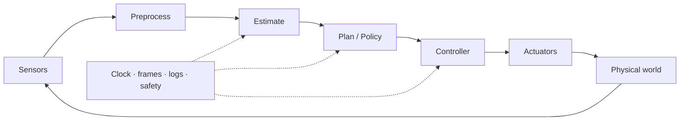
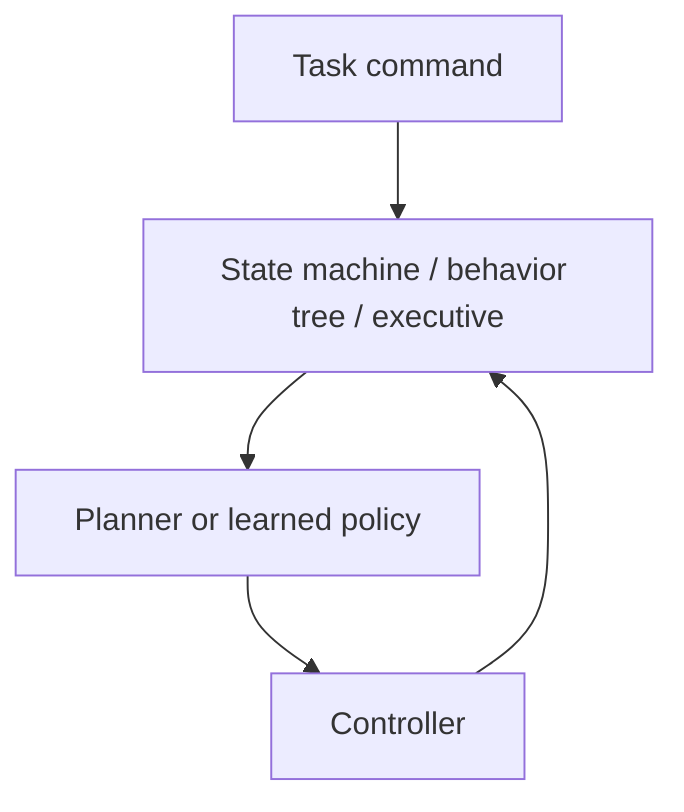
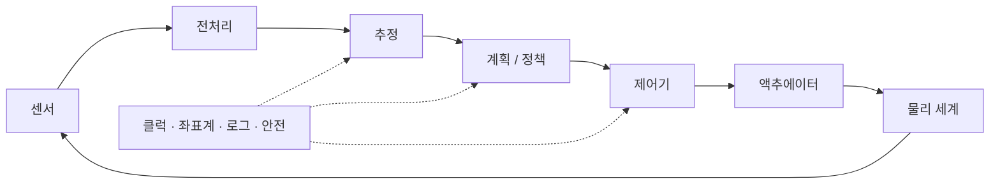
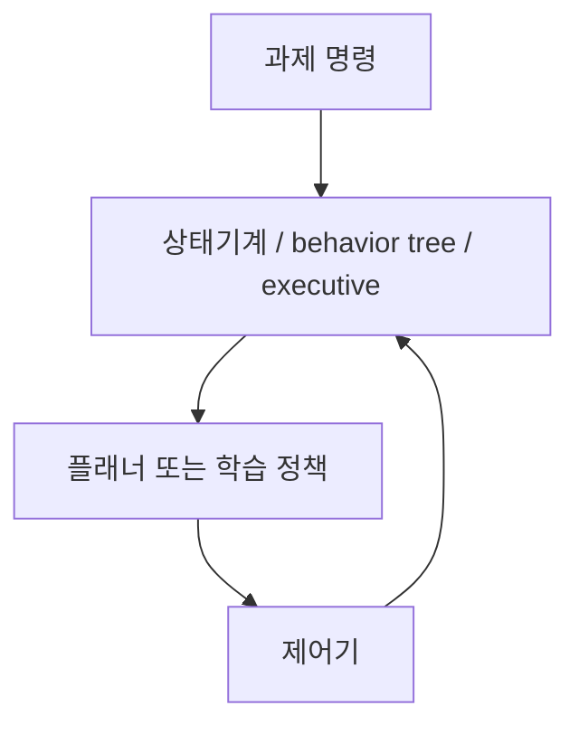

## English

A paper algorithm becomes a robot only when sensors, clocks, coordinate frames, computers, networks, controllers, actuators, safety logic, and logging work together. Systems literacy lets a reader determine what was actually deployed and where a reported improvement may have originated.

> [!info] Depth target
> Decompose a robot into its runtime pipeline; interpret action interfaces, timing, frames, middleware, reliability, simulation, and logging; and diagnose failures at subsystem boundaries. This is not a ROS installation or electronics tutorial.

> [!note] Prerequisites
> [[02-foundations/signal-processing|Signal Processing]] · [[02-foundations/se3-geometry|3D Geometry & SE(3)]] · [[04-robotics/state-estimation-slam|State Estimation]] · [[04-robotics/planning-decision-making|Planning]] · [[04-robotics/control-theory-ce397|Control Theory]]

### 1. The closed robot stack



The blocks can run at different rates. A 30 Hz camera, 10 Hz policy, and 1 kHz motor controller are not inconsistent, but their data age and interfaces must be designed explicitly.

> [!tip] The four axes a robot system is actually designed along
> The stack above is a data-flow picture. The *design* picture — the one that decides whether
> a system works on a deadline — is Eppner et al.'s post-mortem of the winning entry to the
> Amazon Picking Challenge 2015 (RSS 2016). They argue a robotic system is placed along four
> spectra, and that the placement, not the component quality, is what distinguishes systems
> that finished from systems that did not:
>
> | Axis | The trade |
> |---|---|
> | **Modularity vs. integration** | clean interfaces are debuggable; tightly integrated ones exploit information a module boundary would have discarded |
> | **Generality vs. assumptions** | every assumption you are willing to state buys performance and costs a failure mode when it breaks |
> | **Computation vs. embodiment** | a compliant gripper or a funnel-shaped fixture solves in mechanics what would otherwise be a perception and control problem |
> | **Planning vs. feedback** | deliberating in advance versus reacting during execution, and how much of each the task's uncertainty justifies |
>
> The third axis is the one most often skipped by a learning-first reader, and it is the same
> observation [[04-robotics/grasping|15 §5]] makes about extrinsic dexterity: geometry you
> arrange in advance is capability you do not have to compute.

### 2. Embodiment and action interfaces

Embodiment includes morphology, actuator and transmission, sensing, compliance, payload, limits, and environment coupling. Motors, hydraulics, gearing, backlash, saturation, underactuation, and bandwidth determine which actions are meaningful.

When a paper says “action,” identify whether it means joint position, velocity, torque, motor current, end-effector pose, impedance target, or a high-level skill. The same learned model can behave differently when the low-level interface and control rate change. An end-effector-pose action does not reach a motor until [[04-robotics/modern-robotics/ch06-inverse-kinematics|inverse kinematics (MR ch.6)]] resolves it — including its branch choices and singularities — and a waypoint action does not become motion until [[04-robotics/modern-robotics/ch09-trajectory-generation|time scaling (MR ch.9)]] gives it a velocity profile inside the actuator limits. On a wheeled base, both sit on the [[04-robotics/modern-robotics/ch13-wheeled-mobile-robots|nonholonomic kinematics of MR ch.13]].

### 3. Timing and a latency budget

| Component | Example latency |
|---|---:|
| Camera exposure/readout | 15 ms |
| Network inference | 40 ms |
| Communication | 10 ms |
| Command processing | 5 ms |
| **Observation-to-action** | **70 ms** |

At 1 m/s, 70 ms corresponds to 7 cm of motion before the new command has effect. Frequency is not latency: a 30 Hz system may still act on old frames. Check sampling rate, inference rate, jitter, deadline misses, queueing, timestamp policy, and whether latency was measured end-to-end.

<svg viewBox="0 0 470 200" style="max-width:100%;height:auto" role="img" aria-label="the 70 ms observation-to-action budget drawn to scale">
  <rect x="60.0" y="60" width="69.0" height="30" fill="currentColor" fill-opacity="0.30" stroke="currentColor" stroke-width="1.1"/><rect x="129.0" y="60" width="184.0" height="30" fill="currentColor" fill-opacity="0.16" stroke="currentColor" stroke-width="1.1"/><rect x="313.0" y="60" width="46.0" height="30" fill="currentColor" fill-opacity="0.30" stroke="currentColor" stroke-width="1.1"/><rect x="359.0" y="60" width="23.0" height="30" fill="currentColor" fill-opacity="0.16" stroke="currentColor" stroke-width="1.1"/>
  <g stroke="currentColor" stroke-width="1" opacity="0.4"><line x1="60" y1="104" x2="382.0" y2="104"/><line x1="60" y1="98" x2="60" y2="110"/><line x1="382.0" y1="98" x2="382.0" y2="110"/></g>
  <g stroke="currentColor" stroke-width="1" opacity="0.35" stroke-dasharray="3 3"><line x1="60" y1="40" x2="60" y2="60"/><line x1="382.0" y1="40" x2="382.0" y2="60"/></g>
  <g font-size="10.5" fill="currentColor" text-anchor="middle">
    <text x="94.5" y="80">15</text><text x="221.0" y="80">40</text><text x="336.0" y="80">10</text><text x="370.5" y="80">5</text>
    <text x="64.0" y="52">light hits the sensor</text><text x="378.0" y="52">command takes effect</text>
    <text x="221.0" y="122">70 ms observation &#8594; action</text>
  </g>
  <g font-size="10.5" fill="currentColor">
    <text x="60" y="146">camera 15 &#183; inference 40 &#183; comms 10 &#183; command 5 (ms), to scale</text>
    <text x="60" y="161">at 1 m/s the robot travels 7 cm inside this bar</text>
  </g>
  <g font-size="11" fill="currentColor">
    <text x="20" y="180" opacity="0.9">Inference is over half the budget. And note that &#8220;we run at 30 Hz&#8221;</text>
    <text x="20" y="195" opacity="0.9">answers a different question than &#8220;how stale was the frame you acted on?&#8221;</text>
  </g>
</svg>


### 4. Coordinate frames and TF trees

Common frames include world, map, odom, base, sensor, end-effector, tool, and object. Every transform needs a direction and timestamp. A plausible numeric matrix in the wrong convention can create a systematic failure that learning cannot repair reliably.

A map frame can jump after global correction while odom remains locally smooth; the base-to-sensor transform should be calibrated; a moving object transform must be time-aligned. [[02-foundations/se3-geometry|SE(3)]] supplies the math, while a TF tree supplies the runtime bookkeeping.

### 5. Middleware literacy

| Concept | Role |
|---|---|
| node | running component |
| topic/message | asynchronous data stream and schema |
| service | request/response operation |
| action | longer operation with feedback/cancellation |
| TF | time-indexed frame transforms |
| bag/log | recorded streams for replay and analysis |
| QoS | delivery, durability, reliability, and queue policy |

ROS is one implementation ecosystem, not the system architecture itself. “Runs on ROS” says little about latency, determinism, safety, or deployment quality.

### 6. Behavior orchestration and task execution

Between the task command and the planner/controller usually sits an **execution layer**
— a finite-state machine (FSM), behavior tree, or task executive — that decides *which*
planner, policy, or controller runs now, and what happens when it fails.



Core vocabulary: **states/behaviors** with **transitions** fired by **guards**
(conditions); **preconditions** checked before an action and **postconditions** verified
after; **timeouts** and **retries**; **fallbacks** and **recovery behaviors** when a
step fails; **action servers** with feedback and **cancellation**. A worked skeleton:

```
Idle → Detect object → Plan grasp → Execute → Verify
                                        ├─ success → Place
                                        └─ failure → Replan / Request help / Safe stop
```

Behavior trees compose these modularly (sequence, fallback, decorator nodes) and are
common in field systems; FSMs are simpler but tangle as states multiply. When a paper
says the robot "recovered" or "retried," this layer — not the policy — often did it:
check who detects failure, who chooses the response, and what counts as terminal.

### 7. Reliability and safety mechanisms

- Watchdog: detects missing or unhealthy updates.
- Heartbeat: periodic liveness signal.
- Timeout: declares data or command stale.
- Graceful degradation: continues with reduced capability.
- Fail-safe state: moves toward a condition intended to reduce risk.
- Emergency stop: independent means to halt hazardous motion.

Best-effort average timing is different from deterministic deadline behavior. Safety claims require system-level evidence, not merely a stable policy output.

### 8. Calibration, configuration, and reproducibility

Record intrinsic/extrinsic calibration, zero offsets, units, frame conventions, controller gains, firmware, model weights, software commit, hardware revision, and runtime configuration. A random seed does not reproduce an experiment when calibration and physical hardware differ.

### 9. Simulation and staged deployment

| Stage | Purpose |
|---|---|
| simulation | fast and controlled development |
| software-in-the-loop | exercise software interfaces around simulated plant/sensors |
| hardware-in-the-loop | include physical compute/controllers or hardware interfaces |
| shadow mode | observe live inputs without commanding the robot |
| staged deployment | increase speed, autonomy, and environment difficulty gradually |

A digital twin is not automatically a validated predictor. Ask what is synchronized, calibrated, and experimentally checked. Domain randomization covers only the factors and ranges that were randomized.

### 10. Failure taxonomy

Separate sensor, estimation, planning, policy, control, communication, compute, mechanical, operator, and environment failures. The visible final event may be downstream: a collision can originate from stale sensing, wrong localization, infeasible planning, poor tracking, or actuator saturation.

### 11. Resource constraints

Onboard/offboard compute changes latency, network dependence, power, thermal limits, privacy, and failure modes. Report compute, memory, bandwidth, battery/power, thermal throttling, payload, and real-time load—not model parameter count alone.

### After reading

- Draw a sense–estimate–plan–control–act pipeline.
- Identify the physical command represented by “action.”
- Distinguish rate, latency, jitter, and deadline.
- Trace a transform with correct direction and timestamp.
- Explain why ROS use or simulation success is not deployment evidence.
- Locate the execution layer (FSM/behavior tree) and what it does on failure.
- Assign a failure to its likely originating subsystem rather than its final symptom.

### Self-check

1. Why can a 50 Hz policy still have 200 ms latency?
2. Which records are needed to replay a field failure?
3. Why might an offboard VLA fail despite unchanged model accuracy?
4. What does hardware-in-the-loop establish—and not establish?

> [!tip]- Answers
> 1. Queues, batching, old timestamps, transport, and asynchronous stages can preserve high throughput while increasing age. 2. Synchronized raw sensors, transforms, commands, feedback, clocks, configuration, software/hardware versions, and operator events. 3. Network delay/loss, stale observations, deadline misses, or safe fallback. 4. It validates selected hardware/software interfaces and timing; it does not by itself validate real-world perception, contact, or task safety.

### Sources

- C. Eppner, S. Höfer, R. Jonschkowski, R. Martín-Martín, A. Sieverling, V. Wall, O. Brock, "Lessons from the Amazon Picking Challenge: Four Aspects of Building Robotic Systems," *RSS 2016* (journal version: *Autonomous Robots*, 2018, DOI 10.1007/s10514-018-9761-2) — the challenge ran in 2015; the paper is 2016.

- [ROS 2 Concepts](https://docs.ros.org/en/rolling/Concepts.html)
- [MIT Manipulation (Tedrake) — systems chapters](https://manipulation.csail.mit.edu/)
- [NASA Systems Engineering Handbook](https://www.nasa.gov/reference/systems-engineering-handbook/)

## 한국어

논문의 알고리즘은 센서, 클럭, 좌표계, 컴퓨터, 네트워크, 제어기, 액추에이터, 안전 로직,
로깅이 함께 작동할 때에만 로봇이 된다. 시스템 문해력은 실제로 무엇이 배포됐고, 보고된
개선이 어느 하위 시스템에서 비롯됐을 수 있는지를 읽게 해 준다.

> [!info] 깊이 목표
> 로봇을 런타임 파이프라인으로 분해한다; 행동 인터페이스, 타이밍, 좌표계, 미들웨어,
> 신뢰성, 시뮬레이션, 로깅을 해석한다; 하위 시스템 경계에서 실패를 진단한다. ROS 설치법이나
> 전자공학 튜토리얼이 아니다.

> [!note] 선수 지식
> [[02-foundations/signal-processing|신호처리]] · [[02-foundations/se3-geometry|3D 기하와 SE(3)]] · [[04-robotics/state-estimation-slam|상태 추정]] · [[04-robotics/planning-decision-making|계획]] · [[04-robotics/control-theory-ce397|제어 이론]]

### 1. 닫힌 로봇 스택



블록들은 서로 다른 주기로 돌 수 있다. 30 Hz 카메라, 10 Hz 정책, 1 kHz 모터 제어기는
모순이 아니다 — 하지만 데이터의 나이(age)와 인터페이스는 명시적으로 설계해야 한다.

> [!tip] 로봇 시스템이 실제로 설계되는 네 축
> 위의 스택은 데이터 흐름 그림이다. *설계* 그림 — 마감이 있는 상황에서 시스템이 돌아가느냐를
> 가르는 그림 — 은 Eppner 등이 Amazon Picking Challenge 2015 우승 시스템을 사후 분석한
> 것(RSS 2016)이다. 로봇 시스템은 네 개의 스펙트럼 위에 놓이며, 완주한 시스템과 그러지 못한
> 시스템을 가른 것은 부품 품질이 아니라 그 **위치 선택**이라는 주장이다:
>
> | 축 | 무엇과 무엇을 바꾸는가 |
> |---|---|
> | **모듈성 대 통합** | 깨끗한 인터페이스는 디버깅이 되고, 촘촘히 통합된 쪽은 모듈 경계가 버렸을 정보를 활용한다 |
> | **일반성 대 가정** | 기꺼이 명시하는 가정 하나하나가 성능을 사고, 그 가정이 깨질 때의 실패 모드를 지불한다 |
> | **연산 대 신체화** | 순응형 그리퍼나 깔때기 모양 지그는 원래라면 인식·제어 문제였을 것을 역학으로 푼다 |
> | **계획 대 피드백** | 미리 숙고할 것인가 실행 중에 반응할 것인가, 그리고 과제의 불확실성이 각각을 얼마나 정당화하는가 |
>
> 학습 중심으로 읽는 사람이 가장 자주 건너뛰는 것이 세 번째 축이고, 이는 [[04-robotics/grasping|15 §5]]의
> extrinsic dexterity와 같은 관찰이다 — **미리 배치해 둔 기하는 계산하지 않아도 되는 능력이다.**

### 2. Embodiment와 행동 인터페이스

Embodiment는 형태, 액추에이터와 전동 장치, 센싱, 컴플라이언스, 페이로드, 한계, 환경
결합을 포함한다. 모터·유압·기어비·백래시·포화·부족구동·대역폭이 어떤 행동이 의미
있는지를 결정한다.

논문이 "action"이라 하면 그것이 관절 위치·속도·토크·모터 전류·말단 pose·임피던스
타깃·상위 스킬 중 무엇인지 확인하라. 같은 학습 모델도 저수준 인터페이스와 제어 주기가
바뀌면 다르게 행동할 수 있다. 말단 pose 행동은
[[04-robotics/modern-robotics/ch06-inverse-kinematics|역기구학(MR 6장)]]이 — 가지 선택과
특이점까지 포함해 — 풀어 주기 전까지 모터에 닿지 않고, 웨이포인트 행동은
[[04-robotics/modern-robotics/ch09-trajectory-generation|시간 스케일링(MR 9장)]]이 액추에이터
한계 안의 속도 프로파일을 줄 때 비로소 운동이 된다. 바퀴 베이스에서는 이 둘이
[[04-robotics/modern-robotics/ch13-wheeled-mobile-robots|MR 13장의 비홀로노믹 기구학]] 위에
앉는다.

### 3. 타이밍과 지연 예산

| 구성요소 | 예시 지연 |
|---|---:|
| 카메라 노출/판독 | 15 ms |
| 네트워크 추론 | 40 ms |
| 통신 | 10 ms |
| 명령 처리 | 5 ms |
| **관측→행동** | **70 ms** |

1 m/s에서 70 ms는 새 명령이 효과를 내기 전 7 cm의 이동에 해당한다.

<svg viewBox="0 0 470 200" style="max-width:100%;height:auto" role="img" aria-label="70 ms 관측&#8594;행동 예산을 실제 비율로 그린 그림">
  <rect x="60.0" y="60" width="69.0" height="30" fill="currentColor" fill-opacity="0.30" stroke="currentColor" stroke-width="1.1"/><rect x="129.0" y="60" width="184.0" height="30" fill="currentColor" fill-opacity="0.16" stroke="currentColor" stroke-width="1.1"/><rect x="313.0" y="60" width="46.0" height="30" fill="currentColor" fill-opacity="0.30" stroke="currentColor" stroke-width="1.1"/><rect x="359.0" y="60" width="23.0" height="30" fill="currentColor" fill-opacity="0.16" stroke="currentColor" stroke-width="1.1"/>
  <g stroke="currentColor" stroke-width="1" opacity="0.4"><line x1="60" y1="104" x2="382.0" y2="104"/><line x1="60" y1="98" x2="60" y2="110"/><line x1="382.0" y1="98" x2="382.0" y2="110"/></g>
  <g stroke="currentColor" stroke-width="1" opacity="0.35" stroke-dasharray="3 3"><line x1="60" y1="40" x2="60" y2="60"/><line x1="382.0" y1="40" x2="382.0" y2="60"/></g>
  <g font-size="10.5" fill="currentColor" text-anchor="middle">
    <text x="94.5" y="80">15</text><text x="221.0" y="80">40</text><text x="336.0" y="80">10</text><text x="370.5" y="80">5</text>
    <text x="64.0" y="52">빛이 센서에 닿음</text><text x="378.0" y="52">명령이 효과를 냄</text>
    <text x="221.0" y="122">70 ms 관측 &#8594; 행동</text>
  </g>
  <g font-size="10.5" fill="currentColor">
    <text x="60" y="146">카메라 15 &#183; 추론 40 &#183; 통신 10 &#183; 명령 5 (ms), 실제 비율</text>
    <text x="60" y="161">1 m/s면 이 막대 안에서 로봇이 7 cm를 간다</text>
  </g>
  <g font-size="11" fill="currentColor">
    <text x="20" y="186" opacity="0.9">추론이 예산의 절반을 넘는다 &#8212; &#8220;30 Hz로 돈다&#8221;는 &#8220;그 프레임이 얼마나 낡았나&#8221;와 다른 질문이다.</text>
  </g>
</svg>

 **주파수는 지연이
아니다**: 30 Hz 시스템도 옛 프레임 위에서 행동할 수 있다. 샘플링 주기, 추론 주기, 지터,
데드라인 미스, 큐잉, 타임스탬프 정책, 그리고 지연이 끝-끝으로 측정됐는지 확인하라.

### 4. 좌표계와 TF 트리

흔한 프레임: world, map, odom, base, sensor, end-effector, tool, object. 모든 변환에는
방향과 타임스탬프가 필요하다. 그럴듯한 숫자 행렬이라도 관례가 틀리면 학습이 안정적으로
고칠 수 없는 계통적 실패를 만든다.

map 프레임은 전역 보정 후 점프할 수 있고 odom은 국소적으로 매끄럽다; base→sensor
변환은 보정 대상이고, 움직이는 물체의 변환은 시간 정렬이 필요하다.
[[02-foundations/se3-geometry|SE(3)]]가 수학을 주고, TF 트리가 런타임 장부를 준다.

### 5. 미들웨어 문해력

| 개념 | 역할 |
|---|---|
| node | 실행 중인 구성요소 |
| topic/message | 비동기 데이터 스트림과 스키마 |
| service | 요청/응답 연산 |
| action | 피드백·취소가 있는 긴 연산 |
| TF | 시간 인덱스된 프레임 변환 |
| bag/log | 재생·분석용 기록 스트림 |
| QoS | 전달·보존·신뢰성·큐 정책 |

ROS는 하나의 구현 생태계이지 시스템 구조 그 자체가 아니다. "ROS에서 돈다"는 지연,
결정론, 안전, 배포 품질에 대해 거의 말해 주지 않는다.

### 6. 행동 오케스트레이션과 과제 실행

과제 명령과 플래너/제어기 사이에는 보통 **실행 계층**이 있다 — 유한상태기계(FSM),
behavior tree, 또는 task executive — 지금 *어느* 플래너·정책·제어기를 돌릴지, 실패하면
무엇을 할지를 결정한다.



핵심 어휘: **가드**(조건)로 발화되는 **전이**를 가진 **상태/행동**; 행동 전에 검사하는
**precondition**과 후에 검증하는 **postcondition**; **timeout**과 **retry**; 단계가
실패했을 때의 **fallback**과 **recovery behavior**; 피드백과 **취소**가 있는 **action
server**. 뼈대 예제:

```
Idle → 물체 감지 → 파지 계획 → 실행 → 검증
                                  ├─ 성공 → 놓기
                                  └─ 실패 → 재계획 / 도움 요청 / 안전 정지
```

Behavior tree는 이를 모듈적으로 합성하고(sequence·fallback·decorator 노드) 필드
시스템에서 흔하다; FSM은 단순하지만 상태가 늘면 얽힌다. 논문이 로봇이 "회복했다",
"재시도했다"고 하면 — 정책이 아니라 이 계층이 한 일인 경우가 많다: 누가 실패를
감지하고, 누가 대응을 고르고, 무엇이 종료 조건인지 확인하라.

### 7. 신뢰성과 안전 장치

- Watchdog: 누락되거나 비정상인 갱신을 감지.
- Heartbeat: 주기적 생존 신호.
- Timeout: 데이터·명령의 만료 선언.
- Graceful degradation: 축소된 능력으로 지속.
- Fail-safe state: 위험을 낮추도록 의도된 상태로 이동.
- 비상 정지: 위험한 운동을 멈추는 독립 수단.

평균이 좋은 best-effort 타이밍과 결정론적 데드라인 거동은 다르다. 안전 주장은 안정된
정책 출력만이 아니라 시스템 수준의 증거를 요구한다.

### 8. 보정, 설정, 재현성

내부/외부 보정, 영점, 단위, 프레임 관례, 제어기 이득, 펌웨어, 모델 가중치, 소프트웨어
커밋, 하드웨어 리비전, 런타임 설정을 기록하라. 보정과 물리적 하드웨어가 다르면 랜덤
시드는 실험을 재현하지 못한다.

### 9. 시뮬레이션과 단계적 배포

| 단계 | 목적 |
|---|---|
| 시뮬레이션 | 빠르고 통제된 개발 |
| software-in-the-loop | 시뮬레이션된 플랜트/센서 주위로 소프트웨어 인터페이스 시험 |
| hardware-in-the-loop | 실제 컴퓨트/제어기·하드웨어 인터페이스 포함 |
| shadow mode | 로봇에 명령하지 않고 라이브 입력 관찰 |
| 단계적 배포 | 속도·자율성·환경 난이도를 점진적으로 상승 |

디지털 트윈이 자동으로 검증된 예측기인 것은 아니다. 무엇이 동기화·보정·실험 검증됐는지
물어라. Domain randomization은 무작위화한 요인과 범위만 커버한다.

### 10. 실패 분류

센서, 추정, 계획, 정책, 제어, 통신, 컴퓨트, 기계, 운용자, 환경 실패를 분리하라. 눈에
보이는 최종 사건은 하류일 수 있다: 충돌은 오래된 센싱, 잘못된 위치 추정, 실행 불가능한
계획, 나쁜 추종, 액추에이터 포화 어디서든 비롯될 수 있다.

### 11. 자원 제약

온보드/오프보드 컴퓨트는 지연, 네트워크 의존, 전력, 열 한계, 프라이버시, 실패 모드를
바꾼다. 모델 파라미터 수만이 아니라 컴퓨트, 메모리, 대역폭, 배터리/전력, 열 스로틀링,
페이로드, 실시간 부하를 보고하라.

### 읽고 나면 말할 수 있어야 하는 것

- sense–estimate–plan–control–act 파이프라인을 그릴 수 있다
- "action"이 나타내는 물리적 명령을 짚을 수 있다
- 주기·지연·지터·데드라인을 구분할 수 있다
- 방향·타임스탬프가 맞는 변환을 추적할 수 있다
- ROS 사용이나 시뮬레이션 성공이 배포 증거가 아닌 이유를 설명할 수 있다
- 실행 계층(FSM/behavior tree)의 위치와 실패 시 역할을 짚을 수 있다
- 실패를 최종 증상이 아니라 유력한 발원 하위 시스템에 배정할 수 있다

### 스스로 점검

1. 50 Hz 정책이 여전히 200 ms 지연을 가질 수 있는 이유는?
2. 현장 실패를 재생하려면 어떤 기록이 필요한가?
3. 모델 정확도가 그대로인데 오프보드 VLA가 실패할 수 있는 이유는?
4. hardware-in-the-loop가 입증하는 것과 입증하지 못하는 것은?

> [!tip]- 정답 · Answers
> 1. 큐, 배칭, 오래된 타임스탬프, 전송, 비동기 단계들이 높은 처리율을 유지하면서 데이터 나이를 키울 수 있다.
> 2. 동기화된 원시 센서, 변환, 명령, 피드백, 클럭, 설정, 소프트웨어/하드웨어 버전, 운용자 이벤트.
> 3. 네트워크 지연/손실, 오래된 관측, 데드라인 미스, 안전 폴백.
> 4. 선택된 하드웨어/소프트웨어 인터페이스와 타이밍은 검증하지만, 실세계 인식·접촉·과제 안전을 그 자체로 검증하지는 않는다.

### 출처

- C. Eppner, S. Höfer, R. Jonschkowski, R. Martín-Martín, A. Sieverling, V. Wall, O. Brock, "Lessons from the Amazon Picking Challenge: Four Aspects of Building Robotic Systems," *RSS 2016* (journal version: *Autonomous Robots*, 2018, DOI 10.1007/s10514-018-9761-2) — the challenge ran in 2015; the paper is 2016.

- [ROS 2 Concepts](https://docs.ros.org/en/rolling/Concepts.html)
- [MIT Manipulation (Tedrake) — 시스템 관련 장](https://manipulation.csail.mit.edu/)
- [NASA Systems Engineering Handbook](https://www.nasa.gov/reference/systems-engineering-handbook/)
