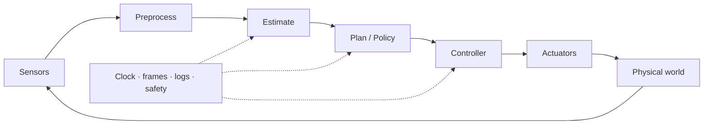

## English

A paper algorithm becomes a robot only when sensors, clocks, coordinate frames, computers, networks, controllers, actuators, safety logic, and logging work together. Systems literacy lets a reader determine what was actually deployed and where a reported improvement may have originated.

> [!info] Depth target
> Decompose a robot into its runtime pipeline; interpret action interfaces, timing, frames, middleware, reliability, simulation, and logging; and diagnose failures at subsystem boundaries. This is not a ROS installation or electronics tutorial.

> [!note] Prerequisites
> [[02-foundations/signal-processing|Signal Processing]] · [[02-foundations/se3-geometry|3D Geometry & SE(3)]] · [[04-robotics/state-estimation-slam|State Estimation]] · [[04-robotics/planning-decision-making|Planning]] · [[04-robotics/control-theory-ce397|Control Theory]]

### 1. The closed robot stack

The blocks can run at different rates. A 30 Hz camera, 10 Hz policy, and 1 kHz motor controller are not inconsistent, but their data age and interfaces must be designed explicitly.

### 2. Embodiment and action interfaces

Embodiment includes morphology, actuator and transmission, sensing, compliance, payload, limits, and environment coupling. Motors, hydraulics, gearing, backlash, saturation, underactuation, and bandwidth determine which actions are meaningful.

When a paper says “action,” identify whether it means joint position, velocity, torque, motor current, end-effector pose, impedance target, or a high-level skill. The same learned model can behave differently when the low-level interface and control rate change.

### 3. Timing and a latency budget

| Component | Example latency |
|---|---:|
| Camera exposure/readout | 15 ms |
| Network inference | 40 ms |
| Communication | 10 ms |
| Command processing | 5 ms |
| **Observation-to-action** | **70 ms** |

At 1 m/s, 70 ms corresponds to 7 cm of motion before the new command has effect. Frequency is not latency: a 30 Hz system may still act on old frames. Check sampling rate, inference rate, jitter, deadline misses, queueing, timestamp policy, and whether latency was measured end-to-end.

### 4. Coordinate frames and TF trees

Common frames include world, map, odom, base, sensor, end-effector, tool, and object. Every transform needs a direction and timestamp. A plausible numeric matrix in the wrong convention can create a systematic failure that learning cannot repair reliably.

A map frame can jump after global correction while odom remains locally smooth; the base-to-sensor transform should be calibrated; a moving object transform must be time-aligned. [[02-foundations/se3-geometry|SE(3)]] supplies the math, while a TF tree supplies the runtime bookkeeping.

### 5. Middleware literacy

| Concept | Role |
|---|---|
| node | running component |
| topic/message | asynchronous data stream and schema |
| service | request/response operation |
| action | longer operation with feedback/cancellation |
| TF | time-indexed frame transforms |
| bag/log | recorded streams for replay and analysis |
| QoS | delivery, durability, reliability, and queue policy |

ROS is one implementation ecosystem, not the system architecture itself. “Runs on ROS” says little about latency, determinism, safety, or deployment quality.

### 6. Reliability and safety mechanisms

- Watchdog: detects missing or unhealthy updates.
- Heartbeat: periodic liveness signal.
- Timeout: declares data or command stale.
- Graceful degradation: continues with reduced capability.
- Fail-safe state: moves toward a condition intended to reduce risk.
- Emergency stop: independent means to halt hazardous motion.

Best-effort average timing is different from deterministic deadline behavior. Safety claims require system-level evidence, not merely a stable policy output.

### 7. Calibration, configuration, and reproducibility

Record intrinsic/extrinsic calibration, zero offsets, units, frame conventions, controller gains, firmware, model weights, software commit, hardware revision, and runtime configuration. A random seed does not reproduce an experiment when calibration and physical hardware differ.

### 8. Simulation and staged deployment

| Stage | Purpose |
|---|---|
| simulation | fast and controlled development |
| software-in-the-loop | exercise software interfaces around simulated plant/sensors |
| hardware-in-the-loop | include physical compute/controllers or hardware interfaces |
| shadow mode | observe live inputs without commanding the robot |
| staged deployment | increase speed, autonomy, and environment difficulty gradually |

A digital twin is not automatically a validated predictor. Ask what is synchronized, calibrated, and experimentally checked. Domain randomization covers only the factors and ranges that were randomized.

### 9. Failure taxonomy

Separate sensor, estimation, planning, policy, control, communication, compute, mechanical, operator, and environment failures. The visible final event may be downstream: a collision can originate from stale sensing, wrong localization, infeasible planning, poor tracking, or actuator saturation.

### 10. Resource constraints

Onboard/offboard compute changes latency, network dependence, power, thermal limits, privacy, and failure modes. Report compute, memory, bandwidth, battery/power, thermal throttling, payload, and real-time load—not model parameter count alone.

### After reading

- Draw a sense–estimate–plan–control–act pipeline.
- Identify the physical command represented by “action.”
- Distinguish rate, latency, jitter, and deadline.
- Trace a transform with correct direction and timestamp.
- Explain why ROS use or simulation success is not deployment evidence.
- Assign a failure to its likely originating subsystem rather than its final symptom.

### Self-check

1. Why can a 50 Hz policy still have 200 ms latency?
2. Which records are needed to replay a field failure?
3. Why might an offboard VLA fail despite unchanged model accuracy?
4. What does hardware-in-the-loop establish—and not establish?

> [!tip]- Answers
> 1. Queues, batching, old timestamps, transport, and asynchronous stages can preserve high throughput while increasing age. 2. Synchronized raw sensors, transforms, commands, feedback, clocks, configuration, software/hardware versions, and operator events. 3. Network delay/loss, stale observations, deadline misses, or safe fallback. 4. It validates selected hardware/software interfaces and timing; it does not by itself validate real-world perception, contact, or task safety.

### Sources

- [ROS 2 Concepts](https://docs.ros.org/en/rolling/Concepts.html)
- [MIT Manipulation](https://manipulation.csail.mit.edu/)

## 한국어

논문 속 알고리즘은 센서, clock, 좌표계, 컴퓨터, 네트워크, controller, actuator, safety logic과 logging이 함께 작동할 때 로봇이 된다. Systems literacy는 실제로 무엇이 배포됐고 성능 차이가 어느 subsystem에서 생겼는지를 읽게 한다.

로봇 stack은 Sense → Estimate → Plan/Policy → Control → Actuate의 닫힌 loop다. 각 블록의 주기는 다를 수 있으므로 frequency뿐 아니라 data age, end-to-end latency, jitter와 deadline을 확인해야 한다. 예제의 70 ms 지연은 1 m/s 이동체에서 7 cm의 움직임에 해당한다.

논문의 “action”이 joint position, velocity, torque, current, end-effector pose, impedance target 또는 skill 중 무엇인지 확인하라. Embodiment의 actuator, transmission, backlash, saturation, payload와 bandwidth가 같은 AI 모델의 행동을 바꾼다.

TF tree에서는 world/map/odom/base/sensor/tool/object frame의 방향과 timestamp가 중요하다. ROS node/topic/service/action/TF/bag/QoS는 시스템을 읽는 기본 어휘지만 “ROS에서 동작한다”는 말은 실시간성·신뢰성·안전을 보장하지 않는다.

실험 재현에는 seed뿐 아니라 calibration, controller gain, units, configuration, software commit, firmware와 hardware revision이 필요하다. 실패는 sensor·estimation·planning·control·communication·mechanical·operator 원인으로 분해하고 최종 증상과 최초 원인을 구분해야 한다.

위 영어 절의 After reading과 Self-check로 timing, frame, action interface, deployment와 failure diagnosis를 점검하라.
