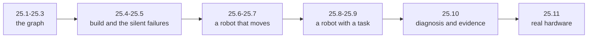

## English

> [!info] Depth target · 깊이 목표
> Every other chapter of this wiki teaches you to read the field. This one teaches you to build in it. The target is an engineer who can take a robot from a description to a task it performs, and who can say why it failed when it does.
> 이 위키의 다른 장은 분야를 *읽는* 법을 가르친다. 이 장은 그 안에서 *만드는* 법을 가르친다. 목표는 로봇을 기술(description)에서 과제 수행까지 데려가고, 실패했을 때 왜 실패했는지 말할 수 있는 엔지니어다.

> [!note] Prerequisites · 선수 지식
> Python, a Linux terminal, and Git. No ROS experience is assumed. [[04-robotics/modern-robotics/ch03-rigid-body-motions|MR ch.3]] and [[02-foundations/se3-geometry|3D Geometry & SE(3)]] make §25.6 easier but are not required first.
> Python, 리눅스 터미널, Git. ROS 경험은 전제하지 않는다. [[04-robotics/modern-robotics/ch03-rigid-body-motions|MR 3장]]과 [[02-foundations/se3-geometry|3D 기하와 SE(3)]]는 §25.6을 쉽게 만들지만 먼저 읽어야 하는 것은 아니다.

Most of this wiki exists so that a paper can be read accurately. This track exists for the
other half of the work. A research claim in robotics is usually carried by a running system,
and someone has to build it. That person needs a different kind of knowledge: not what the
literature argues, but what actually connects to what, and what to type when nothing happens.

ROS 2 is the middleware most of that field uses. It is not a framework you write your robot
inside; it is a way for separately written programs to find each other and exchange data, plus
a large body of packages that already solve the problems you would otherwise solve badly.

### 1. What the track is built around

One robot, carried the whole way. You describe it, see its frames, simulate it, control it,
give it a task, break it, and finally face what changes when the machine is real. Each page
ends in something that runs and something that fails, because the second is what turns a
tutorial follower into an engineer.

### 2. The pages

1. [[04-robotics/ros2/what-ros2-is|25.1 What ROS 2 Is, and Your First Running System]] — what a middleware is for, why ROS 2 exists, installation, and a system you can watch talk to itself.
2. [[04-robotics/ros2/nodes-topics-messages|25.2 Nodes, Topics and Messages]] — publish and subscribe, in Python and in the C++ that production stacks are written in.
3. [[04-robotics/ros2/services-actions-parameters|25.3 Services, Actions, Parameters and Lifecycle]] — the three patterns that are not topics, and how a node is configured and started deterministically.
4. [[04-robotics/ros2/workspaces-packages-launch|25.4 Workspaces, Packages, Builds and Launch]] — the daily loop, and the stale-install bug that wastes an afternoon the first time.
5. [[04-robotics/ros2/qos-executors-time|25.5 QoS, Executors and Time]] — the three mechanisms that fail without stopping the program.
6. [[04-robotics/ros2/describing-a-robot|25.6 Describing a Robot: URDF, TF2 and RViz]] — links, joints, and the transform tree that beginners lose the most hours to.
7. [[04-robotics/ros2/simulation-and-control|25.7 Simulation and ros2_control]] — Gazebo, and the controller-hardware seam that makes simulation work transfer.
8. [[04-robotics/ros2/manipulation-moveit2|25.8 Manipulation with MoveIt 2]] — planning, the planning scene, execution, and what MoveIt does not solve.
9. [[04-robotics/ros2/navigation-nav2|25.9 Navigation with Nav2]] — behaviour trees, costmaps, and which parts assume a flat indoor world.
10. [[04-robotics/ros2/debugging-data-reproducibility|25.10 Debugging, Data and Reproducibility]] — an ordered set of checks, bags as fixtures, and containers as the difference between a reproducible result and a story.
11. [[04-robotics/ros2/from-simulation-to-hardware|25.11 From Simulation to Real Hardware]] — latency, safety, and the decision about buying a machine.

**The shortest useful route** is 25.1 → 25.2 → 25.4 → 25.6 → 25.7. That is enough to have a
robot of your own description moving under a controller, which is the point at which the rest
stops being abstract. Add 25.8 for manipulation work and 25.9 for mobile work. Read 25.5 and
25.10 when something breaks, which will be soon.

### 3. Which distribution to install

| Distribution | Released | Supported until | Use it? |
|---|---|---|---|
| Jazzy Jalisco (LTS) | May 2024 | May 2029 | Yes — the baseline of this track, and the pairing with Gazebo Harmonic has binary packages |
| Lyrical Luth (LTS) | May 2026 | May 2031 | Reasonable — newer LTS, pairs with Gazebo Jetty; fewer third-party packages have moved yet |
| Kilted Kaiju | May 2025 | December 2026 | No — it ends within the year |
| Humble Hawksbill (LTS) | May 2022 | May 2027 | Only to match an existing lab or robot |

Every page here uses **Jazzy on Ubuntu 24.04 with Gazebo Harmonic**. Commands are checked
against the official documentation rather than written from memory, and each page says which
documentation it used.

### 4. What this track does not cover

It does not teach Python, C++, Linux or Git. It does not teach the control theory, kinematics,
perception or learning that the rest of the wiki covers.
[[04-robotics/index|4. Robotics & Physical Systems]] is where the theory lives, and this track
is how it gets executed. It does
not replace the official tutorials; where a step is already documented well, the page sends
you there and explains what the step is *for*, which the official version usually does not.

### 5. Completion criterion

You are done with this track when you can build, from an empty directory, a workspace holding
a robot you described, launch it into simulation under a controller, give it a task through
MoveIt 2 or Nav2, record the run to a bag, and — when it misbehaves — find the cause with
commands rather than guesses.

> [!question]- Self-check · Answer
> **Why is a middleware needed at all, when one program could do everything?** Because the parts have different rates, languages, owners and failure modes. Separate processes can be restarted, replaced and tested independently, and can run on different machines. The cost is that the connections are now something you have to reason about, which is what 25.5 is about.
>
> **Why does this track spend a whole page on things that fail silently?** Because they do not stop the program. A stale install, a second publisher on a transform edge and a wrong clock all present as "nothing happens". A reliability mismatch is the partial exception — the client libraries log one warning at discovery, which is easy to miss in a busy launch — while a durability mismatch really does say nothing, because the connection itself is legitimate. An engineer is distinguished by having an ordered set of checks for that case.
>
> **What would make this track's work count as research evidence rather than practice?** Reproducibility: a pinned environment, a recorded bag, a launch file that starts the whole system, and a written account of what failed. [[06-research-practice/experimental-design-reproducibility|2. Experimental Design & Reproducibility]] sets that bar.

## 한국어

이 위키의 대부분은 논문을 정확히 *읽기* 위해 있다. 이 트랙은 나머지 절반을 위해 있다.
로보틱스의 연구 주장은 보통 돌아가는 시스템이 떠받치고, 누군가는 그것을 만들어야 한다. 그
사람에게는 다른 종류의 지식이 필요하다. 문헌이 무엇을 주장하는지가 아니라, 무엇이 무엇에
실제로 연결되는지, 그리고 아무 일도 일어나지 않을 때 무엇을 쳐야 하는지다.

ROS 2는 그 분야 대부분이 쓰는 미들웨어다. 로봇을 그 안에 써 넣는 프레임워크가 아니라, 따로
작성된 프로그램들이 서로를 찾아 데이터를 주고받는 방식이고, 여기에 직접 만들었으면 형편없었을
문제들을 이미 푼 방대한 패키지 모음이 딸려 있다.

### 1. 트랙의 뼈대

로봇 하나를 끝까지 끌고 간다. 기술하고, 프레임을 보고, 시뮬레이션하고, 제어하고, 과제를 주고,
망가뜨리고, 마지막으로 실물이 될 때 무엇이 달라지는지 마주한다. 각 쪽은 *돌아가는 것* 하나와
*실패하는 것* 하나로 끝난다. 튜토리얼을 따라 한 사람과 엔지니어를 가르는 것은 두 번째다.

### 2. 페이지 목록

1. [[04-robotics/ros2/what-ros2-is|25.1 ROS 2란 무엇이고, 첫 시스템 돌리기]] — 미들웨어가 왜 필요한지, ROS 2가 왜 존재하는지, 설치, 그리고 스스로 대화하는 것을 지켜볼 수 있는 시스템.
2. [[04-robotics/ros2/nodes-topics-messages|25.2 노드, 토픽, 메시지]] — 발행과 구독. Python으로, 그리고 실제 제품 스택이 쓰는 C++로.
3. [[04-robotics/ros2/services-actions-parameters|25.3 서비스, 액션, 파라미터, 라이프사이클]] — 토픽이 아닌 세 가지 패턴, 그리고 노드를 설정하고 결정론적으로 띄우는 법.
4. [[04-robotics/ros2/workspaces-packages-launch|25.4 워크스페이스, 패키지, 빌드, 런치]] — 매일의 반복 루프, 그리고 처음 한 번은 반드시 반나절을 잡아먹는 stale install 버그.
5. [[04-robotics/ros2/qos-executors-time|25.5 QoS, Executor, 시간]] — 프로그램을 멈추지 않은 채 실패하는 세 가지 기전.
6. [[04-robotics/ros2/describing-a-robot|25.6 로봇 기술하기: URDF, TF2, RViz]] — 링크와 조인트, 그리고 초심자가 가장 많은 시간을 잃는 변환 트리.
7. [[04-robotics/ros2/simulation-and-control|25.7 시뮬레이션과 ros2_control]] — Gazebo, 그리고 시뮬레이션 작업을 실물로 옮겨 주는 제어기-하드웨어 이음매.
8. [[04-robotics/ros2/manipulation-moveit2|25.8 MoveIt 2로 하는 매니퓰레이션]] — 계획, planning scene, 실행, 그리고 MoveIt이 풀어 주지 *않는* 것.
9. [[04-robotics/ros2/navigation-nav2|25.9 Nav2로 하는 내비게이션]] — 행동 트리, costmap, 그리고 어느 부분이 평평한 실내를 전제하는지.
10. [[04-robotics/ros2/debugging-data-reproducibility|25.10 디버깅, 데이터, 재현성]] — 순서 있는 점검 목록, fixture로서의 bag, 그리고 재현 가능한 결과와 이야기를 가르는 컨테이너.
11. [[04-robotics/ros2/from-simulation-to-hardware|25.11 시뮬레이션에서 실물 하드웨어로]] — 지연, 안전, 그리고 기계를 살 것인가라는 결정.

**가장 짧은 유용한 경로**는 25.1 → 25.2 → 25.4 → 25.6 → 25.7이다. 여기까지면 자기가 기술한
로봇이 제어기 아래 움직인다. 나머지가 추상적이기를 그만두는 지점이 거기다. 매니퓰레이션 작업에는
25.8을, 이동 로봇 작업에는 25.9를 더한다. 25.5와 25.10은 무언가 고장 났을 때 읽어라. 곧 고장 난다.

### 3. 어떤 배포판을 설치할 것인가

| 배포판 | 출시 | 지원 종료 | 쓸 것인가 |
|---|---|---|---|
| Jazzy Jalisco (LTS) | 2024년 5월 | 2029년 5월 | 그렇다 — 이 트랙의 기준이고, Gazebo Harmonic과의 짝에 바이너리 패키지가 있다 |
| Lyrical Luth (LTS) | 2026년 5월 | 2031년 5월 | 무난하다 — 더 새로운 LTS이고 Gazebo Jetty와 짝이다. 다만 서드파티 패키지가 아직 덜 옮겨 왔다 |
| Kilted Kaiju | 2025년 5월 | 2026년 12월 | 아니다 — 올해 안에 끝난다 |
| Humble Hawksbill (LTS) | 2022년 5월 | 2027년 5월 | 기존 연구실이나 로봇에 맞출 때만 |

이 트랙의 모든 쪽은 **Ubuntu 24.04의 Jazzy와 Gazebo Harmonic**을 쓴다. 명령은 기억으로 쓰지
않고 공식 문서와 대조했으며, 각 쪽이 어떤 문서를 썼는지 밝힌다.

### 4. 이 트랙이 다루지 않는 것

Python, C++, 리눅스, Git은 가르치지 않는다. 위키의 나머지가 다루는 제어 이론, 기구학, 인식,
학습도 가르치지 않는다. 이론이 사는 곳은 [[04-robotics/index|4. 로보틱스와 물리 시스템]]이고 이
트랙은 그것이 *실행되는* 방식이다. 공식 튜토리얼을 대체하지도 않는다. 어떤 단계가 이미 잘
문서화되어 있으면 그쪽으로 보내되, 그 단계가 *무엇을 위한 것인지*를 설명한다. 공식 문서가 보통
말해 주지 않는 부분이다.

### 5. 완료 기준

빈 디렉터리에서 시작해 자기가 기술한 로봇이 든 워크스페이스를 만들고, 제어기 아래 시뮬레이션으로
띄우고, MoveIt 2나 Nav2로 과제를 주고, 실행을 bag으로 기록하고, 이상하게 동작할 때 추측이 아니라
명령으로 원인을 찾을 수 있으면 이 트랙은 끝난 것이다.

> [!question]- 스스로 점검 · 정답
> **프로그램 하나가 다 하면 될 것을 왜 미들웨어가 필요한가?** 부분마다 주기도, 언어도, 소유자도, 실패 양상도 다르기 때문이다. 프로세스를 나누면 각각을 따로 재시작하고 교체하고 시험할 수 있고, 서로 다른 기계에서 돌릴 수도 있다. 대가는 그 연결 자체가 이제 따져야 할 대상이 된다는 것이고, 25.5가 그 이야기다.
>
> **이 트랙은 왜 조용히 실패하는 것들에 한 쪽을 통째로 쓰는가?** 프로그램을 멈추지 않기 때문이다. stale install, 변환 간선의 중복 발행자, 잘못된 시계는 모두 "아무 일도 안 일어남"으로 나타난다. 신뢰성(reliability) 불일치는 부분적인 예외다. 클라이언트 라이브러리가 발견 시점에 경고를 한 줄 남기는데, 바쁜 런치 로그에서는 놓치기 쉽다. 반면 내구성(durability) 불일치는 정말로 아무 말도 하지 않는다. 연결 자체는 정당하기 때문이다. 엔지니어를 가르는 것은 그 경우를 위한 순서 있는 점검 목록을 갖고 있는지다.
>
> **이 트랙의 작업이 연습이 아니라 연구 증거가 되려면 무엇이 필요한가?** 재현성이다. 고정된 환경, 기록된 bag, 시스템 전체를 띄우는 런치 파일, 그리고 무엇이 실패했는지에 대한 기록. 그 기준은 [[06-research-practice/experimental-design-reproducibility|2. 실험 설계와 재현성]]이 정한다.
