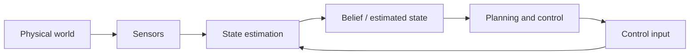

## English

*Group B. Stands on linear algebra, probability, optimization, signal processing and [[02-foundations/se3-geometry|SE(3)]].
A robot never observes its own state directly; groups C and F consume the estimate this page produces.*

Sensors do not reveal the world directly: they provide partial, delayed, and noisy measurements. **State estimation** combines a motion model, control inputs, sensor observations, and uncertainty to infer the variables a robot needs but cannot observe perfectly.

> [!info] Depth target
> Read state-estimation and SLAM papers without confusing state, observation, estimate, or map; interpret covariance, drift, loop closure, and sensor-fusion claims; and judge whether the reported evaluation supports robust deployment. Full filter and bundle-adjustment implementations are a working/mastery topic.

> [!note] Prerequisites
> [[02-foundations/linear-algebra|Linear Algebra]] · [[02-foundations/probability|Probability]] · [[02-foundations/optimization|Optimization]] · [[02-foundations/signal-processing|Signal Processing]] · [[02-foundations/se3-geometry|3D Geometry & SE(3)]]

> [!note] First pass · 처음이라면
> Read §2 — the four words nobody separates — then §4 for the predict/correct loop, then §6 to do the one-dimensional update by hand. §5, §7 and §8 are the reference half; open them against a specific paper.

### 1. Position in the robot loop



The controller rarely receives the true state $x_t$. It acts on an estimate $\hat{x}_t$ or a belief distribution. Poor estimation can therefore appear downstream as a planning or control failure.

### 2. Four quantities that must not be conflated

| Quantity | Meaning | Example |
|---|---|---|
| State $x_t$ | Variables sufficient for the model at time $t$ | pose, velocity, IMU bias (the slowly wandering offset of an inertial measurement unit — the accelerometer-plus-gyroscope chip) |
| Observation $z_t$ | What a sensor measures | pixels, ranges, encoder ticks |
| Estimate $\hat{x}_t$ | A point summary inferred from data | estimated pose |
| Belief $p(x_t\mid z_{1:t},u_{1:t})$ | Distribution over plausible states | pose mean and covariance, particles |

State is a modeling choice, not a synonym for all physical reality. Covariance describes uncertainty **under the assumed model**; a small covariance can still be overconfident when calibration, association, or noise assumptions are wrong.

The distinction is needed because the controller acts on an estimate while the world evolves according to the actual state. For example, an excavator can receive a precise-looking pose after a localization outage; the small reported covariance may simply omit the unmodeled motion. **The reading this gives you.** Ask what the observation directly measured, what inference produced the estimate, and which alternatives the belief still represents. A point estimate and its timestamp should never be read as a complete account of uncertainty merely because they arrived in the same message.

### 3. Process and observation models

$$x_t=f(x_{t-1},u_t)+w_t, \qquad z_t=h(x_t)+v_t$$

- **Given:** previous belief, input $u_t$, and measurement $z_t$.
- **Estimated:** current state or belief.
- **Uncertainty:** $w_t$ captures process/model uncertainty; $v_t$ captures measurement noise.
- **Runtime:** the estimate is updated online as measurements arrive.

Model error and sensor noise are different. Wheel slip violates a motion model; noisy range readings perturb measurements. Treating both as the same Gaussian noise can make a filter inconsistent.

The process model predicts because measurements do not continuously reveal the whole state. The observation model connects a proposed state to what the sensor should see. For example, slipping wheels can make odometry predict motion that a range sensor does not support. That disagreement can reflect a wrong motion assumption rather than merely a noisy range. **The reading this gives you.** Trace a residual back through both models before enlarging a noise parameter. Ask whether the filter can represent the mismatch, whether measurements arrive in time, and whether a calibration error is being disguised as random uncertainty.

### 4. Bayes filtering: predict, then correct

$$p(x_t\mid z_{1:t-1},u_{1:t})=\int p(x_t\mid x_{t-1},u_t)p(x_{t-1}\mid z_{1:t-1},u_{1:t-1})\,dx_{t-1}$$

$$p(x_t\mid z_{1:t},u_{1:t})\propto p(z_t\mid x_t)p(x_t\mid z_{1:t-1},u_{1:t})$$

Read it as two moves. Prediction moves the previous belief through the dynamics and normally increases uncertainty. Correction weights that prior by how compatible each state is with the new measurement.

**Where the two lines come from, and what each assumption buys.** Neither is a new principle;
both are elementary probability plus one assumption used exactly once. For **prediction**,
introduce the previous state and marginalize it out — that is just the sum rule:
$p(x_t\mid z_{1:t-1}) = \int p(x_t\mid x_{t-1}, z_{1:t-1})\,p(x_{t-1}\mid z_{1:t-1})\,dx_{t-1}$.
Then the *Markov assumption on the dynamics* says the next state depends on the previous
state and input alone, so $z_{1:t-1}$ drops out of the first factor and the process model
$p(x_t\mid x_{t-1},u_t)$ appears. For **correction**, apply Bayes' rule to the new
measurement, $p(x_t\mid z_{1:t}) \propto p(z_t\mid x_t, z_{1:t-1})\,p(x_t\mid z_{1:t-1})$.
Then the *conditional-independence assumption on the sensor* says a measurement depends only
on the state it was taken from, so $z_{1:t-1}$ drops out again and the observation model
$p(z_t\mid x_t)$ appears.

That accounting is worth keeping because it tells you what breaks and where. Unmodelled wheel
slip first means the chosen transition model is wrong; it does not automatically make the
physical process non-Markov. Augmenting the state with slip or terrain variables may restore
a useful Markov model. A sensor with its own memory, such as a detector applying
temporal smoothing or a camera with rolling-shutter carryover, violates the second, not the
first: the filter double-counts evidence it has already used and grows overconfident. Both
show up as an inconsistent filter, and the fix is different in each case.

### 5. Method families

| Family | Representation and use | Main caution |
|---|---|---|
| Kalman filter | Linear-Gaussian mean and covariance | Model must fit the assumptions |
| EKF | Linearizes nonlinear models with Jacobians | Linearization and inconsistency |
| UKF | Propagates selected **sigma points** — a small set of chosen sample states whose mean and covariance match the belief, pushed through the true nonlinear model instead of a linearization | Still assumes a compact unimodal belief |
| Particle filter | Weighted samples: each step pushes every sample through the motion model, weights it by how well it explains the measurement, then resamples in proportion to weight; useful for multimodality | **Particle depletion** — resampling keeps copying the few high-weight particles until diversity is gone and the filter is confidently wrong — and computation |
| Factor/pose graph | Batch or incremental optimization over constraints | Association errors and **gauge freedom** — relative constraints fix the map's *shape* but not where it sits in the world, so the whole map can slide and rotate freely until one pose is anchored |

For a linear Kalman measurement update — where $H$ is the matrix form of the observation model $h$ from §3 (for a nonlinear $h$, the EKF uses its Jacobian here) —

$$K=P^-H^\top(HP^-H^\top+R)^{-1}, \qquad \hat{x}^+=\hat{x}^-+K(z-H\hat{x}^-)$$

$K$ is not a hand-set trust weight: it follows from predicted covariance $P^-$, sensor covariance $R$, and observation geometry $H$. For both filters written as code — one Kalman predict/update with the Joseph-form covariance, and particle resampling triggered by the effective sample size — see [[02-foundations/algorithms/robotics-ai-problems|11.8 §4]] and [[02-foundations/algorithms/robotics-ai-problems|11.8 §5]].

> [!note] Filter and smoother are one update · 필터와 스무더는 같은 갱신
> If Gauss–Newton and marginalising are new to you, skip this note and return after §7, where both appear. The last row of that table looks like a different subject from the rows above it. It is not. A graph back end repeatedly solves $A\,\Delta x = b$ for a correction and adds it to the current estimate, and a Gauss–Newton step on that cost started from the prior mean is the EKF update, while iterating it is exactly the iterated EKF — the same weighted residual cost, rearranged into information form rather than covariance form. Bell and Cathey proved the filter case ([IEEE Trans. Automatic Control, 1993](https://doi.org/10.1109/9.250476)) and [Bell (1994)](https://doi.org/10.1137/0804035) extended it to the smoother. What separates the two families is therefore not the solver but which variables are kept and which are marginalised away: a filter carries the newest state, a smoother keeps the trajectory.

### 6. Worked example: one-dimensional update

Suppose the predicted position is $10$ m with variance $4\,\mathrm{m}^2$, and a sensor reports $12$ m with variance $1\,\mathrm{m}^2$. With $H=1$,

$$K=\frac{4}{4+1}=0.8, \qquad \hat{x}^+=10+0.8(12-10)=11.6\ \mathrm{m}$$

The posterior variance is $(1-K)4=0.8\,\mathrm{m}^2$. The estimate lies closer to the more precise measurement. This conclusion is valid only if the variances and model are credible.

**Read the numbers in their causal order.** The predicted position comes from previous information and motion propagation. The sensor supplies new evidence. Their discrepancy, 12 − 10, is the innovation: how surprising this measurement is relative to the prediction. The gain determines how much of that discrepancy to use as a correction. It is not the probability that the sensor is right.

Here the measurement variance is smaller than the prediction variance, so the correction moves the estimate toward the measurement. The remaining posterior variance describes uncertainty after combining the independent information under this scalar linear-Gaussian model. Variance has squared-distance units; standard deviation would have distance units. Mixing those two quantities in the gain changes the weighting incorrectly.

**Try changing an assumption without recalculating.** If the measurement were much less precise, the gain should decrease and the estimate stay nearer the prediction. If the measurement reused information already inside the prediction, this formula would overcount evidence unless the correlation were modeled. Being able to predict those directions is a stronger first-pass check than memorizing 0.8 and 11.6.

### 7. Odometry, localization, mapping, and SLAM

| Problem | What is treated as known | What is inferred |
|---|---|---|
| Odometry | consecutive motion measurements | relative motion |
| Localization | a map | robot pose in the map |
| Mapping | robot poses | map structure |
| SLAM | neither is perfectly known | trajectory and map jointly |

A SLAM **front end** extracts features ([[04-robotics/geometric-perception-calibration|3.5 §2.5]]) or geometric constraints and performs data association. The **back end** optimizes poses, landmarks, and sometimes calibration variables — as a nonlinear least squares problem over the graph, solved by Gauss–Newton or Levenberg–Marquardt, which is what "we optimize with Ceres/g2o/GTSAM" means ([[02-foundations/optimization|4. Optimization §3.5]]). Loop closure can correct accumulated drift, but a false closure can corrupt the entire map.

**The odometry family you will actually meet.** Almost every 2023–2026 field-robotics system
paper names its front end by acronym and assumes you know what the letters buy. They differ
in which sensors are fused and how tightly:

| Name | Sensors | Fails when |
|---|---|---|
| Wheel odometry | encoders | wheels slip — unbounded drift, no recovery |
| **VO / VIO** — visual(-inertial) odometry | camera (+ IMU) | texture-poor walls, motion blur, sudden lighting change |
| **LO / LIO** — lidar(-inertial) odometry | lidar (+ IMU) | geometrically degenerate places — a long corridor, an open field, a tunnel |
| GNSS-fused | any of the above + GNSS | obstruction and multipath near structures |

The **inertial** term is doing specific work in both: an IMU is accurate over milliseconds and
useless over minutes, while a camera or lidar is the reverse, so fusing them lets each cover
the other's failure timescale. Two mechanics recur in the papers and are worth recognising:
**IMU preintegration** — summarising many IMU samples between two keyframes into one
constraint, so the optimizer does not carry every sample — and **deskewing**, correcting a
lidar scan for the fact that the robot moved *during* the sweep. A paper that omits deskewing
on a fast platform is reporting a map built from distorted scans.

**Keyframes** are the other structural idea: rather than optimize every frame, the back end
keeps a sparse subset and marginalizes the rest, which is what keeps the problem bounded as
the session grows.

*Marginalizing* has a specific meaning worth knowing, because it is where
the cost goes. Split the information matrix (the inverse of the covariance matrix; a zero entry means two variables are conditionally independent given the rest) into the block $A$ you are dropping and the
block $C$ you are keeping, with coupling $B$; removing the dropped block leaves the **Schur
complement** $S = C - B^\top A^{-1} B$. In a linear-Gaussian problem this exactly folds the
dropped variables' information into the survivors, but $S$ is **denser than $C$ was**. In
nonlinear estimators the resulting prior is tied to a linearization point and later
relinearization or approximation can lose information. That fill-in is why sliding-window estimators cap their window, and why a
paper's window length is a compute claim rather than a modelling preference
(the Schur complement is defined in Boyd & Vandenberghe, *Convex Optimization*, appendix A.5.5, and block elimination with it is appendix C.4).

> [!warning] "Drift-free" and "loop closure" are claims about different things
> Loop closure removes accumulated drift *only along paths that return to a previously visited
> place*. A robot that drives out and never comes back gets no correction from it, and its
> error grows the whole way — which is exactly the construction-site case, where the machine
> follows the work face outward. When a paper reports drift as a percentage of trajectory
> length, check whether the trajectory contained loops, because that single fact can change
> the number by an order of magnitude.

**Distance-field maps.** Beyond the occupancy grid of
[[04-robotics/planning-decision-making|4. Planning §2]], mapping systems commonly store a
**TSDF** (truncated signed distance field): in common depth-fusion systems each voxel stores
a truncated **projective** signed distance along a sensor ray, whose zero crossing estimates
the surface. It is not generally the Euclidean nearest-surface distance; that is the role of
the ESDF below. This
representation fuses many noisy depth images into one smooth surface and is what most
real-time reconstruction pipelines are built on. Its planning cousin is the **ESDF**
(Euclidean signed distance field), which stores distance-to-nearest-obstacle everywhere —
giving a planner both a clearance value and its gradient for free, which is why
trajectory-optimization planners want one.

**What a map does not store.** Every representation on this page converges on one estimate of
the present. That is the right target for localisation and planning, and the wrong one for a
robot that returns to the same building for a year: folding each change into a single map
update discards *when* something was observed, under what conditions, what the robot did next
and how that turned out — the evidence a later failure has to be explained with. Keeping those
records alongside the map, rather than inside it, is the distinction between a map and a
spatial memory ([[04-robotics/semantic-language-navigation|19. Semantic Navigation §7]]).

### 8. Sensor fusion and systems details

- IMU: high-rate acceleration/angular velocity; bias causes drift.
- Camera: rich appearance and geometry; sensitive to blur, lighting, and texture.
- LiDAR: direct range geometry; affected by sparsity, weather, and motion distortion.
- Wheel odometry: inexpensive local motion; fails under slip. The kinematic model being integrated — and why its error grows without bound — is [[04-robotics/modern-robotics/ch13-wheeled-mobile-robots|MR ch.13]].
- GNSS: absolute non-drifting reference in favorable conditions, but obstruction and multipath can introduce noise and bias.

**Loosely coupled** systems fuse completed subsystem estimates. **Tightly coupled** systems jointly use lower-level measurements, often preserving information but increasing model and implementation complexity. Calibration, timestamps, rolling shutter, latency, and clock offset can dominate algorithmic improvements.

### 8.5 Tracking many objects: gating, association, and track management

A multi-object tracker runs one filter per object, and before any filter can update it must decide which of this frame's detections belongs to which track, which are new objects, and which are clutter.

**Why this is harder than one filter.** §4–§6 assumed the measurement came from the state being estimated. With many objects that assumption becomes a decision made every frame, under four complications:

- the number of objects is unknown and changes as they enter and leave;
- some detections are **clutter** (false alarms) that belong to no object;
- a real object can go **undetected** — occluded, or simply missed;
- nothing labels which detection came from which object.

The SLAM front end of §7 faces the same correspondence problem with landmarks. A wrong answer there corrupts the map; here it swaps identities.

**Each track keeps its own filter.** Track $j$ carries a Kalman (or EKF) mean and covariance and predicts where its next detection should land, $\hat z_j = H\hat x_j^-$. The spread around that prediction is the innovation covariance

$$S_j = HP_j^-H^\top + R$$

It is the same matrix inside the §5 gain, since $K = P^-H^\top S^{-1}$. So $S_j$ adds the track's own prediction uncertainty to the sensor noise, and it grows while the track goes unobserved.

**Gating throws out implausible pairs.** Score each detection–track pair by the squared Mahalanobis distance of its innovation — the miss measured in units of the track's own spread $S_j$, which is Euclidean distance after whitening ([[02-foundations/probability|3. Probability §6]]) — and keep the pair only below a threshold $\gamma$:

$$d^2_{ij} = (z_i-\hat z_j)^\top S_j^{-1}(z_i-\hat z_j) < \gamma$$

The threshold comes from a table because, for a correct pair under the linear-Gaussian model, $d^2$ is $\chi^2_k$ with $k$ the measurement dimension ([[02-foundations/probability|3. Probability §6]]). For 2-D positions the 99% gate is $\gamma = 9.21$, so a true detection is rejected 1% of the time.

- The gate is an **ellipse shaped by $S_j$**, not a circle. A track uncertain along its direction of travel accepts detections farther ahead of it than beside it.
- Gating does two jobs. It rejects clutter, and it makes association cheap, because most pairs never enter it. A rectangular gate is sometimes run first as a coarser, cheaper screen.

**Association decides who gets which detection.**

- **Greedy nearest neighbour** repeatedly commits the smallest remaining $d^2$ pair. It is fast, but an early commitment can force a later track onto a bad detection. Letting each track independently take its own nearest detection is worse still, because two tracks can claim the same one.
- **Global nearest neighbour (GNN)** chooses the one-to-one assignment with the smallest total $\sum d^2$ over gated pairs. This is the linear assignment problem, solved exactly in polynomial time by the Hungarian method (Kuhn 1955; Munkres 1957) — the same matching [[01-canonical-papers/notes/2-computer-vision/detr|DETR]] uses in its loss. Unlike greedy, it returns the true minimum-total assignment, and it does so without trying all $n!$ one-to-one matchings. Why $\sum d^2$ is the right total: the Gaussian likelihood of detection $i$ under track $j$ has negative log $-\ln p = \tfrac12 d^2_{ij} + \tfrac12\ln|2\pi S_j|$, so the negative log of the joint likelihood is $\tfrac12\sum d^2$ plus one normalizing term per track. When every track is assigned, minimizing $\sum d^2$ maximizes the joint Gaussian likelihood, because each track's normalizing term $\ln|2\pi S_j|$ appears once in every candidate and cancels. Once a track may go unassigned, implementations add an explicit cost for a missed track or a new one, and that constant is a tuning choice.
- **JPDA** (joint probabilistic data association; Fortmann, Bar-Shalom & Scheffe 1983) does not commit. It enumerates the joint events allowed by the gates — each detection used at most once, including "missed" and "clutter" — weights them by probability, and updates each track with the weighted combination of its gated innovations. It is robust when targets are close, but it can pull nearby tracks toward each other (track coalescence; Fitzgerald, *IEEE TAES* 1985).
- **MHT** (multiple hypothesis tracking; Reid 1979) keeps several association histories alive across frames, lets later data decide between them, and prunes the hypothesis tree to stay tractable.
- **Random-finite-set filters** such as the PHD filter (Mahler 2003) treat the whole collection of objects as one random set and propagate its first moment — a density whose integral over any region is the expected number of objects in that region. They estimate how many objects there are and where, without carrying per-object identities.

**Track management gives tracks a life cycle.** A detection outside every gate starts a **tentative** track. It is **confirmed** once associated in M of the last N frames, and a confirmed track is **deleted** after too many consecutive misses. M and N trade confirmation delay against false tracks. With 2-of-3, a real object detected with probability 0.9 per frame confirms within three frames with probability $0.972$: it needs at least two detections in three, so $3\cdot0.9^2\cdot0.1 + 0.9^3 = 0.243 + 0.729$. A clutter blob that reappears in the gate with probability 0.1 per frame confirms with probability $0.028$, from $3\cdot0.1^2\cdot0.9 + 0.1^3 = 0.027 + 0.001$.

**How detector-based trackers use the same skeleton.** Most vision tracking today is tracking-by-detection. SORT (Bewley et al., ICIP 2016) runs a constant-velocity Kalman filter on each bounding box and the Hungarian algorithm on an IoU cost, with a minimum-IoU cutoff in place of a χ² gate. DeepSORT (Wojke et al., ICIP 2017) adds an appearance embedding from a re-identification network alongside Mahalanobis gating, so a person who reappears after occlusion can keep their identity.

**How tracking is scored.** Two metrics dominate, and they weight identity very differently.

- **MOTA** (Bernardin & Stiefelhagen 2008) is $1 - \sum(\mathrm{FN}+\mathrm{FP}+\mathrm{IDSW})/\sum \mathrm{GT}$ over all frames, which makes it detection-dominated: 50 misses, 30 false positives and 20 **identity switches** over 1000 ground-truth boxes give MOTA $= 0.90$, and the switches cost only 0.02 of it.
- **HOTA** (Luiten et al., IJCV 2021) is the geometric mean of a detection score and an association score, averaged over localization thresholds, so association failures cannot hide behind good detection.

> [!example] Worked example · 계산 예제
> **Two tracks, three detections, 2-D positions in metres.** T1 predicts $\hat z_1 = (0, 0)$ with $S_1 = I$. T2 predicts $\hat z_2 = (4, 0)$ with $S_2 = \mathrm{diag}(4, 1)$: it is moving along $x$ and uncertain in that direction. Detections are D1 $= (1, 0)$, D2 $= (-1, 1)$, D3 $= (1, 4)$.
> - *Distance matrix $d^2$.* T1 to D1, D2, D3: $1.00,\ 2.00,\ 17.00$. T2 to D1, D2, D3: $2.25,\ 7.25,\ 18.25$. For T2–D1 the innovation is $(-3, 0)$, so $d^2 = 9/4 = 2.25$ although the plain distance is 3 m.
> - *Gate at 9.21.* D3 fails both gates, so it is clutter or a new object and starts a tentative track. Four pairs survive.
> - *Brute-force assignment.* Of the six ways to give the tracks distinct detections, two pass the gate: {T1–D1, T2–D2} costs $1 + 7.25 = 8.25$, and {T1–D2, T2–D1} costs $2 + 2.25 = 4.25$. GNN picks the second.
> - *Greedy.* $1.00$ is the smallest entry, so greedy commits T1–D1 first. That leaves T2 only D2, at $7.25$ close to its gate edge, for a total of $8.25$ — the less likely assignment.
> - *JPDA on the same numbers*, assuming both tracks are detected and nothing else falls in the gates: the two joint events are weighted $e^{-8.25/2} : e^{-4.25/2}$, which normalizes to $0.119 : 0.881$. Weighting T1's two detections by its own likelihoods alone would instead give D1 $0.622$ — the joint constraint is what reverses the preference.
>
> Greedy's mistake is the order of commitment, not a bad distance. Plain Euclidean distance would make the same mistake for a second reason: D1 is 1 m from T1 and 3 m from T2, but T2's covariance makes 3 m along its direction of travel ordinary.

```python
import itertools
import numpy as np

tracks = {"T1": ([0, 0], np.diag([1.0, 1.0])),      # predicted measurement, innovation covariance S
          "T2": ([4, 0], np.diag([4.0, 1.0]))}
dets = {"D1": [1, 0], "D2": [-1, 1], "D3": [1, 4]}
GATE = 9.21                                         # 99% chi-square quantile for k = 2
d2 = {}
for t, (zhat, S) in tracks.items():
    for d, z in dets.items():
        nu = np.subtract(z, zhat)                   # innovation
        d2[t, d] = float(nu @ np.linalg.solve(S, nu))
print(d2)
options = []                                        # brute force over distinct detections
for pick in itertools.permutations(dets, len(tracks)):
    pairs = list(zip(tracks, pick))
    if all(d2[p] < GATE for p in pairs):
        options.append((sum(d2[p] for p in pairs), pairs))
print("global NN:", min(options), "of", len(options), "gated options")
greedy, used = [], set()                            # commit the smallest remaining d2 first
for (t, d), v in sorted(d2.items(), key=lambda kv: kv[1]):
    if v < GATE and t not in {p[0] for p in greedy} and d not in used:
        greedy.append((t, d))
        used.add(d)
print("greedy:", sum(d2[p] for p in greedy), greedy)
```

**Pitfalls, and what to check in a tracking paper.**

- **Gate dimension.** 9.21 is the 2-D value. Reusing it for 3-D positions rejects about 2.7% of true detections instead of 1%, because $d^2$ is then $\chi^2_3$ (the probability page's self-check works this case).
- **Covariance consistency sets the gate.** An overconfident filter (§2) shrinks $S_j$, so true detections fall outside the gate and the track dies and is reborn under a new ID. An inflated $S_j$ admits clutter. An ID-switch count is therefore partly a statement about covariance consistency.
- **IoU needs overlap.** At low frame rate or fast motion, a box's prediction and its next detection may not overlap at all, so an IoU cost cannot match them however good the filter is.
- **Which detector, which metric.** Tracking scores move with the detector, so check whether the comparison holds the detector fixed. A claim about identity needs ID switches or HOTA's association score, not MOTA alone.

**On a construction site.** Around an excavator, a tracker follows workers and other machines from cameras or lidar on the cab. Occlusion there is routine: a worker walks behind the boom, the counterweight or a spoil pile, the track coasts on prediction, and its gate widens. If the track is deleted before the worker reappears, they come back under a new ID. If a nearby worker's detection falls inside the widened gate, the two identities can swap. Both are safety failures, not bookkeeping. Speed and separation monitoring needs the position uncertainty of the specific person nearest the machine ([[04-robotics/hri-safety|11. HRI & Safety §6]]), and an inferred worker state such as fatigue is attached to an identity ([[05-construction-robotics/hrc-worker-centered|6. HRC & Worker-Centered Robotics]]). A paper claiming site-ready worker tracking should report ID switches and track loss through occlusion, not only MOTA.

### 9. Reading claims and evaluations

| Paper phrase | Check before accepting it |
|---|---|
| real-time | hardware, input rate, latency distribution, and whether mapping is included |
| robust localization | environments, motion, lighting/weather, and catastrophic failures |
| drift-free | duration/distance and reliance on absolute references or loop closure |
| tightly coupled | which raw measurements and states are jointly optimized |
| consistent | whether reported uncertainty matches actual estimation error |

Common metrics include Absolute Trajectory Error, Relative Pose Error, drift per distance/time, relocalization success, map accuracy, latency, and failure rate. A low average trajectory error can hide rare catastrophic tracking losses.

### After reading

You should be able to:

- distinguish state, observation, estimate, and belief;
- explain prediction and correction in a Bayes filter;
- interpret a Kalman gain without calling covariance unconditional confidence;
- distinguish odometry, localization, mapping, and SLAM;
- explain front end, back end, drift, and loop closure;
- identify calibration, synchronization, and evaluation assumptions in a paper.
- explain gating, global versus greedy association, and track confirmation in a multi-object tracker;

> [!tip] Going deeper · 더 깊이
> Barfoot's [*State Estimation for Robotics*, 2nd ed., 2024](https://asrl.utias.utoronto.ca/~tdb/bib/barfoot_ser24.pdf) is free and is the modern treatment, including estimation on SE(3) rather than in a vector space. Thrun, Burgard and Fox's *Probabilistic Robotics* remains the reference for the filtering and SLAM formulations themselves.
>
> For the optimisation back end specifically, three topics carry most of the load and one free document covers each. Rotation has to be parameterised before anything can be optimised over it — Solà's [*Quaternion kinematics for the error-state Kalman filter*](https://arxiv.org/abs/1711.02508) does that, and its Jacobians. The update itself is iterative least squares, taken from theory to running code in Grisetti et al.'s [*Least Squares Optimization: from Theory to Practice*](https://arxiv.org/abs/2002.11051). Sparsity is what makes the problem tractable at scale, and Dellaert and Kaess's [*Factor Graphs for Robot Perception*](https://www.cs.cmu.edu/~kaess/pub/Dellaert17fnt.pdf) follows the Square Root SAM to iSAM2 line, where QR decomposition, fill-in and variable ordering come from. Solà's [*Course on SLAM*](http://www.iri.upc.edu/people/jsola/JoanSola/objectes/curs_SLAM/SLAM2D/SLAM%20course.pdf) connects the three, and Triggs et al.'s [*Bundle Adjustment — A Modern Synthesis*](https://hal.science/inria-00548290/document) is the photogrammetry work all of it grew out of.

### Self-check

1. Why can a filter report small covariance and still be wrong?
2. Recompute the example if the sensor variance is $16\,\mathrm{m}^2$.
3. Why is global localization a natural particle-filter problem?
4. What experiment would support a claim of robustness to construction-site vibration?
5. In the §8.5 example, set $S_2 = I$. Recompute T2's distances, apply the gate, and compare GNN with greedy.
6. A tracker paper swaps in a new detector, MOTA rises from 0.80 to 0.82 over 10,000 ground-truth boxes, and the paper claims better tracking. What else do you need to see?

> [!tip]- Answers
> 1. Covariance is conditional on the model; wrong calibration, association, or noise assumptions create overconfidence. 2. $K=4/(4+16)=0.2$, so $\hat{x}^+=10.4$ m. 3. The belief can contain several separated pose hypotheses. 4. Repeated trajectories with controlled vibration levels, synchronized ground truth, failure counts, and comparison against the same pipeline without the claimed robustness mechanism. 5. T2's distances become $9.00,\ 26.00,\ 25.00$, so only D1 is inside T2's gate, and only just. The one complete assignment is {T1–D2, T2–D1} at $2 + 9 = 11$. Greedy commits T1–D1 and leaves T2 with nothing, so T2 coasts. If a missed track costs the gate value, {T1–D1, T2 missed} costs $1 + 9.21 = 10.21 < 11$, and GNN leaves T2 unassigned too — the miss cost is a real design parameter. 6. The gain is 200 fewer summed errors, and MOTA cannot say which kind. Misses plus false positives could have fallen from 1950 to 1700 while identity switches doubled from 50 to 100, and MOTA would still read 0.82. Ask for ID switches and an association score such as HOTA's, with the detector held fixed.

### Sources

- [Probabilistic Robotics — Thrun, Burgard & Fox (MIT Press)](https://mitpress.mit.edu/9780262201629/probabilistic-robotics/)
- [GTSAM concepts](https://gtsam.org/tutorials/intro.html)
- [KITTI odometry evaluation](https://www.cvlibs.net/datasets/kitti/eval_odometry.php)
- H. W. Kuhn, "The Hungarian method for the assignment problem," *Naval Research Logistics Quarterly* 2, 1955 — [doi:10.1002/nav.3800020109](https://doi.org/10.1002/nav.3800020109)
- J. Munkres, "Algorithms for the assignment and transportation problems," *Journal of the Society for Industrial and Applied Mathematics* 5(1), 1957 — [doi:10.1137/0105003](https://doi.org/10.1137/0105003)
- T. E. Fortmann, Y. Bar-Shalom, and M. Scheffe, "Sonar tracking of multiple targets using joint probabilistic data association," *IEEE Journal of Oceanic Engineering* 8(3), 1983 — [doi:10.1109/JOE.1983.1145560](https://doi.org/10.1109/JOE.1983.1145560); the textbook treatment is Y. Bar-Shalom and T. E. Fortmann, *Tracking and Data Association*, Academic Press, 1988
- D. B. Reid, "An algorithm for tracking multiple targets," *IEEE Transactions on Automatic Control* 24(6), 1979 — [doi:10.1109/TAC.1979.1102177](https://doi.org/10.1109/TAC.1979.1102177)
- R. P. S. Mahler, "Multitarget Bayes filtering via first-order multitarget moments," *IEEE Transactions on Aerospace and Electronic Systems* 39(4), 2003 — [doi:10.1109/TAES.2003.1261119](https://doi.org/10.1109/TAES.2003.1261119)
- R. J. Fitzgerald, "Track biases and coalescence with probabilistic data association," *IEEE Transactions on Aerospace and Electronic Systems* AES-21(6), 822–825, 1985 — [doi:10.1109/TAES.1985.310670](https://doi.org/10.1109/TAES.1985.310670)
- A. Bewley, Z. Ge, L. Ott, F. Ramos, and B. Upcroft, "Simple online and realtime tracking," *ICIP 2016* — [arXiv:1602.00763](https://arxiv.org/abs/1602.00763)
- N. Wojke, A. Bewley, and D. Paulus, "Simple online and realtime tracking with a deep association metric," *ICIP 2017* — [arXiv:1703.07402](https://arxiv.org/abs/1703.07402)
- K. Bernardin and R. Stiefelhagen, "Evaluating multiple object tracking performance: the CLEAR MOT metrics," *EURASIP Journal on Image and Video Processing*, 2008 — [doi:10.1155/2008/246309](https://doi.org/10.1155/2008/246309)
- J. Luiten et al., "HOTA: A higher order metric for evaluating multi-object tracking," *International Journal of Computer Vision* 129, 2021 — [doi:10.1007/s11263-020-01375-2](https://doi.org/10.1007/s11263-020-01375-2)

## 한국어

*B군이다. 선형대수·확률·최적화·신호처리와 [[02-foundations/se3-geometry|SE(3)]] 위에 선다.
로봇은 자기 상태를 직접 보는 일이 없고, C군과 F군이 이 페이지가 만든 추정값을 소비한다.*

센서는 세계를 직접 알려주지 않는다: 부분적이고, 지연되고, 잡음 섞인 측정을 줄 뿐이다.
**상태 추정**은 운동 모델, 제어 입력, 센서 관측, 불확실성을 결합해 로봇에 필요하지만
완벽히 관측할 수 없는 변수를 추론한다.

> [!info] 깊이 목표
> 상태·관측·추정값·지도를 혼동하지 않고 상태 추정·SLAM 논문을 읽는다; covariance,
> drift, loop closure, 센서 융합 주장을 해석한다; 보고된 평가가 강건한 배포를 지지하는지
> 판단한다. 필터·번들 조정의 완전한 구현은 실무/숙달 단계의 주제다.

> [!note] 선수 지식
> [[02-foundations/linear-algebra|선형대수]] · [[02-foundations/probability|확률]] · [[02-foundations/optimization|최적화]] · [[02-foundations/signal-processing|신호처리]] · [[02-foundations/se3-geometry|3D 기하와 SE(3)]]

> [!note] 처음이라면 · First pass
> 먼저 §2 — 아무도 구분하지 않는 네 단어 — 그다음 §4의 예측·보정 루프, 그다음 §6에서 1차원 갱신을 손으로. §5·§7·§8은 참고서 쪽 절반이니 특정 논문을 놓고 펴라.

### 1. 로봇 루프 안에서의 위치


제어기는 진짜 상태 $x_t$를 받는 일이 거의 없다. 추정값 $\hat{x}_t$ 또는 belief 분포 위에서
행동한다. 그래서 추정이 나쁘면 하류에서 계획·제어 실패처럼 *보인다*.

### 2. 절대 혼동하면 안 되는 네 가지

| 양 | 의미 | 예 |
|---|---|---|
| 상태 $x_t$ | 시점 $t$에 모델에 충분한 변수들 | pose, 속도, IMU bias (관성 측정 장치 — 가속도계와 자이로스코프를 묶은 칩 — 의 천천히 떠도는 오프셋) |
| 관측 $z_t$ | 센서가 측정하는 것 | 픽셀, 거리, 엔코더 틱 |
| 추정값 $\hat{x}_t$ | 데이터에서 추론한 점 요약 | 추정된 pose |
| Belief $p(x_t\mid z_{1:t},u_{1:t})$ | 가능한 상태들 위의 분포 | pose 평균·공분산, 파티클 |

상태는 **모델링 선택**이지 물리적 실재 전체의 동의어가 아니다. Covariance는 **가정한 모델
아래의** 불확실성이다 — 보정·association·잡음 가정이 틀리면 covariance가 작아도 과신일 수
있다.

제어기는 추정값으로 행동하지만 세계는 실제 상태에 따라 변하므로 구분이 필요하다. 위치 추정 중단 뒤 굴착기에 정밀해 보이는 자세가 들어와도 작은 공분산이 모델 밖 움직임을 빠뜨린 것일 수 있다. **여기서 얻는 독법.** 관측이 직접 측정한 것, 추정값을 만든 추론, 믿음이 아직 표현하는 대안을 묻는다. 점 추정과 시각이 같은 메시지에 도착했다고 불확실성 전체를 설명하는 것은 아니다.

### 3. 과정 모델과 관측 모델

$$x_t=f(x_{t-1},u_t)+w_t, \qquad z_t=h(x_t)+v_t$$

- **주어진 것:** 이전 belief, 입력 $u_t$, 측정 $z_t$.
- **추정하는 것:** 현재 상태 또는 belief.
- **불확실성:** $w_t$는 과정/모델 불확실성, $v_t$는 측정 잡음.
- **실행 시점:** 측정이 들어올 때마다 온라인으로 갱신.

모델 오차와 센서 잡음은 다르다. 바퀴 미끄럼은 운동 모델을 *위반*하고, 잡음 낀 거리
측정은 관측을 *교란*한다. 둘을 같은 가우시안 잡음으로 뭉뚱그리면 필터가 비일관해질 수
있다.

측정이 상태 전체를 연속적으로 알려 주지 못하므로 과정 모델이 예측한다. 관측 모델은 가정한 상태를 센서가 볼 값과 연결한다. 바퀴가 미끄러지면 오도메트리가 예측한 움직임을 거리 센서가 지지하지 않을 수 있다. 이는 거리 잡음보다 운동 가정의 오류일 수 있다. **여기서 얻는 독법.** 잡음 파라미터를 키우기 전에 잔차를 두 모델로 거슬러 간다. 필터가 불일치를 표현하는지, 측정이 제때 오는지, 보정 오차를 무작위 불확실성으로 숨기는지 묻는다.

### 4. 베이즈 필터: 예측하고, 보정한다

$$p(x_t\mid z_{1:t-1},u_{1:t})=\int p(x_t\mid x_{t-1},u_t)p(x_{t-1}\mid z_{1:t-1},u_{1:t-1})\,dx_{t-1}$$

$$p(x_t\mid z_{1:t},u_{1:t})\propto p(z_t\mid x_t)p(x_t\mid z_{1:t-1},u_{1:t})$$

두 동작으로 읽어라. **예측**은 이전 belief를 동역학에 통과시키며 보통 불확실성을 키운다. **보정**은 그 prior를
새 측정과 각 상태의 부합 정도로 가중한다.

**두 줄이 어디서 오고, 각 가정이 무엇을 사 주는가.** 둘 다 새로운 원리가 아니라 기초 확률에
가정 하나씩을 정확히 한 번 쓴 것이다. **예측**은 직전 상태를 끌어들여 적분해 없애는 것,
곧 합의 법칙이다:
$p(x_t\mid z_{1:t-1}) = \int p(x_t\mid x_{t-1}, z_{1:t-1})\,p(x_{t-1}\mid z_{1:t-1})\,dx_{t-1}$.
그다음 *동역학에 대한 마르코프 가정*이 다음 상태는 직전 상태와 입력에만 의존한다고 말하므로
첫 인자에서 $z_{1:t-1}$이 떨어져 나가고 과정 모델 $p(x_t\mid x_{t-1},u_t)$가 나타난다.
**보정**은 새 측정에 베이즈 규칙을 적용하는 것이다:
$p(x_t\mid z_{1:t}) \propto p(z_t\mid x_t, z_{1:t-1})\,p(x_t\mid z_{1:t-1})$. 그다음
*센서에 대한 조건부 독립 가정*이 측정은 그것이 취해진 상태에만 의존한다고 말하므로 다시
$z_{1:t-1}$이 떨어지고 관측 모델 $p(z_t\mid x_t)$가 나타난다.

이 장부를 갖고 있을 값어치가 있는 이유는, 무엇이 어디서 깨지는지 알려 주기 때문이다. 모델에
없는 바퀴 미끄러짐은 우선 선택한 전이 모델이 틀렸다는 뜻이지 물리 과정이 자동으로 비마르코프가
된다는 뜻은 아니다. 미끄럼이나 지형 변수를 상태에 넣으면 유용한 마르코프 모델을 복원할 수 있다.
자기 기억을 가진 센서, 예를 들어 시간 평활을 적용하는 검출기나
롤링 셔터의 잔상이 남는 카메라는 두 번째를 어기지 첫 번째를 어기지 않는다. 필터가 이미 쓴
증거를 두 번 세어 과신하게 된다. 둘 다 필터가 일관되지 않은 것으로 드러나지만, 고치는 방법은
서로 다르다.

### 5. 방법 계열

| 계열 | 표현과 용도 | 주된 주의점 |
|---|---|---|
| 칼만 필터 | 선형-가우시안 평균·공분산 | 모델이 가정에 맞아야 함 |
| EKF | 야코비안으로 비선형 모델을 선형화 | 선형화 오차와 비일관성 |
| UKF | **시그마 포인트** 전파 — 평균과 공분산이 belief와 일치하도록 고른 소수의 표본 상태를 선형화 대신 진짜 비선형 모델에 통과시킨다 | 여전히 조밀한 단봉 belief 가정 |
| 파티클 필터 | 가중 표본: 매 스텝 모든 표본을 운동 모델에 통과시키고, 측정을 얼마나 잘 설명하는지로 가중치를 매긴 뒤, 가중치에 비례해 재표집한다; 다봉성에 유용 | **파티클 고갈** — 재표집이 가중치 높은 소수 파티클만 계속 복제해 다양성이 사라지고 필터가 자신 있게 틀리게 된다 — 과 계산량 |
| Factor/pose graph | 제약들 위의 일괄·증분 최적화 | association 오류와 **게이지 자유도** — 상대 제약은 지도의 *모양*은 고정하지만 그것이 세계 어디에 놓이는지는 고정하지 않아, 한 pose를 앵커로 박기 전까지 지도 전체가 자유롭게 미끄러지고 회전한다 |

선형 칼만 측정 갱신은 — 여기서 $H$는 §3의 관측 모델 $h$를 행렬로 쓴 것이다(비선형 $h$라면 EKF가 이 자리에 그 야코비안을 쓴다) —

$$K=P^-H^\top(HP^-H^\top+R)^{-1}, \qquad \hat{x}^+=\hat{x}^-+K(z-H\hat{x}^-)$$

$K$는 손으로 정하는 신뢰 가중치가 아니다: 예측 공분산 $P^-$, 센서 공분산 $R$, 관측 기하
$H$에서 *따라 나온다*. 두 필터를 코드로 옮긴 것 — Joseph 형태 공분산을 쓰는 칼만 예측·갱신 한 스텝과, 유효 표본 크기로 시점을 정하는 파티클 재표집 — 은 [[02-foundations/algorithms/robotics-ai-problems|11.8 §4]]와 [[02-foundations/algorithms/robotics-ai-problems|11.8 §5]]에 있다.

> [!note] 필터와 스무더는 같은 갱신 · Filter and smoother are one update
> Gauss–Newton과 주변화가 처음이라면 이 노트는 건너뛰고 둘이 나오는 §7을 읽은 뒤 돌아오라. 표의 마지막 줄은 위의 줄들과 다른 주제처럼 보인다. 아니다. 그래프 back end는 $A\,\Delta x = b$를 반복해서 풀어 보정량을 구하고 그것을 현재 추정값에 더한다. 사전 평균에서 시작한 그 비용의 Gauss–Newton 한 스텝이 EKF 갱신이고, 그것을 반복하면 정확히 iterated EKF다 — 같은 가중 잔차 비용을 공분산 형태가 아니라 정보 형태로 정리했을 뿐이다. 두 계열을 가르는 것은 solver가 아니라 어떤 변수를 남기고 어떤 변수를 marginalize하는가다. 필터는 가장 최근 상태만 들고 가고, 스무더는 궤적을 남긴다. 필터 경우는 Bell과 Cathey가 증명했고([IEEE Trans. Automatic Control, 1993](https://doi.org/10.1109/9.250476)), [Bell(1994)](https://doi.org/10.1137/0804035)가 스무더까지 확장했다.

### 6. 계산 예제: 1차원 갱신

예측 위치가 $10$ m, 분산 $4\,\mathrm{m}^2$이고 센서가 $12$ m, 분산 $1\,\mathrm{m}^2$를
보고했다고 하자. $H=1$이면

$$K=\frac{4}{4+1}=0.8, \qquad \hat{x}^+=10+0.8(12-10)=11.6\ \mathrm{m}$$

사후 분산은 $(1-K)4=0.8\,\mathrm{m}^2$. 추정값이 더 정밀한 측정 쪽으로 끌려간다 — 단
이 결론은 분산과 모델이 믿을 만할 때에만 유효하다.

**숫자를 인과 순서로 읽는다.** 예측 위치는 이전 정보와 운동 전파에서 온다. 센서는 새 증거를 준다. 차이 12 − 10은 innovation, 즉 예측에 비해 측정이 얼마나 뜻밖인지다. 이득은 그 차이 중 얼마를 보정에 쓸지 정한다. 센서가 맞을 확률이 아니다.

여기서는 측정 분산이 예측 분산보다 작아 추정이 측정 쪽으로 이동한다. 사후 분산은 스칼라 선형 가우시안 모델에서 독립 정보를 결합한 뒤의 불확실성이다. 분산은 거리 제곱 단위이고 표준편차는 거리 단위다. 이득에 둘을 섞으면 가중치가 틀린다.

**계산 없이 가정 하나를 바꿔 본다.** 측정이 훨씬 부정확하면 이득이 줄고 추정은 예측에 가까이 남아야 한다. 측정이 이미 예측에 들어간 정보를 재사용한다면 상관을 모델링하지 않은 이 식은 증거를 중복 계산한다. 0.8과 11.6을 외우기보다 변화 방향을 예측하는 것이 더 좋은 첫 이해 확인이다.

### 7. Odometry, localization, mapping, SLAM

| 문제 | 알려진 것으로 취급 | 추론하는 것 |
|---|---|---|
| Odometry | 연속된 이동 측정 | 상대 이동 |
| Localization | 지도 | 지도 안의 로봇 pose |
| Mapping | 로봇 pose들 | 지도 구조 |
| SLAM | 어느 쪽도 완전히 모름 | 궤적과 지도를 동시에 |

SLAM **front end**는 특징([[04-robotics/geometric-perception-calibration|3.5 §2.5]])·기하 제약을 추출하고 data association을 수행한다. **back
end**는 pose, landmark, 때로는 보정 변수까지 최적화한다 — 그래프 위의 비선형 최소자승 문제로,
Gauss–Newton이나 Levenberg–Marquardt로 푼다. "Ceres/g2o/GTSAM으로 최적화한다"가 뜻하는 것이
그것이다 ([[02-foundations/optimization|4. 최적화 §3.5]]). Loop closure는 누적 drift를
고칠 수 있지만, 잘못된 closure 하나가 지도 전체를 망칠 수 있다.

**실제로 마주칠 오도메트리 계열.** 2023~2026년 필드 로보틱스 시스템 논문은 거의 전부 자기
front end를 약어로 부르고, 그 글자들이 무엇을 사는지 안다고 전제한다. 차이는 어떤 센서를
얼마나 단단히 융합하느냐다:

| 이름 | 센서 | 실패하는 곳 |
|---|---|---|
| 휠 오도메트리 | 엔코더 | 바퀴가 미끄러질 때 — 무한히 자라는 drift, 회복 불가 |
| **VO / VIO** — 시각(-관성) 오도메트리 | 카메라 (+ IMU) | 질감 없는 벽, 모션 블러, 급격한 조명 변화 |
| **LO / LIO** — 라이다(-관성) 오도메트리 | 라이다 (+ IMU) | 기하적으로 퇴화한 장소 — 긴 복도, 트인 벌판, 터널 |
| GNSS 융합 | 위의 것 + GNSS | 구조물 근처의 차폐와 다중경로 |

두 경우 모두 **관성**이라는 항이 구체적인 일을 한다: IMU는 밀리초 단위에서 정확하고 분 단위에서
쓸모없으며, 카메라와 라이다는 그 반대다. 그래서 융합하면 서로의 실패 시간대를 덮어 준다. 논문에
반복해서 나오는 두 기구를 알아볼 수 있어야 한다: **IMU preintegration** — 두 keyframe 사이의
IMU 표본 여럿을 하나의 제약으로 요약해서 최적화기가 모든 표본을 지고 가지 않게 하는 것 — 과
**deskewing**, 라이다 스캔이 훑는 *동안* 로봇이 움직였다는 사실을 보정하는 것. 빠른 플랫폼에서
deskewing을 빠뜨린 논문은 왜곡된 스캔으로 만든 지도를 보고하고 있는 것이다.

**Keyframe**이 나머지 한 축이다: 모든 프레임을 최적화하는 대신 성긴 부분집합만 남기고 나머지를
주변화(marginalize)하며, 그것이 세션이 길어져도 문제 크기를 유한하게 유지하는 방법이다.

*주변화*에는 알아 둘 만한 구체적인 뜻이 있는데, 비용이 가는 곳이 거기이기 때문이다. 정보
행렬(공분산 행렬의 역행렬; 성분이 0이면 나머지가 주어졌을 때 두 변수가 조건부 독립이다)을 버릴 블록 $A$와 남길 블록 $C$, 그리고 결합항 $B$로 쪼개면, 버린 블록을 없앤 자리에
**Schur 보수** $S = C - B^\top A^{-1} B$가 남는다. 선형-가우시안 문제에서는 버린 변수의
정보가 살아남은 변수에 정확히 접히지만 $S$는 **원래의 $C$보다 조밀하다**. 비선형 추정에서는
이 prior가 선형화점에 묶이고, 뒤의 재선형화나 근사에서 정보가 손실될 수 있다. 그 fill-in 때문에 슬라이딩 윈도우 추정기가 창 길이를 제한하고, 논문의 창
길이가 모델링 취향이 아니라 계산 비용에 대한 주장인 이유다
(Schur 보수의 정의는 Boyd & Vandenberghe, *Convex Optimization* 부록 A.5.5, 그것을 쓴 블록 소거는 부록 C.4다).

> [!warning] "drift-free"와 "loop closure"는 서로 다른 것에 대한 주장이다
> Loop closure는 *이전에 방문한 장소로 돌아오는 경로에 한해서만* 누적 drift를 없앤다. 나갔다가
> 돌아오지 않는 로봇은 아무 보정도 받지 못하고 오차가 가는 내내 자란다 — 그리고 그것이 정확히
> 건설 현장의 경우다. 기계가 작업면을 따라 바깥으로 나아가기 때문이다. 논문이 drift를 궤적
> 길이의 백분율로 보고하면, 그 궤적에 루프가 있었는지를 확인하라. 그 사실 하나가 숫자를 한
> 자릿수 바꿔 놓을 수 있다.

**거리장 지도.** [[04-robotics/planning-decision-making|4. 계획·의사결정 §2]]의 점유 격자
너머로, 매핑 시스템은 흔히 **TSDF**(truncated signed distance field)를 쓴다: 일반적인 깊이
융합에서는 각 복셀이 센서 ray를 따른 잘린 **투영** 부호 거리를 담고, 그 0-crossing이 표면을
추정한다. 일반적으로 최근접 표면까지의 유클리드 거리는 아니며, 그것은 아래 ESDF의 역할이다.
이 표현은 잡음 많은 깊이 이미지 여럿을 하나의 매끄러운 표면으로 융합하고, 대부분의
실시간 재구성 파이프라인이 그 위에 서 있다. 계획 쪽 사촌이 **ESDF**(Euclidean signed distance
field)로, 모든 지점에서 가장 가까운 장애물까지의 거리를 저장한다 — 계획기에게 여유 간격 값과
그 그래디언트를 공짜로 주고, 궤적 최적화 계획기가 이것을 원하는 이유가 그것이다.

**지도가 저장하지 않는 것.** 이 페이지의 모든 표현은 현재에 대한 추정 하나로 수렴한다. localization과
계획에는 그것이 옳은 목표지만, 같은 건물로 1년간 돌아오는 로봇에게는 아니다. 변화를 매번 하나의 지도
갱신에 접어 넣으면 *언제* 관측했는지, 어떤 조건에서였는지, 로봇이 다음에 무엇을 했고 그 결과가
어땠는지가 사라진다 — 나중의 실패를 설명할 때 필요한 바로 그 증거다. 그 기록들을 지도 *안*이 아니라
지도 *옆*에 두는 것이 지도와 공간 기억을 가르는 구분이다
([[04-robotics/semantic-language-navigation|19. 의미 기반 내비게이션 §7]]).

### 8. 센서 융합과 시스템 세부

- IMU: 고주기 가속도/각속도; bias가 drift를 만든다.
- 카메라: 풍부한 외양·기하; 블러·조명·텍스처에 민감.
- LiDAR: 직접적 거리 기하; 희소성·날씨·운동 왜곡의 영향.
- 바퀴 odometry: 저렴한 국소 이동; 미끄럼에서 실패. 적분되는 기구학 모델과 그 오차가 왜 무한정 자라는지는 [[04-robotics/modern-robotics/ch13-wheeled-mobile-robots|MR 13장]]에 있다.
- GNSS: 유리한 조건에서 드리프트 없는 절대 기준 — 단 차폐·멀티패스가 잡음과 편향을
  넣을 수 있다.

**Loosely coupled**는 완성된 하위 추정들을 융합하고, **tightly coupled**는 저수준 측정을
공동으로 사용해 정보를 더 보존하지만 모델·구현 복잡도가 커진다. 보정, 타임스탬프,
롤링 셔터, 지연, 클럭 오프셋이 알고리즘 개선보다 성능을 지배할 수 있다.

### 8.5 여러 물체 추적: 게이팅, 연관, 트랙 관리

다중 물체 추적기는 물체마다 필터를 하나씩 돌리는데, 어느 필터든 갱신하기 전에 이번 프레임의 검출 중 무엇이 어느 트랙의 것이고, 무엇이 새 물체이며, 무엇이 클러터인지부터 정해야 한다.

**필터 하나보다 어려운 이유.** §4–§6은 측정이 추정 중인 상태에서 나왔다고 가정했다. 물체가 여럿이면 그 가정이 매 프레임 내려야 하는 결정이 되고, 네 가지가 겹친다:

- 물체 수를 모르고, 물체가 들어오고 나가며 수가 바뀐다;
- 어떤 검출은 어느 물체에도 속하지 않는 **클러터**(오경보)다;
- 실제 물체가 가려지거나 그냥 놓쳐서 **검출되지 않을** 수 있다;
- 어느 검출이 어느 물체에서 왔는지 알려 주는 표지가 없다.

§7의 SLAM front end도 landmark를 두고 같은 대응 문제를 푼다. 거기서 틀리면 지도가 망가지고, 여기서 틀리면 정체(identity)가 뒤바뀐다.

**트랙마다 자기 필터를 가진다.** 트랙 $j$는 칼만(또는 EKF) 평균과 공분산을 들고, 다음 검출이 떨어질 위치 $\hat z_j = H\hat x_j^-$를 예측한다. 그 예측 둘레의 퍼짐이 innovation 공분산이다.

$$S_j = HP_j^-H^\top + R$$

$K = P^-H^\top S^{-1}$이므로 이것은 §5 이득 안에 들어 있던 바로 그 행렬이다. 따라서 $S_j$는 트랙 자신의 예측 불확실성에 센서 잡음을 더한 것이고, 트랙이 관측되지 않는 동안 커진다.

**게이팅은 말이 안 되는 짝을 버린다.** 검출–트랙 짝마다 innovation의 제곱 마할라노비스 거리를 매기고 — 빗나간 정도를 트랙 자신의 퍼짐 $S_j$ 단위로 잰 것으로, 백색화한 뒤의 유클리드 거리와 같다([[02-foundations/probability|3. 확률 §6]]) — 문턱 $\gamma$ 아래인 짝만 남긴다:

$$d^2_{ij} = (z_i-\hat z_j)^\top S_j^{-1}(z_i-\hat z_j) < \gamma$$

선형-가우시안 모델에서 올바른 짝의 $d^2$는 측정 차원 $k$의 $\chi^2_k$를 따르기 때문에 문턱을 표에서 가져온다([[02-foundations/probability|3. 확률 §6]]). 2차원 위치라면 99% 게이트는 $\gamma = 9.21$이고, 참인 검출이 1%의 확률로 기각된다.

- 게이트는 원이 아니라 **$S_j$가 모양을 정하는 타원**이다. 진행 방향으로 불확실한 트랙은 옆보다 앞쪽으로 더 먼 검출을 받아들인다.
- 게이팅은 두 가지 일을 한다. 클러터를 거르고, 대부분의 짝이 아예 연관 단계에 들어가지 않으므로 연관을 싸게 만든다. 더 거칠고 싼 사각형 게이트를 먼저 돌리기도 한다.

**연관은 누가 어느 검출을 가질지 정한다.**

- **탐욕적 최근접 이웃**(greedy nearest neighbour)은 남은 짝 중 $d^2$가 가장 작은 것을 반복해서 확정한다. 빠르지만, 앞선 확정이 뒤의 트랙을 나쁜 검출로 몰아낼 수 있다. 트랙마다 독립적으로 자기 최근접 검출을 가져가게 하면 더 나쁘다. 두 트랙이 같은 검출을 차지할 수 있기 때문이다.
- **전역 최근접 이웃**(GNN)은 게이트를 통과한 짝들 위에서 합 $\sum d^2$가 가장 작은 일대일 할당을 고른다. 이것은 선형 할당 문제이고, 헝가리안 방법(Kuhn 1955; Munkres 1957)이 다항 시간에 정확히 푼다 — [[01-canonical-papers/notes/2-computer-vision/detr|DETR]]가 손실에 쓰는 바로 그 매칭이다. 탐욕과 달리 합이 진짜 최소인 할당을 돌려주며, 그러면서도 일대일 매칭 $n!$가지를 다 시도하지 않는다. $\sum d^2$가 옳은 합인 이유: 트랙 $j$ 아래 검출 $i$의 가우시안 우도는 음의 로그가 $-\ln p = \tfrac12 d^2_{ij} + \tfrac12\ln|2\pi S_j|$이므로, 결합 우도의 음의 로그는 $\tfrac12\sum d^2$에 트랙마다 정규화 항 하나를 더한 것이다. 모든 트랙이 할당될 때는 각 트랙의 정규화 항 $\ln|2\pi S_j|$가 모든 후보에 한 번씩 들어가 상쇄되므로, $\sum d^2$ 최소화가 결합 가우시안 우도 최대화와 같다. 트랙이 할당되지 않을 수도 있게 하면 구현은 놓친 트랙이나 새 트랙에 명시적 비용을 붙이고, 그 상수는 튜닝 선택이다.
- **JPDA**(joint probabilistic data association; Fortmann, Bar-Shalom & Scheffe 1983)는 확정하지 않는다. 게이트가 허용하는 결합 사건들 — 각 검출은 최대 한 번, "놓침"과 "클러터" 포함 — 을 열거해 확률로 가중하고, 각 트랙을 게이트 안 innovation들의 가중 결합으로 갱신한다. 표적이 가까울 때 강건하지만, 가까운 트랙들을 서로 끌어당길 수 있다(트랙 합체; Fitzgerald, *IEEE TAES* 1985).
- **MHT**(multiple hypothesis tracking; Reid 1979)는 여러 연관 이력을 프레임을 넘어 살려 두고 뒤의 데이터가 고르게 하며, 감당할 수 있도록 가설 트리를 가지치기한다.
- PHD 필터(Mahler 2003) 같은 **랜덤 유한 집합 필터**는 물체 전체를 하나의 랜덤 집합으로 보고 그 1차 모멘트를 전파한다 — 어느 영역에서 적분하든 그 영역 안 물체 수의 기댓값이 나오는 밀도다. 물체별 정체를 들고 다니지 않고, 물체가 몇 개이며 어디 있는지를 추정한다.

**트랙 관리는 트랙에 생애 주기를 준다.** 모든 게이트 밖의 검출은 **잠정**(tentative) 트랙을 시작한다. 최근 N 프레임 중 M번 연관되면 **확정**(confirmed)되고, 확정 트랙은 연속으로 너무 많이 놓치면 **삭제**(deleted)된다. M과 N은 확정 지연과 거짓 트랙을 맞바꾼다. 2-of-3이라면 프레임마다 0.9 확률로 검출되는 실제 물체는 세 프레임 안에 $0.972$의 확률로 확정된다: 셋 중 적어도 두 번 검출되어야 하므로 $3\cdot0.9^2\cdot0.1 + 0.9^3 = 0.243 + 0.729$다. 프레임마다 0.1 확률로 게이트에 다시 나타나는 클러터 덩어리는 $3\cdot0.1^2\cdot0.9 + 0.1^3 = 0.027 + 0.001$에서 $0.028$의 확률로 확정된다.

**검출기 기반 추적기도 같은 뼈대를 쓴다.** 오늘날 비전 추적의 대부분은 tracking-by-detection이다. SORT(Bewley et al., ICIP 2016)는 바운딩 박스마다 등속 칼만 필터를 돌리고 IoU 비용 위에서 헝가리안 알고리즘을 쓰며, χ² 게이트 대신 최소 IoU 문턱을 둔다. DeepSORT(Wojke et al., ICIP 2017)는 마할라노비스 게이팅에 재식별(re-identification) 네트워크의 외양 임베딩을 더해, 가려졌다 다시 나타난 사람이 정체를 유지할 수 있게 한다.

**추적의 채점 방식.** 두 지표가 주로 쓰이는데, 정체에 두는 비중이 크게 다르다.

- **MOTA**(Bernardin & Stiefelhagen 2008)는 모든 프레임에 걸친 $1 - \sum(\mathrm{FN}+\mathrm{FP}+\mathrm{IDSW})/\sum \mathrm{GT}$라서 검출이 지배한다: 정답 박스 1000개에서 놓침 50, 오검출 30, **정체 전환**(ID switch) 20이면 MOTA $= 0.90$이고, 전환이 깎는 몫은 0.02뿐이다.
- **HOTA**(Luiten et al., IJCV 2021)는 검출 점수와 연관 점수의 기하평균을 위치 문턱들에 걸쳐 평균한 것이라, 좋은 검출 뒤에 연관 실패가 숨지 못한다.

> [!example] 계산 예제 · Worked example
> **트랙 둘, 검출 셋, 미터 단위 2차원 위치.** T1은 $\hat z_1 = (0, 0)$, $S_1 = I$를 예측한다. T2는 $\hat z_2 = (4, 0)$, $S_2 = \mathrm{diag}(4, 1)$을 예측한다: $x$ 방향으로 움직이고 있어 그 방향이 불확실하다. 검출은 D1 $= (1, 0)$, D2 $= (-1, 1)$, D3 $= (1, 4)$.
> - *거리 행렬 $d^2$.* T1에서 D1, D2, D3까지: $1.00,\ 2.00,\ 17.00$. T2에서 D1, D2, D3까지: $2.25,\ 7.25,\ 18.25$. T2–D1의 innovation은 $(-3, 0)$이므로 평범한 거리는 3 m인데도 $d^2 = 9/4 = 2.25$다.
> - *9.21 게이트.* D3는 두 게이트 모두 통과하지 못하므로 클러터이거나 새 물체이고, 잠정 트랙을 시작한다. 남는 짝은 넷이다.
> - *전수 할당.* 두 트랙에 서로 다른 검출을 주는 여섯 방법 중 게이트를 통과하는 것은 둘이다: {T1–D1, T2–D2}는 $1 + 7.25 = 8.25$, {T1–D2, T2–D1}는 $2 + 2.25 = 4.25$. GNN은 두 번째를 고른다.
> - *탐욕.* $1.00$이 가장 작은 원소라 탐욕은 T1–D1을 먼저 확정한다. 그러면 T2에는 게이트 가장자리에 가까운 $7.25$의 D2만 남아 합이 $8.25$ — 덜 그럴듯한 할당이 된다.
> - *같은 숫자로 JPDA*: 두 트랙이 모두 검출되고 게이트에 다른 것이 없다고 가정하면, 두 결합 사건의 가중치는 $e^{-8.25/2} : e^{-4.25/2}$이고 정규화하면 $0.119 : 0.881$이다. T1의 두 검출을 T1 자신의 우도만으로 가중하면 오히려 D1이 $0.622$를 받는다 — 선호를 뒤집는 것은 결합 제약이다.
>
> 탐욕의 실수는 나쁜 거리가 아니라 확정 순서다. 평범한 유클리드 거리는 이유 하나를 더 얹어 같은 실수를 한다: D1은 T1에서 1 m, T2에서 3 m지만, T2의 공분산에서는 진행 방향으로 3 m가 평범한 거리다.

```python
import itertools
import numpy as np

tracks = {"T1": ([0, 0], np.diag([1.0, 1.0])),      # 예측 측정, innovation 공분산 S
          "T2": ([4, 0], np.diag([4.0, 1.0]))}
dets = {"D1": [1, 0], "D2": [-1, 1], "D3": [1, 4]}
GATE = 9.21                                         # k = 2의 99% 카이제곱 분위수
d2 = {}
for t, (zhat, S) in tracks.items():
    for d, z in dets.items():
        nu = np.subtract(z, zhat)                   # innovation
        d2[t, d] = float(nu @ np.linalg.solve(S, nu))
print(d2)
options = []                                        # 서로 다른 검출에 대한 전수 탐색
for pick in itertools.permutations(dets, len(tracks)):
    pairs = list(zip(tracks, pick))
    if all(d2[p] < GATE for p in pairs):
        options.append((sum(d2[p] for p in pairs), pairs))
print("global NN:", min(options), "of", len(options), "gated options")
greedy, used = [], set()                            # 남은 d2 중 가장 작은 것부터 확정
for (t, d), v in sorted(d2.items(), key=lambda kv: kv[1]):
    if v < GATE and t not in {p[0] for p in greedy} and d not in used:
        greedy.append((t, d))
        used.add(d)
print("greedy:", sum(d2[p] for p in greedy), greedy)
```

**함정, 그리고 추적 논문에서 확인할 것.**

- **게이트 차원.** 9.21은 2차원 값이다. 3차원 위치에 그대로 쓰면 $d^2$가 $\chi^2_3$이 되므로 참인 검출을 1%가 아니라 약 2.7% 기각한다(확률 페이지의 스스로 점검이 이 경우를 푼다).
- **공분산 일관성이 게이트를 정한다.** 과신하는 필터(§2)는 $S_j$를 줄여 참인 검출이 게이트 밖으로 떨어지게 하고, 트랙은 죽었다가 새 ID로 다시 태어난다. 부풀린 $S_j$는 클러터를 들인다. 그래서 ID 전환 횟수는 일부분 공분산 일관성에 대한 진술이다.
- **IoU는 겹침이 있어야 한다.** 프레임률이 낮거나 움직임이 빠르면 박스의 예측과 다음 검출이 전혀 겹치지 않을 수 있고, 그러면 필터가 아무리 좋아도 IoU 비용으로는 짝을 짓지 못한다.
- **어느 검출기, 어느 지표.** 추적 점수는 검출기에 따라 움직이므로, 비교가 검출기를 고정했는지 확인한다. 정체에 대한 주장에는 MOTA만이 아니라 ID 전환이나 HOTA의 연관 점수가 필요하다.

**건설 현장에서.** 굴착기 주변에서 추적기는 운전실의 카메라나 라이다로 작업자와 다른 장비를 따라간다. 거기서 가림은 일상이다: 작업자가 붐, 카운터웨이트, 토사 더미 뒤로 걸어가면 트랙은 예측만으로 이어지고 게이트가 넓어진다. 작업자가 다시 나타나기 전에 트랙이 삭제되면 그는 새 ID로 돌아온다. 근처 다른 작업자의 검출이 넓어진 게이트 안에 들어오면 두 정체가 뒤바뀔 수 있다. 둘 다 장부 정리 문제가 아니라 안전 실패다. 속도·분리 감시에는 장비에 가장 가까운 바로 그 사람의 위치 불확실성이 필요하고([[04-robotics/hri-safety|11. HRI·안전 §6]]), 피로 같은 추론된 작업자 상태는 정체에 붙어 있다([[05-construction-robotics/hrc-worker-centered|6. HRC와 작업자 중심 로보틱스]]). 현장용 작업자 추적을 주장하는 논문은 MOTA만이 아니라 ID 전환과 가림 동안의 트랙 손실을 보고해야 한다.

### 9. 주장과 평가 읽기

| 논문 표현 | 받아들이기 전에 확인할 것 |
|---|---|
| real-time | 하드웨어, 입력 주기, 지연 분포, mapping 포함 여부 |
| robust localization | 환경, 운동, 조명/날씨, 파국적 실패 |
| drift-free | 지속 시간/거리, 절대 기준·loop closure 의존 여부 |
| tightly coupled | 어떤 원시 측정과 상태가 공동 최적화되는가 |
| consistent | 보고된 불확실성이 실제 추정 오차와 맞는가 |

흔한 지표: Absolute Trajectory Error, Relative Pose Error, 거리/시간당 drift,
relocalization 성공률, 지도 정확도, 지연, 실패율. 낮은 *평균* ATE가 드문 파국적 추적
손실을 가릴 수 있다.

### 읽고 나면 말할 수 있어야 하는 것

- 상태·관측·추정값·belief를 구분할 수 있다
- 베이즈 필터의 예측과 보정을 설명할 수 있다
- 칼만 이득을 "무조건적 신뢰도"라 부르지 않고 해석할 수 있다
- odometry·localization·mapping·SLAM을 구분할 수 있다
- front end·back end·drift·loop closure를 설명할 수 있다
- 논문에서 보정·동기화·평가 가정을 짚어낼 수 있다
- 다중 물체 추적기의 게이팅, 전역 대 탐욕 연관, 트랙 확정을 설명할 수 있다

> [!tip] 더 깊이 · Going deeper
> Barfoot의 [*State Estimation for Robotics*, 2판, 2024](https://asrl.utias.utoronto.ca/~tdb/bib/barfoot_ser24.pdf)가 무료이고 현대적 서술이다 — 벡터 공간이 아니라 SE(3) 위에서의 추정을 포함한다. 필터와 SLAM 정식화 자체의 참고서는 여전히 Thrun·Burgard·Fox의 *Probabilistic Robotics*다.
>
> 최적화 back end만 놓고 보면 대부분의 하중을 세 주제가 지고, 각각에 무료 자료가 하나씩 있다. 회전은 그 위에서 최적화하기 전에 먼저 매개변수화되어야 한다 — Solà의 [*Quaternion kinematics for the error-state Kalman filter*](https://arxiv.org/abs/1711.02508)가 그것과 그 야코비안을 다룬다. 갱신 자체는 반복 최소자승이고, Grisetti 외의 [*Least Squares Optimization: from Theory to Practice*](https://arxiv.org/abs/2002.11051)가 이론에서 돌아가는 코드까지 데려간다. 희소성은 이 문제를 규모에서 풀 수 있게 만드는 것으로, Dellaert·Kaess의 [*Factor Graphs for Robot Perception*](https://www.cs.cmu.edu/~kaess/pub/Dellaert17fnt.pdf)이 QR 분해·fill-in·변수 순서가 나오는 Square Root SAM에서 iSAM2까지의 계보를 따라간다. Solà의 [*Course on SLAM*](http://www.iri.upc.edu/people/jsola/JoanSola/objectes/curs_SLAM/SLAM2D/SLAM%20course.pdf)이 셋을 잇고, Triggs 외의 [*Bundle Adjustment — A Modern Synthesis*](https://hal.science/inria-00548290/document)가 이 모든 것이 자라 나온 photogrammetry 작업이다.

### 스스로 점검

1. 필터가 작은 covariance를 보고하면서도 틀릴 수 있는 이유는?
2. 센서 분산이 $16\,\mathrm{m}^2$일 때 위 예제를 다시 계산하라.
3. 전역 localization이 파티클 필터에 자연스러운 문제인 이유는?
4. "건설 현장 진동에 강건하다"는 주장을 지지하려면 어떤 실험이 필요한가?
5. §8.5 예제에서 $S_2 = I$로 두라. T2의 거리를 다시 계산하고, 게이트를 적용하고, GNN과 탐욕을 비교하라.
6. 한 추적 논문이 검출기를 바꾸자 정답 박스 10,000개에서 MOTA가 0.80에서 0.82로 올랐고, 추적이 나아졌다고 주장한다. 무엇을 더 봐야 하는가?

> [!tip]- 정답 · Answers
> 1. Covariance는 모델 조건부다; 보정·association·잡음 가정이 틀리면 과신이 생긴다.
> 2. $K=4/(4+16)=0.2$, $\hat{x}^+=10.4$ m.
> 3. Belief가 서로 떨어진 여러 pose 가설을 담을 수 있기 때문.
> 4. 진동 수준을 통제한 반복 궤적, 동기화된 ground truth, 실패 횟수, 그리고 주장한 강건화 장치를 뺀 동일 파이프라인과의 비교.
> 5. T2의 거리는 $9.00,\ 26.00,\ 25.00$이 되어 D1만 겨우 T2의 게이트 안에 있다. 완전한 할당은 {T1–D2, T2–D1} 하나로 $2 + 9 = 11$이다. 탐욕은 T1–D1을 확정하고 T2에 아무것도 남기지 않아 T2가 예측만으로 이어진다. 놓친 트랙의 비용을 게이트 값으로 두면 {T1–D1, T2 놓침}이 $1 + 9.21 = 10.21 < 11$이라 GNN도 T2를 할당하지 않는다 — 놓침 비용은 실제 설계 파라미터다.
> 6. 늘어난 것은 오류 합계 200개 감소이고, MOTA는 그것이 어떤 종류인지 말하지 못한다. 놓침과 오검출이 1950에서 1700으로 줄면서 ID 전환이 50에서 100으로 두 배가 되어도 MOTA는 여전히 0.82다. 검출기를 고정한 채 ID 전환과 HOTA의 연관 점수 같은 연관 지표를 요구한다.

### 출처

- [Probabilistic Robotics — Thrun, Burgard & Fox (MIT Press)](https://mitpress.mit.edu/9780262201629/probabilistic-robotics/)
- [GTSAM concepts](https://gtsam.org/tutorials/intro.html)
- [KITTI odometry evaluation](https://www.cvlibs.net/datasets/kitti/eval_odometry.php)
- H. W. Kuhn, "The Hungarian method for the assignment problem," *Naval Research Logistics Quarterly* 2, 1955 — [doi:10.1002/nav.3800020109](https://doi.org/10.1002/nav.3800020109)
- J. Munkres, "Algorithms for the assignment and transportation problems," *Journal of the Society for Industrial and Applied Mathematics* 5(1), 1957 — [doi:10.1137/0105003](https://doi.org/10.1137/0105003)
- T. E. Fortmann, Y. Bar-Shalom, and M. Scheffe, "Sonar tracking of multiple targets using joint probabilistic data association," *IEEE Journal of Oceanic Engineering* 8(3), 1983 — [doi:10.1109/JOE.1983.1145560](https://doi.org/10.1109/JOE.1983.1145560); the textbook treatment is Y. Bar-Shalom and T. E. Fortmann, *Tracking and Data Association*, Academic Press, 1988
- D. B. Reid, "An algorithm for tracking multiple targets," *IEEE Transactions on Automatic Control* 24(6), 1979 — [doi:10.1109/TAC.1979.1102177](https://doi.org/10.1109/TAC.1979.1102177)
- R. P. S. Mahler, "Multitarget Bayes filtering via first-order multitarget moments," *IEEE Transactions on Aerospace and Electronic Systems* 39(4), 2003 — [doi:10.1109/TAES.2003.1261119](https://doi.org/10.1109/TAES.2003.1261119)
- R. J. Fitzgerald, "Track biases and coalescence with probabilistic data association," *IEEE Transactions on Aerospace and Electronic Systems* AES-21(6), 822–825, 1985 — [doi:10.1109/TAES.1985.310670](https://doi.org/10.1109/TAES.1985.310670)
- A. Bewley, Z. Ge, L. Ott, F. Ramos, and B. Upcroft, "Simple online and realtime tracking," *ICIP 2016* — [arXiv:1602.00763](https://arxiv.org/abs/1602.00763)
- N. Wojke, A. Bewley, and D. Paulus, "Simple online and realtime tracking with a deep association metric," *ICIP 2017* — [arXiv:1703.07402](https://arxiv.org/abs/1703.07402)
- K. Bernardin and R. Stiefelhagen, "Evaluating multiple object tracking performance: the CLEAR MOT metrics," *EURASIP Journal on Image and Video Processing*, 2008 — [doi:10.1155/2008/246309](https://doi.org/10.1155/2008/246309)
- J. Luiten et al., "HOTA: A higher order metric for evaluating multi-object tracking," *International Journal of Computer Vision* 129, 2021 — [doi:10.1007/s11263-020-01375-2](https://doi.org/10.1007/s11263-020-01375-2)
