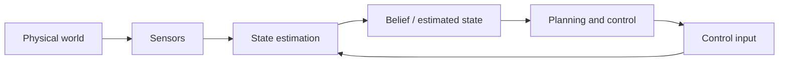

## English

Sensors do not reveal the world directly: they provide partial, delayed, and noisy measurements. **State estimation** combines a motion model, control inputs, sensor observations, and uncertainty to infer the variables a robot needs but cannot observe perfectly.

> [!info] Depth target
> Read state-estimation and SLAM papers without confusing state, observation, estimate, or map; interpret covariance, drift, loop closure, and sensor-fusion claims; and judge whether the reported evaluation supports robust deployment. Full filter and bundle-adjustment implementations are a working/mastery topic.

> [!note] Prerequisites
> [[02-foundations/linear-algebra|Linear Algebra]] · [[02-foundations/probability|Probability]] · [[02-foundations/optimization|Optimization]] · [[02-foundations/signal-processing|Signal Processing]] · [[02-foundations/se3-geometry|3D Geometry & SE(3)]]

### 1. Position in the robot loop

The controller rarely receives the true state $x_t$. It acts on an estimate $\hat{x}_t$ or a belief distribution. Poor estimation can therefore appear downstream as a planning or control failure.

### 2. Four quantities that must not be conflated

| Quantity | Meaning | Example |
|---|---|---|
| State $x_t$ | Variables sufficient for the model at time $t$ | pose, velocity, IMU bias |
| Observation $z_t$ | What a sensor measures | pixels, ranges, encoder ticks |
| Estimate $\hat{x}_t$ | A point summary inferred from data | estimated pose |
| Belief $p(x_t\mid z_{1:t},u_{1:t})$ | Distribution over plausible states | pose mean and covariance, particles |

State is a modeling choice, not a synonym for all physical reality. Covariance describes uncertainty **under the assumed model**; a small covariance can still be overconfident when calibration, association, or noise assumptions are wrong.

### 3. Process and observation models

$$x_t=f(x_{t-1},u_t)+w_t, \qquad z_t=h(x_t)+v_t$$

- **Given:** previous belief, input $u_t$, and measurement $z_t$.
- **Estimated:** current state or belief.
- **Uncertainty:** $w_t$ captures process/model uncertainty; $v_t$ captures measurement noise.
- **Runtime:** the estimate is updated online as measurements arrive.

Model error and sensor noise are different. Wheel slip violates a motion model; noisy range readings perturb measurements. Treating both as the same Gaussian noise can make a filter inconsistent.

### 4. Bayes filtering: predict, then correct

$$p(x_t\mid z_{1:t-1},u_{1:t})=\int p(x_t\mid x_{t-1},u_t)p(x_{t-1}\mid z_{1:t-1},u_{1:t-1})\,dx_{t-1}$$

$$p(x_t\mid z_{1:t},u_{1:t})\propto p(z_t\mid x_t)p(x_t\mid z_{1:t-1},u_{1:t})$$

Prediction moves the previous belief through the dynamics and normally increases uncertainty. Correction weights that prior by how compatible each state is with the new measurement.

### 5. Method families

| Family | Representation and use | Main caution |
|---|---|---|
| Kalman filter | Linear-Gaussian mean and covariance | Model must fit the assumptions |
| EKF | Linearizes nonlinear models with Jacobians | Linearization and inconsistency |
| UKF | Propagates selected sigma points | Still assumes a compact unimodal belief |
| Particle filter | Weighted samples; useful for multimodality | Particle depletion and computation |
| Factor/pose graph | Batch or incremental optimization over constraints | Association errors and gauge freedom |

For a linear Kalman measurement update,

$$K=P^-H^\top(HP^-H^\top+R)^{-1}, \qquad \hat{x}^+=\hat{x}^-+K(z-H\hat{x}^-)$$

$K$ is not a hand-set trust weight: it follows from predicted covariance $P^-$, sensor covariance $R$, and observation geometry $H$.

### 6. Worked example: one-dimensional update

Suppose the predicted position is $10$ m with variance $4\,\mathrm{m}^2$, and a sensor reports $12$ m with variance $1\,\mathrm{m}^2$. With $H=1$,

$$K=\frac{4}{4+1}=0.8, \qquad \hat{x}^+=10+0.8(12-10)=11.6\ \mathrm{m}$$

The posterior variance is $(1-K)4=0.8\,\mathrm{m}^2$. The estimate lies closer to the more precise measurement. This conclusion is valid only if the variances and model are credible.

### 7. Odometry, localization, mapping, and SLAM

| Problem | What is treated as known | What is inferred |
|---|---|---|
| Odometry | consecutive motion measurements | relative motion |
| Localization | a map | robot pose in the map |
| Mapping | robot poses | map structure |
| SLAM | neither is perfectly known | trajectory and map jointly |

A SLAM **front end** extracts features or geometric constraints and performs data association. The **back end** optimizes poses, landmarks, and sometimes calibration variables. Loop closure can correct accumulated drift, but a false closure can corrupt the entire map.

### 8. Sensor fusion and systems details

- IMU: high-rate acceleration/angular velocity; bias causes drift.
- Camera: rich appearance and geometry; sensitive to blur, lighting, and texture.
- LiDAR: direct range geometry; affected by sparsity, weather, and motion distortion.
- Wheel odometry: inexpensive local motion; fails under slip.
- GNSS: absolute non-drifting reference in favorable conditions, but obstruction and multipath can introduce noise and bias.

**Loosely coupled** systems fuse completed subsystem estimates. **Tightly coupled** systems jointly use lower-level measurements, often preserving information but increasing model and implementation complexity. Calibration, timestamps, rolling shutter, latency, and clock offset can dominate algorithmic improvements.

### 9. Reading claims and evaluations

| Paper phrase | Check before accepting it |
|---|---|
| real-time | hardware, input rate, latency distribution, and whether mapping is included |
| robust localization | environments, motion, lighting/weather, and catastrophic failures |
| drift-free | duration/distance and reliance on absolute references or loop closure |
| tightly coupled | which raw measurements and states are jointly optimized |
| consistent | whether reported uncertainty matches actual estimation error |

Common metrics include Absolute Trajectory Error, Relative Pose Error, drift per distance/time, relocalization success, map accuracy, latency, and failure rate. A low average trajectory error can hide rare catastrophic tracking losses.

### After reading

You should be able to:

- distinguish state, observation, estimate, and belief;
- explain prediction and correction in a Bayes filter;
- interpret a Kalman gain without calling covariance unconditional confidence;
- distinguish odometry, localization, mapping, and SLAM;
- explain front end, back end, drift, and loop closure;
- identify calibration, synchronization, and evaluation assumptions in a paper.

### Self-check

1. Why can a filter report small covariance and still be wrong?
2. Recompute the example if the sensor variance is $16\,\mathrm{m}^2$.
3. Why is global localization a natural particle-filter problem?
4. What experiment would support a claim of robustness to construction-site vibration?

> [!tip]- Answers
> 1. Covariance is conditional on the model; wrong calibration, association, or noise assumptions create overconfidence. 2. $K=4/(4+16)=0.2$, so $\hat{x}^+=10.4$ m. 3. The belief can contain several separated pose hypotheses. 4. Repeated trajectories with controlled vibration levels, synchronized ground truth, failure counts, and comparison against the same pipeline without the claimed robustness mechanism.

### Sources

- [Probabilistic Robotics — Thrun, Burgard & Fox](https://docs.ufpr.br/~danielsantos/ProbabilisticRobotics.pdf)
- [GTSAM concepts](https://gtsam.org/tutorials/intro.html)
- [KITTI odometry evaluation](https://www.cvlibs.net/datasets/kitti/eval_odometry.php)

## 한국어

센서는 세계를 직접 알려주지 않고 잡음·지연이 섞인 부분 관측을 준다. **상태 추정**은 운동 모델, 제어 입력, 센서 관측과 불확실성을 결합해 로봇에 필요하지만 직접 볼 수 없는 상태를 추론한다.

핵심 구분은 $x_t$(상태), $z_t$(관측), $\hat{x}_t$(추정값), $p(x_t\mid z_{1:t},u_{1:t})$(belief)다. Covariance는 가정한 모델 아래의 불확실성이지 무조건적인 신뢰도가 아니다. 모델·보정·data association이 틀리면 covariance가 작아도 과신할 수 있다.

과정 모델 $x_t=f(x_{t-1},u_t)+w_t$는 이전 상태와 입력으로 현재를 예측하고, 관측 모델 $z_t=h(x_t)+v_t$는 상태가 어떤 센서값을 만들지 설명한다. Bayes filter는 **예측**으로 prior를 전파하고 **보정**으로 새 likelihood를 반영한다.

Kalman filter는 선형 Gaussian belief, EKF는 Jacobian 선형화, UKF는 sigma point, particle filter는 가중 표본, factor graph는 여러 시간의 제약을 함께 최적화한다. 알고리즘 이름보다 belief의 형태, 모델 가정, 계산량, association 실패 가능성을 확인해야 한다.

Odometry는 상대 이동, localization은 알려진 지도에서 pose, mapping은 pose가 주어졌을 때 지도, SLAM은 pose와 지도를 함께 추정한다. SLAM front end는 측정·association 제약을 만들고 back end는 pose와 landmark를 최적화한다. Loop closure는 drift를 고칠 수 있지만 잘못된 closure는 지도를 전체적으로 망칠 수 있다.

논문에서는 평균 ATE만 보지 말고 RPE, 거리·시간당 drift, relocalization, latency, 환경 변화, catastrophic failure를 함께 본다. 카메라·IMU·LiDAR·encoder·GNSS의 장단점뿐 아니라 extrinsic calibration, timestamp, latency, rolling shutter와 clock offset도 확인한다.

위 영어 절의 After reading과 Self-check를 이용해 상태·관측·belief, predict/update, sensor fusion, SLAM architecture와 평가 조건을 자기 말로 설명할 수 있는지 점검하라.
