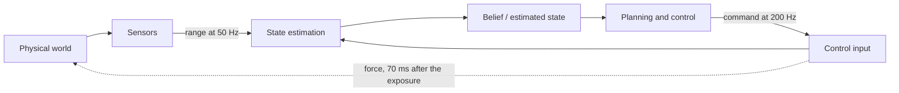
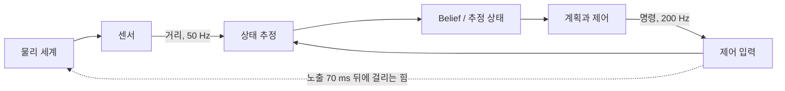

## English

*Group B. Stands on linear algebra, probability, optimization, signal processing and [[02-foundations/se3-geometry|SE(3)]].
A robot never observes its own state directly; groups C and F consume the estimate this page produces.*

Sensors do not reveal the world directly: they provide partial, delayed, and noisy measurements. **State estimation** combines a motion model, control inputs, sensor observations, and uncertainty to infer the variables a robot needs but cannot observe perfectly.

> [!info] Depth target
> Read state-estimation and SLAM papers without confusing state, observation, estimate, or map; interpret covariance, drift, loop closure, and sensor-fusion claims; and judge whether the reported evaluation supports robust deployment. Full filter and bundle-adjustment implementations are a working/mastery topic.

> [!note] Prerequisites
> Plants **P5** (a one-dimensional range estimate to a wall) and **P6** (a cart on a rail and its clocks) from [[02-foundations/lab-plants|0.6 Lab Plants]] (*plant*: control's word for the system being controlled) · [[02-foundations/linear-algebra|Linear Algebra]] · [[02-foundations/probability|Probability]] (the scalar Kalman filter of §5, the Mahalanobis distance and $\chi^2$ gate of §6) · [[02-foundations/optimization|Optimization]] (§3.5, the Gauss–Newton step a SLAM back end runs) · [[02-foundations/signal-processing|Signal Processing]] (§2, sampling and the zero-order hold) · [[02-foundations/se3-geometry|3D Geometry & SE(3)]]

> [!note] Why this matters · 왜 배우는가
> This page is the *object and scene understanding* layer of the physical-AI stack in [[07-research-program/index|7. Research Program §5]], and in *"install that panel on the frame"* it serves step 2, *identify panel and frame*: it turns P5's noisy ranges into the belief about where the panel is, the belief the approach and the contact then act on (its chip sits in the scene-and-state band of the [[physical-ai-map|Physical AI Map]]). Without it a wrong reading is believed as firmly as a right one: fuse a passer-by's $18$ cm and the estimate jumps to $15.36$ cm while its variance shrinks to the same $0.643$ cm² the panel's own reading gives, so the tool meets the panel $4.9$ cm before it expects contact, and only the gate, which puts that reading $4.4\sigma$ out, tells the two apart (the Worked case). The same predict–correct–gate loop takes its $Q$ and $R$ from [[04-robotics/sensor-models|3.2 Sensor Models & Noise §8]], gives [[04-robotics/planning-decision-making|4. Planning §7]] the belief it plans on and [[04-robotics/lqr-lqg|6. LQR & LQG §4]] its estimator half, and supplies the fused range and its $\sigma$ that inflate the panel's C-obstacle in [[04-robotics/capstone-panel-contact|26. Capstone §2]]; on the dissertation path ([[07-research-program/index|7. Research Program §8]]) the page belongs to block 2, the robotics common track, as robotics sessions 25–31. After it you can run and gate a Kalman update by hand, say what a reported covariance does and does not promise, and check a SLAM or tracking paper's drift, loop-closure and consistency claims.

> [!note] First pass · 처음이라면
> About two sessions of 60–90 minutes, the bold rows 25–26 of the robotics schedule. **Session 1:** the Running object, the picture and the Worked case, redone by hand with the solution covered; end with step 5's Joseph check. **Session 2:** §1–§4 in order — the loop and its two clocks, the four quantities that must not be conflated, the two models, predict and correct — carrying §4's corridor by hand through its second step, then §6's short recap; end with self-checks 1 and 2. The rest is the second pass, one sitting each (rows 27–29): §5 against a paper's estimator, starting with its two-state example; §7–§8 for SLAM and sensor fusion; and §8.5, a self-contained unit for a tracking paper, together with §9 for any paper's evaluation. Then the problem set, items 1–2 by hand before item 3's lab prints their answers.

### Running object: P5's panel on P6's clock

**P5** from [[02-foundations/lab-plants|0.6 Lab Plants]] is the panel that P2, the catalog's planar two-link arm, is carrying a tool toward: a wall at a prior range of $10\,\mathrm{cm}$ with variance $4\,\mathrm{cm}^2$, and a range sensor that reads $12\,\mathrm{cm}$ with variance $1\,\mathrm{cm}^2$. **P6**, the catalog's cart on a rail with a $50\,\mathrm{Hz}$ vision node and a $200\,\mathrm{Hz}$ controller, supplies the clock and the motion. Every P5 range on this page is in centimetres.

| Symbol | Value | What it is |
|---|---:|---|
| $x_0$, $P_0$ | $10\,\mathrm{cm}$, $4\,\mathrm{cm}^2$ | P5's prior range and its variance, frozen in 0.6 |
| $z$ | $12\,\mathrm{cm}$ | P5's first range reading |
| $R$ | $1\,\mathrm{cm}^2$ | the range sensor's noise variance, frozen in 0.6 |
| $\Delta t$ | $20\,\mathrm{ms}$ | one filter step, from P6's $50\,\mathrm{Hz}$ vision rate |
| $u$ | $0.5\,\mathrm{m/s}$ | commanded approach speed, so $u\Delta t = 1\,\mathrm{cm}$ of advance per step |
| $Q$ | $1\,\mathrm{cm}^2$ | process-noise variance per step — this page's only addition to P5, and deliberately large |
| $T_\ell$ | $70\,\mathrm{ms}$ | P6's end-to-end latency, camera mid-exposure to applied force |
| $\Delta$ | $1/2048\,\mathrm{m} = 0.488\,\mathrm{mm}$ | one count of P6's encoder ($2048$ counts/m) |

The $1\,\mathrm{cm}$ step every later section advances by is not a free choice: it is $u\Delta t = 0.5 \times 0.02\,\mathrm{m}$, the distance the tool covers between two frames of P6's vision node. $Q = 1\,\mathrm{cm}^2$ is deliberately large, a standard deviation of $1\,\mathrm{cm}$ on a $1\,\mathrm{cm}$ advance, as if the speed were uncertain by its whole value, so that $Q/R = 1$ and every number stays simple; the white noise of an IMU (inertial measurement unit: the accelerometers and gyroscopes on one chip) would add only $2.7\times10^{-8}\,\mathrm{cm}^2$ per step ([[04-robotics/sensor-models|3.2 Sensor Models & Noise §8]]). Two numbers from the same table decide what the filter can and cannot fix.

- **Latency is larger than the noise it is usually blamed on.** A range that arrives $T_\ell = 70\,\mathrm{ms}$ late describes the world $0.5 \times 0.070 = 3.5\,\mathrm{cm}$ ago, and $3.5\,\mathrm{cm}$ is $3.5$ times the sensor's own standard deviation of $1\,\mathrm{cm}$. So an unmodelled timestamp is a bias three and a half times the size of the noise term the filter is tuned against, and no covariance setting removes a bias.
- **The noise on the datasheet is not the noise that matters.** P6's encoder quantizes position to $\Delta = 1/2048\,\mathrm{m} = 0.488\,\mathrm{mm}$, and a uniform quantum has variance $\Delta^2/12$, so its standard deviation is $0.141\,\mathrm{mm} = 0.0141\,\mathrm{cm}$ and its variance $1.99\times10^{-4}\,\mathrm{cm}^2$. That is four orders of magnitude below $Q = 1\,\mathrm{cm}^2$, because $Q$ stands for slip and unmodelled motion, not for encoder counts. The $\Delta^2/12$ is derived, with the condition under which it holds (the cart crossing many counts irregularly between samples, not standing still), in [[04-robotics/sensor-models|3.2 Sensor Models & Noise §4]].

*Scope: this page teaches how a belief is propagated and corrected, what a Kalman gain and an innovation are, how the SLAM posterior factors, and how to read an estimation claim. It does not teach the rotation parameterizations an SE(3) estimator needs ([[02-foundations/se3-geometry|8. 3D Geometry & SE(3)]]), the perception front end that produces the measurements ([[04-robotics/geometric-perception-calibration|3.5 Geometric Perception]]), or the solvers the back end calls ([[02-foundations/optimization|4. Optimization §3.5]]).*

### The picture: one cycle, with the gate drawn to scale

<svg viewBox="0 0 560 386" style="max-width:100%;height:auto" role="img" aria-label="One predict-correct-gate cycle on P5's range axis in centimetres, drawn to scale: the belief at 11.6 predicted 1 cm left to 10.6 with its spread growing from 0.89 to 1.34; a gate of half-width 5.02 around the prediction with z = 10.5 inside and z = 18 outside; and two hypotheses, the panel pulling the estimate to 10.536 and the passer-by throwing it to 15.357, 4.86 cm past the panel, both reporting P+ = 0.6429.">
  <defs><marker id="aSES" viewBox="0 0 10 10" refX="8" refY="5" markerWidth="6" markerHeight="6" orient="auto"><path d="M 0 0 L 10 5 L 0 10 z" fill="currentColor"/></marker></defs>
  <g stroke="currentColor" stroke-width="1" fill="none" stroke-opacity="0.55">
    <line x1="24" y1="64" x2="374" y2="64"/>
    <line x1="24" y1="152" x2="374" y2="152"/>
    <line x1="24" y1="222" x2="374" y2="222"/>
    <line x1="24" y1="282" x2="374" y2="282"/>
  </g>
  <g stroke="currentColor" stroke-width="0.8" stroke-opacity="0.35">
    <line x1="24" y1="61.5" x2="24" y2="66.5"/>
    <line x1="49" y1="61.5" x2="49" y2="66.5"/>
    <line x1="74" y1="61.5" x2="74" y2="66.5"/>
    <line x1="99" y1="61.5" x2="99" y2="66.5"/>
    <line x1="124" y1="61.5" x2="124" y2="66.5"/>
    <line x1="149" y1="61.5" x2="149" y2="66.5"/>
    <line x1="174" y1="61.5" x2="174" y2="66.5"/>
    <line x1="199" y1="61.5" x2="199" y2="66.5"/>
    <line x1="224" y1="61.5" x2="224" y2="66.5"/>
    <line x1="249" y1="61.5" x2="249" y2="66.5"/>
    <line x1="274" y1="61.5" x2="274" y2="66.5"/>
    <line x1="299" y1="61.5" x2="299" y2="66.5"/>
    <line x1="324" y1="61.5" x2="324" y2="66.5"/>
    <line x1="349" y1="61.5" x2="349" y2="66.5"/>
    <line x1="374" y1="61.5" x2="374" y2="66.5"/>
    <line x1="24" y1="149.5" x2="24" y2="154.5"/>
    <line x1="49" y1="149.5" x2="49" y2="154.5"/>
    <line x1="74" y1="149.5" x2="74" y2="154.5"/>
    <line x1="99" y1="149.5" x2="99" y2="154.5"/>
    <line x1="124" y1="149.5" x2="124" y2="154.5"/>
    <line x1="149" y1="149.5" x2="149" y2="154.5"/>
    <line x1="174" y1="149.5" x2="174" y2="154.5"/>
    <line x1="199" y1="149.5" x2="199" y2="154.5"/>
    <line x1="224" y1="149.5" x2="224" y2="154.5"/>
    <line x1="249" y1="149.5" x2="249" y2="154.5"/>
    <line x1="274" y1="149.5" x2="274" y2="154.5"/>
    <line x1="299" y1="149.5" x2="299" y2="154.5"/>
    <line x1="324" y1="149.5" x2="324" y2="154.5"/>
    <line x1="349" y1="149.5" x2="349" y2="154.5"/>
    <line x1="374" y1="149.5" x2="374" y2="154.5"/>
    <line x1="24" y1="219.5" x2="24" y2="224.5"/>
    <line x1="49" y1="219.5" x2="49" y2="224.5"/>
    <line x1="74" y1="219.5" x2="74" y2="224.5"/>
    <line x1="99" y1="219.5" x2="99" y2="224.5"/>
    <line x1="124" y1="219.5" x2="124" y2="224.5"/>
    <line x1="149" y1="219.5" x2="149" y2="224.5"/>
    <line x1="174" y1="219.5" x2="174" y2="224.5"/>
    <line x1="199" y1="219.5" x2="199" y2="224.5"/>
    <line x1="224" y1="219.5" x2="224" y2="224.5"/>
    <line x1="249" y1="219.5" x2="249" y2="224.5"/>
    <line x1="274" y1="219.5" x2="274" y2="224.5"/>
    <line x1="299" y1="219.5" x2="299" y2="224.5"/>
    <line x1="324" y1="219.5" x2="324" y2="224.5"/>
    <line x1="349" y1="219.5" x2="349" y2="224.5"/>
    <line x1="374" y1="219.5" x2="374" y2="224.5"/>
    <line x1="24" y1="279.5" x2="24" y2="284.5"/>
    <line x1="49" y1="279.5" x2="49" y2="284.5"/>
    <line x1="74" y1="279.5" x2="74" y2="284.5"/>
    <line x1="99" y1="279.5" x2="99" y2="284.5"/>
    <line x1="124" y1="279.5" x2="124" y2="284.5"/>
    <line x1="149" y1="279.5" x2="149" y2="284.5"/>
    <line x1="174" y1="279.5" x2="174" y2="284.5"/>
    <line x1="199" y1="279.5" x2="199" y2="284.5"/>
    <line x1="224" y1="279.5" x2="224" y2="284.5"/>
    <line x1="249" y1="279.5" x2="249" y2="284.5"/>
    <line x1="274" y1="279.5" x2="274" y2="284.5"/>
    <line x1="299" y1="279.5" x2="299" y2="284.5"/>
    <line x1="324" y1="279.5" x2="324" y2="284.5"/>
    <line x1="349" y1="279.5" x2="349" y2="284.5"/>
    <line x1="374" y1="279.5" x2="374" y2="284.5"/>
  </g>
  <line x1="189" y1="38" x2="164" y2="38" stroke="currentColor" stroke-width="1.6" marker-end="url(#aSES)"/>
  <g stroke="currentColor" stroke-width="1.8">
    <line x1="189" y1="56" x2="189" y2="72"/>
    <line x1="164" y1="56" x2="164" y2="72"/>
  </g>
  <rect x="166.6" y="76" width="44.7" height="5" fill="currentColor" fill-opacity="0.45"/>
  <rect x="130.5" y="88" width="67.1" height="5" fill="currentColor" fill-opacity="0.8"/>
  <rect x="38.5" y="126" width="251" height="26" fill="currentColor" fill-opacity="0.14" stroke="currentColor" stroke-opacity="0.5" stroke-width="1"/>
  <line x1="164" y1="120" x2="164" y2="158" stroke="currentColor" stroke-width="1.8"/>
  <path d="M161.5 156.8 L165.7 161 L161.5 165.2 L157.3 161 Z" fill="currentColor" fill-opacity="1"/>
  <path d="M349 156.8 L353.2 161 L349 165.2 L344.8 161 Z" fill="currentColor" fill-opacity="1"/>
  <line x1="161.5" y1="210" x2="161.5" y2="234" stroke="currentColor" stroke-width="2.6" stroke-opacity="0.6"/>
  <line x1="164" y1="216" x2="164" y2="228" stroke="currentColor" stroke-width="1.2" stroke-opacity="0.8"/>
  <line x1="161.5" y1="270" x2="161.5" y2="294" stroke="currentColor" stroke-width="2.6" stroke-opacity="0.6"/>
  <line x1="164" y1="276" x2="164" y2="288" stroke="currentColor" stroke-width="1.2" stroke-opacity="0.8"/>
  <line x1="164" y1="213" x2="162.4" y2="213" stroke="currentColor" stroke-width="1.6" marker-end="url(#aSES)"/>
  <circle cx="162.4" cy="222" r="2.8" fill="currentColor"/>
  <line x1="164" y1="273" x2="282.9" y2="273" stroke="currentColor" stroke-width="1.6" marker-end="url(#aSES)"/>
  <circle cx="282.9" cy="282" r="3.6" fill="currentColor"/>
  <path d="M161.5 298 H282.9 M161.5 294 v8 M282.9 294 v8" stroke="currentColor" stroke-width="1" fill="none"/>
  <g fill="none" stroke="currentColor" stroke-width="1.2">
    <rect x="386" y="200" width="163" height="34" rx="3"/>
    <rect x="386" y="260" width="163" height="34" rx="3"/>
  </g>
  <line x1="24" y1="346" x2="374" y2="346" stroke="currentColor" stroke-width="1.1"/>
  <g stroke="currentColor" stroke-width="1">
    <line x1="24" y1="346" x2="24" y2="343"/>
    <line x1="49" y1="346" x2="49" y2="341"/>
    <line x1="74" y1="346" x2="74" y2="343"/>
    <line x1="99" y1="346" x2="99" y2="341"/>
    <line x1="124" y1="346" x2="124" y2="343"/>
    <line x1="149" y1="346" x2="149" y2="341"/>
    <line x1="174" y1="346" x2="174" y2="343"/>
    <line x1="199" y1="346" x2="199" y2="341"/>
    <line x1="224" y1="346" x2="224" y2="343"/>
    <line x1="249" y1="346" x2="249" y2="341"/>
    <line x1="274" y1="346" x2="274" y2="343"/>
    <line x1="299" y1="346" x2="299" y2="341"/>
    <line x1="324" y1="346" x2="324" y2="343"/>
    <line x1="349" y1="346" x2="349" y2="341"/>
    <line x1="374" y1="346" x2="374" y2="343"/>
  </g>
  <g font-size="11" fill="currentColor">
    <text x="176.5" y="30" text-anchor="middle">predict: x − uΔt, 1 cm</text>
    <text x="194" y="60">11.6</text>
    <text x="159" y="60" text-anchor="end">10.6</text>
    <text x="217.4" y="82" opacity="0.8">√P = 0.89</text>
    <text x="203.5" y="94">√P⁻ = 1.34</text>
    <text x="386" y="56">belief 11.6 cm, P = 0.8 cm²</text>
    <text x="386" y="70">prediction adds Q = 1: P⁻ = 1.8</text>
    <text x="386" y="84" opacity="0.8">the bar grows, it never shrinks</text>
    <text x="169" y="122">x̂⁻ = 10.6</text>
    <text x="43.5" y="143" opacity="0.9">gate ±5.02</text>
    <text x="155.5" y="176" text-anchor="end">z = 10.5</text>
    <text x="349" y="178" text-anchor="middle">z = 18</text>
    <text x="386" y="122">gate around the prediction:</text>
    <text x="386" y="136">half-width 3√(P⁻ + R) = 5.02 cm</text>
    <text x="386" y="150" opacity="0.9">z = 10.5: |ν| = 0.1, inside</text>
    <text x="386" y="164" opacity="0.9">z = 18: ν = 7.4, outside</text>
    <text x="155.5" y="216" text-anchor="end" opacity="0.85">panel</text>
    <text x="173" y="217" opacity="0.85">a 0.064 cm pull</text>
    <text x="155.5" y="276" text-anchor="end" opacity="0.85">panel</text>
    <text x="222.2" y="312" text-anchor="middle">4.86 cm past the panel</text>
    <text x="394" y="214">this z is the panel</text>
    <text x="394" y="228" opacity="0.85">x̂⁺ = 10.536 cm</text>
    <text x="394" y="274">this z is a passer-by</text>
    <text x="394" y="288" opacity="0.85">x̂⁺ = 15.357 cm</text>
    <text x="386" y="312">P⁺ = 0.6429 cm² in both boxes</text>
    <text x="386" y="326" opacity="0.85">the variance cannot tell them apart</text>
    <text x="49" y="360" text-anchor="middle" font-size="11">6</text>
    <text x="99" y="360" text-anchor="middle" font-size="11">8</text>
    <text x="149" y="360" text-anchor="middle" font-size="11">10</text>
    <text x="199" y="360" text-anchor="middle" font-size="11">12</text>
    <text x="249" y="360" text-anchor="middle" font-size="11">14</text>
    <text x="299" y="360" text-anchor="middle" font-size="11">16</text>
    <text x="349" y="360" text-anchor="middle" font-size="11">18</text>
    <text x="24" y="373" opacity="0.8">range to the panel (cm), one scale for every row</text>
  </g>
</svg>

One predict–correct–gate cycle on P5's range axis, drawn to scale in centimetres: the belief at $11.6$ is predicted $1\,\mathrm{cm}$ to $10.6$, and its spread $\sqrt{P}$ grows from $0.89$ to $1.34$ because prediction only adds $Q$. The gate, of half-width $3\sqrt{P^- + R} = 5.02$, is centred on the prediction, so $z = 10.5$ falls inside it and $z = 18$ far outside. Fused, the panel reading pulls the estimate to $10.536$ and the passer-by throws it to $15.357$, $4.86\,\mathrm{cm}$ past the panel, yet both report the same $P^+ = 0.6429\,\mathrm{cm}^2$.

### Worked case: one predict–correct–gate cycle on P5, every intermediate

Start from the belief the catalog's own update leaves: $\hat x = 11.6\,\mathrm{cm}$, $P = 0.8\,\mathrm{cm}^2$ (P5's scalar Kalman step, derived in 3. Probability §5.2 and recapped in §6). One step of P6's clock passes and a new range arrives.

**1. Predict.** The motion model is $f(x, u) = x - u\Delta t$ with $u\Delta t = 1\,\mathrm{cm}$ (advancing toward the panel shortens the range), so the state-transition factor is $A = 1$ and the predict equations of [[02-foundations/probability|3. Probability §5]], restated in §5 below, give

$$\hat x^- = 11.6 - 1 = 10.6\ \mathrm{cm}, \qquad P^- = 1^2 \times 0.8 + 1 = 1.8\ \mathrm{cm}^2$$

because $A = 1$ carries the variance through unchanged and the independent process noise $Q$ adds its own $1\,\mathrm{cm}^2$ on top.

**2. Innovation covariance and gain, before any measurement is looked at.** With $H = 1$, since the sensor reads the range itself, the innovation covariance and Kalman gain of [[02-foundations/probability|3. Probability §5]] are

$$S = P^- + R = 1.8 + 1 = 2.8\ \mathrm{cm}^2, \qquad \sqrt{S} = 1.673\ \mathrm{cm}, \qquad K = \frac{P^-}{S} = \frac{1.8}{2.8} = 0.6429$$

Both are fixed by the model alone, since neither $S$ nor $K$ contains $z$. That is why the gate below can be drawn before the reading arrives.

**3. Gate.** The squared Mahalanobis distance of the innovation $\nu = z - \hat x^-$ is $d^2 = \nu^2/S$, the miss measured in units of its own predicted spread; it is the NIS (normalized innovation squared) of [[02-foundations/probability|3. Probability §6.3]]. For a correct association it follows a $\chi^2$ distribution with one degree of freedom, which is where the threshold comes from; §8.5.2 builds the gate for many objects. In one dimension a $3\sigma$ gate is $d^2 < 9$, equivalently $|\nu| < 3\sqrt{S} = 5.02\,\mathrm{cm}$. The level is a design choice, not a law: $d^2 < 9$ keeps $99.73\%$ of correct readings, Probability §6.3 gated the same sensor at $95\%$ ($d^2 < 3.841$, here $|\nu| < 3.28\,\mathrm{cm}$), and §8.5.2 uses $99\%$ for 2-D positions ($d^2 < 9.21$). A wider gate throws away fewer true readings and lets in more wrong ones. Probability §6.3 already rejected a wrong wall at $20$ cm with an NIS of $39.2$; this is the same test one predict step later.

| Candidate | $\nu = z - \hat x^-$ | $d^2 = \nu^2/S$ | $3\sigma$ gate | $\hat x^+ = \hat x^- + K\nu$ | $P^+ = (1-K)P^-$ |
|---|---:|---:|---|---:|---:|
| panel, $z = 10.5$ | $-0.100$ | $0.0036$ | accept | $10.536$ | $0.6429$ |
| passer-by, $z = 18$ | $+7.400$ | $19.557$ | reject | $15.357$ | $0.6429$ |

**4. What the wrong association costs, in the filter's own units.** Take the panel's own reading, $10.5\,\mathrm{cm}$, as the true range; its error of about $1\,\mathrm{cm}$ is small against what follows. Fuse the passer-by anyway and the estimate lands $15.357 - 10.5 = 4.857\,\mathrm{cm}$ beyond the panel while reporting $P^+ = 0.6429\,\mathrm{cm}^2$. §2's consistency check turns that into one number, the NEES (normalized estimation error squared: the true error squared, divided by the variance the filter reported; defined in 3. Probability §6.3 and recalled in §2) of the resulting estimate:

$$\epsilon = \frac{(10.5 - 15.357)^2}{0.6429} = 36.7$$

A consistent one-dimensional filter averages $\epsilon \approx 1$, so $36.7$ is not a large error inside a wide belief: it is a confident belief about the wrong place. A tool driven to that range strikes the panel $4.9\,\mathrm{cm}$ before it expects contact. The gate, not the covariance, is what separates the two rows of the table, because both rows report the identical $P^+$.

**5. One check worth doing by hand.** The Joseph form $P^+ = (1-K)^2P^- + K^2R$ is not new: it is the error variance $(1-k)^2P^- + k^2R$ that 3. Probability §5.2's best linear blend minimised over $k$, evaluated at the gain actually used. It comes straight from the error: with measurement noise $v$, the new error is $x - \hat x^+ = (1-K)(x - \hat x^-) - Kv$, two independent terms whose variances add. It gives $0.6429$, the same value as $(1-K)P^-$, which it must for the optimal $K$. The two disagree only when the gain used is not the optimal one ($K = 0.5$ gives $0.70$ against $0.90$, and only the $0.70$ is the true variance), which is exactly when the Joseph form is worth its extra arithmetic.

### 1. Position in the robot loop

The controller rarely receives the true state $x_t$. It acts on an estimate $\hat{x}_t$ or a belief distribution, so poor estimation can appear downstream as a planning or control failure, and every arrow into the estimator carries a delay.



**Two arrows enter the estimator, and both carry time.** The input arrow is the command the controller has just sent, and it enters because the predict step uses it: on P5 the filter shortens the predicted range by $u\Delta t=1$ cm per step because the tool was commanded forward, so a command the actuator did not carry out enters the estimate as a wrong prediction. The sensor arrow runs on its own clock. P5's range arrives with P6's $50$ Hz vision while P6's controller ticks at $200$ Hz, so each corrected estimate serves $4$ control ticks. Held unchanged, the zero-order hold of [[02-foundations/signal-processing|6. Signal Processing §2]], it is $0.5\times0.015=0.75$ cm behind the tool by the fourth tick, which is why an estimator predicts forward between corrections instead of holding its last answer.

**How an estimation error shows up downstream.** Take the running object's $70$ ms latency at $u=0.5$ m/s. Every range describes where the tool was $3.5$ cm ago, so the tool touches the panel while the estimate still reads $3.5$ cm of clearance. In the log that is a contact $70$ ms earlier than the controller expected, with a force spike, while a controller that tracked $\hat x$ to within $0.1$ cm reports $0.1$ cm of tracking error the whole way: an estimation failure filed as a control failure. So when a paper reports tracking error, check what it was measured against, because error relative to $\hat x$ measures the controller and only error against ground truth measures the robot. The latency also caps the speed at which a camera correction helps at all. The staleness of $3.5$ cm is $3.9$ times the estimate's own spread $\sqrt{0.8}=0.894$ cm, and the check $vL\le\sigma$ of [[04-robotics/capstone-panel-contact|26. Capstone §5]] allows at most $0.894/0.070=12.8$ cm/s. Taking such a latency apart term by term is [[04-robotics/robot-systems-deployment|10. Robot Systems §3]].

### 2. Four quantities that must not be conflated

The distinction is needed because the controller acts on an estimate while the world evolves according to the actual state. For example, an excavator can receive a precise-looking pose after a localization outage; the small reported covariance may simply omit the unmodeled motion.

| Quantity | Meaning | Example |
|---|---|---|
| State $x_t$ | Variables sufficient for the model at time $t$ | pose, velocity, IMU bias (the slowly wandering offset of an inertial measurement unit — the accelerometer-plus-gyroscope chip) |
| Observation $z_t$ | What a sensor measures | pixels, ranges, encoder ticks |
| Estimate $\hat{x}_t$ | A point summary inferred from data | estimated pose |
| Belief $p(x_t\mid z_{1:t},u_{1:t})$ | Distribution over plausible states | pose mean and covariance, particles |

State is a modeling choice, not a synonym for all physical reality. Covariance describes uncertainty **under the assumed model**; a small covariance can still be overconfident when calibration, association, or noise assumptions are wrong.

**The four, stated completely.**
- **State** $x_t$ is a vector of variables chosen so that the past influences the future only through it. That is the **completeness** (Markov) condition:
$$p(x_t \mid x_{0:t-1}, z_{1:t-1}, u_{1:t}) = p(x_t \mid x_{t-1}, u_t)$$
Here $x_{0:t-1}$ is every earlier state, $z_{1:t-1}$ every earlier measurement and $u_{1:t}$ every control input, so the condition says that once the previous state and the current input are known, nothing older adds information about $x_t$. It is the Markov property of [[02-foundations/probability|3. Probability §5]]. *Example:* position and velocity together are a complete state for a cart pushed by known forces. *Non-example:* position alone is not, because two carts at the same position with different velocities move differently, so a prediction from position needs older positions too.
- **Observation** $z_t$ is the sensor output at time $t$. It is a random variable because of noise, and §3's observation model $h$ links it to the state.
- **Belief** is the posterior distribution of the state given all data so far,
$$\operatorname{bel}(x_t) = p(x_t \mid z_{1:t}, u_{1:t})$$
so it is a whole distribution, conditioned on the measurements $z_{1:t}$ and inputs $u_{1:t}$ from time 1 to $t$. The Bayes filter of §4 computes it.
- **Estimate** $\hat x_t$ is one point computed from the belief. The usual choices are the posterior mean (the minimum mean-square-error estimate) and the posterior mode (the MAP estimate):
$$\hat x_t = E[x_t \mid z_{1:t}, u_{1:t}] \quad \text{or} \quad \hat x_t = \arg\max_{x_t} \operatorname{bel}(x_t)$$
Its uncertainty is reported by the **estimate covariance**, the expected outer product of the error $x_t - \hat x_t$, since that is what says how far and in which directions the truth may lie (covariance is defined in [[02-foundations/probability|3. Probability §2]]):
$$P_t = E\big[(x_t - \hat x_t)(x_t - \hat x_t)^\top \mid z_{1:t}, u_{1:t}\big]$$
*Example:* after §6's update the belief is Gaussian with mean 11.6 cm and variance 0.8 cm², so the estimate is 11.6 cm by either rule, because a Gaussian's mean and mode coincide. *Non-example:* for a two-peaked belief (the robot is at door 1 or at door 2) the mean can fall between the doors, where the robot certainly is not, so a single point is a poor summary.
- **Consistency** is the property that the reported $P_t$ matches the actual error. With ground truth it is checked by the NEES (normalized estimation error squared), $\epsilon_t = (x_t - \hat x_t)^\top P_t^{-1}(x_t - \hat x_t)$, the squared Mahalanobis distance of the true error, which [[02-foundations/probability|3. Probability §6.3]] defines with its $\chi^2_n$ test: a consistent filter of an $n$-dimensional state averages about $n$ over many runs. *Non-example (overconfident):* a filter reporting $P = 0.01$ cm² while its errors actually have variance 1 cm² averages $\epsilon = 100$, the small-covariance failure above in numbers.

**The reading this gives you.** Ask what the observation directly measured, what inference produced the estimate, and which alternatives the belief still represents. A point estimate and its timestamp should never be read as a complete account of uncertainty merely because they arrived in the same message.

### 3. Process and observation models

The process model predicts because measurements do not continuously reveal the whole state, and the observation model connects a proposed state to what the sensor should see, so the two together say what the next reading ought to be:

$$x_t=f(x_{t-1},u_t)+w_t, \qquad z_t=h(x_t)+v_t$$

- **Given:** previous belief, input $u_t$, and measurement $z_t$.
- **Estimated:** current state or belief.
- **Uncertainty:** $w_t$ captures process/model uncertainty; $v_t$ captures measurement noise. A real sensor's error also carries a bias that does not average away; splitting it from the white part of $v_t$ is [[04-robotics/sensor-models|3.2 Sensor Models & Noise §1]].
- **Runtime:** the estimate is updated online as measurements arrive.

**The two models, stated completely.** A state-space model has four named parts.
- The **process (motion) model** $f$ maps the previous state $x_{t-1}$ and control $u_t$ to the next state.
- The **observation (measurement) model** $h$ maps a state to the measurement the sensor would produce without noise.
- The **process noise** $w_t$ and **measurement noise** $v_t$. In the standard Gaussian case both are zero-mean, white (independent across time) and independent of each other, with covariances $Q_t$ and $R_t$:
$$w_t \sim \mathcal{N}(0, Q_t), \qquad v_t \sim \mathcal{N}(0, R_t)$$
- An **initial belief** $p(x_0)$.

The Bayes filter of §4 uses the same models written as distributions, because adding Gaussian noise to a deterministic prediction gives a Gaussian centred on that prediction:
$$p(x_t \mid x_{t-1}, u_t) = \mathcal{N}\big(f(x_{t-1}, u_t),\, Q_t\big), \qquad p(z_t \mid x_t) = \mathcal{N}\big(h(x_t),\, R_t\big)$$
When $f(x, u) = Ax + Bu$ and $h(x) = Hx$ are linear, the model is **linear-Gaussian** and the Kalman filter of §5 is exact; otherwise the EKF, UKF or particle filter approximates. *Example:* a cart on a rail driven at commanded speed $u_t$ over a step $\Delta t$ has $f(x_{t-1}, u_t) = x_{t-1} + u_t\Delta t$, and a range sensor along the rail has $h(x_t) = x_t$, both linear. With $x_{t-1}$ estimated at 9 cm (variance 3 cm²), $u_t = 1$ cm/s, $\Delta t = 1$ s and $Q = 1$ cm², the prediction is 10 cm with variance $3 + 1 = 4$ cm², exactly the prior §6 starts from. *Non-example:* a sensor measuring range to a landmark beside the rail, $h(x) = \sqrt{(x - \ell_x)^2 + \ell_y^2}$, is not linear in $x$, so the Kalman filter no longer applies exactly.

Model error and sensor noise are different. Wheel slip violates a motion model; noisy range readings perturb measurements. Treating both as the same Gaussian noise can make a filter inconsistent: slipping wheels can make odometry predict motion that a range sensor does not support, and that disagreement can reflect a wrong motion assumption rather than merely a noisy range. **The reading this gives you.** Trace a residual back through both models before enlarging a noise parameter. Ask whether the filter can represent the mismatch, whether measurements arrive in time, and whether a calibration error is being disguised as random uncertainty.

### 4. Bayes filtering: predict, then correct

A robot that runs for hours cannot recompute its belief from every measurement it has ever taken. The Bayes filter is a **recursive estimator**: it computes the belief at time $t$ from the belief at $t-1$ plus the newest input and measurement only, so the data history never has to be stored, and one step is two lines:

$$p(x_t\mid z_{1:t-1},u_{1:t})=\int p(x_t\mid x_{t-1},u_t)p(x_{t-1}\mid z_{1:t-1},u_{1:t-1})\,dx_{t-1}$$

$$p(x_t\mid z_{1:t},u_{1:t})\propto p(z_t\mid x_t)p(x_t\mid z_{1:t-1},u_{1:t})$$

Read it as two moves. Prediction moves the previous belief through the dynamics and normally increases uncertainty. Correction weights that prior by how compatible each state is with the new measurement.

**What the Bayes filter is, part by part.** It has three named parts.
- **Prior belief** $\operatorname{bel}(x_{t-1}) = p(x_{t-1}\mid z_{1:t-1}, u_{1:t-1})$, the output of the previous step (at $t = 1$, the initial belief $p(x_0)$).
- **Prediction**, which produces the predicted belief $\overline{\operatorname{bel}}(x_t) = p(x_t \mid z_{1:t-1}, u_{1:t})$ by the first equation. Inside the integral, $p(x_t\mid x_{t-1},u_t)$ is §3's process model, and the integral sums over every previous state $x_{t-1}$ that could have led to $x_t$.
- **Correction**, which produces $\operatorname{bel}(x_t)$ by the second equation with its normalizer $\eta$ written out:
$$\operatorname{bel}(x_t) = \eta\, p(z_t \mid x_t)\, \overline{\operatorname{bel}}(x_t), \qquad \eta^{-1} = \int p(z_t \mid x_t)\, \overline{\operatorname{bel}}(x_t)\, dx_t$$
Here $p(z_t\mid x_t)$ is the observation model read as a **likelihood** (a function of $x_t$ for the fixed reading $z_t$), and $\eta$ is chosen so the belief integrates to 1, since likelihood times prediction is not yet a distribution. This is Bayes' rule of [[02-foundations/probability|3. Probability §1]], with $\eta^{-1}$ as the evidence.

The two assumptions it rests on, derived below, are the Markov property of the dynamics and the conditional independence of each measurement given its state ([[02-foundations/probability|3. Probability §5]]):
$$p(x_t\mid x_{t-1}, z_{1:t-1}, u_{1:t}) = p(x_t\mid x_{t-1},u_t), \qquad p(z_t\mid x_t, z_{1:t-1}, u_{1:t}) = p(z_t\mid x_t)$$

> [!example] Worked example: a three-cell corridor · 계산 예제
> A robot is in one of three cells 0, 1, 2 arranged in a loop. Cells 0 and 1 have a door and cell 2 is wall. It starts with no idea, $\operatorname{bel} = (1/3, 1/3, 1/3)$. Each step it tries to move one cell forward and succeeds with probability 0.8, otherwise it stays. Its door sensor reports "door" with probability 0.6 at a door and 0.2 at a wall. This is the forward algorithm of a hidden Markov model ([[02-foundations/probability|3. Probability §7.2]]), with the integral replaced by a sum over cells.
> - *Step 1, predict.* $\overline{\operatorname{bel}}(i) = 0.8\,\operatorname{bel}(i-1) + 0.2\,\operatorname{bel}(i)$ stays $(1/3, 1/3, 1/3)$, since moving a uniform belief keeps it uniform.
> - *Step 1, correct on "door".* Likelihood times prediction is $(0.2, 0.2, 0.0667)$. Its sum $0.4667$ gives $\eta = 2.143$, so $\operatorname{bel} = (0.429, 0.429, 0.143)$.
> - *Step 2, predict, then correct on "wall".* The prediction is $(0.200, 0.429, 0.371)$. With wall likelihoods $(0.4, 0.4, 0.8)$ the belief becomes $(0.146, 0.313, 0.542)$: cell 2 is now the best guess.
>
> *Non-example:* applying the step-1 "door" likelihood a second time to the same single reading gives $(0.474, 0.474, 0.053)$, a belief that looks sharper only because one piece of evidence was counted twice. That is the double counting a sensor with memory causes.

**Where the two lines come from, and what each assumption buys.** Neither is a new principle;
both are elementary probability plus one assumption used exactly once. For **prediction**,
introduce the previous state and marginalize it out — that is just the sum rule:
$p(x_t\mid z_{1:t-1}) = \int p(x_t\mid x_{t-1}, z_{1:t-1})\,p(x_{t-1}\mid z_{1:t-1})\,dx_{t-1}$.
Then the *Markov assumption on the dynamics* says the next state depends on the previous
state and input alone, so $z_{1:t-1}$ drops out of the first factor and the process model
$p(x_t\mid x_{t-1},u_t)$ appears. For **correction**, apply Bayes' rule to the new
measurement, $p(x_t\mid z_{1:t}) \propto p(z_t\mid x_t, z_{1:t-1})\,p(x_t\mid z_{1:t-1})$.
Then the *conditional-independence assumption on the sensor* says a measurement depends only
on the state it was taken from, so $z_{1:t-1}$ drops out again and the observation model
$p(z_t\mid x_t)$ appears.

That accounting is worth keeping because it tells you what breaks and where. Unmodelled wheel
slip first means the chosen transition model is wrong; it does not automatically make the
physical process non-Markov. Augmenting the state with slip or terrain variables may restore
a useful Markov model. A sensor with its own memory, such as a detector applying
temporal smoothing or a camera with rolling-shutter carryover, violates the second, not the
first: the filter double-counts evidence it has already used and grows overconfident. Both
show up as an inconsistent filter, and the fix is different in each case.

### 5. Method families

*In one sentence:* every estimator here makes the same two moves, predict and correct, and the families differ only in how they store the belief: one Gaussian, a Gaussian pushed through a straight-line approximation, a few chosen points, a cloud of samples, or a whole trajectory solved at once.

*If you need only one thing from this section:* the Kalman gain is computed from the covariances, not tuned; for P5 it is $K=4/(4+1)=0.8$ (3. Probability §5.2, recapped in §6), and the other rows of the table exist for when the Kalman filter's linear, Gaussian, single-peaked assumptions do not hold.

#### The families at a glance, and the Kalman gain

| Family | Representation and use | Main caution |
|---|---|---|
| Kalman filter | Linear-Gaussian mean and covariance ([[02-foundations/probability\|3. Probability §3]]) | Model must fit the assumptions |
| EKF | Linearizes nonlinear models with Jacobians ([[02-foundations/calculus-backprop\|2. Calculus §1]]) | Linearization and inconsistency |
| UKF | Propagates selected **sigma points** — a small set of chosen sample states whose mean and covariance match the belief, pushed through the true nonlinear model instead of a linearization | Still assumes a compact unimodal belief |
| Particle filter | Weighted samples: each step pushes every sample through the motion model, weights it by how well it explains the measurement, then resamples in proportion to weight; useful for multimodality | **Particle depletion** — resampling keeps copying the few high-weight particles until diversity is gone and the filter is confidently wrong — and computation |
| Factor/pose graph | Batch or incremental optimization over constraints | Association errors and **gauge freedom** — relative constraints fix the map's *shape* but not where it sits in the world, so the whole map can slide and rotate freely until one pose is anchored |

For a linear Kalman measurement update — where $H$ is the matrix form of the observation model $h$ from §3 (for a nonlinear $h$, the EKF uses its Jacobian here) —

$$K=P^-H^\top(HP^-H^\top+R)^{-1}, \qquad \hat{x}^+=\hat{x}^-+K(z-H\hat{x}^-)$$

$K$ is not a hand-set trust weight: it follows from predicted covariance $P^-$, sensor covariance $R$, and observation geometry $H$. For both filters written as code — one Kalman predict/update with the Joseph-form covariance, and particle resampling triggered by the effective sample size — see [[02-foundations/algorithms/robotics-ai-problems|11.8 §4]] and [[02-foundations/algorithms/robotics-ai-problems|11.8 §5]]. When the model is time-invariant and $P$ converges, $K$ becomes a constant and the filter is a linear time-invariant recurrence in $\hat x$ — a linear RNN whose weights come from a Riccati equation (the equation the settled $P$ satisfies; the problem set solves its scalar form, $P^2 + qP - q = 0$) rather than from gradient descent ([[03-deep-learning/foundations/sequence-models|1.1 Sequence Models §12]]).

#### The Kalman filter and its extended form

**The Kalman filter, stated completely.** It is the Bayes filter of §4 specialised to §3's **linear-Gaussian** model, where it is exact rather than approximate. It needs four conditions: linear dynamics $x_t = Ax_{t-1} + Bu_t + w_t$; a linear observation $z_t = Hx_t + v_t$; zero-mean white Gaussian noises $w_t\sim\mathcal N(0,Q)$ and $v_t\sim\mathcal N(0,R)$, independent of each other; and a Gaussian initial belief. Under them every belief stays Gaussian, because affine maps and conditioning keep Gaussians Gaussian ([[02-foundations/probability|3. Probability §3]]), so the filter carries only a mean and a covariance. The **predict** step pushes both through the dynamics:
$$\hat x^- = A\hat x + Bu, \qquad P^- = APA^\top + Q$$
This holds since the mean of $Ax + Bu + w$ is $A\hat x + Bu$, the covariance of $Ax$ is $APA^\top$, and independent noise adds its own $Q$. The **update** step forms the **innovation** $\nu$ (measurement minus predicted measurement), its covariance $S$, and the gain:
$$\nu = z - H\hat x^-, \qquad S = HP^-H^\top + R, \qquad K = P^-H^\top S^{-1}$$
$$\hat x^+ = \hat x^- + K\nu, \qquad P^+ = (I - KH)P^-$$
Symbols: $\hat x$ and $P$ are the previous mean and covariance, superscript $-$ marks the prediction and $+$ the corrected result, $A$ is the state-transition matrix, $B$ the input matrix, $H$ the observation matrix, $Q$ and $R$ the process- and measurement-noise covariances, and $I$ the identity. The derivation from Gaussian conditioning is in [[02-foundations/probability|3. Probability §5]]. *Example:* §3's cart prediction (9 cm and 3 cm² become 10 cm and 4 cm²) followed by §6's update ($\nu = 2$, $S = 5$, $K = 0.8$, $\hat x^+ = 11.6$ cm, $P^+ = 0.8$ cm²) is one complete cycle. *Non-example:* for a range-to-landmark sensor, $h$ is not a matrix, so there is no $H$ to put into these equations; the EKF below replaces it with a Jacobian.

**The same filter on other pages.** [[02-foundations/probability|3. Probability §5.2]] writes its vector filter with $C$ for $H$ and $y$ for the reading $z$ (its scalar derivation keeps $z$), leaves out the input term $Bu$, and drops the $+$ from the corrected values. The innovation, which §5.2 names only in words, is $\nu$ on both pages, the symbol Probability gives it in §6.3, so a $y$ there is a reading, never a surprise. [[04-robotics/lqr-lqg|6. LQR & LQG §4]] keeps Probability's $C$ and $y$ and renames $Q$ and $R$ to $W$ and $V$, and *Probabilistic Robotics* writes $\mu$, $\Sigma$ and a bar over the prediction and swaps the letters, its $R$ being process noise and its $Q$ measurement noise.

**A state no sensor reads.** The page's promise is to infer what a robot cannot observe, and the smallest case is the tool's approach rate. Give P5's filter the state $x = (r, \dot r)$, range in cm and rate in cm per 20 ms step, with $A = \begin{pmatrix}1&1\\0&1\end{pmatrix}$ (the range changes by the rate each step), $H = (1\ \ 0)$ (the sensor reads range only), $R = 1$ and $Q = 0$. Start from the catalog update and the commanded rate, $\hat x = (11.6,\ -1)$ with $P = \operatorname{diag}(0.8,\ 1)$, so the rate is uncertain by $1$ cm per step. The predict gives $\hat x^- = (10.6,\ -1)$ and
$$P^- = APA^\top = \begin{pmatrix}1.8&1\\1&1\end{pmatrix}$$
because the range inherits the rate's variance through $A$. Its range entry $1.8$ is the Worked case's $P^-$: a rate uncertain by $1$ cm per step adds $1$ cm² in one step, which is what the scalar filter's $Q = 1$ stood for. Its off-diagonal $1$ says that a faster approach goes with a shorter range. A reading $z = 11.2$ gives $\nu = 0.6$, $S = 2.8$ and $K = P^-H^\top/S = (0.643,\ 0.357)$, so $\hat x^+ = (10.986,\ -0.786)$ and $P^+ = \begin{pmatrix}0.643&0.357\\0.357&0.643\end{pmatrix}$. The reading says the tool is $0.6$ cm farther than predicted, so it approached more slowly: the rate, which no sensor reads, moved by $0.357 \times 0.6 = 0.214$ cm per step and its variance fell from $1$ to $0.643$, because the off-diagonal term carried the range's surprise into the state that was never measured. [[04-robotics/sensor-models|3.2 Sensor Models & Noise §8]] runs the same idea with three states, an accelerometer bias among them.

**The EKF, stated completely.** The **extended Kalman filter** keeps the Kalman equations but allows nonlinear $f$ and $h$ by linearizing each around the current estimate with a first-order Taylor expansion. The Jacobians (matrices of partial derivatives, [[02-foundations/calculus-backprop|2. Calculus §1]]) are
$$F_t = \frac{\partial f}{\partial x}\Big|_{\hat x_{t-1},\,u_t}, \qquad H_t = \frac{\partial h}{\partial x}\Big|_{\hat x_t^-}$$
so $F_t$ is taken at the previous estimate and $H_t$ at the prediction, the best available guesses of where the linearization belongs. The mean still goes through the nonlinear models and only the covariance uses the Jacobians:
$$\hat x_t^- = f(\hat x_{t-1}, u_t), \qquad P_t^- = F_tP_{t-1}F_t^\top + Q, \qquad \nu_t = z_t - h(\hat x_t^-)$$
and the update is the Kalman update above with $H_t$ in place of $H$. *Example:* a robot predicted at $(3, 4)$ m with $P^- = I$ m² measures its range to a landmark at the origin, $h(x) = \sqrt{x_1^2 + x_2^2}$, with $R = 1$ m². Then $h(\hat x^-) = 5$ and $H = (x_1, x_2)/h = (0.6, 0.8)$, so $S = 0.36 + 0.64 + 1 = 2$ and $K = (0.3, 0.4)$. A reading of 4.5 m gives $\nu = -0.5$ and $\hat x^+ = (2.85, 3.80)$, a correction straight toward the landmark, the only direction a range constrains, and $P^+ = \begin{pmatrix}0.82&-0.24\\-0.24&0.68\end{pmatrix}$. *Non-example (why EKFs become inconsistent):* the Jacobian is exact only at its linearization point, so when $P^-$ is large the belief covers regions where $h$ curves away from its tangent, and the reported $P^+$ comes out too small.

#### Sigma points and particles

**Sigma points, stated completely.** The UKF's **unscented transform** replaces the Jacobian with $2n+1$ deterministic samples of an $n$-dimensional Gaussian $\mathcal N(\hat x, P)$. In Julier and Uhlmann's basic form, with a spread parameter $\kappa$:
$$\chi_0 = \hat x, \qquad \chi_{\pm i} = \hat x \pm \big(\sqrt{(n+\kappa)P}\big)_i, \qquad W_0 = \frac{\kappa}{n+\kappa}, \qquad W_{\pm i} = \frac{1}{2(n+\kappa)}$$
Here $(\sqrt{M})_i$ is the $i$-th column of a matrix square root such as the Cholesky factor ([[02-foundations/probability|3. Probability §6.3]]), and the weights $W$ are chosen so that the weighted mean and covariance of the points are exactly $\hat x$ and $P$. Each point is pushed through the nonlinear model, and the output mean and covariance are the weighted mean and covariance of the results. *Example:* $n = 1$, $\hat x = 10$, $P = 4$ and $\kappa = 2$ give points $10$ and $10 \pm \sqrt{12}$, that is $13.464$ and $6.536$, with weights $2/3, 1/6, 1/6$. Through $g(x) = x^2$ their weighted mean is $104$, the exact $E[x^2] = \hat x^2 + P$, whereas linearizing at the mean gives $g(10) = 100$.

**The particle filter, stated completely.** It represents the belief by $N$ weighted samples, $\operatorname{bel}(x_t) \approx \sum_{i=1}^N w_t^{[i]}\,\delta(x_t - x_t^{[i]})$, where $x_t^{[i]}$ is particle $i$, $w_t^{[i]}$ its weight and $\delta$ the Dirac delta, so the approximation puts mass $w_t^{[i]}$ exactly at each particle. One step has three parts.
- **Sample** each particle from the process model, $x_t^{[i]} \sim p(x_t \mid x_{t-1}^{[i]}, u_t)$; this is the prediction.
- **Weight** each particle by the likelihood of the new measurement and normalize so the weights sum to 1, since the likelihood supplies §4's correction:
$$\tilde w_t^{[i]} = w_{t-1}^{[i]}\, p(z_t \mid x_t^{[i]}), \qquad w_t^{[i]} = \frac{\tilde w_t^{[i]}}{\sum_j \tilde w_t^{[j]}}$$
- **Resample** $N$ particles with replacement in proportion to weight, then reset every weight to $1/N$. Doing this only when the **effective sample size** is low slows depletion:
$$N_{\text{eff}} = \frac{1}{\sum_i \big(w_t^{[i]}\big)^2}$$
It equals $N$ for uniform weights and 1 when one particle holds all the weight, so it counts how many particles are really contributing.

*Example:* particles at 9, 10 and 12 m with equal previous weights, a reading $z = 12$ m and Gaussian noise $\sigma = 1$ m give likelihoods $e^{-4.5}, e^{-2}, e^{0}$, that is $0.011, 0.135, 1$. The weights are $0.010, 0.118, 0.872$, the weighted mean is 11.73 m, and $N_{\text{eff}} = 1.29$ out of 3, so it is time to resample. The code is in [[02-foundations/algorithms/robotics-ai-problems|11.8 §5]].

#### Factor graphs, and why a filter and a smoother share one update

**Factor graphs, stated completely.** A **factor graph** is a bipartite graph with **variable nodes** (poses, landmarks, calibration) and **factor nodes**, each factor $\phi_k$ connected only to the variables $X_k$ its measurement involves. It represents a factorization of the posterior:
$$p(X \mid Z) \propto \prod_k \phi_k(X_k), \qquad \phi_k(X_k) \propto \exp\!\big(-\tfrac12 \lVert h_k(X_k) - z_k \rVert^2_{\Sigma_k}\big)$$
Here $h_k$ predicts measurement $z_k$ from its variables, $\Sigma_k$ is that measurement's noise covariance, and $\lVert e\rVert^2_{\Sigma} = e^\top\Sigma^{-1}e$ is the squared Mahalanobis norm. Taking the negative logarithm turns the product into a sum, so the MAP estimate is a nonlinear least-squares problem:
$$X^* = \arg\min_X \sum_k \lVert h_k(X_k) - z_k \rVert^2_{\Sigma_k}$$
A **pose graph** is the special case whose variables are only poses and whose factors are relative-pose measurements (odometry and loop closures). **Gauge freedom** is the set of transformations that leave this cost unchanged. When every factor is relative, $h_k$ depends only on differences between poses, so applying one rigid transform $G$ to the whole solution changes nothing:
$$\sum_k \lVert h_k(G \cdot X_k) - z_k \rVert^2_{\Sigma_k} = \sum_k \lVert h_k(X_k) - z_k \rVert^2_{\Sigma_k}$$
The minimum is then a whole family of solutions rather than a point, and a prior factor on one pose removes it. *Example:* 1-D poses $x_0, x_1, x_2$, a prior fixing $x_0 = 0$, odometry $x_1 - x_0 = 1$ and $x_2 - x_1 = 1$, and a loop closure $x_2 - x_0 = 1.8$, all with unit variance. Odometry alone says $x_2 = 2$. Least squares gives $x_1 = 0.933$ and $x_2 = 1.867$, spreading the 0.2 m disagreement over the three constraints as residuals of $-0.067$, $-0.067$ and $+0.067$. *Non-example:* drop the prior, and $(x_0, x_1, x_2) = (5, 5.933, 6.867)$ has exactly the same relative residuals and cost. That shift is the gauge.

<svg viewBox="0 0 560 348" style="max-width:100%;height:auto" role="img" aria-label="The three-pose chain of section 5 as a factor graph. Top: odometry alone places x0, x1, x2 at 0, 1 and 2 m. Middle: with a 1.8 m loop closure they settle at 0, 0.933 and 1.867 m, each of the three relative factors left with a residual of 0.067 m. Bottom: without the prior the same shape 5 m along has the same cost, the gauge. Right: the information matrix with and without the closure and the covariance, whose diagonal 1, 2, 3 is drift; the closure cuts the variance of x2 from 3 to 1.67.">
<text x="16" y="30" font-size="11" fill="currentColor">odometry only: prior + two 1 m factors</text>
<g>
<path d="M71 56H199 M221 56H349" stroke="currentColor" stroke-width="1.2" fill="none"/>
<path d="M49 56H30" stroke="currentColor" stroke-width="1.2"/>
<rect x="24" y="52" width="8" height="8" fill="currentColor"/>
<rect x="131" y="52" width="8" height="8" fill="currentColor"/>
<rect x="281" y="52" width="8" height="8" fill="currentColor"/>
<circle cx="60" cy="56" r="11" fill="none" stroke="currentColor" stroke-width="1.4" stroke-dasharray="3 2"/>
<text x="60" y="60" font-size="11" text-anchor="middle" fill="currentColor">x₀</text>
<circle cx="210" cy="56" r="11" fill="none" stroke="currentColor" stroke-width="1.4" stroke-dasharray="3 2"/>
<text x="210" y="60" font-size="11" text-anchor="middle" fill="currentColor">x₁</text>
<circle cx="360" cy="56" r="11" fill="none" stroke="currentColor" stroke-width="1.4" stroke-dasharray="3 2"/>
<text x="360" y="60" font-size="11" text-anchor="middle" fill="currentColor">x₂</text>
</g>
<text x="376" y="60" font-size="11" fill="currentColor">x₂ = 2</text>
<text x="135" y="46" font-size="10.5" text-anchor="middle" fill="currentColor">1 m</text>
<text x="285" y="46" font-size="10.5" text-anchor="middle" fill="currentColor">1 m</text>
<text x="28" y="46" font-size="10.5" text-anchor="middle" fill="currentColor">prior</text>
<path d="M210 67V139" stroke="currentColor" stroke-width="0.9" stroke-dasharray="2 3" stroke-opacity="0.6"/>
<path d="M360 67V139" stroke="currentColor" stroke-width="0.9" stroke-dasharray="2 3" stroke-opacity="0.6"/>
<text x="16" y="96" font-size="11" fill="currentColor">with a 1.8 m loop closure</text>
<g>
<path d="M71 128H189 M211 128H329" stroke="currentColor" stroke-width="1.2" fill="none"/>
<path d="M49 128H30" stroke="currentColor" stroke-width="1.2"/>
<rect x="24" y="124" width="8" height="8" fill="currentColor"/>
<rect x="126" y="124" width="8" height="8" fill="currentColor"/>
<rect x="266" y="124" width="8" height="8" fill="currentColor"/>
<path d="M60 139 Q200 183 340 139" stroke="currentColor" stroke-width="1.2" fill="none"/>
<rect x="196" y="157" width="8" height="8" fill="currentColor"/>
<circle cx="60" cy="128" r="11" fill="currentColor" fill-opacity="0.12" stroke="currentColor" stroke-width="1.4"/>
<text x="60" y="132" font-size="11" text-anchor="middle" fill="currentColor">x₀</text>
<circle cx="200" cy="128" r="11" fill="currentColor" fill-opacity="0.12" stroke="currentColor" stroke-width="1.4"/>
<text x="200" y="132" font-size="11" text-anchor="middle" fill="currentColor">x₁</text>
<circle cx="340" cy="128" r="11" fill="currentColor" fill-opacity="0.12" stroke="currentColor" stroke-width="1.4"/>
<text x="340" y="132" font-size="11" text-anchor="middle" fill="currentColor">x₂</text>
</g>
<text x="376" y="132" font-size="11" fill="currentColor">x₂ = 1.867</text>
<text x="130" y="118" font-size="10.5" text-anchor="middle" fill="currentColor">−0.067</text>
<text x="270" y="118" font-size="10.5" text-anchor="middle" fill="currentColor">−0.067</text>
<text x="200" y="179" font-size="10.5" text-anchor="middle" fill="currentColor">1.8 m, +0.067</text>
<path d="M45 196H380" stroke="currentColor" stroke-width="1" stroke-opacity="0.6"/>
<path d="M60 193V199" stroke="currentColor" stroke-width="1" stroke-opacity="0.6"/>
<text x="60" y="210" font-size="10.5" text-anchor="middle" fill="currentColor">0</text>
<path d="M210 193V199" stroke="currentColor" stroke-width="1" stroke-opacity="0.6"/>
<text x="210" y="210" font-size="10.5" text-anchor="middle" fill="currentColor">1</text>
<path d="M360 193V199" stroke="currentColor" stroke-width="1" stroke-opacity="0.6"/>
<text x="360" y="210" font-size="10.5" text-anchor="middle" fill="currentColor">2</text>
<text x="384" y="200" font-size="10.5" fill="currentColor">m</text>
<text x="16" y="230" font-size="11" fill="currentColor">no prior: the same shape slid 5 m, to (5, 5.933, 6.867),</text>
<text x="16" y="244" font-size="11" fill="currentColor">has the same residuals and the same cost: the gauge</text>
<g opacity="0.5">
<path d="M71 266H189 M211 266H329" stroke="currentColor" stroke-width="1.2" fill="none"/>
<rect x="126" y="262" width="8" height="8" fill="currentColor"/>
<rect x="266" y="262" width="8" height="8" fill="currentColor"/>
<path d="M60 277 Q200 313 340 277" stroke="currentColor" stroke-width="1.2" fill="none"/>
<rect x="196" y="291" width="8" height="8" fill="currentColor"/>
<circle cx="60" cy="266" r="11" fill="currentColor" fill-opacity="0.12" stroke="currentColor" stroke-width="1.4"/>
<text x="60" y="270" font-size="11" text-anchor="middle" fill="currentColor">x₀</text>
<circle cx="200" cy="266" r="11" fill="currentColor" fill-opacity="0.12" stroke="currentColor" stroke-width="1.4"/>
<text x="200" y="270" font-size="11" text-anchor="middle" fill="currentColor">x₁</text>
<circle cx="340" cy="266" r="11" fill="currentColor" fill-opacity="0.12" stroke="currentColor" stroke-width="1.4"/>
<text x="340" y="270" font-size="11" text-anchor="middle" fill="currentColor">x₂</text>
</g>
<path d="M45 320H380" stroke="currentColor" stroke-width="1" stroke-opacity="0.6"/>
<path d="M60 317V323" stroke="currentColor" stroke-width="1" stroke-opacity="0.6"/>
<text x="60" y="334" font-size="10.5" text-anchor="middle" fill="currentColor">5</text>
<path d="M210 317V323" stroke="currentColor" stroke-width="1" stroke-opacity="0.6"/>
<text x="210" y="334" font-size="10.5" text-anchor="middle" fill="currentColor">6</text>
<path d="M360 317V323" stroke="currentColor" stroke-width="1" stroke-opacity="0.6"/>
<text x="360" y="334" font-size="10.5" text-anchor="middle" fill="currentColor">7</text>
<text x="384" y="324" font-size="10.5" fill="currentColor">m</text>
<text x="452" y="36" font-size="11" fill="currentColor">Λ, odometry</text>
<rect x="452" y="42" width="19" height="19" fill="currentColor" fill-opacity="0.12" stroke="currentColor" stroke-width="0.8" stroke-opacity="0.6"/>
<text x="461.5" y="55.5" font-size="10.5" text-anchor="middle" fill="currentColor">2</text>
<rect x="471" y="42" width="19" height="19" fill="currentColor" fill-opacity="0.12" stroke="currentColor" stroke-width="0.8" stroke-opacity="0.6"/>
<text x="480.5" y="55.5" font-size="10.5" text-anchor="middle" fill="currentColor">−1</text>
<rect x="490" y="42" width="19" height="19" fill="currentColor" fill-opacity="0.04" stroke="currentColor" stroke-width="0.8" stroke-opacity="0.6"/>
<text x="499.5" y="55.5" font-size="10.5" text-anchor="middle" fill="currentColor" opacity="0.45">0</text>
<rect x="452" y="61" width="19" height="19" fill="currentColor" fill-opacity="0.12" stroke="currentColor" stroke-width="0.8" stroke-opacity="0.6"/>
<text x="461.5" y="74.5" font-size="10.5" text-anchor="middle" fill="currentColor">−1</text>
<rect x="471" y="61" width="19" height="19" fill="currentColor" fill-opacity="0.12" stroke="currentColor" stroke-width="0.8" stroke-opacity="0.6"/>
<text x="480.5" y="74.5" font-size="10.5" text-anchor="middle" fill="currentColor">2</text>
<rect x="490" y="61" width="19" height="19" fill="currentColor" fill-opacity="0.12" stroke="currentColor" stroke-width="0.8" stroke-opacity="0.6"/>
<text x="499.5" y="74.5" font-size="10.5" text-anchor="middle" fill="currentColor">−1</text>
<rect x="452" y="80" width="19" height="19" fill="currentColor" fill-opacity="0.04" stroke="currentColor" stroke-width="0.8" stroke-opacity="0.6"/>
<text x="461.5" y="93.5" font-size="10.5" text-anchor="middle" fill="currentColor" opacity="0.45">0</text>
<rect x="471" y="80" width="19" height="19" fill="currentColor" fill-opacity="0.12" stroke="currentColor" stroke-width="0.8" stroke-opacity="0.6"/>
<text x="480.5" y="93.5" font-size="10.5" text-anchor="middle" fill="currentColor">−1</text>
<rect x="490" y="80" width="19" height="19" fill="currentColor" fill-opacity="0.12" stroke="currentColor" stroke-width="0.8" stroke-opacity="0.6"/>
<text x="499.5" y="93.5" font-size="10.5" text-anchor="middle" fill="currentColor">1</text>
<text x="452" y="118" font-size="11" fill="currentColor">Λ, with closure</text>
<rect x="452" y="124" width="19" height="19" fill="currentColor" fill-opacity="0.30" stroke="currentColor" stroke-width="1.6" stroke-opacity="0.6"/>
<text x="461.5" y="137.5" font-size="10.5" text-anchor="middle" fill="currentColor">3</text>
<rect x="471" y="124" width="19" height="19" fill="currentColor" fill-opacity="0.12" stroke="currentColor" stroke-width="0.8" stroke-opacity="0.6"/>
<text x="480.5" y="137.5" font-size="10.5" text-anchor="middle" fill="currentColor">−1</text>
<rect x="490" y="124" width="19" height="19" fill="currentColor" fill-opacity="0.30" stroke="currentColor" stroke-width="1.6" stroke-opacity="0.6"/>
<text x="499.5" y="137.5" font-size="10.5" text-anchor="middle" fill="currentColor">−1</text>
<rect x="452" y="143" width="19" height="19" fill="currentColor" fill-opacity="0.12" stroke="currentColor" stroke-width="0.8" stroke-opacity="0.6"/>
<text x="461.5" y="156.5" font-size="10.5" text-anchor="middle" fill="currentColor">−1</text>
<rect x="471" y="143" width="19" height="19" fill="currentColor" fill-opacity="0.12" stroke="currentColor" stroke-width="0.8" stroke-opacity="0.6"/>
<text x="480.5" y="156.5" font-size="10.5" text-anchor="middle" fill="currentColor">2</text>
<rect x="490" y="143" width="19" height="19" fill="currentColor" fill-opacity="0.12" stroke="currentColor" stroke-width="0.8" stroke-opacity="0.6"/>
<text x="499.5" y="156.5" font-size="10.5" text-anchor="middle" fill="currentColor">−1</text>
<rect x="452" y="162" width="19" height="19" fill="currentColor" fill-opacity="0.30" stroke="currentColor" stroke-width="1.6" stroke-opacity="0.6"/>
<text x="461.5" y="175.5" font-size="10.5" text-anchor="middle" fill="currentColor">−1</text>
<rect x="471" y="162" width="19" height="19" fill="currentColor" fill-opacity="0.12" stroke="currentColor" stroke-width="0.8" stroke-opacity="0.6"/>
<text x="480.5" y="175.5" font-size="10.5" text-anchor="middle" fill="currentColor">−1</text>
<rect x="490" y="162" width="19" height="19" fill="currentColor" fill-opacity="0.30" stroke="currentColor" stroke-width="1.6" stroke-opacity="0.6"/>
<text x="499.5" y="175.5" font-size="10.5" text-anchor="middle" fill="currentColor">2</text>
<text x="452" y="200" font-size="11" fill="currentColor">Σ = Λ⁻¹, odometry</text>
<rect x="452" y="206" width="19" height="19" fill="currentColor" fill-opacity="0.12" stroke="currentColor" stroke-width="0.8" stroke-opacity="0.6"/>
<text x="461.5" y="219.5" font-size="10.5" text-anchor="middle" fill="currentColor">1</text>
<rect x="471" y="206" width="19" height="19" fill="currentColor" fill-opacity="0.12" stroke="currentColor" stroke-width="0.8" stroke-opacity="0.6"/>
<text x="480.5" y="219.5" font-size="10.5" text-anchor="middle" fill="currentColor">1</text>
<rect x="490" y="206" width="19" height="19" fill="currentColor" fill-opacity="0.12" stroke="currentColor" stroke-width="0.8" stroke-opacity="0.6"/>
<text x="499.5" y="219.5" font-size="10.5" text-anchor="middle" fill="currentColor">1</text>
<rect x="452" y="225" width="19" height="19" fill="currentColor" fill-opacity="0.12" stroke="currentColor" stroke-width="0.8" stroke-opacity="0.6"/>
<text x="461.5" y="238.5" font-size="10.5" text-anchor="middle" fill="currentColor">1</text>
<rect x="471" y="225" width="19" height="19" fill="currentColor" fill-opacity="0.12" stroke="currentColor" stroke-width="0.8" stroke-opacity="0.6"/>
<text x="480.5" y="238.5" font-size="10.5" text-anchor="middle" fill="currentColor">2</text>
<rect x="490" y="225" width="19" height="19" fill="currentColor" fill-opacity="0.12" stroke="currentColor" stroke-width="0.8" stroke-opacity="0.6"/>
<text x="499.5" y="238.5" font-size="10.5" text-anchor="middle" fill="currentColor">2</text>
<rect x="452" y="244" width="19" height="19" fill="currentColor" fill-opacity="0.12" stroke="currentColor" stroke-width="0.8" stroke-opacity="0.6"/>
<text x="461.5" y="257.5" font-size="10.5" text-anchor="middle" fill="currentColor">1</text>
<rect x="471" y="244" width="19" height="19" fill="currentColor" fill-opacity="0.12" stroke="currentColor" stroke-width="0.8" stroke-opacity="0.6"/>
<text x="480.5" y="257.5" font-size="10.5" text-anchor="middle" fill="currentColor">2</text>
<rect x="490" y="244" width="19" height="19" fill="currentColor" fill-opacity="0.12" stroke="currentColor" stroke-width="0.8" stroke-opacity="0.6"/>
<text x="499.5" y="257.5" font-size="10.5" text-anchor="middle" fill="currentColor">3</text>
<text x="452" y="281" font-size="10.5" fill="currentColor">Σ's diagonal 1, 2, 3</text>
<text x="452" y="295" font-size="10.5" fill="currentColor">is drift; the closure</text>
<text x="452" y="309" font-size="10.5" fill="currentColor">cuts Var x₂ to 1.67</text>
</svg>

The three-pose chain as its factor graph: odometry alone (dashed, top) puts the poses at $0$, $1$ and $2$ m, and a $1.8$ m loop closure pulls them to $0$, $0.933$ and $1.867$ m, leaving each of the three relative factors a residual of $0.067$ m; without the prior the same shape slid $5$ m has exactly the same cost, the gauge. On the right, $\Lambda = \Sigma^{-1}$ is the information matrix that §7.3 defines: each factor adds entries to it only between its own variables, so $\Lambda$ is sparse while the covariance $\Sigma$ is full; the variances $1$, $2$, $3$ on $\Sigma$'s diagonal are drift (§7.1), and the closure cuts $x_2$'s from $3$ to $1.67$.

The last row of this section's table looks like a different subject from the rows above it; the collapsed note below shows that it runs the same update, and says what really separates a filter from a smoother.

> [!note]- Deeper · 더 깊이
> **Filter and smoother are one update.** [[02-foundations/optimization|4. Optimization §3.5]] ends on the point this note expands: a Gauss–Newton step and a filter update are the same computation. A graph back end repeatedly solves the normal equations for a correction $\Delta x$ and adds it to the current estimate, and a Gauss–Newton step on that cost started from the prior mean is the EKF update, while iterating it is exactly the iterated EKF — the same weighted residual cost, rearranged into information form (§7.3) rather than covariance form. Bell and Cathey proved the filter case ([IEEE Trans. Automatic Control, 1993](https://doi.org/10.1109/9.250476)) and [Bell (1994)](https://doi.org/10.1137/0804035) extended it to the smoother. What separates the two families is therefore not the solver but which variables are kept and which are marginalised away (§7.3): a filter carries the newest state, a smoother keeps the trajectory.

### 6. Worked example: one-dimensional update

This update is the catalog's own, derived twice and worked on P5 in [[02-foundations/probability|3. Probability §5.2]]; here it is a callback, recapped so that two points Probability does not make can be added. With $H = 1$, a predicted $10$ cm of variance $4\,\mathrm{cm}^2$ and a reading of $12$ cm of variance $1\,\mathrm{cm}^2$ give

$$K=\frac{4}{4+1}=0.8, \qquad \hat{x}^+=10+0.8(12-10)=11.6\ \mathrm{cm}, \qquad P^+ = (1-K)\,4 = 0.8\ \mathrm{cm}^2$$

so the estimate lands nearer the more precise source, a conclusion valid only while the variances and the model are credible.

**Read the numbers in their causal order.** The predicted position comes from previous information and motion propagation; the sensor supplies new evidence. Their discrepancy, $\nu = 12 - 10$, is the innovation: how surprising this measurement is relative to the prediction. The gain decides how much of that discrepancy to use as a correction. It is not the probability that the sensor is right: it is fixed before the reading arrives, so a right and a wrong reading get the same gain and leave the same $P^+$ (the Worked case).

**Evidence counts once.** The update assumes the reading is independent of everything already inside the prediction. If the measurement reused information the prediction already holds — a detector that smooths over frames, a map built from the same scans — this formula counts that evidence twice and $P^+$ comes out too small unless the correlation is modelled. §4's corridor non-example shows the same overcounting on a discrete belief.

**Worked: P5 after the catalog update.** These numbers are P5's catalog update ([[02-foundations/lab-plants|0.6]]), and the belief they leave, $11.6\,\mathrm{cm}$ with $P = 0.8\,\mathrm{cm}^2$, is where the Worked case at the top of the page starts. It runs the next step (predict, gate, correct) and prices a wrong association; the problem set runs two steps more.

### 7. Odometry, localization, mapping, and SLAM

What each problem takes as known decides whether its error can stop growing, and the four names below differ only in that.

| Problem | What is treated as known | What is inferred |
|---|---|---|
| Odometry | consecutive motion measurements | relative motion |
| Localization | a map | robot pose in the map |
| Mapping | robot poses | map structure |
| SLAM | neither is perfectly known | trajectory and map jointly |

**The four rows on the running object.** *Odometry* is the predict step run alone, advancing $u\Delta t=1$ cm per step with no range reading. Every step adds $Q=1$ cm², so from the Worked case's starting belief the variance is $0.8+k$ after $k$ steps: after ten steps, $200$ ms, it is $10.8$ cm², a spread of $3.3$ cm when the estimate says only $1.6$ cm of range remains, so dead reckoning alone cannot tell whether the tool has already touched. *Localization* adds a range to a panel whose position is known, a map with one landmark in it. With a reading every step the predicted variance never exceeds the Worked case's $1.8$ cm², and the corrected one stays at or below $0.643$ cm²; the problem set finds where it settles. *Mapping* swaps the known and the unknown: trust the encoder for where the tool is, and the same ranges locate the panel. *SLAM* knows neither, and a range $z=m-x$ fixes only the difference between panel and tool. A tool at $x=0$ with the panel at $m=11.6$ cm and a tool at $x=5$ cm with the panel at $m=16.6$ cm predict the same reading, so without an anchor the whole solution can slide, which is §5's gauge freedom in one dimension. In a ROS system these rows are frames: odometry publishes `odom` → `base_link`, which drifts, and localization publishes `map` → `odom`, which jumps ([[04-robotics/robot-systems-deployment|10. Robot Systems §4]]).

The main line of this section is §7.1: each row of the table is a posterior, the SLAM posterior factors into a graph, and the one variable no sensor reports, the data association, is where SLAM breaks. §7.2–§7.4 are the machinery papers name without explaining it: the odometry front ends and the IMU mechanics they share (§7.2), how a back end stays bounded by marginalizing old states (§7.3), and what a map stores (§7.4).

### 7.1 The SLAM posterior, data association, and loop closure

To say exactly what SLAM estimates, and where it breaks, write each row of §7's table as the distribution it computes. **The four problems as posteriors.** Each row is a different conditional distribution, which is what makes the table exact. Write $x_{1:t}$ for the trajectory, $m$ for the map (for example landmark positions $m = \{m_1, \dots, m_N\}$), $z_{1:t}$ for the measurements and $u_{1:t}$ for the inputs.
- **Localization** conditions on a known map: $p(x_t \mid z_{1:t}, u_{1:t}, m)$.
- **Mapping** conditions on known poses: $p(m \mid z_{1:t}, x_{1:t})$.
- **Odometry** estimates the relative motion $x_{t-1}^{-1}x_t$ from consecutive measurements only and never revisits older ones, so nothing it produces can correct an earlier step.
- **Full SLAM** estimates the whole trajectory and the map jointly, so its target is the posterior below, with neither poses nor map on the conditioning side:
$$p(x_{1:t}, m \mid z_{1:t}, u_{1:t})$$
**Online SLAM** keeps only the current pose, $p(x_t, m \mid z_{1:t}, u_{1:t})$, obtained by integrating the past poses out of the full posterior.

Under §4's Markov and conditional-independence assumptions, the full SLAM posterior (with the initial pose $x_0$ included) factors into a prior, one motion term per step and one measurement term per observation:
$$p(x_{0:t}, m \mid z_{1:t}, u_{1:t}) \propto p(x_0) \prod_{k=1}^t p(x_k \mid x_{k-1}, u_k) \prod_{k=1}^t p(z_k \mid x_k, m_{c_k})$$
Each term is one factor of §5's factor graph, which is why graph-based SLAM back ends exist. *Example:* the three-pose chain of §5 is a full SLAM problem without landmarks, where the loop closure plays the part of a re-observed place. *Non-example:* drop the product over motion terms and the poses are no longer chained, so the trajectory is a set of unrelated snapshots rather than a path.

**Data association, stated completely.** The $c_k$ in that posterior is not a number the sensor reports. It is a **discrete latent variable**: $c_k \in \{1, \dots, N\}$ is the index of the landmark that produced measurement $z_k$, and it is estimated along with everything else. Three conditions define it.

- It is **per measurement**, not per frame: each $z_k$ gets its own $c_k$.
- It is **not observed**, so the honest posterior sums over it — the SLAM posterior above is the one *given* an association, and the full one marginalizes it out over all $N^t$ assignments:
$$p(x_{0:t}, m \mid z_{1:t}, u_{1:t}) = \sum_{c_{1:t}} p(x_{0:t}, m, c_{1:t} \mid z_{1:t}, u_{1:t})$$
- Almost every working system replaces that sum with its **maximum-likelihood assignment** — one hard choice of $c_{1:t}$, then optimization as if it were known — because the sum has exponentially many terms.

That last substitution is the whole risk. The machinery for making the choice safely is the same for a landmark here and for a tracked object in §8.5: score each candidate by the squared Mahalanobis distance of its innovation, reject everything above a $\chi^2$ threshold ([[02-foundations/probability|3. Probability §6]]), and choose among the survivors. **Gating (§8.5.2) and the association algorithms — nearest neighbour, GNN, JPDA, MHT (§8.5.3) — are defined there and are not repeated here**; the only difference is what a mistake costs. *Example:* the accepted row of the Worked case is an association decision, $d^2 = 0.0036$ against a gate of 9. *Non-example:* the rejected row fused anyway is a wrong $c_k$; in SLAM the same mistake inserts a factor tied to the wrong landmark, and least squares bends the whole map to satisfy it rather than reporting a conflict. A tracker's estimates re-converge within a few frames, though its swapped identities stay swapped (§8.5.6). A map does not recover from a false loop closure at all, which is why the front end's gate is a mapping decision and not a bookkeeping detail.

A SLAM **front end** extracts features ([[04-robotics/geometric-perception-calibration|3.5 §2.5]]) or geometric constraints and performs data association. The **back end** optimizes poses, landmarks, and sometimes calibration variables — as a nonlinear least squares problem over the graph, solved by Gauss–Newton or Levenberg–Marquardt, which is what "we optimize with Ceres/g2o/GTSAM" means ([[02-foundations/optimization|4. Optimization §3.5]]). Loop closure can correct accumulated drift, but a false closure can corrupt the entire map.

- **Drift** is pose error that accumulates because each relative-motion estimate carries its own error and nothing corrects their sum. If each of $k$ steps adds an independent error of variance $\sigma^2$, the variances add, so the position standard deviation grows as
$$\sigma_k = \sigma\sqrt{k}$$
which is the random walk of [[02-foundations/probability|3. Probability §5]]. Heading errors make it worse, since a wrong heading rotates every later step. *Example:* 100 steps with 1 cm standard deviation each give 10 cm, not 1 cm.
- **Loop closure** is a measurement between the current pose $x_j$ and a much earlier pose $x_i$ ($j \gg i$), produced when the front end recognizes a place it has already seen. It enters the back end as one more relative factor, the pose of $x_j$ expressed in $x_i$'s frame ([[02-foundations/se3-geometry|8. SE(3) §3]]):
$$z_{ij} \approx x_i^{-1} x_j$$
Because it links the two ends of a long chain, least squares redistributes the accumulated drift along the whole loop, as in §5's example where a 0.2 m disagreement spread over all three edges. A **false** closure is the same factor between two places that merely look alike.

> [!warning] "Drift-free" and "loop closure" are claims about different things
> Loop closure removes accumulated drift *only along paths that return to a previously visited
> place*. A robot that drives out and never comes back gets no correction from it, and its
> error grows the whole way — which is exactly the construction-site case, where the machine
> follows the work face outward. When a paper reports drift as a percentage of trajectory
> length, check whether the trajectory contained loops, because that single fact can change
> the number by an order of magnitude.

### 7.2 Odometry front ends: VO, VIO, LO, LIO, preintegration and deskewing

**The odometry family you will actually meet.** Almost every 2023–2026 field-robotics system
paper names its front end by acronym and assumes you know what the letters buy. They differ
in which sensors are fused and how tightly:

| Name | Sensors | Fails when |
|---|---|---|
| Wheel odometry | encoders | wheels slip — unbounded drift, no recovery |
| **VO / VIO** — visual(-inertial) odometry | camera (+ IMU) | texture-poor walls, motion blur, sudden lighting change |
| **LO / LIO** — lidar(-inertial) odometry | lidar (+ IMU) | geometrically degenerate places — a long corridor, an open field, a tunnel |
| GNSS-fused (satellite positioning, GPS and its kin) | any of the above + GNSS | obstruction and multipath near structures |

The **inertial** term is doing specific work in both: an IMU is accurate over milliseconds and
useless over minutes, while a camera or lidar is the reverse, so fusing them lets each cover
the other's failure timescale. Two mechanics recur in the papers and are worth recognising:
**IMU preintegration** — summarising many IMU samples between two keyframes (the frames a back end keeps as variables, §7.3) into one
constraint, so the optimizer does not carry every sample — and **deskewing**, correcting a
lidar scan for the fact that the robot moved *during* the sweep. A paper that omits deskewing
on a fast platform is reporting a map built from distorted scans. How fast each IMU error term grows, the quantitative form of "accurate over milliseconds and useless over minutes", is derived in [[04-robotics/sensor-models|3.2 Sensor Models & Noise §3]].

The collapsed note below writes both out: the three preintegrated increments with a number, and the transform that deskews one lidar point.

> [!note]- Deeper · 더 깊이
> **Preintegration and deskewing, written out.** An IMU reports angular velocity $\tilde\omega_k$ and **specific force** $\tilde a_k$ (what an accelerometer actually senses, acceleration minus gravity, so one at rest reads $9.81\,\mathrm{m/s^2}$ upward) at samples $k$ spaced $\Delta t$ apart, corrupted by a gyroscope bias $b_g$ and an accelerometer bias $b_a$. Preintegration between keyframes $i$ and $j$ sums those samples in keyframe $i$'s body frame into three **relative-motion increments** (Forster et al., *IEEE T-RO* 2017), where $\Delta R_{ik}$ and $\Delta v_{ik}$ are the partial sums up to sample $k$:
> $$\Delta R_{ij} = \prod_{k=i}^{j-1} \operatorname{Exp}\big((\tilde\omega_k - b_g)\Delta t\big), \quad \Delta v_{ij} = \sum_{k=i}^{j-1} \Delta R_{ik}(\tilde a_k - b_a)\Delta t, \quad \Delta p_{ij} = \sum_{k=i}^{j-1} \big[\Delta v_{ik}\Delta t + \tfrac12 \Delta R_{ik}(\tilde a_k - b_a)\Delta t^2\big]$$
> $\operatorname{Exp}$ turns a rotation vector into a rotation matrix ([[02-foundations/se3-geometry|8. 3D Geometry §2]]). The increments do not depend on the global pose, velocity or gravity at keyframe $i$, which enter only when the increments are compared with the states, so the sums are computed once and reused at every optimizer iteration; a later bias update is applied as a first-order correction instead of re-summing. *Example:* 100 samples at 200 Hz of a constant 0.5 m/s² along $x$, with no rotation and zero bias, give $\Delta v = 0.25$ m/s and $\Delta p = 0.0625$ m over 0.5 s, the familiar $\tfrac12 aT^2$. How the two biases $b_g$ and $b_a$ drift, and the random-walk process noise that lets an estimator carry them as states, are [[04-robotics/sensor-models|3.2 Sensor Models & Noise §3 and §8]].
>
> **Deskewing** re-expresses each lidar point $p_k$, captured at time $t_k$ during the sweep, in the sensor frame at one reference time $t_s$, using the sensor pose $T(t)$ interpolated from the IMU or odometry:
> $$p_k' = T(t_s)^{-1}\,T(t_k)\,p_k$$
> so every point is placed where it would have been seen had the whole sweep been instantaneous. *Example:* a robot moving at 1 m/s with a 0.1 s sweep travels 0.1 m between the first and last points, so without deskewing a flat wall appears offset by up to 10 cm across one scan. Deskewing needs each point's own time, which a cloud's single header stamp does not carry; [[04-robotics/perception-sensors-rigs|3.6 Perception Sensors §5]] prices the missing column times on a rig passing the facade of S1, the construction track's facade-panel task ([[05-construction-robotics/site-engineering|2.5]]).

### 7.3 Keyframes, marginalization, and the information matrix

A back end that kept every frame as a variable would grow without bound as the session runs. **Keyframes** are its structural answer: rather than optimize every frame, the back end keeps a sparse subset and marginalizes the rest, which is what keeps the problem bounded. What marginalizing does, and what it costs, is clearest in the information matrix, so that comes first.

**The information matrix, stated completely.** For a Gaussian with mean $\mu$ and covariance $\Sigma$, the **information matrix** (precision matrix) and **information vector** are
$$\Lambda = \Sigma^{-1}, \qquad \xi = \Sigma^{-1}\mu$$
so large entries mean tight knowledge, the opposite of covariance. Three properties make it the natural object for SLAM.
- **Zeros are conditional independence.** $\Lambda_{ij} = 0$ exactly when $x_i$ and $x_j$ are independent given all other variables, because the exponent $-\tfrac12 x^\top\Lambda x$ then has no term coupling $x_i$ with $x_j$, so the density factors.
- **Factors add.** In least squares, the Gauss–Newton matrix $J^\top\Sigma^{-1}J$ is the information matrix of the linearized problem, and each factor adds a block only where its own variables are, so SLAM's $\Lambda$ is sparse ([[02-foundations/optimization|4. Optimization §3.5]]).
- **Marginalizing** a block is the Schur complement below in information form, and simply deleting rows and columns in covariance form.

**Marginalizing, and where the cost goes.** Split the variables into those you drop, $x_d$, and those you keep, $x_k$, so that $\Lambda$ has blocks $\Lambda_{dd}$ and $\Lambda_{kk}$ and the coupling $\Lambda_{dk} = \Lambda_{kd}^\top$. The mean solves $\Lambda\mu = \xi$. Solve its first block row, $\Lambda_{dd}\mu_d + \Lambda_{dk}\mu_k = \xi_d$, for $\mu_d$ and substitute it into the second, $\Lambda_{kd}\mu_d + \Lambda_{kk}\mu_k = \xi_k$, and the dropped variables disappear:
$$\big(\Lambda_{kk} - \Lambda_{kd}\Lambda_{dd}^{-1}\Lambda_{dk}\big)\,\mu_k = \xi_k - \Lambda_{kd}\Lambda_{dd}^{-1}\xi_d$$
so the survivors' mean solves a smaller system with this matrix. The same elimination done inside the Gaussian's exponent — completing the square in $x_d$ and integrating it out — leaves the same matrix, so the survivors' information matrix is the **Schur complement** $\tilde\Lambda = \Lambda_{kk} - \Lambda_{kd}\Lambda_{dd}^{-1}\Lambda_{dk}$ (defined in Boyd & Vandenberghe, *Convex Optimization*, appendix A.5.5; block elimination with it is appendix C.4). A structural engineer knows this step as static condensation: eliminating the interior degrees of freedom of a stiffness matrix leaves the same Schur complement of its blocks on the retained ones, with stiffness in the place of information. In a linear-Gaussian problem this exactly folds the dropped variables' information into the survivors, but $\tilde\Lambda$ is **denser than $\Lambda_{kk}$ was**: any two survivors that both touched a dropped variable become coupled. In nonlinear estimators the resulting prior is tied to a linearization point, and later relinearization or approximation can lose information. That fill-in is why sliding-window estimators cap their window, and why a paper's window length is a compute claim rather than a modelling preference.

*Example:* the chain $x_0 \to x_1 \to x_2$ with a unit-variance prior on $x_0$ and two unit-variance odometry factors has
$$\Lambda = \begin{pmatrix}2&-1&0\\-1&2&-1\\0&-1&1\end{pmatrix}, \qquad \Sigma = \Lambda^{-1} = \begin{pmatrix}1&1&1\\1&2&2\\1&2&3\end{pmatrix}$$
$\Lambda_{02} = 0$ says $x_0$ and $x_2$ are independent once $x_1$ is known, even though $\Sigma_{02} = 1$ shows they are correlated. The variances grow 1, 2, 3 along the chain, which is drift. Marginalizing $x_1$ with $\Lambda_{dd} = 2$, $\Lambda_{kd} = (-1,\ -1)^\top$ and $\Lambda_{kk} = \operatorname{diag}(2, 1)$ gives $\tilde\Lambda = \begin{pmatrix}1.5&-0.5\\-0.5&0.5\end{pmatrix}$. The zero has filled in, and $\tilde\Lambda^{-1} = \begin{pmatrix}1&1\\1&3\end{pmatrix}$ equals the $(x_0, x_2)$ block of $\Sigma$, as it must.

### 7.4 Map representations: TSDF, ESDF, and what a map does not store

A planner needs to know how far every point is from the nearest surface, while a depth camera reports only noisy distances along its rays; the two distance fields below bridge that gap. **Distance-field maps.** Beyond the occupancy grid of
[[04-robotics/planning-decision-making|4. Planning §2]], mapping systems commonly store a
**TSDF** (truncated signed distance field): in common depth-fusion systems each voxel stores
a truncated **projective** signed distance along a sensor ray, whose zero crossing estimates
the surface. It is not generally the Euclidean nearest-surface distance; that is the role of
the ESDF below. This
representation fuses many noisy depth images into one smooth surface and is what most
real-time reconstruction pipelines are built on. Its planning cousin is the **ESDF**
(Euclidean signed distance field), which stores distance-to-nearest-obstacle everywhere —
giving a planner both a clearance value and its gradient for free, which is why
trajectory-optimization planners want one.

The collapsed note below writes both fields out with numbers. Its point for a planner is that the projective distance a TSDF stores can overstate the true clearance, by a factor of $2$ where a ray meets a wall at $60°$ from its normal, which is why a planner needs the ESDF.

> [!note]- Deeper · 더 깊이
> **TSDF and ESDF, written out.** For a voxel centred at $x$ on a sensor ray, let $\lambda(x)$ be its distance from the sensor along the ray and $D_{\text{meas}}$ the depth measured along that ray. The **projective signed distance** and its **truncation** to a band of half-width $\tau$ are
> $$d(x) = D_{\text{meas}} - \lambda(x), \qquad \operatorname{tsdf}(x) = \max\!\big(-1,\ \min\!\big(1,\ d(x)/\tau\big)\big)$$
> so positive values lie in front of the surface (free space), negative values behind it, and the zero crossing is the surface; truncation keeps a far-away measurement from overwriting voxels it says nothing precise about. Each new frame is **fused** by a running weighted average (Curless & Levoy, SIGGRAPH 1996), where $D$ is the stored value, $W$ its accumulated weight and $w$ the new measurement's weight, so independent noise averages out:
> $$D \leftarrow \frac{W D + w\,\operatorname{tsdf}}{W + w}, \qquad W \leftarrow W + w$$
> The **ESDF** instead stores the Euclidean distance to the nearest point $o$ of the obstacle set $\mathcal O$, negative inside obstacles, since a planner needs true clearance in every direction:
> $$\operatorname{esdf}(x) = \pm \min_{o \in \mathcal O} \lVert x - o \rVert$$
> *Example:* with $\tau = 0.1$ m, a voxel 1.95 m along a ray that hits a surface at 2.00 m has $d = 0.05$ m and stored value 0.5. A second frame measuring 1.98 m gives 0.3, and equal weights fuse the two to 0.4. *Non-example:* where the ray meets a wall at 60° from its normal, a voxel 0.1 m before the hit point along the ray is only $0.1\cos 60° = 0.05$ m from the wall, so the projective value overstates the true clearance by a factor of 2. That is why a planner needs the ESDF rather than the TSDF.

**What a map does not store.** Every representation on this page converges on one estimate of
the present. That is the right target for localisation and planning, and the wrong one for a
robot that returns to the same building for a year: folding each change into a single map
update discards *when* something was observed, under what conditions, what the robot did next
and how that turned out — the evidence a later failure has to be explained with. Keeping those
records alongside the map, rather than inside it, is the distinction between a map and a
spatial memory ([[04-robotics/semantic-language-navigation|19. Semantic Navigation §7]]).

### 8. Sensor fusion and systems details

No sensor is right at every timescale, so a robot carries several whose failures cover each other. Fusion decides how their errors are combined, and papers name the choice loose or tight coupling.

- IMU: high-rate acceleration/angular velocity; bias causes drift. How fast each bias and noise term drifts, and how to read their sizes off one static log, is [[04-robotics/sensor-models|3.2 Sensor Models & Noise §3 and §6]].
- Camera: rich appearance and geometry; sensitive to blur, lighting, and texture.
- LiDAR: direct range geometry; affected by sparsity, weather, and motion distortion.
- Wheel odometry: inexpensive local motion; fails under slip. The kinematic model being integrated — and why its error grows without bound — is [[04-robotics/modern-robotics/ch13-wheeled-mobile-robots|MR ch.13]].
- GNSS: absolute non-drifting reference in favorable conditions, but obstruction and multipath can introduce noise and bias.

**Loosely coupled** systems fuse completed subsystem estimates. **Tightly coupled** systems jointly use lower-level measurements, often preserving information but increasing model and implementation complexity. Calibration, timestamps, rolling shutter, latency, and clock offset can dominate algorithmic improvements; each is priced in millimetres on one rig in [[04-robotics/perception-sensors-rigs|3.6 Perception Sensors §2, §8 and §9]].

Written as costs, the difference is exact. A loosely coupled system first runs each subsystem $s$ to an estimate $\hat x_s$ with covariance $P_s$ and fuses those estimates; a tightly coupled system puts every raw residual $r$ (each IMU increment, each image feature, each pseudorange — the range to a satellite computed from its signal's travel time, called pseudo because the receiver's clock offset is still inside it) into one problem:
$$\text{loose: } \min_x \sum_s \lVert x - \hat x_s \rVert^2_{P_s}, \qquad \text{tight: } \min_x \sum_{\text{raw measurements } r} \lVert r(x) \rVert^2_{\Sigma_r}$$
Here $\lVert e\rVert^2_{P} = e^\top P^{-1}e$, so each term is weighted by its own uncertainty. *Example:* a standalone GNSS fix needs pseudoranges to at least four satellites, for three position coordinates plus the receiver clock offset. Under a bridge with two satellites visible, a loosely coupled system has no GNSS estimate to fuse, while a tightly coupled one still adds the two pseudorange residuals, and they still constrain the solution.

### 8.5 Tracking many objects: gating, association, and track management

*In one sentence:* when several objects are in view, the filter first has to decide which detection belongs to which object, and a wrong pairing does more harm than noise because the filter then believes it.

*If you need only one thing from this section:* choose the pairing with the smallest total Mahalanobis cost rather than committing the nearest pair first; in §8.5.3's example GNN's total of $4.25$ beats greedy's $8.25$.

A multi-object tracker runs one filter per object, and before any filter can update it must decide which of this frame's detections belongs to which track, which are new objects, and which are clutter.

This section is a self-contained unit, and its main line is §8.5.1–§8.5.3: why many objects turn the origin of each measurement into a decision, the gate that rules pairs out, and the assignment among the pairs that survive, worked on one example. §8.5.4–§8.5.6 are what a tracking paper builds around that core: track life cycles, detector-based trackers and their scores, and the pitfalls to check.

#### 8.5.1 Why tracking many objects is harder than running one filter

§4–§6 assumed the measurement came from the state being estimated. With many objects that assumption becomes a decision made every frame, under four complications:

- the number of objects is unknown and changes as they enter and leave;
- some detections are **clutter** (false alarms) that belong to no object;
- a real object can go **undetected** — occluded, or simply missed;
- nothing labels which detection came from which object.

The SLAM front end of §7.1 faces the same correspondence problem with landmarks. A wrong answer there corrupts the map; here it swaps identities.

**Each track keeps its own filter.** Track $j$ carries a Kalman (or EKF) mean and covariance and predicts where its next detection should land, $\hat z_j = H\hat x_j^-$. The spread around that prediction is the innovation covariance

$$S_j = HP_j^-H^\top + R$$

It is the same matrix inside the §5 gain, since $K = P^-H^\top S^{-1}$. So $S_j$ adds the track's own prediction uncertainty to the sensor noise, and it grows while the track goes unobserved.

#### 8.5.2 Gating: a $\chi^2$ test on each innovation

**Gating throws out implausible pairs.** Score each detection–track pair by the squared Mahalanobis distance of its innovation — the miss measured in units of the track's own spread $S_j$, which is Euclidean distance after whitening ([[02-foundations/probability|3. Probability §6]]) — and keep the pair only below a threshold $\gamma$:

$$d^2_{ij} = (z_i-\hat z_j)^\top S_j^{-1}(z_i-\hat z_j) < \gamma$$

The threshold comes from a table because, for a correct pair under the linear-Gaussian model, $d^2$ is $\chi^2_k$ with $k$ the measurement dimension ([[02-foundations/probability|3. Probability §6]]). For 2-D positions the 99% gate is $\gamma = 9.21$, so a true detection is rejected 1% of the time.

- The gate is an **ellipse shaped by $S_j$**, not a circle. A track uncertain along its direction of travel accepts detections farther ahead of it than beside it.
- Gating does two jobs. It rejects clutter, and it makes association cheap, because most pairs never enter it. A rectangular gate is sometimes run first as a coarser, cheaper screen.

#### 8.5.3 Association: greedy, GNN, JPDA, MHT and random-set filters

**Association decides who gets which detection.**

- **Greedy nearest neighbour** repeatedly commits the smallest remaining $d^2$ pair. It is fast, but an early commitment can force a later track onto a bad detection. Letting each track independently take its own nearest detection is worse still, because two tracks can claim the same one.
- **Global nearest neighbour (GNN)** chooses the one-to-one assignment with the smallest total $\sum d^2$ over gated pairs. Written with a 0/1 variable $a_{ij}$ that is 1 when detection $i$ goes to track $j$, and with every track assigned, it is
$$\min_{a_{ij}\in\{0,1\}} \sum_{(i,j)\ \text{gated}} a_{ij}\, d^2_{ij} \quad \text{s.t.} \quad \sum_i a_{ij} = 1 \ \ \forall j, \qquad \sum_j a_{ij} \le 1 \ \ \forall i$$
since the first constraint gives each track exactly one detection and the second lets each detection serve at most one track. This is the linear assignment problem, solved exactly in polynomial time by the Hungarian method (Kuhn 1955; Munkres 1957) — the same matching [[01-canonical-papers/notes/2-computer-vision/detr|DETR]] uses in its loss. Unlike greedy, it returns the true minimum-total assignment, and it does so without trying all $n!$ one-to-one matchings. Why $\sum d^2$ is the right total: the Gaussian likelihood of detection $i$ under track $j$ has negative log $-\ln p = \tfrac12 d^2_{ij} + \tfrac12\ln|2\pi S_j|$, so the negative log of the joint likelihood is $\tfrac12\sum d^2$ plus one normalizing term per track. When every track is assigned, minimizing $\sum d^2$ maximizes the joint Gaussian likelihood, because each track's normalizing term $\ln|2\pi S_j|$ appears once in every candidate and cancels. Once a track may go unassigned, implementations add an explicit cost for a missed track or a new one, and that constant is a tuning choice.
- **JPDA** (joint probabilistic data association; Fortmann, Bar-Shalom & Scheffe 1983) does not commit. It enumerates the joint events allowed by the gates — each detection used at most once, including "missed" and "clutter" — weights them by probability, and updates each track with the weighted combination of its gated innovations. It is robust when targets are close, but it can pull nearby tracks toward each other (track coalescence; Fitzgerald, *IEEE TAES* 1985).
- **MHT** (multiple hypothesis tracking; Reid 1979) keeps several association histories alive across frames, lets later data decide between them, and prunes the hypothesis tree to stay tractable.
- **Random-finite-set filters** such as the PHD filter (Mahler 2003) treat the whole collection of objects as one random set and propagate its first moment — a density whose integral over any region is the expected number of objects in that region. They estimate how many objects there are and where, without carrying per-object identities.

> [!example] Worked example · 계산 예제
> **Two tracks, three detections, 2-D positions in metres.** T1 predicts $\hat z_1 = (0, 0)$ with $S_1 = I$. T2 predicts $\hat z_2 = (4, 0)$ with $S_2 = \mathrm{diag}(4, 1)$: it is moving along $x$ and uncertain in that direction. Detections are $z_1 = (1, 0)$, $z_2 = (-1, 1)$ and $z_3 = (1, 4)$, named like §8.5.2's $z_i$.
> - *Distance matrix $d^2$.* T1 to $z_1, z_2, z_3$: $1.00,\ 2.00,\ 17.00$. T2 to $z_1, z_2, z_3$: $2.25,\ 7.25,\ 18.25$. For T2–$z_1$ the innovation is $(-3, 0)$, so $d^2 = 9/4 = 2.25$ although the plain distance is 3 m.
> - *Gate at 9.21.* $z_3$ fails both gates, so it is clutter or a new object and starts a tentative track (§8.5.4). Four pairs survive.
> - *Brute-force assignment.* Of the six ways to give the tracks distinct detections, two pass the gate: {T1–$z_1$, T2–$z_2$} costs $1 + 7.25 = 8.25$, and {T1–$z_2$, T2–$z_1$} costs $2 + 2.25 = 4.25$. GNN picks the second.
> - *Greedy.* $1.00$ is the smallest entry, so greedy commits T1–$z_1$ first. That leaves T2 only $z_2$, at $7.25$ close to its gate edge, for a total of $8.25$ — the less likely assignment.
> - *JPDA on the same numbers*, assuming both tracks are detected and nothing else falls in the gates: the two joint events are weighted $e^{-8.25/2} : e^{-4.25/2}$, which normalizes to $0.119 : 0.881$. Weighting T1's two detections by its own likelihoods alone would instead give $z_1$ $0.622$ — the joint constraint is what reverses the preference.
>
> Greedy's mistake is the order of commitment, not a bad distance. Plain Euclidean distance would make the same mistake for a second reason: $z_1$ is 1 m from T1 and 3 m from T2, but T2's covariance makes 3 m along its direction of travel ordinary.

```python
import itertools
import numpy as np

tracks = {"T1": ([0, 0], np.diag([1.0, 1.0])),      # predicted measurement, innovation covariance S
          "T2": ([4, 0], np.diag([4.0, 1.0]))}
dets = {"z1": [1, 0], "z2": [-1, 1], "z3": [1, 4]}   # the detections z_1, z_2, z_3
GATE = 9.21                                         # 99% chi-square quantile for k = 2
d2 = {}
for t, (zhat, S) in tracks.items():
    for d, z in dets.items():
        nu = np.subtract(z, zhat)                   # innovation
        d2[t, d] = float(nu @ np.linalg.solve(S, nu))
print(d2)
options = []                                        # brute force over distinct detections
for pick in itertools.permutations(dets, len(tracks)):
    pairs = list(zip(tracks, pick))
    if all(d2[p] < GATE for p in pairs):
        options.append((sum(d2[p] for p in pairs), pairs))
print("global NN:", min(options), "of", len(options), "gated options")
greedy, used = [], set()                            # commit the smallest remaining d2 first
for (t, d), v in sorted(d2.items(), key=lambda kv: kv[1]):
    if v < GATE and t not in {p[0] for p in greedy} and d not in used:
        greedy.append((t, d))
        used.add(d)
print("greedy:", sum(d2[p] for p in greedy), greedy)
```

#### 8.5.4 Track management: tentative, confirmed, deleted

**Track management gives tracks a life cycle.** A detection outside every gate starts a **tentative** track. It is **confirmed** once associated in M of the last N frames, and a confirmed track is **deleted** after too many consecutive misses. M and N trade confirmation delay against false tracks. If each frame independently associates with probability $p$, the chance of at least $M$ associations in $N$ frames is the binomial tail, because each of the $\binom{N}{k}$ arrangements of $k$ hits has probability $p^k(1-p)^{N-k}$:
$$P(\text{confirm}) = \sum_{k=M}^{N} \binom{N}{k} p^k (1-p)^{N-k}$$
With 2-of-3, a real object detected with probability 0.9 per frame confirms within three frames with probability $0.972$: it needs at least two detections in three, so $3\cdot0.9^2\cdot0.1 + 0.9^3 = 0.243 + 0.729$. A clutter blob that reappears in the gate with probability 0.1 per frame confirms with probability $0.028$, from $3\cdot0.1^2\cdot0.9 + 0.1^3 = 0.027 + 0.001$.

#### 8.5.5 Tracking by detection, and how tracking is scored

**How detector-based trackers use the same skeleton.** Most vision tracking today is tracking-by-detection. SORT (Bewley et al., ICIP 2016) runs a constant-velocity Kalman filter on each bounding box and the Hungarian algorithm on an IoU cost, with a minimum-IoU cutoff in place of a χ² gate. **IoU** (intersection over union, defined in [[02-foundations/ml-practice|9. ML Practice §3]]) is $|A\cap B|/|A\cup B|$ for two boxes $A$ and $B$: two 2×2 boxes offset by 1 along $x$ share area 2 out of a union of 6, so IoU $= 1/3$, and offset by 2 they share nothing, so IoU $= 0$. DeepSORT (Wojke et al., ICIP 2017) adds an appearance embedding from a re-identification network alongside Mahalanobis gating, so a person who reappears after occlusion can keep their identity.

**How tracking is scored.** Two metrics dominate, and they weight identity very differently.

- **MOTA** (Bernardin & Stiefelhagen 2008) is $1 - \sum(\mathrm{FN}+\mathrm{FP}+\mathrm{IDSW})/\sum \mathrm{GT}$ over all frames, which makes it detection-dominated: 50 misses, 30 false positives and 20 **identity switches** over 1000 ground-truth boxes give MOTA $= 0.90$, and the switches cost only 0.02 of it. Per frame $t$, $\mathrm{FN}_t$ counts ground-truth objects with no matched hypothesis, $\mathrm{FP}_t$ hypotheses matched to no object, $\mathrm{IDSW}_t$ objects whose matched track ID differs from the one they had last time they were matched, and $\mathrm{GT}_t$ ground-truth objects:
$$\text{MOTA} = 1 - \frac{\sum_t (\mathrm{FN}_t + \mathrm{FP}_t + \mathrm{IDSW}_t)}{\sum_t \mathrm{GT}_t}$$
Because errors are summed without a cap, MOTA is not a fraction in $[0,1]$. *Non-example:* 1200 false positives on 1000 ground-truth boxes give MOTA $= -0.2$.
- **HOTA** (Luiten et al., IJCV 2021) is the geometric mean of a detection score DetA and an association score AssA, averaged over localization thresholds, so association failures cannot hide behind good detection. *Example:* 90 true positives, 10 misses and 10 false positives give DetA $= 90/110 = 0.818$; if associations average an overlap of only 0.5, HOTA$_\alpha = \sqrt{0.818 \cdot 0.5} = 0.64$, so poor identity keeping pulls the score down even with good detection. The collapsed note below writes both scores out.

> [!note]- Deeper · 더 깊이
> **HOTA's two scores, written out.** At a localization threshold $\alpha$ (the IoU a detection needs to count as matched), with TP, FN and FP the matched, missed and false detections, the score multiplies a detection term by an association term, so that neither can hide the other:
> $$\text{HOTA}_\alpha = \sqrt{\text{DetA}_\alpha \cdot \text{AssA}_\alpha}, \qquad \text{DetA}_\alpha = \frac{|\text{TP}|}{|\text{TP}| + |\text{FN}| + |\text{FP}|}, \qquad \text{AssA}_\alpha = \frac{1}{|\text{TP}|}\sum_{c\in\text{TP}} \frac{|\text{TPA}(c)|}{|\text{TPA}(c)| + |\text{FNA}(c)| + |\text{FPA}(c)|}$$
> For each true positive $c$, TPA$(c)$ are the true positives with the same ground-truth ID and the same predicted ID as $c$, FNA$(c)$ the detections of that ground-truth ID given another or no predicted ID, and FPA$(c)$ the detections with that predicted ID on another or no ground-truth object; HOTA averages $\text{HOTA}_\alpha$ over $\alpha = 0.05, 0.10, \dots, 0.95$.

#### 8.5.6 Pitfalls, and tracking on a construction site

**Pitfalls, and what to check in a tracking paper.**

- **Gate dimension.** 9.21 is the 2-D value. Reusing it for 3-D positions rejects about 2.7% of true detections instead of 1%, because $d^2$ is then $\chi^2_3$ (the probability page's self-check works this case).
- **Covariance consistency sets the gate.** An overconfident filter (§2) shrinks $S_j$, so true detections fall outside the gate and the track dies and is reborn under a new ID. An inflated $S_j$ admits clutter. An ID-switch count is therefore partly a statement about covariance consistency.
- **IoU needs overlap.** At low frame rate or fast motion, a box's prediction and its next detection may not overlap at all, so an IoU cost cannot match them however good the filter is.
- **Which detector, which metric.** Tracking scores move with the detector, so check whether the comparison holds the detector fixed. A claim about identity needs ID switches or HOTA's association score, not MOTA alone.

**On a construction site.** Around an excavator, a tracker follows workers and other machines from cameras or lidar on the cab. Occlusion there is routine: a worker walks behind the boom, the counterweight or a spoil pile, the track coasts on prediction, and its gate widens. If the track is deleted before the worker reappears, they come back under a new ID. If a nearby worker's detection falls inside the widened gate, the two identities can swap. Both are safety failures, not bookkeeping. Speed and separation monitoring needs the position uncertainty of the specific person nearest the machine ([[04-robotics/hri-safety|11. HRI & Safety §6]]), and an inferred worker state such as fatigue is attached to an identity ([[05-construction-robotics/hrc-worker-centered|6. HRC & Worker-Centered Robotics]]). A paper claiming site-ready worker tracking should report ID switches and track loss through occlusion, not only MOTA.

### 9. Reading claims and evaluations

An estimation paper chooses its own headline numbers; this section is the checklist that says what each phrase and metric certifies, and what it can hide.

| Paper phrase | Check before accepting it |
|---|---|
| real-time | hardware, input rate, latency distribution, and whether mapping is included |
| robust localization | environments, motion, lighting/weather, and catastrophic failures |
| drift-free | duration/distance and reliance on absolute references or loop closure |
| tightly coupled | which raw measurements and states are jointly optimized |
| consistent | whether reported uncertainty matches actual estimation error (NEES, §2) |

Common metrics include Absolute Trajectory Error, Relative Pose Error, drift per distance/time, relocalization success, map accuracy, latency, and failure rate. A low average trajectory error can hide rare catastrophic tracking losses.

**The trajectory metrics, written out.** Let $\hat T_i$ be the estimated pose and $T_i$ the ground-truth pose at time $i$, both as homogeneous transforms, and $\operatorname{trans}(\cdot)$ the translation part (Sturm et al. write $P_i$, $Q_i$ and $S$, letters this page already uses for covariances).
- **Absolute Trajectory Error** first fits one rigid alignment $G$ (a similarity transform for monocular systems, whose scale is unknown) over the whole trajectory, then reports the RMS of the remaining translation errors (Sturm et al., IROS 2012). It measures global consistency, since every pose is compared in one common frame:
$$\text{ATE}_{\text{RMSE}} = \Big(\frac1N \sum_{i=1}^N \lVert \operatorname{trans}(T_i^{-1} G \hat T_i) \rVert^2\Big)^{1/2}$$
- **Relative Pose Error** compares the motion over a fixed interval $\Delta$ instead, so it measures local drift and is blind to where the accumulated error ended up:
$$E_i = \big(T_i^{-1}T_{i+\Delta}\big)^{-1}\big(\hat T_i^{-1}\hat T_{i+\Delta}\big)$$
It is reported as the RMS of $\operatorname{trans}(E_i)$, and of its rotation angle.
- **Drift per distance**, as in the KITTI benchmark, averages the relative translation error over all sub-sequences of 100, 200, …, 800 m and divides by the sub-sequence length, giving a percentage.

*Example:* 1-D ground truth 0, 1, 2, 3 m and estimate 0, 1.1, 2.1, 3.3 m, already aligned. ATE is the RMS of $(0, 0.1, 0.1, 0.3)$, which is 0.166 m; RPE with $\Delta = 1$ is the RMS of $(0.1, 0, 0.2)$, which is 0.129 m; and an endpoint error of 0.3 m over 3 m would read as 10% drift. *Non-example:* ATE computed without the alignment mixes the arbitrary choice of starting frame into the error, and aligning a monocular trajectory with only a rigid transform leaves its unknown scale inside the number.

### After reading

You should be able to:

- distinguish state, observation, estimate, and belief;
- explain prediction and correction in a Bayes filter;
- interpret a Kalman gain without calling covariance unconditional confidence;
- distinguish odometry, localization, mapping, and SLAM;
- explain front end, back end, drift, and loop closure;
- identify calibration, synchronization, and evaluation assumptions in a paper.
- explain gating, global versus greedy association, and track confirmation in a multi-object tracker;

> [!tip] Going deeper · 더 깊이
> Barfoot's [*State Estimation for Robotics*, 2nd ed., 2024](https://asrl.utias.utoronto.ca/~tdb/bib/barfoot_ser24.pdf) is free and is the modern treatment, including estimation on SE(3) rather than in a vector space. Thrun, Burgard and Fox's *Probabilistic Robotics* remains the reference for the filtering and SLAM formulations themselves.
>
> For the optimisation back end specifically, three topics carry most of the load and one free document covers each. Rotation has to be parameterised before anything can be optimised over it — Solà's [*Quaternion kinematics for the error-state Kalman filter*](https://arxiv.org/abs/1711.02508) does that, and its Jacobians. The update itself is iterative least squares, taken from theory to running code in Grisetti et al.'s [*Least Squares Optimization: from Theory to Practice*](https://arxiv.org/abs/2002.11051). Sparsity is what makes the problem tractable at scale, and Dellaert and Kaess's [*Factor Graphs for Robot Perception*](https://www.cs.cmu.edu/~kaess/pub/Dellaert17fnt.pdf) follows the Square Root SAM to iSAM2 line, where QR decomposition, fill-in and variable ordering come from. Solà's [*Course on SLAM*](http://www.iri.upc.edu/people/jsola/JoanSola/objectes/curs_SLAM/SLAM2D/SLAM%20course.pdf) connects the three, and Triggs et al.'s [*Bundle Adjustment — A Modern Synthesis*](https://hal.science/inria-00548290/document) is the photogrammetry work all of it grew out of.

### Self-check

1. Why can a filter report small covariance and still be wrong?
2. Recompute the example if the sensor variance is $16\,\mathrm{cm}^2$.
3. Why is global localization a natural particle-filter problem?
4. What experiment would support a claim of robustness to construction-site vibration?
5. In the §8.5.3 example, set $S_2 = I$. Recompute T2's distances, apply the gate, and compare GNN with greedy.
6. A tracker paper swaps in a new detector, MOTA rises from 0.80 to 0.82 over 10,000 ground-truth boxes, and the paper claims better tracking. What else do you need to see?

> [!tip]- Answers
> 1. Covariance is conditional on the model; wrong calibration, association, or noise assumptions create overconfidence. 2. $K=4/(4+16)=0.2$, so $\hat{x}^+=10.4$ cm and $P^+=(1-0.2)\cdot4=3.2$ cm²: a sensor sixteen times noisier in variance moves the estimate a fifth of the way and removes only a fifth of the prior's variance. 3. The belief can contain several separated pose hypotheses. 4. Repeated trajectories with controlled vibration levels, synchronized ground truth, failure counts, and comparison against the same pipeline without the claimed robustness mechanism. 5. T2's distances become $9.00,\ 26.00,\ 25.00$, so only $z_1$ is inside T2's gate, and only just. The one complete assignment is {T1–$z_2$, T2–$z_1$} at $2 + 9 = 11$. Greedy commits T1–$z_1$ and leaves T2 with nothing, so T2 coasts. If a missed track costs the gate value, {T1–$z_1$, T2 missed} costs $1 + 9.21 = 10.21 < 11$, and GNN leaves T2 unassigned too — the miss cost is a real design parameter. 6. The gain is 200 fewer summed errors, and MOTA cannot say which kind. Misses plus false positives could have fallen from 1950 to 1700 while identity switches doubled from 50 to 100, and MOTA would still read 0.82. Ask for ID switches and an association score such as HOTA's, with the detector held fixed.

### Problem set · 과제

Tier A. Plant **P5** from [[02-foundations/lab-plants|0.6]] on **P6**'s clock; the scalar loop is on [[02-foundations/probability|3. Probability]]. The Worked case above ran *one* step and fused. This set runs *two* steps and **rejects** on the first, which is the variant: what a gate costs while it is protecting you.

P2 is carrying a tool toward a panel. Range to the panel is the P5 wall. Units centimetres, $Q = R = 1$, one $1\,\mathrm{cm}$ advance per step.

1. **Draw.** The picture above, run for two cycles on one range axis. Step 1: predict from $11.6$, draw the gate, mark $z = 18$ outside it, and draw *no* correction arrow. Step 2: predict again from the **unchanged** belief, draw the new and visibly wider gate, mark $z = 10.4$ inside it, and draw the correction arrow. Label both gate half-widths. Beside them, in a second colour, the counterfactual: where the step-2 gate would have sat had step 1 fused $z=18$.
2. **Derive.** Starting from the catalog P5 update ($11.6$, $P = 0.8$): (a) step 1 predict, then the $3\sigma$ gate on $z = 18$ — accept or reject, and what happens to $\hat x$ and $P$ either way. (b) step 2 predict from the belief (a) leaves, then the gate and the full correction on $z = 10.4$: $S$, $K$, $\hat x^+$, $P^+$. (c) The counterfactual: redo (b) from the belief you would have had if (a) had fused $z = 18$. Does the *correct* reading $10.4$ still pass the gate, and where does it leave the estimate?
3. **Do.** Fill the `?` blanks (reuse your filter from [[02-foundations/probability|3. Probability]]'s problem 3 if you wrote one). First print item 2's three branches, so the lab checks your derivation rather than the Worked case. Then hold the tool at its standoff ($u = 0$, the panel reading $10.5$ cm every step) and **sweep** the noise: for $(Q, R) = (0.25, 1), (0.5, 1), (1, 1), (2, 1), (4, 1)$ and then $(4, 4)$, run the gated loop for 200 steps with one passer-by $6$ cm beyond the prediction at step 100, and report the value $P$ settles to, the steady gate half-width $3\sqrt{P^- + R}$, and whether the passer-by got through. Compare $P$ with the closed form you get by setting $P^+ = P^-R/(P^-+R)$ equal to $P$. Which knob moves the steady-state gain, does their ratio alone decide it, and what decides what the gate lets in?

```python
def update(x, P, z, R, gate=9.0):   # one gated correct; returns (x, P, accepted)
    S = ?                           # P + R
    nu = ?                          # z - x, the innovation
    if nu * nu / S > gate:          # 3-sigma gate in d^2 units, k = 1
        return x, P, False
    K = ?                           # P / S
    return ?, ?, True               # x + K*nu, (1 - K)*P

def show(label, x, P, ok):
    print(label, round(x, 3), round(P, 3), ok)

x, P = 11.6 - 1.0, 0.8 + 1.0                    # predict from the catalog update: 1 cm step, Q = 1
xa, Pa, ok = update(x, P, 18.0, 1.0)            # (a) the passer-by, gated
show("(a)", xa, Pa, ok)
show("(b)", *update(xa - 1.0, Pa + 1.0, 10.4, 1.0))            # predict again, then the panel
xf, Pf, _ = update(x, P, 18.0, 1.0, gate=float("inf"))          # (c) fuse the passer-by anyway ...
show("(c)", *update(xf - 1.0, Pf + 1.0, 10.4, 1.0))             # ... then predict and read the panel

for Q, R in ((0.25, 1.0), (0.5, 1.0), (1.0, 1.0), (2.0, 1.0), (4.0, 1.0), (4.0, 4.0)):
    x, P, let_in = 10.5, 0.8, None              # the tool holds its standoff: u = 0
    for k in range(200):
        P = P + Q                               # predict: x stays, the variance grows by Q
        z = x + 6.0 if k == 100 else 10.5       # a passer-by 6 cm beyond the prediction at step 100
        half = 3 * (P + R) ** 0.5               # the gate's half-width for this reading
        x, P, ok = update(x, P, z, R)
        if k == 100:
            let_in = ok
    print(Q, R, f"{P:.6f}", f"{half:.3f}", "let in" if let_in else "rejected")
```

> [!note]- How to draw it · 그리는 법
> - One range axis in centimetres, drawn to scale, with every row on that same scale. Prediction arrows point left: advancing toward the panel shortens the range by $u\Delta t = 1\,\mathrm{cm}$ per step.
> - Under each belief, a bar of half-width $\sqrt{P}$. After every predict the bar must visibly grow, because prediction adds $Q$ and never subtracts anything.
> - Centre each gate on the prediction $\hat x^-$, not on the sensor reading, and give it half-width $3\sqrt{P^- + R}$, not $3\sqrt{P^-}$. Those two choices are the drawing's whole content.
> - Label both gate half-widths. The step-2 gate must come out wider than step 1's; if it does not, the rejected reading was allowed to shrink $P$.
> - A rejected reading gets no correction arrow at all: the belief goes into the next predict exactly as it was.
> - An accepted reading gets one arrow that moves the estimate part of the way toward $z$, a fraction $K$ of the innovation, never onto $z$.
> - Draw the counterfactual gate, where step 2's gate would sit had step 1 fused $z = 18$, in a second colour on the same axis and label its half-width. Fusing any reading shrinks $P$ whatever its value, so this gate cannot come out wider than the honest one: the variance never flags a wrong association.

> [!tip]- Solutions
> 1. Step 1's gate is a band of half-width $5.02$ around $10.6$; step 2's is $5.85$ around $9.6$, wider because a rejected step adds $Q$ and subtracts nothing. The counterfactual band is $4.88$ around $14.36$ — narrower *and* in the wrong place, which is the drawing's point.
> 2. (a) Predict $\hat x^- = 10.6$, $P^- = 1.8$, $S = 2.8$, $3\sqrt S = 5.02$. The innovation is $\nu = 7.4$, so $d^2 = 19.56 > 9$: reject, and the belief stays exactly $(10.6,\ 1.8)$ — a rejected measurement is not a zero-gain update, it is no update. (b) Predict again: $\hat x^- = 9.6$, $P^- = 2.8$, $S = 3.8$, $3\sqrt S = 5.85$. Then $\nu = 0.8$, $d^2 = 0.168$: accept, $K = 2.8/3.8 = 0.7368$, $\hat x^+ = 10.189$, $P^+ = 0.7368$. The gain is *larger* than the Worked case's $0.643$ because a step of coasting made the prediction less trustworthy relative to the same sensor. (c) After fusing $z=18$ the belief is $(15.357,\ 0.643)$; predicting gives $(14.357,\ 1.643)$ and $S = 2.643$. Now $\nu = 10.4 - 14.357 = -3.957$ and $d^2 = 5.93 < 9$ — the correct reading **does** pass, but it only drags the estimate to $11.897$, still $1.7\,\mathrm{cm}$ past the honest branch's $10.189$, with a reported $P^+ = 0.622$ *smaller* than the honest branch's $0.737$. One bad association does not announce itself; it moves the gate so that good data is absorbed into a wrong trajectory.
> 3. Blanks: `S = P + R`, `nu = z - x`, `K = P / S`, then `x + K * nu, (1 - K) * P`. The three branches print `(a) 10.6 1.8 False`, `(b) 10.189 0.737 True` and `(c) 11.897 0.622 True`, item 2's answers: the gate returns the belief untouched, the honest second step fuses, and the counterfactual lets the correct reading into a wrong trajectory. The sweep prints $Q$, $R$, the settled $P$, the steady gate half-width and the passer-by's fate; the closed-form and $K_{ss}$ columns are computed from the formula under the table:
>
> | $Q$ | $R$ | $P$ after 200 steps | closed form $R\,g(Q/R)$ | $K_{ss} = P_{ss}/R$ | gate half-width (cm) | passer-by at $+6$ cm |
> |---:|---:|---:|---:|---:|---:|---|
> | $0.25$ | $1$ | $0.390388$ | $0.390388$ | $0.390388$ | $3.842$ | rejected |
> | $0.5$ | $1$ | $0.500000$ | $0.500000$ | $0.500000$ | $4.243$ | rejected |
> | $1$ | $1$ | $0.618034$ | $0.618034$ | $0.618034$ | $4.854$ | rejected |
> | $2$ | $1$ | $0.732051$ | $0.732051$ | $0.732051$ | $5.796$ | rejected |
> | $4$ | $1$ | $0.828427$ | $0.828427$ | $0.828427$ | $7.243$ | **let in** |
> | $4$ | $4$ | $2.472136$ | $2.472136$ | $0.618034$ | $9.708$ | **let in** |
>
> Closed form: with $q = Q/R$ and $P$ measured in units of $R$, setting $P = (P+q)/(P+q+1)$ gives $P^2 + qP - q = 0$, so $P_{ss} = R\,g(q)$ with $g(q) = \tfrac12\big(\sqrt{q^2+4q} - q\big)$, which is $(\sqrt5-1)/2 = 0.618034$ at $q = 1$; and $K_{ss} = P_{ss}/R$ because $P^+ = (1-K)P^- = KR$. **Neither knob alone decides the gain — their ratio does:** $Q = R = 4$ gives the same $K_{ss} = 0.618034$ as $Q = R = 1$ and exactly four times the $P$. **But the gate is in centimetres, and the scale decides it.** Its half-width $3\sqrt{P^-_{ss} + R}$ grows with $Q$ at fixed $R$, from $3.84$ to $7.24$ cm, and doubles, from $4.85$ to $9.71$ cm, when $Q$ and $R$ are scaled together by 4; either way the $6$ cm passer-by that $q = 1$ rejected gets in. So a filter tuned to follow faster with a larger $Q$ also gates more loosely, and a paper has to report $Q$ and $R$ in units, not only their ratio: the ratio fixes how fast the filter follows, the scale what its gate admits.

### Sources

- [Probabilistic Robotics — Thrun, Burgard & Fox (MIT Press)](https://mitpress.mit.edu/9780262201629/probabilistic-robotics/)
- [GTSAM concepts](https://gtsam.org/tutorials/intro.html)
- [KITTI odometry evaluation](https://www.cvlibs.net/datasets/kitti/eval_odometry.php)
- H. W. Kuhn, "The Hungarian method for the assignment problem," *Naval Research Logistics Quarterly* 2, 1955 — [doi:10.1002/nav.3800020109](https://doi.org/10.1002/nav.3800020109)
- J. Munkres, "Algorithms for the assignment and transportation problems," *Journal of the Society for Industrial and Applied Mathematics* 5(1), 1957 — [doi:10.1137/0105003](https://doi.org/10.1137/0105003)
- T. E. Fortmann, Y. Bar-Shalom, and M. Scheffe, "Sonar tracking of multiple targets using joint probabilistic data association," *IEEE Journal of Oceanic Engineering* 8(3), 1983 — [doi:10.1109/JOE.1983.1145560](https://doi.org/10.1109/JOE.1983.1145560); the textbook treatment is Y. Bar-Shalom and T. E. Fortmann, *Tracking and Data Association*, Academic Press, 1988
- D. B. Reid, "An algorithm for tracking multiple targets," *IEEE Transactions on Automatic Control* 24(6), 1979 — [doi:10.1109/TAC.1979.1102177](https://doi.org/10.1109/TAC.1979.1102177)
- R. P. S. Mahler, "Multitarget Bayes filtering via first-order multitarget moments," *IEEE Transactions on Aerospace and Electronic Systems* 39(4), 2003 — [doi:10.1109/TAES.2003.1261119](https://doi.org/10.1109/TAES.2003.1261119)
- R. J. Fitzgerald, "Track biases and coalescence with probabilistic data association," *IEEE Transactions on Aerospace and Electronic Systems* AES-21(6), 822–825, 1985 — [doi:10.1109/TAES.1985.310670](https://doi.org/10.1109/TAES.1985.310670)
- A. Bewley, Z. Ge, L. Ott, F. Ramos, and B. Upcroft, "Simple online and realtime tracking," *ICIP 2016* — [arXiv:1602.00763](https://arxiv.org/abs/1602.00763)
- N. Wojke, A. Bewley, and D. Paulus, "Simple online and realtime tracking with a deep association metric," *ICIP 2017* — [arXiv:1703.07402](https://arxiv.org/abs/1703.07402)
- K. Bernardin and R. Stiefelhagen, "Evaluating multiple object tracking performance: the CLEAR MOT metrics," *EURASIP Journal on Image and Video Processing*, 2008 — [doi:10.1155/2008/246309](https://doi.org/10.1155/2008/246309)
- J. Luiten et al., "HOTA: A higher order metric for evaluating multi-object tracking," *International Journal of Computer Vision* 129, 2021 — [doi:10.1007/s11263-020-01375-2](https://doi.org/10.1007/s11263-020-01375-2)
- S. J. Julier and J. K. Uhlmann, "Unscented filtering and nonlinear estimation," *Proceedings of the IEEE* 92(3), 2004 — [doi:10.1109/JPROC.2003.823141](https://doi.org/10.1109/JPROC.2003.823141)
- C. Forster, L. Carlone, F. Dellaert, and D. Scaramuzza, "On-manifold preintegration for real-time visual–inertial odometry," *IEEE Transactions on Robotics* 33(1), 2017 — [doi:10.1109/TRO.2016.2597321](https://doi.org/10.1109/TRO.2016.2597321)
- B. Curless and M. Levoy, "A volumetric method for building complex models from range images," *SIGGRAPH 1996* — [doi:10.1145/237170.237269](https://doi.org/10.1145/237170.237269)
- J. Sturm, N. Engelhard, F. Endres, W. Burgard, and D. Cremers, "A benchmark for the evaluation of RGB-D SLAM systems," *IROS 2012* — [doi:10.1109/IROS.2012.6385773](https://doi.org/10.1109/IROS.2012.6385773)
- S. Boyd and L. Vandenberghe, [*Convex Optimization*](https://web.stanford.edu/~boyd/cvxbook/), Cambridge University Press, 2004 — appendix A.5.5, the Schur complement, and C.4, block elimination

## 한국어

*B군이다. 선형대수·확률·최적화·신호처리와 [[02-foundations/se3-geometry|SE(3)]] 위에 선다.
로봇은 자기 상태를 직접 보는 일이 없고, C군과 F군이 이 페이지가 만든 추정값을 소비한다.*

센서는 세계를 직접 알려주지 않는다: 부분적이고, 지연되고, 잡음 섞인 측정을 줄 뿐이다.
**상태 추정**은 운동 모델, 제어 입력, 센서 관측, 불확실성을 결합해 로봇에 필요하지만
완벽히 관측할 수 없는 변수를 추론한다.

> [!info] 깊이 목표
> 상태·관측·추정값·지도를 혼동하지 않고 상태 추정·SLAM 논문을 읽는다; covariance,
> drift, loop closure, 센서 융합 주장을 해석한다; 보고된 평가가 강건한 배포를 지지하는지
> 판단한다. 필터·번들 조정의 완전한 구현은 실무/숙달 단계의 주제다.

> [!note] 선수 지식
> [[02-foundations/lab-plants|0.6 Lab Plants]]의 장치(plant: 제어하거나 측정하는 물리 시스템을 부르는 제어공학의 말) **P5**(벽까지의 1차원 거리 추정)와 **P6**(레일 위 카트와 그 시계) · [[02-foundations/linear-algebra|선형대수]] · [[02-foundations/probability|확률]](§5의 스칼라 칼만 필터, §6의 마할라노비스 거리와 $\chi^2$ 게이트) · [[02-foundations/optimization|최적화]](§3.5, SLAM back end가 돌리는 Gauss–Newton 한 스텝) · [[02-foundations/signal-processing|신호처리]](§2, 샘플링과 영차 홀드) · [[02-foundations/se3-geometry|3D 기하와 SE(3)]]

> [!note] 왜 배우는가 · Why this matters
> 이 페이지는 [[07-research-program/index|7. 연구 프로그램 §5]]의 피지컬 AI 스택에서 *물체·장면 이해* 층이고, "*저 패널을 프레임에 설치해*"에서는 2단계 *패널과 프레임을 식별하기*를 받쳐, P5의 잡음 섞인 거리 측정을 접근과 접촉이 기대는 belief, 곧 패널이 어디 있는지에 대한 믿음으로 바꾼다([[physical-ai-map|피지컬 AI 지도]]의 장면과 상태 띠에 이 페이지의 칩이 있다). 이것 없이는 틀린 측정도 옳은 측정만큼 굳게 믿게 된다. 통행인의 $18$ cm를 융합하면 추정값은 $15.36$ cm로 뛰는데 분산은 패널 자신의 측정이 줄 때와 똑같은 $0.643$ cm²로 줄어, 도구는 접촉을 예상한 곳보다 $4.9$ cm 먼저 패널에 닿고, 둘을 가르는 것은 그 측정을 $4.4\sigma$ 밖에 놓는 게이트뿐이다(계산 절). 같은 예측·보정·게이트 루프가 [[04-robotics/sensor-models|3.2 센서 모델과 잡음 §8]]에서 $Q$와 $R$을 받고, [[04-robotics/planning-decision-making|4. 계획 §7]]에는 계획의 바탕이 되는 belief를, [[04-robotics/lqr-lqg|6. LQR·LQG §4]]에는 추정기 절반을 주며, [[04-robotics/capstone-panel-contact|26. 캡스톤 §2]]에서는 패널의 C-장애물을 부풀리는 융합 거리와 그 $\sigma$를 대고, 학위논문 경로([[07-research-program/index|7. 연구 프로그램 §8]])에서는 2블록, 로보틱스 공통 트랙의 25–31회차에 속한다. 이 페이지를 마치면 칼만 갱신을 손으로 돌리고 게이트를 걸 수 있고, 보고된 공분산이 무엇을 약속하고 무엇을 약속하지 않는지 말할 수 있으며, SLAM이나 추적 논문의 drift, loop closure, 일관성 주장을 확인할 수 있다.

> [!note] 처음이라면 · First pass
> 60–90분짜리 회차 두 번쯤이고, 로보틱스 일정의 굵은 행 25–26이다. **첫 회차:** 이 페이지의 대상, 그림, 계산 절을 풀이를 가리고 손으로 다시 하고, 5단계의 Joseph 확인으로 마친다. **둘째 회차:** §1–§4를 차례로 — 루프와 그 두 시계, 혼동하면 안 되는 네 양, 두 모델, 예측과 보정 — 읽으며 §4의 복도를 손으로 둘째 스텝까지 끌고 간 뒤 §6의 짧은 요약을 읽고, 스스로 점검 1, 2번으로 마친다. 나머지는 두 번째 읽기로, 한 번에 하나씩 편다(27–29행). §5는 논문의 추정기를 놓고 두 상태 예제부터, §7–§8은 SLAM과 센서 융합, 그리고 추적 논문을 위한 독립 단위 §8.5는 어느 논문의 평가에나 쓰는 §9와 함께 한 번에 읽는다. 그다음 과제를 하되, 3번 실습이 답을 찍기 전에 1–2번을 손으로 먼저 푼다.

### 계속 쓰는 대상: P6의 시계 위에 놓인 P5의 패널

[[02-foundations/lab-plants|0.6 Lab Plants]]의 **P5** 가 이 페이지의 대상이다. P2(카탈로그의 평면 2링크 팔)가 도구를 나르며 다가가는 패널이고, 사전 분포는 거리 $10\,\mathrm{cm}$ 에 분산 $4\,\mathrm{cm}^2$, 거리 센서는 $12\,\mathrm{cm}$ 를 분산 $1\,\mathrm{cm}^2$ 로 읽는다. 시계와 운동은 **P6**(레일 위 카트, $50\,\mathrm{Hz}$ 비전과 $200\,\mathrm{Hz}$ 제어기)가 준다. 이 페이지에서 P5의 모든 거리는 센티미터다.

| 기호 | 값 | 무엇인가 |
|---|---:|---|
| $x_0$, $P_0$ | $10\,\mathrm{cm}$, $4\,\mathrm{cm}^2$ | 0.6이 고정한 P5의 사전 거리와 그 분산 |
| $z$ | $12\,\mathrm{cm}$ | P5의 첫 거리 측정 |
| $R$ | $1\,\mathrm{cm}^2$ | 0.6이 고정한 거리 센서의 잡음 분산 |
| $\Delta t$ | $20\,\mathrm{ms}$ | 한 필터 스텝, P6의 $50\,\mathrm{Hz}$ 비전 주기에서 |
| $u$ | $0.5\,\mathrm{m/s}$ | 명령 접근 속도, 그래서 한 스텝에 $u\Delta t = 1\,\mathrm{cm}$ 전진 |
| $Q$ | $1\,\mathrm{cm}^2$ | 스텝당 과정 잡음 분산 — 이 페이지가 P5에 더하는 유일한 값이고, 일부러 크게 잡았다 |
| $T_\ell$ | $70\,\mathrm{ms}$ | P6의 종단 지연, 카메라 노출 중앙에서 힘이 걸릴 때까지 |
| $\Delta$ | $1/2048\,\mathrm{m} = 0.488\,\mathrm{mm}$ | P6 엔코더의 한 카운트(미터당 $2048$ 카운트) |

뒤의 모든 절이 전진시키는 $1\,\mathrm{cm}$ 는 임의로 고른 값이 아니다. $u\Delta t = 0.5 \times 0.02\,\mathrm{m}$, 곧 P6의 비전 노드가 두 프레임을 내는 사이에 도구가 지나가는 거리다. $Q = 1\,\mathrm{cm}^2$ 는 일부러 크게 잡은 값이다. $1\,\mathrm{cm}$ 전진에 표준편차 $1\,\mathrm{cm}$, 곧 속도가 제 크기만큼 불확실한 셈이고, 그래서 $Q/R = 1$ 이 되어 모든 숫자가 단순해진다. IMU(관성 측정 장치: 가속도계와 자이로스코프를 한 칩에 묶은 것)의 백색 잡음이라면 스텝마다 $2.7\times10^{-8}\,\mathrm{cm}^2$ 만 더할 것이다([[04-robotics/sensor-models|3.2 센서 모델과 잡음 §8]]). 같은 표의 숫자 둘이 필터가 고칠 수 있는 것과 없는 것을 가른다.

- **지연은 흔히 그 탓으로 돌리는 잡음보다 크다.** $T_\ell = 70\,\mathrm{ms}$ 늦게 도착한 거리 측정은 $0.5 \times 0.070 = 3.5\,\mathrm{cm}$ 이전의 세계를 말하고, $3.5\,\mathrm{cm}$ 는 센서 자신의 표준편차 $1\,\mathrm{cm}$ 의 3.5배다. 그래서 모델에 없는 타임스탬프는 필터가 맞춰 놓은 잡음 항보다 3.5배 큰 편향이고, 어떤 공분산 설정도 편향을 없애지는 못한다.
- **데이터시트의 잡음이 문제가 되는 잡음은 아니다.** P6의 엔코더는 위치를 $\Delta = 1/2048\,\mathrm{m} = 0.488\,\mathrm{mm}$ 로 양자화하고, 균일 양자의 분산은 $\Delta^2/12$ 이므로 표준편차는 $0.141\,\mathrm{mm} = 0.0141\,\mathrm{cm}$, 분산은 $1.99\times10^{-4}\,\mathrm{cm}^2$ 다. $Q = 1\,\mathrm{cm}^2$ 보다 네 자릿수 아래인데, $Q$ 가 대표하는 것은 엔코더 카운트가 아니라 미끄럼과 모델 밖 운동이기 때문이다. $\Delta^2/12$는 성립 조건(카트가 서 있지 않고 샘플 사이에 여러 카운트를 불규칙하게 가로지를 것)과 함께 [[04-robotics/sensor-models|3.2 센서 모델과 잡음 §4]]에서 유도한다.

*범위: 이 페이지는 belief가 어떻게 전파되고 보정되는지, 칼만 이득과 혁신(innovation)이 무엇인지, SLAM 사후 분포가 어떻게 인수분해되는지, 추정 주장을 어떻게 읽는지를 가르친다. SE(3) 추정기에 필요한 회전 매개변수화([[02-foundations/se3-geometry|8. 3D 기하와 SE(3)]]), 측정을 만들어 내는 인식 front end([[04-robotics/geometric-perception-calibration|3.5 기하 인식]]), back end가 호출하는 solver([[02-foundations/optimization|4. 최적화 §3.5]])는 가르치지 않는다.*

### 그림으로 먼저 보기: 한 순환, 게이트를 축척대로

<svg viewBox="0 0 560 386" style="max-width:100%;height:auto" role="img" aria-label="P5의 센티미터 거리 축 위에 축척대로 그린 예측·보정·게이트 한 순환: 11.6의 belief가 왼쪽으로 1 cm 예측되어 10.6이 되고 퍼짐이 0.89에서 1.34로 커진다. 예측값 둘레 반너비 5.02의 게이트 안에 z = 10.5, 밖에 z = 18. 두 가설: 패널이면 추정값이 10.536으로 끌려가고, 통행인이면 패널을 4.86 cm 지나친 15.357로 던져지며, 둘 다 P+ = 0.6429를 보고한다.">
  <defs><marker id="aSESk" viewBox="0 0 10 10" refX="8" refY="5" markerWidth="6" markerHeight="6" orient="auto"><path d="M 0 0 L 10 5 L 0 10 z" fill="currentColor"/></marker></defs>
  <g stroke="currentColor" stroke-width="1" fill="none" stroke-opacity="0.55">
    <line x1="24" y1="64" x2="374" y2="64"/>
    <line x1="24" y1="152" x2="374" y2="152"/>
    <line x1="24" y1="222" x2="374" y2="222"/>
    <line x1="24" y1="282" x2="374" y2="282"/>
  </g>
  <g stroke="currentColor" stroke-width="0.8" stroke-opacity="0.35">
    <line x1="24" y1="61.5" x2="24" y2="66.5"/>
    <line x1="49" y1="61.5" x2="49" y2="66.5"/>
    <line x1="74" y1="61.5" x2="74" y2="66.5"/>
    <line x1="99" y1="61.5" x2="99" y2="66.5"/>
    <line x1="124" y1="61.5" x2="124" y2="66.5"/>
    <line x1="149" y1="61.5" x2="149" y2="66.5"/>
    <line x1="174" y1="61.5" x2="174" y2="66.5"/>
    <line x1="199" y1="61.5" x2="199" y2="66.5"/>
    <line x1="224" y1="61.5" x2="224" y2="66.5"/>
    <line x1="249" y1="61.5" x2="249" y2="66.5"/>
    <line x1="274" y1="61.5" x2="274" y2="66.5"/>
    <line x1="299" y1="61.5" x2="299" y2="66.5"/>
    <line x1="324" y1="61.5" x2="324" y2="66.5"/>
    <line x1="349" y1="61.5" x2="349" y2="66.5"/>
    <line x1="374" y1="61.5" x2="374" y2="66.5"/>
    <line x1="24" y1="149.5" x2="24" y2="154.5"/>
    <line x1="49" y1="149.5" x2="49" y2="154.5"/>
    <line x1="74" y1="149.5" x2="74" y2="154.5"/>
    <line x1="99" y1="149.5" x2="99" y2="154.5"/>
    <line x1="124" y1="149.5" x2="124" y2="154.5"/>
    <line x1="149" y1="149.5" x2="149" y2="154.5"/>
    <line x1="174" y1="149.5" x2="174" y2="154.5"/>
    <line x1="199" y1="149.5" x2="199" y2="154.5"/>
    <line x1="224" y1="149.5" x2="224" y2="154.5"/>
    <line x1="249" y1="149.5" x2="249" y2="154.5"/>
    <line x1="274" y1="149.5" x2="274" y2="154.5"/>
    <line x1="299" y1="149.5" x2="299" y2="154.5"/>
    <line x1="324" y1="149.5" x2="324" y2="154.5"/>
    <line x1="349" y1="149.5" x2="349" y2="154.5"/>
    <line x1="374" y1="149.5" x2="374" y2="154.5"/>
    <line x1="24" y1="219.5" x2="24" y2="224.5"/>
    <line x1="49" y1="219.5" x2="49" y2="224.5"/>
    <line x1="74" y1="219.5" x2="74" y2="224.5"/>
    <line x1="99" y1="219.5" x2="99" y2="224.5"/>
    <line x1="124" y1="219.5" x2="124" y2="224.5"/>
    <line x1="149" y1="219.5" x2="149" y2="224.5"/>
    <line x1="174" y1="219.5" x2="174" y2="224.5"/>
    <line x1="199" y1="219.5" x2="199" y2="224.5"/>
    <line x1="224" y1="219.5" x2="224" y2="224.5"/>
    <line x1="249" y1="219.5" x2="249" y2="224.5"/>
    <line x1="274" y1="219.5" x2="274" y2="224.5"/>
    <line x1="299" y1="219.5" x2="299" y2="224.5"/>
    <line x1="324" y1="219.5" x2="324" y2="224.5"/>
    <line x1="349" y1="219.5" x2="349" y2="224.5"/>
    <line x1="374" y1="219.5" x2="374" y2="224.5"/>
    <line x1="24" y1="279.5" x2="24" y2="284.5"/>
    <line x1="49" y1="279.5" x2="49" y2="284.5"/>
    <line x1="74" y1="279.5" x2="74" y2="284.5"/>
    <line x1="99" y1="279.5" x2="99" y2="284.5"/>
    <line x1="124" y1="279.5" x2="124" y2="284.5"/>
    <line x1="149" y1="279.5" x2="149" y2="284.5"/>
    <line x1="174" y1="279.5" x2="174" y2="284.5"/>
    <line x1="199" y1="279.5" x2="199" y2="284.5"/>
    <line x1="224" y1="279.5" x2="224" y2="284.5"/>
    <line x1="249" y1="279.5" x2="249" y2="284.5"/>
    <line x1="274" y1="279.5" x2="274" y2="284.5"/>
    <line x1="299" y1="279.5" x2="299" y2="284.5"/>
    <line x1="324" y1="279.5" x2="324" y2="284.5"/>
    <line x1="349" y1="279.5" x2="349" y2="284.5"/>
    <line x1="374" y1="279.5" x2="374" y2="284.5"/>
  </g>
  <line x1="189" y1="38" x2="164" y2="38" stroke="currentColor" stroke-width="1.6" marker-end="url(#aSESk)"/>
  <g stroke="currentColor" stroke-width="1.8">
    <line x1="189" y1="56" x2="189" y2="72"/>
    <line x1="164" y1="56" x2="164" y2="72"/>
  </g>
  <rect x="166.6" y="76" width="44.7" height="5" fill="currentColor" fill-opacity="0.45"/>
  <rect x="130.5" y="88" width="67.1" height="5" fill="currentColor" fill-opacity="0.8"/>
  <rect x="38.5" y="126" width="251" height="26" fill="currentColor" fill-opacity="0.14" stroke="currentColor" stroke-opacity="0.5" stroke-width="1"/>
  <line x1="164" y1="120" x2="164" y2="158" stroke="currentColor" stroke-width="1.8"/>
  <path d="M161.5 156.8 L165.7 161 L161.5 165.2 L157.3 161 Z" fill="currentColor" fill-opacity="1"/>
  <path d="M349 156.8 L353.2 161 L349 165.2 L344.8 161 Z" fill="currentColor" fill-opacity="1"/>
  <line x1="161.5" y1="210" x2="161.5" y2="234" stroke="currentColor" stroke-width="2.6" stroke-opacity="0.6"/>
  <line x1="164" y1="216" x2="164" y2="228" stroke="currentColor" stroke-width="1.2" stroke-opacity="0.8"/>
  <line x1="161.5" y1="270" x2="161.5" y2="294" stroke="currentColor" stroke-width="2.6" stroke-opacity="0.6"/>
  <line x1="164" y1="276" x2="164" y2="288" stroke="currentColor" stroke-width="1.2" stroke-opacity="0.8"/>
  <line x1="164" y1="213" x2="162.4" y2="213" stroke="currentColor" stroke-width="1.6" marker-end="url(#aSESk)"/>
  <circle cx="162.4" cy="222" r="2.8" fill="currentColor"/>
  <line x1="164" y1="273" x2="282.9" y2="273" stroke="currentColor" stroke-width="1.6" marker-end="url(#aSESk)"/>
  <circle cx="282.9" cy="282" r="3.6" fill="currentColor"/>
  <path d="M161.5 298 H282.9 M161.5 294 v8 M282.9 294 v8" stroke="currentColor" stroke-width="1" fill="none"/>
  <g fill="none" stroke="currentColor" stroke-width="1.2">
    <rect x="386" y="200" width="163" height="34" rx="3"/>
    <rect x="386" y="260" width="163" height="34" rx="3"/>
  </g>
  <line x1="24" y1="346" x2="374" y2="346" stroke="currentColor" stroke-width="1.1"/>
  <g stroke="currentColor" stroke-width="1">
    <line x1="24" y1="346" x2="24" y2="343"/>
    <line x1="49" y1="346" x2="49" y2="341"/>
    <line x1="74" y1="346" x2="74" y2="343"/>
    <line x1="99" y1="346" x2="99" y2="341"/>
    <line x1="124" y1="346" x2="124" y2="343"/>
    <line x1="149" y1="346" x2="149" y2="341"/>
    <line x1="174" y1="346" x2="174" y2="343"/>
    <line x1="199" y1="346" x2="199" y2="341"/>
    <line x1="224" y1="346" x2="224" y2="343"/>
    <line x1="249" y1="346" x2="249" y2="341"/>
    <line x1="274" y1="346" x2="274" y2="343"/>
    <line x1="299" y1="346" x2="299" y2="341"/>
    <line x1="324" y1="346" x2="324" y2="343"/>
    <line x1="349" y1="346" x2="349" y2="341"/>
    <line x1="374" y1="346" x2="374" y2="343"/>
  </g>
  <g font-size="11" fill="currentColor">
    <text x="176.5" y="30" text-anchor="middle">예측: x − uΔt, 1 cm</text>
    <text x="194" y="60">11.6</text>
    <text x="159" y="60" text-anchor="end">10.6</text>
    <text x="217.4" y="82" opacity="0.8">√P = 0.89</text>
    <text x="203.5" y="94">√P⁻ = 1.34</text>
    <text x="386" y="56">belief 11.6 cm, P = 0.8 cm²</text>
    <text x="386" y="70">예측은 Q = 1을 더한다: P⁻ = 1.8</text>
    <text x="386" y="84" opacity="0.8">막대는 커지기만 한다</text>
    <text x="169" y="122">x̂⁻ = 10.6</text>
    <text x="43.5" y="143" opacity="0.9">게이트 ±5.02</text>
    <text x="155.5" y="176" text-anchor="end">z = 10.5</text>
    <text x="349" y="178" text-anchor="middle">z = 18</text>
    <text x="386" y="122">게이트는 예측값 둘레에:</text>
    <text x="386" y="136">반너비 3√(P⁻ + R) = 5.02 cm</text>
    <text x="386" y="150" opacity="0.9">z = 10.5: |ν| = 0.1, 안쪽</text>
    <text x="386" y="164" opacity="0.9">z = 18: ν = 7.4, 바깥</text>
    <text x="155.5" y="216" text-anchor="end" opacity="0.85">패널</text>
    <text x="173" y="217" opacity="0.85">0.064 cm만 끌림</text>
    <text x="155.5" y="276" text-anchor="end" opacity="0.85">패널</text>
    <text x="222.2" y="312" text-anchor="middle">패널을 4.86 cm 지나침</text>
    <text x="394" y="214">이 z는 패널이다</text>
    <text x="394" y="228" opacity="0.85">x̂⁺ = 10.536 cm</text>
    <text x="394" y="274">이 z는 통행인이다</text>
    <text x="394" y="288" opacity="0.85">x̂⁺ = 15.357 cm</text>
    <text x="386" y="312">두 상자 모두 P⁺ = 0.6429 cm²</text>
    <text x="386" y="326" opacity="0.85">분산으로는 둘이 갈리지 않는다</text>
    <text x="49" y="360" text-anchor="middle" font-size="11">6</text>
    <text x="99" y="360" text-anchor="middle" font-size="11">8</text>
    <text x="149" y="360" text-anchor="middle" font-size="11">10</text>
    <text x="199" y="360" text-anchor="middle" font-size="11">12</text>
    <text x="249" y="360" text-anchor="middle" font-size="11">14</text>
    <text x="299" y="360" text-anchor="middle" font-size="11">16</text>
    <text x="349" y="360" text-anchor="middle" font-size="11">18</text>
    <text x="24" y="373" opacity="0.8">패널까지의 거리 (cm), 모든 행이 같은 축척</text>
  </g>
</svg>

P5의 거리 축 위에 센티미터 축척대로 그린 예측·보정·게이트 한 순환이다: $11.6$ 의 belief가 $1\,\mathrm{cm}$ 예측되어 $10.6$ 이 되고, 예측은 $Q$ 를 더하기만 하므로 퍼짐 $\sqrt{P}$ 가 $0.89$ 에서 $1.34$ 로 커진다. 반너비 $3\sqrt{P^- + R} = 5.02$ 의 게이트는 예측값을 중심으로 놓이므로 $z = 10.5$ 는 그 안에, $z = 18$ 은 한참 밖에 떨어진다. 융합하면 패널 측정은 추정값을 $10.536$ 으로 끌어오고 통행인은 패널을 $4.86\,\mathrm{cm}$ 지나친 $15.357$ 로 던지지만, 둘 다 같은 $P^+ = 0.6429\,\mathrm{cm}^2$ 를 보고한다.

### 대상으로 한 번 끝까지: P5의 예측·보정·게이트 한 순환

카탈로그 자신의 갱신이 남긴 belief에서 출발한다: $\hat x = 11.6\,\mathrm{cm}$, $P = 0.8\,\mathrm{cm}^2$(P5의 스칼라 칼만 스텝. 3. 확률 §5.2에서 유도했고 §6에서 요약한다). P6의 시계로 한 스텝이 지나고 새 거리 측정이 온다.

**1. 예측.** 운동 모델은 $f(x, u) = x - u\Delta t$ 이고(패널로 다가가면 거리가 줄어든다) $u\Delta t = 1\,\mathrm{cm}$ 이므로 상태 전이 계수는 $A = 1$ 이다. [[02-foundations/probability|3. 확률 §5]]의 예측 식(아래 §5에 다시 나온다)은

$$\hat x^- = 11.6 - 1 = 10.6\ \mathrm{cm}, \qquad P^- = 1^2 \times 0.8 + 1 = 1.8\ \mathrm{cm}^2$$

$A = 1$ 이 분산을 그대로 통과시키고, 독립인 과정 잡음 $Q$ 가 자기 몫 $1\,\mathrm{cm}^2$ 를 그 위에 더하기 때문이다.

**2. 혁신 공분산과 이득 — 측정을 보기 전에.** 센서가 거리 자체를 읽으므로 $H = 1$ 이고, [[02-foundations/probability|3. 확률 §5]]의 혁신 공분산과 칼만 이득은

$$S = P^- + R = 1.8 + 1 = 2.8\ \mathrm{cm}^2, \qquad \sqrt{S} = 1.673\ \mathrm{cm}, \qquad K = \frac{P^-}{S} = \frac{1.8}{2.8} = 0.6429$$

$S$ 에도 $K$ 에도 $z$ 가 들어 있지 않으므로 둘은 모델만으로 정해진다. 아래 게이트를 측정이 도착하기 전에 그릴 수 있는 이유가 그것이다.

**3. 게이트.** 혁신 $\nu = z - \hat x^-$ 의 제곱 마할라노비스 거리는 $d^2 = \nu^2/S$ 다. 빗나간 정도를 예측된 자기 퍼짐의 단위로 잰 것이고, [[02-foundations/probability|3. 확률 §6.3]]의 NIS(정규화 혁신 제곱)다. 연관이 옳으면 이것은 자유도 1의 $\chi^2$ 분포를 따르고, 문턱은 거기서 나온다. 여러 물체에 대한 게이트는 §8.5.2가 짓는다. 1차원에서 3-σ 게이트는 $d^2 < 9$, 같은 말로 $|\nu| < 3\sqrt{S} = 5.02\,\mathrm{cm}$ 다. 게이트 수준은 법칙이 아니라 설계 선택이다. $d^2 < 9$ 는 옳은 측정의 $99.73\%$ 를 남기고, 확률 §6.3은 같은 센서를 $95\%$ 로 걸렀으며($d^2 < 3.841$, 여기서는 $|\nu| < 3.28\,\mathrm{cm}$), §8.5.2는 2차원 위치에 $99\%$ 를 쓴다($d^2 < 9.21$). 게이트가 넓을수록 참 측정은 덜 버리고 틀린 측정은 더 들인다. 확률 §6.3은 $20$ cm의 틀린 벽을 NIS $39.2$ 로 이미 기각했고, 여기서는 예측 한 스텝 뒤에 같은 검정을 한다.

| 후보 | $\nu = z - \hat x^-$ | $d^2 = \nu^2/S$ | 3-σ 게이트 | $\hat x^+ = \hat x^- + K\nu$ | $P^+ = (1-K)P^-$ |
|---|---:|---:|---|---:|---:|
| 패널, $z = 10.5$ | $-0.100$ | $0.0036$ | 통과 | $10.536$ | $0.6429$ |
| 통행인, $z = 18$ | $+7.400$ | $19.557$ | 기각 | $15.357$ | $0.6429$ |

**4. 틀린 연관의 비용을, 필터 자신의 단위로.** 패널 자신의 측정 $10.5\,\mathrm{cm}$ 를 참 거리로 삼는다. 그 오차 약 $1\,\mathrm{cm}$ 는 뒤에 나올 것에 비하면 작다. 통행인을 그래도 융합하면 추정값은 패널을 $15.357 - 10.5 = 4.857\,\mathrm{cm}$ 지나친 자리에 놓이면서 $P^+ = 0.6429\,\mathrm{cm}^2$ 를 보고한다. §2의 일관성 검사가 그것을 숫자 하나로 바꾼다. 그 추정값의 NEES(normalized estimation error squared: 참 오차의 제곱을 필터가 보고한 분산으로 나눈 것. 3. 확률 §6.3이 정의하고 §2가 다시 적는다)는

$$\epsilon = \frac{(10.5 - 15.357)^2}{0.6429} = 36.7$$

일관된 1차원 필터는 $\epsilon \approx 1$ 을 평균하므로, $36.7$ 은 넓은 belief 안의 큰 오차가 아니라 틀린 장소에 대한 확신이다. 그 거리까지 몰고 간 도구는 접촉을 예상한 지점보다 $4.9\,\mathrm{cm}$ 먼저 패널에 부딪힌다. 표의 두 행을 가르는 것은 공분산이 아니라 게이트다. 두 행이 똑같은 $P^+$ 를 보고하기 때문이다.

**5. 손으로 해 볼 만한 확인 하나.** Joseph 형태 $P^+ = (1-K)^2P^- + K^2R$ 는 새것이 아니다. 3. 확률 §5.2의 최선의 선형 혼합이 $k$ 에 대해 최소화한 오차 분산 $(1-k)^2P^- + k^2R$ 를 실제로 쓰는 이득에서 계산한 것이다. 오차에서 곧바로 나온다. 측정 잡음을 $v$ 라 하면 새 오차는 $x - \hat x^+ = (1-K)(x - \hat x^-) - Kv$ 이고, 서로 독립인 두 항이므로 분산이 더해진다. 이것도 $0.6429$ 를 주는데, 최적 $K$ 에서는 $(1-K)P^-$ 와 반드시 같아야 한다. 둘이 어긋나는 것은 쓰는 이득이 최적이 아닐 때뿐이고($K = 0.5$ 면 $0.70$ 대 $0.90$ 이고, 참 분산은 $0.70$ 쪽뿐이다), Joseph 형태의 추가 계산이 값어치를 하는 것도 바로 그때다.

### 1. 로봇 루프 안에서의 위치

제어기는 진짜 상태 $x_t$를 받는 일이 거의 없다. 추정값 $\hat{x}_t$ 또는 belief 분포 위에서 행동하므로, 추정이 나쁘면 하류에서 계획·제어 실패처럼 *보이고*, 추정기로 들어가는 화살표마다 지연이 실려 있다.



**추정기로 들어가는 화살표는 둘이고, 둘 다 시간을 싣고 온다.** 입력 화살표는 제어기가 방금 보낸 명령이고, 예측 단계가 그것을 쓰기 때문에 들어온다. P5에서 필터가 예측 거리를 단계마다 $u\Delta t=1$ cm씩 줄이는 것은 도구에 전진 명령이 내려졌기 때문이다. 그러니 구동기가 실행하지 못한 명령은 잘못된 예측이 되어 추정에 들어간다. 센서 화살표는 제 시계로 돈다. P5의 거리는 P6의 $50$ Hz 비전과 함께 오고 P6의 제어기는 $200$ Hz로 돌므로, 보정된 추정 하나가 제어 틱 $4$개를 맡는다. 그대로 쥐고 있으면, 곧 [[02-foundations/signal-processing|6. 신호처리 §2]]의 영차 홀드라면, 넷째 틱에서는 도구보다 $0.5\times0.015=0.75$ cm 뒤처진다. 추정기가 마지막 답을 쥐고 있지 않고 보정 사이에 앞으로 예측하는 이유다.

**추정 오류가 하류에서 보이는 모습.** 계속 쓰는 대상의 $70$ ms 지연을 $u=0.5$ m/s에서 보자. 모든 거리는 도구가 $3.5$ cm 전에 있던 곳을 말하므로, 추정이 아직 $3.5$ cm 남았다고 읽는 동안 도구는 패널에 닿는다. 로그에서는 제어기가 예상한 것보다 $70$ ms 이른 접촉과 힘의 급증으로 보이고, $\hat x$를 $0.1$ cm 안으로 추종한 제어기는 내내 추종 오차 $0.1$ cm를 보고한다. 추정의 실패가 제어의 실패로 분류되는 것이다. 그러니 논문이 추종 오차를 보고하면 무엇에 대해 잰 것인지 확인하라. $\hat x$에 대한 오차는 제어기를 재고, 실제 값에 대한 오차만이 로봇을 잰다. 지연은 카메라 보정이 도움이 되는 속도에도 상한을 건다. $3.5$ cm의 낡음은 추정 자신의 퍼짐 $\sqrt{0.8}=0.894$ cm의 $3.9$배이고, [[04-robotics/capstone-panel-contact|26. 캡스톤 §5]]의 검사 $vL\le\sigma$는 최대 $0.894/0.070=12.8$ cm/s만 허용한다. 이런 지연을 항 하나씩 나누는 방법은 [[04-robotics/robot-systems-deployment|10. 로봇 시스템 §3]]에 있다.

### 2. 절대 혼동하면 안 되는 네 가지

제어기는 추정값으로 행동하지만 세계는 실제 상태에 따라 변하므로 구분이 필요하다. 위치 추정 중단 뒤 굴착기에 정밀해 보이는 자세가 들어와도 작은 공분산이 모델 밖 움직임을 빠뜨린 것일 수 있다.

| 양 | 의미 | 예 |
|---|---|---|
| 상태 $x_t$ | 시점 $t$에 모델에 충분한 변수들 | pose, 속도, IMU bias (관성 측정 장치 — 가속도계와 자이로스코프를 묶은 칩 — 의 천천히 떠도는 오프셋) |
| 관측 $z_t$ | 센서가 측정하는 것 | 픽셀, 거리, 엔코더 틱 |
| 추정값 $\hat{x}_t$ | 데이터에서 추론한 점 요약 | 추정된 pose |
| Belief $p(x_t\mid z_{1:t},u_{1:t})$ | 가능한 상태들 위의 분포 | pose 평균·공분산, 파티클 |

상태는 **모델링 선택**이지 물리적 실재 전체의 동의어가 아니다. Covariance는 **가정한 모델
아래의** 불확실성이다 — 보정·association·잡음 가정이 틀리면 covariance가 작아도 과신일 수
있다.

**네 가지의 완전한 정의.**
- **상태** $x_t$: 과거가 오직 이것을 통해서만 미래에 영향을 주도록 고른 변수 벡터다. 이것이 **완전성**(마르코프) 조건이다.
$$p(x_t \mid x_{0:t-1}, z_{1:t-1}, u_{1:t}) = p(x_t \mid x_{t-1}, u_t)$$
$x_{0:t-1}$은 그 이전의 모든 상태, $z_{1:t-1}$은 이전의 모든 측정, $u_{1:t}$는 모든 제어 입력이다. 그래서 이 조건은 직전 상태와 현재 입력을 알면 더 오래된 것은 $x_t$에 대해 아무 정보도 더하지 않는다는 뜻이다. [[02-foundations/probability|3. 확률 §5]]의 마르코프 성질이다. *예:* 알려진 힘으로 미는 수레라면 위치와 속도를 함께 쓴 것이 완전한 상태다. *비예:* 위치만으로는 완전하지 않다. 같은 위치에서도 속도가 다른 두 수레는 다르게 움직이므로, 위치로 예측하려면 더 오래된 위치가 필요하기 때문이다.
- **관측** $z_t$: 시점 $t$의 센서 출력이다. 잡음 때문에 확률 변수이고, §3의 관측 모델 $h$가 이것을 상태와 잇는다.
- **Belief**(3. 확률이 '믿음'이라 부르는 것): 지금까지의 모든 데이터가 주어졌을 때 상태의 사후 분포다.
$$\operatorname{bel}(x_t) = p(x_t \mid z_{1:t}, u_{1:t})$$
그래서 점 하나가 아니라 분포 전체이며, 시점 1부터 $t$까지의 측정 $z_{1:t}$와 입력 $u_{1:t}$에 조건부다. §4의 베이즈 필터가 이것을 계산한다.
- **추정값** $\hat x_t$: belief에서 계산한 점 하나다. 흔한 선택은 사후 평균(최소 평균제곱오차 추정)과 사후 최빈값(MAP 추정)이다.
$$\hat x_t = E[x_t \mid z_{1:t}, u_{1:t}] \quad \text{or} \quad \hat x_t = \arg\max_{x_t} \operatorname{bel}(x_t)$$
그 불확실성은 **추정 공분산**, 곧 오차 $x_t - \hat x_t$의 외적의 기댓값으로 보고한다. 참값이 얼마나 멀리, 어느 방향으로 있을 수 있는지를 말해 주는 것이 이것이기 때문이다(공분산의 정의는 [[02-foundations/probability|3. 확률 §2]]).
$$P_t = E\big[(x_t - \hat x_t)(x_t - \hat x_t)^\top \mid z_{1:t}, u_{1:t}\big]$$
*예:* §6의 갱신 뒤 belief는 평균 11.6 cm, 분산 0.8 cm²인 가우시안이므로 어느 규칙으로든 추정값은 11.6 cm다. 가우시안은 평균과 최빈값이 같기 때문이다. *비예:* 봉우리가 둘인 belief(로봇이 문 1 앞이거나 문 2 앞)라면 평균이 두 문 사이, 로봇이 확실히 없는 곳에 떨어질 수 있어 점 하나로는 요약이 나쁘다.
- **일관성**(consistency): 보고한 $P_t$가 실제 오차와 맞는 성질이다. 참값이 있으면 NEES(정규화 추정 오차 제곱), 곧 실제 오차의 제곱 마할라노비스 거리 $\epsilon_t = (x_t - \hat x_t)^\top P_t^{-1}(x_t - \hat x_t)$로 확인하고, 그 $\chi^2_n$ 검정은 [[02-foundations/probability|3. 확률 §6.3]]이 정의한다. $n$차원 상태의 일관된 필터는 여러 번 돌린 평균이 약 $n$이다. *비예(과신):* 실제 오차 분산이 1 cm²인데 $P = 0.01$ cm²을 보고하는 필터는 평균 $\epsilon = 100$이다. 위에서 말한 작은 공분산의 실패를 숫자로 본 것이다.

**여기서 얻는 독법.** 관측이 직접 측정한 것, 추정값을 만든 추론, belief가 아직 표현하는 대안을 묻는다. 점 추정과 시각이 같은 메시지에 도착했다고 불확실성 전체를 설명하는 것은 아니다.

### 3. 과정 모델과 관측 모델

측정이 상태 전체를 연속적으로 알려 주지 못하므로 과정 모델이 예측하고, 관측 모델은 가정한 상태를 센서가 볼 값과 연결한다. 그래서 둘이 함께 다음 측정이 무엇이어야 하는지 말한다.

$$x_t=f(x_{t-1},u_t)+w_t, \qquad z_t=h(x_t)+v_t$$

- **주어진 것:** 이전 belief, 입력 $u_t$, 측정 $z_t$.
- **추정하는 것:** 현재 상태 또는 belief.
- **불확실성:** $w_t$는 과정/모델 불확실성, $v_t$는 측정 잡음. 실제 센서의 오차에는 평균으로 사라지지 않는 bias도 들어 있고, 그것을 $v_t$의 백색 부분과 나누는 일은 [[04-robotics/sensor-models|3.2 센서 모델과 잡음 §1]]에서 한다.
- **실행 시점:** 측정이 들어올 때마다 온라인으로 갱신.

**두 모델의 완전한 정의.** 상태공간 모델에는 이름 붙은 네 부분이 있다.
- **과정(운동) 모델** $f$: 직전 상태 $x_{t-1}$과 제어 $u_t$를 다음 상태로 보낸다.
- **관측(측정) 모델** $h$: 상태를 잡음 없는 센서가 낼 측정값으로 보낸다.
- **과정 잡음** $w_t$와 **측정 잡음** $v_t$. 표준 가우시안 경우 둘 다 평균 0, 백색(시간에 걸쳐 독립), 서로 독립이며 공분산은 $Q_t$와 $R_t$다.
$$w_t \sim \mathcal{N}(0, Q_t), \qquad v_t \sim \mathcal{N}(0, R_t)$$
- **초기 belief** $p(x_0)$.

§4의 베이즈 필터는 같은 모델을 분포로 쓴 것을 사용한다. 결정적 예측에 가우시안 잡음을 더하면 그 예측을 중심으로 하는 가우시안이 되기 때문이다.
$$p(x_t \mid x_{t-1}, u_t) = \mathcal{N}\big(f(x_{t-1}, u_t),\, Q_t\big), \qquad p(z_t \mid x_t) = \mathcal{N}\big(h(x_t),\, R_t\big)$$
$f(x, u) = Ax + Bu$와 $h(x) = Hx$가 선형이면 모델은 **선형-가우시안**이고 §5의 칼만 필터가 정확하다. 그렇지 않으면 EKF, UKF, 파티클 필터가 근사한다. *예:* 레일 위 수레를 명령 속도 $u_t$로 한 스텝 $\Delta t$ 동안 몰면 $f(x_{t-1}, u_t) = x_{t-1} + u_t\Delta t$이고, 레일을 따라 재는 거리 센서는 $h(x_t) = x_t$로 둘 다 선형이다. $x_{t-1}$을 9 cm(분산 3 cm²)로 추정했고 $u_t = 1$ cm/s, $\Delta t = 1$ s, $Q = 1$ cm²이면 예측은 10 cm, 분산 $3 + 1 = 4$ cm²로, 정확히 §6이 출발하는 prior다. *비예:* 레일 옆 랜드마크까지의 거리를 재는 센서 $h(x) = \sqrt{(x - \ell_x)^2 + \ell_y^2}$는 $x$에 대해 선형이 아니므로 칼만 필터가 더 이상 정확히 적용되지 않는다.

모델 오차와 센서 잡음은 다르다. 바퀴 미끄럼은 운동 모델을 *위반*하고, 잡음 낀 거리 측정은 관측을 *교란*한다. 둘을 같은 가우시안 잡음으로 뭉뚱그리면 필터가 비일관해질 수 있다. 바퀴가 미끄러지면 오도메트리가 예측한 움직임을 거리 센서가 지지하지 않을 수 있고, 그 불일치는 거리 잡음보다 운동 가정의 오류일 수 있다. **여기서 얻는 독법.** 잡음 파라미터를 키우기 전에 잔차를 두 모델로 거슬러 간다. 필터가 불일치를 표현하는지, 측정이 제때 오는지, 보정 오차를 무작위 불확실성으로 숨기는지 묻는다.

### 4. 베이즈 필터: 예측하고, 보정한다

몇 시간씩 도는 로봇은 지금까지 받은 측정 전부로 belief를 매번 다시 계산할 수 없다. 베이즈 필터는 **재귀 추정기**다. 시점 $t$의 belief를 시점 $t-1$의 belief와 가장 새 입력·측정만으로 계산하므로 데이터 이력을 저장할 필요가 없고, 한 스텝은 두 줄이다.

$$p(x_t\mid z_{1:t-1},u_{1:t})=\int p(x_t\mid x_{t-1},u_t)p(x_{t-1}\mid z_{1:t-1},u_{1:t-1})\,dx_{t-1}$$

$$p(x_t\mid z_{1:t},u_{1:t})\propto p(z_t\mid x_t)p(x_t\mid z_{1:t-1},u_{1:t})$$

두 동작으로 읽어라. **예측**은 이전 belief를 동역학에 통과시키며 보통 불확실성을 키운다. **보정**은 그 prior를
새 측정과 각 상태의 부합 정도로 가중한다.

**베이즈 필터를 부분별로.** 이름 붙은 부분이 셋이다.
- **이전 belief** $\operatorname{bel}(x_{t-1}) = p(x_{t-1}\mid z_{1:t-1}, u_{1:t-1})$: 직전 스텝의 출력이다($t = 1$에서는 초기 belief $p(x_0)$).
- **예측**: 첫 식으로 예측 belief $\overline{\operatorname{bel}}(x_t) = p(x_t \mid z_{1:t-1}, u_{1:t})$를 만든다. 적분 안의 $p(x_t\mid x_{t-1},u_t)$는 §3의 과정 모델이고, 적분은 $x_t$로 이어졌을 수 있는 모든 직전 상태 $x_{t-1}$에 걸쳐 더한다.
- **보정**: 둘째 식으로 $\operatorname{bel}(x_t)$를 만든다. 정규화 상수 $\eta$를 풀어 쓰면 다음과 같다.
$$\operatorname{bel}(x_t) = \eta\, p(z_t \mid x_t)\, \overline{\operatorname{bel}}(x_t), \qquad \eta^{-1} = \int p(z_t \mid x_t)\, \overline{\operatorname{bel}}(x_t)\, dx_t$$
$p(z_t\mid x_t)$는 관측 모델을 **우도**(고정된 측정 $z_t$에 대한 $x_t$의 함수)로 읽은 것이다. 우도 곱하기 예측은 아직 분포가 아니므로 belief의 적분이 1이 되도록 $\eta$를 고른다. [[02-foundations/probability|3. 확률 §1]]의 베이즈 규칙에서 $\eta^{-1}$이 증거(evidence) 자리에 온 것이다.

아래에서 유도할 때 기대는 두 가정은 동역학의 마르코프 성질과, 상태가 주어졌을 때 각 측정의 조건부 독립이다([[02-foundations/probability|3. 확률 §5]]).
$$p(x_t\mid x_{t-1}, z_{1:t-1}, u_{1:t}) = p(x_t\mid x_{t-1},u_t), \qquad p(z_t\mid x_t, z_{1:t-1}, u_{1:t}) = p(z_t\mid x_t)$$

> [!example] 계산 예제: 세 칸짜리 복도 · Worked example
> 로봇이 고리 모양으로 이어진 칸 0, 1, 2 중 하나에 있다. 칸 0과 1에는 문이 있고 칸 2는 벽이다. 처음에는 아무것도 몰라 $\operatorname{bel} = (1/3, 1/3, 1/3)$이다. 매 스텝 한 칸 앞으로 가려 하고 확률 0.8로 성공하며, 아니면 제자리다. 문 센서는 문 앞에서 0.6, 벽 앞에서 0.2의 확률로 "문"이라고 보고한다. 은닉 마르코프 모델의 전방 알고리즘([[02-foundations/probability|3. 확률 §7.2]])이고, 적분이 칸에 대한 합으로 바뀌었을 뿐이다.
> - *1스텝, 예측.* $\overline{\operatorname{bel}}(i) = 0.8\,\operatorname{bel}(i-1) + 0.2\,\operatorname{bel}(i)$는 $(1/3, 1/3, 1/3)$ 그대로다. 균일한 belief를 옮겨도 균일하기 때문이다.
> - *1스텝, "문"으로 보정.* 우도 곱하기 예측은 $(0.2, 0.2, 0.0667)$이다. 그 합 $0.4667$에서 $\eta = 2.143$이므로 $\operatorname{bel} = (0.429, 0.429, 0.143)$이다.
> - *2스텝, 예측 후 "벽"으로 보정.* 예측은 $(0.200, 0.429, 0.371)$이다. 벽 우도 $(0.4, 0.4, 0.8)$을 곱하면 belief는 $(0.146, 0.313, 0.542)$가 되어 이제 칸 2가 가장 유력하다.
>
> *비예:* 같은 한 번의 측정에 1스텝의 "문" 우도를 한 번 더 곱하면 $(0.474, 0.474, 0.053)$이 된다. 증거 하나를 두 번 셌을 뿐인데 belief가 더 뾰족해 보인다. 기억을 가진 센서가 일으키는 중복 계산이 바로 이것이다.

**두 줄이 어디서 오고, 각 가정이 무엇을 사 주는가.** 둘 다 새로운 원리가 아니라 기초 확률에
가정 하나씩을 정확히 한 번 쓴 것이다. **예측**은 직전 상태를 끌어들여 적분해 없애는 것,
곧 합의 법칙이다:
$p(x_t\mid z_{1:t-1}) = \int p(x_t\mid x_{t-1}, z_{1:t-1})\,p(x_{t-1}\mid z_{1:t-1})\,dx_{t-1}$.
그다음 *동역학에 대한 마르코프 가정*이 다음 상태는 직전 상태와 입력에만 의존한다고 말하므로
첫 인자에서 $z_{1:t-1}$이 떨어져 나가고 과정 모델 $p(x_t\mid x_{t-1},u_t)$가 나타난다.
**보정**은 새 측정에 베이즈 규칙을 적용하는 것이다:
$p(x_t\mid z_{1:t}) \propto p(z_t\mid x_t, z_{1:t-1})\,p(x_t\mid z_{1:t-1})$. 그다음
*센서에 대한 조건부 독립 가정*이 측정은 그것이 취해진 상태에만 의존한다고 말하므로 다시
$z_{1:t-1}$이 떨어지고 관측 모델 $p(z_t\mid x_t)$가 나타난다.

이 장부를 갖고 있을 값어치가 있는 이유는, 무엇이 어디서 깨지는지 알려 주기 때문이다. 모델에
없는 바퀴 미끄러짐은 우선 선택한 전이 모델이 틀렸다는 뜻이지 물리 과정이 자동으로 비마르코프가
된다는 뜻은 아니다. 미끄럼이나 지형 변수를 상태에 넣으면 유용한 마르코프 모델을 복원할 수 있다.
자기 기억을 가진 센서, 예를 들어 시간 평활을 적용하는 검출기나
롤링 셔터의 잔상이 남는 카메라는 두 번째를 어기지 첫 번째를 어기지 않는다. 필터가 이미 쓴
증거를 두 번 세어 과신하게 된다. 둘 다 필터가 일관되지 않은 것으로 드러나지만, 고치는 방법은
서로 다르다.

### 5. 방법 계열

*한 문장으로:* 여기 나오는 추정기는 모두 예측하고 보정하는 같은 두 동작을 하고, 계열은 belief를 어떻게 담아 두느냐만 다르다. 가우시안 하나, 직선 근사를 거친 가우시안, 고른 점 몇 개, 표본 구름, 또는 한꺼번에 푸는 궤적 전체.

*이 절에서 하나만 가져간다면:* 칼만 이득은 조정하는 값이 아니라 공분산에서 계산되는 값이다. P5에서는 $K=4/(4+1)=0.8$이다(3. 확률 §5.2, §6에서 요약). 표의 나머지 행은 칼만 필터의 선형·가우시안·봉우리 하나 가정이 성립하지 않을 때를 위한 것이다.

#### 계열 한눈에 보기, 그리고 칼만 이득

| 계열 | 표현과 용도 | 주된 주의점 |
|---|---|---|
| 칼만 필터 | 선형-가우시안 평균·공분산([[02-foundations/probability\|3. 확률 §3]]) | 모델이 가정에 맞아야 함 |
| EKF | 야코비안([[02-foundations/calculus-backprop\|2. 미적분 §1]])으로 비선형 모델을 선형화 | 선형화 오차와 비일관성 |
| UKF | **시그마 포인트** 전파 — 평균과 공분산이 belief와 일치하도록 고른 소수의 표본 상태를 선형화 대신 진짜 비선형 모델에 통과시킨다 | 여전히 조밀한 단봉 belief 가정 |
| 파티클 필터 | 가중 표본: 매 스텝 모든 표본을 운동 모델에 통과시키고, 측정을 얼마나 잘 설명하는지로 가중치를 매긴 뒤, 가중치에 비례해 재표집한다; 다봉성에 유용 | **파티클 고갈** — 재표집이 가중치 높은 소수 파티클만 계속 복제해 다양성이 사라지고 필터가 자신 있게 틀리게 된다 — 과 계산량 |
| Factor/pose graph | 제약들 위의 일괄·증분 최적화 | association 오류와 **게이지 자유도** — 상대 제약은 지도의 *모양*은 고정하지만 그것이 세계 어디에 놓이는지는 고정하지 않아, 한 pose를 앵커로 박기 전까지 지도 전체가 자유롭게 미끄러지고 회전한다 |

선형 칼만 측정 갱신은 — 여기서 $H$는 §3의 관측 모델 $h$를 행렬로 쓴 것이다(비선형 $h$라면 EKF가 이 자리에 그 야코비안을 쓴다) —

$$K=P^-H^\top(HP^-H^\top+R)^{-1}, \qquad \hat{x}^+=\hat{x}^-+K(z-H\hat{x}^-)$$

$K$는 손으로 정하는 신뢰 가중치가 아니다: 예측 공분산 $P^-$, 센서 공분산 $R$, 관측 기하
$H$에서 *따라 나온다*. 두 필터를 코드로 옮긴 것 — Joseph 형태 공분산을 쓰는 칼만 예측·갱신 한 스텝과, 유효 표본 크기로 시점을 정하는 파티클 재표집 — 은 [[02-foundations/algorithms/robotics-ai-problems|11.8 §4]]와 [[02-foundations/algorithms/robotics-ai-problems|11.8 §5]]에 있다. 모델이 시불변이고 $P$가 수렴하면 $K$가 상수가 되어, 필터는 $\hat x$에 대한 선형 시불변 점화식이 된다. 가중치가 경사 하강이 아니라 리카티 방정식(수렴한 $P$가 만족하는 방정식. 과제가 그 스칼라형 $P^2 + qP - q = 0$을 푼다)에서 오는 선형 RNN이다([[03-deep-learning/foundations/sequence-models|1.1 시퀀스 모델 §12]]).

#### 칼만 필터와 그 확장형

**칼만 필터의 완전한 정의.** §4의 베이즈 필터를 §3의 **선형-가우시안** 모델에 특수화한 것이고, 거기서는 근사가 아니라 정확하다. 조건이 넷이다: 선형 동역학 $x_t = Ax_{t-1} + Bu_t + w_t$; 선형 관측 $z_t = Hx_t + v_t$; 서로 독립인 평균 0의 백색 가우시안 잡음 $w_t\sim\mathcal N(0,Q)$ 와 $v_t\sim\mathcal N(0,R)$; 가우시안 초기 belief. 이 아래에서는 모든 belief가 가우시안으로 남는다. 아핀 사상과 조건부화가 가우시안을 가우시안으로 보내기 때문이다([[02-foundations/probability|3. 확률 §3]]). 그래서 필터는 평균과 공분산만 들고 간다. **예측** 단계는 둘을 동역학에 통과시킨다.
$$\hat x^- = A\hat x + Bu, \qquad P^- = APA^\top + Q$$
$Ax + Bu + w$ 의 평균이 $A\hat x + Bu$ 이고, $Ax$ 의 공분산이 $APA^\top$ 이며, 독립 잡음이 자기 $Q$ 를 더하기 때문이다. **갱신** 단계는 **혁신** $\nu$(측정에서 예측 측정을 뺀 것), 그 공분산 $S$, 그리고 이득을 만든다.
$$\nu = z - H\hat x^-, \qquad S = HP^-H^\top + R, \qquad K = P^-H^\top S^{-1}$$
$$\hat x^+ = \hat x^- + K\nu, \qquad P^+ = (I - KH)P^-$$
기호: $\hat x$ 와 $P$ 는 직전 평균과 공분산, 위첨자 $-$ 는 예측값, $+$ 는 보정 결과, $A$ 는 상태 전이 행렬, $B$ 는 입력 행렬, $H$ 는 관측 행렬, $Q$ 와 $R$ 은 과정·측정 잡음 공분산, $I$ 는 항등 행렬이다. 가우시안 조건부화에서 나오는 유도는 [[02-foundations/probability|3. 확률 §5]]에 있다. *예:* §3의 수레 예측(9 cm, 3 cm²가 10 cm, 4 cm²가 된다)에 §6의 갱신($\nu = 2$, $S = 5$, $K = 0.8$, $\hat x^+ = 11.6$ cm, $P^+ = 0.8$ cm²)을 이으면 한 순환이 완성된다. *비예:* 랜드마크까지의 거리 센서에서는 $h$ 가 행렬이 아니므로 이 식에 넣을 $H$ 자체가 없다. 아래의 EKF가 그 자리를 야코비안으로 채운다.

**다른 페이지의 같은 필터.** [[02-foundations/probability|3. 확률 §5.2]]는 벡터 필터를 $H$ 대신 $C$, 측정 $z$ 대신 $y$로 쓰고(스칼라 유도는 $z$를 그대로 쓴다), 입력 항 $Bu$를 빼며, 보정한 값에서 $+$를 뗀다. 혁신은 §5.2가 말로만 이름을 붙이고 §6.3이 $\nu$라는 기호를 주는데, 이 페이지도 같은 $\nu$를 쓴다. 그러니 거기의 $y$는 측정이지 뜻밖의 정도가 아니다. [[04-robotics/lqr-lqg|6. LQR·LQG §4]]는 확률의 $C$와 $y$를 그대로 두고 $Q$와 $R$을 $W$와 $V$로 바꿔 부르며, *Probabilistic Robotics*는 $\mu$, $\Sigma$, 예측 위의 막대를 쓰면서 글자를 맞바꿔 그 $R$이 과정 잡음, $Q$가 측정 잡음이다.

**어느 센서도 읽지 않는 상태.** 이 페이지의 약속은 로봇이 관측할 수 없는 것을 추론하는 것이고, 가장 작은 경우가 도구의 접근 속도다. P5의 필터에 상태 $x = (r, \dot r)$를 준다. 거리는 cm, 속도는 20 ms 스텝당 cm이고, $A = \begin{pmatrix}1&1\\0&1\end{pmatrix}$(거리가 스텝마다 속도만큼 변한다), $H = (1\ \ 0)$(센서는 거리만 읽는다), $R = 1$, $Q = 0$이다. 카탈로그 갱신과 명령 속도에서 출발해 $\hat x = (11.6,\ -1)$, $P = \operatorname{diag}(0.8,\ 1)$로 두면 속도가 스텝당 $1$ cm만큼 불확실하다. 예측은 $\hat x^- = (10.6,\ -1)$과
$$P^- = APA^\top = \begin{pmatrix}1.8&1\\1&1\end{pmatrix}$$
를 준다. $A$를 거치며 거리가 속도의 분산을 물려받기 때문이다. 거리 성분 $1.8$은 계산 절의 $P^-$ 그대로다. 스텝당 $1$ cm만큼 불확실한 속도는 한 스텝에 $1$ cm²를 더하고, 스칼라 필터의 $Q = 1$이 대신하던 것이 바로 그것이다. 비대각 성분 $1$은 더 빠른 접근이 더 짧은 거리와 함께 간다는 뜻이다. 측정 $z = 11.2$는 $\nu = 0.6$, $S = 2.8$, $K = P^-H^\top/S = (0.643,\ 0.357)$을 주므로 $\hat x^+ = (10.986,\ -0.786)$, $P^+ = \begin{pmatrix}0.643&0.357\\0.357&0.643\end{pmatrix}$이다. 측정은 도구가 예측보다 $0.6$ cm 멀리 있다고 말하므로 더 느리게 다가온 것이다. 어느 센서도 읽지 않는 속도가 $0.357 \times 0.6 = 0.214$ cm/스텝 움직이고 그 분산이 $1$에서 $0.643$으로 줄었다. 비대각 항이 거리의 뜻밖의 정도를 한 번도 재지 않은 상태로 옮겼기 때문이다. [[04-robotics/sensor-models|3.2 센서 모델과 잡음 §8]]이 같은 생각을 가속도계 바이어스를 포함한 세 상태로 돌린다.

**EKF의 완전한 정의.** **확장 칼만 필터**는 칼만 식을 그대로 두되, 비선형 $f$ 와 $h$ 를 현재 추정값 둘레에서 1차 테일러 전개로 선형화해 허용한다. 야코비안(편도함수 행렬, [[02-foundations/calculus-backprop|2. 미적분 §1]])은
$$F_t = \frac{\partial f}{\partial x}\Big|_{\hat x_{t-1},\,u_t}, \qquad H_t = \frac{\partial h}{\partial x}\Big|_{\hat x_t^-}$$
이므로 $F_t$ 는 직전 추정값에서, $H_t$ 는 예측값에서 잡는다. 선형화를 놓을 자리로 그 시점에 쓸 수 있는 가장 좋은 추측이기 때문이다. 평균은 여전히 비선형 모델을 통과하고 공분산만 야코비안을 쓴다.
$$\hat x_t^- = f(\hat x_{t-1}, u_t), \qquad P_t^- = F_tP_{t-1}F_t^\top + Q, \qquad \nu_t = z_t - h(\hat x_t^-)$$
갱신은 $H$ 자리에 $H_t$ 를 넣은 위의 칼만 갱신이다. *예:* $(3, 4)$ m로 예측된 로봇이 $P^- = I$ m²를 들고 원점의 랜드마크까지 거리 $h(x) = \sqrt{x_1^2 + x_2^2}$ 를 $R = 1$ m²로 잰다. $h(\hat x^-) = 5$, $H = (x_1, x_2)/h = (0.6, 0.8)$ 이므로 $S = 0.36 + 0.64 + 1 = 2$, $K = (0.3, 0.4)$ 다. $4.5$ m를 읽으면 $\nu = -0.5$, $\hat x^+ = (2.85, 3.80)$ — 거리가 구속하는 유일한 방향인 랜드마크 쪽으로 곧장 보정되고, $P^+ = \begin{pmatrix}0.82&-0.24\\-0.24&0.68\end{pmatrix}$ 다. *비예(EKF가 비일관해지는 이유):* 야코비안은 선형화점에서만 정확하므로, $P^-$ 가 크면 belief가 $h$ 의 접선에서 휘어 나가는 영역까지 덮고, 보고되는 $P^+$ 는 너무 작게 나온다.

#### 시그마 포인트와 파티클

**시그마 포인트의 완전한 정의.** UKF의 **무향 변환**(unscented transform)은 야코비안을 $n$ 차원 가우시안 $\mathcal N(\hat x, P)$ 의 결정적 표본 $2n+1$ 개로 대체한다. Julier와 Uhlmann의 기본형은 퍼짐 파라미터 $\kappa$ 와 함께 다음과 같다.
$$\chi_0 = \hat x, \qquad \chi_{\pm i} = \hat x \pm \big(\sqrt{(n+\kappa)P}\big)_i, \qquad W_0 = \frac{\kappa}{n+\kappa}, \qquad W_{\pm i} = \frac{1}{2(n+\kappa)}$$
$(\sqrt{M})_i$ 는 Cholesky 인자([[02-foundations/probability|3. 확률 §6.3]]) 같은 행렬 제곱근의 $i$ 번째 열이고, 가중치 $W$ 는 점들의 가중 평균과 공분산이 정확히 $\hat x$ 와 $P$ 가 되도록 고른 값이다. 각 점을 비선형 모델에 통과시키고, 결과의 가중 평균과 공분산을 출력으로 쓴다. *예:* $n = 1$, $\hat x = 10$, $P = 4$, $\kappa = 2$ 면 점은 $10$ 과 $10 \pm \sqrt{12}$, 곧 $13.464$ 와 $6.536$ 이고 가중치는 $2/3, 1/6, 1/6$ 이다. $g(x) = x^2$ 를 통과시킨 가중 평균은 $104$ 로 정확한 $E[x^2] = \hat x^2 + P$ 와 같은 반면, 평균에서 선형화하면 $g(10) = 100$ 이 나온다.

**파티클 필터의 완전한 정의.** Belief를 가중 표본 $N$ 개로 표현한다. $\operatorname{bel}(x_t) \approx \sum_{i=1}^N w_t^{[i]}\,\delta(x_t - x_t^{[i]})$ 에서 $x_t^{[i]}$ 는 파티클 $i$, $w_t^{[i]}$ 는 그 가중치, $\delta$ 는 디랙 델타이므로, 이 근사는 각 파티클 자리에 정확히 $w_t^{[i]}$ 만큼의 질량을 놓는다. 한 스텝은 세 부분이다.
- **표집**: 각 파티클을 과정 모델에서 뽑는다, $x_t^{[i]} \sim p(x_t \mid x_{t-1}^{[i]}, u_t)$. 이것이 예측이다.
- **가중**: 새 측정의 우도로 각 파티클에 가중치를 주고 합이 1이 되도록 정규화한다. 우도가 §4의 보정을 공급하기 때문이다.
$$\tilde w_t^{[i]} = w_{t-1}^{[i]}\, p(z_t \mid x_t^{[i]}), \qquad w_t^{[i]} = \frac{\tilde w_t^{[i]}}{\sum_j \tilde w_t^{[j]}}$$
- **재표집**: 가중치에 비례해 복원 추출로 $N$ 개를 다시 뽑고 모든 가중치를 $1/N$ 로 되돌린다. **유효 표본 크기**가 낮을 때만 이렇게 하면 고갈이 늦춰진다.
$$N_{\text{eff}} = \frac{1}{\sum_i \big(w_t^{[i]}\big)^2}$$
가중치가 균일하면 $N$ 이고 한 파티클이 전부를 가지면 1이므로, 실제로 기여하는 파티클이 몇 개인지를 센다.

*예:* 이전 가중치가 같은 파티클이 9, 10, 12 m에 있고 측정이 $z = 12$ m, 가우시안 잡음이 $\sigma = 1$ m이면 우도는 $e^{-4.5}, e^{-2}, e^{0}$, 곧 $0.011, 0.135, 1$ 이다. 가중치는 $0.010, 0.118, 0.872$, 가중 평균은 11.73 m, $N_{\text{eff}}$ 는 3 중 1.29이므로 재표집할 때다. 코드는 [[02-foundations/algorithms/robotics-ai-problems|11.8 §5]]에 있다.

#### Factor graph, 그리고 필터와 스무더가 같은 갱신인 이유

**Factor graph의 완전한 정의.** **Factor graph**는 **변수 노드**(pose, landmark, 보정값)와 **factor 노드**로 이루어진 이분 그래프이고, 각 factor $\phi_k$ 는 자기 측정이 관여하는 변수 $X_k$ 에만 연결된다. 사후 분포의 인수분해를 나타낸다.
$$p(X \mid Z) \propto \prod_k \phi_k(X_k), \qquad \phi_k(X_k) \propto \exp\!\big(-\tfrac12 \lVert h_k(X_k) - z_k \rVert^2_{\Sigma_k}\big)$$
$h_k$ 는 자기 변수에서 측정 $z_k$ 를 예측하고, $\Sigma_k$ 는 그 측정의 잡음 공분산이며, $\lVert e\rVert^2_{\Sigma} = e^\top\Sigma^{-1}e$ 는 제곱 마할라노비스 노름이다. 음의 로그를 취하면 곱이 합이 되므로 MAP 추정은 비선형 최소자승 문제가 된다.
$$X^* = \arg\min_X \sum_k \lVert h_k(X_k) - z_k \rVert^2_{\Sigma_k}$$
**Pose graph**는 변수가 pose뿐이고 factor가 상대 pose 측정(오도메트리와 loop closure)뿐인 특수한 경우다. **게이지 자유도**는 이 비용을 바꾸지 않는 변환들의 집합이다. 모든 factor가 상대적이면 $h_k$ 는 pose 차이에만 의존하므로, 해 전체에 강체 변환 $G$ 를 하나 적용해도 아무것도 변하지 않는다.
$$\sum_k \lVert h_k(G \cdot X_k) - z_k \rVert^2_{\Sigma_k} = \sum_k \lVert h_k(X_k) - z_k \rVert^2_{\Sigma_k}$$
그래서 최소점은 한 점이 아니라 해의 한 족이 되고, pose 하나에 prior factor를 걸면 없어진다. *예:* 1차원 pose $x_0, x_1, x_2$, $x_0 = 0$ 을 고정하는 prior, 오도메트리 $x_1 - x_0 = 1$ 과 $x_2 - x_1 = 1$, loop closure $x_2 - x_0 = 1.8$, 모두 단위 분산. 오도메트리만 보면 $x_2 = 2$ 다. 최소자승은 $x_1 = 0.933$, $x_2 = 1.867$ 을 주어 0.2 m의 불일치를 세 제약에 $-0.067$, $-0.067$, $+0.067$ 의 잔차로 나눈다. *비예:* prior를 빼면 $(x_0, x_1, x_2) = (5, 5.933, 6.867)$ 이 정확히 같은 상대 잔차와 같은 비용을 갖는다. 그 평행 이동이 게이지다.

<svg viewBox="0 0 560 348" style="max-width:100%;height:auto" role="img" aria-label="§5의 세 pose 사슬을 factor graph로 그린 그림. 위: 오도메트리만으로는 x0, x1, x2가 0, 1, 2 m에 놓인다. 가운데: 1.8 m의 loop closure를 더하면 0, 0.933, 1.867 m에 자리 잡고 상대 factor 셋에 0.067 m씩의 잔차가 남는다. 아래: prior가 없으면 5 m 옮긴 같은 모양이 같은 비용을 가진다, 게이지다. 오른쪽: closure가 있을 때와 없을 때의 정보 행렬, 그리고 대각선 1, 2, 3이 드리프트인 공분산. closure가 x2의 분산을 3에서 1.67로 줄인다.">
<text x="16" y="30" font-size="11" fill="currentColor">오도메트리만: prior + 1 m factor 둘</text>
<g>
<path d="M71 56H199 M221 56H349" stroke="currentColor" stroke-width="1.2" fill="none"/>
<path d="M49 56H30" stroke="currentColor" stroke-width="1.2"/>
<rect x="24" y="52" width="8" height="8" fill="currentColor"/>
<rect x="131" y="52" width="8" height="8" fill="currentColor"/>
<rect x="281" y="52" width="8" height="8" fill="currentColor"/>
<circle cx="60" cy="56" r="11" fill="none" stroke="currentColor" stroke-width="1.4" stroke-dasharray="3 2"/>
<text x="60" y="60" font-size="11" text-anchor="middle" fill="currentColor">x₀</text>
<circle cx="210" cy="56" r="11" fill="none" stroke="currentColor" stroke-width="1.4" stroke-dasharray="3 2"/>
<text x="210" y="60" font-size="11" text-anchor="middle" fill="currentColor">x₁</text>
<circle cx="360" cy="56" r="11" fill="none" stroke="currentColor" stroke-width="1.4" stroke-dasharray="3 2"/>
<text x="360" y="60" font-size="11" text-anchor="middle" fill="currentColor">x₂</text>
</g>
<text x="376" y="60" font-size="11" fill="currentColor">x₂ = 2</text>
<text x="135" y="46" font-size="10.5" text-anchor="middle" fill="currentColor">1 m</text>
<text x="285" y="46" font-size="10.5" text-anchor="middle" fill="currentColor">1 m</text>
<text x="28" y="46" font-size="10.5" text-anchor="middle" fill="currentColor">prior</text>
<path d="M210 67V139" stroke="currentColor" stroke-width="0.9" stroke-dasharray="2 3" stroke-opacity="0.6"/>
<path d="M360 67V139" stroke="currentColor" stroke-width="0.9" stroke-dasharray="2 3" stroke-opacity="0.6"/>
<text x="16" y="96" font-size="11" fill="currentColor">1.8 m loop closure를 더하면</text>
<g>
<path d="M71 128H189 M211 128H329" stroke="currentColor" stroke-width="1.2" fill="none"/>
<path d="M49 128H30" stroke="currentColor" stroke-width="1.2"/>
<rect x="24" y="124" width="8" height="8" fill="currentColor"/>
<rect x="126" y="124" width="8" height="8" fill="currentColor"/>
<rect x="266" y="124" width="8" height="8" fill="currentColor"/>
<path d="M60 139 Q200 183 340 139" stroke="currentColor" stroke-width="1.2" fill="none"/>
<rect x="196" y="157" width="8" height="8" fill="currentColor"/>
<circle cx="60" cy="128" r="11" fill="currentColor" fill-opacity="0.12" stroke="currentColor" stroke-width="1.4"/>
<text x="60" y="132" font-size="11" text-anchor="middle" fill="currentColor">x₀</text>
<circle cx="200" cy="128" r="11" fill="currentColor" fill-opacity="0.12" stroke="currentColor" stroke-width="1.4"/>
<text x="200" y="132" font-size="11" text-anchor="middle" fill="currentColor">x₁</text>
<circle cx="340" cy="128" r="11" fill="currentColor" fill-opacity="0.12" stroke="currentColor" stroke-width="1.4"/>
<text x="340" y="132" font-size="11" text-anchor="middle" fill="currentColor">x₂</text>
</g>
<text x="376" y="132" font-size="11" fill="currentColor">x₂ = 1.867</text>
<text x="130" y="118" font-size="10.5" text-anchor="middle" fill="currentColor">−0.067</text>
<text x="270" y="118" font-size="10.5" text-anchor="middle" fill="currentColor">−0.067</text>
<text x="200" y="179" font-size="10.5" text-anchor="middle" fill="currentColor">1.8 m, +0.067</text>
<path d="M45 196H380" stroke="currentColor" stroke-width="1" stroke-opacity="0.6"/>
<path d="M60 193V199" stroke="currentColor" stroke-width="1" stroke-opacity="0.6"/>
<text x="60" y="210" font-size="10.5" text-anchor="middle" fill="currentColor">0</text>
<path d="M210 193V199" stroke="currentColor" stroke-width="1" stroke-opacity="0.6"/>
<text x="210" y="210" font-size="10.5" text-anchor="middle" fill="currentColor">1</text>
<path d="M360 193V199" stroke="currentColor" stroke-width="1" stroke-opacity="0.6"/>
<text x="360" y="210" font-size="10.5" text-anchor="middle" fill="currentColor">2</text>
<text x="384" y="200" font-size="10.5" fill="currentColor">m</text>
<text x="16" y="230" font-size="11" fill="currentColor">prior 없음: 같은 모양을 5 m 옮긴 (5, 5.933, 6.867)도</text>
<text x="16" y="244" font-size="11" fill="currentColor">잔차와 비용이 똑같다: 게이지</text>
<g opacity="0.5">
<path d="M71 266H189 M211 266H329" stroke="currentColor" stroke-width="1.2" fill="none"/>
<rect x="126" y="262" width="8" height="8" fill="currentColor"/>
<rect x="266" y="262" width="8" height="8" fill="currentColor"/>
<path d="M60 277 Q200 313 340 277" stroke="currentColor" stroke-width="1.2" fill="none"/>
<rect x="196" y="291" width="8" height="8" fill="currentColor"/>
<circle cx="60" cy="266" r="11" fill="currentColor" fill-opacity="0.12" stroke="currentColor" stroke-width="1.4"/>
<text x="60" y="270" font-size="11" text-anchor="middle" fill="currentColor">x₀</text>
<circle cx="200" cy="266" r="11" fill="currentColor" fill-opacity="0.12" stroke="currentColor" stroke-width="1.4"/>
<text x="200" y="270" font-size="11" text-anchor="middle" fill="currentColor">x₁</text>
<circle cx="340" cy="266" r="11" fill="currentColor" fill-opacity="0.12" stroke="currentColor" stroke-width="1.4"/>
<text x="340" y="270" font-size="11" text-anchor="middle" fill="currentColor">x₂</text>
</g>
<path d="M45 320H380" stroke="currentColor" stroke-width="1" stroke-opacity="0.6"/>
<path d="M60 317V323" stroke="currentColor" stroke-width="1" stroke-opacity="0.6"/>
<text x="60" y="334" font-size="10.5" text-anchor="middle" fill="currentColor">5</text>
<path d="M210 317V323" stroke="currentColor" stroke-width="1" stroke-opacity="0.6"/>
<text x="210" y="334" font-size="10.5" text-anchor="middle" fill="currentColor">6</text>
<path d="M360 317V323" stroke="currentColor" stroke-width="1" stroke-opacity="0.6"/>
<text x="360" y="334" font-size="10.5" text-anchor="middle" fill="currentColor">7</text>
<text x="384" y="324" font-size="10.5" fill="currentColor">m</text>
<text x="452" y="36" font-size="11" fill="currentColor">Λ, 오도메트리</text>
<rect x="452" y="42" width="19" height="19" fill="currentColor" fill-opacity="0.12" stroke="currentColor" stroke-width="0.8" stroke-opacity="0.6"/>
<text x="461.5" y="55.5" font-size="10.5" text-anchor="middle" fill="currentColor">2</text>
<rect x="471" y="42" width="19" height="19" fill="currentColor" fill-opacity="0.12" stroke="currentColor" stroke-width="0.8" stroke-opacity="0.6"/>
<text x="480.5" y="55.5" font-size="10.5" text-anchor="middle" fill="currentColor">−1</text>
<rect x="490" y="42" width="19" height="19" fill="currentColor" fill-opacity="0.04" stroke="currentColor" stroke-width="0.8" stroke-opacity="0.6"/>
<text x="499.5" y="55.5" font-size="10.5" text-anchor="middle" fill="currentColor" opacity="0.45">0</text>
<rect x="452" y="61" width="19" height="19" fill="currentColor" fill-opacity="0.12" stroke="currentColor" stroke-width="0.8" stroke-opacity="0.6"/>
<text x="461.5" y="74.5" font-size="10.5" text-anchor="middle" fill="currentColor">−1</text>
<rect x="471" y="61" width="19" height="19" fill="currentColor" fill-opacity="0.12" stroke="currentColor" stroke-width="0.8" stroke-opacity="0.6"/>
<text x="480.5" y="74.5" font-size="10.5" text-anchor="middle" fill="currentColor">2</text>
<rect x="490" y="61" width="19" height="19" fill="currentColor" fill-opacity="0.12" stroke="currentColor" stroke-width="0.8" stroke-opacity="0.6"/>
<text x="499.5" y="74.5" font-size="10.5" text-anchor="middle" fill="currentColor">−1</text>
<rect x="452" y="80" width="19" height="19" fill="currentColor" fill-opacity="0.04" stroke="currentColor" stroke-width="0.8" stroke-opacity="0.6"/>
<text x="461.5" y="93.5" font-size="10.5" text-anchor="middle" fill="currentColor" opacity="0.45">0</text>
<rect x="471" y="80" width="19" height="19" fill="currentColor" fill-opacity="0.12" stroke="currentColor" stroke-width="0.8" stroke-opacity="0.6"/>
<text x="480.5" y="93.5" font-size="10.5" text-anchor="middle" fill="currentColor">−1</text>
<rect x="490" y="80" width="19" height="19" fill="currentColor" fill-opacity="0.12" stroke="currentColor" stroke-width="0.8" stroke-opacity="0.6"/>
<text x="499.5" y="93.5" font-size="10.5" text-anchor="middle" fill="currentColor">1</text>
<text x="452" y="118" font-size="11" fill="currentColor">Λ, closure 추가</text>
<rect x="452" y="124" width="19" height="19" fill="currentColor" fill-opacity="0.30" stroke="currentColor" stroke-width="1.6" stroke-opacity="0.6"/>
<text x="461.5" y="137.5" font-size="10.5" text-anchor="middle" fill="currentColor">3</text>
<rect x="471" y="124" width="19" height="19" fill="currentColor" fill-opacity="0.12" stroke="currentColor" stroke-width="0.8" stroke-opacity="0.6"/>
<text x="480.5" y="137.5" font-size="10.5" text-anchor="middle" fill="currentColor">−1</text>
<rect x="490" y="124" width="19" height="19" fill="currentColor" fill-opacity="0.30" stroke="currentColor" stroke-width="1.6" stroke-opacity="0.6"/>
<text x="499.5" y="137.5" font-size="10.5" text-anchor="middle" fill="currentColor">−1</text>
<rect x="452" y="143" width="19" height="19" fill="currentColor" fill-opacity="0.12" stroke="currentColor" stroke-width="0.8" stroke-opacity="0.6"/>
<text x="461.5" y="156.5" font-size="10.5" text-anchor="middle" fill="currentColor">−1</text>
<rect x="471" y="143" width="19" height="19" fill="currentColor" fill-opacity="0.12" stroke="currentColor" stroke-width="0.8" stroke-opacity="0.6"/>
<text x="480.5" y="156.5" font-size="10.5" text-anchor="middle" fill="currentColor">2</text>
<rect x="490" y="143" width="19" height="19" fill="currentColor" fill-opacity="0.12" stroke="currentColor" stroke-width="0.8" stroke-opacity="0.6"/>
<text x="499.5" y="156.5" font-size="10.5" text-anchor="middle" fill="currentColor">−1</text>
<rect x="452" y="162" width="19" height="19" fill="currentColor" fill-opacity="0.30" stroke="currentColor" stroke-width="1.6" stroke-opacity="0.6"/>
<text x="461.5" y="175.5" font-size="10.5" text-anchor="middle" fill="currentColor">−1</text>
<rect x="471" y="162" width="19" height="19" fill="currentColor" fill-opacity="0.12" stroke="currentColor" stroke-width="0.8" stroke-opacity="0.6"/>
<text x="480.5" y="175.5" font-size="10.5" text-anchor="middle" fill="currentColor">−1</text>
<rect x="490" y="162" width="19" height="19" fill="currentColor" fill-opacity="0.30" stroke="currentColor" stroke-width="1.6" stroke-opacity="0.6"/>
<text x="499.5" y="175.5" font-size="10.5" text-anchor="middle" fill="currentColor">2</text>
<text x="452" y="200" font-size="11" fill="currentColor">Σ = Λ⁻¹, 오도메트리</text>
<rect x="452" y="206" width="19" height="19" fill="currentColor" fill-opacity="0.12" stroke="currentColor" stroke-width="0.8" stroke-opacity="0.6"/>
<text x="461.5" y="219.5" font-size="10.5" text-anchor="middle" fill="currentColor">1</text>
<rect x="471" y="206" width="19" height="19" fill="currentColor" fill-opacity="0.12" stroke="currentColor" stroke-width="0.8" stroke-opacity="0.6"/>
<text x="480.5" y="219.5" font-size="10.5" text-anchor="middle" fill="currentColor">1</text>
<rect x="490" y="206" width="19" height="19" fill="currentColor" fill-opacity="0.12" stroke="currentColor" stroke-width="0.8" stroke-opacity="0.6"/>
<text x="499.5" y="219.5" font-size="10.5" text-anchor="middle" fill="currentColor">1</text>
<rect x="452" y="225" width="19" height="19" fill="currentColor" fill-opacity="0.12" stroke="currentColor" stroke-width="0.8" stroke-opacity="0.6"/>
<text x="461.5" y="238.5" font-size="10.5" text-anchor="middle" fill="currentColor">1</text>
<rect x="471" y="225" width="19" height="19" fill="currentColor" fill-opacity="0.12" stroke="currentColor" stroke-width="0.8" stroke-opacity="0.6"/>
<text x="480.5" y="238.5" font-size="10.5" text-anchor="middle" fill="currentColor">2</text>
<rect x="490" y="225" width="19" height="19" fill="currentColor" fill-opacity="0.12" stroke="currentColor" stroke-width="0.8" stroke-opacity="0.6"/>
<text x="499.5" y="238.5" font-size="10.5" text-anchor="middle" fill="currentColor">2</text>
<rect x="452" y="244" width="19" height="19" fill="currentColor" fill-opacity="0.12" stroke="currentColor" stroke-width="0.8" stroke-opacity="0.6"/>
<text x="461.5" y="257.5" font-size="10.5" text-anchor="middle" fill="currentColor">1</text>
<rect x="471" y="244" width="19" height="19" fill="currentColor" fill-opacity="0.12" stroke="currentColor" stroke-width="0.8" stroke-opacity="0.6"/>
<text x="480.5" y="257.5" font-size="10.5" text-anchor="middle" fill="currentColor">2</text>
<rect x="490" y="244" width="19" height="19" fill="currentColor" fill-opacity="0.12" stroke="currentColor" stroke-width="0.8" stroke-opacity="0.6"/>
<text x="499.5" y="257.5" font-size="10.5" text-anchor="middle" fill="currentColor">3</text>
<text x="452" y="281" font-size="10.5" fill="currentColor">Σ의 대각선 1, 2, 3이</text>
<text x="452" y="295" font-size="10.5" fill="currentColor">드리프트다. closure는</text>
<text x="452" y="309" font-size="10.5" fill="currentColor">x₂의 분산을</text>
<text x="452" y="323" font-size="10.5" fill="currentColor">1.67로 줄인다</text>
</svg>

세 pose 사슬을 factor graph로 그린 것이다. 오도메트리만으로는(위, 점선) pose가 $0$, $1$, $2$ m에 놓이고, $1.8$ m의 loop closure가 그것을 $0$, $0.933$, $1.867$ m로 끌어당겨 상대 factor 셋에 $0.067$ m씩의 잔차를 남기며, prior가 없으면 $5$ m 옮긴 같은 모양이 정확히 같은 비용을 가진다. 그것이 게이지다. 오른쪽의 $\Lambda = \Sigma^{-1}$는 §7.3이 정의하는 정보 행렬이다. factor는 자기 변수들 사이에만 그 성분을 더하므로 $\Lambda$는 희소하고 공분산 $\Sigma$는 꽉 차 있으며, $\Sigma$ 대각선의 분산 $1$, $2$, $3$이 드리프트이고(§7.1), closure가 $x_2$의 분산을 $3$에서 $1.67$로 줄인다.

이 절 표의 마지막 줄은 위의 줄들과 다른 주제처럼 보인다. 아래 접힌 노트가 그것이 같은 갱신을 돌린다는 것과, 필터와 스무더를 실제로 가르는 것이 무엇인지 보여 준다.

> [!note]- 더 깊이 · Deeper
> **필터와 스무더는 같은 갱신이다.** [[02-foundations/optimization|4. 최적화 §3.5]]는 이 노트가 펼치는 요점으로 끝난다. Gauss–Newton 한 스텝과 필터 갱신은 같은 계산이다. 그래프 back end는 정규 방정식을 반복해서 풀어 보정량 $\Delta x$를 구하고 그것을 현재 추정값에 더한다. 사전 평균에서 시작한 그 비용의 Gauss–Newton 한 스텝이 EKF 갱신이고, 그것을 반복하면 정확히 iterated EKF다 — 같은 가중 잔차 비용을 공분산 형태가 아니라 정보 형태(§7.3)로 정리했을 뿐이다. 필터 경우는 Bell과 Cathey가 증명했고([IEEE Trans. Automatic Control, 1993](https://doi.org/10.1109/9.250476)), [Bell(1994)](https://doi.org/10.1137/0804035)가 스무더까지 확장했다. 그러므로 두 계열을 가르는 것은 solver가 아니라 어떤 변수를 남기고 어떤 변수를 주변화하는가다(§7.3). 필터는 가장 최근 상태만 들고 가고, 스무더는 궤적을 남긴다.

### 6. 계산 예제: 1차원 갱신

이 갱신은 카탈로그 자신의 것이고, [[02-foundations/probability|3. 확률 §5.2]]가 두 번 유도해 P5 위에서 풀었다. 여기서는 되짚기로, 확률이 말하지 않는 두 가지를 덧붙이려고 요약만 한다. $H = 1$, 분산 $4\,\mathrm{cm}^2$의 예측 $10$ cm, 분산 $1\,\mathrm{cm}^2$의 측정 $12$ cm이면

$$K=\frac{4}{4+1}=0.8, \qquad \hat{x}^+=10+0.8(12-10)=11.6\ \mathrm{cm}, \qquad P^+ = (1-K)\,4 = 0.8\ \mathrm{cm}^2$$

이므로 추정값은 더 정밀한 쪽에 가까이 놓인다. 단 이 결론은 분산과 모델이 믿을 만할 때에만 유효하다.

**숫자를 인과 순서로 읽는다.** 예측 위치는 이전 정보와 운동 전파에서 오고, 센서는 새 증거를 준다. 차이 $\nu = 12 - 10$이 혁신, 곧 예측에 비해 측정이 얼마나 뜻밖인지다. 이득은 그 차이 중 얼마를 보정에 쓸지 정한다. 센서가 맞을 확률이 아니다. 이득은 측정이 오기 전에 정해지므로 옳은 측정과 틀린 측정이 같은 이득을 받고 같은 $P^+$를 남긴다(계산 절).

**증거는 한 번만 센다.** 이 갱신은 측정이 예측 안에 이미 들어 있는 모든 것과 독립이라고 가정한다. 측정이 예측이 이미 가진 정보를 재사용한다면 — 프레임에 걸쳐 평활하는 검출기, 같은 스캔으로 만든 지도 — 이 식은 그 증거를 두 번 세고, 상관을 모델링하지 않는 한 $P^+$가 너무 작게 나온다. §4 복도 예제의 비예가 이산 belief에서 같은 중복 계산을 보여 준다.

**계산: 카탈로그 갱신 뒤의 P5.** 이 숫자들이 P5의 카탈로그 갱신이고([[02-foundations/lab-plants|0.6]]), 그것이 남기는 belief, 곧 $11.6\,\mathrm{cm}$ 와 $P = 0.8\,\mathrm{cm}^2$ 가 페이지 맨 위 계산 절의 출발점이다. 계산 절은 다음 스텝(예측, 게이트, 보정)을 돌리고 틀린 연관의 값을 매기며, 과제는 두 스텝을 더 돌린다.

### 7. Odometry, localization, mapping, SLAM

각 문제가 무엇을 알려진 것으로 두느냐가 그 오차가 자라기를 멈출 수 있는지를 정하고, 아래 네 이름은 그 점에서만 다르다.

| 문제 | 알려진 것으로 취급 | 추론하는 것 |
|---|---|---|
| Odometry | 연속된 이동 측정 | 상대 이동 |
| Localization | 지도 | 지도 안의 로봇 pose |
| Mapping | 로봇 pose들 | 지도 구조 |
| SLAM | 어느 쪽도 완전히 모름 | 궤적과 지도를 동시에 |

**네 행을 계속 쓰는 대상 위에서.** *Odometry*는 거리 측정 없이 예측 단계만 돌리는 것이다. 단계마다 $u\Delta t=1$ cm씩 나아가고, 단계마다 $Q=1$ cm²가 더해지므로 계산 절의 출발 belief에서 $k$단계 뒤의 분산은 $0.8+k$다. 열 단계, 곧 $200$ ms 뒤에는 $10.8$ cm²로, 추정이 남은 거리를 $1.6$ cm라고 말할 때 퍼짐이 $3.3$ cm다. 추측 항법만으로는 도구가 이미 닿았는지조차 알 수 없다. *Localization*은 위치가 알려진 패널, 곧 랜드마크 하나짜리 지도까지의 거리를 더한다. 단계마다 측정이 오면 예측 분산은 계산 절의 $1.8$ cm²를 넘는 일이 없고, 보정된 분산은 $0.643$ cm² 이하에 머문다. 어디에 자리 잡는지는 과제가 구한다. *Mapping*은 알려진 것과 모르는 것을 맞바꾼다. 도구의 위치는 엔코더를 믿고, 같은 거리들로 패널의 위치를 찾는다. *SLAM*은 둘 다 모르고, 거리 $z=m-x$는 패널과 도구의 차이만 고정한다. $x=0$의 도구와 $m=11.6$ cm의 패널, 그리고 $x=5$ cm의 도구와 $m=16.6$ cm의 패널은 같은 측정을 예측하므로, 앵커가 없으면 해 전체가 미끄러질 수 있다. 1차원에서 본 §5의 게이지 자유도다. ROS 시스템에서는 이 행들이 프레임이다. odometry는 드리프트하는 `odom` → `base_link`를, localization은 튀는 `map` → `odom`을 발행한다([[04-robotics/robot-systems-deployment|10. 로봇 시스템 §4]]).

이 절의 본줄기는 §7.1이다. 표의 각 행은 하나의 사후 분포이고, SLAM 사후 분포는 그래프로 인수분해되며, 어느 센서도 보고하지 않는 변수 하나, 곧 data association이 SLAM이 무너지는 자리다. §7.2–§7.4는 논문이 설명 없이 이름만 대는 기구들이다. 오도메트리 front end와 그것들이 공유하는 IMU 기법(§7.2), back end가 옛 상태를 주변화해 크기를 유한하게 지키는 방법(§7.3), 지도가 무엇을 저장하는가(§7.4).

### 7.1 SLAM 사후 분포, data association, loop closure

SLAM이 무엇을 추정하고 어디서 무너지는지 정확히 말하려면, §7 표의 각 행을 그 행이 계산하는 분포로 써야 한다. **네 문제를 사후 분포로.** 각 행은 서로 다른 조건부 분포이고, 그것이 이 표를 정확하게 만든다. 궤적을 $x_{1:t}$, 지도를 $m$(예를 들어 landmark 위치 $m = \{m_1, \dots, m_N\}$), 측정을 $z_{1:t}$, 입력을 $u_{1:t}$ 로 쓴다.
- **Localization**은 알려진 지도에 조건부다: $p(x_t \mid z_{1:t}, u_{1:t}, m)$.
- **Mapping**은 알려진 pose에 조건부다: $p(m \mid z_{1:t}, x_{1:t})$.
- **Odometry**는 연속한 측정만으로 상대 이동 $x_{t-1}^{-1}x_t$ 를 추정하고 옛 측정을 다시 보지 않으므로, 그것이 만든 어떤 값도 앞선 스텝을 고칠 수 없다.
- **Full SLAM**은 궤적 전체와 지도를 동시에 추정하므로, 목표는 pose도 지도도 조건부 쪽에 없는 아래 사후 분포다.
$$p(x_{1:t}, m \mid z_{1:t}, u_{1:t})$$
**Online SLAM**은 현재 pose만 남긴 $p(x_t, m \mid z_{1:t}, u_{1:t})$ 로, 전체 사후 분포에서 과거 pose를 적분해 없앤 것이다.

§4의 마르코프 가정과 조건부 독립 가정 아래에서, 전체 SLAM 사후 분포(초기 pose $x_0$ 포함)는 prior 하나, 스텝마다 운동 항 하나, 관측마다 측정 항 하나로 인수분해된다.
$$p(x_{0:t}, m \mid z_{1:t}, u_{1:t}) \propto p(x_0) \prod_{k=1}^t p(x_k \mid x_{k-1}, u_k) \prod_{k=1}^t p(z_k \mid x_k, m_{c_k})$$
각 항이 §5 factor graph의 factor 하나이고, 그래프 기반 SLAM back end가 존재하는 이유가 그것이다. *예:* §5의 세 pose 사슬은 landmark 없는 full SLAM 문제이고, 거기서 loop closure가 다시 관측된 장소의 역할을 한다. *비예:* 운동 항의 곱을 빼면 pose들이 더 이상 사슬로 묶이지 않으므로, 궤적이 아니라 서로 무관한 스냅숏 묶음이 된다.

**Data association의 완전한 정의.** 저 사후 분포의 $c_k$ 는 센서가 보고하는 숫자가 아니다. **이산 잠재 변수**다: $c_k \in \{1, \dots, N\}$ 은 측정 $z_k$ 를 만든 landmark의 인덱스이고, 나머지와 함께 추정된다. 조건이 셋이다.

- 프레임당이 아니라 **측정당**이다: $z_k$ 마다 자기 $c_k$ 를 갖는다.
- **관측되지 않으므로** 정직한 사후 분포는 그것을 합으로 없앤다. 위의 SLAM 사후 분포는 association이 *주어졌을 때*의 것이고, 전체 사후 분포는 $N^t$ 가지 배정 전부에 걸쳐 주변화한다.
$$p(x_{0:t}, m \mid z_{1:t}, u_{1:t}) = \sum_{c_{1:t}} p(x_{0:t}, m, c_{1:t} \mid z_{1:t}, u_{1:t})$$
- 실제로 돌아가는 시스템은 거의 전부 그 합을 **최대우도 배정** 하나로 갈음한다. $c_{1:t}$ 를 한 번 딱 정하고 그것이 알려진 값인 양 최적화하는데, 합의 항 수가 지수적이기 때문이다.

마지막 갈음이 위험의 전부다. 그 선택을 안전하게 하는 장치는 여기의 landmark나 §8.5의 추적 대상이나 똑같다: 후보마다 혁신의 제곱 마할라노비스 거리로 점수를 매기고, $\chi^2$ 문턱([[02-foundations/probability|3. 확률 §6]])을 넘는 것을 버리고, 남은 것 중에서 고른다. **게이팅(§8.5.2)과 연관 알고리즘 — 최근접 이웃, GNN, JPDA, MHT(§8.5.3) — 의 정의는 거기 있고 여기서 되풀이하지 않는다.** 다른 것은 실수의 대가뿐이다. *예:* 위 계산 예제에서 통과한 행이 association 결정이다. 게이트 9에 대해 $d^2 = 0.0036$ 이었다. *비예:* 기각된 행을 그래도 융합하면 틀린 $c_k$ 이고, SLAM에서 같은 실수는 엉뚱한 landmark에 묶인 factor를 넣는다. 그러면 최소자승은 충돌을 보고하는 대신 지도 전체를 휘어 그 factor를 만족시킨다. 추적기의 추정값은 몇 프레임이면 다시 수렴하지만, 뒤바뀐 정체는 뒤바뀐 채로 남는다(§8.5.6). 지도는 잘못된 loop closure에서 아예 회복하지 못한다. Front end의 게이트가 장부 정리가 아니라 매핑 결정인 이유가 그것이다.

SLAM **front end**는 특징([[04-robotics/geometric-perception-calibration|3.5 §2.5]])·기하 제약을 추출하고 data association을 수행한다. **back
end**는 pose, landmark, 때로는 보정 변수까지 최적화한다 — 그래프 위의 비선형 최소자승 문제로,
Gauss–Newton이나 Levenberg–Marquardt로 푼다. "Ceres/g2o/GTSAM으로 최적화한다"가 뜻하는 것이
그것이다 ([[02-foundations/optimization|4. 최적화 §3.5]]). Loop closure는 누적 drift를
고칠 수 있지만, 잘못된 closure 하나가 지도 전체를 망칠 수 있다.

- **Drift**는 상대 이동 추정마다 자기 오차가 있고 그 합을 아무것도 고쳐 주지 않기 때문에 누적되는 pose 오차다. $k$ 스텝 각각이 분산 $\sigma^2$ 의 독립 오차를 더하면 분산이 더해지므로 위치 표준편차는 다음처럼 자란다.
$$\sigma_k = \sigma\sqrt{k}$$
[[02-foundations/probability|3. 확률 §5]]의 랜덤 워크다. 방향 오차는 이것을 더 나쁘게 만든다. 틀린 방향이 이후의 모든 스텝을 회전시키기 때문이다. *예:* 스텝마다 표준편차 1 cm인 100 스텝은 1 cm가 아니라 10 cm를 준다.
- **Loop closure**는 현재 pose $x_j$ 와 훨씬 이전 pose $x_i$($j \gg i$) 사이의 측정이고, front end가 이미 본 장소를 알아볼 때 생긴다. Back end에는 $x_j$ 를 $x_i$ 프레임으로 쓴 상대 factor 하나로 들어간다([[02-foundations/se3-geometry|8. SE(3) §3]]).
$$z_{ij} \approx x_i^{-1} x_j$$
긴 사슬의 양끝을 잇기 때문에, 최소자승은 §5의 예제에서 0.2 m의 불일치를 세 변에 나눈 것처럼 누적 drift를 루프 전체에 재분배한다. **잘못된** closure는 서로 닮았을 뿐인 두 장소 사이의 같은 factor다.

> [!warning] "drift-free"와 "loop closure"는 서로 다른 것에 대한 주장이다
> Loop closure는 *이전에 방문한 장소로 돌아오는 경로에 한해서만* 누적 drift를 없앤다. 나갔다가
> 돌아오지 않는 로봇은 아무 보정도 받지 못하고 오차가 가는 내내 자란다 — 그리고 그것이 정확히
> 건설 현장의 경우다. 기계가 작업면을 따라 바깥으로 나아가기 때문이다. 논문이 drift를 궤적
> 길이의 백분율로 보고하면, 그 궤적에 루프가 있었는지를 확인하라. 그 사실 하나가 숫자를 한
> 자릿수 바꿔 놓을 수 있다.

### 7.2 오도메트리 front end: VO, VIO, LO, LIO, preintegration과 deskewing

**실제로 마주칠 오도메트리 계열.** 2023~2026년 필드 로보틱스 시스템 논문은 거의 전부 자기
front end를 약어로 부르고, 그 글자들이 무엇을 사는지 안다고 전제한다. 차이는 어떤 센서를
얼마나 단단히 융합하느냐다:

| 이름 | 센서 | 실패하는 곳 |
|---|---|---|
| 휠 오도메트리 | 엔코더 | 바퀴가 미끄러질 때 — 무한히 자라는 drift, 회복 불가 |
| **VO / VIO** — 시각(-관성) 오도메트리 | 카메라 (+ IMU) | 질감 없는 벽, 모션 블러, 급격한 조명 변화 |
| **LO / LIO** — 라이다(-관성) 오도메트리 | 라이다 (+ IMU) | 기하적으로 퇴화한 장소 — 긴 복도, 트인 벌판, 터널 |
| GNSS 융합(GPS 같은 위성 측위) | 위의 것 + GNSS | 구조물 근처의 차폐와 다중경로 |

두 경우 모두 **관성**이라는 항이 구체적인 일을 한다: IMU는 밀리초 단위에서 정확하고 분 단위에서
쓸모없으며, 카메라와 라이다는 그 반대다. 그래서 융합하면 서로의 실패 시간대를 덮어 준다. 논문에
반복해서 나오는 두 기구를 알아볼 수 있어야 한다: **IMU preintegration** — 두 keyframe(back end가 변수로 남기는 프레임, §7.3) 사이의
IMU 표본 여럿을 하나의 제약으로 요약해서 최적화기가 모든 표본을 지고 가지 않게 하는 것. 그리고
**deskewing**, 라이다 스캔이 훑는 *동안* 로봇이 움직였다는 사실을 보정하는 것. 빠른 플랫폼에서
deskewing을 빠뜨린 논문은 왜곡된 스캔으로 만든 지도를 보고하고 있는 것이다. IMU의 각 오차 항이 얼마나 빨리 자라는지, 곧 "밀리초에는 정확하고 분에는 쓸모없다"의 정량적 형태는 [[04-robotics/sensor-models|3.2 센서 모델과 잡음 §3]]에서 유도한다.

아래 접힌 노트가 둘을 풀어 쓴다. preintegration의 증분 셋을 숫자와 함께, 그리고 라이다 점 하나를 deskew하는 변환을.

> [!note]- 더 깊이 · Deeper
> **Preintegration과 deskewing을 풀어 쓰면.** IMU는 $\Delta t$ 간격의 표본 $k$ 마다 각속도 $\tilde\omega_k$ 와 **비력**(specific force: 가속도계가 실제로 감지하는 양으로, 가속도에서 중력 가속도를 뺀 것이다. 그래서 정지한 가속도계는 위쪽으로 $9.81\,\mathrm{m/s^2}$를 읽는다) $\tilde a_k$ 를 보고하고, 자이로 bias $b_g$ 와 가속도계 bias $b_a$ 가 그것을 오염시킨다. Keyframe $i$ 와 $j$ 사이의 preintegration은 그 표본들을 keyframe $i$ 의 몸체 프레임에서 **상대 운동 증분** 셋으로 합친다(Forster 외, *IEEE T-RO* 2017). $\Delta R_{ik}$ 와 $\Delta v_{ik}$ 는 표본 $k$ 까지의 부분합이다.
> $$\Delta R_{ij} = \prod_{k=i}^{j-1} \operatorname{Exp}\big((\tilde\omega_k - b_g)\Delta t\big), \quad \Delta v_{ij} = \sum_{k=i}^{j-1} \Delta R_{ik}(\tilde a_k - b_a)\Delta t, \quad \Delta p_{ij} = \sum_{k=i}^{j-1} \big[\Delta v_{ik}\Delta t + \tfrac12 \Delta R_{ik}(\tilde a_k - b_a)\Delta t^2\big]$$
> $\operatorname{Exp}$는 회전 벡터를 회전 행렬로 보낸다([[02-foundations/se3-geometry|8. 3D 기하 §2]]). 이 증분들은 keyframe $i$ 의 전역 pose, 속도, 중력에 의존하지 않는다. 그것들은 증분을 상태와 비교할 때에만 들어오므로, 합은 한 번 계산해서 최적화기의 모든 반복에서 재사용된다. 나중의 bias 갱신은 다시 합하는 대신 1차 보정으로 적용한다. *예:* 200 Hz의 표본 100개 동안 회전 없이 $x$ 방향 $0.5$ m/s²가 일정하고 bias가 0이면, 0.5 s에 $\Delta v = 0.25$ m/s와 $\Delta p = 0.0625$ m를 준다. 익숙한 $\tfrac12 aT^2$ 다. 두 bias $b_g$와 $b_a$가 어떻게 떠도는지, 그리고 추정기가 그것을 상태로 들고 가게 하는 랜덤 워크 과정 잡음은 [[04-robotics/sensor-models|3.2 센서 모델과 잡음 §3과 §8]]에 있다.
>
> **Deskewing**은 스윕 도중 시각 $t_k$ 에 잡힌 라이다 점 $p_k$ 를 기준 시각 $t_s$ 의 센서 프레임으로 다시 쓴다. 센서 pose $T(t)$ 는 IMU나 오도메트리에서 보간한다.
> $$p_k' = T(t_s)^{-1}\,T(t_k)\,p_k$$
> 그래서 모든 점이 스윕 전체가 순간이었다면 보였을 자리에 놓인다. *예:* 1 m/s로 움직이는 로봇이 0.1 s 스윕을 돌면 첫 점과 마지막 점 사이에 0.1 m를 지나므로, deskewing 없이는 평평한 벽이 한 스캔 안에서 최대 10 cm 어긋나 보인다. deskewing에는 점마다 제 시각이 필요한데, 클라우드의 헤더 스탬프 하나는 그것을 담지 않는다. 빠진 열 시각의 값을 S1(건설 트랙의 외장 패널 과제, [[05-construction-robotics/site-engineering|2.5]])의 파사드를 지나는 리그 위에서 매기는 곳이 [[04-robotics/perception-sensors-rigs|3.6 인식 센서 §5]]다.

### 7.3 Keyframe, 주변화, 정보 행렬

모든 프레임을 변수로 남기는 back end는 세션이 길어질수록 한없이 커진다. **Keyframe**이 그에 대한 구조적 답이다. 모든 프레임을 최적화하는 대신 성긴 부분집합만 남기고 나머지를 주변화(marginalize)하며, 그것이 문제 크기를 유한하게 지킨다. 주변화가 무엇을 하고 무엇을 치르는지는 정보 행렬에서 가장 잘 보이므로 그것부터 정의한다.

**정보 행렬의 완전한 정의.** 평균 $\mu$, 공분산 $\Sigma$ 의 가우시안에 대해 **정보 행렬**(precision matrix)과 **정보 벡터**는
$$\Lambda = \Sigma^{-1}, \qquad \xi = \Sigma^{-1}\mu$$
이므로 성분이 크다는 것은 공분산과 반대로 앎이 단단하다는 뜻이다. 이것을 SLAM의 자연스러운 대상으로 만드는 성질이 셋이다.
- **0은 조건부 독립이다.** $\Lambda_{ij} = 0$ 인 것은 나머지 변수가 모두 주어졌을 때 $x_i$ 와 $x_j$ 가 독립인 것과 정확히 같다. 지수 $-\tfrac12 x^\top\Lambda x$ 에 $x_i$ 와 $x_j$ 를 묶는 항이 없어져 밀도가 인수분해되기 때문이다.
- **Factor는 더해진다.** 최소자승에서 Gauss–Newton 행렬 $J^\top\Sigma^{-1}J$ 가 선형화된 문제의 정보 행렬이고, 각 factor는 자기 변수 자리에만 블록을 더하므로 SLAM의 $\Lambda$ 는 희소하다([[02-foundations/optimization|4. 최적화 §3.5]]).
- **주변화**는 정보 형태에서는 아래의 Schur 보수이고, 공분산 형태에서는 행과 열을 그냥 지우는 것이다.

**주변화, 그리고 계산 비용이 생기는 곳.** 변수를 버릴 것 $x_d$와 남길 것 $x_k$로 나누면 $\Lambda$는 블록 $\Lambda_{dd}$, $\Lambda_{kk}$와 결합 블록 $\Lambda_{dk} = \Lambda_{kd}^\top$를 가진다. 평균은 $\Lambda\mu = \xi$를 푼다. 첫째 블록 행 $\Lambda_{dd}\mu_d + \Lambda_{dk}\mu_k = \xi_d$를 $\mu_d$에 대해 풀어 둘째 행 $\Lambda_{kd}\mu_d + \Lambda_{kk}\mu_k = \xi_k$에 대입하면 버린 변수가 사라진다.
$$\big(\Lambda_{kk} - \Lambda_{kd}\Lambda_{dd}^{-1}\Lambda_{dk}\big)\,\mu_k = \xi_k - \Lambda_{kd}\Lambda_{dd}^{-1}\xi_d$$
그러므로 살아남은 변수의 평균은 이 행렬을 가진 더 작은 계를 푼다. 같은 소거를 가우시안의 지수 안에서 하면 — $x_d$에 대해 완전제곱을 만들고 적분해 없애면 — 같은 행렬이 남으므로, 살아남은 변수의 정보 행렬은 **Schur 보수** $\tilde\Lambda = \Lambda_{kk} - \Lambda_{kd}\Lambda_{dd}^{-1}\Lambda_{dk}$다(정의는 Boyd & Vandenberghe, *Convex Optimization* 부록 A.5.5, 그것을 쓴 블록 소거는 부록 C.4). 구조 공학에서 정적 응축(static condensation)이라 부르는 바로 그 단계다. 강성 행렬에서 내부 자유도를 소거하면 남는 자유도 위에 블록들의 같은 Schur 보수가 남고, 정보 자리에 강성이 올 뿐이다. 선형-가우시안 문제에서는 버린 변수의 정보가 살아남은 변수에 정확히 접히지만, $\tilde\Lambda$는 **원래의 $\Lambda_{kk}$보다 조밀하다**. 버린 변수에 함께 닿아 있던 살아남은 변수 둘은 서로 묶이기 때문이다. 비선형 추정에서는 이 prior가 선형화점에 묶이고, 뒤의 재선형화나 근사에서 정보가 손실될 수 있다. 그 fill-in 때문에 슬라이딩 윈도우 추정기가 창 길이를 제한하고, 논문의 창 길이가 모델링 취향이 아니라 계산 비용에 대한 주장인 이유다.

*예:* $x_0$ 에 단위 분산 prior가 걸리고 단위 분산 오도메트리 factor가 둘인 사슬 $x_0 \to x_1 \to x_2$ 는
$$\Lambda = \begin{pmatrix}2&-1&0\\-1&2&-1\\0&-1&1\end{pmatrix}, \qquad \Sigma = \Lambda^{-1} = \begin{pmatrix}1&1&1\\1&2&2\\1&2&3\end{pmatrix}$$
를 갖는다. $\Lambda_{02} = 0$ 은 $x_1$ 을 알고 나면 $x_0$ 와 $x_2$ 가 독립이라고 말하는데, $\Sigma_{02} = 1$ 은 둘이 상관되어 있음을 보인다. 분산이 사슬을 따라 1, 2, 3으로 자라는 것이 drift다. $x_1$ 을 $\Lambda_{dd} = 2$, $\Lambda_{kd} = (-1,\ -1)^\top$, $\Lambda_{kk} = \operatorname{diag}(2, 1)$ 로 주변화하면 $\tilde\Lambda = \begin{pmatrix}1.5&-0.5\\-0.5&0.5\end{pmatrix}$ 이다. 0이 메워졌고, $\tilde\Lambda^{-1} = \begin{pmatrix}1&1\\1&3\end{pmatrix}$ 은 $\Sigma$ 의 $(x_0, x_2)$ 블록과 같다 — 그래야만 한다.

### 7.4 지도 표현: TSDF, ESDF, 그리고 지도가 저장하지 않는 것

계획기는 모든 지점이 가장 가까운 표면에서 얼마나 떨어져 있는지 알아야 하는데, 깊이 카메라는 ray를 따른 잡음 섞인 거리만 준다. 아래 두 거리장이 그 틈을 잇는다. **거리장 지도.** [[04-robotics/planning-decision-making|4. 계획·의사결정 §2]]의 점유 격자
너머로, 매핑 시스템은 흔히 **TSDF**(truncated signed distance field)를 쓴다: 일반적인 깊이
융합에서는 각 복셀이 센서 ray를 따른 잘린 **투영** 부호 거리를 담고, 그 0-crossing이 표면을
추정한다. 일반적으로 최근접 표면까지의 유클리드 거리는 아니며, 그것은 아래 ESDF의 역할이다.
이 표현은 잡음 많은 깊이 이미지 여럿을 하나의 매끄러운 표면으로 융합하고, 대부분의
실시간 재구성 파이프라인이 그 위에 서 있다. 계획 쪽 사촌이 **ESDF**(Euclidean signed distance
field)로, 모든 지점에서 가장 가까운 장애물까지의 거리를 저장한다 — 계획기에게 여유 간격 값과
그 그래디언트를 공짜로 주고, 궤적 최적화 계획기가 이것을 원하는 이유가 그것이다.

아래 접힌 노트가 두 거리장을 숫자와 함께 풀어 쓴다. 계획기에게 요점은, TSDF가 저장하는 투영 거리가 진짜 여유 간격을 부풀릴 수 있다는 것이다. ray가 법선에서 $60°$로 벽을 만나는 곳에서는 두 배이고, 계획기에 ESDF가 필요한 이유가 그것이다.

> [!note]- 더 깊이 · Deeper
> **TSDF와 ESDF를 풀어 쓰면.** 센서 ray 위의 복셀 중심 $x$ 에 대해 $\lambda(x)$ 를 ray를 따른 센서로부터의 거리, $D_{\text{meas}}$ 를 그 ray에서 측정된 깊이라 하자. **투영 부호 거리**와 반너비 $\tau$ 의 띠로의 **절단**은
> $$d(x) = D_{\text{meas}} - \lambda(x), \qquad \operatorname{tsdf}(x) = \max\!\big(-1,\ \min\!\big(1,\ d(x)/\tau\big)\big)$$
> 이므로 양수는 표면 앞(자유 공간), 음수는 뒤이고 0-crossing이 표면이다. 절단은 멀리 있는 측정이 자기가 정밀하게 말해 주지 못하는 복셀을 덮어쓰지 못하게 한다. 새 프레임은 이동 가중 평균으로 **융합**한다(Curless & Levoy, SIGGRAPH 1996). $D$ 는 저장된 값, $W$ 는 누적 가중치, $w$ 는 새 측정의 가중치이고, 독립 잡음이 평균으로 상쇄된다.
> $$D \leftarrow \frac{W D + w\,\operatorname{tsdf}}{W + w}, \qquad W \leftarrow W + w$$
> **ESDF**는 대신 장애물 집합 $\mathcal O$ 의 최근접 점 $o$ 까지의 유클리드 거리를 저장하고 장애물 안에서는 음수다. 계획기에는 모든 방향의 진짜 여유 간격이 필요하기 때문이다.
> $$\operatorname{esdf}(x) = \pm \min_{o \in \mathcal O} \lVert x - o \rVert$$
> *예:* $\tau = 0.1$ m에서, 표면을 2.00 m에 맞히는 ray 위 1.95 m의 복셀은 $d = 0.05$ m, 저장값 0.5다. 두 번째 프레임이 1.98 m를 재면 0.3이고, 같은 가중치면 둘이 0.4로 융합된다. *비예:* ray가 법선에서 60°로 벽을 만나는 곳에서, 맞힌 점보다 ray를 따라 0.1 m 앞의 복셀은 벽에서 $0.1\cos 60° = 0.05$ m 떨어져 있을 뿐이다. 투영값이 진짜 여유 간격을 두 배로 부풀린다. 계획기에 TSDF가 아니라 ESDF가 필요한 이유가 그것이다.

**지도가 저장하지 않는 것.** 이 페이지의 모든 표현은 현재에 대한 추정 하나로 수렴한다. localization과
계획에는 그것이 옳은 목표지만, 같은 건물로 1년간 돌아오는 로봇에게는 아니다. 변화를 매번 하나의 지도
갱신에 접어 넣으면 *언제* 관측했는지, 어떤 조건에서였는지, 로봇이 다음에 무엇을 했고 그 결과가
어땠는지가 사라진다 — 나중의 실패를 설명할 때 필요한 바로 그 증거다. 그 기록들을 지도 *안*이 아니라
지도 *옆*에 두는 것이 지도와 공간 기억을 가르는 구분이다
([[04-robotics/semantic-language-navigation|19. 의미 기반 내비게이션 §7]]).

### 8. 센서 융합과 시스템 세부

어느 센서도 모든 시간 척도에서 옳지는 않으므로, 로봇은 실패가 서로를 덮어 주는 센서를 여럿 싣는다. 융합은 그 오차들을 어떻게 합칠지 정하고, 논문은 그 선택을 loosely coupled나 tightly coupled라 부른다.

- IMU: 고주기 가속도/각속도; bias가 drift를 만든다. 각 bias·잡음 항이 얼마나 빨리 drift하는지, 그 크기를 정지 로그 하나에서 어떻게 읽는지는 [[04-robotics/sensor-models|3.2 센서 모델과 잡음 §3과 §6]]에 있다.
- 카메라: 풍부한 외양·기하; 블러·조명·텍스처에 민감.
- LiDAR: 직접적 거리 기하; 희소성·날씨·운동 왜곡의 영향.
- 바퀴 odometry: 저렴한 국소 이동; 미끄럼에서 실패. 적분되는 기구학 모델과 그 오차가 왜 무한정 자라는지는 [[04-robotics/modern-robotics/ch13-wheeled-mobile-robots|MR 13장]]에 있다.
- GNSS: 유리한 조건에서 드리프트 없는 절대 기준 — 단 차폐·멀티패스가 잡음과 편향을
  넣을 수 있다.

**Loosely coupled**는 완성된 하위 추정들을 융합하고, **tightly coupled**는 저수준 측정을
공동으로 사용해 정보를 더 보존하지만 모델·구현 복잡도가 커진다. 보정, 타임스탬프,
롤링 셔터, 지연, 클럭 오프셋이 알고리즘 개선보다 성능을 지배할 수 있다. 그 각각을 리그 하나 위에서 밀리미터로 값을 매기는 곳이 [[04-robotics/perception-sensors-rigs|3.6 인식 센서 §2, §8, §9]]다.

비용으로 쓰면 그 차이가 정확해진다. Loosely coupled는 하위 시스템 $s$ 를 먼저 각각 돌려 추정값 $\hat x_s$ 와 공분산 $P_s$ 를 얻고 그 추정값들을 융합한다. Tightly coupled는 모든 원시 잔차 $r$(IMU 증분 하나하나, 이미지 특징 하나하나, pseudorange 하나하나 — 신호의 전파 시간으로 계산한 위성까지의 거리이고, 수신기 클럭 오프셋이 아직 안에 들어 있어서 pseudo라 부른다)를 한 문제에 넣는다.
$$\text{loose: } \min_x \sum_s \lVert x - \hat x_s \rVert^2_{P_s}, \qquad \text{tight: } \min_x \sum_{\text{원시 측정 } r} \lVert r(x) \rVert^2_{\Sigma_r}$$
$\lVert e\rVert^2_{P} = e^\top P^{-1}e$ 이므로 각 항은 자기 불확실성으로 가중된다. *예:* 단독 GNSS 해는 위성 넷 이상까지의 pseudorange가 필요하다. 위치 세 좌표에 수신기 클럭 오프셋이 더해지기 때문이다. 다리 밑에서 위성이 둘만 보이면 loosely coupled 시스템은 융합할 GNSS 추정값 자체가 없지만, tightly coupled 시스템은 그 두 pseudorange 잔차를 여전히 더하고 그것들이 해를 구속한다.

### 8.5 여러 물체 추적: 게이팅, 연관, 트랙 관리

*한 문장으로:* 물체가 여럿 보이면 필터는 먼저 어느 검출이 어느 물체의 것인지 정해야 하고, 잘못된 짝짓기는 필터가 그것을 그대로 믿어 버리므로 잡음보다 더 큰 해를 끼친다.

*이 절에서 하나만 가져간다면:* 가장 가까운 짝부터 확정하지 말고 마할라노비스 비용의 합이 가장 작은 짝짓기를 골라라. §8.5.3의 예에서 GNN의 합 $4.25$가 탐욕 할당의 $8.25$를 이긴다.

다중 물체 추적기는 물체마다 필터를 하나씩 돌리는데, 어느 필터든 갱신하기 전에 이번 프레임의 검출 중 무엇이 어느 트랙의 것이고, 무엇이 새 물체이며, 무엇이 클러터인지부터 정해야 한다.

이 절은 독립된 단위이고, 본줄기는 §8.5.1–§8.5.3이다. 물체가 여럿이면 측정 하나하나의 출처가 왜 결정이 되는지, 짝을 걸러 내는 게이트, 살아남은 짝 사이의 할당을 예제 하나로 끝까지 푼다. §8.5.4–§8.5.6은 추적 논문이 그 핵심 둘레에 짓는 것들이다. 트랙의 생애 주기, 검출기 기반 추적기와 그 점수, 확인할 함정.

#### 8.5.1 물체가 여럿이면 필터 하나보다 어려운 이유

§4–§6은 측정이 추정 중인 상태에서 나왔다고 가정했다. 물체가 여럿이면 그 가정이 매 프레임 내려야 하는 결정이 되고, 네 가지가 겹친다:

- 물체 수를 모르고, 물체가 들어오고 나가며 수가 바뀐다;
- 어떤 검출은 어느 물체에도 속하지 않는 **클러터**(오경보)다;
- 실제 물체가 가려지거나 그냥 놓쳐서 **검출되지 않을** 수 있다;
- 어느 검출이 어느 물체에서 왔는지 알려 주는 표지가 없다.

§7.1의 SLAM front end도 landmark를 두고 같은 대응 문제를 푼다. 거기서 틀리면 지도가 망가지고, 여기서 틀리면 정체(identity)가 뒤바뀐다.

**트랙마다 자기 필터를 가진다.** 트랙 $j$는 칼만(또는 EKF) 평균과 공분산을 들고, 다음 검출이 떨어질 위치 $\hat z_j = H\hat x_j^-$를 예측한다. 그 예측 둘레의 퍼짐이 혁신 공분산이다.

$$S_j = HP_j^-H^\top + R$$

$K = P^-H^\top S^{-1}$이므로 이것은 §5 이득 안에 들어 있던 바로 그 행렬이다. 따라서 $S_j$는 트랙 자신의 예측 불확실성에 센서 잡음을 더한 것이고, 트랙이 관측되지 않는 동안 커진다.

#### 8.5.2 게이팅: 혁신(innovation)마다 하는 $\chi^2$ 검정

**게이팅은 말이 안 되는 짝을 버린다.** 검출–트랙 짝마다 혁신의 제곱 마할라노비스 거리를 매기고 — 빗나간 정도를 트랙 자신의 퍼짐 $S_j$ 단위로 잰 것으로, 백색화한 뒤의 유클리드 거리와 같다([[02-foundations/probability|3. 확률 §6]]) — 문턱 $\gamma$ 아래인 짝만 남긴다:

$$d^2_{ij} = (z_i-\hat z_j)^\top S_j^{-1}(z_i-\hat z_j) < \gamma$$

선형-가우시안 모델에서 올바른 짝의 $d^2$는 측정 차원 $k$의 $\chi^2_k$를 따르기 때문에 문턱을 표에서 가져온다([[02-foundations/probability|3. 확률 §6]]). 2차원 위치라면 99% 게이트는 $\gamma = 9.21$이고, 참인 검출이 1%의 확률로 기각된다.

- 게이트는 원이 아니라 **$S_j$가 모양을 정하는 타원**이다. 진행 방향으로 불확실한 트랙은 옆보다 앞쪽으로 더 먼 검출을 받아들인다.
- 게이팅은 두 가지 일을 한다. 클러터를 거르고, 대부분의 짝이 아예 연관 단계에 들어가지 않으므로 연관을 싸게 만든다. 더 거칠고 싼 사각형 게이트를 먼저 돌리기도 한다.

#### 8.5.3 연관: 탐욕, GNN, JPDA, MHT, 랜덤 집합 필터

**연관은 누가 어느 검출을 가질지 정한다.**

- **탐욕적 최근접 이웃**(greedy nearest neighbour)은 남은 짝 중 $d^2$가 가장 작은 것을 반복해서 확정한다. 빠르지만, 앞선 확정이 뒤의 트랙을 나쁜 검출로 몰아낼 수 있다. 트랙마다 독립적으로 자기 최근접 검출을 가져가게 하면 더 나쁘다. 두 트랙이 같은 검출을 차지할 수 있기 때문이다.
- **전역 최근접 이웃**(GNN)은 게이트를 통과한 짝들 위에서 합 $\sum d^2$가 가장 작은 일대일 할당을 고른다. 검출 $i$가 트랙 $j$로 가면 1인 0/1 변수 $a_{ij}$를 쓰고 모든 트랙이 할당된다고 두면
$$\min_{a_{ij}\in\{0,1\}} \sum_{(i,j)\ \text{gated}} a_{ij}\, d^2_{ij} \quad \text{s.t.} \quad \sum_i a_{ij} = 1 \ \ \forall j, \qquad \sum_j a_{ij} \le 1 \ \ \forall i$$
이다. 첫 제약은 각 트랙에 검출을 정확히 하나 주고, 둘째 제약은 각 검출이 최대 한 트랙에만 쓰이게 한다. 이것은 선형 할당 문제이고, 헝가리안 방법(Kuhn 1955; Munkres 1957)이 다항 시간에 정확히 푼다 — [[01-canonical-papers/notes/2-computer-vision/detr|DETR]]가 손실에 쓰는 바로 그 매칭이다. 탐욕과 달리 합이 진짜 최소인 할당을 돌려주며, 그러면서도 일대일 매칭 $n!$가지를 다 시도하지 않는다. $\sum d^2$가 옳은 합인 이유: 트랙 $j$ 아래 검출 $i$의 가우시안 우도는 음의 로그가 $-\ln p = \tfrac12 d^2_{ij} + \tfrac12\ln|2\pi S_j|$이므로, 결합 우도의 음의 로그는 $\tfrac12\sum d^2$에 트랙마다 정규화 항 하나를 더한 것이다. 모든 트랙이 할당될 때는 각 트랙의 정규화 항 $\ln|2\pi S_j|$가 모든 후보에 한 번씩 들어가 상쇄되므로, $\sum d^2$ 최소화가 결합 가우시안 우도 최대화와 같다. 트랙이 할당되지 않을 수도 있게 하면 구현은 놓친 트랙이나 새 트랙에 명시적 비용을 붙이고, 그 상수는 튜닝 선택이다.
- **JPDA**(joint probabilistic data association; Fortmann, Bar-Shalom & Scheffe 1983)는 확정하지 않는다. 게이트가 허용하는 결합 사건들 — 각 검출은 최대 한 번, "놓침"과 "클러터" 포함 — 을 열거해 확률로 가중하고, 각 트랙을 게이트 안 혁신들의 가중 결합으로 갱신한다. 표적이 가까울 때 강건하지만, 가까운 트랙들을 서로 끌어당길 수 있다(트랙 합체; Fitzgerald, *IEEE TAES* 1985).
- **MHT**(multiple hypothesis tracking; Reid 1979)는 여러 연관 이력을 프레임을 넘어 살려 두고 뒤의 데이터가 고르게 하며, 감당할 수 있도록 가설 트리를 가지치기한다.
- PHD 필터(Mahler 2003) 같은 **랜덤 유한 집합 필터**는 물체 전체를 하나의 랜덤 집합으로 보고 그 1차 모멘트를 전파한다 — 어느 영역에서 적분하든 그 영역 안 물체 수의 기댓값이 나오는 밀도다. 물체별 정체를 들고 다니지 않고, 물체가 몇 개이며 어디 있는지를 추정한다.

> [!example] 계산 예제 · Worked example
> **트랙 둘, 검출 셋, 미터 단위 2차원 위치.** T1은 $\hat z_1 = (0, 0)$, $S_1 = I$를 예측한다. T2는 $\hat z_2 = (4, 0)$, $S_2 = \mathrm{diag}(4, 1)$을 예측한다: $x$ 방향으로 움직이고 있어 그 방향이 불확실하다. 검출은 §8.5.2의 $z_i$처럼 $z_1 = (1, 0)$, $z_2 = (-1, 1)$, $z_3 = (1, 4)$로 부른다.
> - *거리 행렬 $d^2$.* T1에서 $z_1, z_2, z_3$까지: $1.00,\ 2.00,\ 17.00$. T2에서 $z_1, z_2, z_3$까지: $2.25,\ 7.25,\ 18.25$. T2–$z_1$의 혁신은 $(-3, 0)$이므로 평범한 거리는 3 m인데도 $d^2 = 9/4 = 2.25$다.
> - *9.21 게이트.* $z_3$은 두 게이트 모두 통과하지 못하므로 클러터이거나 새 물체이고, 잠정 트랙을 시작한다(§8.5.4). 남는 짝은 넷이다.
> - *전수 할당.* 두 트랙에 서로 다른 검출을 주는 여섯 방법 중 게이트를 통과하는 것은 둘이다: {T1–$z_1$, T2–$z_2$}는 $1 + 7.25 = 8.25$, {T1–$z_2$, T2–$z_1$}은 $2 + 2.25 = 4.25$. GNN은 두 번째를 고른다.
> - *탐욕.* $1.00$이 가장 작은 원소라 탐욕은 T1–$z_1$을 먼저 확정한다. 그러면 T2에는 게이트 가장자리에 가까운 $7.25$의 $z_2$만 남아 합이 $8.25$ — 덜 그럴듯한 할당이 된다.
> - *같은 숫자로 JPDA*: 두 트랙이 모두 검출되고 게이트에 다른 것이 없다고 가정하면, 두 결합 사건의 가중치는 $e^{-8.25/2} : e^{-4.25/2}$이고 정규화하면 $0.119 : 0.881$이다. T1의 두 검출을 T1 자신의 우도만으로 가중하면 오히려 $z_1$이 $0.622$를 받는다 — 선호를 뒤집는 것은 결합 제약이다.
>
> 탐욕의 실수는 나쁜 거리가 아니라 확정 순서다. 평범한 유클리드 거리는 이유 하나를 더 얹어 같은 실수를 한다: $z_1$은 T1에서 1 m, T2에서 3 m지만, T2의 공분산에서는 진행 방향으로 3 m가 평범한 거리다.

코드는 영어 절에 있다.

#### 8.5.4 트랙 관리: 잠정, 확정, 삭제

**트랙 관리는 트랙에 생애 주기를 준다.** 모든 게이트 밖의 검출은 **잠정**(tentative) 트랙을 시작한다. 최근 N 프레임 중 M번 연관되면 **확정**(confirmed)되고, 확정 트랙은 연속으로 너무 많이 놓치면 **삭제**(deleted)된다. M과 N은 확정 지연과 거짓 트랙을 맞바꾼다. 프레임마다 독립적으로 확률 $p$로 연관된다면, $N$ 프레임에서 적어도 $M$번 연관될 확률은 이항 분포의 꼬리다. $k$번 맞는 $\binom{N}{k}$가지 배열이 각각 확률 $p^k(1-p)^{N-k}$를 가지기 때문이다:
$$P(\text{confirm}) = \sum_{k=M}^{N} \binom{N}{k} p^k (1-p)^{N-k}$$
2-of-3이라면 프레임마다 0.9 확률로 검출되는 실제 물체는 세 프레임 안에 $0.972$의 확률로 확정된다: 셋 중 적어도 두 번 검출되어야 하므로 $3\cdot0.9^2\cdot0.1 + 0.9^3 = 0.243 + 0.729$다. 프레임마다 0.1 확률로 게이트에 다시 나타나는 클러터 덩어리는 $3\cdot0.1^2\cdot0.9 + 0.1^3 = 0.027 + 0.001$에서 $0.028$의 확률로 확정된다.

#### 8.5.5 검출 기반 추적, 그리고 추적의 채점

**검출기 기반 추적기도 같은 뼈대를 쓴다.** 오늘날 비전 추적의 대부분은 tracking-by-detection이다. SORT(Bewley et al., ICIP 2016)는 바운딩 박스마다 등속 칼만 필터를 돌리고 IoU 비용 위에서 헝가리안 알고리즘을 쓰며, χ² 게이트 대신 최소 IoU 문턱을 둔다. **IoU**(intersection over union, [[02-foundations/ml-practice|9. ML 실무 §3]])는 두 박스 $A,B$에 대해 $|A\cap B|/|A\cup B|$다. $x$ 방향으로 1만큼 어긋난 2×2 박스 둘은 합집합 넓이 6 가운데 2를 공유하므로 IoU $= 1/3$이고, 2만큼 어긋나면 공유하는 것이 없어 IoU $= 0$이다. DeepSORT(Wojke et al., ICIP 2017)는 마할라노비스 게이팅에 재식별(re-identification) 네트워크의 외양 임베딩을 더해, 가려졌다 다시 나타난 사람이 정체를 유지할 수 있게 한다.

**추적의 채점 방식.** 두 지표가 주로 쓰이는데, 정체에 두는 비중이 크게 다르다.

- **MOTA**(Bernardin & Stiefelhagen 2008)는 모든 프레임에 걸친 $1 - \sum(\mathrm{FN}+\mathrm{FP}+\mathrm{IDSW})/\sum \mathrm{GT}$라서 검출이 지배한다: 정답 박스 1000개에서 놓침 50, 오검출 30, **정체 전환**(ID switch) 20이면 MOTA $= 0.90$이고, 전환이 깎는 몫은 0.02뿐이다. 프레임 $t$마다 $\mathrm{FN}_t$는 짝지어진 가설이 없는 정답 물체의 수, $\mathrm{FP}_t$는 어떤 물체와도 짝지어지지 않은 가설의 수, $\mathrm{IDSW}_t$는 짝지어진 트랙 ID가 지난번 짝지어졌을 때의 ID와 다른 물체의 수, $\mathrm{GT}_t$는 정답 물체의 수다:
$$\text{MOTA} = 1 - \frac{\sum_t (\mathrm{FN}_t + \mathrm{FP}_t + \mathrm{IDSW}_t)}{\sum_t \mathrm{GT}_t}$$
오류를 상한 없이 더하므로 MOTA는 $[0,1]$ 안의 비율이 아니다. *비예:* 정답 박스 1000개에 오검출 1200개면 MOTA $= -0.2$다.
- **HOTA**(Luiten et al., IJCV 2021)는 검출 점수 DetA와 연관 점수 AssA의 기하평균을 위치 문턱들에 걸쳐 평균한 것이라, 좋은 검출 뒤에 연관 실패가 숨지 못한다. *예:* 참 양성 90, 놓침 10, 거짓 양성 10이면 DetA $= 90/110 = 0.818$이다. 연관이 평균 0.5만큼만 겹친다면 HOTA$_\alpha = \sqrt{0.818 \cdot 0.5} = 0.64$이므로, 검출이 좋아도 정체를 제대로 지키지 못하면 점수가 내려간다. 아래 접힌 노트가 두 점수를 풀어 쓴다.

> [!note]- 더 깊이 · Deeper
> **HOTA의 두 점수를 풀어 쓰면.** 위치 문턱 $\alpha$(검출이 짝지어진 것으로 세어지려면 필요한 IoU)에서, TP, FN, FP를 각각 짝지어진 검출, 놓친 검출, 거짓 검출이라 하면, 점수는 검출 항과 연관 항을 곱해 어느 쪽도 다른 쪽을 가리지 못하게 한다.
> $$\text{HOTA}_\alpha = \sqrt{\text{DetA}_\alpha \cdot \text{AssA}_\alpha}, \qquad \text{DetA}_\alpha = \frac{|\text{TP}|}{|\text{TP}| + |\text{FN}| + |\text{FP}|}, \qquad \text{AssA}_\alpha = \frac{1}{|\text{TP}|}\sum_{c\in\text{TP}} \frac{|\text{TPA}(c)|}{|\text{TPA}(c)| + |\text{FNA}(c)| + |\text{FPA}(c)|}$$
> 참 양성 $c$마다 TPA$(c)$는 $c$와 정답 ID도 같고 예측 ID도 같은 참 양성들, FNA$(c)$는 그 정답 ID의 검출 가운데 다른 예측 ID를 받았거나 예측 ID가 없는 것들, FPA$(c)$는 그 예측 ID를 단 검출 가운데 다른 정답 물체 위에 있거나 정답 물체가 없는 것들이다. HOTA는 $\text{HOTA}_\alpha$를 $\alpha = 0.05, 0.10, \dots, 0.95$에 걸쳐 평균한다.

#### 8.5.6 함정, 그리고 건설 현장의 추적

**함정, 그리고 추적 논문에서 확인할 것.**

- **게이트 차원.** 9.21은 2차원 값이다. 3차원 위치에 그대로 쓰면 $d^2$가 $\chi^2_3$이 되므로 참인 검출을 1%가 아니라 약 2.7% 기각한다(확률 페이지의 스스로 점검이 이 경우를 푼다).
- **공분산 일관성이 게이트를 정한다.** 과신하는 필터(§2)는 $S_j$를 줄여 참인 검출이 게이트 밖으로 떨어지게 하고, 트랙은 죽었다가 새 ID로 다시 태어난다. 부풀린 $S_j$는 클러터를 들인다. 그래서 ID 전환 횟수는 일부분 공분산 일관성에 대한 진술이다.
- **IoU는 겹침이 있어야 한다.** 프레임률이 낮거나 움직임이 빠르면 박스의 예측과 다음 검출이 전혀 겹치지 않을 수 있고, 그러면 필터가 아무리 좋아도 IoU 비용으로는 짝을 짓지 못한다.
- **어느 검출기, 어느 지표.** 추적 점수는 검출기에 따라 움직이므로, 비교가 검출기를 고정했는지 확인한다. 정체에 대한 주장에는 MOTA만이 아니라 ID 전환이나 HOTA의 연관 점수가 필요하다.

**건설 현장에서.** 굴착기 주변에서 추적기는 운전실의 카메라나 라이다로 작업자와 다른 장비를 따라간다. 거기서 가림은 일상이다: 작업자가 붐, 카운터웨이트, 토사 더미 뒤로 걸어가면 트랙은 예측만으로 이어지고 게이트가 넓어진다. 작업자가 다시 나타나기 전에 트랙이 삭제되면 그는 새 ID로 돌아온다. 근처 다른 작업자의 검출이 넓어진 게이트 안에 들어오면 두 정체가 뒤바뀔 수 있다. 둘 다 장부 정리 문제가 아니라 안전 실패다. 속도·분리 감시에는 장비에 가장 가까운 바로 그 사람의 위치 불확실성이 필요하고([[04-robotics/hri-safety|11. HRI·안전 §6]]), 피로 같은 추론된 작업자 상태는 정체에 붙어 있다([[05-construction-robotics/hrc-worker-centered|6. HRC와 작업자 중심 로보틱스]]). 현장용 작업자 추적을 주장하는 논문은 MOTA만이 아니라 ID 전환과 가림 동안의 트랙 손실을 보고해야 한다.

### 9. 주장과 평가 읽기

추정 논문은 머리기사 숫자를 스스로 고른다. 이 절은 각 표현과 지표가 무엇을 보증하고 무엇을 숨길 수 있는지 말해 주는 점검표다.

| 논문 표현 | 받아들이기 전에 확인할 것 |
|---|---|
| real-time | 하드웨어, 입력 주기, 지연 분포, mapping 포함 여부 |
| robust localization | 환경, 운동, 조명/날씨, 파국적 실패 |
| drift-free | 지속 시간/거리, 절대 기준·loop closure 의존 여부 |
| tightly coupled | 어떤 원시 측정과 상태가 공동 최적화되는가 |
| consistent | 보고된 불확실성이 실제 추정 오차와 맞는가(NEES, §2) |

흔한 지표: Absolute Trajectory Error, Relative Pose Error, 거리/시간당 drift,
relocalization 성공률, 지도 정확도, 지연, 실패율. 낮은 *평균* ATE가 드문 파국적 추적
손실을 가릴 수 있다.

**궤적 지표를 풀어 쓰면.** 시점 $i$ 의 추정 pose를 $\hat T_i$, 참 pose를 $T_i$ 라 하고 둘 다 동차 변환으로, $\operatorname{trans}(\cdot)$ 를 평행 이동 부분으로 쓴다(Sturm 외는 $P_i$, $Q_i$, $S$로 쓰지만, 이 페이지에서는 그 글자들이 이미 공분산 등에 쓰였다).
- **Absolute Trajectory Error**는 먼저 궤적 전체에 강체 정렬 $G$ 를 하나 맞추고(단안 시스템은 스케일을 모르므로 닮음 변환), 남은 평행 이동 오차의 RMS를 보고한다(Sturm 외, IROS 2012). 모든 pose를 하나의 공통 프레임에서 비교하므로 전역 일관성을 재는 값이다.
$$\text{ATE}_{\text{RMSE}} = \Big(\frac1N \sum_{i=1}^N \lVert \operatorname{trans}(T_i^{-1} G \hat T_i) \rVert^2\Big)^{1/2}$$
- **Relative Pose Error**는 대신 고정 구간 $\Delta$ 동안의 이동을 비교하므로 국소 drift를 재고, 누적 오차가 결국 어디에 쌓였는지에는 눈을 감는다.
$$E_i = \big(T_i^{-1}T_{i+\Delta}\big)^{-1}\big(\hat T_i^{-1}\hat T_{i+\Delta}\big)$$
$\operatorname{trans}(E_i)$ 의 RMS와 그 회전각의 RMS로 보고한다.
- **거리당 drift**는 KITTI 벤치마크처럼 100, 200, …, 800 m의 모든 부분 구간에 걸쳐 상대 평행 이동 오차를 평균하고 구간 길이로 나눠 백분율로 준다.

*예:* 1차원 참값 0, 1, 2, 3 m와 추정값 0, 1.1, 2.1, 3.3 m가 이미 정렬되어 있다고 하자. ATE는 $(0, 0.1, 0.1, 0.3)$ 의 RMS인 0.166 m, $\Delta = 1$ 의 RPE는 $(0.1, 0, 0.2)$ 의 RMS인 0.129 m이고, 3 m에 대한 끝점 오차 0.3 m는 10% drift로 읽힌다. *비예:* 정렬 없이 계산한 ATE는 시작 프레임을 어떻게 잡았는가 하는 임의의 선택을 오차에 섞고, 단안 궤적을 강체 변환만으로 정렬하면 모르는 스케일이 숫자 안에 남는다.

### 읽고 나면 말할 수 있어야 하는 것

- 상태·관측·추정값·belief를 구분할 수 있다
- 베이즈 필터의 예측과 보정을 설명할 수 있다
- 칼만 이득을 "무조건적 신뢰도"라 부르지 않고 해석할 수 있다
- odometry·localization·mapping·SLAM을 구분할 수 있다
- front end·back end·drift·loop closure를 설명할 수 있다
- 논문에서 보정·동기화·평가 가정을 짚어낼 수 있다
- 다중 물체 추적기의 게이팅, 전역 대 탐욕 연관, 트랙 확정을 설명할 수 있다

> [!tip] 더 깊이 · Going deeper
> Barfoot의 [*State Estimation for Robotics*, 2판, 2024](https://asrl.utias.utoronto.ca/~tdb/bib/barfoot_ser24.pdf)가 무료이고 현대적 서술이다 — 벡터 공간이 아니라 SE(3) 위에서의 추정을 포함한다. 필터와 SLAM 정식화 자체의 참고서는 여전히 Thrun·Burgard·Fox의 *Probabilistic Robotics*다.
>
> 최적화 back end만 놓고 보면 대부분의 하중을 세 주제가 지고, 각각에 무료 자료가 하나씩 있다. 회전은 그 위에서 최적화하기 전에 먼저 매개변수화되어야 한다 — Solà의 [*Quaternion kinematics for the error-state Kalman filter*](https://arxiv.org/abs/1711.02508)가 그것과 그 야코비안을 다룬다. 갱신 자체는 반복 최소자승이고, Grisetti 외의 [*Least Squares Optimization: from Theory to Practice*](https://arxiv.org/abs/2002.11051)가 이론에서 돌아가는 코드까지 데려간다. 희소성은 이 문제를 규모에서 풀 수 있게 만드는 것으로, Dellaert·Kaess의 [*Factor Graphs for Robot Perception*](https://www.cs.cmu.edu/~kaess/pub/Dellaert17fnt.pdf)이 QR 분해·fill-in·변수 순서가 나오는 Square Root SAM에서 iSAM2까지의 계보를 따라간다. Solà의 [*Course on SLAM*](http://www.iri.upc.edu/people/jsola/JoanSola/objectes/curs_SLAM/SLAM2D/SLAM%20course.pdf)이 셋을 잇고, Triggs 외의 [*Bundle Adjustment — A Modern Synthesis*](https://hal.science/inria-00548290/document)가 이 모든 것이 자라 나온 photogrammetry 작업이다.

### 스스로 점검

1. 필터가 작은 covariance를 보고하면서도 틀릴 수 있는 이유는?
2. 센서 분산이 $16\,\mathrm{cm}^2$일 때 위 예제를 다시 계산하라.
3. 전역 localization이 파티클 필터에 자연스러운 문제인 이유는?
4. "건설 현장 진동에 강건하다"는 주장을 지지하려면 어떤 실험이 필요한가?
5. §8.5.3 예제에서 $S_2 = I$로 두라. T2의 거리를 다시 계산하고, 게이트를 적용하고, GNN과 탐욕을 비교하라.
6. 한 추적 논문이 검출기를 바꾸자 정답 박스 10,000개에서 MOTA가 0.80에서 0.82로 올랐고, 추적이 나아졌다고 주장한다. 무엇을 더 봐야 하는가?

> [!tip]- 정답 · Answers
> 1. Covariance는 모델 조건부다; 보정·association·잡음 가정이 틀리면 과신이 생긴다.
> 2. $K=4/(4+16)=0.2$, $\hat{x}^+=10.4$ cm, $P^+=(1-0.2)\cdot4=3.2$ cm². 분산이 열여섯 배 나쁜 센서는 추정값을 5분의 1만 옮기고 사전 분산도 5분의 1만 줄인다.
> 3. Belief가 서로 떨어진 여러 pose 가설을 담을 수 있기 때문.
> 4. 진동 수준을 통제한 반복 궤적, 동기화된 ground truth, 실패 횟수, 그리고 주장한 강건화 장치를 뺀 동일 파이프라인과의 비교.
> 5. T2의 거리는 $9.00,\ 26.00,\ 25.00$이 되어 $z_1$만 겨우 T2의 게이트 안에 있다. 완전한 할당은 {T1–$z_2$, T2–$z_1$} 하나로 $2 + 9 = 11$이다. 탐욕은 T1–$z_1$을 확정하고 T2에 아무것도 남기지 않아 T2가 예측만으로 이어진다. 놓친 트랙의 비용을 게이트 값으로 두면 {T1–$z_1$, T2 놓침}이 $1 + 9.21 = 10.21 < 11$이라 GNN도 T2를 할당하지 않는다 — 놓침 비용은 실제 설계 파라미터다.
> 6. 늘어난 것은 오류 합계 200개 감소이고, MOTA는 그것이 어떤 종류인지 말하지 못한다. 놓침과 오검출이 1950에서 1700으로 줄면서 ID 전환이 50에서 100으로 두 배가 되어도 MOTA는 여전히 0.82다. 검출기를 고정한 채 ID 전환과 HOTA의 연관 점수 같은 연관 지표를 요구한다.

### 과제 · Problem set

Tier A. **P6** 의 시계 위에 놓인 [[02-foundations/lab-plants|0.6]]의 **P5**. 스칼라 루프는 [[02-foundations/probability|3]]. 위의 계산 예제는 한 스텝을 돌고 융합했다. 이 과제는 두 스텝을 돌고 첫 스텝에서 **기각**한다. 그것이 변형이다 — 게이트가 지켜 주는 동안 무엇을 치르는가.

P2가 패널로 도구를 나른다. 패널까지의 거리가 P5의 벽이다. 단위 센티미터, $Q = R = 1$, 한 스텝에 $1\,\mathrm{cm}$ 전진.

1. **그리기.** 위의 그림을 한 거리 축 위의 두 순환으로. 스텝 1: $11.6$ 에서 예측하고 게이트를 그린 뒤 $z = 18$ 을 그 밖에 찍고, 보정 화살표는 *그리지 않는다*. 스텝 2: **그대로인** belief에서 다시 예측하고, 눈에 띄게 넓어진 새 게이트를 그린 뒤 $z = 10.4$ 를 그 안에 찍고 보정 화살표를 그린다. 두 게이트의 반너비를 모두 적는다. 그 옆에 다른 색으로 반사실: 스텝 1이 $z=18$ 을 융합했다면 스텝 2의 게이트가 어디에 놓였을지.
2. **유도.** 카탈로그 P5 갱신($11.6$, $P = 0.8$)에서 시작해서: (a) 스텝 1 예측, 그다음 $z = 18$ 에 3-σ 게이트 — 통과인가 기각인가, 그리고 어느 쪽이든 $\hat x$ 와 $P$ 에 무슨 일이 일어나는가. (b) (a)가 남긴 belief에서 스텝 2 예측, 그다음 $z = 10.4$ 의 게이트와 완전한 보정: $S$, $K$, $\hat x^+$, $P^+$. (c) 반사실: (a)가 $z = 18$ 을 융합했을 때의 belief에서 (b)를 다시 하라. *옳은* 측정 $10.4$ 가 그래도 게이트를 통과하는가, 그리고 추정값을 어디에 남기는가?
3. **실행.** 영어 절 템플릿의 `?`를 채워라([[02-foundations/probability|3. 확률]] 과제 3의 필터를 이미 짰다면 그대로 써도 된다). 먼저 2번의 세 갈래를 출력해, 실습이 계산 절이 아니라 네 유도를 확인하게 한다. 그다음 도구를 제자리에 세우고($u = 0$, 매 스텝 패널 측정 $10.5$ cm) 잡음을 **훑어라**: $(Q, R) = (0.25, 1), (0.5, 1), (1, 1), (2, 1), (4, 1)$, 그리고 $(4, 4)$에서 게이트가 달린 루프를 200 스텝 돌리되 100번째 스텝에 예측보다 $6$ cm 먼 통행인을 하나 넣고, $P$ 가 수렴하는 값, 정상 상태 게이트 반너비 $3\sqrt{P^- + R}$, 통행인이 통과했는지를 보고하라. $P^+ = P^-R/(P^-+R)$ 를 $P$ 와 같다고 놓아 얻는 닫힌 형태와 $P$ 를 비교하라. 어느 손잡이가 정상 상태 이득을 움직이는가, 둘의 비만으로 결정되는가, 그리고 게이트가 무엇을 들일지는 무엇이 정하는가?

> [!note]- 그리는 법 · How to draw it
> - 센티미터 단위의 거리 축 하나를 축척대로 그리고, 모든 행을 같은 축척에 둔다. 예측 화살표는 왼쪽을 향한다. 패널로 다가가면 거리가 한 스텝에 $u\Delta t = 1\,\mathrm{cm}$ 씩 줄기 때문이다.
> - 각 belief 아래에 반너비 $\sqrt{P}$ 의 막대를 그린다. 예측할 때마다 막대는 눈에 띄게 커져야 한다. 예측은 $Q$ 를 더하기만 하고 무엇도 빼지 않기 때문이다.
> - 게이트는 센서 측정이 아니라 예측값 $\hat x^-$ 를 중심으로 그리고, 반너비는 $3\sqrt{P^-}$ 가 아니라 $3\sqrt{P^- + R}$ 로 준다. 그림의 내용은 이 두 선택이 전부다.
> - 두 게이트의 반너비를 모두 적는다. 스텝 2의 게이트는 스텝 1의 것보다 넓게 나와야 한다. 그렇지 않다면 기각된 측정이 $P$ 를 줄이게 둔 것이다.
> - 기각된 측정에는 보정 화살표가 아예 없다. belief는 그대로 다음 예측으로 넘어간다.
> - 통과한 측정에는 화살표 하나를 그린다. 추정값을 $z$ 쪽으로 혁신의 $K$ 배만큼만 옮길 뿐, $z$ 위에 올려놓지 않는다.
> - 반사실의 게이트, 곧 스텝 1이 $z = 18$ 을 융합했다면 스텝 2의 게이트가 놓였을 자리를 같은 축 위에 다른 색으로 그리고 반너비를 적는다. 어떤 측정이든 융합하면 값과 상관없이 $P$ 가 줄어드므로 이 게이트는 정직한 게이트보다 넓게 나올 수 없다. 분산은 틀린 연관을 알려 주지 않는다.

> [!tip]- 정답 · Solutions
> 1. 스텝 1의 게이트는 $10.6$ 둘레 반너비 $5.02$ 의 띠, 스텝 2는 $9.6$ 둘레 $5.85$ 다. 기각된 스텝이 $Q$ 를 더하기만 하고 아무것도 빼지 않으므로 넓어진다. 반사실의 띠는 $14.36$ 둘레 $4.88$ — 더 좁으면서 *동시에* 틀린 자리에 있고, 그것이 이 그림의 요점이다.
> 2. (a) 예측 $\hat x^- = 10.6$, $P^- = 1.8$, $S = 2.8$, $3\sqrt S = 5.02$. 혁신이 $\nu = 7.4$ 이므로 $d^2 = 19.56 > 9$: 기각이고 belief는 정확히 $(10.6,\ 1.8)$ 로 남는다 — 기각된 측정은 이득 0의 갱신이 아니라 갱신이 아예 없는 것이다. (b) 다시 예측: $\hat x^- = 9.6$, $P^- = 2.8$, $S = 3.8$, $3\sqrt S = 5.85$. $\nu = 0.8$, $d^2 = 0.168$: 통과, $K = 2.8/3.8 = 0.7368$, $\hat x^+ = 10.189$, $P^+ = 0.7368$. 이득이 계산 예제의 $0.643$ 보다 *큰* 것은, 한 스텝을 예측만으로 흘려보낸 탓에 같은 센서에 비해 예측이 덜 믿을 만해졌기 때문이다. (c) $z=18$ 을 융합했다면 belief는 $(15.357,\ 0.643)$, 예측하면 $(14.357,\ 1.643)$ 이고 $S = 2.643$ 이다. 이제 $\nu = 10.4 - 14.357 = -3.957$, $d^2 = 5.93 < 9$ — 옳은 측정이 **통과한다**. 그러나 추정값을 $11.897$ 까지 끌어오는 데 그쳐 여전히 정직한 갈래의 $10.189$ 를 $1.7\,\mathrm{cm}$ 지나쳐 있고, 보고하는 $P^+ = 0.622$ 는 정직한 갈래의 $0.737$ 보다 *작다*. 틀린 연관 하나는 스스로를 알리지 않는다. 게이트를 옮겨서 좋은 데이터가 틀린 궤적 안으로 흡수되게 만든다.
> 3. 빈칸: `S = P + R`, `nu = z - x`, `K = P / S`, 그리고 `x + K * nu, (1 - K) * P`. 세 갈래는 `(a) 10.6 1.8 False`, `(b) 10.189 0.737 True`, `(c) 11.897 0.622 True`를 출력하고, 이것이 2번의 답이다. 게이트는 belief를 건드리지 않고 돌려주고, 정직한 둘째 스텝은 융합하며, 반사실은 옳은 측정을 틀린 궤적 안으로 들인다. 훑기는 $Q$, $R$, 수렴한 $P$, 정상 상태 게이트 반너비, 통행인의 운명을 출력하고, 닫힌 형태와 $K_{ss}$ 열은 표 아래의 식으로 계산한 것이다.
>
> | $Q$ | $R$ | 200스텝 뒤 $P$ | 닫힌 형태 $R\,g(Q/R)$ | $K_{ss} = P_{ss}/R$ | 게이트 반너비 (cm) | $+6$ cm 통행인 |
> |---:|---:|---:|---:|---:|---:|---|
> | $0.25$ | $1$ | $0.390388$ | $0.390388$ | $0.390388$ | $3.842$ | 기각 |
> | $0.5$ | $1$ | $0.500000$ | $0.500000$ | $0.500000$ | $4.243$ | 기각 |
> | $1$ | $1$ | $0.618034$ | $0.618034$ | $0.618034$ | $4.854$ | 기각 |
> | $2$ | $1$ | $0.732051$ | $0.732051$ | $0.732051$ | $5.796$ | 기각 |
> | $4$ | $1$ | $0.828427$ | $0.828427$ | $0.828427$ | $7.243$ | **통과** |
> | $4$ | $4$ | $2.472136$ | $2.472136$ | $0.618034$ | $9.708$ | **통과** |
>
> 닫힌 형태: $q = Q/R$ 로 두고 $P$ 를 $R$ 단위로 재면, $P = (P+q)/(P+q+1)$ 에서 $P^2 + qP - q = 0$ 이므로 $P_{ss} = R\,g(q)$, $g(q) = \tfrac12\big(\sqrt{q^2+4q} - q\big)$ 이고, $q = 1$ 에서 $(\sqrt5-1)/2 = 0.618034$ 다. $P^+ = (1-K)P^- = KR$ 이므로 $K_{ss} = P_{ss}/R$ 이다. **어느 손잡이도 혼자서는 이득을 정하지 못한다. 둘의 비가 정한다.** $Q = R = 4$ 는 $Q = R = 1$ 과 같은 $K_{ss} = 0.618034$ 를 주고 $P$ 만 정확히 4배다. **그러나 게이트는 센티미터 단위이고, 그것은 규모가 정한다.** 반너비 $3\sqrt{P^-_{ss} + R}$ 는 $R$ 을 고정하고 $Q$ 를 키우면 $3.84$ 에서 $7.24$ cm로 넓어지고, $Q$ 와 $R$ 을 함께 4배 하면 $4.85$ 에서 $9.71$ cm로 두 배가 된다. 어느 쪽이든 $q = 1$ 이 기각한 $6$ cm 통행인이 들어온다. 그러니 $Q$ 를 키워 더 빨리 따라가게 조율한 필터는 게이트도 더 헐거워지고, 논문은 비만이 아니라 $Q$ 와 $R$ 을 단위와 함께 보고해야 한다. 비는 필터가 얼마나 빨리 따라가는지를, 규모는 게이트가 무엇을 들이는지를 정한다.

### 출처

- [Probabilistic Robotics — Thrun, Burgard & Fox (MIT Press)](https://mitpress.mit.edu/9780262201629/probabilistic-robotics/)
- [GTSAM concepts](https://gtsam.org/tutorials/intro.html)
- [KITTI odometry evaluation](https://www.cvlibs.net/datasets/kitti/eval_odometry.php)
- H. W. Kuhn, "The Hungarian method for the assignment problem," *Naval Research Logistics Quarterly* 2, 1955 — [doi:10.1002/nav.3800020109](https://doi.org/10.1002/nav.3800020109)
- J. Munkres, "Algorithms for the assignment and transportation problems," *Journal of the Society for Industrial and Applied Mathematics* 5(1), 1957 — [doi:10.1137/0105003](https://doi.org/10.1137/0105003)
- T. E. Fortmann, Y. Bar-Shalom, and M. Scheffe, "Sonar tracking of multiple targets using joint probabilistic data association," *IEEE Journal of Oceanic Engineering* 8(3), 1983 — [doi:10.1109/JOE.1983.1145560](https://doi.org/10.1109/JOE.1983.1145560); the textbook treatment is Y. Bar-Shalom and T. E. Fortmann, *Tracking and Data Association*, Academic Press, 1988
- D. B. Reid, "An algorithm for tracking multiple targets," *IEEE Transactions on Automatic Control* 24(6), 1979 — [doi:10.1109/TAC.1979.1102177](https://doi.org/10.1109/TAC.1979.1102177)
- R. P. S. Mahler, "Multitarget Bayes filtering via first-order multitarget moments," *IEEE Transactions on Aerospace and Electronic Systems* 39(4), 2003 — [doi:10.1109/TAES.2003.1261119](https://doi.org/10.1109/TAES.2003.1261119)
- R. J. Fitzgerald, "Track biases and coalescence with probabilistic data association," *IEEE Transactions on Aerospace and Electronic Systems* AES-21(6), 822–825, 1985 — [doi:10.1109/TAES.1985.310670](https://doi.org/10.1109/TAES.1985.310670)
- A. Bewley, Z. Ge, L. Ott, F. Ramos, and B. Upcroft, "Simple online and realtime tracking," *ICIP 2016* — [arXiv:1602.00763](https://arxiv.org/abs/1602.00763)
- N. Wojke, A. Bewley, and D. Paulus, "Simple online and realtime tracking with a deep association metric," *ICIP 2017* — [arXiv:1703.07402](https://arxiv.org/abs/1703.07402)
- K. Bernardin and R. Stiefelhagen, "Evaluating multiple object tracking performance: the CLEAR MOT metrics," *EURASIP Journal on Image and Video Processing*, 2008 — [doi:10.1155/2008/246309](https://doi.org/10.1155/2008/246309)
- J. Luiten et al., "HOTA: A higher order metric for evaluating multi-object tracking," *International Journal of Computer Vision* 129, 2021 — [doi:10.1007/s11263-020-01375-2](https://doi.org/10.1007/s11263-020-01375-2)
- S. J. Julier and J. K. Uhlmann, "Unscented filtering and nonlinear estimation," *Proceedings of the IEEE* 92(3), 2004 — [doi:10.1109/JPROC.2003.823141](https://doi.org/10.1109/JPROC.2003.823141)
- C. Forster, L. Carlone, F. Dellaert, and D. Scaramuzza, "On-manifold preintegration for real-time visual–inertial odometry," *IEEE Transactions on Robotics* 33(1), 2017 — [doi:10.1109/TRO.2016.2597321](https://doi.org/10.1109/TRO.2016.2597321)
- B. Curless and M. Levoy, "A volumetric method for building complex models from range images," *SIGGRAPH 1996* — [doi:10.1145/237170.237269](https://doi.org/10.1145/237170.237269)
- J. Sturm, N. Engelhard, F. Endres, W. Burgard, and D. Cremers, "A benchmark for the evaluation of RGB-D SLAM systems," *IROS 2012* — [doi:10.1109/IROS.2012.6385773](https://doi.org/10.1109/IROS.2012.6385773)
- S. Boyd and L. Vandenberghe, [*Convex Optimization*](https://web.stanford.edu/~boyd/cvxbook/), Cambridge University Press, 2004 — 부록 A.5.5(Schur 보수)와 C.4(블록 소거)
