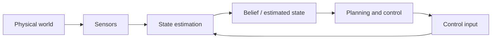

## English

*Group B. Stands on linear algebra, probability, optimization, signal processing and [[02-foundations/se3-geometry|SE(3)]].
A robot never observes its own state directly; groups C and F consume the estimate this page produces.*

Sensors do not reveal the world directly: they provide partial, delayed, and noisy measurements. **State estimation** combines a motion model, control inputs, sensor observations, and uncertainty to infer the variables a robot needs but cannot observe perfectly.

> [!info] Depth target
> Read state-estimation and SLAM papers without confusing state, observation, estimate, or map; interpret covariance, drift, loop closure, and sensor-fusion claims; and judge whether the reported evaluation supports robust deployment. Full filter and bundle-adjustment implementations are a working/mastery topic.

> [!note] Prerequisites
> [[02-foundations/linear-algebra|Linear Algebra]] · [[02-foundations/probability|Probability]] · [[02-foundations/optimization|Optimization]] · [[02-foundations/signal-processing|Signal Processing]] · [[02-foundations/se3-geometry|3D Geometry & SE(3)]]

> [!note] First pass · 처음이라면
> Read §2 — the four words nobody separates — then §4 for the predict/correct loop, then §6 to do the one-dimensional update by hand. §5, §7 and §8 are the reference half; open them against a specific paper.

### 1. Position in the robot loop

The controller rarely receives the true state $x_t$. It acts on an estimate $\hat{x}_t$ or a belief distribution. Poor estimation can therefore appear downstream as a planning or control failure.

### 2. Four quantities that must not be conflated

| Quantity | Meaning | Example |
|---|---|---|
| State $x_t$ | Variables sufficient for the model at time $t$ | pose, velocity, IMU bias |
| Observation $z_t$ | What a sensor measures | pixels, ranges, encoder ticks |
| Estimate $\hat{x}_t$ | A point summary inferred from data | estimated pose |
| Belief $p(x_t\mid z_{1:t},u_{1:t})$ | Distribution over plausible states | pose mean and covariance, particles |

State is a modeling choice, not a synonym for all physical reality. Covariance describes uncertainty **under the assumed model**; a small covariance can still be overconfident when calibration, association, or noise assumptions are wrong.

The distinction is needed because the controller acts on an estimate while the world evolves according to the actual state. For example, an excavator can receive a precise-looking pose after a localization outage; the small reported covariance may simply omit the unmodeled motion. **The reading this gives you.** Ask what the observation directly measured, what inference produced the estimate, and which alternatives the belief still represents. A point estimate and its timestamp should never be read as a complete account of uncertainty merely because they arrived in the same message.

### 3. Process and observation models

$$x_t=f(x_{t-1},u_t)+w_t, \qquad z_t=h(x_t)+v_t$$

- **Given:** previous belief, input $u_t$, and measurement $z_t$.
- **Estimated:** current state or belief.
- **Uncertainty:** $w_t$ captures process/model uncertainty; $v_t$ captures measurement noise.
- **Runtime:** the estimate is updated online as measurements arrive.

Model error and sensor noise are different. Wheel slip violates a motion model; noisy range readings perturb measurements. Treating both as the same Gaussian noise can make a filter inconsistent.

The process model predicts because measurements do not continuously reveal the whole state. The observation model connects a proposed state to what the sensor should see. For example, slipping wheels can make odometry predict motion that a range sensor does not support. That disagreement can reflect a wrong motion assumption rather than merely a noisy range. **The reading this gives you.** Trace a residual back through both models before enlarging a noise parameter. Ask whether the filter can represent the mismatch, whether measurements arrive in time, and whether a calibration error is being disguised as random uncertainty.

### 4. Bayes filtering: predict, then correct

$$p(x_t\mid z_{1:t-1},u_{1:t})=\int p(x_t\mid x_{t-1},u_t)p(x_{t-1}\mid z_{1:t-1},u_{1:t-1})\,dx_{t-1}$$

$$p(x_t\mid z_{1:t},u_{1:t})\propto p(z_t\mid x_t)p(x_t\mid z_{1:t-1},u_{1:t})$$

Prediction moves the previous belief through the dynamics and normally increases uncertainty. Correction weights that prior by how compatible each state is with the new measurement.

**Where the two lines come from, and what each assumption buys.** Neither is a new principle;
both are elementary probability plus one assumption used exactly once. For **prediction**,
introduce the previous state and marginalize it out — that is just the sum rule:
$p(x_t\mid z_{1:t-1}) = \int p(x_t\mid x_{t-1}, z_{1:t-1})\,p(x_{t-1}\mid z_{1:t-1})\,dx_{t-1}$.
Then the *Markov assumption on the dynamics* says the next state depends on the previous
state and input alone, so $z_{1:t-1}$ drops out of the first factor and the process model
$p(x_t\mid x_{t-1},u_t)$ appears. For **correction**, apply Bayes' rule to the new
measurement, $p(x_t\mid z_{1:t}) \propto p(z_t\mid x_t, z_{1:t-1})\,p(x_t\mid z_{1:t-1})$.
Then the *conditional-independence assumption on the sensor* says a measurement depends only
on the state it was taken from, so $z_{1:t-1}$ drops out again and the observation model
$p(z_t\mid x_t)$ appears.

That accounting is worth keeping because it tells you what breaks and where. Unmodelled wheel
slip violates the first assumption, not the second — the filter's *prediction* is wrong while
its measurement model is fine. A sensor with its own memory, such as a detector applying
temporal smoothing or a camera with rolling-shutter carryover, violates the second, not the
first: the filter double-counts evidence it has already used and grows overconfident. Both
show up as an inconsistent filter, and the fix is different in each case.

### 5. Method families

| Family | Representation and use | Main caution |
|---|---|---|
| Kalman filter | Linear-Gaussian mean and covariance | Model must fit the assumptions |
| EKF | Linearizes nonlinear models with Jacobians | Linearization and inconsistency |
| UKF | Propagates selected **sigma points** — a small set of chosen sample states whose mean and covariance match the belief, pushed through the true nonlinear model instead of a linearization | Still assumes a compact unimodal belief |
| Particle filter | Weighted samples; useful for multimodality | **Particle depletion** — resampling keeps copying the few high-weight particles until diversity is gone and the filter is confidently wrong — and computation |
| Factor/pose graph | Batch or incremental optimization over constraints | Association errors and **gauge freedom** — relative constraints fix the map's *shape* but not where it sits in the world, so the whole map can slide and rotate freely until one pose is anchored |

For a linear Kalman measurement update,

$$K=P^-H^\top(HP^-H^\top+R)^{-1}, \qquad \hat{x}^+=\hat{x}^-+K(z-H\hat{x}^-)$$

$K$ is not a hand-set trust weight: it follows from predicted covariance $P^-$, sensor covariance $R$, and observation geometry $H$.

### 6. Worked example: one-dimensional update

Suppose the predicted position is $10$ m with variance $4\,\mathrm{m}^2$, and a sensor reports $12$ m with variance $1\,\mathrm{m}^2$. With $H=1$,

$$K=\frac{4}{4+1}=0.8, \qquad \hat{x}^+=10+0.8(12-10)=11.6\ \mathrm{m}$$

The posterior variance is $(1-K)4=0.8\,\mathrm{m}^2$. The estimate lies closer to the more precise measurement. This conclusion is valid only if the variances and model are credible.

**Read the numbers in their causal order.** The predicted position comes from previous information and motion propagation. The sensor supplies new evidence. Their discrepancy, 12 − 10, is the innovation: how surprising this measurement is relative to the prediction. The gain determines how much of that discrepancy to use as a correction. It is not the probability that the sensor is right.

Here the measurement variance is smaller than the prediction variance, so the correction moves the estimate toward the measurement. The remaining posterior variance describes uncertainty after combining the independent information under this scalar linear-Gaussian model. Variance has squared-distance units; standard deviation would have distance units. Mixing those two quantities in the gain changes the weighting incorrectly.

**Try changing an assumption without recalculating.** If the measurement were much less precise, the gain should decrease and the estimate stay nearer the prediction. If the measurement reused information already inside the prediction, this formula would overcount evidence unless the correlation were modeled. Being able to predict those directions is a stronger first-pass check than memorizing 0.8 and 11.6.

### 7. Odometry, localization, mapping, and SLAM

| Problem | What is treated as known | What is inferred |
|---|---|---|
| Odometry | consecutive motion measurements | relative motion |
| Localization | a map | robot pose in the map |
| Mapping | robot poses | map structure |
| SLAM | neither is perfectly known | trajectory and map jointly |

A SLAM **front end** extracts features or geometric constraints and performs data association. The **back end** optimizes poses, landmarks, and sometimes calibration variables — as a nonlinear least squares problem over the graph, solved by Gauss–Newton or Levenberg–Marquardt, which is what "we optimize with Ceres/g2o/GTSAM" means ([[02-foundations/optimization|4. Optimization §3.5]]). Loop closure can correct accumulated drift, but a false closure can corrupt the entire map. Compressed to one line, [SLAM is odometry plus loop closing](https://gisbi-kim.github.io/post/slam-root/): odometry is locally accurate and globally drifting, and loop closing smooths the error it accumulated.

**The odometry family you will actually meet.** Almost every 2023–2026 field-robotics system
paper names its front end by acronym and assumes you know what the letters buy. They differ
in which sensors are fused and how tightly:

| Name | Sensors | Fails when |
|---|---|---|
| Wheel odometry | encoders | wheels slip — unbounded drift, no recovery |
| **VO / VIO** — visual(-inertial) odometry | camera (+ IMU) | texture-poor walls, motion blur, sudden lighting change |
| **LO / LIO** — lidar(-inertial) odometry | lidar (+ IMU) | geometrically degenerate places — a long corridor, an open field, a tunnel |
| GNSS-fused | any of the above + GNSS | obstruction and multipath near structures |

The **inertial** term is doing specific work in both: an IMU is accurate over milliseconds and
useless over minutes, while a camera or lidar is the reverse, so fusing them lets each cover
the other's failure timescale. Two mechanics recur in the papers and are worth recognising:
**IMU preintegration** — summarising many IMU samples between two keyframes into one
constraint, so the optimizer does not carry every sample — and **deskewing**, correcting a
lidar scan for the fact that the robot moved *during* the sweep. A paper that omits deskewing
on a fast platform is reporting a map built from distorted scans.

**Keyframes** are the other structural idea: rather than optimize every frame, the back end
keeps a sparse subset and marginalizes the rest, which is what keeps the problem bounded as
the session grows. *Marginalizing* has a specific meaning worth knowing, because it is where
the cost goes. Split the information matrix into the block $A$ you are dropping and the
block $C$ you are keeping, with coupling $B$; removing the dropped block leaves the **Schur
complement** $S = C - B^\top A^{-1} B$. The subtracted term is the evidence the discarded
poses carried, folded into the survivors — so nothing is thrown away, but $S$ is **denser
than $C$ was**. That fill-in is why sliding-window estimators cap their window, and why a
paper's window length is a compute claim rather than a modelling preference
([[02-foundations/linear-algebra|1. Linear algebra §2]]).

> [!warning] "Drift-free" and "loop closure" are claims about different things
> Loop closure removes accumulated drift *only along paths that return to a previously visited
> place*. A robot that drives out and never comes back gets no correction from it, and its
> error grows the whole way — which is exactly the construction-site case, where the machine
> follows the work face outward. When a paper reports drift as a percentage of trajectory
> length, check whether the trajectory contained loops, because that single fact can change
> the number by an order of magnitude.

**Distance-field maps.** Beyond the occupancy grid of
[[04-robotics/planning-decision-making|4. Planning §2]], mapping systems commonly store a
**TSDF** (truncated signed distance field): each voxel holds the signed distance to the
nearest surface, truncated near zero, so the surface itself is the zero crossing. That
representation fuses many noisy depth images into one smooth surface and is what most
real-time reconstruction pipelines are built on. Its planning cousin is the **ESDF**
(Euclidean signed distance field), which stores distance-to-nearest-obstacle everywhere —
giving a planner both a clearance value and its gradient for free, which is why
trajectory-optimization planners want one.

**What a map does not store.** Every representation on this page converges on one estimate of
the present. That is the right target for localisation and planning, and the wrong one for a
robot that returns to the same building for a year: folding each change into a single map
update discards *when* something was observed, under what conditions, what the robot did next
and how that turned out — the evidence a later failure has to be explained with. Keeping those
records alongside the map, rather than inside it, is the distinction between a map and a
spatial memory ([[04-robotics/semantic-language-navigation|19. Semantic Navigation §7]]).

### 8. Sensor fusion and systems details

- IMU: high-rate acceleration/angular velocity; bias causes drift.
- Camera: rich appearance and geometry; sensitive to blur, lighting, and texture.
- LiDAR: direct range geometry; affected by sparsity, weather, and motion distortion.
- Wheel odometry: inexpensive local motion; fails under slip. The kinematic model being integrated — and why its error grows without bound — is [[04-robotics/modern-robotics/ch13-wheeled-mobile-robots|MR ch.13]].
- GNSS: absolute non-drifting reference in favorable conditions, but obstruction and multipath can introduce noise and bias.

**Loosely coupled** systems fuse completed subsystem estimates. **Tightly coupled** systems jointly use lower-level measurements, often preserving information but increasing model and implementation complexity. Calibration, timestamps, rolling shutter, latency, and clock offset can dominate algorithmic improvements.

### 9. Reading claims and evaluations

| Paper phrase | Check before accepting it |
|---|---|
| real-time | hardware, input rate, latency distribution, and whether mapping is included |
| robust localization | environments, motion, lighting/weather, and catastrophic failures |
| drift-free | duration/distance and reliance on absolute references or loop closure |
| tightly coupled | which raw measurements and states are jointly optimized |
| consistent | whether reported uncertainty matches actual estimation error |

Common metrics include Absolute Trajectory Error, Relative Pose Error, drift per distance/time, relocalization success, map accuracy, latency, and failure rate. A low average trajectory error can hide rare catastrophic tracking losses. One question sits above the whole table: lowering trajectory error is never the point, not getting lost is. Ask which physical outcome each metric stands in for, and whether the paper measures that outcome anywhere ([Giseop Kim on intermediate versus final metrics](https://gisbi-kim.github.io/aprl-research-vision/)).

### After reading

You should be able to:

- distinguish state, observation, estimate, and belief;
- explain prediction and correction in a Bayes filter;
- interpret a Kalman gain without calling covariance unconditional confidence;
- distinguish odometry, localization, mapping, and SLAM;
- explain front end, back end, drift, and loop closure;
- identify calibration, synchronization, and evaluation assumptions in a paper.

> [!tip] Going deeper · 더 깊이
> Barfoot's [*State Estimation for Robotics*](http://asrl.utias.utoronto.ca/~tdb/bib/barfoot_ser17.pdf) is free and is the modern treatment, including estimation on SE(3) rather than in a vector space. Thrun, Burgard and Fox's *Probabilistic Robotics* remains the reference for the filtering and SLAM formulations themselves.
>
> For the optimisation back end specifically, Giseop Kim's [reading list](https://gisbi-kim.github.io/post/slam-textbooks/) makes the useful argument that only three things need to be understood — how rotation is parameterised, how iterative least squares works, and why the system matrix is sparse — and names a free document for each. In his suggested order: Solà's [*Quaternion kinematics for the error-state Kalman filter*](https://arxiv.org/abs/1711.02508) for rotation and its Jacobians; the ICRA 2016 SLAM tutorial slides *From Least-Squares to ICP*, extended by Grisetti et al.'s [*Least Squares Optimization: from Theory to Practice*](https://arxiv.org/abs/2002.11051), for the update itself; Solà's [*Course on SLAM*](http://www.iri.upc.edu/people/jsola/JoanSola/objectes/curs_SLAM/SLAM2D/SLAM%20course.pdf) as the connective tissue; Dellaert and Kaess's [*Factor Graphs for Robot Perception*](https://www.cs.cmu.edu/~kaess/pub/Dellaert17fnt.pdf) for the Square Root SAM to iSAM2 line, where QR decomposition, fill-in and variable ordering come from; the sparsity half of the same tutorial, *Graph-Based SLAM and Sparsity*; and Triggs et al.'s [*Bundle Adjustment — A Modern Synthesis*](https://hal.science/inria-00548290/document) for the photogrammetry roots this all grew from.

### Self-check

1. Why can a filter report small covariance and still be wrong?
2. Recompute the example if the sensor variance is $16\,\mathrm{m}^2$.
3. Why is global localization a natural particle-filter problem?
4. What experiment would support a claim of robustness to construction-site vibration?

> [!tip]- Answers
> 1. Covariance is conditional on the model; wrong calibration, association, or noise assumptions create overconfidence. 2. $K=4/(4+16)=0.2$, so $\hat{x}^+=10.4$ m. 3. The belief can contain several separated pose hypotheses. 4. Repeated trajectories with controlled vibration levels, synchronized ground truth, failure counts, and comparison against the same pipeline without the claimed robustness mechanism.

### Sources

- [Probabilistic Robotics — Thrun, Burgard & Fox (MIT Press)](https://mitpress.mit.edu/9780262201629/probabilistic-robotics/)
- [GTSAM concepts](https://gtsam.org/tutorials/intro.html)
- [KITTI odometry evaluation](https://www.cvlibs.net/datasets/kitti/eval_odometry.php)

## 한국어

*B군이다. 선형대수·확률·최적화·신호처리와 [[02-foundations/se3-geometry|SE(3)]] 위에 선다.
로봇은 자기 상태를 직접 보는 일이 없고, C군과 F군이 이 페이지가 만든 추정값을 소비한다.*

센서는 세계를 직접 알려주지 않는다: 부분적이고, 지연되고, 잡음 섞인 측정을 줄 뿐이다.
**상태 추정**은 운동 모델, 제어 입력, 센서 관측, 불확실성을 결합해 로봇에 필요하지만
완벽히 관측할 수 없는 변수를 추론한다.

> [!info] 깊이 목표
> 상태·관측·추정값·지도를 혼동하지 않고 상태 추정·SLAM 논문을 읽는다; covariance,
> drift, loop closure, 센서 융합 주장을 해석한다; 보고된 평가가 강건한 배포를 지지하는지
> 판단한다. 필터·번들 조정의 완전한 구현은 실무/숙달 단계의 주제다.

> [!note] 선수 지식
> [[02-foundations/linear-algebra|선형대수]] · [[02-foundations/probability|확률]] · [[02-foundations/optimization|최적화]] · [[02-foundations/signal-processing|신호처리]] · [[02-foundations/se3-geometry|3D 기하와 SE(3)]]

> [!note] 처음이라면 · First pass
> 먼저 §2 — 아무도 구분하지 않는 네 단어 — 그다음 §4의 예측·보정 루프, 그다음 §6에서 1차원 갱신을 손으로. §5·§7·§8은 참고서 쪽 절반이니 특정 논문을 놓고 펴라.

### 1. 로봇 루프 안에서의 위치

제어기는 진짜 상태 $x_t$를 받는 일이 거의 없다. 추정값 $\hat{x}_t$ 또는 belief 분포 위에서
행동한다. 그래서 추정이 나쁘면 하류에서 계획·제어 실패처럼 *보인다*.

### 2. 절대 혼동하면 안 되는 네 가지

| 양 | 의미 | 예 |
|---|---|---|
| 상태 $x_t$ | 시점 $t$에 모델에 충분한 변수들 | pose, 속도, IMU bias |
| 관측 $z_t$ | 센서가 측정하는 것 | 픽셀, 거리, 엔코더 틱 |
| 추정값 $\hat{x}_t$ | 데이터에서 추론한 점 요약 | 추정된 pose |
| Belief $p(x_t\mid z_{1:t},u_{1:t})$ | 가능한 상태들 위의 분포 | pose 평균·공분산, 파티클 |

상태는 **모델링 선택**이지 물리적 실재 전체의 동의어가 아니다. Covariance는 **가정한 모델
아래의** 불확실성이다 — 보정·association·잡음 가정이 틀리면 covariance가 작아도 과신일 수
있다.

제어기는 추정값으로 행동하지만 세계는 실제 상태에 따라 변하므로 구분이 필요하다. 위치 추정 중단 뒤 굴착기에 정밀해 보이는 자세가 들어와도 작은 공분산이 모델 밖 움직임을 빠뜨린 것일 수 있다. **여기서 얻는 독법.** 관측이 직접 측정한 것, 추정값을 만든 추론, 믿음이 아직 표현하는 대안을 묻는다. 점 추정과 시각이 같은 메시지에 도착했다고 불확실성 전체를 설명하는 것은 아니다.

### 3. 과정 모델과 관측 모델

$$x_t=f(x_{t-1},u_t)+w_t, \qquad z_t=h(x_t)+v_t$$

- **주어진 것:** 이전 belief, 입력 $u_t$, 측정 $z_t$.
- **추정하는 것:** 현재 상태 또는 belief.
- **불확실성:** $w_t$는 과정/모델 불확실성, $v_t$는 측정 잡음.
- **실행 시점:** 측정이 들어올 때마다 온라인으로 갱신.

모델 오차와 센서 잡음은 다르다. 바퀴 미끄럼은 운동 모델을 *위반*하고, 잡음 낀 거리
측정은 관측을 *교란*한다. 둘을 같은 가우시안 잡음으로 뭉뚱그리면 필터가 비일관해질 수
있다.

측정이 상태 전체를 연속적으로 알려 주지 못하므로 과정 모델이 예측한다. 관측 모델은 가정한 상태를 센서가 볼 값과 연결한다. 바퀴가 미끄러지면 오도메트리가 예측한 움직임을 거리 센서가 지지하지 않을 수 있다. 이는 거리 잡음보다 운동 가정의 오류일 수 있다. **여기서 얻는 독법.** 잡음 파라미터를 키우기 전에 잔차를 두 모델로 거슬러 간다. 필터가 불일치를 표현하는지, 측정이 제때 오는지, 보정 오차를 무작위 불확실성으로 숨기는지 묻는다.

### 4. 베이즈 필터: 예측하고, 보정한다

$$p(x_t\mid z_{1:t-1},u_{1:t})=\int p(x_t\mid x_{t-1},u_t)p(x_{t-1}\mid z_{1:t-1},u_{1:t-1})\,dx_{t-1}$$

$$p(x_t\mid z_{1:t},u_{1:t})\propto p(z_t\mid x_t)p(x_t\mid z_{1:t-1},u_{1:t})$$

**예측**은 이전 belief를 동역학에 통과시키며 보통 불확실성을 키운다. **보정**은 그 prior를
새 측정과 각 상태의 부합 정도로 가중한다.

**두 줄이 어디서 오고, 각 가정이 무엇을 사 주는가.** 둘 다 새로운 원리가 아니라 기초 확률에
가정 하나씩을 정확히 한 번 쓴 것이다. **예측**은 직전 상태를 끌어들여 적분해 없애는 것,
곧 합의 법칙이다:
$p(x_t\mid z_{1:t-1}) = \int p(x_t\mid x_{t-1}, z_{1:t-1})\,p(x_{t-1}\mid z_{1:t-1})\,dx_{t-1}$.
그다음 *동역학에 대한 마르코프 가정*이 다음 상태는 직전 상태와 입력에만 의존한다고 말하므로
첫 인자에서 $z_{1:t-1}$이 떨어져 나가고 과정 모델 $p(x_t\mid x_{t-1},u_t)$가 나타난다.
**보정**은 새 측정에 베이즈 규칙을 적용하는 것이다:
$p(x_t\mid z_{1:t}) \propto p(z_t\mid x_t, z_{1:t-1})\,p(x_t\mid z_{1:t-1})$. 그다음
*센서에 대한 조건부 독립 가정*이 측정은 그것이 취해진 상태에만 의존한다고 말하므로 다시
$z_{1:t-1}$이 떨어지고 관측 모델 $p(z_t\mid x_t)$가 나타난다.

이 장부를 갖고 있을 값어치가 있는 이유는, 무엇이 어디서 깨지는지 알려 주기 때문이다. 모델에
없는 바퀴 미끄러짐은 첫 번째 가정을 어기지 두 번째를 어기지 않는다 — 필터의 *예측*이 틀린
것이지 측정 모델은 멀쩡하다. 자기 기억을 가진 센서, 예를 들어 시간 평활을 적용하는 검출기나
롤링 셔터의 잔상이 남는 카메라는 두 번째를 어기지 첫 번째를 어기지 않는다. 필터가 이미 쓴
증거를 두 번 세어 과신하게 된다. 둘 다 필터가 일관되지 않은 것으로 드러나지만, 고치는 방법은
서로 다르다.

### 5. 방법 계열

| 계열 | 표현과 용도 | 주된 주의점 |
|---|---|---|
| 칼만 필터 | 선형-가우시안 평균·공분산 | 모델이 가정에 맞아야 함 |
| EKF | 야코비안으로 비선형 모델을 선형화 | 선형화 오차와 비일관성 |
| UKF | **시그마 포인트** 전파 — 평균과 공분산이 belief와 일치하도록 고른 소수의 표본 상태를 선형화 대신 진짜 비선형 모델에 통과시킨다 | 여전히 조밀한 단봉 belief 가정 |
| 파티클 필터 | 가중 표본; 다봉성에 유용 | **파티클 고갈** — 재표집이 가중치 높은 소수 파티클만 계속 복제해 다양성이 사라지고 필터가 자신 있게 틀리게 된다 — 과 계산량 |
| Factor/pose graph | 제약들 위의 일괄·증분 최적화 | association 오류와 **게이지 자유도** — 상대 제약은 지도의 *모양*은 고정하지만 그것이 세계 어디에 놓이는지는 고정하지 않아, 한 pose를 앵커로 박기 전까지 지도 전체가 자유롭게 미끄러지고 회전한다 |

선형 칼만 측정 갱신은

$$K=P^-H^\top(HP^-H^\top+R)^{-1}, \qquad \hat{x}^+=\hat{x}^-+K(z-H\hat{x}^-)$$

$K$는 손으로 정하는 신뢰 가중치가 아니다: 예측 공분산 $P^-$, 센서 공분산 $R$, 관측 기하
$H$에서 *따라 나온다*.

> [!note] 필터와 스무더는 같은 갱신 · Filter and smoother are one update
> 표의 마지막 줄은 위의 줄들과 다른 주제처럼 보인다. 아니다. 그래프 back end는 $A\,\Delta x = b$를 반복해서 풀어 보정량을 구하고 그것을 현재 추정값에 더한다. 그 풀이의 Gauss–Newton 한 스텝은 iterated EKF의 보정과 대수적으로 같은 갱신이다 — 같은 가중 잔차 비용을 공분산 형태가 아니라 정보 형태로 정리했을 뿐이다. 두 계열을 가르는 것은 solver가 아니라 어떤 변수를 남기고 어떤 변수를 marginalize하는가다. 필터는 가장 최근 상태만 들고 가고, 스무더는 궤적을 남긴다. 그러므로 최적화 기반 시스템이 필터 기반보다 낫다는 결과가 나왔다면, 공은 대개 solver 선택이 아니라 더 나은 문제 구조, 즉 더 나은 $A$에 있다. 김기섭의 글 [SLAM은 Ax=b 를 푸는 것이다](https://gisbi-kim.github.io/post/slambackend-1/)와 [Gauss-Newton Opt == IEKF update?](https://gisbi-kim.github.io/post/gn-iekf-same/)를 요약·재구성한 것이다.

### 6. 계산 예제: 1차원 갱신

예측 위치가 $10$ m, 분산 $4\,\mathrm{m}^2$이고 센서가 $12$ m, 분산 $1\,\mathrm{m}^2$를
보고했다고 하자. $H=1$이면

$$K=\frac{4}{4+1}=0.8, \qquad \hat{x}^+=10+0.8(12-10)=11.6\ \mathrm{m}$$

사후 분산은 $(1-K)4=0.8\,\mathrm{m}^2$. 추정값이 더 정밀한 측정 쪽으로 끌려간다 — 단
이 결론은 분산과 모델이 믿을 만할 때에만 유효하다.

**숫자를 인과 순서로 읽는다.** 예측 위치는 이전 정보와 운동 전파에서 온다. 센서는 새 증거를 준다. 차이 12 − 10은 innovation, 즉 예측에 비해 측정이 얼마나 뜻밖인지다. 이득은 그 차이 중 얼마를 보정에 쓸지 정한다. 센서가 맞을 확률이 아니다.

여기서는 측정 분산이 예측 분산보다 작아 추정이 측정 쪽으로 이동한다. 사후 분산은 스칼라 선형 가우시안 모델에서 독립 정보를 결합한 뒤의 불확실성이다. 분산은 거리 제곱 단위이고 표준편차는 거리 단위다. 이득에 둘을 섞으면 가중치가 틀린다.

**계산 없이 가정 하나를 바꿔 본다.** 측정이 훨씬 부정확하면 이득이 줄고 추정은 예측에 가까이 남아야 한다. 측정이 이미 예측에 들어간 정보를 재사용한다면 상관을 모델링하지 않은 이 식은 증거를 중복 계산한다. 0.8과 11.6을 외우기보다 변화 방향을 예측하는 것이 더 좋은 첫 이해 확인이다.

### 7. Odometry, localization, mapping, SLAM

| 문제 | 알려진 것으로 취급 | 추론하는 것 |
|---|---|---|
| Odometry | 연속된 이동 측정 | 상대 이동 |
| Localization | 지도 | 지도 안의 로봇 pose |
| Mapping | 로봇 pose들 | 지도 구조 |
| SLAM | 어느 쪽도 완전히 모름 | 궤적과 지도를 동시에 |

SLAM **front end**는 특징·기하 제약을 추출하고 data association을 수행한다. **back
end**는 pose, landmark, 때로는 보정 변수까지 최적화한다 — 그래프 위의 비선형 최소자승 문제로,
Gauss–Newton이나 Levenberg–Marquardt로 푼다. "Ceres/g2o/GTSAM으로 최적화한다"가 뜻하는 것이
그것이다 ([[02-foundations/optimization|4. 최적화 §3.5]]). Loop closure는 누적 drift를
고칠 수 있지만, 잘못된 closure 하나가 지도 전체를 망칠 수 있다. 한 줄로 줄이면 [SLAM은 odometry + loop
closing](https://gisbi-kim.github.io/post/slam-root/)이다 — odometry는 국소적으로 정확하고 전역적으로
표류하며, loop closing은 그렇게 쌓인 오차를 펴 준다.

**실제로 마주칠 오도메트리 계열.** 2023~2026년 필드 로보틱스 시스템 논문은 거의 전부 자기
front end를 약어로 부르고, 그 글자들이 무엇을 사는지 안다고 전제한다. 차이는 어떤 센서를
얼마나 단단히 융합하느냐다:

| 이름 | 센서 | 실패하는 곳 |
|---|---|---|
| 휠 오도메트리 | 엔코더 | 바퀴가 미끄러질 때 — 무한히 자라는 drift, 회복 불가 |
| **VO / VIO** — 시각(-관성) 오도메트리 | 카메라 (+ IMU) | 질감 없는 벽, 모션 블러, 급격한 조명 변화 |
| **LO / LIO** — 라이다(-관성) 오도메트리 | 라이다 (+ IMU) | 기하적으로 퇴화한 장소 — 긴 복도, 트인 벌판, 터널 |
| GNSS 융합 | 위의 것 + GNSS | 구조물 근처의 차폐와 다중경로 |

두 경우 모두 **관성**이라는 항이 구체적인 일을 한다: IMU는 밀리초 단위에서 정확하고 분 단위에서
쓸모없으며, 카메라와 라이다는 그 반대다. 그래서 융합하면 서로의 실패 시간대를 덮어 준다. 논문에
반복해서 나오는 두 기구를 알아볼 수 있어야 한다: **IMU preintegration** — 두 keyframe 사이의
IMU 표본 여럿을 하나의 제약으로 요약해서 최적화기가 모든 표본을 지고 가지 않게 하는 것 — 과
**deskewing**, 라이다 스캔이 훑는 *동안* 로봇이 움직였다는 사실을 보정하는 것. 빠른 플랫폼에서
deskewing을 빠뜨린 논문은 왜곡된 스캔으로 만든 지도를 보고하고 있는 것이다.

**Keyframe**이 나머지 한 축이다: 모든 프레임을 최적화하는 대신 성긴 부분집합만 남기고 나머지를
주변화(marginalize)하며, 그것이 세션이 길어져도 문제 크기를 유한하게 유지하는 방법이다.
*주변화*에는 알아 둘 만한 구체적인 뜻이 있는데, 비용이 가는 곳이 거기이기 때문이다. 정보
행렬을 버릴 블록 $A$와 남길 블록 $C$, 그리고 결합항 $B$로 쪼개면, 버린 블록을 없앤 자리에
**Schur 보수** $S = C - B^\top A^{-1} B$가 남는다. 빼낸 항이 버려진 pose들이 지고 있던
증거이고 살아남은 것들 안으로 접혀 들어간다 — 그러니 버려지는 정보는 없지만 $S$는 **원래의
$C$보다 조밀하다**. 그 fill-in 때문에 슬라이딩 윈도우 추정기가 창 길이를 제한하고, 논문의 창
길이가 모델링 취향이 아니라 계산 비용에 대한 주장인 이유다
([[02-foundations/linear-algebra|1. 선형대수 §2]]).

> [!warning] "drift-free"와 "loop closure"는 서로 다른 것에 대한 주장이다
> Loop closure는 *이전에 방문한 장소로 돌아오는 경로에 한해서만* 누적 drift를 없앤다. 나갔다가
> 돌아오지 않는 로봇은 아무 보정도 받지 못하고 오차가 가는 내내 자란다 — 그리고 그것이 정확히
> 건설 현장의 경우다. 기계가 작업면을 따라 바깥으로 나아가기 때문이다. 논문이 drift를 궤적
> 길이의 백분율로 보고하면, 그 궤적에 루프가 있었는지를 확인하라. 그 사실 하나가 숫자를 한
> 자릿수 바꿔 놓을 수 있다.

**거리장 지도.** [[04-robotics/planning-decision-making|4. 계획·의사결정 §2]]의 점유 격자
너머로, 매핑 시스템은 흔히 **TSDF**(truncated signed distance field)를 쓴다: 각 복셀이 가장
가까운 표면까지의 부호 있는 거리를 담되 0 근처에서 잘라내므로, 표면 자체가 0을 지나는 자리가
된다. 이 표현은 잡음 많은 깊이 이미지 여럿을 하나의 매끄러운 표면으로 융합하고, 대부분의
실시간 재구성 파이프라인이 그 위에 서 있다. 계획 쪽 사촌이 **ESDF**(Euclidean signed distance
field)로, 모든 지점에서 가장 가까운 장애물까지의 거리를 저장한다 — 계획기에게 여유 간격 값과
그 그래디언트를 공짜로 주고, 궤적 최적화 계획기가 이것을 원하는 이유가 그것이다.

**지도가 저장하지 않는 것.** 이 페이지의 모든 표현은 현재에 대한 추정 하나로 수렴한다. localization과
계획에는 그것이 옳은 목표지만, 같은 건물로 1년간 돌아오는 로봇에게는 아니다. 변화를 매번 하나의 지도
갱신에 접어 넣으면 *언제* 관측했는지, 어떤 조건에서였는지, 로봇이 다음에 무엇을 했고 그 결과가
어땠는지가 사라진다 — 나중의 실패를 설명할 때 필요한 바로 그 증거다. 그 기록들을 지도 *안*이 아니라
지도 *옆*에 두는 것이 지도와 공간 기억을 가르는 구분이다
([[04-robotics/semantic-language-navigation|19. 의미 기반 내비게이션 §7]]).

### 8. 센서 융합과 시스템 세부

- IMU: 고주기 가속도/각속도; bias가 drift를 만든다.
- 카메라: 풍부한 외양·기하; 블러·조명·텍스처에 민감.
- LiDAR: 직접적 거리 기하; 희소성·날씨·운동 왜곡의 영향.
- 바퀴 odometry: 저렴한 국소 이동; 미끄럼에서 실패. 적분되는 기구학 모델과 그 오차가 왜 무한정 자라는지는 [[04-robotics/modern-robotics/ch13-wheeled-mobile-robots|MR 13장]]에 있다.
- GNSS: 유리한 조건에서 드리프트 없는 절대 기준 — 단 차폐·멀티패스가 잡음과 편향을
  넣을 수 있다.

**Loosely coupled**는 완성된 하위 추정들을 융합하고, **tightly coupled**는 저수준 측정을
공동으로 사용해 정보를 더 보존하지만 모델·구현 복잡도가 커진다. 보정, 타임스탬프,
롤링 셔터, 지연, 클럭 오프셋이 알고리즘 개선보다 성능을 지배할 수 있다.

### 9. 주장과 평가 읽기

| 논문 표현 | 받아들이기 전에 확인할 것 |
|---|---|
| real-time | 하드웨어, 입력 주기, 지연 분포, mapping 포함 여부 |
| robust localization | 환경, 운동, 조명/날씨, 파국적 실패 |
| drift-free | 지속 시간/거리, 절대 기준·loop closure 의존 여부 |
| tightly coupled | 어떤 원시 측정과 상태가 공동 최적화되는가 |
| consistent | 보고된 불확실성이 실제 추정 오차와 맞는가 |

흔한 지표: Absolute Trajectory Error, Relative Pose Error, 거리/시간당 drift,
relocalization 성공률, 지도 정확도, 지연, 실패율. 낮은 *평균* ATE가 드문 파국적 추적
손실을 가릴 수 있다. 표 전체 위에 놓이는 질문이 하나 있다. 궤적 오차를 낮추는 것 자체가
목적인 적은 없고, 로봇이 길을 잃지 않는 것이 목적이다. 각 지표가 어떤 물리적 결과를 대신하고 있는지, 그리고
논문이 그 결과를 어디선가 직접 재기는 하는지 물어라 ([중간 지표와 최종 목적에 관한
김기섭의 글](https://gisbi-kim.github.io/aprl-research-vision/)).

### 읽고 나면 말할 수 있어야 하는 것

- 상태·관측·추정값·belief를 구분할 수 있다
- 베이즈 필터의 예측과 보정을 설명할 수 있다
- 칼만 이득을 "무조건적 신뢰도"라 부르지 않고 해석할 수 있다
- odometry·localization·mapping·SLAM을 구분할 수 있다
- front end·back end·drift·loop closure를 설명할 수 있다
- 논문에서 보정·동기화·평가 가정을 짚어낼 수 있다

> [!tip] 더 깊이 · Going deeper
> Barfoot의 [*State Estimation for Robotics*](http://asrl.utias.utoronto.ca/~tdb/bib/barfoot_ser17.pdf)가 무료이고 현대적 서술이다 — 벡터 공간이 아니라 SE(3) 위에서의 추정을 포함한다. 필터와 SLAM 정식화 자체의 참고서는 여전히 Thrun·Burgard·Fox의 *Probabilistic Robotics*다.
>
> 최적화 back end만 놓고 보면, 김기섭의 [자료 추천 글](https://gisbi-kim.github.io/post/slam-textbooks/)이 유용한 주장을 한다. 이해해야 할 것은 세 가지뿐이라는 것이다 — 회전을 어떻게 매개변수화하는가, 반복 최소자승은 어떻게 도는가, 시스템 행렬은 왜 희소한가. 그리고 각각에 무료 자료를 하나씩 붙인다. 그가 권하는 순서로: 회전과 그 야코비안은 Solà의 [*Quaternion kinematics for the error-state Kalman filter*](https://arxiv.org/abs/1711.02508); 갱신 자체는 ICRA 2016 SLAM 튜토리얼 슬라이드 *From Least-Squares to ICP*와 이를 확장한 Grisetti 외의 [*Least Squares Optimization: from Theory to Practice*](https://arxiv.org/abs/2002.11051); 그 사이를 잇는 조직으로 Solà의 [*Course on SLAM*](http://www.iri.upc.edu/people/jsola/JoanSola/objectes/curs_SLAM/SLAM2D/SLAM%20course.pdf); QR 분해·fill-in·변수 순서가 나오는 Square Root SAM에서 iSAM2까지의 계보는 Dellaert·Kaess의 [*Factor Graphs for Robot Perception*](https://www.cs.cmu.edu/~kaess/pub/Dellaert17fnt.pdf); 같은 튜토리얼의 희소성 편 *Graph-Based SLAM and Sparsity*; 마지막으로 이 모든 것이 자라 나온 photogrammetry 뿌리로 Triggs 외의 [*Bundle Adjustment — A Modern Synthesis*](https://hal.science/inria-00548290/document).

### 스스로 점검

1. 필터가 작은 covariance를 보고하면서도 틀릴 수 있는 이유는?
2. 센서 분산이 $16\,\mathrm{m}^2$일 때 위 예제를 다시 계산하라.
3. 전역 localization이 파티클 필터에 자연스러운 문제인 이유는?
4. "건설 현장 진동에 강건하다"는 주장을 지지하려면 어떤 실험이 필요한가?

> [!tip]- 정답 · Answers
> 1. Covariance는 모델 조건부다; 보정·association·잡음 가정이 틀리면 과신이 생긴다.
> 2. $K=4/(4+16)=0.2$, $\hat{x}^+=10.4$ m.
> 3. Belief가 서로 떨어진 여러 pose 가설을 담을 수 있기 때문.
> 4. 진동 수준을 통제한 반복 궤적, 동기화된 ground truth, 실패 횟수, 그리고 주장한 강건화 장치를 뺀 동일 파이프라인과의 비교.

### 출처

- [Probabilistic Robotics — Thrun, Burgard & Fox (MIT Press)](https://mitpress.mit.edu/9780262201629/probabilistic-robotics/)
- [GTSAM concepts](https://gtsam.org/tutorials/intro.html)
- [KITTI odometry evaluation](https://www.cvlibs.net/datasets/kitti/eval_odometry.php)
