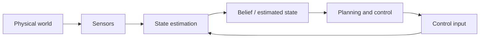

## English

*Group B. Stands on linear algebra, probability, optimization, signal processing and [[02-foundations/se3-geometry|SE(3)]].
A robot never observes its own state directly; groups C and F consume the estimate this page produces.*

Sensors do not reveal the world directly: they provide partial, delayed, and noisy measurements. **State estimation** combines a motion model, control inputs, sensor observations, and uncertainty to infer the variables a robot needs but cannot observe perfectly.

> [!info] Depth target
> Read state-estimation and SLAM papers without confusing state, observation, estimate, or map; interpret covariance, drift, loop closure, and sensor-fusion claims; and judge whether the reported evaluation supports robust deployment. Full filter and bundle-adjustment implementations are a working/mastery topic.

> [!note] Prerequisites
> [[02-foundations/linear-algebra|Linear Algebra]] · [[02-foundations/probability|Probability]] · [[02-foundations/optimization|Optimization]] · [[02-foundations/signal-processing|Signal Processing]] · [[02-foundations/se3-geometry|3D Geometry & SE(3)]]

### 1. Position in the robot loop

The controller rarely receives the true state $x_t$. It acts on an estimate $\hat{x}_t$ or a belief distribution. Poor estimation can therefore appear downstream as a planning or control failure.

### 2. Four quantities that must not be conflated

| Quantity | Meaning | Example |
|---|---|---|
| State $x_t$ | Variables sufficient for the model at time $t$ | pose, velocity, IMU bias |
| Observation $z_t$ | What a sensor measures | pixels, ranges, encoder ticks |
| Estimate $\hat{x}_t$ | A point summary inferred from data | estimated pose |
| Belief $p(x_t\mid z_{1:t},u_{1:t})$ | Distribution over plausible states | pose mean and covariance, particles |

State is a modeling choice, not a synonym for all physical reality. Covariance describes uncertainty **under the assumed model**; a small covariance can still be overconfident when calibration, association, or noise assumptions are wrong.

### 3. Process and observation models

$$x_t=f(x_{t-1},u_t)+w_t, \qquad z_t=h(x_t)+v_t$$

- **Given:** previous belief, input $u_t$, and measurement $z_t$.
- **Estimated:** current state or belief.
- **Uncertainty:** $w_t$ captures process/model uncertainty; $v_t$ captures measurement noise.
- **Runtime:** the estimate is updated online as measurements arrive.

Model error and sensor noise are different. Wheel slip violates a motion model; noisy range readings perturb measurements. Treating both as the same Gaussian noise can make a filter inconsistent.

### 4. Bayes filtering: predict, then correct

$$p(x_t\mid z_{1:t-1},u_{1:t})=\int p(x_t\mid x_{t-1},u_t)p(x_{t-1}\mid z_{1:t-1},u_{1:t-1})\,dx_{t-1}$$

$$p(x_t\mid z_{1:t},u_{1:t})\propto p(z_t\mid x_t)p(x_t\mid z_{1:t-1},u_{1:t})$$

Prediction moves the previous belief through the dynamics and normally increases uncertainty. Correction weights that prior by how compatible each state is with the new measurement.

### 5. Method families

| Family | Representation and use | Main caution |
|---|---|---|
| Kalman filter | Linear-Gaussian mean and covariance | Model must fit the assumptions |
| EKF | Linearizes nonlinear models with Jacobians | Linearization and inconsistency |
| UKF | Propagates selected **sigma points** — a small set of chosen sample states whose mean and covariance match the belief, pushed through the true nonlinear model instead of a linearization | Still assumes a compact unimodal belief |
| Particle filter | Weighted samples; useful for multimodality | **Particle depletion** — resampling keeps copying the few high-weight particles until diversity is gone and the filter is confidently wrong — and computation |
| Factor/pose graph | Batch or incremental optimization over constraints | Association errors and **gauge freedom** — relative constraints fix the map's *shape* but not where it sits in the world, so the whole map can slide and rotate freely until one pose is anchored |

For a linear Kalman measurement update,

$$K=P^-H^\top(HP^-H^\top+R)^{-1}, \qquad \hat{x}^+=\hat{x}^-+K(z-H\hat{x}^-)$$

$K$ is not a hand-set trust weight: it follows from predicted covariance $P^-$, sensor covariance $R$, and observation geometry $H$.

### 6. Worked example: one-dimensional update

Suppose the predicted position is $10$ m with variance $4\,\mathrm{m}^2$, and a sensor reports $12$ m with variance $1\,\mathrm{m}^2$. With $H=1$,

$$K=\frac{4}{4+1}=0.8, \qquad \hat{x}^+=10+0.8(12-10)=11.6\ \mathrm{m}$$

The posterior variance is $(1-K)4=0.8\,\mathrm{m}^2$. The estimate lies closer to the more precise measurement. This conclusion is valid only if the variances and model are credible.

### 7. Odometry, localization, mapping, and SLAM

| Problem | What is treated as known | What is inferred |
|---|---|---|
| Odometry | consecutive motion measurements | relative motion |
| Localization | a map | robot pose in the map |
| Mapping | robot poses | map structure |
| SLAM | neither is perfectly known | trajectory and map jointly |

A SLAM **front end** extracts features or geometric constraints and performs data association. The **back end** optimizes poses, landmarks, and sometimes calibration variables. Loop closure can correct accumulated drift, but a false closure can corrupt the entire map.

**The odometry family you will actually meet.** Almost every 2023–2026 field-robotics system
paper names its front end by acronym and assumes you know what the letters buy. They differ
in which sensors are fused and how tightly:

| Name | Sensors | Fails when |
|---|---|---|
| Wheel odometry | encoders | wheels slip — unbounded drift, no recovery |
| **VO / VIO** — visual(-inertial) odometry | camera (+ IMU) | texture-poor walls, motion blur, sudden lighting change |
| **LO / LIO** — lidar(-inertial) odometry | lidar (+ IMU) | geometrically degenerate places — a long corridor, an open field, a tunnel |
| GNSS-fused | any of the above + GNSS | obstruction and multipath near structures |

The **inertial** term is doing specific work in both: an IMU is accurate over milliseconds and
useless over minutes, while a camera or lidar is the reverse, so fusing them lets each cover
the other's failure timescale. Two mechanics recur in the papers and are worth recognising:
**IMU preintegration** — summarising many IMU samples between two keyframes into one
constraint, so the optimizer does not carry every sample — and **deskewing**, correcting a
lidar scan for the fact that the robot moved *during* the sweep. A paper that omits deskewing
on a fast platform is reporting a map built from distorted scans.

**Keyframes** are the other structural idea: rather than optimize every frame, the back end
keeps a sparse subset and marginalizes the rest, which is what keeps the problem bounded as
the session grows.

> [!warning] "Drift-free" and "loop closure" are claims about different things
> Loop closure removes accumulated drift *only along paths that return to a previously visited
> place*. A robot that drives out and never comes back gets no correction from it, and its
> error grows the whole way — which is exactly the construction-site case, where the machine
> follows the work face outward. When a paper reports drift as a percentage of trajectory
> length, check whether the trajectory contained loops, because that single fact can change
> the number by an order of magnitude.

**Distance-field maps.** Beyond the occupancy grid of
[[04-robotics/planning-decision-making|4. Planning §2]], mapping systems commonly store a
**TSDF** (truncated signed distance field): each voxel holds the signed distance to the
nearest surface, truncated near zero, so the surface itself is the zero crossing. That
representation fuses many noisy depth images into one smooth surface and is what most
real-time reconstruction pipelines are built on. Its planning cousin is the **ESDF**
(Euclidean signed distance field), which stores distance-to-nearest-obstacle everywhere —
giving a planner both a clearance value and its gradient for free, which is why
trajectory-optimization planners want one.

### 8. Sensor fusion and systems details

- IMU: high-rate acceleration/angular velocity; bias causes drift.
- Camera: rich appearance and geometry; sensitive to blur, lighting, and texture.
- LiDAR: direct range geometry; affected by sparsity, weather, and motion distortion.
- Wheel odometry: inexpensive local motion; fails under slip. The kinematic model being integrated — and why its error grows without bound — is [[04-robotics/modern-robotics/ch13-wheeled-mobile-robots|MR ch.13]].
- GNSS: absolute non-drifting reference in favorable conditions, but obstruction and multipath can introduce noise and bias.

**Loosely coupled** systems fuse completed subsystem estimates. **Tightly coupled** systems jointly use lower-level measurements, often preserving information but increasing model and implementation complexity. Calibration, timestamps, rolling shutter, latency, and clock offset can dominate algorithmic improvements.

### 9. Reading claims and evaluations

| Paper phrase | Check before accepting it |
|---|---|
| real-time | hardware, input rate, latency distribution, and whether mapping is included |
| robust localization | environments, motion, lighting/weather, and catastrophic failures |
| drift-free | duration/distance and reliance on absolute references or loop closure |
| tightly coupled | which raw measurements and states are jointly optimized |
| consistent | whether reported uncertainty matches actual estimation error |

Common metrics include Absolute Trajectory Error, Relative Pose Error, drift per distance/time, relocalization success, map accuracy, latency, and failure rate. A low average trajectory error can hide rare catastrophic tracking losses.

### After reading

You should be able to:

- distinguish state, observation, estimate, and belief;
- explain prediction and correction in a Bayes filter;
- interpret a Kalman gain without calling covariance unconditional confidence;
- distinguish odometry, localization, mapping, and SLAM;
- explain front end, back end, drift, and loop closure;
- identify calibration, synchronization, and evaluation assumptions in a paper.

### Self-check

1. Why can a filter report small covariance and still be wrong?
2. Recompute the example if the sensor variance is $16\,\mathrm{m}^2$.
3. Why is global localization a natural particle-filter problem?
4. What experiment would support a claim of robustness to construction-site vibration?

> [!tip]- Answers
> 1. Covariance is conditional on the model; wrong calibration, association, or noise assumptions create overconfidence. 2. $K=4/(4+16)=0.2$, so $\hat{x}^+=10.4$ m. 3. The belief can contain several separated pose hypotheses. 4. Repeated trajectories with controlled vibration levels, synchronized ground truth, failure counts, and comparison against the same pipeline without the claimed robustness mechanism.

### Sources

- [Probabilistic Robotics — Thrun, Burgard & Fox (MIT Press)](https://mitpress.mit.edu/9780262201629/probabilistic-robotics/)
- [GTSAM concepts](https://gtsam.org/tutorials/intro.html)
- [KITTI odometry evaluation](https://www.cvlibs.net/datasets/kitti/eval_odometry.php)

## 한국어

*B군이다. 선형대수·확률·최적화·신호처리와 [[02-foundations/se3-geometry|SE(3)]] 위에 선다.
로봇은 자기 상태를 직접 보는 일이 없고, C군과 F군이 이 페이지가 만든 추정값을 소비한다.*

센서는 세계를 직접 알려주지 않는다: 부분적이고, 지연되고, 잡음 섞인 측정을 줄 뿐이다.
**상태 추정**은 운동 모델, 제어 입력, 센서 관측, 불확실성을 결합해 로봇에 필요하지만
완벽히 관측할 수 없는 변수를 추론한다.

> [!info] 깊이 목표
> 상태·관측·추정값·지도를 혼동하지 않고 상태 추정·SLAM 논문을 읽는다; covariance,
> drift, loop closure, 센서 융합 주장을 해석한다; 보고된 평가가 강건한 배포를 지지하는지
> 판단한다. 필터·번들 조정의 완전한 구현은 실무/숙달 단계의 주제다.

> [!note] 선수 지식
> [[02-foundations/linear-algebra|선형대수]] · [[02-foundations/probability|확률]] · [[02-foundations/optimization|최적화]] · [[02-foundations/signal-processing|신호처리]] · [[02-foundations/se3-geometry|3D 기하와 SE(3)]]

### 1. 로봇 루프 안에서의 위치

제어기는 진짜 상태 $x_t$를 받는 일이 거의 없다. 추정값 $\hat{x}_t$ 또는 belief 분포 위에서
행동한다. 그래서 추정이 나쁘면 하류에서 계획·제어 실패처럼 *보인다*.

### 2. 절대 혼동하면 안 되는 네 가지

| 양 | 의미 | 예 |
|---|---|---|
| 상태 $x_t$ | 시점 $t$에 모델에 충분한 변수들 | pose, 속도, IMU bias |
| 관측 $z_t$ | 센서가 측정하는 것 | 픽셀, 거리, 엔코더 틱 |
| 추정값 $\hat{x}_t$ | 데이터에서 추론한 점 요약 | 추정된 pose |
| Belief $p(x_t\mid z_{1:t},u_{1:t})$ | 가능한 상태들 위의 분포 | pose 평균·공분산, 파티클 |

상태는 **모델링 선택**이지 물리적 실재 전체의 동의어가 아니다. Covariance는 **가정한 모델
아래의** 불확실성이다 — 보정·association·잡음 가정이 틀리면 covariance가 작아도 과신일 수
있다.

### 3. 과정 모델과 관측 모델

$$x_t=f(x_{t-1},u_t)+w_t, \qquad z_t=h(x_t)+v_t$$

- **주어진 것:** 이전 belief, 입력 $u_t$, 측정 $z_t$.
- **추정하는 것:** 현재 상태 또는 belief.
- **불확실성:** $w_t$는 과정/모델 불확실성, $v_t$는 측정 잡음.
- **실행 시점:** 측정이 들어올 때마다 온라인으로 갱신.

모델 오차와 센서 잡음은 다르다. 바퀴 미끄럼은 운동 모델을 *위반*하고, 잡음 낀 거리
측정은 관측을 *교란*한다. 둘을 같은 가우시안 잡음으로 뭉뚱그리면 필터가 비일관해질 수
있다.

### 4. 베이즈 필터: 예측하고, 보정한다

$$p(x_t\mid z_{1:t-1},u_{1:t})=\int p(x_t\mid x_{t-1},u_t)p(x_{t-1}\mid z_{1:t-1},u_{1:t-1})\,dx_{t-1}$$

$$p(x_t\mid z_{1:t},u_{1:t})\propto p(z_t\mid x_t)p(x_t\mid z_{1:t-1},u_{1:t})$$

**예측**은 이전 belief를 동역학에 통과시키며 보통 불확실성을 키운다. **보정**은 그 prior를
새 측정과 각 상태의 부합 정도로 가중한다.

### 5. 방법 계열

| 계열 | 표현과 용도 | 주된 주의점 |
|---|---|---|
| 칼만 필터 | 선형-가우시안 평균·공분산 | 모델이 가정에 맞아야 함 |
| EKF | 야코비안으로 비선형 모델을 선형화 | 선형화 오차와 비일관성 |
| UKF | **시그마 포인트** 전파 — 평균과 공분산이 belief와 일치하도록 고른 소수의 표본 상태를 선형화 대신 진짜 비선형 모델에 통과시킨다 | 여전히 조밀한 단봉 belief 가정 |
| 파티클 필터 | 가중 표본; 다봉성에 유용 | **파티클 고갈** — 재표집이 가중치 높은 소수 파티클만 계속 복제해 다양성이 사라지고 필터가 자신 있게 틀리게 된다 — 과 계산량 |
| Factor/pose graph | 제약들 위의 일괄·증분 최적화 | association 오류와 **게이지 자유도** — 상대 제약은 지도의 *모양*은 고정하지만 그것이 세계 어디에 놓이는지는 고정하지 않아, 한 pose를 앵커로 박기 전까지 지도 전체가 자유롭게 미끄러지고 회전한다 |

선형 칼만 측정 갱신은

$$K=P^-H^\top(HP^-H^\top+R)^{-1}, \qquad \hat{x}^+=\hat{x}^-+K(z-H\hat{x}^-)$$

$K$는 손으로 정하는 신뢰 가중치가 아니다: 예측 공분산 $P^-$, 센서 공분산 $R$, 관측 기하
$H$에서 *따라 나온다*.

### 6. 계산 예제: 1차원 갱신

예측 위치가 $10$ m, 분산 $4\,\mathrm{m}^2$이고 센서가 $12$ m, 분산 $1\,\mathrm{m}^2$를
보고했다고 하자. $H=1$이면

$$K=\frac{4}{4+1}=0.8, \qquad \hat{x}^+=10+0.8(12-10)=11.6\ \mathrm{m}$$

사후 분산은 $(1-K)4=0.8\,\mathrm{m}^2$. 추정값이 더 정밀한 측정 쪽으로 끌려간다 — 단
이 결론은 분산과 모델이 믿을 만할 때에만 유효하다.

### 7. Odometry, localization, mapping, SLAM

| 문제 | 알려진 것으로 취급 | 추론하는 것 |
|---|---|---|
| Odometry | 연속된 이동 측정 | 상대 이동 |
| Localization | 지도 | 지도 안의 로봇 pose |
| Mapping | 로봇 pose들 | 지도 구조 |
| SLAM | 어느 쪽도 완전히 모름 | 궤적과 지도를 동시에 |

SLAM **front end**는 특징·기하 제약을 추출하고 data association을 수행한다. **back
end**는 pose, landmark, 때로는 보정 변수까지 최적화한다. Loop closure는 누적 drift를
고칠 수 있지만, 잘못된 closure 하나가 지도 전체를 망칠 수 있다.

**실제로 마주칠 오도메트리 계열.** 2023~2026년 필드 로보틱스 시스템 논문은 거의 전부 자기
front end를 약어로 부르고, 그 글자들이 무엇을 사는지 안다고 전제한다. 차이는 어떤 센서를
얼마나 단단히 융합하느냐다:

| 이름 | 센서 | 실패하는 곳 |
|---|---|---|
| 휠 오도메트리 | 엔코더 | 바퀴가 미끄러질 때 — 무한히 자라는 drift, 회복 불가 |
| **VO / VIO** — 시각(-관성) 오도메트리 | 카메라 (+ IMU) | 질감 없는 벽, 모션 블러, 급격한 조명 변화 |
| **LO / LIO** — 라이다(-관성) 오도메트리 | 라이다 (+ IMU) | 기하적으로 퇴화한 장소 — 긴 복도, 트인 벌판, 터널 |
| GNSS 융합 | 위의 것 + GNSS | 구조물 근처의 차폐와 다중경로 |

두 경우 모두 **관성**이라는 항이 구체적인 일을 한다: IMU는 밀리초 단위에서 정확하고 분 단위에서
쓸모없으며, 카메라와 라이다는 그 반대다. 그래서 융합하면 서로의 실패 시간대를 덮어 준다. 논문에
반복해서 나오는 두 기구를 알아볼 수 있어야 한다: **IMU preintegration** — 두 keyframe 사이의
IMU 표본 여럿을 하나의 제약으로 요약해서 최적화기가 모든 표본을 지고 가지 않게 하는 것 — 과
**deskewing**, 라이다 스캔이 훑는 *동안* 로봇이 움직였다는 사실을 보정하는 것. 빠른 플랫폼에서
deskewing을 빠뜨린 논문은 왜곡된 스캔으로 만든 지도를 보고하고 있는 것이다.

**Keyframe**이 나머지 한 축이다: 모든 프레임을 최적화하는 대신 성긴 부분집합만 남기고 나머지를
주변화(marginalize)하며, 그것이 세션이 길어져도 문제 크기를 유한하게 유지하는 방법이다.

> [!warning] "drift-free"와 "loop closure"는 서로 다른 것에 대한 주장이다
> Loop closure는 *이전에 방문한 장소로 돌아오는 경로에 한해서만* 누적 drift를 없앤다. 나갔다가
> 돌아오지 않는 로봇은 아무 보정도 받지 못하고 오차가 가는 내내 자란다 — 그리고 그것이 정확히
> 건설 현장의 경우다. 기계가 작업면을 따라 바깥으로 나아가기 때문이다. 논문이 drift를 궤적
> 길이의 백분율로 보고하면, 그 궤적에 루프가 있었는지를 확인하라. 그 사실 하나가 숫자를 한
> 자릿수 바꿔 놓을 수 있다.

**거리장 지도.** [[04-robotics/planning-decision-making|4. 계획·의사결정 §2]]의 점유 격자
너머로, 매핑 시스템은 흔히 **TSDF**(truncated signed distance field)를 쓴다: 각 복셀이 가장
가까운 표면까지의 부호 있는 거리를 담되 0 근처에서 잘라내므로, 표면 자체가 0을 지나는 자리가
된다. 이 표현은 잡음 많은 깊이 이미지 여럿을 하나의 매끄러운 표면으로 융합하고, 대부분의
실시간 재구성 파이프라인이 그 위에 서 있다. 계획 쪽 사촌이 **ESDF**(Euclidean signed distance
field)로, 모든 지점에서 가장 가까운 장애물까지의 거리를 저장한다 — 계획기에게 여유 간격 값과
그 그래디언트를 공짜로 주고, 궤적 최적화 계획기가 이것을 원하는 이유가 그것이다.

### 8. 센서 융합과 시스템 세부

- IMU: 고주기 가속도/각속도; bias가 drift를 만든다.
- 카메라: 풍부한 외양·기하; 블러·조명·텍스처에 민감.
- LiDAR: 직접적 거리 기하; 희소성·날씨·운동 왜곡의 영향.
- 바퀴 odometry: 저렴한 국소 이동; 미끄럼에서 실패. 적분되는 기구학 모델과 그 오차가 왜 무한정 자라는지는 [[04-robotics/modern-robotics/ch13-wheeled-mobile-robots|MR 13장]]에 있다.
- GNSS: 유리한 조건에서 드리프트 없는 절대 기준 — 단 차폐·멀티패스가 잡음과 편향을
  넣을 수 있다.

**Loosely coupled**는 완성된 하위 추정들을 융합하고, **tightly coupled**는 저수준 측정을
공동으로 사용해 정보를 더 보존하지만 모델·구현 복잡도가 커진다. 보정, 타임스탬프,
롤링 셔터, 지연, 클럭 오프셋이 알고리즘 개선보다 성능을 지배할 수 있다.

### 9. 주장과 평가 읽기

| 논문 표현 | 받아들이기 전에 확인할 것 |
|---|---|
| real-time | 하드웨어, 입력 주기, 지연 분포, mapping 포함 여부 |
| robust localization | 환경, 운동, 조명/날씨, 파국적 실패 |
| drift-free | 지속 시간/거리, 절대 기준·loop closure 의존 여부 |
| tightly coupled | 어떤 원시 측정과 상태가 공동 최적화되는가 |
| consistent | 보고된 불확실성이 실제 추정 오차와 맞는가 |

흔한 지표: Absolute Trajectory Error, Relative Pose Error, 거리/시간당 drift,
relocalization 성공률, 지도 정확도, 지연, 실패율. 낮은 *평균* ATE가 드문 파국적 추적
손실을 가릴 수 있다.

### 읽고 나면 말할 수 있어야 하는 것

- 상태·관측·추정값·belief를 구분할 수 있다
- 베이즈 필터의 예측과 보정을 설명할 수 있다
- 칼만 이득을 "무조건적 신뢰도"라 부르지 않고 해석할 수 있다
- odometry·localization·mapping·SLAM을 구분할 수 있다
- front end·back end·drift·loop closure를 설명할 수 있다
- 논문에서 보정·동기화·평가 가정을 짚어낼 수 있다

### 스스로 점검

1. 필터가 작은 covariance를 보고하면서도 틀릴 수 있는 이유는?
2. 센서 분산이 $16\,\mathrm{m}^2$일 때 위 예제를 다시 계산하라.
3. 전역 localization이 파티클 필터에 자연스러운 문제인 이유는?
4. "건설 현장 진동에 강건하다"는 주장을 지지하려면 어떤 실험이 필요한가?

> [!tip]- 정답 · Answers
> 1. Covariance는 모델 조건부다; 보정·association·잡음 가정이 틀리면 과신이 생긴다.
> 2. $K=4/(4+16)=0.2$, $\hat{x}^+=10.4$ m.
> 3. Belief가 서로 떨어진 여러 pose 가설을 담을 수 있기 때문.
> 4. 진동 수준을 통제한 반복 궤적, 동기화된 ground truth, 실패 횟수, 그리고 주장한 강건화 장치를 뺀 동일 파이프라인과의 비교.

### 출처

- [Probabilistic Robotics — Thrun, Burgard & Fox (MIT Press)](https://mitpress.mit.edu/9780262201629/probabilistic-robotics/)
- [GTSAM concepts](https://gtsam.org/tutorials/intro.html)
- [KITTI odometry evaluation](https://www.cvlibs.net/datasets/kitti/eval_odometry.php)
