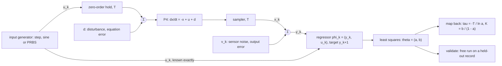
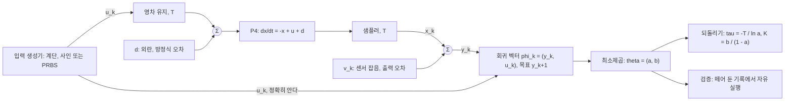

> [!note] Prerequisites · 선수 지식
> For §1–§8 and the worked case: plant **P4** from [[02-foundations/lab-plants|0.6 Lab Plants]]; the loop conventions of [[02-foundations/lab-kernel|0.7 Lab Kernel]]; least squares and the normal equations from [[02-foundations/linear-algebra|1. Linear Algebra §2]], and when $A^\top A$ is invertible from [[02-foundations/linear-algebra|1. Linear Algebra §4.5]]; the covariance matrix, bias and variance, and white noise from [[02-foundations/probability|3. Probability §2, §4 and §5]]; P4 and its exact sampled model from [[04-robotics/control-theory-ce397|5. Control Theory §1 and §4]]; nonlinear least squares, and why forming $J^\top J$ squares the condition number, from [[02-foundations/optimization|4. Optimization §3.5]], used in §3. For §9 only: plant **P2** from the same catalog and the manipulator equation on it from [[02-foundations/manipulator-kinematics-dynamics|10. §2–§4]].
> §1–§8과 끝까지 계산에는: [[02-foundations/lab-plants|0.6 Lab Plants]]의 장치 **P4**; [[02-foundations/lab-kernel|0.7 Lab Kernel]]의 루프 규약; [[02-foundations/linear-algebra|1. 선형대수 §2]]의 최소제곱과 정규방정식, [[02-foundations/linear-algebra|1. 선형대수 §4.5]]의 $A^\top A$가 가역일 조건; [[02-foundations/probability|3. 확률 §2, §4, §5]]의 공분산 행렬, 편향과 분산, 백색 잡음; [[04-robotics/control-theory-ce397|5. 제어 이론 §1, §4]]의 P4와 그 정확한 샘플 모델; §3이 쓰는 [[02-foundations/optimization|4. 최적화 §3.5]]의 비선형 최소제곱, 그리고 $J^\top J$를 만들면 조건수가 제곱되는 이유. §9에만: 같은 카탈로그의 장치 **P2**, 그리고 [[02-foundations/manipulator-kinematics-dynamics|10. §2–§4]]의 P2 매니퓰레이터 방정식.

## English

*Stands on [[02-foundations/linear-algebra|1. Linear Algebra]] (least squares), [[02-foundations/probability|3. Probability]] (bias and variance) and [[04-robotics/control-theory-ce397|5. Control Theory]] (**P4** and its sampled model). Every other page reads P4's numbers from the catalog; this one recovers them from a record, and then treats the mass matrix of **P2** as three unknowns.*

> [!note] First pass · 처음이라면
> Start from the picture below, then work the worked case with a calculator: it computes P4's sampled parameters exactly, estimates them from five sensor readings, and turns the estimate back into a time constant. Then §3 for least squares, §4 for why the input decides everything, and the lab in §8. Reread §5 before you trust an identified model in a paper, because it is the error no covariance reports. §9 is the same method on a robot arm.

### Running object · 이 페이지의 대상

**P4** from [[02-foundations/lab-plants|0.6 Lab Plants]], the leaky heater $\dot x=-x+u+d$: $x$ is the temperature error, $u$ the command, $d$ an unknown disturbance. Its continuous pole at $-1\,\mathrm{s^{-1}}$ (time constant $\tau=1\,\mathrm{s}$) and its DC gain of $1$ are the numbers this page pretends not to know and recovers from data. The page adds the following and freezes them.

| Symbol | Value | What it is |
|---|---:|---|
| $T$ | $0.1\,\mathrm{s}$ | sample period; the command is held constant over each period (a zero-order hold) |
| $a,\ b$ | $0.904837,\ 0.095163$ | P4's exact sampled parameters at this $T$, derived in the worked case |
| $w_k$ | white, standard deviation $\sigma$ | equation error: the disturbance after sampling, $w_k=b\,d_k$ when $d$ is constant over a period |
| $v_k$ | white, standard deviation $\sigma$ | output error: sensor noise on the sampled state, $y_k=x_k+v_k$ |
| $N$ | $200$ samples, $20\,\mathrm{s}$ | one record, started from rest |
| inputs | step, sine, PRBS, all $\lvert u_k\rvert\le1$ | step $u_k=1$; sine $u_k=\sin(kT)$, at the heater's corner frequency $1\,\mathrm{rad/s}$; PRBS: §4's 31-bit sequence, each bit held for 5 samples |
| worked record | $u=(1,1,1,-1,-1)$ | five commands from rest, read by a sensor that resolves $0.01$ |

**P2** from the same catalog enters in §9 only, lying in the horizontal plane so that gravity drops out: $L_1=L_2=1\,\mathrm{m}$ and $m_1=m_2=1\,\mathrm{kg}$ at the distal ends of the links.

*Scope: this page teaches how to fit a model that is linear in its parameters to a record by least squares, what the input must do for the fit to exist (persistent excitation), where noise makes the fit biased rather than merely scattered (errors-in-variables), how to validate on data the fit never saw, and how to turn sampled parameters back into continuous ones — on P4, then on P2's inertial parameters. It does not teach frequency-domain or subspace identification, recursive online estimation, prediction-error methods with explicit noise models, or learned dynamics models; the first four are in Ljung's text (Sources), and the learned-simulator side of the question is [[05-construction-robotics/sim-to-real|Sim-to-Real §2]].*

### The picture · 그림으로 먼저 보기



P4's identification record as a signal flow: the command passes a zero-order hold and the state is sampled, both every $T = 0.1\,\mathrm{s}$, so the sampled model $x_{k+1} = a\,x_k + b\,u_k$ is exact, with $(a, b) = (0.904837,\ 0.095163)$. Noise enters in two places, the disturbance $d$ before the plant and the sensor noise $v_k$ after the sampler, while the command reaches the regressor straight from the generator, so only the measured column $y_k$ can carry noise into $\Phi$, which is §5's bias. Least squares returns $\theta = (a, b)$, which maps back to $\tau = -T/\ln a = 1\,\mathrm{s}$ and $K = b/(1-a) = 1$, and a free run on a held-out record validates it.

### Worked case · 대상으로 한 번 끝까지

Three steps on the object: the exact sampled parameters, an estimate from five readings, and the map back to continuous time. The problem set repeats all three at $T=0.2\,\mathrm{s}$ with a different record.

**1. The exact sampled model.** Over one period the hold keeps $u$ at $u_k$; take $d$ constant over the period too. P4 is then a first-order linear ODE with a constant input, whose solution is the decayed initial state plus the accumulated input ([[02-foundations/engineering-math|0.5 §8]]):

$$x_{k+1}=e^{-T}x_k+\big(1-e^{-T}\big)(u_k+d_k)$$

because the free response decays by $e^{-T}$ over one period and a constant input accumulates $\int_0^T e^{-(T-s)}\,ds=1-e^{-T}$. With $d=0$ this is $x_{k+1}=a\,x_k+b\,u_k$ with

$$a=e^{-0.1}=0.904837,\qquad b=1-e^{-0.1}=0.095163.$$

Two checks. First, $a+b=1$ exactly, since the sampled DC gain $b/(1-a)$ has to equal P4's DC gain of $1$. Second, these are the $A_d$ and $B_d$ that [[04-robotics/control-theory-ce397|5. Control Theory §4]] computes for the same plant in matrix form. Explicit Euler ([[02-foundations/lab-kernel|0.7]]) would give $(0.9,\ 0.1)$ instead: close, but a record simulated that way makes least squares identify the integrator, not the heater, which is why the lab below simulates with the exact map.

**2. The estimate from five readings.** Start at rest and send $u=(1,1,1,-1,-1)$: the heater on for three periods, then reversed for two. The exact states are $x=(0,\ 0.095163,\ 0.181269,\ 0.259182,\ 0.139355,\ 0.030931)$, and a sensor that resolves $0.01$ reports

$$y=(0,\ 0.10,\ 0.18,\ 0.26,\ 0.14,\ 0.03)$$

— simulated from the exact model and rounded, not measured, so the sensor's resolution is the only error in the record. Each period supplies one equation $y_{k+1}=a\,y_k+b\,u_k$, which makes five equations in two unknowns.

| $k$ | $y_k$ | $u_k$ | $y_{k+1}$ |
|---:|---:|---:|---:|
| 0 | 0.00 | 1 | 0.10 |
| 1 | 0.10 | 1 | 0.18 |
| 2 | 0.18 | 1 | 0.26 |
| 3 | 0.26 | −1 | 0.14 |
| 4 | 0.14 | −1 | 0.03 |

Stack the first two columns as the regressor matrix $\Phi$ and the last as the target vector $y$. The normal equations of §3 need five sums:

$$\Phi^\top\Phi=\begin{pmatrix}\sum y_k^2&\sum y_ku_k\\ \sum y_ku_k&\sum u_k^2\end{pmatrix}=\begin{pmatrix}0.1296&-0.12\\ -0.12&5\end{pmatrix},\qquad \Phi^\top y=\begin{pmatrix}\sum y_ky_{k+1}\\ \sum u_ky_{k+1}\end{pmatrix}=\begin{pmatrix}0.1054\\ 0.37\end{pmatrix}$$

so $\det\Phi^\top\Phi=0.648-0.0144=0.6336$, and since a $2\times2$ inverse swaps the diagonal and negates the off-diagonal,

$$\hat\theta=\frac{1}{0.6336}\begin{pmatrix}5&0.12\\ 0.12&0.1296\end{pmatrix}\begin{pmatrix}0.1054\\ 0.37\end{pmatrix}=\begin{pmatrix}0.90183\\ 0.095644\end{pmatrix}.$$

**3. Compare, check, and map back.** The map back is §7's $\hat\tau=-T/\ln\hat a$ and $\hat K=\hat b/(1-\hat a)$.

| | $a$ | $b$ | $\tau$ | DC gain $K$ |
|---|---:|---:|---:|---:|
| exact | 0.904837 | 0.095163 | 1.000 s | 1.000 |
| five readings | 0.90183 | 0.095644 | 0.968 s | 0.974 |
| error | −0.33 % | +0.51 % | −3.2 % | −2.6 % |

The residuals $r=y-\Phi\hat\theta=(0.00436,\ -0.00583,\ 0.00203,\ 0.00117,\ -0.00061)$ satisfy $\sum r_ky_k=0$ and $\sum r_ku_k=0$ to rounding. That is the orthogonality to every column of $\Phi$ which [[02-foundations/linear-algebra|1. Linear Algebra §2]] says least squares must leave, and it is the ten-second check that catches most arithmetic slips. Their size gives §3's noise estimate $\hat\sigma^2=\sum r_k^2/(5-2)=1.96\times10^{-5}$, so $\hat\sigma=0.0044$, close to the $0.0039$ that rounding to $0.01$ should produce; §3's covariance formula, $\widehat{\mathrm{cov}}(\hat\theta)=\hat\sigma^2(\Phi^\top\Phi)^{-1}$, then gives $\mathrm{sd}(\hat a)=\sqrt{1.96\times10^{-5}\times5/0.6336}=0.0124$ and $\mathrm{sd}(\hat b)=0.0020$. The truth sits inside one standard deviation of both.

Two readings. The method is exact: fit the unrounded states and least squares returns $0.904837$ and $0.095163$ to machine precision, so every digit of error came from the sensor. And a third of a percent in $\hat a$ became three percent in $\hat\tau$, a factor of $\tau/T=10$ that §7 derives; pushed through the same map, the honest $\mathrm{sd}(\hat a)=0.0124$ puts $\tau$ anywhere from $0.853$ to $1.116\,\mathrm{s}$. Five readings buy a good-looking point estimate inside a wide interval.

### 1. What system identification is

Every plant on this wiki arrived with its numbers already attached: P4's pole, P2's masses, P3's damper that [[04-robotics/haptics-teleoperation/rendering-sampling-stability|24.4]] spends in its passivity bound. On a real machine each of those numbers is the output of a procedure, and the procedure has a name.

> **System identification, defined.** **System identification** is an *estimation procedure* that turns a record of inputs and outputs into the parameters of a model — not a model, not a simulator, and not a curve through the data. Four defining conditions, and a result that skips any of them is something else. A **model structure** is chosen before the data are seen: a set of candidate models indexed by a parameter vector $\theta$, here "$x_{k+1}=a\,x_k+b\,u_k$ for some $(a,b)$". An **experiment** produces a record $Z^N=\{(u_k,y_k)\}$ of commanded inputs and measured outputs, and the input is usually yours to design. A **criterion** scores every candidate against the record. And the winner is **validated** on data the criterion never saw.
>
> $$\hat\theta_N=\arg\min_{\theta}\ \sum_{k=0}^{N-1}\big(y_{k+1}-\varphi_k^\top\theta\big)^2$$
>
> where $\hat\theta_N$ is the estimate from $N$ equations, $\varphi_k$ is the regressor built from the record at step $k$, and $y_{k+1}$ is the next measured output — so the estimate is whichever candidate makes the model's one-step predictions closest to what was measured, in squared error. This is the least-squares criterion of §3; other criteria exist, and §5 is about when this one misleads.
>
> - **Example**: the worked case — structure $x_{k+1}=a\,x_k+b\,u_k$, experiment $u=(1,1,1,-1,-1)$ read at resolution $0.01$, criterion least squares, estimate $(0.90183,\ 0.095644)$, validation still owed.
> - **Non-example**: fitting a polynomial in time to one recorded step response. That fits a *signal*, not a *system*: no input appears in it, so it cannot predict the response to any other command, and predicting responses to other commands is the only thing a model is for.
> - **Non-example**: reading $M(\theta)$ off a CAD model. That is a model with parameters but no record and no criterion, and [[02-foundations/manipulator-kinematics-dynamics|10. §7]] lists where it goes wrong.
> - **Why it matters**: a controller, a simulator or a passivity bound inherits whatever error the identification left, including errors that no reported uncertainty contains (§5), so every model-based claim in a paper is only as good as an identification it may not describe.

### 2. The sampled model, and why it is exact

The worked case did P4. The same integral works for any first-order plant $\dot x=\alpha x+\beta u$ with a held input:

$$a=e^{\alpha T},\qquad b=\frac{e^{\alpha T}-1}{\alpha}\,\beta$$

since the free response over a period is $e^{\alpha T}$ and the held input accumulates $\beta\int_0^T e^{\alpha s}\,ds$. P4 is $\alpha=-1$, $\beta=1$. Three facts about this map carry the rest of the page.

- **It is exact at the sample instants**, not a discretization error to be kept small, whenever the input really is held between samples — true of a digital controller's output. So the structure $x_{k+1}=a\,x_k+b\,u_k$ is correct for P4, and any misfit in the lab is noise or bias, never truncation. The matrix version, with $e^{AT}$, is [[04-robotics/control-theory-ce397|5. Control Theory §4]].
- **It is linear in $(a,b)$ and nonlinear in $\alpha$.** So identify $(a,b)$ by least squares and convert afterwards (§7); fitting $\alpha$ directly would put the unknown inside an exponential.
- **The pole map does not depend on the hold; the input side does.** $a=e^{\alpha T}$ is the free response, which never sees what the input does between samples, while $b$ is built from the hold. An actuator that does not hold its command — one that ramps or smooths it between samples — changes the input side of the correct sampled model, its coefficient and possibly how many past inputs appear, but not the pole. Fit an input side that matches the actuator, because an error there leaks into $\hat a$ as well.

**The input side, priced on P4.** Suppose the heater's driver ramped each new command in over the period, linearly from $u_{k-1}$ to $u_k$, instead of holding it. The free response is untouched, so $a=0.904837$ still, but the input term splits in two, because part of each period is now driven by the previous command:

$$x_{k+1}=a\,x_k+b_0\,u_k+b_1\,u_{k-1},\qquad b_0=0.048374,\quad b_1=0.046788$$

and $b_0+b_1=0.095163=b$, so the DC gain is still $1$. Fit the two-parameter structure of §3 to this actuator's exact, noise-free records and the missing $u_{k-1}$ lands in the pole: $\hat\tau=1.10\,\mathrm{s}$ from the step, $1.35\,\mathrm{s}$ from §8's PRBS, and $\hat a=1.048$ from the worked case's five commands, a pole no stable heater has (§7's first check). Add $u_{k-1}$ as a third regressor and least squares returns all three coefficients exactly. An identified pole is therefore only as good as the model of what the actuator does between samples, and a paper that reports one should say which hold it assumed.

### 3. Least squares on the regression

Write the sampled model with its unexplained part made explicit:

$$y_{k+1}=\varphi_k^\top\theta+e_k,\qquad \varphi_k=\begin{pmatrix}y_k\\ u_k\end{pmatrix},\qquad \theta=\begin{pmatrix}a\\ b\end{pmatrix}$$

where $e_k$ is the equation error, everything the model does not explain at step $k$ — so the equation holds exactly by construction, and every modelling assumption lives in what is assumed about $e_k$. Stacking $k=0,\dots,N-1$ gives $y=\Phi\theta+e$, with $\Phi\in\mathbb{R}^{N\times2}$ whose row $k$ is $\varphi_k^\top$ and $y\in\mathbb{R}^N$ whose entry $k$ is $y_{k+1}$. What makes this a regression is a property of how the unknowns enter, and it is worth stating exactly because §5 and §9 both turn on it.

> **Linear in the parameters, defined.** A model is **linear in the parameters** when its prediction is an inner product of a *known* regressor with the *unknown* parameter vector — a property of how $\theta$ enters, not of whether the dynamics are linear. Three defining conditions. The prediction has the form $\varphi_k^\top\theta$. Every entry of $\varphi_k$ is computable from the record alone — measured outputs, commanded inputs, known functions of them — without knowing $\theta$. And $\theta$ appears nowhere else.
>
> $$\hat y_{k+1}(\theta)=\varphi_k^\top\theta$$
>
> where $\hat y_{k+1}(\theta)$ is the model's prediction of the next output for a candidate $\theta$ — so the squared error summed over the record is a quadratic function of $\theta$, which has one minimizer in closed form.
>
> - **Example**: P4's regression, $\varphi_k=(y_k,u_k)$. And P2 in §9, $\tau=Y(q,\dot q,\ddot q)\,\pi$, where $Y$ is a nonlinear function of the joint trajectory but the inertial parameters $\pi$ enter linearly: nonlinear dynamics, linear parameters.
> - **Non-example**: the same heater written in its physical parameter, $x_{k+1}=e^{-T/\tau}x_k+(1-e^{-T/\tau})u_k$. Here $\tau$ sits inside an exponential, so no regressor exists; fit $(a,b)$ and convert (§7).
> - **Non-example**: the free-run model $\hat x_{k+1}=a\,\hat x_k+b\,u_k$ scored against measurements. Its would-be regressor $\hat x_k$ depends on $(a,b)$, so the second condition fails and minimizing its error is a nonlinear least-squares problem ([[02-foundations/optimization|4. Optimization §3.5]]). That is exactly the price of §5's output-error remedy.
> - **Why it matters**: the second condition is what turns identification into a linear-algebra problem with a unique answer; lose it and you are back to iterative solvers, starting guesses and local minima.

**The estimate.** Least squares picks the $\theta$ minimizing $V(\theta)=\lVert y-\Phi\theta\rVert^2=\sum_k(y_{k+1}-\varphi_k^\top\theta)^2$. Its gradient is $\nabla V=-2\Phi^\top(y-\Phi\theta)$, and setting it to zero gives the normal equations $\Phi^\top\Phi\,\hat\theta=\Phi^\top y$ of [[02-foundations/linear-algebra|1. Linear Algebra §2]]. When $\Phi^\top\Phi$ is invertible,

$$\hat\theta=\big(\Phi^\top\Phi\big)^{-1}\Phi^\top y=\Phi^\dagger y$$

because the normal equations then have exactly one solution. Every symbol: $\Phi$ is the $N\times2$ regressor matrix; $y$ the $N$-vector of next outputs; $\Phi^\top\Phi$ the $2\times2$ matrix of sums of squares and cross-products of the regressor's columns — the worked case's $\sum y_k^2$, $\sum y_ku_k$, $\sum u_k^2$; $\Phi^\top y$ the 2-vector of how each column co-varies with the targets; and $\Phi^\dagger$ the left pseudo-inverse of [[02-foundations/linear-algebra|1. Linear Algebra §4.5]]. It is a minimum and not a saddle since the Hessian $2\Phi^\top\Phi$ is positive definite whenever it is invertible. Geometrically, $\Phi\hat\theta$ is the orthogonal projection of $y$ onto the columns of $\Phi$, which is the residual check the worked case ran. In code, solve with an orthogonal factorization (`np.linalg.lstsq`) rather than by forming the inverse, because forming $\Phi^\top\Phi$ squares the condition number of $\Phi$ ([[02-foundations/optimization|4. Optimization §3.5]]).

**How good is it?** Suppose the record really is $y=\Phi\theta+e$ with $e$ zero-mean white noise of variance $\sigma^2$ ([[02-foundations/probability|3. Probability §5]]), and that the regressor at step $k$ is uncorrelated with the error at step $k$, $\mathrm{E}[\varphi_ke_k]=0$. Then substituting the model into the estimate gives $\hat\theta-\theta=(\Phi^\top\Phi)^{-1}\Phi^\top e$, and two cases follow.

- If $\Phi$ does not depend on the noise at all — P2 in §9 with exactly known joint trajectories — the estimate is **unbiased**, $\mathrm{E}[\hat\theta]=\theta$, with covariance exactly $\sigma^2(\Phi^\top\Phi)^{-1}$ (bias and variance as in [[02-foundations/probability|3. Probability §4]]).
- P4's $\Phi$ contains $y_k$, which depends on the *earlier* errors $e_0,\dots,e_{k-1}$. So the estimate is not exactly unbiased at finite $N$, but it is **consistent** — the bias goes to zero as $N$ grows, because $y_k$ never contains the current $e_k$ — and its covariance approaches the same formula.

The formula, with the unknown $\sigma^2$ replaced by its estimate from the residuals (divided by $N-2$ for the two fitted parameters, as the sample variance of 3. Probability §4 divides by $N-1$):

$$\widehat{\mathrm{Cov}}(\hat\theta)=\hat\sigma^2\big(\Phi^\top\Phi\big)^{-1},\qquad \hat\sigma^2=\frac{\lVert y-\Phi\hat\theta\rVert^2}{N-2}$$

so the covariance matrix ([[02-foundations/probability|3. Probability §2]]) is the noise variance divided by how much, and how independently, the regressor's columns moved. $\Phi^\top\Phi$ grows with the record length and with the input's amplitude; its inverse is small only when the columns are large *and* point in different directions. The second half of that sentence is §4. The lab checks the formula against 300 independent records: under equation error it predicts $\mathrm{sd}(\hat a)=0.0044$ for the step against $0.0045$ observed, and $0.0016$ for the PRBS against $0.0015$.

### 4. Persistent excitation — when $\Phi^\top\Phi$ can be inverted

$\Phi^\top\Phi$ is invertible exactly when the columns of $\Phi$ are linearly independent ([[02-foundations/linear-algebra|1. Linear Algebra §4.5]]). On P4 the two columns are the measured output and the command, and what keeps them apart is the input. Send a step and watch them merge: after about three time constants the heater has settled, $x_k=u_k=1$, and both columns are a column of ones. Every steady-state row then says the same thing, $1=a\cdot1+b\cdot1$, which pins $a+b$ — the DC gain — and nothing else. Only the transient's first thirty samples separate $a$ from $b$, and adding more steady state adds nothing. The name for the property the step lacks carries the word that matters: *persistent*.

> **Persistent excitation, defined.** **Persistent excitation** is a property of an *input signal*, stated relative to an *order* $n$ — not a property of the plant, of the estimator, or of the input's size. Three defining conditions. The signal's averages of lagged products converge as the record grows, so its autocorrelations exist. The $n\times n$ matrix of those averages is positive definite. And the claim is always "of order $n$", with the order needed set by the model: for P4's two-parameter model in open loop it is $2$.
>
> $$R_u(n)=\lim_{N\to\infty}\frac1N\sum_{k=1}^{N}\bar u_k\bar u_k^\top\succ0,\qquad \bar u_k=\big(u_{k-1},\ \dots,\ u_{k-n}\big)^\top$$
>
> where $\bar u_k$ stacks the last $n$ inputs and $\succ0$ means positive definite — no nonzero combination $h_1u_{k-1}+\dots+h_nu_{k-n}$ averages to zero power — so an input is persistently exciting of order $n$ exactly when it never satisfies a linear recursion of length $n$.
>
> - **Example**: a sine with $0<\omega T<\pi$ is persistently exciting of order exactly 2. Its $R_u(2)$ has eigenvalues $(1\pm\cos\omega T)/2$, both positive, but it satisfies $u_k=2\cos(\omega T)\,u_{k-1}-u_{k-2}$, so order 3 fails. At this page's $\omega T=0.1$ the smaller eigenvalue is $0.0025$: order 2, just.
> - **Example**: the PRBS defined below is persistently exciting of order 31.
> - **Non-example**: a step. $R_u(2)=\begin{pmatrix}1&1\\1&1\end{pmatrix}$, eigenvalues $0$ and $2$, because $u_k-u_{k-1}=0$: order 1. Doubling its amplitude changes nothing; excitation is about shape, not size.
> - **Non-example**: switching every sample, $u_k=(-1)^k$, the fastest input there is, is also only order 1, since $u_k+u_{k-1}=0$. The heater answers it with $x_k=-0.04996\,u_k$ in steady state — a scaled copy of the input, so the columns are collinear again.
> - **Non-example**: any record logged under feedback $u_k=-Kx_k$ with no external signal. The command column is $-K$ times the output column, so $\Phi$ has rank 1 whatever the plant does, and least squares can recover only the closed-loop pole $a-bK$. The problem set's Do item walks into this on purpose.
> - **Why it matters**: for P4's model in open loop and without noise in the regressor, order 2 is exactly the condition under which $\Phi^\top\Phi/N$ stays invertible as the record grows, derived next. An input of order 1 gives information that stops growing, so more data stops helping — the lab's step row shows the spread of $\hat a$ barely moving while the record grows sixteenfold.

**Why order 2 is the condition for P4.** Suppose some $(c_1,c_2)\ne0$ made $c_1x_k+c_2u_k$ vanish for every $k$. Apply it at $k$ and $k-1$ and substitute $x_k=a\,x_{k-1}+b\,u_{k-1}$: the states cancel and

$$c_2\,u_k+(c_1b-c_2a)\,u_{k-1}=0$$

remains, a recursion of length 2 whose coefficients are not both zero because $b\neq0$. An input persistently exciting of order 2 satisfies no such recursion, so the columns cannot collapse. Run it backwards on the step, whose recursion is $u_k-u_{k-1}=0$: $c_2=1$ and $c_1=(a-1)/b=-1$, the steady state $x=u$. On the alternating input, $c_1=(1+a)/b=20.02$, the copy above. On feedback, $c=(K,1)$ by construction.

The workhorse input is built to pass this test by a wide margin.

> **PRBS, defined.** A **pseudo-random binary sequence**, here a maximum-length sequence, is a *deterministic, periodic, two-level* signal generated by a shift register — not a random signal, despite the name. Three defining conditions. It comes from an $m$-bit linear feedback shift register whose feedback polynomial is primitive, which gives the longest possible period, $M=2^m-1$. It takes two levels, here $\pm1$. And its autocorrelation over a period is two-valued.
>
> $$\frac1M\sum_{k=0}^{M-1}u_k\,u_{k+\ell}=\begin{cases}1,&\ell\equiv0\pmod M\\ -1/M,&\text{otherwise}\end{cases}$$
>
> where $u_k$ is the $\pm1$ sequence, $M$ its period and $\ell$ the lag — so within a period it is as nearly uncorrelated with its own shifts as a periodic sequence can be, which is what makes it persistently exciting of order $M$: the $n\times n$ matrix of these values has smallest eigenvalue $1-(n-1)/M$, still $1/M$ at $n=M$.
>
> - **Example**: the lab's generator, $m=5$ with feedback $x^5+x^3+1$, so $M=31$. From the all-ones register it emits `+++++---++-+++-+-+----+--+-++--`, sixteen $+1$ and fifteen $-1$, with autocorrelation exactly $1$ and $-1/31=-0.032258$.
> - **Non-example**: a coin-flip $\pm1$ signal. Also binary and nearly white, but its correlations are only approximately zero and different on every run; the PRBS's are exact and repeatable, which is why its order can be quoted.
> - **Non-example**, the one that bites: the same PRBS clocked every sample. It is still order 31, but its period is $3.1\,\mathrm{s}$, so its lowest frequency is $2\pi/3.1=2.03\,\mathrm{rad/s}$, above the heater's $1\,\mathrm{rad/s}$ corner. The heater barely follows: the state's mean square over a record is $0.026$, against $0.22$ with each bit held for 5 samples. Excitation says the columns are independent; it says nothing about whether they are large.
> - **Why it matters**: it is the standard answer to "which input?" because it is persistently exciting of high order, it respects a hard actuator limit while delivering the most power that limit allows ($u_k^2=1$ always), and its spectrum can be placed on the plant's bandwidth by choosing the bit length — the lab holds each bit for $0.5\,\mathrm{s}$, half the time constant, which puts the lowest frequency at $0.41\,\mathrm{rad/s}$.

### 5. Where the noise enters: equation error, output error, and the bias

§3's guarantee rested on one condition, $\mathrm{E}[\varphi_ke_k]=0$. Whether it holds depends on where the noise enters the record, and the picture at the top of the page shows two places.

> **Equation error and output error, defined.** Two *noise structures* — statements about where the unexplained part of the record enters the model, not about its size. Three conditions separate them. Where it enters: equation error $w_k$ enters the state update and propagates through the dynamics; output error $v_k$ is added to the measurement and does not. What the regression's error becomes: under equation error it is $w_k$ itself, white and uncorrelated with the regressor at the same step; under output error it is $v_{k+1}-a\,v_k$, which shares $v_k$ with the regressor $y_k$. What least squares does: consistent under the first, biased under the second.
>
> $$\text{equation error: } y_{k+1}=a\,y_k+b\,u_k+w_k;\qquad \text{output error: } x_{k+1}=a\,x_k+b\,u_k,\ \ y_k=x_k+v_k$$
>
> where $w_k$ and $v_k$ are zero-mean white noises of standard deviation $\sigma$ — the same size in the lab, and with opposite consequences, because in the second case the measured $y_k$ that enters $\Phi$ is not the state that drove the heater.
>
> - **Example**: P4's disturbance, held over each period, is equation error, $w_k=b\,d_k$; the noise of the thermometer is output error.
> - **Non-example**: noise on the command *as sent*. There is none — $u_k$ is known exactly because you sent it. Noise on the input the actuator actually *delivers* enters the state, and is equation error again. Only a *measured* input, say a current sensor used in place of the commanded current, puts noise into the $u_k$ column.
> - **Why it matters**: the two cannot be told apart by looking at the residuals of one fit, and they decide whether least squares is right.

Under output error, substitute $x_k=y_k-v_k$ into the state update:

$$y_{k+1}=a\,y_k+b\,u_k+\varepsilon_k,\qquad \varepsilon_k=v_{k+1}-a\,v_k$$

so the regression looks the same, but its error shares $v_k$ with the regressor: $\mathrm{E}[y_k\varepsilon_k]=\mathrm{E}[(x_k+v_k)(v_{k+1}-a\,v_k)]=-a\sigma^2$. Least squares no longer converges to $\theta$. It converges to the $\theta^\ast$ that solves the limiting normal equations $R\,\theta^\ast=\mathrm{E}[\varphi_ky_{k+1}]$, with $R=\mathrm{E}[\varphi_k\varphi_k^\top]$, and subtracting $R\,\theta$ from both sides gives the offset.

> **Errors-in-variables bias, defined.** The **errors-in-variables bias** is a *systematic offset* of the least-squares estimate — a shift of its mean, not extra scatter around it — that appears when a regressor is measured with noise. Three defining conditions. A column of $\Phi$ carries measurement noise, here $y_k$. That noise is correlated with the regression's error at the same step, here through the shared $v_k$. And the offset does not shrink with $N$: it is a limit, set by the noise variance against the regressor's excitation.
>
> $$\theta^\ast-\theta=R^{-1}\,\mathrm{E}[\varphi_k\varepsilon_k]=-a\sigma^2R^{-1}\begin{pmatrix}1\\0\end{pmatrix},\qquad R=\begin{pmatrix}S+\sigma^2&\mathrm{E}[x_ku_k]\\ \mathrm{E}[x_ku_k]&\mathrm{E}[u_k^2]\end{pmatrix}$$
>
> where $\theta^\ast$ is the value least squares converges to, $S=\mathrm{E}[x_k^2]$ is the noise-free output's mean square, and $\mathrm{E}[\varphi_k\varepsilon_k]$ is the regressor–error correlation, zero under equation error — so the bias is that correlation amplified by the inverse of the excitation. For an input uncorrelated with the current state, $\mathrm{E}[x_ku_k]=0$, it collapses to $\hat a\to a\,S/(S+\sigma^2)$: $a$ shrunk toward zero by the output's signal-to-noise ratio, $\hat b$ unbiased.
>
> - **Example**: the lab's PRBS record at $\sigma=0.1$. Its noise-free moments are $S=0.2205$, $\mathrm{E}[x_ku_k]=0.1795$, $\mathrm{E}[u_k^2]=1$, and the formula predicts $\hat a\to0.8592$, $\hat b\to0.1034$. The average over 300 records is $0.8583$ and $0.1034$. The bias is the formula, not bad luck.
> - **Example**: the step at the same noise. Its noise-free $\det R$ is $0.0248$ against the PRBS's $0.1882$, so the same $\sigma^2$ predicts $\hat a\to0.6450$, $\hat b\to0.3414$ (lab: $0.6418$, $0.3444$). The estimate slides along $a+b\approx1$: it keeps the DC gain and loses the time constant, $\hat\tau=0.23\,\mathrm{s}$ for a heater whose $\tau$ is $1\,\mathrm{s}$.
> - **Non-example**: noise only in the target $y_{k+1}$, with the regressors exact. Then $\mathrm{E}[\varphi_k\varepsilon_k]=0$ — no bias, only variance. That is the equation-error case, and the reason §3's covariance formula holds there.
> - **Why it matters**: the covariance cannot see it. At $\sigma=0.1$ the PRBS fit reports $\mathrm{sd}(\hat a)=0.0214$ around a mean $0.0465$ below the truth, so its own two-standard-deviation interval excludes the real heater, and a longer record only narrows the interval around the wrong number.

The formula also says what to do. The bias is $\sigma^2$ times $R^{-1}$, so the first remedy is excitation — the PRBS's bias at $\sigma=0.1$ is under a fifth of the step's under the same noise. The others change the criterion. The **output-error method** minimizes the free-run error $\sum_k(y_k-\hat x_k(\theta))^2$ instead of the one-step error; the regressor then depends on $\theta$, so it is nonlinear least squares, solved by Gauss–Newton started from the least-squares estimate ([[02-foundations/optimization|4. Optimization §3.5]]). **Instrumental-variable** methods keep the linear algebra but replace $\Phi^\top$ in the normal equations with signals correlated with the regressor and not with the noise, such as delayed inputs. And **prediction-error methods with a noise model** (ARMAX, Box–Jenkins) estimate the colour of the noise along with the plant. Söderström & Stoica and Ljung (Sources) treat all three; this page teaches the diagnosis.

### 6. Validation: held-out data, and simulation instead of prediction

A fit always explains its own record reasonably well, because it was chosen to. What tells a good model from a bad one is what it does on data it never saw, run the way it will be used. [[02-foundations/ml-practice|9. ML Practice §1]] states the split for learned models; identification adds the second condition below.

> **Held-out validation, defined.** **Validation** is a *test of a fitted model on data the fit never used* — not a goodness-of-fit number reported on the fitting record. Three defining conditions. The record is **held out**: separate from the fitting record, ideally with a different input, so the model cannot have tuned itself to that record's noise or excitation. The model is **simulated, not used as a one-step predictor**: it runs from the input alone, so its errors accumulate as they will in a simulator or a model-based controller. And it is **scored on the quantity the model is for**, here the output trajectory.
>
> $$e_{\mathrm{val}}=\Big(\frac1N\sum_{k=1}^{N}\big(y^{\mathrm{val}}_k-\hat x_k\big)^2\Big)^{1/2},\qquad \hat x_{k+1}=\hat a\,\hat x_k+\hat b\,u^{\mathrm{val}}_k,\ \ \hat x_0=0$$
>
> where $u^{\mathrm{val}}$ and $y^{\mathrm{val}}$ are the held-out record, started from rest, and $\hat x_k$ is the fitted model's free-run simulation of it — so no measured output ever enters the prediction, and a wrong pole cannot be corrected sample by sample.
>
> - **Example**: the lab's last column, every fit simulated on a second phase of the PRBS it never saw. Because the lab is a simulation, it scores against the true noise-free response, which isolates model error; on hardware you score against the measured record, and the noise sets a floor under $e_{\mathrm{val}}$ — at output noise $\sigma$ the true model itself scores $\sigma$.
> - **Non-example**: the fitting error, the RMS of the one-step residuals on the fitting record. At equation-error $\sigma=0.01$ it is $0.0099$ for the step, the sine and the PRBS alike — it is just $\sigma$ — while their held-out errors are $0.0113$, $0.0054$ and $0.0043$. On its own record a step fit looks exactly as good as a PRBS fit.
> - **Non-example**: one-step prediction on a held-out record. It feeds the measured $y_k$ back in at every step, and under output error it can prefer the wrong model. At $\sigma=0.1$ the biased PRBS fit predicts one step ahead with RMS $0.1336$, *better* than the true heater's $\sqrt{1+a^2}\,\sigma=0.1349$ — least squares found the best one-step predictor, which is not the plant — while in free run the true model's error is $0$ and the fit's is $0.0907$.
> - **Why it matters**: a simulator or a model-predictive controller runs the model forward for many steps without measurements, which is precisely the free run. Validation by one-step error certifies the model for a use nobody has.

Overfitting in the sense of [[02-foundations/ml-practice|9. ML Practice §2]] is not P4's problem: two parameters against two hundred equations cannot memorize anything. The failure the held-out record catches here is different — a model that fits its record because the record never asked it the question. With more parameters, both failures are possible, and the same held-out free run catches both.

### 7. Back to continuous time

Inverting §2's map at the sample period used,

$$\hat\alpha=\frac{\ln\hat a}{T},\qquad \hat\beta=\frac{\hat\alpha\,\hat b}{\hat a-1},\qquad \hat\tau=-\frac{T}{\ln\hat a},\qquad \hat K=\frac{\hat b}{1-\hat a}$$

because $a=e^{\alpha T}$ gives $\alpha=\ln a/T$, the formula for $b$ then gives $\beta$, the time constant is $\tau=-1/\alpha$, and the DC gain $K=-\beta/\alpha$ works out to exactly $b/(1-a)$: the gain survives sampling unchanged.

**The map amplifies relative error by $\tau/T$.** Differentiating $\alpha=\ln a/T$ gives $\delta\alpha=\delta a/(aT)$, and dividing by $\alpha=-1/\tau$,

$$\frac{\delta\tau}{\tau}=-\frac{\delta\alpha}{\alpha}=\frac{\delta a}{a}\cdot\frac{\tau}{T}$$

so at $T=0.1\tau$ a relative error in $\hat a$ becomes ten times that in $\hat\tau$: the worked case's $-0.33\,\%$ became $-3.2\,\%$. For a fixed *absolute* error in $\hat a$ the relative error in the pole is $\delta a/(a\lvert\ln a\rvert)$, and $a\lvert\ln a\rvert$ peaks at $a=1/e$, that is $T=\tau$: the amplification is $11.05$ at $T=0.1\tau$, $e=2.72$ at $T=\tau$ and $3.69$ at $T=2\tau$. Faster sampling also gives more samples per time constant, which shrinks $\delta a$ itself, so this is one side of the choice of $T$, not the choice.

Three more things to check before trusting a converted number.

- **$0<\hat a<1$** for a stable real pole. $\hat a\ge1$ is an integrator or an unstable plant. $\hat a\le0$ is no first-order continuous model at all, since $e^{\alpha T}>0$ for every real $\alpha$; it means the structure is wrong or the sampling is far too slow.
- **The DC gain has no logarithm in it** and is correspondingly robust. The step under output noise $\sigma=0.1$ gets $\hat K=0.3444/(1-0.6418)=0.961$ while its $\hat\tau$ is $0.23\,\mathrm{s}$.
- **Warning — do not map back with Euler.** $\hat\alpha\approx(\hat a-1)/T$ looks like the inverse of the explicit-Euler step and is wrong by a fixed amount: from the exact $a$ it gives $-0.9516$ instead of $-1$, a $4.8\,\%$ error no amount of data removes, growing to $21\,\%$ at $T=0.5\,\mathrm{s}$.

**The whole map, on the worked case's estimate.** From $(\hat a,\hat b)=(0.90183,\ 0.095644)$ at $T=0.1\,\mathrm{s}$, $\hat\alpha=\ln0.90183/0.1=-1.0333\,\mathrm{s^{-1}}$ and $\hat\beta=\hat\alpha\hat b/(\hat a-1)=1.0067$. The input gain is off by $0.7\,\%$ while the pole is off by $3.3\,\%$, and $-\hat\beta/\hat\alpha=0.974$ is the worked case's $\hat K$, as it must be.

**Why a model is carried in continuous time.** A controller seldom runs at the rate the record was taken at, and a sampled model is valid only at its own $T$. To use the heater in a $50\,\mathrm{Hz}$ loop, go back through $(\hat\alpha,\hat\beta)$ and sample again with §2's map at $T=0.02\,\mathrm{s}$: that gives $e^{-1.0333\times0.02}=0.97955$ and $0.019927$, against the true $0.98020$ and $0.019801$. Reusing the $10\,\mathrm{Hz}$ pair unchanged at $50\,\mathrm{Hz}$ instead runs a heater whose time constant is $-0.02/\ln0.904837=0.2\,\mathrm{s}$, five times too fast, and a controller tuned on that model is tuned for the wrong plant. The matrix version of the same resampling is [[04-robotics/control-theory-ce397|5. Control Theory §4]].

### 8. Lab: three inputs, one heater

Everything frozen in the running object; three things vary — the input (step, sine, PRBS), the noise structure (equation or output error) and its standard deviation $\sigma\in\{0.01,0.03,0.1\}$. For each cell the listing fits 300 independent records and reports the spread of the estimates, the formula's prediction of that spread, and the two validation numbers of §6. The last loop grows the record at fixed noise. Runs in a few seconds with NumPy alone.

```python
import numpy as np

T, N, R = 0.1, 200, 300                  # sample period (s), samples per record, records per cell
a0, b0 = np.exp(-T), 1 - np.exp(-T)      # P4's exact sampled parameters, 0.904837 and 0.095163

def prbs(n, hold=5, reg=(1, 1, 1, 1, 1)):    # x^5 + x^3 + 1: a 31-bit maximum-length sequence
    reg, out = list(reg), []
    while len(out) < n:
        out += [1.0 if reg[4] else -1.0] * hold
        reg = [reg[4] ^ reg[2]] + reg[:4]
    return np.array(out[:n])

def plant(u, sw, sv, rng):               # P4 sampled exactly: sw equation error, sv output error
    x = np.zeros(len(u) + 1)
    for i in range(len(u)):
        x[i + 1] = a0 * x[i] + b0 * u[i] + sw * rng.standard_normal()
    return x + sv * rng.standard_normal(len(x))

def fit(y, u):                           # least squares on y_{k+1} = a y_k + b u_k
    Phi, Y = np.column_stack((y[:-1], u)), y[1:]
    theta, _, rank, sv = np.linalg.lstsq(Phi, Y, rcond=None)
    r = Y - Phi @ theta
    P = r @ r / (len(Y) - 2) * np.linalg.inv(Phi.T @ Phi) if rank == 2 else np.full((2, 2), np.inf)
    return theta, P, (sv[0] / sv[-1]) ** 2, np.sqrt(np.mean(r ** 2))

def free_run(theta, u):                  # the model driven by u alone, from rest: no measured y
    x = [0.0]
    for ui in u:
        x.append(theta[0] * x[-1] + theta[1] * ui)
    return np.array(x)

def one_step(theta, y, u):               # RMS of y_{k+1} - (a y_k + b u_k) on a measured record
    return np.sqrt(np.mean((y[1:] - theta[0] * y[:-1] - theta[1] * u) ** 2))

k = np.arange(N)
inputs = {"step": np.ones(N), "sine": np.sin(1.0 * k * T), "prbs": prbs(N)}
u_val = prbs(N, reg=(1, 0, 0, 1, 0))     # held-out input: same generator, another phase
x_val = free_run((a0, b0), u_val)        # the true heater's noise-free response to it

for noise in ("equation", "output"):
    print(noise, "error")
    for s in (0.01, 0.03, 0.1):
        for name, u in inputs.items():
            rng = np.random.default_rng(0)
            th, sd, cond, rms, pred, sim = [], [], [], [], [], []
            for _ in range(R):
                sw, sv = (s, 0.0) if noise == "equation" else (0.0, s)
                theta, P, c, e = fit(plant(u, sw, sv, rng), u)
                th.append(theta); sd.append(np.sqrt(P[0, 0])); cond.append(c); rms.append(e)
                pred.append(one_step(theta, plant(u_val, sw, sv, rng), u_val))
                sim.append(np.sqrt(np.mean((free_run(theta, u_val) - x_val) ** 2)))
            th = np.array(th)
            row = f"{name:4s} {s:<4} {th[:, 0].mean():.4f} {th[:, 0].std():.4f} {np.mean(sd):.4f}"
            if noise == "equation":
                row += f" {np.corrcoef(th.T)[0, 1]:+.2f} {np.mean(cond):6.1f} {np.mean(rms):.4f}"
            else:
                row += f" {th[:, 1].mean():.4f} {np.mean(-T / np.log(th[:, 0])):.3f} {np.mean(pred):.4f}"
            print(row, f"{np.mean(sim):.4f}")

for n in (200, 800, 3200):               # more data: equation error, s = 0.01, spread of a-hat
    kk = np.arange(n)
    row = f"N={n:<5}"
    for name, u in (("step", np.ones(n)), ("sine", np.sin(1.0 * kk * T)), ("prbs", prbs(n))):
        rng = np.random.default_rng(0)
        row += f" {name} {np.std([fit(plant(u, 0.01, 0.0, rng), u)[0][0] for _ in range(R)]):.4f}"
    print(row)
```

Equation error — the least-squares assumption holds. "sd" is the spread of $\hat a$ over the 300 records, "formula" the average of §3's $\hat\sigma\sqrt{[(\Phi^\top\Phi)^{-1}]_{11}}$, "corr" the correlation of $\hat a$ with $\hat b$, "fit" the one-step RMS on the fitting record, "held-out" the free-run error on the held-out input.

| input | $\sigma$ | mean $\hat a$ | sd | formula | corr | cond $\Phi^\top\Phi$ | fit | held-out |
|---|---:|---:|---:|---:|---:|---:|---:|---:|
| step | 0.01 | 0.9049 | 0.0045 | 0.0044 | −0.99 | 143.7 | 0.0099 | 0.0113 |
| sine | 0.01 | 0.9049 | 0.0018 | 0.0019 | −0.66 | 6.1 | 0.0099 | 0.0054 |
| PRBS | 0.01 | 0.9048 | 0.0015 | 0.0016 | −0.33 | 5.7 | 0.0099 | 0.0043 |
| step | 0.03 | 0.9031 | 0.0127 | 0.0124 | −0.98 | 125.6 | 0.0298 | 0.0319 |
| sine | 0.03 | 0.9047 | 0.0054 | 0.0057 | −0.66 | 5.9 | 0.0298 | 0.0161 |
| PRBS | 0.03 | 0.9046 | 0.0046 | 0.0048 | −0.33 | 5.6 | 0.0298 | 0.0129 |
| step | 0.1 | 0.8932 | 0.0290 | 0.0264 | −0.95 | 53.7 | 0.0994 | 0.0748 |
| sine | 0.1 | 0.9018 | 0.0165 | 0.0167 | −0.62 | 4.8 | 0.0994 | 0.0514 |
| PRBS | 0.1 | 0.9027 | 0.0148 | 0.0146 | −0.27 | 4.7 | 0.0994 | 0.0412 |

Output error — noise in the regressor. "mean $\hat\tau$" is §7's map applied to each record's $\hat a$, "one-step" the one-step RMS on a held-out *measured* record.

| input | $\sigma$ | mean $\hat a$ | sd | formula | mean $\hat b$ | mean $\hat\tau$ (s) | one-step | held-out |
|---|---:|---:|---:|---:|---:|---:|---:|---:|
| step | 0.01 | 0.9012 | 0.0020 | 0.0061 | 0.0987 | 0.961 | 0.0140 | 0.0112 |
| sine | 0.01 | 0.9041 | 0.0003 | 0.0026 | 0.0955 | 0.992 | 0.0135 | 0.0017 |
| PRBS | 0.01 | 0.9043 | 0.0006 | 0.0022 | 0.0952 | 0.994 | 0.0135 | 0.0021 |
| step | 0.03 | 0.8728 | 0.0068 | 0.0178 | 0.1255 | 0.737 | 0.0498 | 0.0894 |
| sine | 0.03 | 0.8986 | 0.0012 | 0.0079 | 0.0981 | 0.936 | 0.0406 | 0.0135 |
| PRBS | 0.03 | 0.9004 | 0.0018 | 0.0066 | 0.0959 | 0.954 | 0.0406 | 0.0118 |
| step | 0.1 | 0.6418 | 0.0350 | 0.0480 | 0.3444 | 0.228 | 0.2683 | 0.4728 |
| sine | 0.1 | 0.8406 | 0.0087 | 0.0250 | 0.1260 | 0.578 | 0.1355 | 0.1113 |
| PRBS | 0.1 | 0.8583 | 0.0078 | 0.0214 | 0.1034 | 0.657 | 0.1336 | 0.0907 |

Growing the record, equation error at $\sigma=0.01$, spread of $\hat a$:

| $N$ | step | sine | PRBS |
|---:|---:|---:|---:|
| 200 | 0.0044 | 0.0019 | 0.0017 |
| 800 | 0.0041 | 0.0010 | 0.0008 |
| 3200 | 0.0036 | 0.0005 | 0.0005 |

First, what the equation-error table confirms before any reading: §3's claim itself. In every row the mean $\hat a$ sits within half a standard deviation of the true $0.904837$, and the sd and formula columns agree to within about ten percent, so where §3's assumption holds the estimate is centred and its reported spread is honest. Then four readings, each tagged with the earlier claim it tests.

**The step fails to excite, and its covariance has the shape of the failure** (tests §4, excitation). Its $\hat a$ and $\hat b$ are correlated at $-0.99$: the estimates slide together along $a+b=1$, the one thing the steady state pins. Its $\Phi^\top\Phi$ has condition number $144$ against the PRBS's $5.7$. And sixteen times the data moves its spread from $0.0044$ to $0.0036$, a factor of $1.2$, while the sine's and the PRBS's fall by $3.7$ (unrounded), close to the $\sqrt{16}=4$ that §3's formula promises when information keeps arriving. That last table is the word "persistent" measured. At $\sigma=0.1$ the process noise itself starts to excite the steady state, which is why the step's condition number drops to $54$ — excitation you get only by having more noise.

**The fitting error cannot tell the inputs apart; the held-out error can** (tests §6, validation). Under equation error the fit column is $\sigma$ to three digits in every row. The held-out column ranks the inputs the same way at every noise level — step worst, PRBS best — with the step's model about two and a half times worse than the PRBS's at the two lower noise levels. Under output error the gap is five to eight times, and at $\sigma=0.1$ the step's model simulates the held-out record with an error of $0.47$ on a signal whose RMS is $0.40$.

**Under output error the bias grows like $\sigma^2$ and the scatter like $\sigma$, so the bias wins** (tests §5, the bias, and the limit of §3's formula). The PRBS's $\hat a$ misses by $0.0005$, $0.0044$ and $0.0465$ as $\sigma$ triples and then more than triples, each step roughly the square of the noise ratio, while its spread grows roughly in proportion. The formula column, which is right under equation error, is now a statement about scatter around the wrong mean: at $\sigma=0.1$ the truth is $2.2$ formula standard deviations from the PRBS estimate and $5.5$ from the step's. The one-step column is the §6 trap in numbers — the PRBS fit's $0.1336$ beats the true heater's $0.1349$.

**The PRBS succeeds, and the sine nearly matches it here for a reason that does not travel** (tests §4, the order of excitation). The sine at the heater's corner frequency is persistently exciting of order 2, exactly what a two-parameter model needs, and it puts all its power where the heater's response is most sensitive to its time constant: the sensitivity of $1/(1+j\omega\tau)$ to $\tau$ has magnitude $\omega/(1+\omega^2\tau^2)$, which peaks at $\omega=1/\tau$. But it measures the plant at one frequency only: any model with the same gain and phase at $1\,\mathrm{rad/s}$ fits the same record, so a sine cannot tell a first-order heater from a second-order one, whose four parameters need order 4. The PRBS is order 31 and spreads its power across the band, which is what you want when the structure itself is on trial. Monte Carlo numbers from 300 records carry a few percent of sampling error on a standard deviation: the $N=200$ row of the last table uses different draws from the first table and agrees within it, $0.0017$ against $0.0015$ for the PRBS, either side of the formula's $0.0016$.

### 9. The second object: P2 is linear in its inertial parameters

P4 has two parameters and one state. The same method identifies a robot arm, because the rigid-body dynamics — however nonlinear in the joint angles — are linear in the inertial parameters (Atkeson, An & Hollerbach, Sources). Take P2 in the horizontal plane, so the manipulator equation of [[02-foundations/manipulator-kinematics-dynamics|10. §2]] is $\tau=M(q)\ddot q+C(q,\dot q)\dot q$, with the mass matrix of [[02-foundations/manipulator-kinematics-dynamics|10. §3]] and the velocity terms of [[02-foundations/manipulator-kinematics-dynamics|10. §4]] (there $h=-m_2L_1L_2\sin q_2$). Collect every term by the three combinations of masses and lengths it multiplies:

$$\pi=\begin{pmatrix}\pi_1\\ \pi_2\\ \pi_3\end{pmatrix}=\begin{pmatrix}(m_1+m_2)L_1^2\\ m_2L_2^2\\ m_2L_1L_2\end{pmatrix}=\begin{pmatrix}2\\ 1\\ 1\end{pmatrix}\ \mathrm{kg\,m^2}$$

since the catalog puts $1\,\mathrm{kg}$ at the end of each $1\,\mathrm{m}$ link. With $c_2=\cos q_2$ and $s_2=\sin q_2$, the two joint torques become an inner product of a known matrix with $\pi$:

$$\tau=Y(q,\dot q,\ddot q)\,\pi,\qquad Y=\begin{pmatrix}\ddot q_1&\ddot q_1+\ddot q_2&c_2(2\ddot q_1+\ddot q_2)-s_2(\dot q_2^2+2\dot q_1\dot q_2)\\ 0&\ddot q_1+\ddot q_2&c_2\ddot q_1+s_2\dot q_1^2\end{pmatrix}$$

because $M_{11}=\pi_1+\pi_2+2\pi_3c_2$, $M_{12}=\pi_2+\pi_3c_2$, $M_{22}=\pi_2$ and $h=-\pi_3s_2$, and each of those enters $\tau$ multiplied by accelerations or velocity products the encoders give you. At $q_2=90^\circ$ they reproduce the catalog's $M=\begin{pmatrix}3&1\\1&1\end{pmatrix}$, and at $q_2=0^\circ$ the $\begin{pmatrix}5&2\\2&1\end{pmatrix}$ of 10. §3. This is §3's regression with $Y$ as the regressor and $\pi$ as $\theta$.

**Two samples, by hand.** At $q=(0^\circ,90^\circ)$ with $\dot q=(1,0)\,\mathrm{rad/s}$ and $\ddot q=(1,0)\,\mathrm{rad/s^2}$ — the shoulder spinning up with the elbow locked square — $Y=\begin{pmatrix}1&1&0\\0&1&1\end{pmatrix}$ and $\tau=(3,\ 2)\,\mathrm{N{\cdot}m}$: the shoulder accelerates $M_{11}=3$, and the elbow must push $1\,\mathrm{N{\cdot}m}$ against the forearm's centrifugal pull on top of the coupling $M_{21}\ddot q_1=1$. At $q=(0^\circ,0^\circ)$, at rest, with the same $\ddot q$, $Y=\begin{pmatrix}1&1&2\\0&1&1\end{pmatrix}$ and $\tau=(5,\ 2)$. Stacked, the four rows have rank 3 — the three distinct rows have determinant $2$ — so least squares returns $\hat\pi=(2,1,1)$ exactly from noise-free torques.

**The payload, which is why construction cares.** Grip a $3\,\mathrm{kg}$ panel at the tip: it adds mass where $m_2$ already sits, so $\pi$ becomes $(5,4,4)$, and the same two samples read $\tau=(9,\ 8)$ and $(17,\ 8)$. Identified from those torques, $\hat\pi_2/L_2^2-m_2=3\,\mathrm{kg}$ and $\hat\pi_3/(L_1L_2)-m_2=3\,\mathrm{kg}$ agree on the payload — two estimates of one number, a free consistency check — and $\hat\pi_1/L_1^2-\hat\pi_2/L_2^2=1\,\mathrm{kg}$ returns the untouched $m_1$. That is the unknown, large payload [[02-foundations/manipulator-kinematics-dynamics|10. §7]] warns about, recovered from the arm's own motors.

**Excitation, again.** Drive only the shoulder with the elbow held straight, $q_2=0$ throughout. Every row of $Y$ becomes $\big(\ddot q_1,\ \ddot q_1,\ 2\ddot q_1\big)$ and $\big(0,\ \ddot q_1,\ \ddot q_1\big)$, whose third column is the sum of the first two: the stack has rank 2 however long the trajectory, and $\pi\to\pi+t(-1,-1,1)$ changes no torque. Only $\pi_1+\pi_2+2\pi_3=5$ and $\pi_2+\pi_3=2$ — the straight arm's $M_{11}$ and $M_{12}$ — are identified. Hold the elbow at $90^\circ$ instead and vary the shoulder's speed and acceleration, and all three come back, because the elbow's torque now measures the centrifugal term that carries $\pi_3$ alone. Which pose you hold is part of the input design.

The combinations in $\pi$ are not a convenience of P2's point masses; they are forced, and they have a name.

> **Base parameters, defined.** The **base parameters** of a manipulator are a *minimal set of linear combinations* of its physical inertial parameters — not the physical parameters themselves, which motion cannot separate. Three defining conditions. The torques are linear in them, $\tau=Y_b\,\pi_b$. Their regressor $Y_b$ has full column rank along a sufficiently exciting trajectory. And the set is minimal: no smaller set of combinations reproduces every torque.
>
> $$\pi_b=\begin{pmatrix}I_1+m_1l_{c1}^2+m_2L_1^2\\ I_2+m_2l_{c2}^2\\ m_2L_1l_{c2}\end{pmatrix}$$
>
> where, for a planar 2R with each centre of mass on its link, $m_i$ is link $i$'s mass, $l_{ci}$ the distance from joint $i$ to that centre of mass, $I_i$ the link's moment of inertia about it and $L_1$ the first link's length — so the horizontal-plane dynamics see six physical numbers only through these three sums, and P2's point masses ($I_i=0$, $l_{ci}=L_i$) make them $(2,1,1)$.
>
> - **Example**: P2's $\pi=(2,1,1)$ above, with the payload's $(5,4,4)$.
> - **Non-example**: link 1's mass and inertia separately. A $1\,\mathrm{kg}$ link 1 centred at $l_{c1}=1\,\mathrm{m}$ with $I_1=0$, and a $0.5\,\mathrm{kg}$ one centred at the same place with $I_1=0.5\,\mathrm{kg\,m^2}$, give the same first entry and therefore identical torques in every horizontal motion. Gravity, in a vertical plane, adds the first moments $m_1l_{c1}+m_2L_1$ and $m_2l_{c2}$ as further unknowns and separates part of what the horizontal plane cannot.
> - **Why it matters**: a paper that reports "the ten inertial parameters of each link" identified from motion alone has either used information beyond motion — payload swaps, gravity, physical-consistency constraints — or reported numbers the data could not determine. Ask which (Khalil & Dombre, Sources).

Two practical differences from P4, both already on this page. The accelerations in $Y$ come from differentiating encoder signals twice, so $Y$ is a *measured* regressor and §5's errors-in-variables bias applies to it; practice filters the positions offline, without phase lag, before differentiating. And friction — the worst-modelled term of [[02-foundations/manipulator-kinematics-dynamics|10. §7]] — is linear in its coefficients when written as viscous plus Coulomb, $F_v\dot q_i+F_c\,\mathrm{sign}(\dot q_i)$, so it adds two columns to $Y$ per joint rather than a new method. Excitation trajectories are designed to condition the stacked $Y$, commonly as periodic sums of sines (Swevers et al., Sources).

### 10. Reading an identification claim

A paper that says "we identified the model" has made five choices, and each is a place the result can quietly fail.

- **The structure and its order.** Which parameters, and are they base parameters? A pole reported for a model with the wrong order is a number about the model.
- **The input.** Step, sine, PRBS, a designed trajectory — and was it persistently exciting of the order the model needs, with power on the plant's bandwidth? Was the record taken in closed loop, and if so, what external signal broke the collinearity?
- **Where the noise enters, and the estimator.** Least squares on measured outputs or measured accelerations carries §5's bias. Look for output-error, instrumental-variable or noise-model estimators, or an argument that the regressor noise is small.
- **Validation.** On which record, with which input, and by free-run simulation or one-step prediction? A fit reported only on its own record, or only one step ahead, has not been validated in §6's sense.
- **Sample time and conversion.** At what $T$, and how were continuous parameters obtained — by the logarithm, or by an Euler-style shortcut with its fixed bias? A time constant quoted to three digits from $T\ll\tau$ deserves its $\tau/T$ amplification.

### After reading

- [ ] Write P4's sampled model at a given $T$ from the continuous one, and say why it is exact rather than approximate.
- [ ] Build $\Phi$ and $y$ from a short record and solve the normal equations by hand, then check the residual's orthogonality.
- [ ] Say why a step identifies the DC gain but not the time constant, in terms of $\Phi^\top\Phi$ and persistent excitation.
- [ ] Explain why noise in the regressor biases least squares while noise in the target does not, and why the covariance cannot show it.
- [ ] Validate by free-run simulation on held-out data, and say why fitting error and one-step prediction error are not validation.
- [ ] Map $(\hat a,\hat b)$ back to $\tau$ and $K$, and state the $\tau/T$ amplification of relative error.
- [ ] Write $\tau=Y\pi$ for P2 and say which motions leave $\pi$ unidentifiable.

### Self-check

1. A 20-second step record from rest pins P4's DC gain well and its time constant badly. Why, in terms of the two columns of $\Phi$?
2. You log a robot joint for an hour under its position controller and fit $x_{k+1}=a\,x_k+b\,u_k$ by least squares. The software returns two numbers without complaint. What do you check first, and why?
3. A colleague samples the heater at $T=0.01\,\mathrm{s}$ and reports $\hat a=0.9900\pm0.0005$. What time constant does that give, and with what interval?
4. The lab's PRBS fit under output noise $\sigma=0.1$ reports $\hat a=0.8583$ with a formula standard deviation of $0.0214$. Is the true $0.9048$ plausible under that interval, and what went wrong?
5. A single sine did nearly as well as the PRBS in the lab. Why is it still not the default identification input?

> [!tip]- Answers
> 1. After about three time constants $x_k=u_k=1$, so the output column and the command column are the same column and every steady row says only $a+b=1$ — the DC gain. The time constant needs $a$ and $b$ separately, and only the first thirty or so samples separate them. That is order-1 excitation: the lab shows the correlation of $\hat a$ with $\hat b$ at $-0.99$, a condition number of $144$, and a spread that barely moves when the record grows sixteenfold.
> 2. The rank, or the condition number, of $\Phi$. Under feedback $u_k=-Kx_k$ with no external signal, the command column is $-K$ times the output column, $\Phi$ has rank 1, and `lstsq` quietly returns the minimum-norm solution; only $\hat a-K\hat b$, the closed-loop pole, means anything. The problem set's Do item gets $(0.1513,\ -0.3026)$ this way from a heater whose parameters are $(0.905,\ 0.095)$. Inject an external signal and refit.
> 3. $\hat\tau=-T/\ln\hat a=-0.01/\ln0.99=0.995\,\mathrm{s}$. At $\hat a=0.9895$ and $0.9905$ the same formula gives $0.947$ and $1.048\,\mathrm{s}$, so about $\pm5\,\%$: the relative error in $\hat a$, $0.05\,\%$, times $\tau/T\approx100$. Four good-looking decimals in $\hat a$ are $\pm5\,\%$ in $\tau$.
> 4. No: $(0.9048-0.8583)/0.0214=2.2$ standard deviations. The formula describes scatter around the estimate's own mean; output noise has shifted that mean by the errors-in-variables bias, which the formula does not contain. The fixes are an output-error or instrumental-variable estimator, or more excitation — which also shrinks the bias, since it scales with $R^{-1}$.
> 5. A sine is persistently exciting of order 2, so it can identify at most a model whose regressor needs order 2, and it measures the plant at one frequency only. Any model with the same gain and phase at that frequency fits the record equally well, so it cannot tell a first-order plant from a second-order one. The PRBS is order 31 and spreads its power over the band, which is what a test of the structure needs.

### Problem set · 과제

Tier A. Using **P4** from [[02-foundations/lab-plants|0.6 Lab Plants]], this page, and [[02-foundations/lab-kernel|0.7 Lab Kernel]]. Original plant and original problems. The worked case ran at $T=0.1\,\mathrm{s}$ on an open-loop record; this set moves the sample period, adds sensor noise to the analysis, and closes the loop — change the knobs in §8's listing, do not rewrite it.

1. **Draw.** The picture above, for a record logged under feedback: add a controller block $u_k=-K\,y_k+r_k$ fed by the measured $y_k$, with an external signal $r_k$ entering at its own summing junction. Mark the two arrows that feed the regressor, and show on the drawing why, with $r=0$, they carry the same signal up to the factor $-K$.
2. **Derive.** At $T=0.2\,\mathrm{s}$. (a) P4's exact $a$ and $b$, and the check that makes them consistent with the DC gain. (b) From rest the commands $u=(1,1,-1,-1,1)$ give the rounded readings $y=(0,\ 0.18,\ 0.33,\ 0.09,\ -0.11,\ 0.09)$. Build $\Phi^\top\Phi$ and $\Phi^\top y$, solve for $\hat\theta$, compare with (a), and map back to $\hat\tau$ and $\hat K$. By what factor should the relative error in $\hat a$ appear in $\hat\tau$? (c) Output noise $\sigma=0.1$ with an input that is white with unit variance, so $\mathrm{E}[x_ku_k]=0$ and $S=b^2/(1-a^2)$: where does $\hat a$ converge, and what time constant would you report? (d) Back at $T=0.1\,\mathrm{s}$, a record logged under $u_k=-2x_k$ with no external signal: show that $\Phi$ has rank 1 and compute the one combination least squares does identify.
3. **Do.** Fill the `?` in the patch below and append it to §8's listing. The record has equation error only, so the controller's measured $y_k$ is $x_k$. Run $r=0$ and $r=$ PRBS. Report the rank of $\Phi$, $\hat\theta$, $\hat a-K\hat b$, the formula standard deviations and the condition number; compare $\hat a-K\hat b$ with (d), and compare the PRBS run's standard deviations with the open-loop PRBS row of §8's first table.

```python
# patch to the §8 listing: records logged under feedback. Fill ?, keep fit() and prbs().
K = 2.0

def plant_cl(r, sw, rng):                # P4 under u_k = -K x_k + r_k, equation error sw
    x, u = np.zeros(len(r) + 1), np.zeros(len(r))
    for i in range(len(r)):
        u[i] = ?                         # the feedback law plus the external signal r
        x[i + 1] = ?                     # the same sampled heater as plant()
    return x, u

for name, r in (("r = 0", np.zeros(N)), ("r = prbs", prbs(N))):
    rng = np.random.default_rng(0)
    x, u = plant_cl(r, 0.01, rng)
    theta, P, cond, rms = fit(x, u)
    rank = np.linalg.matrix_rank(np.column_stack((x[:-1], u)))
    print(name, rank, np.round(theta, 4), round(?, 4), np.round(np.sqrt(np.diag(P)), 4), f"{cond:.1e}")
```

> [!note]- How to draw it · 그리는 법
> - Keep the zero-order hold before the plant and the sampler after it, both labelled $T$: the hold is what makes the sampled model exact rather than approximate.
> - Keep the two noise sources in their two places: the disturbance $d$ joins the command before the plant, and the sensor noise $v_k$ joins the sampled state after the sampler. Feedback moves neither.
> - Feed the controller from the measured $y_k$, taken after the $v_k$ junction, not from the state $x_k$.
> - The generator now supplies $r_k$, which enters at its own summing junction after the controller; that sum is $u_k$, and it is what the hold receives.
> - The regressor's command arrow now leaves that summing junction, not the generator. If it still leaves the generator, the drawing has hidden the feedback, and with it the only reason $\Phi$ can lose rank.
> - Mark the two arrows into the regressor, $y_k$ and $u_k$, and write beside them what each carries at $r = 0$: $y_k$ and $-K\,y_k$, one signal and its scaled copy.
> - Keep the validation branch open loop, with no arrow from the measured $y$ back into the fitted model; that arrow would turn validation into one-step prediction (§6).

> [!tip]- Solutions
> 1. The controller closes a path from the measured $y_k$ back to $u_k$; $r_k$ enters beside it; the command column of the regressor is now fed by that controller's output rather than by an independent generator. With $r=0$ the two arrows into the regressor carry $y_k$ and $-K\,y_k$: one signal and its scaled copy, so the two columns of $\Phi$ are parallel and $\Phi^\top\Phi$ is singular. With $r\neq0$ the command carries a component no function of $y_k$ can reproduce, and the columns separate. The noise arrows are unchanged; only the input's independence is lost.
> 2. (a) $a=e^{-0.2}=0.818731$, $b=1-e^{-0.2}=0.181269$, and $a+b=1$ so $b/(1-a)=1$. (b) $\sum y_k^2=0.1615$, $\sum y_ku_k=-0.35$, $\sum u_k^2=5$, $\sum y_ky_{k+1}=0.0693$, $\sum u_ky_{k+1}=0.62$, so $\det=0.8075-0.1225=0.685$ and $\hat\theta=\tfrac{1}{0.685}(5\cdot0.0693+0.35\cdot0.62,\ 0.35\cdot0.0693+0.1615\cdot0.62)=(0.82263,\ 0.18158)$. Errors $+0.48\,\%$ in $\hat a$, $+0.17\,\%$ in $\hat b$ — the opposite sign from the worked case, since rounding can err either way. $\hat\tau=-0.2/\ln0.82263=1.024\,\mathrm{s}$ and $\hat K=0.18158/0.17737=1.024$. The factor is $\tau/T=5$: $0.48\,\%\times5=2.4\,\%$. The residuals give $\hat\sigma^2=3.28\times10^{-6}$ and $\mathrm{sd}(\hat a)=0.0049$, about $\pm3\,\%$ in $\tau$ — tighter than the worked case's $\pm13\,\%$, partly because $\tau/T$ is $5$ instead of $10$ and partly because this record's residuals happen to be smaller. (c) $S=0.181269^2/(1-0.818731^2)=0.09967$, so $\hat a\to0.818731\times0.09967/0.10967=0.7441$ and $\hat\tau=-0.2/\ln0.7441=0.677\,\mathrm{s}$: a noise one third of the state's standard deviation ($\sqrt S=0.316$) reports a time constant a third too short, with a covariance that shows none of it. (d) With $u_k=-2x_k$ the columns are $x_k$ and $-2x_k$, so every row of $\Phi$ is a multiple of $(1,-2)$: rank 1. The regression reduces to $x_{k+1}=(a-2b)\,x_k$, so least squares identifies the closed-loop pole $a-2b=0.904837-0.190325=0.7145$ and nothing about $a$ and $b$ separately.
> 3. Blanks: `u[i] = -K * x[i] + r[i]`, `x[i + 1] = a0 * x[i] + b0 * u[i] + sw * rng.standard_normal()`, and `theta[0] - K * theta[1]`. With $r=0$ it prints rank $1$, $\hat\theta=(0.1513,\ -0.3026)$, $\hat a-K\hat b=0.7565$, standard deviations `inf`, and a condition number of order $10^{32}$ — the second singular value is rounding noise, so your machine may print another huge number or `inf`. The pair is the minimum-norm point on the line $a-2b=0.7565$, namely $0.7565\,(1,-2)/5$, and it is nowhere near the heater; `lstsq` gives no warning, which is why the rank is printed. $0.7565$ is a noisy estimate of (d)'s $0.7145$ from 200 samples of noise-driven data, within the $0.049$ standard deviation such an estimate has. With $r=$ PRBS it prints rank $2$, $\hat\theta=(0.9079,\ 0.0958)$, $\hat a-K\hat b=0.7162$, standard deviations $(0.0028,\ 0.0009)$ and a condition number near $10$. Identifiable — at a price: the open-loop PRBS gave $0.0016$ for $\hat a$. Feedback holds the state near zero, which is its job, and the state is a regressor, so the closed-loop record carries less information: from $r$ to $x$ the loop's DC gain is $1/(1+K)=1/3$.

### Sources

- L. Ljung, *System Identification: Theory for the User*, 2nd ed., Prentice Hall, 1999 — model structures (ARX, output error, ARMAX, Box–Jenkins), prediction-error methods, informative experiments and model validation.
- T. Söderström and P. Stoica, *System Identification*, Prentice Hall, 1989 — persistent excitation of order $n$ in the form used in §4, the excitation orders of steps, sums of sines and PRBS, and instrumental-variable methods.
- S. W. Golomb, *Shift Register Sequences*, Holden-Day, 1967 — maximum-length sequences and their two-valued autocorrelation.
- C. G. Atkeson, C. H. An and J. M. Hollerbach, "Estimation of inertial parameters of manipulator loads and links," *The International Journal of Robotics Research* 5(3), 1986 — linearity of rigid-body dynamics in the inertial parameters, and load identification.
- W. Khalil and E. Dombre, *Modeling, Identification and Control of Robots*, Hermes Penton Science, 2002 — base inertial parameters and dynamic identification of serial robots.
- J. Swevers, C. Ganseman, D. B. Tükel, J. De Schutter and H. Van Brussel, "Optimal robot excitation and identification," *IEEE Transactions on Robotics and Automation* 13(5), 1997 — periodic excitation trajectories chosen for the conditioning of the regressor.
- Every number on this page was computed here from P4's and P2's catalog values with NumPy 2.0.2; the records are simulated, not measured.

## 한국어

*[[02-foundations/linear-algebra|1. 선형대수]](최소제곱), [[02-foundations/probability|3. 확률]](편향과 분산), [[04-robotics/control-theory-ce397|5. 제어 이론]](장치 **P4**, 그리고 그 샘플 모델) 위에 선다. 다른 페이지는 모두 P4의 숫자를 카탈로그에서 읽는다. 이 페이지는 그 숫자를 기록에서 되찾고, 이어서 **P2** 팔의 질량 행렬을 미지수 셋으로 다룬다.*

> [!note] 처음이라면 · First pass
> 아래의 그림에서 시작해, 계산기를 들고 계산 절을 따라가라. P4의 샘플 파라미터를 정확히 구하고, 센서 판독값 다섯 개로 추정하고, 그 추정을 시상수로 되돌린다. 그다음 최소제곱은 §3, 입력이 왜 모든 것을 정하는지는 §4, 그리고 §8의 랩. 논문의 식별된 모델을 믿기 전에 §5를 다시 읽어라. 어떤 공분산도 보고하지 않는 오차를 다루기 때문이다. §9는 같은 방법을 로봇 팔에 쓴다.

### 이 페이지의 대상 · Running object

[[02-foundations/lab-plants|0.6 Lab Plants]]의 **P4**, 새는 히터 $\dot x=-x+u+d$. $x$는 온도 오차, $u$는 명령, $d$는 미지 외란이다. 연속 극점 $-1\,\mathrm{s^{-1}}$(시상수 $\tau=1\,\mathrm{s}$)과 DC 이득 $1$이, 이 페이지가 모르는 척하다가 데이터에서 되찾는 숫자다. 페이지는 다음을 더하고 고정한다.

| 기호 | 값 | 뜻 |
|---|---:|---|
| $T$ | $0.1\,\mathrm{s}$ | 샘플 주기. 명령은 주기마다 일정하게 유지된다(영차 유지) |
| $a,\ b$ | $0.904837,\ 0.095163$ | 이 $T$에서 P4의 정확한 샘플 파라미터. 계산 절에서 유도 |
| $w_k$ | 백색, 표준편차 $\sigma$ | 방정식 오차: 샘플링을 거친 외란. $d$가 한 주기 동안 일정하면 $w_k=b\,d_k$ |
| $v_k$ | 백색, 표준편차 $\sigma$ | 출력 오차: 샘플된 상태에 더해지는 센서 잡음, $y_k=x_k+v_k$ |
| $N$ | $200$ 샘플, $20\,\mathrm{s}$ | 기록 하나, 정지 상태에서 시작 |
| 입력 | 계단, 사인, PRBS, 모두 $\lvert u_k\rvert\le1$ | 계단 $u_k=1$; 사인 $u_k=\sin(kT)$, 히터의 코너 주파수 $1\,\mathrm{rad/s}$; PRBS: §4의 31비트 수열, 비트마다 5샘플 유지 |
| 계산 기록 | $u=(1,1,1,-1,-1)$ | 정지 상태에서 보낸 명령 다섯 개, 분해능 $0.01$인 센서로 읽음 |

같은 카탈로그의 **P2** 팔은 §9에서만 등장하고, 수평면에 놓여 중력이 빠진다: $L_1=L_2=1\,\mathrm{m}$, 각 링크 말단에 $m_1=m_2=1\,\mathrm{kg}$.

*범위: 이 페이지는 파라미터에 선형인 모델을 최소제곱으로 기록에 맞추는 법, 맞춤이 존재하려면 입력이 무엇을 해야 하는지(지속적 여기), 잡음이 맞춤을 흩뜨리는 데 그치지 않고 편향시키는 자리(변수 오차), 맞춤이 본 적 없는 데이터로 검증하는 법, 샘플 파라미터를 연속 파라미터로 되돌리는 법을 가르친다 — P4에서, 이어서 P2의 관성 파라미터에서. 주파수 영역·부분공간 식별, 재귀(온라인) 추정, 명시적 잡음 모델을 쓰는 예측 오차법, 학습된 동역학 모델은 가르치지 않는다. 앞의 넷은 Ljung의 교재(출처)에 있고, 학습된 시뮬레이터 쪽 질문은 [[05-construction-robotics/sim-to-real|Sim-to-Real §2]]다.*

### 그림으로 먼저 보기 · The picture



P4의 식별 기록을 그린 신호 흐름도다: 명령은 영차 유지를 거치고 상태는 샘플러가 읽는데 둘 다 주기가 $T = 0.1\,\mathrm{s}$라서, 샘플 모델 $x_{k+1} = a\,x_k + b\,u_k$는 $(a, b) = (0.904837,\ 0.095163)$으로 정확하다. 잡음은 두 자리로 들어오고 — 외란 $d$는 플랜트 앞에서, 센서 잡음 $v_k$는 샘플러 뒤에서 — 명령은 생성기에서 곧장 회귀 벡터로 가므로, $\Phi$에 잡음을 실어 나를 수 있는 것은 잰 열 $y_k$뿐이고 그것이 §5의 편향이다. 최소제곱이 돌려준 $\theta = (a, b)$를 $\tau = -T/\ln a = 1\,\mathrm{s}$와 $K = b/(1-a) = 1$로 되돌리고, 떼어 둔 기록 위의 자유 주행으로 검증한다.

### 대상으로 한 번 끝까지 · Worked case

대상 위에서 세 단계: 정확한 샘플 파라미터, 판독값 다섯 개로 한 추정, 연속 시간으로 되돌리기. 과제는 세 단계를 $T=0.2\,\mathrm{s}$에서 다른 기록으로 반복한다.

**1. 정확한 샘플 모델.** 한 주기 동안 홀드가 $u$를 $u_k$로 유지하고, $d$도 그 주기 동안 일정하다고 하자. 그러면 P4는 입력이 상수인 1차 선형 ODE이고, 해는 감쇠한 초기 상태에 누적된 입력을 더한 것이다([[02-foundations/engineering-math|0.5 §8]]):

$$x_{k+1}=e^{-T}x_k+\big(1-e^{-T}\big)(u_k+d_k)$$

자유 응답이 한 주기에 $e^{-T}$만큼 감쇠하고, 상수 입력은 $\int_0^T e^{-(T-s)}\,ds=1-e^{-T}$만큼 쌓이기 때문이다. $d=0$이면 $x_{k+1}=a\,x_k+b\,u_k$이고

$$a=e^{-0.1}=0.904837,\qquad b=1-e^{-0.1}=0.095163.$$

검산 둘. 첫째, $a+b=1$이 정확히 성립한다. 샘플된 DC 이득 $b/(1-a)$가 P4의 DC 이득 $1$과 같아야 하기 때문이다. 둘째, 이것은 [[04-robotics/control-theory-ce397|5. 제어 이론 §4]]가 같은 플랜트에 대해 행렬로 계산한 $A_d$, $B_d$다. 명시적 오일러([[02-foundations/lab-kernel|0.7]])는 대신 $(0.9,\ 0.1)$을 준다. 가깝지만, 그렇게 시뮬레이션한 기록으로는 최소제곱이 히터가 아니라 적분기를 식별한다. 아래 랩이 정확한 사상으로 시뮬레이션하는 이유다.

**2. 판독값 다섯 개로 한 추정.** 정지 상태에서 $u=(1,1,1,-1,-1)$을 보낸다. 세 주기 동안 켜고, 두 주기 동안 뒤집는다. 정확한 상태는 $x=(0,\ 0.095163,\ 0.181269,\ 0.259182,\ 0.139355,\ 0.030931)$이고, 분해능 $0.01$인 센서는

$$y=(0,\ 0.10,\ 0.18,\ 0.26,\ 0.14,\ 0.03)$$

을 보고한다. 측정이 아니라 정확한 모델로 시뮬레이션해 반올림한 값이므로, 기록의 오차는 센서 분해능뿐이다. 주기마다 식 $y_{k+1}=a\,y_k+b\,u_k$가 하나씩 생겨, 미지수 둘에 식 다섯이 된다.

| $k$ | $y_k$ | $u_k$ | $y_{k+1}$ |
|---:|---:|---:|---:|
| 0 | 0.00 | 1 | 0.10 |
| 1 | 0.10 | 1 | 0.18 |
| 2 | 0.18 | 1 | 0.26 |
| 3 | 0.26 | −1 | 0.14 |
| 4 | 0.14 | −1 | 0.03 |

앞의 두 열을 회귀 행렬 $\Phi$로, 마지막 열을 목표 벡터 $y$로 쌓는다. §3의 정규방정식에는 합 다섯 개가 필요하다:

$$\Phi^\top\Phi=\begin{pmatrix}\sum y_k^2&\sum y_ku_k\\ \sum y_ku_k&\sum u_k^2\end{pmatrix}=\begin{pmatrix}0.1296&-0.12\\ -0.12&5\end{pmatrix},\qquad \Phi^\top y=\begin{pmatrix}\sum y_ky_{k+1}\\ \sum u_ky_{k+1}\end{pmatrix}=\begin{pmatrix}0.1054\\ 0.37\end{pmatrix}$$

그러므로 $\det\Phi^\top\Phi=0.648-0.0144=0.6336$이고, $2\times2$ 역행렬은 대각을 맞바꾸고 비대각의 부호를 뒤집으므로

$$\hat\theta=\frac{1}{0.6336}\begin{pmatrix}5&0.12\\ 0.12&0.1296\end{pmatrix}\begin{pmatrix}0.1054\\ 0.37\end{pmatrix}=\begin{pmatrix}0.90183\\ 0.095644\end{pmatrix}.$$

**3. 비교하고, 검산하고, 되돌리기.** 되돌리기는 §7의 $\hat\tau=-T/\ln\hat a$와 $\hat K=\hat b/(1-\hat a)$다.

| | $a$ | $b$ | $\tau$ | DC 이득 $K$ |
|---|---:|---:|---:|---:|
| 정확 | 0.904837 | 0.095163 | 1.000 s | 1.000 |
| 판독값 다섯 개 | 0.90183 | 0.095644 | 0.968 s | 0.974 |
| 오차 | −0.33 % | +0.51 % | −3.2 % | −2.6 % |

잔차 $r=y-\Phi\hat\theta=(0.00436,\ -0.00583,\ 0.00203,\ 0.00117,\ -0.00061)$은 반올림 범위에서 $\sum r_ky_k=0$, $\sum r_ku_k=0$을 만족한다. [[02-foundations/linear-algebra|1. 선형대수 §2]]가 최소제곱이 반드시 남긴다고 말하는, $\Phi$의 모든 열과의 직교성이다. 산수 실수를 대부분 잡아내는 10초짜리 검산이기도 하다. 잔차의 크기는 §3의 잡음 추정 $\hat\sigma^2=\sum r_k^2/(5-2)=1.96\times10^{-5}$, 즉 $\hat\sigma=0.0044$를 주는데, $0.01$로 반올림하면 생겨야 할 $0.0039$에 가깝다. 이어서 §3의 공분산 식 $\widehat{\mathrm{cov}}(\hat\theta)=\hat\sigma^2(\Phi^\top\Phi)^{-1}$이 $\mathrm{sd}(\hat a)=\sqrt{1.96\times10^{-5}\times5/0.6336}=0.0124$, $\mathrm{sd}(\hat b)=0.0020$을 준다. 참값은 둘 다 한 표준편차 안에 있다.

읽을 것 둘. 방법은 정확하다. 반올림하지 않은 상태로 맞추면 최소제곱이 $0.904837$과 $0.095163$을 기계 정밀도로 돌려주므로, 오차의 모든 자릿수는 센서에서 왔다. 그리고 $\hat a$의 0.3 %가 $\hat\tau$에서는 3 %가 되었다. §7이 유도하는 $\tau/T=10$배다. 같은 사상을 통과시키면 정직한 $\mathrm{sd}(\hat a)=0.0124$는 $\tau$를 $0.853$부터 $1.116\,\mathrm{s}$ 사이 어디에든 둔다. 판독값 다섯 개로 사는 것은 넓은 구간 안의 그럴듯한 점 추정이다.

### 1. 시스템 식별이란 무엇인가

이 위키의 장치는 모두 숫자가 이미 붙은 채로 왔다. P4의 극점, P2의 질량, [[04-robotics/haptics-teleoperation/rendering-sampling-stability|24.4]]가 수동성 경계에서 쓰는 P3의 댐퍼. 실제 기계에서 그 숫자는 저마다 어떤 절차의 출력이고, 그 절차에는 이름이 있다.

> **시스템 식별의 정의.** **시스템 식별**(system identification)은 입력과 출력의 기록을 모델의 파라미터로 바꾸는 *추정 절차*다. 모델도, 시뮬레이터도, 데이터를 지나는 곡선도 아니다. 정의 조건 넷이고, 하나라도 빠진 결과는 다른 것이다. 첫째는 **모델 구조** — 데이터를 보기 전에 고르는, 파라미터 벡터 $\theta$로 번호 매긴 후보 모델의 집합. 여기서는 "어떤 $(a,b)$에 대해 $x_{k+1}=a\,x_k+b\,u_k$"다. 둘째는 **실험** — 명령 입력과 측정 출력의 기록 $Z^N=\{(u_k,y_k)\}$을 만드는 일이고, 입력은 대개 직접 설계할 수 있다. 셋째는 **기준** — 모든 후보를 기록에 대해 채점하는 규칙. 넷째는 **검증** — 이긴 후보를 기준이 보지 않은 데이터로 시험하는 일.
>
> $$\hat\theta_N=\arg\min_{\theta}\ \sum_{k=0}^{N-1}\big(y_{k+1}-\varphi_k^\top\theta\big)^2$$
>
> $\hat\theta_N$은 식 $N$개에서 얻은 추정, $\varphi_k$는 스텝 $k$에서 기록으로 만든 회귀 벡터, $y_{k+1}$은 다음 측정 출력이다. 그러므로 추정은 모델의 한 스텝 예측이 측정값에 제곱 오차로 가장 가까운 후보다. 이것이 §3의 최소제곱 기준이다. 다른 기준도 있고, §5는 이 기준이 언제 오도하는지에 관한 것이다.
>
> - **예**: 계산 절 — 구조 $x_{k+1}=a\,x_k+b\,u_k$, 실험 $u=(1,1,1,-1,-1)$을 분해능 $0.01$로 읽음, 기준 최소제곱, 추정 $(0.90183,\ 0.095644)$, 검증은 아직 남은 빚.
> - **비예**: 기록된 계단 응답 하나에 시간의 다항식을 맞추는 것. 그것은 *시스템*이 아니라 *신호*를 맞춘다. 입력이 들어 있지 않아 다른 명령에 대한 응답을 예측할 수 없는데, 다른 명령에 대한 응답을 예측하는 것이 모델의 유일한 쓸모다.
> - **비예**: CAD 모델에서 $M(\theta)$를 읽는 것. 파라미터가 있는 모델이지만 기록도 기준도 없고, 어디서 틀리는지는 [[02-foundations/manipulator-kinematics-dynamics|10. §7]]이 나열한다.
> - **왜 중요한가**: 제어기, 시뮬레이터, 수동성 경계는 식별이 남긴 오차를 그대로 물려받는다. 어떤 보고된 불확실성에도 담기지 않는 오차까지 물려받는다(§5). 그러니 논문의 모든 모델 기반 주장은, 그 논문이 설명하지 않을 수도 있는 식별만큼만 좋다.

### 2. 샘플 모델, 그리고 그것이 정확한 이유

계산 절은 P4를 다뤘다. 입력이 유지되는 모든 1차 플랜트 $\dot x=\alpha x+\beta u$에 같은 적분이 통한다:

$$a=e^{\alpha T},\qquad b=\frac{e^{\alpha T}-1}{\alpha}\,\beta$$

한 주기의 자유 응답이 $e^{\alpha T}$이고 유지된 입력이 $\beta\int_0^T e^{\alpha s}\,ds$만큼 쌓이기 때문이다. P4는 $\alpha=-1$, $\beta=1$이다. 이 사상에 관한 사실 셋이 페이지의 나머지를 떠받친다.

- **샘플 순간에서 정확하다.** 작게 유지해야 할 이산화 오차가 아니다. 입력이 샘플 사이에 정말 유지되기만 하면 — 디지털 제어기의 출력은 그렇다 — 정확하다. 그러므로 구조 $x_{k+1}=a\,x_k+b\,u_k$는 P4에 대해 옳고, 랩의 어떤 불일치도 절단 오차가 아니라 잡음이거나 편향이다. $e^{AT}$로 쓴 행렬판은 [[04-robotics/control-theory-ce397|5. 제어 이론 §4]]다.
- **$(a,b)$에 선형이고 $\alpha$에는 비선형이다.** 그러니 $(a,b)$를 최소제곱으로 식별하고 나중에 변환한다(§7). $\alpha$를 직접 맞추면 미지수가 지수함수 안에 들어간다.
- **극점 사상은 홀드에 의존하지 않고, 입력 쪽은 의존한다.** $a=e^{\alpha T}$는 자유 응답이라 샘플 사이에 입력이 무엇을 하는지 보지 않는다. $b$는 홀드로부터 만들어진다. 명령을 유지하지 않는 액추에이터 — 샘플 사이에 명령을 경사로 잇거나 매끄럽게 만드는 것 — 는 올바른 샘플 모델의 입력 쪽, 곧 그 계수와 경우에 따라 과거 입력이 몇 개 들어가는지를 바꾸지만 극점은 바꾸지 않는다. 액추에이터에 맞는 입력 쪽을 맞춰라. 거기서 생긴 오차는 $\hat a$로도 새어 들어가기 때문이다.

**입력 쪽의 값을 P4에서 매기면.** 히터의 구동기가 새 명령을 유지하지 않고 한 주기에 걸쳐 $u_{k-1}$에서 $u_k$까지 직선으로 올린다고 하자. 자유 응답은 그대로이므로 $a=0.904837$도 그대로지만, 입력 항은 둘로 갈라진다. 이제 각 주기의 일부를 이전 명령이 구동하기 때문이다:

$$x_{k+1}=a\,x_k+b_0\,u_k+b_1\,u_{k-1},\qquad b_0=0.048374,\quad b_1=0.046788$$

그리고 $b_0+b_1=0.095163=b$이므로 DC 이득은 여전히 $1$이다. 이 액추에이터의 정확하고 잡음 없는 기록에 §3의 두 파라미터 구조를 맞추면 빠진 $u_{k-1}$이 극점으로 들어간다. 계단에서는 $\hat\tau=1.10\,\mathrm{s}$, §8의 PRBS에서는 $1.35\,\mathrm{s}$, 계산 절의 명령 다섯 개에서는 $\hat a=1.048$로, 안정한 히터에는 있을 수 없는 극점이다(§7의 첫째 확인). $u_{k-1}$을 셋째 회귀 변수로 더하면 최소제곱은 세 계수를 모두 정확히 돌려준다. 그러므로 식별된 극점은 샘플 사이에 액추에이터가 무엇을 하는지에 대한 모델만큼만 옳고, 극점을 보고하는 논문은 어떤 홀드를 가정했는지 밝혀야 한다.

### 3. 회귀 위의 최소제곱

설명되지 않는 부분을 드러내 샘플 모델을 쓴다:

$$y_{k+1}=\varphi_k^\top\theta+e_k,\qquad \varphi_k=\begin{pmatrix}y_k\\ u_k\end{pmatrix},\qquad \theta=\begin{pmatrix}a\\ b\end{pmatrix}$$

$e_k$는 방정식 오차, 곧 스텝 $k$에서 모델이 설명하지 못하는 모든 것이다. 그러므로 이 식은 구성상 정확히 성립하고, 모델링 가정은 모두 $e_k$에 대해 무엇을 가정하는지에 들어 있다. $k=0,\dots,N-1$을 쌓으면 $y=\Phi\theta+e$가 되고, $\Phi\in\mathbb{R}^{N\times2}$의 $k$번째 행은 $\varphi_k^\top$, $y\in\mathbb{R}^N$의 $k$번째 성분은 $y_{k+1}$이다. 이것을 회귀로 만드는 것은 미지수가 들어가는 방식의 성질이고, §5와 §9가 모두 여기에 걸려 있으므로 정확히 적어 둔다.

> **파라미터 선형성의 정의.** 모델의 예측이 *알려진* 회귀 벡터와 *미지의* 파라미터 벡터의 내적일 때, 그 모델을 **파라미터에 선형** 모델이라 한다. $\theta$가 들어가는 방식의 성질이지 동역학이 선형인지의 성질이 아니다. 정의 조건 셋. 예측이 $\varphi_k^\top\theta$ 꼴이다. $\varphi_k$의 모든 성분을 $\theta$를 모른 채 기록만으로 — 측정 출력, 명령 입력, 그것들의 알려진 함수로 — 계산할 수 있다. 그리고 $\theta$는 다른 어디에도 나타나지 않는다.
>
> $$\hat y_{k+1}(\theta)=\varphi_k^\top\theta$$
>
> $\hat y_{k+1}(\theta)$는 후보 $\theta$에 대한 모델의 다음 출력 예측이다. 그래서 기록 전체에 걸친 제곱 오차의 합이 $\theta$의 이차함수가 되고, 최소점이 닫힌 형태로 하나 있다.
>
> - **예**: P4의 회귀, $\varphi_k=(y_k,u_k)$. 그리고 §9의 P2, $\tau=Y(q,\dot q,\ddot q)\,\pi$. $Y$는 관절 궤적의 비선형 함수지만 관성 파라미터 $\pi$는 선형으로 들어간다. 동역학은 비선형, 파라미터는 선형.
> - **비예**: 같은 히터를 물리 파라미터로 쓴 $x_{k+1}=e^{-T/\tau}x_k+(1-e^{-T/\tau})u_k$. $\tau$가 지수함수 안에 있어 회귀 벡터가 존재하지 않는다. $(a,b)$를 맞추고 변환하라(§7).
> - **비예**: 측정값에 대해 채점한 자유 주행 모델 $\hat x_{k+1}=a\,\hat x_k+b\,u_k$. 회귀 벡터가 될 뻔한 $\hat x_k$가 $(a,b)$에 의존하므로 둘째 조건이 깨지고, 그 오차를 최소화하는 것은 비선형 최소제곱 문제다([[02-foundations/optimization|4. 최적화 §3.5]]). §5의 출력 오차 처방이 치르는 값이 정확히 이것이다.
> - **왜 중요한가**: 둘째 조건이 식별을 답이 하나인 선형대수 문제로 만든다. 그것을 잃으면 반복 솔버, 초기 추측, 국소 최소로 돌아간다.

**추정.** 최소제곱은 $V(\theta)=\lVert y-\Phi\theta\rVert^2=\sum_k(y_{k+1}-\varphi_k^\top\theta)^2$을 최소화하는 $\theta$를 고른다. 기울기는 $\nabla V=-2\Phi^\top(y-\Phi\theta)$이고, 이를 0으로 두면 [[02-foundations/linear-algebra|1. 선형대수 §2]]의 정규방정식 $\Phi^\top\Phi\,\hat\theta=\Phi^\top y$가 나온다. $\Phi^\top\Phi$가 가역이면

$$\hat\theta=\big(\Phi^\top\Phi\big)^{-1}\Phi^\top y=\Phi^\dagger y$$

그때 정규방정식의 해가 정확히 하나이기 때문이다. 기호 하나하나: $\Phi$는 $N\times2$ 회귀 행렬, $y$는 다음 출력의 $N$-벡터, $\Phi^\top\Phi$는 회귀 행렬 열들의 제곱합과 교차곱합으로 된 $2\times2$ 행렬 — 계산 절의 $\sum y_k^2$, $\sum y_ku_k$, $\sum u_k^2$ — , $\Phi^\top y$는 각 열이 목표와 얼마나 함께 움직이는지의 2-벡터, $\Phi^\dagger$는 [[02-foundations/linear-algebra|1. 선형대수 §4.5]]의 왼쪽 유사역행렬이다. 헤시안 $2\Phi^\top\Phi$는 가역이기만 하면 양정부호이므로 안장점이 아니라 최소점이다. 기하적으로 $\Phi\hat\theta$는 $y$를 $\Phi$의 열공간에 직교 투영한 것이고, 계산 절이 한 잔차 검산이 바로 그것이다. 코드에서는 역행렬을 만들지 말고 직교 분해(`np.linalg.lstsq`)로 풀어라. $\Phi^\top\Phi$를 만들면 $\Phi$의 조건수가 제곱되기 때문이다([[02-foundations/optimization|4. 최적화 §3.5]]).

**얼마나 좋은가?** 기록이 정말로 $y=\Phi\theta+e$이고 $e$가 분산 $\sigma^2$인 평균 0 백색 잡음이며([[02-foundations/probability|3. 확률 §5]]), 스텝 $k$의 회귀 벡터가 스텝 $k$의 오차와 무상관, $\mathrm{E}[\varphi_ke_k]=0$이라 하자. 모델을 추정식에 대입하면 $\hat\theta-\theta=(\Phi^\top\Phi)^{-1}\Phi^\top e$이고, 두 경우가 나온다.

- $\Phi$가 잡음에 전혀 의존하지 않으면 — 관절 궤적을 정확히 아는 §9의 P2 — 추정은 **불편**, $\mathrm{E}[\hat\theta]=\theta$이고, 공분산은 정확히 $\sigma^2(\Phi^\top\Phi)^{-1}$이다(편향과 분산은 [[02-foundations/probability|3. 확률 §4]]).
- P4의 $\Phi$에는 $y_k$가 들어 있고, $y_k$는 *이전* 오차 $e_0,\dots,e_{k-1}$에 의존한다. 그래서 유한한 $N$에서 정확히 불편하지는 않지만 **일치**(consistent)한다. $y_k$에는 현재의 $e_k$가 결코 들어 있지 않으므로 $N$이 커지면 편향이 0으로 가고, 공분산은 같은 식에 다가간다.

미지의 $\sigma^2$를 잔차에서 얻은 추정으로 바꾼 식은 다음과 같다(맞춘 파라미터 둘 때문에 $N-2$로 나눈다. 3. 확률 §4의 표본 분산이 $N-1$로 나누는 것과 같은 이유다):

$$\widehat{\mathrm{Cov}}(\hat\theta)=\hat\sigma^2\big(\Phi^\top\Phi\big)^{-1},\qquad \hat\sigma^2=\frac{\lVert y-\Phi\hat\theta\rVert^2}{N-2}$$

그러므로 공분산 행렬([[02-foundations/probability|3. 확률 §2]])은 잡음 분산을, 회귀 행렬의 열들이 얼마나 크게 그리고 얼마나 독립적으로 움직였는지로 나눈 것이다. $\Phi^\top\Phi$는 기록 길이와 입력 진폭에 따라 자란다. 그 역행렬은 열들이 크고 *동시에* 서로 다른 방향을 가리킬 때만 작다. 이 문장의 뒷부분이 §4다. 랩은 이 식을 독립 기록 300개와 대조한다. 방정식 오차에서 식은 계단에 $\mathrm{sd}(\hat a)=0.0044$를 예측하고 관측은 $0.0045$, PRBS에 $0.0016$을 예측하고 관측은 $0.0015$다.

### 4. 지속적 여기 — $\Phi^\top\Phi$를 뒤집을 수 있을 때

$\Phi^\top\Phi$는 $\Phi$의 열이 선형독립일 때 정확히 가역이다([[02-foundations/linear-algebra|1. 선형대수 §4.5]]). P4의 두 열은 측정 출력과 명령이고, 둘을 떼어 놓는 것은 입력이다. 계단을 보내고 둘이 합쳐지는 것을 보라. 시상수의 세 배쯤 지나면 히터가 자리 잡아 $x_k=u_k=1$이 되고, 두 열이 모두 1로 된 열이 된다. 그러면 정상상태의 모든 행이 같은 말, $1=a\cdot1+b\cdot1$을 한다. $a+b$ — DC 이득 — 만 고정하고 다른 것은 아무것도 고정하지 않는다. $a$와 $b$를 떼어 놓는 것은 과도 응답의 처음 서른 샘플뿐이고, 정상상태를 더 모아도 보태지는 것이 없다. 계단에 없는 성질의 이름에 중요한 단어가 들어 있다: *지속적*.

> **지속적 여기의 정의.** **지속적 여기**(persistent excitation)는 *입력 신호*의 성질이고, *차수* $n$에 상대적으로 말한다. 플랜트나 추정기나 입력 크기의 성질이 아니다. 정의 조건 셋. 기록이 길어질수록 신호의 지연 곱 평균이 수렴해 자기상관이 존재한다. 그 평균으로 만든 $n\times n$ 행렬이 양정부호다. 그리고 주장은 언제나 "차수 $n$의" 것이며, 필요한 차수는 모델이 정한다. 개루프에서 P4의 두 파라미터 모델은 $2$다.
>
> $$R_u(n)=\lim_{N\to\infty}\frac1N\sum_{k=1}^{N}\bar u_k\bar u_k^\top\succ0,\qquad \bar u_k=\big(u_{k-1},\ \dots,\ u_{k-n}\big)^\top$$
>
> $\bar u_k$는 최근 입력 $n$개를 쌓은 것이고 $\succ0$은 양정부호, 곧 어떤 0이 아닌 조합 $h_1u_{k-1}+\dots+h_nu_{k-n}$도 평균 일률이 0이 되지 않는다는 뜻이다. 그러므로 입력이 차수 $n$으로 지속적으로 여기한다는 것은, 길이 $n$의 선형 점화식을 결코 만족하지 않는다는 것과 정확히 같다.
>
> - **예**: $0<\omega T<\pi$인 사인은 정확히 차수 2다. $R_u(2)$의 고유값 $(1\pm\cos\omega T)/2$가 둘 다 양수지만, $u_k=2\cos(\omega T)\,u_{k-1}-u_{k-2}$를 만족하므로 차수 3은 실패한다. 이 페이지의 $\omega T=0.1$에서 작은 고유값은 $0.0025$, 겨우 차수 2다.
> - **예**: 아래에서 정의하는 PRBS는 차수 31이다.
> - **비예**: 계단. $u_k-u_{k-1}=0$이므로 $R_u(2)=\begin{pmatrix}1&1\\1&1\end{pmatrix}$, 고유값 $0$과 $2$: 차수 1. 진폭을 두 배로 해도 달라지는 것이 없다. 여기는 크기가 아니라 모양의 문제다.
> - **비예**: 샘플마다 뒤집는 $u_k=(-1)^k$. 가장 빠른 입력이지만 $u_k+u_{k-1}=0$이라 차수 1뿐이다. 히터는 정상상태에서 $x_k=-0.04996\,u_k$로 답한다. 입력을 축척한 복사본이라 열들이 다시 공선이다.
> - **비예**: 외부 신호 없이 피드백 $u_k=-Kx_k$ 아래서 기록한 모든 데이터. 명령 열이 출력 열의 $-K$배라 플랜트가 무엇을 하든 $\Phi$의 랭크가 1이고, 최소제곱이 되찾을 수 있는 것은 폐루프 극점 $a-bK$뿐이다. 과제의 실행 문항이 일부러 이 함정에 들어간다.
> - **왜 중요한가**: 개루프에서 회귀 벡터에 잡음이 없을 때, P4의 모델에서 차수 2는 기록이 자랄 때 $\Phi^\top\Phi/N$이 계속 가역인 조건과 정확히 같다(아래에서 유도). 차수 1인 입력이 주는 정보는 자라기를 멈추므로, 데이터를 더 모아도 도움이 멈춘다. 랩의 계단 행은 기록이 열여섯 배로 길어지는 동안 $\hat a$의 퍼짐이 거의 움직이지 않는 것을 보여 준다.

**P4에서 왜 차수 2가 조건인가.** 어떤 $(c_1,c_2)\ne0$이 모든 $k$에서 $c_1x_k+c_2u_k$를 0으로 만든다고 하자. $k$와 $k-1$에 적용하고 $x_k=a\,x_{k-1}+b\,u_{k-1}$을 대입하면 상태가 소거되고

$$c_2\,u_k+(c_1b-c_2a)\,u_{k-1}=0$$

이 남는다. $b\neq0$이므로 계수가 둘 다 0일 수 없는 길이 2의 점화식이다. 차수 2로 지속적으로 여기하는 입력은 이런 점화식을 만족하지 않으므로 열들이 무너질 수 없다. 거꾸로 계단에 적용하면, 점화식이 $u_k-u_{k-1}=0$이므로 $c_2=1$, $c_1=(a-1)/b=-1$, 곧 정상상태 $x=u$다. 교번 입력에서는 $c_1=(1+a)/b=20.02$, 위의 복사본이다. 피드백에서는 구성상 $c=(K,1)$이다.

주력 입력은 이 시험을 넉넉히 통과하도록 만들어져 있다.

> **PRBS의 정의.** **의사 난수 이진 수열**(pseudo-random binary sequence, PRBS), 여기서는 최대 길이 수열은 시프트 레지스터가 만드는 *결정적이고 주기적인 두 준위* 신호다. 이름과 달리 무작위 신호가 아니다. 정의 조건 셋. 되먹임 다항식이 원시(primitive)인 $m$비트 선형 되먹임 시프트 레지스터에서 나오며, 그래서 가능한 가장 긴 주기 $M=2^m-1$을 가진다. 두 준위, 여기서는 $\pm1$을 가진다. 그리고 한 주기에 걸친 자기상관이 두 값만 가진다.
>
> $$\frac1M\sum_{k=0}^{M-1}u_k\,u_{k+\ell}=\begin{cases}1,&\ell\equiv0\pmod M\\ -1/M,&\text{그 외}\end{cases}$$
>
> $u_k$는 $\pm1$ 수열, $M$은 주기, $\ell$은 지연이다. 그러므로 한 주기 안에서 자신의 이동본과, 주기 수열이 가질 수 있는 한 가장 무상관에 가깝다. 이것이 차수 $M$의 지속적 여기를 만든다. 이 값들로 만든 $n\times n$ 행렬의 최소 고유값은 $1-(n-1)/M$이고, $n=M$에서도 여전히 $1/M$이다.
>
> - **예**: 랩의 생성기, $m=5$, 되먹임 $x^5+x^3+1$, 그래서 $M=31$. 모두 1인 레지스터에서 `+++++---++-+++-+-+----+--+-++--`를 내보낸다. $+1$ 열여섯 개, $-1$ 열다섯 개이고, 자기상관은 정확히 $1$과 $-1/31=-0.032258$이다.
> - **비예**: 동전 던지기 $\pm1$ 신호. 역시 이진이고 거의 백색이지만, 상관이 근사적으로만 0이고 실행마다 다르다. PRBS의 상관은 정확하고 재현되며, 그래서 차수를 말할 수 있다.
> - **비예**, 발목을 잡는 쪽: 같은 PRBS를 샘플마다 클록하는 것. 여전히 차수 31이지만 주기가 $3.1\,\mathrm{s}$라 가장 낮은 주파수가 $2\pi/3.1=2.03\,\mathrm{rad/s}$, 히터의 코너 $1\,\mathrm{rad/s}$ 위다. 히터가 거의 따라오지 못해, 기록에 걸친 상태의 평균 제곱이 $0.026$이다. 비트마다 5샘플씩 유지하면 $0.22$다. 여기는 열들이 독립이라고 말할 뿐, 그 열들이 큰지는 말하지 않는다.
> - **왜 중요한가**: "어떤 입력?"에 대한 표준 답인 이유가 셋이다. 높은 차수로 지속적으로 여기하고, 딱딱한 액추에이터 한계를 지키면서 그 한계가 허용하는 최대 일률을 내며($u_k^2=1$이 항상 성립), 비트 길이를 골라 스펙트럼을 플랜트 대역에 놓을 수 있다. 랩은 비트마다 $0.5\,\mathrm{s}$, 시상수의 절반을 유지해 가장 낮은 주파수를 $0.41\,\mathrm{rad/s}$에 둔다.

### 5. 잡음이 들어오는 곳: 방정식 오차, 출력 오차, 그리고 편향

§3의 보장은 조건 하나, $\mathrm{E}[\varphi_ke_k]=0$ 위에 서 있었다. 그것이 성립하는지는 잡음이 기록의 어디로 들어오는지에 달렸고, 맨 위의 그림에는 두 자리가 있다.

> **방정식 오차와 출력 오차의 정의.** 두 가지 *잡음 구조*다. 기록의 설명되지 않는 부분이 모델의 어디로 들어오는지에 관한 진술이지, 크기에 관한 진술이 아니다. 조건 셋이 둘을 가른다. 들어오는 자리: 방정식 오차 $w_k$는 상태 갱신으로 들어가 동역학을 따라 퍼지고, 출력 오차 $v_k$는 측정값에 더해져 퍼지지 않는다. 회귀의 오차가 되는 것: 방정식 오차에서는 $w_k$ 자체로, 백색이고 같은 스텝의 회귀 벡터와 무상관이다. 출력 오차에서는 $v_{k+1}-a\,v_k$로, 회귀 벡터 $y_k$와 $v_k$를 공유한다. 최소제곱이 하는 일: 앞의 것에서는 일치, 뒤의 것에서는 편향.
>
> $$\text{방정식 오차: } y_{k+1}=a\,y_k+b\,u_k+w_k;\qquad \text{출력 오차: } x_{k+1}=a\,x_k+b\,u_k,\ \ y_k=x_k+v_k$$
>
> $w_k$와 $v_k$는 표준편차 $\sigma$인 평균 0 백색 잡음이다. 랩에서는 크기가 같고 결과는 정반대인데, 둘째 경우에는 $\Phi$에 들어가는 측정 $y_k$가 히터를 움직인 상태가 아니기 때문이다.
>
> - **예**: 주기마다 유지되는 P4의 외란은 방정식 오차, $w_k=b\,d_k$다. 온도계의 잡음은 출력 오차다.
> - **비예**: *보낸* 명령의 잡음. 그런 것은 없다. $u_k$는 직접 보냈으니 정확히 안다. 액추에이터가 실제로 *전달한* 입력의 잡음은 상태로 들어가므로 다시 방정식 오차다. $u_k$ 열에 잡음을 넣는 것은 *측정한* 입력뿐이다. 예를 들어 명령 전류 대신 전류 센서 값을 쓸 때다.
> - **왜 중요한가**: 맞춤 하나의 잔차를 보고는 둘을 구별할 수 없는데, 최소제곱이 옳은지는 이 둘이 정한다.

출력 오차에서 $x_k=y_k-v_k$를 상태 갱신에 대입한다:

$$y_{k+1}=a\,y_k+b\,u_k+\varepsilon_k,\qquad \varepsilon_k=v_{k+1}-a\,v_k$$

그래서 회귀는 똑같아 보이지만 그 오차가 회귀 벡터와 $v_k$를 공유한다: $\mathrm{E}[y_k\varepsilon_k]=\mathrm{E}[(x_k+v_k)(v_{k+1}-a\,v_k)]=-a\sigma^2$. 최소제곱은 더 이상 $\theta$로 수렴하지 않는다. 극한 정규방정식 $R\,\theta^\ast=\mathrm{E}[\varphi_ky_{k+1}]$(여기서 $R=\mathrm{E}[\varphi_k\varphi_k^\top]$)을 푸는 $\theta^\ast$로 수렴하고, 양변에서 $R\,\theta$를 빼면 어긋남이 나온다.

> **변수 오차 편향의 정의.** **변수 오차 편향**(errors-in-variables bias)은 최소제곱 추정의 *체계적 어긋남*이다. 평균의 이동이지 그 둘레의 추가 흩어짐이 아니며, 회귀 벡터를 잡음과 함께 잴 때 생긴다. 정의 조건 셋. $\Phi$의 한 열에 측정 잡음이 실려 있다. 여기서는 $y_k$다. 그 잡음이 같은 스텝의 회귀 오차와 상관되어 있다. 여기서는 공유하는 $v_k$를 통해서다. 그리고 어긋남은 $N$과 함께 줄지 않는다. 잡음 분산 대 회귀 벡터의 여기로 정해지는 극한이다.
>
> $$\theta^\ast-\theta=R^{-1}\,\mathrm{E}[\varphi_k\varepsilon_k]=-a\sigma^2R^{-1}\begin{pmatrix}1\\0\end{pmatrix},\qquad R=\begin{pmatrix}S+\sigma^2&\mathrm{E}[x_ku_k]\\ \mathrm{E}[x_ku_k]&\mathrm{E}[u_k^2]\end{pmatrix}$$
>
> $\theta^\ast$는 최소제곱이 수렴하는 값, $S=\mathrm{E}[x_k^2]$는 잡음 없는 출력의 평균 제곱, $\mathrm{E}[\varphi_k\varepsilon_k]$는 회귀 벡터와 오차의 상관이고 방정식 오차에서는 0이다. 그러므로 편향은 그 상관을 여기의 역수로 증폭한 것이다. 입력이 현재 상태와 무상관이어서 $\mathrm{E}[x_ku_k]=0$이면 식은 $\hat a\to a\,S/(S+\sigma^2)$로 무너진다. $a$가 출력의 신호 대 잡음비만큼 0 쪽으로 줄어들고, $\hat b$는 불편이다.
>
> - **예**: $\sigma=0.1$인 랩의 PRBS 기록. 잡음 없는 모멘트가 $S=0.2205$, $\mathrm{E}[x_ku_k]=0.1795$, $\mathrm{E}[u_k^2]=1$이고, 식은 $\hat a\to0.8592$, $\hat b\to0.1034$를 예측한다. 기록 300개의 평균은 $0.8583$과 $0.1034$다. 편향은 운이 나빠서가 아니라 식 그대로다.
> - **예**: 같은 잡음의 계단. 잡음 없는 $\det R$이 $0.0248$로 PRBS의 $0.1882$보다 작아, 같은 $\sigma^2$가 $\hat a\to0.6450$, $\hat b\to0.3414$를 예측한다(랩: $0.6418$, $0.3444$). 추정이 $a+b\approx1$을 따라 미끄러진다. DC 이득은 지키고 시상수는 잃어, $\tau$가 $1\,\mathrm{s}$인 히터에 $\hat\tau=0.23\,\mathrm{s}$를 준다.
> - **비예**: 회귀 벡터는 정확하고 목표 $y_{k+1}$에만 잡음이 있는 경우. 그러면 $\mathrm{E}[\varphi_k\varepsilon_k]=0$이라 편향은 없고 분산만 있다. 그것이 방정식 오차의 경우이고, 거기서 §3의 공분산 식이 성립하는 이유다.
> - **왜 중요한가**: 공분산은 이것을 보지 못한다. $\sigma=0.1$에서 PRBS 맞춤은 참값보다 $0.0465$ 아래인 평균 둘레로 $\mathrm{sd}(\hat a)=0.0214$를 보고하므로, 자기 자신의 두 표준편차 구간이 실제 히터를 배제한다. 기록을 늘리면 틀린 숫자 둘레로 구간이 좁아질 뿐이다.

식은 무엇을 할지도 말한다. 편향은 $\sigma^2$ 곱하기 $R^{-1}$이므로 첫째 처방은 여기다. 같은 잡음에서 $\sigma=0.1$의 PRBS 편향은 계단의 5분의 1도 안 된다. 나머지 처방은 기준을 바꾼다. **출력 오차법**(output-error method)은 한 스텝 오차 대신 자유 주행 오차 $\sum_k(y_k-\hat x_k(\theta))^2$을 최소화한다. 회귀 벡터가 $\theta$에 의존하게 되므로 비선형 최소제곱이고, 최소제곱 추정에서 출발한 Gauss–Newton으로 푼다([[02-foundations/optimization|4. 최적화 §3.5]]). **도구 변수**(instrumental-variable) 방법은 선형대수를 유지하되, 정규방정식의 $\Phi^\top$를 회귀 벡터와는 상관되고 잡음과는 상관되지 않는 신호, 예컨대 지연된 입력으로 바꾼다. 그리고 **잡음 모델을 쓰는 예측 오차법**(ARMAX, Box–Jenkins)은 플랜트와 함께 잡음의 색을 추정한다. Söderström & Stoica와 Ljung(출처)이 셋을 모두 다룬다. 이 페이지는 진단을 가르친다.

### 6. 검증: 떼어 둔 데이터, 그리고 예측 대신 시뮬레이션

맞춤은 자기 기록을 언제나 그럭저럭 설명한다. 그렇게 골랐기 때문이다. 좋은 모델과 나쁜 모델을 가르는 것은 본 적 없는 데이터에서, 실제로 쓰일 방식대로 돌렸을 때 무엇을 하는가다. [[02-foundations/ml-practice|9. ML 실무 §1]]이 학습 모델의 분할을 말한다. 식별은 아래 둘째 조건을 더한다.

> **떼어 둔 데이터 검증의 정의.** **검증**(validation)은 *맞춤이 쓰지 않은 데이터로 하는 맞춘 모델의 시험*이다. 맞춤 기록에서 보고하는 적합도 숫자가 아니다. 정의 조건 셋. 기록이 **떼어 둔** 것이다: 맞춤 기록과 분리되고 되도록 입력도 달라, 모델이 그 기록의 잡음이나 여기에 스스로를 맞췄을 수 없다. 모델을 **한 스텝 예측기가 아니라 시뮬레이션으로** 돌린다: 입력만으로 돌아가므로, 시뮬레이터나 모델 기반 제어기에서처럼 오차가 쌓인다. 그리고 **모델의 용도인 양으로** 채점한다. 여기서는 출력 궤적이다.
>
> $$e_{\mathrm{val}}=\Big(\frac1N\sum_{k=1}^{N}\big(y^{\mathrm{val}}_k-\hat x_k\big)^2\Big)^{1/2},\qquad \hat x_{k+1}=\hat a\,\hat x_k+\hat b\,u^{\mathrm{val}}_k,\ \ \hat x_0=0$$
>
> $u^{\mathrm{val}}$과 $y^{\mathrm{val}}$은 정지 상태에서 시작한 떼어 둔 기록, $\hat x_k$는 그 기록에 대한 맞춘 모델의 자유 주행 시뮬레이션이다. 그러므로 측정 출력은 예측에 한 번도 들어가지 않고, 틀린 극점이 샘플마다 교정될 수 없다.
>
> - **예**: 랩의 마지막 열. 모든 맞춤을, 본 적 없는 PRBS의 다른 위상에서 시뮬레이션했다. 랩은 시뮬레이션이라 잡음 없는 참 응답에 대해 채점하고, 그래서 모델 오차만 떼어 낸다. 하드웨어에서는 측정 기록에 대해 채점하며, 잡음이 $e_{\mathrm{val}}$ 아래에 바닥을 깐다. 출력 잡음 $\sigma$에서는 참 모델 자신이 $\sigma$를 받는다.
> - **비예**: 맞춤 오차, 곧 맞춤 기록에서 한 스텝 잔차의 RMS. 방정식 오차 $\sigma=0.01$에서 계단, 사인, PRBS 모두 $0.0099$다 — 그냥 $\sigma$다. 반면 떼어 둔 오차는 $0.0113$, $0.0054$, $0.0043$이다. 자기 기록 위에서 계단 맞춤은 PRBS 맞춤과 똑같이 좋아 보인다.
> - **비예**: 떼어 둔 기록에서의 한 스텝 예측. 스텝마다 측정 $y_k$를 되먹이므로, 출력 오차에서는 틀린 모델을 고를 수 있다. $\sigma=0.1$에서 편향된 PRBS 맞춤의 한 스텝 예측 RMS는 $0.1336$으로, 참 히터의 $\sqrt{1+a^2}\,\sigma=0.1349$보다 *좋다*. 최소제곱은 최선의 한 스텝 예측기를 찾았고, 그것은 플랜트가 아니다. 자유 주행에서는 참 모델의 오차가 $0$, 맞춤의 오차가 $0.0907$이다.
> - **왜 중요한가**: 시뮬레이터나 모델 예측 제어기는 측정 없이 모델을 여러 스텝 앞으로 돌린다. 정확히 자유 주행이다. 한 스텝 오차로 한 검증은 아무도 쓰지 않는 용도에 대해 모델을 보증한다.

[[02-foundations/ml-practice|9. ML 실무 §2]]가 말하는 과적합은 P4의 문제가 아니다. 식 이백 개에 파라미터 둘로는 아무것도 외울 수 없다. 여기서 떼어 둔 기록이 잡는 실패는 다르다. 기록이 모델에게 그 질문을 한 번도 하지 않았기 때문에 기록에 맞는 모델이다. 파라미터가 많아지면 두 실패가 모두 가능하고, 같은 떼어 둔 자유 주행이 둘 다 잡는다.

### 7. 연속 시간으로 되돌리기

쓴 샘플 주기에서 §2의 사상을 뒤집으면

$$\hat\alpha=\frac{\ln\hat a}{T},\qquad \hat\beta=\frac{\hat\alpha\,\hat b}{\hat a-1},\qquad \hat\tau=-\frac{T}{\ln\hat a},\qquad \hat K=\frac{\hat b}{1-\hat a}$$

$a=e^{\alpha T}$에서 $\alpha=\ln a/T$가 나오고, $b$의 식이 $\beta$를 주고, 시상수는 $\tau=-1/\alpha$이며, DC 이득 $K=-\beta/\alpha$는 정확히 $b/(1-a)$가 되기 때문이다. 이득은 샘플링을 거쳐도 그대로 남는다.

**사상은 상대 오차를 $\tau/T$배로 키운다.** $\alpha=\ln a/T$를 미분하면 $\delta\alpha=\delta a/(aT)$이고, $\alpha=-1/\tau$로 나누면

$$\frac{\delta\tau}{\tau}=-\frac{\delta\alpha}{\alpha}=\frac{\delta a}{a}\cdot\frac{\tau}{T}$$

그러므로 $T=0.1\tau$에서 $\hat a$의 상대 오차는 $\hat\tau$에서 열 배가 된다. 계산 절의 $-0.33\,\%$가 $-3.2\,\%$가 되었다. $\hat a$의 *절대* 오차가 고정이면 극점의 상대 오차는 $\delta a/(a\lvert\ln a\rvert)$이고, $a\lvert\ln a\rvert$는 $a=1/e$, 곧 $T=\tau$에서 최대다. 증폭은 $T=0.1\tau$에서 $11.05$, $T=\tau$에서 $e=2.72$, $T=2\tau$에서 $3.69$다. 빠른 샘플링은 시상수당 샘플도 늘려 $\delta a$ 자체를 줄이므로, 이것은 $T$ 선택의 한 면이지 선택 자체가 아니다.

변환한 숫자를 믿기 전에 확인할 것이 셋 더 있다.

- 안정한 실수 극점이려면 **$0<\hat a<1$**. $\hat a\ge1$은 적분기이거나 불안정한 플랜트다. $\hat a\le0$은 1차 연속 모델이 아예 아니다. 모든 실수 $\alpha$에 대해 $e^{\alpha T}>0$이기 때문이다. 구조가 틀렸거나 샘플링이 너무 느리다는 뜻이다.
- **DC 이득에는 로그가 없고**, 그만큼 튼튼하다. 출력 잡음 $\sigma=0.1$의 계단은 $\hat\tau$가 $0.23\,\mathrm{s}$인데도 $\hat K=0.3444/(1-0.6418)=0.961$을 얻는다.
- **경고 — 오일러로 되돌리지 마라.** $\hat\alpha\approx(\hat a-1)/T$는 명시적 오일러 스텝의 역처럼 보이지만 고정된 양만큼 틀린다. 정확한 $a$에서 $-1$ 대신 $-0.9516$을 주는데, 어떤 양의 데이터도 없애지 못하는 $4.8\,\%$ 오차이고, $T=0.5\,\mathrm{s}$에서는 $21\,\%$로 커진다.

**계산 절의 추정값에 사상 전체를 적용하면.** $T=0.1\,\mathrm{s}$의 $(\hat a,\hat b)=(0.90183,\ 0.095644)$에서 $\hat\alpha=\ln0.90183/0.1=-1.0333\,\mathrm{s^{-1}}$, $\hat\beta=\hat\alpha\hat b/(\hat a-1)=1.0067$이다. 입력 이득은 $0.7\,\%$ 틀렸고 극점은 $3.3\,\%$ 틀렸으며, $-\hat\beta/\hat\alpha=0.974$는 당연히 계산 절의 $\hat K$와 같다.

**모델을 연속 시간으로 들고 다니는 이유.** 제어기가 기록을 얻은 주기로 도는 일은 드물고, 샘플 모델은 자기 $T$에서만 맞다. 히터를 $50\,\mathrm{Hz}$ 루프에서 쓰려면 $(\hat\alpha,\hat\beta)$로 돌아가 §2의 사상으로 $T=0.02\,\mathrm{s}$에서 다시 샘플링한다. 그러면 $e^{-1.0333\times0.02}=0.97955$와 $0.019927$이 나오고, 참값은 $0.98020$과 $0.019801$이다. $10\,\mathrm{Hz}$ 쌍을 그대로 $50\,\mathrm{Hz}$에서 쓰면 시상수가 $-0.02/\ln0.904837=0.2\,\mathrm{s}$인, 다섯 배 빠른 히터를 돌리는 셈이고, 그 모델로 조정한 제어기는 엉뚱한 플랜트에 맞춰진다. 같은 재샘플링의 행렬판은 [[04-robotics/control-theory-ce397|5. 제어 이론 §4]]다.

### 8. 랩: 입력 셋, 히터 하나

모든 것은 대상 절에서 고정했고, 세 가지가 변한다. 입력(계단, 사인, PRBS), 잡음 구조(방정식 오차 또는 출력 오차), 그리고 표준편차 $\sigma\in\{0.01,0.03,0.1\}$. 칸마다 목록은 독립 기록 300개를 맞추고, 추정의 퍼짐, 그 퍼짐에 대한 식의 예측, §6의 검증 숫자 둘을 보고한다. 마지막 루프는 잡음을 고정하고 기록을 늘린다. 코드는 영어 절 §8의 목록이며, NumPy만으로 몇 초에 돈다.

방정식 오차 — 최소제곱의 가정이 성립한다. "sd"는 기록 300개에 걸친 $\hat a$의 퍼짐, "식"은 §3의 $\hat\sigma\sqrt{[(\Phi^\top\Phi)^{-1}]_{11}}$의 평균, "corr"은 $\hat a$와 $\hat b$의 상관, "맞춤"은 맞춤 기록에서의 한 스텝 RMS, "떼어 둔"은 떼어 둔 입력에서의 자유 주행 오차다.

| 입력 | $\sigma$ | 평균 $\hat a$ | sd | 식 | corr | 조건수 $\Phi^\top\Phi$ | 맞춤 | 떼어 둔 |
|---|---:|---:|---:|---:|---:|---:|---:|---:|
| 계단 | 0.01 | 0.9049 | 0.0045 | 0.0044 | −0.99 | 143.7 | 0.0099 | 0.0113 |
| 사인 | 0.01 | 0.9049 | 0.0018 | 0.0019 | −0.66 | 6.1 | 0.0099 | 0.0054 |
| PRBS | 0.01 | 0.9048 | 0.0015 | 0.0016 | −0.33 | 5.7 | 0.0099 | 0.0043 |
| 계단 | 0.03 | 0.9031 | 0.0127 | 0.0124 | −0.98 | 125.6 | 0.0298 | 0.0319 |
| 사인 | 0.03 | 0.9047 | 0.0054 | 0.0057 | −0.66 | 5.9 | 0.0298 | 0.0161 |
| PRBS | 0.03 | 0.9046 | 0.0046 | 0.0048 | −0.33 | 5.6 | 0.0298 | 0.0129 |
| 계단 | 0.1 | 0.8932 | 0.0290 | 0.0264 | −0.95 | 53.7 | 0.0994 | 0.0748 |
| 사인 | 0.1 | 0.9018 | 0.0165 | 0.0167 | −0.62 | 4.8 | 0.0994 | 0.0514 |
| PRBS | 0.1 | 0.9027 | 0.0148 | 0.0146 | −0.27 | 4.7 | 0.0994 | 0.0412 |

출력 오차 — 회귀 벡터 안의 잡음. "평균 $\hat\tau$"는 각 기록의 $\hat a$에 §7의 사상을 적용한 것, "한 스텝"은 떼어 둔 *측정* 기록에서의 한 스텝 RMS다.

| 입력 | $\sigma$ | 평균 $\hat a$ | sd | 식 | 평균 $\hat b$ | 평균 $\hat\tau$ (s) | 한 스텝 | 떼어 둔 |
|---|---:|---:|---:|---:|---:|---:|---:|---:|
| 계단 | 0.01 | 0.9012 | 0.0020 | 0.0061 | 0.0987 | 0.961 | 0.0140 | 0.0112 |
| 사인 | 0.01 | 0.9041 | 0.0003 | 0.0026 | 0.0955 | 0.992 | 0.0135 | 0.0017 |
| PRBS | 0.01 | 0.9043 | 0.0006 | 0.0022 | 0.0952 | 0.994 | 0.0135 | 0.0021 |
| 계단 | 0.03 | 0.8728 | 0.0068 | 0.0178 | 0.1255 | 0.737 | 0.0498 | 0.0894 |
| 사인 | 0.03 | 0.8986 | 0.0012 | 0.0079 | 0.0981 | 0.936 | 0.0406 | 0.0135 |
| PRBS | 0.03 | 0.9004 | 0.0018 | 0.0066 | 0.0959 | 0.954 | 0.0406 | 0.0118 |
| 계단 | 0.1 | 0.6418 | 0.0350 | 0.0480 | 0.3444 | 0.228 | 0.2683 | 0.4728 |
| 사인 | 0.1 | 0.8406 | 0.0087 | 0.0250 | 0.1260 | 0.578 | 0.1355 | 0.1113 |
| PRBS | 0.1 | 0.8583 | 0.0078 | 0.0214 | 0.1034 | 0.657 | 0.1336 | 0.0907 |

기록 늘리기, 방정식 오차 $\sigma=0.01$, $\hat a$의 퍼짐:

| $N$ | 계단 | 사인 | PRBS |
|---:|---:|---:|---:|
| 200 | 0.0044 | 0.0019 | 0.0017 |
| 800 | 0.0041 | 0.0010 | 0.0008 |
| 3200 | 0.0036 | 0.0005 | 0.0005 |

먼저, 어떤 읽기보다 앞서 방정식 오차 표가 확인해 주는 것은 §3의 주장 자체다. 모든 행에서 평균 $\hat a$는 참값 $0.904837$에서 표준편차의 절반 안에 있고, sd 열과 식 열은 약 10 % 안에서 일치한다. §3의 가정이 성립하는 곳에서는 추정이 제자리에 있고 보고된 퍼짐도 정직하다는 뜻이다. 그다음 읽을 것 넷, 각각 앞의 어느 주장을 시험하는지 붙여 둔다.

**계단은 여기에 실패하고, 그 공분산은 실패의 모양을 하고 있다**(§4, 여기를 시험). $\hat a$와 $\hat b$의 상관이 $-0.99$다. 추정이 정상상태가 고정하는 유일한 것, $a+b=1$을 따라 함께 미끄러진다. $\Phi^\top\Phi$의 조건수는 PRBS의 $5.7$에 비해 $144$다. 그리고 데이터를 열여섯 배로 늘려도 퍼짐이 $0.0044$에서 $0.0036$으로, $1.2$배 움직일 뿐이다. 사인과 PRBS는 (반올림 전 값으로) $3.7$배 떨어지는데, 정보가 계속 들어올 때 §3의 식이 약속하는 $\sqrt{16}=4$에 가깝다. 마지막 표는 "지속적"이라는 단어를 잰 것이다. $\sigma=0.1$에서는 과정 잡음 자체가 정상상태를 여기하기 시작해 계단의 조건수가 $54$로 떨어진다. 잡음이 더 커야만 얻는 여기다.

**맞춤 오차는 입력을 구별하지 못하고, 떼어 둔 오차는 구별한다**(§6, 검증을 시험). 방정식 오차에서 맞춤 열은 모든 행에서 세 자리까지 $\sigma$다. 떼어 둔 열은 모든 잡음 수준에서 입력의 순위를 똑같이 매긴다 — 계단이 가장 나쁘고 PRBS가 가장 좋다 — 그리고 낮은 두 잡음 수준에서 계단의 모델이 PRBS의 모델보다 약 두 배 반 나쁘다. 출력 오차에서는 격차가 다섯에서 여덟 배이고, $\sigma=0.1$에서 계단의 모델은 RMS가 $0.40$인 신호의 떼어 둔 기록을 오차 $0.47$로 시뮬레이션한다.

**출력 오차에서 편향은 $\sigma^2$처럼, 흩어짐은 $\sigma$처럼 자라므로 편향이 이긴다**(§5의 편향과 §3 식의 한계를 시험). $\sigma$가 세 배, 이어서 세 배 넘게 커질 때 PRBS의 $\hat a$는 $0.0005$, $0.0044$, $0.0465$만큼 빗나간다. 단계마다 대략 잡음 비의 제곱이고, 퍼짐은 대략 비례해서 자란다. 방정식 오차에서는 옳던 식 열이 이제는 틀린 평균 둘레의 흩어짐에 관한 진술이다. $\sigma=0.1$에서 참값은 PRBS 추정에서 식의 표준편차로 $2.2$개, 계단 추정에서 $5.5$개 떨어져 있다. 한 스텝 열은 §6의 함정을 숫자로 보여 준다. PRBS 맞춤의 $0.1336$이 참 히터의 $0.1349$를 이긴다.

**PRBS는 성공하고, 사인은 여기서 거의 대등한데 그 이유는 다른 곳으로 옮겨 가지 않는다**(§4, 여기의 차수를 시험). 히터의 코너 주파수에 있는 사인은 차수 2로 지속적으로 여기하고, 이는 두 파라미터 모델이 필요로 하는 정확히 그만큼이다. 게다가 모든 일률을 히터의 응답이 시상수에 가장 민감한 곳에 둔다. $1/(1+j\omega\tau)$의 $\tau$에 대한 민감도 크기는 $\omega/(1+\omega^2\tau^2)$이고, $\omega=1/\tau$에서 최대다. 그러나 사인은 플랜트를 한 주파수에서만 잰다. $1\,\mathrm{rad/s}$에서 이득과 위상이 같은 모델은 모두 같은 기록에 맞으므로, 사인은 1차 히터와, 파라미터가 넷이라 차수 4가 필요한 2차 히터를 구별하지 못한다. PRBS는 차수 31이고 대역 전체에 일률을 펼친다. 구조 자체가 심판대에 오를 때 원하는 것이 그것이다. 기록 300개의 몬테카를로 숫자는 표준편차에 몇 퍼센트의 표본 오차를 지닌다. 마지막 표의 $N=200$ 행은 첫 표와 다른 추첨을 쓰고 그 범위 안에서 일치한다. PRBS는 $0.0017$ 대 $0.0015$로, 식의 $0.0016$ 양쪽에 있다.

### 9. 둘째 대상: P2는 관성 파라미터에 선형이다

P4는 파라미터 둘, 상태 하나다. 같은 방법으로 로봇 팔을 식별할 수 있다. 강체 동역학은 관절각에 대해 아무리 비선형이어도 관성 파라미터에 대해서는 선형이기 때문이다(Atkeson, An & Hollerbach, 출처). P2를 수평면에 두면 [[02-foundations/manipulator-kinematics-dynamics|10. §2]]의 매니퓰레이터 방정식은 $\tau=M(q)\ddot q+C(q,\dot q)\dot q$이고, 질량 행렬은 [[02-foundations/manipulator-kinematics-dynamics|10. §3]], 속도 항은 [[02-foundations/manipulator-kinematics-dynamics|10. §4]]의 것이다(거기서 $h=-m_2L_1L_2\sin q_2$). 모든 항을 그것이 곱하는 질량·길이의 세 조합으로 모은다:

$$\pi=\begin{pmatrix}\pi_1\\ \pi_2\\ \pi_3\end{pmatrix}=\begin{pmatrix}(m_1+m_2)L_1^2\\ m_2L_2^2\\ m_2L_1L_2\end{pmatrix}=\begin{pmatrix}2\\ 1\\ 1\end{pmatrix}\ \mathrm{kg\,m^2}$$

카탈로그가 $1\,\mathrm{m}$ 링크마다 끝에 $1\,\mathrm{kg}$을 두기 때문이다. $c_2=\cos q_2$, $s_2=\sin q_2$로 쓰면 두 관절 토크는 알려진 행렬과 $\pi$의 내적이 된다:

$$\tau=Y(q,\dot q,\ddot q)\,\pi,\qquad Y=\begin{pmatrix}\ddot q_1&\ddot q_1+\ddot q_2&c_2(2\ddot q_1+\ddot q_2)-s_2(\dot q_2^2+2\dot q_1\dot q_2)\\ 0&\ddot q_1+\ddot q_2&c_2\ddot q_1+s_2\dot q_1^2\end{pmatrix}$$

$M_{11}=\pi_1+\pi_2+2\pi_3c_2$, $M_{12}=\pi_2+\pi_3c_2$, $M_{22}=\pi_2$, $h=-\pi_3s_2$이고, 각각이 엔코더가 주는 가속도나 속도 곱과 곱해져 $\tau$에 들어가기 때문이다. $q_2=90^\circ$에서 카탈로그의 $M=\begin{pmatrix}3&1\\1&1\end{pmatrix}$을, $q_2=0^\circ$에서 10. §3의 $\begin{pmatrix}5&2\\2&1\end{pmatrix}$을 재현한다. $Y$를 회귀 벡터로, $\pi$를 $\theta$로 둔 §3의 회귀다.

**샘플 둘, 손으로.** $q=(0^\circ,90^\circ)$, $\dot q=(1,0)\,\mathrm{rad/s}$, $\ddot q=(1,0)\,\mathrm{rad/s^2}$ — 팔꿈치를 직각으로 잠그고 어깨를 돌려 올리는 중 — 에서 $Y=\begin{pmatrix}1&1&0\\0&1&1\end{pmatrix}$, $\tau=(3,\ 2)\,\mathrm{N{\cdot}m}$이다. 어깨는 $M_{11}=3$을 가속하고, 팔꿈치는 결합 $M_{21}\ddot q_1=1$에 더해 전완의 원심력에 맞서 $1\,\mathrm{N{\cdot}m}$을 밀어야 한다. $q=(0^\circ,0^\circ)$, 정지, 같은 $\ddot q$에서는 $Y=\begin{pmatrix}1&1&2\\0&1&1\end{pmatrix}$, $\tau=(5,\ 2)$다. 쌓은 네 행의 랭크는 3이고 — 서로 다른 세 행의 행렬식이 $2$ — 그래서 잡음 없는 토크에서 최소제곱은 $\hat\pi=(2,1,1)$을 정확히 돌려준다.

**페이로드, 건설이 신경 쓰는 이유.** 끝에서 $3\,\mathrm{kg}$ 패널을 잡으면 $m_2$가 이미 있는 자리에 질량이 더해져 $\pi$가 $(5,4,4)$가 되고, 같은 두 샘플은 $\tau=(9,\ 8)$과 $(17,\ 8)$을 읽는다. 그 토크로 식별하면 $\hat\pi_2/L_2^2-m_2=3\,\mathrm{kg}$과 $\hat\pi_3/(L_1L_2)-m_2=3\,\mathrm{kg}$이 페이로드에 대해 일치한다 — 한 숫자의 추정 둘, 공짜 일관성 검사 — 그리고 $\hat\pi_1/L_1^2-\hat\pi_2/L_2^2=1\,\mathrm{kg}$은 건드리지 않은 $m_1$을 돌려준다. [[02-foundations/manipulator-kinematics-dynamics|10. §7]]이 경고하는 미지의 큰 페이로드를 팔 자신의 모터로 되찾는 것이다.

**다시, 여기.** 팔꿈치를 줄곧 곧게, $q_2=0$으로 두고 어깨만 움직인다. $Y$의 모든 행이 $\big(\ddot q_1,\ \ddot q_1,\ 2\ddot q_1\big)$과 $\big(0,\ \ddot q_1,\ \ddot q_1\big)$이 되고, 셋째 열은 앞의 두 열의 합이다. 궤적이 아무리 길어도 쌓은 행렬의 랭크는 2이고, $\pi\to\pi+t(-1,-1,1)$은 어떤 토크도 바꾸지 않는다. 식별되는 것은 $\pi_1+\pi_2+2\pi_3=5$와 $\pi_2+\pi_3=2$, 곧은 팔의 $M_{11}$과 $M_{12}$뿐이다. 대신 팔꿈치를 $90^\circ$에 두고 어깨의 속도와 가속도를 바꾸면 셋이 모두 돌아온다. 이제 팔꿈치 토크가 $\pi_3$만 실어 나르는 원심 항을 재기 때문이다. 어느 자세를 유지하는지가 입력 설계의 일부다.

$\pi$의 조합은 P2 점질량의 편의가 아니다. 강제된 것이고, 이름이 있다.

> **기저 파라미터의 정의.** 매니퓰레이터의 **기저 파라미터**(base parameters)는 물리적 관성 파라미터의 *선형 조합의 최소 집합*이다. 운동으로는 떼어 낼 수 없는 물리 파라미터 자체가 아니다. 정의 조건 셋. 토크가 그것에 선형이다, $\tau=Y_b\,\pi_b$. 충분히 여기하는 궤적을 따라 그 회귀 행렬 $Y_b$가 열 랭크 가득이다. 그리고 집합이 최소다: 더 작은 조합 집합으로는 모든 토크를 재현하지 못한다.
>
> $$\pi_b=\begin{pmatrix}I_1+m_1l_{c1}^2+m_2L_1^2\\ I_2+m_2l_{c2}^2\\ m_2L_1l_{c2}\end{pmatrix}$$
>
> 각 질량 중심이 링크 위에 있는 평면 2R에서 $m_i$는 링크 $i$의 질량, $l_{ci}$는 관절 $i$에서 그 질량 중심까지의 거리, $I_i$는 그 둘레의 링크 관성 모멘트, $L_1$은 첫 링크의 길이다. 그러므로 수평면 동역학은 물리 숫자 여섯 개를 이 세 합으로만 보고, P2의 점질량($I_i=0$, $l_{ci}=L_i$)이 그것을 $(2,1,1)$로 만든다.
>
> - **예**: 위의 P2의 $\pi=(2,1,1)$, 그리고 페이로드의 $(5,4,4)$.
> - **비예**: 링크 1의 질량과 관성을 따로. $l_{c1}=1\,\mathrm{m}$에 중심이 있고 $I_1=0$인 $1\,\mathrm{kg}$ 링크 1과, 같은 자리에 중심이 있고 $I_1=0.5\,\mathrm{kg\,m^2}$인 $0.5\,\mathrm{kg}$ 링크 1은 첫 성분이 같아, 모든 수평 운동에서 토크가 똑같다. 수직면의 중력은 1차 모멘트 $m_1l_{c1}+m_2L_1$과 $m_2l_{c2}$를 미지수로 더하고, 수평면이 떼어 내지 못한 것의 일부를 떼어 낸다.
> - **왜 중요한가**: 운동만으로 "링크마다 관성 파라미터 열 개"를 식별했다고 보고하는 논문은, 운동 너머의 정보 — 페이로드 교체, 중력, 물리적 일관성 제약 — 를 썼거나, 데이터가 정할 수 없는 숫자를 보고한 것이다. 어느 쪽인지 물어라(Khalil & Dombre, 출처).

P4와 실무적으로 다른 점 둘, 둘 다 이미 이 페이지에 있다. $Y$의 가속도는 엔코더 신호를 두 번 미분해 얻으므로 $Y$는 *측정한* 회귀 행렬이고, §5의 변수 오차 편향이 적용된다. 실무에서는 미분 전에 위치를 오프라인에서 위상 지연 없이 거른다. 그리고 [[02-foundations/manipulator-kinematics-dynamics|10. §7]]의 가장 모델링이 나쁜 항인 마찰은, 점성 더하기 쿨롱 $F_v\dot q_i+F_c\,\mathrm{sign}(\dot q_i)$로 쓰면 계수에 선형이므로, 새 방법이 아니라 관절마다 $Y$에 열 둘을 더할 뿐이다. 여기 궤적은 쌓은 $Y$의 조건을 좋게 하도록 설계하며, 흔히 주기적인 사인의 합으로 만든다(Swevers 외, 출처).

### 10. 식별 주장 읽기

"모델을 식별했다"고 말하는 논문은 선택 다섯을 한 것이고, 각각이 결과가 조용히 실패할 수 있는 자리다.

- **구조와 차수.** 어떤 파라미터이며, 기저 파라미터인가? 차수가 틀린 모델에 대해 보고한 극점은 모델에 관한 숫자다.
- **입력.** 계단, 사인, PRBS, 설계한 궤적 — 그리고 모델이 필요로 하는 차수로 지속적으로 여기했고, 일률이 플랜트 대역에 있었는가? 폐루프에서 기록했는가, 그렇다면 어떤 외부 신호가 공선성을 깼는가?
- **잡음이 들어오는 곳과 추정기.** 측정 출력이나 측정 가속도 위의 최소제곱은 §5의 편향을 지닌다. 출력 오차, 도구 변수, 잡음 모델 추정기를 찾거나, 회귀 벡터의 잡음이 작다는 논증을 찾아라.
- **검증.** 어떤 기록으로, 어떤 입력으로 했는가? 자유 주행 시뮬레이션인가, 한 스텝 예측인가? 자기 기록에서만, 또는 한 스텝 앞으로만 보고한 맞춤은 §6의 뜻으로 검증되지 않았다.
- **샘플 시간과 변환.** 어떤 $T$에서, 연속 파라미터를 어떻게 얻었나 — 로그로, 아니면 고정된 편향을 지닌 오일러식 지름길로? $T\ll\tau$에서 세 자리로 인용한 시상수는 $\tau/T$ 증폭을 감안해 읽어야 한다.

### 읽고 나면

- [ ] 주어진 $T$에서 연속 모델로부터 P4의 샘플 모델을 쓰고, 그것이 근사가 아니라 정확한 이유를 말한다.
- [ ] 짧은 기록에서 $\Phi$와 $y$를 만들어 정규방정식을 손으로 풀고, 잔차의 직교성을 검산한다.
- [ ] 계단이 DC 이득은 식별하지만 시상수는 식별하지 못하는 이유를 $\Phi^\top\Phi$와 지속적 여기로 말한다.
- [ ] 회귀 벡터의 잡음은 최소제곱을 편향시키고 목표의 잡음은 그렇지 않은 이유, 그리고 공분산이 그것을 보여 줄 수 없는 이유를 설명한다.
- [ ] 떼어 둔 데이터에서 자유 주행 시뮬레이션으로 검증하고, 맞춤 오차와 한 스텝 예측 오차가 검증이 아닌 이유를 말한다.
- [ ] $(\hat a,\hat b)$를 $\tau$와 $K$로 되돌리고, 상대 오차의 $\tau/T$ 증폭을 말한다.
- [ ] P2에 대해 $\tau=Y\pi$를 쓰고, 어떤 운동이 $\pi$를 식별 불가능하게 남기는지 말한다.

### 스스로 점검

1. 정지 상태에서 시작한 20초 계단 기록은 P4의 DC 이득은 잘 고정하고 시상수는 나쁘게 고정한다. $\Phi$의 두 열로 설명하면 왜인가?
2. 위치 제어기 아래서 로봇 관절을 한 시간 기록하고 $x_{k+1}=a\,x_k+b\,u_k$를 최소제곱으로 맞췄다. 소프트웨어는 불평 없이 숫자 둘을 돌려준다. 무엇을 먼저 확인하며, 왜인가?
3. 동료가 히터를 $T=0.01\,\mathrm{s}$로 샘플해 $\hat a=0.9900\pm0.0005$를 보고한다. 시상수는 얼마이고, 구간은 어떠한가?
4. 출력 잡음 $\sigma=0.1$에서 랩의 PRBS 맞춤은 $\hat a=0.8583$과 식의 표준편차 $0.0214$를 보고한다. 이 구간 아래서 참값 $0.9048$은 그럴듯한가? 무엇이 잘못되었나?
5. 랩에서 사인 하나가 PRBS와 거의 대등했다. 그래도 기본 식별 입력이 아닌 이유는?

> [!tip]- 정답 · Answers
> 1. 시상수의 세 배쯤 지나면 $x_k=u_k=1$이라 출력 열과 명령 열이 같은 열이 되고, 정상상태의 모든 행은 $a+b=1$ — DC 이득 — 만 말한다. 시상수에는 $a$와 $b$가 따로 필요하고, 둘을 떼어 놓는 것은 처음 서른 샘플 남짓뿐이다. 차수 1의 여기다. 랩은 $\hat a$와 $\hat b$의 상관 $-0.99$, 조건수 $144$, 그리고 기록이 열여섯 배로 자라도 거의 움직이지 않는 퍼짐을 보여 준다.
> 2. $\Phi$의 랭크 또는 조건수. 외부 신호 없는 피드백 $u_k=-Kx_k$ 아래서는 명령 열이 출력 열의 $-K$배라 $\Phi$의 랭크가 1이고, `lstsq`는 조용히 최소 노름 해를 돌려준다. 의미 있는 것은 폐루프 극점 $\hat a-K\hat b$뿐이다. 과제의 실행 문항은 파라미터가 $(0.905,\ 0.095)$인 히터에서 이렇게 $(0.1513,\ -0.3026)$을 얻는다. 외부 신호를 넣고 다시 맞춰라.
> 3. $\hat\tau=-T/\ln\hat a=-0.01/\ln0.99=0.995\,\mathrm{s}$. $\hat a=0.9895$와 $0.9905$에서 같은 식은 $0.947$과 $1.048\,\mathrm{s}$를 주므로 약 $\pm5\,\%$다. $\hat a$의 상대 오차 $0.05\,\%$ 곱하기 $\tau/T\approx100$. 그럴듯한 소수 넷의 $\hat a$가 $\tau$에서는 $\pm5\,\%$다.
> 4. 아니다. $(0.9048-0.8583)/0.0214=2.2$ 표준편차다. 식은 추정 자신의 평균 둘레의 흩어짐을 기술한다. 출력 잡음이 그 평균을 변수 오차 편향만큼 옮겼고, 식에는 그것이 들어 있지 않다. 처방은 출력 오차 또는 도구 변수 추정기, 또는 더 많은 여기다. 편향이 $R^{-1}$에 비례하므로 여기는 편향도 줄인다.
> 5. 사인은 차수 2로 지속적으로 여기하므로, 회귀 벡터가 차수 2를 필요로 하는 모델까지만 식별할 수 있고, 플랜트를 한 주파수에서만 잰다. 그 주파수에서 이득과 위상이 같은 모델은 모두 기록에 똑같이 잘 맞으므로, 1차 플랜트와 2차 플랜트를 구별하지 못한다. PRBS는 차수 31이고 대역에 일률을 펼친다. 구조를 시험하려면 그것이 필요하다.

### 과제 · Problem set

Tier A. [[02-foundations/lab-plants|0.6 Lab Plants]]의 **P4**, 이 페이지, [[02-foundations/lab-kernel|0.7 Lab Kernel]]만 쓴다. 독자적인 장치와 독자적인 문제다. 계산 절은 $T=0.1\,\mathrm{s}$의 개루프 기록에서 돌았다. 이 과제는 샘플 주기를 옮기고, 분석에 센서 잡음을 더하고, 루프를 닫는다. 영어 절 §8 목록의 손잡이를 바꾸되 다시 쓰지 마라.

1. **그리기.** 위의 그림을 피드백 아래서 기록한 경우로: 측정 $y_k$를 받는 제어기 블록 $u_k=-K\,y_k+r_k$를 더하고, 외부 신호 $r_k$가 자기 합산점으로 들어오게 한다. 회귀 벡터로 들어가는 두 화살표를 표시하고, $r=0$이면 둘이 $-K$배 차이만 나는 같은 신호를 나른다는 것을 그림으로 보여라.
2. **유도.** $T=0.2\,\mathrm{s}$에서. (a) P4의 정확한 $a$와 $b$, 그리고 DC 이득과 맞는지의 검산. (b) 정지 상태에서 명령 $u=(1,1,-1,-1,1)$이 반올림 판독값 $y=(0,\ 0.18,\ 0.33,\ 0.09,\ -0.11,\ 0.09)$를 준다. $\Phi^\top\Phi$와 $\Phi^\top y$를 만들고 $\hat\theta$를 풀어 (a)와 비교하고, $\hat\tau$와 $\hat K$로 되돌려라. $\hat a$의 상대 오차는 $\hat\tau$에서 몇 배로 나타나야 하는가? (c) 출력 잡음 $\sigma=0.1$, 입력은 분산 1인 백색이라 $\mathrm{E}[x_ku_k]=0$이고 $S=b^2/(1-a^2)$: $\hat a$는 어디로 수렴하고, 어떤 시상수를 보고하게 되는가? (d) 다시 $T=0.1\,\mathrm{s}$에서, 외부 신호 없이 $u_k=-2x_k$ 아래서 기록한 데이터: $\Phi$의 랭크가 1임을 보이고, 최소제곱이 식별하는 유일한 조합을 계산하라.
3. **실행.** 영어 절의 패치에서 `?`를 채워 §8의 목록 뒤에 붙인다. 이 기록에는 방정식 오차만 있으므로 제어기가 재는 $y_k$가 곧 $x_k$다. $r=0$과 $r=$ PRBS를 돌린다. $\Phi$의 랭크, $\hat\theta$, $\hat a-K\hat b$, 식의 표준편차, 조건수를 보고하라. $\hat a-K\hat b$를 (d)와, PRBS 실행의 표준편차를 §8 첫 표의 개루프 PRBS 행과 비교하라.

> [!note]- 그리는 법 · How to draw it
> - 영차 유지는 플랜트 앞에, 샘플러는 뒤에 그대로 두고 둘 다 $T$로 표시한다. 샘플 모델을 근사가 아니라 정확하게 만드는 것이 홀드다.
> - 잡음원 둘도 제자리에 둔다. 외란 $d$는 플랜트 앞에서 명령과, 센서 잡음 $v_k$는 샘플러 뒤에서 샘플된 상태와 합류한다. 피드백은 어느 쪽도 옮기지 않는다.
> - 제어기는 상태 $x_k$가 아니라, $v_k$의 합산점을 지난 측정 $y_k$를 받는다.
> - 생성기는 이제 $r_k$를 내고, $r_k$는 제어기 뒤의 자기 합산점으로 들어온다. 그 합이 $u_k$이고, 홀드가 받는 것이 그것이다.
> - 회귀 벡터로 가는 명령 화살표는 이제 생성기가 아니라 그 합산점에서 나간다. 여전히 생성기에서 나간다면 그림이 피드백을 감춘 것이고, $\Phi$가 랭크를 잃을 수 있는 유일한 이유도 함께 감춘 것이다.
> - 회귀 벡터로 들어가는 두 화살표 $y_k$와 $u_k$를 표시하고, $r = 0$일 때 각각이 나르는 것을 옆에 적는다: $y_k$와 $-K\,y_k$, 곧 신호 하나와 그 축척 복사본이다.
> - 검증 가지는 개루프로 두어, 잰 $y$가 맞춘 모델로 되돌아가는 화살표가 없게 한다. 그 화살표가 있으면 검증이 한 스텝 예측이 된다(§6).

> [!tip]- 정답 · Solutions
> 1. 제어기가 측정 $y_k$에서 $u_k$로 돌아가는 길을 닫고, $r_k$가 그 옆으로 들어온다. 회귀 벡터의 명령 열은 이제 독립 생성기가 아니라 그 제어기의 출력이 먹인다. $r=0$이면 회귀 벡터로 들어가는 두 화살표가 $y_k$와 $-K\,y_k$, 곧 신호 하나와 그 축척 복사본을 나르므로 $\Phi$의 두 열이 평행하고 $\Phi^\top\Phi$는 특이하다. $r\neq0$이면 명령에 $y_k$의 어떤 함수로도 재현할 수 없는 성분이 실려 열들이 갈라진다. 잡음 화살표는 그대로이고, 잃은 것은 입력의 독립성뿐이다.
> 2. (a) $a=e^{-0.2}=0.818731$, $b=1-e^{-0.2}=0.181269$이고, $a+b=1$이므로 $b/(1-a)=1$. (b) $\sum y_k^2=0.1615$, $\sum y_ku_k=-0.35$, $\sum u_k^2=5$, $\sum y_ky_{k+1}=0.0693$, $\sum u_ky_{k+1}=0.62$, 그래서 $\det=0.8075-0.1225=0.685$이고 $\hat\theta=\tfrac{1}{0.685}(5\cdot0.0693+0.35\cdot0.62,\ 0.35\cdot0.0693+0.1615\cdot0.62)=(0.82263,\ 0.18158)$. 오차는 $\hat a$가 $+0.48\,\%$, $\hat b$가 $+0.17\,\%$로 계산 절과 부호가 반대다. 반올림은 어느 쪽으로든 틀릴 수 있다. $\hat\tau=-0.2/\ln0.82263=1.024\,\mathrm{s}$, $\hat K=0.18158/0.17737=1.024$. 배수는 $\tau/T=5$: $0.48\,\%\times5=2.4\,\%$. 잔차는 $\hat\sigma^2=3.28\times10^{-6}$, $\mathrm{sd}(\hat a)=0.0049$를 주고, $\tau$에서 약 $\pm3\,\%$다. 계산 절의 $\pm13\,\%$보다 좁은 것은 일부는 $\tau/T$가 $10$이 아니라 $5$이기 때문이고, 일부는 이 기록의 잔차가 우연히 작기 때문이다. (c) $S=0.181269^2/(1-0.818731^2)=0.09967$이므로 $\hat a\to0.818731\times0.09967/0.10967=0.7441$, $\hat\tau=-0.2/\ln0.7441=0.677\,\mathrm{s}$. 상태 표준편차($\sqrt S=0.316$)의 3분의 1인 잡음이 3분의 1만큼 짧은 시상수를 보고하게 하고, 공분산은 그중 아무것도 보여 주지 않는다. (d) $u_k=-2x_k$이면 열이 $x_k$와 $-2x_k$라 $\Phi$의 모든 행이 $(1,-2)$의 배수, 랭크 1이다. 회귀는 $x_{k+1}=(a-2b)\,x_k$로 줄어, 최소제곱은 폐루프 극점 $a-2b=0.904837-0.190325=0.7145$를 식별하고, $a$와 $b$는 따로 아무것도 식별하지 못한다.
> 3. 빈칸: `u[i] = -K * x[i] + r[i]`, `x[i + 1] = a0 * x[i] + b0 * u[i] + sw * rng.standard_normal()`, 그리고 `theta[0] - K * theta[1]`. $r=0$이면 랭크 $1$, $\hat\theta=(0.1513,\ -0.3026)$, $\hat a-K\hat b=0.7565$, 표준편차 `inf`, 그리고 $10^{32}$ 규모의 조건수를 출력한다 — 둘째 특이값이 반올림 잡음이라, 기계에 따라 다른 거대한 수나 `inf`가 나올 수 있다. 이 쌍은 직선 $a-2b=0.7565$ 위의 최소 노름 점, 곧 $0.7565\,(1,-2)/5$이고 히터와는 거리가 멀다. `lstsq`는 경고하지 않으므로 랭크를 출력하는 것이다. $0.7565$는 잡음이 몰아간 200 샘플에서 얻은 (d)의 $0.7145$의 잡음 섞인 추정이고, 그런 추정이 갖는 표준편차 $0.049$ 안에 있다. $r=$ PRBS이면 랭크 $2$, $\hat\theta=(0.9079,\ 0.0958)$, $\hat a-K\hat b=0.7162$, 표준편차 $(0.0028,\ 0.0009)$, 조건수 약 $10$을 출력한다. 식별 가능하다 — 대가를 치르고. 개루프 PRBS는 $\hat a$에 $0.0016$을 주었다. 피드백은 상태를 0 근처에 붙잡아 두는 것이 제 일이고 상태는 회귀 벡터이므로, 폐루프 기록이 담는 정보가 적다. $r$에서 $x$로 가는 루프의 DC 이득은 $1/(1+K)=1/3$이다.

### 출처

- L. Ljung, *System Identification: Theory for the User*, 2nd ed., Prentice Hall, 1999 — 모델 구조(ARX, 출력 오차, ARMAX, Box–Jenkins), 예측 오차법, 정보를 담는 실험, 모델 검증.
- T. Söderström and P. Stoica, *System Identification*, Prentice Hall, 1989 — §4에서 쓴 형태의 차수 $n$ 지속적 여기, 계단·사인의 합·PRBS의 여기 차수, 도구 변수 방법.
- S. W. Golomb, *Shift Register Sequences*, Holden-Day, 1967 — 최대 길이 수열과 두 값만 갖는 자기상관.
- C. G. Atkeson, C. H. An and J. M. Hollerbach, "Estimation of inertial parameters of manipulator loads and links," *The International Journal of Robotics Research* 5(3), 1986 — 강체 동역학의 관성 파라미터 선형성, 적재물 식별.
- W. Khalil and E. Dombre, *Modeling, Identification and Control of Robots*, Hermes Penton Science, 2002 — 직렬 로봇의 기저 관성 파라미터와 동적 식별.
- J. Swevers, C. Ganseman, D. B. Tükel, J. De Schutter and H. Van Brussel, "Optimal robot excitation and identification," *IEEE Transactions on Robotics and Automation* 13(5), 1997 — 회귀 행렬의 조건을 기준으로 고른 주기적 여기 궤적.
- 이 페이지의 모든 숫자는 P4와 P2의 카탈로그 값에서 NumPy 2.0.2로 여기서 계산했다. 기록은 측정이 아니라 시뮬레이션이다.
