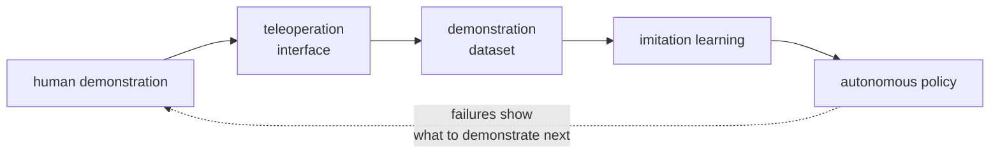
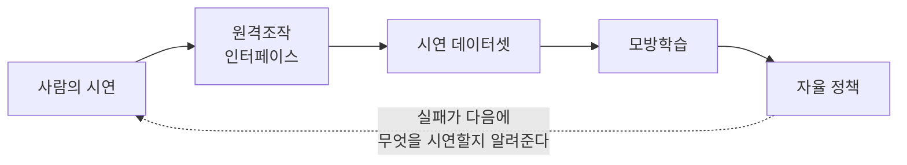

> [!abstract] Depth target · 깊이 목표
> **Working** — enough to choose an interface, diagnose why a bilateral loop went unstable,
> and read a demonstration dataset's description critically.
> **Working** — 인터페이스를 고르고, 양방향 루프가 왜 불안정해졌는지 진단하고, 시연
> 데이터셋 설명을 비판적으로 읽을 수 있을 만큼.

> [!note] Before you start · 시작 전 점검
> You need the Jacobian and $\tau = J^\top\mathcal{F}$ ([[04-robotics/modern-robotics/ch05-velocity-kinematics|MR ch.5]]), impedance versus admittance ([[04-robotics/contact-force-tactile|Contact, Force & Tactile §5]]), and feedback stability with delay ([[04-robotics/control-theory-ce397|Control Theory §7]]).
> 야코비안과 $\tau = J^\top\mathcal{F}$([[04-robotics/modern-robotics/ch05-velocity-kinematics|MR 5장]]), 임피던스와 어드미턴스의 구분([[04-robotics/contact-force-tactile|접촉·힘·촉각 §5]]), 지연이 있는 피드백의 안정성([[04-robotics/control-theory-ce397|제어 이론 §7]])이 필요하다.

## English

### 1. Teleoperation is a data-generation tool

The old reading of teleoperation is "driving a robot from a distance", and it is still
true — but it is no longer the interesting part. In modern robot learning the loop is:

Under this reading, a teleoperation system is not judged by how well a human can drive
the robot. It is judged by **the quality, quantity, and cost of the data it produces**,
and by whether a policy trained on that data works when the human lets go. Those are
different objectives, and they sometimes conflict: an interface that gives the operator
beautiful force feedback but takes ten minutes to set up per session will lose to a cruder
one that collects a thousand episodes a day.

This is also the entry point where prior XR and interface work transfers directly: hand
tracking, pose estimation, and latency budgets are the same problems wearing robot clothes.

### 2. Architectures — unilateral, bilateral, and what "transparency" means

The two devices are the **leader** (what the human moves; historically "master") and the
**follower** ("slave"). Two architectures:

- **Unilateral**: motion flows from leader to follower; nothing comes back except what the
  operator can see. Simple, unconditionally stable, and blind to contact.
- **Bilateral**: force flows back from the follower to the leader, so the operator feels
  the environment. This is what makes insertion and fitting teleoperable — and it is what
  can go unstable.

Model the whole system as a **two-port network**: one port faces the human, one faces the
environment, and each port has a velocity and a force.

<svg viewBox="0 0 560 212" style="max-width:100%;height:auto" role="img" aria-label="a two-port bilateral teleoperation chain from the human port through leader, delayed channel, and follower to the environment port">
  <g fill="currentColor">
    <rect x="104" y="64" width="94" height="46" rx="3" fill-opacity="0.10"/>
    <rect x="232" y="64" width="110" height="46" rx="3" fill-opacity="0.20"/>
    <rect x="376" y="64" width="94" height="46" rx="3" fill-opacity="0.10"/>
    <circle cx="70" cy="87" r="6"/><circle cx="504" cy="87" r="6"/>
  </g>
  <g stroke="currentColor" stroke-width="1" fill="none" opacity="0.65">
    <rect x="104" y="64" width="94" height="46" rx="3"/><rect x="232" y="64" width="110" height="46" rx="3"/><rect x="376" y="64" width="94" height="46" rx="3"/>
  </g>
  <g stroke="currentColor" stroke-width="1.3" fill="none" opacity="0.85" marker-end="url(#arT)">
    <line x1="78" y1="79" x2="100" y2="79"/><line x1="202" y1="79" x2="228" y2="79"/><line x1="346" y1="79" x2="372" y2="79"/><line x1="474" y1="79" x2="496" y2="79"/>
    <line x1="100" y1="97" x2="78" y2="97"/><line x1="228" y1="97" x2="202" y2="97"/><line x1="372" y1="97" x2="346" y2="97"/><line x1="496" y1="97" x2="474" y2="97"/>
  </g>
  <defs><marker id="arT" viewBox="0 0 10 10" refX="8" refY="5" markerWidth="5" markerHeight="5" orient="auto"><path d="M 0 0 L 10 5 L 0 10 z" fill="currentColor"/></marker></defs>
  <g font-size="11" fill="currentColor" text-anchor="middle">
    <text x="151" y="84">leader device</text><text x="151" y="99" font-size="9.5" opacity="0.75">the human moves it</text>
    <text x="287" y="84">communication</text><text x="287" y="99" font-size="9.5" opacity="0.75">delay T each way</text>
    <text x="423" y="84">follower robot</text><text x="423" y="99" font-size="9.5" opacity="0.75">it touches the world</text>
    <text x="70" y="132" font-size="10">human port</text><text x="504" y="132" font-size="10">environment port</text>
  </g>
  <g font-size="10.5" fill="currentColor" opacity="0.85">
    <text x="104" y="152">top row: motion command &#8594;&#160;&#160;&#160;bottom row: force feedback &#8592;</text>
  </g>
  <g font-size="11" fill="currentColor" opacity="0.9">
    <text x="20" y="180">The delay sits in BOTH rows. Force that arrives late is force applied to a situation that has already</text>
    <text x="20" y="196">changed &#8212; which is how a loop built only out of springs and masses starts producing energy.</text>
  </g>
</svg>

**Transparency** is the ideal: the impedance the operator feels equals the impedance of the
environment the follower touches. Push the follower into concrete and the leader should
feel concrete; move it through air and the leader should feel nothing. Perfect transparency
means the operator's hand and the follower's tool are, mechanically, the same object.

Lawrence's four-channel analysis (1993) is where this became a design objective rather
than an intuition, and it also names **the fundamental tradeoff of the field**: transparency
and robust stability pull against each other. Everything that makes the coupling more faithful — higher force gains,
stiffer leader, less filtering — also makes the closed loop more willing to oscillate,
especially against a stiff environment. A bilateral controller is a chosen point on that
compromise, and a paper that reports only one of the two is reporting half its result.

### 3. Why delay is not just "slower" — passivity

Delay is the reason this field has its own theory rather than borrowing control theory
wholesale. The system is a chain of springs, masses, and dampers, all of which are
**passive**: they store and dissipate energy but never create it. Interconnecting passive
systems keeps them passive, so the whole thing is stable.

A communication delay breaks that. Force computed from a position the follower held
$T$ seconds ago is applied to a leader that has since moved somewhere else, and the product
of the two can transfer energy *into* the system. The interconnection is no longer passive,
and for a large enough $T$ the loop oscillates no matter how small the gains are — which is
why "just lower the gain" is not a fix.

The classical repair is the **scattering transformation**, or equivalently the **wave
variables** of Niemeyer and Slotine (1991). Instead of sending velocity and force across the channel, send the
combinations

$$u = \frac{b\,\dot x + F}{\sqrt{2b}}, \qquad v = \frac{b\,\dot x - F}{\sqrt{2b}}$$

for a chosen wave impedance $b$. The power crossing the channel is then

$$P = \dot x\,F = \tfrac12\left(u^2 - v^2\right)$$

and a delayed channel that carries $u$ forward and $v$ back can only *store* the difference
between what entered and what left. It cannot manufacture energy, so the channel is passive
for **any** constant delay — the stability problem is solved structurally rather than by
tuning.

The cost is transparency: wave-variable teleoperation feels soft and drifts in position,
because the guarantee was bought by throwing away exactly the high-frequency fidelity that
made the coupling feel real. This is the tradeoff of §2 appearing again, now as a theorem
rather than a tuning knob.

> [!warning] Reading claims about delay
> "Our method is stable under delay" needs three qualifiers before it means anything: is the
> delay **constant or variable** (packet networks give variable), is it **known**, and was
> stability shown against a **stiff** environment or only against free motion? Free-motion
> stability is nearly free; contact stability is the claim.

### 4. The interface spectrum

Interfaces trade off along two axes that matter for data collection: how faithfully the
human's intent reaches the robot, and how cheap it is to produce an hour of demonstrations.

<svg viewBox="0 0 560 262" style="max-width:100%;height:auto" role="img" aria-label="interfaces plotted by fidelity against cost per hour of demonstration data">
  <g stroke="currentColor" stroke-width="1.1" fill="none" opacity="0.6">
    <line x1="70" y1="192" x2="520" y2="192"/><line x1="70" y1="192" x2="70" y2="40"/>
  </g>
  <g font-size="10.5" fill="currentColor" opacity="0.8">
    <text x="70" y="212">cheap to collect</text><text x="520" y="212" text-anchor="end">expensive to collect</text>
    <text x="64" y="46" text-anchor="end">high</text><text x="64" y="190" text-anchor="end">low</text>
    <text x="16" y="120" font-size="10">fidelity</text>
  </g>
  <g fill="currentColor">
    <circle cx="112" cy="170" r="5" fill-opacity="0.55"/>
    <circle cx="188" cy="102" r="5" fill-opacity="0.55"/>
    <circle cx="262" cy="134" r="5" fill-opacity="0.55"/>
    <circle cx="356" cy="76" r="5" fill-opacity="0.55"/>
    <circle cx="466" cy="60" r="5" fill-opacity="0.55"/>
  </g>
  <g font-size="10.5" fill="currentColor">
    <text x="122" y="174">game controller / joystick</text>
    <text x="198" y="98">handheld gripper, no robot present</text>
    <text x="272" y="138">VR controller or hand tracking</text>
    <text x="348" y="80" text-anchor="end">kinematically matched leader arm</text>
    <text x="466" y="50" text-anchor="middle">haptic device or exoskeleton</text>
  </g>
  <g font-size="11" fill="currentColor" opacity="0.9">
    <text x="20" y="238">No interface wins outright. The upper right buys fidelity with money and setup time;</text>
    <text x="20" y="254">the upper left buys throughput by giving up force feedback.</text>
  </g>
</svg>

- **Game controller or joystick.** Few degrees of freedom, awkward for 6-DoF pose, but
  universally available. Fine for a mobile base, poor for dexterous manipulation.
- **VR controller or hand tracking.** Gives 6-DoF pose directly and naturally, usually with
  no force feedback. Requires retargeting (§5) because a human hand and a robot gripper do
  not share kinematics.
- **Kinematically matched leader arm.** A small replica of the follower's kinematics: the
  human backdrives it, and joint angles map across **directly, with no inverse kinematics
  and no retargeting**. This is why the approach reappeared in 3D-printed,
  off-the-shelf-motor form (GELLO, Wu et al., IROS 2024) and, via ALOHA's puppeteering rig, became the default for bimanual manipulation data.
- **Handheld gripper with no robot in the loop.** The operator carries a gripper with a
  camera and simply does the task; the robot is absent during collection. This is the Universal Manipulation
  Interface's premise — "in-the-wild robot teaching without in-the-wild robots" (Chi et al.,
  RSS 2024). Extremely cheap and collectible anywhere, at the price of an **embodiment gap** — the data must be
  transferred to a robot whose camera placement, reachable workspace, and dynamics differ.
- **Haptic device or exoskeleton.** Genuine bilateral force feedback and the highest
  fidelity available, at the highest cost per hour.

For construction, the cost axis usually decides. Field data cannot be collected in a lab,
and an interface that needs a calibrated rig is an interface that will not leave the
building.

### 5. Retargeting and scaling — the mapping nobody mentions

Unless the leader is kinematically matched to the follower, some map from human motion to
robot command has to be chosen, and that choice is a modelling decision with consequences:

- **Pose retargeting.** Track the human's hand pose and command the same end-effector pose.
  Simple and the most common; it ignores the arm's configuration, so the robot may reach a
  correct tool pose in an awkward or near-singular posture.
- **Joint retargeting.** Map human joints to robot joints. Natural when the kinematics
  correspond, meaningless when they do not.
- **Task-frame retargeting.** Map what the human is doing *relative to the object* rather
  than in world coordinates. More robust to the human and robot standing in different
  places, and more work to set up.

Two scalings sit on top of the map. **Motion scaling** lets a large human motion become a
small robot motion, which is how teleoperation reaches tolerances a human hand cannot hold
directly. **Force scaling** does the same in reverse, letting the operator feel a
small force amplified — necessary when the robot works at forces a human would not notice,
and dangerous when it hides forces a human should.

> [!important] Retargeting is where demonstrations quietly become unrealistic
> If the map lets the human command poses the robot reaches only at the edge of its
> workspace, the dataset will be full of near-singular configurations, and the policy
> trained on it inherits them. The manipulability check from [[04-robotics/modern-robotics/ch05-velocity-kinematics|MR ch.5 §4]]
> belongs in the collection pipeline, not only in the analysis.

### 6. What makes demonstration data good

This is the section that matters most for the loop in §1, and the one most often reduced to
a single number in a paper. It is also the section with a dedicated controlled study behind it:
*What Matters in Learning from Offline Human Demonstrations for Robot Manipulation* (Mandlekar
et al., CoRL 2021 — the robomimic benchmark) compares six offline learning algorithms across
five simulated and three real-world multi-stage tasks precisely to separate what the data
contributes from what the algorithm does. Quantity is the easy axis; the harder ones:

- **Operator skill, and consistency.** Demonstrations from operators of different skill
  levels are not simply "more data" — they are samples from different policies. Naive
  behaviour cloning averages them, and the average of two competent strategies is often
  incompetent.
- **Multimodality.** When a task admits several valid solutions, a regression policy trained
  to minimise mean error can output the mean of two valid actions, which is invalid. This is
  the failure that motivates action chunking and generative policies — see
  [[01-canonical-papers/notes/4-vla/diffusion-policy|Diffusion Policy]] and
  [[01-canonical-papers/notes/4-vla/act|ACT]].
- **Coverage of recovery.** Demonstrations show the task going well. A policy that has never
  seen a recovery cannot perform one, and it will need to, because its own small errors take
  it off the demonstrated distribution — the compounding-error argument in
  [[02-foundations/rl-basics|7. RL Basics §6]].
- **State-action consistency.** If the operator reacts to something the robot's sensors did
  not record — a sound, a glance at their own hand, knowledge of what comes next — the
  dataset contains actions that its own observations cannot explain, and no amount of it
  will teach the policy that behaviour.

### 7. Construction: what teleoperation is already for, and what it could be

Teleoperated heavy machinery is not speculative in this domain; it is standard, and the
motivation has always been hazard removal — see
[[01-canonical-papers/notes/8-construction/heap|HEAP]], whose sibling machine is operated
remotely for unexploded-ordnance excavation, and the excavation lineage in
[[05-construction-robotics/earthmoving-heavy-machinery|Earthmoving & Heavy Machinery]].

The reframing of §1 suggests the less-explored use: teleoperation as the **collection
mechanism for construction manipulation data** that does not otherwise exist. There is no
web-scale corpus of panel fitting, anchor-bolt fastening, or pipe insertion, and there will
not be one — which makes the ability to generate it a research asset rather than a chore.
Concretely, the pipeline of §1 applied to a task from
[[05-construction-robotics/assembly-fabrication|Assembly & Fabrication]]: an operator
teleoperates the fitting task, contact-rich episodes are recorded with force and vision,
a policy is trained, and the residual failures say which situations to demonstrate next.

This is also where the domain's difficulty becomes an advantage rather than an excuse: the
variation between two instances of the same construction task is exactly the variation that
makes a demonstration dataset worth collecting instead of a single scripted trajectory.

### 8. Reading a teleoperation or demonstration paper

| Question | Why it separates a claim from a demo |
|---|---|
| Unilateral or bilateral? | Only bilateral papers can claim anything about contact feel |
| Delay: constant, variable, known? Tested against a stiff environment? | Free-motion stability is nearly free |
| Interface, and what retargeting map? | Decides whether the data is reachable and well-conditioned |
| Number of demonstrations **and** wall-clock collection time | Cost per episode is the number that transfers to another lab |
| How many operators, at what skill? | One expert's data is a different distribution from five people's |
| Success rate — defined how, on which objects, from which initial states? | "90% success" on demonstrated initial states is not generalization |
| Was the policy evaluated on the *same* setup that collected the data? | The most common quiet limitation in the area |

### After reading

- [ ] Draw the two-port diagram and mark where the delay enters.
- [ ] Explain why delay breaks passivity, and what wave variables trade away to fix it.
- [ ] Choose an interface for a stated task and defend it on the fidelity–cost axes.
- [ ] Name three properties of a demonstration dataset that a count of episodes does not capture.
- [ ] Given a paper, extract the seven items in the table above.

### Self-check

1. A bilateral teleoperator is stable in free motion and oscillates on contact with a steel
   plate. What does that tell you, and what would you check first?
2. Why does a kinematically matched leader arm avoid two problems at once?
3. Wave variables guarantee passivity for any constant delay. Why is this not the end of the
   field?
4. A paper collects 50 demonstrations of an insertion task from one expert and reports 92%
   success. What are the two most important things it has not told you?
5. Motion scaling of 5:1 is used so the operator can work to a 0.5 mm tolerance. What does
   the same scaling do to the force the operator feels, if force is scaled to match?

> [!tip]- Answers
> 1. It tells you the instability is contact-driven, not a general gain problem: a stiff environment raises the loop gain seen by the force channel, so the compromise point of §2 was chosen too far toward transparency. Check the force-feedback gain and any filtering on the force signal first, and whether the follower is torque-controlled or has a stiff position loop underneath ([[02-foundations/manipulator-kinematics-dynamics|10. §8]]) — the latter makes the environment stiffness and the controller stiffness add.
> 2. It removes inverse kinematics (joint angles map across directly) and it removes retargeting (the human is moving a device with the robot's own kinematics, so there is no correspondence problem). Both of those are sources of ill-conditioned or unreachable commands, so eliminating them improves the *data*, not just the operator's experience.
> 3. Because passivity buys stability, not performance. The transformation deliberately discards high-frequency fidelity, so the operator feels a soft, drifting version of the environment — and for tasks where the point of force feedback is to detect a crisp contact transition, that softness removes the signal the operator needed. Guaranteeing you cannot go unstable is not the same as being useful.
> 4. How long the 50 demonstrations took to collect, and how the 92% was measured — specifically, whether the evaluation initial states were drawn from the same distribution the expert demonstrated. One expert also means the policy learned one strategy, so nothing is known about robustness to operator variation.
> 5. It divides the felt force by 5 as well, so a 50 N contact feels like 10 N. That is the direction that hides forces the operator should notice, which is why fine-motion teleoperation usually scales motion down and force *up*, decoupling the two ratios rather than sharing one.

### Sources

**Bilateral control theory**

- D. A. Lawrence, "Stability and transparency in bilateral teleoperation," *IEEE Transactions on Robotics and Automation*, vol. 9, no. 5, pp. 624–637, 1993 — the four-channel architecture and the formal statement of transparency.
- G. Niemeyer and J.-J. E. Slotine, "Stable adaptive teleoperation," *IEEE Journal of Oceanic Engineering*, vol. 16, no. 1, pp. 152–162, 1991 — the wave-variable transformation of §3. Note the title does not contain the phrase it is known for, and some bibliographies misfile it under *IEEE Transactions on Automatic Control* (same volume-like number, same page range); the journal is Oceanic Engineering.
- P. F. Hokayem and M. W. Spong, "Bilateral teleoperation: An historical survey," *Automatica*, vol. 42, no. 12, pp. 2035–2057, 2006 — the survey to read before choosing an architecture.

**Interfaces and demonstration data**

- T. Z. Zhao, V. Kumar, S. Levine, C. Finn, "Learning Fine-Grained Bimanual Manipulation with Low-Cost Hardware," RSS 2023 — ALOHA and ACT; see [[01-canonical-papers/notes/4-vla/act|the note]].
- P. Wu, Y. Shentu, Z. Yi, X. Lin, P. Abbeel, "GELLO: A General, Low-Cost, and Intuitive Teleoperation Framework for Robot Manipulators," IROS 2024 ([arXiv:2309.13037](https://arxiv.org/abs/2309.13037)) — the 3D-printed kinematically matched leader arm.
- C. Chi et al., "Universal Manipulation Interface: In-The-Wild Robot Teaching Without In-The-Wild Robots," RSS 2024 ([arXiv:2402.10329](https://arxiv.org/abs/2402.10329)) — the handheld-gripper approach and its latency-matching policy interface.
- A. Mandlekar et al., "What Matters in Learning from Offline Human Demonstrations for Robot Manipulation," CoRL 2021, PMLR vol. 164 — robomimic. Cited as CoRL 2021 though the PMLR volume is stamped 2022.

> [!warning] On the hardware costs these papers are known for
> ALOHA, GELLO, Mobile ALOHA and UMI all carry "low-cost" in their titles or reputations, and none of them state a price in the abstract. The figures that circulate come from paper bodies, project sites, or press coverage — so quote them from those, with that source named, or not at all.

**Within this wiki**

- [[04-robotics/contact-force-tactile|Contact, Force & Tactile Interaction]] — impedance, admittance, and contact stability, which §2 and §3 assume.
- [[02-foundations/manipulator-kinematics-dynamics|10. Manipulator Kinematics & Dynamics]] — why a stiff inner position loop changes what a force claim means.

## 한국어

### 1. 원격조작은 데이터 생성 도구다

원격조작의 옛 독법은 "멀리서 로봇을 조종하는 것"이고 여전히 참이지만, 더 이상 흥미로운
부분이 아니다. 현대 로봇 학습에서 루프는 이렇다:

이 독법에서 원격조작 시스템은 사람이 로봇을 얼마나 잘 몰 수 있는가로 평가되지 않는다.
**그것이 만들어내는 데이터의 품질·양·비용**, 그리고 사람이 손을 놓았을 때 그 데이터로
학습한 정책이 작동하는가로 평가된다. 이 둘은 다른 목표이고, 때로 충돌한다. 조작자에게
아름다운 힘 피드백을 주지만 세션마다 10분씩 셋업이 필요한 인터페이스는, 하루에 에피소드
천 개를 모으는 조잡한 인터페이스에 진다.

기존 XR·인터페이스 경험이 그대로 옮겨 오는 진입점이기도 하다: 손 추적, 자세 추정, 지연
예산은 로봇 옷을 입은 같은 문제다.

### 2. 아키텍처 — 단방향, 양방향, 그리고 "투명성"의 뜻

두 장치는 **리더**(사람이 움직이는 쪽, 역사적으로 "master")와 **팔로워**("slave")다.
두 아키텍처가 있다:

- **단방향**: 운동이 리더에서 팔로워로만 흐르고, 조작자가 볼 수 있는 것 외에는 아무것도
  돌아오지 않는다. 단순하고 무조건 안정하며, 접촉에 대해 눈이 멀었다.
- **양방향**: 힘이 팔로워에서 리더로 되돌아와 조작자가 환경을 느낀다. 삽입과 끼움을
  원격조작 가능하게 만드는 것이 이것이고, 불안정해질 수 있는 것도 이것이다.

전체를 **2포트 네트워크**로 모델링한다: 한 포트는 사람을, 한 포트는 환경을 향하고,
각 포트에는 속도와 힘이 있다.

<svg viewBox="0 0 560 212" style="max-width:100%;height:auto" role="img" aria-label="사람 포트에서 리더, 지연된 채널, 팔로워를 거쳐 환경 포트로 이어지는 2포트 양방향 원격조작 사슬">
  <g fill="currentColor">
    <rect x="104" y="64" width="94" height="46" rx="3" fill-opacity="0.10"/>
    <rect x="232" y="64" width="110" height="46" rx="3" fill-opacity="0.20"/>
    <rect x="376" y="64" width="94" height="46" rx="3" fill-opacity="0.10"/>
    <circle cx="70" cy="87" r="6"/><circle cx="504" cy="87" r="6"/>
  </g>
  <g stroke="currentColor" stroke-width="1" fill="none" opacity="0.65">
    <rect x="104" y="64" width="94" height="46" rx="3"/><rect x="232" y="64" width="110" height="46" rx="3"/><rect x="376" y="64" width="94" height="46" rx="3"/>
  </g>
  <g stroke="currentColor" stroke-width="1.3" fill="none" opacity="0.85" marker-end="url(#arTk)">
    <line x1="78" y1="79" x2="100" y2="79"/><line x1="202" y1="79" x2="228" y2="79"/><line x1="346" y1="79" x2="372" y2="79"/><line x1="474" y1="79" x2="496" y2="79"/>
    <line x1="100" y1="97" x2="78" y2="97"/><line x1="228" y1="97" x2="202" y2="97"/><line x1="372" y1="97" x2="346" y2="97"/><line x1="496" y1="97" x2="474" y2="97"/>
  </g>
  <defs><marker id="arTk" viewBox="0 0 10 10" refX="8" refY="5" markerWidth="5" markerHeight="5" orient="auto"><path d="M 0 0 L 10 5 L 0 10 z" fill="currentColor"/></marker></defs>
  <g font-size="11" fill="currentColor" text-anchor="middle">
    <text x="151" y="84">리더 장치</text><text x="151" y="99" font-size="9.5" opacity="0.75">사람이 움직인다</text>
    <text x="287" y="84">통신</text><text x="287" y="99" font-size="9.5" opacity="0.75">편도마다 지연 T</text>
    <text x="423" y="84">팔로워 로봇</text><text x="423" y="99" font-size="9.5" opacity="0.75">세상에 닿는다</text>
    <text x="70" y="132" font-size="10">사람 포트</text><text x="504" y="132" font-size="10">환경 포트</text>
  </g>
  <g font-size="10.5" fill="currentColor" opacity="0.85">
    <text x="104" y="152">윗줄: 운동 명령 &#8594;&#160;&#160;&#160;아랫줄: 힘 피드백 &#8592;</text>
  </g>
  <g font-size="11" fill="currentColor" opacity="0.9">
    <text x="20" y="180">지연은 두 줄 모두에 있다. 늦게 도착한 힘은 이미 바뀌어 버린 상황에 가해지는 힘이다 &#8212; 스프링과</text>
    <text x="20" y="196">질량만으로 만든 루프가 에너지를 만들어내기 시작하는 경로가 이것이다.</text>
  </g>
</svg>

**투명성(transparency)** 이 이상이다: 조작자가 느끼는 임피던스가 팔로워가 닿는 환경의
임피던스와 같아지는 것. 팔로워를 콘크리트에 밀면 리더에서 콘크리트가 느껴지고, 허공에서
움직이면 아무것도 느껴지지 않아야 한다. 완전한 투명성이란 조작자의 손과 팔로워의 공구가
역학적으로 같은 물체라는 뜻이다.

Lawrence의 4채널 분석(1993)이 이것을 직관이 아니라 설계 목표로 만든 지점이고, 동시에
**이 분야의 근본적 트레이드오프**를 지명한다: 투명성과 견고한 안정성은 서로를 당긴다.
결합을 더 충실하게 만드는 모든 것 — 높은 힘 게인, 더 뻣뻣한 리더, 적은 필터링 — 은 폐루프를
더 쉽게 진동하게 만들고, 단단한 환경에서 특히 그렇다. 양방향 제어기는 그 타협선 위에서
고른 한 점이며, 둘 중 하나만 보고하는 논문은 결과의 절반만 보고한 것이다.

### 3. 지연이 단지 "느린 것"이 아닌 이유 — 수동성

지연이야말로 이 분야가 제어 이론을 통째로 빌려 오는 대신 자기 이론을 갖게 된 이유다.
시스템은 스프링·질량·감쇠기의 사슬이고, 이들은 전부 **수동적(passive)** 이다: 에너지를
저장하고 소산하지만 만들어내지는 않는다. 수동 시스템끼리 연결하면 수동성이 유지되므로
전체가 안정하다.

통신 지연이 그것을 깬다. 팔로워가 $T$초 전에 있던 위치로 계산된 힘이, 그사이 다른 곳으로
움직인 리더에 가해진다. 그 둘의 곱이 시스템 *안으로* 에너지를 전달할 수 있다. 연결은 더
이상 수동적이지 않고, $T$가 충분히 크면 게인을 아무리 줄여도 루프가 진동한다 — "게인을
낮춰라"가 해결책이 아닌 이유다.

고전적 처방은 **산란 변환**(scattering transformation), 동등하게 Niemeyer와 Slotine(1991)의
**wave variable**이다.
채널에 속도와 힘을 보내는 대신 다음 조합을 보낸다:

$$u = \frac{b\,\dot x + F}{\sqrt{2b}}, \qquad v = \frac{b\,\dot x - F}{\sqrt{2b}}$$

($b$는 선택한 wave 임피던스). 그러면 채널을 건너는 일률은

$$P = \dot x\,F = \tfrac12\left(u^2 - v^2\right)$$

이고, $u$를 앞으로 $v$를 뒤로 나르는 지연된 채널은 들어온 것과 나간 것의 차이를 *저장*할
수 있을 뿐이다. 에너지를 제조할 수 없으므로 채널은 **임의의** 상수 지연에 대해 수동적이다 —
안정성 문제가 튜닝이 아니라 구조로 해결된다.

대가는 투명성이다. wave variable 원격조작은 무르게 느껴지고 위치가 표류한다. 보장을 산
대가로, 결합을 진짜처럼 느끼게 만들던 고주파 충실도를 정확히 그만큼 버렸기 때문이다.
§2의 트레이드오프가 이제 튜닝 손잡이가 아니라 정리(theorem)의 형태로 다시 나타난 것이다.

> [!warning] 지연에 관한 주장 읽기
> "우리 방법은 지연 하에서 안정하다"가 의미를 가지려면 세 가지 한정이 필요하다: 지연이
> **상수인가 변동하는가**(패킷 네트워크는 변동한다), **알려져 있는가**, 그리고 안정성이
> **단단한** 환경에 대해 보여졌는가 아니면 자유 운동에서만인가. 자유 운동 안정성은 거의
> 공짜다. 접촉 안정성이 주장이다.

### 4. 인터페이스 스펙트럼

인터페이스는 데이터 수집에 중요한 두 축에서 절충한다: 사람의 의도가 얼마나 충실하게
로봇에 도달하는가, 그리고 시연 한 시간을 만드는 비용이 얼마인가.

<svg viewBox="0 0 560 262" style="max-width:100%;height:auto" role="img" aria-label="시연 데이터 시간당 비용에 대한 충실도로 배치한 인터페이스들">
  <g stroke="currentColor" stroke-width="1.1" fill="none" opacity="0.6">
    <line x1="70" y1="192" x2="520" y2="192"/><line x1="70" y1="192" x2="70" y2="40"/>
  </g>
  <g font-size="10.5" fill="currentColor" opacity="0.8">
    <text x="70" y="212">수집 비용 낮음</text><text x="520" y="212" text-anchor="end">수집 비용 높음</text>
    <text x="64" y="46" text-anchor="end">높음</text><text x="64" y="190" text-anchor="end">낮음</text>
    <text x="16" y="120" font-size="10">충실도</text>
  </g>
  <g fill="currentColor">
    <circle cx="112" cy="170" r="5" fill-opacity="0.55"/>
    <circle cx="188" cy="102" r="5" fill-opacity="0.55"/>
    <circle cx="262" cy="134" r="5" fill-opacity="0.55"/>
    <circle cx="356" cy="76" r="5" fill-opacity="0.55"/>
    <circle cx="466" cy="60" r="5" fill-opacity="0.55"/>
  </g>
  <g font-size="10.5" fill="currentColor">
    <text x="122" y="174">게임 컨트롤러 / 조이스틱</text>
    <text x="198" y="98">로봇 없이 쓰는 휴대형 그리퍼</text>
    <text x="272" y="138">VR 컨트롤러 또는 손 추적</text>
    <text x="348" y="80" text-anchor="end">기구학이 같은 리더 암</text>
    <text x="466" y="50" text-anchor="middle">햅틱 장치 또는 외골격</text>
  </g>
  <g font-size="11" fill="currentColor" opacity="0.9">
    <text x="20" y="238">완승하는 인터페이스는 없다. 오른쪽 위는 돈과 셋업 시간으로 충실도를 사고,</text>
    <text x="20" y="254">왼쪽 위는 힘 피드백을 포기해 처리량을 산다.</text>
  </g>
</svg>

- **게임 컨트롤러 또는 조이스틱.** 자유도가 적고 6자유도 자세에 어색하지만 어디에나 있다.
  이동 베이스에는 충분하고 정교한 조작에는 부족하다.
- **VR 컨트롤러 또는 손 추적.** 6자유도 자세를 직접, 자연스럽게 준다. 보통 힘 피드백이
  없다. 사람 손과 로봇 그리퍼는 기구학을 공유하지 않으므로 리타게팅(§5)이 필요하다.
- **기구학이 같은 리더 암.** 팔로워의 기구학을 축소한 복제품. 사람이 그것을 손으로 밀면
  관절각이 **역기구학도 리타게팅도 없이 그대로** 넘어간다. 이 방식이 3D 프린팅 부품과 기성 모터
  형태로 다시 등장하고(GELLO, Wu et al., IROS 2024), ALOHA의 퍼펫티어링 리그를 거쳐 양팔
  조작 데이터의 기본값이 된 이유다.
- **로봇 없이 쓰는 휴대형 그리퍼.** 조작자가 카메라 달린 그리퍼를 들고 그냥 작업을 하고,
  수집 중에는 로봇이 없다. Universal Manipulation Interface의 전제가 이것이다 — "야생의 로봇 없이 야생에서 로봇
  가르치기"(Chi et al., RSS 2024). 대단히 싸고 어디서나 모을 수 있지만 **embodiment 격차**를
  대가로 치른다 — 카메라 배치, 도달 가능 작업 공간, 동역학이 다른 로봇으로 데이터를
  옮겨야 한다.
- **햅틱 장치 또는 외골격.** 진짜 양방향 힘 피드백과 최고 충실도를, 시간당 최고 비용에.

건설에서는 대개 비용 축이 결정한다. 현장 데이터는 실험실에서 모을 수 없고, 보정된 리그가
필요한 인터페이스는 건물 밖으로 나가지 못하는 인터페이스다.

### 5. 리타게팅과 스케일링 — 아무도 언급하지 않는 사상

리더가 팔로워와 기구학이 같지 않다면, 사람의 운동에서 로봇 명령으로 가는 어떤 사상을
골라야 하고, 그 선택은 결과를 낳는 모델링 결정이다:

- **자세 리타게팅.** 사람 손의 자세를 추적해 같은 말단 자세를 명령한다. 단순하고 가장
  흔하다. 팔의 자세(configuration)를 무시하므로, 로봇이 올바른 공구 자세를 어색하거나
  특이점에 가까운 자세로 만들 수 있다.
- **관절 리타게팅.** 사람 관절을 로봇 관절에 대응시킨다. 기구학이 대응할 때 자연스럽고,
  대응하지 않으면 의미가 없다.
- **과제 프레임 리타게팅.** 사람이 세계 좌표가 아니라 *물체에 대해* 무엇을 하고 있는지를
  옮긴다. 사람과 로봇이 다른 위치에 서 있어도 견고하고, 셋업에 더 품이 든다.

그 위에 두 스케일링이 얹힌다. **모션 스케일링**은 사람의 큰 운동을 로봇의 작은 운동으로
만들어, 사람 손이 직접 유지할 수 없는 공차에 원격조작이 도달하게 한다. **힘 스케일링**은
반대로, 작은 힘을 증폭해 조작자가 느끼게 한다 — 로봇이 사람은 알아채지 못할 힘으로 일할 때
필요하고, 사람이 알아채야 할 힘을 가릴 때 위험하다.

> [!important] 리타게팅은 시연이 조용히 비현실적으로 변하는 지점이다
> 사상이 사람으로 하여금 로봇이 작업 공간 가장자리에서만 도달하는 자세를 명령하게 두면,
> 데이터셋은 특이점에 가까운 자세로 가득 차고 그 위에서 학습한 정책이 그것을 물려받는다.
> [[04-robotics/modern-robotics/ch05-velocity-kinematics|MR 5장 §4]]의 가조작성 점검은
> 분석 단계가 아니라 수집 파이프라인 안에 있어야 한다.

### 6. 좋은 시연 데이터란 무엇인가

§1의 루프에 가장 중요한 절이자, 논문에서 숫자 하나로 축소되기 가장 쉬운 절이다. 전용
통제 연구가 존재하는 절이기도 하다: *What Matters in Learning from Offline Human
Demonstrations for Robot Manipulation*(Mandlekar et al., CoRL 2021 — robomimic 벤치마크)은
데이터가 기여하는 것과 알고리즘이 하는 일을 분리하기 위해, 오프라인 학습 알고리즘 여섯
개를 시뮬레이션 과제 다섯 개와 실기계 다단계 과제 세 개에서 비교한다. 양은 쉬운 축이고,
어려운 축들은 이렇다:

- **조작자의 숙련도, 그리고 일관성.** 숙련도가 다른 조작자들의 시연은 단순히 "더 많은
  데이터"가 아니다 — 서로 다른 정책에서 뽑은 표본이다. 소박한 행동 복제는 그것들을 평균
  내고, 두 유능한 전략의 평균은 대개 무능하다.
- **다봉성(multimodality).** 과제에 여러 타당한 해가 있을 때, 평균 오차를 최소화하도록
  학습한 회귀 정책은 두 타당한 행동의 평균을 낼 수 있고 그것은 무효다. 행동 청킹과 생성
  정책의 동기가 된 실패이며 — [[01-canonical-papers/notes/4-vla/diffusion-policy|Diffusion Policy]]와
  [[01-canonical-papers/notes/4-vla/act|ACT]]를 보라.
- **복구의 포함 여부.** 시연은 일이 잘 풀리는 모습을 보여준다. 복구를 본 적 없는 정책은
  복구할 수 없고, 반드시 필요해진다. 자기 자신의 작은 오차가 시연된 분포 밖으로 데려가기
  때문이다 — [[02-foundations/rl-basics|7. RL 기초 §6]]의 복합 오차 논증.
- **상태-행동 일관성.** 조작자가 로봇의 센서가 기록하지 않은 무언가에 반응했다면 — 소리,
  자기 손을 흘깃 본 것, 다음에 무엇이 오는지 아는 것 — 데이터셋은 자기 관측으로 설명할 수
  없는 행동을 담게 되고, 아무리 많아도 그 행동을 정책에 가르치지 못한다.

### 7. 건설: 원격조작이 이미 쓰이는 곳, 그리고 쓰일 수 있는 곳

이 도메인에서 중장비 원격조작은 가설이 아니라 표준이며, 동기는 언제나 위험 제거였다 —
자매 기체가 불발탄 굴착에 원격으로 운용되는 [[01-canonical-papers/notes/8-construction/heap|HEAP]]과
[[05-construction-robotics/earthmoving-heavy-machinery|토공·중장비]]의 굴착 계보를 보라.

§1의 재프레이밍이 가리키는, 덜 탐색된 용도는 이것이다: 달리 존재하지 않는 **건설 조작
데이터의 수집 기제**로서의 원격조작. 패널 끼움, 앵커 볼트 체결, 배관 삽입의 웹 규모
코퍼스는 없고 앞으로도 없을 것이다 — 그래서 그것을 만들어낼 수 있다는 것이 잡일이 아니라
연구 자산이 된다. 구체적으로는 [[05-construction-robotics/assembly-fabrication|조립·제작]]의
작업 하나에 §1의 파이프라인을 적용하는 것이다: 조작자가 끼움 작업을 원격조작하고, 접촉이
많은 에피소드를 힘과 비전과 함께 기록하고, 정책을 학습하고, 남은 실패가 다음에 어떤 상황을
시연할지 알려준다.

도메인의 어려움이 변명이 아니라 이점이 되는 지점이기도 하다: 같은 건설 작업의 두 사례
사이의 변동이야말로, 하나의 스크립트 궤적 대신 시연 데이터셋을 모을 가치가 있게 만드는
바로 그 변동이다.

### 8. 원격조작·시연 논문 읽기

| 질문 | 왜 주장과 데모를 가르는가 |
|---|---|
| 단방향인가 양방향인가? | 접촉의 느낌에 관해 주장할 수 있는 것은 양방향 논문뿐이다 |
| 지연: 상수·변동·기지 여부? 단단한 환경에서 검증했는가? | 자유 운동 안정성은 거의 공짜다 |
| 어떤 인터페이스이고 어떤 리타게팅 사상인가? | 데이터가 도달 가능하고 조건이 좋은지를 결정한다 |
| 시연 개수 **그리고** 실제 소요 시간 | 에피소드당 비용이 다른 실험실로 이전되는 숫자다 |
| 조작자 몇 명, 숙련도는? | 전문가 한 명의 데이터와 다섯 명의 데이터는 다른 분포다 |
| 성공률 — 무엇으로 정의했고, 어떤 물체, 어떤 초기 상태에서? | 시연된 초기 상태에서의 "90% 성공"은 일반화가 아니다 |
| 정책을 데이터를 모은 *바로 그* 셋업에서 평가했는가? | 이 분야에서 가장 흔한, 조용한 한계 |

### 읽고 나면 말할 수 있어야 하는 것

- [ ] 2포트 도식을 그리고 지연이 들어오는 곳을 표시한다.
- [ ] 지연이 왜 수동성을 깨는지, wave variable이 그것을 고치려고 무엇을 내주는지 설명한다.
- [ ] 주어진 과제에 인터페이스를 고르고 충실도–비용 축에서 방어한다.
- [ ] 에피소드 개수가 담지 못하는 시연 데이터셋의 성질 셋을 댄다.
- [ ] 논문 하나에서 위 표의 일곱 항목을 뽑아낸다.

### 스스로 점검

1. 어떤 양방향 원격조작기가 자유 운동에서는 안정한데 강판에 접촉하면 진동한다. 이것이
   말해 주는 것은 무엇이고, 무엇을 먼저 확인하겠는가?
2. 기구학이 같은 리더 암은 왜 두 문제를 한꺼번에 피하는가?
3. wave variable은 임의의 상수 지연에 대해 수동성을 보장한다. 그런데 왜 이것으로 분야가
   끝나지 않았는가?
4. 어떤 논문이 전문가 한 명에게서 삽입 과제 시연 50개를 모아 92% 성공을 보고한다. 말하지
   않은 것 중 가장 중요한 두 가지는?
5. 조작자가 0.5 mm 공차로 작업할 수 있도록 5:1 모션 스케일링을 쓴다. 힘도 같은 비로
   스케일한다면 조작자가 느끼는 힘에는 무슨 일이 일어나는가?

> [!tip]- 정답 · Answers
> 1. 불안정이 일반적인 게인 문제가 아니라 접촉에서 비롯됐다는 뜻이다: 단단한 환경은 힘 채널이 보는 루프 게인을 높이므로, §2의 타협점을 투명성 쪽으로 너무 멀리 잡은 것이다. 힘 피드백 게인과 힘 신호의 필터링을 먼저 확인하고, 팔로워가 토크 제어인지 아니면 그 아래에 뻣뻣한 위치 루프가 있는지를 확인하라([[02-foundations/manipulator-kinematics-dynamics|10. §8]]) — 후자라면 환경 강성과 제어기 강성이 더해진다.
> 2. 역기구학을 없애고(관절각이 그대로 넘어간다) 리타게팅을 없앤다(사람이 로봇 자신의 기구학을 가진 장치를 움직이므로 대응 문제가 없다). 둘 다 조건이 나쁘거나 도달 불가능한 명령의 원천이므로, 없애면 조작자의 경험만이 아니라 *데이터*가 좋아진다.
> 3. 수동성이 사는 것은 안정성이지 성능이 아니기 때문이다. 이 변환은 고주파 충실도를 의도적으로 버리므로 조작자는 환경의 무르고 표류하는 판본을 느낀다 — 힘 피드백의 요점이 분명한 접촉 천이를 감지하는 것인 과제에서는, 그 무름이 조작자가 필요로 했던 신호를 지운다. 불안정해질 수 없음을 보장하는 것과 쓸모 있는 것은 같지 않다.
> 4. 시연 50개를 모으는 데 걸린 시간, 그리고 92%를 어떻게 측정했는가 — 특히 평가 초기 상태가 전문가가 시연한 것과 같은 분포에서 뽑혔는가. 전문가 한 명이라는 것은 정책이 하나의 전략을 배웠다는 뜻이므로, 조작자 변동에 대한 견고성은 아무것도 알 수 없다.
> 5. 느끼는 힘도 5로 나뉘어, 50 N 접촉이 10 N처럼 느껴진다. 조작자가 알아채야 할 힘을 가리는 방향이며, 그래서 미세 운동 원격조작은 보통 모션은 줄이고 힘은 *키운다* — 하나의 비를 공유하는 대신 두 비를 분리한다.

### 출처

**양방향 제어 이론**

- D. A. Lawrence, "Stability and transparency in bilateral teleoperation," *IEEE Transactions on Robotics and Automation*, vol. 9, no. 5, pp. 624–637, 1993 — 4채널 아키텍처와 투명성의 형식적 정의.
- G. Niemeyer and J.-J. E. Slotine, "Stable adaptive teleoperation," *IEEE Journal of Oceanic Engineering*, vol. 16, no. 1, pp. 152–162, 1991 — §3의 wave variable 변환. 제목에 정작 이 논문이 알려진 그 표현이 없다는 점, 그리고 일부 서지가 *IEEE Transactions on Automatic Control*로 잘못 분류한다는 점(권 번호가 비슷하고 페이지가 같다)에 주의. 실제 저널은 Oceanic Engineering이다.
- P. F. Hokayem and M. W. Spong, "Bilateral teleoperation: An historical survey," *Automatica*, vol. 42, no. 12, pp. 2035–2057, 2006 — 아키텍처를 고르기 전에 읽을 서베이.

**인터페이스와 시연 데이터**

- T. Z. Zhao, V. Kumar, S. Levine, C. Finn, "Learning Fine-Grained Bimanual Manipulation with Low-Cost Hardware," RSS 2023 — ALOHA와 ACT. [[01-canonical-papers/notes/4-vla/act|노트]] 참조.
- P. Wu, Y. Shentu, Z. Yi, X. Lin, P. Abbeel, "GELLO: A General, Low-Cost, and Intuitive Teleoperation Framework for Robot Manipulators," IROS 2024 ([arXiv:2309.13037](https://arxiv.org/abs/2309.13037)) — 3D 프린팅으로 만든, 기구학이 같은 리더 암.
- C. Chi et al., "Universal Manipulation Interface: In-The-Wild Robot Teaching Without In-The-Wild Robots," RSS 2024 ([arXiv:2402.10329](https://arxiv.org/abs/2402.10329)) — 휴대형 그리퍼 접근과 지연 정합 정책 인터페이스.
- A. Mandlekar et al., "What Matters in Learning from Offline Human Demonstrations for Robot Manipulation," CoRL 2021, PMLR vol. 164 — robomimic. PMLR 권에는 2022로 찍혀 있지만 CoRL 2021로 인용한다.

> [!warning] 이 논문들이 유명해진 하드웨어 가격에 대하여
> ALOHA, GELLO, Mobile ALOHA, UMI는 모두 제목이나 평판에 "low-cost"를 달고 있지만, **어느 것도 초록에 가격을 적지 않는다.** 떠도는 금액은 논문 본문, 프로젝트 사이트, 또는 언론 보도에서 온 것이다 — 그러니 그 출처를 명시해서 인용하거나, 아예 인용하지 마라.

**이 위키 안에서**

- [[04-robotics/contact-force-tactile|접촉·힘·촉각 상호작용]] — §2와 §3이 전제하는 임피던스, 어드미턴스, 접촉 안정성.
- [[02-foundations/manipulator-kinematics-dynamics|10. 매니퓰레이터 기구학·동역학]] — 뻣뻣한 내부 위치 루프가 힘에 관한 주장의 의미를 어떻게 바꾸는가.
