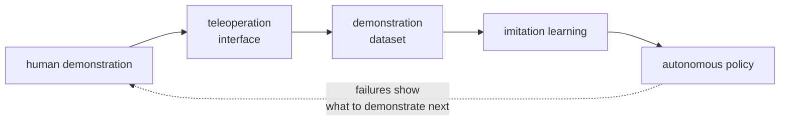
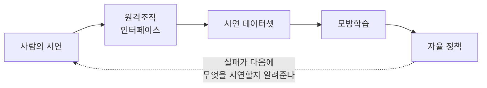

> [!abstract] Depth target · 깊이 목표
> **Mastery** — enough to defend a collection design: which architecture, which action space,
> what the interface records and what it throws away, and why the corpus supports the claim.
> **Mastery** — 수집 설계를 방어할 수 있을 만큼: 어떤 아키텍처, 어떤 행동 공간, 인터페이스가
> 무엇을 기록하고 무엇을 버리는지, 그리고 그 코퍼스가 왜 주장을 뒷받침하는지.

> [!note] Prerequisites · 선수 지식
> You need **P3** from [[02-foundations/lab-plants|0.6 Lab Plants]], the Jacobian and $\tau = J^\top\mathcal{F}$ ([[04-robotics/modern-robotics/ch05-velocity-kinematics|MR ch.5]]), the frequency response — a sinusoid through a linear time-invariant system comes out multiplied by one complex number, whose magnitude is a gain and whose angle is a phase, which is all an impedance $Z(j\omega)$ is ([[02-foundations/signal-processing|6. Signal Processing §3]]) — impedance versus admittance ([[04-robotics/contact-force-tactile|Contact, Force & Tactile §5]]), and feedback stability with delay ([[04-robotics/control-theory-ce397|Control Theory §5.5]]).
> [[02-foundations/lab-plants|0.6 Lab Plants]]의 **P3**, 야코비안과 $\tau = J^\top\mathcal{F}$([[04-robotics/modern-robotics/ch05-velocity-kinematics|MR 5장]]), 주파수 응답([[02-foundations/signal-processing|6. 신호처리 §3]]: 선형 시불변 시스템을 지난 정현파는 복소수 하나가 곱해져 나오며 그 크기가 이득, 각이 위상이고, 임피던스 $Z(j\omega)$가 바로 그것이다), 임피던스와 어드미턴스의 구분([[04-robotics/contact-force-tactile|접촉·힘·촉각 §5]]), 지연이 있는 피드백의 안정성([[04-robotics/control-theory-ce397|제어 이론 §5.5]])이 필요하다.

## English

*Group H, and one of the three pages this track raises to Mastery. Stands on [[04-robotics/contact-force-tactile|9. Contact]], [[04-robotics/control-theory-ce397|5]], [[02-foundations/signal-processing|6. Signal Processing]] and the [[04-robotics/modern-robotics/index|MR chapters]].
It reads teleoperation as data generation rather than as driving, which is what makes it a research topic instead of an interface one.*

> [!note] First pass · 처음이라면
> Read the picture, then §1 (the reframing that makes this a research topic rather than an interface one), §2–§3 (the two-port, transparency, passivity, wave variables and the latency budget — the definitions every later number runs on), §5 (the two scalings) and §6 (what good demonstration data is). Then work the Worked case, which sits after §9 and puts the frozen rig through all of them. §4 and §4.5 (interfaces and what they record), §7 (construction) and §8–§9 (reading a paper, the path to Mastery) are second-pass.

> [!tip] Device-and-human companion track · 장치·사람 보충 트랙
> This page treats teleoperation chiefly as a research and data-collection system. For the physical device, sampled virtual-contact stability, human touch, tactile displays, and study design, use [[04-robotics/haptics-teleoperation/index|24. Haptics & Teleoperation]]. Its [[04-robotics/haptics-teleoperation/bilateral-teleoperation|bilateral teleoperation]] page comes later in study order and takes the two-port model that §2–3 define here further; read it alongside only if you want more than this page gives.
>
> 이 페이지는 원격조작을 주로 연구·데이터 수집 시스템으로 다룬다. 물리 장치, 샘플링된 가상 접촉의 안정성, 인간 촉각, 촉각 디스플레이, 실험 설계는 [[04-robotics/haptics-teleoperation/index|24. Haptics & Teleoperation]]에서 공부한다. 그중 [[04-robotics/haptics-teleoperation/bilateral-teleoperation|양방향 원격조작]] 페이지는 학습 순서상 뒤에 오며, §2–3이 여기서 정의하는 two-port 모델을 더 깊이 다룬다. 이 페이지가 주는 것 이상이 필요할 때만 함께 읽어라.

### Running object · 이 페이지의 대상

Two copies of **P3** from [[02-foundations/lab-plants|0.6 Lab Plants]] — one leader, one follower — with a channel between them and a task at the far end. P3's catalog numbers are used unchanged: $m = 0.04\ \mathrm{kg}$, $b = 0.8\ \mathrm{N\cdot s/m}$, $k_h = 400\ \mathrm{N/m}$, $b_h = 8\ \mathrm{N\cdot s/m}$, capstan $r_m = 0.010$, $r_s = 0.050\ \mathrm{m}$, encoder $N = 1024$ counts/rev. (§4.5's worked example deliberately borrows a *different* capstan device from [[06-research-practice/psychophysics-human-measurement|8. Psychophysics §3]]; when a ratio is quoted below, it is P3's $R = r_s/r_m = 5$.)

Five things this page needs and 0.6 does not supply, frozen here:

| Addition | Value |
|---|---|
| **the channel** | a round-trip budget of $150\ \mathrm{ms}$, itemised in ten terms in the picture's bottom bar and in Step 5 of the Worked case — the same $150\ \mathrm{ms}$ §3's worked example uses |
| **the environment** | $k_e = 10^4\ \mathrm{N/m}$: a rigid wall met through a compliant mount, so the mount's yield sets the contact stiffness — $0.1\ \mathrm{mm}$ per newton, where a bare tool on steel would be about $10^5\ \mathrm{N/m}$. It is the wall of [[04-robotics/contact-force-tactile\|9. Contact §6]], frozen here with that number |
| **the operator** | advances at $v = 50\ \mathrm{mm/s}$; for the energy argument, oscillates at amplitude $A = 2\ \mathrm{mm}$ and $f = 2\ \mathrm{Hz}$ |
| **the scalings** | motion $s = 10$, force $s_f = 1$ — the default of a rig where nobody chose the second ratio |
| **the corpus log** | one session: $120$ attempts, $96$ task-successful, $8$ of those discarded for dropout or clipped force, $4.0$ h wall clock. The task has two valid approaches, $-60$ and $+60\ \mathrm{mm}$ of lateral offset into a slot of half-width $10\ \mathrm{mm}$; the successes split $58$ / $38$. Eleven usable episodes contain an off-nominal excursion beyond $10\ \mathrm{mm}$ and a return. |

*Scope: this page teaches teleoperation as an instrument for making data — the two-port description of what the operator feels, why delay breaks the passivity argument and what repairs it, what the mapping and the scalings commit the data to, what the loop's latency budget costs at contact, and which statistics of a corpus support a policy claim. It does not teach controller synthesis for bilateral systems, nor the sampled-data stability of a rendered virtual wall, which is [[04-robotics/haptics-teleoperation/rendering-sampling-stability|24.4]]'s Euler lab and is not to be rebuilt here.*

### The picture · 그림으로 먼저 보기

<svg viewBox="0 0 560 592" style="max-width:100%;height:auto" role="img" aria-label="Three panels. Top: the two-port chain from the human port through the P3 leader, a channel that delays both rows by 50 ms, and the P3 follower to the environment port, with h11 at the human port, h22 at the environment port, h21 on the motion row, h12 on the force row, and Z_t = 0.8 + Z_e written beside the human port. Middle: force against displacement over one 2 Hz cycle at 2 mm amplitude on a 400 N/m spring; with no delay a straight line, with 50 ms of delay a clockwise ellipse whose 2.955 mJ area is energy into the leader, beside a 0.126 mJ rectangle for what the damper removes, to the same scale. Bottom: the 150 ms round-trip budget as ten segments with the two 55 ms network terms shaded more heavily, and the 40 ms allowance bar beneath it at the same scale.">
  <defs><marker id="arTD" viewBox="0 0 10 10" refX="8" refY="5" markerWidth="5" markerHeight="5" orient="auto"><path d="M 0 0 L 10 5 L 0 10 z" fill="currentColor"/></marker></defs>
  <text x="12" y="18" font-size="12" opacity="0.9" font-weight="600">Top — the two-port chain: four h entries, the one-way delay on both rows</text>
  <g fill="currentColor"><circle cx="36" cy="80" r="6"/><circle cx="524" cy="80" r="6"/></g>
  <g fill="currentColor" fill-opacity="0.10" stroke="currentColor" stroke-opacity="0.65" stroke-width="1"><rect x="62" y="58" width="92" height="44" rx="3"/><rect x="406" y="58" width="92" height="44" rx="3"/></g>
  <g fill="currentColor" fill-opacity="0.06" stroke="currentColor" stroke-opacity="0.55" stroke-width="1" stroke-dasharray="4 3"><rect x="228" y="50" width="104" height="60" rx="3"/></g>
  <g stroke="currentColor" stroke-width="1.2" opacity="0.7"><line x1="42" y1="80" x2="62" y2="80"/><line x1="498" y1="80" x2="518" y2="80"/></g>
  <g stroke="currentColor" stroke-width="1.3" fill="none" opacity="0.85" marker-end="url(#arTD)"><line x1="158" y1="70" x2="402" y2="70"/><line x1="402" y1="92" x2="158" y2="92"/></g>
  <text x="108" y="84" text-anchor="middle">leader, P3</text>
  <text x="452" y="84" text-anchor="middle">follower, P3</text>
  <text x="280" y="64" text-anchor="middle">T<tspan font-size="7.9" dy="3">d</tspan> <tspan dy="-3">= 50 ms</tspan></text>
  <text x="280" y="106" text-anchor="middle">T<tspan font-size="7.9" dy="3">d</tspan> <tspan dy="-3">= 50 ms</tspan></text>
  <text x="280" y="122" text-anchor="middle" opacity="0.75">channel</text>
  <text x="193" y="64" text-anchor="middle">h<tspan font-size="7.9" dy="3">21</tspan> <tspan dy="-3">motion</tspan></text>
  <text x="367" y="106" text-anchor="middle">h<tspan font-size="7.9" dy="3">12</tspan> <tspan dy="-3">force</tspan></text>
  <text x="12" y="46">h<tspan font-size="7.9" dy="3">11</tspan> <tspan dy="-3">= 0.8</tspan></text>
  <text x="548" y="46" text-anchor="end">h<tspan font-size="7.9" dy="3">22</tspan> <tspan dy="-3">= 0</tspan></text>
  <text x="12" y="122" opacity="0.8">human port</text>
  <text x="548" y="122" text-anchor="end" opacity="0.8">environment port</text>
  <text x="12" y="142" font-size="11.5">Z<tspan font-size="8.3" dy="3">t</tspan> <tspan dy="-3">= h</tspan><tspan font-size="8.3" dy="3">11</tspan> <tspan dy="-3">− h</tspan><tspan font-size="8.3" dy="3">12</tspan><tspan dy="-3">h</tspan><tspan font-size="8.3" dy="3">21</tspan><tspan dy="-3">Z</tspan><tspan font-size="8.3" dy="3">e</tspan> <tspan dy="-3">/ (1 + h</tspan><tspan font-size="8.3" dy="3">22</tspan><tspan dy="-3">Z</tspan><tspan font-size="8.3" dy="3">e</tspan><tspan dy="-3">)</tspan></text>
  <text x="26" y="159" font-size="11.5">= 0.8 − (1)(−1)Z<tspan font-size="8.3" dy="3">e</tspan> <tspan dy="-3">/ (1 + 0·Z</tspan><tspan font-size="8.3" dy="3">e</tspan><tspan dy="-3">) = 0.8 + Z</tspan><tspan font-size="8.3" dy="3">e</tspan></text>
  <text x="318" y="142" opacity="0.8">P3 leader, the rest ideal:</text>
  <text x="318" y="157" opacity="0.8">h<tspan font-size="7.9" dy="3">11</tspan> <tspan dy="-3">= b = 0.8 N·s/m, h</tspan><tspan font-size="7.9" dy="3">12</tspan><tspan dy="-3">h</tspan><tspan font-size="7.9" dy="3">21</tspan> <tspan dy="-3">= −1, h</tspan><tspan font-size="7.9" dy="3">22</tspan> <tspan dy="-3">= 0</tspan></text>
  <g stroke="currentColor" stroke-width="0.8" opacity="0.3"><line x1="12" y1="172" x2="548" y2="172"/></g>
  <text x="12" y="191" font-size="12" opacity="0.9" font-weight="600">Middle — one cycle: A = 2 mm, f = 2 Hz, k = 400 N/m, T<tspan font-size="8.6" dy="3">d</tspan> <tspan dy="-3">= 50 ms</tspan></text>
  <g stroke="currentColor" stroke-width="1" opacity="0.55"><line x1="36" y1="292" x2="276" y2="292"/><line x1="156" y1="206.5" x2="156" y2="377.5"/></g>
  <g stroke="currentColor" stroke-width="1" opacity="0.55"><line x1="60" y1="289" x2="60" y2="295"/><line x1="252" y1="289" x2="252" y2="295"/><line x1="153" y1="364" x2="159" y2="364"/><line x1="153" y1="220" x2="159" y2="220"/></g>
  <text x="60" y="306" text-anchor="middle" opacity="0.8">−2</text>
  <text x="252" y="306" text-anchor="middle" opacity="0.8">2</text>
  <text x="162" y="224" opacity="0.8">0.8</text>
  <text x="150" y="368" text-anchor="end" opacity="0.8">−0.8</text>
  <text x="276" y="286" text-anchor="end" opacity="0.8">x (mm)</text>
  <text x="150" y="214.5" text-anchor="end" opacity="0.8">F (N)</text>
  <g stroke="currentColor" stroke-width="1.3" stroke-dasharray="5 3" opacity="0.75"><line x1="60" y1="220" x2="252" y2="364"/></g>
  <path d="M156 249.7 L162.3 253.6 L168.5 257.6 L174.7 261.9 L180.8 266.2 L186.9 270.6 L192.7 275.2 L198.5 279.8 L204 284.5 L209.3 289.2 L214.4 293.9 L219.3 298.6 L223.9 303.3 L228.2 307.9 L232.2 312.4 L235.8 316.9 L239.1 321.3 L242.1 325.5 L244.7 329.6 L246.9 333.6 L248.7 337.3 L250.2 340.9 L251.2 344.2 L251.8 347.4 L252 350.2 L251.8 352.9 L251.2 355.3 L250.2 357.4 L248.7 359.2 L246.9 360.8 L244.7 362 L242.1 363 L239.1 363.6 L235.8 363.9 L232.2 364 L228.2 363.7 L223.9 363.1 L219.3 362.2 L214.4 361 L209.3 359.5 L204 357.8 L198.5 355.7 L192.7 353.4 L186.9 350.8 L180.8 348 L174.7 344.9 L168.5 341.6 L162.3 338 L156 334.3 L149.7 330.4 L143.5 326.4 L137.3 322.1 L131.2 317.8 L125.1 313.4 L119.3 308.8 L113.5 304.2 L108 299.5 L102.7 294.8 L97.6 290.1 L92.7 285.4 L88.1 280.7 L83.8 276.1 L79.8 271.6 L76.2 267.1 L72.9 262.7 L69.9 258.5 L67.3 254.4 L65.1 250.4 L63.3 246.7 L61.8 243.1 L60.8 239.8 L60.2 236.6 L60 233.8 L60.2 231.1 L60.8 228.7 L61.8 226.6 L63.3 224.8 L65.1 223.2 L67.3 222 L69.9 221 L72.9 220.4 L76.2 220.1 L79.8 220 L83.8 220.3 L88.1 220.9 L92.7 221.8 L97.6 223 L102.7 224.5 L108 226.2 L113.5 228.3 L119.3 230.6 L125.1 233.2 L131.2 236 L137.3 239.1 L143.5 242.4 L149.7 246 Z" fill="currentColor" fill-opacity="0.16" stroke="currentColor" stroke-width="1.5" stroke-opacity="0.9"/>
  <g stroke="currentColor" stroke-width="1.6" opacity="0.95" marker-end="url(#arTD)"><line x1="86.5" y1="219.5" x2="104.7" y2="225.1"/><line x1="225.5" y1="364.5" x2="207.3" y2="358.9"/></g>
  <g stroke="currentColor" stroke-width="1.3" stroke-dasharray="5 3" opacity="0.75"><line x1="300" y1="211" x2="318" y2="211"/></g>
  <text x="324" y="215">no delay: F = −kx, a line, zero area</text>
  <rect x="300" y="225" width="18" height="10" rx="2" fill="currentColor" fill-opacity="0.16" stroke="currentColor" stroke-width="1.2" stroke-opacity="0.9"/>
  <text x="324" y="234">50 ms delay: an ellipse, ωT<tspan font-size="7.9" dy="3">d</tspan> <tspan dy="-3">= 36°</tspan></text>
  <text x="324" y="250">traced clockwise, so ∮F dx &gt; 0</text>
  <text x="324" y="274">shaded area = πkA<tspan font-size="7.9" dy="-4">2</tspan> <tspan dy="4">sin ωT</tspan><tspan font-size="7.9" dy="3">d</tspan></text>
  <text x="324" y="290" font-weight="600">= 2.955 mJ per cycle into the leader</text>
  <rect x="300" y="318" width="24" height="22.7" fill="currentColor" fill-opacity="0.45" stroke="currentColor" stroke-width="1" stroke-opacity="0.9"/>
  <text x="332" y="327">damper removes πbA<tspan font-size="7.9" dy="-4">2</tspan><tspan dy="4">ω</tspan></text>
  <text x="332" y="342">= 0.126 mJ, 23.4 times less</text>
  <text x="300" y="362" opacity="0.75">rectangle and ellipse at one scale</text>
  <g stroke="currentColor" stroke-width="0.8" opacity="0.3"><line x1="12" y1="392" x2="548" y2="392"/></g>
  <text x="12" y="411" font-size="12" opacity="0.9" font-weight="600">Bottom — the budget as a bar: ten terms, 150 ms, against 40 ms allowed</text>
  <g fill="currentColor" stroke="currentColor" stroke-width="0.8" stroke-opacity="0.7"><rect x="20" y="450" width="6.9" height="20" fill-opacity="0.10"/><rect x="26.9" y="450" width="10.4" height="20" fill-opacity="0.10"/><rect x="37.3" y="450" width="190.7" height="20" fill-opacity="0.42"/><rect x="228" y="450" width="6.9" height="20" fill-opacity="0.10"/><rect x="234.9" y="450" width="27.7" height="20" fill-opacity="0.10"/><rect x="262.7" y="450" width="17.3" height="20" fill-opacity="0.10"/><rect x="280" y="450" width="10.4" height="20" fill-opacity="0.10"/><rect x="290.4" y="450" width="190.7" height="20" fill-opacity="0.42"/><rect x="481.1" y="450" width="6.9" height="20" fill-opacity="0.10"/><rect x="488" y="450" width="52" height="20" fill-opacity="0.10"/></g>
  <text x="132.7" y="464" text-anchor="middle" font-weight="600">network → 55 ms</text>
  <text x="385.7" y="464" text-anchor="middle" font-weight="600">network ← 55 ms</text>
  <text x="14" y="440">sample 2</text>
  <text x="226" y="440" text-anchor="middle">decode 2</text>
  <text x="300" y="440" text-anchor="middle">force sense 5</text>
  <text x="466" y="440" text-anchor="middle">decode 2</text>
  <text x="40" y="490">encode 3</text>
  <text x="240" y="490" text-anchor="middle">actuator 8</text>
  <text x="306" y="490" text-anchor="middle">encode 3</text>
  <text x="546" y="490" text-anchor="end">amplifier 15</text>
  <g stroke="currentColor" stroke-width="0.8" opacity="0.55"><line x1="32" y1="443" x2="23.5" y2="450"/><line x1="226" y1="443" x2="231.5" y2="450"/><line x1="300" y1="443" x2="271.3" y2="450"/><line x1="466" y1="443" x2="484.5" y2="450"/><line x1="32.1" y1="470" x2="58" y2="480"/><line x1="248.8" y1="470" x2="240" y2="480"/><line x1="285.2" y1="470" x2="306" y2="480"/><line x1="514" y1="470" x2="524" y2="480"/></g>
  <rect x="20" y="504" width="138.7" height="16" fill="currentColor" fill-opacity="0.28" stroke="currentColor" stroke-width="0.9" stroke-opacity="0.8"/>
  <g stroke="currentColor" stroke-width="1" stroke-dasharray="3 3" opacity="0.7"><line x1="158.7" y1="470" x2="158.7" y2="504"/></g>
  <text x="166.7" y="516">allowance F<tspan font-size="7.9" dy="3">max</tspan><tspan dy="-3">/(k</tspan><tspan font-size="7.9" dy="3">e</tspan> <tspan dy="-3">v) = 20/(10</tspan><tspan font-size="7.9" dy="-4">4</tspan><tspan dy="4">·0.050) = 40 ms</tspan></text>
  <text x="20" y="533" text-anchor="middle" opacity="0.75">0</text>
  <text x="158.7" y="533" text-anchor="middle" opacity="0.75">40 ms</text>
  <text x="540" y="426" text-anchor="end" opacity="0.75">150 ms</text>
  <g stroke="currentColor" stroke-width="0.8" opacity="0.55"><line x1="540" y1="430" x2="540" y2="450"/></g>
  <text x="12" y="563" opacity="0.9">Heavier shading: the two network terms, 110 ms of 150 (73.3%). Delete both and 40 ms remain,</text>
  <text x="12" y="578" opacity="0.9">exactly the allowance with no margin: the rig is over budget by 150/40 = 3.75 times.</text>
</svg>

Top: the two P3 handles as a two-port chain, with $h_{11}=b=0.8\ \mathrm{N\cdot s/m}$ at the human port, $h_{22}=0$ at the environment port, $h_{21}$ on the motion row and $h_{12}$ on the force row ($h_{12}h_{21}=-1$), a $50\ \mathrm{ms}$ delay on both rows, and the transmitted impedance $Z_t=0.8+Z_e$ beside the human port. Middle: one $2\ \mathrm{Hz}$ cycle of $2\ \mathrm{mm}$ amplitude on the $400\ \mathrm{N/m}$ spring — a straight line with no delay, and with $50\ \mathrm{ms}$ a clockwise ellipse ($\omega T_d=36^\circ$) whose area, $2.955\ \mathrm{mJ}$, is energy pushed into the leader every cycle, $23.4$ times the $0.126\ \mathrm{mJ}$ the damper removes, both to one scale. Bottom: the $150\ \mathrm{ms}$ round-trip budget in ten terms, $110\ \mathrm{ms}$ of it the two network legs, against the $40\ \mathrm{ms}$ allowance at $F_{\max}=20\ \mathrm{N}$ — over budget $3.75$ times, and even with both network terms deleted, exactly at the allowance with no margin.

### 1. Teleoperation is a data-generation tool

The old reading of teleoperation is "driving a robot from a distance", and it is still
true — but it is no longer the interesting part. In modern robot learning the loop is:

Under this reading, a teleoperation system is not judged by how well a human can drive
the robot. It is judged by **the quality, quantity, and cost of the data it produces**,
and by whether a policy trained on that data works when the human lets go. Those are
different objectives, and they sometimes conflict: an interface that gives the operator
beautiful force feedback but takes ten minutes to set up per session will lose to a cruder
one that collects a thousand episodes a day.

This is also the entry point where prior XR and interface work transfers directly: hand
tracking, pose estimation, and latency budgets are the same problems wearing robot clothes.

### 2. Architectures — unilateral, bilateral, and what "transparency" means

The two devices are the **leader** (what the human moves; historically "master") and the
**follower** ("slave"). Two architectures:

- **Unilateral**: motion flows from leader to follower; nothing comes back except what the
  operator can see. The operator is blind to contact force.
- **Bilateral**: force flows back from the follower to the leader, so the operator feels
  the environment. This is what makes insertion and fitting teleoperable — and it is what
  can go unstable.

A stability note on the unilateral case: removing the remote force-feedback loop reduces
channel-induced instability risk. It does not guarantee that every local controller is stable.

Model the whole system as a **two-port network**: one port faces the human, one faces the
environment, and each port has a velocity and a force.

> **Two-port model, defined.** A **two-port model** is a *description of a system that exchanges power at exactly two places*, as one $2\times2$ matrix relating the four port variables. It is not a block diagram, not a controller and not a stability test. Three defining conditions. There are exactly **two ports**, each carrying a force and a velocity whose product is the power crossing it — so the model says nothing about a third interaction, and a gripper resting on a table is outside it. The relation is **linear and time-invariant**, hence written in the frequency domain ([[02-foundations/signal-processing|6. Signal Processing §1]]), so a paper reporting it has linearised somewhere and should say where. And the **choice of which two variables are inputs is a convention**: the *hybrid* form below takes the human's velocity and the environment's force, and the four entries only mean what they are said to mean under that choice.
>
> $$\begin{bmatrix}F_h\\[2pt] -\dot x_e\end{bmatrix} = \begin{bmatrix}h_{11} & h_{12}\\[2pt] h_{21} & h_{22}\end{bmatrix}\begin{bmatrix}\dot x_h\\[2pt] F_e\end{bmatrix}$$
>
> where $F_h, \dot x_h$ are the force and velocity at the human port and $F_e, \dot x_e$ at the environment port — so $h_{11}$ is the impedance the operator feels with the follower in free space, $h_{22}$ the admittance the environment sees while the operator holds still, and $h_{12}, h_{21}$ the two transmissions, force back and motion forward.
>
> - **Example**: the ideal teleoperator, $h_{11} = h_{22} = 0$ and $h_{12} = -h_{21} = 1$. Nothing is felt in free space, the environment is driven by the operator alone, and both transmissions are unity.
> - **Non-example**: a one-port impedance $Z(s) = F/\dot x$ for the leader device. It is a complete description of what the hand touches and it cannot express any relationship to what the follower touches, which is the entire subject.
> - **Why it matters**: Lawrence's four channels are four signals sent across the link, and the four $h$ entries are what those signals set. Every claim in §2–§3 — transparency, the stability tradeoff, what delay costs — is a claim about one or two of these four numbers, and a paper that will not write them down is not comparable to one that will.

<svg viewBox="0 0 560 212" style="max-width:100%;height:auto" role="img" aria-label="a two-port bilateral teleoperation chain from the human port through leader, delayed channel, and follower to the environment port">
  <g fill="currentColor">
    <rect x="104" y="64" width="94" height="46" rx="3" fill-opacity="0.10"/>
    <rect x="232" y="64" width="110" height="46" rx="3" fill-opacity="0.20"/>
    <rect x="376" y="64" width="94" height="46" rx="3" fill-opacity="0.10"/>
    <circle cx="70" cy="87" r="6"/><circle cx="504" cy="87" r="6"/>
  </g>
  <g stroke="currentColor" stroke-width="1" fill="none" opacity="0.65">
    <rect x="104" y="64" width="94" height="46" rx="3"/><rect x="232" y="64" width="110" height="46" rx="3"/><rect x="376" y="64" width="94" height="46" rx="3"/>
  </g>
  <g stroke="currentColor" stroke-width="1.3" fill="none" opacity="0.85" marker-end="url(#arT)">
    <line x1="78" y1="79" x2="100" y2="79"/><line x1="202" y1="79" x2="228" y2="79"/><line x1="346" y1="79" x2="372" y2="79"/><line x1="474" y1="79" x2="496" y2="79"/>
    <line x1="100" y1="97" x2="78" y2="97"/><line x1="228" y1="97" x2="202" y2="97"/><line x1="372" y1="97" x2="346" y2="97"/><line x1="496" y1="97" x2="474" y2="97"/>
  </g>
  <defs><marker id="arT" viewBox="0 0 10 10" refX="8" refY="5" markerWidth="5" markerHeight="5" orient="auto"><path d="M 0 0 L 10 5 L 0 10 z" fill="currentColor"/></marker></defs>
  <g font-size="11" fill="currentColor" text-anchor="middle">
    <text x="151" y="84">leader device</text><text x="151" y="99" font-size="9.5" opacity="0.75">the human moves it</text>
    <text x="287" y="84">communication</text><text x="287" y="99" font-size="9.5" opacity="0.75">delay T each way</text>
    <text x="423" y="84">follower robot</text><text x="423" y="99" font-size="9.5" opacity="0.75">it touches the world</text>
    <text x="70" y="132" font-size="10">human port</text><text x="504" y="132" font-size="10">environment port</text>
  </g>
  <g font-size="10.5" fill="currentColor" opacity="0.85">
    <text x="104" y="152">top row: motion command &#8594;&#160;&#160;&#160;bottom row: force feedback &#8592;</text>
  </g>
  <g font-size="11" fill="currentColor" opacity="0.9">
    <text x="20" y="180">The delay sits in BOTH rows. Force that arrives late is force applied to a situation that has already</text>
    <text x="20" y="196">changed &#8212; which is how a loop built only out of springs and masses starts producing energy.</text>
  </g>
</svg>

**Transparency** is the ideal: the impedance the operator feels equals the impedance of the
environment the follower touches. Push the follower into concrete and the leader should
feel concrete; move it through air and the leader should feel nothing. Perfect transparency
means the operator's hand and the follower's tool are, mechanically, the same object.

> **Transparency, defined.** **Transparency** is a *comparison of two impedances* — the transmitted impedance $Z_t$ the operator feels against the environment impedance $Z_e$ the follower touches. It is a relation, not a score, and three conditions pin it down. It is a statement for **all** $Z_e$ in a declared range, including $Z_e = 0$; a device that renders one wall correctly is not transparent. It is **frequency-dependent**, so it is a curve and any single number is a value at a frequency that must be named. And it is about the **transmitted impedance**, not about position tracking: a system can track the leader's position perfectly and still render the wrong world.
>
> $$Z_t = \frac{F_h}{\dot x_h} = h_{11} - \frac{h_{12}h_{21}\,Z_e}{1 + h_{22}Z_e}, \qquad Z_t = Z_e\ \ \forall Z_e \iff h_{11} = 0,\ h_{22} = 0,\ h_{12}h_{21} = -1$$
>
> obtained by eliminating the environment port: put $F_e = Z_e\dot x_e$ into the second row, $-\dot x_e = h_{21}\dot x_h + h_{22}Z_e\dot x_e$, so $\dot x_e = -h_{21}\dot x_h/(1 + h_{22}Z_e)$, and substitute that into the first row, $F_h = h_{11}\dot x_h + h_{12}F_e$. So perfect transparency is three conditions on the matrix and not a gain to be turned up. Step 1 of the Worked case, after §9, puts three devices through it.
>
> - **Example**: the P3 leader with its own damping in $h_{11}$, $Z_t = 0.8 + Z_e$. The error is a fixed $0.8\ \mathrm{N\cdot s/m}$ — $0.10\%$ of the $10^4\ \mathrm{N/m}$ wall's $795.8\ \mathrm{N\cdot s/m}$ at $2\ \mathrm{Hz}$ and *infinite* in free space, which is why transparency is worst exactly where there is nothing to feel.
> - **Non-example**: halving the force-feedback gain, $h_{12}h_{21} = -0.5$. Then $Z_t = 0.5\,Z_e$ at every stiffness: every wall is half as stiff, consistently, and nothing in the operator's experience flags it. Perfect tracking, perfectly wrong world. A second non-example worth knowing is $h_{22} \ne 0$, which **saturates** — a follower that yields like a $2000\ \mathrm{N/m}$ spring, $h_{22} = j\omega/2000$, puts that spring in series with every wall, so no wall renders stiffer than $2\ \mathrm{kN/m}$ and concrete and drywall become the same object.
> - **Why it matters**: the field's central tradeoff, named next, is a tradeoff between these three conditions and stability margin, so "transparent" without the $h$ entries or a $Z_t$ curve is a word rather than a result — and, per §8, a paper that reports its delay but not the stiffness it rendered has reported half of one.

Lawrence's four-channel analysis (1993) — "four channels" because position/velocity and force
each cross the link in both directions, four signals in all
([[04-robotics/haptics-teleoperation/bilateral-teleoperation|24.5 Bilateral teleoperation §2]]) — is where this became a design objective rather
than an intuition, and it also names **the fundamental tradeoff of the field**: transparency
and robust stability pull against each other. Everything that makes the coupling more faithful — higher force gains,
stiffer leader, less filtering — also makes the closed loop more willing to oscillate,
especially against a stiff environment. A bilateral controller is a chosen point on that
compromise, and a paper that reports only one of the two is reporting half its result.

### 3. Why delay is not just "slower" — passivity

Delay is the reason this field has its own theory rather than borrowing control theory
wholesale. The system is a chain of springs, masses, and dampers, all of which are
**passive**: they cannot deliver more energy than they initially stored plus what enters
through their ports. Connecting passive parts keeps the whole passive, which gives a route to
stability. That holds under compatible interconnection and well-posedness assumptions.
Passivity alone does not automatically mean asymptotic convergence or good performance.

> **Passivity, defined.** **Passivity** is a *property of a system with a power port*: an inequality that must hold at every instant and for every admissible input. It is not stability, not convergence and not a performance guarantee — a passive system can oscillate forever. Three defining conditions. There is a **storage function** $E \ge 0$, bounded below, which is what "energy" means here and need not be physical energy. The inequality holds for **all** trajectories, not typical ones, which is why the property survives interconnection at all. And the **sign convention at the port** is fixed in advance, since flipping it flips the claim.
>
> $$\int_0^{t} F(\tau)\,\dot x(\tau)\,\mathrm{d}\tau \;\ge\; E(t) - E(0) \qquad \text{for all } t \ge 0, \quad E(\cdot) \ge 0$$
>
> where $F\dot x$ is the power entering the port — so the system may store what comes in and may dissipate it, and may never return more than it received.
>
> - **Example**: P3's damper, $F = b\dot x$. The integral is $b\!\int\!\dot x^2 \ge 0$ with $E \equiv 0$: it dissipates and stores nothing.
> - **Non-example, with a number**: a **delayed** spring, $F = -k\,x(t - T_d)$. Over one cycle of $x = A\sin\omega t$ it delivers $W_{\text{cycle}} = \pi k A^2\sin(\omega T_d)$, which is strictly positive for $0 < \omega T_d < \pi$. At P3's $k_w = 400\ \mathrm{N/m}$ with $A = 2\ \mathrm{mm}$ at $2\ \mathrm{Hz}$ and $T_d = 50\ \mathrm{ms}$, that is $2.955\ \mathrm{mJ}$ per cycle — $5.91\ \mathrm{mW}$ **manufactured** by an object made of nothing but a spring and a wire. Step 2 of the Worked case, after §9, derives it and prices what the damper can pay back.
> - **Why it matters**: the argument for connecting passive parts is the only guarantee in this field that does not depend on a model of the environment, which is exactly what you do not have on a construction site. Lose it and every stability claim becomes conditional on a wall stiffness somebody assumed.

A communication delay can break that passivity argument. Force computed from a position the follower held
$T$ seconds ago is applied to a leader that has since moved somewhere else, and the product
of the two can transfer energy *into* the system. The direct interconnection loses an
arbitrary-delay passivity guarantee, and larger delay worsens the stability–transparency
tradeoff. Lower gain or bandwidth can stabilize some models at the cost of transparency,
but it is not an arbitrary-delay guarantee.

The classical repair is the **scattering transformation**, or equivalently the **wave
variables** of Niemeyer and Slotine (1991). Instead of sending velocity and force across the channel, send the
combinations — chosen so that the difference of their squares is exactly the transmitted power, which is what lets a delay be shown to store energy but never create it:

$$u = \frac{b\,\dot x + F}{\sqrt{2b}}, \qquad v = \frac{b\,\dot x - F}{\sqrt{2b}}$$

for a chosen wave impedance $b$. The power crossing the channel is then

$$P = \dot x\,F = \tfrac12\left(u^2 - v^2\right)$$

and a delayed channel that carries $u$ forward and $v$ back can only *store* the difference
between what entered and what left. To see it, let the leader side send $u_l$ and the follower
side send $v_r$, so each arrives $T$ seconds late: $u_r(t) = u_l(t-T)$ and $v_l(t) = v_r(t-T)$.
Because each squared term that leaves the channel is the same term that entered $T$ seconds
earlier, the energy the channel has absorbed telescopes to what is still in transit:

$$E(t) = \int_0^t \tfrac12\left(u_l^2 - v_l^2 - u_r^2 + v_r^2\right)d\tau = \tfrac12\int_{t-T}^{t}\left(u_l^2 + v_r^2\right)d\tau \ge 0$$

(starting from an empty channel). It cannot manufacture energy, so the channel is passive
for **any** constant delay — the stability problem is solved structurally rather than by
tuning.

> **Wave variables, defined.** **Wave variables** are an *invertible linear change of coordinates on a power port*, parameterised by one chosen constant. They are not a controller, not a filter and not an approximation. Three defining conditions. The map is **invertible**, so the transform itself discards nothing — whatever is lost is lost later, in the channel. The **wave impedance** $b > 0$, in $\mathrm{N\cdot s/m}$, is a free design constant and part of the result. And the **power identity** must hold exactly, $\dot x F = \tfrac12(u^2 - v^2)$; a transform that only approximately preserves power gives only an approximate guarantee, which is no guarantee at all.
>
> $$u = \frac{b\dot x + F}{\sqrt{2b}}, \quad v = \frac{b\dot x - F}{\sqrt{2b}} \qquad\Longleftrightarrow\qquad \dot x = \frac{u + v}{\sqrt{2b}}, \quad F = \sqrt{\tfrac{b}{2}}\,(u - v)$$
>
> where $u$ is the wave leaving toward the follower and $v$ the wave returning — so a delay line that carries each one forward unchanged can only hold the difference between what entered and what left, which is the telescoping integral above.
>
> - **Example**: at $\dot x = 0.05\ \mathrm{m/s}$ and $F = 2\ \mathrm{N}$ with $b = 0.8$, $u = 1.613$ and $v = -1.550$, and $\tfrac12(u^2 - v^2) = 0.100\ \mathrm{W}$, which is $\dot x F$ exactly. A $50\ \mathrm{ms}$ channel is then holding $\tfrac12(u^2 + v^2)T_d = 0.125\ \mathrm{J}$ at that operating point and can return no more.
> - **Non-example**: low-pass filtering the returned force. It also reduces the energy the channel can inject, and it is not a wave transform: it is not invertible, the power identity fails, and there is no delay for which it yields a guarantee rather than a tuning.
> - **Why it matters**: the guarantee is structural and so is the bill. Terminating the channel in $b$ puts $b$ where $h_{11}$ should have been zero, so the operator feels $0.8\ \mathrm{N\cdot s/m}$ of damping *in free space* — the exact defect §2's transparency definition calls out. The repair for delay is paid for in the currency of transparency, which is the next paragraph stated as an entry in a matrix.

The cost is transparency: wave-variable teleoperation feels soft and drifts in position,
because the guarantee was bought by throwing away exactly the high-frequency fidelity that
made the coupling feel real. This is the tradeoff of §2 appearing again, now as a theorem
rather than a tuning knob.

> [!warning] Reading claims about delay
> "Our method is stable under delay" needs three qualifiers before it means anything: is the
> delay **constant or variable** (packet networks give variable), is it **known**, and was
> stability shown against a **stiff** environment or only against free motion? Free-motion
> stability is nearly free; contact stability is the claim.

The first of those three qualifiers is usually answered with one number, and one number is
not what the quantity is.

> **Teleoperation latency budget, defined.** A **latency budget** is an *additive decomposition of one loop's round-trip time into named, separately measurable terms*, set against an allowance derived from the task. It is a design artefact, not a measurement, and not the number a ping returns. Three defining conditions. **Every element on the loop appears exactly once, in both directions** — sensing, encoding, transport, decoding, computation, actuation, and the device's own mechanical rise, forward and back. Each term is an **upper bound**, so the sum is conservative and a budget that is met is met. And it is stated **against an allowance** that comes from the task's own tolerance, not from how the rig feels.
>
> $$T_{\text{rt}} = \sum_i T_i \;\ge\; 2\,T_{\text{net}}, \qquad\text{allowance}\quad T_{\text{rt}} \le \frac{F_{\max}}{k_e\,v}$$
>
> where $T_i$ are the named terms, $T_{\text{net}}$ the one-way transport time, $F_{\max}$ the largest contact force the part or tool may see, $k_e$ the environment stiffness and $v$ the operator's approach speed — because the operator keeps advancing for a whole round trip before any resistance arrives, so the commanded penetration is $vT_{\text{rt}}$ and the force it asks for is $k_e v T_{\text{rt}}$.
>
> - **Example**: the ten terms of the picture's bottom bar (tabulated in Step 5 of the Worked case), summing to $150\ \mathrm{ms}$, against an allowance of $20/(10^4\times 0.050) = 40\ \mathrm{ms}$ — over by $3.75\times$, and not closable by networking alone, since deleting both transport terms leaves exactly $40\ \mathrm{ms}$ and no margin.
> - **Non-example**: "our latency is $110\ \mathrm{ms}$", the round-trip ping. It is $73.3\%$ of that budget and omits $40\ \mathrm{ms}$ — $2.0\ \mathrm{mm}$ of extra commanded penetration at $50\ \mathrm{mm/s}$ and $20\ \mathrm{N}$ against this wall, which is the entire force allowance, hidden in the terms that were not counted.
> - **Why it matters**: it converts "is the delay acceptable?" into arithmetic with a task-derived right-hand side, and it identifies which term to attack. A budget dominated by transport is a networking problem; one dominated by the device's own rise time, as a $15\ \mathrm{ms}$ amplifier would be on a short link, is a hardware problem that no network will fix.

> [!example] Worked example · 계산 예제
> **What 150 ms of round trip does on contact.** The operator moves the master at 50 mm/s and
> the tool meets a wall. The contact force cannot reach the operator's hand for a full round
> trip, so they keep advancing for $0.150$ s: $50 \times 0.150 = \mathbf{7.5}$ mm of commanded
> penetration before any resistance is felt.
>
> Against the Running object's compliantly mounted $10^4$ N/m wall, that
> displacement is $10^4 \times 0.0075 = 75$ N. Against a bare steel fixture as a force loop actually sees it (about $10^5$ N/m) it is
> about 750 N, and the real peak is limited by the series stiffness of follower, tool and wall and by actuator saturation — a force the tool or the part may not survive.
>
> **What the system does about it.** There are only three moves, and every bilateral
> teleoperation paper is making one of them. Lower the displayed stiffness (the operator feels
> a soft wall that is not there). Lower the speed — at 5 mm/s the same delay costs 0.75 mm and
> 7.5 N. Or give up force feedback and close the force loop locally at the slave, which is what
> a shared-control architecture is for.
>
> **The reading this gives you.** "Transparency" and "stability" are not two virtues to
> balance in the abstract; the product of delay, speed and environment stiffness is what is
> being traded, and a paper that reports its delay but not the stiffness it rendered has
> reported half of the result.

### 4. The interface spectrum

Interfaces trade off along two axes that matter for data collection: how faithfully the
human's intent reaches the robot, and how cheap it is to produce an hour of demonstrations.

<svg viewBox="0 0 560 262" style="max-width:100%;height:auto" role="img" aria-label="interfaces plotted by fidelity against cost per hour of demonstration data">
  <g stroke="currentColor" stroke-width="1.1" fill="none" opacity="0.6">
    <line x1="70" y1="192" x2="520" y2="192"/><line x1="70" y1="192" x2="70" y2="40"/>
  </g>
  <g font-size="10.5" fill="currentColor" opacity="0.8">
    <text x="70" y="212">cheap to collect</text><text x="520" y="212" text-anchor="end">expensive to collect</text>
    <text x="64" y="46" text-anchor="end">high</text><text x="64" y="190" text-anchor="end">low</text>
    <text x="16" y="120" font-size="10">fidelity</text>
  </g>
  <g fill="currentColor">
    <circle cx="112" cy="170" r="5" fill-opacity="0.55"/>
    <circle cx="188" cy="102" r="5" fill-opacity="0.55"/>
    <circle cx="262" cy="134" r="5" fill-opacity="0.55"/>
    <circle cx="356" cy="76" r="5" fill-opacity="0.55"/>
    <circle cx="466" cy="60" r="5" fill-opacity="0.55"/>
  </g>
  <g font-size="10.5" fill="currentColor">
    <text x="122" y="174">game controller / joystick</text>
    <text x="198" y="98">handheld gripper, no robot present</text>
    <text x="272" y="138">VR controller or hand tracking</text>
    <text x="348" y="80" text-anchor="end">kinematically matched leader arm</text>
    <text x="466" y="50" text-anchor="middle">haptic device or exoskeleton</text>
  </g>
  <g font-size="11" fill="currentColor" opacity="0.9">
    <text x="20" y="238">No interface wins outright. The upper right buys fidelity with money and setup time;</text>
    <text x="20" y="254">the upper left buys throughput by giving up force feedback.</text>
  </g>
</svg>

- **Game controller or joystick.** Few degrees of freedom, awkward for 6-DoF pose, but
  universally available. Fine for a mobile base, poor for dexterous manipulation.
- **VR controller or hand tracking.** Gives 6-DoF pose directly and naturally, usually with
  no force feedback. Requires retargeting (§5) because a human hand and a robot gripper do
  not share kinematics.
- **Kinematically matched leader arm.** A small replica of the follower's kinematics: the
  human backdrives it, and joint angles map across **directly, with no inverse kinematics
  and no retargeting**. This is why the approach reappeared in 3D-printed,
  off-the-shelf-motor form (GELLO, Wu et al., IROS 2024) and, via ALOHA's puppeteering rig, became the default for bimanual manipulation data.
- **Handheld gripper with no robot in the loop.** The operator carries a gripper with a
  camera and simply does the task; the robot is absent during collection. This is the Universal Manipulation
  Interface's premise — "in-the-wild robot teaching without in-the-wild robots" (Chi et al.,
  RSS 2024). Extremely cheap and collectible anywhere, at the price of an **embodiment gap** — the data must be
  transferred to a robot whose camera placement, reachable workspace, and dynamics differ.
- **Haptic device or exoskeleton.** Genuine bilateral force feedback and the highest
  fidelity available, at the highest cost per hour.

For construction, the cost axis usually decides. Field data cannot be collected in a lab,
and an interface that needs a calibrated rig is an interface that will not leave the
building.

### 4.5 What the interface records — and what it silently discards

Between the operator's intent and the logged data sits a chain of hardware conversions,
and every link either quantizes the signal or pollutes it. For a force-bearing corpus
this chain **is the instrument** — its numbers belong in the paper's method section, not
in an appendix. (The worked example after this list puts numbers on all three bullets.)

- **Position resolution.** Encoder counts become a joint angle, the transmission divides
  that angle down, and a lever arm turns it into end-point position. The transmission
  ratio $R$ *refines* position: a motor-side step of $\Delta\theta$ appears at the
  output as $\Delta\theta / R$.
- **Force floor.** The force floor is the friction the operator feels at the handle before any force is commanded; forces smaller than it are masked by that friction. The same ratio *coarsens* force. Motor friction torque $\tau_f$ is
  amplified right along with the torque you wanted: the operator feels
  $F_{floor} = \tau_f \cdot R / r_h$ at a handle of lever arm $r_h$, and every force
  the device records near a motion reversal is smeared by that stick–slip band.
- **The double role of $R$.** Raising the ratio buys peak force and position resolution;
  motor-side friction torque is reflected roughly in proportion to $R$, while motor inertia
  is reflected roughly as $R^2$ in an ideal rigid transmission. Both reduce backdrivability —
  how easily a push at the handle turns the motor backward through the transmission
  ([[04-robotics/force-compliance-control|13. Force control §2]]) — and a device that resists
  that push is what "poor backdrivability" means. The cable that lets the motor push the operator is the
  cable through which the operator must push the motor. Choosing $R$ is choosing which
  end of the corpus to corrupt. Where that $R^2$ comes from, and how it can outweigh the arm at a geared joint, is [[04-robotics/actuators-drives|10.5 Actuators & Drives §4]].

This is also the honest reading of §4's spectrum: GELLO- and ALOHA-class leader arms
record *positions only*, so the chain above never appears in their papers — and neither
does the force signal it would have carried. Whether a recorded force variation could
even have been intentional is a perceptual question, answered with the thresholds of
[[06-research-practice/psychophysics-human-measurement|8. Psychophysics §3]].

> [!example] Worked example · 계산 예제
> **The friction a transmission manufactures.** Take the 1-DoF capstan device of
> [[06-research-practice/psychophysics-human-measurement|8. Psychophysics §3]]: pulley
> $r_p = 5$ mm, sector $r_s = 75$ mm ($R = 15$), handle lever $r_h = 70$ mm, and a good
> coreless motor with friction torque $\tau_f = 0.001$ N·m.
>
> Reflected friction at the handle: $F_{floor} = 0.001 \times 15 / 0.070 \approx
> \mathbf{0.21\ N}$. At a 2 N task force the operator's own force JND (≈7%) is
> 0.14 N — **the friction band exceeds the force change the operator can
> reliably detect at that force**, so force variation recorded inside ±0.21 N near a reversal cannot be
> attributed to the demonstrator's felt intent without further evidence (and near a reversal the task force, and so the JND, is smaller still). Meanwhile the ratio is why the device works at all: a
> 20 N peak needs only $20 \times 0.070 / 15 = 0.093$ N·m of motor torque. Drop to
> direct drive ($R = 1$) and the friction floor becomes an imperceptible 0.014 N — but
> the same 20 N now demands 1.4 N·m, a motor an order of magnitude larger. There is no
> setting of $R$ that fixes both ends; there is only knowing which end your corpus can
> afford.

### 5. Retargeting and scaling — the mapping nobody mentions

Unless the leader is kinematically matched to the follower, some map from human motion to
robot command has to be chosen, and that choice is a modelling decision with consequences:

- **Pose retargeting.** Track the human's hand pose and command the same end-effector pose.
  Simple and the most common; it ignores the arm's configuration, so the robot may reach a
  correct tool pose in an awkward or near-singular posture.
- **Joint retargeting.** Map human joints to robot joints. Natural when the kinematics
  correspond, meaningless when they do not.
- **Task-frame retargeting.** Map what the human is doing *relative to the object* rather
  than in world coordinates. More robust to the human and robot standing in different
  places, and more work to set up.

Two scalings sit on top of the map. **Motion scaling** lets a large human motion become a
small robot motion, which is how teleoperation reaches tolerances a human hand cannot hold
directly: under 10:1 motion scaling a 40 mm hand motion becomes a 4 mm tool motion, and a
1 mm hand tremor becomes 0.1 mm. **Force scaling** does the same in reverse, letting the operator feel a
small force amplified — necessary when the robot works at forces a human would not notice,
and dangerous when it hides forces a human should.

> **Motion scaling, defined.** **Motion scaling** is a *dimensionless ratio applied to a displacement*, not to a pose and not to a signal's frequency content. Three defining conditions, and each one is a way rigs get it wrong. It scales **increments**, so the map needs an absolute offset and a clutch — the operator must be able to disengage, reposition and re-engage, or the workspace is $s$ times too small. It scales **intent and tremor by the same factor**: it is a gear ratio, not a filter, and it improves the signal-to-noise ratio of a hand motion not at all. And the **force ratio $s_f$ is a separate choice**; only the pair $(s, s_f)$ determines what the hand feels, so quoting $s$ alone does not say what was rendered.
>
> $$\Delta x_f = \frac{\Delta x_l}{s}, \qquad F_h = s_f F_e, \qquad k_{\text{felt}} = \frac{F_h}{\Delta x_l} = \frac{s_f}{s}\,k_e$$
>
> where $\Delta x_l, \Delta x_f$ are leader and follower displacements, $s$ the motion scale-down, $s_f$ the force scale-up and $k_e$ the true environment stiffness — so transparency in the sense of §2 requires $s_f = s$ exactly, and any other pair renders a different world.
>
> - **Example**: this page's frozen rig, $s = 10$ and $s_f = 1$. A $40\ \mathrm{mm}$ hand motion is $4\ \mathrm{mm}$ of tool, a $1\ \mathrm{mm}$ tremor is $0.1\ \mathrm{mm}$, and the $10^4\ \mathrm{N/m}$ wall is rendered at $10^3\ \mathrm{N/m}$ — ten times too soft, at every depth.
> - **Non-example**: taking the felt *force* as the whole story. At $s = 5$ with one shared ratio ($s_f = 1/5$), a $50\ \mathrm{N}$ contact does feel like $10\ \mathrm{N}$ — and the stiffness is down by $s^2 = 25$, to $400\ \mathrm{N/m}$. The force error is the one that gets noticed and the stiffness error is the one that changes what the operator does.
> - **Why it matters**: the scaling is recorded nowhere in the trajectory. A demonstration corpus collected at $s = 10$ contains hand motions the policy will never make and contact forces the operator never felt at their true magnitude, and nothing downstream can recover $s$ from the data. It belongs in the method section beside the interface, and $s_f$ beside it.

> [!important] Retargeting is where demonstrations quietly become unrealistic
> If the map lets the human command poses the robot reaches only at the edge of its
> workspace, the dataset will be full of near-singular configurations, and the policy
> trained on it inherits them. The manipulability check from [[04-robotics/modern-robotics/ch05-velocity-kinematics|MR ch.5 §4]]
> belongs in the collection pipeline, not only in the analysis.

### 6. What makes demonstration data good

This is the section that matters most for the loop in §1, and the one most often reduced to
a single number in a paper. It is also the section with a dedicated controlled study behind it:
*What Matters in Learning from Offline Human Demonstrations for Robot Manipulation* (Mandlekar
et al., CoRL 2021 — the robomimic benchmark) compares six offline learning algorithms across
five simulated and three real-world multi-stage tasks precisely to separate what the data
contributes from what the algorithm does. Quantity is the easy axis; the harder ones are
below, and each has a statistic that can be computed before any training runs.

> **Demonstration quality metrics, defined.** A **demonstration quality metric** is a *statistic of the corpus*, computed from the logged episodes alone. It is not a policy result, and a number that requires training a model to obtain is an evaluation, not a corpus metric. Three defining conditions. It is computed **before and independently of any policy**, which is what makes it a property of the instrument rather than of the method. Each has a **declared denominator** — attempts, usable episodes, or task-successful episodes — and on any real log those three differ. And each is reported **alongside the raw episode count**, which by itself fixes none of them.
>
> $$\eta = \frac{N_{\text{usable}}}{N_{\text{att}}}, \qquad c = \frac{T_{\text{wall}}}{N_{\text{usable}}}, \qquad H = -\sum_{j=1}^{M} p_j \log_2 p_j, \qquad \rho_{\text{rec}} = \frac{N_{\text{rec}}}{N_{\text{usable}}}$$
>
> the **yield** $\eta$, the **cost per usable episode** $c$, the **mode entropy** $H$ over the $M$ valid solutions with empirical shares $p_j$, and the **recovery coverage** $\rho_{\text{rec}}$ — because an episode that the task succeeded at but the logger clipped is a cost with no data, and a corpus that never leaves the nominal path cannot teach a return to it.
>
> - **Example**: the frozen session log. $\eta = 88/120 = 0.733$ against a task success rate of $96/120 = 0.800$; $c = 164\ \mathrm{s}$ per usable episode, so $500$ of them is $22.7$ hours; $H = 0.968$ bits over the $58/38$ split; $\rho_{\text{rec}} = 11/88 = 0.125$.
> - **Non-example**: "50 demonstrations". And the subtler one — **$H$ quoted alone.** A balanced $48/48$ corpus scores the full $1.000$ bits and is *worse*: the MSE-optimal single action moves from $-12.5$ to $0\ \mathrm{mm}$, which is $60\ \mathrm{mm}$ from either mode against a slot half-width of $10\ \mathrm{mm}$. Entropy measures balance, not separability, so without the mode locations beside it, it argues for the wrong fix.
> - **Why it matters**: these are the numbers §8's table is asking for, and they are the ones that transfer to another lab. $c$ is what a collection plan is actually costed in; $\eta$ is what a second logger would change; $H$ with the mode locations is what decides between a regression policy and a generative one; and $\rho_{\text{rec}}$ is the compounding-error bullet below, in a form you can put in a table.

- **Operator skill, and consistency.** Demonstrations from operators of different skill
  levels are not simply "more data" — they are samples from different policies. Naive
  behaviour cloning averages them, and the average of two competent strategies is often
  incompetent.
- **Multimodality.** When a task admits several valid solutions, a regression policy trained
  to minimise mean error can output the mean of two valid actions, which is invalid. This is
  the failure that motivates action chunking and generative policies — see
  [[01-canonical-papers/notes/4-vla/diffusion-policy|Diffusion Policy]] and
  [[01-canonical-papers/notes/4-vla/act|ACT]].
- **Coverage of recovery.** Demonstrations show the task going well. A policy that has never
  seen a recovery cannot perform one, and it will need to, because its own small errors take
  it off the demonstrated distribution — the compounding-error argument in
  [[02-foundations/rl-robot-learning|7.5 RL for Robot Learning §1]].
- **How few can actually be enough, if RL is allowed to continue.** Demonstrations are not
  only a dataset for cloning; they are also an initialisation and a shaping signal.
  Rajeswaran et al. (RSS 2018, the DAPG result) trains a 24-DoF hand on tasks model-free RL
  can eventually solve from scratch in simulation, and shows that **a small number of human
  demonstrations collapses the sample complexity**. The design consequence for a collection
  plan is that "how many demonstrations do I need?" has no answer until you say what happens
  after them — pure cloning needs coverage, demo-seeded RL needs a foothold, and those are
  different collection targets from the same rig.
- **State-action consistency.** If the operator reacts to something the robot's sensors did
  not record — a sound, a glance at their own hand, knowledge of what comes next — the
  dataset contains actions that its own observations cannot explain, and no amount of it
  will teach the policy that behaviour.

### 7. Construction: what teleoperation is already for, and what it could be

Teleoperated heavy machinery is not speculative in this domain; it is standard, and the
motivation has always been hazard removal — see
[[01-canonical-papers/notes/8-construction/heap|HEAP]], whose sibling machine is operated
remotely for unexploded-ordnance excavation, and the excavation lineage in
[[05-construction-robotics/earthmoving-heavy-machinery|Earthmoving & Heavy Machinery]].

The reframing of §1 suggests the less-explored use: teleoperation as the **collection
mechanism for construction manipulation data** that does not otherwise exist. There is no
web-scale corpus of panel fitting, anchor-bolt fastening, or pipe insertion, and there will
not be one — which makes the ability to generate it a research asset rather than a chore.
Concretely, the pipeline of §1 applied to a task from
[[05-construction-robotics/assembly-fabrication|Assembly & Fabrication]]: an operator
teleoperates the fitting task, contact-rich episodes are recorded with force and vision,
a policy is trained, and the residual failures say which situations to demonstrate next.

This is also where the domain's difficulty becomes an advantage rather than an excuse: the
variation between two instances of the same construction task is exactly the variation that
makes a demonstration dataset worth collecting instead of a single scripted trajectory.

### 8. Reading a teleoperation or demonstration paper

| Question | Why it separates a claim from a demo |
|---|---|
| Unilateral or bilateral? | Only bilateral papers can claim anything about contact feel |
| Delay: constant, variable, known? Tested against a stiff environment? | Free-motion stability is nearly free |
| Interface, and what retargeting map? | Decides whether the data is reachable and well-conditioned |
| Number of demonstrations **and** wall-clock collection time | Cost per episode is the number that transfers to another lab |
| How many operators, at what skill? | One expert's data is a different distribution from five people's |
| Success rate — defined how, on which objects, from which initial states? | "90% success" on demonstrated initial states is not generalization |
| Was the policy evaluated on the *same* setup that collected the data? | The most common quiet limitation in the area |

### 9. The path to Mastery

This page provides Working depth by itself. Mastery — the depth the research program now
requires, because the contribution *is* the corpus — needs these:

| Need | Where |
|---|---|
| Passivity under delay, in its original form | Anderson & Spong 1989 (the scattering argument), then Niemeyer & Slotine 1991 for wave variables |
| Why transparency and stability trade against each other | Lawrence 1993 — the four-channel architecture is the frame everything since is stated in |
| The landscape before choosing | Hokayem & Spong's 2006 survey |
| What the action space commits the data to | [[04-robotics/force-compliance-control\|13. §6]] — a leader that commands positions records positions, whatever the follower felt |
| What makes a corpus support a policy claim | robomimic — the ablations are the point, not the benchmark numbers |
| Hands-on | Build one rig, collect the same task twice under different architectures, and compare what the two datasets contain |

> [!important] The Mastery test for this page
> Given a task's contact requirements, a delay budget, and a throughput target, say which
> collection architecture can meet all three — and state precisely what the resulting corpus
> will **not** contain. The second half is the harder one, and it is the half a reviewer will
> ask about, because a demonstration dataset's silences are invisible in its statistics.

### Worked case · 대상으로 한 번 끝까지

*This sits after §9 because every step runs on a definition from the lecture: the two-port and transparency of §2 (Step 1), passivity of §3 (Step 2), wave variables of §3 (Step 3), the scalings of §5 (Step 4), the latency budget of §3 (Step 5) and the corpus metrics of §6 (Step 6).*

**Step 1 — what the operator feels, as a formula.** With the hybrid two-port of §2 and an environment $F_e = Z_e\dot x_e$, eliminate the environment port: $-\dot x_e = h_{21}\dot x_h + h_{22}Z_e\dot x_e$ gives $\dot x_e = -h_{21}\dot x_h/(1 + h_{22}Z_e)$, and substituting into $F_h = h_{11}\dot x_h + h_{12}F_e$ gives the transmitted impedance

$$Z_t = h_{11} - \frac{h_{12}h_{21}Z_e}{1 + h_{22}Z_e}$$

so $Z_t = Z_e$ for **every** $Z_e$ exactly when $h_{11} = 0$, $h_{22} = 0$ and $h_{12}h_{21} = -1$. Every $Z$ here is an impedance — force over velocity, in $\mathrm{N\cdot s/m}$, and a function of frequency — so a wall has to enter as an impedance, not as its stiffness. For a spring,

$$Z_e(j\omega) = \frac{k}{j\omega} = -j\,\frac{k}{\omega}, \qquad \omega = 2\pi \times 2\ \mathrm{Hz} = 12.566\ \mathrm{rad/s}$$

because its force follows displacement, $F = kx$, and for a sinusoid $x = \dot x/(j\omega)$; so a wall is a purely imaginary impedance of magnitude $k/\omega$, its force lagging velocity by $90°$. At the page's $2\ \mathrm{Hz}$ operating point, P3's $400\ \mathrm{N/m}$ virtual wall is $Z_e = -j31.83\ \mathrm{N\cdot s/m}$ and the $10^4\ \mathrm{N/m}$ wall is $-j795.8\ \mathrm{N\cdot s/m}$. Now put three devices through it; each entry is a magnitude in $\mathrm{N\cdot s/m}$ with its phase:

| device | $Z_t$ in free space, $Z_e = 0$ | against $k = 400\ \mathrm{N/m}$ | against $k = 10^4\ \mathrm{N/m}$ | what the operator is told |
|---|---:|---:|---:|---|
| ideal | $0$ | $31.83\angle{-90°}$ | $795.8\angle{-90°}$ | the truth |
| P3 leader, $h_{11} = b = 0.8$ | $0.80\angle{0°}$ | $31.84\angle{-88.6°}$ | $795.8\angle{-89.9°}$ | free space drags; error $2.5\%$ then $0.10\%$ |
| force gain $0.5$, $h_{12}h_{21} = -0.5$ | $0$ | $15.92\angle{-90°}$ | $397.9\angle{-90°}$ | every wall is half as stiff, at every stiffness: $200$ and $5000\ \mathrm{N/m}$ |
| compliant follower, $h_{22} = j\omega/2000$ | $0$ | $26.53\angle{-90°}$ | $132.6\angle{-90°}$ | every wall is felt in series with a $2\ \mathrm{kN/m}$ spring: $333$ and $1667\ \mathrm{N/m}$, never above $2000$ |

Where the phase stays at $-90°$ the hand feels a pure spring, and $\omega\lvert Z_t\rvert$ is its stiffness; that is how the last column reads rows 3 and 4 back in $\mathrm{N/m}$. Read the second row backwards: the P3 leader's own damping is a $0.040\ \mathrm{N}$ phantom drag at $50\ \mathrm{mm/s}$, felt most where there is nothing to feel and least against the wall. Its error term, $Z_t - Z_e = b$, is real, so it sits at right angles to the wall's imaginary impedance: as a fraction it is $\lvert Z_t - Z_e\rvert/\lvert Z_e\rvert = b\omega/k$, the table's $2.5\%$ and $0.10\%$, yet it barely moves $\lvert Z_t\rvert$ and shows up as phase instead — $1.4°$ against the $400\ \mathrm{N/m}$ wall, $0.06°$ against the $10^4\ \mathrm{N/m}$ one — while in free space it is the whole of $Z_t$. **Transparency is worst in free space**, which is the opposite of the intuition, and it is why a "it feels great on the wall" demonstration proves little. The fourth row is the one to carry. A follower that yields $0.5\ \mathrm{mm}$ per newton, like a $2000\ \mathrm{N/m}$ spring, has admittance $h_{22} = j\omega/2000$, so $h_{22}Z_e = k/2000$ is real and wall and follower add as springs in series, to a stiffness of $2000k/(2000 + k)$. Then $h_{22}$ **saturates**: $Z_t \to -h_{12}h_{21}/h_{22} = 2000/(j\omega)$ however stiff the world gets — the impedance of a $2000\ \mathrm{N/m}$ spring, $159.2\ \mathrm{N\cdot s/m}$ at $2\ \mathrm{Hz}$ — so concrete and drywall become the same object.

**Step 2 — the delayed spring, priced in joules.** Let the operator oscillate against the wall, $x = A\sin\omega t$ with $A = 2\ \mathrm{mm}$ and $f = 2\ \mathrm{Hz}$, so $\omega = 12.566\ \mathrm{rad/s}$. The force that arrives has been computed from a position $T_d$ old, $F = -k\,x(t - T_d)$, so the work it does on the leader over one cycle is

$$W_{\text{cycle}} = \oint F\,\mathrm{d}x = -kA^2\omega\!\!\int_0^{2\pi/\omega}\!\!\sin(\omega t - \omega T_d)\cos(\omega t)\,\mathrm{d}t = \pi k A^2\sin(\omega T_d)$$

because the product expands to $\tfrac12\sin(2\omega t - \omega T_d) - \tfrac12\sin(\omega T_d)$ and the first term integrates to zero over a whole period. At $T_d = 0$ this is exactly zero — the spring gives back everything it took, which is what passive means. At $T_d = 50\ \mathrm{ms}$, $\omega T_d = 0.628\ \mathrm{rad} = 36°$ and

$$W_{\text{cycle}} = \pi \times 400 \times (0.002)^2 \times \sin 0.628 = 2.955\ \mathrm{mJ} \quad\text{per cycle, or } 5.91\ \mathrm{mW}$$

The leader's own damper removes $\pi b A^2\omega = 0.126\ \mathrm{mJ}$ in the same cycle — **23.4 times less than the channel puts in**. Setting the two equal gives the largest stiffness the damper can pay for:

$$k_{\text{crit}} = \frac{b\,\omega}{\sin(\omega T_d)} = \frac{0.8 \times 12.566}{0.5878} = 17.1\ \mathrm{N/m}$$

against P3's catalog $k_w = 400\ \mathrm{N/m}$. Two further readings. **Which frequency is worst depends on what is measured.** At fixed amplitude the ellipse is largest at $\omega T_d = \pi/2$, i.e. $f = 1/(4T_d) = 5\ \mathrm{Hz}$ at $50\ \mathrm{ms}$, where $W_{\text{cycle}} = \pi kA^2 = 5.03\ \mathrm{mJ}$ — comfortably inside a human's voluntary range, which is why this is not a theoretical concern. But the damper removes more there too, and $k_{\text{crit}} = b\pi/(2T_d) = 25.1\ \mathrm{N/m}$; the stiffness verdict is set at the slow end, since $\omega/\sin(\omega T_d)$ grows on $0 < \omega T_d < \pi$:

$$\lim_{\omega\to 0}k_{\text{crit}} = \frac{b}{T_d} = \frac{0.8}{0.050} = 16\ \mathrm{N/m}$$

because $\sin(\omega T_d) \to \omega T_d$, so slow pushing is where injection outruns dissipation most — by $kT_d/b = 25$, against $23.4$ at $2\ \mathrm{Hz}$ and $15.9$ at $5\ \mathrm{Hz}$. At the same $2\ \mathrm{Hz}$ the numbers scale as expected: at $5\ \mathrm{ms}$, $k_{\text{crit}} = 160\ \mathrm{N/m}$; at $10\ \mathrm{ms}$, $80.2$; at $100\ \mathrm{ms}$, $10.6$. **The sampled-data route gives the same number.** Diolaiti et al. (2006) extend the $K \le 2b/T$ of [[04-robotics/haptics-teleoperation/rendering-sampling-stability|24.4]], which is $K \le b/(T/2)$, to a loop delayed by $T_D$: the boundary $\beta = b/(KT) \ge \tfrac12$ becomes $\beta \ge \tfrac12 + \tau_D$ with $\tau_D = T_D/T$, i.e. $K \le b/(T/2 + T_D)$ — a zero-order hold costs half a period of delay and a pure delay costs all of it. This spring has no hold, and its loop delay is $T_d$ itself, from the leader's position to the force that comes back, so the criterion reads $K \le b/T_d = 16\ \mathrm{N/m}$, the limit above; P3's $1\ \mathrm{ms}$ hold on top gives $b/(T/2 + T_d) = 15.8\ \mathrm{N/m}$. Two arguments, one energetic and one sampled, agree, and both put the catalog wall out of reach by a factor of $25$. Substituting $T_d$ for $T$ in $2b/T$ would give $32\ \mathrm{N/m}$ instead, charging the delay at the hold's half-period rate and so undercounting it by a factor of two. One caution on which delay: this spring puts one $T_d$ between the leader's position and the force it receives. A channel that delays both rows by $T_d$, as the top panel of the picture at the top of the page and [[04-robotics/haptics-teleoperation/bilateral-teleoperation|24.5]] draw it, puts the round trip $2T_d$ there instead, and the floor halves to $8\ \mathrm{N/m}$.

**Step 3 — the same channel in wave variables.** Take $b = 0.8\ \mathrm{N\cdot s/m}$ as the wave impedance and one operating point, $\dot x = 0.05\ \mathrm{m/s}$ and $F = 2\ \mathrm{N}$. Then $u = (0.8 \times 0.05 + 2)/\sqrt{1.6} = 1.6128$ and $v = (0.8\times 0.05 - 2)/\sqrt{1.6} = -1.5495$, and

$$\tfrac12\left(u^2 - v^2\right) = \tfrac12(2.6010 - 2.4010) = 0.100\ \mathrm{W} = \dot x F$$

exactly, which is the identity the whole argument rests on. The energy the $50\ \mathrm{ms}$ channel is holding at that operating point is $\tfrac12(u^2 + v^2)T_d = 0.125\ \mathrm{J}$, and §3's telescoping integral says it can never return more than that. Compare with Step 2: the same delay that manufactured $5.91\ \mathrm{mW}$ out of a spring now manufactures nothing, at any $T_d$. The price is the $0.8\ \mathrm{N\cdot s/m}$ of wave impedance, which arrives at the human port as exactly the $h_{11}$ term row 2 of Step 1 called a phantom drag — **the repair for Step 2 is paid for in Step 1's currency.**

**Step 4 — what the scalings render.** A leader displacement $\Delta x_l$ becomes a follower displacement $\Delta x_l/s$; the environment answers with $F_e = k_e\Delta x_l/s$; the operator is shown $s_f F_e$. So the stiffness the hand feels is

$$k_{\text{felt}} = \frac{s_f}{s}\,k_e$$

| $s$ | $s_f$ | $k_{\text{felt}}$ against $k_e = 10^4$ | what it is |
|---:|---:|---:|---|
| $1$ | $1$ | $10^4$ | transparent |
| $10$ | $1$ | $10^3$ | this page's frozen rig: a wall ten times too soft |
| $5$ | $1/5$ | $400$ | one ratio shared: $k_e/s^2$, and $400\ \mathrm{N/m}$ is P3's *virtual* wall |
| $5$ | $5$ | $10^4$ | transparent again, with the ratios decoupled |

Self-check 5 says the shared ratio divides the felt *force* by five; row 3 says it divides the felt *stiffness* by twenty-five. Both are true and the second is the one that misleads, because a consistently wrong stiffness never announces itself. Meanwhile the frozen rig at $s = 10$ turns a $40\ \mathrm{mm}$ hand motion into $4\ \mathrm{mm}$ of tool and a $1\ \mathrm{mm}$ tremor into $0.1\ \mathrm{mm}$ — and that same tremor commands $k_e \times 10^{-3}/10 = 1.0\ \mathrm{N}$ of extra contact force per millimetre of shake, which the hand would feel as $10\ \mathrm{N}$ with $s_f$ set to $10$ instead of $1$.

**Step 5 — the budget, and what it is allowed to be.** The $150\ \mathrm{ms}$ §3 uses is not a measurement, it is a sum:

| term | ms | share |
|---|---:|---:|
| leader sampling + anti-alias filter | 2 | 1.33 % |
| command encode + packetise | 3 | 2.00 % |
| network, leader → follower | 55 | 36.67 % |
| follower decode + control step | 2 | 1.33 % |
| follower actuator + mechanical rise | 8 | 5.33 % |
| contact force sense + filter | 5 | 3.33 % |
| return encode + packetise | 3 | 2.00 % |
| network, follower → leader | 55 | 36.67 % |
| leader decode | 2 | 1.33 % |
| leader amplifier + device rise | 15 | 10.00 % |
| **round trip** | **150** | |

The ping is the two shaded rows, $110\ \mathrm{ms}$, $73.3\%$ of the total. A paper that reports it alone has hidden $40\ \mathrm{ms}$, which at $50\ \mathrm{mm/s}$ is $2.0\ \mathrm{mm}$ of extra commanded penetration and $20\ \mathrm{N}$ against the $10^4\ \mathrm{N/m}$ wall. Now the allowance, from the task rather than from feel: to keep the contact peak under $F_{\max} = 20\ \mathrm{N}$,

$$T_{\text{rt}} \le \frac{F_{\max}}{k_e\,v} = \frac{20}{10^4 \times 0.050} = 40\ \mathrm{ms}$$

so the rig is over budget by $3.75\times$, and — this is the point of writing it as a sum — **the two network terms cannot be cut to close the gap**: deleting them entirely leaves $40\ \mathrm{ms}$, exactly the allowance and with no margin. The fix has to come from $v$, from a rendered $k$ below $k_e$, or from moving the force loop to the follower, which is §3's list of three moves arriving as arithmetic.

**Step 6 — the corpus, scored before any training.** The session log gives four numbers that an episode count does not.

$$\eta = \frac{88}{120} = 0.733, \qquad c = \frac{4.0 \times 3600}{88} = 164\ \mathrm{s} = 2.73\ \mathrm{min}, \qquad H = -\!\!\sum_j p_j\log_2 p_j = 0.968\ \text{bits}$$

because the yield counts *usable* episodes against *attempts*, the cost divides wall clock by the same usable count, and the mode entropy is taken over the $58/38$ split, $p = (0.604, 0.396)$. Recovery coverage is $11/88 = 0.125$. Read them:

- The naive cost, wall clock over attempts, is $120\ \mathrm{s}$ — understating the real figure by $1.36\times$. At the true $164\ \mathrm{s}$, a $500$-episode corpus is $22.7$ hours of operator time.
- The two modes are at $\pm 60\ \mathrm{mm}$ and the MSE-optimal single action is their mean, $-12.5\ \mathrm{mm}$. The nearer mode is $47.5\ \mathrm{mm}$ away and the slot half-width is $10\ \mathrm{mm}$, so a unimodal regression's output misses the slot by $37.5\ \mathrm{mm}$ — **it is not a worse version of either demonstration, it is not a demonstration at all.**
- And balancing the corpus does not help. At $48/48$, $H$ rises to the full $1.000$ bits and the optimal single action moves to $0\ \mathrm{mm}$, $60\ \mathrm{mm}$ from either mode: *worse*. Entropy measures balance, not separability, so it has to be reported with the mode locations or it argues for the wrong fix.
- One usable episode in eight contains a recovery. A policy that goes off-distribution will have seen one demonstrated recovery for every eight nominal runs, which is the number §6's compounding-error bullet is really about.

### After reading

- [ ] Draw the two-port diagram, write its four $h$ entries, and mark where the delay enters.
- [ ] State the three conditions for perfect transparency, and say which one a halved force gain breaks.
- [ ] Explain why delay breaks passivity, with the energy of one cycle as a number, and what wave variables trade away to fix it.
- [ ] Choose an interface for a stated task and defend it on the fidelity–cost axes.
- [ ] Itemise a round-trip latency budget, and say what a ping-only figure leaves out of it.
- [ ] Give the felt stiffness under a motion scaling $s$ and a force scaling $s_f$.
- [ ] Name three properties of a demonstration dataset that a count of episodes does not capture, and compute one of them.
- [ ] Given a paper, extract the seven items in §8's table.

> [!tip] Going deeper · 더 깊이
> No textbook covers this, but the field has a survey that does the same job: Hokayem & Spong, "Bilateral teleoperation: An historical survey," *Automatica* 42(12), 2006. Read it first, then the three papers it organizes, in this order — Anderson & Spong (1989) for why delay destroys passivity, Niemeyer & Slotine (1991) for the wave-variable transform that fixes it, Lawrence (1993) for what "transparency" formally means and why you cannot have all of it. That sequence is the theory half. The demonstration-data half (§6) has no survey at all; the canonical papers on the [[01-canonical-papers/index|papers track]] are the literature.

### Self-check

1. A bilateral teleoperator is stable in free motion and oscillates on contact with a steel
   plate. What does that tell you, and what would you check first?
2. Why does a kinematically matched leader arm avoid two problems at once?
3. Wave variables guarantee passivity for any constant delay. Why is this not the end of the
   field?
4. A paper collects 50 demonstrations of an insertion task from one expert and reports 92%
   success. What are the two most important things it has not told you?
5. Motion scaling of 5:1 is used so the operator can work to a 0.5 mm tolerance. What does
   the same scaling do to the force the operator feels, if force is scaled to match?

> [!tip]- Answers
> 1. It suggests a contact-dependent loop interaction, not a diagnosis by itself. Check force-feedback gain, filtering, delay, and whether the follower has a stiff position loop underneath ([[02-foundations/manipulator-kinematics-dynamics|10. §8]]). Do not add controller and environment stiffness as two passive springs: series stiffness obeys $1/K_{eq}=1/K_1+1/K_2$, while closed-loop interaction stability requires the full dynamic model.
> 2. It removes inverse kinematics (joint angles map across directly) and it removes retargeting (the human is moving a device with the robot's own kinematics, so there is no correspondence problem). Both of those are sources of ill-conditioned or unreachable commands, so eliminating them improves the *data*, not just the operator's experience.
> 3. Because passivity buys stability, not performance. The transformation deliberately discards high-frequency fidelity, so the operator feels a soft, drifting version of the environment — and for tasks where the point of force feedback is to detect a crisp contact transition, that softness removes the signal the operator needed. Guaranteeing you cannot go unstable is not the same as being useful.
> 4. How long the 50 demonstrations took to collect, and how the 92% was measured — specifically, whether the evaluation initial states were drawn from the same distribution the expert demonstrated. One expert also means the policy learned one strategy, so nothing is known about robustness to operator variation.
> 5. It divides the felt force by 5 as well, so a 50 N contact feels like 10 N. That is the direction that hides forces the operator should notice, which is why fine-motion teleoperation usually scales motion down and force *up*, decoupling the two ratios rather than sharing one.

### Problem set · 과제

Tier B. Using only this page, its prerequisites and [[02-foundations/lab-plants|0.6]]. The Euler lab is on [[04-robotics/haptics-teleoperation/rendering-sampling-stability|24.4]] — do not start a second simulator. Same two P3 handles, same wall $k_e=10^4\,\mathrm{N/m}$, same oscillation $A=2\,\mathrm{mm}$ at $2\,\mathrm{Hz}$. Three knobs move: the link is worse, $100\,\mathrm{ms}$ each way instead of $55$; the operator works slower, $v'=20\,\mathrm{mm/s}$; and the rig is rebuilt at $s'=4$ with $s_f'=4$. A second session logs $200$ attempts, $150$ task-successful, $20$ of those discarded, $5.0$ h wall clock, modes split $75/75$.

1. **Draw.** The picture above, all three figures, at the new numbers: the two-port with its $h$ entries and the delay marked on **both** rows; the force–displacement ellipse at $T_d=100\,\mathrm{ms}$ with its area in millijoules, and the damper's rectangle beside it to the same scale; and the budget bar with the new allowance bar drawn beneath it.
2. **Derive.** (a) The new round-trip budget, the ping's share of it, the commanded penetration and force at $v'$, and the allowance $F_{\max}/(k_e v')$ at $F_{\max}=20\,\mathrm{N}$. Over budget, and by how much? (b) Set both transport terms to zero and answer the same question. (c) $W_{\text{cycle}}$ at $T_d=100\,\mathrm{ms}$, the damper's dissipation, their ratio, $k_{\text{crit}}$, the frequency at which the ellipse is largest, and the slow-limit floor of $k_{\text{crit}}$. (d) $k_{\text{felt}}$ at $(s',s_f')$ and at $(s',1)$; then the follower displacement, the contact force and the felt force produced by a $1\,\mathrm{mm}$ hand tremor at $(s',s_f')$. (e) The second session's $\eta$, success rate, $c$, hours to $500$ usable episodes, $H$, and the MSE-optimal single action with its distance to the slot.
3. **Interpret.** Exactly one of the three knobs flips a verdict the Worked case reached. Name it, say which verdict, and say why the other two only moved numbers. Then: the second session has a **worse** yield, a **better** cost per episode and a **higher** entropy than the first. Say which of those three is good news, and what a paper reporting only "200 demonstrations, 75% success" would have concealed.

> [!note]- How to draw it · 그리는 법
> - **Top, the two-port chain of §2, redrawn**: human port, leader, channel, follower, environment port, with the four $h$ entries written on it — $h_{11}$ at the human port, $h_{22}$ at the environment port, $h_{12}$ and $h_{21}$ on the two crossing arrows.
> - **The one-way delay marked on both rows**, and beside the human port the transmitted impedance $Z_t$ written as a formula with the numbers substituted.
> - **Middle, a force–displacement plane**: $x$ over one cycle on the horizontal axis, the wall's force on the vertical.
> - **Once with no delay and once with the delay**: the first a straight line through the origin with zero enclosed area, the second an ellipse.
> - **The ellipse traced in the direction that makes its enclosed area energy *into* the leader**, shaded, with its area written in millijoules.
> - **Beside it, a much smaller shaded rectangle** for what the leader's own damper removes in the same cycle, to the same scale.
> - **Bottom, the budget as a bar**: one horizontal bar the length of the round-trip budget, divided into its ten named segments, with the two network segments shaded differently.
> - **Beneath it, the allowance $F_{\max}/(k_e v)$ at $F_{\max}=20\ \mathrm{N}$ as a second bar, drawn to the same scale**, so the overrun is visible rather than computed.

> [!tip]- Solutions
> 1. The ellipse is visibly fatter than the $50\,\mathrm{ms}$ one — $72°$ of phase instead of $36°$ — and the damper's rectangle is barely visible beside it.
> 2. (a) $150 - 110 + 200 = 240\,\mathrm{ms}$; the ping is $200\,\mathrm{ms}$, $83.3\,\%$, hiding $40\,\mathrm{ms}$. Penetration $20\times0.240 = 4.8\,\mathrm{mm}$, force $48\,\mathrm{N}$; the hidden $40\,\mathrm{ms}$ alone is $0.8\,\mathrm{mm}$ and $8\,\mathrm{N}$. Allowance $= 20/(10^4\times0.020) = 100\,\mathrm{ms}$, so the rig is over by $2.4\times$. (b) With both transport terms at zero the budget is $40\,\mathrm{ms}$, **under** the $100\,\mathrm{ms}$ allowance with $2.5\times$ of margin: on this operator the gap *is* closable by networking alone. (c) $\omega T_d = 1.2566\,\mathrm{rad} = 72°$, $\sin = 0.9511$, so $W_{\text{cycle}} = \pi\times400\times(0.002)^2\times0.9511 = 4.781\,\mathrm{mJ}$ against the damper's $0.126\,\mathrm{mJ}$, a ratio of $37.8$; $k_{\text{crit}} = 0.8\times12.566/0.9511 = 10.57\,\mathrm{N/m}$; the ellipse is largest at $f = 1/(4T_d) = 2.5\,\mathrm{Hz}$, but the verdict is set as $\omega\to0$, where $k_{\text{crit}}\to b/T_d = 0.8/0.100 = 8\,\mathrm{N/m}$. (d) $k_{\text{felt}} = (4/4)k_e = 10^4\,\mathrm{N/m}$, transparent; at $s_f = 1$ it is $2500\,\mathrm{N/m}$. A $1\,\mathrm{mm}$ tremor moves the follower $0.25\,\mathrm{mm}$, commands $10^4\times0.25\times10^{-3} = 2.5\,\mathrm{N}$ of contact force, and is shown to the operator as $4\times2.5 = 10\,\mathrm{N}$. (e) $\eta = 130/200 = 0.650$, success $150/200 = 0.750$, $c = 5.0\times3600/130 = 138.5\,\mathrm{s} = 2.31\,\mathrm{min}$ — the naive wall-clock-over-attempts figure is $90\,\mathrm{s}$, understating by $1.54\times$ — $500$ usable episodes is $19.2\,\mathrm{h}$; $H = 1.000$ bits; the optimal single action is $0\,\mathrm{mm}$, $60\,\mathrm{mm}$ from either mode and missing the slot by $50\,\mathrm{mm}$.
> 3. The knob that flips a verdict is the **operator's speed**. It raises the allowance $2.5$-fold, from $40$ to $100\,\mathrm{ms}$, which turns Step 5's "not closable by networking" into "closable with $2.5\times$ of margin" — and it is the one knob with nothing to do with the network. The worse link only made a bad budget worse ($6.0\times$ over at $50\,\mathrm{mm/s}$ instead of $3.75\times$) and only deepened an energy deficit that was already there ($k_{\text{crit}}$ from $17.1$ to $10.6\,\mathrm{N/m}$, both far under $k_w=400$); the new scaling restored a transparency that was never a stability question. As for the corpus, only the **cost per episode** is good news, and even that is partly a looser discard rule: the yield fell, so more operator time is being thrown away, and the entropy rose to its maximum while the corpus got **worse**, because a balanced two-mode set moves the regression optimum to $0\,\mathrm{mm}$ — $50\,\mathrm{mm}$ outside the slot against $37.5\,\mathrm{mm}$ before. "200 demonstrations, 75% success" conceals all five: it is an attempt-denominated success rate quoted beside the attempt count under the name "demonstrations" (only $130$ of the $200$ are usable episodes), with no cost, no mode structure and no recovery coverage.

### Sources

**Bilateral control theory**

- D. A. Lawrence, "Stability and transparency in bilateral teleoperation," *IEEE Transactions on Robotics and Automation*, vol. 9, no. 5, pp. 624–637, 1993 — the four-channel architecture and the formal statement of transparency.
- R. J. Anderson, M. W. Spong, "Bilateral control of teleoperators with time delay," *IEEE Transactions on Automatic Control*, vol. 34, no. 5, pp. 494–501, 1989 — the scattering/passivity argument Niemeyer & Slotine build on.
- G. Niemeyer and J.-J. E. Slotine, "Stable adaptive teleoperation," *IEEE Journal of Oceanic Engineering*, vol. 16, no. 1, pp. 152–162, 1991 — the wave-variable transformation of §3. Note the title does not contain the phrase it is known for, and some bibliographies misfile it under *IEEE Transactions on Automatic Control* (same volume-like number, same page range); the journal is Oceanic Engineering.
- P. F. Hokayem and M. W. Spong, "Bilateral teleoperation: An historical survey," *Automatica*, vol. 42, no. 12, pp. 2035–2057, 2006 — the survey to read before choosing an architecture.

**Sampled-data stability**

- N. Diolaiti, G. Niemeyer, F. Barbagli, J. K. Salisbury, "Stability of Haptic Rendering: Discretization, Quantization, Time Delay, and Coulomb Effects," *IEEE Transactions on Robotics*, vol. 22, no. 2, pp. 256–268, 2006 — the delayed criterion $\beta\ge\tfrac12+\tau_D$ that Step 2's energetic floor $b/T_d$ matches once the hold term is dropped (Sec. III-D, eq. (19), Fig. 5).

**Interfaces and demonstration data**

- T. Z. Zhao, V. Kumar, S. Levine, C. Finn, "Learning Fine-Grained Bimanual Manipulation with Low-Cost Hardware," RSS 2023 — ALOHA and ACT; see [[01-canonical-papers/notes/4-vla/act|the note]].
- P. Wu, Y. Shentu, Z. Yi, X. Lin, P. Abbeel, "GELLO: A General, Low-Cost, and Intuitive Teleoperation Framework for Robot Manipulators," IROS 2024 ([arXiv:2309.13037](https://arxiv.org/abs/2309.13037)) — the 3D-printed kinematically matched leader arm.
- C. Chi et al., "Universal Manipulation Interface: In-The-Wild Robot Teaching Without In-The-Wild Robots," RSS 2024 ([arXiv:2402.10329](https://arxiv.org/abs/2402.10329)) — the handheld-gripper approach and its latency-matching policy interface.
- A. Mandlekar et al., "What Matters in Learning from Offline Human Demonstrations for Robot Manipulation," CoRL 2021, PMLR vol. 164 — robomimic. Cited as CoRL 2021 though the PMLR volume is stamped 2022.
- A. Rajeswaran, V. Kumar, A. Gupta, G. Vezzani, J. Schulman, E. Todorov, S. Levine, "Learning Complex Dexterous Manipulation with Deep Reinforcement Learning and Demonstrations," *RSS 2018*. DOI 10.15607/RSS.2018.XIV.049 ([arXiv:1709.10087](https://arxiv.org/abs/1709.10087)) — demonstrations as an RL initialiser, not only a cloning corpus.

> [!warning] On the hardware costs these papers are known for
> ALOHA, GELLO, Mobile ALOHA and UMI all carry "low-cost" in their titles or reputations, and none of them state a price in the abstract. The figures that circulate come from paper bodies, project sites, or press coverage — so quote them from those, with that source named, or not at all.

**Within this wiki**

- [[04-robotics/contact-force-tactile|Contact, Force & Tactile Interaction]] — impedance, admittance, and contact stability, which §2 and §3 assume.
- [[02-foundations/manipulator-kinematics-dynamics|10. Manipulator Kinematics & Dynamics]] — why a stiff inner position loop changes what a force claim means.

## 한국어

*H군이고, 이 트랙이 Mastery로 올리는 세 페이지 중 하나다. [[04-robotics/contact-force-tactile|9. 접촉]]·[[04-robotics/control-theory-ce397|5]]번, [[02-foundations/signal-processing|6. 신호처리]], [[04-robotics/modern-robotics/index|MR 챕터 요약]] 위에 선다.
원격조작을 조종이 아니라 데이터 생성으로 읽으며, 그것이 이 주제를 인터페이스 문제가 아닌 연구 문제로 만든다.*

> [!note] 처음이라면 · First pass
> 그림을 먼저 보고, §1(이 주제를 인터페이스 문제가 아닌 연구 문제로 만드는 재프레이밍), §2–§3(2포트, 투명성, 수동성, wave variable, 지연 예산 — 뒤의 모든 숫자가 딛고 선 정의들), §5(두 스케일링), §6(좋은 시연 데이터란 무엇인가)을 읽어라. 그다음 §9 뒤에 있는 Worked case를 풀며 고정된 장비를 그 모두에 통과시킨다. §4와 §4.5(인터페이스와 그것이 기록하는 것), §7(건설), §8–§9(논문 읽기, Mastery로 가는 길)는 두 번째 읽기에서 본다.

### 이 페이지의 대상 · Running object

[[02-foundations/lab-plants|0.6 Lab Plants]]의 **P3** 두 대 — 하나는 리더, 하나는 팔로워 — 그 사이의 채널, 그리고 반대쪽 끝의 과제. P3의 카탈로그 값을 그대로 쓴다. $m = 0.04\ \mathrm{kg}$, $b = 0.8\ \mathrm{N\cdot s/m}$, $k_h = 400\ \mathrm{N/m}$, $b_h = 8\ \mathrm{N\cdot s/m}$, 캡스턴 $r_m = 0.010$, $r_s = 0.050\ \mathrm{m}$, 엔코더 $N = 1024$ counts/rev. (§4.5의 계산 예제는 의도적으로 [[06-research-practice/psychophysics-human-measurement|8. 정신물리 §3]]의 *다른* 캡스턴 장치를 빌려 온다. 아래에서 비를 인용할 때는 P3의 $R = r_s/r_m = 5$다.)

이 페이지에 필요한데 0.6이 주지 않는 것 다섯을 여기서 고정한다:

| 추가하는 것 | 값 |
|---|---|
| **채널** | 왕복 예산 $150\ \mathrm{ms}$, 그림 아래 막대와 Worked case 5단계에서 열 항으로 분해한다. §3의 계산 예제가 쓰는 그 $150\ \mathrm{ms}$다 |
| **환경** | $k_e = 10^4\ \mathrm{N/m}$: 유연한 마운트를 거쳐 만나는 단단한 벽이라 접촉 강성은 마운트의 양보가 정한다 — 뉴턴당 $0.1\ \mathrm{mm}$이고, 강재에 닿는 맨 공구라면 약 $10^5\ \mathrm{N/m}$이다. [[04-robotics/contact-force-tactile\|9. 접촉 §6]]의 벽을 그 숫자 그대로 여기서 고정한다 |
| **조작자** | $v = 50\ \mathrm{mm/s}$로 전진. 에너지 논증에서는 진폭 $A = 2\ \mathrm{mm}$, $f = 2\ \mathrm{Hz}$로 진동 |
| **스케일링** | 모션 $s = 10$, 힘 $s_f = 1$ — 두 번째 비를 아무도 고르지 않은 장비의 기본값 |
| **코퍼스 로그** | 한 세션: 시도 $120$회, 과제 성공 $96$회, 그중 끊김이나 힘 클리핑으로 버린 것 $8$회, 벽시계 $4.0$시간. 과제에는 유효한 접근이 둘, 슬롯 중심에서 $-60$과 $+60\ \mathrm{mm}$의 횡방향 오프셋이고 슬롯 반폭은 $10\ \mathrm{mm}$다. 성공은 $58$ 대 $38$로 갈린다. 쓸 만한 에피소드 열하나에 $10\ \mathrm{mm}$를 넘는 이탈과 복귀가 들어 있다. |

*범위: 이 페이지는 데이터를 만드는 도구로서의 원격조작을 가르친다 — 조작자가 느끼는 것에 대한 2포트 기술, 지연이 수동성 논증을 왜 깨고 무엇이 그것을 고치는지, 사상과 스케일링이 데이터를 무엇에 묶는지, 루프의 지연 예산이 접촉에서 얼마를 치르는지, 그리고 코퍼스의 어떤 통계가 정책 주장을 떠받치는지. 양방향 시스템의 제어기 합성은 가르치지 않는다. 렌더링된 가상 벽의 샘플링 안정성도 가르치지 않는다. 그것은 [[04-robotics/haptics-teleoperation/rendering-sampling-stability|24.4]]의 Euler 랩이고 여기서 다시 만들지 않는다.*

### 그림으로 먼저 보기 · The picture

<svg viewBox="0 0 560 592" style="max-width:100%;height:auto" role="img" aria-label="세 패널. 위: 사람 포트에서 P3 리더, 두 줄을 모두 50 ms씩 늦추는 채널, P3 팔로워를 거쳐 환경 포트로 가는 2포트 사슬. 사람 포트에 h11, 환경 포트에 h22, 운동 줄에 h21, 힘 줄에 h12를 적고 사람 포트 옆에 Z_t = 0.8 + Z_e를 적었다. 가운데: 400 N/m 스프링에서 진폭 2 mm, 2 Hz 한 주기의 힘 대 변위. 지연이 없으면 직선, 50 ms 지연이면 시계 방향 타원이고 그 면적 2.955 mJ가 리더로 들어가는 에너지다. 옆에 댐퍼가 걷어 가는 0.126 mJ를 같은 축척의 직사각형으로 그렸다. 아래: 150 ms 왕복 예산을 열 조각으로 나누고 55 ms 네트워크 두 조각을 강조해 칠한 막대, 그 아래 같은 축척의 40 ms 허용치 막대.">
  <defs><marker id="arTDk" viewBox="0 0 10 10" refX="8" refY="5" markerWidth="5" markerHeight="5" orient="auto"><path d="M 0 0 L 10 5 L 0 10 z" fill="currentColor"/></marker></defs>
  <text x="12" y="18" font-size="12" opacity="0.9" font-weight="600">위 — 2포트 사슬: h 항 넷, 두 줄 모두에 편도 지연</text>
  <g fill="currentColor"><circle cx="36" cy="80" r="6"/><circle cx="524" cy="80" r="6"/></g>
  <g fill="currentColor" fill-opacity="0.10" stroke="currentColor" stroke-opacity="0.65" stroke-width="1"><rect x="62" y="58" width="92" height="44" rx="3"/><rect x="406" y="58" width="92" height="44" rx="3"/></g>
  <g fill="currentColor" fill-opacity="0.06" stroke="currentColor" stroke-opacity="0.55" stroke-width="1" stroke-dasharray="4 3"><rect x="228" y="50" width="104" height="60" rx="3"/></g>
  <g stroke="currentColor" stroke-width="1.2" opacity="0.7"><line x1="42" y1="80" x2="62" y2="80"/><line x1="498" y1="80" x2="518" y2="80"/></g>
  <g stroke="currentColor" stroke-width="1.3" fill="none" opacity="0.85" marker-end="url(#arTDk)"><line x1="158" y1="70" x2="402" y2="70"/><line x1="402" y1="92" x2="158" y2="92"/></g>
  <text x="108" y="84" text-anchor="middle">리더, P3</text>
  <text x="452" y="84" text-anchor="middle">팔로워, P3</text>
  <text x="280" y="64" text-anchor="middle">T<tspan font-size="7.9" dy="3">d</tspan> <tspan dy="-3">= 50 ms</tspan></text>
  <text x="280" y="106" text-anchor="middle">T<tspan font-size="7.9" dy="3">d</tspan> <tspan dy="-3">= 50 ms</tspan></text>
  <text x="280" y="122" text-anchor="middle" opacity="0.75">채널</text>
  <text x="193" y="64" text-anchor="middle">h<tspan font-size="7.9" dy="3">21</tspan> <tspan dy="-3">운동</tspan></text>
  <text x="367" y="106" text-anchor="middle">h<tspan font-size="7.9" dy="3">12</tspan> <tspan dy="-3">힘</tspan></text>
  <text x="12" y="46">h<tspan font-size="7.9" dy="3">11</tspan> <tspan dy="-3">= 0.8</tspan></text>
  <text x="548" y="46" text-anchor="end">h<tspan font-size="7.9" dy="3">22</tspan> <tspan dy="-3">= 0</tspan></text>
  <text x="12" y="122" opacity="0.8">사람 포트</text>
  <text x="548" y="122" text-anchor="end" opacity="0.8">환경 포트</text>
  <text x="12" y="142" font-size="11.5">Z<tspan font-size="8.3" dy="3">t</tspan> <tspan dy="-3">= h</tspan><tspan font-size="8.3" dy="3">11</tspan> <tspan dy="-3">− h</tspan><tspan font-size="8.3" dy="3">12</tspan><tspan dy="-3">h</tspan><tspan font-size="8.3" dy="3">21</tspan><tspan dy="-3">Z</tspan><tspan font-size="8.3" dy="3">e</tspan> <tspan dy="-3">/ (1 + h</tspan><tspan font-size="8.3" dy="3">22</tspan><tspan dy="-3">Z</tspan><tspan font-size="8.3" dy="3">e</tspan><tspan dy="-3">)</tspan></text>
  <text x="26" y="159" font-size="11.5">= 0.8 − (1)(−1)Z<tspan font-size="8.3" dy="3">e</tspan> <tspan dy="-3">/ (1 + 0·Z</tspan><tspan font-size="8.3" dy="3">e</tspan><tspan dy="-3">) = 0.8 + Z</tspan><tspan font-size="8.3" dy="3">e</tspan></text>
  <text x="318" y="142" opacity="0.8">P3 리더, 나머지는 이상적:</text>
  <text x="318" y="157" opacity="0.8">h<tspan font-size="7.9" dy="3">11</tspan> <tspan dy="-3">= b = 0.8 N·s/m, h</tspan><tspan font-size="7.9" dy="3">12</tspan><tspan dy="-3">h</tspan><tspan font-size="7.9" dy="3">21</tspan> <tspan dy="-3">= −1, h</tspan><tspan font-size="7.9" dy="3">22</tspan> <tspan dy="-3">= 0</tspan></text>
  <g stroke="currentColor" stroke-width="0.8" opacity="0.3"><line x1="12" y1="172" x2="548" y2="172"/></g>
  <text x="12" y="191" font-size="12" opacity="0.9" font-weight="600">가운데 — 한 주기: A = 2 mm, f = 2 Hz, k = 400 N/m, T<tspan font-size="8.6" dy="3">d</tspan> <tspan dy="-3">= 50 ms</tspan></text>
  <g stroke="currentColor" stroke-width="1" opacity="0.55"><line x1="36" y1="292" x2="276" y2="292"/><line x1="156" y1="206.5" x2="156" y2="377.5"/></g>
  <g stroke="currentColor" stroke-width="1" opacity="0.55"><line x1="60" y1="289" x2="60" y2="295"/><line x1="252" y1="289" x2="252" y2="295"/><line x1="153" y1="364" x2="159" y2="364"/><line x1="153" y1="220" x2="159" y2="220"/></g>
  <text x="60" y="306" text-anchor="middle" opacity="0.8">−2</text>
  <text x="252" y="306" text-anchor="middle" opacity="0.8">2</text>
  <text x="162" y="224" opacity="0.8">0.8</text>
  <text x="150" y="368" text-anchor="end" opacity="0.8">−0.8</text>
  <text x="276" y="286" text-anchor="end" opacity="0.8">x (mm)</text>
  <text x="150" y="214.5" text-anchor="end" opacity="0.8">F (N)</text>
  <g stroke="currentColor" stroke-width="1.3" stroke-dasharray="5 3" opacity="0.75"><line x1="60" y1="220" x2="252" y2="364"/></g>
  <path d="M156 249.7 L162.3 253.6 L168.5 257.6 L174.7 261.9 L180.8 266.2 L186.9 270.6 L192.7 275.2 L198.5 279.8 L204 284.5 L209.3 289.2 L214.4 293.9 L219.3 298.6 L223.9 303.3 L228.2 307.9 L232.2 312.4 L235.8 316.9 L239.1 321.3 L242.1 325.5 L244.7 329.6 L246.9 333.6 L248.7 337.3 L250.2 340.9 L251.2 344.2 L251.8 347.4 L252 350.2 L251.8 352.9 L251.2 355.3 L250.2 357.4 L248.7 359.2 L246.9 360.8 L244.7 362 L242.1 363 L239.1 363.6 L235.8 363.9 L232.2 364 L228.2 363.7 L223.9 363.1 L219.3 362.2 L214.4 361 L209.3 359.5 L204 357.8 L198.5 355.7 L192.7 353.4 L186.9 350.8 L180.8 348 L174.7 344.9 L168.5 341.6 L162.3 338 L156 334.3 L149.7 330.4 L143.5 326.4 L137.3 322.1 L131.2 317.8 L125.1 313.4 L119.3 308.8 L113.5 304.2 L108 299.5 L102.7 294.8 L97.6 290.1 L92.7 285.4 L88.1 280.7 L83.8 276.1 L79.8 271.6 L76.2 267.1 L72.9 262.7 L69.9 258.5 L67.3 254.4 L65.1 250.4 L63.3 246.7 L61.8 243.1 L60.8 239.8 L60.2 236.6 L60 233.8 L60.2 231.1 L60.8 228.7 L61.8 226.6 L63.3 224.8 L65.1 223.2 L67.3 222 L69.9 221 L72.9 220.4 L76.2 220.1 L79.8 220 L83.8 220.3 L88.1 220.9 L92.7 221.8 L97.6 223 L102.7 224.5 L108 226.2 L113.5 228.3 L119.3 230.6 L125.1 233.2 L131.2 236 L137.3 239.1 L143.5 242.4 L149.7 246 Z" fill="currentColor" fill-opacity="0.16" stroke="currentColor" stroke-width="1.5" stroke-opacity="0.9"/>
  <g stroke="currentColor" stroke-width="1.6" opacity="0.95" marker-end="url(#arTDk)"><line x1="86.5" y1="219.5" x2="104.7" y2="225.1"/><line x1="225.5" y1="364.5" x2="207.3" y2="358.9"/></g>
  <g stroke="currentColor" stroke-width="1.3" stroke-dasharray="5 3" opacity="0.75"><line x1="300" y1="211" x2="318" y2="211"/></g>
  <text x="324" y="215">지연 없음: F = −kx, 직선, 면적 0</text>
  <rect x="300" y="225" width="18" height="10" rx="2" fill="currentColor" fill-opacity="0.16" stroke="currentColor" stroke-width="1.2" stroke-opacity="0.9"/>
  <text x="324" y="234">50 ms 지연: 타원, ωT<tspan font-size="7.9" dy="3">d</tspan> <tspan dy="-3">= 36°</tspan></text>
  <text x="324" y="250">시계 방향으로 돌아 ∮F dx &gt; 0</text>
  <text x="324" y="274">칠한 면적 = πkA<tspan font-size="7.9" dy="-4">2</tspan> <tspan dy="4">sin ωT</tspan><tspan font-size="7.9" dy="3">d</tspan></text>
  <text x="324" y="290" font-weight="600">= 주기당 2.955 mJ, 리더로 들어감</text>
  <rect x="300" y="318" width="24" height="22.7" fill="currentColor" fill-opacity="0.45" stroke="currentColor" stroke-width="1" stroke-opacity="0.9"/>
  <text x="332" y="327">댐퍼가 걷어 가는 양 πbA<tspan font-size="7.9" dy="-4">2</tspan><tspan dy="4">ω</tspan></text>
  <text x="332" y="342">= 0.126 mJ, 23.4분의 1</text>
  <text x="300" y="362" opacity="0.75">직사각형과 타원은 같은 축척</text>
  <g stroke="currentColor" stroke-width="0.8" opacity="0.3"><line x1="12" y1="392" x2="548" y2="392"/></g>
  <text x="12" y="411" font-size="12" opacity="0.9" font-weight="600">아래 — 막대로 본 예산: 열 항목 150 ms 대 허용치 40 ms</text>
  <g fill="currentColor" stroke="currentColor" stroke-width="0.8" stroke-opacity="0.7"><rect x="20" y="450" width="6.9" height="20" fill-opacity="0.10"/><rect x="26.9" y="450" width="10.4" height="20" fill-opacity="0.10"/><rect x="37.3" y="450" width="190.7" height="20" fill-opacity="0.42"/><rect x="228" y="450" width="6.9" height="20" fill-opacity="0.10"/><rect x="234.9" y="450" width="27.7" height="20" fill-opacity="0.10"/><rect x="262.7" y="450" width="17.3" height="20" fill-opacity="0.10"/><rect x="280" y="450" width="10.4" height="20" fill-opacity="0.10"/><rect x="290.4" y="450" width="190.7" height="20" fill-opacity="0.42"/><rect x="481.1" y="450" width="6.9" height="20" fill-opacity="0.10"/><rect x="488" y="450" width="52" height="20" fill-opacity="0.10"/></g>
  <text x="132.7" y="464" text-anchor="middle" font-weight="600">네트워크 → 55 ms</text>
  <text x="385.7" y="464" text-anchor="middle" font-weight="600">네트워크 ← 55 ms</text>
  <text x="14" y="440">샘플링 2</text>
  <text x="226" y="440" text-anchor="middle">디코딩 2</text>
  <text x="300" y="440" text-anchor="middle">힘 측정 5</text>
  <text x="466" y="440" text-anchor="middle">디코딩 2</text>
  <text x="40" y="490">인코딩 3</text>
  <text x="240" y="490" text-anchor="middle">액추에이터 8</text>
  <text x="306" y="490" text-anchor="middle">인코딩 3</text>
  <text x="546" y="490" text-anchor="end">증폭기 15</text>
  <g stroke="currentColor" stroke-width="0.8" opacity="0.55"><line x1="32" y1="443" x2="23.5" y2="450"/><line x1="226" y1="443" x2="231.5" y2="450"/><line x1="300" y1="443" x2="271.3" y2="450"/><line x1="466" y1="443" x2="484.5" y2="450"/><line x1="32.1" y1="470" x2="58" y2="480"/><line x1="248.8" y1="470" x2="240" y2="480"/><line x1="285.2" y1="470" x2="306" y2="480"/><line x1="514" y1="470" x2="524" y2="480"/></g>
  <rect x="20" y="504" width="138.7" height="16" fill="currentColor" fill-opacity="0.28" stroke="currentColor" stroke-width="0.9" stroke-opacity="0.8"/>
  <g stroke="currentColor" stroke-width="1" stroke-dasharray="3 3" opacity="0.7"><line x1="158.7" y1="470" x2="158.7" y2="504"/></g>
  <text x="166.7" y="516">허용치 F<tspan font-size="7.9" dy="3">max</tspan><tspan dy="-3">/(k</tspan><tspan font-size="7.9" dy="3">e</tspan> <tspan dy="-3">v) = 20/(10</tspan><tspan font-size="7.9" dy="-4">4</tspan><tspan dy="4">·0.050) = 40 ms</tspan></text>
  <text x="20" y="533" text-anchor="middle" opacity="0.75">0</text>
  <text x="158.7" y="533" text-anchor="middle" opacity="0.75">40 ms</text>
  <text x="540" y="426" text-anchor="end" opacity="0.75">150 ms</text>
  <g stroke="currentColor" stroke-width="0.8" opacity="0.55"><line x1="540" y1="430" x2="540" y2="450"/></g>
  <text x="12" y="563" opacity="0.9">강조해 칠한 조각: 네트워크 두 항, 150 ms 중 110 ms(73.3%). 둘을 지워도 40 ms가</text>
  <text x="12" y="578" opacity="0.9">남아 허용치와 같고 여유가 없다. 장비는 예산을 150/40 = 3.75배 넘는다.</text>
</svg>

위는 P3 핸들 두 대를 2포트 사슬로 그린 것으로, 사람 포트에 $h_{11}=b=0.8\ \mathrm{N\cdot s/m}$, 환경 포트에 $h_{22}=0$, 운동 줄에 $h_{21}$, 힘 줄에 $h_{12}$($h_{12}h_{21}=-1$)를 적고, 두 줄 모두에 $50\ \mathrm{ms}$ 지연을, 사람 포트 옆에 전달 임피던스 $Z_t=0.8+Z_e$를 적었다. 가운데는 $400\ \mathrm{N/m}$ 스프링 위의 진폭 $2\ \mathrm{mm}$, $2\ \mathrm{Hz}$ 한 주기로, 지연이 없으면 직선이고 $50\ \mathrm{ms}$ 지연이면 시계 방향 타원($\omega T_d=36^\circ$)이 되어 매 주기 리더로 $2.955\ \mathrm{mJ}$씩 밀어 넣으며, 이는 댐퍼가 걷어 가는 $0.126\ \mathrm{mJ}$의 $23.4$배이고 둘은 같은 축척이다. 아래는 열 항으로 나눈 $150\ \mathrm{ms}$ 왕복 예산이고 그중 $110\ \mathrm{ms}$가 네트워크 두 구간인데, $F_{\max}=20\ \mathrm{N}$에서의 허용치 $40\ \mathrm{ms}$를 $3.75$배 넘고, 네트워크 두 항을 모두 지워도 여유 없이 허용치와 같다.

### 1. 원격조작은 데이터 생성 도구다

원격조작의 옛 독법은 "멀리서 로봇을 조종하는 것"이고 여전히 참이지만, 더 이상 흥미로운
부분이 아니다. 현대 로봇 학습에서 루프는 이렇다:

이 독법에서 원격조작 시스템은 사람이 로봇을 얼마나 잘 몰 수 있는가로 평가되지 않는다.
**그것이 만들어내는 데이터의 품질·양·비용**, 그리고 사람이 손을 놓았을 때 그 데이터로
학습한 정책이 작동하는가로 평가된다. 이 둘은 다른 목표이고, 때로 충돌한다. 조작자에게
아름다운 힘 피드백을 주지만 세션마다 10분씩 셋업이 필요한 인터페이스는, 하루에 에피소드
천 개를 모으는 조잡한 인터페이스에 진다.

기존 XR·인터페이스 경험이 그대로 옮겨 오는 진입점이기도 하다: 손 추적, 자세 추정, 지연
예산은 로봇 옷을 입은 같은 문제다.

### 2. 아키텍처 — 단방향, 양방향, 그리고 "투명성"의 뜻

두 장치는 **리더**(사람이 움직이는 쪽, 역사적으로 "master")와 **팔로워**("slave")다.
두 아키텍처가 있다:

- **단방향**: 운동이 리더에서 팔로워로만 흐르고, 조작자가 볼 수 있는 것 외에는 아무것도
  돌아오지 않는다. 조작자는 접촉력에 대해 눈이 멀었다.
- **양방향**: 힘이 팔로워에서 리더로 되돌아와 조작자가 환경을 느낀다. 삽입과 끼움을
  원격조작 가능하게 만드는 것이 이것이고, 불안정해질 수 있는 것도 이것이다.

단방향의 안정성에 대한 주석: 원격 힘 피드백 루프가 없으면 채널 유발 불안정 위험이 작아진다.
그렇다고 모든 로컬 제어기의 안정성이 자동 보장되지는 않는다.

전체를 **2포트 네트워크**로 모델링한다: 한 포트는 사람을, 한 포트는 환경을 향하고,
각 포트에는 속도와 힘이 있다.

> **2포트 모델의 정의.** **2포트 모델**은 *정확히 두 곳에서 일률을 주고받는 시스템에 대한 기술*이고, 포트 변수 넷을 잇는 $2\times2$ 행렬 하나다. 블록 다이어그램도, 제어기도, 안정성 검사도 아니다. 정의 조건이 셋이다. 포트가 정확히 **둘**이고 각각이 곱하면 그 포트를 건너는 일률이 되는 힘과 속도를 나른다 — 그러므로 세 번째 상호작용에 대해서는 아무 말도 하지 않고, 탁자에 놓인 그리퍼는 이 모델 바깥이다. 관계가 **선형이고 시불변**이라 주파수 영역에서 쓰인다([[02-foundations/signal-processing|6. 신호 처리 §1]]). 즉 이것을 보고한 논문은 어딘가에서 선형화했고 어디인지를 밝혀야 한다. 그리고 **어느 둘을 입력으로 삼느냐가 규약**이다. 아래의 *혼성*(hybrid) 형태는 사람의 속도와 환경의 힘을 입력으로 잡고, 네 항은 그 선택 아래에서만 말해진 뜻을 갖는다.
>
> $$\begin{bmatrix}F_h\\[2pt] -\dot x_e\end{bmatrix} = \begin{bmatrix}h_{11} & h_{12}\\[2pt] h_{21} & h_{22}\end{bmatrix}\begin{bmatrix}\dot x_h\\[2pt] F_e\end{bmatrix}$$
>
> $F_h, \dot x_h$는 사람 포트의 힘과 속도, $F_e, \dot x_e$는 환경 포트의 것이다. 그래서 $h_{11}$은 팔로워가 허공에 있을 때 조작자가 느끼는 임피던스, $h_{22}$는 조작자가 가만히 있을 때 환경이 보는 어드미턴스, $h_{12}$와 $h_{21}$은 전달 둘 — 힘은 뒤로, 운동은 앞으로 — 이다.
>
> - **예**: 이상적 원격조작기, $h_{11} = h_{22} = 0$이고 $h_{12} = -h_{21} = 1$. 허공에서 아무것도 느껴지지 않고, 환경은 조작자만이 구동하며, 두 전달이 모두 1이다.
> - **반례**: 리더 장치의 1포트 임피던스 $Z(s) = F/\dot x$. 손이 닿는 것에 대한 완전한 기술이면서 팔로워가 닿는 것과의 어떤 관계도 표현하지 못하는데, 그것이 이 주제 전체다.
> - **왜 중요한가**: Lawrence의 4채널은 링크를 건너보내는 신호 넷이고, $h$ 항 넷은 그 신호들이 정하는 값이다. §2~§3의 모든 주장 — 투명성, 안정성 상충, 지연의 값 — 이 이 숫자 넷 중 하나나 둘에 대한 주장이며, 그것을 적지 않으려는 논문은 적는 논문과 비교할 수 없다.

<svg viewBox="0 0 560 212" style="max-width:100%;height:auto" role="img" aria-label="사람 포트에서 리더, 지연된 채널, 팔로워를 거쳐 환경 포트로 이어지는 2포트 양방향 원격조작 사슬">
  <g fill="currentColor">
    <rect x="104" y="64" width="94" height="46" rx="3" fill-opacity="0.10"/>
    <rect x="232" y="64" width="110" height="46" rx="3" fill-opacity="0.20"/>
    <rect x="376" y="64" width="94" height="46" rx="3" fill-opacity="0.10"/>
    <circle cx="70" cy="87" r="6"/><circle cx="504" cy="87" r="6"/>
  </g>
  <g stroke="currentColor" stroke-width="1" fill="none" opacity="0.65">
    <rect x="104" y="64" width="94" height="46" rx="3"/><rect x="232" y="64" width="110" height="46" rx="3"/><rect x="376" y="64" width="94" height="46" rx="3"/>
  </g>
  <g stroke="currentColor" stroke-width="1.3" fill="none" opacity="0.85" marker-end="url(#arTk)">
    <line x1="78" y1="79" x2="100" y2="79"/><line x1="202" y1="79" x2="228" y2="79"/><line x1="346" y1="79" x2="372" y2="79"/><line x1="474" y1="79" x2="496" y2="79"/>
    <line x1="100" y1="97" x2="78" y2="97"/><line x1="228" y1="97" x2="202" y2="97"/><line x1="372" y1="97" x2="346" y2="97"/><line x1="496" y1="97" x2="474" y2="97"/>
  </g>
  <defs><marker id="arTk" viewBox="0 0 10 10" refX="8" refY="5" markerWidth="5" markerHeight="5" orient="auto"><path d="M 0 0 L 10 5 L 0 10 z" fill="currentColor"/></marker></defs>
  <g font-size="11" fill="currentColor" text-anchor="middle">
    <text x="151" y="84">리더 장치</text><text x="151" y="99" font-size="9.5" opacity="0.75">사람이 움직인다</text>
    <text x="287" y="84">통신</text><text x="287" y="99" font-size="9.5" opacity="0.75">편도마다 지연 T</text>
    <text x="423" y="84">팔로워 로봇</text><text x="423" y="99" font-size="9.5" opacity="0.75">세상에 닿는다</text>
    <text x="70" y="132" font-size="10">사람 포트</text><text x="504" y="132" font-size="10">환경 포트</text>
  </g>
  <g font-size="10.5" fill="currentColor" opacity="0.85">
    <text x="104" y="152">윗줄: 운동 명령 &#8594;&#160;&#160;&#160;아랫줄: 힘 피드백 &#8592;</text>
  </g>
  <g font-size="11" fill="currentColor" opacity="0.9">
    <text x="20" y="180">지연은 두 줄 모두에 있다. 늦게 도착한 힘은 이미 바뀌어 버린 상황에 가해지는 힘이다 &#8212; 스프링과</text>
    <text x="20" y="196">질량만으로 만든 루프가 에너지를 만들어내기 시작하는 경로가 이것이다.</text>
  </g>
</svg>

**투명성(transparency)** 이 이상이다: 조작자가 느끼는 임피던스가 팔로워가 닿는 환경의
임피던스와 같아지는 것. 팔로워를 콘크리트에 밀면 리더에서 콘크리트가 느껴지고, 허공에서
움직이면 아무것도 느껴지지 않아야 한다. 완전한 투명성이란 조작자의 손과 팔로워의 공구가
역학적으로 같은 물체라는 뜻이다.

> **투명성의 정의.** **투명성**은 *임피던스 둘의 비교*다. 조작자가 느끼는 전달 임피던스 $Z_t$ 대 팔로워가 닿는 환경 임피던스 $Z_e$. 점수가 아니라 관계이고, 조건 셋이 그것을 못 박는다. 명시된 범위의 **모든** $Z_e$에 대한 진술이며 $Z_e = 0$도 포함한다. 벽 하나를 옳게 그려 주는 장치는 투명한 것이 아니다. **주파수에 의존**하므로 곡선이고, 단일 숫자는 이름을 밝혀야 하는 어떤 주파수에서의 값이다. 그리고 위치 추종이 아니라 **전달 임피던스**에 대한 것이다. 리더의 위치를 완벽히 따라가면서 틀린 세상을 그려 줄 수 있다.
>
> $$Z_t = \frac{F_h}{\dot x_h} = h_{11} - \frac{h_{12}h_{21}\,Z_e}{1 + h_{22}Z_e}, \qquad Z_t = Z_e\ \ \forall Z_e \iff h_{11} = 0,\ h_{22} = 0,\ h_{12}h_{21} = -1$$
>
> 환경 포트를 소거해서 얻는다. $F_e = Z_e\dot x_e$를 둘째 행에 넣으면 $-\dot x_e = h_{21}\dot x_h + h_{22}Z_e\dot x_e$이므로 $\dot x_e = -h_{21}\dot x_h/(1 + h_{22}Z_e)$이고, 이것을 첫째 행 $F_h = h_{11}\dot x_h + h_{12}F_e$에 대입한다. 그러므로 완전한 투명성은 행렬에 대한 조건 셋이지 올려야 할 이득이 아니다. §9 뒤의 Worked case 1단계가 장치 셋을 이 식에 통과시킨다.
>
> - **예**: 자기 댐핑이 $h_{11}$에 들어간 P3 리더, $Z_t = 0.8 + Z_e$. 오차가 고정된 $0.8\ \mathrm{N\cdot s/m}$이므로 $10^4\ \mathrm{N/m}$ 벽의 $2\ \mathrm{Hz}$ 임피던스 $795.8\ \mathrm{N\cdot s/m}$에 대해서는 $0.10\%$이고 허공에서는 *무한*이다. 투명성이 느낄 것이 없는 바로 그곳에서 가장 나쁜 이유다.
> - **반례**: 힘 피드백 이득을 반으로, $h_{12}h_{21} = -0.5$. 그러면 모든 강성에서 $Z_t = 0.5\,Z_e$다. 모든 벽이 일관되게 절반으로 무르고, 조작자의 경험 중 어느 것도 그것을 알려 주지 않는다. 완벽한 추종, 완벽하게 틀린 세상. 알아 둘 두 번째 반례는 **포화**하는 $h_{22} \ne 0$이다. $2000\ \mathrm{N/m}$ 스프링처럼 양보하는 팔로워, $h_{22} = j\omega/2000$은 모든 벽에 그 스프링을 직렬로 붙이므로 어떤 벽도 $2\ \mathrm{kN/m}$보다 뻣뻣하게 그려지지 않고, 콘크리트와 석고보드가 같은 물체가 된다.
> - **왜 중요한가**: 바로 다음에 이름 붙는 이 분야의 중심 상충이 이 조건 셋과 안정성 여유 사이의 상충이다. 그러므로 $h$ 항도 $Z_t$ 곡선도 없는 "투명하다"는 결과가 아니라 단어이고, §8이 말하듯 지연은 보고하고 렌더링한 강성은 보고하지 않은 논문은 그 하나의 절반을 보고한 것이다.

Lawrence의 4채널 분석(1993) — 위치/속도와 힘이 각각 양방향으로 링크를 건너 신호가 모두 넷이라 "4채널"이다
([[04-robotics/haptics-teleoperation/bilateral-teleoperation|24.5 양방향 원격조작 §2]]) — 이 이것을 직관이 아니라 설계 목표로 만든 지점이고, 동시에
**이 분야의 근본적 트레이드오프**를 지명한다: 투명성과 견고한 안정성은 서로를 당긴다.
결합을 더 충실하게 만드는 모든 것 — 높은 힘 게인, 더 뻣뻣한 리더, 적은 필터링 — 은 폐루프를
더 쉽게 진동하게 만들고, 단단한 환경에서 특히 그렇다. 양방향 제어기는 그 타협선 위에서
고른 한 점이며, 둘 중 하나만 보고하는 논문은 결과의 절반만 보고한 것이다.

### 3. 지연이 단지 "느린 것"이 아닌 이유 — 수동성

지연이야말로 이 분야가 제어 이론을 통째로 빌려 오는 대신 자기 이론을 갖게 된 이유다.
시스템은 스프링·질량·감쇠기의 사슬이고, 이들은 **수동적(passive)** 이다: 처음 저장한 에너지와
포트로 들어온 에너지보다 더 많이 내보낼 수 없다. 수동적인 부품을 연결하면 전체도 수동적으로
남고, 이것이 안정성을 보이는 길을 준다. 이는 호환되는 연결과 well-posedness 가정 아래 성립한다.
수동성 그 자체가 점근 수렴이나 좋은 성능을 자동으로 뜻하지는 않는다.

> **수동성의 정의.** **수동성**은 *일률 포트를 가진 시스템의 성질*이고, 모든 순간과 모든 허용 입력에 대해 성립해야 하는 부등식이다. 안정성도, 수렴도, 성능 보장도 아니다. 수동적인 시스템이 영원히 진동할 수 있다. 정의 조건이 셋이다. 아래로 유계인 **저장 함수** $E \ge 0$이 있고, 여기서 "에너지"란 그것을 말하며 물리적 에너지일 필요가 없다. 부등식이 전형적인 궤적이 아니라 **모든** 궤적에 대해 성립하고, 그래서 이 성질이 연결에도 살아남는다. 그리고 **포트의 부호 규약**이 미리 정해져 있어야 한다. 뒤집으면 주장도 뒤집힌다.
>
> $$\int_0^{t} F(\tau)\,\dot x(\tau)\,\mathrm{d}\tau \;\ge\; E(t) - E(0) \qquad \text{모든 } t \ge 0, \quad E(\cdot) \ge 0$$
>
> $F\dot x$가 포트로 들어오는 일률이다. 그러므로 시스템은 들어온 것을 저장할 수도, 소산할 수도 있고, 받은 것보다 더 돌려줄 수는 없다.
>
> - **예**: P3의 댐퍼, $F = b\dot x$. 적분이 $b\!\int\!\dot x^2 \ge 0$이고 $E \equiv 0$이다. 소산할 뿐 저장하지 않는다.
> - **반례, 숫자와 함께**: **지연된** 스프링 $F = -k\,x(t - T_d)$. $x = A\sin\omega t$의 한 주기에 $W_{\text{cycle}} = \pi k A^2\sin(\omega T_d)$를 내주고, $0 < \omega T_d < \pi$이면 엄격히 양수다. P3의 $k_w = 400\ \mathrm{N/m}$에 $A = 2\ \mathrm{mm}$, $2\ \mathrm{Hz}$, $T_d = 50\ \mathrm{ms}$면 주기당 $2.955\ \mathrm{mJ}$ — 스프링과 전선밖에 없는 물건이 **제조한** $5.91\ \mathrm{mW}$다. §9 뒤의 Worked case 2단계가 그것을 유도하고 댐퍼가 갚을 수 있는 몫의 값을 매긴다.
> - **왜 중요한가**: 수동적인 부품을 연결한다는 논증이 이 분야에서 환경 모델에 의존하지 않는 유일한 보장이고, 건설 현장에서 당신이 갖고 있지 않은 것이 정확히 그 모델이다. 그것을 잃으면 모든 안정성 주장이 누군가 가정한 벽 강성에 조건부가 된다.

통신 지연은 그 수동성 논증을 깰 수 있다. 팔로워가 $T$초 전에 있던 위치로 계산된 힘이, 그사이 다른 곳으로
움직인 리더에 가해진다. 그 둘의 곱이 시스템 *안으로* 에너지를 전달할 수 있다. 연결은 더
이상 임의 지연에 대한 수동성 기반 안정 보장을 갖지 않으며, 지연이 커질수록 안정성–투명성
절충이 악화된다. 특정 모델에서는 게인이나 대역폭을 낮춰 안정화할 수 있지만 성능을 희생하며,
임의 지연을 보장하는 해법은 아니다.

고전적 처방은 **산란 변환**(scattering transformation), 동등하게 Niemeyer와 Slotine(1991)의
**wave variable**이다.
채널에 속도와 힘을 보내는 대신 다음 조합을 보낸다 — 두 제곱의 차가 정확히 전달 일률이 되도록 고른 것이라, 지연이 에너지를 저장할 수는 있어도 만들 수는 없음을 보일 수 있다:

$$u = \frac{b\,\dot x + F}{\sqrt{2b}}, \qquad v = \frac{b\,\dot x - F}{\sqrt{2b}}$$

($b$는 선택한 wave 임피던스). 그러면 채널을 건너는 일률은

$$P = \dot x\,F = \tfrac12\left(u^2 - v^2\right)$$

이고, $u$를 앞으로 $v$를 뒤로 나르는 지연된 채널은 들어온 것과 나간 것의 차이를 *저장*할
수 있을 뿐이다. 이를 보이려면 리더 쪽이 $u_l$을, 팔로워 쪽이 $v_r$을 보내고 각각 $T$초 늦게
도착한다고 하자: $u_r(t) = u_l(t-T)$, $v_l(t) = v_r(t-T)$. 채널을 떠나는 제곱 항은 모두
$T$초 전에 들어온 바로 그 항이므로, 채널이 흡수한 에너지는 상쇄되고 아직 전송 중인 몫만 남는다:

$$E(t) = \int_0^t \tfrac12\left(u_l^2 - v_l^2 - u_r^2 + v_r^2\right)d\tau = \tfrac12\int_{t-T}^{t}\left(u_l^2 + v_r^2\right)d\tau \ge 0$$

(빈 채널에서 시작할 때). 에너지를 제조할 수 없으므로 채널은 **임의의** 상수 지연에 대해 수동적이다 —
안정성 문제가 튜닝이 아니라 구조로 해결된다.

> **Wave variable의 정의.** **Wave variable**은 *일률 포트 위의 가역 선형 좌표 변환*이고, 고른 상수 하나로 매개된다. 제어기도, 필터도, 근사도 아니다. 정의 조건이 셋이다. 사상이 **가역**이므로 변환 자체는 아무것도 버리지 않는다. 잃는 것이 있다면 나중에, 채널에서 잃는다. $\mathrm{N\cdot s/m}$ 단위의 **wave 임피던스** $b > 0$은 자유로운 설계 상수이자 결과의 일부다. 그리고 **일률 항등식** $\dot x F = \tfrac12(u^2 - v^2)$이 정확히 성립해야 한다. 일률을 근사적으로만 보존하는 변환은 근사적인 보장만 주고, 그것은 보장이 아니다.
>
> $$u = \frac{b\dot x + F}{\sqrt{2b}}, \quad v = \frac{b\dot x - F}{\sqrt{2b}} \qquad\Longleftrightarrow\qquad \dot x = \frac{u + v}{\sqrt{2b}}, \quad F = \sqrt{\tfrac{b}{2}}\,(u - v)$$
>
> $u$는 팔로워 쪽으로 떠나는 파, $v$는 돌아오는 파다. 그러므로 각각을 그대로 나르는 지연선은 들어온 것과 나간 것의 차이만 담을 수 있고, 그것이 위의 망원 적분이다.
>
> - **예**: $b = 0.8$에서 $\dot x = 0.05\ \mathrm{m/s}$, $F = 2\ \mathrm{N}$이면 $u = 1.613$, $v = -1.550$이고 $\tfrac12(u^2 - v^2) = 0.100\ \mathrm{W}$로 정확히 $\dot x F$다. 그때 $50\ \mathrm{ms}$ 채널이 담고 있는 것은 $\tfrac12(u^2 + v^2)T_d = 0.125\ \mathrm{J}$이고 그보다 더 돌려줄 수 없다.
> - **반례**: 돌아오는 힘에 저역 통과를 거는 것. 그것도 채널이 넣을 수 있는 에너지를 줄이고, wave 변환은 아니다. 가역이 아니고 일률 항등식이 깨지며, 튜닝이 아닌 보장을 주는 지연이 하나도 없다.
> - **왜 중요한가**: 보장이 구조적이고 청구서도 구조적이다. 채널을 $b$로 종단하면 $h_{11}$이 0이어야 할 자리에 $b$가 놓이므로 조작자가 *허공에서* $0.8\ \mathrm{N\cdot s/m}$의 댐핑을 느낀다 — §2의 투명성 정의가 지목한 바로 그 결함이다. 지연의 처방은 투명성의 화폐로 지불되고, 그것이 다음 문단을 행렬의 한 항으로 말한 것이다.

대가는 투명성이다. wave variable 원격조작은 무르게 느껴지고 위치가 표류한다. 보장을 산
대가로, 결합을 진짜처럼 느끼게 만들던 고주파 충실도를 정확히 그만큼 버렸기 때문이다.
§2의 트레이드오프가 이제 튜닝 손잡이가 아니라 정리(theorem)의 형태로 다시 나타난 것이다.

> [!warning] 지연에 관한 주장 읽기
> "우리 방법은 지연 하에서 안정하다"가 의미를 가지려면 세 가지 한정이 필요하다: 지연이
> **상수인가 변동하는가**(패킷 네트워크는 변동한다), **알려져 있는가**, 그리고 안정성이
> **단단한** 환경에 대해 보여졌는가 아니면 자유 운동에서만인가. 자유 운동 안정성은 거의
> 공짜다. 접촉 안정성이 주장이다.

그 셋 중 첫째는 보통 숫자 하나로 답해지는데, 숫자 하나는 그 양이 아니다.

> **원격조작 지연 예산의 정의.** **지연 예산**은 *루프 하나의 왕복 시간을 이름 붙은, 따로 잴 수 있는 항들로 더해서 분해한 것*이고, 과제에서 나온 허용치에 견준다. 설계 산출물이지 측정값이 아니며, ping이 돌려주는 숫자도 아니다. 정의 조건이 셋이다. **루프 위의 모든 요소가 양방향 각각에 정확히 한 번씩 나온다** — 측정, 부호화, 전송, 복호, 계산, 구동, 그리고 장치 자신의 기계적 상승까지 앞뒤로. 각 항이 **상한**이므로 합이 보수적이고, 지켜진 예산은 지켜진 것이다. 그리고 장비의 느낌이 아니라 과제 자신의 공차에서 나온 **허용치에 견주어** 말한다.
>
> $$T_{\text{rt}} = \sum_i T_i \;\ge\; 2\,T_{\text{net}}, \qquad\text{허용치}\quad T_{\text{rt}} \le \frac{F_{\max}}{k_e\,v}$$
>
> $T_i$는 이름 붙은 항들, $T_{\text{net}}$은 편도 전송 시간, $F_{\max}$는 부재나 공구가 볼 수 있는 최대 접촉력, $k_e$는 환경 강성, $v$는 조작자의 접근 속도다. 조작자가 저항이 도착하기 전까지 왕복 시간 내내 밀고 들어가므로 명령되는 침투가 $vT_{\text{rt}}$이고 그것이 요구하는 힘이 $k_e v T_{\text{rt}}$이기 때문이다.
>
> - **예**: 그림 아래 막대의 항 열 개(Worked case 5단계에 표로 있다)가 $150\ \mathrm{ms}$로 합쳐지고 허용치는 $20/(10^4\times 0.050) = 40\ \mathrm{ms}$다 — $3.75$배 초과이고, 네트워킹만으로는 닫을 수 없다. 전송 두 항을 지워도 정확히 $40\ \mathrm{ms}$가 남아 여유가 0이기 때문이다.
> - **반례**: "우리 지연은 $110\ \mathrm{ms}$입니다", 즉 왕복 ping. 그 예산의 $73.3\%$이고 $40\ \mathrm{ms}$를 뺀 것이며 — $50\ \mathrm{mm/s}$에서 추가 명령 침투 $2.0\ \mathrm{mm}$, 이 벽에 대해 $20\ \mathrm{N}$ — 그것은 힘 허용치 전부가 세지 않은 항들 속에 숨은 것이다.
> - **왜 중요한가**: "이 지연이 받아들일 만한가"를 과제에서 나온 우변을 가진 산술로 바꾸고, 어느 항을 쳐야 하는지를 짚어 준다. 전송이 지배하는 예산은 네트워킹 문제이고, 짧은 링크에서 $15\ \mathrm{ms}$ 증폭기가 그렇듯 장치 자신의 상승 시간이 지배하는 예산은 어떤 네트워크로도 고쳐지지 않는 하드웨어 문제다.

> [!example] 계산 예제 · Worked example
> **왕복 150 ms가 접촉 순간에 하는 일.** 작업자가 마스터를 50 mm/s로 움직이는데 공구가 벽에
> 닿았다. 접촉력이 작업자의 손에 닿으려면 왕복 시간이 온전히 필요하므로, 그동안 $0.150$초를
> 계속 밀고 들어간다: 저항이 느껴지기 전에 **7.5 mm**의 침투가 명령된다
> ($50 \times 0.150$).
>
> 이 페이지 대상의 유연하게 장착한 $10^4$ N/m 벽에서
> 그 변위는 $10^4 \times 0.0075 = 75$ N이다. 힘 루프가 실제로 보는 맨 강철 지그(약 $10^5$ N/m)라면 약 750 N이고,
> 실제 첨두는 팔로워·공구·벽의 직렬 강성과 액추에이터 포화가 제한한다 — 공구나 부재가 버티지 못할 수 있는 힘이다.
>
> **시스템이 이에 대해 하는 일.** 수는 셋뿐이고, 모든 양방향 원격조작 논문이 그중 하나를 두고
> 있다. 표시하는 강성을 낮춘다(작업자는 실재하지 않는 물렁한 벽을 느낀다). 속도를 낮춘다 —
> 5 mm/s라면 같은 지연이 0.75 mm와 7.5 N을 쓴다. 아니면 힘 피드백을 포기하고 슬레이브 쪽에서
> 국소적으로 힘 루프를 닫는다. 공유 제어 구조가 존재하는 이유가 그것이다.
>
> **여기서 얻는 독법.** "투명성"과 "안정성"은 추상적으로 저울질할 두 미덕이 아니다. 실제로
> 거래되는 것은 지연·속도·환경 강성의 곱이고, 지연은 보고하면서 자신이 구현한 강성은 밝히지
> 않는 논문은 결과의 절반만 보고한 것이다.

### 4. 인터페이스 스펙트럼

인터페이스는 데이터 수집에 중요한 두 축에서 절충한다: 사람의 의도가 얼마나 충실하게
로봇에 도달하는가, 그리고 시연 한 시간을 만드는 비용이 얼마인가.

<svg viewBox="0 0 560 262" style="max-width:100%;height:auto" role="img" aria-label="시연 데이터 시간당 비용에 대한 충실도로 배치한 인터페이스들">
  <g stroke="currentColor" stroke-width="1.1" fill="none" opacity="0.6">
    <line x1="70" y1="192" x2="520" y2="192"/><line x1="70" y1="192" x2="70" y2="40"/>
  </g>
  <g font-size="10.5" fill="currentColor" opacity="0.8">
    <text x="70" y="212">수집 비용 낮음</text><text x="520" y="212" text-anchor="end">수집 비용 높음</text>
    <text x="64" y="46" text-anchor="end">높음</text><text x="64" y="190" text-anchor="end">낮음</text>
    <text x="16" y="120" font-size="10">충실도</text>
  </g>
  <g fill="currentColor">
    <circle cx="112" cy="170" r="5" fill-opacity="0.55"/>
    <circle cx="188" cy="102" r="5" fill-opacity="0.55"/>
    <circle cx="262" cy="134" r="5" fill-opacity="0.55"/>
    <circle cx="356" cy="76" r="5" fill-opacity="0.55"/>
    <circle cx="466" cy="60" r="5" fill-opacity="0.55"/>
  </g>
  <g font-size="10.5" fill="currentColor">
    <text x="122" y="174">게임 컨트롤러 / 조이스틱</text>
    <text x="198" y="98">로봇 없이 쓰는 휴대형 그리퍼</text>
    <text x="272" y="138">VR 컨트롤러 또는 손 추적</text>
    <text x="348" y="80" text-anchor="end">기구학이 같은 리더 암</text>
    <text x="466" y="50" text-anchor="middle">햅틱 장치 또는 외골격</text>
  </g>
  <g font-size="11" fill="currentColor" opacity="0.9">
    <text x="20" y="238">완승하는 인터페이스는 없다. 오른쪽 위는 돈과 셋업 시간으로 충실도를 사고,</text>
    <text x="20" y="254">왼쪽 위는 힘 피드백을 포기해 처리량을 산다.</text>
  </g>
</svg>

- **게임 컨트롤러 또는 조이스틱.** 자유도가 적고 6자유도 자세에 어색하지만 어디에나 있다.
  이동 베이스에는 충분하고 정교한 조작에는 부족하다.
- **VR 컨트롤러 또는 손 추적.** 6자유도 자세를 직접, 자연스럽게 준다. 보통 힘 피드백이
  없다. 사람 손과 로봇 그리퍼는 기구학을 공유하지 않으므로 리타게팅(§5)이 필요하다.
- **기구학이 같은 리더 암.** 팔로워의 기구학을 축소한 복제품. 사람이 그것을 손으로 밀면
  관절각이 **역기구학도 리타게팅도 없이 그대로** 넘어간다. 이 방식이 3D 프린팅 부품과 기성 모터
  형태로 다시 등장하고(GELLO, Wu et al., IROS 2024), ALOHA의 퍼펫티어링 리그를 거쳐 양팔
  조작 데이터의 기본값이 된 이유다.
- **로봇 없이 쓰는 휴대형 그리퍼.** 조작자가 카메라 달린 그리퍼를 들고 그냥 작업을 하고,
  수집 중에는 로봇이 없다. Universal Manipulation Interface의 전제가 이것이다 — "야생의 로봇 없이 야생에서 로봇
  가르치기"(Chi et al., RSS 2024). 대단히 싸고 어디서나 모을 수 있지만 **embodiment 격차**를
  대가로 치른다 — 카메라 배치, 도달 가능한 작업 영역, 동역학이 다른 로봇으로 데이터를
  옮겨야 한다.
- **햅틱 장치 또는 외골격.** 진짜 양방향 힘 피드백과 최고 충실도를, 시간당 최고 비용에.

건설에서는 대개 비용 축이 결정한다. 현장 데이터는 실험실에서 모을 수 없고, 보정된 리그가
필요한 인터페이스는 건물 밖으로 나가지 못하는 인터페이스다.

### 4.5 인터페이스가 기록하는 것 — 그리고 조용히 버리는 것

조작자의 의도와 기록된 데이터 사이에는 하드웨어 변환의 사슬이 놓여 있고, 모든 고리가
신호를 양자화하거나 오염시킨다. force-bearing 코퍼스에서 이 사슬은 **측정 도구 그
자체다** — 그 숫자들은 부록이 아니라 논문의 방법 절에 들어가야 한다. (목록 뒤의 계산 예제가 세 항목 모두에 숫자를 붙인다.)

- **위치 분해능.** 엔코더 카운트가 관절각이 되고, 전동이 그 각을 나누고, 레버 암이
  말단 위치로 바꾼다. 전동비 $R$은 위치를 *정밀하게* 만든다: 모터 쪽 한 스텝
  $\Delta\theta$는 출력에서 $\Delta\theta / R$로 나타난다.
- **힘 바닥.** 힘 바닥은 아무 힘도 명령하지 않았을 때 조작자가 핸들에서 느끼는 마찰이고, 그보다 작은 힘은 그 마찰에 가려진다. 같은 비율이 힘은 *거칠게* 만든다. 모터 마찰 토크 $\tau_f$는 원했던
  토크와 함께 증폭된다: 레버 암 $r_h$의 핸들에서 조작자는
  $F_{floor} = \tau_f \cdot R / r_h$를 느끼고, 운동 반전 근처에서 장치가 기록하는
  모든 힘은 그 스틱-슬립 대역으로 번져 있다.
- **$R$의 이중 역할.** 비율을 올리면 최대 힘과 위치 분해능을 산다. 이상적인 강체 전동에서
  모터 쪽 마찰 토크는 대략 $R$에 비례해, 모터 관성은 대략 $R^2$로 출력에 반사된다. 둘 다
  역구동성 — 핸들을 밀었을 때 전동을 거쳐 모터가 얼마나 쉽게 거꾸로 돌아가는가
  ([[04-robotics/force-compliance-control|13. 힘 제어 §2]]) — 을 떨어뜨리고, 그 밀림에 저항하는
  장치가 "backdrivability가 나쁘다"의 뜻이다. 모터가 조작자를
  밀게 해 주는 케이블은 조작자가 모터를 밀 때 통과해야 하는 케이블이다. $R$을 고르는
  것은 코퍼스의 어느 쪽 끝을 오염시킬지 고르는 것이다. 그 $R^2$가 어디서 오는지, 기어 달린 관절에서 그것이 어떻게 팔을 압도할 수 있는지는 [[04-robotics/actuators-drives|10.5 액추에이터·구동계 §4]]에 있다.

이것이 §4 스펙트럼의 정직한 독법이기도 하다: GELLO·ALOHA 계열 리더 암은 *위치만*
기록하므로 위 사슬은 그들의 논문에 등장하지 않는다 — 그 사슬이 날랐을 힘 신호도 함께
사라진다. 기록된 힘 변동이 애초에 의도적일 수 있었는지는 지각의 질문이고,
[[06-research-practice/psychophysics-human-measurement|8. 심리물리 §3]]의 임계값으로
답한다.

> [!example] Worked example · 계산 예제
> **전동이 제조하는 마찰.**
> [[06-research-practice/psychophysics-human-measurement|8. 심리물리 §3]]의 1자유도
> 캡스턴 장치를 보자: 풀리 $r_p = 5$ mm, 섹터 $r_s = 75$ mm($R = 15$), 핸들 레버
> $r_h = 70$ mm, 마찰 토크 $\tau_f = 0.001$ N·m의 좋은 코어리스 모터.
>
> 핸들에 반사된 마찰: $F_{floor} = 0.001 \times 15 / 0.070 \approx \mathbf{0.21\ N}$.
> 2 N 작업 힘에서 조작자 자신의 힘 JND(≈7%)는 0.14 N — **마찰 대역이 그 힘에서 조작자가 확실히
> 감지할 수 있는 힘 변화를 초과한다.** 그래서 반전 근처 ±0.21 N 안에서 기록된 힘의
> 흔들림을 추가 증거 없이 시연자가 느낀 의도로 돌릴 수는 없다(반전 근처에서는 작업 힘도, 따라서 JND도 더 작다). 한편 이 비율이 장치가 작동하는 이유이기도 하다: 20 N
> 피크에 필요한 모터 토크는 $20 \times 0.070 / 15 = 0.093$ N·m뿐이다. 직결 구동($R = 1$)
> 으로 내리면 마찰 바닥은 지각 불가능한 0.014 N이 되지만, 같은 20 N에 이제 1.4 N·m —
> 자릿수가 다른 모터 — 가 필요하다. 양쪽 끝을 다 고치는 $R$의 설정값은 없다. 코퍼스가
> 어느 쪽 끝을 감당할 수 있는지 아는 것이 있을 뿐이다.

### 5. 리타게팅과 스케일링 — 아무도 언급하지 않는 사상

리더가 팔로워와 기구학이 같지 않다면, 사람의 운동에서 로봇 명령으로 가는 어떤 사상을
골라야 하고, 그 선택은 결과를 낳는 모델링 결정이다:

- **자세 리타게팅.** 사람 손의 자세를 추적해 같은 말단 자세를 명령한다. 단순하고 가장
  흔하다. 팔의 자세(configuration)를 무시하므로, 로봇이 올바른 공구 자세를 어색하거나
  특이점에 가까운 자세로 만들 수 있다.
- **관절 리타게팅.** 사람 관절을 로봇 관절에 대응시킨다. 기구학이 대응할 때 자연스럽고,
  대응하지 않으면 의미가 없다.
- **과제 프레임 리타게팅.** 사람이 세계 좌표가 아니라 *물체에 대해* 무엇을 하고 있는지를
  옮긴다. 사람과 로봇이 다른 위치에 서 있어도 견고하고, 셋업에 더 품이 든다.

그 위에 두 스케일링이 얹힌다. **모션 스케일링**은 사람의 큰 운동을 로봇의 작은 운동으로
만들어, 사람 손이 직접 유지할 수 없는 공차에 원격조작이 도달하게 한다: 10:1 모션 스케일링에서
40 mm의 손 운동은 4 mm의 공구 운동이 되고, 1 mm의 손떨림은 0.1 mm가 된다. **힘 스케일링**은
반대로, 작은 힘을 증폭해 조작자가 느끼게 한다 — 로봇이 사람은 알아채지 못할 힘으로 일할 때
필요하고, 사람이 알아채야 할 힘을 가릴 때 위험하다.

> **모션 스케일링의 정의.** **모션 스케일링**은 *변위에 적용하는 무차원 비*다. 자세에 적용하는 것도, 신호의 주파수 성분에 적용하는 것도 아니다. 정의 조건이 셋이고 각각이 장비가 틀리는 방식이다. **증분**을 스케일하므로 사상에 절대 오프셋과 클러치가 필요하다 — 조작자가 풀고, 손을 다시 놓고, 다시 무는 것이 가능해야 하며 그러지 않으면 작업 영역이 $s$배 작다. **의도와 손떨림을 같은 비로** 스케일한다. 기어비이지 필터가 아니고, 손 운동의 신호 대 잡음비를 조금도 개선하지 않는다. 그리고 **힘 비 $s_f$는 별개의 선택**이다. 손이 느끼는 것은 쌍 $(s, s_f)$만이 정하므로 $s$만 인용하면 무엇을 그려 줬는지 말하지 않은 것이다.
>
> $$\Delta x_f = \frac{\Delta x_l}{s}, \qquad F_h = s_f F_e, \qquad k_{\text{felt}} = \frac{F_h}{\Delta x_l} = \frac{s_f}{s}\,k_e$$
>
> $\Delta x_l, \Delta x_f$는 리더와 팔로워 변위, $s$는 모션 축소비, $s_f$는 힘 확대비, $k_e$는 참된 환경 강성이다. 그러므로 §2의 뜻에서 투명하려면 $s_f = s$가 정확히 성립해야 하고, 다른 어떤 쌍도 다른 세상을 그려 준다.
>
> - **예**: 이 페이지의 고정 장비, $s = 10$에 $s_f = 1$. $40\ \mathrm{mm}$ 손 운동이 $4\ \mathrm{mm}$ 공구 운동, $1\ \mathrm{mm}$ 손떨림이 $0.1\ \mathrm{mm}$, 그리고 $10^4\ \mathrm{N/m}$ 벽이 $10^3\ \mathrm{N/m}$으로 그려진다. 모든 깊이에서 열 배 무르다.
> - **반례**: 느끼는 *힘*을 이야기의 전부로 삼는 것. $s = 5$에 비 하나를 공유하면($s_f = 1/5$) $50\ \mathrm{N}$ 접촉이 $10\ \mathrm{N}$으로 느껴지는 것이 맞고 — 강성은 $s^2 = 25$배로 줄어 $400\ \mathrm{N/m}$이다. 눈에 띄는 쪽은 힘 오차이고, 조작자의 행동을 바꾸는 쪽은 강성 오차다.
> - **왜 중요한가**: 스케일링은 궤적 어디에도 기록되지 않는다. $s = 10$에서 모은 시연 코퍼스에는 정책이 결코 하지 않을 손 운동과 조작자가 참된 크기로 느낀 적 없는 접촉력이 들어 있고, 뒷단의 무엇도 데이터에서 $s$를 복원할 수 없다. 인터페이스 옆 방법 절에 적어야 하고, $s_f$도 그 옆에 적어야 한다.

> [!important] 리타게팅은 시연이 조용히 비현실적으로 변하는 지점이다
> 사상이 사람으로 하여금 로봇이 작업 영역 가장자리에서만 도달하는 자세를 명령하게 두면,
> 데이터셋은 특이점에 가까운 자세로 가득 차고 그 위에서 학습한 정책이 그것을 물려받는다.
> [[04-robotics/modern-robotics/ch05-velocity-kinematics|MR 5장 §4]]의 가조작성 점검은
> 분석 단계가 아니라 수집 파이프라인 안에 있어야 한다.

### 6. 좋은 시연 데이터란 무엇인가

§1의 루프에 가장 중요한 절이자, 논문에서 숫자 하나로 축소되기 가장 쉬운 절이다. 전용
통제 연구가 존재하는 절이기도 하다: *What Matters in Learning from Offline Human
Demonstrations for Robot Manipulation*(Mandlekar et al., CoRL 2021 — robomimic 벤치마크)은
데이터가 기여하는 것과 알고리즘이 하는 일을 분리하기 위해, 오프라인 학습 알고리즘 여섯
개를 시뮬레이션 과제 다섯 개와 실기계 다단계 과제 세 개에서 비교한다. 양은 쉬운 축이고,
어려운 축들은 아래에 있으며, 각각에는 학습을 한 번도 돌리기 전에 계산할 수 있는 통계가 하나씩 붙는다.

> **시연 품질 지표의 정의.** **시연 품질 지표**는 *코퍼스의 통계*이고, 기록된 에피소드만으로 계산한다. 정책 결과가 아니며, 모델을 학습시켜야 얻는 숫자는 코퍼스 지표가 아니라 평가다. 정의 조건이 셋이다. **어떤 정책보다도 먼저, 정책과 무관하게** 계산되고, 그것이 이 숫자를 방법의 성질이 아니라 도구의 성질로 만든다. 각각에 **명시된 분모** — 시도, 쓸 만한 에피소드, 과제 성공 에피소드 — 가 있고, 실제 로그에서는 셋이 서로 다르다. 그리고 각각을 **원 에피소드 개수와 나란히** 보고한다. 개수만으로는 셋 중 어느 것도 정해지지 않기 때문이다.
>
> $$\eta = \frac{N_{\text{usable}}}{N_{\text{att}}}, \qquad c = \frac{T_{\text{wall}}}{N_{\text{usable}}}, \qquad H = -\sum_{j=1}^{M} p_j \log_2 p_j, \qquad \rho_{\text{rec}} = \frac{N_{\text{rec}}}{N_{\text{usable}}}$$
>
> **수율** $\eta$, **쓸 만한 에피소드당 비용** $c$, 유효한 해 $M$개의 경험적 비중 $p_j$에 대한 **모드 엔트로피** $H$, 그리고 **복구 커버리지** $\rho_{\text{rec}}$다. 과제는 성공했는데 기록기가 잘라 먹은 에피소드는 데이터 없는 비용이고, 정상 경로를 한 번도 벗어나지 않은 코퍼스는 복귀를 가르칠 수 없기 때문이다.
>
> - **예**: 고정된 세션 로그. 과제 성공률 $96/120 = 0.800$에 대해 $\eta = 88/120 = 0.733$, 쓸 만한 에피소드당 $c = 164\ \mathrm{s}$이므로 $500$개면 $22.7$시간, $58/38$ 분할에 대해 $H = 0.968$비트, $\rho_{\text{rec}} = 11/88 = 0.125$.
> - **반례**: "시연 50개". 그리고 더 미묘한 것 — **$H$만 인용하기.** $48/48$로 균형 잡힌 코퍼스는 온전한 $1.000$비트를 받고 *더 나쁘다*. MSE 최적의 단일 행동이 $-12.5$에서 $0\ \mathrm{mm}$로 옮겨 가는데, 그것은 반폭 $10\ \mathrm{mm}$ 슬롯에 대해 양쪽 모드에서 $60\ \mathrm{mm}$다. 엔트로피는 분리 가능성이 아니라 균형을 재므로, 모드 위치를 옆에 두지 않으면 틀린 처방을 주장한다.
> - **왜 중요한가**: §8의 표가 요구하는 숫자가 이것들이고, 다른 연구실로 전이되는 숫자도 이것들이다. 수집 계획의 비용이 실제로 매겨지는 단위가 $c$이고, 기록기를 바꾸면 달라지는 것이 $\eta$이며, 회귀 정책과 생성 정책 사이를 결정하는 것이 모드 위치를 곁들인 $H$이고, 아래 오차 누적 항목을 표에 넣을 수 있는 형태로 만든 것이 $\rho_{\text{rec}}$다.

- **조작자의 숙련도, 그리고 일관성.** 숙련도가 다른 조작자들의 시연은 단순히 "더 많은
  데이터"가 아니다 — 서로 다른 정책에서 뽑은 표본이다. 소박한 행동 복제는 그것들을 평균
  내고, 두 유능한 전략의 평균은 대개 무능하다.
- **다봉성(multimodality).** 과제에 여러 타당한 해가 있을 때, 평균 오차를 최소화하도록
  학습한 회귀 정책은 두 타당한 행동의 평균을 낼 수 있고 그것은 무효다. 행동 청킹과 생성
  정책의 동기가 된 실패이며 — [[01-canonical-papers/notes/4-vla/diffusion-policy|Diffusion Policy]]와
  [[01-canonical-papers/notes/4-vla/act|ACT]]를 보라.
- **복구의 포함 여부.** 시연은 일이 잘 풀리는 모습을 보여준다. 복구를 본 적 없는 정책은
  복구할 수 없고, 반드시 필요해진다. 자기 자신의 작은 오차가 시연된 분포 밖으로 데려가기
  때문이다 — [[02-foundations/rl-robot-learning|7.5 로봇 학습을 위한 RL §1]]의 복합 오차 논증.
- **상태-행동 일관성.** 조작자가 로봇의 센서가 기록하지 않은 무언가에 반응했다면 — 소리,
  자기 손을 흘깃 본 것, 다음에 무엇이 오는지 아는 것 — 데이터셋은 자기 관측으로 설명할 수
  없는 행동을 담게 되고, 아무리 많아도 그 행동을 정책에 가르치지 못한다.
- **RL을 이어 붙일 수 있다면 몇 개로도 충분해진다.** 시연은 복제용 데이터셋만이 아니라
  초기화이자 형태 잡기 신호이기도 하다. Rajeswaran 등(RSS 2018, DAPG)은 24자유도 손을 대상으로,
  모델 프리 RL이 시뮬레이션에서 결국 맨바닥부터 풀 수 있는 과제들에서 **소수의 인간 시연이 표본
  복잡도를 크게 무너뜨린다**는 것을 보인다. 수집 계획에 주는 함의는 이렇다 — "시연이 몇 개
  필요한가"에는 *그다음에 무엇을 할 것인가*를 말하기 전까지 답이 없다. 순수 복제는 커버리지가
  필요하고, 시연으로 씨를 뿌린 RL은 발판이 필요하며, 같은 리그로 모으더라도 둘은 서로 다른
  수집 목표다.

### 7. 건설: 원격조작이 이미 쓰이는 곳, 그리고 쓰일 수 있는 곳

이 도메인에서 중장비 원격조작은 가설이 아니라 표준이며, 동기는 언제나 위험 제거였다 —
자매 기체가 불발탄 굴착에 원격으로 운용되는 [[01-canonical-papers/notes/8-construction/heap|HEAP]]과
[[05-construction-robotics/earthmoving-heavy-machinery|토공·중장비]]의 굴착 계보를 보라.

§1의 재프레이밍이 가리키는, 덜 탐색된 용도는 이것이다: 달리 존재하지 않는 **건설 조작
데이터의 수집 기제**로서의 원격조작. 패널 끼움, 앵커 볼트 체결, 배관 삽입의 웹 규모
코퍼스는 없고 앞으로도 없을 것이다 — 그래서 그것을 만들어낼 수 있다는 것이 잡일이 아니라
연구 자산이 된다. 구체적으로는 [[05-construction-robotics/assembly-fabrication|조립·제작]]의
작업 하나에 §1의 파이프라인을 적용하는 것이다: 조작자가 끼움 작업을 원격조작하고, 접촉이
많은 에피소드를 힘과 비전과 함께 기록하고, 정책을 학습하고, 남은 실패가 다음에 어떤 상황을
시연할지 알려준다.

도메인의 어려움이 변명이 아니라 이점이 되는 지점이기도 하다: 같은 건설 작업의 두 사례
사이의 변동이야말로, 하나의 스크립트 궤적 대신 시연 데이터셋을 모을 가치가 있게 만드는
바로 그 변동이다.

### 8. 원격조작·시연 논문 읽기

| 질문 | 왜 주장과 데모를 가르는가 |
|---|---|
| 단방향인가 양방향인가? | 접촉의 느낌에 관해 주장할 수 있는 것은 양방향 논문뿐이다 |
| 지연: 상수·변동·기지 여부? 단단한 환경에서 검증했는가? | 자유 운동 안정성은 거의 공짜다 |
| 어떤 인터페이스이고 어떤 리타게팅 사상인가? | 데이터가 도달 가능하고 조건이 좋은지를 결정한다 |
| 시연 개수 **그리고** 실제 소요 시간 | 에피소드당 비용이 다른 실험실로 이전되는 숫자다 |
| 조작자 몇 명, 숙련도는? | 전문가 한 명의 데이터와 다섯 명의 데이터는 다른 분포다 |
| 성공률 — 무엇으로 정의했고, 어떤 물체, 어떤 초기 상태에서? | 시연된 초기 상태에서의 "90% 성공"은 일반화가 아니다 |
| 정책을 데이터를 모은 *바로 그* 셋업에서 평가했는가? | 이 분야에서 가장 흔한, 조용한 한계 |

### 9. Mastery로 가는 길

이 페이지가 자체로 주는 것은 Working이다. Mastery — 기여가 *곧 코퍼스*이므로 연구 프로그램이
이제 요구하는 깊이 — 에는 다음이 필요하다:

| 필요 | 어디서 |
|---|---|
| 지연 하의 수동성, 원래 형태로 | Anderson & Spong 1989(산란 논증), 그다음 파동 변수는 Niemeyer & Slotine 1991 |
| 투명성과 안정성이 상충하는 이유 | Lawrence 1993 — 이후 모든 논의가 진술되는 4채널 프레임 |
| 고르기 전에 지형 파악 | Hokayem & Spong 2006 서베이 |
| 행동 공간이 데이터를 무엇에 묶는가 | [[04-robotics/force-compliance-control\|13. §6]] — 위치를 명령하는 리더는 팔로워가 무엇을 느꼈든 위치를 기록한다 |
| 코퍼스가 정책 주장을 뒷받침한다는 것 | robomimic — 핵심은 벤치마크 수치가 아니라 절제 실험이다 |
| 직접 해보기 | 리그 하나를 만들어 같은 과제를 서로 다른 아키텍처로 두 번 수집하고, 두 데이터셋이 무엇을 담고 있는지 비교하라 |

> [!important] 이 페이지의 Mastery 시험
> 과제의 접촉 요구, 지연 예산, 처리량 목표가 주어졌을 때 셋을 모두 만족하는 수집 아키텍처가
> 무엇인지 말하고 — 그 결과 코퍼스에 **무엇이 담기지 않을지**를 정확히 진술하라. 뒤쪽이 더
> 어렵고, 리뷰어가 묻는 쪽도 뒤쪽이다. 시연 데이터셋의 침묵은 그 통계에 드러나지 않기 때문이다.

### 대상으로 한 번 끝까지 · Worked case

*이 절을 §9 뒤에 둔 것은 모든 단계가 강의의 정의 위에서 돌기 때문이다. §2의 2포트와 투명성(1단계), §3의 수동성(2단계), §3의 wave variable(3단계), §5의 스케일링(4단계), §3의 지연 예산(5단계), §6의 코퍼스 지표(6단계).*

**1단계 — 조작자가 느끼는 것을 식으로.** §2의 혼성 2포트와 환경 $F_e = Z_e\dot x_e$에서 환경 포트를 소거한다. $-\dot x_e = h_{21}\dot x_h + h_{22}Z_e\dot x_e$에서 $\dot x_e = -h_{21}\dot x_h/(1 + h_{22}Z_e)$이고, 이를 $F_h = h_{11}\dot x_h + h_{12}F_e$에 넣으면 전달 임피던스가

$$Z_t = h_{11} - \frac{h_{12}h_{21}Z_e}{1 + h_{22}Z_e}$$

이다. 그러므로 **모든** $Z_e$에 대해 $Z_t = Z_e$인 것은 정확히 $h_{11} = 0$, $h_{22} = 0$, $h_{12}h_{21} = -1$일 때다. 여기 나오는 $Z$는 모두 임피던스다. 힘을 속도로 나눈 값이라 단위가 $\mathrm{N\cdot s/m}$이고 주파수의 함수다. 그러므로 벽도 강성이 아니라 임피던스로 들어가야 한다. 스프링이라면

$$Z_e(j\omega) = \frac{k}{j\omega} = -j\,\frac{k}{\omega}, \qquad \omega = 2\pi \times 2\ \mathrm{Hz} = 12.566\ \mathrm{rad/s}$$

이다. 스프링의 힘은 변위를 따르고($F = kx$) 정현파에서는 $x = \dot x/(j\omega)$이기 때문이다. 그래서 벽은 크기가 $k/\omega$인 순허수 임피던스이고, 그 힘은 속도보다 $90°$ 뒤진다. 이 페이지의 $2\ \mathrm{Hz}$ 동작점에서 P3의 $400\ \mathrm{N/m}$ 가상 벽은 $Z_e = -j31.83\ \mathrm{N\cdot s/m}$, $10^4\ \mathrm{N/m}$ 벽은 $-j795.8\ \mathrm{N\cdot s/m}$다. 이제 장치 셋을 통과시켜 보자. 각 칸은 $\mathrm{N\cdot s/m}$ 단위의 크기와 그 위상이다:

| 장치 | 허공에서의 $Z_t$, $Z_e = 0$ | $k = 400\ \mathrm{N/m}$에 대해 | $k = 10^4\ \mathrm{N/m}$에 대해 | 조작자가 듣는 말 |
|---|---:|---:|---:|---|
| 이상 | $0$ | $31.83\angle{-90°}$ | $795.8\angle{-90°}$ | 사실 |
| P3 리더, $h_{11} = b = 0.8$ | $0.80\angle{0°}$ | $31.84\angle{-88.6°}$ | $795.8\angle{-89.9°}$ | 허공이 끌린다. 오차 $2.5\%$ 다음 $0.10\%$ |
| 힘 이득 $0.5$, $h_{12}h_{21} = -0.5$ | $0$ | $15.92\angle{-90°}$ | $397.9\angle{-90°}$ | 모든 벽이 절반으로 무르다, 모든 강성에서. $200$과 $5000\ \mathrm{N/m}$ |
| 유연한 팔로워, $h_{22} = j\omega/2000$ | $0$ | $26.53\angle{-90°}$ | $132.6\angle{-90°}$ | 모든 벽이 $2\ \mathrm{kN/m}$ 스프링과 직렬로 느껴진다. $333$과 $1667\ \mathrm{N/m}$, 결코 $2000$을 넘지 않는다 |

위상이 $-90°$에 머무는 곳에서는 손이 순수한 스프링을 느끼고, $\omega\lvert Z_t\rvert$가 그 강성이다. 마지막 열이 셋째·넷째 행을 $\mathrm{N/m}$로 되읽는 방법이 이것이다. 둘째 행을 거꾸로 읽어라. P3 리더 자신의 댐핑은 $50\ \mathrm{mm/s}$에서 $0.040\ \mathrm{N}$짜리 유령 끌림이고, 느낄 것이 없는 곳에서 가장 크게 느껴지고 벽에 대해서는 가장 작다. 그 오차 항 $Z_t - Z_e = b$는 실수라서 벽의 허수 임피던스와 직각을 이룬다. 비율로는 $\lvert Z_t - Z_e\rvert/\lvert Z_e\rvert = b\omega/k$, 곧 표의 $2.5\%$와 $0.10\%$이지만, $\lvert Z_t\rvert$는 거의 움직이지 못하고 대신 위상으로 나타난다. $400\ \mathrm{N/m}$ 벽에 대해 $1.4°$, $10^4\ \mathrm{N/m}$ 벽에 대해 $0.06°$이고, 허공에서는 그것이 $Z_t$의 전부다. **투명성은 허공에서 가장 나쁘다.** 직관의 반대이고, "벽에서는 느낌이 훌륭하다"는 시연이 증명하는 것이 거의 없는 이유다. 가져갈 것은 넷째 행이다. 뉴턴당 $0.5\ \mathrm{mm}$ 물러나는, 곧 $2000\ \mathrm{N/m}$ 스프링처럼 양보하는 팔로워는 어드미턴스가 $h_{22} = j\omega/2000$이다. 그래서 $h_{22}Z_e = k/2000$이 실수이고, 벽과 팔로워가 직렬 스프링으로 더해져 강성이 $2000k/(2000 + k)$가 된다. 그러면 $h_{22}$가 **포화**한다. 세상이 아무리 뻣뻣해져도 $Z_t \to -h_{12}h_{21}/h_{22} = 2000/(j\omega)$ — $2000\ \mathrm{N/m}$ 스프링의 임피던스이고 $2\ \mathrm{Hz}$에서 $159.2\ \mathrm{N\cdot s/m}$ — 이므로 콘크리트와 석고보드가 같은 물체가 된다.

**2단계 — 지연된 스프링의 값을 줄로.** 조작자가 벽에 대고 $x = A\sin\omega t$로 진동한다고 하자. $A = 2\ \mathrm{mm}$, $f = 2\ \mathrm{Hz}$이므로 $\omega = 12.566\ \mathrm{rad/s}$다. 도착하는 힘은 $T_d$만큼 오래된 위치에서 계산된 $F = -k\,x(t - T_d)$이므로, 한 주기에 리더에 하는 일은

$$W_{\text{cycle}} = \oint F\,\mathrm{d}x = -kA^2\omega\!\!\int_0^{2\pi/\omega}\!\!\sin(\omega t - \omega T_d)\cos(\omega t)\,\mathrm{d}t = \pi k A^2\sin(\omega T_d)$$

이다. 곱이 $\tfrac12\sin(2\omega t - \omega T_d) - \tfrac12\sin(\omega T_d)$로 전개되고 앞 항이 한 주기에서 0으로 적분되기 때문이다. $T_d = 0$이면 정확히 0이다 — 스프링이 가져간 것을 전부 돌려준다는 뜻이고, 그것이 수동성이다. $T_d = 50\ \mathrm{ms}$면 $\omega T_d = 0.628\ \mathrm{rad} = 36°$이고

$$W_{\text{cycle}} = \pi \times 400 \times (0.002)^2 \times \sin 0.628 = 2.955\ \mathrm{mJ} \quad\text{주기당, 즉 } 5.91\ \mathrm{mW}$$

이다. 같은 주기에 리더 자신의 댐퍼가 걷어 가는 것은 $\pi b A^2\omega = 0.126\ \mathrm{mJ}$로 **채널이 넣는 것의 23.4분의 1**이다. 둘을 같게 두면 댐퍼가 감당할 수 있는 최대 강성이 나온다:

$$k_{\text{crit}} = \frac{b\,\omega}{\sin(\omega T_d)} = \frac{0.8 \times 12.566}{0.5878} = 17.1\ \mathrm{N/m}$$

P3 카탈로그의 $k_w = 400\ \mathrm{N/m}$에 대해서다. 두 가지를 더 읽는다. **어느 주파수가 가장 나쁜지는 무엇을 재느냐에 달렸다.** 진폭을 고정하면 타원은 $\omega T_d = \pi/2$, 즉 $50\ \mathrm{ms}$에서 $f = 1/(4T_d) = 5\ \mathrm{Hz}$일 때 가장 크고, 그때 $W_{\text{cycle}} = \pi kA^2 = 5.03\ \mathrm{mJ}$이다. 사람의 수의 운동 범위 안에 넉넉히 들어오고, 그래서 이것이 이론적 걱정이 아니다. 그러나 거기서는 댐퍼도 더 많이 걷어 가서 $k_{\text{crit}} = b\pi/(2T_d) = 25.1\ \mathrm{N/m}$이다. 강성 판정은 느린 쪽 끝에서 정해진다. $0 < \omega T_d < \pi$에서 $\omega/\sin(\omega T_d)$가 커지기 때문이다.

$$\lim_{\omega\to 0}k_{\text{crit}} = \frac{b}{T_d} = \frac{0.8}{0.050} = 16\ \mathrm{N/m}$$

$\sin(\omega T_d) \to \omega T_d$이기 때문이고, 그래서 주입이 소산을 가장 크게 앞지르는 곳은 느린 밀기다. 그 비는 $kT_d/b = 25$로, $2\ \mathrm{Hz}$의 $23.4$와 $5\ \mathrm{Hz}$의 $15.9$보다 크다. 같은 $2\ \mathrm{Hz}$에서 숫자도 예상대로 움직인다. $5\ \mathrm{ms}$에서 $k_{\text{crit}} = 160\ \mathrm{N/m}$, $10\ \mathrm{ms}$에서 $80.2$, $100\ \mathrm{ms}$에서 $10.6$이다. **샘플링 경로도 같은 숫자를 낸다.** Diolaiti 외(2006)는 [[04-robotics/haptics-teleoperation/rendering-sampling-stability|24.4]]의 $K \le 2b/T$, 곧 $K \le b/(T/2)$를 $T_D$만큼 지연된 루프로 확장한다. 경계 $\beta = b/(KT) \ge \tfrac12$가 $\tau_D = T_D/T$에 대해 $\beta \ge \tfrac12 + \tau_D$, 즉 $K \le b/(T/2 + T_D)$가 된다. zero-order hold는 반 주기만큼의 지연을, 순수 지연은 그 전부를 치른다는 뜻이다. 이 스프링에는 홀드가 없고 루프 지연은 리더의 위치에서 되돌아오는 힘까지의 $T_d$ 자체이므로, 조건은 $K \le b/T_d = 16\ \mathrm{N/m}$, 위의 극한 그대로다. P3의 $1\ \mathrm{ms}$ 홀드를 얹으면 $b/(T/2 + T_d) = 15.8\ \mathrm{N/m}$이다. 에너지 논증 하나와 샘플링 논증 하나가 일치하고, 둘 다 카탈로그의 벽이 $25$배 손 밖이라고 말한다. $2b/T$의 $T$ 자리에 $T_d$를 넣으면 대신 $32\ \mathrm{N/m}$이 나오는데, 지연을 홀드의 반 주기 요율로 쳐서 두 배 적게 센 것이다. 어느 지연인지도 조심하라. 이 스프링은 리더의 위치와 그것이 받는 힘 사이에 $T_d$ 하나를 둔다. 맨 위 그림의 위쪽 패널과 [[04-robotics/haptics-teleoperation/bilateral-teleoperation|24.5]]처럼 채널이 두 줄을 모두 $T_d$씩 늦추면 그 자리에 왕복 $2T_d$가 들어가고, 바닥은 $8\ \mathrm{N/m}$으로 반이 된다.

**3단계 — 같은 채널을 wave variable로.** wave 임피던스를 $b = 0.8\ \mathrm{N\cdot s/m}$로 잡고 동작점 하나, $\dot x = 0.05\ \mathrm{m/s}$와 $F = 2\ \mathrm{N}$을 보자. 그러면 $u = (0.8 \times 0.05 + 2)/\sqrt{1.6} = 1.6128$, $v = (0.8\times 0.05 - 2)/\sqrt{1.6} = -1.5495$이고

$$\tfrac12\left(u^2 - v^2\right) = \tfrac12(2.6010 - 2.4010) = 0.100\ \mathrm{W} = \dot x F$$

가 정확히 성립한다. 논증 전체가 딛고 선 항등식이다. $50\ \mathrm{ms}$ 채널이 그 동작점에서 담고 있는 에너지는 $\tfrac12(u^2 + v^2)T_d = 0.125\ \mathrm{J}$이고, §3의 망원 적분은 그보다 더는 돌려줄 수 없다고 말한다. 2단계와 견주어라. 스프링에서 $5.91\ \mathrm{mW}$를 만들어 내던 그 지연이 이제는 어떤 $T_d$에서도 아무것도 만들지 못한다. 값은 $0.8\ \mathrm{N\cdot s/m}$의 wave 임피던스이고, 그것이 사람 포트에 도착하는 모습이 정확히 1단계 둘째 행이 유령 끌림이라 부른 $h_{11}$ 항이다. **2단계의 처방은 1단계의 화폐로 지불된다.**

**4단계 — 스케일링이 무엇을 그려 주는가.** 리더 변위 $\Delta x_l$이 팔로워 변위 $\Delta x_l/s$가 되고, 환경이 $F_e = k_e\Delta x_l/s$로 답하고, 조작자에게는 $s_f F_e$가 보인다. 그러므로 손이 느끼는 강성은

$$k_{\text{felt}} = \frac{s_f}{s}\,k_e$$

이다.

| $s$ | $s_f$ | $k_e = 10^4$에 대한 $k_{\text{felt}}$ | 무엇인가 |
|---:|---:|---:|---|
| $1$ | $1$ | $10^4$ | 투명 |
| $10$ | $1$ | $10^3$ | 이 페이지의 고정 장비: 열 배 무른 벽 |
| $5$ | $1/5$ | $400$ | 비 하나를 공유: $k_e/s^2$이고, $400\ \mathrm{N/m}$은 P3의 *가상* 벽이다 |
| $5$ | $5$ | $10^4$ | 비를 분리해 다시 투명 |

스스로 점검 5번은 비를 공유하면 느끼는 *힘*이 5분의 1이 된다고 말하고, 셋째 행은 느끼는 *강성*이 25분의 1이 된다고 말한다. 둘 다 참이고 오해를 부르는 쪽은 둘째다. 일관되게 틀린 강성은 스스로를 드러내지 않기 때문이다. 한편 $s = 10$인 고정 장비는 $40\ \mathrm{mm}$의 손 운동을 $4\ \mathrm{mm}$의 공구 운동으로, $1\ \mathrm{mm}$의 손떨림을 $0.1\ \mathrm{mm}$로 만든다 — 그리고 그 같은 떨림은 밀리미터당 $k_e \times 10^{-3}/10 = 1.0\ \mathrm{N}$의 추가 접촉력을 명령하며, $s_f$를 $1$이 아니라 $10$으로 두면 손은 그것을 $10\ \mathrm{N}$으로 느낀다.

**5단계 — 예산, 그리고 그것이 얼마여도 되는가.** §3이 쓰는 $150\ \mathrm{ms}$는 측정값이 아니라 합이다:

| 항목 | ms | 비중 |
|---|---:|---:|
| 리더 표집 + 에일리어싱 방지 필터 | 2 | 1.33 % |
| 명령 부호화 + 패킷화 | 3 | 2.00 % |
| 네트워크, 리더 → 팔로워 | 55 | 36.67 % |
| 팔로워 복호 + 제어 주기 | 2 | 1.33 % |
| 팔로워 액추에이터 + 기계적 상승 | 8 | 5.33 % |
| 접촉력 측정 + 필터 | 5 | 3.33 % |
| 귀환 부호화 + 패킷화 | 3 | 2.00 % |
| 네트워크, 팔로워 → 리더 | 55 | 36.67 % |
| 리더 복호 | 2 | 1.33 % |
| 리더 증폭기 + 장치 상승 | 15 | 10.00 % |
| **왕복** | **150** | |

ping은 칠한 두 행, $110\ \mathrm{ms}$, 전체의 $73.3\%$다. 그것만 보고한 논문은 $40\ \mathrm{ms}$를 감춘 것이고, $50\ \mathrm{mm/s}$에서 그것은 추가로 명령된 침투 $2.0\ \mathrm{mm}$이자 $10^4\ \mathrm{N/m}$ 벽에 대한 $20\ \mathrm{N}$이다. 이제 느낌이 아니라 과제에서 나오는 허용치. 접촉 첨두를 $F_{\max} = 20\ \mathrm{N}$ 아래로 두려면

$$T_{\text{rt}} \le \frac{F_{\max}}{k_e\,v} = \frac{20}{10^4 \times 0.050} = 40\ \mathrm{ms}$$

이므로 이 장비는 $3.75$배 초과다. 그리고 — 합으로 쓴 이유가 이것이다 — **네트워크 두 항을 잘라서는 간격을 메울 수 없다.** 둘을 아예 지워도 $40\ \mathrm{ms}$가 남고, 그것이 정확히 허용치이며 여유가 0이다. 처방은 $v$에서, $k_e$보다 낮게 렌더링한 $k$에서, 아니면 힘 루프를 팔로워로 옮기는 데서 나와야 한다. §3이 말한 수 셋이 산술로 도착한 것이다.

**6단계 — 학습 전에 채점하는 코퍼스.** 세션 로그는 에피소드 개수가 주지 않는 숫자 넷을 준다.

$$\eta = \frac{88}{120} = 0.733, \qquad c = \frac{4.0 \times 3600}{88} = 164\ \mathrm{s} = 2.73\ \mathrm{min}, \qquad H = -\!\!\sum_j p_j\log_2 p_j = 0.968\ \text{bits}$$

수율은 *쓸 만한* 에피소드를 *시도*로 나누고, 비용은 같은 쓸 만한 개수로 벽시계를 나누며, 모드 엔트로피는 $58/38$ 분할 $p = (0.604, 0.396)$에 대해 잰다. 복구 커버리지는 $11/88 = 0.125$다. 읽어 보자:

- 소박한 비용, 즉 벽시계를 시도로 나눈 값은 $120\ \mathrm{s}$로 실제보다 $1.36$배 적게 잡는다. 실제 $164\ \mathrm{s}$에서는 $500$ 에피소드 코퍼스가 조작자 시간 $22.7$시간이다.
- 모드가 $\pm 60\ \mathrm{mm}$에 있고 MSE 최적의 단일 행동은 그 평균인 $-12.5\ \mathrm{mm}$다. 가까운 모드까지가 $47.5\ \mathrm{mm}$이고 슬롯 반폭이 $10\ \mathrm{mm}$이므로, 단봉 회귀의 출력은 슬롯을 $37.5\ \mathrm{mm}$ 빗나간다 — **어느 시연의 나쁜 판본도 아니고, 시연이 아예 아니다.**
- 코퍼스를 균형 맞춰도 나아지지 않는다. $48/48$이면 $H$가 온전한 $1.000$비트로 오르고 최적 단일 행동은 $0\ \mathrm{mm}$로, 양쪽 모드에서 $60\ \mathrm{mm}$ 떨어진다. *더 나쁘다*. 엔트로피는 분리 가능성이 아니라 균형을 재므로, 모드 위치와 함께 보고하지 않으면 틀린 처방을 주장하게 된다.
- 쓸 만한 에피소드 여덟에 하나가 복구를 담고 있다. 분포를 벗어난 정책은 정상 주행 여덟 번에 시연된 복구 한 번을 본 셈이고, §6의 오차 누적 항목이 실제로 말하는 숫자가 그것이다.

### 읽고 나면 말할 수 있어야 하는 것

- [ ] 2포트 도식을 그리고 $h$ 항 넷을 적고 지연이 들어오는 곳을 표시한다.
- [ ] 완전한 투명성의 조건 셋을 말하고, 힘 이득을 반으로 줄이면 그중 무엇이 깨지는지 밝힌다.
- [ ] 지연이 왜 수동성을 깨는지를 한 주기의 에너지를 숫자로 들어 설명하고, wave variable이 그것을 고치려고 무엇을 내주는지 말한다.
- [ ] 주어진 과제에 인터페이스를 고르고 충실도–비용 축에서 방어한다.
- [ ] 왕복 지연 예산을 항목별로 쓰고, ping 하나짜리 수치가 무엇을 빼놓는지 말한다.
- [ ] 모션 스케일링 $s$와 힘 스케일링 $s_f$ 아래 느끼는 강성을 댄다.
- [ ] 에피소드 개수가 담지 못하는 시연 데이터셋의 성질 셋을 대고, 그중 하나를 계산한다.
- [ ] 논문 하나에서 §8 표의 일곱 항목을 뽑아낸다.

> [!tip] 더 깊이 · Going deeper
> 이것을 다루는 교과서는 없지만, 같은 일을 하는 서베이가 있다: Hokayem & Spong, "Bilateral teleoperation: An historical survey," *Automatica* 42(12), 2006. 이것을 먼저 읽고, 그것이 정리하는 세 논문을 이 순서로 읽어라 — Anderson & Spong(1989)으로 왜 지연이 수동성을 파괴하는지, Niemeyer & Slotine(1991)로 그것을 고치는 파동 변수 변환을, Lawrence(1993)로 "투명성"이 형식적으로 무슨 뜻이고 왜 그것을 다 가질 수 없는지를. 이 순서가 이론 쪽 절반이다. 시연 데이터 쪽 절반(§6)에는 서베이 자체가 없다. [[01-canonical-papers/index|논문 트랙]]의 정본들이 곧 그 문헌이다.

### 스스로 점검

1. 어떤 양방향 원격조작기가 자유 운동에서는 안정한데 강판에 접촉하면 진동한다. 이것이
   말해 주는 것은 무엇이고, 무엇을 먼저 확인하겠는가?
2. 기구학이 같은 리더 암은 왜 두 문제를 한꺼번에 피하는가?
3. wave variable은 임의의 상수 지연에 대해 수동성을 보장한다. 그런데 왜 이것으로 분야가
   끝나지 않았는가?
4. 어떤 논문이 전문가 한 명에게서 삽입 과제 시연 50개를 모아 92% 성공을 보고한다. 말하지
   않은 것 중 가장 중요한 두 가지는?
5. 조작자가 0.5 mm 공차로 작업할 수 있도록 5:1 모션 스케일링을 쓴다. 힘도 같은 비로
   스케일한다면 조작자가 느끼는 힘에는 무슨 일이 일어나는가?

> [!tip]- 정답 · Answers
> 1. 접촉 의존적인 루프 상호작용을 시사하지만 그 자체가 진단은 아니다. 힘 피드백 게인·필터·지연과 팔로워 아래에 뻣뻣한 위치 루프가 있는지를 확인한다([[02-foundations/manipulator-kinematics-dynamics|10. §8]]). 제어기와 환경을 수동 스프링 둘처럼 단순히 더하면 안 된다. 직렬 강성은 $1/K_{eq}=1/K_1+1/K_2$이고, 폐루프 상호작용 안정성에는 전체 동적 모델이 필요하다.
> 2. 역기구학을 없애고(관절각이 그대로 넘어간다) 리타게팅을 없앤다(사람이 로봇 자신의 기구학을 가진 장치를 움직이므로 대응 문제가 없다). 둘 다 조건이 나쁘거나 도달 불가능한 명령의 원천이므로, 없애면 조작자의 경험만이 아니라 *데이터*가 좋아진다.
> 3. 수동성이 사는 것은 안정성이지 성능이 아니기 때문이다. 이 변환은 고주파 충실도를 의도적으로 버리므로 조작자는 환경의 무르고 표류하는 판본을 느낀다 — 힘 피드백의 요점이 분명한 접촉 천이를 감지하는 것인 과제에서는, 그 무름이 조작자가 필요로 했던 신호를 지운다. 불안정해질 수 없음을 보장하는 것과 쓸모 있는 것은 같지 않다.
> 4. 시연 50개를 모으는 데 걸린 시간, 그리고 92%를 어떻게 측정했는가 — 특히 평가 초기 상태가 전문가가 시연한 것과 같은 분포에서 뽑혔는가. 전문가 한 명이라는 것은 정책이 하나의 전략을 배웠다는 뜻이므로, 조작자 변동에 대한 견고성은 아무것도 알 수 없다.
> 5. 느끼는 힘도 5로 나뉘어, 50 N 접촉이 10 N처럼 느껴진다. 조작자가 알아채야 할 힘을 가리는 방향이며, 그래서 미세 운동 원격조작은 보통 모션은 줄이고 힘은 *키운다* — 하나의 비를 공유하는 대신 두 비를 분리한다.

### 과제 · Problem set

Tier B. 이 페이지와 선수 지식, [[02-foundations/lab-plants|0.6]]만 쓴다. 오일러 랩은 [[04-robotics/haptics-teleoperation/rendering-sampling-stability|24.4]]에 있다. 여기서 시뮬레이터를 하나 더 만들지 마라. P3 핸들 두 대도, 벽 $k_e=10^4\,\mathrm{N/m}$도, 진동 $A=2\,\mathrm{mm}$ $2\,\mathrm{Hz}$도 그대로다. 손잡이 셋이 움직인다. 링크가 나빠져 편도가 $55$가 아니라 $100\,\mathrm{ms}$이고, 조작자가 느리게 일해 $v'=20\,\mathrm{mm/s}$이며, 장비를 $s'=4$와 $s_f'=4$로 다시 만든다. 두 번째 세션 로그는 시도 $200$회, 과제 성공 $150$회, 그중 버린 것 $20$회, 벽시계 $5.0$시간, 모드 분할 $75/75$다.

1. **그리기.** 위의 그림 셋을 새 숫자로. $h$ 항과 지연을 **두 줄 모두에** 표시한 2포트, $T_d=100\,\mathrm{ms}$에서의 힘–변위 타원과 밀리줄로 적은 면적 그리고 같은 축척의 댐퍼 직사각형, 그리고 새 허용치 막대를 아래에 그린 예산 막대.
2. **유도.** (a) 새 왕복 예산, ping의 비중, $v'$에서의 명령 침투와 힘, 그리고 $F_{\max}=20\,\mathrm{N}$에서의 허용치 $F_{\max}/(k_e v')$. 예산 초과인가, 얼마나? (b) 전송 두 항을 0으로 두고 같은 질문에 답하라. (c) $T_d=100\,\mathrm{ms}$에서의 $W_{\text{cycle}}$, 댐퍼의 소산, 둘의 비, $k_{\text{crit}}$, 타원이 가장 커지는 주파수, 그리고 $k_{\text{crit}}$의 느린 극한 바닥. (d) $(s', s_f')$와 $(s', 1)$에서의 $k_{\text{felt}}$, 그다음 $(s', s_f')$에서 $1\,\mathrm{mm}$ 손떨림이 만드는 팔로워 변위·접촉력·느끼는 힘. (e) 두 번째 세션의 $\eta$, 성공률, $c$, 쓸 만한 에피소드 $500$개까지의 시간, $H$, 그리고 MSE 최적의 단일 행동과 슬롯까지의 거리.
3. **해석.** 손잡이 셋 중 정확히 하나가 Worked case가 내린 판정을 뒤집는다. 무엇인지, 어느 판정인지 밝히고, 나머지 둘이 왜 숫자만 옮겼는지 말하라. 그다음: 두 번째 세션은 첫 세션보다 수율이 **나쁘고**, 에피소드당 비용이 **좋고**, 엔트로피가 **높다**. 그중 무엇이 좋은 소식인지, 그리고 "시연 200개, 성공률 75%"만 보고한 논문이 무엇을 감췄을지 말하라.

> [!note]- 그리는 법 · How to draw it
> - **위, §2의 2포트 사슬을 다시 그린다**: 사람 포트, 리더, 채널, 팔로워, 환경 포트 위에 $h$ 항 넷을 적어 넣는다. 사람 포트에 $h_{11}$, 환경 포트에 $h_{22}$, 교차하는 화살표 둘에 $h_{12}$와 $h_{21}$.
> - **편도 지연을 두 줄 모두에 표시하고**, 사람 포트 옆에 전달 임피던스 $Z_t$를 숫자를 넣은 식으로 적는다.
> - **가운데, 힘–변위 평면**: 가로축에 한 주기의 $x$, 세로축에 벽의 힘.
> - **지연이 없을 때 한 번, 지연이 있을 때 한 번**: 앞의 것은 원점을 지나고 둘러싸인 면적이 0인 직선, 뒤의 것은 타원이다.
> - **타원은 둘러싸인 면적이 리더로 *들어가는* 에너지가 되는 방향으로 돌려 그린다**: 타원을 칠하고 면적을 밀리줄로 적는다.
> - **그 옆에 훨씬 작은 직사각형 하나**: 같은 주기에 리더의 댐퍼가 걷어 가는 양을 같은 축척으로 칠한다.
> - **아래, 막대로 본 예산**: 왕복 예산 길이의 가로 막대 하나를 이름 붙은 열 조각으로 나누고, 네트워크 두 조각만 다르게 칠한다.
> - **그 아래에 $F_{\max}=20\ \mathrm{N}$에서의 허용치 $F_{\max}/(k_e v)$를 같은 축척의 두 번째 막대로 그린다**: 초과분이 계산되는 것이 아니라 보이게.

> [!tip]- 정답 · Solutions
> 1. 타원이 $50\,\mathrm{ms}$일 때보다 눈에 띄게 뚱뚱하고 — 위상이 $36°$가 아니라 $72°$다 — 댐퍼의 직사각형은 그 옆에서 거의 보이지 않는다.
> 2. (a) $150 - 110 + 200 = 240\,\mathrm{ms}$. ping이 $200\,\mathrm{ms}$로 $83.3\,\%$이고 $40\,\mathrm{ms}$를 감춘다. 침투 $20\times0.240 = 4.8\,\mathrm{mm}$, 힘 $48\,\mathrm{N}$. 감춘 $40\,\mathrm{ms}$만 해도 $0.8\,\mathrm{mm}$와 $8\,\mathrm{N}$이다. 허용치 $= 20/(10^4\times0.020) = 100\,\mathrm{ms}$이므로 $2.4$배 초과. (b) 전송 두 항을 0으로 두면 예산이 $40\,\mathrm{ms}$로 허용치 $100\,\mathrm{ms}$ **아래**이고 여유가 $2.5$배다. 이 조작자에게는 네트워킹만으로 간격이 닫힌다. (c) $\omega T_d = 1.2566\,\mathrm{rad} = 72°$, $\sin = 0.9511$이므로 $W_{\text{cycle}} = \pi\times400\times(0.002)^2\times0.9511 = 4.781\,\mathrm{mJ}$, 댐퍼의 $0.126\,\mathrm{mJ}$에 대해 비가 $37.8$. $k_{\text{crit}} = 0.8\times12.566/0.9511 = 10.57\,\mathrm{N/m}$. 타원이 가장 큰 주파수는 $f = 1/(4T_d) = 2.5\,\mathrm{Hz}$이지만 판정은 $\omega\to0$에서 정해지고, 거기서 $k_{\text{crit}}\to b/T_d = 0.8/0.100 = 8\,\mathrm{N/m}$이다. (d) $k_{\text{felt}} = (4/4)k_e = 10^4\,\mathrm{N/m}$로 투명하고, $s_f = 1$이면 $2500\,\mathrm{N/m}$이다. $1\,\mathrm{mm}$ 손떨림은 팔로워를 $0.25\,\mathrm{mm}$ 움직여 $10^4\times0.25\times10^{-3} = 2.5\,\mathrm{N}$의 접촉력을 명령하고, 조작자에게는 $4\times2.5 = 10\,\mathrm{N}$으로 보인다. (e) $\eta = 130/200 = 0.650$, 성공률 $150/200 = 0.750$, $c = 5.0\times3600/130 = 138.5\,\mathrm{s} = 2.31\,\mathrm{min}$ — 벽시계를 시도로 나눈 소박한 값은 $90\,\mathrm{s}$로 $1.54$배 적게 잡는다 — 쓸 만한 에피소드 $500$개면 $19.2$시간. $H = 1.000$비트, 최적 단일 행동은 $0\,\mathrm{mm}$로 양쪽 모드에서 $60\,\mathrm{mm}$, 슬롯을 $50\,\mathrm{mm}$ 빗나간다.
> 3. 판정을 뒤집는 손잡이는 **조작자의 속도**다. 허용치를 $40$에서 $100\,\mathrm{ms}$로 $2.5$배 늘려 5단계의 "네트워킹만으로는 닫히지 않는다"를 "$2.5$배 여유로 닫힌다"로 바꾼다. 그리고 네트워크와 아무 상관 없는 유일한 손잡이다. 나빠진 링크는 이미 나쁜 예산을 더 나쁘게 만들었을 뿐이고($50\,\mathrm{mm/s}$에서라면 $3.75$배 초과가 $6.0$배 초과로), 이미 있던 에너지 적자를 더 깊게 했을 뿐이다($k_{\text{crit}}$이 $17.1$에서 $10.6\,\mathrm{N/m}$으로, 둘 다 $k_w=400$보다 한참 아래). 새 스케일링은 애초에 안정성 문제가 아니었던 투명성을 복원했다. 코퍼스에서는 **에피소드당 비용**만 좋은 소식이고, 그것조차 일부는 느슨해진 폐기 규칙 탓이다. 수율이 떨어졌으니 조작자 시간이 더 많이 버려지고 있고, 엔트로피는 최댓값으로 올랐는데 코퍼스는 **더 나빠졌다**. 두 모드가 균형을 이루면 회귀 최적점이 $0\,\mathrm{mm}$로 옮겨 가 슬롯 바깥 $50\,\mathrm{mm}$가 되기 때문이다. 이전에는 $37.5\,\mathrm{mm}$였다. "시연 200개, 성공률 75%"는 다섯 가지를 모두 감춘다. 시도를 분모로 한 성공률을 "시연"이라는 이름을 붙인 시도 수 옆에 적어 놓았고($200$개 중 쓸 만한 에피소드는 $130$개뿐이다), 비용도 모드 구조도 복구 커버리지도 없다.

### 출처

**양방향 제어 이론**

- D. A. Lawrence, "Stability and transparency in bilateral teleoperation," *IEEE Transactions on Robotics and Automation*, vol. 9, no. 5, pp. 624–637, 1993 — 4채널 아키텍처와 투명성의 형식적 정의.
- R. J. Anderson, M. W. Spong, "Bilateral control of teleoperators with time delay," *IEEE Transactions on Automatic Control*, vol. 34, no. 5, pp. 494–501, 1989 — Niemeyer와 Slotine이 딛고 선 산란/수동성 논증.
- G. Niemeyer and J.-J. E. Slotine, "Stable adaptive teleoperation," *IEEE Journal of Oceanic Engineering*, vol. 16, no. 1, pp. 152–162, 1991 — §3의 wave variable 변환. 제목에 정작 이 논문이 알려진 그 표현이 없다는 점, 그리고 일부 서지가 *IEEE Transactions on Automatic Control*로 잘못 분류한다는 점(권 번호가 비슷하고 페이지가 같다)에 주의. 실제 저널은 Oceanic Engineering이다.
- P. F. Hokayem and M. W. Spong, "Bilateral teleoperation: An historical survey," *Automatica*, vol. 42, no. 12, pp. 2035–2057, 2006 — 아키텍처를 고르기 전에 읽을 서베이.

**샘플링 데이터 안정성**

- N. Diolaiti, G. Niemeyer, F. Barbagli, J. K. Salisbury, "Stability of Haptic Rendering: Discretization, Quantization, Time Delay, and Coulomb Effects," *IEEE Transactions on Robotics*, vol. 22, no. 2, pp. 256–268, 2006 — 홀드 항을 빼면 2단계의 에너지 바닥 $b/T_d$와 정확히 맞는 지연 조건 $\beta\ge\tfrac12+\tau_D$(Sec. III-D, 식 (19), 그림 5).

**인터페이스와 시연 데이터**

- T. Z. Zhao, V. Kumar, S. Levine, C. Finn, "Learning Fine-Grained Bimanual Manipulation with Low-Cost Hardware," RSS 2023 — ALOHA와 ACT. [[01-canonical-papers/notes/4-vla/act|노트]] 참조.
- P. Wu, Y. Shentu, Z. Yi, X. Lin, P. Abbeel, "GELLO: A General, Low-Cost, and Intuitive Teleoperation Framework for Robot Manipulators," IROS 2024 ([arXiv:2309.13037](https://arxiv.org/abs/2309.13037)) — 3D 프린팅으로 만든, 기구학이 같은 리더 암.
- C. Chi et al., "Universal Manipulation Interface: In-The-Wild Robot Teaching Without In-The-Wild Robots," RSS 2024 ([arXiv:2402.10329](https://arxiv.org/abs/2402.10329)) — 휴대형 그리퍼 접근과 지연 정합 정책 인터페이스.
- A. Mandlekar et al., "What Matters in Learning from Offline Human Demonstrations for Robot Manipulation," CoRL 2021, PMLR vol. 164 — robomimic. PMLR 권에는 2022로 찍혀 있지만 CoRL 2021로 인용한다.
- A. Rajeswaran, V. Kumar, A. Gupta, G. Vezzani, J. Schulman, E. Todorov, S. Levine, "Learning Complex Dexterous Manipulation with Deep Reinforcement Learning and Demonstrations," *RSS 2018*. DOI 10.15607/RSS.2018.XIV.049 ([arXiv:1709.10087](https://arxiv.org/abs/1709.10087)) — 시연을 복제 학습 코퍼스로만이 아니라 RL의 초기화로도 쓴다.

> [!warning] 이 논문들이 유명해진 하드웨어 가격에 대하여
> ALOHA, GELLO, Mobile ALOHA, UMI는 모두 제목이나 평판에 "low-cost"를 달고 있지만, **어느 것도 초록에 가격을 적지 않는다.** 떠도는 금액은 논문 본문, 프로젝트 사이트, 또는 언론 보도에서 온 것이다 — 그러니 그 출처를 명시해서 인용하거나, 아예 인용하지 마라.

**이 위키 안에서**

- [[04-robotics/contact-force-tactile|접촉·힘·촉각 상호작용]] — §2와 §3이 전제하는 임피던스, 어드미턴스, 접촉 안정성.
- [[02-foundations/manipulator-kinematics-dynamics|10. 매니퓰레이터 기구학·동역학]] — 뻣뻣한 내부 위치 루프가 힘에 관한 주장의 의미를 어떻게 바꾸는가.
