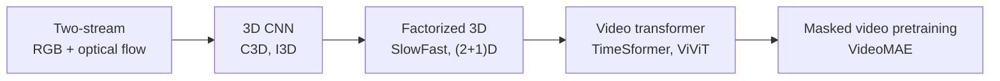

## English

*The entrance to group J. Stands on [[02-foundations/linear-algebra|linear algebra]], probability and [[02-foundations/neural-network-basics|0.8]].
The questions a single frame cannot answer — what is happening, and what happens next.*

A single image answers *what is here*. Video is required to answer *what is happening* and *what happens next*. The second question is the one human-centered robotics actually needs, and it is the one most video benchmarks measure badly.

> [!info] Depth target
> Distinguish recognition, temporal localization, spatiotemporal detection, and anticipation; explain why a video model may need no temporal reasoning to score well; interpret backbone choices (two-stream, 3D CNN, video transformer) and the cost they impose; and read an evaluation critically enough to know whether the claimed capability was tested.

> [!note] Prerequisites
> [[02-foundations/linear-algebra|Linear Algebra]] · [[02-foundations/probability|Probability]] · [[02-foundations/information-theory|Information Theory]] · [[02-foundations/neural-network-basics|Neural Network Basics]] · [[02-foundations/ml-practice|9. ML Practice & Evaluation]] (§3: precision, recall, IoU and AP, which the worked case's temporal versions reuse) · [[04-robotics/hri-safety|11. HRI & Safety]] (the safety cell around P2 — the catalog's planar two-link arm, [[02-foundations/lab-plants|0.6]] — and its protective separation distance $S_p$, which Step 4 prices a delay in) · [[01-canonical-papers/notes/1-foundations/vit|ViT]] · [[01-canonical-papers/notes/2-computer-vision/video-understanding|Video Understanding (paper note)]]

> [!note] First pass · 처음이라면
> Read the running object and the worked case below — eight frames, one ground truth, and the three numbers you can compute from them — then §1, four tasks that get mixed up routinely, then §2 on scene bias, then §4, the anticipation objective, and §5's worked example of one number hiding a result. §3 and §6 are backbone and long-form detail for when a specific paper needs them; §7 is the hand-off to pages 21–23 and §8 the checklist to keep beside a paper.

### Running object: the clip V8

No plant from [[02-foundations/lab-plants|0.6]] (*plant*: control's word for the system being controlled) fits a page whose object is a *score sequence*, so this page freezes its own and never changes it. **V8** is an eight-frame clip recorded at 4 fps, so each frame lasts $\Delta = 0.25$ s and frame $k$ occupies the interval $[(k-1)\Delta,\ k\Delta)$ — the clip runs from 0 to 2.00 s. One class matters: *a hand entering the machine's swing zone.*

A per-frame detector returns a score $s_k \in [0,1]$ for that class on every frame. These eight numbers are frozen page-local values, not measurements from any system:

| Frame $k$ | 1 | 2 | 3 | 4 | 5 | 6 | 7 | 8 |
|---|---:|---:|---:|---:|---:|---:|---:|---:|
| Start time (s) | 0.00 | 0.25 | 0.50 | 0.75 | 1.00 | 1.25 | 1.50 | 1.75 |
| $s_k$ — the live detector | 0.10 | 0.15 | 0.35 | 0.62 | 0.88 | 0.91 | 0.54 | 0.20 |
| $s_k$ — the lagged detector | 0 | 0 | 0.10 | 0.15 | 0.35 | 0.62 | 0.88 | 0.91 |

The **ground-truth segment** $G$ is frames 3 to 7, that is $[0.50,\ 1.75)$ s, a duration of 1.25 s. The **lagged detector** is the same detector behind a two-frame buffer: $s^{\text{lag}}_k = s^{\text{live}}_{k-2}$, with 0 before the buffer fills. Two frames at 4 fps is 0.50 s, and that half-second is the point of this page.

A **predicted segment** $P$ at threshold $\theta$ is the set of frames with $s_k \ge \theta$, read as one interval. The threshold is a choice, not a property of the detector, and the worked case charges it accordingly.

*Scope: this page teaches what the four video tasks measure, how a per-frame score becomes a segment and a number, and what a detection delay costs downstream. It does not teach how to train a backbone (the lineage in §3 is the reading list), how a pose or hand is extracted from the frames ([[04-robotics/human-pose-gaze|21. Human Pose, Hands & Gaze]]), or what to do with the prediction once it exists ([[04-robotics/human-intent-prediction|23. Human Intent & Trajectory Prediction]] and [[04-robotics/hri-safety|11. HRI & Safety]]).*

### The picture: the timeline, three bars under it

<svg viewBox="0 0 560 364" style="max-width:100%;height:auto" role="img" aria-label="Clip V8 on one time axis from 0 to 2.00 s: eight frame boxes with the live detector's scores and a dashed threshold at 0.50, three bars below for the ground truth, the live prediction and the lagged prediction, the intersection and union bracketed, and arrows at the true onset, the live crossing and the lagged crossing 0.50 s apart">
  <defs><marker id="arV8e" viewBox="0 0 10 10" refX="8" refY="5" markerWidth="5" markerHeight="5" orient="auto-start-reverse"><path d="M 0 0 L 10 5 L 0 10 z" fill="currentColor"/></marker></defs>
  <rect x="62" y="40" width="56" height="144" fill="none" stroke="currentColor" stroke-width="1" stroke-opacity="0.4"/>
  <text x="90" y="54" font-size="11" fill="currentColor" text-anchor="middle" font-weight="600">k = 1</text>
  <text x="90" y="68" font-size="11" fill="currentColor" text-anchor="middle" fill-opacity="0.7">0.00 s</text>
  <rect x="78" y="174" width="24" height="10" fill="currentColor" fill-opacity="0.22"/>
  <text x="90" y="170" font-size="11" fill="currentColor" text-anchor="middle">0.10</text>
  <rect x="122" y="40" width="56" height="144" fill="none" stroke="currentColor" stroke-width="1" stroke-opacity="0.4"/>
  <text x="150" y="54" font-size="11" fill="currentColor" text-anchor="middle" font-weight="600">k = 2</text>
  <text x="150" y="68" font-size="11" fill="currentColor" text-anchor="middle" fill-opacity="0.7">0.25 s</text>
  <rect x="138" y="169" width="24" height="15" fill="currentColor" fill-opacity="0.22"/>
  <text x="150" y="165" font-size="11" fill="currentColor" text-anchor="middle">0.15</text>
  <rect x="182" y="40" width="56" height="144" fill="none" stroke="currentColor" stroke-width="1" stroke-opacity="0.4"/>
  <text x="210" y="54" font-size="11" fill="currentColor" text-anchor="middle" font-weight="600">k = 3</text>
  <text x="210" y="68" font-size="11" fill="currentColor" text-anchor="middle" fill-opacity="0.7">0.50 s</text>
  <rect x="198" y="149" width="24" height="35" fill="currentColor" fill-opacity="0.22"/>
  <text x="210" y="145" font-size="11" fill="currentColor" text-anchor="middle">0.35</text>
  <rect x="242" y="40" width="56" height="144" fill="none" stroke="currentColor" stroke-width="1" stroke-opacity="0.4"/>
  <text x="270" y="54" font-size="11" fill="currentColor" text-anchor="middle" font-weight="600">k = 4</text>
  <text x="270" y="68" font-size="11" fill="currentColor" text-anchor="middle" fill-opacity="0.7">0.75 s</text>
  <rect x="258" y="122" width="24" height="62" fill="currentColor" fill-opacity="0.55"/>
  <text x="270" y="118" font-size="11" fill="currentColor" text-anchor="middle">0.62</text>
  <rect x="302" y="40" width="56" height="144" fill="none" stroke="currentColor" stroke-width="1" stroke-opacity="0.4"/>
  <text x="330" y="54" font-size="11" fill="currentColor" text-anchor="middle" font-weight="600">k = 5</text>
  <text x="330" y="68" font-size="11" fill="currentColor" text-anchor="middle" fill-opacity="0.7">1.00 s</text>
  <rect x="318" y="96" width="24" height="88" fill="currentColor" fill-opacity="0.55"/>
  <text x="330" y="92" font-size="11" fill="currentColor" text-anchor="middle">0.88</text>
  <rect x="362" y="40" width="56" height="144" fill="none" stroke="currentColor" stroke-width="1" stroke-opacity="0.4"/>
  <text x="390" y="54" font-size="11" fill="currentColor" text-anchor="middle" font-weight="600">k = 6</text>
  <text x="390" y="68" font-size="11" fill="currentColor" text-anchor="middle" fill-opacity="0.7">1.25 s</text>
  <rect x="378" y="93" width="24" height="91" fill="currentColor" fill-opacity="0.55"/>
  <text x="390" y="89" font-size="11" fill="currentColor" text-anchor="middle">0.91</text>
  <rect x="422" y="40" width="56" height="144" fill="none" stroke="currentColor" stroke-width="1" stroke-opacity="0.4"/>
  <text x="450" y="54" font-size="11" fill="currentColor" text-anchor="middle" font-weight="600">k = 7</text>
  <text x="450" y="68" font-size="11" fill="currentColor" text-anchor="middle" fill-opacity="0.7">1.50 s</text>
  <rect x="438" y="130" width="24" height="54" fill="currentColor" fill-opacity="0.55"/>
  <text x="450" y="126" font-size="11" fill="currentColor" text-anchor="middle">0.54</text>
  <rect x="482" y="40" width="56" height="144" fill="none" stroke="currentColor" stroke-width="1" stroke-opacity="0.4"/>
  <text x="510" y="54" font-size="11" fill="currentColor" text-anchor="middle" font-weight="600">k = 8</text>
  <text x="510" y="68" font-size="11" fill="currentColor" text-anchor="middle" fill-opacity="0.7">1.75 s</text>
  <rect x="498" y="164" width="24" height="20" fill="currentColor" fill-opacity="0.22"/>
  <text x="510" y="160" font-size="11" fill="currentColor" text-anchor="middle">0.20</text>
  <line x1="60" y1="134" x2="540" y2="134" stroke="currentColor" stroke-width="1.3" stroke-dasharray="6 3"/>
  <text x="56" y="138" font-size="11" fill="currentColor" text-anchor="end">θ = 0.50</text>
  <line x1="60" y1="184" x2="540" y2="184" stroke="currentColor" stroke-width="1.3"/>
  <line x1="60" y1="184" x2="60" y2="189" stroke="currentColor" stroke-width="1" stroke-opacity="0.7"/>
  <line x1="120" y1="184" x2="120" y2="189" stroke="currentColor" stroke-width="1" stroke-opacity="0.7"/>
  <line x1="180" y1="184" x2="180" y2="189" stroke="currentColor" stroke-width="1" stroke-opacity="0.7"/>
  <line x1="240" y1="184" x2="240" y2="189" stroke="currentColor" stroke-width="1" stroke-opacity="0.7"/>
  <line x1="300" y1="184" x2="300" y2="189" stroke="currentColor" stroke-width="1" stroke-opacity="0.7"/>
  <line x1="360" y1="184" x2="360" y2="189" stroke="currentColor" stroke-width="1" stroke-opacity="0.7"/>
  <line x1="420" y1="184" x2="420" y2="189" stroke="currentColor" stroke-width="1" stroke-opacity="0.7"/>
  <line x1="480" y1="184" x2="480" y2="189" stroke="currentColor" stroke-width="1" stroke-opacity="0.7"/>
  <line x1="540" y1="184" x2="540" y2="189" stroke="currentColor" stroke-width="1" stroke-opacity="0.7"/>
  <text x="60" y="201" font-size="11" fill="currentColor" text-anchor="middle" fill-opacity="0.8">0</text>
  <text x="548" y="201" font-size="11" fill="currentColor" text-anchor="end" fill-opacity="0.8">2.00 s</text>
  <line x1="180" y1="21" x2="180" y2="183" stroke="currentColor" stroke-width="1.5" marker-end="url(#arV8e)"/>
  <line x1="240" y1="21" x2="240" y2="183" stroke="currentColor" stroke-width="1.5" marker-end="url(#arV8e)"/>
  <line x1="360" y1="21" x2="360" y2="183" stroke="currentColor" stroke-width="1.5" marker-end="url(#arV8e)"/>
  <text x="175" y="17" font-size="11" fill="currentColor" text-anchor="end">true onset</text>
  <text x="245" y="17" font-size="11" fill="currentColor">live first ≥ θ</text>
  <text x="365" y="17" font-size="11" fill="currentColor">lagged first ≥ θ</text>
  <line x1="264" y1="30" x2="242" y2="30" stroke="currentColor" stroke-width="1.1" marker-end="url(#arV8e)"/>
  <line x1="336" y1="30" x2="358" y2="30" stroke="currentColor" stroke-width="1.1" marker-end="url(#arV8e)"/>
  <text x="300" y="34" font-size="11" fill="currentColor" text-anchor="middle" font-weight="600">ΔT = 0.50 s</text>
  <text x="10" y="218" font-size="12" fill="currentColor" font-weight="700">G</text>
  <rect x="180" y="206" width="300" height="16" fill="currentColor" fill-opacity="0.24" stroke="currentColor" stroke-width="1.3"/>
  <text x="330" y="218" font-size="11" fill="currentColor" text-anchor="middle">frames 3–7</text>
  <path d="M180.0 235 v5 H480.0 v-5" fill="none" stroke="currentColor" stroke-width="1.1"/>
  <text x="175" y="244" font-size="11" fill="currentColor" text-anchor="end">union: 5 frames</text>
  <path d="M240.0 251 v5 H480.0 v-5" fill="none" stroke="currentColor" stroke-width="1.1"/>
  <text x="235" y="260" font-size="11" fill="currentColor" text-anchor="end">intersection: 4 frames</text>
  <text x="10" y="282" font-size="12" fill="currentColor" font-weight="700">P<tspan dy="3">live</tspan></text>
  <rect x="240" y="270" width="240" height="16" fill="currentColor" fill-opacity="0.24" stroke="currentColor" stroke-width="1.3"/>
  <text x="360" y="282" font-size="11" fill="currentColor" text-anchor="middle">frames 4–7</text>
  <text x="10" y="310" font-size="12" fill="currentColor" font-weight="700">P<tspan dy="3">lag</tspan></text>
  <rect x="360" y="298" width="180" height="16" fill="currentColor" fill-opacity="0.24" stroke="currentColor" stroke-width="1.3"/>
  <text x="450" y="310" font-size="11" fill="currentColor" text-anchor="middle">frames 6–8</text>
  <text x="10" y="338" font-size="11" fill="currentColor">tIoU(P<tspan dy="3">live</tspan><tspan dy="-3">,</tspan> G) = 4/5 = 0.80; tIoU(P<tspan dy="3">lag</tspan><tspan dy="-3">,</tspan> G) = 2/6 = 0.333.</text>
  <text x="10" y="354" font-size="11" fill="currentColor" fill-opacity="0.7">θ = 0.50 is the worked case’s threshold; the boxes hold the live detector’s scores.</text>
</svg>

The clip V8 on one time axis from 0 to 2.00 s: eight 0.25 s frame boxes hold the live detector's scores, and the dashed line is $\theta = 0.50$, the threshold the worked case's Steps 2 to 4 use. Below, the ground truth $G$ spans frames 3–7, the live prediction frames 4–7 and the lagged one frames 6–8, so the live detector overlaps $G$ in 4 of the 5 frames of their union, $\text{tIoU} = 0.80$, while the lagged one reaches only $2/6 = 0.333$. The arrows mark the true onset at 0.50 s and the two threshold crossings at 0.75 s and 1.25 s, whose gap of $\Delta T = 0.50$ s is exactly the two-frame buffer.

### Worked case: from eight scores to a stopping distance

**Step 1 — the predicted segment depends on the threshold you chose.** Take the live row and read off the frames at or above $\theta$:

| $\theta$ | Frames with $s_k \ge \theta$ | $P$ as an interval | Duration |
|---:|---|---|---:|
| 0.30 | 3, 4, 5, 6, 7 | $[0.50,\ 1.75)$ | 1.25 s |
| 0.50 | 4, 5, 6, 7 | $[0.75,\ 1.75)$ | 1.00 s |
| 0.60 | 4, 5, 6 | $[0.75,\ 1.50)$ | 0.75 s |

**Step 2 — temporal IoU, on this clip.**

> [!info] Definition · 정의 — temporal IoU
> **What kind of thing it is.** A dimensionless scalar in $[0, 1]$: the agreement between two *time intervals* on one video's timeline. It is a comparison between a prediction and a ground truth, not a property of either one alone.
>
> **Its defining conditions.** Four. (i) Both arguments are intervals on the **same clock**, so a tIoU across two videos, or across two frame rates without converting to seconds, is not defined. (ii) It is **symmetric** — swapping $P$ and $G$ gives the same number — which is what makes it an agreement measure rather than a coverage measure. (iii) It is a **ratio of durations**, so it is unchanged if you measure in frames or in seconds, but it does change if you resegment time more coarsely. (iv) It is **blind to direction**: a prediction that is late and one that is early by the same amount score identically, so tIoU alone never tells you that a detector lags.
>
> $$\text{tIoU}(P, G) = \frac{|P \cap G|}{|P \cup G|}$$
>
> $P$ is the predicted segment, $G$ the ground-truth segment, and $|\cdot|$ is duration — equivalently a frame count when every frame has the same length, as on V8.
>
> **Example.** At $\theta = 0.50$ the live detector gives $P = $ frames 4–7 against $G = $ frames 3–7: the intersection is frames 4–7, four frames, and the union is frames 3–7, five frames, so $\text{tIoU} = 4/5 = 0.80$.
>
> **Non-examples.** The fraction of the ground truth that the prediction covers, $|P \cap G|/|G|$, is not tIoU — it is recall, it is not symmetric, and it rewards a prediction that simply spans the whole video. For the lagged detector below, coverage is $2/5 = 0.400$ while tIoU is $2/6 = 0.333$. Spatial IoU on bounding boxes ([[02-foundations/ml-practice|ML Practice §3]]) is also a different quantity on a different domain: it compares two boxes in one image, not two stretches of one timeline, and the two share a name and nothing else.
>
> **Why it matters.** tIoU is the **matching rule**: it decides which predicted segments count as detections at all, so every localization number in a results table is a function of the threshold applied to it.

Running the three thresholds against $G = $ frames 3–7, which is five frames:

$$\text{tIoU} = \tfrac{5}{5} = 1.00 \ \ (\theta = 0.30), \qquad \tfrac{4}{5} = 0.80 \ \ (\theta = 0.50), \qquad \tfrac{3}{5} = 0.60 \ \ (\theta = 0.60)$$

The detector never changed. Its localization score moved by 0.40 because someone chose a number, which is why a threshold-free claim about localization quality is not a claim.

**Step 3 — top-1 against segment level, on the same eight scores.** Clip-level recognition — one label for a whole trimmed clip, scored by **top-1 accuracy**, the fraction of clips whose highest-scoring label is the true one (§1 sets it beside the other three video tasks) — needs one score for the clip, so it pools. Two standard pooling rules, both applied to the live row:

$$\max_k s_k = 0.91, \qquad \frac{1}{8}\sum_k s_k = \frac{3.75}{8} = 0.469$$

With max pooling the clip scores 0.91, the predicted label is correct, and top-1 accuracy is $1/1 = 100\%$. With mean pooling the clip scores 0.469, below the same 0.5 used above, so the clip is labelled *action absent* and top-1 accuracy is $0/1 = 0\%$. Same scores, same detector, same clip: the pooling rule alone moved the headline number the whole way.

Now compare the two detectors. The lagged row pools to $\max = 0.91$ and mean $= 3.01/8 = 0.376$. Under max pooling both detectors score 100% top-1; under mean pooling both score 0%. **Top-1 cannot separate them at all.** The segment-level number can: at $\theta = 0.50$ the lagged detector gives $P = $ frames 6–8, so the intersection with $G$ is frames 6 and 7, two frames, the union is frames 3–8, six frames, and

$$\text{tIoU}_{\text{lag}} = \tfrac{2}{6} = 0.333 \quad\text{against}\quad \text{tIoU}_{\text{live}} = 0.80$$

That is the concrete version of §1's table: recognition and localization are different tasks, and a recognition metric is structurally unable to report a timing defect because pooling throws the time axis away before the number is computed.

**Step 4 — the same delay, priced in metres.** The action truly begins at the start of frame 3, $t = 0.50$ s. The live detector first crosses $\theta = 0.50$ at frame 4, $t = 0.75$ s. The lagged one first crosses at frame 6, $t = 1.25$ s. The alarm is therefore

$$\Delta T = 1.25 - 0.75 = 0.50\ \mathrm{s}$$

later — the two frames, exactly. Hand that to the cell on [[04-robotics/hri-safety|11. HRI & Safety]], a prerequisite, whose P2 running object sits at $v_h = 1.6$ m/s (the person's approach speed), $v_r = 1.0$ m/s (the robot's) and $S_p = 1.24$ m, the protective separation distance: how far outside the hazard boundary a person must first be detected for the robot to stop in time. Detection latency enters $S_p$ through the reaction time $T_r$, and that page's worked case derives $\partial S_p/\partial T_r = v_h + v_r = 2.6$ m/s, so

$$\Delta S_p = 2.6 \times 0.50 = 1.30\ \mathrm{m}$$

$S_p$ goes from 1.24 m to 2.54 m. The sensing field, which starts at the 2.25 m hazard boundary plus $S_p$, moves from 3.49 m to 4.79 m, and the monitored floor grows from $\pi(3.49)^2 = 38.3\ \mathrm{m}^2$ to $\pi(4.79)^2 = 72.1\ \mathrm{m}^2$ — it nearly doubles, a factor of 1.88.

**The reading this gives you.** Two frames of buffering cost 34 m² of floor and were invisible in top-1 accuracy. When a video paper reports latency at all it usually reports throughput — frames per second — and throughput is not latency: a model running at 30 fps behind a two-frame buffer still answers half a second late. Ask for the delay from mid-exposure to decision, which is the quantity the safety calculation actually consumes.

**Step 5 — where the threshold goes when the table says mAP.**

> [!info] Definition · 정의 — mAP at a temporal IoU threshold
> **What kind of thing it is.** A scalar in $[0, 1]$ reported for a whole evaluation set: the mean over classes of the area under each class's interpolated precision–recall curve, computed after a matching rule has labelled every prediction a true or false positive.
>
> **Its defining conditions.** Four. (i) A predicted segment is a true positive only if its tIoU with an **as-yet-unmatched** ground-truth segment of the same class reaches the threshold $\alpha$; each ground-truth segment matches at most once, so a second prediction of the same action is a false positive however good it is. (ii) Predictions are ranked by **confidence across the whole set** before the curve is traced, so the ordering, not just the count, decides the number. (iii) Recall is measured against the **total** number of ground-truth segments, so an action nobody predicted lowers recall while producing no prediction to inspect. (iv) The threshold $\alpha$ **is part of the metric's name** — mAP@0.5 and mAP@0.75 are different quantities and cannot be compared.
>
> $$\text{AP} = \sum_n \big(R_n - R_{n-1}\big)\,P^{\text{interp}}_n, \qquad P^{\text{interp}}_n = \max_{m \ge n} P_m, \qquad \text{mAP} = \frac{1}{C}\sum_{c=1}^{C}\text{AP}_c$$
>
> $P_n$ and $R_n$ are precision and recall after the $n$-th ranked prediction, $R_0 = 0$, $P^{\text{interp}}_n$ is the best precision at this recall or higher, and $C$ is the number of classes. The precision–recall machinery is the same one [[02-foundations/ml-practice|ML Practice §3]] derives for detection; only the matching rule changes, from spatial IoU on boxes to temporal IoU on segments.
>
> **Example.** The five-prediction set below: 0.625 at $\alpha = 0.50$ and 0.417 at $\alpha = 0.75$.
>
> **Non-examples.** The fraction of ground-truth actions detected at all is not mAP — on the set below that is $3/4 = 0.75$ at $\alpha = 0.50$, and it ignores every false positive. An mAP quoted without its $\alpha$ is not a number you can use. Nor is a **frame-mAP** this quantity: that is the metric of spatiotemporal detection, the task that outputs a box and an action label on every frame, and it matches predictions per frame by spatial IoU rather than per segment by temporal IoU, so the two numbers are not comparable (§1 tabulates the four video tasks and their metrics).
>
> **Why it matters.** Localization results are reported as one number, and that number carries a hidden choice. Two papers can differ entirely because of $\alpha$, and a method that improves boundaries rather than detections gains only at high $\alpha$ — which is exactly what the two columns below show.

Freeze one class, four ground-truth segments across four clips, and five predictions ranked by confidence, each with its tIoU against the ground truth it overlaps:

| Rank $n$ | Confidence | tIoU | TP at $\alpha = 0.50$? | TP at $\alpha = 0.75$? |
|---:|---:|---:|---|---|
| 1 | 0.91 | 0.80 | yes | yes |
| 2 | 0.72 | 0.33 | no | no |
| 3 | 0.65 | 0.90 | yes | yes |
| 4 | 0.55 | 0.55 | yes | **no** |
| 5 | 0.40 | 0.20 | no | no |

At $\alpha = 0.50$ the running precision is $1.000,\ 0.500,\ 0.667,\ 0.750,\ 0.600$ and the recall $0.25,\ 0.25,\ 0.50,\ 0.75,\ 0.75$. Interpolating precision backwards from the end gives $1.000,\ 0.750,\ 0.750,\ 0.750,\ 0.600$, so summing $(R_n - R_{n-1})P^{\text{interp}}_n$:

$$\text{AP}_{@0.50} = 0.25(1.000) + 0 + 0.25(0.750) + 0.25(0.750) + 0 = 0.625$$

At $\alpha = 0.75$ only ranks 1 and 3 survive. Precision becomes $1.000,\ 0.500,\ 0.667,\ 0.500,\ 0.400$ and recall $0.25,\ 0.25,\ 0.50,\ 0.50,\ 0.50$; interpolated precision is $1.000,\ 0.667,\ 0.667,\ 0.500,\ 0.400$, so

$$\text{AP}_{@0.75} = 0.25(1.000) + 0 + 0.25(0.667) = 0.417$$

With one class, mAP equals AP. The predictions never changed: raising $\alpha$ from 0.50 to 0.75 removed one detection and took a third of the score with it, because rank 4's tIoU of 0.55 is a real detection with sloppy boundaries. That is the difference between finding an action and knowing when it started, and it is the difference that matters when the next stage is a stop decision.

### 1. Four tasks that are routinely conflated

| Task | Input | Output | Typical metric |
|---|---|---|---|
| Action recognition | trimmed clip | one label for the clip | top-1 / top-5 accuracy |
| Temporal action localization | untrimmed video | (start, end, label) segments | mAP at temporal IoU |
| Spatiotemporal detection | untrimmed video | per-frame boxes + action label | frame-mAP |
| **Action anticipation** | video up to $t$, **nothing after** | label of the action starting at $t+\tau$ | top-$k$ accuracy at anticipation time $\tau$ |

Temporal IoU and segment-level mAP are defined in full in the worked case above, on V8's own numbers. They are not the detection metrics of [[02-foundations/ml-practice|ML Practice §3]] under new names: the precision–recall machinery is shared, but the matching rule changes from spatial overlap of boxes to temporal overlap of intervals, so a frame-mAP and a segment-mAP are different quantities.

Anticipation is the only one of these that is causally constrained: the model may not see the moment it is predicting. Every claim about "predicting intent" belongs in this row, and a paper that reports recognition numbers has not demonstrated anticipation.

### 2. The scene-bias problem

Let $y$ be the action label and $x_1$ a single frame. Write $I(a; b)$ for the mutual information between $a$ and $b$ — how much knowing one reduces uncertainty about the other ([[02-foundations/information-theory|Information Theory §4]]). Many datasets satisfy

$$I(y; x_1) \approx I(y; x_{1:T})$$

that is, one frame carries nearly all the label information. A kitchen frame implies *cooking*; a pool implies *swimming*. A model can therefore reach high accuracy with **no temporal reasoning at all**.

The standard diagnostic is to compare against a single-frame baseline, and to test on datasets built to break the shortcut — for example Something-Something, whose classes are defined by *how* an object moves ("pushing something from left to right" versus right to left) so that appearance alone is uninformative.

> [!warning] Reading rule
> If a video paper does not report a single-frame or shuffled-frame baseline, its temporal claim is unverified.

### 3. Backbone families

*In one sentence:* video networks differ mainly in how many seconds of video one pass can look at and what that costs, and a behaviour longer than that window is never seen whole, however good the score inside it.

*If you need only one thing from this section:* the temporal receptive field $T_{\mathrm{RF}} = Ns/r$ — $2.56$ s for I3D, $8.5$ s for TimeSformer's default clip, $0.25$ s for V8's per-frame detector — defined and worked in the box below.

#### Five families, and what each one costs

| Family | Idea | Cost | Weakness |
|---|---|---|---|
| Two-stream | appearance stream + precomputed optical flow stream | flow computation dominates | flow is expensive and brittle at low texture |
| 3D CNN (I3D) | inflate 2D kernels to 3D, pretrain on a large clip dataset | $O(T)$ memory over frames | fixed short temporal window |
| SlowFast | slow high-capacity pathway for semantics + fast low-capacity pathway for motion | cheaper than uniform 3D | two-pathway design is hand-set |
| Video transformer | attention over space-time tokens; often factorized into separate temporal and spatial attention (TimeSformer: temporal then spatial within each block) | attention is $O(N^2)$ in tokens | data-hungry; long video is still hard |
| Masked video pretraining | reconstruct masked spacetime patches, then fine-tune | large pretraining cost, cheap fine-tune | pretraining data distribution leaks into results |

#### How much time one forward pass can see

The practical consequence for a robotics application is the **temporal receptive field**, defined in the box below: the backbones in the table see between about **0.4 s and 12 s** of video in one forward pass. Behaviour that unfolds over a minute — approach, hesitation, decision — is not inside the window, and a longer window is not free.

> [!info] Definition · 정의 — temporal receptive field
> **What kind of thing it is.** A **duration in seconds**: the span of input video that can influence one output of the model. For a clip model it is bounded by the clip the model reads in one forward pass.
>
> **Its defining conditions.** Three. (i) It is measured in **seconds, not frames**: a frame count means nothing until the frame rate and the sampling stride are fixed. (ii) It belongs to **one forward pass**. Running the model on many clips and averaging their outputs — how I3D scores a whole test video — is pooling, Step 3's mean rule, and it does not let evidence in one clip condition evidence in another. (iii) It is an **upper bound** on what the model relates across time, not a promise that the model uses all of it; §2's scene bias is the case where it uses one frame.
>
> $$T_{\mathrm{RF}} = \frac{N\,s}{r}$$
>
> $N$ is the number of frames in one clip, $s$ the sampling stride (every $s$-th source frame is kept) and $r$ the source frame rate in frames per second.
>
> **Example.** I3D trains on 64 consecutive frames of video processed at 25 fps, so $T_{\mathrm{RF}} = 64 \times 1/25 = 2.56$ s. TimeSformer's default clip is 8 frames taken one in 32, which from 30 fps video is $8 \times 32/30 = 8.5$ s, the span its paper gives; the paper's long-range variant, 96 frames taken one in four, covers about 12 s by its own account. At the short end, the two-stream network that I3D compares against reads a stack of 10 optical-flow frames at 25 fps: 0.4 s. V8's per-frame detector has $N = 1$ at 4 fps: 0.25 s, which is why it can report that a hand is present but not that one is approaching.
>
> **Non-example.** "Eight frames" is not a receptive field. TimeSformer's 8 frames span 8.5 s, while 8 consecutive frames at 25 fps span $8/25 = 0.32$ s — the same count, about 27 times apart. Nor is the length of the test video, for the reason in (ii).
>
> **Why it matters.** A behaviour longer than $T_{\mathrm{RF}}$ is never inside one window, so no accuracy inside the window can model it. The workaround is aggregation over clips (§6), and a paper that uses it should say so rather than report the video's length as the model's reach.

#### What attention connects, and what it does not prove

Space-time attention works because tokens carry both image-patch content and a position in the clip. Query–key similarity weights let a patch depicting a hand draw information from a tool or from another time, rather than treating each frame in isolation.

Full attention compares all token pairs; factorized variants restrict or separate the spatial and temporal comparisons. The underlying weighted aggregation is the same operation illustrated in [[02-foundations/linear-algebra|Linear Algebra §1]].

**The reading this gives you.** Ask which frames and patches can exchange information, and whether future frames enter a supposedly online prediction. Attention can connect evidence across a clip; it does not by itself establish action causality.

### 4. Anticipation, formally

Let observations run to time $t$ and let the anticipation horizon be $\tau$. The model estimates

$$p\big(y_{t+\tau} \mid x_{1:t}\big)$$

Three properties follow that recognition does not have:

1. **The target is uncertain, not merely unknown.** Multiple futures are legitimately possible from the same past. A model forced to output a single label is being scored on a task that has no single answer.
2. **Accuracy decreases with $\tau$.** Any anticipation result must be reported as a curve over $\tau$, not one number.
3. **Earlier is worth more, and worth less.** A warning at $\tau=2\,\mathrm{s}$ is actionable and unreliable; at $\tau=0.2\,\mathrm{s}$ it is reliable and useless. This trade-off is the actual research object.

### 5. Worked example: why one number hides the result

Two anticipation models are reported at $\tau = 1\,\mathrm{s}$:

| Model | Acc @ $\tau=0.5$ | Acc @ $\tau=1.0$ | Acc @ $\tau=2.0$ |
|---|---|---|---|
| A | 0.86 | **0.71** | 0.42 |
| B | 0.74 | **0.70** | 0.63 |

Reported at $\tau = 1\,\mathrm{s}$ alone, A "wins" by one point. But B degrades far more slowly, and for any system that must act on the prediction, the useful operating point is the largest $\tau$ that still clears a decision threshold. At threshold 0.6, A is usable to about $\tau \approx 1.4\,\mathrm{s}$ (interpolating between 1 s and 2 s), while B is still above 0.6 at the longest horizon measured (0.63 at 2 s) and extrapolates to about $\tau \approx 2.4\,\mathrm{s}$. B is the better model for deployment and the worse model in the table.

### 6. Long-form video

Beyond roughly a minute, dense attention over frames becomes infeasible and the interesting structure is no longer motion but **event order and reference**: what happened earlier that explains what is happening now. Approaches compress into memory, retrieve relevant moments, or operate on captions rather than pixels. Treat any claim of "long video understanding" as a claim about *what was retained*, and check that.

### 7. What this gives the intent pipeline

Video understanding supplies the temporal representation that everything downstream consumes:

- [[04-robotics/human-pose-gaze|21. Human Pose, Hands & Gaze]] extracts the human-specific channel from that representation.
- [[04-robotics/egocentric-perception|22. Egocentric & First-Person Perception]] changes the viewpoint and therefore what is observable.
- [[04-robotics/human-intent-prediction|23. Human Intent & Trajectory Prediction]] is anticipation with a decision attached.

Each hand-off carries a number. V8's detector sees one frame, $0.25$ s (§3): enough to report a hand, not an approach, which needs a second frame. At the P2 cell's $v_h = 1.6$ m/s a hand moves $1.6 \times 0.25 = 0.40$ m between frames, a third of the $1.24$ m separation distance, and waiting for that second frame costs $2.6 \times 0.25 = 0.65$ m of $S_p$ at Step 4's rate. So page 21's output must arrive with its delay from mid-exposure, and page 23's as a curve over $\tau$ (§4).

### 8. Reading claims and evaluations

| Paper phrase | Check before accepting it |
|---|---|
| state-of-the-art on action recognition | single-frame baseline; is the dataset scene-biased |
| understands temporal dynamics | shuffled-frame or reversed-clip ablation |
| anticipates actions | does the input window strictly exclude $t+\tau$; is a $\tau$ curve given |
| real-time | frames per second at what resolution, on what hardware, including preprocessing (optical flow is not free) |
| long-form | what is the actual temporal span; what is discarded to fit memory |
| generalizes | evaluated across recording setups, or only across held-out clips of the same setup |

### After reading

You should be able to:

- separate recognition, localization, detection, and anticipation, and say which one a paper actually evaluated;
- explain scene bias and name the ablation that exposes it;
- state the temporal receptive field of a backbone family and why it matters for a minute-long behaviour;
- write the anticipation objective and explain why one accuracy number is insufficient;
- identify preprocessing cost hidden inside a "real-time" claim.

> [!tip] Going deeper · 더 깊이
> No textbook; the backbone lineage in §3 is the reading list, in order. Carreira & Zisserman (CVPR 2017) for inflating 2D filters into 3D and for Kinetics as the pretraining corpus that reorganized everything after it. SlowFast (ICCV 2019) for the two-pathway answer to temporal resolution. TimeSformer (ICML 2021) for the attention formulation. VideoMAE for self-supervised pretraining. Read them for what each one had to give up, not for their headline accuracies — the scene-bias problem in §2 is why those accuracies are hard to compare across the four.

### Self-check

1. A model reports 92% on an action dataset. What single experiment most efficiently tests whether it uses temporal information?
2. Why is anticipation not simply recognition applied to a shifted window?
3. A construction-site behaviour of interest takes 45 seconds. Which backbone families are structurally unable to model it end-to-end, and what is the usual workaround?
4. Give an operating condition under which a lower-accuracy anticipation model is the correct choice.

> [!tip]- Answers
> 1. Retrain or evaluate a single-frame baseline on the same split; if it is close, the dataset is scene-biased. Frame shuffling is a cheaper approximation. 2. Because the label window is excluded from the input, so the mapping is one-to-many over legitimate futures; the model estimates a distribution, not a deterministic label. 3. Fixed-window 3D CNNs and standard video transformers (temporal receptive fields of about 2.6 s for I3D to about 12 s for TimeSformer's long-range variant, all far short of 45 s); the workaround is hierarchical or memory-based aggregation over clip-level features. 4. When the decision requires a longer horizon than the higher-accuracy model can sustain above the action threshold — see §5.

**Worked: the three readings the homework asks.** A localization score that moved 0.40 when only the threshold changed is a claim about the threshold. Top-1 under max pooling cannot see a timing defect, and mean pooling would have called the very same clip empty — so a pooling rule, not the model, decided the headline. Throughput is not latency: three buffered frames are 0.75 s and 1.95 m of protective separation, and none of it appears in an fps number.

### Problem set · 과제

Tier B. Hand derivation on **V8**, using only this page and its prerequisites. Same eight frames, same 4 fps, same live score row. Three things change: the ground-truth segment is now $G' = $ frames **2 to 6**, the threshold is $\theta = 0.30$, and the deployed detector sits behind a **three**-frame buffer, so $s^{\text{lag3}}_k = s^{\text{live}}_{k-3}$ with 0 before it fills.

1. **Draw.** Redraw the picture above at these numbers: the eight score bars with the dashed line at $\theta = 0.30$, then the three bars $G'$, $P_{\text{live}}$ and $P_{\text{lag3}}$, with the intersection and union of the first two bracketed and counted. Mark the true onset of $G'$ and the two crossing times, and label the gap in seconds.
2. **Derive.** (a) Give $P_{\text{live}}$ at $\theta = 0.30$ and its temporal IoU against $G'$; then repeat at $\theta = 0.50$ and say which of the two predictions would be a true positive in an mAP@0.5 table. (b) Give $P_{\text{lag3}}$ at $\theta = 0.50$, its tIoU against $G'$, the clip's max-pooled and mean-pooled scores, and the top-1 verdict under each pooling rule. (c) Convert the three-frame lag into seconds, then into metres of protective separation and into monitored floor area for the P2 cell of [[04-robotics/hri-safety|11. HRI & Safety]].
3. **Interpret.** A paper reports top-1 accuracy of 100% on this class and calls the system suitable for a safety interlock, adding that it runs at 30 fps. Using 2(b) and 2(c), say what the top-1 number did and did not establish, and name the one measurement you would ask for instead.

> [!note]- How to draw it · 그리는 법
> - One time axis from 0 to 2.00 s with eight frame boxes above it, each 0.25 s wide and labelled with $k$ and its start time. Frame $k$ occupies $[(k-1)\Delta,\ k\Delta)$, so a segment ends at the end of its last frame, not at its start.
> - Inside each box, the live detector's $s_k$ as a vertical bar, and one dashed line at the threshold $\theta$ across all eight.
> - Under the axis, three stacked bars on the same time scale: the ground truth, the live prediction and the lagged prediction, each prediction being the frames with $s_k \ge \theta$ read as one interval.
> - The lagged scores are the live row moved right by the buffer length, with 0 before the buffer fills, so the lagged bar can never run past the end of the clip at 2.00 s.
> - Align every bar to the frame boundaries above it, so that a prediction offset from the ground truth shows as an offset, not as a shorter bar.
> - Between the ground truth and the live prediction, bracket the intersection and, separately, the union, and write the frame count of each: those two counts are the whole of temporal IoU.
> - Mark three instants with vertical arrows, the true onset and, for each detector, the start of its first frame at or above $\theta$, and label the gap between the two crossings in seconds. It is the buffer length times 0.25 s.

> [!tip]- Solutions
> 1. The drawing must show $P_{\text{live}}$ starting one frame *after* $G'$ starts and ending one frame *after* it ends — the prediction is shifted, not merely shorter, which is why the union is larger than either segment. At the drawing's $\theta = 0.30$, $P_{\text{lag3}}$ is frames 6–8 and touches $G'$ in frame 6 only ($\text{tIoU} = 1/7 = 0.143$); at 2(b)'s $\theta = 0.50$ it does not touch $G'$ at all.
> 2. (a) At $\theta = 0.30$ the frames at or above threshold are 3, 4, 5, 6, 7, so $P_{\text{live}} = $ frames 3–7 $= [0.50,\ 1.75)$ s. Against $G' = $ frames 2–6 the intersection is frames 3–6, four frames, and the union is frames 2–7, six frames, so $\text{tIoU} = 4/6 = 0.667$. At $\theta = 0.50$ the prediction is frames 4–7; the intersection is frames 4, 5, 6, three frames, and the union is still frames 2–7, six frames, so $\text{tIoU} = 3/6 = 0.500$. Both are true positives at $\alpha = 0.50$: the matching condition is that tIoU *reaches* the threshold, so 0.500 counts, exactly as a spatial IoU of 0.50 counts in ML Practice §3. Note what this exercise shows — moving the threshold changed the number by a third without the detector changing, and both predictions score identically in the mAP table.
> (b) The lagged row is $0, 0, 0, 0.10, 0.15, 0.35, 0.62, 0.88$, so at $\theta = 0.50$ only frames 7 and 8 qualify: $P_{\text{lag3}} = [1.50,\ 2.00)$ s. Its intersection with $G' = $ frames 2–6 is **empty**, so $\text{tIoU} = 0$. Yet max pooling gives $0.88$ — correct label, top-1 $= 100\%$ — while mean pooling gives $2.10/8 = 0.263$, below 0.5, so top-1 $= 0\%$. A detector that found nothing where the action was still scores a perfect top-1 under max pooling.
> (c) Three frames at 4 fps is $0.75$ s. The live detector crosses $\theta = 0.50$ at frame 4, $t = 0.75$ s, and the lagged one at frame 7, $t = 1.50$ s. With $\partial S_p/\partial T_r = 2.6$ m/s, $\Delta S_p = 2.6 \times 0.75 = 1.95$ m, so $S_p$ rises from 1.24 m to 3.19 m, the sensing field from 3.49 m to $2.25 + 3.19 = 5.44$ m, and the monitored floor from $38.3\ \mathrm{m}^2$ to $\pi(5.44)^2 = 93.0\ \mathrm{m}^2$ — about $2.4\times$.
> 3. Top-1 of 100% established that the clip contains the class under max pooling, and nothing else. It did not establish *when*, and a safety interlock consumes only the when: this detector's segment has zero overlap with the true action, and mean pooling would have scored the same detector 0%. The 30 fps figure is throughput and says nothing about the three-frame buffer, which is 0.75 s of latency and 1.95 m of separation. The measurement to ask for is the delay from mid-exposure of the frame in which the action begins to the instant the decision leaves the system — one number, in milliseconds, which is what the $T_r$ term of the separation distance actually consumes.

### Sources

**Backbones — verified citations**

- J. Carreira and A. Zisserman, "Quo Vadis, Action Recognition? A New Model and the Kinetics Dataset," *CVPR 2017*, pp. 4724–4733. [arXiv:1705.07750](https://arxiv.org/abs/1705.07750) — inflates 2D ImageNet filters into 3D (I3D) and evaluates on Kinetics, which Kay et al. ([arXiv:1705.06950](https://arxiv.org/abs/1705.06950)) introduce in their own paper. Note the title does not contain "I3D", and that "Kinetics-400" is a later name for that dataset.
- C. Feichtenhofer, H. Fan, J. Malik, and K. He, "SlowFast Networks for Video Recognition," *ICCV 2019*, pp. 6202–6211. [arXiv:1812.03982](https://arxiv.org/abs/1812.03982) — a slow spatial pathway and a fast, low-capacity temporal pathway with lateral fusion.
- G. Bertasius, H. Wang, and L. Torresani, "Is Space-Time Attention All You Need for Video Understanding?", *ICML 2021*. [arXiv:2102.05095](https://arxiv.org/abs/2102.05095) — the paper the community calls TimeSformer; "divided space-time attention" is the winning variant. The name appears nowhere in the title.
- Z. Tong, Y. Song, J. Wang, and L. Wang, "VideoMAE: Masked Autoencoders are Data-Efficient Learners for Self-Supervised Video Pre-Training," *NeurIPS 2022*. [arXiv:2203.12602](https://arxiv.org/abs/2203.12602) — tube masking at 90–95% works on 3k–4k-video datasets with no extra data.
- L. Wang, B. Huang, Z. Zhao, et al., "VideoMAE V2: Scaling Video Masked Autoencoders with Dual Masking," *CVPR 2023*. [arXiv:2303.16727](https://arxiv.org/abs/2303.16727) — a scaling paper, not a new objective: dual masking makes billion-parameter video ViTs trainable.

**Benchmarks**

- R. Goyal, S. Ebrahimi Kahou, V. Michalski, et al., "The 'something something' video database for learning and evaluating visual common sense," *ICCV 2017*. [arXiv:1706.04261](https://arxiv.org/abs/1706.04261) — over 100,000 videos across 174 caption-template classes.

> [!warning] Cite this dataset for what it claims
> The paper's own framing is **physical common sense**, not "temporal reasoning": it argues that
> networks lack common-sense knowledge about the physical world and that most labelled video
> datasets encode high-level concepts rather than the physical detail of actions. The
> temporal-reasoning reading is a downstream community characterisation — accurate in effect,
> since the caption-template classes make appearance cues insufficient, but not the authors'
> words. Cite "visual common sense" if you are quoting the paper.

## 한국어

*J군의 입구다. [[02-foundations/linear-algebra|선형대수]]·확률과 [[02-foundations/neural-network-basics|0.8]] 위에 선다.
한 장의 이미지로는 답할 수 없는 질문들 — 무슨 일이 일어나는가, 그리고 다음에 무엇이 일어나는가.*

한 장의 이미지는 *무엇이 있는가*에 답한다. *무슨 일이 일어나는가*와 *다음에 무엇이 일어나는가*는 비디오가 있어야 답할 수 있다. 인간 중심 로보틱스가 실제로 필요로 하는 건 두 번째 질문이고, 대부분의 비디오 벤치마크가 제대로 측정하지 못하는 것도 그것이다.

> [!info] 깊이 목표
> 인식·시간적 위치추정·시공간 검출·예측(anticipation)을 구분한다; 비디오 모델이 시간 추론
> 없이도 높은 점수를 낼 수 있는 이유를 설명한다; 백본 선택(two-stream, 3D CNN, 비디오 트랜스포머)과
> 그 비용을 해석한다; 주장한 능력이 실제로 검증됐는지 판단할 만큼 평가를 비판적으로 읽는다.

> [!note] 선수 지식
> [[02-foundations/linear-algebra|선형대수]] · [[02-foundations/probability|확률]] · [[02-foundations/information-theory|정보 이론]] · [[02-foundations/neural-network-basics|신경망 기초]] · [[02-foundations/ml-practice|9. ML 실무와 평가]](§3: 정밀도·재현율·IoU·AP. 예제의 시간 버전이 이것을 그대로 쓴다) · [[04-robotics/hri-safety|11. HRI와 안전]](카탈로그의 평면 2링크 팔 P2([[02-foundations/lab-plants|0.6]])를 둘러싼 안전 셀과 그 보호 이격 거리 $S_p$. 4단계가 지연의 값을 여기서 매긴다) · [[01-canonical-papers/notes/1-foundations/vit|ViT]] · [[01-canonical-papers/notes/2-computer-vision/video-understanding|Video Understanding (논문 노트)]]

> [!note] 처음이라면 · First pass
> 먼저 아래의 계속 쓰는 대상과 끝까지 계산해 보는 예제 — 프레임 여덟 장, 정답 구간 하나, 그리고 거기서 계산할 수 있는 숫자 셋 — 그다음 §1, 습관적으로 뒤섞이는 네 과제, 그다음 장면 편향인 §2, 그다음 예측(anticipation)의 목적식인 §4와 숫자 하나가 결과를 가리는 §5의 예제. §3·§6은 백본과 롱폼 세부이니 특정 논문이 요구할 때 보라. §7은 21–23번 페이지로 넘기는 연결이고, §8은 논문 옆에 두고 쓰는 점검표다.

### 계속 쓰는 대상: 클립 V8

대상이 *점수 열*인 페이지에는 [[02-foundations/lab-plants|0.6]]의 어떤 장치도 맞지 않으므로, 이 페이지는 자기 것을 하나 고정하고 끝까지 바꾸지 않는다. **V8**은 4 fps로 찍은 여덟 프레임 클립이다. 프레임 하나가 $\Delta = 0.25$ s이고 프레임 $k$는 구간 $[(k-1)\Delta,\ k\Delta)$를 차지하므로, 클립은 0에서 2.00초까지다. 중요한 클래스는 하나다: *손이 기계의 선회 구역에 들어간다.*

프레임별 검출기가 모든 프레임에 대해 그 클래스의 점수 $s_k \in [0,1]$을 낸다. 이 여덟 숫자는 어떤 시스템의 측정값이 아니라 이 페이지가 고정한 값이다:

| 프레임 $k$ | 1 | 2 | 3 | 4 | 5 | 6 | 7 | 8 |
|---|---:|---:|---:|---:|---:|---:|---:|---:|
| 시작 시각 (s) | 0.00 | 0.25 | 0.50 | 0.75 | 1.00 | 1.25 | 1.50 | 1.75 |
| $s_k$ — 실시간 검출기 | 0.10 | 0.15 | 0.35 | 0.62 | 0.88 | 0.91 | 0.54 | 0.20 |
| $s_k$ — 지연된 검출기 | 0 | 0 | 0.10 | 0.15 | 0.35 | 0.62 | 0.88 | 0.91 |

**정답 구간** $G$는 프레임 3에서 7까지, 곧 $[0.50,\ 1.75)$ s이고 길이는 1.25초다. **지연된 검출기**는 두 프레임짜리 버퍼 뒤에 앉은 같은 검출기다: $s^{\text{lag}}_k = s^{\text{live}}_{k-2}$, 버퍼가 차기 전에는 0이다. 4 fps에서 두 프레임은 0.50초이고, 그 반초가 이 페이지의 요점이다.

문턱값 $\theta$에서의 **예측 구간** $P$는 $s_k \ge \theta$인 프레임들을 구간 하나로 읽은 것이다. 문턱값은 검출기의 성질이 아니라 선택이며, 계산 예제는 그에 맞게 값을 매긴다.

*범위: 이 페이지는 네 비디오 과제가 각각 무엇을 재는지, 프레임별 점수가 어떻게 구간과 숫자가 되는지, 검출 지연이 하류에서 무엇을 치르는지를 가르친다. 백본을 학습시키는 법(§3의 계보가 곧 읽기 목록이다), 프레임에서 자세나 손을 뽑는 법([[04-robotics/human-pose-gaze|21. 사람 자세·손·시선]]), 예측이 생긴 다음에 무엇을 할지([[04-robotics/human-intent-prediction|23. 인간 의도·궤적 예측]]와 [[04-robotics/hri-safety|11. HRI와 안전]])는 가르치지 않는다.*

### 그림으로 먼저 보기: 시간축과 그 아래 막대 셋

<svg viewBox="0 0 560 364" style="max-width:100%;height:auto" role="img" aria-label="클립 V8을 0에서 2.00초까지의 시간축 하나에 그린 그림: 실시간 검출기 점수가 든 프레임 상자 여덟 개와 0.50의 문턱값 점선, 그 아래 정답·실시간 예측·지연 예측의 막대 셋, 괄호로 묶은 교집합과 합집합, 그리고 실제 시작·실시간 교차·지연 교차 시각의 화살표와 0.50초 간격">
  <defs><marker id="arV8k" viewBox="0 0 10 10" refX="8" refY="5" markerWidth="5" markerHeight="5" orient="auto-start-reverse"><path d="M 0 0 L 10 5 L 0 10 z" fill="currentColor"/></marker></defs>
  <rect x="62" y="40" width="56" height="144" fill="none" stroke="currentColor" stroke-width="1" stroke-opacity="0.4"/>
  <text x="90" y="54" font-size="11" fill="currentColor" text-anchor="middle" font-weight="600">k = 1</text>
  <text x="90" y="68" font-size="11" fill="currentColor" text-anchor="middle" fill-opacity="0.7">0.00 s</text>
  <rect x="78" y="174" width="24" height="10" fill="currentColor" fill-opacity="0.22"/>
  <text x="90" y="170" font-size="11" fill="currentColor" text-anchor="middle">0.10</text>
  <rect x="122" y="40" width="56" height="144" fill="none" stroke="currentColor" stroke-width="1" stroke-opacity="0.4"/>
  <text x="150" y="54" font-size="11" fill="currentColor" text-anchor="middle" font-weight="600">k = 2</text>
  <text x="150" y="68" font-size="11" fill="currentColor" text-anchor="middle" fill-opacity="0.7">0.25 s</text>
  <rect x="138" y="169" width="24" height="15" fill="currentColor" fill-opacity="0.22"/>
  <text x="150" y="165" font-size="11" fill="currentColor" text-anchor="middle">0.15</text>
  <rect x="182" y="40" width="56" height="144" fill="none" stroke="currentColor" stroke-width="1" stroke-opacity="0.4"/>
  <text x="210" y="54" font-size="11" fill="currentColor" text-anchor="middle" font-weight="600">k = 3</text>
  <text x="210" y="68" font-size="11" fill="currentColor" text-anchor="middle" fill-opacity="0.7">0.50 s</text>
  <rect x="198" y="149" width="24" height="35" fill="currentColor" fill-opacity="0.22"/>
  <text x="210" y="145" font-size="11" fill="currentColor" text-anchor="middle">0.35</text>
  <rect x="242" y="40" width="56" height="144" fill="none" stroke="currentColor" stroke-width="1" stroke-opacity="0.4"/>
  <text x="270" y="54" font-size="11" fill="currentColor" text-anchor="middle" font-weight="600">k = 4</text>
  <text x="270" y="68" font-size="11" fill="currentColor" text-anchor="middle" fill-opacity="0.7">0.75 s</text>
  <rect x="258" y="122" width="24" height="62" fill="currentColor" fill-opacity="0.55"/>
  <text x="270" y="118" font-size="11" fill="currentColor" text-anchor="middle">0.62</text>
  <rect x="302" y="40" width="56" height="144" fill="none" stroke="currentColor" stroke-width="1" stroke-opacity="0.4"/>
  <text x="330" y="54" font-size="11" fill="currentColor" text-anchor="middle" font-weight="600">k = 5</text>
  <text x="330" y="68" font-size="11" fill="currentColor" text-anchor="middle" fill-opacity="0.7">1.00 s</text>
  <rect x="318" y="96" width="24" height="88" fill="currentColor" fill-opacity="0.55"/>
  <text x="330" y="92" font-size="11" fill="currentColor" text-anchor="middle">0.88</text>
  <rect x="362" y="40" width="56" height="144" fill="none" stroke="currentColor" stroke-width="1" stroke-opacity="0.4"/>
  <text x="390" y="54" font-size="11" fill="currentColor" text-anchor="middle" font-weight="600">k = 6</text>
  <text x="390" y="68" font-size="11" fill="currentColor" text-anchor="middle" fill-opacity="0.7">1.25 s</text>
  <rect x="378" y="93" width="24" height="91" fill="currentColor" fill-opacity="0.55"/>
  <text x="390" y="89" font-size="11" fill="currentColor" text-anchor="middle">0.91</text>
  <rect x="422" y="40" width="56" height="144" fill="none" stroke="currentColor" stroke-width="1" stroke-opacity="0.4"/>
  <text x="450" y="54" font-size="11" fill="currentColor" text-anchor="middle" font-weight="600">k = 7</text>
  <text x="450" y="68" font-size="11" fill="currentColor" text-anchor="middle" fill-opacity="0.7">1.50 s</text>
  <rect x="438" y="130" width="24" height="54" fill="currentColor" fill-opacity="0.55"/>
  <text x="450" y="126" font-size="11" fill="currentColor" text-anchor="middle">0.54</text>
  <rect x="482" y="40" width="56" height="144" fill="none" stroke="currentColor" stroke-width="1" stroke-opacity="0.4"/>
  <text x="510" y="54" font-size="11" fill="currentColor" text-anchor="middle" font-weight="600">k = 8</text>
  <text x="510" y="68" font-size="11" fill="currentColor" text-anchor="middle" fill-opacity="0.7">1.75 s</text>
  <rect x="498" y="164" width="24" height="20" fill="currentColor" fill-opacity="0.22"/>
  <text x="510" y="160" font-size="11" fill="currentColor" text-anchor="middle">0.20</text>
  <line x1="60" y1="134" x2="540" y2="134" stroke="currentColor" stroke-width="1.3" stroke-dasharray="6 3"/>
  <text x="56" y="138" font-size="11" fill="currentColor" text-anchor="end">θ = 0.50</text>
  <line x1="60" y1="184" x2="540" y2="184" stroke="currentColor" stroke-width="1.3"/>
  <line x1="60" y1="184" x2="60" y2="189" stroke="currentColor" stroke-width="1" stroke-opacity="0.7"/>
  <line x1="120" y1="184" x2="120" y2="189" stroke="currentColor" stroke-width="1" stroke-opacity="0.7"/>
  <line x1="180" y1="184" x2="180" y2="189" stroke="currentColor" stroke-width="1" stroke-opacity="0.7"/>
  <line x1="240" y1="184" x2="240" y2="189" stroke="currentColor" stroke-width="1" stroke-opacity="0.7"/>
  <line x1="300" y1="184" x2="300" y2="189" stroke="currentColor" stroke-width="1" stroke-opacity="0.7"/>
  <line x1="360" y1="184" x2="360" y2="189" stroke="currentColor" stroke-width="1" stroke-opacity="0.7"/>
  <line x1="420" y1="184" x2="420" y2="189" stroke="currentColor" stroke-width="1" stroke-opacity="0.7"/>
  <line x1="480" y1="184" x2="480" y2="189" stroke="currentColor" stroke-width="1" stroke-opacity="0.7"/>
  <line x1="540" y1="184" x2="540" y2="189" stroke="currentColor" stroke-width="1" stroke-opacity="0.7"/>
  <text x="60" y="201" font-size="11" fill="currentColor" text-anchor="middle" fill-opacity="0.8">0</text>
  <text x="548" y="201" font-size="11" fill="currentColor" text-anchor="end" fill-opacity="0.8">2.00 s</text>
  <line x1="180" y1="21" x2="180" y2="183" stroke="currentColor" stroke-width="1.5" marker-end="url(#arV8k)"/>
  <line x1="240" y1="21" x2="240" y2="183" stroke="currentColor" stroke-width="1.5" marker-end="url(#arV8k)"/>
  <line x1="360" y1="21" x2="360" y2="183" stroke="currentColor" stroke-width="1.5" marker-end="url(#arV8k)"/>
  <text x="175" y="17" font-size="11" fill="currentColor" text-anchor="end">실제 시작</text>
  <text x="245" y="17" font-size="11" fill="currentColor">실시간이 처음 ≥ θ</text>
  <text x="365" y="17" font-size="11" fill="currentColor">지연이 처음 ≥ θ</text>
  <line x1="264" y1="30" x2="242" y2="30" stroke="currentColor" stroke-width="1.1" marker-end="url(#arV8k)"/>
  <line x1="336" y1="30" x2="358" y2="30" stroke="currentColor" stroke-width="1.1" marker-end="url(#arV8k)"/>
  <text x="300" y="34" font-size="11" fill="currentColor" text-anchor="middle" font-weight="600">ΔT = 0.50 s</text>
  <text x="10" y="218" font-size="12" fill="currentColor" font-weight="700">G</text>
  <rect x="180" y="206" width="300" height="16" fill="currentColor" fill-opacity="0.24" stroke="currentColor" stroke-width="1.3"/>
  <text x="330" y="218" font-size="11" fill="currentColor" text-anchor="middle">프레임 3–7</text>
  <path d="M180.0 235 v5 H480.0 v-5" fill="none" stroke="currentColor" stroke-width="1.1"/>
  <text x="175" y="244" font-size="11" fill="currentColor" text-anchor="end">합집합: 5 프레임</text>
  <path d="M240.0 251 v5 H480.0 v-5" fill="none" stroke="currentColor" stroke-width="1.1"/>
  <text x="235" y="260" font-size="11" fill="currentColor" text-anchor="end">교집합: 4 프레임</text>
  <text x="10" y="282" font-size="12" fill="currentColor" font-weight="700">P<tspan dy="3">live</tspan></text>
  <rect x="240" y="270" width="240" height="16" fill="currentColor" fill-opacity="0.24" stroke="currentColor" stroke-width="1.3"/>
  <text x="360" y="282" font-size="11" fill="currentColor" text-anchor="middle">프레임 4–7</text>
  <text x="10" y="310" font-size="12" fill="currentColor" font-weight="700">P<tspan dy="3">lag</tspan></text>
  <rect x="360" y="298" width="180" height="16" fill="currentColor" fill-opacity="0.24" stroke="currentColor" stroke-width="1.3"/>
  <text x="450" y="310" font-size="11" fill="currentColor" text-anchor="middle">프레임 6–8</text>
  <text x="10" y="338" font-size="11" fill="currentColor">tIoU(P<tspan dy="3">live</tspan><tspan dy="-3">,</tspan> G) = 4/5 = 0.80, tIoU(P<tspan dy="3">lag</tspan><tspan dy="-3">,</tspan> G) = 2/6 = 0.333.</text>
  <text x="10" y="354" font-size="11" fill="currentColor" fill-opacity="0.7">θ = 0.50은 계산 예제의 문턱값이고, 상자 안은 실시간 검출기의 점수다.</text>
</svg>

클립 V8을 0에서 2.00초까지의 시간축 하나에 놓았다: 0.25초 폭의 프레임 상자 여덟 개에 실시간 검출기의 점수가 들어 있고, 점선은 계산 예제의 2~4단계가 쓰는 문턱값 $\theta = 0.50$이다. 그 아래에서 정답 $G$는 프레임 3–7, 실시간 예측은 프레임 4–7, 지연된 예측은 프레임 6–8에 걸치므로, 실시간 검출기는 합집합 다섯 프레임 중 넷에서 $G$와 겹쳐 $\text{tIoU} = 0.80$이고 지연된 검출기는 $2/6 = 0.333$에 그친다. 화살표는 0.50초의 실제 시작과 0.75초·1.25초의 두 문턱값 통과를 가리키고, 뒤의 둘 사이 간격 $\Delta T = 0.50$초가 정확히 버퍼의 두 프레임이다.

### 대상으로 한 번 끝까지: 점수 여덟 개에서 정지 거리까지

**1단계 — 예측 구간은 고른 문턱값에 달려 있다.** 실시간 행에서 $\theta$ 이상인 프레임을 읽는다:

| $\theta$ | $s_k \ge \theta$인 프레임 | 구간으로서의 $P$ | 길이 |
|---:|---|---|---:|
| 0.30 | 3, 4, 5, 6, 7 | $[0.50,\ 1.75)$ | 1.25 s |
| 0.50 | 4, 5, 6, 7 | $[0.75,\ 1.75)$ | 1.00 s |
| 0.60 | 4, 5, 6 | $[0.75,\ 1.50)$ | 0.75 s |

**2단계 — 이 클립 위의 시간 IoU.**

> [!info] 정의 · Definition — 시간 IoU
> **어떤 종류의 것인가.** $[0, 1]$의 무차원 스칼라로, 한 영상의 시간축 위에 놓인 두 *시간 구간*이 얼마나 일치하는지를 잰다. 예측과 정답 사이의 비교이지 둘 중 하나의 성질이 아니다.
>
> **정의 조건.** 넷이다. (i) 두 인자가 **같은 시계** 위의 구간이어야 한다. 그래서 영상 둘 사이의 tIoU나, 초로 환산하지 않은 서로 다른 프레임률 사이의 tIoU는 정의되지 않는다. (ii) **대칭이다** — $P$와 $G$를 바꿔도 같은 값 — 이것이 이 값을 포함도가 아니라 일치도로 만든다. (iii) **길이의 비**이므로 프레임으로 재든 초로 재든 값이 같지만, 시간을 더 거칠게 다시 나누면 값이 바뀐다. (iv) **방향을 보지 못한다**: 같은 양만큼 늦은 예측과 이른 예측이 똑같은 점수를 받으므로, tIoU만으로는 검출기가 지연되고 있다는 사실을 결코 알 수 없다.
>
> $$\text{tIoU}(P, G) = \frac{|P \cap G|}{|P \cup G|}$$
>
> $P$는 예측 구간, $G$는 정답 구간, $|\cdot|$는 길이다. V8처럼 모든 프레임 길이가 같으면 프레임 수와 같다.
>
> **예.** $\theta = 0.50$에서 실시간 검출기의 $P$는 프레임 4–7이고 $G$는 프레임 3–7이다. 교집합은 프레임 4–7로 넷, 합집합은 프레임 3–7로 다섯이므로 $\text{tIoU} = 4/5 = 0.80$이다.
>
> **비-예.** 예측이 정답을 덮는 비율 $|P \cap G|/|G|$는 tIoU가 아니다 — 그것은 재현율이고, 대칭이 아니며, 영상 전체를 덮는 예측에 상을 준다. 아래 지연된 검출기에서 그 값은 $2/5 = 0.400$이지만 tIoU는 $2/6 = 0.333$이다. 바운딩 박스의 공간 IoU([[02-foundations/ml-practice|ML 실무 §3]])도 다른 영역의 다른 양이다. 한 이미지 안의 박스 둘을 비교하지, 한 시간축 위의 구간 둘을 비교하지 않으며, 둘은 이름만 공유한다.
>
> **왜 중요한가.** tIoU는 **정합 규칙**이다. 어떤 예측 구간이 애초에 검출로 집계되는지를 정하므로, 결과표의 모든 위치추정 수치는 거기 적용된 문턱값의 함수다.

다섯 프레임인 $G$ = 프레임 3–7에 대해 세 문턱값을 돌리면

$$\text{tIoU} = \tfrac{5}{5} = 1.00 \ \ (\theta = 0.30), \qquad \tfrac{4}{5} = 0.80 \ \ (\theta = 0.50), \qquad \tfrac{3}{5} = 0.60 \ \ (\theta = 0.60)$$

검출기는 아무것도 바뀌지 않았다. 누군가 숫자 하나를 골랐기 때문에 위치추정 점수가 0.40만큼 움직였고, 그래서 문턱값 없는 위치추정 품질 주장은 주장이 아니다.

**3단계 — 같은 점수 여덟 개 위에서 top-1 대 구간 단위.** 클립 단위 인식 — 잘라 낸 클립 하나 전체에 라벨 하나를 붙이는 과제로, 점수가 가장 높은 라벨이 정답인 클립의 비율인 **top-1 정확도** 로 채점한다(§1이 나머지 세 비디오 과제와 나란히 놓는다) — 은 클립에 점수 하나가 필요하므로 풀링을 한다. 실시간 행에 표준 풀링 둘을 적용하면

$$\max_k s_k = 0.91, \qquad \frac{1}{8}\sum_k s_k = \frac{3.75}{8} = 0.469$$

max 풀링에서는 클립이 0.91을 받고 예측 라벨이 맞으므로 top-1 정확도가 $1/1 = 100\%$다. mean 풀링에서는 0.469를 받아 위에서 쓴 0.5에 못 미치므로 클립이 *행동 없음*으로 분류되고 top-1 정확도가 $0/1 = 0\%$다. 같은 점수, 같은 검출기, 같은 클립인데 풀링 규칙 하나가 표제 숫자를 끝에서 끝까지 옮겼다.

이제 두 검출기를 비교하자. 지연된 행은 $\max = 0.91$, 평균 $= 3.01/8 = 0.376$으로 풀링된다. max 풀링에서는 둘 다 top-1 100%, mean 풀링에서는 둘 다 0%다. **top-1은 둘을 전혀 가르지 못한다.** 구간 단위 수치는 가른다. $\theta = 0.50$에서 지연된 검출기의 $P$는 프레임 6–8이므로 $G$와의 교집합은 프레임 6, 7로 둘, 합집합은 프레임 3–8로 여섯이고

$$\text{tIoU}_{\text{lag}} = \tfrac{2}{6} = 0.333 \quad\text{대}\quad \text{tIoU}_{\text{live}} = 0.80$$

이것이 §1 표의 구체적 판본이다. 인식과 위치추정은 다른 과제이고, 인식 지표는 숫자를 계산하기 전에 풀링이 시간축을 버리기 때문에 타이밍 결함을 구조적으로 보고할 수 없다.

**4단계 — 같은 지연을 미터로 환산하기.** 행동은 프레임 3의 시작, $t = 0.50$ s에 실제로 시작한다. 실시간 검출기는 프레임 4, $t = 0.75$ s에 $\theta = 0.50$을 처음 넘는다. 지연된 검출기는 프레임 6, $t = 1.25$ s에 넘는다. 따라서 경보는

$$\Delta T = 1.25 - 0.75 = 0.50\ \mathrm{s}$$

늦는다 — 정확히 두 프레임이다. 이것을 선수 지식인 [[04-robotics/hri-safety|11. HRI와 안전]]의 셀에 넘기자. 그 페이지의 P2 대상은 $v_h = 1.6$ m/s(사람의 접근 속도), $v_r = 1.0$ m/s(로봇의 속도), 그리고 보호 이격 거리 $S_p = 1.24$ m — 로봇이 제때 멈추려면 사람을 위험 경계 바깥 얼마 지점에서 처음 감지해야 하는가 — 에 앉아 있다. 검출 지연은 반응 시간 $T_r$을 통해 $S_p$에 들어가고, 그 페이지의 예제가 $\partial S_p/\partial T_r = v_h + v_r = 2.6$ m/s를 유도하므로

$$\Delta S_p = 2.6 \times 0.50 = 1.30\ \mathrm{m}$$

$S_p$는 1.24 m에서 2.54 m가 된다. 감지 영역은 위험 경계 2.25 m에 $S_p$를 더한 자리에서 시작하므로 3.49 m에서 4.79 m로 밀려나고, 감시 바닥은 $\pi(3.49)^2 = 38.3\ \mathrm{m}^2$에서 $\pi(4.79)^2 = 72.1\ \mathrm{m}^2$로 거의 두 배, 정확히는 1.88배가 된다.

**여기서 얻는 독법.** 버퍼 두 프레임이 바닥 34 m²를 물렸고, top-1 정확도에서는 보이지 않았다. 비디오 논문이 지연을 보고한다고 할 때 보고하는 것은 대개 처리량 — 초당 프레임 — 이고, 처리량은 지연이 아니다. 두 프레임 버퍼 뒤에서 30 fps로 도는 모델도 여전히 반초 늦게 답한다. 노출 중간부터 결정까지의 지연을 요구하라. 안전 계산이 실제로 먹는 양은 그것이다.

**5단계 — 표가 mAP라고 적을 때 문턱값은 어디로 갔는가.**

> [!info] 정의 · Definition — 시간 IoU 문턱값에서의 mAP
> **어떤 종류의 것인가.** 평가 집합 전체에 대해 보고하는 $[0, 1]$의 스칼라다. 정합 규칙이 모든 예측에 참양성·거짓양성 딱지를 붙인 뒤, 클래스별 보간 정밀도–재현율 곡선 아래 넓이를 클래스에 대해 평균한 값이다.
>
> **정의 조건.** 넷이다. (i) 예측 구간이 참양성이 되려면 같은 클래스의 **아직 짝지어지지 않은** 정답 구간과의 tIoU가 문턱값 $\alpha$에 닿아야 한다. 정답 구간 하나는 최대 한 번만 짝지어지므로, 같은 행동에 대한 두 번째 예측은 아무리 좋아도 거짓양성이다. (ii) 곡선을 그리기 전에 예측을 **평가 집합 전체에 걸쳐 신뢰도로** 정렬한다. 개수만이 아니라 순서가 값을 정한다. (iii) 재현율은 정답 구간의 **전체** 개수에 대해 잰다. 그래서 아무도 예측하지 않은 행동은 들여다볼 예측을 만들지 않으면서 재현율만 낮춘다. (iv) 문턱값 $\alpha$는 **지표 이름의 일부다** — mAP@0.5와 mAP@0.75는 다른 양이고 비교할 수 없다.
>
> $$\text{AP} = \sum_n \big(R_n - R_{n-1}\big)\,P^{\text{interp}}_n, \qquad P^{\text{interp}}_n = \max_{m \ge n} P_m, \qquad \text{mAP} = \frac{1}{C}\sum_{c=1}^{C}\text{AP}_c$$
>
> $P_n$과 $R_n$은 $n$번째 예측 뒤의 정밀도와 재현율, $R_0 = 0$, $P^{\text{interp}}_n$은 이 재현율 이상에서의 최고 정밀도, $C$는 클래스 수다. 정밀도–재현율 기계는 [[02-foundations/ml-practice|ML 실무 §3]]이 검출에 대해 유도하는 바로 그것이고, 바뀌는 것은 정합 규칙뿐이다. 박스의 공간 IoU에서 구간의 시간 IoU로.
>
> **예.** 아래 다섯 예측 집합: $\alpha = 0.50$에서 0.625, $\alpha = 0.75$에서 0.417.
>
> **비-예.** 정답 행동 중 몇 개나 검출되었는가는 mAP가 아니다 — 아래 집합에서 $\alpha = 0.50$일 때 그 값은 $3/4 = 0.75$이고, 거짓양성을 전부 무시한다. $\alpha$ 없이 적힌 mAP도 쓸 수 있는 숫자가 아니다. **frame-mAP** 도 이 양이 아니다. 그것은 프레임마다 박스 하나와 행동 레이블을 내는 과제인 시공간 검출의 지표이고, 예측을 구간마다 시간 IoU로가 아니라 프레임마다 공간 IoU로 정합하므로 두 숫자는 비교 대상이 아니다(§1이 네 비디오 과제와 그 지표를 표로 정리한다).
>
> **왜 중요한가.** 위치추정 결과는 숫자 하나로 보고되고, 그 숫자는 숨은 선택 하나를 지고 있다. 논문 둘이 오직 $\alpha$ 때문에 갈릴 수 있고, 검출이 아니라 경계를 개선한 방법은 높은 $\alpha$에서만 이득을 본다 — 아래 두 열이 보이는 것이 정확히 그것이다.

클래스 하나, 클립 넷에 걸친 정답 구간 넷, 신뢰도로 정렬한 예측 다섯을 고정한다. 각 예측에는 겹치는 정답에 대한 tIoU가 붙어 있다:

| 순위 $n$ | 신뢰도 | tIoU | $\alpha = 0.50$에서 TP? | $\alpha = 0.75$에서 TP? |
|---:|---:|---:|---|---|
| 1 | 0.91 | 0.80 | O | O |
| 2 | 0.72 | 0.33 | X | X |
| 3 | 0.65 | 0.90 | O | O |
| 4 | 0.55 | 0.55 | O | **X** |
| 5 | 0.40 | 0.20 | X | X |

$\alpha = 0.50$에서 누적 정밀도는 $1.000,\ 0.500,\ 0.667,\ 0.750,\ 0.600$이고 재현율은 $0.25,\ 0.25,\ 0.50,\ 0.75,\ 0.75$다. 끝에서부터 정밀도를 보간하면 $1.000,\ 0.750,\ 0.750,\ 0.750,\ 0.600$이므로 $(R_n - R_{n-1})P^{\text{interp}}_n$을 더해

$$\text{AP}_{@0.50} = 0.25(1.000) + 0 + 0.25(0.750) + 0.25(0.750) + 0 = 0.625$$

$\alpha = 0.75$에서는 순위 1과 3만 살아남는다. 정밀도는 $1.000,\ 0.500,\ 0.667,\ 0.500,\ 0.400$, 재현율은 $0.25,\ 0.25,\ 0.50,\ 0.50,\ 0.50$이고 보간 정밀도는 $1.000,\ 0.667,\ 0.667,\ 0.500,\ 0.400$이므로

$$\text{AP}_{@0.75} = 0.25(1.000) + 0 + 0.25(0.667) = 0.417$$

클래스가 하나이므로 mAP는 AP와 같다. 예측은 하나도 바뀌지 않았다. $\alpha$를 0.50에서 0.75로 올린 것이 검출 하나를 지우고 점수의 3분의 1을 함께 가져갔다. 순위 4의 tIoU 0.55가 경계가 엉성한 진짜 검출이기 때문이다. 그것이 행동을 찾는 것과 언제 시작했는지 아는 것의 차이이고, 다음 단계가 정지 결정일 때 문제가 되는 차이다.

### 1. 습관적으로 뒤섞이는 네 가지 과제

| 과제 | 입력 | 출력 | 대표 지표 |
|---|---|---|---|
| 행동 인식 | 잘린 클립 | 클립 하나의 레이블 | top-1 / top-5 정확도 |
| 시간적 행동 위치추정 | 안 자른 영상 | (시작, 끝, 레이블) 구간 | 시간 IoU 기준 mAP |
| 시공간 검출 | 안 자른 영상 | 프레임별 박스 + 행동 레이블 | frame-mAP |
| **행동 예측(anticipation)** | $t$까지의 영상, **이후는 없음** | $t+\tau$에 시작될 행동 | 예측 시점 $\tau$에서의 top-$k$ |

시간 IoU와 구간 단위 mAP는 위의 계산 예제에서 V8 자신의 숫자로 온전히 정의한다. 이름만 바꾼 [[02-foundations/ml-practice|ML 실무 §3]]의 검출 지표가 아니다. 정밀도–재현율 기계는 공유하지만 정합 규칙이 박스의 공간적 겹침에서 구간의 시간적 겹침으로 바뀌므로, frame-mAP와 segment-mAP는 다른 양이다.

이 중 인과적으로 제약된 것은 anticipation뿐이다 — 모델은 자기가 예측하는 순간을 볼 수 없다. "의도를 예측한다"는 모든 주장은 이 행에 속하고, 인식 수치를 보고한 논문은 예측을 입증한 것이 아니다.

### 2. 장면 편향(scene bias) 문제

레이블을 $y$, 한 프레임을 $x_1$이라 하자. $I(a; b)$는 $a$와 $b$ 사이의 상호정보량, 즉 한쪽을 알면 다른 쪽의 불확실성이 얼마나 줄어드는가이다([[02-foundations/information-theory|정보 이론 §4]]). 많은 데이터셋이

$$I(y; x_1) \approx I(y; x_{1:T})$$

를 만족한다 — 즉 한 프레임이 레이블 정보의 거의 전부를 담는다. 주방 프레임은 *요리*를, 수영장은 *수영*을 함의한다. 그래서 모델은 **시간 추론을 전혀 하지 않고도** 높은 정확도에 도달할 수 있다.

표준 진단은 단일 프레임 베이스라인과의 비교, 그리고 이 지름길을 막도록 설계된 데이터셋에서의 평가다 — 예를 들어 Something-Something은 클래스를 물체가 *어떻게* 움직이는지로 정의해서("왼쪽에서 오른쪽으로 밀기" vs 반대) 외형만으로는 판별이 안 되게 만들었다.

> [!warning] 읽기 규칙
> 비디오 논문이 단일 프레임 또는 프레임 셔플 베이스라인을 보고하지 않으면, 그 시간적 주장은 검증되지 않은 것이다.

### 3. 백본 계보

*한 문장으로:* 비디오 신경망들은 주로 한 번의 순전파가 영상 몇 초를 볼 수 있는가와 그 비용에서 갈리고, 그 창보다 긴 행동은 창 안의 점수가 아무리 좋아도 한 번도 통째로 보이지 않는다.

*이 절에서 하나만 가져간다면:* 시간 수용 영역 $T_{\mathrm{RF}} = Ns/r$이다 — I3D는 $2.56$초, TimeSformer의 기본 클립은 $8.5$초, V8의 프레임별 검출기는 $0.25$초이며, 아래 상자에서 정의하고 계산한다.

#### 다섯 계열과 각각의 비용

| 계열 | 아이디어 | 비용 | 약점 |
|---|---|---|---|
| Two-stream | 외형 스트림 + 미리 계산한 optical flow 스트림 | flow 계산이 지배적 | flow가 비싸고 저텍스처에서 불안정 |
| 3D CNN (I3D) | 2D 커널을 3D로 팽창, 대규모 클립 데이터로 사전학습 | 프레임 수에 $O(T)$ 메모리 | 고정된 짧은 시간 창 |
| SlowFast | 의미용 느린 고용량 경로 + 움직임용 빠른 저용량 경로 | 균일 3D보다 저렴 | 두 경로 설계가 수작업 |
| 비디오 트랜스포머 | 시공간 토큰에 대한 어텐션, 보통 시간 어텐션과 공간 어텐션으로 분해(TimeSformer는 블록마다 시간 다음 공간) | 토큰 수에 $O(N^2)$ | 데이터 요구량 큼, 긴 영상은 여전히 난제 |
| 마스킹 사전학습 | 마스킹된 시공간 패치 복원 후 미세조정 | 사전학습 비용 큼, 미세조정은 저렴 | 사전학습 데이터 분포가 결과에 스며듦 |

#### 순전파 한 번이 볼 수 있는 시간

로보틱스 응용에서 실질적 귀결은 아래 상자에서 정의하는 **시간 수용 영역** 이다. 표의 백본들은 한 번의 순전파에서 영상을 약 **0.4초에서 12초** 까지 본다. 접근–망설임–결정처럼 1분에 걸쳐 펼쳐지는 행동은 그 창 안에 없고, 창을 늘리는 건 공짜가 아니다.

> [!info] 정의 · Definition — 시간 수용 영역(temporal receptive field)
> **어떤 종류의 것인가.** **초 단위의 길이** 다. 모델의 출력 하나에 영향을 줄 수 있는 입력 영상의 시간 폭이다. 클립 모델에서는 모델이 한 번의 순전파에서 읽는 클립이 그 상한이다.
>
> **정의 조건.** 셋이다. (i) **프레임이 아니라 초로** 잰다. 프레임 수는 프레임률과 샘플링 간격이 정해지기 전에는 아무 뜻이 없다. (ii) **한 번의 순전파** 에 속한다. 여러 클립에 모델을 돌리고 출력을 평균하는 것 — I3D가 테스트 영상 전체를 채점하는 방식 — 은 풀링, 곧 3단계의 mean 규칙이며, 한 클립의 증거가 다른 클립의 증거를 조건으로 삼게 해 주지 않는다. (iii) 모델이 시간에 걸쳐 관계 지을 수 있는 것의 **상한** 이지, 그 전부를 쓴다는 보장이 아니다. §2의 장면 편향은 프레임 하나만 쓰는 경우다.
>
> $$T_{\mathrm{RF}} = \frac{N\,s}{r}$$
>
> $N$은 클립 하나의 프레임 수, $s$는 샘플링 간격(원본 프레임 $s$장마다 한 장을 남긴다), $r$은 원본 프레임률(초당 프레임)이다.
>
> **예.** I3D는 25 fps로 처리한 영상의 연속 64프레임으로 학습하므로 $T_{\mathrm{RF}} = 64 \times 1/25 = 2.56$초다. TimeSformer의 기본 클립은 32장마다 한 장씩 뽑은 8프레임이라 30 fps 영상에서는 $8 \times 32/30 = 8.5$초이고, 논문이 직접 적는 길이도 이것이다. 논문의 장거리 변형은 네 장마다 한 장씩 뽑은 96프레임으로, 논문 스스로 약 12초를 덮는다고 적는다. 짧은 쪽 끝에서는, I3D가 비교 대상으로 삼은 two-stream 네트워크가 25 fps의 광류 프레임 10장을 쌓아 읽는다: 0.4초. V8의 프레임별 검출기는 4 fps에서 $N = 1$이므로 0.25초이고, 그래서 손이 *있다*고는 말할 수 있어도 손이 *다가온다*고는 말할 수 없다.
>
> **비-예.** "8프레임"은 수용 영역이 아니다. TimeSformer의 8프레임은 8.5초에 걸치지만, 25 fps의 연속 8프레임은 $8/25 = 0.32$초에 걸친다 — 같은 개수가 약 27배 차이 난다. 테스트 영상의 길이도 (ii)의 이유로 수용 영역이 아니다.
>
> **왜 중요한가.** $T_{\mathrm{RF}}$보다 긴 행동은 어떤 창 안에도 온전히 들어오지 않으므로, 창 안의 정확도가 아무리 높아도 그것을 모델링할 수 없다. 우회책은 클립들에 걸친 집계(§6)이고, 그것을 쓴 논문은 영상의 길이를 모델의 도달 범위로 보고하지 말고 집계를 썼다고 밝혀야 한다.

#### 어텐션이 잇는 것과 증명하지 않는 것

시공간 어텐션의 토큰에는 영상 패치 내용과 클립 안의 위치가 담긴다. 쿼리–키 유사도 가중치로 손 패치가 도구나 다른 시각의 정보를 가져와 프레임을 따로 보지 않게 한다.

전체 어텐션은 모든 토큰 쌍을 비교한다. 분해형은 공간·시간 비교를 제한하거나 분리한다. 가중 집계 자체는 [[02-foundations/linear-algebra|선형대수 §1]]의 연산과 같다.

**여기서 얻는 독법.** 어떤 프레임·패치가 정보를 교환하며 온라인 예측에 미래 프레임이 들어가는지 묻는다. 어텐션은 클립의 증거를 연결하지만 행동의 인과성을 자동으로 확립하지는 않는다.

### 4. Anticipation의 정식화

관측이 $t$까지 있고 예측 지평이 $\tau$일 때 모델은

$$p\big(y_{t+\tau} \mid x_{1:t}\big)$$

를 추정한다. 인식에는 없는 성질 세 가지가 따라온다:

1. **목표가 단지 미지가 아니라 불확실하다.** 같은 과거에서 여러 미래가 정당하게 가능하다. 레이블 하나를 강제로 출력하는 모델은 정답이 하나가 아닌 과제로 채점되고 있는 것이다.
2. **$\tau$가 커지면 정확도가 떨어진다.** 모든 anticipation 결과는 숫자 하나가 아니라 $\tau$에 대한 곡선으로 보고돼야 한다.
3. **이를수록 값지고, 동시에 값싸다.** $\tau=2\,\mathrm{s}$의 경고는 조치 가능하지만 부정확하고, $\tau=0.2\,\mathrm{s}$는 정확하지만 쓸모없다. **이 트레이드오프 자체가 연구 대상이다.**

### 5. 예제: 숫자 하나가 결과를 가리는 방식

두 예측 모델을 $\tau = 1\,\mathrm{s}$에서 보고했다:

| 모델 | $\tau=0.5$ | $\tau=1.0$ | $\tau=2.0$ |
|---|---|---|---|
| A | 0.86 | **0.71** | 0.42 |
| B | 0.74 | **0.70** | 0.63 |

$\tau=1\,\mathrm{s}$만 보면 A가 1점 이긴다. 그러나 B는 훨씬 천천히 나빠지고, 예측을 근거로 **행동해야 하는** 시스템에서 유용한 동작점은 결정 임계값을 넘기는 가장 큰 $\tau$다. 임계값 0.6에서 A는 $\tau \approx 1.4\,\mathrm{s}$까지(1초와 2초 사이 보간) 쓸 수 있고, B는 측정한 가장 긴 지평에서도 0.6을 넘으며(2초에서 0.63) 외삽하면 약 $\tau \approx 2.4\,\mathrm{s}$까지 간다. **B가 배포에 더 나은 모델이고 표에서는 더 나쁜 모델이다.**

### 6. 롱폼 비디오

대략 1분을 넘어서면 프레임 전체에 대한 밀집 어텐션이 불가능해지고, 흥미로운 구조는 더 이상 움직임이 아니라 **사건의 순서와 참조**가 된다 — 지금 벌어지는 일을 설명하는 앞선 사건이 무엇인가. 접근법은 메모리로 압축하거나, 관련 순간을 검색하거나, 픽셀 대신 캡션 위에서 작동한다. "롱폼 이해" 주장은 **무엇을 남겼는가**에 대한 주장으로 취급하고 그것을 확인하라.

### 7. 의도 파이프라인에 주는 것

비디오 이해는 하위 전부가 소비하는 시간 표현을 공급한다:

- [[04-robotics/human-pose-gaze|21. 사람 자세·손·시선]]이 그 표현에서 사람 채널을 뽑는다.
- [[04-robotics/egocentric-perception|22. 자기중심·1인칭 인지]]는 시점을 바꿔 관측 가능한 것 자체를 바꾼다.
- [[04-robotics/human-intent-prediction|23. 인간 의도·궤적 예측]]은 결정이 붙은 anticipation이다.

넘겨줄 때마다 숫자가 따라간다. V8의 검출기는 프레임 하나, $0.25$초를 본다(§3). 손이 *있다*고는 말해도 *다가온다*고는 말하지 못하고, 접근에는 둘째 프레임이 필요하다. P2 셀의 $v_h = 1.6$ m/s로 손은 프레임 사이에 $1.6 \times 0.25 = 0.40$ m, 보호 이격 거리 $1.24$ m의 3분의 1을 움직이고, 그 둘째 프레임을 기다리면 4단계의 비율로 $S_p$가 $2.6 \times 0.25 = 0.65$ m 늘어난다. 그러니 21번 페이지의 출력은 노출 중앙부터의 지연과 함께, 23번 페이지의 출력은 $\tau$에 대한 곡선으로 넘어와야 한다(§4).

### 8. 주장과 평가 읽기

| 논문 문구 | 받아들이기 전에 확인할 것 |
|---|---|
| action recognition SOTA | 단일 프레임 베이스라인; 데이터셋이 장면 편향인가 |
| 시간 동역학을 이해한다 | 프레임 셔플·역재생 ablation |
| 행동을 예측한다 | 입력 창이 $t+\tau$를 엄격히 배제하는가; $\tau$ 곡선이 있는가 |
| real-time | 어떤 해상도·하드웨어에서 몇 fps인가, 전처리 포함인가 (optical flow는 공짜가 아니다) |
| long-form | 실제 시간 범위가 얼마인가; 메모리를 맞추려 무엇을 버렸는가 |
| 일반화된다 | 촬영 설정을 가로질러 평가했는가, 같은 설정의 held-out 클립뿐인가 |

### 읽고 나면 말할 수 있어야 하는 것

다음을 할 수 있어야 한다:

- 인식·위치추정·검출·예측을 구분하고 논문이 실제로 평가한 것이 무엇인지 말한다;
- 장면 편향을 설명하고 그것을 드러내는 ablation을 지목한다;
- 백본 계열의 시간 수용 영역을 말하고 1분짜리 행동에 왜 문제인지 설명한다;
- anticipation 목적함수를 쓰고 정확도 하나로 부족한 이유를 설명한다;
- "real-time" 주장 안에 숨은 전처리 비용을 찾아낸다.

> [!tip] 더 깊이 · Going deeper
> 교과서는 없고, §3의 백본 계보가 곧 읽기 목록이며 순서대로다. Carreira & Zisserman(CVPR 2017)은 2D 필터를 3D로 부풀리는 것과, 이후 전부를 재편한 사전학습 말뭉치로서의 Kinetics를 위해. SlowFast(ICCV 2019)는 시간 해상도에 대한 두 경로 해답을 위해. TimeSformer(ICML 2021)는 어텐션 정식화를 위해. VideoMAE는 자기지도 사전학습을 위해. 표제 정확도가 아니라 *각각이 무엇을 포기해야 했는지*를 보며 읽어라 — §2의 장면 편향 문제가 바로 그 정확도들을 넷 사이에서 비교하기 어렵게 만드는 이유다.

### 스스로 점검

1. 어떤 모델이 행동 데이터셋에서 92%를 보고했다. 시간 정보를 쓰는지 가장 효율적으로 검증하는 실험 하나는?
2. anticipation이 창을 옮긴 인식이 아닌 이유는?
3. 관심 있는 현장 행동이 45초 걸린다. 어떤 백본 계열이 구조적으로 end-to-end 모델링이 불가능하고, 통상적 우회는?
4. 정확도가 낮은 예측 모델이 올바른 선택이 되는 운용 조건 하나를 들라.

> [!tip]- 정답
> 1. 같은 split에서 단일 프레임 베이스라인을 평가한다; 근접하면 장면 편향이다. 프레임 셔플이 더 싼 근사다. 2. 레이블 구간이 입력에서 배제되므로 정당한 여러 미래에 대해 일대다 사상이 된다; 모델은 결정적 레이블이 아니라 분포를 추정한다. 3. 고정 창 3D CNN과 표준 비디오 트랜스포머(시간 수용 영역이 I3D의 약 2.6초에서 TimeSformer 장거리 변형의 약 12초까지로, 모두 45초에 한참 못 미친다); 우회는 클립 단위 특징 위의 계층적·메모리 기반 집계다. 4. 결정에 필요한 지평이, 정확도 높은 모델이 임계값 위에서 유지할 수 있는 $\tau$보다 길 때 — §5 참조.

**계산으로 확인: 과제가 묻는 세 독법.** 문턱값만 바꿨는데 0.40이 움직인 위치추정 점수는 문턱값에 관한 주장이다. max 풀링의 top-1은 타이밍 결함을 볼 수 없고, mean 풀링이었다면 바로 그 클립을 비었다고 했을 것이다 — 표제 숫자를 정한 것은 모델이 아니라 풀링 규칙이다. 처리량은 지연이 아니다: 버퍼 세 프레임은 0.75초이자 보호 이격 1.95 m이고, 그중 어느 것도 fps 숫자에는 나타나지 않는다.

### 과제 · Problem set

Tier B. **V8** 위에서 손으로 유도한다. 이 페이지와 선수 지식만 쓴다. 같은 프레임 여덟 장, 같은 4 fps, 같은 실시간 점수 행이다. 세 가지가 바뀐다. 정답 구간이 이제 $G' = $ 프레임 **2에서 6까지**이고, 문턱값이 $\theta = 0.30$이며, 배포된 검출기는 **세** 프레임 버퍼 뒤에 앉아 $s^{\text{lag3}}_k = s^{\text{live}}_{k-3}$, 버퍼가 차기 전에는 0이다.

1. **그리기.** 위의 그림을 이 숫자들로 다시 그려라: $\theta = 0.30$의 점선을 두른 점수 막대 여덟 개, 그 아래 막대 셋 $G'$, $P_{\text{live}}$, $P_{\text{lag3}}$, 앞의 둘에 대한 교집합과 합집합을 괄호로 묶고 개수를 적는다. $G'$의 실제 시작과 두 검출기의 문턱값 통과 시각을 표시하고 그 간격을 초로 적는다.
2. **유도.** (a) $\theta = 0.30$에서의 $P_{\text{live}}$와 $G'$에 대한 시간 IoU를 구하고, $\theta = 0.50$에서 같은 것을 구한 뒤, 둘 중 어느 예측이 mAP@0.5 표에서 참양성이 되는지 말하라. (b) $\theta = 0.50$에서의 $P_{\text{lag3}}$, $G'$에 대한 tIoU, 클립의 max·mean 풀링 점수, 그리고 각 풀링 규칙에서의 top-1 판정을 구하라. (c) 세 프레임 지연을 초로, 그다음 [[04-robotics/hri-safety|11. HRI와 안전]]의 P2 셀에서 보호 이격 거리의 미터와 감시 바닥 면적으로 환산하라.
3. **해석.** 어떤 논문이 이 클래스에서 top-1 정확도 100%를 보고하고, 30 fps로 돈다는 말을 덧붙이며, 이 시스템이 안전 인터록에 적합하다고 말한다. 2(b)와 2(c)를 써서 그 top-1 숫자가 무엇을 확립했고 무엇을 확립하지 못했는지 말하고, 대신 요구할 측정 하나를 대라.

> [!note]- 그리는 법 · How to draw it
> - 0에서 2.00초까지의 시간축 하나를 긋고, 그 위에 0.25초 폭의 프레임 상자 여덟 개를 놓아 각각에 $k$와 시작 시각을 적는다. 프레임 $k$는 $[(k-1)\Delta,\ k\Delta)$를 차지하므로, 구간은 마지막 프레임의 시작이 아니라 끝에서 끝난다.
> - 각 상자 안에 실시간 검출기의 $s_k$를 세로 막대로 그리고, 여덟 상자를 가로지르는 문턱값 $\theta$의 점선 하나를 긋는다.
> - 축 아래에 같은 시간 축척의 막대 셋을 쌓는다: 정답, 실시간 예측, 지연된 예측. 예측은 $s_k \ge \theta$인 프레임들을 구간 하나로 읽은 것이다.
> - 지연된 점수는 실시간 행을 버퍼 길이만큼 오른쪽으로 민 것이고, 버퍼가 차기 전에는 0이다. 그러니 지연된 막대는 클립의 끝인 2.00초를 넘어갈 수 없다.
> - 모든 막대를 위의 프레임 경계에 맞춘다. 그래야 정답에서 밀린 예측이 짧은 막대가 아니라 밀린 막대로 보인다.
> - 정답과 실시간 예측 사이에 교집합과 합집합을 각각 괄호로 묶고 프레임 수를 적는다. 그 두 숫자가 시간 IoU의 전부다.
> - 세로 화살표 셋으로 실제 시작과, 각 검출기가 $\theta$ 이상이 되는 첫 프레임의 시작을 찍고, 두 통과 시각 사이 간격을 초로 적는다. 그 간격은 버퍼 길이 곱하기 0.25초다.

> [!tip]- 정답 · Solutions
> 1. 그림에서 $P_{\text{live}}$는 $G'$보다 한 프레임 *늦게* 시작해 한 프레임 *늦게* 끝나야 한다. 예측이 단지 짧은 것이 아니라 밀려 있고, 그래서 합집합이 두 구간 어느 쪽보다도 크다. 그림의 $\theta = 0.30$에서 $P_{\text{lag3}}$은 프레임 6–8이고 $G'$와는 프레임 6에서만 닿는다($\text{tIoU} = 1/7 = 0.143$). 2(b)의 $\theta = 0.50$에서는 $G'$에 전혀 닿지 않는다.
> 2. (a) $\theta = 0.30$에서 문턱값 이상인 프레임은 3, 4, 5, 6, 7이므로 $P_{\text{live}} = $ 프레임 3–7 $= [0.50,\ 1.75)$ s다. $G' = $ 프레임 2–6에 대해 교집합은 프레임 3–6으로 넷, 합집합은 프레임 2–7로 여섯이므로 $\text{tIoU} = 4/6 = 0.667$이다. $\theta = 0.50$에서는 예측이 프레임 4–7이고, 교집합은 프레임 4, 5, 6으로 셋, 합집합은 여전히 프레임 2–7로 여섯이므로 $\text{tIoU} = 3/6 = 0.500$이다. 둘 다 $\alpha = 0.50$에서 참양성이다. 정합 조건은 tIoU가 문턱값에 *닿는* 것이므로 0.500도 집계된다. ML 실무 §3에서 공간 IoU 0.50이 집계되는 것과 같다. 이 문제가 보이는 것에 주의하라 — 검출기는 그대로인데 문턱값을 옮긴 것만으로 값이 3분의 1 움직였고, 두 예측은 mAP 표에서 똑같은 점수를 받는다.
> (b) 지연된 행은 $0, 0, 0, 0.10, 0.15, 0.35, 0.62, 0.88$이므로 $\theta = 0.50$에서는 프레임 7과 8만 남는다: $P_{\text{lag3}} = [1.50,\ 2.00)$ s. $G' = $ 프레임 2–6과의 교집합은 **공집합**이므로 $\text{tIoU} = 0$이다. 그런데 max 풀링은 $0.88$을 주고 — 라벨이 맞으므로 top-1 $= 100\%$ — mean 풀링은 $2.10/8 = 0.263$으로 0.5에 못 미쳐 top-1 $= 0\%$다. 행동이 있던 자리에서 아무것도 못 찾은 검출기가 max 풀링에서는 여전히 완벽한 top-1을 받는다.
> (c) 4 fps에서 세 프레임은 $0.75$초다. 실시간 검출기는 프레임 4, $t = 0.75$ s에, 지연된 검출기는 프레임 7, $t = 1.50$ s에 $\theta = 0.50$을 넘는다. $\partial S_p/\partial T_r = 2.6$ m/s이므로 $\Delta S_p = 2.6 \times 0.75 = 1.95$ m이고, $S_p$는 1.24 m에서 3.19 m로, 감지 영역은 3.49 m에서 $2.25 + 3.19 = 5.44$ m로, 감시 바닥은 $38.3\ \mathrm{m}^2$에서 $\pi(5.44)^2 = 93.0\ \mathrm{m}^2$로, 약 $2.4$배가 된다.
> 3. top-1 100%는 max 풀링 아래에서 클립이 그 클래스를 담고 있다는 것만 확립했고 그 이상은 아니다. *언제*인지는 확립하지 못했는데, 안전 인터록이 먹는 것은 오직 그 언제다. 이 검출기의 구간은 실제 행동과 겹침이 0이고, mean 풀링이었다면 같은 검출기가 0%를 받았을 것이다. 30 fps는 처리량이고 세 프레임 버퍼에 대해 아무 말도 하지 않는다. 그 버퍼가 0.75초의 지연이고 1.95 m의 이격이다. 요구할 측정은 행동이 시작되는 프레임의 노출 중간부터 결정이 시스템을 떠나는 순간까지의 지연이다. 밀리초 단위 숫자 하나이고, 이격 거리의 $T_r$ 항이 실제로 먹는 양이 그것이다.

### 출처

**백본 — 검증된 인용**

- J. Carreira and A. Zisserman, "Quo Vadis, Action Recognition? A New Model and the Kinetics Dataset," *CVPR 2017*, pp. 4724–4733. [arXiv:1705.07750](https://arxiv.org/abs/1705.07750) — 2D ImageNet 필터를 3D로 부풀려(inflate) I3D를 만들고 Kinetics에서 평가한다. 데이터셋 자체는 Kay 외의 별도 논문([arXiv:1705.06950](https://arxiv.org/abs/1705.06950))이 낸 것이다. 제목에 "I3D"는 없고, "Kinetics-400"은 나중에 붙은 이름이다.
- C. Feichtenhofer, H. Fan, J. Malik, and K. He, "SlowFast Networks for Video Recognition," *ICCV 2019*, pp. 6202–6211. [arXiv:1812.03982](https://arxiv.org/abs/1812.03982) — 공간 의미를 담는 느린 경로와 용량이 작고 빠른 시간 경로를 측면 융합한다.
- G. Bertasius, H. Wang, and L. Torresani, "Is Space-Time Attention All You Need for Video Understanding?", *ICML 2021*. [arXiv:2102.05095](https://arxiv.org/abs/2102.05095) — 흔히 TimeSformer로 불리는 논문. "divided space-time attention"이 가장 좋은 변형이다. 그 이름은 제목에 등장하지 않는다.
- Z. Tong, Y. Song, J. Wang, and L. Wang, "VideoMAE: Masked Autoencoders are Data-Efficient Learners for Self-Supervised Video Pre-Training," *NeurIPS 2022*. [arXiv:2203.12602](https://arxiv.org/abs/2203.12602) — 90–95% 비율의 tube masking이 추가 데이터 없이 3k–4k 규모 데이터셋에서 작동한다.
- L. Wang, B. Huang, Z. Zhao, et al., "VideoMAE V2: Scaling Video Masked Autoencoders with Dual Masking," *CVPR 2023*. [arXiv:2303.16727](https://arxiv.org/abs/2303.16727) — 새로운 목적함수가 아니라 스케일링 논문이다. dual masking으로 10억 파라미터급 video ViT 학습이 가능해진다.

**벤치마크**

- R. Goyal, S. Ebrahimi Kahou, V. Michalski, et al., "The 'something something' video database for learning and evaluating visual common sense," *ICCV 2017*. [arXiv:1706.04261](https://arxiv.org/abs/1706.04261) — 174개 캡션 템플릿 클래스, 10만 개 이상의 비디오.

> [!warning] 이 데이터셋은 주장한 대로 인용하라
> 논문 자신의 표현은 "시간 추론"이 아니라 **물리적 상식**이다. 신경망이 물리 세계에 대한
> 상식적 지식을 결여하고 있고, 라벨링된 비디오 데이터셋 대부분이 행동과 장면의 물리적
> 세부가 아니라 고수준 개념을 담고 있다고 논한다. 시간 추론이라는 독법은 이후 커뮤니티가
> 붙인 성격 규정이다 — 캡션 템플릿 클래스가 외형 단서를 불충분하게 만들므로 효과 면에서는
> 맞지만, 저자들의 표현은 아니다. 논문을 인용하는 것이라면 "visual common sense"를 써라.
