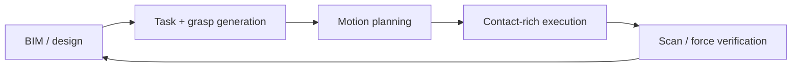

## English

This stream turns digital geometry into full-scale physical structures. It joins three
traditions: factory-style manipulation adapted to sites, architectural robotic
fabrication, and mobile machines that carry tools to workpieces too large to fixture.

> [!note] Prerequisites
> [[04-robotics/modern-robotics-book|Modern Robotics Summary]] ·
> [[04-robotics/contact-force-tactile|Contact]] · [[03-deep-learning/index|Deep Learning]] ·
> [[05-construction-robotics/site-perception|Site Perception]]

### 1. Why construction assembly is not factory assembly

Parts are large and compliant; tolerances accumulate; the work surface moves; access
changes after every placement; localization is imperfect; and humans share the space.
The research problem is therefore not only grasp planning. It is a closed loop:

Read where uncertainty is corrected. A system that plans once from perfect BIM has not
solved site assembly; it has demonstrated execution under a fixture-like assumption.

### 2. Three technical lineages

**Construction manipulation — Michigan and descendants.** Vision-guided assembly grew
into adaptive autonomy, learning from demonstration, tactile handover, and BIM/digital-
twin-grounded collaboration. The transferable idea is not one arm task but the
perception–human–execution loop.

**Architectural fabrication — ETH GKR and descendants.** In situ Fabricator, Mesh Mould,
DFAB HOUSE, cooperative assembly, timber/fiber fabrication, and shotcrete printing treat
robot motion as part of design. Here the artifact is often co-designed for robotic
reachability and tolerance rather than copied from a human workflow.

**Mobile/on-site production.** Mobile welding, bricklaying, concrete printing, and aerial
additive manufacturing trade factory precision for workspace. Navigation and base
localization become part of manipulation accuracy.

### 3. What to extract from a paper

| Question | Why it matters |
|---|---|
| Is the design robot-oriented? | Co-design can remove difficulty rather than solve it in control |
| How are parts localized? | CAD pose, markers, vision, scan registration, or human correction imply different autonomy |
| What closes the loop? | Force, tactile, vision, geometry scan, or no verification |
| What is mobile? | Base error couples into end-effector accuracy |
| What does the human do? | Handover, task specification, recovery, and safety are system components |
| What is full scale? | One joint or coupon does not validate structure-level tolerance accumulation |

### 4. Anchor systems

- **In situ Fabricator / Mesh Mould** — mobile fabrication and robot-oriented design;
  important for how architecture and robotics are co-designed.
- **HEAP dry-stone wall** — on-site material perception, placement planning, and force-
  controlled manipulation on an excavator; see the [[05-construction-robotics/earthmoving-heavy-machinery|heavy-machine stream]].
- **Aerial Additive Manufacturing** (Nature, 2022) — cooperating drones deposit and
  inspect material in flight; an existence proof with payload, material, and scale limits.
- **Mobile robotic welding** — UGV+arm systems connect site localization, seam perception,
  manipulation, and human supervision.

> [!warning] Reading the claim
> “Autonomous construction” may describe autonomous tool motion after humans prepared,
> localized, and fixtured every part. Count setup, calibration, material feeding,
> inspection, recovery, and finishing before assigning an autonomy level.

### After reading

- Explain why accumulated tolerance and changing access make site assembly difficult.
- Distinguish construction manipulation, architectural fabrication, and mobile production.
- Identify where a system closes the geometry/contact loop and what humans still do.
- Judge whether “full scale” and “on site” support the claimed deployment scope.

### Sources

- [ETH Gramazio Kohler Research](https://gramaziokohler.arch.ethz.ch/)
- [NCCR Digital Fabrication](https://dfab.ch/)
- [Zhang et al., *Aerial Additive Manufacturing with Multiple Autonomous Robots*](https://doi.org/10.1038/s41586-022-04988-4), Nature 2022

## 한국어

이 스트림은 디지털 형상을 실규모 구조물로 바꾼다. 현장에 맞춘 공장식 조작, 건축 로봇
패브리케이션, 고정하기 너무 큰 작업물로 공구를 운반하는 모바일 시스템의 세 전통이 만난다.

> [!note] 선수지식
> [[04-robotics/modern-robotics-book|Modern Robotics Summary]] ·
> [[04-robotics/contact-force-tactile|접촉]] · [[03-deep-learning/index|딥러닝]] ·
> [[05-construction-robotics/site-perception|현장 인식]]

### 1. 건설 조립이 공장 조립과 다른 이유

부품은 크고 변형되며, 공차가 누적되고, 작업면과 접근 경로가 배치마다 바뀐다. 위치 추정은
불완전하고 사람과 공간을 공유한다. 따라서 문제는 파지 계획 하나가 아니라 BIM/설계 → 과제·
파지 생성 → 모션 계획 → 접촉 실행 → 스캔·힘 검증 → 모델 갱신의 폐루프다. 완벽한 BIM에서
한 번 계획하는 시스템은 현장 조립 전체가 아니라 지그에 가까운 가정 아래 실행을 보인 것이다.

### 2. 세 기술 계보

- **미시간과 제자들의 건설 조작**: 비전 유도 조립 → 적응적 자율성 → 시연 학습 → 촉각
  전달 → BIM/디지털 트윈 기반 협업. 핵심은 단일 팔 과제가 아니라 인식–인간–실행 루프다.
- **ETH GKR와 제자들의 건축 패브리케이션**: In situ Fabricator, Mesh Mould, DFAB HOUSE,
  협력 조립, 목재·섬유 제작, 숏크리트. 사람 공정을 복제하기보다 로봇 도달성과 공차에 맞게
  설계와 제작을 함께 바꾼다.
- **모바일/현장 생산**: 이동 용접·조적·콘크리트 프린팅·공중 적층 제조. 작업 공간을 얻는
  대신 기지 위치 오차가 말단 정확도에 결합한다.

### 3. 논문에서 추출할 것

| 질문 | 의미 |
|---|---|
| 설계가 robot-oriented인가 | 제어가 아니라 공동설계로 난도를 제거했을 수 있다 |
| 부품 위치를 어떻게 아나 | CAD·마커·비전·스캔·인간 보정은 자율 수준이 다르다 |
| 무엇이 루프를 닫나 | 힘·촉각·비전·형상 스캔 또는 검증 없음 |
| 무엇이 이동하나 | 기지 오차가 말단 정확도에 들어간다 |
| 인간이 무엇을 하나 | 전달·과제 지정·복구·안전도 시스템 구성요소다 |
| 실규모는 무엇을 뜻하나 | 한 접합부는 구조물 전체의 공차 누적을 검증하지 않는다 |

### 4. 앵커 시스템

- **In situ Fabricator / Mesh Mould** — 모바일 제작과 robot-oriented design.
- **HEAP 돌담** — 현장 재료 인식, 배치 계획, 굴착기의 힘 제어 조작.
- **Aerial Additive Manufacturing**(Nature 2022) — 비행 중 재료를 적층·검사하는 협력 드론.
- **이동 로봇 용접** — UGV+팔이 현장 정합, 용접선 인식, 조작, 감독을 연결한다.

> [!warning] 주장 읽기
> “자율 시공”이 사람이 모든 부품을 준비·정합·고정한 뒤의 공구 운동만 뜻할 수 있다. 준비,
> 보정, 재료 공급, 검사, 복구, 마감까지 세고 자율 수준을 판단하라.

### 읽고 나면 말할 수 있어야 하는 것

- 공차 누적과 변하는 접근성이 현장 조립을 어렵게 하는 이유를 설명한다.
- 건설 조작, 건축 패브리케이션, 모바일 생산을 구분한다.
- 형상·접촉 루프가 어디서 닫히고 인간이 무엇을 하는지 찾는다.
- “실규모”와 “현장”이 주장 범위를 실제로 지지하는지 평가한다.

### 출처

- [ETH Gramazio Kohler Research](https://gramaziokohler.arch.ethz.ch/)
- [NCCR Digital Fabrication](https://dfab.ch/)
- [Aerial Additive Manufacturing](https://doi.org/10.1038/s41586-022-04988-4), Nature 2022
