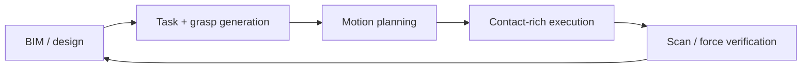

## English

This stream turns digital geometry into full-scale physical structures. It joins three
traditions: factory-style manipulation adapted to sites, architectural robotic
fabrication, and mobile machines that carry tools to workpieces too large to fixture.

> [!info] Depth target
> Read an assembly or fabrication paper and identify: which of the three lineages it
> belongs to, how parts are localized, where the geometry/contact loop closes, what the
> human still does, and whether the full-scale evidence supports the deployment claim.
> Designing fabrication systems is a working/mastery topic.

> [!note] Prerequisites
> [[04-robotics/modern-robotics-book|Modern Robotics Summary]] ·
> [[04-robotics/contact-force-tactile|Contact]] · [[03-deep-learning/index|Deep Learning]] ·
> [[05-construction-robotics/site-perception|Site Perception]]

### 1. Why construction assembly is not factory assembly

Parts are large and compliant; tolerances accumulate; the work surface moves; access
changes after every placement; localization is imperfect; and humans share the space.
The research problem is therefore not only grasp planning. It is a closed loop:

Read where uncertainty is corrected. A system that plans once from perfect BIM has not
solved site assembly; it has demonstrated execution under a fixture-like assumption.

A drywall sheet can be placed at the correct nominal pose and still bind against an uneven opening. Feedback exists because nominal geometry leaves this contact uncertainty unresolved. Track whether the robot observes the mismatch, changes its motion, and verifies the final fit. **The reading this gives you.** Read a successful placement as evidence for the entire correction loop only if the paper shows where that loop closed.

### 2. Three technical lineages

**Construction manipulation — Michigan and descendants.** Vision-guided assembly
([[01-canonical-papers/notes/8-construction/vision-guided-assembly|Feng 2015]]) grew into
sensor-driven adaptation to as-built geometry
([[01-canonical-papers/notes/8-construction/lundeen-2019|Lundeen 2019]]), learning from
demonstration for quasi-repetitive tasks
([[01-canonical-papers/notes/8-construction/liang-lfd|Liang 2020]]), cloud/VR-scaled
hierarchical imitation and tactile handover
([[01-canonical-papers/notes/8-construction/yu-imitation|Yu 2024]]), natural-language
task interfaces ([[01-canonical-papers/notes/8-construction/park-nl|Park 2024]]), and
BIM/digital-twin-grounded collaboration. The transferable idea is not one arm task but
the perception–human–execution loop.

**Architectural fabrication — ETH GKR and descendants.** In situ Fabricator, Mesh Mould,
DFAB HOUSE, cooperative assembly, timber/fiber fabrication, and shotcrete printing treat
robot motion as part of design. Here the artifact is often co-designed for robotic
reachability and tolerance rather than copied from a human workflow.

**Mobile/on-site production.** Mobile welding, bricklaying, concrete printing, and aerial
additive manufacturing trade factory precision for workspace. Navigation and base
localization become part of manipulation accuracy.

The lineages differ because they place the burden of adaptation in different places. A robot-oriented timber joint may simplify insertion through design, whereas a robot fitting an existing panel must accommodate the geometry it encounters. **The reading this gives you.** Before comparing success, identify which difficulty was removed by co-design and which was handled during execution. This makes the transferable contribution visible without treating every assembly demonstration as the same problem.

### 3. What to extract from a paper

| Question | Why it matters |
|---|---|
| Is the design robot-oriented? | Co-design can remove difficulty rather than solve it in control |
| How are parts localized? | CAD pose, markers, vision, scan registration, or human correction imply different autonomy |
| What closes the loop? | Force, tactile, vision, geometry scan, or no verification |
| What is mobile? | Base error couples into end-effector accuracy |
| What does the human do? | Handover, task specification, recovery, and safety are system components |
| What is full scale? | One joint or coupon does not validate structure-level tolerance accumulation |

For example, trace a panel from initial localization through contact to acceptance. If an operator manually aligns it before the recorded motion, that preparation is part of the tested system. **The reading this gives you.** Use the table to reconstruct one complete attempt, including setup and recovery. A missing step indicates the boundary of the evidence, not permission to assume that the robot performed it.

### 4. Anchor systems

- **In situ Fabricator / Mesh Mould** — mobile fabrication and robot-oriented design;
  important for how architecture and robotics are co-designed.
- **HEAP dry-stone wall** ([[01-canonical-papers/notes/8-construction/dry-stone-wall|dry-stone wall]])
  — on-site material perception, placement planning, and force-controlled manipulation on
  an excavator; see the [[05-construction-robotics/earthmoving-heavy-machinery|heavy-machine stream]].
- **Aerial Additive Manufacturing** (Nature, 2022 —
  [[01-canonical-papers/notes/8-construction/aerial-am-2022|aerial AM]]) — cooperating
  drones deposit and inspect material in flight; an existence proof with payload,
  material, and scale limits.
- **Mobile robotic welding** ([[01-canonical-papers/notes/8-construction/han-welding|Han welding]])
  — UGV+arm systems connect site localization, seam perception, manipulation, and human
  supervision, with switchable fully-automated and HRI modes.

> [!warning] Reading the claim · 핵심 주장 읽는 법
> “Autonomous construction” may describe autonomous tool motion after humans prepared,
> localized, and fixtured every part. Count setup, calibration, material feeding,
> inspection, recovery, and finishing before assigning an autonomy level.

### After reading

- Explain why accumulated tolerance and changing access make site assembly difficult.
- Distinguish construction manipulation, architectural fabrication, and mobile production.
- Identify where a system closes the geometry/contact loop and what humans still do.
- Judge whether “full scale” and “on site” support the claimed deployment scope.

### Self-check

1. A paper reports millimeter-accurate placement of a structure co-designed for the
   robot. Why does robot-oriented design complicate comparing this against a system that
   assembles conventional components?
2. From Feng 2015 to Lundeen 2019, what changed in how the Michigan line handles
   geometric uncertainty?
3. Why does base mobility couple into end-effector accuracy, and what does this imply
   for evaluating mobile fabrication systems like In situ Fabricator or mobile welding?
4. A single welded joint or printed coupon passes inspection. What does this fail to
   validate at building scale?

> [!tip]- Answers
> 1. Co-design can remove the difficulty (tolerance, reachability, fixturing) at the design stage rather than solving it in perception or control. The two systems then answer different questions: one shows what a robot-aware design enables, the other shows robustness to geometry the robot did not choose. Claims must be scoped accordingly.
> 2. Feng 2015 localizes parts with marker/fiducial-era vision and executes against that estimate; Lundeen 2019 adapts motion planning and task execution to the *as-built* geometry sensed on site — uncertainty moves from a one-shot localization problem into a sensor-driven adaptation loop.
> 3. The end-effector pose is the composition of base pose and arm kinematics, so base localization error adds (often dominantly) to tool error. Evaluations must report accuracy in the site frame after base motion — not only arm repeatability from a fixed base.
> 4. Structure-level tolerance accumulation: errors compound across many placements, access and support conditions change as the structure grows, and thermal/material effects interact across joints. One good coupon bounds none of these.

### Sources

- [ETH Gramazio Kohler Research](https://gramaziokohler.arch.ethz.ch/)
- [NCCR Digital Fabrication](https://dfab.ch/)
- [Zhang et al., *Aerial Additive Manufacturing with Multiple Autonomous Robots*](https://doi.org/10.1038/s41586-022-04988-4), Nature 2022

## 한국어

이 스트림은 디지털 형상을 실규모 구조물로 바꾼다. 현장에 맞춘 공장식 조작, 건축 로봇
패브리케이션, 고정하기 너무 큰 작업물로 공구를 운반하는 모바일 시스템의 세 전통이 만난다.

> [!info] 깊이 목표
> 조립·패브리케이션 논문을 읽고 다음을 짚는다: 세 계보 중 어디에 속하는지, 부품을
> 어떻게 위치 추정하는지, 형상·접촉 루프가 어디서 닫히는지, 인간이 여전히 무엇을 하는지,
> 실규모 증거가 배치 주장을 지지하는지. 패브리케이션 시스템 설계는 실무/숙달 단계의
> 주제다.

> [!note] 선수 지식
> [[04-robotics/modern-robotics-book|Modern Robotics Summary]] ·
> [[04-robotics/contact-force-tactile|접촉]] · [[03-deep-learning/index|딥러닝]] ·
> [[05-construction-robotics/site-perception|현장 인식]]

### 1. 건설 조립이 공장 조립과 다른 이유

부품은 크고 변형되며, 공차가 누적되고, 작업면과 접근 경로가 배치마다 바뀐다. 위치 추정은
불완전하고 사람과 공간을 공유한다. 따라서 문제는 파지 계획 하나가 아니라 폐루프다:

불확실성이 어디서 보정되는지 읽어라. 완벽한 BIM에서 한 번 계획하는 시스템은 현장 조립
전체가 아니라 지그에 가까운 가정 아래 실행을 보인 것이다.

드라이월 시트는 명목 자세에 정확히 놓여도 고르지 않은 개구부에 걸릴 수 있다. 명목 형상으로 해소되지 않는 접촉 불확실성 때문에 피드백이 필요하다. 불일치 관찰, 동작 변경, 최종 맞춤 검증을 추적한다. **여기서 얻는 독법.** 어느 지점에서 루프가 닫혔는지 보여 줄 때만 성공한 배치를 전체 보정 루프의 증거로 읽는다.

### 2. 세 기술 계보

- **미시간과 제자들의 건설 조작**: 비전 유도 조립
  ([[01-canonical-papers/notes/8-construction/vision-guided-assembly|Feng 2015]]) →
  as-built 형상에의 센서 기반 적응
  ([[01-canonical-papers/notes/8-construction/lundeen-2019|Lundeen 2019]]) → 준반복
  과제의 시연 학습 ([[01-canonical-papers/notes/8-construction/liang-lfd|Liang 2020]]) →
  클라우드/VR로 확장한 계층적 모방과 촉각 전달
  ([[01-canonical-papers/notes/8-construction/yu-imitation|Yu 2024]]) → 자연어 과제
  인터페이스 ([[01-canonical-papers/notes/8-construction/park-nl|Park 2024]]) → BIM/디지털
  트윈 기반 협업. 핵심은 단일 팔 과제가 아니라 인식–인간–실행 루프다.
- **ETH GKR와 제자들의 건축 패브리케이션**: In situ Fabricator, Mesh Mould, DFAB HOUSE,
  협력 조립, 목재·섬유 제작, 숏크리트. 사람 공정을 복제하기보다 로봇 도달성과 공차에 맞게
  설계와 제작을 함께 바꾼다.
- **모바일/현장 생산**: 이동 용접·조적·콘크리트 프린팅·공중 적층 제조. 작업 공간을 얻는
  대신 기지 위치 오차가 말단 정확도에 결합한다.

계보마다 적응의 부담을 놓는 위치가 다르다. 로봇 지향 목재 이음은 설계로 삽입을 단순화할 수 있다. 기존 패널을 맞추는 로봇은 마주친 형상에 적응해야 한다. **여기서 얻는 독법.** 성공을 비교하기 전에 공동 설계가 없앤 어려움과 실행 중 다룬 어려움을 구분한다. 조립 시연을 모두 같은 문제로 취급하지 않아야 전이 가능한 기여가 보인다.

### 3. 논문에서 추출할 것

| 질문 | 의미 |
|---|---|
| 설계가 robot-oriented인가 | 제어가 아니라 공동설계로 난도를 제거했을 수 있다 |
| 부품 위치를 어떻게 아나 | CAD·마커·비전·스캔·인간 보정은 자율 수준이 다르다 |
| 무엇이 루프를 닫나 | 힘·촉각·비전·형상 스캔 또는 검증 없음 |
| 무엇이 이동하나 | 기지 오차가 말단 정확도에 들어간다 |
| 인간이 무엇을 하나 | 전달·과제 지정·복구·안전도 시스템 구성요소다 |
| 실규모는 무엇을 뜻하나 | 한 접합부는 구조물 전체의 공차 누적을 검증하지 않는다 |

예를 들어 패널의 최초 위치 추정부터 접촉과 합격 판정까지 추적한다. 기록된 동작 전에 운전자가 수동 정렬했다면 그 준비도 시험한 시스템의 일부다. **여기서 얻는 독법.** 표로 준비·회복을 포함한 시도 하나를 복원한다. 빠진 단계는 증거의 경계이지 로봇이 수행했다고 가정할 근거가 아니다.

### 4. 앵커 시스템

- **In situ Fabricator / Mesh Mould** — 모바일 제작과 robot-oriented design.
- **HEAP 돌담** ([[01-canonical-papers/notes/8-construction/dry-stone-wall|돌담 노트]]) —
  현장 재료 인식, 배치 계획, 굴착기의 힘 제어 조작.
- **Aerial Additive Manufacturing**(Nature 2022 —
  [[01-canonical-papers/notes/8-construction/aerial-am-2022|aerial AM]]) — 비행 중 재료를
  적층·검사하는 협력 드론.
- **이동 로봇 용접** ([[01-canonical-papers/notes/8-construction/han-welding|Han 용접]]) —
  UGV+팔이 현장 정합, 용접선 인식, 조작, 감독을 연결하며 완전 자동과 HRI 모드를 전환한다.

> [!warning] 주장 읽기
> “자율 시공”이 사람이 모든 부품을 준비·정합·고정한 뒤의 공구 운동만 뜻할 수 있다. 준비,
> 보정, 재료 공급, 검사, 복구, 마감까지 세고 자율 수준을 판단하라.

### 읽고 나면 말할 수 있어야 하는 것

- 공차 누적과 변하는 접근성이 현장 조립을 어렵게 하는 이유를 설명한다.
- 건설 조작, 건축 패브리케이션, 모바일 생산을 구분한다.
- 형상·접촉 루프가 어디서 닫히고 인간이 무엇을 하는지 찾는다.
- “실규모”와 “현장”이 주장 범위를 실제로 지지하는지 평가한다.

### 스스로 점검

1. 로봇에 맞게 공동설계된 구조물의 밀리미터급 배치를 보고한 논문이 있다. robot-oriented
   design은 왜 이 결과를 기성 부재를 조립하는 시스템과 비교하기 어렵게 만드는가?
2. Feng 2015에서 Lundeen 2019로 오면서 미시간 계보의 기하 불확실성 처리는 무엇이
   달라졌는가?
3. 기지 이동성은 왜 말단 정확도에 결합하며, In situ Fabricator나 이동 용접 같은 모바일
   시스템 평가에 어떤 함의를 갖는가?
4. 용접 접합부 하나 또는 시편 하나가 검사를 통과했다. 건물 규모에서 이것이 검증하지
   못하는 것은?

> [!tip]- 정답 · Answers
> 1. 공동설계는 난도(공차·도달성·고정)를 제어나 인식이 아니라 설계 단계에서 제거할 수 있다. 두 시스템은 다른 질문에 답한다: 하나는 로봇 인지적 설계가 가능케 하는 것을, 다른 하나는 로봇이 선택하지 않은 형상에 대한 강건성을 보인다. 주장의 범위를 그에 맞게 한정해야 한다.
> 2. Feng 2015는 마커/피두셜 시대의 비전으로 부품을 위치 추정하고 그 추정값에 대해 실행한다; Lundeen 2019는 현장에서 센싱한 *as-built* 형상에 모션 계획과 과제 실행을 적응시킨다 — 불확실성이 일회성 위치 추정 문제에서 센서 기반 적응 루프로 옮겨 간다.
> 3. 말단 자세는 기지 자세와 팔 기구학의 합성이므로 기지 위치 오차가 (종종 지배적으로) 공구 오차에 더해진다. 평가는 고정 기지에서의 팔 반복 정밀도가 아니라 기지 이동 후 현장 좌표계 정확도를 보고해야 한다.
> 4. 구조물 수준의 공차 누적: 오차는 많은 배치에 걸쳐 복합되고, 구조물이 자라며 접근·지지 조건이 바뀌고, 열·재료 효과가 접합부들 사이에서 상호작용한다. 좋은 시편 하나는 이 중 무엇도 한정하지 못한다.

### 출처

- [ETH Gramazio Kohler Research](https://gramaziokohler.arch.ethz.ch/)
- [NCCR Digital Fabrication](https://dfab.ch/)
- [Aerial Additive Manufacturing](https://doi.org/10.1038/s41586-022-04988-4), Nature 2022
