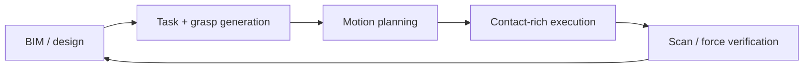

> [!note] Prerequisites · 선수 지식
> S1, its error budget and its safe fallbacks from [[05-construction-robotics/site-engineering|2.5 §1–§2]]; small rotations and their second-order error from [[02-foundations/se3-geometry|8. SE(3) §4]]; frames and transforms, for the structure's frame against the robot's, from [[04-robotics/robot-systems-deployment|10. Robot Systems §4]]; contact and binding from [[04-robotics/contact-force-tactile|9. Contact, Force & Tactile]]; and, for the learning lineages of §2, [[03-deep-learning/index|Deep Learning]].
> S1과 그 오차 예산, 안전 대비책은 [[05-construction-robotics/site-engineering|2.5 §1–§2]], 작은 회전과 그 2차 오차는 [[02-foundations/se3-geometry|8. SE(3) §4]], 로봇 좌표계와 구조물 좌표계를 가르는 좌표계와 변환은 [[04-robotics/robot-systems-deployment|10. 로봇 시스템 §4]], 접촉과 걸림은 [[04-robotics/contact-force-tactile|9. 접촉·힘·촉각]], §2의 학습 계보를 위해서는 [[03-deep-learning/index|딥러닝]]이 필요하다.

## English

This stream turns digital geometry into full-scale physical structures. It joins three
traditions: factory-style manipulation adapted to sites, architectural robotic
fabrication, and mobile machines that carry tools to workpieces too large to fixture.

> [!info] Depth target
> Read an assembly or fabrication paper and identify: which of the three lineages it
> belongs to, how parts are localized, where the geometry/contact loop closes, what the
> human still does, and whether the full-scale evidence supports the deployment claim.
> Designing fabrication systems is a working/mastery topic.

> [!note] First pass · 처음이라면
> Read the Running object and look at the picture, then §6–§8 and the Worked case after them: they turn S1's two holes into a decision — translate, yaw, or retreat — and an acceptance test in the structure's frame. §1–§5 are the map for comparing assembly papers; read them when you read one.

### Running object · 이 페이지의 대상

**S1** from [[05-construction-robotics/site-engineering|2.5 Site Robotics as an Engineering System]]: the $20\,\mathrm{kg}$ panel moved $8\,\mathrm{m}$, with two mounting holes $L=400\,\mathrm{mm}$ apart to be brought within $\pm5\,\mathrm{mm}$ of their targets. Here the targets are the two locating pins on the brackets, and the panel is followed from the end of transport to the moment both holes hang over their pins. Factory pick-and-place assumes one commanded pose. Two holes on a rigid panel are a residual *pair*: translation can zero the mean, only a yaw can zero the difference across the pin line, and when the yaw is unavailable, or the difference lies along the line, the move is a retreat and rescan.

| Symbol | Value | What it is |
|---|---:|---|
| $L$ | $400\,\mathrm{mm}$ | hole spacing, from S1 |
| $\varepsilon$ | $5\,\mathrm{mm}$ | S1's tolerance, read here per hole and per axis: $\lvert x\rvert\le\varepsilon$ and $\lvert y\rvert\le\varepsilon$ |
| $x,\ y,\ z$ | — | axes at the brackets: $x$ along the line through the two pins, $y$ horizontal across it, $z$ up the pins |
| $(x_A,\ y_A)$ | $(3,\ 0)\,\mathrm{mm}$ | hole A's residual from pin A after transport, from one scan in the structure's frame |
| $(x_B,\ y_B)$ | $(4,\ 12)\,\mathrm{mm}$ | hole B's residual from pin B, from the same scan |

The two residuals are this page's frozen numbers; $L$, $\varepsilon$ and everything else are S1's. Reading $\pm5\,\mathrm{mm}$ per hole and per axis follows the Worked case of [[05-construction-robotics/site-engineering|2.5]]; S1's table states the tolerance without naming an axis.

*Scope: this page teaches the two-hole alignment decision on S1 — the residual pair, the yaw and its tolerance, the spacing mismatch, and acceptance in the structure's frame — and maps the assembly literature by lineage. It does not teach what happens when each hole meets its pin, which is [[05-construction-robotics/construction-manipulation|9. Construction Manipulation]]'s contact event; how the scan that measures the holes is registered ([[05-construction-robotics/site-perception|5]]); or where S1's error budget comes from ([[05-construction-robotics/site-engineering|2.5 §2]]).*

### The picture · 그림으로 먼저 보기

<svg viewBox="0 0 560 294" style="max-width:100%;height:auto" role="img" aria-label="In the plane of yaw (horizontal, milliradians) and common-mode offset across the pin line (vertical, millimetres), hole A alone accepts a sloped band and hole B another; both holes accept only their overlap, a diamond with corners at plus or minus 25 milliradians and plus or minus 5 millimetres. The arrival, 30 milliradians and 6 millimetres, lies on hole A's centre line but outside the diamond; translation alone moves it to 30 milliradians and 0, still outside; adding the yaw brings it to the centre.">
<text x="20" y="20" font-size="12" fill="currentColor" font-weight="600">which rigid corrections both holes accept, across the pin line</text>
<polygon points="48.0,256.0 108.0,256.0 368.0,113.0 368.0,36.0 308.0,36.0 48.0,179.0" fill="currentColor" fill-opacity="0.10"/>
<polygon points="48.0,36.0 48.0,113.0 308.0,256.0 368.0,256.0 368.0,179.0 108.0,36.0" fill="currentColor" fill-opacity="0.10"/>
<polygon points="308.0,146.0 208.0,91.0 108.0,146.0 208.0,201.0" fill="currentColor" fill-opacity="0.16" stroke="currentColor" stroke-width="1.5"/>
<line x1="48.0" y1="234.0" x2="368.0" y2="58.0" stroke="currentColor" stroke-dasharray="2 3" stroke-opacity="0.7"/>
<rect x="48.0" y="36.0" width="320.0" height="220.0" fill="none" stroke="currentColor" stroke-opacity="0.5"/>
<line x1="48.0" y1="146.0" x2="368.0" y2="146.0" stroke="currentColor" stroke-opacity="0.35"/>
<line x1="208.0" y1="36.0" x2="208.0" y2="256.0" stroke="currentColor" stroke-opacity="0.35"/>
<line x1="48.0" y1="256.0" x2="48.0" y2="260.0" stroke="currentColor"/><text x="48.0" y="271.0" font-size="10.5" fill="currentColor" text-anchor="middle">&#8722;40</text>
<line x1="128.0" y1="256.0" x2="128.0" y2="260.0" stroke="currentColor"/><text x="128.0" y="271.0" font-size="10.5" fill="currentColor" text-anchor="middle">&#8722;20</text>
<line x1="208.0" y1="256.0" x2="208.0" y2="260.0" stroke="currentColor"/><text x="208.0" y="271.0" font-size="10.5" fill="currentColor" text-anchor="middle">0</text>
<line x1="288.0" y1="256.0" x2="288.0" y2="260.0" stroke="currentColor"/><text x="288.0" y="271.0" font-size="10.5" fill="currentColor" text-anchor="middle">20</text>
<line x1="368.0" y1="256.0" x2="368.0" y2="260.0" stroke="currentColor"/><text x="368.0" y="271.0" font-size="10.5" fill="currentColor" text-anchor="middle">40</text>
<line x1="44.0" y1="256.0" x2="48.0" y2="256.0" stroke="currentColor"/><text x="41.0" y="259.5" font-size="10.5" fill="currentColor" text-anchor="end">&#8722;10</text>
<line x1="44.0" y1="201.0" x2="48.0" y2="201.0" stroke="currentColor"/><text x="41.0" y="204.5" font-size="10.5" fill="currentColor" text-anchor="end">&#8722;5</text>
<line x1="44.0" y1="146.0" x2="48.0" y2="146.0" stroke="currentColor"/><text x="41.0" y="149.5" font-size="10.5" fill="currentColor" text-anchor="end">0</text>
<line x1="44.0" y1="91.0" x2="48.0" y2="91.0" stroke="currentColor"/><text x="41.0" y="94.5" font-size="10.5" fill="currentColor" text-anchor="end">5</text>
<line x1="44.0" y1="36.0" x2="48.0" y2="36.0" stroke="currentColor"/><text x="41.0" y="39.5" font-size="10.5" fill="currentColor" text-anchor="end">10</text>
<text x="208.0" y="285.0" font-size="11" fill="currentColor" text-anchor="middle">yaw &#952; (mrad)</text>
<text x="14" y="146.0" font-size="11" fill="currentColor" text-anchor="middle" transform="rotate(-90 14 146.0)">offset t (mm)</text>
<text x="312.0" y="142.0" font-size="10" fill="currentColor">25</text>
<text x="212.0" y="87.0" font-size="10" fill="currentColor">5</text>
<line x1="328.0" y1="85.0" x2="328.0" y2="134.0" stroke="currentColor" stroke-width="1.5"/><polygon points="328.0,141.0 324.5,134.0 331.5,134.0" fill="currentColor"/>
<line x1="323.0" y1="146.0" x2="221.0" y2="146.0" stroke="currentColor" stroke-width="1.5"/><polygon points="214.0,146.0 221.0,142.5 221.0,149.5" fill="currentColor"/>
<circle cx="328.0" cy="80.0" r="4" fill="currentColor"/>
<circle cx="328.0" cy="146.0" r="4" fill="currentColor"/>
<circle cx="208.0" cy="146.0" r="4" fill="currentColor"/>
<text x="320.0" y="74.0" font-size="10.5" fill="currentColor" text-anchor="end">arrival: A 0, B 12</text>
<text x="330.0" y="164.0" font-size="10.5" fill="currentColor" text-anchor="middle">translate only</text>
<text x="330.0" y="177.0" font-size="10.5" fill="currentColor" text-anchor="middle">A &#8722;6, B +6</text>
<text x="200.0" y="124.0" font-size="10.5" fill="currentColor" text-anchor="end">+ yaw</text>
<text x="200.0" y="137.0" font-size="10.5" fill="currentColor" text-anchor="end">A 0, B 0</text>
<text x="384" y="44" font-size="11" fill="currentColor" font-weight="600">S1 after transport (mm)</text>
<text x="384" y="60" font-size="11" fill="currentColor">hole A: x 3, y 0</text>
<text x="384" y="76" font-size="11" fill="currentColor">hole B: x 4, y 12</text>
<text x="384" y="100" font-size="11" fill="currentColor" font-weight="600">across the line, y</text>
<text x="384" y="116" font-size="11" fill="currentColor">mean 6, difference 12</text>
<text x="384" y="132" font-size="11" fill="currentColor">yaw 12/400 = 0.030 rad</text>
<text x="384" y="148" font-size="11" fill="currentColor">yaw alone may use 0.025 rad</text>
<text x="384" y="172" font-size="11" fill="currentColor" font-weight="600">along the line, x</text>
<text x="384" y="188" font-size="11" fill="currentColor">mean 3.5, difference 1</text>
<text x="384" y="204" font-size="11" fill="currentColor">exact mismatch 1.18: &#8723;0.59</text>
<rect x="384" y="225" width="14" height="10" fill="currentColor" fill-opacity="0.10" stroke="currentColor" stroke-opacity="0.4"/><text x="404" y="234" font-size="10.5" fill="currentColor">one hole&#8217;s band</text>
<rect x="384" y="241" width="14" height="10" fill="currentColor" fill-opacity="0.26" stroke="currentColor" stroke-width="1.5"/><text x="404" y="250" font-size="10.5" fill="currentColor">both holes: the diamond</text>
<line x1="384" y1="262" x2="398" y2="262" stroke="currentColor" stroke-dasharray="2 3"/><text x="404" y="266" font-size="10.5" fill="currentColor">hole A on its pin</text>
</svg>

S1's two holes after transport, in the plane of the two rigid corrections that change their residuals across the pin line: the common-mode offset $t$ and the yaw $\theta$. Hole A alone accepts its whole band, both holes only the diamond $|t|+200|\theta|\le5\,\mathrm{mm}$, whose corners are $\pm5\,\mathrm{mm}$ and $\pm25\,\mathrm{mrad}$. The arrival (hole A at $0$, hole B at $12\,\mathrm{mm}$) lies on hole A's centre line but outside the diamond; translating alone leaves $\pm6\,\mathrm{mm}$, and a $0.030\,\mathrm{rad}$ yaw added to the translation brings both holes to zero.

### 1. Why construction assembly is not factory assembly

Parts are large and compliant; tolerances accumulate; the work surface moves; access
changes after every placement; localization is imperfect; and humans share the space.
The research problem is therefore not only grasp planning. It is a closed loop:

Here BIM (Building Information Modeling) is the structured digital design model of the
building — its components, geometry, and properties; see
[[05-construction-robotics/digital-twin-workflows|Digital Twins & BIM]] for how it differs from a
digital twin.

Read where uncertainty is corrected. A system that plans once from perfect BIM has not
solved site assembly; it has demonstrated execution under a fixture-like assumption.

A drywall sheet can be placed at the correct nominal pose and still bind against an uneven opening: the rigid sheet touches the out-of-square or uneven frame before it reaches its planned pose, so it jams instead of seating. Feedback exists because nominal geometry leaves this contact uncertainty unresolved. Track whether the robot observes the mismatch, changes its motion, and verifies the final fit. **The reading this gives you.** Read a successful placement as evidence for the entire correction loop only if the paper shows where that loop closed.

On S1 the loop closes twice: at align, where one scan of both holes decides between translate, yaw and retreat (§6–§8), and after release, where the same two holes are measured again in the structure's frame. A system that closes only the first loop has checked its motion, not its placement.

"Tolerances accumulate", in S1's numbers: in a factory the bolted base and the fixture remove the map and base terms and bound the part term; on site all five land on the hole, and read linearly they add to $1+2+1+0.5+1=5.5$ mm, more than the $\pm5$ mm tolerance before any contact happens ([[05-construction-robotics/site-engineering|2.5 §2]]).

### 2. Three technical lineages

**Construction manipulation — Michigan and descendants.** Vision-guided assembly
([[01-canonical-papers/notes/8-construction/vision-guided-assembly|Feng 2015]]) grew into
sensor-driven adaptation to as-built geometry
([[01-canonical-papers/notes/8-construction/lundeen-2019|Lundeen 2019]]), learning from
demonstration for quasi-repetitive tasks
([[01-canonical-papers/notes/8-construction/liang-lfd|Liang 2020]]), cloud/VR-scaled
hierarchical imitation and tactile handover
([[01-canonical-papers/notes/8-construction/yu-imitation|Yu 2024]]), natural-language
task interfaces ([[01-canonical-papers/notes/8-construction/park-nl|Park 2024]]), and
BIM/digital-twin-grounded collaboration. The transferable idea is not one arm task but
the perception–human–execution loop.

**Architectural fabrication — ETH GKR and descendants.** This line spans a mobile on-site
robot (In situ Fabricator), fabrication techniques (Mesh Mould, cooperative assembly,
timber/fiber fabrication, and shotcrete printing, where shotcrete is sprayed concrete), and
full-scale demonstrations such as DFAB HOUSE. All of them treat robot motion as part of design. Here the artifact is often co-designed for robotic
reachability and tolerance rather than copied from a human workflow.

**Mobile/on-site production.** Mobile welding, bricklaying, concrete printing, and aerial
additive manufacturing trade factory precision for workspace. Navigation and base
localization become part of manipulation accuracy.

The lineages differ because they place the burden of adaptation in different places. A robot-oriented timber joint may simplify insertion through design, whereas a robot fitting an existing panel must accommodate the geometry it encounters. **The reading this gives you.** Before comparing success, identify which difficulty was removed by co-design and which was handled during execution. This makes the transferable contribution visible without treating every assembly demonstration as the same problem.

**The same residual, three lineages.** Put this page's $12$ mm residual in front of each lineage and they answer differently. The Michigan line senses and adapts: scan both holes, split the pair into modes, correct — §6–§8. The ETH line changes the problem before the robot meets it, co-designing panel and brackets so that the holes locate themselves and the robot's positioning requirement loosens. Mobile production looks first at the base term, $2$ of S1's linear $5.5$ mm and $55\%$ of its root-sum-square variance, because base localization is where a mobile system's accuracy goes.

### 3. What to extract from a paper

| Question | Why it matters |
|---|---|
| Is the design robot-oriented? | Co-design can remove difficulty rather than solve it in control |
| How are parts localized? | CAD pose, markers (PnP on a tag's corners, [[04-robotics/geometric-perception-calibration\|3.5 §2.7]]), vision, scan registration ([[05-construction-robotics/site-perception\|5]]), or human correction imply different autonomy |
| What closes the loop? | Force, tactile, vision, geometry scan, or no verification |
| In which frame is acceptance measured? | A robot-frame pose can pass while a hole misses the structure (§8) |
| What is mobile? | Base error couples into end-effector accuracy |
| What does the human do? | Handover, task specification, recovery, and safety are system components |
| What is full scale? | One joint or coupon does not validate structure-level tolerance accumulation |

For example, trace a panel from initial localization through contact to acceptance. If an operator manually aligns it before the recorded motion, that preparation is part of the tested system. **The reading this gives you.** Use the table to reconstruct one complete attempt, including setup and recovery. A missing step indicates the boundary of the evidence, not permission to assume that the robot performed it.

On S1 the table's fourth row does the most work. A report of "$95\%$ within $5$ mm" that answers *what closes the loop* with the robot's pose, and *in which frame* with the robot's own, passes this page's arrival while hole B is $12$ mm off its pin (§8); a report that answers both with a scan of the holes in the structure's frame does not.

### 4. Anchor systems

- **In situ Fabricator / Mesh Mould** — mobile fabrication and robot-oriented design;
  important for how architecture and robotics are co-designed.
- **HEAP dry-stone wall** ([[01-canonical-papers/notes/8-construction/dry-stone-wall|dry-stone wall]])
  — on-site stone detection and scanning, geometric placement planning, and grasping and
  placement with a gripper-equipped excavator; see the [[05-construction-robotics/earthmoving-heavy-machinery|heavy-machine stream]].
- **Aerial Additive Manufacturing** (Nature, 2022 —
  [[01-canonical-papers/notes/8-construction/aerial-am-2022|aerial AM]]) — cooperating
  drones deposit and inspect material in flight; an existence proof with payload,
  material, and scale limits.
- **Mobile robotic welding** ([[01-canonical-papers/notes/8-construction/han-welding|Han welding]])
  — UGV+arm systems connect site localization, seam perception, manipulation, and human
  supervision, with switchable fully-automated and HRI modes.

**The reading this gives you.** None of the four fits a panel to pins, so read them for the questions S1 makes concrete: how each localizes its part — scan, markers, GNSS — where its loop closes, and in which frame its result was accepted. A result accepted in the machine's own frame is §8's non-example at building scale.

> [!warning] Reading the claim · 핵심 주장 읽는 법
> “Autonomous construction” may describe autonomous tool motion after humans prepared,
> localized, and fixtured every part. Count setup, calibration, material feeding,
> inspection, recovery, and finishing before assigning an autonomy level.

### 5. Where this stream is moving (2019–2025)

Counted as in [[05-construction-robotics/lineage|lineage §6]]: assembly, fabrication and printing papers rose from $33$ in 2019–2021 to $59$ in 2023–2025 but fell from $27\%$ to $23\%$ of construction robot papers, still one of the three largest streams. Its centre of gravity is off-site: vision-guided assembly of prefabricated components (Liu et al., *AutCon* 162, 2024, [DOI](https://doi.org/10.1016/j.autcon.2024.105385)), human–robot collaboration in timber prefabrication (Yang et al., *AutCon* 160, 2024, [DOI](https://doi.org/10.1016/j.autcon.2024.105333)), modular construction manufacturing (Fu et al., *AutCon* 158, 2024, [DOI](https://doi.org/10.1016/j.autcon.2023.105196), a review), and robotic 3D printing of concrete components for residential buildings (Alabbasi et al., *AutCon* 148, 2023, [DOI](https://doi.org/10.1016/j.autcon.2023.104751)). Contact-rich assembly on an active site stays rare, which is [[05-construction-robotics/construction-manipulation|9. Construction Manipulation §3]]'s finding seen from the volume side.

For S1 the drift off site matters directly. A panel prefabricated off site arrives with its hole spacing fixed at the factory, so the panel's share of §6's spacing mismatch is a factory tolerance that the site can detect but not correct, while the brackets' share was set on site; the robot's part of the job is to measure the mismatch and refuse the pair when it is too large.

### 6. Two holes are a residual pair

*In one sentence:* two holes give four numbers for a part with three freedoms in the plane, so written as means and differences they say which part of the error a translation fixes, which a yaw fixes, and which — the spacing mismatch — no robot motion fixes.

A single hole measured against its pin gives two numbers, $(x,y)$, while a rigid panel has three freedoms that move its holes in the horizontal plane: two translations and a yaw about the pins' vertical axis. One hole therefore fixes the translation and leaves the yaw unobserved, since turning the panel about hole A changes nothing hole A reports. The second hole adds two numbers for the one freedom left, so the pair observes the yaw and still has one number over. Written per axis as a mean and a difference, the four numbers say which correction each part of the error needs.

> **Common-mode and differential-mode residual, defined.** For two holes on one rigid part, the **common-mode residual** along an axis is the mean of the two holes' residuals, and the **differential-mode residual** is their difference — a *change of variables* on the pair, not a new measurement. Three defining conditions. Both residuals come from **one frame**, the frame the tolerance is written in, which on S1 is the structure's at the pins. They come from **one instant**, one scan of one panel pose, so that nothing moved between them. And they are taken **along one axis**, $x$ along the pin line or $y$ across it, because the two axes answer to different corrections.
>
> $$\bar e=\tfrac12(e_A+e_B),\qquad \Delta e=e_B-e_A,\qquad e_{A,B}=\bar e\mp\tfrac12\Delta e$$
>
> where $e_A$ and $e_B$ are the two holes' residuals along the chosen axis; the last identity recovers the pair from its two modes, so nothing is lost by the change of variables.
>
> - **Example**: this page's arrival. Across the line, $(0,12)$ mm gives $\bar e_y=6$ and $\Delta e_y=12$; along it, $(3,4)$ gives $\bar e_x=3.5$ and $\Delta e_x=1$.
> - **Non-example**: residuals read from two scans with the base re-localizing between them. Their difference now contains the base's own motion, so a yaw computed from it can command a rotation the panel never had.
> - **Why it matters**: a translation changes only the common modes and a yaw only $\Delta e_y$ (§7), so the modes turn "the panel is off" into a correction with a name — and the one mode that no rigid motion changes, to first order, has a name too.

To first order that mode is the one number over; made exact, it is the next definition.

> **Spacing mismatch, defined.** The **spacing mismatch** of a hole pair is the *difference between the hole spacing and the pin spacing* — how much farther apart, or closer together, the holes are than the pins — and to first order it is the pair's differential-mode residual along the pin line, $\Delta e_x$. Three defining conditions. The part is **rigid**, so its hole spacing is fixed; the pins are **fixed to the structure**, so theirs is too; and both are measured **in the structure's frame, from one scan**. Under those conditions no rigid motion changes it, because rigid motions preserve distances, so the best a robot can do is centre the pair on the pin line and split it.
>
> $$s=\lVert H_B-H_A\rVert-L\approx\Delta e_x+\frac{\Delta e_y^2}{2L},\qquad \min_{\text{rigid motions}}\ \max_h r_h=\tfrac12\lvert s\rvert$$
>
> where $H_A$ and $H_B$ are the hole centres, $L$ the pin spacing, and $r_h$ hole $h$'s distance from its pin; the minimum holds because every placement has $r_A+r_B\ge\lvert s\rvert$ by the triangle inequality, so the worse hole is at least $\lvert s\rvert/2$ off, and centring reaches it.
>
> - **Example**: the arrival, $s=\sqrt{401^2+12^2}-400=1.18$ mm — the $1$ mm of $\Delta e_x$ plus $12^2/800=0.18$ mm that the yaw hides at first order. Centred on the pin line after the yaw, each hole sits $0.59$ mm from its pin, inside $\pm5$: Step 4 of the Worked case.
> - **Non-example**: $s=11$ mm. Centred, each hole is $5.5$ mm off, so no robot motion aligns the pair, and a controller that pushes harder is fighting the building rather than an error — the binding of §1.
> - **Why it matters**: it is the part of a two-hole residual that belongs to the panel or the brackets, not to the robot, so beyond $2\varepsilon$ it calls for a retreat and a report rather than a correction; a system that tries to correct it is misattributing a fabrication error.

### 7. Yaw, and the tolerance it shares

A small yaw $\theta$ about the pins' vertical axis, through the pair's midpoint, moves a point at distance $r$ from the axis by $r\theta$ perpendicular to its offset, to first order ([[02-foundations/se3-geometry|8. SE(3) §4]]). The holes sit at $\mp L/2$ along $x$, so a yaw moves them by $\mp(L/2)\theta$ across the line and, at second order, by $(L/2)\theta^2/2$ toward each other along it. With a common-mode offset $t$ across the line added, the two residuals across it are

$$y_A=t-\tfrac{L}{2}\theta,\qquad y_B=t+\tfrac{L}{2}\theta$$

so $t=\bar e_y$ and $\theta=\Delta e_y/L$: the common mode is a translation, the differential mode a yaw, and one scan of an unseated pair gives both. Along the line the same two motions leave the difference alone to first order, which is why §6's spacing mismatch is out of the robot's reach.

> **Yaw tolerance of a hole pair, defined.** The **yaw tolerance** of two features a distance $L$ apart is the *largest rotation of the rigid part* about an axis parallel to the pins, through the pair's midpoint, that keeps both features inside a positional tolerance $\varepsilon$. Three defining conditions. The part is **rigid**, so $L$ does not change as it turns. The rotation is **small**: $\sin\theta\approx\theta$, and the along-line term $1-\cos\theta\approx\theta^2/2$ is second order, which is what SE(3) §4's first-order model drops. And the tolerance is **shared**: an offset $t$ and a yaw $\theta$ load the same holes, so they must fit together, and the yaw gets the whole tolerance only when the translation is perfect.
>
> $$\lvert t\rvert+\tfrac{L}{2}\lvert\theta\rvert\le\varepsilon\quad\Longrightarrow\quad\lvert\theta\rvert\le\theta_{\max}=\frac{2\varepsilon}{L}$$
>
> where $t$ is the across-line offset left after translation, $\theta$ the yaw in radians and $\varepsilon$ the per-hole tolerance; the left inequality holds both holes at once, since the worse hole's residual is $\lvert t\rvert+(L/2)\lvert\theta\rvert$, and the bound on $\theta$ is its value at $t=0$.
>
> - **Example**: S1, $\varepsilon=5$ mm and $L=400$ mm: $\theta_{\max}=10/400=0.025$ rad, $1.43^\circ$. The arrival's $\theta=12/400=0.030$ rad is over it, which is why translation alone leaves $\pm6$ mm; the second-order term at that yaw is $200\times0.03^2/2=0.09$ mm, $2\%$ of the tolerance.
> - **Non-example**: yaw as a fix for the spacing mismatch. A yaw within $\theta_{\max}$ shortens the pair's reach along the line by at most $L\theta_{\max}^2/2=0.125$ mm, and the yaw that would close the arrival's $1.18$ mm, $0.077$ rad, throws each hole $15.4$ mm across the line.
> - **Why it matters**: it turns a position tolerance into the heading accuracy the base and arm must deliver, and it tightens as the holes move apart — holes $1$ m apart allow only $0.010$ rad — even though a wider pair also measures the yaw more precisely from the same scan.

The diamond of the picture is this inequality drawn: its corners are $\pm\varepsilon$ on the offset axis and $\pm\theta_{\max}$ on the yaw axis, and each hole's own band is one of the two strips whose overlap it is.

### 8. Accepting a placement: both holes, in the structure's frame

*In one sentence:* align chooses among three moves by the pair's modes, and a placement counts only when both holes are measured again, on the structure, after release.

The three decisions at align follow from §6–§7, and the modes decide which one applies:

| Decision | When |
|---|---|
| translate only | both holes within $\varepsilon$ once the means are removed, which a translation does exactly: $\lvert\Delta e_x\rvert\le2\varepsilon$ and $\lvert\Delta e_y\rvert\le2\varepsilon$ |
| translate and yaw | $\lvert\Delta e_y\rvert>2\varepsilon$ with $\lvert s\rvert\le2\varepsilon$, and the yaw is available: base not yet committed, no joint limit, no worker in the swing |
| retreat and rescan | $\lvert s\rvert>2\varepsilon$, reported as a mismatch; or a yaw is needed and unavailable; or the scan is suspect (two poses, or the wrong frame) |

Retreat and rescan is S1's safe fallback for align ([[05-construction-robotics/site-engineering|2.5 §1]]): it costs a scan, never a jam. When the yaw is unavailable, the fallback is still retreat and rescan — not "command the mean pose", which zeroes the common modes and leaves the difference where it was. A residual larger than S1's budget is itself a finding to record, not only a pose to fix; the Worked case reads one.

Passing align is not seating. The $\pm5$ mm tolerance governs how close each hole must come before contact, and the pins are stricter twice over. A pin's tapered lead-in captures only holes within its capture radius, which on [[05-construction-robotics/construction-manipulation|9. Construction Manipulation]] is $4$ mm, so a hole at the edge of the align tolerance can pass align and still miss its pin; and two pins accept a spacing mismatch no larger than the two holes' radial clearances added together. The contact event itself — capture, and the sideways force the arm exerts while it happens — is priced there. What follows seating is the test this page owns.

> **Site-frame acceptance, defined.** A **site-frame acceptance test** is a *pass/fail rule applied to the placed part*, the check that the work package's end state was reached. Four defining conditions. It measures **the features the tolerance names** — both holes, not the end-effector. It measures them **in the frame the tolerance is written in** — the structure's, through the pins, not the robot's. It measures them **after the last motion** — after seating and release, not at the commanded pose. And it applies the tolerance **to every feature**, so the worst one decides.
>
> $$\text{accept}\iff\max_{h\in\{A,B\}}\ \max\big(\lvert x_h\rvert,\ \lvert y_h\rvert\big)\le\varepsilon$$
>
> where $x_h$ and $y_h$ are hole $h$'s residuals from its pin in the structure's frame, measured after release, and $\varepsilon=5$ mm; it is a maximum rather than an average because one hole out of tolerance fails the panel however good the other is.
>
> - **Example**: S1 seated and released with the pair where align left it, re-scanned: residuals $(-0.59,\ 0)$ and $(0.59,\ 0)$ mm (the Worked case below), largest $0.59\le5$: accept.
> - **Non-example**: "end-effector pose error below $5$ mm in the robot frame". It measures the tool, not the holes; in the robot's frame, not the structure's; at the commanded pose, not after release. If the robot's model put pin B where the design said, this page's arrival would pass it while hole B is still $12$ mm off the structure.
> - **Why it matters**: it is the one test whose pass means S1's end state was reached; a paper that reports the robot-frame metric has tested the robot's motion, not the building.

### Worked case · 대상으로 한 번 끝까지

Five steps on this page's residual pair, then what the $12$ mm says about S1's budget. They are course computations on frozen numbers, not measurements of a panel.

**Step 1 — one hole at a time.** Hole A, $(3,\ 0)$ mm, is inside $\pm5$ on both axes; hole B, $(4,\ 12)$ mm, is $12-5=7$ mm outside across the line. A check of hole A alone, or of one tool pose that happens to sit over it, would pass this panel.

**Step 2 — the pair in modes (§6).** Along the line $\bar e_x=(3+4)/2=3.5$ mm and $\Delta e_x=4-3=1$ mm; across it $\bar e_y=(0+12)/2=6$ mm and $\Delta e_y=12$ mm. To first order the spacing mismatch is $\Delta e_x=1\,\mathrm{mm}$, far below $2\varepsilon=10\,\mathrm{mm}$, so nothing yet calls for a retreat.

**Step 3 — translation only.** Moving the panel by $(-3.5,\ -6)$ mm zeroes both means and leaves hole A at $(-0.5,\ -6)$ and hole B at $(0.5,\ 6)$: both $1$ mm outside across the line. In §7's terms $\theta=\Delta e_y/L=12/400=0.030$ rad exceeds $\theta_{\max}=0.025$ rad; equivalently $\lvert\Delta e_y\rvert=12>2\varepsilon=10$. Translation alone is rejected.

**Step 4 — translation and yaw (§7).** Rotate by $-0.030$ rad ($-1.72^\circ$) about the midpoint and translate as before. To first order both holes go to $y=0$ and to $x=\mp0.5$ mm, $\Delta e_x$ split evenly. Solved exactly, as a rigid fit of the two holes to the two pins, the yaw is $\arctan(12/401)=0.0299$ rad and the holes land at $x=\mp0.59$ mm, half of the exact mismatch $s=\sqrt{401^2+12^2}-400=1.18$ mm (§6); the $0.09$ mm per hole between the two answers is the second-order term $(L/2)\theta^2/2=200\times0.03^2/2$, $2\%$ of the tolerance.

**Step 5 — pass align, seat, then accept (§8).** Confirmed by a re-scan before contact, the largest residual is $0.59\le5$ mm, so align passes and the pair goes to its pins. There the stricter fit of [[05-construction-robotics/construction-manipulation|9. Construction Manipulation]] applies — an $18$ mm hole on a $16$ mm pin, $1$ mm of radial clearance at each — which accepts a mismatch up to $2$ mm, so $1.18$ mm seats with $0.41$ mm to spare at each hole. Only after seating and release does §8's test run, on a fresh scan of both holes.

**What the 12 mm says about S1's budget.** S1's allocations add to $5.5$ mm even read linearly ([[05-construction-robotics/site-engineering|2.5 §2]]), so a $12$ mm residual is not an unlucky draw from that budget: a term is missing — an opening out of square, a bracket set out of line — or the scan is not in the structure's frame. The yaw fixed this panel; recording which term was missing fixes the next one.

**What the second hole bought.** With hole A alone the panel looked placed. The second hole observed the yaw, $0.030$ rad, and exposed the one number no robot motion can change, the spacing mismatch — $1.18$ mm, or $1$ mm to first order — which here is small enough to split.

### After reading

- [ ] Explain why accumulated tolerance and changing access make site assembly difficult.
- [ ] Distinguish construction manipulation, architectural fabrication, and mobile production.
- [ ] Identify where a system closes the geometry/contact loop and what humans still do.
- [ ] Judge whether “full scale” and “on site” support the claimed deployment scope.
- [ ] Split a two-hole residual into common and differential modes and decide translate, yaw or retreat.
- [ ] Compute a hole pair's yaw tolerance and spacing mismatch, and say which belongs to the robot and which to the part.
- [ ] State the site-frame acceptance test, and describe a panel that a robot-frame pose check would pass while it fails.
- [ ] Draw S1's assembly loop — design model, localize, transport, scan both holes, decide translate / yaw / retreat, contact, verify both holes in the structure's frame — with align's safe fallback marked.

### Self-check

1. A paper reports millimeter-accurate placement of a structure co-designed for the
   robot. Why does robot-oriented design complicate comparing this against a system that
   assembles conventional components?
2. From Feng 2015 to Lundeen 2019, what changed in how the Michigan line handles
   geometric uncertainty?
3. Why does base mobility couple into end-effector accuracy, and what does this imply
   for evaluating mobile fabrication systems like In situ Fabricator or mobile welding?
4. A single welded joint or printed coupon passes inspection. What does this fail to
   validate at building scale?
5. A system scans only hole A after placement and finds it $1$ mm from its pin. What does it know about hole B?
6. Why is a spacing mismatch beyond $2\varepsilon$ a trigger for retreat and report rather than for a correction?

> [!tip]- Answers
> 1. Co-design can remove the difficulty (tolerance, reachability, fixturing) at the design stage rather than solving it in perception or control. The two systems then answer different questions: one shows what a robot-aware design enables, the other shows robustness to geometry the robot did not choose. Claims must be scoped accordingly.
> 2. Feng 2015 tracks AprilTags on the building frame and on every block, and places each block at its marker-estimated pose against the design; Lundeen 2019 needs no tags on the workpiece — it scans the actual joint with a laser profiler, registers the BIM geometry to that scan, and adapts the fill plan — so uncertainty moves from where a tagged part sits to what shape the untagged work actually has.
> 3. The end-effector pose is the composition of base pose and arm kinematics, so base localization error adds (often dominantly) to tool error. Evaluations must report accuracy in the site frame after base motion — not only arm repeatability from a fixed base.
> 4. Structure-level tolerance accumulation: errors compound across many placements, access and support conditions change as the structure grows, and thermal/material effects interact across joints. One good coupon bounds none of these.
> 5. Nothing about the yaw or the spacing. A rotation about hole A leaves hole A's residual unchanged and moves hole B by $L\theta$ across the line, and a spacing mismatch moves hole B along it, so hole B can be anywhere those two allow: this page's arrival had hole A inside tolerance and hole B $12$ mm off.
> 6. No rigid motion changes it, because rigid motions preserve the distance between the holes; the best fit centres the pair and leaves each hole $\lvert s\rvert/2$ from its pin, more than $\varepsilon$ once $\lvert s\rvert>2\varepsilon$. The fault is then in the panel or the brackets, and pushing harder turns a fabrication error into binding (§1); the robot's job is to back away and report the mismatch.

### Problem set · 과제

Tier B. **S1** from [[05-construction-robotics/site-engineering|2.5]], worked by hand; holes $400\,\mathrm{mm}$ apart unless the item changes $L$. The lineages of §2–§4 are for item 3, not a second derivation.

1. **Draw.** The picture for holes $500\,\mathrm{mm}$ apart and the arrival of item 2: residuals across the line of $1$ and $14$ mm. Draw both holes' bands, the diamond with its new corners, and the three states — arrival, translation only, translation and yaw — with each hole's residual written beside them.
2. **Derive.** Holes $500\,\mathrm{mm}$ apart. (a) Across the line the holes read $1$ and $14$ mm: the translation-only $t$ and the residuals it leaves — accept against $\pm5\,\mathrm{mm}$? (b) The yaw that seats a rigid panel, and this pair's yaw tolerance. (c) Along the line they read $-3$ and $+8$ mm: the spacing mismatch, and the best any rigid motion can do. Translate, yaw, or retreat? (d) The second-order along-line shift that the yaw of (b) causes.
3. **Interpret.** A paper reports $95\%$ "placement success", defined as end-effector pose error below $5$ mm in the robot frame, with no hole scan after seating. (a) Which S1 claim remains open? (b) Which of §8's four acceptance conditions does the metric fail? (c) Using this page's arrival, describe a panel the metric would pass while S1 rejects it. (d) Which questions of §3's table would you put to the authors first?

> [!note]- How to draw it · 그리는 법
> - **Axes as in the picture**: yaw $\theta$ in mrad across, offset $t$ in mm up; each hole's band now has slope $L/2=250$ mm per rad, $0.25$ mm per mrad.
> - **The diamond** $\lvert t\rvert+250\lvert\theta\rvert\le5$: corners at $t=\pm5$ mm and $\theta=\pm20$ mrad, narrower than S1's $\pm25$ because the holes are farther apart.
> - **Three states**: arrival at $\theta=26$ mrad, $t=7.5$ mm (hole A at $1$, hole B at $14$), on neither hole's centre line; translation only at $\theta=26$ mrad, $t=0$, residuals $\mp6.5$ mm, outside; translation and yaw at the origin.
> - **Beside the plot**, the along-line numbers of item 2(c): spacing mismatch $11.17$ mm ($11$ to first order), best rigid fit $\pm5.58$ mm, which no point in this plane can fix.
> - The drawing is wrong if the diamond keeps S1's $\pm25$ mrad corners: the yaw tolerance is $2\varepsilon/L$ and shrinks as $L$ grows.

> [!tip]- Solutions
> 1. As in the How-to-draw list: corners $\pm5$ mm and $\pm20$ mrad; arrival at $(26\ \mathrm{mrad},\ 7.5\ \mathrm{mm})$, translation only at $(26,\ 0)$ with residuals $\mp6.5$ mm, translation and yaw at the origin.
> 2. (a) $t=(1+14)/2=7.5$ mm leaves $\mp6.5$ mm, both outside $\pm5$: reject. (b) $\theta=(14-1)/500=0.026$ rad ($1.49^\circ$); the yaw tolerance is $2\times5/500=0.020$ rad ($1.15^\circ$), which is why (a) failed. (c) $\Delta e_x=8-(-3)=11$ mm to first order, and exactly $s=\sqrt{511^2+13^2}-500=11.17$ mm; centred, each hole sits $5.58$ mm off ($5.5$ to first order), outside $\pm5$ whatever the yaw: retreat, rescan and report — the panel's holes or the brackets are out of line, and no robot motion can align this pair. (d) $250\times0.026^2/2=0.085$ mm, negligible beside the $11$ mm mismatch.
> 3. (a) That both holes meet $\pm5\,\mathrm{mm}$ on the structure after seating. (b) All four: it measures the tool, not the holes; in the robot's frame, not the structure's; before release, not after; and as one pose, so it cannot apply the tolerance to each hole. (c) This page's arrival: if the robot's model put pin B where the design said, the tool can sit within $5$ mm of its commanded pose while hole B is $12$ mm off its real pin. (d) "What closes the loop?" — here nothing after seating does — and "In which frame is acceptance measured?".

### Sources

- [ETH Gramazio Kohler Research](https://gramaziokohler.arch.ethz.ch/)
- [NCCR Digital Fabrication](https://dfab.ch/)
- [Zhang et al., *Aerial Additive Manufacturing with Multiple Autonomous Robots*](https://doi.org/10.1038/s41586-022-04988-4), Nature 2022

The residual pair and every number in §6–§8 and the Worked case are course values on the frozen object S1, not measurements of a panel.

**Within this wiki**

- [[05-construction-robotics/site-engineering|2.5 §2]] — S1's error budget, against which the Worked case reads a $12$ mm residual.
- [[02-foundations/se3-geometry|8. SE(3) §4]] — the small-rotation model and its second-order error used in §7.
- [[05-construction-robotics/construction-manipulation|9. Construction Manipulation]] — the contact event after alignment.

## 한국어

이 스트림은 디지털 형상을 실규모 구조물로 바꾼다. 현장에 맞춘 공장식 조작, 건축 로봇
패브리케이션, 고정하기 너무 큰 작업물로 공구를 운반하는 모바일 시스템의 세 전통이 만난다.

> [!info] 깊이 목표
> 조립·패브리케이션 논문을 읽고 다음을 짚는다: 세 계보 중 어디에 속하는지, 부품을
> 어떻게 위치 추정하는지, 형상·접촉 루프가 어디서 닫히는지, 인간이 여전히 무엇을 하는지,
> 실규모 증거가 배치 주장을 지지하는지. 패브리케이션 시스템 설계는 실무/숙달 단계의
> 주제다.

> [!note] 처음이라면 · First pass
> 이 페이지의 대상을 읽고 그림을 본 뒤, §6–§8과 그 뒤의 계산 절을 읽는다. 이 부분이 S1의 두 구멍을 하나의 결정 — 병진, 요, 후퇴 — 과 구조물 좌표계에서의 합격 시험으로 바꾼다. §1–§5는 조립 논문을 비교하는 지도이므로, 논문을 읽을 때 함께 읽는다.

### 이 페이지의 대상 · Running object

[[05-construction-robotics/site-engineering|2.5 현장 로보틱스를 공학 시스템으로]]의 **S1**이다. $8\,\mathrm{m}$ 옮겨 온 $20\,\mathrm{kg}$ 패널의, $L=400\,\mathrm{mm}$ 떨어진 두 체결 구멍을 목표의 $\pm5\,\mathrm{mm}$ 안으로 가져와야 한다. 여기서 목표는 브래킷 위의 위치 결정 핀 두 개이고, 운반이 끝난 때부터 두 구멍이 핀 위에 걸리는 순간까지 패널을 따라간다. 공장 pick-and-place는 명령 자세 하나를 가정한다. 강체 패널의 구멍 둘은 잔차 *쌍*이다. 병진은 평균을 0으로 만들 수 있고, 핀 선을 가로지르는 차는 요(yaw)만 없앨 수 있으며, 요를 쓸 수 없거나 차가 선을 따라 놓여 있으면 할 일은 후퇴와 재스캔이다.

| 기호 | 값 | 뜻 |
|---|---:|---|
| $L$ | $400\,\mathrm{mm}$ | 구멍 간격, S1에서 |
| $\varepsilon$ | $5\,\mathrm{mm}$ | S1의 허용오차. 여기서는 구멍마다, 축마다 읽는다: $\lvert x\rvert\le\varepsilon$, $\lvert y\rvert\le\varepsilon$ |
| $x,\ y,\ z$ | — | 브래킷에서의 축. $x$는 두 핀을 잇는 선을 따라, $y$는 그 선을 가로지르는 수평, $z$는 핀을 따라 위 |
| $(x_A,\ y_A)$ | $(3,\ 0)\,\mathrm{mm}$ | 운반 뒤 핀 A에 대한 구멍 A의 잔차, 구조물 좌표계에서 한 번 스캔한 값 |
| $(x_B,\ y_B)$ | $(4,\ 12)\,\mathrm{mm}$ | 같은 스캔에서 핀 B에 대한 구멍 B의 잔차 |

두 잔차가 이 페이지가 고정한 숫자이고, $L$과 $\varepsilon$을 비롯한 나머지는 S1의 것이다. $\pm5\,\mathrm{mm}$를 구멍마다, 축마다 읽는 것은 [[05-construction-robotics/site-engineering|2.5]]의 계산 절을 따른 것이다. S1의 표는 허용오차를 어느 축인지 밝히지 않고 적었다.

*범위: 이 페이지는 S1에서 두 구멍 정렬의 결정 — 잔차 쌍, 요와 그 허용치, 간격 불일치, 구조물 좌표계에서의 합격 — 을 가르치고, 조립 문헌을 계보별로 지도로 그린다. 구멍이 핀을 만날 때 일어나는 일은 [[05-construction-robotics/construction-manipulation|9. 건설 조작]]의 접촉 사건이고, 구멍을 재는 스캔을 정합하는 법은 [[05-construction-robotics/site-perception|5]], S1의 오차 예산이 어디서 오는지는 [[05-construction-robotics/site-engineering|2.5 §2]]에서 다룬다.*

### 그림으로 먼저 보기 · The picture

<svg viewBox="0 0 560 294" style="max-width:100%;height:auto" role="img" aria-label="요(가로, 밀리라디안)와 핀 선을 가로지르는 공통 모드 오프셋(세로, 밀리미터)의 평면에서 구멍 A만 보면 기울어진 띠 하나를, 구멍 B만 보면 다른 띠를 받아들이고, 두 구멍을 함께 보면 그 겹침인 마름모만 받아들인다. 마름모의 꼭짓점은 ±25 밀리라디안과 ±5 밀리미터다. 도착 상태 30 밀리라디안, 6 밀리미터는 구멍 A의 중심선 위에 있지만 마름모 밖이고, 병진만 하면 30 밀리라디안, 0으로 옮겨 가 여전히 밖이며, 요를 더하면 중심으로 온다.">
<text x="20" y="20" font-size="12" fill="currentColor" font-weight="600">두 구멍이 모두 받아들이는 강체 보정, 핀 선을 가로지르는 방향</text>
<polygon points="48.0,256.0 108.0,256.0 368.0,113.0 368.0,36.0 308.0,36.0 48.0,179.0" fill="currentColor" fill-opacity="0.10"/>
<polygon points="48.0,36.0 48.0,113.0 308.0,256.0 368.0,256.0 368.0,179.0 108.0,36.0" fill="currentColor" fill-opacity="0.10"/>
<polygon points="308.0,146.0 208.0,91.0 108.0,146.0 208.0,201.0" fill="currentColor" fill-opacity="0.16" stroke="currentColor" stroke-width="1.5"/>
<line x1="48.0" y1="234.0" x2="368.0" y2="58.0" stroke="currentColor" stroke-dasharray="2 3" stroke-opacity="0.7"/>
<rect x="48.0" y="36.0" width="320.0" height="220.0" fill="none" stroke="currentColor" stroke-opacity="0.5"/>
<line x1="48.0" y1="146.0" x2="368.0" y2="146.0" stroke="currentColor" stroke-opacity="0.35"/>
<line x1="208.0" y1="36.0" x2="208.0" y2="256.0" stroke="currentColor" stroke-opacity="0.35"/>
<line x1="48.0" y1="256.0" x2="48.0" y2="260.0" stroke="currentColor"/><text x="48.0" y="271.0" font-size="10.5" fill="currentColor" text-anchor="middle">&#8722;40</text>
<line x1="128.0" y1="256.0" x2="128.0" y2="260.0" stroke="currentColor"/><text x="128.0" y="271.0" font-size="10.5" fill="currentColor" text-anchor="middle">&#8722;20</text>
<line x1="208.0" y1="256.0" x2="208.0" y2="260.0" stroke="currentColor"/><text x="208.0" y="271.0" font-size="10.5" fill="currentColor" text-anchor="middle">0</text>
<line x1="288.0" y1="256.0" x2="288.0" y2="260.0" stroke="currentColor"/><text x="288.0" y="271.0" font-size="10.5" fill="currentColor" text-anchor="middle">20</text>
<line x1="368.0" y1="256.0" x2="368.0" y2="260.0" stroke="currentColor"/><text x="368.0" y="271.0" font-size="10.5" fill="currentColor" text-anchor="middle">40</text>
<line x1="44.0" y1="256.0" x2="48.0" y2="256.0" stroke="currentColor"/><text x="41.0" y="259.5" font-size="10.5" fill="currentColor" text-anchor="end">&#8722;10</text>
<line x1="44.0" y1="201.0" x2="48.0" y2="201.0" stroke="currentColor"/><text x="41.0" y="204.5" font-size="10.5" fill="currentColor" text-anchor="end">&#8722;5</text>
<line x1="44.0" y1="146.0" x2="48.0" y2="146.0" stroke="currentColor"/><text x="41.0" y="149.5" font-size="10.5" fill="currentColor" text-anchor="end">0</text>
<line x1="44.0" y1="91.0" x2="48.0" y2="91.0" stroke="currentColor"/><text x="41.0" y="94.5" font-size="10.5" fill="currentColor" text-anchor="end">5</text>
<line x1="44.0" y1="36.0" x2="48.0" y2="36.0" stroke="currentColor"/><text x="41.0" y="39.5" font-size="10.5" fill="currentColor" text-anchor="end">10</text>
<text x="208.0" y="285.0" font-size="11" fill="currentColor" text-anchor="middle">요 &#952; (mrad)</text>
<text x="14" y="146.0" font-size="11" fill="currentColor" text-anchor="middle" transform="rotate(-90 14 146.0)">오프셋 t (mm)</text>
<text x="312.0" y="142.0" font-size="10" fill="currentColor">25</text>
<text x="212.0" y="87.0" font-size="10" fill="currentColor">5</text>
<line x1="328.0" y1="85.0" x2="328.0" y2="134.0" stroke="currentColor" stroke-width="1.5"/><polygon points="328.0,141.0 324.5,134.0 331.5,134.0" fill="currentColor"/>
<line x1="323.0" y1="146.0" x2="221.0" y2="146.0" stroke="currentColor" stroke-width="1.5"/><polygon points="214.0,146.0 221.0,142.5 221.0,149.5" fill="currentColor"/>
<circle cx="328.0" cy="80.0" r="4" fill="currentColor"/>
<circle cx="328.0" cy="146.0" r="4" fill="currentColor"/>
<circle cx="208.0" cy="146.0" r="4" fill="currentColor"/>
<text x="320.0" y="74.0" font-size="10.5" fill="currentColor" text-anchor="end">도착: A 0, B 12</text>
<text x="330.0" y="164.0" font-size="10.5" fill="currentColor" text-anchor="middle">병진만</text>
<text x="330.0" y="177.0" font-size="10.5" fill="currentColor" text-anchor="middle">A &#8722;6, B +6</text>
<text x="200.0" y="124.0" font-size="10.5" fill="currentColor" text-anchor="end">+ 요</text>
<text x="200.0" y="137.0" font-size="10.5" fill="currentColor" text-anchor="end">A 0, B 0</text>
<text x="384" y="44" font-size="11" fill="currentColor" font-weight="600">운반 뒤 S1의 잔차 (mm)</text>
<text x="384" y="60" font-size="11" fill="currentColor">구멍 A: x 3, y 0</text>
<text x="384" y="76" font-size="11" fill="currentColor">구멍 B: x 4, y 12</text>
<text x="384" y="100" font-size="11" fill="currentColor" font-weight="600">선을 가로질러, y</text>
<text x="384" y="116" font-size="11" fill="currentColor">평균 6, 차 12</text>
<text x="384" y="132" font-size="11" fill="currentColor">요 12/400 = 0.030 rad</text>
<text x="384" y="148" font-size="11" fill="currentColor">요만으로는 0.025 rad까지</text>
<text x="384" y="172" font-size="11" fill="currentColor" font-weight="600">선을 따라, x</text>
<text x="384" y="188" font-size="11" fill="currentColor">평균 3.5, 차 1</text>
<text x="384" y="204" font-size="11" fill="currentColor">실제 간격 불일치 1.18: &#8723;0.59</text>
<rect x="384" y="225" width="14" height="10" fill="currentColor" fill-opacity="0.10" stroke="currentColor" stroke-opacity="0.4"/><text x="404" y="234" font-size="10.5" fill="currentColor">구멍 하나의 띠</text>
<rect x="384" y="241" width="14" height="10" fill="currentColor" fill-opacity="0.26" stroke="currentColor" stroke-width="1.5"/><text x="404" y="250" font-size="10.5" fill="currentColor">두 구멍: 마름모</text>
<line x1="384" y1="262" x2="398" y2="262" stroke="currentColor" stroke-dasharray="2 3"/><text x="404" y="266" font-size="10.5" fill="currentColor">구멍 A가 핀 위</text>
</svg>

운반 뒤 S1의 두 구멍을, 핀 선을 가로지르는 잔차를 바꾸는 두 강체 보정 — 공통 모드 오프셋 $t$와 요 $\theta$ — 의 평면에 놓은 것이다. 구멍 A만 보면 제 띠 전체를 받아들이지만, 두 구멍을 함께 보면 꼭짓점이 $\pm5\,\mathrm{mm}$와 $\pm25\,\mathrm{mrad}$인 마름모 $|t|+200|\theta|\le5\,\mathrm{mm}$만 받아들인다. 도착 상태(구멍 A는 $0$, 구멍 B는 $12\,\mathrm{mm}$)는 구멍 A의 중심선 위에 있지만 마름모 밖이다. 병진만 하면 $\pm6\,\mathrm{mm}$가 남고, 병진에 $0.030\,\mathrm{rad}$의 요를 더하면 두 구멍이 모두 0으로 온다.

### 1. 건설 조립이 공장 조립과 다른 이유

부품은 크고 변형되며, 공차가 누적되고, 작업면과 접근 경로가 배치마다 바뀐다. 위치 추정은
불완전하고 사람과 공간을 공유한다. 따라서 문제는 파지 계획 하나가 아니라 폐루프다:

여기서 BIM(Building Information Modeling)은 건물의 부재·형상·속성을 담은 구조화된 디지털
설계 모델이다. 디지털 트윈과의 차이는
[[05-construction-robotics/digital-twin-workflows|디지털 트윈과 BIM]]에서 다룬다.

불확실성이 어디서 보정되는지 읽어라. 완벽한 BIM에서 한 번 계획하는 시스템은 현장 조립
전체가 아니라 지그에 가까운 가정 아래 실행을 보인 것이다.

드라이월 시트는 명목 자세에 정확히 놓여도 고르지 않은 개구부에 걸릴 수 있다. 단단한 시트가 계획한 자세에 이르기 전에 직각이 맞지 않거나 울퉁불퉁한 틀에 먼저 닿아, 제자리에 앉지 못하고 끼어 버린다는 뜻이다. 명목 형상으로 해소되지 않는 접촉 불확실성 때문에 피드백이 필요하다. 불일치 관찰, 동작 변경, 최종 맞춤 검증을 추적한다. **여기서 얻는 독법.** 어느 지점에서 루프가 닫혔는지 보여 줄 때만 성공한 배치를 전체 보정 루프의 증거로 읽는다.

S1에서 루프는 두 번 닫힌다. 정렬 때는 두 구멍을 한 번 스캔해 병진·요·후퇴 가운데 하나를 고르고(§6–§8), 놓은 뒤에는 같은 두 구멍을 구조물 좌표계에서 다시 잰다. 첫 루프만 닫는 시스템은 제 동작을 확인했을 뿐 배치를 확인하지 않은 것이다.

"공차가 누적된다"를 S1의 숫자로 쓰면 이렇다. 공장에서는 볼트로 고정한 베이스와 지그가 지도·베이스 항을 없애고 부재 항을 묶어 두지만, 현장에서는 다섯 항이 모두 구멍에 떨어지고, 선형으로 읽으면 $1+2+1+0.5+1=5.5$ mm로 어떤 접촉이 일어나기도 전에 $\pm5$ mm 허용오차를 넘는다([[05-construction-robotics/site-engineering|2.5 §2]]).

### 2. 세 기술 계보

- **미시간과 제자들의 건설 조작**: 비전 유도 조립
  ([[01-canonical-papers/notes/8-construction/vision-guided-assembly|Feng 2015]]) →
  as-built 형상에의 센서 기반 적응
  ([[01-canonical-papers/notes/8-construction/lundeen-2019|Lundeen 2019]]) → 준반복
  과제의 시연 학습 ([[01-canonical-papers/notes/8-construction/liang-lfd|Liang 2020]]) →
  클라우드/VR로 확장한 계층적 모방과 촉각 전달
  ([[01-canonical-papers/notes/8-construction/yu-imitation|Yu 2024]]) → 자연어 과제
  인터페이스 ([[01-canonical-papers/notes/8-construction/park-nl|Park 2024]]) → BIM/디지털
  트윈 기반 협업. 핵심은 단일 팔 과제가 아니라 인식–인간–실행 루프다.
- **ETH GKR와 제자들의 건축 패브리케이션**: 현장 이동 로봇(In situ Fabricator), 제작 기법(Mesh
  Mould, 협력 조립, 목재·섬유 제작, 숏크리트 — 숏크리트는 뿜어 붙이는 콘크리트), 그리고 DFAB HOUSE
  같은 실규모 시연을 아우른다. 모두 로봇의 움직임을 설계의 일부로 다룬다. 사람 공정을 복제하기보다 로봇 도달성과 공차에 맞게
  설계와 제작을 함께 바꾼다.
- **모바일/현장 생산**: 이동 용접·조적·콘크리트 프린팅·공중 적층 제조. 작업 공간을 얻는
  대신 베이스 위치 오차가 말단 정확도에 결합한다.

계보마다 적응의 부담을 놓는 위치가 다르다. 로봇 지향 목재 이음은 설계로 삽입을 단순화할 수 있다. 기존 패널을 맞추는 로봇은 마주친 형상에 적응해야 한다. **여기서 얻는 독법.** 성공을 비교하기 전에 공동 설계가 없앤 어려움과 실행 중 다룬 어려움을 구분한다. 조립 시연을 모두 같은 문제로 취급하지 않아야 전이 가능한 기여가 보인다.

**같은 잔차, 세 계보.** 이 페이지의 $12$ mm 잔차를 각 계보 앞에 놓으면 답이 다르다. 미시간 계보는 감지하고 적응한다. 두 구멍을 스캔하고, 쌍을 모드로 나누고, 보정한다 — §6–§8이다. ETH 계보는 로봇이 문제를 만나기 전에 문제를 바꾼다. 패널과 브래킷을 함께 설계해 구멍이 스스로 자리를 찾게 하고, 로봇의 위치 요구를 느슨하게 만든다. 모바일 생산은 먼저 베이스 항을 본다. S1의 선형 $5.5$ mm 가운데 $2$, 제곱합의 제곱근 분산의 $55\%$다. 모바일 시스템의 정확도가 새는 곳이 베이스 위치 추정이기 때문이다.

### 3. 논문에서 추출할 것

| 질문 | 의미 |
|---|---|
| 설계가 robot-oriented인가 | 제어가 아니라 공동설계로 난도를 제거했을 수 있다 |
| 부품 위치를 어떻게 아나 | CAD·마커(태그 코너 위의 PnP, [[04-robotics/geometric-perception-calibration\|3.5 §2.7]])·비전·스캔 정합([[05-construction-robotics/site-perception\|5]])·인간 보정은 자율 수준이 다르다 |
| 무엇이 루프를 닫나 | 힘·촉각·비전·형상 스캔 또는 검증 없음 |
| 합격을 어느 좌표계에서 재나 | 로봇 좌표계의 자세는 통과해도 구멍은 구조물을 빗나갈 수 있다(§8) |
| 무엇이 이동하나 | 베이스 오차가 말단 정확도에 들어간다 |
| 인간이 무엇을 하나 | 전달·과제 지정·복구·안전도 시스템 구성요소다 |
| 실규모는 무엇을 뜻하나 | 한 접합부는 구조물 전체의 공차 누적을 검증하지 않는다 |

예를 들어 패널의 최초 위치 추정부터 접촉과 합격 판정까지 추적한다. 기록된 동작 전에 운전자가 수동 정렬했다면 그 준비도 시험한 시스템의 일부다. **여기서 얻는 독법.** 표로 준비·회복을 포함한 시도 하나를 복원한다. 빠진 단계는 증거의 경계이지 로봇이 수행했다고 가정할 근거가 아니다.

S1에서는 표의 넷째 행이 가장 많은 일을 한다. "$5$ mm 안에서 $95\%$"라는 보고가 *무엇이 루프를 닫나*에 로봇의 자세로, *어느 좌표계에서*에 로봇 자신의 좌표계로 답한다면, 구멍 B가 핀에서 $12$ mm 어긋난 이 페이지의 도착 상태를 통과시킨다(§8). 두 질문 모두에 구조물 좌표계에서 구멍을 스캔한 것으로 답하는 보고는 그러지 않는다.

### 4. 앵커 시스템

- **In situ Fabricator / Mesh Mould** — 모바일 제작과 robot-oriented design. 건축과 로보틱스가 어떻게 함께 설계되는지를 보여 준다는 점에서 중요하다.
- **HEAP 돌담** ([[01-canonical-papers/notes/8-construction/dry-stone-wall|돌담 노트]]) —
  현장 돌 검출과 스캔, 기하 배치 계획, 그리퍼를 단 굴착기의 파지와 배치. [[05-construction-robotics/earthmoving-heavy-machinery|중장비 흐름]]을 함께 본다.
- **Aerial Additive Manufacturing**(Nature 2022 —
  [[01-canonical-papers/notes/8-construction/aerial-am-2022|aerial AM]]) — 비행 중 재료를
  적층·검사하는 협력 드론. 탑재 중량, 재료, 규모에 한계가 있는 존재 증명이다.
- **이동 로봇 용접** ([[01-canonical-papers/notes/8-construction/han-welding|Han 용접]]) —
  UGV+팔이 현장 정합, 용접선 인식, 조작, 감독을 연결하며 완전 자동과 HRI 모드를 전환한다.

**여기서 얻는 독법.** 넷 가운데 패널을 핀에 맞추는 시스템은 없으므로, S1이 구체화하는 질문으로 읽는다. 각각이 부재를 어떻게 위치 추정하는지 — 스캔, 마커, GNSS — 루프가 어디서 닫히는지, 그리고 결과를 어느 좌표계에서 합격시켰는지. 기계 자신의 좌표계에서 합격시킨 결과는 건물 규모에서의 §8 비예다.

> [!warning] 주장 읽기
> “자율 시공”이 사람이 모든 부품을 준비·정합·고정한 뒤의 공구 운동만 뜻할 수 있다. 준비,
> 보정, 재료 공급, 검사, 복구, 마감까지 세고 자율 수준을 판단하라.

### 5. 이 흐름은 어디로 가고 있나 (2019–2025)

[[05-construction-robotics/lineage|계보 §6]]과 같은 방식으로 세면, 조립·제작·프린팅 논문은 2019–2021년 $33$편에서 2023–2025년 $59$편으로 늘었지만 건설 로봇 논문 가운데 비율은 $27\%$에서 $23\%$로 줄었고, 여전히 가장 큰 세 흐름 가운데 하나다. 무게중심은 현장 밖이다. 비전으로 안내하는 프리패브 부재 조립(Liu 외, *AutCon* 162, 2024, [DOI](https://doi.org/10.1016/j.autcon.2024.105385)), 목구조 프리패브의 인간–로봇 협업(Yang 외, *AutCon* 160, 2024, [DOI](https://doi.org/10.1016/j.autcon.2024.105333)), 모듈러 건설 제작(Fu 외, *AutCon* 158, 2024, [DOI](https://doi.org/10.1016/j.autcon.2023.105196), 리뷰), 그리고 주거 건물용 콘크리트 부재의 로봇 3D 프린팅(Alabbasi 외, *AutCon* 148, 2023, [DOI](https://doi.org/10.1016/j.autcon.2023.104751)). 가동 중인 현장의 접촉 많은 조립은 여전히 드물고, 이것은 [[05-construction-robotics/construction-manipulation|9. 건설 조작 §3]]의 발견을 양 쪽에서 본 것이다.

S1에게 현장 밖으로의 이동은 직접적인 의미가 있다. 공장에서 선제작된 패널은 구멍 간격이 공장에서 정해진 채 도착하므로, §6의 간격 불일치 가운데 패널의 몫은 현장이 검출할 수는 있어도 고칠 수는 없는 공장 공차가 되고, 브래킷의 몫은 현장에서 정해졌다. 로봇의 몫은 불일치를 재고, 너무 크면 그 쌍을 거부하는 것이다.

### 6. 구멍 둘은 잔차 한 쌍이다

*한 문장으로:* 두 구멍은 평면에서 자유도가 셋인 부재에 숫자 넷을 주므로, 평균과 차로 쓰면 오차의 어느 부분을 병진이 고치고, 어느 부분을 요가 고치며, 어느 부분 — 간격 불일치 — 은 어떤 로봇 운동도 고치지 못하는지를 말해 준다.

핀에 대고 잰 구멍 하나는 숫자 둘, $(x,y)$를 주지만, 강체 패널에는 구멍을 수평면에서 움직이는 자유도가 셋 있다. 병진 둘과 핀의 수직축에 대한 요 하나다. 그래서 구멍 하나는 병진을 정하고 요는 관측하지 못한다. 패널을 구멍 A 둘레로 돌려도 구멍 A가 알려 주는 값은 조금도 바뀌지 않기 때문이다. 둘째 구멍은 남은 자유도 하나에 숫자 둘을 더하므로, 쌍은 요를 관측하고도 숫자 하나가 남는다. 네 숫자를 축마다 평균과 차로 쓰면 오차의 각 부분에 어떤 보정이 필요한지가 드러난다.

> **공통 모드와 차동 모드 잔차의 정의.** 한 강체 부재 위의 두 구멍에 대해, 한 축을 따른 **공통 모드 잔차**(common-mode residual)는 두 구멍 잔차의 평균이고 **차동 모드 잔차**(differential-mode residual)는 둘의 차다. 새 측정이 아니라 쌍에 대한 *변수 바꾸기*다. 정의 조건 셋. 두 잔차는 **한 좌표계**, 곧 허용오차가 적힌 좌표계에서 온다. S1에서는 핀에서의 구조물 좌표계다. **한 순간**, 곧 한 패널 자세를 한 번 스캔한 데서 와서 그 사이에 아무것도 움직이지 않았다. 그리고 **한 축을 따라** 취한다. 핀 선을 따르는 $x$든 가로지르는 $y$든, 두 축은 서로 다른 보정에 답하기 때문이다.
>
> $$\bar e=\tfrac12(e_A+e_B),\qquad \Delta e=e_B-e_A,\qquad e_{A,B}=\bar e\mp\tfrac12\Delta e$$
>
> $e_A$와 $e_B$는 고른 축을 따른 두 구멍의 잔차다. 마지막 항등식이 두 모드에서 쌍을 되살려 내므로, 변수를 바꿔도 잃는 것이 없다.
>
> - **예**: 이 페이지의 도착 상태. 선을 가로질러 $(0,12)$ mm에서 $\bar e_y=6$, $\Delta e_y=12$이고, 선을 따라 $(3,4)$에서 $\bar e_x=3.5$, $\Delta e_x=1$이다.
> - **비예**: 베이스가 다시 위치를 추정하는 사이에 찍은 두 스캔에서 읽은 잔차. 그 차에는 베이스 자신의 움직임이 들어 있어서, 거기서 계산한 요는 패널이 가진 적 없는 회전을 명령할 수 있다.
> - **왜 중요한가**: 병진은 공통 모드만, 요는 $\Delta e_y$만 바꾸므로(§7), 모드로 쓰면 "패널이 어긋났다"가 이름 붙은 보정이 된다. 그리고 1차로는 어떤 강체 운동으로도 바뀌지 않는 한 모드에도 이름이 붙는다.

1차로는 그 모드가 남은 숫자 하나이고, 정확하게 만든 것이 다음 정의다.

> **간격 불일치의 정의.** 구멍 쌍의 **간격 불일치**(spacing mismatch)는 *구멍 간격과 핀 간격의 차*다. 구멍들이 핀들보다 얼마나 더 멀리, 또는 더 가까이 떨어져 있는지를 말하고, 1차로는 핀 선을 따른 쌍의 차동 모드 잔차 $\Delta e_x$다. 정의 조건 셋. 부재는 **강체**여서 구멍 간격이 고정이다. 핀은 **구조물에 고정**되어 있어 핀 간격도 고정이다. 그리고 둘 다 **구조물 좌표계에서, 한 번의 스캔으로** 잰다. 이 조건 아래서는 어떤 강체 운동도 이것을 바꾸지 못한다. 강체 운동은 거리를 보존하기 때문이다. 그래서 로봇이 할 수 있는 최선은 쌍을 핀 선 위에서 가운데 맞춰 불일치를 반씩 나누는 것이다.
>
> $$s=\lVert H_B-H_A\rVert-L\approx\Delta e_x+\frac{\Delta e_y^2}{2L},\qquad \min_{\text{rigid motions}}\ \max_h r_h=\tfrac12\lvert s\rvert$$
>
> $H_A$와 $H_B$는 구멍 중심, $L$은 핀 간격, $r_h$는 핀에서 구멍 $h$까지의 거리다. 삼각부등식으로 어떤 배치에서든 $r_A+r_B\ge\lvert s\rvert$이므로 더 나쁜 구멍은 적어도 $\lvert s\rvert/2$ 어긋나고, 가운데 맞춤이 그 값에 이르기 때문에 최솟값이 이렇다.
>
> - **예**: 도착 상태, $s=\sqrt{401^2+12^2}-400=1.18$ mm. $\Delta e_x$의 $1$ mm에, 1차에서는 요가 가리는 $12^2/800=0.18$ mm가 더해진 값이다. 요를 준 뒤 핀 선 위에서 가운데 맞추면 각 구멍은 핀에서 $0.59$ mm에 놓여 $\pm5$ 안에 든다. 계산 절의 4단계다.
> - **비예**: $s=11$ mm. 가운데 맞춰도 각 구멍이 $5.5$ mm 어긋나므로 어떤 로봇 운동으로도 쌍을 정렬할 수 없고, 더 세게 미는 제어기는 오차가 아니라 건물과 싸우는 셈이다 — §1의 걸림이다.
> - **왜 중요한가**: 두 구멍 잔차 가운데 로봇이 아니라 패널이나 브래킷에 속하는 부분이다. 그래서 $2\varepsilon$을 넘으면 보정이 아니라 후퇴와 보고를 부르고, 이것을 보정하려는 시스템은 제작 오차를 잘못 귀속시키고 있다.

### 7. 요, 그리고 그것이 나눠 쓰는 허용치

쌍의 가운데를 지나는 핀의 수직축에 대한 작은 요 $\theta$는, 축에서 거리 $r$에 있는 점을 1차로 그 오프셋에 수직하게 $r\theta$만큼 옮긴다([[02-foundations/se3-geometry|8. SE(3) §4]]). 구멍들은 $x$를 따라 $\mp L/2$에 있으므로, 요는 구멍들을 선을 가로질러 $\mp(L/2)\theta$ 옮기고, 2차로는 선을 따라 서로를 향해 $(L/2)\theta^2/2$ 옮긴다. 선을 가로지르는 공통 모드 오프셋 $t$를 더하면, 선을 가로지르는 두 잔차는

$$y_A=t-\tfrac{L}{2}\theta,\qquad y_B=t+\tfrac{L}{2}\theta$$

이므로 $t=\bar e_y$, $\theta=\Delta e_y/L$이다. 공통 모드는 병진이고 차동 모드는 요이며, 앉지 않은 쌍을 한 번 스캔하면 둘 다 얻는다. 선을 따라서는 같은 두 운동이 1차로 차를 건드리지 않고, 그래서 §6의 간격 불일치는 로봇의 손이 닿지 않는 곳에 있다.

> **구멍 쌍의 요 허용치의 정의.** 거리 $L$만큼 떨어진 두 형상의 **요 허용치**(yaw tolerance)는 쌍의 가운데를 지나고 핀과 평행한 축에 대해, 두 형상을 위치 허용오차 $\varepsilon$ 안에 붙잡아 두는 *강체 부재의 가장 큰 회전*이다. 정의 조건 셋. 부재는 **강체**여서 도는 동안 $L$이 바뀌지 않는다. 회전은 **작다**: $\sin\theta\approx\theta$이고, 선을 따른 항 $1-\cos\theta\approx\theta^2/2$는 2차이며, SE(3) §4의 1차 모형이 버리는 것이 바로 이 항이다. 그리고 허용오차는 **나눠 쓴다**. 오프셋 $t$와 요 $\theta$가 같은 구멍에 실리므로 둘이 함께 들어맞아야 하고, 병진이 완벽할 때만 요가 허용오차 전부를 가진다.
>
> $$\lvert t\rvert+\tfrac{L}{2}\lvert\theta\rvert\le\varepsilon\quad\Longrightarrow\quad\lvert\theta\rvert\le\theta_{\max}=\frac{2\varepsilon}{L}$$
>
> $t$는 병진 뒤에 남은 선을 가로지르는 오프셋, $\theta$는 라디안 단위의 요, $\varepsilon$은 구멍마다의 허용오차다. 더 나쁜 구멍의 잔차가 $\lvert t\rvert+(L/2)\lvert\theta\rvert$이므로 왼쪽 부등식은 두 구멍을 한꺼번에 붙잡고, $\theta$의 경계는 $t=0$에서의 값이다.
>
> - **예**: S1, $\varepsilon=5$ mm, $L=400$ mm이면 $\theta_{\max}=10/400=0.025$ rad, $1.43^\circ$다. 도착 상태의 $\theta=12/400=0.030$ rad는 이를 넘고, 그래서 병진만으로는 $\pm6$ mm가 남는다. 그 요에서의 2차 항은 $200\times0.03^2/2=0.09$ mm로 허용오차의 $2\%$다.
> - **비예**: 간격 불일치를 고치는 수단으로서의 요. $\theta_{\max}$ 안의 요는 쌍이 선을 따라 차지하는 길이를 많아야 $L\theta_{\max}^2/2=0.125$ mm 줄일 뿐이고, 도착 상태의 $1.18$ mm를 메울 요 $0.077$ rad는 각 구멍을 선을 가로질러 $15.4$ mm 내던진다.
> - **왜 중요한가**: 위치 허용오차를 베이스와 팔이 내야 할 방향 정확도로 바꿔 주고, 구멍이 멀어질수록 빡빡해진다 — $1$ m 떨어진 구멍은 $0.010$ rad만 허용한다. 넓은 쌍이 같은 스캔에서 요를 더 정밀하게 재는데도 그렇다.

그림의 마름모는 이 부등식을 그린 것이다. 꼭짓점은 오프셋 축의 $\pm\varepsilon$과 요 축의 $\pm\theta_{\max}$이고, 구멍마다의 띠는 마름모를 겹침으로 만드는 두 띠 가운데 하나다.

### 8. 배치 합격 판정: 두 구멍 모두, 구조물 좌표계에서

*한 문장으로:* 정렬은 쌍의 모드로 세 동작 가운데 하나를 고르고, 배치는 놓은 뒤 두 구멍을 구조물 위에서 다시 잴 때만 인정된다.

정렬 때의 세 결정은 §6–§7에서 나오고, 어느 것을 쓸지는 모드가 정한다.

| 결정 | 언제 |
|---|---|
| 병진만 | 평균을 없앤 뒤 두 구멍이 $\varepsilon$ 안, 병진은 이를 정확히 해낸다: $\lvert\Delta e_x\rvert\le2\varepsilon$이고 $\lvert\Delta e_y\rvert\le2\varepsilon$ |
| 병진과 요 | $\lvert s\rvert\le2\varepsilon$이면서 $\lvert\Delta e_y\rvert>2\varepsilon$이고, 요를 쓸 수 있을 때: 베이스가 아직 고정되지 않았고, 관절 한계가 없고, 회전 반경 안에 작업자가 없다 |
| 후퇴 후 재스캔 | $\lvert s\rvert>2\varepsilon$이면 불일치로 보고한다. 또는 요가 필요한데 쓸 수 없을 때, 또는 스캔이 의심스러울 때(두 자세, 또는 틀린 좌표계) |

후퇴 후 재스캔은 S1의 정렬 단계 안전 대비책이다([[05-construction-robotics/site-engineering|2.5 §1]]). 스캔 한 번을 치를 뿐 끼임을 치르지 않는다. 요를 쓸 수 없을 때도 대비책은 여전히 후퇴 후 재스캔이다. "평균 자세를 명령하기"가 아니다. 그것은 공통 모드만 없애고 차는 그대로 둔다. 예산보다 큰 잔차는 고칠 자세이기 전에 기록할 발견이고, 계산 절이 그런 잔차 하나를 읽는다.

정렬을 통과했다고 앉은 것은 아니다. $\pm5$ mm 허용오차는 접촉 전에 각 구멍이 얼마나 가까이 와야 하는지를 정하고, 핀은 두 가지로 더 엄격하다. 핀 끝의 테이퍼 리드인은 포착 반지름 안의 구멍만 붙잡는데, [[05-construction-robotics/construction-manipulation|9. 건설 조작]]에서 그 반지름은 $4$ mm라서, 정렬 허용오차의 가장자리에 있는 구멍은 정렬을 통과하고도 핀을 놓칠 수 있다. 그리고 두 핀이 받아들이는 간격 불일치는 두 구멍의 반지름 틈새를 더한 것을 넘지 못한다. 접촉 사건 자체 — 포착, 그리고 그동안 팔이 옆으로 미는 힘 — 는 거기서 값을 매긴다. 앉은 뒤의 시험이 이 페이지의 몫이다.

> **현장 좌표계 합격 판정의 정의.** **현장 좌표계 합격 시험**(site-frame acceptance test)은 *놓인 부재에 적용하는 합격·불합격 규칙*으로, 작업 묶음의 끝 상태에 이르렀는지 확인한다. 정의 조건 넷. **허용오차가 지목한 형상**을 잰다. 말단이 아니라 두 구멍이다. **허용오차가 적힌 좌표계**에서 잰다. 로봇의 것이 아니라 핀을 통한 구조물의 것이다. **마지막 동작 뒤**에 잰다. 명령한 자세가 아니라 앉히고 놓은 뒤다. 그리고 허용오차를 **모든 형상에** 적용하므로 가장 나쁜 것이 판정을 정한다.
>
> $$\text{accept}\iff\max_{h\in\{A,B\}}\ \max\big(\lvert x_h\rvert,\ \lvert y_h\rvert\big)\le\varepsilon$$
>
> $x_h$와 $y_h$는 놓은 뒤 구조물 좌표계에서 잰, 핀에 대한 구멍 $h$의 잔차이고, $\varepsilon=5$ mm다. 한 구멍이 허용오차를 벗어나면 다른 구멍이 아무리 좋아도 패널이 불합격이므로 평균이 아니라 최댓값이다.
>
> - **예**: 정렬이 놓아 둔 자리 그대로 앉히고 놓은 뒤 다시 스캔한 S1. 잔차는 $(-0.59,\ 0)$과 $(0.59,\ 0)$ mm(아래 계산 절)이고, 가장 큰 것이 $0.59\le5$이므로 합격이다.
> - **비예**: "로봇 좌표계에서 말단 자세 오차 $5$ mm 미만". 구멍이 아니라 공구를, 구조물이 아니라 로봇의 좌표계에서, 놓은 뒤가 아니라 명령한 자세에서 잰다. 로봇의 모델이 핀 B를 설계가 말한 자리에 두었다면, 이 페이지의 도착 상태는 구멍 B가 구조물에서 아직 $12$ mm 어긋난 채로 이 시험을 통과한다.
> - **왜 중요한가**: 통과했을 때 S1의 끝 상태에 이르렀다는 뜻이 되는 유일한 시험이다. 로봇 좌표계 지표를 보고한 논문은 건물이 아니라 로봇의 동작을 시험한 것이다.

### 대상으로 한 번 끝까지 · Worked case

이 페이지의 잔차 쌍으로 다섯 단계, 그다음 $12$ mm가 S1의 예산에 대해 말하는 것. 패널을 잰 것이 아니라 고정된 숫자 위의 교과 계산이다.

**1단계 — 한 번에 구멍 하나씩.** 구멍 A, $(3,\ 0)$ mm는 두 축 모두 $\pm5$ 안이다. 구멍 B, $(4,\ 12)$ mm는 선을 가로질러 $12-5=7$ mm 벗어난다. 구멍 A만, 또는 마침 그 위에 놓인 공구 자세 하나만 확인하면 이 패널은 통과한다.

**2단계 — 모드로 본 쌍(§6).** 선을 따라 $\bar e_x=(3+4)/2=3.5$ mm, $\Delta e_x=4-3=1$ mm이고, 선을 가로질러 $\bar e_y=(0+12)/2=6$ mm, $\Delta e_y=12$ mm다. 1차로 간격 불일치는 $\Delta e_x=1\,\mathrm{mm}$로 $2\varepsilon=10\,\mathrm{mm}$보다 훨씬 작으므로 아직 후퇴를 부를 것은 없다.

**3단계 — 병진만.** 패널을 $(-3.5,\ -6)$ mm 옮기면 두 평균이 0이 되고, 구멍 A는 $(-0.5,\ -6)$, 구멍 B는 $(0.5,\ 6)$에 남는다. 둘 다 선을 가로질러 $1$ mm 벗어난다. §7의 말로 하면 $\theta=\Delta e_y/L=12/400=0.030$ rad가 $\theta_{\max}=0.025$ rad를 넘고, 같은 말로 $\lvert\Delta e_y\rvert=12>2\varepsilon=10$이다. 병진만으로는 불합격이다.

**4단계 — 병진과 요(§7).** 가운데를 중심으로 $-0.030$ rad($-1.72^\circ$) 돌리고 앞에서처럼 병진한다. 1차로는 두 구멍이 $y=0$, $x=\mp0.5$ mm로 가고, $\Delta e_x$가 고르게 나뉜다. 두 구멍을 두 핀에 맞추는 강체 맞춤으로 정확히 풀면 요는 $\arctan(12/401)=0.0299$ rad이고 구멍은 $x=\mp0.59$ mm에 놓이는데, 이는 정확한 불일치 $s=\sqrt{401^2+12^2}-400=1.18$ mm의 절반이다(§6). 구멍마다 두 답 사이의 $0.09$ mm는 2차 항 $(L/2)\theta^2/2=200\times0.03^2/2$로, 허용오차의 $2\%$다.

**5단계 — 정렬 통과, 앉히기, 그리고 합격(§8).** 접촉 전에 다시 스캔해 확인하면 가장 큰 잔차가 $0.59\le5$ mm이므로 정렬은 통과하고 쌍은 핀으로 간다. 거기서는 [[05-construction-robotics/construction-manipulation|9. 건설 조작]]의 더 엄격한 끼워맞춤 — $16$ mm 핀에 $18$ mm 구멍, 구멍마다 반지름 틈새 $1$ mm — 이 적용되어 불일치를 $2$ mm까지 받아들이므로, $1.18$ mm는 구멍마다 $0.41$ mm의 여유를 남기고 앉는다. §8의 시험은 앉히고 놓은 뒤에야, 두 구멍을 새로 스캔해서 한다.

**$12$ mm가 S1의 예산에 대해 말하는 것.** S1의 할당은 선형으로 읽어도 $5.5$ mm이므로([[05-construction-robotics/site-engineering|2.5 §2]]), $12$ mm 잔차는 그 예산에서 운 나쁘게 뽑힌 값이 아니다. 항이 하나 빠졌거나 — 직각이 맞지 않는 개구부, 선에서 벗어나 설치된 브래킷 — 스캔이 구조물 좌표계에 있지 않은 것이다. 요는 이 패널을 고쳤고, 어느 항이 빠졌는지 기록해야 다음 패널이 고쳐진다.

**둘째 구멍이 사 준 것.** 구멍 A만으로 보면 패널은 놓인 것처럼 보였다. 둘째 구멍이 $0.030$ rad의 요를 관측했고, 어떤 로봇 운동도 바꾸지 못하는 숫자 하나, 간격 불일치 — $1.18$ mm, 1차로는 $1$ mm — 를 드러냈다. 여기서는 그것이 반씩 나눌 만큼 작다.

### 읽고 나면

- [ ] 공차 누적과 변하는 접근성이 현장 조립을 어렵게 하는 이유를 설명한다.
- [ ] 건설 조작, 건축 패브리케이션, 모바일 생산을 구분한다.
- [ ] 형상·접촉 루프가 어디서 닫히고 인간이 무엇을 하는지 찾는다.
- [ ] “실규모”와 “현장”이 주장 범위를 실제로 지지하는지 평가한다.
- [ ] 두 구멍 잔차를 공통 모드와 차동 모드로 나누고 병진·요·후퇴를 결정한다.
- [ ] 구멍 쌍의 요 허용치와 간격 불일치를 계산하고, 어느 것이 로봇의 몫이고 어느 것이 부재의 몫인지 말한다.
- [ ] 현장 좌표계 합격 시험을 말하고, 로봇 좌표계 자세 검사는 통과하지만 이 시험에는 떨어지는 패널을 그려 보인다.
- [ ] S1의 조립 루프 — 설계 모델, 위치 추정, 운반, 두 구멍 스캔, 병진·요·후퇴 결정, 접촉, 구조물 좌표계에서 두 구멍 검증 — 를 정렬의 안전 대비책과 함께 그린다.

### 스스로 점검

1. 로봇에 맞게 공동설계된 구조물의 밀리미터급 배치를 보고한 논문이 있다. robot-oriented
   design은 왜 이 결과를 기성 부재를 조립하는 시스템과 비교하기 어렵게 만드는가?
2. Feng 2015에서 Lundeen 2019로 오면서 미시간 계보의 기하 불확실성 처리는 무엇이
   달라졌는가?
3. 베이스 이동성은 왜 말단 정확도에 결합하며, In situ Fabricator나 이동 용접 같은 모바일
   시스템 평가에 어떤 함의를 갖는가?
4. 용접 접합부 하나 또는 시편 하나가 검사를 통과했다. 건물 규모에서 이것이 검증하지
   못하는 것은?
5. 어떤 시스템이 배치 뒤 구멍 A만 스캔해 핀에서 $1$ mm라는 것을 알았다. 구멍 B에 대해서는 무엇을 아는가?
6. $2\varepsilon$을 넘는 간격 불일치는 왜 보정이 아니라 후퇴 후 보고의 방아쇠인가?

> [!tip]- 정답 · Answers
> 1. 공동설계는 난도(공차·도달성·고정)를 제어나 인식이 아니라 설계 단계에서 제거할 수 있다. 두 시스템은 다른 질문에 답한다: 하나는 로봇 인지적 설계가 가능케 하는 것을, 다른 하나는 로봇이 선택하지 않은 형상에 대한 강건성을 보인다. 주장의 범위를 그에 맞게 한정해야 한다.
> 2. Feng 2015는 건물 좌표계와 모든 블록에 붙인 AprilTag를 추적해, 마커로 추정한 자세에서 각 블록을 설계대로 놓는다; Lundeen 2019는 작업물에 태그가 필요 없다 — 실제 조인트를 레이저 프로파일러로 스캔하고 BIM 형상을 그 스캔에 정합해 충전 계획을 적응시킨다. 불확실성이 태그 붙은 부품이 어디 있는가에서, 태그 없는 작업물이 실제로 어떤 모양인가로 옮겨 간다.
> 3. 말단 자세는 베이스 자세와 팔 기구학의 합성이므로 베이스 위치 오차가 (종종 지배적으로) 공구 오차에 더해진다. 평가는 고정 베이스에서의 팔 반복 정밀도가 아니라 베이스 이동 후 현장 좌표계 정확도를 보고해야 한다.
> 4. 구조물 수준의 공차 누적: 오차는 많은 배치에 걸쳐 복합되고, 구조물이 자라며 접근·지지 조건이 바뀌고, 열·재료 효과가 접합부들 사이에서 상호작용한다. 좋은 시편 하나는 이 중 무엇도 한정하지 못한다.
> 5. 요에 대해서도 간격에 대해서도 아무것도 모른다. 구멍 A 둘레의 회전은 구멍 A의 잔차를 바꾸지 않고 구멍 B를 선을 가로질러 $L\theta$ 옮기며, 간격 불일치는 구멍 B를 선을 따라 옮긴다. 그래서 구멍 B는 그 둘이 허락하는 어디에든 있을 수 있다. 이 페이지의 도착 상태도 구멍 A는 허용오차 안이고 구멍 B는 $12$ mm 어긋나 있었다.
> 6. 강체 운동은 구멍 사이의 거리를 보존하므로 어떤 강체 운동도 그것을 바꾸지 못한다. 최선의 맞춤은 쌍을 가운데 맞춰 각 구멍을 핀에서 $\lvert s\rvert/2$에 두고, $\lvert s\rvert>2\varepsilon$이면 그것이 $\varepsilon$을 넘는다. 그때 잘못은 패널이나 브래킷에 있고, 더 세게 밀면 제작 오차가 걸림으로 바뀐다(§1). 로봇이 할 일은 물러나서 불일치를 보고하는 것이다.

### 과제 · Problem set

Tier B. [[05-construction-robotics/site-engineering|2.5]]의 **S1**을 손으로 푼다. 문항이 $L$을 바꾸지 않으면 구멍 간격은 $400\,\mathrm{mm}$다. §2–§4의 계보는 문항 3을 위한 것이지 두 번째 유도가 아니다.

1. **그리기.** 구멍이 $500\,\mathrm{mm}$ 떨어지고 문항 2의 도착 상태 — 선을 가로지르는 잔차 $1$과 $14$ mm — 일 때의 그림. 두 구멍의 띠, 새 꼭짓점을 가진 마름모, 세 상태 — 도착, 병진만, 병진과 요 — 를 그리고, 각 상태 옆에 구멍마다의 잔차를 적는다.
2. **유도.** 구멍이 $500\,\mathrm{mm}$ 떨어져 있다. (a) 선을 가로질러 두 구멍이 $1$과 $14$ mm를 읽는다. 병진만의 $t$와 그것이 남기는 잔차는? $\pm5\,\mathrm{mm}$에 합격인가? (b) 강체 패널을 앉히는 요와, 이 쌍의 요 허용치. (c) 선을 따라 두 구멍이 $-3$과 $+8$ mm를 읽는다. 간격 불일치와, 어떤 강체 운동이든 할 수 있는 최선은? 병진, 요, 후퇴 가운데 무엇인가? (d) (b)의 요가 만드는 선을 따른 2차 이동.
3. **해석.** 어떤 논문이 로봇 좌표계에서 말단 자세 오차 $5$ mm 미만으로 정의한 "배치 성공"을 $95\%$로 보고하고, 앉힌 뒤 구멍 스캔은 없다. (a) S1의 어떤 주장이 열려 있는가? (b) 이 지표는 §8의 합격 조건 넷 가운데 무엇에 어긋나는가? (c) 이 페이지의 도착 상태를 써서, 지표는 통과하지만 S1은 불합격시키는 패널을 설명하라. (d) 저자들에게 §3 표의 어떤 질문을 먼저 던지겠는가?

> [!note]- 그리는 법 · How to draw it
> - **축은 그림과 같다**: 가로로 mrad 단위의 요 $\theta$, 세로로 mm 단위의 오프셋 $t$. 구멍마다의 띠는 이제 기울기가 $L/2=250$ mm/rad, 곧 mrad당 $0.25$ mm다.
> - **마름모** $\lvert t\rvert+250\lvert\theta\rvert\le5$: 꼭짓점은 $t=\pm5$ mm와 $\theta=\pm20$ mrad로, 구멍이 더 멀리 떨어진 만큼 S1의 $\pm25$보다 좁다.
> - **세 상태**: 도착은 $\theta=26$ mrad, $t=7.5$ mm(구멍 A는 $1$, 구멍 B는 $14$)로 어느 구멍의 중심선 위에도 있지 않다. 병진만은 $\theta=26$ mrad, $t=0$, 잔차 $\mp6.5$ mm로 밖이다. 병진과 요는 원점이다.
> - **그림 옆에** 문항 2(c)의 선을 따른 숫자: 간격 불일치 $11.17$ mm(1차로 $11$), 최선의 강체 맞춤 $\pm5.58$ mm. 이 평면의 어떤 점도 이것을 고치지 못한다.
> - 마름모가 S1의 $\pm25$ mrad 꼭짓점을 그대로 가지고 있다면 그림이 틀린 것이다. 요 허용치는 $2\varepsilon/L$이라 $L$이 커지면 줄어든다.

> [!tip]- 정답 · Solutions
> 1. 그리는 법 목록과 같다. 꼭짓점 $\pm5$ mm와 $\pm20$ mrad, 도착은 $(26\ \mathrm{mrad},\ 7.5\ \mathrm{mm})$, 병진만은 $(26,\ 0)$에 잔차 $\mp6.5$ mm, 병진과 요는 원점.
> 2. (a) $t=(1+14)/2=7.5$ mm는 $\mp6.5$ mm를 남기고, 둘 다 $\pm5$ 밖이므로 불합격. (b) $\theta=(14-1)/500=0.026$ rad($1.49^\circ$). 요 허용치는 $2\times5/500=0.020$ rad($1.15^\circ$)이고, 그래서 (a)가 실패했다. (c) 1차로 $\Delta e_x=8-(-3)=11$ mm, 정확히는 $s=\sqrt{511^2+13^2}-500=11.17$ mm. 가운데 맞춰도 각 구멍이 $5.58$ mm(1차로 $5.5$) 어긋나 요와 관계없이 $\pm5$ 밖이므로 후퇴, 재스캔, 보고 — 패널의 구멍이나 브래킷이 선에서 벗어나 있고, 어떤 로봇 운동도 이 쌍을 정렬하지 못한다. (d) $250\times0.026^2/2=0.085$ mm로, $11$ mm 불일치 옆에서는 무시할 만하다.
> 3. (a) 앉힌 뒤 구조물 위에서 두 구멍이 $\pm5\,\mathrm{mm}$를 만족한다는 주장. (b) 넷 모두. 구멍이 아니라 공구를, 구조물이 아니라 로봇의 좌표계에서, 놓은 뒤가 아니라 놓기 전에 재고, 자세 하나로 재므로 구멍마다 허용오차를 적용할 수 없다. (c) 이 페이지의 도착 상태. 로봇의 모델이 핀 B를 설계가 말한 자리에 두었다면, 공구는 명령한 자세의 $5$ mm 안에 있으면서도 구멍 B는 실제 핀에서 $12$ mm 어긋나 있을 수 있다. (d) "무엇이 루프를 닫나" — 여기서는 앉힌 뒤 아무것도 닫지 않는다 — 와 "합격을 어느 좌표계에서 재나".

### 출처

- [ETH Gramazio Kohler Research](https://gramaziokohler.arch.ethz.ch/)
- [NCCR Digital Fabrication](https://dfab.ch/)
- [Zhang et al., *Aerial Additive Manufacturing with Multiple Autonomous Robots*](https://doi.org/10.1038/s41586-022-04988-4), Nature 2022

잔차 쌍, 그리고 §6–§8과 계산 절의 모든 숫자는 고정된 대상 S1 위의 교과 값이지 패널을 잰 것이 아니다.

**이 위키 안에서**

- [[05-construction-robotics/site-engineering|2.5 §2]] — 계산 절이 $12$ mm 잔차를 읽는 기준인 S1의 오차 예산.
- [[02-foundations/se3-geometry|8. SE(3) §4]] — §7에서 쓰는 작은 회전 모형과 그 2차 오차.
- [[05-construction-robotics/construction-manipulation|9. 건설 조작]] — 정렬 뒤의 접촉 사건.
