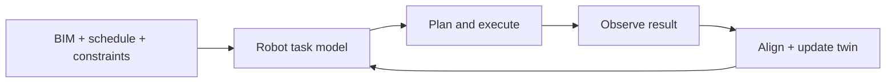
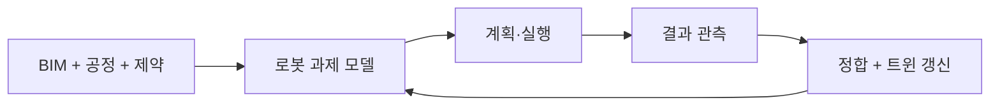

## English

A BIM is a structured design model. A digital twin is a **maintained operational state
linked to a physical system**. For robotics, the distinction matters: geometry that is
never updated cannot tell a robot what is currently reachable, installed, occupied, or
failed.

> [!info] Depth target
> Read a digital-twin or BIM-robotics paper and identify: which twin level the system
> actually reaches (model, shadow, closed loop, process), what crosses the semantic gap
> from design entity to robot skill, how fresh and trustworthy the state is, and whether
> information really returns from the site to change the next action. Building twin
> architectures is a working/mastery topic.

> [!note] Prerequisites
> [[05-construction-robotics/site-perception|Site Perception]] ·
> [[04-robotics/robot-systems-deployment|Robot Systems]] ·
> [[04-robotics/planning-decision-making|Planning]]

### 1. The closed workflow

The hard interfaces are semantic: converting a wall or weld in BIM into robot actions,
assigning coordinate frames and tolerances, deciding when observations are sufficient to
declare completion, and propagating failure back to the process plan.
[[01-canonical-papers/notes/8-construction/bim-digital-twin|Wang 2024]] is the stream's
reference closed loop: BIM-generated tasks drive robot execution and as-built scans
verify completion back into the model — read it against the levels below to see which
interfaces it actually closes.

### 2. Levels often called a digital twin

| Level | Capability | What is still missing |
|---|---|---|
| Digital model | static BIM/CAD | live state and synchronization |
| Digital shadow | physical data updates model | model does not command the physical system |
| Closed-loop twin | bidirectional state/action connection | may still cover one task or one site |
| Process-level twin | resources, dependencies, humans, multiple robots | reliable semantics and uncertainty at project scale |

Do not infer the level from the word “twin”; inspect the data and command paths.

<svg viewBox="0 0 600 214" style="max-width:100%;height:auto" role="img" aria-label="four things called a digital twin, and what each one is still missing">
  <defs><marker id="dtA" markerWidth="8" markerHeight="8" refX="7" refY="3" orient="auto"><path d="M0,0 L8,3 L0,6 z" fill="currentColor"/></marker></defs>
  <g fill="currentColor" opacity="0.10">
    <rect x="24" y="150" width="300" height="34" rx="3"/><rect x="44" y="108" width="300" height="34" rx="3"/>
    <rect x="64" y="66" width="300" height="34" rx="3"/><rect x="84" y="24" width="300" height="34" rx="3"/>
  </g>
  <g fill="none" stroke="currentColor" stroke-width="1.1" opacity="0.75">
    <rect x="24" y="150" width="300" height="34" rx="3"/><rect x="44" y="108" width="300" height="34" rx="3"/>
    <rect x="64" y="66" width="300" height="34" rx="3"/><rect x="84" y="24" width="300" height="34" rx="3"/>
  </g>
  <g stroke="currentColor" stroke-width="1.4" marker-end="url(#dtA)" opacity="0.7">
    <line x1="330" y1="167" x2="386" y2="167"/><line x1="350" y1="125" x2="386" y2="125"/><line x1="370" y1="83" x2="386" y2="83"/><line x1="390" y1="41" x2="392" y2="41"/>
  </g>
  <g font-size="11.5" fill="currentColor">
    <text x="36" y="171">digital model &#8212; static BIM/CAD</text><text x="56" y="129">digital shadow &#8212; physical updates model</text><text x="76" y="87">closed-loop twin &#8212; model commands back</text><text x="96" y="45">process twin &#8212; resources, humans, fleets</text>
  </g>
  <g font-size="10.5" fill="currentColor" opacity="0.85">
    <text x="396" y="171">missing: live state</text><text x="396" y="129">missing: a command path</text><text x="396" y="87">missing: scale past one task</text><text x="400" y="45">missing: project-scale semantics</text>
  </g>
  <g font-size="11" fill="currentColor"><text x="24" y="205" opacity="0.9">Each rung adds one path, not a new noun. Ask which path a paper actually closed.</text></g>
</svg>

### 3. Robot-facing problems

- **Semantic grounding**: which model entity corresponds to which observed object?
- **State freshness**: at what rate and latency is the twin updated?
- **Uncertainty and provenance**: measured, inferred, planned, and manually entered state
  must not be treated equally.
- **Task generation**: a construction activity must become ordered robot skills with
  preconditions, tolerances, and recovery.
- **Multi-agent coordination**: shared state does not itself solve allocation, conflicts,
  or communication loss.

### 4. Reading evaluation

Look for a real bidirectional loop, coordinate/semantic error, update latency, stale-state
handling, recovery after mismatch, and comparison with the existing workflow. A dashboard
that visualizes sensor data can be useful, but it does not by itself demonstrate a robot
digital twin.

> [!warning] Reading the claim
> “BIM-driven” may mean a human exported waypoints once. “Digital twin” may mean a 3D
> viewer. Trace one task end to end: design entity → robot instruction → physical result →
> sensed verification → model update → next decision.

### After reading

- Distinguish a digital model, digital shadow, closed-loop twin, and process twin.
- Explain the semantic gap between BIM objects and executable robot skills.
- Identify update rate, uncertainty, and mismatch recovery in a paper.
- Trace whether information actually returns from the site to change the next action.

### Self-check

1. A system streams site sensor data into a live 3D dashboard. Which twin level is this,
   and what is missing before it becomes a closed-loop twin?
2. What must be added to a BIM wall object before a robot can install it? Name at least
   four kinds of information.
3. Why must measured, inferred, planned, and manually entered state carry different
   trust, and what can go wrong if a robot treats them equally?
4. In a loop like Wang 2024's (BIM task generation, robot execution, as-built scan
   verification), what single failure would silently break the twin claim while leaving
   every demo video looking correct?

> [!tip]- Answers
> 1. A digital shadow: physical data updates the model, but the model commands nothing. Closing the loop requires a command path — twin state generating or gating robot actions — plus defined semantics for when observation suffices to change decisions.
> 2. A coordinate frame and metric tolerances; an ordered decomposition into robot skills with preconditions and effects; grasp/tool and reachability information; material and component identity binding model entity to physical part; and completion/verification criteria with recovery behavior on mismatch.
> 3. Provenance encodes uncertainty and staleness: a manually entered "installed" flag can be wrong or outdated, an inferred pose has error bounds, a planned state may never have happened. A robot weighting them equally can act on fiction — e.g., planning through a wall that was never built or declaring completion from a stale scan.
> 4. The verification step passing without discriminating power — e.g., registration tolerance looser than the defects it should catch, or ground truth derived from the same alignment being verified. Execution then always "verifies," the model is updated with unearned confidence, and the loop is open in exactly the place the twin claim depends on.

### Sources

- [buildingSMART International](https://www.buildingsmart.org/) — openBIM standards context
- [NIST, Digital Twins for Advanced Manufacturing](https://www.nist.gov/programs-projects/digital-twins-advanced-manufacturing)
- [[05-construction-robotics/labs|Labs Map]] — Michigan/TAMU/CMU process-twin lineage

## 한국어

BIM은 구조화된 설계 모델이다. 디지털 트윈은 **물리 시스템과 연결되어 계속 유지되는 운용
상태**다. 로봇에는 이 차이가 중요하다. 갱신되지 않는 형상은 현재 무엇이 설치·점유·고장
났고 로봇이 어디에 접근할 수 있는지 말해 주지 못한다.

> [!info] 깊이 목표
> 디지털 트윈·BIM 로보틱스 논문을 읽고 다음을 짚는다: 시스템이 실제로 도달한 트윈
> 수준(모델·섀도·폐루프·공정), 설계 객체에서 로봇 skill로 의미 격차를 무엇이 건너는지,
> 상태가 얼마나 신선하고 신뢰할 만한지, 정보가 정말 현장에서 돌아와 다음 행동을 바꾸는지.
> 트윈 아키텍처 구축은 실무/숙달 단계의 주제다.

> [!note] 선수지식
> [[05-construction-robotics/site-perception|현장 인식]] ·
> [[04-robotics/robot-systems-deployment|로봇 시스템]] · [[04-robotics/planning-decision-making|계획]]

### 1. 닫힌 워크플로

어려운 인터페이스는 의미론이다: BIM의 벽·용접을 로봇 행동으로 바꾸고, 좌표계·공차를
주고, 완료를 판정하며, 실패를 공정 계획에 되돌려야 한다.
[[01-canonical-papers/notes/8-construction/bim-digital-twin|Wang 2024]]가 이 스트림의
기준 폐루프다: BIM에서 생성된 과제가 로봇 실행을 구동하고 as-built 스캔이 완료를 모델로
되돌려 검증한다 — 아래 수준표에 대조해 실제로 어떤 인터페이스가 닫히는지 읽어라.

### 2. 디지털 트윈이라 불리는 수준

| 수준 | 기능 | 빠진 것 |
|---|---|---|
| 디지털 모델 | 정적 BIM/CAD | 실시간 상태·동기화 |
| 디지털 섀도 | 물리 데이터가 모델을 갱신 | 모델이 물리계를 지시하지 않음 |
| 폐루프 트윈 | 양방향 상태·행동 연결 | 한 과제·현장에 제한될 수 있음 |
| 공정 수준 트윈 | 자원·의존성·인간·멀티로봇 | 프로젝트 규모 의미론·불확실성 |

“트윈”이라는 이름이 아니라 데이터와 명령 경로를 보고 수준을 판단하라.

<svg viewBox="0 0 600 214" style="max-width:100%;height:auto" role="img" aria-label="디지털 트윈이라 불리는 네 가지와, 각각에 아직 없는 것">
  <defs><marker id="dtA" markerWidth="8" markerHeight="8" refX="7" refY="3" orient="auto"><path d="M0,0 L8,3 L0,6 z" fill="currentColor"/></marker></defs>
  <g fill="currentColor" opacity="0.10">
    <rect x="24" y="150" width="300" height="34" rx="3"/><rect x="44" y="108" width="300" height="34" rx="3"/>
    <rect x="64" y="66" width="300" height="34" rx="3"/><rect x="84" y="24" width="300" height="34" rx="3"/>
  </g>
  <g fill="none" stroke="currentColor" stroke-width="1.1" opacity="0.75">
    <rect x="24" y="150" width="300" height="34" rx="3"/><rect x="44" y="108" width="300" height="34" rx="3"/>
    <rect x="64" y="66" width="300" height="34" rx="3"/><rect x="84" y="24" width="300" height="34" rx="3"/>
  </g>
  <g stroke="currentColor" stroke-width="1.4" marker-end="url(#dtA)" opacity="0.7">
    <line x1="330" y1="167" x2="386" y2="167"/><line x1="350" y1="125" x2="386" y2="125"/><line x1="370" y1="83" x2="386" y2="83"/><line x1="390" y1="41" x2="392" y2="41"/>
  </g>
  <g font-size="11.5" fill="currentColor">
    <text x="36" y="171">디지털 모델 &#8212; 정적 BIM/CAD</text><text x="56" y="129">디지털 섀도 &#8212; 실물이 모델을 갱신</text><text x="76" y="87">폐루프 트윈 &#8212; 모델이 되돌려 명령</text><text x="96" y="45">프로세스 트윈 &#8212; 자원·사람·다중 로봇</text>
  </g>
  <g font-size="10.5" fill="currentColor" opacity="0.85">
    <text x="396" y="171">없는 것: 실시간 상태</text><text x="396" y="129">없는 것: 명령 경로</text><text x="396" y="87">없는 것: 한 과제 너머의 규모</text><text x="400" y="45">없는 것: 프로젝트 규모 의미론</text>
  </g>
  <g font-size="11" fill="currentColor"><text x="24" y="205" opacity="0.9">각 단은 명사가 아니라 경로 하나를 더한다. 논문이 실제로 닫은 경로가 무엇인지 물어라.</text></g>
</svg>

### 3. 로봇 관점의 문제

- **의미 접지**: 모델 객체와 관측 객체가 어떻게 대응하는가?
- **상태 신선도**: 어떤 주기와 지연으로 갱신되는가?
- **불확실성·출처**: 측정·추론·계획·수기 입력 상태를 같은 신뢰도로 보면 안 된다.
- **과제 생성**: 시공 활동을 선행조건·공차·복구가 있는 로봇 skill 순서로 바꿔야 한다.
- **멀티에이전트**: 공유 상태만으로 할당·충돌·통신 손실이 해결되지는 않는다.

### 4. 평가 읽기

실제 양방향 루프, 좌표·의미 오차, 갱신 지연, stale state 처리, 불일치 뒤 복구, 기존 공정과의
비교를 보라. 센서 데이터를 보여 주는 대시보드는 유용하지만 로봇 디지털 트윈의 증거는 아니다.

> [!warning] 주장 읽기
> “BIM-driven”은 사람이 waypoint를 한 번 내보낸 것일 수 있고, “digital twin”은 3D viewer일
> 수 있다. 설계 객체 → 로봇 지시 → 물리 결과 → 센싱 검증 → 모델 갱신 → 다음 결정의 한
> 과제를 끝까지 추적하라.

### 읽고 나면 말할 수 있어야 하는 것

- 디지털 모델·섀도·폐루프 트윈·공정 트윈을 구분한다.
- BIM 객체와 실행 가능한 로봇 skill 사이의 의미 격차를 설명한다.
- 갱신률·불확실성·불일치 복구를 찾는다.
- 현장 정보가 다음 행동을 실제로 바꾸는지 추적한다.

### 스스로 점검

1. 현장 센서 데이터를 실시간 3D 대시보드로 스트리밍하는 시스템이 있다. 어느 트윈
   수준이며, 폐루프 트윈이 되려면 무엇이 빠져 있는가?
2. 로봇이 BIM 벽 객체를 설치할 수 있으려면 무엇을 더해야 하는가? 최소 네 종류의 정보를
   들라.
3. 측정·추론·계획·수기 입력 상태는 왜 다른 신뢰도를 가져야 하며, 로봇이 이를 동등하게
   취급하면 무엇이 잘못될 수 있는가?
4. Wang 2024 같은 루프(BIM 과제 생성 → 로봇 실행 → as-built 스캔 검증)에서, 모든 데모
   영상은 멀쩡해 보이면서 트윈 주장을 조용히 무너뜨리는 단일 실패는 무엇인가?

> [!tip]- 정답 · Answers
> 1. 디지털 섀도: 물리 데이터가 모델을 갱신하지만 모델이 아무것도 지시하지 않는다. 루프를 닫으려면 명령 경로 — 트윈 상태가 로봇 행동을 생성하거나 통제하는 — 와 관측이 언제 결정을 바꾸기에 충분한지에 대한 의미론이 필요하다.
> 2. 좌표계와 미터 공차; 선행조건·효과가 있는 로봇 skill로의 순서 있는 분해; 파지/공구와 도달성 정보; 모델 객체를 물리 부재에 묶는 재료·부품 ID; 불일치 시 복구 거동을 포함한 완료·검증 기준.
> 3. 출처는 불확실성과 신선도를 담는다: 수기 입력된 "설치됨" 플래그는 틀리거나 낡았을 수 있고, 추론된 자세에는 오차 한계가 있으며, 계획된 상태는 일어나지 않았을 수 있다. 이를 동등하게 취급하는 로봇은 허구에 따라 행동할 수 있다 — 지어지지 않은 벽을 통과하는 계획, 낡은 스캔으로 완료 선언 등.
> 4. 판별력 없는 검증 단계의 통과 — 예: 잡아야 할 결함보다 느슨한 정합 공차, 또는 검증 대상 정렬로 만든 정답. 그러면 실행은 항상 "검증"되고, 모델은 근거 없는 확신으로 갱신되며, 트윈 주장이 의존하는 바로 그 지점에서 루프가 열려 있게 된다.

### 출처

- [buildingSMART International](https://www.buildingsmart.org/)
- [NIST Digital Twins for Advanced Manufacturing](https://www.nist.gov/programs-projects/digital-twins-advanced-manufacturing)
- [[05-construction-robotics/labs|Labs Map]] — 미시간·TAMU·CMU 계보
