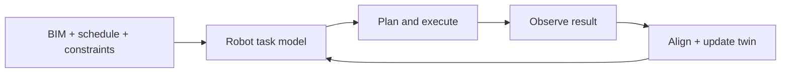

## English

A BIM is a structured design model. A digital twin is a **maintained operational state
linked to a physical system**. For robotics, the distinction matters: geometry that is
never updated cannot tell a robot what is currently reachable, installed, occupied, or
failed.

> [!note] Prerequisites
> [[05-construction-robotics/site-perception|Site Perception]] ·
> [[04-robotics/robot-systems-deployment|Robot Systems]] ·
> [[04-robotics/planning-decision-making|Planning]]

### 1. The closed workflow

The hard interfaces are semantic: converting a wall or weld in BIM into robot actions,
assigning coordinate frames and tolerances, deciding when observations are sufficient to
declare completion, and propagating failure back to the process plan.

### 2. Levels often called a digital twin

| Level | Capability | What is still missing |
|---|---|---|
| Digital model | static BIM/CAD | live state and synchronization |
| Digital shadow | physical data updates model | model does not command the physical system |
| Closed-loop twin | bidirectional state/action connection | may still cover one task or one site |
| Process-level twin | resources, dependencies, humans, multiple robots | reliable semantics and uncertainty at project scale |

Do not infer the level from the word “twin”; inspect the data and command paths.

### 3. Robot-facing problems

- **Semantic grounding**: which model entity corresponds to which observed object?
- **State freshness**: at what rate and latency is the twin updated?
- **Uncertainty and provenance**: measured, inferred, planned, and manually entered state
  must not be treated equally.
- **Task generation**: a construction activity must become ordered robot skills with
  preconditions, tolerances, and recovery.
- **Multi-agent coordination**: shared state does not itself solve allocation, conflicts,
  or communication loss.

### 4. Reading evaluation

Look for a real bidirectional loop, coordinate/semantic error, update latency, stale-state
handling, recovery after mismatch, and comparison with the existing workflow. A dashboard
that visualizes sensor data can be useful, but it does not by itself demonstrate a robot
digital twin.

> [!warning] Reading the claim
> “BIM-driven” may mean a human exported waypoints once. “Digital twin” may mean a 3D
> viewer. Trace one task end to end: design entity → robot instruction → physical result →
> sensed verification → model update → next decision.

### After reading

- Distinguish a digital model, digital shadow, closed-loop twin, and process twin.
- Explain the semantic gap between BIM objects and executable robot skills.
- Identify update rate, uncertainty, and mismatch recovery in a paper.
- Trace whether information actually returns from the site to change the next action.

### Sources

- [buildingSMART International](https://www.buildingsmart.org/) — openBIM standards context
- [NIST, Digital Twins for Advanced Manufacturing](https://www.nist.gov/programs-projects/digital-twins-advanced-manufacturing)
- [[05-construction-robotics/labs|Labs Map]] — Michigan/TAMU/CMU process-twin lineage

## 한국어

BIM은 구조화된 설계 모델이다. 디지털 트윈은 **물리 시스템과 연결되어 계속 유지되는 운용
상태**다. 로봇에는 이 차이가 중요하다. 갱신되지 않는 형상은 현재 무엇이 설치·점유·고장
났고 로봇이 어디에 접근할 수 있는지 말해 주지 못한다.

> [!note] 선수지식
> [[05-construction-robotics/site-perception|현장 인식]] ·
> [[04-robotics/robot-systems-deployment|로봇 시스템]] · [[04-robotics/planning-decision-making|계획]]

BIM+공정+제약 → 로봇 과제 모델 → 계획·실행 → 결과 관측 → 정합·트윈 갱신 → 다음 과제의
폐루프로 읽는다. 어려운 인터페이스는 의미론이다: BIM의 벽·용접을 로봇 행동으로 바꾸고,
좌표계·공차를 주고, 완료를 판정하며, 실패를 공정 계획에 되돌려야 한다.

### 1. 디지털 트윈이라 불리는 수준

| 수준 | 기능 | 빠진 것 |
|---|---|---|
| 디지털 모델 | 정적 BIM/CAD | 실시간 상태·동기화 |
| 디지털 섀도 | 물리 데이터가 모델을 갱신 | 모델이 물리계를 지시하지 않음 |
| 폐루프 트윈 | 양방향 상태·행동 연결 | 한 과제·현장에 제한될 수 있음 |
| 공정 수준 트윈 | 자원·의존성·인간·멀티로봇 | 프로젝트 규모 의미론·불확실성 |

“트윈”이라는 이름이 아니라 데이터와 명령 경로를 보고 수준을 판단하라.

### 2. 로봇 관점의 문제

- **의미 접지**: 모델 객체와 관측 객체가 어떻게 대응하는가?
- **상태 신선도**: 어떤 주기와 지연으로 갱신되는가?
- **불확실성·출처**: 측정·추론·계획·수기 입력 상태를 같은 신뢰도로 보면 안 된다.
- **과제 생성**: 시공 활동을 선행조건·공차·복구가 있는 로봇 skill 순서로 바꿔야 한다.
- **멀티에이전트**: 공유 상태만으로 할당·충돌·통신 손실이 해결되지는 않는다.

### 3. 평가 읽기

실제 양방향 루프, 좌표·의미 오차, 갱신 지연, stale state 처리, 불일치 뒤 복구, 기존 공정과의
비교를 보라. 센서 데이터를 보여 주는 대시보드는 유용하지만 로봇 디지털 트윈의 증거는 아니다.

> [!warning] 주장 읽기
> “BIM-driven”은 사람이 waypoint를 한 번 내보낸 것일 수 있고, “digital twin”은 3D viewer일
> 수 있다. 설계 객체 → 로봇 지시 → 물리 결과 → 센싱 검증 → 모델 갱신 → 다음 결정의 한
> 과제를 끝까지 추적하라.

### 읽고 나면 말할 수 있어야 하는 것

- 디지털 모델·섀도·폐루프 트윈·공정 트윈을 구분한다.
- BIM 객체와 실행 가능한 로봇 skill 사이의 의미 격차를 설명한다.
- 갱신률·불확실성·불일치 복구를 찾는다.
- 현장 정보가 다음 행동을 실제로 바꾸는지 추적한다.

### 출처

- [buildingSMART International](https://www.buildingsmart.org/)
- [NIST Digital Twins for Advanced Manufacturing](https://www.nist.gov/programs-projects/digital-twins-advanced-manufacturing)
- [[05-construction-robotics/labs|Labs Map]] — 미시간·TAMU·CMU 계보
