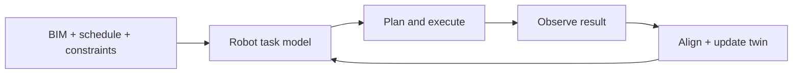
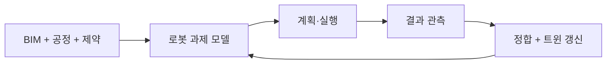

## English

A BIM is a structured design model. A digital twin is a **maintained operational state
linked to a physical system**. For robotics, the distinction matters: geometry that is
never updated cannot tell a robot what is currently reachable, installed, occupied, or
failed.

> [!info] Depth target
> Read a digital-twin or BIM-robotics paper and identify: which twin level the system
> actually reaches (model, shadow, closed loop, process), what crosses the semantic gap
> from design entity to robot skill, how fresh and trustworthy the state is, and whether
> information really returns from the site to change the next action. Building twin
> architectures is a working/mastery topic.

> [!note] Prerequisites
> [[05-construction-robotics/site-engineering|2.5 Site Robotics]] (S1 and its error budget, §2) ·
> [[05-construction-robotics/site-perception|5. Site Perception]] (the scan that measures S1's hole, and the guard band of its §4) ·
> [[04-robotics/robot-systems-deployment|10. Robot Systems]] (§4 frames and TF trees) ·
> [[04-robotics/geometric-perception-calibration|3.5 Geometric Perception]] (§3: a rotation error grows with range) ·
> [[04-robotics/state-estimation-slam|3. State Estimation]] (§4: between observations a state can only be predicted) ·
> [[04-robotics/planning-decision-making|4. Planning]] (task decomposition, for §3's task generation)

> [!note] First pass · 처음이라면
> Read the Running object and look at the picture: S1's hole A carried from its BIM coordinate to the robot's tool, and then left to age. Then §1 for the chain of frames and how errors add along it, §2 for what "digital twin" means in terms of which data flows are automated, §3 for how old the twin's state may be, and the Worked case after §3, which runs the chain with numbers. §3's worked example, three independent errors against a 10 mm anchor, is the same arithmetic without S1. §4 is for judging a paper's evaluation, §5 for where the stream is going.

### Running object · 이 페이지의 대상

**S1** from [[05-construction-robotics/site-engineering|2.5 Site Robotics as an Engineering System]], at the moment a coordinate becomes a command: bracket hole A has a position in the BIM, and the robot's tool has to be sent there. S1's budget splits the $\pm5\,\mathrm{mm}$ residual among five owners (map $1$, base $2$, arm $1$, tool $0.5$, part $1\,\mathrm{mm}$). This page reads them as the links of one chain of frames, and the map term as what the twin must keep current. [[05-construction-robotics/site-perception|5. Site Perception]] measured hole A, and its results are used here.

| Symbol | Value | What it is |
|---|---:|---|
| $p^B_A,\ p^B_B$ | $(36.400,\ 12.000)$, $(36.800,\ 12.000)\,\mathrm{m}$ | the two bracket holes in the BIM's plan coordinates, $400\,\mathrm{mm}$ apart along the facade |
| ${}^{S}T_{B}$ | $30^\circ$, $(500.000,\ 200.000)\,\mathrm{m}$ | the BIM-to-site tie from the control survey: the building grid's rotation and its origin in site control |
| $\sigma_{t,SB},\ \sigma_{\psi,SB},\ L$ | $0.5\,\mathrm{mm}$, $10\,\mu\mathrm{rad}$, $40\,\mathrm{m}$ | the tie's one-sigma translation and rotation errors, and hole A's distance from the centroid of the control points, taken along the facade's normal through hole A so that the tie's rotation error acts wholly along the facade (the worst case) |
| base | $(36.600,\ 10.800)\,\mathrm{m}$ in the BIM, facing the facade | where the robot stands: $1.2\,\mathrm{m}$ back from the facade, midway between the holes |
| $\sigma_{t,R},\ \sigma_{\psi,R}$ | $0.8\,\mathrm{mm}$, $0.5\,\mathrm{mrad}$ | the base's one-sigma translation and heading errors: S1's $2\,\mathrm{mm}$ base term at the $1.2\,\mathrm{m}$ reach |
| $\hat\delta_A$ | $3.9\,\mathrm{mm}$ | hole A's measured deviation from its BIM position, along the facade (5's Worked case) |
| $e_0$ | $0.913\,\mathrm{mm}$ | the two-sigma error of the twin's hole position along the facade when fresh, from 5's scan at $10\,\mathrm{m}$ (5 rounds it to $0.91$) |
| $\alpha,\ L_{\text{th}},\ \dot T,\ \Delta T$ | $12\times10^{-6}\,\mathrm{K^{-1}}$, $20\,\mathrm{m}$, $1.5\,\mathrm{K/h}$, $10\,\mathrm{K}$ | steel's expansion coefficient; hole A's distance along the facade from the frame's thermal fixed point; the steel's warming rate in the morning; its daily swing |

Every number except $\alpha$ is this page's own frozen course number, and $\alpha$ is the handbook coefficient for structural steel (SCI). The budget is read as 5 reads it, each allocation a two-sigma bound per axis; the base row is chosen so that $2\sqrt{0.8^2+(1200\times0.0005)^2}=2.0\,\mathrm{mm}$ reproduces S1's base term. S1's numbers are unchanged.

*Scope: this page teaches the chain of frames from a BIM coordinate to a tool command and how its errors add, the levels called digital twin and what separates them, and how old a twin's state may be. It does not teach transform algebra or TF ([[04-robotics/robot-systems-deployment|10. Robot Systems §4]]), estimation ([[04-robotics/state-estimation-slam|3. State Estimation]]), the scan that measures the hole ([[05-construction-robotics/site-perception|5]]) or robot task planning ([[04-robotics/planning-decision-making|4. Planning]]); it uses them.*

### The picture · 그림으로 먼저 보기

<svg viewBox="0 0 560 340" style="max-width:100%;height:auto" role="img" aria-label="Top: the frame chain BIM, site control, robot base, tool, panel hole, with each link&#8217;s two-sigma share at hole A before any scan: the map term, which is the tie, 1.28 mm, base 2.0 mm, arm 1.0 and tool 0.5 mm, part 1.0 mm; the twin&#8217;s scanned hole enters at site control as a map term of 0.91 mm. Bottom left: once hole A is scanned, a command aimed at the BIM coordinate misses by 6.56 mm at two sigma, a 3.9 mm offset plus 2.66 mm random, and one aimed at the twin&#8217;s hole by 2.66 mm, against plus or minus 5 mm. Bottom right: the twin&#8217;s hole error grows from 0.913 mm at 0.36 mm per hour and crosses the 1 mm map term at 14.5 minutes.">
<defs><marker id="p7a" markerWidth="8" markerHeight="8" refX="7" refY="3" orient="auto"><path d="M0,0 L8,3 L0,6 z" fill="currentColor"/></marker></defs>
<rect x="10" y="58" width="92" height="28" rx="4" fill="currentColor" fill-opacity="0.08" stroke="currentColor" stroke-opacity="0.7"/>
<text x="56.0" y="76" font-size="11" fill="currentColor" text-anchor="middle">BIM (B)</text>
<rect x="122" y="58" width="92" height="28" rx="4" fill="currentColor" fill-opacity="0.08" stroke="currentColor" stroke-opacity="0.7"/>
<text x="168.0" y="76" font-size="11" fill="currentColor" text-anchor="middle">site control (S)</text>
<rect x="234" y="58" width="92" height="28" rx="4" fill="currentColor" fill-opacity="0.08" stroke="currentColor" stroke-opacity="0.7"/>
<text x="280.0" y="76" font-size="11" fill="currentColor" text-anchor="middle">robot base (R)</text>
<rect x="346" y="58" width="92" height="28" rx="4" fill="currentColor" fill-opacity="0.08" stroke="currentColor" stroke-opacity="0.7"/>
<text x="392.0" y="76" font-size="11" fill="currentColor" text-anchor="middle">tool (T)</text>
<rect x="458" y="58" width="92" height="28" rx="4" fill="currentColor" fill-opacity="0.08" stroke="currentColor" stroke-opacity="0.7"/>
<text x="504.0" y="76" font-size="11" fill="currentColor" text-anchor="middle">panel hole</text>
<line x1="104" y1="72.0" x2="119" y2="72.0" stroke="currentColor" stroke-width="1.3" marker-end="url(#p7a)"/>
<line x1="216" y1="72.0" x2="231" y2="72.0" stroke="currentColor" stroke-width="1.3" marker-end="url(#p7a)"/>
<line x1="328" y1="72.0" x2="343" y2="72.0" stroke="currentColor" stroke-width="1.3" marker-end="url(#p7a)"/>
<line x1="440" y1="72.0" x2="455" y2="72.0" stroke="currentColor" stroke-width="1.3" marker-end="url(#p7a)"/>
<text x="112" y="101" font-size="10.5" fill="currentColor" text-anchor="middle">map (tie) 1.28</text>
<text x="112" y="114" font-size="10" fill="currentColor" text-anchor="middle" opacity="0.8">10 µrad × 40 m</text>
<text x="224" y="101" font-size="10.5" fill="currentColor" text-anchor="middle">base 2.0</text>
<text x="224" y="114" font-size="10" fill="currentColor" text-anchor="middle" opacity="0.8">0.5 mrad × 1.2 m</text>
<text x="336" y="101" font-size="10.5" fill="currentColor" text-anchor="middle">arm 1.0</text>
<text x="336" y="114" font-size="10" fill="currentColor" text-anchor="middle" opacity="0.8">tool 0.5</text>
<text x="448" y="101" font-size="10.5" fill="currentColor" text-anchor="middle">part 1.0</text>
<text x="448" y="114" font-size="10" fill="currentColor" text-anchor="middle" opacity="0.8">hole 0.2 m from grip</text>
<line x1="168.0" y1="30" x2="168.0" y2="55" stroke="currentColor" stroke-width="1.3" stroke-dasharray="4 2" marker-end="url(#p7a)"/>
<text x="174.0" y="30" font-size="10.5" fill="currentColor">twin: hole scanned in S, map 0.91</text>
<text x="10" y="30" font-size="10.5" fill="currentColor">design: tie, then an unseen offset</text>
<text x="10" y="14" font-size="10" fill="currentColor" opacity="0.8">two-sigma, mm, at hole A</text>
<text x="20" y="158" font-size="12" fill="currentColor" font-weight="600">two-sigma bound at hole A (mm)</text>
<text x="20" y="182" font-size="10.5" fill="currentColor">from the BIM coordinate</text>
<rect x="20" y="188" width="109.2" height="20" fill="currentColor" fill-opacity="0.75"/>
<rect x="129.2" y="188" width="74.5" height="20" fill="currentColor" fill-opacity="0.28"/>
<text x="74.6" y="221" font-size="10" fill="currentColor" text-anchor="middle">offset 3.9</text>
<text x="165.0" y="221" font-size="10" fill="currentColor">random 2.66</text>
<text x="207.7" y="202" font-size="11" fill="currentColor" font-weight="600">6.56</text>
<text x="20" y="240" font-size="10.5" fill="currentColor">from the twin</text>
<rect x="20" y="246" width="74.5" height="20" fill="currentColor" fill-opacity="0.28"/>
<text x="98.5" y="260" font-size="11" fill="currentColor" font-weight="600">2.66</text>
<line x1="20" y1="288" x2="244.0" y2="288" stroke="currentColor" stroke-opacity="0.6"/>
<line x1="20.0" y1="288" x2="20.0" y2="292" stroke="currentColor"/><text x="20.0" y="304" font-size="10.5" fill="currentColor" text-anchor="middle">0</text>
<line x1="76.0" y1="288" x2="76.0" y2="292" stroke="currentColor"/><text x="76.0" y="304" font-size="10.5" fill="currentColor" text-anchor="middle">2</text>
<line x1="132.0" y1="288" x2="132.0" y2="292" stroke="currentColor"/><text x="132.0" y="304" font-size="10.5" fill="currentColor" text-anchor="middle">4</text>
<line x1="188.0" y1="288" x2="188.0" y2="292" stroke="currentColor"/><text x="188.0" y="304" font-size="10.5" fill="currentColor" text-anchor="middle">6</text>
<line x1="244.0" y1="288" x2="244.0" y2="292" stroke="currentColor"/><text x="244.0" y="304" font-size="10.5" fill="currentColor" text-anchor="middle">8</text>
<line x1="160.0" y1="172" x2="160.0" y2="288" stroke="currentColor" stroke-dasharray="4 3"/>
<text x="164.0" y="284" font-size="10.5" fill="currentColor">±5 mm</text>
<text x="318" y="158" font-size="12" fill="currentColor" font-weight="600">twin's hole ageing (morning)</text>
<line x1="330" y1="300" x2="540" y2="300" stroke="currentColor" stroke-opacity="0.6"/><line x1="330" y1="300" x2="330" y2="182" stroke="currentColor" stroke-opacity="0.6"/>
<line x1="330.0" y1="300" x2="330.0" y2="304" stroke="currentColor"/><text x="330.0" y="316" font-size="10.5" fill="currentColor" text-anchor="middle">0</text>
<line x1="382.5" y1="300" x2="382.5" y2="304" stroke="currentColor"/><text x="382.5" y="316" font-size="10.5" fill="currentColor" text-anchor="middle">15</text>
<line x1="435.0" y1="300" x2="435.0" y2="304" stroke="currentColor"/><text x="435.0" y="316" font-size="10.5" fill="currentColor" text-anchor="middle">30</text>
<line x1="487.5" y1="300" x2="487.5" y2="304" stroke="currentColor"/><text x="487.5" y="316" font-size="10.5" fill="currentColor" text-anchor="middle">45</text>
<line x1="540.0" y1="300" x2="540.0" y2="304" stroke="currentColor"/><text x="540.0" y="316" font-size="10.5" fill="currentColor" text-anchor="middle">60</text>
<line x1="326" y1="300.0" x2="330" y2="300.0" stroke="currentColor"/><text x="323" y="303.5" font-size="10.5" fill="currentColor" text-anchor="end">0.8</text>
<line x1="326" y1="278.0" x2="330" y2="278.0" stroke="currentColor"/><text x="323" y="281.5" font-size="10.5" fill="currentColor" text-anchor="end">0.9</text>
<line x1="326" y1="256.0" x2="330" y2="256.0" stroke="currentColor"/><text x="323" y="259.5" font-size="10.5" fill="currentColor" text-anchor="end">1.0</text>
<line x1="326" y1="234.0" x2="330" y2="234.0" stroke="currentColor"/><text x="323" y="237.5" font-size="10.5" fill="currentColor" text-anchor="end">1.1</text>
<line x1="326" y1="212.0" x2="330" y2="212.0" stroke="currentColor"/><text x="323" y="215.5" font-size="10.5" fill="currentColor" text-anchor="end">1.2</text>
<line x1="326" y1="190.0" x2="330" y2="190.0" stroke="currentColor"/><text x="323" y="193.5" font-size="10.5" fill="currentColor" text-anchor="end">1.3</text>
<text x="435" y="331" font-size="11" fill="currentColor" text-anchor="middle">age of the scan (min)</text>
<line x1="330.0" y1="275.2" x2="540.0" y2="196.0" stroke="currentColor" stroke-width="1.8"/>
<line x1="330" y1="256.0" x2="540" y2="256.0" stroke="currentColor" stroke-opacity="0.9"/>
<text x="540" y="270.0" font-size="10.5" fill="currentColor" text-anchor="end">map term 1 mm</text>
<circle cx="380.8" cy="256.0" r="3" fill="currentColor"/>
<line x1="380.8" y1="256.0" x2="380.8" y2="300" stroke="currentColor" stroke-dasharray="3 3" stroke-opacity="0.8"/>
<text x="385.8" y="294" font-size="10.5" fill="currentColor">14.5 min</text>
<text x="336.0" y="289.2" font-size="10.5" fill="currentColor">0.913</text>
<text x="533.0" y="190.6" font-size="10.5" fill="currentColor" text-anchor="end">+0.36 mm/h</text>
</svg>

S1's command chain for hole A, with each link's two-sigma share; before any scan the map term is the tie's $1.28\,\mathrm{mm}$, already over its $1\,\mathrm{mm}$. Once the hole is scanned, a command aimed at the BIM coordinate still misses by the bracket's $3.9\,\mathrm{mm}$ as-built offset on top of the $2.66\,\mathrm{mm}$ every command carries, $6.56\,\mathrm{mm}$ against $\pm5\,\mathrm{mm}$, while one aimed at the twin's scanned position closes at $2.66\,\mathrm{mm}$. The twin's own term then ages: as the steel warms in the morning the hole drifts $0.36\,\mathrm{mm/h}$, and the $1\,\mathrm{mm}$ map term is used up after $14.5$ minutes.

### 1. The closed workflow

The hard interfaces are semantic: converting a wall or weld in BIM into robot actions,
assigning coordinate frames and tolerances, deciding when observations are sufficient to
declare completion, and propagating failure back to the process plan.
[[01-canonical-papers/notes/8-construction/bim-digital-twin|Wang 2024]] is the stream's
reference closed loop: BIM-generated tasks drive robot execution and as-built scans
(scans of what was actually built, which can differ from the design geometry)
verify completion back into the model — read it against the levels below to see which
interfaces it actually closes.

The loop matters because completing a motion is not the same as completing a construction activity. An anchor may reach its commanded location while failing an installation check. The twin must preserve that distinction before releasing a dependent task. **The reading this gives you.** Follow one completion signal backward to the physical observation that justified it, then forward to the next robot decision. A manually accepted status should remain visibly different from sensed verification.

**The chain behind the first arrow.** "Assigning coordinate frames" is where the BIM becomes a command, and it is a chain, not a step. A position in the BIM is in the model's own coordinates (B). The site's survey control, the monuments whose surveyed coordinates define the site frame (S), is tied to the model by the survey: a rotation and a translation estimated from control points, ${}^{S}T_{B}$. The robot localizes its base (R) in the site frame, ${}^{S}T_{R}$; the arm's kinematics and the tool calibration carry the base to the tool (T); and the panel's hole sits at a fixed place in the tool frame. The command for a hole is its BIM coordinate carried along the chain,

$$p^{R}={}^{R}T_{S}\,{}^{S}T_{B}\,p^{B},\qquad {}^{R}T_{S}=\big({}^{S}T_{R}\big)^{-1}$$

in the notation of [[04-robotics/robot-systems-deployment|10. Robot Systems §4]], since each transform takes coordinates from the frame on its right to the frame on its left; the arm is then asked for the tool pose that puts the panel's hole at $p^R$. Each link has an owner, and S1's budget names them in the same order ([[05-construction-robotics/site-engineering|2.5 §2]]). The design model tied to the site map is the **map** term: the survey's ${}^{S}T_{B}$, or, once the hole has been scanned, the scan of 5 that places it in the site frame directly. The map to the base is the **base** term, localization's ${}^{S}T_{R}$; base to flange and flange to gripper are the **arm** and **tool** terms, kinematics and calibration; and gripper to the hole in the panel is the **part** term, fabrication and the grasp. The budget is the chain, written at the hole.

> **Error composition along a frame chain, defined.** A **first-order rule** for how the errors of a chain of rigid transforms add up at one point. Four defining conditions. Each link's error is **small**, a translation $\delta t_k$ and a rotation $\delta\theta_k\ll1\,\mathrm{rad}$, so the errors add instead of compounding. A rotation error moves the point by its **lever arm** $\ell_k$, the distance from that link's centre of rotation to the point, perpendicular to the lever: the rotation error that grows with range in [[04-robotics/geometric-perception-calibration|3.5 §3]]. The random parts of different links are **independent**, so their variances add. And a known or systematic offset, a **bias** $b$, is not random and adds to the bound linearly.
>
> $$\sigma_p^2=\sum_k\big(\sigma_{t,k}^2+\ell_k^2\,\sigma_{\theta,k}^2\big),\qquad e_p=|b|+2\sigma_p$$
>
> where $\sigma_p$ is the point's one-sigma error along the axis that matters, $\sigma_{t,k}$ and $\sigma_{\theta,k}$ the one-sigma translation and rotation errors of link $k$, $\ell_k$ its lever arm, $b$ the sum of the biases, and $e_p$ the two-sigma bound compared with the tolerance, because a bias shifts every outcome by the same amount while the random part spreads them.
>
> - **Example**: S1's chain started from the BIM coordinate, at hole A along the facade: the tie gives $\sqrt{0.5^2+(40\,000\times10^{-5})^2}=0.64\,\mathrm{mm}$, the base $\sqrt{0.8^2+(1200\times0.0005)^2}=1.00\,\mathrm{mm}$, and the arm, tool and part half of S1's two-sigma terms, $0.5$, $0.25$ and $0.5\,\mathrm{mm}$. So $2\sigma_p=2.81\,\mathrm{mm}$ before any bias.
> - **Non-example**: adding an angle to a length. "$10\,\mu\mathrm{rad}$ plus $0.5\,\mathrm{mm}$" has no value until the angle is multiplied by its lever: $10\,\mu\mathrm{rad}$ is $0.4\,\mathrm{mm}$ at the tie's $40\,\mathrm{m}$ and $0.002\,\mathrm{mm}$ at the $0.2\,\mathrm{m}$ between a hole and the gripper, if the panel turns in its own plane. A second non-example is a budget closed in the robot's frame, which drops the first link, the map term, and the tie with it.
> - **Why it matters**: the same angular accuracy is worth two hundred times more at the site tie than at the gripper, so the survey's orientation is a robot-accuracy problem; and the rule shows which links a twin can take out of the chain and which it cannot (the Worked case).

### 2. Levels often called a digital twin

This is the wiki's **synthesized reading rubric** for robot workflows, not a universal standard
or a claim that a higher row is always better. Verify only the data and command paths required
by the research question.

| Level | Capability | What is still missing |
|---|---|---|
| Digital model | static BIM/CAD | live state and synchronization |
| Digital shadow | physical data updates model | model does not command the physical system |
| Closed-loop twin | bidirectional state/action connection | may still cover one task or one site |
| Process-level twin | resources, dependencies, humans, multiple robots | reliable semantics and uncertainty at project scale |

Do not infer the level from the word “twin”; inspect the data and command paths.

<svg viewBox="0 0 600 214" style="max-width:100%;height:auto" role="img" aria-label="four things called a digital twin, and what each one is still missing">
  <defs><marker id="dtA" markerWidth="8" markerHeight="8" refX="7" refY="3" orient="auto"><path d="M0,0 L8,3 L0,6 z" fill="currentColor"/></marker></defs>
  <g fill="currentColor" opacity="0.10">
    <rect x="24" y="150" width="300" height="34" rx="3"/><rect x="44" y="108" width="300" height="34" rx="3"/>
    <rect x="64" y="66" width="300" height="34" rx="3"/><rect x="84" y="24" width="300" height="34" rx="3"/>
  </g>
  <g fill="none" stroke="currentColor" stroke-width="1.1" opacity="0.75">
    <rect x="24" y="150" width="300" height="34" rx="3"/><rect x="44" y="108" width="300" height="34" rx="3"/>
    <rect x="64" y="66" width="300" height="34" rx="3"/><rect x="84" y="24" width="300" height="34" rx="3"/>
  </g>
  <g stroke="currentColor" stroke-width="1.4" marker-end="url(#dtA)" opacity="0.7">
    <line x1="330" y1="167" x2="386" y2="167"/><line x1="350" y1="125" x2="386" y2="125"/><line x1="370" y1="83" x2="386" y2="83"/><line x1="390" y1="41" x2="392" y2="41"/>
  </g>
  <g font-size="11.5" fill="currentColor">
    <text x="36" y="171">digital model &#8212; static BIM/CAD</text><text x="56" y="129">digital shadow &#8212; physical updates model</text><text x="76" y="87">closed-loop twin &#8212; model commands back</text><text x="96" y="45">process twin &#8212; resources, humans, fleets</text>
  </g>
  <g font-size="10.5" fill="currentColor" opacity="0.85">
    <text x="396" y="171">missing: live state</text><text x="396" y="129">missing: a command path</text><text x="396" y="87">missing: scale past one task</text><text x="400" y="45">missing: project-scale semantics</text>
  </g>
  <g font-size="11" fill="currentColor"><text x="24" y="205" opacity="0.9">Each rung adds one path, not a new noun. Ask which path a paper actually closed.</text></g>
</svg>

For example, a scan that updates a wall model creates an observation path. If a person still interprets the update and manually changes every waypoint, the robot action path remains human-mediated. **The reading this gives you.** Classify the demonstrated interface by who translates each update into a decision. Bidirectional arrows in a diagram are insufficient unless the execution and verification records show what crossed them.

**The first three rows, by their data flows.** The table's first three rows follow a classification from the manufacturing literature, Kritzinger et al. (2018), that decides the level by which data flows between a physical object and its digital counterpart are automated; the fourth row extends it by scope rather than by a new flow. Stated completely:

> **Digital model, digital shadow and digital twin, defined.** Three **levels of integration** between one physical object and one digital object, decided by whether data flow between them *automatically*, and in which directions. They classify a *pair*, a physical object with its digital counterpart, not a piece of software. A **digital model** has no automated data exchange in either direction, and may represent a planned object that does not exist yet. A **digital shadow** adds an automated one-way flow from the state of an existing physical object to the digital one, while anything going back is carried by people. A **digital twin** has the flows between an existing physical object and the digital one fully integrated in both directions. "Automated" means that no person carries the data across.
>
> $$(a_{P\to D},\ a_{D\to P})=(0,0)\ \text{model},\qquad (1,0)\ \text{shadow},\qquad (1,1)\ \text{twin}$$
>
> where $a=1$ when the flow in that direction is automatic and $0$ when a person carries it, so the level is read off two switches and not off the word a paper uses.
>
> - **Example**: on S1, the facade's BIM before the brackets are installed is a digital model of a planned object. The robot's scan (5) writing hole A's measured position into the model automatically, while an engineer reads the deviation and retypes the robot's target, is a digital shadow. The same scan updating hole A, the updated position becoming the robot's target and passing the $\pm5\,\mathrm{mm}$ gate without anyone retyping it, and the placement verified by a scan that releases the next panel, is a digital twin.
> - **Non-example**: the fourth combination, $(0,1)$, which the classification does not name. A robot that reads hole A's BIM coordinate and places the panel with no scan has an automated flow from the digital object to the physical one and nothing back: automation without observation. Its map term is the tie's $1.28\,\mathrm{mm}$, already over S1's $1\,\mathrm{mm}$, plus an offset it cannot see; hole A's turned out to be $3.9\,\mathrm{mm}$, which on its own takes most of the $\pm5\,\mathrm{mm}$ (the Worked case). "BIM-driven" can mean this, or less: §4's warning notes it may mean a human exported waypoints once, which is $(0,0)$. A second non-example is a live 3D dashboard of site sensors, with an automated flow in and nothing automated out: a shadow at most (self-check 1).
> - **Why it matters**: each level adds one automated path, so a claimed level is checked by finding the path, not by reading the title. And the definition says nothing about how fresh the data are: a twin that updates hole A automatically once a day meets it, and is still stale for S1 by up to $2.4\,\mathrm{mm}$ over a day (§3). The level is not the fitness.

Classifications disagree at the edges, so name the scheme before the level. A construction-specific one, Ghorbani and Messner (2024), sorts twins into a prototype designed to be connected later, a digital shadow fed from the built asset (laser scanning is its example), and a cyber-physical system with data flowing both ways, often with actuation. It lets the flow back to the building inform a human operator as well as an automated controller, and it names the frequency of updates as one of a twin's components. So S1's shadow above, where an engineer acts on the deviation, is a shadow in Kritzinger's scheme and could count as two-way in theirs; and the component their scheme adds, how often the state is refreshed, is exactly what Kritzinger's levels leave out and §3 prices.

### 3. Robot-facing problems

- **Semantic grounding**: which model entity corresponds to which observed object?
- **State freshness**: at what rate and latency is the twin updated?
- **Uncertainty and provenance**: measured, inferred, planned, and manually entered state
  must not be treated equally.
- **Task generation**: a construction activity must become ordered robot skills with
  preconditions, tolerances, and recovery.
- **Multi-agent coordination**: shared state does not itself solve allocation, conflicts,
  or communication loss.

> [!example] Worked example · 계산 예제
> **Budget the geometry used for action.** Suppose independent, zero-mean errors along the same relevant direction have standard deviations of 5 mm for scanning, 10 mm for registration, and 20 mm for design-to-built deviation. Root-sum-square uncertainty is √(5² + 10² + 20²) ≈ **22.9 mm**, larger than a hypothetical 10 mm anchor-placement tolerance. The design-to-built term contributes 400/525 ≈ **76%** of the variance.
>
> **The reading this gives you.** Better scanning alone leaves the dominant term. Updating to measured as-built geometry can address it, but the update has its own uncertainty. If the terms are systematic offsets or correlated errors, this independent-error calculation is inappropriate; model bias and covariance explicitly. A nominal design coordinate is not automatically an execution-ready robot target.

The Worked case below runs this arithmetic on S1 with the change the example's last paragraph asks for: hole A's offset from its design position is measured, $3.9\,\mathrm{mm}$, so it enters as a bias and not as a random term.

**State freshness, in numbers.** The second bullet asks how often the twin is updated, and on S1 the question has an answer, because hole A moves between scans. The bracket hangs on a steel frame, and a frame that warms grows away from the point where it is restrained, by $\alpha L\,\Delta T$ at a distance $L$. Between observations a twin can only predict, as a filter's predict step does ([[04-robotics/state-estimation-slam|3. State Estimation §4]]); a twin with no drift model predicts that nothing moved, and its error grows with the age of the observation behind it.

> **State age and the staleness bound, defined.** The **age** of a stored state is the time from the physical observation it came from to the moment a decision uses it; the **staleness bound** is the largest age at which the state still meets the error allocation of that decision. Three defining conditions. The stored value carries the **time of the observation**, not the time it was written: a frame is also a time ([[04-robotics/geometric-perception-calibration|3.5 §3]]), and a TF lookup is a query at a time ([[04-robotics/robot-systems-deployment|10. Robot Systems §4]]). There is a **drift model** for the quantity between observations, here a rate $v$ that acts as a bias. And there is an **allocation** $a$ from the budget, against which the observation's fresh two-sigma error $e_0$ is spent first.
>
> $$\tau=t_{\text{use}}-t_{\text{obs}},\qquad \tau_{\max}=\frac{a-e_0}{v}$$
>
> since a drift is a bias and adds to the two-sigma bound linearly, $e(\tau)=e_0+v\tau$ (§1's rule), and the state is fresh while $e(\tau)\le a$.
>
> - **Example**: hole A in the morning. $v=\alpha L_{\text{th}}\dot T=12\times10^{-6}\times20\,000\,\mathrm{mm}\times1.5\,\mathrm{K/h}=0.36\,\mathrm{mm/h}$, $a=1\,\mathrm{mm}$ and $e_0=0.913\,\mathrm{mm}$, so $\tau_{\max}=0.087/0.36\,\mathrm{h}=14.5\,\mathrm{min}$.
> - **Non-example**: the write time. A record rewritten five minutes ago from a scan taken three hours ago is three hours old, and a twin that stamps records when it saves them reports a freshness it does not have. A second non-example is bounding the age by the tolerance instead of the allocation: hole A would use up the twin path's whole $2.34\,\mathrm{mm}$ margin to $\pm5\,\mathrm{mm}$ only after $2.34/0.36=6.5\,\mathrm{h}$, but that spends the base's, arm's, tool's and part's margins without telling their owners.
> - **Why it matters**: a twin's update interval is a derived requirement. It follows from the drift rate and the budget, not from how often the software refreshes, and the level of §2 says nothing about it. The capstone's staleness distance ([[04-robotics/capstone-panel-contact|26. Capstone §5]]) makes the same comparison as a length over a control latency; here the delay is the age of a stored state, and the yardstick is the allocation the state owns.

### Worked case · 대상으로 한 번 끝까지

Five steps on S1's hole A, from its BIM coordinate to a command, and then the clock. These are course computations on the frozen numbers above, not measurements of a site.

**Step 1 — the command, frame by frame.** The tie rotates the BIM's plan coordinates by $30^\circ$ and moves them to the site origin, with $\cos30^\circ=0.86603$: $p^S_A=(500+0.86603\times36.4-0.5\times12,\ 200+0.5\times36.4+0.86603\times12)=(525.523,\ 228.592)\,\mathrm{m}$. The base stands at the BIM point $(36.600,\ 10.800)$, which the same tie places at $(526.297,\ 227.653)\,\mathrm{m}$, heading $30^\circ+90^\circ=120^\circ$ to face the facade. Undoing that pose, $p^R_A=R(120^\circ)^{\top}(p^S_A-t_R)=(1.200,\ 0.200)\,\mathrm{m}$: hole A is $1.2\,\mathrm{m}$ ahead of the base and $0.2\,\mathrm{m}$ to its left, hole B is at $(1.200,\ -0.200)$, and the arm is asked to put the panel's centre at $(1.200,\ 0)$ with a hole $0.2\,\mathrm{m}$ either side.

**Step 2 — what each link costs at hole A.** One sigma along the facade, each rotation times its lever (§1). The tie: $\sqrt{0.5^2+(40\,000\times10^{-5})^2}=\sqrt{0.25+0.16}=0.64\,\mathrm{mm}$, with the whole $40\,\mathrm{m}$ counted because the control centroid is taken on the facade's normal through hole A. The base: $\sqrt{0.8^2+(1200\times0.0005)^2}=\sqrt{0.64+0.36}=1.00\,\mathrm{mm}$, with the heading's lever the $1.2\,\mathrm{m}$ that hole A lies in front of the base, since only that component of the lever turns a heading error into an error along the facade. The arm, tool and part: half of S1's $1$, $0.5$ and $1\,\mathrm{mm}$, so $0.5$, $0.25$ and $0.5\,\mathrm{mm}$. The levers explain the spread: the base's $0.5\,\mathrm{mrad}$ costs $0.6\,\mathrm{mm}$ at $1.2\,\mathrm{m}$, would cost $0.1\,\mathrm{mm}$ at the $0.2\,\mathrm{m}$ between a hole and the grip, and $20\,\mathrm{mm}$ at the tie's $40\,\mathrm{m}$.

**Step 3 — two places to start the chain.** Before any scan, a command from the BIM coordinate carries every link of Step 2, $2\sqrt{0.64^2+1.00^2+0.5^2+0.25^2+0.5^2}=2\times1.404=2.81\,\mathrm{mm}$, plus whatever offset the bracket was built with, which nobody knows yet; its map term alone, the tie's $1.28\,\mathrm{mm}$, is already over S1's $1\,\mathrm{mm}$ allocation. After 5's scan the offset is known, $\hat\delta_A=3.9\,\mathrm{mm}$, and the two commands can be compared on equal terms. The scan measured that offset against the design coordinate carried through the same tie, $\hat\delta_A=\hat p_A-{}^{S}T_{B}\,p^B_A$, so a command aimed at the design coordinate misses the built hole by $\hat\delta_A$ plus the scan's own error, and the tie's error cancels between the two: $e=3.9+2\sqrt{0.456^2+1.00^2+0.5^2+0.25^2+0.5^2}=3.9+2\times1.331=6.56\,\mathrm{mm}$, past $\pm5\,\mathrm{mm}$. Aimed at the scanned position, the command loses the offset and keeps the rest, $e=2.66\,\mathrm{mm}$, inside $\pm5\,\mathrm{mm}$ with $2.34\,\mathrm{mm}$ to spare. The twin path is the design path with its $3.9\,\mathrm{mm}$ taken out, and the tie, which the scan has taken out of both commands, returns in Step 4, where the question is not where to aim but whether the bracket conforms.

**Step 4 — 5's check, with the tie counted.** [[05-construction-robotics/site-perception|5]] accepted hole A's $3.9\,\mathrm{mm}$ deviation with $u=0.456\,\mathrm{mm}$, taking the tie as exact. But the deviation compares a scanned position in the site frame with a design position brought into it by the tie, so the tie belongs in its uncertainty: $u=\sqrt{0.456^2+0.640^2}=0.786\,\mathrm{mm}$, the guard band $2u=1.57\,\mathrm{mm}$, and the acceptance limit $5-1.57=3.43\,\mathrm{mm}$. Hole A at $3.9\,\mathrm{mm}$ is no longer accepted: the probability that it lies beyond $5\,\mathrm{mm}$ is $1-\Phi(1.1/0.786)=8.1\%$. Neither command of Step 3 changes, because given the scan neither crosses the tie. A report and a command can run through different links of the same chain, and each must be priced on its own links.

**Step 5 — the clock.** The twin's hole position ages from the moment of the scan. In the morning warm-up $v=\alpha L_{\text{th}}\dot T=12\times10^{-6}\times20\,000\,\mathrm{mm}\times1.5\,\mathrm{K/h}=0.36\,\mathrm{mm/h}$, and the map term is used up at $\tau_{\max}=(1-0.913)/0.36\,\mathrm{h}=0.242\,\mathrm{h}=14.5\,\mathrm{min}$ (§3). Over the day's $10\,\mathrm{K}$ swing the hole travels $\alpha L_{\text{th}}\Delta T=2.4\,\mathrm{mm}$ and back: less than half the tolerance, which is why a daily update can look adequate, but $2.4$ times the map term, and added to the twin path's $2.66\,\mathrm{mm}$ it makes $5.06\,\mathrm{mm}$, just past $\pm5$. S1's way out is to re-measure hole A in the loop, just before placement, so that the age is close to zero; the twin then carries the state between measurements and says how old it is.

### 4. Reading evaluation

Look for a real bidirectional loop, coordinate/semantic error, update latency, stale-state
handling, recovery after mismatch, and comparison with the existing workflow. A dashboard
that visualizes sensor data can be useful, but it does not by itself demonstrate a robot
digital twin.

> [!warning] Reading the claim · 핵심 주장 읽는 법
> “BIM-driven” may mean a human exported waypoints once. “Digital twin” may mean a 3D
> viewer. Trace one task end to end: design entity → robot instruction → physical result →
> sensed verification → model update → next decision.

A useful evaluation deliberately encounters disagreement because an always-consistent model never tests the update mechanism. For example, observe an installed part at a pose that differs from its design and trace whether verification changes the next action. **The reading this gives you.** Separate detecting mismatch, updating the model, and acting on the update. Success at the first step does not establish the complete feedback claim.

### 5. Where this stream is moving (2019–2025)

Counted as in [[05-construction-robotics/lineage|lineage §6]], BIM and digital-twin papers that involve robots quadrupled, from $6$ in 2019–2021 to $25$ in 2023–2025, and doubled their share to $10\%$ of construction robot papers. The movement is BIM becoming the robot's map: BIM-based initialization of indoor mobile robots (Zhao et al., *AutCon* 146, 2023, [DOI](https://doi.org/10.1016/j.autcon.2022.104647)), BIM-based coverage path planning (Chen et al., *AutCon* 158, 2024, [DOI](https://doi.org/10.1016/j.autcon.2023.105160)), robot + BIM facility inspection (Chen et al., *AEI* 55, 2023, [DOI](https://doi.org/10.1016/j.aei.2022.101838)), live semantic data from building twins for robot navigation (Pauwels et al., *AEI* 56, 2023, [DOI](https://doi.org/10.1016/j.aei.2023.101959)), and BIM-guided quadruped scanning. The other direction of §1's loop, robot observations updating the twin, is demonstrated mainly at laboratory scale, for example by the Michigan line ([[01-canonical-papers/notes/8-construction/bim-digital-twin|Wang et al. 2024]]).

### After reading

- Distinguish a digital model, digital shadow, closed-loop twin, and process twin.
- Explain the semantic gap between BIM objects and executable robot skills.
- Identify update rate, uncertainty, and mismatch recovery in a paper.
- Trace whether information actually returns from the site to change the next action.
- Write the chain of frames from a BIM coordinate to a tool command, put each error on its link with every rotation multiplied by its lever arm, and add biases linearly.
- Classify a system as digital model, shadow or twin by which of its two data flows are automated, and name the fourth case the classification leaves unnamed.
- Compute how old a twin's state may be from a drift rate and the allocation it owns, using the time of the observation.

### Self-check

1. A system streams site sensor data into a live 3D dashboard. Which twin level is this,
   and what is missing before it becomes a closed-loop twin?
2. What must be added to a BIM wall object before a robot can install it? Name at least
   four kinds of information.
3. Why must measured, inferred, planned, and manually entered state carry different
   trust, and what can go wrong if a robot treats them equally?
4. In a loop like Wang 2024's (BIM task generation, robot execution, as-built scan
   verification), what single failure would silently break the twin claim while leaving
   every demo video looking correct?
5. The survey tie's rotation is known to $10\,\mu\mathrm{rad}$ and the gripper's to $0.5\,\mathrm{mrad}$. Why is the smaller angle the one that matters at hole A, and when does it stop mattering?
6. A system updates S1's hole positions automatically in both directions, once a day. Which level is it by Kritzinger's definitions, and why can it still fail S1?

> [!tip]- Answers
> 1. A digital shadow: physical data updates the model, but the model commands nothing. Closing the loop requires a command path — twin state generating or gating robot actions — plus defined semantics for when observation suffices to change decisions.
> 2. A coordinate frame and metric tolerances; an ordered decomposition into robot skills with preconditions and effects; grasp/tool and reachability information; material and component identity binding model entity to physical part; and completion/verification criteria with recovery behavior on mismatch.
> 3. Provenance encodes uncertainty and staleness: a manually entered "installed" flag can be wrong or outdated, an inferred pose has error bounds, a planned state may never have happened. A robot weighting them equally can act on fiction — e.g., planning through a wall that was never built or declaring completion from a stale scan.
> 4. The verification step passing without discriminating power — e.g., registration tolerance looser than the defects it should catch, or ground truth derived from the same alignment being verified. Execution then always "verifies," the model is updated with unearned confidence, and the loop is open in exactly the place the twin claim depends on.
> 5. Because an angle costs its lever arm. The tie's lever to hole A is $40\,\mathrm{m}$, so $10\,\mu\mathrm{rad}$ is $0.4\,\mathrm{mm}$ there; a gripper angle acts over the $0.2\,\mathrm{m}$ between the grip and a hole, so even $0.5\,\mathrm{mrad}$ is $0.1\,\mathrm{mm}$. Fifty times the angle, a quarter of the error (§1). The tie matters wherever it is on the path: a command sent before any scan, and the conformity check of Step 4. Once hole A is scanned, neither command crosses it (Step 3).
> 6. A digital twin: both flows are automated, which is all the definition asks. It can still fail because the definition says nothing about age: over a $10\,\mathrm{K}$ day hole A drifts $2.4\,\mathrm{mm}$, and in the morning it uses up the $1\,\mathrm{mm}$ map term $14.5\,\mathrm{min}$ after a scan, so a daily update interval is about a hundred times the morning's bound for the allocation the twin owns (§3).

### Problem set · 과제

Tier B. S1's hole A on this page's frozen chain, with [[05-construction-robotics/site-perception|5]] for the scan and [[04-robotics/robot-systems-deployment|10]] for the transform algebra. Every item is done by hand.

1. **Draw.** The picture for a larger site and a milder morning: the control points' centroid $100\,\mathrm{m}$ from hole A instead of $40$, and the steel warming at $0.5\,\mathrm{K/h}$. Show the chain with each link's two-sigma contribution, the two bars against $\pm5\,\mathrm{mm}$ once hole A is scanned, and the staleness line with its new crossing.
2. **Derive.** (a) The tie's one-sigma error at hole A with $L=100\,\mathrm{m}$, and the two-sigma error of a command from the BIM coordinate before any scan, the unknown offset aside. (b) Once 5's scan is in hand, does either command of Step 3 change? Does Step 4's conformity check? Why? (c) $\tau_{\max}$ at $0.5\,\mathrm{K/h}$ for the twin fed by 5's $10\,\mathrm{m}$ scan, and for one fed by a scan from $5\,\mathrm{m}$, whose two-sigma error 5's Worked case gives as $0.74\,\mathrm{mm}$. (d) §3's example: a survey of the as-built structure replaces the $20\,\mathrm{mm}$ design-to-built term with a $6\,\mathrm{mm}$ scan residual, while scanning and registration stay at $5$ and $10\,\mathrm{mm}$. The new root-sum-square uncertainty; does it meet the $10\,\mathrm{mm}$ tolerance, and if not, how small must the registration term become?
3. **Interpret.** (a) Pauwels et al. (2023) carry building data from the BIM through a local repository to a robot that navigates with it, describe that repository as a digital twin of the building, and list updating the BIM from robot feedback as future work. Classify the system by Kritzinger's two switches, and say what S1 would need added. (b) A paper reports that "the digital twin enabled $3\,\mathrm{mm}$ placement accuracy." Which frame, which error terms and which reference measurement must it name before that number means anything?

> [!note]- How to draw it · 그리는 법
> - **The chain, five boxes as in the picture**, with the map term before any scan, the tie, now $2\sqrt{0.5^2+1.0^2}=2.24\,\mathrm{mm}$ under the first arrow and $10\,\mu\mathrm{rad}\times100\,\mathrm{m}=1.0\,\mathrm{mm}$ as its rotation part; the other links unchanged.
> - **Two bars on a $0$–$8\,\mathrm{mm}$ axis with the $\pm5\,\mathrm{mm}$ line**, exactly as before: from the BIM coordinate, the $3.9\,\mathrm{mm}$ offset plus $2.66\,\mathrm{mm}$ random, $6.56\,\mathrm{mm}$ in all; from the twin, $2.66\,\mathrm{mm}$.
> - **The staleness line starting at $0.913\,\mathrm{mm}$ with slope $0.12\,\mathrm{mm/h}$**, crossing the $1\,\mathrm{mm}$ map term at $43.5\,\mathrm{min}$; widen the age axis to $60$ minutes or more so the crossing is inside it.
> - **Write under the bars what the site's size did**: it lengthened only the tie's lever, which reaches a command only when there is no scan, and reaches the conformity check of Step 4 always.
> - The drawing is wrong if either bar grew: given the scan, neither command crosses the tie.

> [!tip]- Solutions
> 1. As in the How-to-draw list: tie $2.24\,\mathrm{mm}$, bars $6.56$ and $2.66\,\mathrm{mm}$ against $\pm5$, staleness crossing at $43.5\,\mathrm{min}$.
> 2. (a) $\sqrt{0.5^2+(100\,000\times10^{-5})^2}=\sqrt{0.25+1.0}=1.12\,\mathrm{mm}$, so before any scan the command carries $2\sqrt{1.25+1.00+0.25+0.0625+0.25}=2\times1.677=3.35\,\mathrm{mm}$ at two sigma, and the map term alone, $2.24\,\mathrm{mm}$, more than twice its allocation. (b) Neither command changes: given the scan, the design command's tie error cancels against the measured offset and the twin's command never used the tie, so they stay at $6.56$ and $2.66\,\mathrm{mm}$. The conformity check does change: $u=\sqrt{0.456^2+1.118^2}=1.21\,\mathrm{mm}$, the guard band $2.42\,\mathrm{mm}$, the acceptance limit $2.58\,\mathrm{mm}$, and hole A at $3.9\,\mathrm{mm}$ is out of tolerance with probability $1-\Phi(1.1/1.21)=18\%$. A larger site hurts the report, not the aim. (c) $v=12\times10^{-6}\times20\,000\times0.5=0.12\,\mathrm{mm/h}$, so the $10\,\mathrm{m}$ scan lasts $(1-0.913)/0.12=0.725\,\mathrm{h}=43.5\,\mathrm{min}$ and the $5\,\mathrm{m}$ scan $(1-0.736)/0.12=2.2\,\mathrm{h}$: halving the station range triples the twin's shelf life. (d) $\sqrt{5^2+10^2+6^2}=\sqrt{161}=12.7\,\mathrm{mm}$ — the survey removed the largest term (it carried $76\%$ of the original variance) but not enough. Keeping $5$ and $6\,\mathrm{mm}$, the registration term must satisfy $25+r^2+36\le100$, so $r\le6.2\,\mathrm{mm}$: registration is now the term to attack.
> 3. (a) Judged as the pair the paper names, the building and its repository, the abstract describes no flow from the building into the repository (updating the BIM from robot feedback is left to future work), and the flow it builds goes to a robot, not to the building: by Kritzinger's switches that is $(0,0)$, a digital model with an export to a navigating robot. It is neither a shadow nor a twin in that scheme, however well the navigation works, and not the unnamed $(0,1)$ either, since the flow it builds reaches a robot rather than the building, and Ghorbani and Messner would not call it a shadow either, since no data flow from the built asset is described. For S1 it would need the robot's scan writing hole positions back without a person, those positions becoming targets without anyone retyping them, and an observation time and a staleness bound on every stored position. (b) The frame in which accuracy was measured (robot, site or design), which error terms the $3\,\mathrm{mm}$ includes (scan, registration, design-to-built, execution), and what it was measured against — an independent survey of the placed part, not the robot's own pose estimate.

### Sources

- [buildingSMART International](https://www.buildingsmart.org/) — openBIM standards context
- [NIST, Digital Twins for Advanced Manufacturing](https://www.nist.gov/programs-projects/digital-twins-advanced-manufacturing)
- [[05-construction-robotics/labs|Labs Map]] — Michigan/TAMU/CMU process-twin lineage
- W. Kritzinger, M. Karner, G. Traar, J. Henjes, W. Sihn, "Digital Twin in manufacturing: A categorical literature review and classification," *IFAC-PapersOnLine* 51(11):1016–1022, 2018, [DOI](https://doi.org/10.1016/j.ifacol.2018.08.474). Digital model, shadow and twin by whether the data flows between the physical and the digital object are automated, and in which directions; the review finds the literature on the full twin scarce next to that on models and shadows.
- Z. Ghorbani, J. I. Messner, "A categorical approach for defining digital twins in the AECO industry," *Journal of Information Technology in Construction* 29:198–218, 2024, [DOI](https://doi.org/10.36680/j.itcon.2024.010). Three classes (prototype, digital shadow, cyber-physical system) with no inherent hierarchy among them; frequency of updates is one of a twin's components.
- P. Pauwels, R. de Koning, B. Hendrikx, E. Torta, "Live semantic data from building digital twins for robot navigation: Overview of data transfer methods," *Advanced Engineering Informatics* 56:101959, 2023, [DOI](https://doi.org/10.1016/j.aei.2023.101959). Data flows from the BIM through a local repository to a navigating robot, tested in a university building; updating the BIM from robot feedback is future work.
- The Steel Construction Institute and BCSA, [Steel material properties](https://www.steelconstruction.info/Steel_material_properties), steelconstruction.info: the coefficient of thermal expansion of steel, $\alpha=12\times10^{-6}$ per $^\circ\mathrm{C}$ in the ambient temperature range.

## 한국어

BIM은 구조화된 설계 모델이다. 디지털 트윈은 **물리 시스템과 연결되어 계속 유지되는 운용
상태**다. 로봇에는 이 차이가 중요하다. 갱신되지 않는 형상은 현재 무엇이 설치·점유·고장
났고 로봇이 어디에 접근할 수 있는지 말해 주지 못한다.

> [!info] 깊이 목표
> 디지털 트윈·BIM 로보틱스 논문을 읽고 다음을 짚는다: 시스템이 실제로 도달한 트윈
> 수준(모델·섀도·폐루프·공정), 설계 객체에서 로봇 skill로 의미 격차를 무엇이 건너는지,
> 상태가 얼마나 신선하고 신뢰할 만한지, 정보가 정말 현장에서 돌아와 다음 행동을 바꾸는지.
> 트윈 아키텍처 구축은 실무/숙달 단계의 주제다.

> [!note] 선수 지식
> [[05-construction-robotics/site-engineering|2.5 현장 로보틱스]](S1과 그 오차 예산, §2) ·
> [[05-construction-robotics/site-perception|5. 현장 인식]](S1의 구멍을 재는 스캔, 그리고 그 §4의 보호 대역) ·
> [[04-robotics/robot-systems-deployment|10. 로봇 시스템]](§4 좌표계와 TF 트리) ·
> [[04-robotics/geometric-perception-calibration|3.5 기하 인식]](§3: 회전 오차는 거리와 함께 커진다) ·
> [[04-robotics/state-estimation-slam|3. 상태 추정]](§4: 관측 사이에는 상태를 예측할 수밖에 없다) ·
> [[04-robotics/planning-decision-making|4. 계획]](과제 분해, §3의 과제 생성에 쓴다)

> [!note] 처음이라면 · First pass
> 이 페이지의 대상을 읽고 그림을 본다. S1의 구멍 A를 BIM 좌표에서 로봇의 공구까지 옮긴 뒤, 늙도록 내버려 둔 것이다. 그다음 §1에서 좌표계 사슬과 그 위에서 오차가 어떻게 더해지는지, §2에서 "디지털 트윈"이 어떤 데이터 흐름이 자동인지로 무엇을 뜻하는지, §3에서 트윈의 상태가 얼마나 늙어도 되는지 읽고, §3 뒤의 계산 절에서 사슬을 숫자로 돌린다. §3의 계산 예제, 곧 10 mm 앵커에 맞선 독립 오차 셋은 S1 없이 한 같은 산수다. §4는 논문의 평가를 판단할 때, §5는 이 흐름이 가는 곳을 볼 때 읽는다.

### 이 페이지의 대상 · Running object

[[05-construction-robotics/site-engineering|2.5 현장 로보틱스를 공학 시스템으로]]의 **S1**을 좌표가 명령이 되는 순간에 본다. 브래킷 구멍 A는 BIM 안에 위치가 있고, 로봇의 공구를 그리로 보내야 한다. S1의 예산은 $\pm5\,\mathrm{mm}$ 잔차를 다섯 주인에게 나눈다(지도 $1$, 베이스 $2$, 팔 $1$, 공구 $0.5$, 부재 $1\,\mathrm{mm}$). 이 페이지는 그것을 좌표계 사슬 하나의 고리들로 읽고, 지도 항을 트윈이 최신으로 지켜야 하는 것으로 읽는다. [[05-construction-robotics/site-perception|5. 현장 인식]]이 구멍 A를 쟀고, 그 결과를 여기서 쓴다.

| 기호 | 값 | 무엇인가 |
|---|---:|---|
| $p^B_A,\ p^B_B$ | $(36.400,\ 12.000)$, $(36.800,\ 12.000)\,\mathrm{m}$ | BIM 평면 좌표에서 본 두 브래킷 구멍. 파사드를 따라 $400\,\mathrm{mm}$ 떨어져 있다 |
| ${}^{S}T_{B}$ | $30^\circ$, $(500.000,\ 200.000)\,\mathrm{m}$ | 기준점 측량이 준 BIM–현장 연결: 건물 격자의 회전과 현장 기준점망에서의 원점 |
| $\sigma_{t,SB},\ \sigma_{\psi,SB},\ L$ | $0.5\,\mathrm{mm}$, $10\,\mu\mathrm{rad}$, $40\,\mathrm{m}$ | 연결의 1시그마 병진·회전 오차, 그리고 기준점들의 도심에서 구멍 A까지의 거리. 도심을 구멍 A를 지나는 파사드 법선 위에 두어 연결의 회전 오차가 모두 파사드 방향으로 작용하게 했다(가장 나쁜 경우) |
| 베이스 | BIM의 $(36.600,\ 10.800)\,\mathrm{m}$, 파사드를 향함 | 로봇이 서는 곳: 파사드에서 $1.2\,\mathrm{m}$ 뒤, 두 구멍의 가운데 |
| $\sigma_{t,R},\ \sigma_{\psi,R}$ | $0.8\,\mathrm{mm}$, $0.5\,\mathrm{mrad}$ | 베이스의 1시그마 병진·방향 오차: $1.2\,\mathrm{m}$ 도달 거리에서의 S1 베이스 항 $2\,\mathrm{mm}$ |
| $\hat\delta_A$ | $3.9\,\mathrm{mm}$ | 구멍 A가 BIM 위치에서 파사드 방향으로 벗어난 측정 편차(5의 계산 절) |
| $e_0$ | $0.913\,\mathrm{mm}$ | 갓 잰 트윈의 구멍 위치가 파사드 방향으로 가진 2시그마 오차. 5의 $10\,\mathrm{m}$ 스캔에서(5는 $0.91$로 반올림한다) |
| $\alpha,\ L_{\text{th}},\ \dot T,\ \Delta T$ | $12\times10^{-6}\,\mathrm{K^{-1}}$, $20\,\mathrm{m}$, $1.5\,\mathrm{K/h}$, $10\,\mathrm{K}$ | 강재의 선팽창계수, 골조의 열 고정점에서 파사드를 따라 구멍 A까지의 거리, 오전에 강재가 데워지는 속도, 하루의 온도 폭 |

$\alpha$를 빼면 모두 이 페이지가 고정한 교과 숫자이고, $\alpha$는 구조용 강재의 편람 계수다(SCI). 예산은 5가 읽는 대로, 각 배분을 축마다의 2시그마 경계로 읽는다. 베이스 행은 $2\sqrt{0.8^2+(1200\times0.0005)^2}=2.0\,\mathrm{mm}$가 S1의 베이스 항을 다시 내도록 골랐다. S1의 숫자는 그대로다.

*범위: 이 페이지는 BIM 좌표에서 공구 명령까지의 좌표계 사슬과 그 오차가 더해지는 법, 디지털 트윈이라 불리는 수준들과 그것을 가르는 것, 그리고 트윈의 상태가 얼마나 늙어도 되는지를 가르친다. 변환 대수와 TF([[04-robotics/robot-systems-deployment|10. 로봇 시스템 §4]]), 추정([[04-robotics/state-estimation-slam|3. 상태 추정]]), 구멍을 재는 스캔([[05-construction-robotics/site-perception|5]]), 로봇 과제 계획([[04-robotics/planning-decision-making|4. 계획]])은 가르치지 않고 가져다 쓴다.*

### 그림으로 먼저 보기 · The picture

<svg viewBox="0 0 560 340" style="max-width:100%;height:auto" role="img" aria-label="위: BIM, 현장 기준점, 로봇 베이스, 공구, 패널 구멍으로 이어지는 좌표계 사슬과 스캔 전 구멍 A에서 고리마다의 2시그마 몫. 지도 항인 연결 1.28 mm, 베이스 2.0 mm, 팔 1.0 mm와 공구 0.5 mm, 부재 1.0 mm. 트윈이 스캔한 구멍은 지도 항 0.91 mm로 현장 기준점에 들어온다. 왼쪽 아래: 구멍 A를 스캔한 뒤 BIM 좌표를 겨눈 명령은 2시그마로 편차 3.9 mm와 무작위 2.66 mm를 합쳐 6.56 mm, 트윈의 구멍을 겨눈 명령은 2.66 mm를 빗나가고, 허용오차는 ±5 mm다. 오른쪽 아래: 트윈의 구멍 오차는 0.913 mm에서 시간당 0.36 mm로 커져 14.5분에 1 mm 지도 항을 넘는다.">
<defs><marker id="p7ak" markerWidth="8" markerHeight="8" refX="7" refY="3" orient="auto"><path d="M0,0 L8,3 L0,6 z" fill="currentColor"/></marker></defs>
<rect x="10" y="58" width="92" height="28" rx="4" fill="currentColor" fill-opacity="0.08" stroke="currentColor" stroke-opacity="0.7"/>
<text x="56.0" y="76" font-size="11" fill="currentColor" text-anchor="middle">BIM (B)</text>
<rect x="122" y="58" width="92" height="28" rx="4" fill="currentColor" fill-opacity="0.08" stroke="currentColor" stroke-opacity="0.7"/>
<text x="168.0" y="76" font-size="11" fill="currentColor" text-anchor="middle">현장 기준점 (S)</text>
<rect x="234" y="58" width="92" height="28" rx="4" fill="currentColor" fill-opacity="0.08" stroke="currentColor" stroke-opacity="0.7"/>
<text x="280.0" y="76" font-size="11" fill="currentColor" text-anchor="middle">로봇 베이스 (R)</text>
<rect x="346" y="58" width="92" height="28" rx="4" fill="currentColor" fill-opacity="0.08" stroke="currentColor" stroke-opacity="0.7"/>
<text x="392.0" y="76" font-size="11" fill="currentColor" text-anchor="middle">공구 (T)</text>
<rect x="458" y="58" width="92" height="28" rx="4" fill="currentColor" fill-opacity="0.08" stroke="currentColor" stroke-opacity="0.7"/>
<text x="504.0" y="76" font-size="11" fill="currentColor" text-anchor="middle">패널 구멍</text>
<line x1="104" y1="72.0" x2="119" y2="72.0" stroke="currentColor" stroke-width="1.3" marker-end="url(#p7ak)"/>
<line x1="216" y1="72.0" x2="231" y2="72.0" stroke="currentColor" stroke-width="1.3" marker-end="url(#p7ak)"/>
<line x1="328" y1="72.0" x2="343" y2="72.0" stroke="currentColor" stroke-width="1.3" marker-end="url(#p7ak)"/>
<line x1="440" y1="72.0" x2="455" y2="72.0" stroke="currentColor" stroke-width="1.3" marker-end="url(#p7ak)"/>
<text x="112" y="101" font-size="10.5" fill="currentColor" text-anchor="middle">지도(연결) 1.28</text>
<text x="112" y="114" font-size="10" fill="currentColor" text-anchor="middle" opacity="0.8">10 µrad × 40 m</text>
<text x="224" y="101" font-size="10.5" fill="currentColor" text-anchor="middle">베이스 2.0</text>
<text x="224" y="114" font-size="10" fill="currentColor" text-anchor="middle" opacity="0.8">0.5 mrad × 1.2 m</text>
<text x="336" y="101" font-size="10.5" fill="currentColor" text-anchor="middle">팔 1.0</text>
<text x="336" y="114" font-size="10" fill="currentColor" text-anchor="middle" opacity="0.8">공구 0.5</text>
<text x="448" y="101" font-size="10.5" fill="currentColor" text-anchor="middle">부재 1.0</text>
<text x="448" y="114" font-size="10" fill="currentColor" text-anchor="middle" opacity="0.8">파지점에서 0.2 m</text>
<line x1="168.0" y1="30" x2="168.0" y2="55" stroke="currentColor" stroke-width="1.3" stroke-dasharray="4 2" marker-end="url(#p7ak)"/>
<text x="174.0" y="30" font-size="10.5" fill="currentColor">트윈: S에서 스캔한 구멍, 지도 0.91</text>
<text x="10" y="30" font-size="10.5" fill="currentColor">설계: 연결, 그리고 보이지 않는 편차</text>
<text x="10" y="14" font-size="10" fill="currentColor" opacity="0.8">2시그마, mm, 구멍 A에서</text>
<text x="20" y="158" font-size="12" fill="currentColor" font-weight="600">구멍 A의 2시그마 경계 (mm)</text>
<text x="20" y="182" font-size="10.5" fill="currentColor">BIM 좌표에서 출발</text>
<rect x="20" y="188" width="109.2" height="20" fill="currentColor" fill-opacity="0.75"/>
<rect x="129.2" y="188" width="74.5" height="20" fill="currentColor" fill-opacity="0.28"/>
<text x="74.6" y="221" font-size="10" fill="currentColor" text-anchor="middle">편차 3.9</text>
<text x="165.0" y="221" font-size="10" fill="currentColor">무작위 2.66</text>
<text x="207.7" y="202" font-size="11" fill="currentColor" font-weight="600">6.56</text>
<text x="20" y="240" font-size="10.5" fill="currentColor">트윈에서 출발</text>
<rect x="20" y="246" width="74.5" height="20" fill="currentColor" fill-opacity="0.28"/>
<text x="98.5" y="260" font-size="11" fill="currentColor" font-weight="600">2.66</text>
<line x1="20" y1="288" x2="244.0" y2="288" stroke="currentColor" stroke-opacity="0.6"/>
<line x1="20.0" y1="288" x2="20.0" y2="292" stroke="currentColor"/><text x="20.0" y="304" font-size="10.5" fill="currentColor" text-anchor="middle">0</text>
<line x1="76.0" y1="288" x2="76.0" y2="292" stroke="currentColor"/><text x="76.0" y="304" font-size="10.5" fill="currentColor" text-anchor="middle">2</text>
<line x1="132.0" y1="288" x2="132.0" y2="292" stroke="currentColor"/><text x="132.0" y="304" font-size="10.5" fill="currentColor" text-anchor="middle">4</text>
<line x1="188.0" y1="288" x2="188.0" y2="292" stroke="currentColor"/><text x="188.0" y="304" font-size="10.5" fill="currentColor" text-anchor="middle">6</text>
<line x1="244.0" y1="288" x2="244.0" y2="292" stroke="currentColor"/><text x="244.0" y="304" font-size="10.5" fill="currentColor" text-anchor="middle">8</text>
<line x1="160.0" y1="172" x2="160.0" y2="288" stroke="currentColor" stroke-dasharray="4 3"/>
<text x="164.0" y="284" font-size="10.5" fill="currentColor">±5 mm</text>
<text x="318" y="158" font-size="12" fill="currentColor" font-weight="600">트윈의 구멍이 늙는다 (오전)</text>
<line x1="330" y1="300" x2="540" y2="300" stroke="currentColor" stroke-opacity="0.6"/><line x1="330" y1="300" x2="330" y2="182" stroke="currentColor" stroke-opacity="0.6"/>
<line x1="330.0" y1="300" x2="330.0" y2="304" stroke="currentColor"/><text x="330.0" y="316" font-size="10.5" fill="currentColor" text-anchor="middle">0</text>
<line x1="382.5" y1="300" x2="382.5" y2="304" stroke="currentColor"/><text x="382.5" y="316" font-size="10.5" fill="currentColor" text-anchor="middle">15</text>
<line x1="435.0" y1="300" x2="435.0" y2="304" stroke="currentColor"/><text x="435.0" y="316" font-size="10.5" fill="currentColor" text-anchor="middle">30</text>
<line x1="487.5" y1="300" x2="487.5" y2="304" stroke="currentColor"/><text x="487.5" y="316" font-size="10.5" fill="currentColor" text-anchor="middle">45</text>
<line x1="540.0" y1="300" x2="540.0" y2="304" stroke="currentColor"/><text x="540.0" y="316" font-size="10.5" fill="currentColor" text-anchor="middle">60</text>
<line x1="326" y1="300.0" x2="330" y2="300.0" stroke="currentColor"/><text x="323" y="303.5" font-size="10.5" fill="currentColor" text-anchor="end">0.8</text>
<line x1="326" y1="278.0" x2="330" y2="278.0" stroke="currentColor"/><text x="323" y="281.5" font-size="10.5" fill="currentColor" text-anchor="end">0.9</text>
<line x1="326" y1="256.0" x2="330" y2="256.0" stroke="currentColor"/><text x="323" y="259.5" font-size="10.5" fill="currentColor" text-anchor="end">1.0</text>
<line x1="326" y1="234.0" x2="330" y2="234.0" stroke="currentColor"/><text x="323" y="237.5" font-size="10.5" fill="currentColor" text-anchor="end">1.1</text>
<line x1="326" y1="212.0" x2="330" y2="212.0" stroke="currentColor"/><text x="323" y="215.5" font-size="10.5" fill="currentColor" text-anchor="end">1.2</text>
<line x1="326" y1="190.0" x2="330" y2="190.0" stroke="currentColor"/><text x="323" y="193.5" font-size="10.5" fill="currentColor" text-anchor="end">1.3</text>
<text x="435" y="331" font-size="11" fill="currentColor" text-anchor="middle">스캔의 나이 (분)</text>
<line x1="330.0" y1="275.2" x2="540.0" y2="196.0" stroke="currentColor" stroke-width="1.8"/>
<line x1="330" y1="256.0" x2="540" y2="256.0" stroke="currentColor" stroke-opacity="0.9"/>
<text x="540" y="270.0" font-size="10.5" fill="currentColor" text-anchor="end">지도 항 1 mm</text>
<circle cx="380.8" cy="256.0" r="3" fill="currentColor"/>
<line x1="380.8" y1="256.0" x2="380.8" y2="300" stroke="currentColor" stroke-dasharray="3 3" stroke-opacity="0.8"/>
<text x="385.8" y="294" font-size="10.5" fill="currentColor">14.5분</text>
<text x="336.0" y="289.2" font-size="10.5" fill="currentColor">0.913</text>
<text x="533.0" y="190.6" font-size="10.5" fill="currentColor" text-anchor="end">+0.36 mm/h</text>
</svg>

구멍 A에 대한 S1의 명령 사슬과 고리마다의 2시그마 몫이다. 스캔하기 전에는 지도 항이 연결의 $1.28\,\mathrm{mm}$로, 이미 제 몫 $1\,\mathrm{mm}$를 넘는다. 구멍을 스캔한 뒤에도 BIM 좌표를 겨눈 명령은 모든 명령이 싣는 $2.66\,\mathrm{mm}$에 브래킷의 시공 편차 $3.9\,\mathrm{mm}$를 더해 $\pm5\,\mathrm{mm}$에 맞서 $6.56\,\mathrm{mm}$를 빗나가고, 트윈이 스캔한 위치를 겨눈 명령은 $2.66\,\mathrm{mm}$로 닫힌다. 그다음 트윈 자신의 항이 늙는다. 오전에 강재가 데워지면서 구멍은 $0.36\,\mathrm{mm/h}$로 움직이고, $1\,\mathrm{mm}$ 지도 항은 $14.5$분 뒤에 다 쓰인다.

### 1. 닫힌 워크플로

어려운 인터페이스는 의미론이다: BIM의 벽·용접을 로봇 행동으로 바꾸고, 좌표계·공차를
주고, 완료를 판정하며, 실패를 공정 계획에 되돌려야 한다.
[[01-canonical-papers/notes/8-construction/bim-digital-twin|Wang 2024]]가 이 스트림의
기준 폐루프다: BIM에서 생성된 과제가 로봇 실행을 구동하고 as-built 스캔(설계 형상과 다를 수
있는, 실제로 지어진 상태를 찍은 스캔)이 완료를 모델로 되돌려 검증한다 — 아래 수준표에 대조해 실제로 어떤 인터페이스가 닫히는지 읽어라.

동작 완료와 시공 활동 완료가 다르므로 루프가 중요하다. 앵커가 명령 위치에 도달해도 설치 검사에는 실패할 수 있다. 다음 과제를 허용하기 전에 트윈이 이 차이를 보존해야 한다. **여기서 얻는 독법.** 완료 신호를 정당화한 물리 관측까지 거슬러 가고 다음 로봇 결정까지 따라간다. 수동 승인과 센싱 검증을 구분해 표시한다.

**첫 화살표 뒤의 사슬.** "좌표계를 주는 일"은 BIM이 명령이 되는 곳이고, 한 단계가 아니라 사슬이다. BIM 안의 위치는 모델 자신의 좌표(B)에 있다. 현장의 측량 기준점망, 곧 측량한 좌표가 현장 좌표계(S)를 정하는 표석들은 측량을 통해 모델과 이어진다. 기준점들로 추정한 회전과 병진, ${}^{S}T_{B}$다. 로봇은 현장 좌표계에서 베이스(R)의 위치를 추정하고(${}^{S}T_{R}$), 팔의 기구학과 공구 보정이 베이스에서 공구(T)까지 옮기며, 패널의 구멍은 공구 좌표계의 정해진 자리에 있다. 구멍에 대한 명령은 그 BIM 좌표를 사슬을 따라 옮긴 것이다.

$$p^{R}={}^{R}T_{S}\,{}^{S}T_{B}\,p^{B},\qquad {}^{R}T_{S}=\big({}^{S}T_{R}\big)^{-1}$$

[[04-robotics/robot-systems-deployment|10. 로봇 시스템 §4]]의 표기이고, 변환마다 오른쪽 좌표계의 좌표를 왼쪽 좌표계로 가져가기 때문에 이렇게 이어진다. 그다음 팔에게 패널의 구멍을 $p^R$에 놓는 공구 자세를 묻는다. 고리마다 주인이 있고, S1의 예산은 그들을 같은 순서로 부른다([[05-construction-robotics/site-engineering|2.5 §2]]). 현장 지도에 이어 둔 설계 모델이 **지도** 항이다. 측량의 ${}^{S}T_{B}$이거나, 구멍을 스캔한 뒤라면 그것을 현장 좌표계에 바로 놓는 5의 스캔이다. 지도에서 베이스까지가 **베이스** 항, 곧 위치 추정의 ${}^{S}T_{R}$이고, 베이스에서 플랜지와 플랜지에서 그리퍼까지가 **팔**과 **공구** 항, 곧 기구학과 보정이며, 그리퍼에서 패널의 구멍까지가 **부재** 항, 곧 제작과 파지다. 예산이 곧 사슬이고, 구멍에서 적은 것이다.

> **좌표계 사슬 위의 오차 합성 정의.** 강체 변환 사슬의 오차가 한 점에서 어떻게 더해지는지에 대한 **1차 규칙**이다. 정의 조건은 넷이다. 고리마다 오차가 **작아서**, 병진 $\delta t_k$와 회전 $\delta\theta_k\ll1\,\mathrm{rad}$이 서로 곱해지지 않고 더해진다. 회전 오차는 점을 **지렛대 팔**(lever arm) $\ell_k$만큼, 곧 그 고리의 회전 중심에서 점까지의 거리만큼 지렛대와 직각으로 움직인다. [[04-robotics/geometric-perception-calibration|3.5 §3]]에서 거리와 함께 커지는 회전 오차다. 서로 다른 고리의 무작위 부분은 **독립**이어서 분산이 더해진다. 그리고 알려졌거나 체계적인 어긋남, 곧 **편향** $b$는 무작위가 아니어서 경계에 선형으로 더해진다.
>
> $$\sigma_p^2=\sum_k\big(\sigma_{t,k}^2+\ell_k^2\,\sigma_{\theta,k}^2\big),\qquad e_p=|b|+2\sigma_p$$
>
> $\sigma_p$는 중요한 축을 따라 본 점의 1시그마 오차, $\sigma_{t,k}$와 $\sigma_{\theta,k}$는 고리 $k$의 1시그마 병진·회전 오차, $\ell_k$는 그 지렛대 팔, $b$는 편향의 합, $e_p$는 허용오차와 비교하는 2시그마 경계다. 편향은 모든 결과를 같은 양만큼 밀고 무작위 부분은 결과를 퍼뜨리기 때문이다.
>
> - **예**: BIM 좌표에서 출발한 S1의 사슬을 구멍 A에서 파사드 방향으로 보면, 연결이 $\sqrt{0.5^2+(40\,000\times10^{-5})^2}=0.64\,\mathrm{mm}$, 베이스가 $\sqrt{0.8^2+(1200\times0.0005)^2}=1.00\,\mathrm{mm}$, 팔·공구·부재가 S1의 2시그마 항의 절반인 $0.5$, $0.25$, $0.5\,\mathrm{mm}$를 준다. 그래서 편향 전에 이미 $2\sigma_p=2.81\,\mathrm{mm}$다.
> - **비예**: 각도를 길이에 더하는 것. "$10\,\mu\mathrm{rad}$ 더하기 $0.5\,\mathrm{mm}$"는 각도를 그 지렛대에 곱하기 전에는 값이 없다. $10\,\mu\mathrm{rad}$는 연결의 $40\,\mathrm{m}$에서 $0.4\,\mathrm{mm}$이고, 패널이 제 면 안에서 돌 때 구멍과 그리퍼 사이의 $0.2\,\mathrm{m}$에서는 $0.002\,\mathrm{mm}$다. 두 번째 비예는 로봇 좌표계 안에서 닫은 예산이다. 첫 고리인 지도 항을, 그리고 그와 함께 연결을 빠뜨린다.
> - **왜 중요한가**: 같은 각도 정확도가 그리퍼에서보다 현장 연결에서 이백 배 값지다. 그래서 측량의 방향이 로봇 정확도의 문제가 된다. 그리고 이 규칙은 트윈이 사슬에서 어느 고리를 뺄 수 있고 어느 고리는 못 빼는지 보여 준다(계산 절).

### 2. 디지털 트윈이라 불리는 수준

아래 표는 로봇 워크플로를 읽기 위한 이 위키의 **합성 루브릭**이지 보편 표준이나 우열 등급이
아니다. 연구 질문에 필요한 데이터·명령 경로만 검증하면 된다.

| 수준 | 기능 | 빠진 것 |
|---|---|---|
| 디지털 모델 | 정적 BIM/CAD | 실시간 상태·동기화 |
| 디지털 섀도 | 물리 데이터가 모델을 갱신 | 모델이 물리계를 지시하지 않음 |
| 폐루프 트윈 | 양방향 상태·행동 연결 | 한 과제·현장에 제한될 수 있음 |
| 공정 수준 트윈 | 자원·의존성·인간·멀티로봇 | 프로젝트 규모 의미론·불확실성 |

“트윈”이라는 이름이 아니라 데이터와 명령 경로를 보고 수준을 판단하라.

<svg viewBox="0 0 600 214" style="max-width:100%;height:auto" role="img" aria-label="디지털 트윈이라 불리는 네 가지와, 각각에 아직 없는 것">
  <defs><marker id="dtAk" markerWidth="8" markerHeight="8" refX="7" refY="3" orient="auto"><path d="M0,0 L8,3 L0,6 z" fill="currentColor"/></marker></defs>
  <g fill="currentColor" opacity="0.10">
    <rect x="24" y="150" width="300" height="34" rx="3"/><rect x="44" y="108" width="300" height="34" rx="3"/>
    <rect x="64" y="66" width="300" height="34" rx="3"/><rect x="84" y="24" width="300" height="34" rx="3"/>
  </g>
  <g fill="none" stroke="currentColor" stroke-width="1.1" opacity="0.75">
    <rect x="24" y="150" width="300" height="34" rx="3"/><rect x="44" y="108" width="300" height="34" rx="3"/>
    <rect x="64" y="66" width="300" height="34" rx="3"/><rect x="84" y="24" width="300" height="34" rx="3"/>
  </g>
  <g stroke="currentColor" stroke-width="1.4" marker-end="url(#dtAk)" opacity="0.7">
    <line x1="330" y1="167" x2="386" y2="167"/><line x1="350" y1="125" x2="386" y2="125"/><line x1="370" y1="83" x2="386" y2="83"/><line x1="390" y1="41" x2="392" y2="41"/>
  </g>
  <g font-size="11.5" fill="currentColor">
    <text x="36" y="171">디지털 모델 &#8212; 정적 BIM/CAD</text><text x="56" y="129">디지털 섀도 &#8212; 실물이 모델을 갱신</text><text x="76" y="87">폐루프 트윈 &#8212; 모델이 되돌려 명령</text><text x="96" y="45">프로세스 트윈 &#8212; 자원·사람·다중 로봇</text>
  </g>
  <g font-size="10.5" fill="currentColor" opacity="0.85">
    <text x="396" y="171">없는 것: 실시간 상태</text><text x="396" y="129">없는 것: 명령 경로</text><text x="396" y="87">없는 것: 한 과제 너머의 규모</text><text x="400" y="45">없는 것: 프로젝트 규모 의미론</text>
  </g>
  <g font-size="11" fill="currentColor"><text x="24" y="205" opacity="0.9">각 단은 명사가 아니라 경로 하나를 더한다. 논문이 실제로 닫은 경로가 무엇인지 물어라.</text></g>
</svg>

벽 스캔으로 모델을 갱신하면 관측 경로가 생긴다. 여전히 사람이 갱신을 해석하고 모든 웨이포인트를 수동 변경한다면 로봇 행동 경로는 사람이 매개한다. **여기서 얻는 독법.** 누가 갱신을 결정으로 바꾸는지로 인터페이스를 분류한다. 실행·검증 기록이 화살표를 따라 무엇이 이동했는지 보여 주지 않으면 도식의 양방향 화살표만으로는 부족하다.

**앞의 세 행을 데이터 흐름으로.** 표의 앞 세 행은 제조 분야 문헌의 분류, Kritzinger 외(2018)를 따른다. 이 분류는 물리 객체와 그 디지털 짝 사이의 데이터 흐름 가운데 어느 것이 자동인지로 수준을 정한다. 넷째 행은 새 흐름이 아니라 범위로 그것을 넓힌다. 완전하게 쓰면 이렇다.

> **디지털 모델, 디지털 섀도, 디지털 트윈의 정의.** 물리 객체 하나와 디지털 객체 하나 사이의 **통합 수준** 셋이고, 둘 사이에 데이터가 *자동으로* 흐르는지, 어느 방향으로 흐르는지로 정해진다. 분류하는 대상은 소프트웨어 한 벌이 아니라 물리 객체와 그 디지털 짝이라는 *쌍*이다. **디지털 모델**은 어느 방향으로도 자동 데이터 교환이 없고, 아직 존재하지 않는 계획된 객체를 나타낼 수도 있다. **디지털 섀도**는 존재하는 물리 객체의 상태에서 디지털 객체로 가는 자동 일방향 흐름을 더하고, 되돌아가는 것은 사람이 나른다. **디지털 트윈**은 존재하는 물리 객체와 디지털 객체 사이의 흐름이 양방향 모두 완전히 통합되어 있다. "자동"이란 사람이 데이터를 건네 나르지 않는다는 뜻이다.
>
> $$(a_{P\to D},\ a_{D\to P})=(0,0)\ \text{model},\qquad (1,0)\ \text{shadow},\qquad (1,1)\ \text{twin}$$
>
> 여기서 $a$는 그 방향의 흐름이 자동이면 $1$, 사람이 나르면 $0$이다. 그러므로 수준은 논문이 쓴 단어가 아니라 스위치 두 개에서 읽는다.
>
> - **예**: S1에서, 브래킷을 달기 전 파사드의 BIM은 계획된 객체의 디지털 모델이다. 로봇의 스캔(5)이 구멍 A의 측정 위치를 모델에 자동으로 써 넣고, 엔지니어가 편차를 읽고 로봇의 표적을 다시 입력하면 디지털 섀도다. 같은 스캔이 구멍 A를 갱신하고, 갱신된 위치가 아무도 다시 입력하지 않은 채 로봇의 표적이 되어 $\pm5\,\mathrm{mm}$ 관문을 통과하며, 설치가 다음 패널을 풀어 주는 스캔으로 검증되면 디지털 트윈이다.
> - **비예**: 분류가 이름을 붙이지 않은 넷째 조합 $(0,1)$. 스캔 없이 구멍 A의 BIM 좌표를 읽고 패널을 놓는 로봇은 디지털 객체에서 물리 객체로 가는 자동 흐름만 있고 돌아오는 것이 없다. 관측 없는 자동화다. 그 지도 항은 이미 S1의 $1\,\mathrm{mm}$를 넘는 연결의 $1.28\,\mathrm{mm}$에 보이지 않는 편차를 더한 것이고, 구멍 A의 편차는 $3.9\,\mathrm{mm}$로 드러나 혼자서 $\pm5\,\mathrm{mm}$의 대부분을 차지한다(계산 절). "BIM-driven"은 이것을 뜻할 수도, 그보다 못할 수도 있다. §4의 경고대로 사람이 waypoint를 한 번 내보낸 것일 수 있고, 그것은 $(0,0)$이다. 두 번째 비예는 현장 센서의 실시간 3D 대시보드다. 들어오는 흐름은 자동이고 나가는 것은 자동이 없으니 기껏해야 섀도다(스스로 점검 1).
> - **왜 중요한가**: 수준마다 자동 경로가 하나씩 더해지므로, 주장된 수준은 제목을 읽어서가 아니라 경로를 찾아서 확인한다. 그리고 정의는 데이터가 얼마나 신선한지에 대해 아무 말도 하지 않는다. 구멍 A를 하루 한 번 자동으로 갱신하는 트윈은 정의를 채우면서도, S1이 쓰기에는 하루 동안 최대 $2.4\,\mathrm{mm}$만큼 낡아 있다(§3). 수준은 적합성이 아니다.

분류들은 가장자리에서 서로 어긋나므로, 수준보다 먼저 분류 체계를 밝혀라. 건설에 맞춘 분류인 Ghorbani와 Messner(2024)는 트윈을 나중에 연결되도록 설계된 프로토타입, 지어진 자산에서 흐름을 받는 디지털 섀도(예로 레이저 스캐닝을 든다), 그리고 데이터가 양방향으로 흐르고 흔히 구동을 포함하는 사이버-물리 시스템으로 나눈다. 이 분류는 건물로 되돌아가는 흐름이 자동 제어기뿐 아니라 사람 운용자에게 정보를 주는 것도 허용하고, 갱신 빈도를 트윈의 구성 요소 하나로 꼽는다. 그러니 위의 S1 섀도, 곧 엔지니어가 편차를 보고 행동하는 경우는 Kritzinger의 체계에서는 섀도이고 그들의 체계에서는 양방향으로 셀 수도 있다. 그리고 그들의 체계가 더하는 구성 요소, 상태가 얼마나 자주 새로 고쳐지는지는 Kritzinger의 수준이 빼놓은 바로 그것이고, §3이 그 값을 매긴다.

### 3. 로봇 관점의 문제

- **의미 접지**: 모델 객체와 관측 객체가 어떻게 대응하는가?
- **상태 신선도**: 어떤 주기와 지연으로 갱신되는가?
- **불확실성·출처**: 측정·추론·계획·수기 입력 상태를 같은 신뢰도로 보면 안 된다.
- **과제 생성**: 시공 활동을 선행조건·공차·복구가 있는 로봇 skill 순서로 바꿔야 한다.
- **멀티에이전트**: 공유 상태만으로 할당·충돌·통신 손실이 해결되지는 않는다.

> [!example] 계산 예제 · Worked example
> **행동에 쓸 형상의 오차 예산.** 같은 관심 방향에서 독립이고 평균이 0인 오차의 표준편차를 스캔 5 mm, 정합 10 mm, 설계–시공 편차 20 mm라고 가정한다. 제곱합의 제곱근은 √(5² + 10² + 20²) ≈ **22.9 mm**로, 가상의 앵커 설치 허용오차 10 mm보다 크다. 설계–시공 항이 분산에서 차지하는 비율은 400/525 ≈ **76%** 수준이다.
>
> **여기서 얻는 독법.** 스캐너만 좋아져도 지배적인 항은 남는다. 측정한 as-built 형상으로 갱신하면 이 항을 다룰 수 있지만 갱신에도 불확실성이 있다. 체계적 오프셋이나 상관된 오차라면 이 독립 오차 계산을 쓸 수 없다. 편향과 공분산을 따로 모델링한다. 설계 좌표가 곧바로 로봇의 실행 목표가 되지는 않는다.

아래 계산 절은 이 산수를 S1에서 돌리되, 예제의 마지막 문단이 요구하는 변화를 하나 넣는다. 구멍 A가 설계 위치에서 벗어난 양은 $3.9\,\mathrm{mm}$로 측정되었으므로, 무작위 항이 아니라 편향으로 들어간다.

**상태 신선도, 숫자로.** 둘째 항목은 트윈이 얼마나 자주 갱신되는지 묻는데, S1에서는 그 질문에 답이 있다. 구멍 A가 스캔과 스캔 사이에 움직이기 때문이다. 브래킷은 강재 골조에 걸려 있고, 데워지는 골조는 구속된 점에서 거리 $L$에 있는 곳을 $\alpha L\,\Delta T$만큼 밀어낸다. 관측과 관측 사이에 트윈은 필터의 예측 단계처럼 예측만 할 수 있다([[04-robotics/state-estimation-slam|3. 상태 추정 §4]]). 표류 모델이 없는 트윈은 아무것도 움직이지 않았다고 예측하고, 그 오차는 뒤에 있는 관측의 나이와 함께 커진다.

> **상태의 나이와 낡음 한계의 정의.** 저장된 상태의 **나이**(age)는 그 상태를 낳은 물리 관측에서 그것을 쓰는 결정까지의 시간이고, **낡음 한계**(staleness bound)는 그 결정의 오차 배분을 아직 지키는 가장 큰 나이다. 정의 조건은 셋이다. 저장된 값은 쓰인 시각이 아니라 **관측 시각**을 달고 있다. 좌표계에도 시각이 있고([[04-robotics/geometric-perception-calibration|3.5 §3]]) TF 조회는 한 시각에 대한 질의이기 때문이다([[04-robotics/robot-systems-deployment|10. 로봇 시스템 §4]]). 관측 사이의 양에 대한 **표류 모델**이 있고, 여기서는 편향으로 작용하는 속도 $v$다. 그리고 예산의 **배분** $a$가 있어, 관측이 갓 가진 2시그마 오차 $e_0$가 먼저 그것을 쓴다.
>
> $$\tau=t_{\text{use}}-t_{\text{obs}},\qquad \tau_{\max}=\frac{a-e_0}{v}$$
>
> 표류는 편향이어서 2시그마 경계에 선형으로 더해지고, $e(\tau)=e_0+v\tau$(§1의 규칙), 상태는 $e(\tau)\le a$인 동안 신선하기 때문이다.
>
> - **예**: 오전의 구멍 A. $v=\alpha L_{\text{th}}\dot T=12\times10^{-6}\times20\,000\,\mathrm{mm}\times1.5\,\mathrm{K/h}=0.36\,\mathrm{mm/h}$, $a=1\,\mathrm{mm}$, $e_0=0.913\,\mathrm{mm}$이므로 $\tau_{\max}=0.087/0.36\,\mathrm{h}=14.5\,\mathrm{min}$이다.
> - **비예**: 기록 시각. 세 시간 전에 한 스캔을 5분 전에 다시 써 넣은 기록은 세 시간 묵은 것이고, 저장할 때 시각을 찍는 트윈은 갖지 않은 신선도를 보고한다. 두 번째 비예는 나이를 배분이 아니라 허용오차로 묶는 것이다. 구멍 A는 $2.34/0.36=6.5\,\mathrm{h}$ 뒤에야 트윈 경로가 $\pm5\,\mathrm{mm}$까지 가진 여유 $2.34\,\mathrm{mm}$를 다 쓰지만, 그것은 베이스·팔·공구·부재의 여유를 그 주인들에게 알리지 않고 쓰는 일이다.
> - **왜 중요한가**: 트윈의 갱신 간격은 유도되는 요구사항이다. 소프트웨어가 얼마나 자주 새로 고치는지가 아니라 표류 속도와 예산에서 나오고, §2의 수준은 그것에 대해 아무 말도 하지 않는다. 캡스톤의 낡음 거리([[04-robotics/capstone-panel-contact|26. 캡스톤 §5]])는 같은 비교를 제어 지연 동안의 길이로 한다. 여기서 지연은 저장된 상태의 나이이고, 잣대는 그 상태가 가진 배분이다.

### 대상으로 한 번 끝까지 · Worked case

S1의 구멍 A에서 다섯 단계다. BIM 좌표에서 명령까지 가고, 그다음 시계를 본다. 위의 고정 숫자에 대한 교과 계산이지 현장의 측정이 아니다.

**1단계 — 좌표계를 하나씩 거친 명령.** 연결은 BIM 평면 좌표를 $30^\circ$ 돌려 현장 원점으로 옮기고, $\cos30^\circ=0.86603$이다. $p^S_A=(500+0.86603\times36.4-0.5\times12,\ 200+0.5\times36.4+0.86603\times12)=(525.523,\ 228.592)\,\mathrm{m}$. 베이스는 BIM 점 $(36.600,\ 10.800)$에 서고, 같은 연결이 그것을 $(526.297,\ 227.653)\,\mathrm{m}$에 놓으며, 파사드를 향해 $30^\circ+90^\circ=120^\circ$ 방향이다. 그 자세를 되돌리면 $p^R_A=R(120^\circ)^{\top}(p^S_A-t_R)=(1.200,\ 0.200)\,\mathrm{m}$. 구멍 A는 베이스 앞 $1.2\,\mathrm{m}$, 왼쪽 $0.2\,\mathrm{m}$에 있고, 구멍 B는 $(1.200,\ -0.200)$에 있으며, 팔은 패널의 중심을 $(1.200,\ 0)$에, 구멍을 그 양옆 $0.2\,\mathrm{m}$에 놓으라는 요청을 받는다.

**2단계 — 고리마다 구멍 A에서 치르는 값.** 파사드 방향 1시그마이고, 회전은 모두 제 지렛대에 곱한다(§1). 연결: $\sqrt{0.5^2+(40\,000\times10^{-5})^2}=\sqrt{0.25+0.16}=0.64\,\mathrm{mm}$. 기준점 도심을 구멍 A를 지나는 파사드 법선 위에 두었으므로 $40\,\mathrm{m}$ 전체를 센다. 베이스: $\sqrt{0.8^2+(1200\times0.0005)^2}=\sqrt{0.64+0.36}=1.00\,\mathrm{mm}$이고, 방향 오차의 지렛대는 구멍 A가 베이스 앞에 있는 거리 $1.2\,\mathrm{m}$다. 지렛대 가운데 그 성분만이 방향 오차를 파사드 방향의 오차로 바꾸기 때문이다. 팔, 공구, 부재: S1의 $1$, $0.5$, $1\,\mathrm{mm}$의 절반인 $0.5$, $0.25$, $0.5\,\mathrm{mm}$. 지렛대가 이 차이를 설명한다. 베이스의 $0.5\,\mathrm{mrad}$는 $1.2\,\mathrm{m}$에서 $0.6\,\mathrm{mm}$이지만, 구멍과 파지점 사이 $0.2\,\mathrm{m}$에서라면 $0.1\,\mathrm{mm}$, 연결의 $40\,\mathrm{m}$에서라면 $20\,\mathrm{mm}$다.

**3단계 — 사슬을 시작하는 두 자리.** 스캔하기 전에 BIM 좌표에서 시작한 명령은 2단계의 모든 고리, $2\sqrt{0.64^2+1.00^2+0.5^2+0.25^2+0.5^2}=2\times1.404=2.81\,\mathrm{mm}$에 더해 브래킷이 지어진 편차를 싣는데, 그 편차는 아직 아무도 모른다. 그 지도 항 하나, 곧 연결의 $1.28\,\mathrm{mm}$만으로도 S1의 $1\,\mathrm{mm}$ 배분을 이미 넘는다. 5의 스캔 뒤에는 편차 $\hat\delta_A=3.9\,\mathrm{mm}$를 알고, 두 명령을 같은 조건에서 비교할 수 있다. 스캔은 같은 연결로 옮긴 설계 좌표에 대어 그 편차를 쟀으므로, $\hat\delta_A=\hat p_A-{}^{S}T_{B}\,p^B_A$, 설계 좌표를 겨눈 명령은 지어진 구멍을 $\hat\delta_A$에 스캔 자신의 오차를 더한 만큼 빗나가고 연결의 오차는 둘 사이에서 상쇄된다. $e=3.9+2\sqrt{0.456^2+1.00^2+0.5^2+0.25^2+0.5^2}=3.9+2\times1.331=6.56\,\mathrm{mm}$로 $\pm5\,\mathrm{mm}$를 넘는다. 스캔한 위치를 겨누면 명령은 편차를 잃고 나머지를 지녀 $e=2.66\,\mathrm{mm}$, $\pm5\,\mathrm{mm}$ 안이고 여유는 $2.34\,\mathrm{mm}$다. 트윈 경로는 설계 경로에서 $3.9\,\mathrm{mm}$를 뺀 것이고, 스캔이 두 명령 모두에서 뺀 연결은 4단계에서 돌아온다. 거기서 묻는 것은 어디를 겨눌지가 아니라 브래킷이 합격인지다.

**4단계 — 연결을 셈에 넣은 5의 판정.** [[05-construction-robotics/site-perception|5]]는 연결을 정확하다고 두고 $u=0.456\,\mathrm{mm}$로 구멍 A의 $3.9\,\mathrm{mm}$ 편차를 합격시켰다. 그러나 편차는 현장 좌표계에서 스캔한 위치를 연결이 그 좌표계로 들여온 설계 위치와 비교하므로, 연결은 그 불확실성에 속한다. $u=\sqrt{0.456^2+0.640^2}=0.786\,\mathrm{mm}$, 보호 대역 $2u=1.57\,\mathrm{mm}$, 합격 한계 $5-1.57=3.43\,\mathrm{mm}$다. $3.9\,\mathrm{mm}$의 구멍 A는 더는 합격하지 않는다. 그것이 $5\,\mathrm{mm}$ 너머에 있을 확률은 $1-\Phi(1.1/0.786)=8.1\%$다. 3단계의 두 명령은 어느 것도 바뀌지 않는다. 스캔이 있으면 어느 명령도 연결을 건너지 않기 때문이다. 보고서와 명령은 같은 사슬의 서로 다른 고리를 지날 수 있고, 각각은 제 고리로 값을 매겨야 한다.

**5단계 — 시계.** 트윈의 구멍 위치는 스캔한 순간부터 늙는다. 오전에 데워지는 동안 $v=\alpha L_{\text{th}}\dot T=12\times10^{-6}\times20\,000\,\mathrm{mm}\times1.5\,\mathrm{K/h}=0.36\,\mathrm{mm/h}$이고, 지도 항은 $\tau_{\max}=(1-0.913)/0.36\,\mathrm{h}=0.242\,\mathrm{h}=14.5\,\mathrm{min}$에 다 쓰인다(§3). 하루 $10\,\mathrm{K}$의 온도 폭 동안 구멍은 $\alpha L_{\text{th}}\Delta T=2.4\,\mathrm{mm}$를 갔다 돌아온다. 허용오차의 절반이 안 되니 하루 한 번의 갱신이 충분해 보일 수 있지만, 지도 항의 $2.4$배이고, 트윈 경로의 $2.66\,\mathrm{mm}$에 더하면 $5.06\,\mathrm{mm}$로 $\pm5$를 살짝 넘는다. S1의 출구는 설치 직전에 루프 안에서 구멍 A를 다시 재어 나이를 0에 가깝게 만드는 것이다. 그러면 트윈은 측정과 측정 사이의 상태를 나르고, 그 상태가 몇 살인지 말해 준다.

### 4. 평가 읽기

실제 양방향 루프, 좌표·의미 오차, 갱신 지연, stale state 처리, 불일치 뒤 복구, 기존 공정과의
비교를 보라. 센서 데이터를 보여 주는 대시보드는 유용하지만 로봇 디지털 트윈의 증거는 아니다.

> [!warning] 주장 읽기
> “BIM-driven”은 사람이 waypoint를 한 번 내보낸 것일 수 있고, “digital twin”은 3D viewer일
> 수 있다. 설계 객체 → 로봇 지시 → 물리 결과 → 센싱 검증 → 모델 갱신 → 다음 결정의 한
> 과제를 끝까지 추적하라.

항상 맞는 모델로는 갱신 기전을 시험하지 못하므로 불일치를 만나는 평가가 필요하다. 설치 부품이 설계와 다른 자세로 관측됐을 때 검증이 다음 행동을 바꾸는지 추적한다. **여기서 얻는 독법.** 불일치 감지, 모델 갱신, 갱신에 따른 행동을 나눈다. 첫 단계의 성공만으로 전체 피드백 주장이 성립하지는 않는다.

### 5. 이 흐름은 어디로 가고 있나 (2019–2025)

[[05-construction-robotics/lineage|계보 §6]]과 같은 방식으로 세면, 로봇이 관여하는 BIM·디지털 트윈 논문은 2019–2021년 $6$편에서 2023–2025년 $25$편으로 네 배가 됐고, 건설 로봇 논문 가운데 비율도 두 배인 $10\%$가 됐다. 움직임의 방향은 BIM이 로봇의 지도가 되는 것이다. BIM 기반 실내 이동 로봇 초기화(Zhao 외, *AutCon* 146, 2023, [DOI](https://doi.org/10.1016/j.autcon.2022.104647)), BIM 기반 커버리지 경로 계획(Chen 외, *AutCon* 158, 2024, [DOI](https://doi.org/10.1016/j.autcon.2023.105160)), 로봇 + BIM 시설 점검(Chen 외, *AEI* 55, 2023, [DOI](https://doi.org/10.1016/j.aei.2022.101838)), 로봇 내비게이션을 위한 건물 트윈의 실시간 의미 데이터(Pauwels 외, *AEI* 56, 2023, [DOI](https://doi.org/10.1016/j.aei.2023.101959)), 그리고 BIM을 따르는 사족 로봇 스캔. §1 루프의 다른 방향, 로봇의 관측이 트윈을 갱신하는 쪽은 주로 실험실 규모에서 보였다. 예를 들어 미시간 계열의 연구다([[01-canonical-papers/notes/8-construction/bim-digital-twin|Wang 외 2024]]).

### 읽고 나면 말할 수 있어야 하는 것

- 디지털 모델·섀도·폐루프 트윈·공정 트윈을 구분한다.
- BIM 객체와 실행 가능한 로봇 skill 사이의 의미 격차를 설명한다.
- 갱신률·불확실성·불일치 복구를 찾는다.
- 현장 정보가 다음 행동을 실제로 바꾸는지 추적한다.
- BIM 좌표에서 공구 명령까지의 좌표계 사슬을 쓰고, 오차를 제 고리에 두되 회전은 모두 지렛대 팔에 곱하고 편향은 선형으로 더한다.
- 두 데이터 흐름 가운데 어느 것이 자동인지로 시스템을 디지털 모델·섀도·트윈으로 분류하고, 분류가 이름 붙이지 않은 넷째 경우를 댄다.
- 표류 속도와 트윈이 가진 배분으로, 관측 시각을 기준 삼아 트윈의 상태가 얼마나 늙어도 되는지 계산한다.

### 스스로 점검

1. 현장 센서 데이터를 실시간 3D 대시보드로 스트리밍하는 시스템이 있다. 어느 트윈
   수준이며, 폐루프 트윈이 되려면 무엇이 빠져 있는가?
2. 로봇이 BIM 벽 객체를 설치할 수 있으려면 무엇을 더해야 하는가? 최소 네 종류의 정보를
   들라.
3. 측정·추론·계획·수기 입력 상태는 왜 다른 신뢰도를 가져야 하며, 로봇이 이를 동등하게
   취급하면 무엇이 잘못될 수 있는가?
4. Wang 2024 같은 루프(BIM 과제 생성 → 로봇 실행 → as-built 스캔 검증)에서, 모든 데모
   영상은 멀쩡해 보이면서 트윈 주장을 조용히 무너뜨리는 단일 실패는 무엇인가?
5. 측량 연결의 회전은 $10\,\mu\mathrm{rad}$까지, 그리퍼의 회전은 $0.5\,\mathrm{mrad}$까지 알려져 있다. 구멍 A에서 중요한 것이 더 작은 각도인 이유는? 그리고 언제 더는 중요하지 않은가?
6. 어떤 시스템이 S1의 구멍 위치를 양방향 모두 자동으로, 하루 한 번 갱신한다. Kritzinger의 정의로 어느 수준이며, 그래도 S1에서 실패할 수 있는 이유는?

> [!tip]- 스스로 점검 정답 · Answers
> 1. 디지털 섀도: 물리 데이터가 모델을 갱신하지만 모델이 아무것도 지시하지 않는다. 루프를 닫으려면 명령 경로 — 트윈 상태가 로봇 행동을 생성하거나 통제하는 — 와 관측이 언제 결정을 바꾸기에 충분한지에 대한 의미론이 필요하다.
> 2. 좌표계와 미터 공차; 선행조건·효과가 있는 로봇 skill로의 순서 있는 분해; 파지/공구와 도달성 정보; 모델 객체를 물리 부재에 묶는 재료·부품 ID; 불일치 시 복구 거동을 포함한 완료·검증 기준.
> 3. 출처는 불확실성과 신선도를 담는다: 수기 입력된 "설치됨" 플래그는 틀리거나 낡았을 수 있고, 추론된 자세에는 오차 한계가 있으며, 계획된 상태는 일어나지 않았을 수 있다. 이를 동등하게 취급하는 로봇은 허구에 따라 행동할 수 있다 — 지어지지 않은 벽을 통과하는 계획, 낡은 스캔으로 완료 선언 등.
> 4. 판별력 없는 검증 단계의 통과 — 예: 잡아야 할 결함보다 느슨한 정합 공차, 또는 검증 대상 정렬로 만든 정답. 그러면 실행은 항상 "검증"되고, 모델은 근거 없는 확신으로 갱신되며, 트윈 주장이 의존하는 바로 그 지점에서 루프가 열려 있게 된다.
> 5. 각도는 제 지렛대 팔만큼 값을 치르기 때문이다. 연결에서 구멍 A까지의 지렛대는 $40\,\mathrm{m}$이므로 $10\,\mu\mathrm{rad}$가 거기서 $0.4\,\mathrm{mm}$가 되고, 그리퍼의 각도는 파지점과 구멍 사이 $0.2\,\mathrm{m}$에 작용하므로 $0.5\,\mathrm{mrad}$도 $0.1\,\mathrm{mm}$다. 각도는 오십 배인데 오차는 4분의 1이다(§1). 연결은 경로에 있는 곳에서만 중요하다. 스캔 전에 보내는 명령과 4단계의 합격 판정이다. 구멍 A를 스캔한 뒤에는 어느 명령도 연결을 건너지 않는다(3단계).
> 6. 디지털 트윈이다. 두 흐름이 모두 자동이고, 정의가 요구하는 것은 그것뿐이다. 그래도 실패할 수 있는 것은 정의가 나이에 대해 말하지 않기 때문이다. $10\,\mathrm{K}$의 하루 동안 구멍 A는 $2.4\,\mathrm{mm}$ 표류하고, 오전에는 스캔 $14.5\,\mathrm{min}$ 뒤에 $1\,\mathrm{mm}$ 지도 항을 다 쓴다. 하루라는 갱신 간격은 트윈이 가진 배분에 대한 오전의 한계보다 약 백 배 길다(§3).

### 과제 · Problem set

Tier B. 이 페이지가 고정한 사슬 위의 S1 구멍 A이고, 스캔은 [[05-construction-robotics/site-perception|5]], 변환 대수는 [[04-robotics/robot-systems-deployment|10]]에서 온다. 모든 문항은 손으로 푼다.

1. **그리기.** 더 큰 현장과 더 온화한 오전에 대한 위의 그림. 기준점들의 도심이 구멍 A에서 $40$이 아니라 $100\,\mathrm{m}$ 떨어져 있고, 강재가 $0.5\,\mathrm{K/h}$로 데워진다. 고리마다 2시그마 기여를 적은 사슬, 구멍 A를 스캔한 뒤 $\pm5\,\mathrm{mm}$에 맞선 두 막대, 그리고 새 교차점을 가진 낡음 선을 그린다.
2. **유도.** (a) $L=100\,\mathrm{m}$일 때 구멍 A에서 연결의 1시그마 오차와, 스캔 전에 BIM 좌표에서 출발한 명령의 2시그마 오차(모르는 편차는 빼고). (b) 5의 스캔이 있을 때, 3단계의 명령 가운데 바뀌는 것이 있는가? 4단계의 합격 판정은? 왜 그런가? (c) $0.5\,\mathrm{K/h}$에서 5의 $10\,\mathrm{m}$ 스캔이 먹이는 트윈의 $\tau_{\max}$, 그리고 5의 계산 절이 2시그마 오차를 $0.74\,\mathrm{mm}$로 주는 $5\,\mathrm{m}$ 스캔이 먹이는 트윈의 $\tau_{\max}$. (d) §3의 예제: 준공 구조물 측량이 $20\,\mathrm{mm}$ 설계–시공 항을 $6\,\mathrm{mm}$ 스캔 잔차로 바꾸고, 스캔과 정합은 $5$와 $10\,\mathrm{mm}$ 그대로다. 새 제곱합 제곱근 불확실성은? $10\,\mathrm{mm}$ 허용오차를 만족하는가? 아니라면 정합 항은 얼마나 작아져야 하는가?
3. **해석.** (a) Pauwels 외(2023)는 건물 데이터를 BIM에서 지역 저장소를 거쳐 그것으로 주행하는 로봇까지 나르고, 그 저장소를 건물의 디지털 트윈이라 부르며, 로봇의 피드백으로 BIM을 갱신하는 일을 향후 과제로 둔다. 이 시스템을 Kritzinger의 스위치 두 개로 분류하고, S1이라면 무엇을 더해야 하는지 말하라. (b) 어떤 논문이 "디지털 트윈 덕분에 배치 정확도 $3\,\mathrm{mm}$"라고 보고한다. 그 숫자가 뜻을 가지려면 어느 좌표계, 어느 오차 항, 어느 기준 측정을 밝혀야 하는가?

> [!note]- 그리는 법 · How to draw it
> - **그림처럼 상자 다섯 개의 사슬**. 첫 화살표 아래 스캔 전의 지도 항, 곧 연결의 기여는 이제 $2\sqrt{0.5^2+1.0^2}=2.24\,\mathrm{mm}$이고 그 회전 부분은 $10\,\mu\mathrm{rad}\times100\,\mathrm{m}=1.0\,\mathrm{mm}$다. 다른 고리는 그대로다.
> - **$\pm5\,\mathrm{mm}$ 선이 있는 $0$–$8\,\mathrm{mm}$ 축 위의 막대 둘**, 전과 똑같이. BIM 좌표에서 출발하면 편차 $3.9\,\mathrm{mm}$에 무작위 $2.66\,\mathrm{mm}$, 모두 $6.56\,\mathrm{mm}$. 트윈에서 출발하면 $2.66\,\mathrm{mm}$.
> - **$0.913\,\mathrm{mm}$에서 출발해 기울기 $0.12\,\mathrm{mm/h}$인 낡음 선**. $43.5\,\mathrm{min}$에 $1\,\mathrm{mm}$ 지도 항을 넘는다. 교차점이 들어오도록 나이 축을 $60$분 이상으로 넓힌다.
> - **막대 아래에 현장의 크기가 무엇을 했는지 적는다**. 연결의 지렛대만 길게 했고, 그 지렛대는 스캔이 없을 때만 명령에 닿으며 4단계의 합격 판정에는 늘 닿는다.
> - 어느 막대든 커졌다면 그림이 틀린 것이다. 스캔이 있으면 어느 명령도 연결을 건너지 않는다.

> [!tip]- 정답 · Solutions
> 1. 그리는 법 목록과 같다. 연결 $2.24\,\mathrm{mm}$, $\pm5$에 맞선 막대 $6.56$과 $2.66\,\mathrm{mm}$, 낡음 교차 $43.5\,\mathrm{min}$.
> 2. (a) $\sqrt{0.5^2+(100\,000\times10^{-5})^2}=\sqrt{0.25+1.0}=1.12\,\mathrm{mm}$이므로 스캔 전의 명령은 2시그마로 $2\sqrt{1.25+1.00+0.25+0.0625+0.25}=2\times1.677=3.35\,\mathrm{mm}$를 싣고, 지도 항 하나만 $2.24\,\mathrm{mm}$로 제 배분의 두 배가 넘는다. (b) 두 명령은 바뀌지 않는다. 스캔이 있으면 설계 명령의 연결 오차는 측정 편차와 상쇄되고 트윈의 명령은 연결을 쓴 적이 없으므로, $6.56$과 $2.66\,\mathrm{mm}$에 머문다. 합격 판정은 바뀐다. $u=\sqrt{0.456^2+1.118^2}=1.21\,\mathrm{mm}$, 보호 대역 $2.42\,\mathrm{mm}$, 합격 한계 $2.58\,\mathrm{mm}$이고, $3.9\,\mathrm{mm}$의 구멍 A가 허용오차 밖일 확률은 $1-\Phi(1.1/1.21)=18\%$다. 큰 현장은 겨냥이 아니라 보고서를 해친다. (c) $v=12\times10^{-6}\times20\,000\times0.5=0.12\,\mathrm{mm/h}$이므로 $10\,\mathrm{m}$ 스캔은 $(1-0.913)/0.12=0.725\,\mathrm{h}=43.5\,\mathrm{min}$, $5\,\mathrm{m}$ 스캔은 $(1-0.736)/0.12=2.2\,\mathrm{h}$ 간다. 스테이션 거리를 반으로 하면 트윈의 유통기한이 세 배가 된다. (d) $\sqrt{5^2+10^2+6^2}=\sqrt{161}=12.7\,\mathrm{mm}$. 측량이 가장 큰 항(원래 분산의 $76\%$)을 없앴지만 충분하지 않다. $5$와 $6\,\mathrm{mm}$를 두면 정합 항은 $25+r^2+36\le100$, 곧 $r\le6.2\,\mathrm{mm}$여야 한다. 이제 공략할 항은 정합이다.
> 3. (a) 논문이 부르는 쌍, 곧 건물과 그 저장소로 판단하면, 초록은 건물에서 저장소로 가는 흐름을 기술하지 않고(로봇 피드백으로 BIM을 갱신하는 일은 향후 과제다), 논문이 만든 흐름은 건물이 아니라 로봇으로 간다. Kritzinger의 스위치로는 $(0,0)$, 곧 주행 로봇으로 내보내는 길이 달린 디지털 모델이다. 그 체계에서는 주행이 아무리 잘 되어도 섀도도 트윈도 아니고, 논문이 만든 흐름이 건물이 아니라 로봇에 닿으므로 이름 없는 $(0,1)$도 아니며, 지어진 자산에서 오는 데이터 흐름이 기술되지 않았으니 Ghorbani와 Messner도 섀도라 부르지 않을 것이다. S1이라면 로봇의 스캔이 사람 없이 구멍 위치를 되돌려 쓰고, 그 위치가 아무도 다시 입력하지 않은 채 표적이 되며, 저장된 위치마다 관측 시각과 낡음 한계가 붙어야 한다. (b) 정확도를 잰 좌표계(로봇, 현장, 설계), $3\,\mathrm{mm}$에 든 오차 항(스캔, 정합, 설계–시공, 실행), 그리고 무엇에 대어 쟀는지 — 로봇 자신의 자세 추정이 아니라 놓인 부품을 따로 측량한 값.

### 출처

- [buildingSMART International](https://www.buildingsmart.org/)
- [NIST Digital Twins for Advanced Manufacturing](https://www.nist.gov/programs-projects/digital-twins-advanced-manufacturing)
- [[05-construction-robotics/labs|Labs Map]] — 미시간·TAMU·CMU 계보
- W. Kritzinger, M. Karner, G. Traar, J. Henjes, W. Sihn, "Digital Twin in manufacturing: A categorical literature review and classification," *IFAC-PapersOnLine* 51(11):1016–1022, 2018, [DOI](https://doi.org/10.1016/j.ifacol.2018.08.474). 물리 객체와 디지털 객체 사이의 데이터 흐름이 자동인지, 어느 방향인지로 가른 디지털 모델·섀도·트윈. 문헌 검토는 온전한 트윈에 관한 문헌이 모델과 섀도에 관한 것보다 드물다고 찾는다.
- Z. Ghorbani, J. I. Messner, "A categorical approach for defining digital twins in the AECO industry," *Journal of Information Technology in Construction* 29:198–218, 2024, [DOI](https://doi.org/10.36680/j.itcon.2024.010). 우열 위계 없는 세 부류(프로토타입, 디지털 섀도, 사이버-물리 시스템)와, 트윈의 구성 요소 하나로서의 갱신 빈도.
- P. Pauwels, R. de Koning, B. Hendrikx, E. Torta, "Live semantic data from building digital twins for robot navigation: Overview of data transfer methods," *Advanced Engineering Informatics* 56:101959, 2023, [DOI](https://doi.org/10.1016/j.aei.2023.101959). BIM에서 지역 저장소를 거쳐 주행 로봇으로 가는 데이터 흐름을 대학 건물에서 시험했고, 로봇 피드백으로 BIM을 갱신하는 일은 향후 과제다.
- The Steel Construction Institute, BCSA, [Steel material properties](https://www.steelconstruction.info/Steel_material_properties), steelconstruction.info: 상온 범위에서 강재의 열팽창계수 $\alpha=12\times10^{-6}$ 매 $^\circ\mathrm{C}$.
