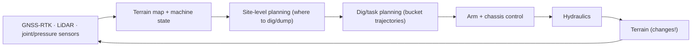

> [!note] Prerequisites · 선수 지식
> [[05-construction-robotics/site-engineering|2.5 Site Robotics §2, §4]] (S2, the error budget and the time denominator) · [[04-robotics/modern-robotics/ch05-velocity-kinematics|MR Ch.05 §1]] (the Jacobian: how an angle error moves the tip) · [[04-robotics/robot-systems-deployment|10. Robot Systems §3]] (latency, and why a delay is a distance) · [[02-foundations/probability|3. Probability §3, §6]] (the Gaussian, and its tail through erf, for reading an error budget) · [[04-robotics/contact-force-tactile|9. Contact]] · [[04-robotics/mpc|7. MPC]] · [[02-foundations/rl-basics|7. RL Basics]] and [[02-foundations/rl-robot-learning|7.5 RL for Robot Learning §1, §4]] (imitation, and RL fine-tuning on a real machine) · [[04-robotics/hri-safety|11. HRI & Safety §1]] (the autonomy spectrum)
> [[05-construction-robotics/site-engineering|2.5 현장 로보틱스 §2, §4]](S2, 오차 예산과 시간 분모) · [[04-robotics/modern-robotics/ch05-velocity-kinematics|MR Ch.05 §1]](야코비안: 각도 오차가 날 끝을 옮기는 방식) · [[04-robotics/robot-systems-deployment|10. 로봇 시스템 §3]](지연, 그리고 지연이 왜 거리인가) · [[02-foundations/probability|3. 확률 §3, §6]](오차 예산을 읽기 위한 가우시안과 erf로 쓴 그 꼬리) · [[04-robotics/contact-force-tactile|9. 접촉]] · [[04-robotics/mpc|7. MPC]] · [[02-foundations/rl-basics|7. RL 기초]]와 [[02-foundations/rl-robot-learning|7.5 로봇 학습을 위한 RL §1, §4]](모방, 그리고 실기계 위의 RL 파인튜닝) · [[04-robotics/hri-safety|11. HRI·안전 §1]](자율성 스펙트럼)

## English

The richest stream in construction physical AI: making excavators, wheel loaders, and
machine fleets do real work autonomously. It is also the stream where the wiki's robotics
track pays off most directly — everything here is
[[04-robotics/contact-force-tactile|contact]], [[04-robotics/state-estimation-slam|estimation]],
[[04-robotics/mpc|MPC]], and [[02-foundations/rl-basics|RL/imitation]] on 12-tonne bodies.

> [!info] Depth target
> Read an excavation-autonomy paper and identify: the machine and its actuation
> peculiarities, the terrain/material assumptions, where the pipeline is classical vs
> learned, what "autonomous" meant operationally, and whether the evaluation supports the
> claim. Designing excavation controllers is a working/mastery topic.

> [!note] First pass · 처음이라면
> Read the Running object and look at the picture: S2's compact excavator at the instant its bucket tip reaches the trench bottom, where the grade tolerance is ±30 mm. Then read §1 for why a heavy machine is its own robotics problem, holding on to the valve's latency, and the Worked case after §3, which spends those 30 mm term by term. §2 prices the soil and §6 the productivity on the same trench. §4, §5 and §7 are the reading guide: the reference systems, what "autonomous" meant in them, and where the literature sits.

### Running object · 이 페이지의 대상

**S2** from [[05-construction-robotics/site-engineering|2.5 Site Robotics as an Engineering System]]: a 5-tonne-class compact excavator digs a utility trench $20\,\mathrm{m}$ long, $0.6\,\mathrm{m}$ wide and $1.0\,\mathrm{m}$ deep to a bottom grade of $\pm30\,\mathrm{mm}$, casting the spoil beside the trench while a worker checks depth at its far end. Its finishing pass is the last pass over a stretch of bottom, the one that brings it to grade. Every S2 number on this page is 2.5's — $L_1$, $L_2$, $L_3$, $w$, $V_b$, $T_c$, $k_f$, $s$, $\gamma$, $k_c$, $e_{\text{GNSS}}$, $\Delta\theta$, $\tau_h$ and $v$ — and none is changed here. The page adds four of its own, frozen here:

| Symbol | Value | What it is |
|---|---:|---|
| angle sensors | one per link | what S2's $\Delta\theta$ is an error of: a sensor on the boom, the stick and the bucket that reads the link's angle to the horizontal, not a joint encoder |
| $h_0$ | $1.0\,\mathrm{m}$ | height of the boom's foot pin above the ground |
| $\varphi_1,\ \varphi_2,\ \varphi_3$ | $-10^\circ$, $-70^\circ$, $-35^\circ$ | the drawing pose: boom, stick and bucket angles to the horizontal when the tip touches the grade, $3.40\,\mathrm{m}$ ahead of the foot pin |
| $d$ | $0.1\,\mathrm{m}$ | the depth of the slice one digging pass cuts, for §2's cutting force |

The pose is chosen so that the tip lands on the grade, $h_0+\sum_i L_i\sin\varphi_i=-1.000\,\mathrm{m}$; it is a drawing pose, not a manufacturer's dimension. Reading $\Delta\theta$ as the error of a link's angle to gravity rather than of a joint angle is this page's choice, and §3 and the Draw problem show what the other reading would cost.

*Scope: this page teaches why a heavy machine is its own robotics problem (hydraulic latency, inertia, soil), prices S2's grade, cutting force and productivity by hand, and reads the field's reference systems (HEAP, AES, ExT, the wheel-loader cluster). It does not teach hydraulic circuit or valve design, soil mechanics beyond one lumped parameter, or how to train a policy for a digging machine: sim-to-real on S2's soil is [[05-construction-robotics/sim-to-real|Sim-to-Real for Field Robots]], the Jacobian is [[04-robotics/modern-robotics/ch05-velocity-kinematics|MR Ch.05]], and imitation and RL fine-tuning are [[02-foundations/rl-robot-learning|7.5 RL for Robot Learning]].*

### The picture · 그림으로 먼저 보기

<svg viewBox="0 0 560 300" style="max-width:100%;height:auto" role="img" aria-label="Left: S2's excavator arm drawn to scale at the finishing pose, boom 2.5 m, stick 1.3 m and bucket 0.6 m from a foot pin 1.0 m above the ground, tip on the trench bottom 1.0 m down; each 0.1 degree link-angle error moves the tip at most 4.36, 2.27 and 1.05 mm, and the RTK receiver adds 20 mm, 27.7 mm of the plus or minus 30 mm grade added linearly. Right: tip height against time near the grade; with the valve acting 0.15 s after the stop command, a stop sent at the grade lands 45 mm below it at 0.3 m/s and 30 mm below at 0.2 m/s, and a stop sent 45 mm early lands on the grade.">
<text x="10" y="20" font-size="12" fill="currentColor" font-weight="600">S2 on the finishing pass (m)</text>
<path d="M11.6,148.0 L167.6,148.0 L167.6,200.0 L300.0,200.0 L300.0,214.0 L11.6,214.0 Z" fill="currentColor" fill-opacity="0.08" stroke="none"/>
<polyline points="11.6,148.0 167.6,148.0 167.6,200.0 300.0,200.0" fill="none" stroke="currentColor" stroke-width="1.2"/>
<rect x="19.9" y="125.1" width="125.3" height="22.9" rx="10" fill="currentColor" fill-opacity="0.18" stroke="currentColor" stroke-width="1"/>
<rect x="28.2" y="86.1" width="83.7" height="36.9" fill="currentColor" fill-opacity="0.12" stroke="currentColor" stroke-width="1"/>
<rect x="60.0" y="50.2" width="46.3" height="35.9" fill="none" stroke="currentColor" stroke-width="1"/>
<line x1="82.8" y1="50.2" x2="82.8" y2="37.8" stroke="currentColor" stroke-width="1.2"/>
<rect x="77.8" y="33.8" width="10" height="4" fill="currentColor"/>
<text x="90.8" y="39.8" font-size="10.5" fill="currentColor">RTK</text>
<line x1="100.0" y1="96.0" x2="228.0" y2="118.6" stroke="currentColor" stroke-width="4.5" stroke-linecap="round"/>
<line x1="228.0" y1="118.6" x2="251.1" y2="182.1" stroke="currentColor" stroke-width="3.5" stroke-linecap="round"/>
<line x1="251.1" y1="182.1" x2="276.7" y2="200.0" stroke="currentColor" stroke-width="2.5" stroke-linecap="round"/>
<circle cx="100.0" cy="96.0" r="3.2" fill="currentColor" fill-opacity="0.25" stroke="currentColor" stroke-width="1"/>
<circle cx="228.0" cy="118.6" r="3.2" fill="currentColor" fill-opacity="0.25" stroke="currentColor" stroke-width="1"/>
<circle cx="251.1" cy="182.1" r="3.2" fill="currentColor" fill-opacity="0.25" stroke="currentColor" stroke-width="1"/>
<rect x="161.0" y="104.3" width="6" height="6" fill="currentColor"/>
<rect x="236.6" y="147.3" width="6" height="6" fill="currentColor"/>
<rect x="260.9" y="188.0" width="6" height="6" fill="currentColor"/>
<circle cx="276.7" cy="200.0" r="2.8" fill="currentColor"/>
<text x="158.0" y="98.3" font-size="11" fill="currentColor">L₁ 2.5</text>
<text x="255.1" y="152.3" font-size="11" fill="currentColor">L₂ 1.3</text>
<text x="281.7" y="191.0" font-size="11" fill="currentColor">L₃ 0.6</text>
<text x="171.6" y="211.0" font-size="10" fill="currentColor">grade −1.000 m, ±30 mm</text>
<line x1="14" y1="224.0" x2="66.0" y2="224.0" stroke="currentColor" stroke-width="1.5"/>
<text x="71.0" y="227.0" font-size="10" fill="currentColor">1 m</text>
<text x="10" y="252" font-size="10.5" fill="currentColor">a 0.1° link-angle error moves the tip ≤ L·Δθ</text>
<text x="10" y="267" font-size="10.5" fill="currentColor">boom 4.36, stick 2.27, bucket 1.05 mm; RTK 20 mm</text>
<text x="10" y="282" font-size="10.5" fill="currentColor">sum 27.7 mm linear, 20.6 by RSS, against ±30</text>
<text x="318" y="20" font-size="12" fill="currentColor" font-weight="600">tip height against the grade (mm)</text>
<rect x="340.0" y="95.0" width="205.0" height="90.0" fill="currentColor" fill-opacity="0.10"/>
<line x1="340.0" y1="140.0" x2="545.0" y2="140.0" stroke="currentColor" stroke-opacity="0.5" stroke-width="1"/>
<text x="344.0" y="180.0" font-size="10" fill="currentColor">±30 grade</text>
<polyline points="340.0,50.0 340.0,230.0 545.0,230.0" fill="none" stroke="currentColor" stroke-opacity="0.6"/>
<line x1="337.0" y1="50.0" x2="340.0" y2="50.0" stroke="currentColor"/><text x="335.0" y="53.5" font-size="10" fill="currentColor" text-anchor="end">+60</text>
<line x1="337.0" y1="95.0" x2="340.0" y2="95.0" stroke="currentColor"/><text x="335.0" y="98.5" font-size="10" fill="currentColor" text-anchor="end">+30</text>
<line x1="337.0" y1="140.0" x2="340.0" y2="140.0" stroke="currentColor"/><text x="335.0" y="143.5" font-size="10" fill="currentColor" text-anchor="end">0</text>
<line x1="337.0" y1="185.0" x2="340.0" y2="185.0" stroke="currentColor"/><text x="335.0" y="188.5" font-size="10" fill="currentColor" text-anchor="end">−30</text>
<line x1="337.0" y1="230.0" x2="340.0" y2="230.0" stroke="currentColor"/><text x="335.0" y="233.5" font-size="10" fill="currentColor" text-anchor="end">−60</text>
<line x1="340.0" y1="230.0" x2="340.0" y2="233.0" stroke="currentColor"/><text x="340.0" y="244.0" font-size="10" fill="currentColor" text-anchor="middle">−0.3</text>
<line x1="381.0" y1="230.0" x2="381.0" y2="233.0" stroke="currentColor"/><text x="381.0" y="244.0" font-size="10" fill="currentColor" text-anchor="middle">−0.15</text>
<line x1="422.0" y1="230.0" x2="422.0" y2="233.0" stroke="currentColor"/><text x="422.0" y="244.0" font-size="10" fill="currentColor" text-anchor="middle">0</text>
<line x1="463.0" y1="230.0" x2="463.0" y2="233.0" stroke="currentColor"/><text x="463.0" y="244.0" font-size="10" fill="currentColor" text-anchor="middle">0.15</text>
<line x1="504.0" y1="230.0" x2="504.0" y2="233.0" stroke="currentColor"/><text x="504.0" y="244.0" font-size="10" fill="currentColor" text-anchor="middle">0.3</text>
<line x1="545.0" y1="230.0" x2="545.0" y2="233.0" stroke="currentColor"/><text x="545.0" y="244.0" font-size="10" fill="currentColor" text-anchor="middle">0.45</text>
<text x="442.5" y="258.0" font-size="10.5" fill="currentColor" text-anchor="middle">time after the sensed tip reaches the grade (s)</text>
<polyline points="340.0,50.0 463.0,185.0 545.0,185.0" fill="none" stroke="currentColor" stroke-width="1.4" stroke-dasharray="5 3"/>
<polyline points="367.3,50.0 463.0,207.5 545.0,207.5" fill="none" stroke="currentColor" stroke-width="2.2"/>
<polyline points="422.0,140.0 545.0,140.0" fill="none" stroke="currentColor" stroke-width="1.6" stroke-dasharray="1.5 2.5"/>
<circle cx="422.0" cy="140.0" r="3" fill="none" stroke="currentColor" stroke-width="1.3"/>
<circle cx="381.0" cy="72.5" r="3" fill="none" stroke="currentColor" stroke-width="1.3"/>
<text x="387.0" y="68.5" font-size="10" fill="currentColor">stop sent</text>
<line x1="422.0" y1="119.0" x2="463.0" y2="119.0" stroke="currentColor" stroke-width="1"/>
<line x1="422.0" y1="115.0" x2="422.0" y2="123.0" stroke="currentColor" stroke-width="1"/>
<line x1="463.0" y1="115.0" x2="463.0" y2="123.0" stroke="currentColor" stroke-width="1"/>
<text x="442.5" y="113.0" font-size="10" fill="currentColor" text-anchor="middle">τ<tspan dy="3" font-size="9">h</tspan><tspan dy="-3" dx="3">0.15 s</tspan></text>
<text x="545.0" y="135.0" font-size="10" fill="currentColor" text-anchor="end">stop sent 45 mm early: 0</text>
<text x="545.0" y="180.0" font-size="10" fill="currentColor" text-anchor="end">0.2 m/s: −30</text>
<text x="545.0" y="220.5" font-size="10" fill="currentColor" text-anchor="end">0.3 m/s, stop at grade: −45</text>
</svg>

S2 at the instant its bucket tip reaches the trench bottom on the finishing pass. Left, to scale: a $0.1^\circ$ error in one link's angle moves the tip by at most that link's length times the angle, $4.36$, $2.27$ and $1.05\,\mathrm{mm}$, and the cab's RTK receiver adds $20\,\mathrm{mm}$, so sensing alone takes $27.7\,\mathrm{mm}$ of the $\pm30\,\mathrm{mm}$ when the terms are added linearly. Right: because the valve acts $0.15\,\mathrm{s}$ after a stop is sent (circles), a tip closing at $0.3\,\mathrm{m/s}$ and stopped at the grade ends $45\,\mathrm{mm}$ below it, at $0.2\,\mathrm{m/s}$ $30\,\mathrm{mm}$ below, and a stop sent $45\,\mathrm{mm}$ early ends on it.

### 1. Why heavy machines are a distinct robotics problem

*In one sentence:* between a command and the bucket sit a valve that answers late, a machine that outweighs its load many times over, and a soil that changes as it is dug, and each of the three moves S2's numbers in its own way.

- **Hydraulic actuation**: valves, pump pressure dynamics, dead zones, and temperature
  drift sit between any command and any joint motion. Policies that output joint
  velocities meet a nonlinearity that manipulator research never sees — which is why ETH's
  RL papers spend as much effort on *actuator modeling* (neural network valve models) as
  on the policy.
- **Scale and inertia**: a 12 t machine stores enough momentum that "try and correct"
  is not a safe learning strategy on hardware; sim-first training is not a convenience
  but a requirement.
- **The working tool changes the world**: digging *removes the terrain the planner
  planned over*. State includes the soil, and the soil has no reliable model.
- **Underactuation appears in odd places**: walking excavators balance on legged chassis;
  material handlers swing passive grapples (hydraulic claws that hang from the boom on
  unpowered joints). With no motor at the swinging joint, the controller cannot command
  where and when the load leaves the claw directly — some of the field's best RL papers
  exist precisely to handle these (throwing with passive joints, IROS 2024).

**Latency is a distance, and on a digging machine it has a sign.** [[04-robotics/robot-systems-deployment|10. §3]] built observation-to-action latency out of computing and communication terms and turned it into a distance: $70\,\mathrm{ms}$ at $1\,\mathrm{m/s}$ is $7\,\mathrm{cm}$. A hydraulic machine adds a term that no computer owns. Between the valve command and the motion sit the valve's travel through its dead zone, the pressure build-up, and the compliance of the oil and hoses, and how long they take depends on the valve and on which way the load moves. On HEAP's 12-tonne machine a commanded step in piston velocity reached 90% in $35\,\mathrm{ms}$ through servo valves fitted for research, but through the machine's own main valves, driven from an electric pilot stage, it took $680\,\mathrm{ms}$ when the stick moved with gravity and $850\,\mathrm{ms}$ when the boom and bucket moved against it (Jud et al. 2021, §2.4.3). Those are one machine's rise times, delay and acceleration together. S2 freezes a delay alone, the valve-to-motion latency $\tau_h=0.15\,\mathrm{s}$; where such a delay comes from — the valve's travel, and the oil column acting as a spring — is worked for a boom cylinder in [[02-foundations/fluid-power|0.6.3 Fluid Power §7 and §11]].

> **Latency overshoot, defined.** The **latency overshoot** is a *distance*: how far a point driven toward a target travels past it because its actuator obeys the stop command only a delay later. Three defining conditions. The point closes on the target at speed $v$ when the stop is sent; the actuator's response begins only after the latency $\tau_h$, on a hydraulic machine the valve-to-motion latency; and until then nothing the controller does can reach the motion, so it continues at $v$. The overshoot is therefore
>
> $$e_{\text{lat}}=v\,\tau_h$$
>
> where $e_{\text{lat}}$ is the distance past the target, $v$ the speed of approach and $\tau_h$ the latency. It is a lower bound, because the arm still has to decelerate once the valve acts.
>
> - **Example**: S2's finishing pass, $v=0.3\,\mathrm{m/s}$ and $\tau_h=0.15\,\mathrm{s}$, gives $e_{\text{lat}}=45\,\mathrm{mm}$: one and a half times the $\pm30\,\mathrm{mm}$ grade before any sensor has erred.
> - **Non-example**: a faster control loop. HEAP's low-level loop runs at $100\,\mathrm{Hz}$, a $10\,\mathrm{ms}$ period, beside pilot-stage valve responses of hundreds of milliseconds. Raising the rate shrinks the sampling term in 10's budget, not the valve's, since the valve's delay starts only after the command is sent.
> - **Non-example**: a sensor error of the same size. The RTK receiver's $20\,\mathrm{mm}$ scatters to both sides of the grade and has no preferred sign. The latency overshoot always lands past the target, on the over-dig side, so it biases every stop the same way.
> - **Why it matters**: each cure attacks one condition. Slowing down shrinks $v$. Predicting attacks the third: the controller sends the stop $\hat\tau_h$ early, where $\hat\tau_h$ is its own estimate of the latency, so the point coasts onto the target and only $v(\tau_h-\hat\tau_h)$ is left. Speed stops being the limit, and knowledge of the valve becomes it.

**Why the sign matters on a trench.** Soil taken from below the grade cannot be put back by digging: an over-dug bottom has to be refilled and compacted, while an under-dug one needs one more pass. The overshoot's sign therefore turns a symmetric tolerance into an asymmetric cost, and a controller that stops early on purpose, accepting a little under-dig, is choosing the cheaper error.

**Inertia is the machine's own.** S2's full bucket carries $0.0952\,\mathrm{m^3}$ of bank soil (§6) at $\gamma=18\,\mathrm{kN/m^3}$, a weight of $0.0952\times18=1.71\,\mathrm{kN}$: about $175\,\mathrm{kg}$, $3.5\%$ of a 5-tonne machine. What the hydraulics accelerate and stop, cycle after cycle, is mostly the machine itself — the boom, stick and bucket on every stroke, and the whole upper structure in the swing, which takes $4$ of every $16\,\mathrm{s}$. A heavy machine is not a steady one either. HEAP's authors report that tyres, and tracks on soft ground, act as springs, and that the arm's control bandwidth when it moves in the air sits close to the frequency at which the machine then rocks (Jud et al. 2021, §6). A controller for a heavy machine shapes the machine's motion as much as the tool's.

### 2. Terrain and material interaction

*In one sentence:* the soil enters S2 as one lumped number, $k_c$, which prices a slice of soil and shows why force control moves the soil from the force to the fill, and the FEE shows where that one number stops holding.

The contact problem here is [[04-robotics/modern-robotics/ch12-grasping|ch. 12's]]
worst case: distributed, history-dependent, and material-parameter-unknown.

- **Classical soil mechanics** (fundamental earthmoving equation — FEE) predicts
  resistive force from blade geometry, depth, and soil parameters — good enough to build
  training simulators, too crude for precise force prediction.
- **The practical responses**: (a) control on *forces, not positions* — the RSL line's
  founding move (2017) treats a dig as a force–torque trajectory, reducing dependence on
  an explicit, precise soil model; (b) **learn adaptively** — soil-adaptive RL (RA-L 2022 —
  [[01-canonical-papers/notes/8-construction/egli-rl|note]]) trains across
  randomized soil parameters and adapts online without ever identifying the soil;
  (c) **learn residuals/geometry** — Baidu's line learns from terrain geometry
  representations.
- Reading cue: when a paper claims soil generality, find which of (a)/(b)/(c) it does
  and what soil range the *evaluation* actually covered.

The alternatives exist because the same bucket path can encounter different resistance after the material has been disturbed. A controller that reacts to measured load and a policy that infers useful behavior from terrain are addressing different observable signals. **The reading this gives you.** Ask what changes online when resistance changes. A soil label in the training set is weaker evidence of adaptation than a logged adjustment that preserves useful digging under the tested shift.

**One number for the soil.** The FEE has several soil parameters; the course object carries one, S2's specific cutting resistance $k_c=60\,\mathrm{kPa}$.

> **Specific cutting resistance, defined.** The **specific cutting resistance** $k_c$ is a *lumped soil–tool parameter* with the units of a pressure: the force needed to cut, per unit area of the slice being cut. Three defining conditions. The tool cuts a slice of constant depth $d$ across its full width $w$; the cutting is steady, meaning the edge moves through undisturbed bank soil at that depth rather than first penetrating it or shoving a growing pile ahead of itself; and the soil is the same along the slice. Under them the force along the cut is
>
> $$F_c=k_c\,w\,d$$
>
> where $F_c$ is the cutting force, $w$ the width of the cut and $d$ its depth, so $wd$ is the slice's cross-section. Since a slice of length $\ell$ has volume $wd\ell$ and takes work $F_c\ell$, the same number is also the cutting energy per bank cubic metre: $60\,\mathrm{kPa}$ is $60\,\mathrm{kJ/m^3}$.
>
> - **Example**: S2 with this page's slice, $d=0.1\,\mathrm{m}$ across the $0.6\,\mathrm{m}$ bucket: $F_c=60\times0.6\times0.1=3.6\,\mathrm{kN}$, about twice the $1.71\,\mathrm{kN}$ that a full bucket of that soil weighs.
> - **Non-example**: the bucket's first bite. Driving the edge or the teeth down into the ground is a transient that the second condition excludes; the soil-adaptive RL paper models the edge's penetration as a mechanism of its own beside the FEE's separation force, and a $k_c$ fitted to steady slices does not predict the force of that bite.
> - **Non-example**: the same $k_c$ for a deep cut. The FEE's soil-weight term grows with the square of the depth (below), so a $k_c$ fitted on thin slices under-predicts a thick one. It is a constant at one depth, not a property of the soil.
> - **Why it matters**: one number is what a controller or a course calculation can carry, and a paper that reports digging "in soil" has said nothing about difficulty until it says which soil, at what depth.

**What one slice costs on S2.** To fill the bucket with its $0.0952\,\mathrm{m^3}$ of bank soil (§6), the $0.1\,\mathrm{m}$ slice has to run $\ell=0.0952/(0.6\times0.1)=1.59\,\mathrm{m}$, and the cutting work is $F_c\,\ell=3.6\times1.59=5.71\,\mathrm{kJ}$ per cycle, the definition's $60\,\mathrm{kJ/m^3}$ times $0.0952\,\mathrm{m^3}$; the whole trench takes $60\times12=720\,\mathrm{kJ}$ of cutting. The force, not the energy, is what a controller runs into, because it has to be available at the edge at every instant of the stroke.

**Force or position, in S2's numbers.** Double the soil's resistance, $k_c=120\,\mathrm{kPa}$. A dig that commands the bucket's path keeps $d=0.1\,\mathrm{m}$ and asks the hydraulics for $120\times0.6\times0.1=7.2\,\mathrm{kN}$ whether or not the machine has it; the soil-adaptive paper's abstract names the two ways that ends, the machine stalling or lifting itself. A dig that commands the force keeps $3.6\,\mathrm{kN}$ and lets the soil set the depth, $d=F_c/(k_c w)=3.6/(120\times0.6)=0.05\,\mathrm{m}$. The machine stays inside its limits and the price moves to the fill: the slice now has to run $0.0952/(0.6\times0.05)=3.17\,\mathrm{m}$ to fill the bucket, and a shorter stroke brings it up part-full, which is a lower $k_f$ in §6. That is response (a) above in numbers. Force control does not take the soil out of the problem; it moves the soil from the force to the fill.

**Where the lump stops holding.** The FEE, introduced by Reece (1964), writes the force on a blade as the sum of a soil-weight term $\gamma d^2 w N_\gamma$, a cohesion term $c\,d\,w\,N_c$, an adhesion term, and a surcharge term for loose soil piled on the blade, where $c$ is the soil's cohesion and each factor $N$ depends on angles alone: the blade's, the ground surface's, the soil's two friction angles and the failure plane's (Wagner et al. 2023 write it out term by term). Divided by the cut area $wd$, the cohesion term becomes the constant $cN_c$, while the weight term grows with depth as $\gamma d N_\gamma$. So wherever part of the resistance is the weight of the soil wedge being lifted, a $k_c$ measured at one depth holds near that depth only; and the surcharge term grows during a stroke as soil piles up on the blade, which a single $k_c$ ignores as well. The soil-adaptive RL paper trains against a model of this family with its parameters redrawn every episode — cohesion $0$ to $105\,\mathrm{kPa}$, unit weight $17$ to $22\,\mathrm{kN/m^3}$, internal friction angle $0.3$ to $0.8\,\mathrm{rad}$ (its Table I) — so S2's $\gamma=18\,\mathrm{kN/m^3}$ lies inside what that policy saw, while S2's single $k_c$ cannot be placed in the table at all. One lumped number does not say which mix of cohesion and friction produced it.

### 3. The pipeline, and where learning sits

A modern autonomous excavator is a [[04-robotics/robot-systems-deployment|closed robot stack]]
with stream-specific blocks. In the first box, GNSS-RTK is satellite positioning (GNSS)
with real-time kinematic (RTK) corrections from a nearby base station, which brings the
position error from metre level down to centimetre level:

The three method families divide this pipeline differently:

| Family | Where it lives | Strengths | Read for |
|---|---|---|---|
| **MPC / optimal control** | dig planning + arm control | constraints, guarantees, interpretability | formulation, horizon, what is re-solved when the terrain changes |
| **RL** | arm/tool control, bucket filling | handles hydraulics + soil variability without models | actuator model quality, sim-to-real gap, safety envelope during learning |
| **Imitation / pretrain–fine-tune** | task level ([[01-canonical-papers/notes/8-construction/exact-2024\|ExACT]], ExT) | leverages operator demonstrations, multi-task | where demos came from (real operators? RL experts in sim?), fine-tuning cost |

These are *complements*, not rivals: ExT's demonstrations are generated by RL experts;
RL policies run inside MPC-checked safety envelopes; site-level planning stays classical
almost everywhere.

**From satellites to the bucket tip.** The first box of that diagram is where S2's grade is won or lost, because the design grade is given in the site's surveyed frame and the tip is known only through the machine. On S2 the chain has four measurements: the cab's RTK receiver fixes the height $z_0$ of the boom's foot pin, measured here from the ground so that $z_0=h_0=1.0\,\mathrm{m}$ in the drawing pose, and one sensor per link reads that link's angle $\varphi_i$ to the horizontal. Each link adds its length times the sine of its own angle to the height, so

$$z_{\text{tip}}=z_0+L_1\sin\varphi_1+L_2\sin\varphi_2+L_3\sin\varphi_3$$

which at the drawing pose is $1.0+2.5\sin(-10^\circ)+1.3\sin(-70^\circ)+0.6\sin(-35^\circ)=1.0-0.434-1.222-0.344=-1.000\,\mathrm{m}$, on the grade. An error in any one measurement moves the tip by the partial derivative with respect to that measurement times the error — the Jacobian's first-order reasoning ([[04-robotics/modern-robotics/ch05-velocity-kinematics|MR Ch.05 §1]]), applied to sensor errors instead of joint rates — so

$$\delta z_{\text{tip}}=\delta z_0+\sum_{i=1}^{3}L_i\cos\varphi_i\,\delta\varphi_i$$

and a link's angle error acts through that link's horizontal projection $L_i\cos\varphi_i$, never more than $L_i$. At the drawing pose the projections are $2.46$, $0.44$ and $0.49\,\mathrm{m}$: the boom, nearly level, carries most of the leverage, and the stick, hanging nearly vertical, almost none.

**Which angle a sensor reads is a design choice.** A sensor that reads its link against gravity, as S2's do, keeps its error in that link. A joint encoder reads a link against the one before it, so an error at the boom's joint turns the stick and the bucket too, and its lever arm is the horizontal distance from that joint to the tip. HEAP carries both kinds for this reason: draw-wire encoders on the cylinders for fast control, because they measure without delay, and IMUs on the links for the tool's precise pose, because a link's orientation to the world does not collect the joint play and conversion errors of the chain before it (Jud et al. 2021, §2.1). What the other choice would cost on S2 is the Draw problem. Every block downstream — the grade controller, an MPC's cost, a learned policy's observation — acts on this estimate, so its error is a floor that no controller downstream can dig under.

### Worked case · 대상으로 한 번 끝까지

Can S2's machine put the trench bottom within $\pm30\,\mathrm{mm}$? Four steps on the finishing pass, the moment the picture shows, using §1's latency overshoot and §3's tip chain. These are course computations on a frozen object, not measurements of a real machine.

**Step 1 — what one sensor can do to the tip.** §3 gives each link-angle error a lever arm $L_i\cos\varphi_i$, at most the link's length. The budget has to hold at every pose of the pass, so it books the largest: with $\Delta\theta=0.1^\circ=0.1\times\pi/180=1.745\times10^{-3}\,\mathrm{rad}$, the boom contributes up to $2.5\times1.745\times10^{-3}\,\mathrm{m}=4.36\,\mathrm{mm}$, the stick $1.3\times1.745\times10^{-3}\,\mathrm{m}=2.27\,\mathrm{mm}$ and the bucket $0.6\times1.745\times10^{-3}\,\mathrm{m}=1.05\,\mathrm{mm}$. At the drawing pose the same three terms are $4.30$, $0.78$ and $0.86\,\mathrm{mm}$, because the stick hangs nearly vertical.

**Step 2 — the sensing budget, read two ways.** Added linearly, the three angle terms come to $4.36+2.27+1.05=7.68\,\mathrm{mm}$, and the RTK receiver's $20\,\mathrm{mm}$ brings the total to $27.7\,\mathrm{mm}$, $2.3\,\mathrm{mm}$ inside the tolerance. Read as independent two-sigma bounds, they combine by root-sum-square ([[05-construction-robotics/site-engineering|2.5 §2]]): the angles give $\sqrt{4.36^2+2.27^2+1.05^2}=5.03\,\mathrm{mm}$ and the total is $\sqrt{20^2+5.03^2}=20.6\,\mathrm{mm}$, $9.4\,\mathrm{mm}$ inside. Either way the satellite term is most of it, $20$ of the $27.7\,\mathrm{mm}$, and the arm's sensors are small because a $4.4\,\mathrm{m}$ arm is short.

**Step 3 — the valve.** A stop sent when the sensed tip reaches the grade lands $e_{\text{lat}}=v\,\tau_h=0.3\times0.15=0.045\,\mathrm{m}$ below it: $45\,\mathrm{mm}$, one and a half times the tolerance before any sensing error, and always on the over-dig side. Slowing to $v=30/0.15=200\,\mathrm{mm/s}$ makes the valve spend exactly the tolerance, which still fails. The stops are then centred on $-30\,\mathrm{mm}$, and the zero-mean sensing error that the root-sum-square reading assumes scatters them symmetrically about that centre, so about half land below the tolerance. To fit the valve beside the sensing budget the speed has to satisfy $v\,\tau_h\le 30-27.7\,\mathrm{mm}$, so $v\le 2.3/0.15=15\,\mathrm{mm/s}$ under the linear reading, or $v\le 9.4/0.15=63\,\mathrm{mm/s}$ under root-sum-square: about $19$ and $5$ times slower than the pass.

**Step 4 — predict instead.** Send the stop $v\hat\tau_h=0.3\times0.15=0.045\,\mathrm{m}$, that is $45\,\mathrm{mm}$, before the grade. The overshoot cancels and only $v(\tau_h-\hat\tau_h)$ is left, so the margin the sensors leave becomes a limit on how well the latency must be known. Treating that residual as a bias added to the total, at $0.3\,\mathrm{m/s}$ the linear reading allows $|\tau_h-\hat\tau_h|\le 2.3/0.3=7.7\,\mathrm{ms}$ and the root-sum-square reading $9.4/0.3=31\,\mathrm{ms}$: $5\%$ or $21\%$ of $\tau_h$ itself.

**What the case says.** The grade is a budget with two owners. The sensors own most of it, and on S2 the satellite term owns most of theirs. The valve owns whatever the speed demands, and prediction trades that for a requirement on the valve model — which is why the RSL line learns one (§1), and why a paper's digging accuracy cannot be read until it says how fast the tip was moving when it stopped. Reading the budget linearly or by root-sum-square changes the answer about fourfold, in allowed speed and in allowed latency error alike, and 2.5 §2's warning applies unchanged: the reading is a claim about the errors, to be defended, not chosen for the answer it gives.

### 4. The reference systems, read closely

**HEAP (ETH RSL, Automation in Construction 2021 — [[01-canonical-papers/notes/8-construction/heap|note]]).**
A Menzi Muck M545 walking excavator rebuilt for autonomy: electric pilot valves, force-
controllable legged chassis, GNSS-RTK + LiDAR. Method: classical estimation + planning +
force-based dig control. Evaluation: real trenches, embankments, and (with
[[05-construction-robotics/assembly-fabrication|GKR]]) the 6 m dry-stone wall — a
delivered landscape commission, not a demo. The embankments' accuracy is reported as an
average error, $0.03\,\mathrm{m}$ on a two-faced embankment and $0.05\,\mathrm{m}$ on an
s-curved one that moved $30\,\mathrm{m^3}$ of soil; the Interpret problem sets those numbers
beside S2's $\pm30\,\mathrm{mm}$. Autonomy: full task autonomy within a
surveyed workspace; humans define tasks and supervise. Limitation to notice: one
heavily-instrumented, one-of-a-kind machine — platform generality was the open question
that ExT later attacked.

**AES (Baidu, Science Robotics 2021 — [[01-canonical-papers/notes/8-construction/aes|note]]).**
The industrial-scale counterpoint: standard
(non-walking) excavators, on which the abstract reports **24 hours per intervention** — its own
phrase for continuous operation without human intervention — in deployed material-loading
work, at hourly throughput the abstract calls closely equivalent to an experienced operator
(it states no unit). The compact-to-49-t range is a body figure; the abstract says only
"compact and standard excavators." Method: modular perception (LiDAR+camera) +
planning + control, engineered for robustness rather than learning novelty. Autonomy:
uncrewed continuous operation in a constrained waste-handling site. Read it as the
existence proof that the *systems integration* problem is solvable at industrial scale.

**ExT (ETH RSL, 2025 — [[01-canonical-papers/notes/8-construction/ext|note]]).** Hold one
fact first: only the pretrained policy ran on the real machine, and every fine-tuning result
below is a simulation study. The
paradigm signal: one transformer policy pretrained on **GPU-parallel simulated
demonstrations** (RL experts + scripted + teleop) — 150,000 episodes each for Dig, Dump and
Move Arm, 2,000 for the teleoperated Abort & Reset — then fine-tuned to new tasks by SFT/RLFT (supervised fine-tuning on demonstrations, or
RL fine-tuning on reward).
Read the headline bargain with its scope attached: "roughly 30 days of continuous real-world
operation … generated in under two hours on a single RTX 3090" describes the two scripted
tasks, while Dig's 150,000 RL-expert episodes are worth "about 15 days". The *pretrained* policy is the one that transfers
to the real M545 at centimeter-level accuracy. The [[02-foundations/rl-robot-learning|pretrain→fine-tune]] recipe, on hydraulics.
Limitation to notice: demonstrations are sim-generated; the diversity of *real* sites
remains outside the training distribution.

**The wheel-loader cluster (Tampere/Luleå/Umeå, ICRA 2024– —
[[01-canonical-papers/notes/8-construction/wheel-loader-rl|note]]).** Short-loading-cycle
automation (the short, repeated fill–reverse–drive–dump cycle a loader runs between a pile
and a nearby truck or hopper; §6's worked example computes the productivity of such a cycle) with IL pretraining + RL fine-tuning on real loaders, zero-shot sim-to-real
approaches, world-model simulation with OEM partners (Komatsu, Epiroc). Read alongside
the excavator work to see which conclusions are machine-specific.

### 5. Autonomy and intervention, operationally

Apply the [[04-robotics/hri-safety|autonomy-spectrum vocabulary]] strictly here:

- Research systems (HEAP, AES) run **full task autonomy inside a bounded, prepared work
  area**: tasks are specified from surveyed geometry, the workspace is defined in advance,
  and the papers do not claim operation in shared or public traffic. What each paper
  actually states about supervision, site access, and intervention differs — read it from
  the deployment section rather than assuming a common protocol.
- Commercial systems are mostly **supervised autonomy or assisted teleoperation**
  (Gravis RACK, Built Robotics' remote supervisors, Cat Command's control-room
  operators) — the human moved from the cab to a screen, and *reset/recovery is still
  human labor*. The screen is at the end of a network whose delay and losses are its own
  budget ([[02-foundations/tools/computer-networks|12.5 Computer Networks §11]] for the site's Wi-Fi and 5G).
- Reading cue: find who defines the task, who watches, who recovers from failure, and
  what happens when a person enters the work zone. Papers that omit these are describing
  a demo, not autonomy.

**What the reference papers say about who watches.** HEAP's platform paper says it in the caption of the figure that shows its applications: operators were present in the cabin only for safety and did not interact with the machine (its Fig. 12). That is task autonomy with a safety supervisor on board, which is not the same claim as an empty cab, and not the same as AES's 24 hours per intervention, which counts interventions rather than who sat where.

**S2 writes the protocol into the object.** A worker checks depth at the trench's far end. That person is the grade's measurement, the check that decides whether the Worked case's $\pm30\,\mathrm{mm}$ was met, and walks the machine's work area to make it. So the reading cue has concrete answers to find on S2. The task is defined by the trench's surveyed line and grade. The worker and a supervisor watch. Recovery from the Worked case's failure, an over-dug bottom, is refilling and compacting, which the digging autonomy does not do. And when the worker walks from the far end toward the bucket, the machine has to stop before the person is inside its reach: the arm alone reaches $L_1+L_2+L_3=4.4\,\mathrm{m}$ from the foot pin, in every direction the swing can point it. A paper that reports digging accuracy and nothing about that walk has described the machine, not the work package.

### 6. Evaluation: what convinces

*In one sentence:* a productivity is a number only with its volume measure and its hours stated, and on S2 the same machine-hour reads $21.4$, $26.8$ or $31.5\,\mathrm{m^3}$ depending on which cubic metre is counted.

Beyond the [[05-construction-robotics/index|reading frame]], stream-specific measures:
tons or m³ per hour **against a skilled operator baseline** (AES reports this; many
papers do not), fuel/energy per unit moved, bucket fill factor, task completion across
soil/weather variation, continuous-operation hours without intervention, and — for
learned systems — the sim-to-real gap stated quantitatively. A single dig cycle in one
soil bin supports almost no claim.

> [!warning] Reading the claim · 핵심 주장 읽는 법
> "Autonomous excavation" in a title can mean anything from a single force-controlled dig
> cycle in a gravel bin to 24 h uncrewed truck loading. The abstract rarely tells you
> which; the evaluation section always does. Check machine size, site realism,
> continuous-operation duration, and intervention counts before comparing any two papers.

> [!example] Worked example · 계산 예제
> **Separate filling from cycle time.** For a hypothetical 1.2 m³ bucket, fill factor 0.85, and 25 s cycle, ideal continuous-cycle productivity is 1.2 × 0.85 × 3600/25 ≈ **146.9 m³/h**. Holding fill fixed and shortening the cycle by 10% to 22.5 s gives **163.2 m³/h**. Holding cycle time fixed and increasing fill by 10% to 0.935 gives **161.6 m³/h**.
>
> **The reading this gives you.** Ask which term changed and whether the other stayed fixed. A policy can change both filling and motion; hydraulics constrain achievable cycle time but do not determine it alone. These are ideal cycle figures, excluding downtime, setup, and recovery. A field-productivity claim must include those costs in its time denominator.

**Which cubic metre?** The worked example's $146.9\,\mathrm{m^3/h}$ is counted in the bucket, where the soil is loose. A trench is specified by the hole it leaves, so S2's comparisons need a third factor.

> **Bank productivity, defined.** The **bank productivity** $Q_b$ of a digging machine is a *rate*: cubic metres of soil removed, counted in its undisturbed in-place state (bank measure), per hour of cycling. Three defining conditions, one per factor. Volume is counted in bank measure, so the loose volume a cycle carries is divided by the swell $s=V_{\text{loose}}/V_{\text{bank}}$, the ratio of the same soil's volume after and before digging; the bucket's heaped capacity $V_b$ is multiplied by the fill factor $k_f$, the fraction of it a real cycle carries; and the time denominator is the cycle time $T_c$ and nothing else. So
>
> $$Q_b=\frac{3600}{T_c}\cdot\frac{V_b\,k_f}{s}$$
>
> since $3600/T_c$ is the number of cycles in an hour and $V_b k_f/s$ the bank volume one cycle removes.
>
> - **Example**: S2, $225\times0.0952=21.42$ bank $\mathrm{m^3/h}$.
> - **Non-example**: the same machine-hour in other measures. Counted in the spoil pile it is $21.42\times1.25=26.8$ loose $\mathrm{m^3/h}$; counted by the nominal bucket it is $225\times0.14=31.5\,\mathrm{m^3/h}$. Three honest-looking numbers for one hour, the largest $47\%$ above the smallest.
> - **Non-example**: a rate over a working day. Setup, moving the machine, finishing and checks all sit outside $T_c$; a field number divides by 2.5 §4's effective time instead.
> - **Why it matters**: a trench, an embankment or a cut is specified in bank measure, a truck is loaded in loose measure, and a bucket is rated heaped. Two papers' "m³/h" can be compared only when both say which measure and which hours.

**S2's job in bank measure.** The trench is $20\times0.6\times1.0=12\,\mathrm{m^3}$ bank, and $12\times1.25=15\,\mathrm{m^3}$ loose once it lies beside the trench. One cycle removes $V_b k_f/s=0.14\times0.85/1.25=0.0952\,\mathrm{m^3}$ bank, so the job takes $12/0.0952=126.05$ cycles: $127$, the last one only $5\%$ full. At $3600/16=225$ cycles an hour, $Q_b=225\times0.0952=21.42$ bank $\mathrm{m^3/h}$, and $12/21.42=0.560\,\mathrm{h}$ is $33.6\,\mathrm{min}$ of pure cycling; counting whole cycles, $127\times16=2032\,\mathrm{s}$ is $33.9\,\mathrm{min}$. Neither number contains the Worked case's finishing pass, moving the machine along $20\,\mathrm{m}$, or the worker's checks. Those belong to 2.5 §4's effective time, which is what a site pays for. The worked example above, on S2's soil, would be $146.9/1.25=117.5$ bank $\mathrm{m^3/h}$.

### 7. Where this stream is moving (2019–2025)

Counted as in [[05-construction-robotics/lineage|lineage §6]]: robot-titled earthmoving papers in the four construction journals rose from $24$ in 2019–2021 to $41$ in 2023–2025, but fell from $20\%$ to $16\%$ of construction robot papers. Of the $41$, $18$ plan or control the machine, $12$ perceive it and $11$ do both or neither, and none mentions reinforcement or imitation learning. The construction journals therefore carry the classical half of this page's pipeline — trajectory optimization, trajectories built from expert operators' skills (Feng et al., *AutCon* 158, 2024, [DOI](https://doi.org/10.1016/j.autcon.2023.105247), from Jilin University), and perception of the machine: excavator 3D pose (Assadzadeh et al., *AEI* 55, 2023, [DOI](https://doi.org/10.1016/j.aei.2023.101875)) and productivity from activity recognition (Chen et al., *AutCon* 146, 2023, [DOI](https://doi.org/10.1016/j.autcon.2022.104702)). The learning half runs in robotics venues: [[01-canonical-papers/notes/8-construction/aes|AES]] and its successors from Baidu, [[01-canonical-papers/notes/8-construction/heap|HEAP]] and [[01-canonical-papers/notes/8-construction/ext|ExT]] from ETH, and [[01-canonical-papers/notes/8-construction/exact-2024|ExACT]]. A search for learned excavation that stays in *Automation in Construction* will conclude that it barely exists; one that stays in RA-L will miss the machine-perception and operator-skill work it could build on.

### After reading

- Explain why hydraulic actuation and soil contact make excavators harder than
  manipulators for learned control.
- Compute a latency overshoot, say why it always lands on the over-dig side, and say which
  of its conditions slowing down and predicting each attack.
- Carry S2's sensor errors to the bucket tip, add them linearly and by root-sum-square
  against the $\pm30\,\mathrm{mm}$ grade, and say what a joint encoder would change.
- Price one slice of soil with $k_c$, and say where the lumped number stops holding.
- State a productivity in bank measure with its time denominator, and convert a
  bucket-measure figure.
- Place MPC, RL, and imitation in the excavation pipeline and say what each buys.
- Summarize HEAP, AES, and ExT in one sentence each — machine, method, evidence.
- State the operational autonomy level of a paper's system from its evaluation section.
- Name three stream-specific evaluation measures beyond success rate.

### Self-check

1. Why did the RSL line switch from position-trajectory digging to force–torque
   trajectories in its founding 2017 paper?
2. ExT's demonstrations come from RL experts in simulation. What does this make cheap,
   and what risk does it leave unaddressed?
3. A paper reports 95% dig-cycle success in a sand bin with a 1.5 t mini-excavator. List
   three reasons this may not transfer to a 20 t machine on a real site.
4. Why do commercial deployments favor supervised autonomy over full autonomy even when
   the research autonomy exists?
5. Why does slowing S2's finishing pass to $0.2\,\mathrm{m/s}$ still leave about half the
   bottom out of tolerance, and what does predicting the stop require instead?
6. A force-commanded dig meets soil twice as hard as S2's. What happens to the force, the
   slice depth and the fill, and what would a position-commanded dig have done?

> [!tip]- Answers
> 1. Position trajectories fail when soil resistance varies — the same path meets wildly different forces. Commanding force–torque profiles reduces dependence on precise soil parameters because the machine regulates measured interaction, but material-dependent feasibility, saturation, fill, and outcome remain.
> 2. Cheap: unlimited, labeled, resettable demonstrations across randomized tasks — exactly what real machines cannot provide. Unaddressed: the sim's soil/hydraulics/site diversity bounds what pretraining can know; real-site distribution shift remains.
> 3. Hydraulic dynamics scale nonlinearly (valve/pump saturation); soil forces scale with bucket geometry differently than inertia; real sites add slopes, mixed material, obstacles, weather, and safety constraints absent from a bin.
> 4. Liability and safety cases require a responsible human; failure recovery is unsolved (reset is human labor); and sites are shared spaces — the certification and insurance path for unsupervised heavy machinery does not yet exist.
> 5. At $0.2\,\mathrm{m/s}$ the latency overshoot is $0.2\times0.15=30\,\mathrm{mm}$ and always on the over-dig side, so the stops are centred on $-30\,\mathrm{mm}$; zero-mean sensing errors scatter them symmetrically about that centre, and about half land below the tolerance. Predicting sends the stop $v\hat\tau_h$ early and centres the stops on the grade, but at $0.3\,\mathrm{m/s}$ it needs the latency known to within $7.7\,\mathrm{ms}$ (linear reading) or $31\,\mathrm{ms}$ (root-sum-square): a valve model, and a valve whose delay does not drift away from it.
> 6. The force stays at $3.6\,\mathrm{kN}$, the slice thins to $3.6/(120\times0.6)=0.05\,\mathrm{m}$, and the drag needed to fill the bucket doubles to $3.17\,\mathrm{m}$, so a shorter stroke brings the bucket up part-full, a lower $k_f$. A position-commanded dig keeps $0.1\,\mathrm{m}$ and asks for $7.2\,\mathrm{kN}$, which the machine may not have: it stalls or lifts itself.

### Problem set · 과제

Tier B. S2 from [[05-construction-robotics/site-engineering|2.5]], with this page's sensors, pose and slice. Every quantity here is a product or a sum, so a hand calculation carries each problem to its number; no simulator is needed.

1. **Draw.** The picture with joint encoders in place of the link-angle sensors. Each sensor now reads the angle between its link and the one before it, so an error at a joint turns everything beyond that joint. Left: the same arm, with each joint's lever arm drawn as the horizontal distance from that joint to the tip, and its worst-case value written beside it. Right: the same tip-height plot at $0.3\,\mathrm{m/s}$, with the band the sensing error now occupies. Can any stopping rule close the linear budget?
2. **Derive.** Keep the link-angle sensors and the predictive stop of the Worked case, and change one knob: the controller knows the valve's latency only to within $\pm0.03\,\mathrm{s}$ (two-sigma), because it drifts with the oil's temperature. (a) The residual overshoot at $v=0.3\,\mathrm{m/s}$. (b) The total under the linear reading and under root-sum-square, treating the residual as a third independent error; which closes the $\pm30\,\mathrm{mm}$? (c) The fastest finishing speed that closes the linear budget. (d) At the drawing pose instead of the worst case, the three angle terms, their linear sum, and what that frees in (c).
3. **Derive.** Keep §6's worked-example bucket, $1.2\,\mathrm{m^3}$ at fill factor $0.85$. (a) An operator cycles in $25\,\mathrm{s}$ and spends $15\%$ of the hour not digging (repositioning, trucks, pauses): the effective hourly productivity. (b) An autonomous excavator cycles $20\%$ slower, in $30\,\mathrm{s}$, with the same $15\%$ non-digging time, but runs $10$ hours a day against the operator's $8$. Compare hourly and daily volumes. (c) The same $15\%$ non-digging time on S2: its effective bank productivity, and how long its $12\,\mathrm{m^3}$ then take.
4. **Interpret.** (a) A vendor says its autonomous excavator "matches operator productivity." Using 3(b), what denominator must the claim state, and which of the two comparisons would a contractor care about? (b) HEAP's platform paper reports autonomous embankments with an average error of $0.03\,\mathrm{m}$ on a two-faced shape and $0.05\,\mathrm{m}$ on an s-curved one (§4). Does that show its machine would hold S2's $\pm30\,\mathrm{mm}$ grade? Say what the number would need to state, and work one reading of it: if the $0.03\,\mathrm{m}$ were the mean absolute error of zero-mean normal errors (for which the mean absolute error is $\sigma\sqrt{2/\pi}$), what fraction of points would lie outside $\pm30\,\mathrm{mm}$?

> [!note]- How to draw it · 그리는 법
> - **Left, the same arm at the same pose**, and from each of the three joints (the foot pin, the boom–stick pin, the stick–bucket pin) a horizontal bracket to the tip: $3.40$, $0.94$ and $0.49\,\mathrm{m}$ at this pose. Beside each, its worst case, the reach beyond that joint with everything level: $4.4$, $1.9$ and $0.6\,\mathrm{m}$.
> - **Under the left panel, the new budget**: $7.68+3.32+1.05=12.04\,\mathrm{mm}$ from the angles, $32.0\,\mathrm{mm}$ with the RTK term added linearly, over the $\pm30$; $21.7\,\mathrm{mm}$ by root-sum-square.
> - **Right, the same three curves**, with the sensing band drawn about the grade: $\pm32.0\,\mathrm{mm}$ (linear), wider than the $\pm30\,\mathrm{mm}$ tolerance band, and $\pm21.7\,\mathrm{mm}$ (root-sum-square) inside it.
> - **Write the observation beside the brackets**: the boom's encoder alone costs as much as all three link sensors together, because its lever arm is the whole reach.
> - The drawing is wrong if the boom's bracket ends at the boom's tip: that is the link sensor's lever arm, the case the picture already shows.

> [!tip]- Solutions
> 1. The worst-case lever arms are $4.4$, $1.9$ and $0.6\,\mathrm{m}$, so the angle terms are $4.4\times1.745=7.68$, $1.9\times1.745=3.32$ and $0.6\times1.745=1.05\,\mathrm{mm}$, summing to $12.04\,\mathrm{mm}$; with the RTK term the linear total is $32.0\,\mathrm{mm}$, $2.0\,\mathrm{mm}$ over the tolerance, so under the linear reading no stopping rule fits, not even one with zero overshoot. By root-sum-square the angles give $\sqrt{7.68^2+3.32^2+1.05^2}=8.43\,\mathrm{mm}$ and the total $\sqrt{20^2+8.43^2}=21.7\,\mathrm{mm}$, $8.3\,\mathrm{mm}$ inside: a stop at the grade then needs $v\le8.3/0.15=55\,\mathrm{mm/s}$, and a predictive stop at $0.3\,\mathrm{m/s}$ needs the latency within $8.3/0.3=28\,\mathrm{ms}$. At the drawing pose the joint lever arms $3.40$, $0.94$ and $0.49\,\mathrm{m}$ give $5.93$, $1.63$ and $0.86\,\mathrm{mm}$, $8.42\,\mathrm{mm}$ in all.
> 2. (a) $0.3\times0.03=0.009\,\mathrm{m}$, a residual of $9\,\mathrm{mm}$ (two-sigma). (b) Linear: $27.7+9=36.7\,\mathrm{mm}$, which fails. Root-sum-square: $\sqrt{20^2+5.03^2+9^2}=22.5\,\mathrm{mm}$, which closes with $7.5\,\mathrm{mm}$ to spare. (c) $v\le2.3/0.03=77\,\mathrm{mm/s}$. (d) $4.30+0.78+0.86=5.93\,\mathrm{mm}$, a linear total of $25.9\,\mathrm{mm}$ and a margin of $4.1\,\mathrm{mm}$, so $v\le4.07/0.03=136\,\mathrm{mm/s}$: the pose nearly doubles the allowed speed, but only where the pass stays near that pose, since the budget has to hold wherever the lever arms are longest.
> 3. (a) $146.9\times0.85=124.9\,\mathrm{m^3/h}$. (b) Hourly: autonomous $1.2\times0.85\times3600/30\times0.85=104.0\,\mathrm{m^3/h}$ against the operator's $124.9$, $17\%$ less. Daily: $104.0\times10=1{,}040\,\mathrm{m^3}$ against $124.9\times8=999\,\mathrm{m^3}$, $4\%$ more. The same machine loses per hour and wins per day. (c) $21.42\times0.85=18.21$ bank $\mathrm{m^3/h}$, so the $12\,\mathrm{m^3}$ take $12/18.21=0.659\,\mathrm{h}$, $39.5\,\mathrm{min}$.
> 4. (a) The claim must say per hour of operation, per shift or per day, and what counts as non-digging time. A contractor paying for a schedule cares about volume per calendar day and the supervision it needs; a claim per hour and a claim per day can point in opposite directions, as 3(b) shows. (b) No. A grade tolerance must hold at nearly every point, so the number would need its definition (signed mean, mean absolute or root-mean-square), where and how densely it was measured, and its tail. On the reading asked for, $\sigma=0.03\times\sqrt{\pi/2}=37.6\,\mathrm{mm}$, and the fraction outside $\pm30\,\mathrm{mm}$ is $1-\operatorname{erf}\!\big(30/(37.6\sqrt2)\big)=42\%$; read as a root-mean-square it would be $32\%$. The task also differs: a 12-tonne walking excavator shaping an embankment's faces, not a 5-tonne machine finishing a trench bottom. The number places the platform in an accuracy class; it does not show a pass on S2's grade, and the paper does not claim one.

### Sources

- [HEAP — ETH Research Collection (OA)](https://www.research-collection.ethz.ch/server/api/core/bitstreams/62e1de57-8939-4701-8672-ec2bb55e1c5d/content)
- [AES — Science Robotics 2021](https://www.science.org/doi/10.1126/scirobotics.abc3164)
- [ExT (arXiv 2509.14992)](https://arxiv.org/abs/2509.14992) · [Soil-adaptive RL (ETH OA)](https://www.research-collection.ethz.ch/server/api/core/bitstreams/95ef5691-11e8-4a86-b02d-6f0e2501de9b/content)
- [Stentz et al. 1999 — the 1998 CMU ancestor (CMU RI page)](https://publications.ri.cmu.edu/a-robotic-excavator-for-autonomous-truck-loading) · [[01-canonical-papers/notes/8-construction/stentz-excavator|note]]
- D. Jud, S. Kerscher, M. Wermelinger, E. Jelavic, P. Egli, P. Leemann, G. Hottiger, M. Hutter, "HEAP – The autonomous walking excavator," *Automation in Construction* 129, 103783, 2021, [DOI](https://doi.org/10.1016/j.autcon.2021.103783) (open-access copy in the first bullet). This page uses its link sensing (§2.1), valve step responses (§2.4.3), embankment accuracy (§5.1), development insights (§6), and the in-cab safety operator of its Fig. 12.
- P. Egli, D. Gaschen, S. Kerscher, D. Jud, M. Hutter, "Soil-Adaptive Excavation Using Reinforcement Learning," *IEEE RA-L* 7(4), 2022 (the ETH copy above). This page uses its Table I of soil-parameter ranges, its separation–penetration soil model, and the stalling and lifting its abstract names.
- A. R. Reece, "The Fundamental Equation of Earth-Moving Mechanics," *Proceedings of the Institution of Mechanical Engineers, Conference Proceedings* 179(6), 16–22, 1964, [DOI](https://doi.org/10.1243/PIME_CONF_1964_179_134_02) — the FEE of §2.
- W. J. Wagner, A. Soylemezoglu, D. Nottage, K. Driggs-Campbell, "In Situ Soil Property Estimation for Autonomous Earthmoving Using Physics-Infused Neural Networks," 16th European-African Regional Conference of the ISTVS, 2023, [arXiv:2309.02575](https://arxiv.org/abs/2309.02575) — the FEE written out term by term, as §2 describes it.

## 한국어

건설 physical AI에서 가장 풍부한 스트림: 굴착기, 휠로더, 기계 선단이 실제 작업을
자율적으로 하게 만드는 것. 이 위키의 로보틱스 트랙이 가장 직접적으로 보상받는
스트림이기도 하다 — 여기의 모든 것이 12톤짜리 몸체 위의
[[04-robotics/contact-force-tactile|접촉]], [[04-robotics/state-estimation-slam|추정]],
[[04-robotics/mpc|MPC]], [[02-foundations/rl-basics|RL/모방]]이다.

> [!info] 깊이 목표
> 굴착 자율화 논문을 읽고 다음을 짚는다: 기계와 그 구동의 특이점, 지반/재료 가정,
> 파이프라인의 어디가 고전이고 어디가 학습인지, "autonomous"가 운용적으로 무엇을
> 의미했는지, 평가가 주장을 지지하는지. 굴착 제어기 설계는 실무/숙달 단계의 주제다.

> [!note] 처음이라면 · First pass
> 이 페이지의 대상을 읽고 그림을 본다. S2의 소형 굴착기가 버킷 날 끝을 트렌치 바닥에 막 대는 순간이고, 바닥 고저의 허용오차는 ±30 mm다. 그다음 §1에서 중장비가 왜 별개의 로보틱스 문제인지 읽되 밸브의 지연을 붙잡아 두고, §3 뒤의 계산 절에서 그 30 mm를 항목별로 쓴다. §2는 같은 트렌치에서 흙의 값을, §6은 생산성을 매긴다. §4, §5, §7은 읽기 안내다. 기준 시스템, 그 안에서 "autonomous"가 무엇을 뜻했는지, 문헌이 어디에 있는지를 다룬다.

### 이 페이지의 대상 · Running object

[[05-construction-robotics/site-engineering|2.5 현장 로보틱스를 공학 시스템으로]]의 **S2**다. 5톤급 소형 굴착기가 길이 $20\,\mathrm{m}$, 폭 $0.6\,\mathrm{m}$, 깊이 $1.0\,\mathrm{m}$의 매설관 트렌치를 바닥 고저 $\pm30\,\mathrm{mm}$로 파고, 흙은 트렌치 옆에 쌓으며, 작업자 한 명이 먼 끝에서 깊이를 확인한다. 마무리 패스는 바닥 한 구간을 바닥 고저에 맞추는 마지막 패스다. 이 페이지의 S2 숫자는 모두 2.5의 것이다. $L_1$, $L_2$, $L_3$, $w$, $V_b$, $T_c$, $k_f$, $s$, $\gamma$, $k_c$, $e_{\text{GNSS}}$, $\Delta\theta$, $\tau_h$, $v$ 가운데 여기서 바뀌는 것은 없다. 이 페이지는 자기 숫자 넷을 더해 여기서 고정한다.

| 기호 | 값 | 무엇인가 |
|---|---:|---|
| 각도 센서 | 링크마다 하나 | S2의 $\Delta\theta$가 무엇의 오차인가: 관절 엔코더가 아니라 붐, 암, 버킷에 달려 링크의 수평 대비 각도를 읽는 센서 |
| $h_0$ | $1.0\,\mathrm{m}$ | 지면에서 붐 풋 핀(boom foot pin)까지의 높이 |
| $\varphi_1,\ \varphi_2,\ \varphi_3$ | $-10^\circ$, $-70^\circ$, $-35^\circ$ | 그림의 자세: 날 끝이 바닥 고저에 닿을 때 붐, 암, 버킷의 수평 대비 각도. 날 끝은 풋 핀 앞 $3.40\,\mathrm{m}$ |
| $d$ | $0.1\,\mathrm{m}$ | 굴착 패스 한 번이 깎는 조각의 두께, §2의 절삭력용 |

자세는 날 끝이 바닥 고저에 오도록 골랐다. $h_0+\sum_i L_i\sin\varphi_i=-1.000\,\mathrm{m}$다. 제조사 치수가 아니라 그림을 위한 자세다. $\Delta\theta$를 관절 각도가 아니라 링크의 중력 대비 각도의 오차로 읽는 것은 이 페이지의 선택이고, 다른 읽기가 치르는 값은 §3과 그리기 과제가 보여 준다.

*범위: 이 페이지는 중장비가 왜 별개의 로보틱스 문제인지(유압 지연, 관성, 흙)를 가르치고, S2의 바닥 고저, 절삭력, 생산성에 손으로 값을 매기고, 이 분야의 기준 시스템(HEAP, AES, ExT, 휠로더 클러스터)을 읽는다. 유압 회로나 밸브 설계, 뭉친 파라미터 하나를 넘어서는 토질역학, 굴착 기계를 위한 정책을 학습시키는 법은 가르치지 않는다. S2 흙의 sim-to-real은 [[05-construction-robotics/sim-to-real|필드 로봇 Sim-to-Real]]에, 야코비안은 [[04-robotics/modern-robotics/ch05-velocity-kinematics|MR Ch.05]]에, 모방과 RL 파인튜닝은 [[02-foundations/rl-robot-learning|7.5 로봇 학습을 위한 RL]]에 있다.*

### 그림으로 먼저 보기 · The picture

<svg viewBox="0 0 560 300" style="max-width:100%;height:auto" role="img" aria-label="왼쪽: 마무리 자세의 S2 굴착기 팔을 축척대로 그린 것. 지면 위 1.0 m의 풋 핀에서 붐 2.5 m, 암 1.3 m, 버킷 0.6 m가 뻗어 날 끝이 깊이 1.0 m의 트렌치 바닥에 닿는다. 링크마다 0.1도의 각도 오차가 날 끝을 최대 4.36, 2.27, 1.05 mm 옮기고 RTK 수신기가 20 mm를 더해, 선형으로 더하면 ±30 mm 가운데 27.7 mm다. 오른쪽: 바닥 고저 근처에서 시간에 따른 날 끝 높이. 밸브가 정지 명령 0.15 s 뒤에 움직이므로, 바닥 고저에서 보낸 정지는 0.3 m/s에서 45 mm, 0.2 m/s에서 30 mm 아래에 멈추고, 45 mm 먼저 보낸 정지는 바닥 고저에 멈춘다.">
<text x="10" y="20" font-size="12" fill="currentColor" font-weight="600">마무리 패스의 S2 (m)</text>
<path d="M11.6,148.0 L167.6,148.0 L167.6,200.0 L300.0,200.0 L300.0,214.0 L11.6,214.0 Z" fill="currentColor" fill-opacity="0.08" stroke="none"/>
<polyline points="11.6,148.0 167.6,148.0 167.6,200.0 300.0,200.0" fill="none" stroke="currentColor" stroke-width="1.2"/>
<rect x="19.9" y="125.1" width="125.3" height="22.9" rx="10" fill="currentColor" fill-opacity="0.18" stroke="currentColor" stroke-width="1"/>
<rect x="28.2" y="86.1" width="83.7" height="36.9" fill="currentColor" fill-opacity="0.12" stroke="currentColor" stroke-width="1"/>
<rect x="60.0" y="50.2" width="46.3" height="35.9" fill="none" stroke="currentColor" stroke-width="1"/>
<line x1="82.8" y1="50.2" x2="82.8" y2="37.8" stroke="currentColor" stroke-width="1.2"/>
<rect x="77.8" y="33.8" width="10" height="4" fill="currentColor"/>
<text x="90.8" y="39.8" font-size="10.5" fill="currentColor">RTK</text>
<line x1="100.0" y1="96.0" x2="228.0" y2="118.6" stroke="currentColor" stroke-width="4.5" stroke-linecap="round"/>
<line x1="228.0" y1="118.6" x2="251.1" y2="182.1" stroke="currentColor" stroke-width="3.5" stroke-linecap="round"/>
<line x1="251.1" y1="182.1" x2="276.7" y2="200.0" stroke="currentColor" stroke-width="2.5" stroke-linecap="round"/>
<circle cx="100.0" cy="96.0" r="3.2" fill="currentColor" fill-opacity="0.25" stroke="currentColor" stroke-width="1"/>
<circle cx="228.0" cy="118.6" r="3.2" fill="currentColor" fill-opacity="0.25" stroke="currentColor" stroke-width="1"/>
<circle cx="251.1" cy="182.1" r="3.2" fill="currentColor" fill-opacity="0.25" stroke="currentColor" stroke-width="1"/>
<rect x="161.0" y="104.3" width="6" height="6" fill="currentColor"/>
<rect x="236.6" y="147.3" width="6" height="6" fill="currentColor"/>
<rect x="260.9" y="188.0" width="6" height="6" fill="currentColor"/>
<circle cx="276.7" cy="200.0" r="2.8" fill="currentColor"/>
<text x="158.0" y="98.3" font-size="11" fill="currentColor">L₁ 2.5</text>
<text x="255.1" y="152.3" font-size="11" fill="currentColor">L₂ 1.3</text>
<text x="281.7" y="191.0" font-size="11" fill="currentColor">L₃ 0.6</text>
<text x="171.6" y="211.0" font-size="10" fill="currentColor">바닥 고저 −1.000 m, ±30 mm</text>
<line x1="14" y1="224.0" x2="66.0" y2="224.0" stroke="currentColor" stroke-width="1.5"/>
<text x="71.0" y="227.0" font-size="10" fill="currentColor">1 m</text>
<text x="10" y="252" font-size="10.5" fill="currentColor">링크 각도 오차 0.1°가 날 끝을 옮기는 양 ≤ L·Δθ</text>
<text x="10" y="267" font-size="10.5" fill="currentColor">붐 4.36, 암 2.27, 버킷 1.05 mm, RTK 20 mm</text>
<text x="10" y="282" font-size="10.5" fill="currentColor">합: 선형 27.7 mm, RSS 20.6 mm, 허용 ±30 mm</text>
<text x="318" y="20" font-size="12" fill="currentColor" font-weight="600">바닥 고저 대비 날 끝 높이 (mm)</text>
<rect x="340.0" y="95.0" width="205.0" height="90.0" fill="currentColor" fill-opacity="0.10"/>
<line x1="340.0" y1="140.0" x2="545.0" y2="140.0" stroke="currentColor" stroke-opacity="0.5" stroke-width="1"/>
<text x="344.0" y="180.0" font-size="10" fill="currentColor">허용 ±30</text>
<polyline points="340.0,50.0 340.0,230.0 545.0,230.0" fill="none" stroke="currentColor" stroke-opacity="0.6"/>
<line x1="337.0" y1="50.0" x2="340.0" y2="50.0" stroke="currentColor"/><text x="335.0" y="53.5" font-size="10" fill="currentColor" text-anchor="end">+60</text>
<line x1="337.0" y1="95.0" x2="340.0" y2="95.0" stroke="currentColor"/><text x="335.0" y="98.5" font-size="10" fill="currentColor" text-anchor="end">+30</text>
<line x1="337.0" y1="140.0" x2="340.0" y2="140.0" stroke="currentColor"/><text x="335.0" y="143.5" font-size="10" fill="currentColor" text-anchor="end">0</text>
<line x1="337.0" y1="185.0" x2="340.0" y2="185.0" stroke="currentColor"/><text x="335.0" y="188.5" font-size="10" fill="currentColor" text-anchor="end">−30</text>
<line x1="337.0" y1="230.0" x2="340.0" y2="230.0" stroke="currentColor"/><text x="335.0" y="233.5" font-size="10" fill="currentColor" text-anchor="end">−60</text>
<line x1="340.0" y1="230.0" x2="340.0" y2="233.0" stroke="currentColor"/><text x="340.0" y="244.0" font-size="10" fill="currentColor" text-anchor="middle">−0.3</text>
<line x1="381.0" y1="230.0" x2="381.0" y2="233.0" stroke="currentColor"/><text x="381.0" y="244.0" font-size="10" fill="currentColor" text-anchor="middle">−0.15</text>
<line x1="422.0" y1="230.0" x2="422.0" y2="233.0" stroke="currentColor"/><text x="422.0" y="244.0" font-size="10" fill="currentColor" text-anchor="middle">0</text>
<line x1="463.0" y1="230.0" x2="463.0" y2="233.0" stroke="currentColor"/><text x="463.0" y="244.0" font-size="10" fill="currentColor" text-anchor="middle">0.15</text>
<line x1="504.0" y1="230.0" x2="504.0" y2="233.0" stroke="currentColor"/><text x="504.0" y="244.0" font-size="10" fill="currentColor" text-anchor="middle">0.3</text>
<line x1="545.0" y1="230.0" x2="545.0" y2="233.0" stroke="currentColor"/><text x="545.0" y="244.0" font-size="10" fill="currentColor" text-anchor="middle">0.45</text>
<text x="442.5" y="258.0" font-size="10.5" fill="currentColor" text-anchor="middle">감지된 날 끝이 바닥 고저에 닿은 뒤의 시간 (s)</text>
<polyline points="340.0,50.0 463.0,185.0 545.0,185.0" fill="none" stroke="currentColor" stroke-width="1.4" stroke-dasharray="5 3"/>
<polyline points="367.3,50.0 463.0,207.5 545.0,207.5" fill="none" stroke="currentColor" stroke-width="2.2"/>
<polyline points="422.0,140.0 545.0,140.0" fill="none" stroke="currentColor" stroke-width="1.6" stroke-dasharray="1.5 2.5"/>
<circle cx="422.0" cy="140.0" r="3" fill="none" stroke="currentColor" stroke-width="1.3"/>
<circle cx="381.0" cy="72.5" r="3" fill="none" stroke="currentColor" stroke-width="1.3"/>
<text x="387.0" y="68.5" font-size="10" fill="currentColor">정지 명령</text>
<line x1="422.0" y1="119.0" x2="463.0" y2="119.0" stroke="currentColor" stroke-width="1"/>
<line x1="422.0" y1="115.0" x2="422.0" y2="123.0" stroke="currentColor" stroke-width="1"/>
<line x1="463.0" y1="115.0" x2="463.0" y2="123.0" stroke="currentColor" stroke-width="1"/>
<text x="442.5" y="113.0" font-size="10" fill="currentColor" text-anchor="middle">τ<tspan dy="3" font-size="9">h</tspan><tspan dy="-3" dx="3">0.15 s</tspan></text>
<text x="545.0" y="135.0" font-size="10" fill="currentColor" text-anchor="end">45 mm 먼저 정지: 0</text>
<text x="545.0" y="180.0" font-size="10" fill="currentColor" text-anchor="end">0.2 m/s: −30</text>
<text x="545.0" y="220.5" font-size="10" fill="currentColor" text-anchor="end">0.3 m/s, 바닥 고저에서 정지: −45</text>
</svg>

마무리 패스에서 버킷 날 끝이 트렌치 바닥에 닿는 순간의 S2다. 왼쪽(축척대로): 링크 하나의 각도 오차 $0.1^\circ$는 날 끝을 최대 그 링크 길이 곱하기 각도만큼, 곧 $4.36$, $2.27$, $1.05\,\mathrm{mm}$ 옮기고 운전석 RTK 수신기가 $20\,\mathrm{mm}$를 더하므로, 선형으로 더하면 감지만으로 $\pm30\,\mathrm{mm}$ 가운데 $27.7\,\mathrm{mm}$를 쓴다. 오른쪽: 밸브가 정지 명령(원) $0.15\,\mathrm{s}$ 뒤에 움직이므로, $0.3\,\mathrm{m/s}$로 다가가다 바닥 고저에서 정지를 보낸 날 끝은 $45\,\mathrm{mm}$ 아래에, $0.2\,\mathrm{m/s}$면 $30\,\mathrm{mm}$ 아래에 멈추고, $45\,\mathrm{mm}$ 먼저 보낸 정지는 바닥 고저에 멈춘다.

### 1. 중장비가 별개의 로보틱스 문제인 이유

*한 문장으로:* 명령과 버킷 사이에는 늦게 답하는 밸브, 짐보다 몇십 배 무거운 기계, 파는 동안 바뀌는 흙이 끼어 있고, 셋은 S2의 숫자를 저마다 다른 방식으로 움직인다.

- **유압 구동**: 밸브, 펌프 압력 동역학, 데드존, 온도 드리프트가 모든 명령과 관절 운동
  사이에 끼어 있다. 관절 속도를 출력하는 정책은 매니퓰레이터 연구가 본 적 없는
  비선형성과 만난다 — ETH의 RL 논문들이 정책만큼 *액추에이터 모델링*(신경망 밸브 모델)에
  공을 들이는 이유다.
- **스케일과 관성**: 12톤 기계는 "해 보고 고치기"가 하드웨어에서 안전한 학습 전략이 될
  수 없을 만큼의 운동량을 저장한다; 시뮬레이션 우선 학습은 편의가 아니라 필수다.
- **작업 도구가 세계를 바꾼다**: 굴착은 *플래너가 계획한 지형 자체를 제거한다*. 상태에
  흙이 포함되고, 흙에는 믿을 만한 모델이 없다.
- **부족구동이 뜻밖의 곳에 나타난다**: 보행 굴착기는 다리 달린 섀시로 균형을 잡고, 자재
  핸들러는 수동 그래플(붐 끝에 동력 없는 관절로 매달린 유압 집게)을 흔든다. 흔들리는 관절에
  모터가 없으니 제어기가 짐이 집게를 떠나는 위치와 시점을 직접 명령할 수 없다 — 이 분야
  최고의 RL 논문 몇 편이 정확히 이를 다루기 위해 존재한다(수동 관절 던지기, IROS 2024).

**지연은 거리이고, 굴착 기계에서는 부호가 있다.** [[04-robotics/robot-systems-deployment|10. §3]]은 관측에서 행동까지의 지연을 계산과 통신 항으로 쌓아 올리고 거리로 바꿨다. $1\,\mathrm{m/s}$에서 $70\,\mathrm{ms}$는 $7\,\mathrm{cm}$다. 유압 기계에는 어느 컴퓨터도 소유하지 않는 항이 더해진다. 밸브 명령과 움직임 사이에 밸브가 데드존을 지나는 이동, 압력 형성, 기름과 호스의 탄성이 있고, 그것이 걸리는 시간은 밸브에, 그리고 짐이 어느 쪽으로 움직이는지에 달려 있다. HEAP의 12톤 기계에서 피스톤 속도 계단 명령이 90%에 닿는 데, 연구용으로 단 서보 밸브로는 $35\,\mathrm{ms}$가 걸렸지만, 전기 파일럿단으로 구동한 기계 자신의 주 밸브로는 암이 중력 방향으로 움직일 때 $680\,\mathrm{ms}$, 붐과 버킷이 중력을 거슬러 움직일 때 $850\,\mathrm{ms}$가 걸렸다(Jud 외 2021, §2.4.3). 한 기계의 상승 시간이고 지연과 가속이 섞여 있다. S2는 지연만을 고정한다. 밸브에서 움직임까지의 지연 $\tau_h=0.15\,\mathrm{s}$다. 그런 지연이 어디서 오는지 — 밸브의 이동, 그리고 스프링처럼 구는 기름 기둥 — 는 붐 실린더 하나 위에서 [[02-foundations/fluid-power|0.6.3 유체 동력 §7, §11]]이 계산한다.

> **지연 오버슈트, 정의.** **지연 오버슈트**(latency overshoot)는 *거리*다. 목표로 몰고 가던 점이, 구동기가 정지 명령을 지연 뒤에야 따르는 탓에 목표를 지나쳐 가는 거리다. 정의 조건은 셋이다. 정지를 보낼 때 점이 속도 $v$로 목표에 다가가고 있다. 구동기의 반응은 지연 $\tau_h$(유압 기계에서는 밸브에서 움직임까지의 지연)가 지난 뒤에야 시작된다. 그때까지 제어기가 무엇을 해도 움직임에 닿지 못하므로 움직임은 $v$로 이어진다. 그래서 오버슈트는
>
> $$e_{\text{lat}}=v\,\tau_h$$
>
> 이고, $e_{\text{lat}}$은 목표를 지난 거리, $v$는 다가가는 속도, $\tau_h$는 지연이다. 밸브가 움직인 뒤에도 팔이 감속해야 하므로 이 값은 하한이다.
>
> - **예**: S2의 마무리 패스, $v=0.3\,\mathrm{m/s}$, $\tau_h=0.15\,\mathrm{s}$이면 $e_{\text{lat}}=45\,\mathrm{mm}$다. 어느 센서도 틀리기 전에 이미 $\pm30\,\mathrm{mm}$ 바닥 고저의 1.5배다.
> - **아닌 예**: 더 빠른 제어 루프. HEAP의 저수준 루프는 $100\,\mathrm{Hz}$, 주기 $10\,\mathrm{ms}$로 도는데 파일럿단 밸브 반응은 수백 밀리초다. 주기를 올리면 10의 예산에서 샘플링 항이 줄 뿐 밸브의 항은 줄지 않는다. 밸브의 지연은 명령을 보낸 뒤에야 시작되기 때문이다.
> - **아닌 예**: 같은 크기의 센서 오차. RTK 수신기의 $20\,\mathrm{mm}$는 바닥 고저의 양쪽으로 흩어지고 정해진 부호가 없다. 지연 오버슈트는 늘 목표를 지나 과굴착 쪽에 떨어지므로 모든 정지를 같은 방향으로 치우치게 한다.
> - **왜 중요한가**: 두 처방은 각각 조건 하나를 공격한다. 속도를 줄이면 $v$가 준다. 예측은 세 번째 조건을 공격한다. 제어기가 자신이 추정한 지연 $\hat\tau_h$만큼 먼저 정지를 보내면 점은 목표 위로 미끄러져 멈추고 $v(\tau_h-\hat\tau_h)$만 남는다. 속도가 한계이기를 멈추고, 밸브에 대한 지식이 한계가 된다.

**트렌치에서 부호가 중요한 이유.** 바닥 고저 아래에서 파낸 흙은 파서 되돌릴 수 없다. 과굴착된 바닥은 되메우고 다져야 하고, 덜 판 바닥은 한 번 더 파면 된다. 그래서 오버슈트의 부호는 대칭인 허용오차를 비대칭인 비용으로 바꾸고, 일부러 조금 일찍 멈춰 덜 파기를 받아들이는 제어기는 더 싼 오류를 고르는 것이다.

**관성은 기계 자신의 것이다.** S2의 가득 찬 버킷에는 자연 상태 흙 $0.0952\,\mathrm{m^3}$(§6)가 $\gamma=18\,\mathrm{kN/m^3}$로 담기고, 무게는 $0.0952\times18=1.71\,\mathrm{kN}$이다. 약 $175\,\mathrm{kg}$으로 5톤 기계의 $3.5\%$다. 유압이 사이클마다 가속하고 세우는 것은 대부분 기계 자신이다. 매 스트로크의 붐, 암, 버킷, 그리고 선회에서는 상부 구조 전체이고, 선회는 $16\,\mathrm{s}$마다 $4\,\mathrm{s}$를 차지한다. 무거운 기계가 흔들리지 않는 기계인 것도 아니다. HEAP의 저자들은 타이어가, 또 무른 땅 위의 궤도가 스프링처럼 작용하고, 공중에서 팔을 움직일 때의 제어 대역폭이 그때 기계가 흔들리는 진동수에 가깝다고 보고한다(Jud 외 2021, §6). 중장비의 제어기는 도구의 움직임만큼 기계의 움직임도 빚는다.

### 2. 지반·재료 상호작용

*한 문장으로:* 흙은 S2에 뭉친 숫자 하나 $k_c$로 들어오는데, 그 숫자는 흙 한 조각에 값을 매기고 힘 제어가 왜 흙을 힘에서 채움으로 옮기는지 보여 주며, FEE는 그 숫자 하나가 어디서 버티지 못하는지 보여 준다.

여기의 접촉 문제는 [[04-robotics/modern-robotics/ch12-grasping|12장]]의 최악 사례다:
분산되어 있고, 이력 의존적이고, 재료 파라미터를 모른다.

- **고전 토질역학**(기본 토공 방정식 — FEE)은 날 기하·깊이·토질 파라미터로 저항력을
  예측한다 — 학습 시뮬레이터를 만들 만큼은 좋지만 정밀한 힘 예측에는 조악하다.
- **실전의 대응**: (a) *위치가 아니라 힘으로* 제어 — RSL 라인의 창립 수(2017)는 굴착을
  힘-토크 궤적으로 취급해 명시적 정밀 토질 모델 의존을 줄였다; (b) **적응적으로 학습** —
  soil-adaptive RL(RA-L 2022 — [[01-canonical-papers/notes/8-construction/egli-rl|노트]])은
  무작위화된 토질 파라미터에 걸쳐 학습하고 토질을 식별하지
  않은 채 온라인 적응한다; (c) **잔차/기하 학습** — Baidu 라인은 지형 기하 표현에서
  학습한다.
- 읽기 단서: 논문이 토질 일반성을 주장하면 (a)/(b)/(c) 중 무엇인지, *평가*가 실제로
  어떤 토질 범위를 덮었는지 찾아라.

버킷 경로가 같아도 흙을 건드린 이력에 따라 저항이 달라져 여러 대응이 필요하다. 측정 부하에 반응하는 제어기와 지형에서 행동을 추론하는 정책은 다른 관측 신호를 쓴다. **여기서 얻는 독법.** 저항이 바뀌면 온라인에서 무엇이 바뀌는지 묻는다. 학습 집합의 토질 이름보다 시험한 변화 아래 굴착을 유지한 조절 로그가 적응의 더 직접적인 증거다.

**흙을 숫자 하나로.** FEE에는 토질 파라미터가 여럿 있다. 교과 대상은 하나를 싣는다. S2의 비절삭 저항 $k_c=60\,\mathrm{kPa}$다.

> **비절삭 저항, 정의.** **비절삭 저항**(specific cutting resistance) $k_c$는 압력의 단위를 가진 *뭉친 흙–공구 파라미터*다. 깎는 조각의 단면 단위 면적당 깎는 데 드는 힘이다. 정의 조건은 셋이다. 공구가 폭 $w$ 전체에 걸쳐 일정한 깊이 $d$의 조각을 깎는다. 깎기가 정상 상태다. 곧 날이 먼저 흙에 박혀 들어가거나 앞에 불어나는 더미를 미는 것이 아니라, 그 깊이에서 흐트러지지 않은 자연 상태 흙을 지나간다. 조각을 따라 흙이 같다. 이 조건에서 깎는 방향의 힘은
>
> $$F_c=k_c\,w\,d$$
>
> 이고, $F_c$는 절삭력, $w$는 깎는 폭, $d$는 깊이이므로 $wd$가 조각의 단면이다. 길이 $\ell$인 조각의 부피는 $wd\ell$이고 드는 일은 $F_c\ell$이므로, 같은 숫자가 자연 상태 1세제곱미터당 절삭 에너지이기도 하다. $60\,\mathrm{kPa}$는 $60\,\mathrm{kJ/m^3}$다.
>
> - **예**: 이 페이지의 조각으로 본 S2, $0.6\,\mathrm{m}$ 버킷 폭 전체에 $d=0.1\,\mathrm{m}$: $F_c=60\times0.6\times0.1=3.6\,\mathrm{kN}$. 그 흙으로 가득 찬 버킷 무게 $1.71\,\mathrm{kN}$의 약 두 배다.
> - **아닌 예**: 버킷의 첫 물기. 날이나 이빨을 땅속으로 박아 넣는 것은 두 번째 조건이 제외하는 과도 구간이다. soil-adaptive RL 논문은 날의 관입(penetration)을 FEE의 분리 힘과 나란한 별도의 기전으로 모델링하고, 정상 상태 조각에 맞춘 $k_c$는 그 물기의 힘을 예측하지 못한다.
> - **아닌 예**: 깊은 절삭에 같은 $k_c$. FEE의 흙 무게 항은 깊이의 제곱으로 자라므로(아래), 얇은 조각에서 맞춘 $k_c$는 두꺼운 조각의 힘을 낮게 예측한다. 한 깊이에서의 상수이지 흙의 성질이 아니다.
> - **왜 중요한가**: 제어기나 교과 계산이 실어 나를 수 있는 것은 숫자 하나다. 그리고 "흙에서" 팠다고 보고한 논문은 어느 흙을 어느 깊이에서 팠는지 말하기 전에는 난이도에 대해 아무것도 말하지 않은 것이다.

**S2에서 한 조각의 값.** 버킷을 자연 상태 흙 $0.0952\,\mathrm{m^3}$(§6)로 채우려면 $0.1\,\mathrm{m}$ 조각이 $\ell=0.0952/(0.6\times0.1)=1.59\,\mathrm{m}$ 이어져야 하고, 절삭 일은 사이클마다 $F_c\,\ell=3.6\times1.59=5.71\,\mathrm{kJ}$이다. 정의의 $60\,\mathrm{kJ/m^3}$에 $0.0952\,\mathrm{m^3}$를 곱한 값이다. 트렌치 전체의 절삭에는 $60\times12=720\,\mathrm{kJ}$가 든다. 제어기가 부딪히는 것은 에너지가 아니라 힘이다. 힘은 스트로크의 매 순간 날에서 낼 수 있어야 하기 때문이다.

**힘이냐 위치냐, S2의 숫자로.** 흙의 저항을 두 배, $k_c=120\,\mathrm{kPa}$로 하자. 버킷의 경로를 명령하는 굴착은 $d=0.1\,\mathrm{m}$를 지키며, 기계에 그만한 힘이 있든 없든 유압에 $120\times0.6\times0.1=7.2\,\mathrm{kN}$을 요구한다. soil-adaptive 논문의 초록은 그것이 끝나는 두 방식을 든다. 기계가 멈춰 서거나 스스로 들린다. 힘을 명령하는 굴착은 $3.6\,\mathrm{kN}$을 지키고 깊이를 흙에 맡긴다. $d=F_c/(k_c w)=3.6/(120\times0.6)=0.05\,\mathrm{m}$다. 기계는 한계 안에 머물고 대가는 채움으로 옮겨 간다. 이제 조각이 $0.0952/(0.6\times0.05)=3.17\,\mathrm{m}$ 이어져야 버킷이 차고, 그보다 짧은 스트로크는 버킷을 덜 찬 채 들어 올린다. §6의 $k_f$가 낮아지는 것이다. 위 (a)를 숫자로 쓴 것이다. 힘 제어는 흙을 문제에서 빼지 않는다. 흙을 힘에서 채움으로 옮길 뿐이다.

**뭉친 숫자가 버티지 못하는 곳.** Reece(1964)가 도입한 FEE는 날에 걸리는 힘을 흙 무게 항 $\gamma d^2 w N_\gamma$, 점착 항 $c\,d\,w\,N_c$, 부착 항, 그리고 날 위에 쌓인 흐트러진 흙의 상재 항의 합으로 쓴다. $c$는 흙의 점착력이고, 각 계수 $N$은 각도에만 달려 있다. 날의 각도, 지표면의 각도, 흙의 두 마찰각, 파괴면의 각도다(Wagner 외 2023이 항별로 적는다). 절삭 면적 $wd$로 나누면 점착 항은 상수 $cN_c$가 되지만 무게 항은 $\gamma d N_\gamma$로 깊이와 함께 자란다. 그러므로 저항의 일부가 들어 올리는 흙 쐐기의 무게에서 오는 한, 한 깊이에서 잰 $k_c$는 그 깊이 근처에서만 맞는다. 상재 항은 스트로크 동안 날 위에 흙이 쌓이며 자라고, 숫자 하나인 $k_c$는 그것도 무시한다. soil-adaptive RL 논문은 이 계열의 모델을 상대로, 에피소드마다 파라미터를 새로 뽑아 학습한다. 점착력 $0$–$105\,\mathrm{kPa}$, 단위중량 $17$–$22\,\mathrm{kN/m^3}$, 내부 마찰각 $0.3$–$0.8\,\mathrm{rad}$(그 논문의 표 I)이다. 그래서 S2의 $\gamma=18\,\mathrm{kN/m^3}$는 그 정책이 본 범위 안에 있지만, S2의 $k_c$ 하나는 그 표에 놓을 수조차 없다. 뭉친 숫자 하나는 어떤 점착과 마찰의 조합이 그것을 만들었는지 말하지 않는다.

### 3. 파이프라인, 그리고 학습의 위치

현대 자율 굴착기는 스트림 특유의 블록을 가진
[[04-robotics/robot-systems-deployment|닫힌 로봇 스택]]이다. 첫 상자의 GNSS-RTK는 위성 측위(GNSS)에
근처 기준국의 실시간 이동측위(RTK, real-time kinematic) 보정을 더한 것으로, 위치 오차를 미터 수준에서
센티미터 수준으로 줄인다:

세 방법 계열은 이 파이프라인을 다르게 나눈다:

| 계열 | 사는 곳 | 강점 | 읽을 것 |
|---|---|---|---|
| **MPC / 최적 제어** | 굴착 계획 + 팔 제어 | 제약, 보장, 해석 가능성 | 정식화, 지평, 지형이 바뀔 때 무엇을 다시 푸는가 |
| **RL** | 팔/도구 제어, 버킷 채우기 | 모델 없이 유압+토질 변동 처리 | 액추에이터 모델 품질, sim-to-real 격차, 학습 중 안전 엔벨로프 |
| **모방 / 사전학습–파인튜닝** | 과제 수준 ([[01-canonical-papers/notes/8-construction/exact-2024\|ExACT]], ExT) | 운전자 시연 활용, 멀티태스크 | 시연의 출처(실제 운전자? 시뮬레이션 속 RL 전문가?), 파인튜닝 비용 |

이들은 경쟁자가 아니라 *보완재*다: ExT의 시연은 RL 전문가가 생성하고, RL 정책은 MPC가
검사하는 안전 엔벨로프 안에서 돌고, 현장 수준 계획은 거의 어디서나 고전으로 남는다.

**위성에서 버킷 날 끝까지.** 이 도식의 첫 상자가 S2의 바닥 고저를 얻거나 잃는 곳이다. 설계 바닥 고저는 현장의 측량 좌표계로 주어지고, 날 끝은 기계를 거쳐서만 알 수 있기 때문이다. S2에서 그 사슬은 측정 넷이다. 운전석의 RTK 수신기가 붐 풋 핀의 높이 $z_0$를 정하고(여기서는 지면에서 재므로 그림의 자세에서 $z_0=h_0=1.0\,\mathrm{m}$), 링크마다 센서 하나가 그 링크의 수평 대비 각도 $\varphi_i$를 읽는다. 링크마다 자기 길이 곱하기 자기 각도의 사인을 높이에 더하므로

$$z_{\text{tip}}=z_0+L_1\sin\varphi_1+L_2\sin\varphi_2+L_3\sin\varphi_3$$

이고, 그림의 자세에서 $1.0+2.5\sin(-10^\circ)+1.3\sin(-70^\circ)+0.6\sin(-35^\circ)=1.0-0.434-1.222-0.344=-1.000\,\mathrm{m}$, 바닥 고저 위다. 어느 한 측정의 오차든 날 끝을 그 측정에 대한 편미분 곱하기 오차만큼 옮긴다. 관절 속도 대신 센서 오차에 적용한 야코비안의 1차 추론이다([[04-robotics/modern-robotics/ch05-velocity-kinematics|MR Ch.05 §1]]). 그래서

$$\delta z_{\text{tip}}=\delta z_0+\sum_{i=1}^{3}L_i\cos\varphi_i\,\delta\varphi_i$$

이고, 링크의 각도 오차는 그 링크의 수평 투영 $L_i\cos\varphi_i$를 지렛대 팔(lever arm)로 삼아 작용하며 결코 $L_i$를 넘지 않는다. 그림의 자세에서 투영은 $2.46$, $0.44$, $0.49\,\mathrm{m}$다. 거의 수평인 붐이 지렛대 대부분을 지고, 거의 수직으로 매달린 암은 거의 지지 않는다.

**센서가 어느 각도를 읽는지는 설계 선택이다.** S2의 센서처럼 링크를 중력에 대해 읽는 센서는 오차를 그 링크 안에 둔다. 관절 엔코더는 링크를 앞 링크에 대해 읽으므로, 붐 관절의 오차는 암과 버킷도 함께 돌리고, 그 지렛대 팔은 그 관절에서 날 끝까지의 수평 거리다. HEAP이 두 종류를 다 싣는 이유가 이것이다. 실린더의 드로우 와이어 엔코더는 지연 없이 재므로 빠른 제어에 쓰고, 링크의 IMU는 링크의 세계 대비 자세가 앞 사슬의 관절 유격과 변환 오차를 모으지 않으므로 도구의 정밀한 자세에 쓴다(Jud 외 2021, §2.1). 다른 선택이 S2에서 치를 값은 그리기 과제다. 아래의 모든 블록은, 바닥 고저 제어기든 MPC의 비용이든 학습된 정책의 관측이든, 이 추정 위에서 움직인다. 그래서 그 오차는 아래의 어떤 제어기도 파고들 수 없는 바닥이다.

### 대상으로 한 번 끝까지 · Worked case

S2의 기계가 트렌치 바닥을 $\pm30\,\mathrm{mm}$ 안에 놓을 수 있는가? 그림이 보여 주는 순간인 마무리 패스에서 네 단계로, §1의 지연 오버슈트와 §3의 날 끝 사슬을 쓴다. 고정된 대상 위의 교과 계산이지 실제 기계의 측정이 아니다.

**1단계 — 센서 하나가 날 끝에 할 수 있는 것.** §3은 링크 각도 오차마다 지렛대 팔 $L_i\cos\varphi_i$를 주고, 그것은 최대 링크 길이다. 예산은 패스의 모든 자세에서 성립해야 하므로 가장 큰 값을 잡는다. $\Delta\theta=0.1^\circ=0.1\times\pi/180=1.745\times10^{-3}\,\mathrm{rad}$로 붐은 최대 $2.5\times1.745\times10^{-3}\,\mathrm{m}=4.36\,\mathrm{mm}$, 암은 $1.3\times1.745\times10^{-3}\,\mathrm{m}=2.27\,\mathrm{mm}$, 버킷은 $0.6\times1.745\times10^{-3}\,\mathrm{m}=1.05\,\mathrm{mm}$를 보탠다. 그림의 자세에서는 같은 세 항이 $4.30$, $0.78$, $0.86\,\mathrm{mm}$다. 암이 거의 수직으로 매달려 있기 때문이다.

**2단계 — 감지 예산을 두 가지로 읽기.** 선형으로 더하면 세 각도 항은 $4.36+2.27+1.05=7.68\,\mathrm{mm}$이고, RTK 수신기의 $20\,\mathrm{mm}$를 더한 합계 $27.7\,\mathrm{mm}$는 허용오차 안쪽 $2.3\,\mathrm{mm}$다. 독립인 2시그마 경계로 읽으면 제곱합의 제곱근으로 합친다([[05-construction-robotics/site-engineering|2.5 §2]]). 각도는 $\sqrt{4.36^2+2.27^2+1.05^2}=5.03\,\mathrm{mm}$, 합계는 $\sqrt{20^2+5.03^2}=20.6\,\mathrm{mm}$로 안쪽 $9.4\,\mathrm{mm}$다. 어느 쪽이든 위성 항이 대부분이다. $27.7\,\mathrm{mm}$ 가운데 $20$이고, 팔의 센서가 작은 것은 $4.4\,\mathrm{m}$ 팔이 짧기 때문이다.

**3단계 — 밸브.** 감지된 날 끝이 바닥 고저에 닿을 때 보낸 정지는 $e_{\text{lat}}=v\,\tau_h=0.3\times0.15=0.045\,\mathrm{m}$ 아래에 멈춘다. $45\,\mathrm{mm}$로, 감지 오차가 하나도 더해지기 전에 이미 허용오차의 1.5배이고 언제나 과굴착 쪽이다. 속도를 $v=30/0.15=200\,\mathrm{mm/s}$로 줄이면 밸브가 허용오차를 정확히 다 쓰는데, 그래도 실패한다. 정지들이 $-30\,\mathrm{mm}$를 중심으로 모이고, 제곱합 제곱근 읽기가 가정하는 평균 0의 감지 오차가 그 중심 양쪽으로 대칭으로 흩어 놓으므로 약 절반이 허용오차 아래에 떨어진다. 밸브를 감지 예산 옆에 들이려면 속도가 $v\,\tau_h\le 30-27.7\,\mathrm{mm}$를 만족해야 하므로, 선형 읽기에서 $v\le 2.3/0.15=15\,\mathrm{mm/s}$, 제곱합 제곱근 읽기에서 $v\le 9.4/0.15=63\,\mathrm{mm/s}$다. 패스보다 약 19배와 5배 느리다.

**4단계 — 대신 예측한다.** 바닥 고저보다 $v\hat\tau_h=0.3\times0.15=0.045\,\mathrm{m}$, 곧 $45\,\mathrm{mm}$ 먼저 정지를 보낸다. 오버슈트는 상쇄되고 $v(\tau_h-\hat\tau_h)$만 남으므로, 센서가 남긴 여유는 지연을 얼마나 잘 알아야 하는지에 대한 한계가 된다. 그 나머지를 합계에 더하는 치우침으로 보면, $0.3\,\mathrm{m/s}$에서 선형 읽기는 $|\tau_h-\hat\tau_h|\le 2.3/0.3=7.7\,\mathrm{ms}$, 제곱합 제곱근 읽기는 $9.4/0.3=31\,\mathrm{ms}$를 허용한다. $\tau_h$ 자신의 $5\%$ 또는 $21\%$다.

**이 계산이 말하는 것.** 바닥 고저는 주인이 둘인 예산이다. 센서가 대부분을 갖고, S2에서는 위성 항이 그 대부분을 갖는다. 밸브는 속도가 요구하는 만큼을 갖고, 예측은 그것을 밸브 모델에 대한 요구로 바꾼다. RSL 라인이 그 모델을 학습하는 이유이고(§1), 굴착 정확도를 보고한 논문이 날 끝이 얼마나 빨리 움직이다 멈췄는지 말하기 전에는 읽을 수 없는 이유다. 예산을 선형으로 읽느냐 제곱합의 제곱근으로 읽느냐가 허용 속도에서도 허용 지연 오차에서도 답을 약 네 배 바꾸고, 2.5 §2의 경고가 그대로 적용된다. 읽기는 오차에 대한 주장으로 방어할 것이지, 나오는 답에 맞춰 고를 것이 아니다.

### 4. 기준 시스템 정독

**HEAP (ETH RSL, Automation in Construction 2021 — [[01-canonical-papers/notes/8-construction/heap|노트]]).**
자율화를 위해 재건조된 Menzi Muck M545 보행 굴착기: 전자 파일럿 밸브, 힘 제어 가능한
다리 섀시, GNSS-RTK + LiDAR. 방법: 고전 추정 + 계획 + 힘 기반 굴착 제어. 평가: 실제
트렌치, 제방, 그리고 ([[05-construction-robotics/assembly-fabrication|GKR]]과 함께) 6m
돌담 — 데모가 아니라 납품된 조경 커미션. 제방의 정확도는 평균 오차로 보고됐다. 두 면
제방에서 $0.03\,\mathrm{m}$, 흙 $30\,\mathrm{m^3}$를 옮긴 S자 제방에서 $0.05\,\mathrm{m}$이고,
해석 과제가 이 숫자를 S2의 $\pm30\,\mathrm{mm}$ 옆에 놓는다. 자율성: 측량된 작업 구역 안의 완전 과제 자율;
인간이 과제를 정의하고 감독한다. 주목할 한계: 무겁게 계측된 단 한 대의 기계 — 플랫폼
일반성이 열린 질문이었고 ExT가 나중에 공략했다.

**AES (Baidu, Science Robotics 2021 — [[01-canonical-papers/notes/8-construction/aes|노트]]).**
산업 규모의 대응점: 표준(비보행) 굴착기에서 초록이 보고하는 것은 **개입당 24시간** — 사람
개입 없는 연속 운용을 가리키는 초록 자신의 표현이다 — 이고, 배치된 자재 적재 작업에서
시간당 처리량이 숙련 운전자와 대등하다고 말한다(단위는 명시하지 않는다). 소형부터 49톤까지의
범위는 본문 수치이고, 초록은 "compact and standard excavators"라고만 쓴다. 방법: 학습의 신규성보다
강건함을 위해 엔지니어링된 모듈식 인식(LiDAR+카메라) + 계획 + 제어. 자율성: 제한된
폐기물 처리 현장에서의 무인 연속 운영. *시스템 통합* 문제가 산업 규모에서 풀린다는 존재
증명으로 읽어라.

**ExT (ETH RSL, 2025 — [[01-canonical-papers/notes/8-construction/ext|노트]]).** 먼저 하나를
붙잡아 두자: 실기계에서 돌린 것은 사전학습 정책뿐이고, 아래의 파인튜닝 결과는 모두 시뮬레이션
연구다. 패러다임 신호: GPU 병렬 시뮬레이션 시연(RL 전문가 + 스크립트 + 원격조작)으로 사전학습한 하나의
트랜스포머 정책 — Dig·Dump·Move Arm은 각각 15만 에피소드, 원격조작으로 모은 Abort & Reset은
2,000 에피소드다 — 을 SFT/RLFT(시연에 대한 지도 파인튜닝, 또는 보상에 대한 RL 파인튜닝)로 새 과제에 파인튜닝한다. 대표 수치는 범위를 붙여 읽어야 한다.
"실기계 연속 운용 약 30일 상당을 RTX 3090 한 장으로 2시간 안에"는 스크립트 기반 두 과제의
이야기이고, Dig의 15만 RL 전문가 에피소드는 "약 15일" 상당이다.
실제 M545에 센티미터급으로 전이하는 것은 *사전학습된* 정책이다. [[02-foundations/rl-robot-learning|사전학습→파인튜닝]] 레시피를 유압 위에 얹은
것. 주목할 한계: 시연이 시뮬레이션 생성이다; *실제* 현장의 다양성은 학습 분포 밖에 남아
있다.

**휠로더 클러스터 (Tampere/Luleå/Umeå, ICRA 2024– —
[[01-canonical-papers/notes/8-construction/wheel-loader-rl|노트]]).** 단거리 적재 사이클(더미에서
버킷을 채우고 후진해 가까운 트럭이나 호퍼까지 가서 붓는 짧은 반복 사이클. 이런 사이클의 생산성은 §6 계산
예제에서 계산한다) 자동화를 다룬다. 실제 로더에서의 IL 사전학습 + RL
파인튜닝, zero-shot sim-to-real 접근, OEM 파트너(Komatsu, Epiroc)와의 월드모델
시뮬레이션. 굴착기 연구와 나란히 읽으며 어떤 결론이 기계 특수적인지 보라.

### 5. 자율성과 개입, 운용적으로

[[04-robotics/hri-safety|자율성 스펙트럼 어휘]]를 여기에 엄격히 적용하라:

- 연구 시스템(HEAP, AES)은 **경계가 정해지고 준비된 작업 구역 안의 완전 과제 자율**로
  돈다: 과제는 측량된 기하로 지정되고, 작업 공간은 사전에 정의되며, 논문들은 공유·공공
  통행 환경에서의 운용을 주장하지 않는다. 감독·현장 접근·개입에 대해 각 논문이 실제로
  명시하는 내용은 서로 다르다 — 공통 규약을 가정하지 말고 배치 섹션에서 직접 읽어라.
- 상용 시스템은 대부분 **감독 자율 또는 보조 원격조작**이다(Gravis RACK, Built
  Robotics의 원격 감독자, Cat Command의 관제실 운전자) — 인간이 운전석에서 화면으로
  옮겨 갔을 뿐이고, *리셋/복구는 여전히 인간 노동*이다. 그 화면은 지연과 손실이 따로 예산이 되는 네트워크의
  끝에 있다(현장의 Wi-Fi와 5G는 [[02-foundations/tools/computer-networks|12.5 컴퓨터 네트워크 §11]]).
- 읽기 단서: 누가 과제를 정의하고, 누가 지켜보고, 누가 실패에서 복구하고, 사람이 작업
  구역에 들어오면 무슨 일이 일어나는지 찾아라. 이를 생략한 논문은 자율성이 아니라
  데모를 기술하고 있는 것이다.

**기준 논문들은 누가 지켜봤다고 말하는가.** HEAP의 플랫폼 논문은 응용 사례를 보여 주는 그림의 설명에서 이렇게 말한다. 운전자는 안전을 위해서만 운전석에 있었고 기계와 상호작용하지 않았다(그 논문의 그림 12). 안전 감독자를 태운 과제 자율이다. 빈 운전석과 같은 주장이 아니고, AES의 개입당 24시간과도 같은 주장이 아니다. AES의 숫자는 누가 어디 앉았는지가 아니라 개입을 센다.

**S2는 규약을 대상 안에 적어 둔다.** 작업자 한 명이 트렌치의 먼 끝에서 깊이를 확인한다. 그 사람이 바닥 고저의 측정이다. 계산 절의 $\pm30\,\mathrm{mm}$가 지켜졌는지를 정하는 확인이고, 그것을 하려고 기계의 작업 구역을 걷는다. 그러니 읽기 단서의 질문에는 S2에서 찾을 구체적인 답이 있다. 과제는 트렌치의 측량된 선과 바닥 고저가 정의한다. 작업자와 감독자가 지켜본다. 계산 절의 실패인 과굴착된 바닥에서의 복구는 되메우고 다지는 일이고, 굴착 자율은 그것을 하지 않는다. 그리고 작업자가 먼 끝에서 버킷 쪽으로 걸어오면, 기계는 그 사람이 도달 범위에 들기 전에 멈춰야 한다. 팔만으로도 선회가 향하게 할 수 있는 모든 방향으로 풋 핀에서 $L_1+L_2+L_3=4.4\,\mathrm{m}$에 닿는다. 굴착 정확도만 보고하고 그 걸음에 대해 아무 말도 없는 논문은 작업 묶음이 아니라 기계를 기술한 것이다.

### 6. 평가: 무엇이 설득하는가

*한 문장으로:* 생산성은 부피 척도와 시간을 밝혀야 비로소 숫자이고, S2에서는 같은 기계-시간이 어느 세제곱미터를 세느냐에 따라 $21.4$, $26.8$, $31.5\,\mathrm{m^3}$로 읽힌다.

[[05-construction-robotics/index|읽기 틀]]에 더해 스트림 특유의 척도들: **숙련 운전자
베이스라인 대비** 톤 또는 m³/시간(AES는 보고한다; 많은 논문이 안 한다), 이동량당
연료/에너지, 버킷 충전율, 토질/날씨 변동에 걸친 과제 완수, 개입 없는 연속 운영 시간,
그리고 학습 시스템이라면 정량적으로 명시된 sim-to-real 격차. 모래통 하나에서의 굴착
사이클 한 번은 거의 아무 주장도 지지하지 못한다.

> [!warning] 핵심 주장 읽는 법 · Reading the claim
> 제목의 "autonomous excavation"은 자갈통에서의 힘 제어 굴착 사이클 한 번부터 24시간
> 무인 트럭 적재까지 무엇이든 의미할 수 있다. 초록은 어느 쪽인지 거의 말해 주지 않는다;
> 평가 섹션은 항상 말해 준다. 두 논문을 비교하기 전에 기계 크기, 현장 현실성, 연속 운영
> 시간, 개입 횟수를 확인하라.

> [!example] 계산 예제 · Worked example
> **충전율과 사이클 시간을 나눈다.** 가상의 버킷 1.2 m³, 충전율 0.85, 사이클 25 s면 연속 사이클의 이상적 생산성은 1.2 × 0.85 × 3600/25 ≈ **146.9 m³/h** 수준이다. 충전율을 고정하고 사이클을 10% 줄여 22.5 s로 만들면 **163.2 m³/h** 수준이다. 사이클을 고정하고 충전율을 10% 올려 0.935로 만들면 **161.6 m³/h** 수준이다.
>
> **여기서 얻는 독법.** 어느 항을 바꿨고 다른 항은 유지됐는지 묻는다. 정책은 충전과 동작 모두를 바꿀 수 있다. 유압은 가능한 사이클 시간을 제한하지만 혼자 결정하지는 않는다. 이 값은 중단, 준비, 회복을 제외한 이상적 사이클 수치다. 현장 생산성은 그 비용을 시간 분모에 포함해야 한다.

**어느 세제곱미터인가.** 계산 예제의 $146.9\,\mathrm{m^3/h}$는 흙이 흐트러진 상태인 버킷에서 센 것이다. 트렌치는 남기는 구멍으로 명세되므로, S2의 비교에는 세 번째 인수가 필요하다.

> **자연 상태 생산성, 정의.** 굴착 기계의 **자연 상태 생산성**(bank productivity) $Q_b$는 *비율*이다. 흐트러지지 않은 제자리 상태(자연 상태)로 센 흙을 사이클 시간 1시간당 몇 세제곱미터 떼어 내는가다. 정의 조건은 셋이고 인수마다 하나다. 부피를 자연 상태로 세므로, 사이클이 나르는 흐트러진 부피를 부피 증가율 $s=V_{\text{loose}}/V_{\text{bank}}$(같은 흙의 판 뒤 부피와 판 앞 부피의 비)로 나눈다. 버킷의 산적 용량 $V_b$에는 실제 사이클이 싣는 비율인 버킷 계수 $k_f$를 곱한다. 시간 분모는 사이클 시간 $T_c$뿐이고 다른 것은 없다. 그래서
>
> $$Q_b=\frac{3600}{T_c}\cdot\frac{V_b\,k_f}{s}$$
>
> 이다. $3600/T_c$가 한 시간의 사이클 수이고 $V_b k_f/s$가 한 사이클이 떼어 내는 자연 상태 부피이기 때문이다.
>
> - **예**: S2, $225\times0.0952=21.42$ 자연 상태 $\mathrm{m^3/h}$.
> - **아닌 예**: 같은 기계-시간을 다른 척도로. 굴착토 더미에서 세면 $21.42\times1.25=26.8$ 흐트러진 $\mathrm{m^3/h}$, 공칭 버킷으로 세면 $225\times0.14=31.5\,\mathrm{m^3/h}$다. 한 시간에 그럴듯한 숫자 셋이고, 가장 큰 것이 가장 작은 것보다 $47\%$ 크다.
> - **아닌 예**: 작업일 전체에 걸친 비율. 준비, 기계 이동, 마무리, 확인은 모두 $T_c$ 밖에 있다. 현장 숫자는 대신 2.5 §4의 실효 시간으로 나눈다.
> - **왜 중요한가**: 트렌치, 제방, 절토는 자연 상태로 명세되고, 트럭은 흐트러진 상태로 싣고, 버킷은 산적으로 정격이 매겨진다. 두 논문의 "m³/h"는 둘 다 어느 척도와 어느 시간인지 말할 때만 비교할 수 있다.

**자연 상태로 본 S2의 일.** 트렌치는 자연 상태 $20\times0.6\times1.0=12\,\mathrm{m^3}$이고, 트렌치 옆에 쌓이면 흐트러진 $12\times1.25=15\,\mathrm{m^3}$다. 한 사이클은 자연 상태 $V_b k_f/s=0.14\times0.85/1.25=0.0952\,\mathrm{m^3}$를 떼어 내므로 일에는 $12/0.0952=126.05$ 사이클, 곧 $127$ 사이클이 들고 마지막 버킷은 $5\%$만 찬다. 한 시간에 $3600/16=225$ 사이클이면 $Q_b=225\times0.0952=21.42$ 자연 상태 $\mathrm{m^3/h}$이고, $12/21.42=0.560\,\mathrm{h}$는 순수 사이클 $33.6\,\mathrm{min}$이다. 사이클을 온전히 세면 $127\times16=2032\,\mathrm{s}$, $33.9\,\mathrm{min}$이다. 어느 숫자에도 계산 절의 마무리 패스, $20\,\mathrm{m}$를 따라 기계를 옮기는 일, 작업자의 확인이 들어 있지 않다. 그것들은 현장이 값을 치르는 2.5 §4의 실효 시간에 속한다. 위의 계산 예제를 S2의 흙으로 보면 $146.9/1.25=117.5$ 자연 상태 $\mathrm{m^3/h}$다.

### 7. 이 흐름은 어디로 가고 있나 (2019–2025)

[[05-construction-robotics/lineage|계보 §6]]과 같은 방식으로 세면, 네 건설 학술지의 로봇 제목 토공 논문은 2019–2021년 $24$편에서 2023–2025년 $41$편으로 늘었지만, 건설 로봇 논문 가운데 비율은 $20\%$에서 $16\%$로 줄었다. $41$편 가운데 $18$편은 기계를 계획하거나 제어하고, $12$편은 기계를 인식하며, $11$편은 둘 다이거나 어느 쪽도 아니다. 강화학습이나 모방학습을 말하는 제목은 없다. 그러니 건설 학술지는 이 페이지 파이프라인의 고전적인 절반을 싣는다. 궤적 최적화, 숙련 운전자의 기술로 만든 궤적(Feng 외, *AutCon* 158, 2024, [DOI](https://doi.org/10.1016/j.autcon.2023.105247), 지린대), 그리고 기계의 인식이다. 굴착기 3D 자세(Assadzadeh 외, *AEI* 55, 2023, [DOI](https://doi.org/10.1016/j.aei.2023.101875))와 작업 동작 인식으로 계산한 생산성(Chen 외, *AutCon* 146, 2023, [DOI](https://doi.org/10.1016/j.autcon.2022.104702)). 학습 쪽 절반은 로봇 학회·학술지에서 돈다. 바이두의 [[01-canonical-papers/notes/8-construction/aes|AES]]와 그 후속, ETH의 [[01-canonical-papers/notes/8-construction/heap|HEAP]]과 [[01-canonical-papers/notes/8-construction/ext|ExT]], 그리고 [[01-canonical-papers/notes/8-construction/exact-2024|ExACT]]. *Automation in Construction*에만 머무는 학습 굴착 검색은 그런 연구가 거의 없다고 결론 내릴 것이고, RA-L에만 머무는 검색은 그 위에 쌓을 수 있는 기계 인식과 운전자 기술 연구를 놓칠 것이다.

### 읽고 나면

- 유압 구동과 토양 접촉이 왜 굴착기를 매니퓰레이터보다 학습 제어에 어렵게 만드는지
  설명할 수 있다
- 지연 오버슈트를 계산하고, 그것이 왜 늘 과굴착 쪽에 떨어지는지, 속도 줄이기와 예측이
  각각 그 조건 가운데 어느 것을 공격하는지 말할 수 있다
- S2의 센서 오차를 버킷 날 끝까지 옮기고, $\pm30\,\mathrm{mm}$ 바닥 고저에 대해 선형과
  제곱합의 제곱근으로 더하고, 관절 엔코더라면 무엇이 바뀌는지 말할 수 있다
- 흙 한 조각의 값을 $k_c$로 매기고, 뭉친 숫자가 어디서 버티지 못하는지 말할 수 있다
- 생산성을 시간 분모와 함께 자연 상태로 말하고, 버킷 척도의 숫자를 바꿔 쓸 수 있다
- MPC·RL·모방을 굴착 파이프라인에 배치하고 각각이 무엇을 사는지 말할 수 있다
- HEAP·AES·ExT를 각각 한 문장으로 — 기계, 방법, 증거 — 요약할 수 있다
- 논문의 평가 섹션에서 시스템의 운용적 자율성 수준을 판정할 수 있다
- 성공률 너머의 스트림 특유 평가 척도 세 가지를 댈 수 있다

### 스스로 점검

1. RSL 라인은 왜 창립 논문(2017)에서 위치 궤적 굴착을 힘-토크 궤적으로 바꿨는가?
2. ExT의 시연은 시뮬레이션 속 RL 전문가에게서 온다. 이것이 무엇을 싸게 만들고, 어떤
   위험을 미해결로 남기는가?
3. 1.5톤 미니 굴착기로 모래통에서 굴착 사이클 성공률 95%를 보고한 논문이 있다. 이것이
   실제 현장의 20톤 기계로 이전되지 않을 수 있는 이유 세 가지를 들라.
4. 연구 수준의 자율성이 존재하는데도 상용 배치가 완전 자율 대신 감독 자율을 선호하는
   이유는?
5. S2의 마무리 패스를 $0.2\,\mathrm{m/s}$로 늦춰도 왜 바닥의 약 절반이 허용오차 밖에
   남는가? 대신 정지를 예측하려면 무엇이 필요한가?
6. 힘을 명령하는 굴착이 S2보다 두 배 단단한 흙을 만난다. 힘, 조각 깊이, 채움은 어떻게
   되고, 위치를 명령하는 굴착이었다면 어떻게 됐겠는가?

> [!tip]- 스스로 점검 정답 · Answers
> 1. 위치 궤적은 토양 저항이 변하면 실패한다 — 같은 경로가 완전히 다른 힘과 만난다. 힘-토크 프로파일은 측정된 상호작용을 조절해 정밀 토질 파라미터 의존을 줄이지만, 실행 가능성·포화·버킷 충전·성과는 여전히 재료에 좌우된다.
> 2. 싸지는 것: 무작위화된 과제 전반의 무제한·라벨된·리셋 가능한 시연 — 실기계가 줄 수 없는 바로 그것. 미해결: 시뮬레이션의 토질/유압/현장 다양성이 사전학습이 알 수 있는 것의 상한이다; 실제 현장의 분포 이동은 남는다.
> 3. 유압 동역학이 비선형으로 스케일한다(밸브/펌프 포화); 토양력은 버킷 기하에 대해 관성과 다르게 스케일한다; 실제 현장에는 통에 없는 경사, 혼합 재료, 장애물, 날씨, 안전 제약이 있다.
> 4. 책임과 안전 사례가 책임지는 인간을 요구한다; 실패 복구가 미해결이다(리셋은 인간 노동); 현장은 공유 공간이다 — 무감독 중장비의 인증·보험 경로가 아직 없다.
> 5. $0.2\,\mathrm{m/s}$에서 지연 오버슈트는 $0.2\times0.15=30\,\mathrm{mm}$이고 늘 과굴착 쪽이므로 정지들이 $-30\,\mathrm{mm}$를 중심으로 모인다. 평균 0의 감지 오차가 그 중심 양쪽으로 대칭으로 흩어 놓으니 약 절반이 허용오차 아래에 떨어진다. 예측은 정지를 $v\hat\tau_h$만큼 먼저 보내 정지들의 중심을 바닥 고저에 맞추지만, $0.3\,\mathrm{m/s}$에서 지연을 $7.7\,\mathrm{ms}$(선형 읽기)나 $31\,\mathrm{ms}$(제곱합의 제곱근) 안에서 알아야 한다. 밸브 모델이 필요하고, 밸브의 지연이 그 모델에서 떠돌지 않아야 한다.
> 6. 힘은 $3.6\,\mathrm{kN}$에 머물고, 조각은 $3.6/(120\times0.6)=0.05\,\mathrm{m}$로 얇아지며, 버킷을 채우는 데 필요한 끌기는 $3.17\,\mathrm{m}$로 두 배가 된다. 그래서 더 짧은 스트로크는 버킷을 덜 찬 채 들어 올리고, $k_f$가 낮아진다. 위치를 명령하는 굴착은 $0.1\,\mathrm{m}$를 지키며 $7.2\,\mathrm{kN}$을 요구하는데, 기계에 그 힘이 없을 수 있다. 기계가 멈춰 서거나 스스로 들린다.

### 과제 · Problem set

Tier B. [[05-construction-robotics/site-engineering|2.5]]의 S2에 이 페이지의 센서, 자세, 조각을 더한다. 여기의 모든 양은 곱이나 합이므로 손 계산이 각 문제를 숫자까지 끌고 간다. 시뮬레이터는 필요 없다.

1. **그리기.** 링크 각도 센서 대신 관절 엔코더를 쓴 그림. 이제 센서마다 자기 링크와 앞 링크 사이의 각도를 읽으므로, 한 관절의 오차는 그 관절 너머의 모든 것을 돌린다. 왼쪽: 같은 팔에 관절마다 지렛대 팔을 그 관절에서 날 끝까지의 수평 거리로 그리고, 그 옆에 최악의 값을 적는다. 오른쪽: $0.3\,\mathrm{m/s}$의 같은 날 끝 높이 그림에 감지 오차가 이제 차지하는 띠를 그린다. 어떤 정지 규칙이 선형 예산을 닫을 수 있는가?
2. **유도.** 계산 절의 링크 각도 센서와 예측 정지를 그대로 두고 한 가지만 바꾼다. 제어기는 밸브의 지연을 $\pm0.03\,\mathrm{s}$(2시그마) 안에서만 안다. 기름 온도에 따라 떠돌기 때문이다. (a) $v=0.3\,\mathrm{m/s}$에서 남는 오버슈트. (b) 남는 오버슈트를 세 번째 독립 오차로 보고, 선형 읽기와 제곱합 제곱근 읽기의 합계. 어느 쪽이 $\pm30\,\mathrm{mm}$를 닫는가? (c) 선형 예산을 닫는 가장 빠른 마무리 속도. (d) 최악의 경우가 아니라 그림의 자세에서의 세 각도 항과 그 선형 합, 그리고 그것이 (c)에서 풀어 주는 것.
3. **유도.** §6 계산 예제의 버킷 $1.2\,\mathrm{m^3}$, 채움 계수 $0.85$를 그대로 둔다. (a) 운전자는 $25\,\mathrm{s}$로 한 사이클을 돌고 한 시간의 $15\%$를 파지 않는 데(재배치, 트럭, 휴지) 쓴다. 실효 시간당 생산성은? (b) 자율 굴착기는 $20\%$ 느린 $30\,\mathrm{s}$로 돌고 파지 않는 시간은 같은 $15\%$지만, 운전자의 $8$시간에 맞서 하루 $10$시간을 돈다. 시간당과 하루당 토량을 비교하라. (c) 같은 $15\%$의 파지 않는 시간을 S2에 적용했을 때의 실효 자연 상태 생산성과, 그때 $12\,\mathrm{m^3}$에 걸리는 시간.
4. **해석.** (a) 어떤 업체가 자사 자율 굴착기가 "운전자 생산성과 맞먹는다"고 말한다. 3(b)를 써서, 그 주장이 밝혀야 할 분모는 무엇이고 시공사는 두 비교 가운데 어느 것에 관심을 갖겠는가? (b) HEAP의 플랫폼 논문은 자율로 만든 제방의 평균 오차를 두 면 형상에서 $0.03\,\mathrm{m}$, S자 형상에서 $0.05\,\mathrm{m}$로 보고한다(§4). 그것이 이 기계가 S2의 $\pm30\,\mathrm{mm}$ 바닥 고저를 지키리라는 것을 보여 주는가? 그 숫자가 밝혀야 할 것을 말하고, 한 가지 읽기로 계산해 보라. $0.03\,\mathrm{m}$가 평균 0인 정규 오차의 평균 절대 오차라면(평균 절대 오차는 $\sigma\sqrt{2/\pi}$), 점의 몇 %가 $\pm30\,\mathrm{mm}$ 밖에 놓이겠는가?

> [!note]- 그리는 법 · How to draw it
> - **왼쪽, 같은 자세의 같은 팔**, 그리고 세 관절(풋 핀, 붐–암 핀, 암–버킷 핀) 각각에서 날 끝까지의 수평 괄호: 이 자세에서 $3.40$, $0.94$, $0.49\,\mathrm{m}$. 각 괄호 옆에 모든 것이 수평일 때 그 관절 너머의 도달 거리인 최악의 값 $4.4$, $1.9$, $0.6\,\mathrm{m}$.
> - **왼쪽 칸 아래에 새 예산**: 각도에서 $7.68+3.32+1.05=12.04\,\mathrm{mm}$, RTK 항을 선형으로 더하면 $32.0\,\mathrm{mm}$로 $\pm30$을 넘는다. 제곱합의 제곱근으로는 $21.7\,\mathrm{mm}$.
> - **오른쪽, 같은 세 곡선**에 바닥 고저를 둘러싼 감지 띠를 그린다. $\pm32.0\,\mathrm{mm}$(선형)는 $\pm30\,\mathrm{mm}$ 허용 띠보다 넓고, $\pm21.7\,\mathrm{mm}$(제곱합의 제곱근)는 그 안에 있다.
> - **괄호 옆에 관찰을 적는다**: 붐의 엔코더 하나가 링크 센서 셋을 합친 만큼 든다. 그 지렛대 팔이 도달 거리 전체이기 때문이다.
> - 붐의 괄호가 붐 끝에서 끝나면 그림이 틀린 것이다. 그것은 링크 센서의 지렛대 팔이고, 위의 그림이 이미 보여 준 경우다.

> [!tip]- 정답 · Solutions
> 1. 최악의 지렛대 팔은 $4.4$, $1.9$, $0.6\,\mathrm{m}$이므로 각도 항은 $4.4\times1.745=7.68$, $1.9\times1.745=3.32$, $0.6\times1.745=1.05\,\mathrm{mm}$이고 합은 $12.04\,\mathrm{mm}$다. RTK 항을 더한 선형 합계 $32.0\,\mathrm{mm}$는 허용오차를 $2.0\,\mathrm{mm}$ 넘으므로, 선형 읽기에서는 오버슈트가 0인 정지 규칙조차 맞지 않는다. 제곱합의 제곱근으로는 각도가 $\sqrt{7.68^2+3.32^2+1.05^2}=8.43\,\mathrm{mm}$, 합계가 $\sqrt{20^2+8.43^2}=21.7\,\mathrm{mm}$로 안쪽 $8.3\,\mathrm{mm}$다. 그러면 바닥 고저에서의 정지는 $v\le8.3/0.15=55\,\mathrm{mm/s}$가 필요하고, $0.3\,\mathrm{m/s}$의 예측 정지는 지연을 $8.3/0.3=28\,\mathrm{ms}$ 안에서 알아야 한다. 그림의 자세에서 관절 지렛대 팔 $3.40$, $0.94$, $0.49\,\mathrm{m}$는 $5.93$, $1.63$, $0.86\,\mathrm{mm}$, 모두 $8.42\,\mathrm{mm}$를 준다.
> 2. (a) $0.3\times0.03=0.009\,\mathrm{m}$, 남는 오버슈트 $9\,\mathrm{mm}$(2시그마). (b) 선형: $27.7+9=36.7\,\mathrm{mm}$로 실패한다. 제곱합의 제곱근: $\sqrt{20^2+5.03^2+9^2}=22.5\,\mathrm{mm}$로 $7.5\,\mathrm{mm}$를 남기고 닫힌다. (c) $v\le2.3/0.03=77\,\mathrm{mm/s}$. (d) $4.30+0.78+0.86=5.93\,\mathrm{mm}$, 선형 합계 $25.9\,\mathrm{mm}$, 여유 $4.1\,\mathrm{mm}$이므로 $v\le4.07/0.03=136\,\mathrm{mm/s}$다. 자세가 허용 속도를 거의 두 배로 올리지만 패스가 그 자세 근처에 머무는 곳에서만이다. 예산은 지렛대 팔이 가장 긴 곳에서 성립해야 한다.
> 3. (a) $146.9\times0.85=124.9\,\mathrm{m^3/h}$. (b) 시간당: 자율 $1.2\times0.85\times3600/30\times0.85=104.0\,\mathrm{m^3/h}$, 운전자의 $124.9$보다 $17\%$ 적다. 하루당: $104.0\times10=1{,}040\,\mathrm{m^3}$, 운전자의 $124.9\times8=999\,\mathrm{m^3}$보다 $4\%$ 많다. 같은 기계가 시간당으로는 지고 하루당으로는 이긴다. (c) $21.42\times0.85=18.21$ 자연 상태 $\mathrm{m^3/h}$이므로 $12\,\mathrm{m^3}$에 $12/18.21=0.659\,\mathrm{h}$, $39.5\,\mathrm{min}$이 걸린다.
> 4. (a) 운전 시간당인지, 교대당인지, 하루당인지, 그리고 무엇을 파지 않는 시간으로 세는지 밝혀야 한다. 일정에 돈을 내는 시공사는 달력상 하루당 토량과 그에 드는 감독에 관심을 갖는다. 3(b)가 보이듯 시간당 주장과 하루당 주장은 반대 방향을 가리킬 수 있다. (b) 아니다. 바닥 고저 허용오차는 거의 모든 점에서 성립해야 하므로, 그 숫자는 정의(부호 있는 평균, 평균 절대 오차, 제곱평균제곱근 중 무엇인지), 어디서 얼마나 촘촘히 쟀는지, 그리고 꼬리를 밝혀야 한다. 요청한 읽기에서는 $\sigma=0.03\times\sqrt{\pi/2}=37.6\,\mathrm{mm}$이고, $\pm30\,\mathrm{mm}$ 밖의 비율은 $1-\operatorname{erf}\!\big(30/(37.6\sqrt2)\big)=42\%$다. 제곱평균제곱근으로 읽으면 $32\%$다. 과제도 다르다. 5톤 기계가 트렌치 바닥을 마무리하는 것이 아니라 12톤 보행 굴착기가 제방의 면을 빚는 것이다. 그 숫자는 플랫폼을 정확도 등급에 놓을 뿐, S2의 바닥 고저를 통과한다는 것을 보여 주지 않으며, 논문도 그렇게 주장하지 않는다.

### 출처

- [HEAP — ETH Research Collection (OA)](https://www.research-collection.ethz.ch/server/api/core/bitstreams/62e1de57-8939-4701-8672-ec2bb55e1c5d/content)
- [AES — Science Robotics 2021](https://www.science.org/doi/10.1126/scirobotics.abc3164)
- [ExT (arXiv 2509.14992)](https://arxiv.org/abs/2509.14992) · [Soil-adaptive RL (ETH OA)](https://www.research-collection.ethz.ch/server/api/core/bitstreams/95ef5691-11e8-4a86-b02d-6f0e2501de9b/content)
- [Stentz et al. 1999 — 1998년 CMU 조상 (CMU RI 페이지)](https://publications.ri.cmu.edu/a-robotic-excavator-for-autonomous-truck-loading) · [[01-canonical-papers/notes/8-construction/stentz-excavator|노트]]
- D. Jud, S. Kerscher, M. Wermelinger, E. Jelavic, P. Egli, P. Leemann, G. Hottiger, M. Hutter, "HEAP – The autonomous walking excavator," *Automation in Construction* 129, 103783, 2021, [DOI](https://doi.org/10.1016/j.autcon.2021.103783)(오픈 액세스 사본은 첫 항목). 이 페이지는 그 논문의 링크 센싱(§2.1), 밸브 계단 응답(§2.4.3), 제방 정확도(§5.1), 개발 통찰(§6), 그림 12의 기내 안전 운전자를 쓴다.
- P. Egli, D. Gaschen, S. Kerscher, D. Jud, M. Hutter, "Soil-Adaptive Excavation Using Reinforcement Learning," *IEEE RA-L* 7(4), 2022(위의 ETH 사본). 이 페이지는 그 논문의 토질 파라미터 범위 표 I, 분리–관입 토양 모델, 초록이 드는 멈춤과 들림을 쓴다.
- A. R. Reece, "The Fundamental Equation of Earth-Moving Mechanics," *Proceedings of the Institution of Mechanical Engineers, Conference Proceedings* 179(6), 16–22, 1964, [DOI](https://doi.org/10.1243/PIME_CONF_1964_179_134_02) — §2의 FEE.
- W. J. Wagner, A. Soylemezoglu, D. Nottage, K. Driggs-Campbell, "In Situ Soil Property Estimation for Autonomous Earthmoving Using Physics-Infused Neural Networks," 16th European-African Regional Conference of the ISTVS, 2023, [arXiv:2309.02575](https://arxiv.org/abs/2309.02575) — §2가 설명하는 대로 FEE를 항별로 적은 것.
