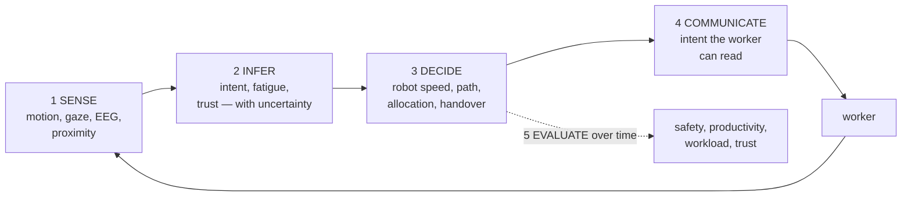
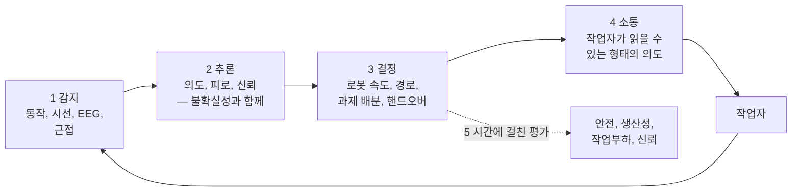

## English

Construction HRC studies a robot and a worker as one changing system. The distinctive
question is not only whether the robot avoids collision, but whether it can infer,
communicate, allocate, and recover without increasing cognitive or physical burden.

> [!info] Depth target
> Read an HRC paper and identify: what is sensed, what construct is inferred, whether
> the estimate actually changes robot behavior, what human outcome is measured, and how
> far the participant sample and task realism carry the claim. Designing worker-in-the-
> loop studies is a working/mastery topic.

> [!note] Prerequisites
> [[04-robotics/hri-safety|HRI & Safety]] · [[02-foundations/signal-processing|Signal Processing]] ·
> [[04-robotics/planning-decision-making|Planning]] · [[06-research-practice/experimental-design-reproducibility|Experimental Design]]

### 1. The worker-in-the-loop stack

1. **Sense** motion, gaze, speech, EEG/EDA/EMG, workload, or proximity.
2. **Infer** intent, fatigue, stress, trust, or task phase—with uncertainty.
3. **Decide** robot speed, path, task allocation, assistance, or handover.
4. **Communicate** prediction and intent in a form the worker can understand.
5. **Evaluate** safety, productivity, workload, trust, and adaptation over time.

Wearable classification alone is worker sensing. It becomes worker-centered robotics
only when the estimate changes robot behavior and that closed loop is evaluated.

*Steps 1–2 alone are worker **sensing** — a classifier with a paper attached. It becomes
worker-centered **robotics** only where the arrow from 2 to 3 exists, i.e. where the estimate
actually changes what the robot does, and only when step 5 evaluates that loop rather than
the classifier's accuracy.*

### 2. Main research lines

- The **Michigan DPM → UIUC/Georgia Tech/Toronto diaspora** connects physiological
  computing to intention-aware planning,
  [[01-canonical-papers/notes/8-construction/liu-jebelli-bci|BCI teleoperation]]
  (EEG-decoded commands driving a construction robot hands-free), co-robotic safety, and
  LMM-mediated field robots.
- The **Michigan LIVE/SICIS → VT/Stony Brook/TAMU** line connects adaptive autonomy,
  learning from demonstration, tactile handover, digital twins, and multi-robot supervision.
- The **MIT Shah manufacturing line** supplies cross-training, role allocation, legible
  motion, and human-aware planning methods that construction imports —
  [[01-canonical-papers/notes/8-construction/lasota-shah|Lasota & Shah]] is the anchor:
  human-aware motion planning evaluated on measured human responses in close-proximity
  collaboration, later carried toward practice in a BMW *test environment* replicating
  final-assembly work — which the authors explicitly note is not representative of a real
  factory deployment. Cite it as lab-plus-industrial-testbed evidence, not as a factory
  deployment result.

For orientation across the field, the defining taxonomy is the
[[01-canonical-papers/notes/8-construction/liang-hrc-survey|Liang HRC survey]] (JCEM
2021), which classifies collaboration levels and research trends and is the standard map
for placing any construction-HRC paper.

### 3. Claims that require care

- A biosignal correlate is not a causal state estimate; labels may come from self-report.
- Intent prediction accuracy does not show safer motion unless integrated and tested.
- Reduced completion time can hide increased workload or reduced situation awareness.
- A small laboratory participant sample supports a controlled human study, not a claim
  about all trades, ages, expertise levels, PPE, noise, and weather.
- “Shared autonomy” must state who has authority, how conflicts are resolved, and how the
  worker stops or overrides the robot.

### 4. Evaluation

Report participant population, task realism, counterbalancing, learning/order effects,
sensor failure, false alarms, intervention authority, near misses, workload/trust
instruments, and productivity. Safety outcomes are rare events; absence of collision in
a small study is not evidence of low operational risk.

> [!warning] Reading the claim · 핵심 주장 읽는 법
> Separate **sensed state**, **inferred construct**, **robot response**, and **measured
> human outcome**. Many papers establish only the first two links. A complete HRC claim
> needs the full causal chain—or must label itself as a component study.

### After reading

- Distinguish worker sensing from closed-loop worker-centered robotics.
- Trace a claim from measurement through inference and robot action to human outcome.
- Identify authority, override, and recovery in shared autonomy.
- Explain why a collision-free small study does not validate operational safety.

### Self-check

1. A paper classifies worker fatigue from a wristband with 91% accuracy. What is still
   missing before this counts as worker-centered robotics rather than worker sensing?
2. What did Lasota & Shah measure that a collision-count evaluation would have missed,
   and why does that matter for construction?
3. BCI teleoperation decodes EEG into robot commands in a testbed. List the gaps between
   this and a deployable hands-free interface on a site.
4. A shared-autonomy system halves task completion time in a 12-participant lab study.
   Give two ways this result can coexist with a worse outcome for workers.

> [!tip]- Answers
> 1. The closed loop: the fatigue estimate must change robot behavior (speed, allocation, assistance), and that coupled system must be evaluated on human outcomes — safety, workload, trust — not just classification accuracy. A correlate with self-report labels is also not yet a causal state estimate.
> 2. They measured human responses to the robot's motion — concurrent motion, separation distance, task time, and subjective satisfaction — showing human-aware planning changed how people worked alongside the robot, not merely that collisions were absent. Construction imports this because its spaces are shared and unstructured: collision absence in a short study says nothing about whether workers can predict and comfortably work around the robot.
> 3. Signal robustness under sweat, motion artifacts, PPE (helmets), and site noise; calibration time per user and per day; command latency and error cost when a misdecoded command moves a heavy machine; fallback authority and override; and validation beyond a controlled testbed population.
> 4. Faster completion can come with higher cognitive workload or reduced situation awareness (hidden costs the timing metric misses), and short-term lab gains can vanish or invert with learning/order effects, fatigue over full shifts, or trust miscalibration — none observable in a small counterbalanced session.

### Sources

- [ACM/IEEE International Conference on Human-Robot Interaction](https://humanrobotinteraction.org/)
- [MIT Interactive Robotics Group](https://interactive.mit.edu/)
- [[05-construction-robotics/labs|Labs Map]] — verified Michigan academic genealogy

## 한국어

건설 HRC는 로봇과 작업자를 하나의 변하는 시스템으로 본다. 충돌 회피뿐 아니라 인지·소통·
과제 배분·복구가 작업자의 인지·신체 부담을 늘리지 않는지가 핵심이다.

> [!info] 깊이 목표
> HRC 논문을 읽고 다음을 짚는다: 무엇을 센싱하는지, 어떤 구성개념을 추론하는지, 추정값이
> 실제로 로봇 행동을 바꾸는지, 어떤 인간 결과를 측정하는지, 참가자 표본과 과제 현실성이
> 주장을 어디까지 지지하는지. 작업자 폐루프 연구 설계는 실무/숙달 단계의 주제다.

> [!note] 선수지식
> [[04-robotics/hri-safety|HRI와 안전]] · [[02-foundations/signal-processing|신호처리]] ·
> [[04-robotics/planning-decision-making|계획]] · [[06-research-practice/experimental-design-reproducibility|실험 설계]]

### 1. 작업자 폐루프

1. 움직임·시선·말·EEG/EDA/EMG·작업부하·근접을 **센싱**한다.
2. 의도·피로·스트레스·신뢰·작업 단계를 불확실성과 함께 **추론**한다.
3. 로봇 속도·경로·과제 배분·지원·전달을 **결정**한다.
4. 작업자가 이해할 수 있게 로봇의 예측과 의도를 **소통**한다.
5. 안전·생산성·부하·신뢰·장기 적응을 **평가**한다.

웨어러블 분류만 하면 작업자 센싱이다. 추정값이 로봇 행동을 바꾸고 폐루프를 평가해야 작업자
중심 로보틱스가 된다.

*1~2단계만 있으면 그것은 작업자 **센싱**이다 — 논문이 붙은 분류기. 2에서 3으로 가는 화살표가
있을 때, 즉 그 추정이 실제로 로봇의 행동을 바꿀 때 비로소 작업자 중심 **로보틱스**가 되고,
5단계가 분류기의 정확도가 아니라 그 루프를 평가할 때만 그렇다.*

### 2. 연구 계보

- **미시간 DPM → UIUC·GT·토론토**: 생리 컴퓨팅에서 의도 인식 계획,
  [[01-canonical-papers/notes/8-construction/liu-jebelli-bci|BCI 원격조작]](EEG 해독
  명령으로 건설 로봇을 핸즈프리 구동), co-robotic 안전, LMM 필드 로봇으로.
- **미시간 LIVE/SICIS → VT·Stony Brook·TAMU**: 적응적 자율성, 시연 학습, 촉각 전달,
  디지털 트윈, 멀티로봇 감독으로.
- **MIT Shah 제조 HRC**: 교차 훈련, 역할 배분, 읽기 쉬운 움직임, 인간 인지 계획을
  공급한다 — 앵커는
  [[01-canonical-papers/notes/8-construction/lasota-shah|Lasota & Shah]]: 근접 협업에서
  측정된 인간 반응으로 평가한 인간 인지 모션 계획이며, 이후 최종 조립 작업을 재현한 BMW
  *테스트 환경*으로 이어졌다 — 저자들 스스로 이것이 실제 공장 배치를 대표하지 않는다고
  명시한다. 공장 배치 결과가 아니라 실험실+산업 테스트베드 증거로 인용하라.

분야 전체의 지도로는
[[01-canonical-papers/notes/8-construction/liang-hrc-survey|Liang HRC 서베이]](JCEM
2021)가 정의적 분류 체계다 — 협업 수준과 연구 동향을 분류하며, 어떤 건설 HRC 논문이든
위치시키는 표준 지도다.

### 3. 조심해서 읽을 주장

- 바이오신호 상관관계는 인과적 상태 추정이 아니며 라벨이 자기보고일 수 있다.
- 의도 예측 정확도만으로 더 안전한 모션을 보인 것은 아니다.
- 시간 단축이 작업부하 증가나 상황 인식 저하를 숨길 수 있다.
- 작은 실험실 표본은 모든 직종·숙련도·PPE·소음·날씨로 일반화되지 않는다.
- Shared autonomy는 권한, 충돌 해결, 정지·override 주체를 명시해야 한다.

### 4. 평가

참가자 집단, 과제 현실성, 순서 효과, 센서 실패, 오경보, 개입 권한, near miss, 작업부하·
신뢰 측정, 생산성을 보고해야 한다. 안전 사고는 희귀하므로 작은 연구의 무충돌은 낮은 현장
위험의 증거가 아니다.

> [!warning] 주장 읽기
> **측정 상태 → 추론 구성개념 → 로봇 반응 → 인간 결과**를 분리하라. 많은 논문은 첫 두
> 연결만 보인다. 완전한 HRC 주장은 전체 사슬이 필요하며, 아니면 구성요소 연구라고 범위를
> 제한해야 한다.

### 읽고 나면 말할 수 있어야 하는 것

- 작업자 센싱과 폐루프 작업자 중심 로보틱스를 구분한다.
- 측정부터 추론·로봇 행동·인간 결과까지 주장을 추적한다.
- 공유 자율성의 권한·override·복구를 찾는다.
- 작은 무충돌 연구가 운용 안전을 검증하지 못하는 이유를 설명한다.

### 스스로 점검

1. 손목 밴드로 작업자 피로를 91% 정확도로 분류한 논문이 있다. 작업자 센싱이 아니라
   작업자 중심 로보틱스로 인정받으려면 무엇이 더 필요한가?
2. Lasota & Shah는 충돌 횟수 평가가 놓쳤을 무엇을 측정했으며, 그것이 건설에 왜
   중요한가?
3. BCI 원격조작은 테스트베드에서 EEG를 로봇 명령으로 해독한다. 이것과 현장에서 배치
   가능한 핸즈프리 인터페이스 사이의 격차를 나열하라.
4. 공유 자율 시스템이 참가자 12명 실험에서 과제 시간을 절반으로 줄였다. 이 결과가
   작업자에게 더 나쁜 결과와 공존할 수 있는 방식 두 가지를 들라.

> [!tip]- 정답 · Answers
> 1. 폐루프: 피로 추정값이 로봇 행동(속도·배분·지원)을 바꿔야 하고, 그 결합 시스템이 분류 정확도가 아니라 인간 결과 — 안전·작업부하·신뢰 — 로 평가되어야 한다. 자기보고 라벨과의 상관관계는 아직 인과적 상태 추정도 아니다.
> 2. 로봇 모션에 대한 인간의 반응 — 동시 동작, 이격 거리, 과제 시간, 주관적 만족 — 을 측정해, 인간 인지 계획이 충돌의 부재를 넘어 사람들이 로봇 곁에서 일하는 방식 자체를 바꿈을 보였다. 건설의 공간은 공유되고 비정형이므로 이것이 수입된다: 짧은 연구의 무충돌은 작업자가 로봇을 예측하고 편하게 함께 일할 수 있는지에 대해 아무것도 말하지 않는다.
> 3. 땀·동작 아티팩트·PPE(헬멧)·현장 소음 아래의 신호 강건성; 사용자별·일별 보정 시간; 오해독 명령이 중장비를 움직일 때의 지연과 오류 비용; 대체 권한과 override; 통제된 테스트베드 집단 너머의 검증.
> 4. 시간 단축이 더 높은 인지 부하나 상황 인식 저하와 함께 올 수 있다(시간 지표가 놓치는 숨은 비용); 단기 실험실 이득이 학습/순서 효과, 전체 근무의 피로, 신뢰 오보정으로 사라지거나 뒤집힐 수 있다 — 작은 세션에서는 관측되지 않는다.

### 출처

- [ACM/IEEE HRI](https://humanrobotinteraction.org/)
- [MIT Interactive Robotics Group](https://interactive.mit.edu/)
- [[05-construction-robotics/labs|Labs Map]] — 검증된 미시간 학술 계보
