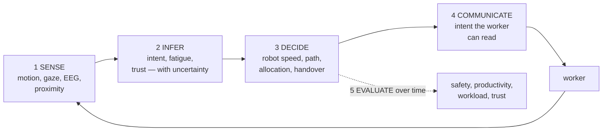
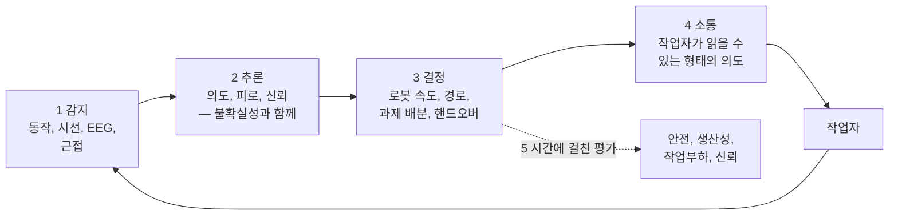

> [!note] Prerequisites · 선수 지식
> The running object S1 ([[05-construction-robotics/site-engineering|2.5]]). The protective separation distance, its six terms and the safety vocabulary ([[04-robotics/hri-safety|11. HRI & Safety]]: its Worked case, §5 and §6), which the Worked case and §6 apply rather than re-derive. Target impedance and the split of stiffness between axes ([[04-robotics/force-compliance-control|13. §2–§3]]) for the hold. The safety filter ([[02-foundations/rl-robot-learning|7.5 §4]]) for §8. Base rates ([[04-robotics/human-intent-prediction|23. §5]]) and the rule of three ([[06-research-practice/experimental-design-reproducibility|Experimental Design §4]]) for §4. Alert channels through gloves and noise ([[06-research-practice/psychophysics-human-measurement|8. Psychophysics §5]]). For the research lines of §2, [[02-foundations/signal-processing|6. Signal Processing]] and [[04-robotics/planning-decision-making|4. Planning]].
> 대상 S1([[05-construction-robotics/site-engineering|2.5]]). 보호 이격 거리와 그 여섯 항, 안전 어휘([[04-robotics/hri-safety|11. HRI·안전]]의 대상으로 한 번 끝까지, §5, §6) — 계산 절과 §6은 이것을 다시 유도하지 않고 적용한다. 지지 단계에는 목표 임피던스와 축별 강성 나누기([[04-robotics/force-compliance-control|13. §2–§3]]). §8에는 안전 필터([[02-foundations/rl-robot-learning|7.5 §4]]). §4에는 기저율([[04-robotics/human-intent-prediction|23. §5]])과 3의 규칙([[06-research-practice/experimental-design-reproducibility|실험 설계 §4]]). 장갑과 소음 너머의 경보 채널([[06-research-practice/psychophysics-human-measurement|8. 심리물리 §5]]). §2의 연구 계보에는 [[02-foundations/signal-processing|6. 신호처리]]와 [[04-robotics/planning-decision-making|4. 계획]].

## English

Construction HRC studies a robot and a worker as one changing system. The distinctive
question is not only whether the robot avoids collision, but whether it can infer,
communicate, allocate, and recover without increasing cognitive or physical burden.

> [!info] Depth target
> Read an HRC paper and identify: what is sensed, what construct is inferred, whether
> the estimate actually changes robot behavior, what human outcome is measured, and how
> far the participant sample and task realism carry the claim. Designing worker-in-the-
> loop studies is a working/mastery topic.

> [!note] First pass · 처음이라면
> Read the Running object and look at the picture: S1's two phases in which a worker and the robot share space, the 8 m transport along a lane other trades cross and the hold at the wall while the worker fastens the panel the robot carries. The Worked case then prices both — the separation the lane needs in the lab and on a site, and the stiffness and release test of the hold. After that, §1 for the loop every HRC paper describes, and §6–§8 for the lecture behind the Worked case, ending in what an estimate of the worker's state may and may not change. §3 and §4 are for reading a paper; §2 and §5 map who does this research.

### Running object · 이 페이지의 대상

**S1** from [[05-construction-robotics/site-engineering|2.5 Site Robotics as an Engineering System]]: the $20\,\mathrm{kg}$ facade panel, weight $196\,\mathrm{N}$, carried $8\,\mathrm{m}$ from the rack to the wall, aligned to $\pm5\,\mathrm{mm}$ and held while a worker fastens it. Two of its phases put a worker and the robot in the same space, and this page follows those two:

- **transport** — the mobile manipulator drives the panel along a lane that other trades cross, and a stack of panels beside the lane hides one crossing from the base's own sensor;
- **hold** — at the wall the robot grips the panel at its center of mass, midway between the two holes, while the worker brings the second hole onto its bracket and fastens both.

| Symbol | Value | What it is |
|---|---:|---|
| $v_r$ | $0.5\,\mathrm{m/s}$ | the base's speed along the lane, panel on the arm |
| $T_r$ | $0.10\,\mathrm{s}$ | the onboard stop chain: tracker $0.06$ plus controller and brake command $0.04\,\mathrm{s}$, 11's split |
| $T_s$ | $0.40\,\mathrm{s}$ | stopping time from $0.5\,\mathrm{m/s}$ with the panel on, a deceleration of $1.25\,\mathrm{m/s^2}$ |
| $v_h$ | $1.6\,\mathrm{m/s}$ | a worker's approach speed, the value 11 takes from ISO 13855 |
| $C,\ Z_d,\ Z_r$ | $0.20$, $0.10$, $0.05\,\mathrm{m}$ | intrusion distance and the two position uncertainties in clear air, 11's values |
| $T_{\text{relay}}$ | $1.0\,\mathrm{s}$ | what relaying the stop through a spotter adds to the chain: the spotter sees the worker and radios, the operator presses stop |
| $Z_d^{\text{dust}}$ | $0.30\,\mathrm{m}$ | the tracker's position uncertainty in cutting dust |
| $d_o$ | $1.4\,\mathrm{m}$ | distance from the base's hazard boundary at which a worker stepping out from behind the stack is first visible |
| $K_x$ | $500\,\mathrm{N/m}$ | target stiffness along the wall during the hold, 13's $K_d$ |
| $K_z$ | $10^4\,\mathrm{N/m}$ | vertical target stiffness during the hold |
| $K_{\text{stiff}}$ | $10^5\,\mathrm{N/m}$ | a stiff position loop, 13's series stiffness, for comparison |
| $\Delta F$ | $39.2\,\mathrm{N}$ | support the robot sheds in the release test, $20\%$ of the weight |
| $\delta_{\min}$ | $1\,\mathrm{mm}$ | the smallest sink of the grip point the arm resolves reliably |

S1's own numbers are unchanged. $v_h$, $C$, $Z_d$ and $Z_r$ are copied from [[04-robotics/hri-safety|11]] and $K_x$, $K_{\text{stiff}}$ from [[04-robotics/force-compliance-control|13]]; every other number in the table is this page's own and frozen here. 11's arm stops in $0.30\,\mathrm{s}$; S1's base with the panel on takes $0.40\,\mathrm{s}$. None of these is a measurement of a real machine or site, and $T_s$ in particular has to be measured on the actual base with the panel on, because braking depends on speed and payload (§6).

*Scope: this page teaches how a worker and a robot share S1's two phases — what 11's separation distance needs on a site (§6), what the hold needs from impedance and from a release test (§7), and what an estimate of the worker's intent, fatigue or physiological state may and may not change (§8) — with the research lines, claims and evaluation of worker-centered HRC around them (§1–§5). It does not teach the separation formula or the standards ([[04-robotics/hri-safety|11]]), impedance control ([[04-robotics/force-compliance-control|13]]), how people are tracked ([[04-robotics/human-pose-gaze|21]], [[04-robotics/human-intent-prediction|23]]), or how a human study is run ([[06-research-practice/experimental-design-reproducibility|Experimental Design]], [[06-research-practice/psychophysics-human-measurement|8. Psychophysics]]).*

### The picture · 그림으로 먼저 보기

<svg viewBox="0 0 560 372" style="max-width:100%;height:auto" role="img" aria-label="Top: S1's 8 m lane in plan, the base with its panel 1.4 m short of the point where a worker can step out from behind a stack, with its protective field of 1.30 m in clear air and 1.50 m in dust. Middle: the protective separation for three stop chains drawn to scale against the 1.4 m: onboard in clear air 1.30 m, onboard in dust 1.50 m, relayed through a spotter 3.40 m. Bottom: the hold at the wall, soft along the wall at 500 N/m and stiff vertically at 10^4 N/m; closing a 5 mm misalignment takes 2.5 N against 500 N for a stiff loop, and shedding 39.2 N of support sinks an unfastened panel 3.92 mm against a 1 mm release threshold.">
<text x="16" y="16" font-size="12" fill="currentColor" font-weight="600">the shared lane in plan (to scale along its 8 m)</text>
<line x1="220.0" y1="36" x2="304.0" y2="36" stroke="currentColor" stroke-width="1"/>
<line x1="220.0" y1="31" x2="220.0" y2="41" stroke="currentColor" stroke-width="1"/>
<line x1="304.0" y1="31" x2="304.0" y2="41" stroke="currentColor" stroke-width="1"/>
<text x="262.0" y="30" font-size="11" fill="currentColor" text-anchor="middle">visible from 1.4 m</text>
<rect x="40.0" y="46" width="480.0" height="28" fill="currentColor" fill-opacity="0.05" stroke="currentColor" stroke-opacity="0.5"/>
<rect x="26" y="40" width="14" height="40" fill="currentColor" fill-opacity="0.35" stroke="currentColor" stroke-opacity="0.6"/>
<text x="33" y="94" font-size="10" fill="currentColor" text-anchor="middle">rack</text>
<line x1="520.0" y1="34" x2="520.0" y2="86" stroke="currentColor" stroke-width="3"/>
<text x="520.0" y="98" font-size="10" fill="currentColor" text-anchor="middle">wall</text>
<rect x="220.0" y="50" width="78.0" height="20" fill="currentColor" fill-opacity="0.12" stroke="currentColor" stroke-width="1"/>
<rect x="220.0" y="50" width="90.0" height="20" fill="none" stroke="currentColor" stroke-width="1" stroke-dasharray="3 2"/>
<text x="318.0" y="64" font-size="10" fill="currentColor">field: 1.30 m clear, 1.50 m in dust</text>
<rect x="172.0" y="50" width="48.0" height="20" fill="currentColor" fill-opacity="0.3" stroke="currentColor" stroke-width="1.2"/>
<line x1="176.0" y1="60" x2="216.0" y2="60" stroke="currentColor" stroke-width="3.5"/>
<text x="166.0" y="64" font-size="11" fill="currentColor" text-anchor="end">base + panel, 0.5 m/s</text>
<line x1="220.0" y1="74" x2="220.0" y2="82" stroke="currentColor" stroke-width="1"/>
<text x="224.0" y="92" font-size="10" fill="currentColor" text-anchor="end">hazard boundary</text>
<rect x="256.0" y="76" width="48.0" height="16" fill="currentColor" fill-opacity="0.45" stroke="currentColor" stroke-opacity="0.7"/>
<line x1="304.0" y1="74" x2="304.0" y2="104" stroke="currentColor" stroke-dasharray="2 3" stroke-opacity="0.7"/>
<line x1="340.0" y1="74" x2="340.0" y2="104" stroke="currentColor" stroke-dasharray="2 3" stroke-opacity="0.7"/>
<circle cx="312.0" cy="80" r="3.2" fill="none" stroke="currentColor" stroke-width="1.2"/>
<line x1="312.0" y1="83.5" x2="312.0" y2="93" stroke="currentColor" stroke-width="1.4"/>
<line x1="312.0" y1="93" x2="308.5" y2="100" stroke="currentColor" stroke-width="1.4"/>
<line x1="312.0" y1="93" x2="315.5" y2="100" stroke="currentColor" stroke-width="1.4"/>
<line x1="307.5" y1="87" x2="316.5" y2="87" stroke="currentColor" stroke-width="1.4"/>
<text x="346.0" y="94" font-size="10" fill="currentColor">worker steps out</text>
<text x="16" y="126" font-size="12" fill="currentColor" font-weight="600">separation needed per stop chain (m, to scale)</text>
<rect x="318.0" y="118" width="10" height="9" fill="currentColor" fill-opacity="0.45" stroke="currentColor" stroke-width="0.6"/>
<text x="331.0" y="126" font-size="10" fill="currentColor">person walking</text>
<rect x="422.0" y="118" width="10" height="9" fill="currentColor" fill-opacity="0.25" stroke="currentColor" stroke-width="0.6"/>
<text x="435.0" y="126" font-size="10" fill="currentColor">base travel</text>
<rect x="508.0" y="118" width="10" height="9" fill="currentColor" fill-opacity="0.10" stroke="currentColor" stroke-width="0.6"/>
<text x="521.0" y="126" font-size="10" fill="currentColor">pads</text>
<text x="124" y="147" font-size="11" fill="currentColor" text-anchor="end">onboard, clear air</text>
<rect x="130.0" y="136" width="88.0" height="14" fill="currentColor" fill-opacity="0.45" stroke="currentColor" stroke-width="0.6"/>
<rect x="218.0" y="136" width="16.5" height="14" fill="currentColor" fill-opacity="0.25" stroke="currentColor" stroke-width="0.6"/>
<rect x="234.5" y="136" width="38.5" height="14" fill="currentColor" fill-opacity="0.10" stroke="currentColor" stroke-width="0.6"/>
<text x="124" y="169" font-size="11" fill="currentColor" text-anchor="end">onboard, dust</text>
<rect x="130.0" y="158" width="88.0" height="14" fill="currentColor" fill-opacity="0.45" stroke="currentColor" stroke-width="0.6"/>
<rect x="218.0" y="158" width="16.5" height="14" fill="currentColor" fill-opacity="0.25" stroke="currentColor" stroke-width="0.6"/>
<rect x="234.5" y="158" width="60.5" height="14" fill="currentColor" fill-opacity="0.10" stroke="currentColor" stroke-width="0.6"/>
<text x="124" y="191" font-size="11" fill="currentColor" text-anchor="end">relayed via spotter</text>
<rect x="130.0" y="180" width="264.0" height="14" fill="currentColor" fill-opacity="0.45" stroke="currentColor" stroke-width="0.6"/>
<rect x="394.0" y="180" width="71.5" height="14" fill="currentColor" fill-opacity="0.25" stroke="currentColor" stroke-width="0.6"/>
<rect x="465.5" y="180" width="38.5" height="14" fill="currentColor" fill-opacity="0.10" stroke="currentColor" stroke-width="0.6"/>
<text x="292.0" y="147" font-size="11" fill="currentColor">1.30 m: 0.5 m/s passes the stack</text>
<text x="303.0" y="169" font-size="11" fill="currentColor">1.50 m: pass the stack at ≤ 0.17 m/s</text>
<text x="136" y="190" font-size="10" fill="currentColor">no safe speed at the stack</text>
<text x="509.0" y="191" font-size="11" fill="currentColor">3.40 m</text>
<line x1="284.0" y1="132" x2="284.0" y2="198" stroke="currentColor" stroke-width="1.2" stroke-dasharray="4 3"/>
<line x1="130.0" y1="200" x2="515.0" y2="200" stroke="currentColor" stroke-opacity="0.6"/>
<line x1="130.0" y1="200" x2="130.0" y2="204" stroke="currentColor"/><text x="130.0" y="214" font-size="10" fill="currentColor" text-anchor="middle">0</text>
<line x1="240.0" y1="200" x2="240.0" y2="204" stroke="currentColor"/><text x="240.0" y="214" font-size="10" fill="currentColor" text-anchor="middle">1</text>
<line x1="350.0" y1="200" x2="350.0" y2="204" stroke="currentColor"/><text x="350.0" y="214" font-size="10" fill="currentColor" text-anchor="middle">2</text>
<line x1="460.0" y1="200" x2="460.0" y2="204" stroke="currentColor"/><text x="460.0" y="214" font-size="10" fill="currentColor" text-anchor="middle">3</text>
<text x="284.0" y="214" font-size="10" fill="currentColor" text-anchor="middle">1.4 m</text>
<text x="519.0" y="214" font-size="10" fill="currentColor" text-anchor="start">m</text>
<text x="16" y="238" font-size="12" fill="currentColor" font-weight="600">the hold at the wall (elevation)</text>
<rect x="52" y="258" width="174" height="76" fill="currentColor" fill-opacity="0.08" stroke="currentColor" stroke-width="1.2"/>
<circle cx="79.0" cy="268" r="4" fill="none" stroke="currentColor" stroke-width="1.2"/>
<circle cx="199.0" cy="268" r="4" fill="none" stroke="currentColor" stroke-width="1.2"/>
<line x1="79.0" y1="253" x2="199.0" y2="253" stroke="currentColor" stroke-width="0.8"/>
<line x1="79.0" y1="250" x2="79.0" y2="256" stroke="currentColor" stroke-width="0.8"/><line x1="199.0" y1="250" x2="199.0" y2="256" stroke="currentColor" stroke-width="0.8"/>
<text x="139.0" y="250" font-size="10" fill="currentColor" text-anchor="middle">400 mm</text>
<polyline points="143.0,296.0 153.0,292.0 159.0,300.0 165.0,292.0 171.0,300.0 177.0,292.0 183.0,300.0 189.0,292.0 195.0,300.0 203.0,296.0 206.0,296.0" fill="none" stroke="currentColor" stroke-width="1.2"/>
<line x1="206" y1="288" x2="206" y2="304" stroke="currentColor" stroke-width="2"/>
<text x="174.5" y="287" font-size="10" fill="currentColor" text-anchor="middle">500 N/m</text>
<polyline points="139.0,300.0 135.0,305.0 143.0,308.5 135.0,312.0 143.0,315.5 135.0,319.0 143.0,322.5 139.0,326.5 139.0,328.0" fill="none" stroke="currentColor" stroke-width="1.2"/>
<line x1="131.0" y1="328" x2="147.0" y2="328" stroke="currentColor" stroke-width="2"/>
<text x="148.0" y="322" font-size="10" fill="currentColor">10⁴ N/m</text>
<rect x="135.0" y="292" width="8" height="8" fill="currentColor"/>
<line x1="10" y1="296" x2="46" y2="296" stroke="currentColor" stroke-width="1.6"/>
<path d="M51 296 L45 292.5 L45 299.5 Z" fill="currentColor"/>
<text x="10" y="289" font-size="10" fill="currentColor">worker</text>
<text x="250" y="256" font-size="11" fill="currentColor">force that closes 5 mm (N, log scale)</text>
<rect x="250" y="262" width="35.8" height="11" fill="currentColor" fill-opacity="0.45" stroke="currentColor" stroke-width="0.6"/>
<text x="291.8" y="271.5" font-size="10" fill="currentColor">500 N/m: 2.5 N</text>
<rect x="250" y="277" width="242.9" height="11" fill="currentColor" fill-opacity="0.25" stroke="currentColor" stroke-width="0.6"/>
<text x="256" y="286.5" font-size="10" fill="currentColor">stiff loop, 10⁵ N/m: 500 N</text>
<line x1="456.3" y1="260" x2="456.3" y2="292" stroke="currentColor" stroke-width="1" stroke-dasharray="2 3"/>
<text x="460.3" y="270" font-size="10" fill="currentColor">weight 196 N</text>
<line x1="250" y1="292" x2="520.0" y2="292" stroke="currentColor" stroke-opacity="0.6"/>
<line x1="250.0" y1="292" x2="250.0" y2="295" stroke="currentColor"/>
<line x1="340.0" y1="292" x2="340.0" y2="295" stroke="currentColor"/>
<line x1="430.0" y1="292" x2="430.0" y2="295" stroke="currentColor"/>
<line x1="520.0" y1="292" x2="520.0" y2="295" stroke="currentColor"/>
<text x="250" y="305" font-size="10" fill="currentColor" text-anchor="middle">1</text>
<text x="340.0" y="305" font-size="10" fill="currentColor" text-anchor="middle">10</text>
<text x="430.0" y="305" font-size="10" fill="currentColor" text-anchor="middle">100</text>
<text x="520.0" y="305" font-size="10" fill="currentColor" text-anchor="middle">1000</text>
<text x="250" y="318" font-size="11" fill="currentColor">sink when 39.2 N of support is shed (mm)</text>
<rect x="250" y="324" width="235.4" height="12" fill="currentColor" fill-opacity="0.25" stroke="currentColor" stroke-width="0.6"/>
<text x="314.0" y="333.5" font-size="10" fill="currentColor">no bolt or one bolt: 3.92 mm</text>
<line x1="310.0" y1="323" x2="310.0" y2="343" stroke="currentColor" stroke-width="1.2" stroke-dasharray="4 3"/>
<line x1="250" y1="340" x2="490.0" y2="340" stroke="currentColor" stroke-opacity="0.6"/>
<line x1="250.0" y1="340" x2="250.0" y2="343" stroke="currentColor"/><text x="250.0" y="352" font-size="10" fill="currentColor" text-anchor="middle">0</text>
<line x1="310.0" y1="340" x2="310.0" y2="343" stroke="currentColor"/><text x="310.0" y="352" font-size="10" fill="currentColor" text-anchor="middle">1</text>
<line x1="370.0" y1="340" x2="370.0" y2="343" stroke="currentColor"/><text x="370.0" y="352" font-size="10" fill="currentColor" text-anchor="middle">2</text>
<line x1="430.0" y1="340" x2="430.0" y2="343" stroke="currentColor"/><text x="430.0" y="352" font-size="10" fill="currentColor" text-anchor="middle">3</text>
<line x1="490.0" y1="340" x2="490.0" y2="343" stroke="currentColor"/><text x="490.0" y="352" font-size="10" fill="currentColor" text-anchor="middle">4</text>
<text x="498.0" y="352" font-size="10" fill="currentColor" text-anchor="start">mm</text>
<text x="250" y="366" font-size="10" fill="currentColor">dashed: release only below 1 mm · both bolts in: ≈ 0</text>
</svg>

S1's two shared phases, drawn with the Worked case's numbers. Top, the lane to scale along its 8 m with the base 1.4 m short of where a worker can step out from behind the stack, and under it the separation each stop chain needs against that 1.4 m — $1.30\,\mathrm{m}$ onboard in clear air, $1.50\,\mathrm{m}$ in dust, $3.40\,\mathrm{m}$ relayed through a spotter — so the base passes the stack at its $0.5\,\mathrm{m/s}$, at no more than $0.17\,\mathrm{m/s}$, or not at all. Bottom, the hold: soft along the wall, so a $5\,\mathrm{mm}$ misalignment takes $2.5\,\mathrm{N}$ instead of $500\,\mathrm{N}$, stiff vertically, and released only if shedding $39.2\,\mathrm{N}$ moves the panel less than $1\,\mathrm{mm}$, where an unfastened panel sinks $3.92\,\mathrm{mm}$.

### Worked case · 대상으로 한 번 끝까지

Six steps on S1, four on the lane and two at the wall. They are course computations on the frozen numbers above, not measurements of a machine or a site. The separation distance $S_p$ and its six terms are defined and derived in [[04-robotics/hri-safety|11]]'s Worked case; here S1's numbers are substituted. Three things are used before the section that defines them, and each is glossed where it first appears.

**Step 1 — the lane in the lab.** With the onboard stop chain in clear air, in metres,

$$S_h=1.6\,(0.10+0.40)=0.80,\qquad S_r=0.5\times0.10=0.05,\qquad S_s=\tfrac12(0.5)(0.40)=0.10$$

so, adding $C+Z_d+Z_r=0.35$, the separation is $S_p=0.80+0.05+0.10+0.35=1.30\,\mathrm{m}$. The worker walking in is $61.5\%$ of it; the base's own two motion terms are $0.15\,\mathrm{m}$, $11.5\%$. Holding $T_s$ fixed, as 11 does, stopping the base dead would still leave $1.15\,\mathrm{m}$, so the budget its speed controls is $0.15\,\mathrm{m}$, less than the $0.25\,\mathrm{m}$ of 11's arm because the base is already slow; a braking time that shrinks with speed gives speed more to buy, which Derive 2 in the problem set prices. The longer braking is paid mostly by the person, who keeps walking through it: $\partial S_p/\partial T_s=v_h+\tfrac12v_r=1.85\,\mathrm{m/s}$.

**Step 2 — the relayed stop.** Where the base cannot see, a site plan may put a spotter at the crossing: the spotter sees the worker and radios, and the operator presses the stop. Every link between the hazard and the brake command adds to $T_r$ (§6 names this the stop chain), so $T_r=0.10+1.0=1.10\,\mathrm{s}$ and

$$S_h=1.6\,(1.10+0.40)=2.40,\qquad S_r=0.5\times1.10=0.55,\qquad S_p=2.40+0.55+0.10+0.35=3.40\,\mathrm{m}$$

The one second of relay costs $2.10\,\mathrm{m}$, since $\partial S_p/\partial T_r=v_h+v_r=2.1\,\mathrm{m/s}$: it is charged to the person's approach and to the base's own travel at once.

**Step 3 — dust.** Cutting dust leaves the tracker's position uncertainty at $Z_d=0.30\,\mathrm{m}$. That adds a flat $0.20\,\mathrm{m}$, $S_p=1.50\,\mathrm{m}$ with the onboard chain, because an uncertainty term is not multiplied by any speed: a wider pad, not a slower clock.

**Step 4 — the stack.** A worker stepping out from behind the stack is first visible $d_o=1.4\,\mathrm{m}$ from the base's hazard boundary. The onboard chain protects them only if $S_p\le d_o$, and solving that for $v_r$ gives the corner speed (§6 defines it; $T_s$ is held at its $0.5\,\mathrm{m/s}$ value, an over-estimate at any lower speed, as 11 requires of every term):

$$v_{\max}=\frac{d_o-v_h\,(T_r+T_s)-C-Z_d-Z_r}{T_r+\tfrac12T_s}=\frac{1.4-0.80-0.35}{0.30}=0.83\,\mathrm{m/s}$$

in clear air. That is above the $0.5\,\mathrm{m/s}$ at which $T_s$ was measured, so it says only that the transport speed passes, with $S_p=1.30\le1.4\,\mathrm{m}$; nothing above $0.5\,\mathrm{m/s}$ follows from it. In dust the numerator is $1.4-0.80-0.55=0.05\,\mathrm{m}$ and $v_{\max}=0.17\,\mathrm{m/s}$: the base must pass the stack at a third of its speed. With the relayed chain the numerator is $1.4-2.40-0.35=-1.35\,\mathrm{m}$, and no speed is safe. A spotter's call protects only a worker the spotter sees while still at least $3.40\,\mathrm{m}$ from the base; at the stack itself only the base's own sensor can.

**Step 5 — soft along the wall, stiff against gravity.** At the wall the worker nudges the panel to bring the second hole onto its bracket, against a residual of up to S1's $5\,\mathrm{mm}$. With the target stiffness along the wall ([[04-robotics/force-compliance-control|13. §2]]) that takes $K_x\,\delta=500\times0.005=2.5\,\mathrm{N}$; against a stiff position loop it takes $10^5\times0.005=500\,\mathrm{N}$, $2.55$ times the panel's weight, which no worker should be asked to push. Vertically the need is the opposite: a $5\%$ error in the payload estimate, $0.05\times196.2=9.81\,\mathrm{N}$, sags the panel $9.81/10^4\,\mathrm{m}=0.98\,\mathrm{mm}$ at $K_z$, but $19.6\,\mathrm{mm}$ if the vertical axis were as soft as $K_x$. The hold needs both at once, a stiffness ratio $K_z/K_x=20$.

**Step 6 — the release test.** Before it lets go, the robot sheds $\Delta F=0.2\times196.2=39.2\,\mathrm{N}$ of its support and watches the grip point (§7 defines the test). If the fasteners carry the panel, it barely moves; if nothing does, the panel sinks until the robot's vertical spring takes the load back:

$$\delta=\frac{\Delta F}{K_z}=\frac{39.2}{10^4}\,\mathrm{m}=3.92\,\mathrm{mm}$$

so a sink above $\delta_{\min}=1\,\mathrm{mm}$ refuses the release, with almost four times margin. A worker who has stepped back is not a passed test.

### 1. The worker-in-the-loop stack

This page focuses on **sensed-state-adaptive HRC**, one branch of worker-centered robotics.
Teleoperation/interfaces and augmentation/exoskeletons are other branches and do not require
an inferred worker state to change autonomous robot behavior.

1. **Sense** motion, gaze, speech, EEG/EDA/EMG, workload, or proximity.
2. **Infer** intent, fatigue, stress, trust, or task phase—with uncertainty.
3. **Decide** robot speed, path, task allocation, assistance, or handover.
4. **Communicate** prediction and intent in a form the worker can understand.
5. **Evaluate** safety, productivity, workload, trust, and adaptation over time.

Wearable classification alone is worker sensing. For it to become **closed-loop adaptive HRC**,
the estimate must change robot behavior and that loop must be evaluated.

*Steps 1–2 alone are worker **sensing**. They become closed-loop **adaptive HRC** where the
arrow from 2 to 3 exists and step 5 evaluates that loop rather than only classifier accuracy.*

The decision link matters because recognizing a worker state does not guarantee useful assistance. For example, an uncertain intent estimate might make a robot pause during a handover rather than move toward the wrong destination. **The reading this gives you.** Trace the estimate through the robot response to the worker outcome. If the experiment stops at classification accuracy, its contribution remains a sensing component even when the motivating story concerns collaboration.

**On S1.** The same five steps look different in the two phases, which is why a paper has to say which phase its loop closes.

| Step | Transport, on the lane | Hold, at the wall |
|---|---|---|
| Sense | positions of people near the lane | wrist force and torque, the worker's hands, muscle activity (EMG) |
| Infer | will this worker cross in front of the base? | is the worker pushing to align, tiring, finished? |
| Decide | speed, path, waiting before the stack | stiffness, how long to hold, when to release |
| Communicate | lights, a horn, a projected path | "holding" and "ready to release" |
| Evaluate | protective stops per pass, near misses | push force, fastening time, workload |

> [!info] Definition · 정의 — closed-loop adaptive HRC
> **What kind of thing it is.** A property of a human–robot *system together with the study that evaluates it* — not of a sensor, a classifier or a robot on its own.
>
> **Its defining conditions.** Four, and a paper with only some of them is a component study. (i) A **sensed signal** $y$ about the worker. (ii) An **inferred construct** $\hat s$ drawn from it — intent, fatigue, trust, task phase — stated with its uncertainty. (iii) A **robot decision that depends on it**, $a=\pi(x,\hat s)$, which differs from what a fixed policy $\pi_0(x)$ would do in the same measured state $x$. (iv) An **evaluation of a human outcome** $O$ — safety, workload, productivity, trust — under the adaptive loop against that fixed baseline.
>
> $$\Delta O=\mathbb{E}\big[O\mid a=\pi(x,\hat s)\big]-\mathbb{E}\big[O\mid a=\pi_0(x)\big]$$
>
> $O$ is measured on the worker and the expectation runs over workers and trials. The claim is $\Delta O$, because the accuracy of $\hat s$ matters only through what $\pi$ does with it.
>
> **Example.** In S1's hold, an EMG fatigue estimate that makes the robot close more of the misalignment itself when the worker tires, evaluated by the worker's push force and reported workload against the fixed $500\,\mathrm{N/m}$ hold.
>
> **Non-examples.** A wristband that classifies fatigue at $91\%$ accuracy (Self-check 1) has (i) and (ii) only. A base that slows whenever anyone is within a fixed radius closes a loop around a *measured position*, not an inferred construct: it is a safety function (§6), and it becomes adaptive HRC only when an inferred state changes what it does.
>
> **Why it matters.** It tells you which link a paper stops at, and so what it has earned: (i)–(ii) is a sensing result, (i)–(iii) a demonstration, and only all four is a claim about workers.

### 2. Main research lines

Read the lines below through §1's loop rather than as a list of names. The first leans toward
SENSE and INFER: *physiological computing* estimates a worker's state (stress, fatigue,
attention) from body signals such as EEG or heart rate, and *intention-aware planning* plans
robot motion around the worker's predicted next action. The second and third lean toward DECIDE
and COMMUNICATE: *adaptive autonomy* changes how much the robot does on its own, *role
allocation* decides who does which subtask, and *legible motion* is robot motion whose goal an
observer can read early. On a first pass, keep one anchor paper per line rather than every topic.
On S1 the lines land in different phases: physiological computing in the hold, where fatigue and attention change over a day of fastening; intention-aware planning and legible motion on the lane, where the questions are whether this worker will cross and whether the worker can read where the base is going, the second of which augmented-reality intent displays have so far answered only in the laboratory studies mapped in [[04-robotics/xr-human-robot-collaboration|23.5 XR for Human–Robot Collaboration §9]].

- The **Michigan DPM → UIUC/Georgia Tech/Toronto diaspora** connects physiological
  computing to intention-aware planning,
  [[01-canonical-papers/notes/8-construction/liu-jebelli-bci|BCI teleoperation]]
  (EEG-decoded commands driving a construction robot hands-free), co-robotic safety, and
  LMM-mediated field robots (instructed through a large multimodal model).
- The **Michigan LIVE/SICIS → VT/Stony Brook/TAMU** line connects adaptive autonomy,
  learning from demonstration, tactile handover, digital twins, and multi-robot supervision.
- The **MIT Shah manufacturing line** supplies cross-training (human and robot practise each
  other's roles), role allocation, legible
  motion, and human-aware planning methods that construction imports —
  [[01-canonical-papers/notes/8-construction/lasota-shah|Lasota & Shah]] is the anchor:
  human-aware motion planning evaluated on measured human responses in close-proximity
  collaboration, later carried toward practice in a BMW *test environment* replicating
  final-assembly work. The paper carrying that BMW work is Unhelkar, Lasota et al., RA-L 3(3),
  2018. Its authors say the physical demonstration, one robot assisting a single worker in a
  small work cell, is not representative of how a robotic assistant would be deployed in a
  real factory, so their quantitative safety and fluency results come from simulation of a
  larger cell (§VII). Cite it as lab-plus-industrial-testbed evidence, not as a factory
  deployment result.

- **Haptic and vibrotactile alerting** is the interface family these lines reach for
  when a warning must land on a gloved worker who is not looking at a screen — and it is
  governed by channel physics, not electronics: gloves pass the Pacinian vibration band
  while blocking spatial detail, powered tools mask exactly that band, and
  vibration-exposed crews carry elevated detection thresholds (HAVS). The three facts
  and their design consequences are worked out in
  [[06-research-practice/psychophysics-human-measurement|8. Psychophysics §5]]; the
  alarm-fatigue caution of [[04-robotics/hri-safety|HRI & Safety §5]] applies on top.

For orientation across the field, the defining taxonomy is the
[[01-canonical-papers/notes/8-construction/liang-hrc-survey|Liang HRC survey]] (JCEM
2021), which classifies collaboration levels and research trends and is the standard map
for placing any construction-HRC paper.

### 3. Claims that require care

- A biosignal correlate is not a causal state estimate; labels may come from self-report.
- Intent prediction accuracy does not show safer motion unless integrated and tested.
- Reduced completion time can hide increased workload or reduced situation awareness.
- A small laboratory participant sample supports a controlled human study, not a claim
  about all trades, ages, expertise levels, PPE, noise, and weather.
- “Shared autonomy” must state who has authority, how conflicts are resolved, and how the
  worker stops or overrides the robot.
- A reduction in collisions or stops against a baseline is not a bound on their rate: ask for
  the baseline's own rate and the exposure behind it (§4, §8).

**On S1, each of those claims has a concrete form.** A muscle-fatigue index that rises over a day of holds also tracks the hour, the heat and the number of fasteners driven, so a questionnaire label collected at lunch does not make it a fatigue sensor. An intent model that predicts crossings at the stack accurately has shown nothing about safety until the corner speed it would allow is worked out, and §8 shows it may only lower that speed. A stiff hold finishes the alignment fastest when nothing is wrong and makes the worker push $500\,\mathrm{N}$ when something is (Worked case, Step 5). The twelve-worker virtual-reality evaluation of Park, Menassa and Kamat (2025), a drywall-installation case that reports low workload and high ease of use, supports an interface claim for that setting, not one about crews in dust and hearing protection. And a shared hold must say who ends it: the worker's stop, the robot's release test, or both (§7).

For example, a worker may report lower workload because they stopped monitoring an unreliable system. The questionnaire can be valid while the favorable interpretation is wrong. **The reading this gives you.** Pair self-report with task behavior: noticed failures, intervention timing, and recovery burden. The question is whether the claimed human benefit survives when the worker must recognize and handle the failures that the deployment actually permits.

### 4. Evaluation

Report participant population, task realism, counterbalancing, learning/order effects,
sensor failure, false alarms, intervention authority, near misses, workload/trust
instruments, and productivity. Safety outcomes are rare events; absence of collision in
a small study is not evidence of low operational risk.

> [!warning] Reading the claim · 핵심 주장 읽는 법
> Separate **sensed state**, **inferred construct**, **robot response**, and **measured
> human outcome**. Many papers establish only the first two links. A complete HRC claim
> needs the full causal chain—or must label itself as a component study.

> [!example] Worked example · 계산 예제
> **Read an alert as an interruption to a shift.** The hypothetical base-rate example in [[04-robotics/human-intent-prediction|Human Intent Prediction §5]] yields **26.9% precision** and **1,411 false alarms per shift** under its stated assumptions. Reuse that example's event frequency and threshold; these are not measurements of a deployed worker interface.
>
> **The reading this gives you.** A worker-facing evaluation must count interruptions and responses, not only classifier recall. Repeated false alarms can consume attention and change later compliance. Check whether alerts are grouped, suppressed, or acknowledged, and report the resulting workload and missed hazards under the actual interaction policy.

**How much exposure a safety claim on S1 needs.** One of S1's observed days is $8$ panels, so $16$ passes along the lane, out and back. A month of such days, $20$ of them, is $320$ passes. With no contact in any of them, the $95\%$ upper bound on the per-pass contact rate is $1-0.05^{1/320}=0.93\%$ (the rule of three, $3/320$, gives $0.94\%$; [[06-research-practice/experimental-design-reproducibility|Experimental Design §4]]), so a spotless month is still consistent with one contact every $107$ passes, about one every seven working days. Showing a rate below one in ten thousand would take $\ln0.05/\ln(1-10^{-4})=29{,}956$ contact-free passes, about $1{,}870$ working days. No pilot reaches that, which is why the per-pass bound has to come from how the separation function is built (§6), and why a pilot counts leading indicators instead: protective stops per pass, stops at the stack, interventions and near misses. Count the stops by cause, because two causes look alike in a log: a worker who entered the field, where the separation did its job, and a false trip on dust, which is a perception cost. The hold has its own near miss, a refused release test, each one a panel that would have dropped had the release trusted whatever triggered the test; count those beside the worker's push force, the time to fasten and the reported workload.

### 5. Where this stream is moving (2019–2025)

Counted as in [[05-construction-robotics/lineage|lineage §6]], human–robot collaboration and worker-centred work grew more than any other stream: from $13$ robot papers in 2019–2021 to $64$ in 2023–2025, from $11\%$ to $25\%$ of construction robot papers, now narrowly the largest. Its newer work reads the worker rather than only keeping people away: worker intentions from partial observations (Pan and Yu, *AutCon* 158, 2024, [DOI](https://doi.org/10.1016/j.autcon.2023.105184)), thermal-image hand gestures (Wu et al., *AEI* 56, 2023, [DOI](https://doi.org/10.1016/j.aei.2023.101939)), prediction-based path planning with deep reinforcement learning (Cai et al., *J. Computing in Civil Engineering* 37, 2023, [DOI](https://doi.org/10.1061/(asce)cp.1943-5487.0001056)), and biosignals and trust as topics of their own (Chen et al., *AEI* 68, 2025, [DOI](https://doi.org/10.1016/j.aei.2025.103652); Chang et al., *J. Computing in Civil Engineering* 38, 2024, [DOI](https://doi.org/10.1061/jccee5.cpeng-5656)). Several of these groups are in Hong Kong or in the Michigan tree ([[05-construction-robotics/labs|labs map]]). The period's one large-language-model paper in these journals is here too: an LLM with a virtual-reality interface for collaborative human–robot construction work (Park, Menassa and Kamat, *J. Computing in Civil Engineering* 39, 2025, [DOI](https://doi.org/10.1061/jccee5.cpeng-6106)).

### 6. The shared lane: what a site adds to the separation distance

*In one sentence:* 11's six-term separation still holds on S1's lane, but a site changes three of its inputs — who stands in the stop chain, how well the sensor sees, and whether a warning reaches the worker — and each has a price in metres or in speed.

[[04-robotics/hri-safety|11]] derives $S_p$ for an arm in a cell. On a moving base the same bound applies along the direction of travel: the base's travel during the reaction time and while braking takes the place of the arm's, and the hazard boundary is the outline of base, arm and panel together. Applying it to S1 is this page's course computation, not a statement about which standard governs a mobile manipulator on a site. [[04-robotics/hri-safety|11. §6]] names the standards and notes that none was written for an unfenced site whose layout changes week to week, and Marvel and Norcross, in their guide to implementing this monitoring, note that the equation and its assumptions have not been validated as safe for every robot configuration. The same guide gives two reasons to look again at the inputs before the site is even added. Braking time and distance are functions of the robot's initial speed and payload, though many implementations treat them as constants, so S1's $0.40\,\mathrm{s}$ has to be measured with the $20\,\mathrm{kg}$ panel on the arm. And ISO 13855, they point out, takes $2.0\,\mathrm{m/s}$ as an operator's maximum speed for stationary machinery, with $1.6\,\mathrm{m/s}$ an option when the separation exceeds $500\,\mathrm{mm}$; they suggest the higher value may be the more prudent assumption for robots, to cover sudden rapid motions and the uncertainty of detecting the operator. Since $\partial S_p/\partial v_h=T_r+T_s=0.50\,\mathrm{s}$, that choice costs S1 $0.4\times0.50=0.20\,\mathrm{m}$: $1.50\,\mathrm{m}$ in clear air.

> [!info] Definition · 정의 — stop chain
> **What kind of thing it is.** A *series of links*, each with a latency: every element between a hazard becoming observable and the brake command leaving — sensor, tracker, network, controller, and on a site often a person and a radio.
>
> **Its defining conditions.** (i) It runs from the moment the hazard **could first be observed** to the **brake command**; it does not start at the tracker's report, and it does not include braking, which is $T_s$. (ii) It includes **every** link on that path, human ones too. (iii) Each link enters with its **worst-case** time, not its mean, because $T_r$ feeds a bound.
>
> $$T_r=\sum_{k=1}^{n}T_k$$
>
> where $T_k$ is the worst-case latency of link $k$. Since $T_r$ is charged twice, to the person's approach and to the robot's own travel, each second of it costs $v_h+v_r$ metres of separation.
>
> **Example.** S1's onboard chain, $0.06+0.04=0.10\,\mathrm{s}$. The relayed chain puts a spotter, a radio and an operator's button in front of the controller, $1.0\,\mathrm{s}$ more, for $1.10\,\mathrm{s}$ and $S_p=3.40\,\mathrm{m}$ (Worked case, Step 2).
>
> **Non-examples.** A tracker's frame rate: at $30\,\mathrm{Hz}$ the frame period is $0.033\,\mathrm{s}$, but the link also holds detection, confirmation over several frames and transport to the controller. And the response time of an emergency-stop button alone: in a relayed chain the button is the last link, and the first is a person who has to notice the hazard.
>
> **Why it matters.** On a site the slowest link is usually a person, and at $v_h+v_r=2.1\,\mathrm{m/s}$ one second of human relay costs $2.1\,\mathrm{m}$, more than S1's entire lab separation of $1.30\,\mathrm{m}$.

**Dust and occlusion enter differently.** Marvel and Norcross list occlusions among the factors that affect camera- and laser-based detection of people, alongside lighting, processing time and capture frequency, and a site supplies them together. Dust that scatters the returns widens where the tracker places a person, a larger $Z_d$, paid once whatever the speeds (Step 3). Occlusion leaves $S_p$ untouched. It caps the distance $d$ at which a person can first be seen, and the question becomes whether $S_p$ fits inside it.

> [!info] Definition · 정의 — occlusion-limited speed
> **What kind of thing it is.** A *speed limit* in m/s set by geometry: the fastest the robot may move past a place where a person can first become visible at distance $d$ from its hazard boundary.
>
> **Its defining conditions.** (i) $d$ is measured from the **hazard boundary** to the nearest point where a person can appear. (ii) Every other term keeps its **worst-case** value: $v_h$ does not fall because the corner is usually quiet, and $T_s$ is held at its value for the highest speed considered, so the limit is valid only up to that speed. (iii) If the numerator is not positive, **no** speed is safe: the robot stops, or the site changes — move the stack, or add a sensor that sees behind it through a chain short enough.
>
> $$v_{\max}(d)=\frac{d-v_h\,(T_r+T_s)-C-Z_d-Z_r}{T_r+\tfrac12T_s}$$
>
> It is $S_p\le d$ solved for $v_r$, because $S_p$ is linear in $v_r$ once $T_s$ is fixed. The numerator is the room left after the person's approach and the three pads; the denominator is the robot's own share of $S_p$ per m/s of speed.
>
> **Example.** S1's stack, $d=1.4\,\mathrm{m}$: the transport speed passes in clear air, the limit is $0.17\,\mathrm{m/s}$ in dust, and there is no safe speed with the relayed chain (Worked case, Step 4).
>
> **Non-example.** "Half speed near blind corners." At S1's stack in dust, half of $0.5\,\mathrm{m/s}$ is $0.25\,\mathrm{m/s}$, one and a half times the limit, and $S_p=1.35+0.30\times0.25=1.425\,\mathrm{m}$ leaves a worker who steps out $2.5\,\mathrm{cm}$ inside it. A fixed fraction does not know $d$, the dust or the chain.
>
> **Why it matters.** It turns "site conditions" into a number a planner can obey, and it shows when speed cannot buy safety at all — the relayed chain at the stack.

**The alarm the worker cannot hear.** Nothing in $S_p$ is credited to a warning: $S_h$ assumes the person keeps walking at $v_h$ through the whole reaction and stop. That is why a correctly sized separation survives a worker in ear defenders beside a saw, or a wristband alert masked by a breaker in the same hand ([[06-research-practice/psychophysics-human-measurement|8. Psychophysics §5]]); the stop never needed them to respond. What an unheard warning costs is productivity. A warning exists to make the person yield before the stop is needed, and for that it must lead the protective field by what the person covers while noticing and responding, $1.6\,\mathrm{m}$ per second ([[04-robotics/hri-safety|11. §5]]); a worker who does not perceive it walks on into the field, and the base stops. The failure to look for is a plan that credits the warning — "the horn clears the walkway, so the base may keep $0.5\,\mathrm{m/s}$ past the stack" — because it has moved the horn into the safety function without the property a safety function needs: it works only on workers who hear it, as a path drawn in a headset works only on a worker who wears it and looks ([[04-robotics/xr-human-robot-collaboration|23.5 XR for Human–Robot Collaboration §4]]). A warning field that *slows the base* is different. It acts on $v_r$, which the robot controls, and at the stack in dust it is exactly Step 4's $0.17\,\mathrm{m/s}$.

### 7. The hold: soft for the worker, stiff for the panel

*In one sentence:* while the worker fastens, the robot yields along the wall, holds against gravity, starts no motion of its own, and lets go only when a physical test shows the building carries the panel.

The hold is the phase in which separation is zero by design. The worker's hands are on the panel the robot carries, so the separation function of §6 has nothing to measure. Of the four ways of sharing space in [[04-robotics/hri-safety|11. §6]], the hold borrows from two: like monitored standstill, the robot starts no motion while the worker is there, and like power and force limiting, it permits contact but bounds its force. What this page can compute is the mechanical side of that bound, the force the worker meets; whether a particular hold meets a standard is for the application's risk assessment, not for a calculation. If contact force or pose leaves its envelope, the hold goes to its safe state, freeze or yield ([[05-construction-robotics/site-engineering|2.5 §1, §3]]). If the gripper is a vacuum lifter, the freeze is safe only as long as its cups hold without their pump — $41$ s at the required safety factor on S1's panel, [[02-foundations/fluid-power|0.6.3 Fluid Power §10]].

**Soft along the wall, stiff against gravity.** The worker's task is to bring the second hole onto its bracket, so along the wall the robot should yield: at $K_x=500\,\mathrm{N/m}$ S1's worst $5\,\mathrm{mm}$ residual takes $2.5\,\mathrm{N}$ of push, where a stiff position loop would demand $500\,\mathrm{N}$ (Step 5). Vertically the robot carries $196\,\mathrm{N}$ through a payload estimate that may be $5\%$ off, so there it must be stiff, and $10^4\,\mathrm{N/m}$ holds that error to $0.98\,\mathrm{mm}$. The target impedance of [[04-robotics/force-compliance-control|13. §2]] is therefore anisotropic — the per-axis split that [[04-robotics/force-compliance-control|13. §3]] makes with a selection matrix, applied here to stiffness — and it presumes the robot knows which way the wall runs. Beyond yielding to the worker's hand, the robot initiates no motion during the hold: the base does not creep and the arm does not replan while hands are on the panel.

**Who ends the hold.** Two transitions end it, and they need different authority. The worker can end it at any moment with a stop, the human authority that [[05-construction-robotics/site-engineering|2.5 §3]] asks every safety architecture to own. The robot's release, which ends verify in 2.5 §1's list of phases, is the one irreversible action here: a $20\,\mathrm{kg}$ panel let go before the building carries it falls on the person standing at it. So release needs evidence about the load path, not about the worker.

> [!info] Definition · 정의 — release test
> **What kind of thing it is.** A *physical test* the robot runs on the load path before it opens its grip — a measurement, not an inference.
>
> **Its defining conditions.** (i) The robot **sheds a known part** $\Delta F$ of the support it provides, holding its target stiffness. (ii) It **measures the grip point's sink** $\delta$ against a threshold $\delta_{\min}$ set above measurement noise and well below the sink an unsupported panel would show. (iii) It **releases only if** $\delta<\delta_{\min}$, and otherwise restores its support and keeps holding, whatever the worker appears to be doing.
>
> $$\delta=\begin{cases}\Delta F/K_z & \text{if the robot still carries the panel}\\ \approx 0 & \text{if the fasteners carry it}\end{cases}$$
>
> where $K_z$ is the vertical target stiffness; the fasteners and bracket are far stiffer than $K_z$, so the load moves to them without visible motion.
>
> **Example.** S1: $\Delta F=39.2\,\mathrm{N}$ at $K_z=10^4\,\mathrm{N/m}$ gives $3.92\,\mathrm{mm}$ unsupported, against $\delta_{\min}=1\,\mathrm{mm}$ (Step 6).
>
> **Non-examples.** "Release when the worker steps back and the intent model reads *done*": no measurement of the load path at all. "Release after the driver logs two fastening cycles": a count of actions, since a stripped or missed fastener logs a cycle too.
>
> **Why it matters.** It is the only irreversible action of the hold, and the test replaces an inference about the worker with a measurement of the building.

**One bolt is not half fastened.** Suppose the worker has fastened the first hole and stepped away for the second fastener. With the grip at the center of mass, $200\,\mathrm{mm}$ from that bolt, moments about the bolt balance only if the robot supplies the whole weight, $F_R\times0.2=196.2\times0.2$, so the single bolt carries nothing vertically and the panel pivots on it as soon as support is shed. The test reads the same $3.92\,\mathrm{mm}$ as with no bolt at all and refuses the release — correctly, since the building is not yet carrying the panel.

### 8. What a worker-state estimate may license

*In one sentence:* an estimate of the worker's intent, fatigue or physiological state may move the robot anywhere inside the bounds of §6 and §7, never move the bounds themselves, because the bounds are what protect the worker the estimate gets wrong.

The research lines of §2 all produce estimates — will this worker cross, is this worker tired, stressed, attentive — and §1 asks that an estimate change what the robot does. On S1 that raises a question the loop diagram leaves open: *which* changes may an estimate make? The answer follows from how §6 and §7 were built. The corner speed assumed that the worker who steps out walks in at $v_h=1.6\,\mathrm{m/s}$ — Marvel and Norcross's worst-case assumption that an operator may start moving toward the robot at any time — and the release test assumed nothing about the worker at all. An estimate that is right most of the time is wrong some of the time, and the bounds exist for that time.

> [!info] Definition · 정의 — the one-way license
> **What kind of thing it is.** A *rule about architecture*: which inputs may set a safety bound, and which may only act inside it. It is a property of how an estimate is wired into the controller, not of the estimate's accuracy.
>
> **Its defining conditions.** (i) The admissible set $\mathcal{A}(x)$ — speeds, distances, stiffnesses, release — is computed only from **measured** state $x$ and **worst-case** human terms: $v_h$ at $1.6\,\mathrm{m/s}$, no response to a warning credited. (ii) The worker-state estimate $\hat s$ **only selects within** that set: slower, farther, later, more of the work taken by the robot. (iii) Only a **measured, verified** change of state — a tracked position, a passed release test — can widen the set, by changing $x$; an inferred one never can.
>
> $$\pi(x,\hat s)\in\mathcal{A}(x)\quad\text{for every value of }\hat s$$
>
> $\pi$ is the adaptive policy and $x$ the measured state. Since $\mathcal{A}$ has no $\hat s$ in it, no estimate, however wrong, can take the robot outside it. It is the safety filter of [[02-foundations/rl-robot-learning|7.5 §4]] with one condition added: the safe set must not be computed from the estimate it filters.
>
> **Example.** At S1's stack in dust, $\mathcal{A}$ is every speed up to $0.17\,\mathrm{m/s}$. An intent model that says the worker behind the stack is about to cross may stop the base before it — inside. A fatigue estimate may make the robot take more of the alignment at the wall — inside, and the worker's push falls.
>
> **Non-examples.** The same intent model saying *will not cross* and letting the base keep $0.5\,\mathrm{m/s}$ past the stack: it has enlarged $\mathcal{A}$ for exactly the worker it mispredicts. A heart-rate reading of "calm and attentive" used to shorten the separation. And a safety filter whose safe set is built from the worker's predicted trajectory: it filters, but its guarantee is only as good as the prediction.
>
> **Why it matters.** It makes the research lines of §2 compatible with safety. Inside the bounds an estimate's errors cost time and comfort, which a study can measure (§4); outside them they cost the worker.

| Estimate | May license (inside the bounds) | May not license |
|---|---|---|
| intent: "about to cross" or "will not cross" | stopping or slowing before the stack, waiting | keeping $0.5\,\mathrm{m/s}$ past the stack in dust |
| fatigue (EMG, heart rate, task time) | the robot taking more of the alignment, longer holds, a later next panel, a break | skipping the release test, driving the lane faster to make up time |
| stress or attention (EEG, EDA) | more distance, slower motion, a check-in prompt | a shorter separation because the worker is "attentive" |
| "done fastening" (the worker steps back) | preparing the release test | releasing |

**A measured speed is not a prediction.** Marvel and Norcross note that the TS 15066 form of the separation formula allows the operator's speed to be measured directly, with a constant assumed when no measurement is available. That is condition (iii), not an exception to it: a person's speed tracked by the safety function's own sensing is measured state $x$. A trajectory predicted by an intent model is not, however accurate, and a lower $v_h$ taken from it would move the bound. The same condition is what lets a measured braking curve loosen Step 4's $0.17\,\mathrm{m/s}$, which Derive 2 in the problem set works out.

**Where the literature is.** Chen et al.'s 2025 review of biosignal measurement for construction HRC examines that work for human-state assessment and for its use in evaluating HRC and in estimation, and presents feedback-aware, adaptive robotic systems as what integrating such monitoring should make possible. Read with the one-way license, the first adaptive steps worth taking are the tightening ones: a robot that slows, waits or takes more of the load when an estimate says so can be evaluated on workers without ever resting their safety on the estimate.

### After reading

- Distinguish worker sensing from closed-loop worker-centered robotics.
- Trace a claim from measurement through inference and robot action to human outcome.
- Identify authority, override, and recovery in shared autonomy.
- Explain why a collision-free small study does not validate operational safety.
- Compute S1's protective separation with 11's formula, and say what a relayed stop, dust, an occlusion and an unheard alarm each change.
- Find the occlusion-limited speed at a blind spot, and recognize when no speed is safe.
- Size the hold's two stiffnesses, state the release test, and explain why one bolt fails it.
- Say what an intent, fatigue or biosignal estimate may and may not license a robot to do.

### Self-check

1. A paper classifies worker fatigue from a wristband with 91% accuracy. What is still
   missing before this counts as worker-centered robotics rather than worker sensing?
2. What did Lasota & Shah measure that a collision-count evaluation would have missed,
   and why does that matter for construction?
3. BCI teleoperation decodes EEG into robot commands in a testbed. List the gaps between
   this and a deployable hands-free interface on a site.
4. A shared-autonomy system halves task completion time in a 12-participant lab study.
   Give two ways this result can coexist with a worse outcome for workers.
5. At S1's stack in dust the corner speed is $0.17\,\mathrm{m/s}$. An intent model reports, with $95\%$ confidence, that the worker behind the stack will not cross. What may the base do with that estimate, and what may it not?
6. The worker has fastened hole 1 and stepped back for the second bolt, and the intent model reads "done". What does the release test read, and why?

> [!tip]- Answers
> 1. The closed loop: the fatigue estimate must change robot behavior (speed, allocation, assistance), and that coupled system must be evaluated on human outcomes — safety, workload, trust — not just classification accuracy. A correlate with self-report labels is also not yet a causal state estimate.
> 2. They measured human responses to the robot's motion — concurrent motion, separation distance, task time, and subjective satisfaction — showing human-aware planning changed how people worked alongside the robot, not merely that collisions were absent. Construction imports this because its spaces are shared and unstructured: collision absence in a short study says nothing about whether workers can predict and comfortably work around the robot.
> 3. Signal robustness under sweat, motion artifacts, PPE (helmets), and site noise; calibration time per user and per day; command latency and error cost when a misdecoded command moves a heavy machine; fallback authority and override; and validation beyond a controlled testbed population.
> 4. Faster completion can come with higher cognitive workload or reduced situation awareness (hidden costs the timing metric misses), and short-term lab gains can vanish or invert with learning/order effects, fatigue over full shifts, or trust miscalibration — none observable in a small counterbalanced session.
> 5. It may stop before the stack or wait, which stays inside the admissible set. It may not keep $0.5\,\mathrm{m/s}$ past the stack, nor any speed above $0.17\,\mathrm{m/s}$. The corner speed was computed with $v_h=1.6\,\mathrm{m/s}$ for the worker who does step out, which is exactly the case — one in twenty, if the estimate is calibrated — that the estimate gets wrong; raising the speed on the estimate enlarges the admissible set with an inferred state, which condition (iii) of the one-way license forbids (§8).
> 6. The same $3.92\,\mathrm{mm}$ as an unfastened panel. With the grip at the center of mass $200\,\mathrm{mm}$ from the single bolt, moment balance about the bolt makes the robot carry the whole $196.2\,\mathrm{N}$, so shedding $39.2\,\mathrm{N}$ lets the panel pivot until the vertical spring takes the load back, $39.2/10^4\,\mathrm{m}$ at the grip. The sink is above $1\,\mathrm{mm}$, so the release is refused, and the "done" estimate never enters the decision (§7).

### Problem set · 과제

Tier B. Hand derivation on S1 with this page's frozen numbers, using only this page, its prerequisites and [[05-construction-robotics/site-engineering|2.5]]. Keep every number of the Running object unless an item changes it.

1. **Draw.** The picture's lane half at $v_h=2.0\,\mathrm{m/s}$, the value Marvel and Norcross suggest, everything else frozen: the plan with the base, the stack and $d_o=1.4\,\mathrm{m}$, and under it the three separation bars (onboard in clear air, onboard in dust, relayed) split into the person walking, the base's travel and the pads, on one scale, with the $1.4\,\mathrm{m}$ line through them and each chain's corner speed written beside it.
2. **Derive.** The site changes three things. The spotter gets a stop button wired to the base's controller by radio, which cuts $T_{\text{relay}}$ to $0.5\,\mathrm{s}$; the base's braking is measured and found to be a constant $1.25\,\mathrm{m/s^2}$ from any speed, so $T_s=v_r/1.25$; and at the wall the stiffness along the wall may be raised as long as the worker's push stays at or below $5\,\mathrm{N}$. (a) $S_p$ with the new relayed chain at $0.5\,\mathrm{m/s}$ in clear air, and whether it can protect a worker at the stack. (b) The corner speed at the stack for the onboard chain in dust, with the measured braking, against Step 4's $0.17\,\mathrm{m/s}$. (c) The largest $K_x$ for a $5\,\mathrm{N}$ push against S1's $5\,\mathrm{mm}$, and the sag that stiffness would give vertically under a $5\%$ payload error. (d) The release-test sink if $K_z$ is doubled to $2\times10^4\,\mathrm{N/m}$ with $\Delta F$ unchanged, and the $\Delta F$ that restores Step 6's $3.92\,\mathrm{mm}$.
3. **Interpret.** Cai et al. (2023) train a deep-reinforcement-learning path planner whose state and reward include worker movements predicted by an uncertainty-aware LSTM network. In simulations generated from real construction scenarios it reaches its destination along a near-shortest path in $100\%$ of $10{,}000$ episodes, and its collision rate with moving workers is $23\%$ lower than that of a planner without the prediction. Suppose it were proposed as S1's lane planner. Using §1, §6 and §8: which conditions of closed-loop adaptive HRC does this evidence meet, what does "$23\%$ fewer collisions" establish and what does it not, and where in S1's controller may the prediction sit?
4. **Derive.** Keep §4's detector: $28{,}800$ judgements per shift, base rate $2\%$, $1{,}411$ false alarms. (a) If acknowledging each false alarm costs a worker $3\,\mathrm{s}$, how much of the shift is lost? (b) What false-positive rate allows at most one false alarm per ten minutes, and what precision does it give at the same $90\%$ true-positive rate?
5. **Interpret.** A paper reports $98\%$ accuracy for a worker-intent detector evaluated at this base rate. Why is that number uninformative, and what two numbers would you ask for instead?

> [!note]- How to draw it · 그리는 법
> - **Top, the plan, to scale along the lane**: rack at $0$, wall at $8\,\mathrm{m}$, the base's hazard boundary $1.4\,\mathrm{m}$ short of the point where the walkway leaves the stack. The stack and $d_o$ do not change with $v_h$.
> - **Below it, three bars on one metre scale**, each split into the person walking $v_h(T_r+T_s)$, the base's travel $v_rT_r+\tfrac12v_rT_s$, and the pads $C+Z_d+Z_r$: clear air $1.00+0.15+0.35=1.50\,\mathrm{m}$, dust $1.00+0.15+0.55=1.70\,\mathrm{m}$, relayed $3.00+0.65+0.35=4.00\,\mathrm{m}$. Only the first segment grows, by $0.20\,\mathrm{m}$ in the two onboard bars and by $0.60\,\mathrm{m}$ in the relayed one.
> - **A vertical line at $1.4\,\mathrm{m}$ through all three**: now even the clear-air bar crosses it.
> - **Beside each bar, its corner speed**: $0.17\,\mathrm{m/s}$ in clear air, none in dust, none relayed.
> - The drawing is wrong if the pads or the base's travel changed: $v_h$ appears only in the first segment.

> [!tip]- Solutions
> 1. As in the list: bars of $1.50$, $1.70$ and $4.00\,\mathrm{m}$. Corner speeds $(1.4-1.00-0.35)/0.30=0.17\,\mathrm{m/s}$ in clear air, and none in dust ($1.4-1.00-0.55=-0.15$) or relayed ($1.4-3.00-0.35=-1.95$). The higher approach speed costs the same $0.20\,\mathrm{m}$ as the dust did at $1.6\,\mathrm{m/s}$, so at the stack clear air now behaves as dust did before.
> 2. (a) $T_r=0.60\,\mathrm{s}$, so $S_p=1.6\,(0.60+0.40)+0.5\times0.60+0.10+0.35=1.60+0.30+0.10+0.35=2.35\,\mathrm{m}$. At the stack the numerator is $1.4-1.60-0.35=-0.55\,\mathrm{m}$: it still cannot protect a worker who steps out there, and the spotter must see a worker while still $2.35\,\mathrm{m}$ from the base. (b) With $T_s=v/1.25$, $S_p(v)=1.6\,(0.10+0.8v)+0.10\,v+0.4\,v^2+0.55$, and $S_p\le1.4$ gives $0.4v^2+1.38v-0.69\le0$, so $v\le0.44\,\mathrm{m/s}$, with a stopping time of $0.35\,\mathrm{s}$. Step 4's $0.17\,\mathrm{m/s}$ was safe but pessimistic; the measured braking curve raises the limit $2.7$-fold, and it may do so only because the curve is measured (§8, condition iii). (c) $K_x\le5/0.005=1{,}000\,\mathrm{N/m}$; used vertically it would sag $9.81/1{,}000\,\mathrm{m}=9.81\,\mathrm{mm}$, almost twice S1's tolerance, so the anisotropy stays. (d) $39.2/(2\times10^4)\,\mathrm{m}=1.96\,\mathrm{mm}$, a margin of $1.96$ over $\delta_{\min}$ instead of $3.92$; restoring $3.92\,\mathrm{mm}$ needs $\Delta F=0.00392\times2\times10^4=78.5\,\mathrm{N}$, $40\%$ of the weight. A stiffer hold sags less and makes the release test less sensitive, so the two are set together.
> 3. It meets (i)–(iii): sensed positions, an inferred construct (predicted movement, with its uncertainty) and a decision that depends on it. It meets (iv) only against simulated workers, at the simulation rung; no outcome was measured on people. "$23\%$ fewer" is relative: without the baseline's collision rate it gives no absolute rate, and any non-zero rate says the planner is not itself a safety function. As the abstract describes it, the prediction enters the state and the reward, and a reward term is, on [[02-foundations/rl-robot-learning|7.5 §4]]'s list, the mechanism that guarantees nothing; the abstract describes no separate safety filter. The $100\%$ is task success, reaching the goal, not a safety measure. On S1 the prediction may sit in the planner, choosing paths and waiting times inside $\mathcal{A}(x)$ so that fewer protective stops fire, while the separation function with $v_h=1.6\,\mathrm{m/s}$ and the corner speeds bounds every command beneath it. The claim to test on S1 is then protective stops per pass and cycle time, with contact bounded by construction.
> 4. (a) $1{,}411\times3=4{,}233\,\mathrm{s}=70.6\,\mathrm{min}$, about a seventh of an 8-hour shift. (b) One per ten minutes is $48$ per shift: $0.98\times28{,}800\times\mathrm{FPR}\le48$ gives $\mathrm{FPR}\le0.17\%$, and precision becomes $0.018/(0.018+0.0017\times0.98)=91.5\%$ — the same order as the $0.2\%$ the source page derives for $90\%$ precision.
> 5. A detector that always says "no" scores $98\%$ accuracy at a $2\%$ base rate, so the number cannot distinguish a working detector from a silent one. Ask for precision and recall at the stated operating point, or false alarms per hour of work together with the recall.

### Sources

- [ACM/IEEE International Conference on Human-Robot Interaction](https://humanrobotinteraction.org/)
- [MIT Interactive Robotics Group](https://interactive.mit.edu/)
- [[05-construction-robotics/labs|Labs Map]] — verified Michigan academic genealogy
- J. A. Marvel, R. Norcross, "Implementing speed and separation monitoring in collaborative robot workcells," *Robotics and Computer-Integrated Manufacturing*, vol. 44, pp. 144–155, 2017. DOI 10.1016/j.rcim.2016.08.001; open author manuscript at [PMC5117641](https://pmc.ncbi.nlm.nih.gov/articles/PMC5117641/) — the measured-or-assumed operator speed, ISO 13855's $2.0$ and $1.6\,\mathrm{m/s}$, braking as a function of speed and payload, occlusion, and the caveat that the equation is not validated for every robot configuration (§6, §8).
- J. Cai, A. Du, X. Liang, S. Li, "Prediction-Based Path Planning for Safe and Efficient Human–Robot Collaboration in Construction via Deep Reinforcement Learning," *Journal of Computing in Civil Engineering*, vol. 37, no. 1, art. 04022046, 2023. DOI 10.1061/(ASCE)CP.1943-5487.0001056 — the claim read in Problem 3.
- S. Park, C. C. Menassa, V. R. Kamat, "Integrating Large Language Models with Multimodal Virtual Reality Interfaces to Support Collaborative Human–Robot Construction Work," *Journal of Computing in Civil Engineering*, vol. 39, no. 1, art. 04024053, 2025. DOI 10.1061/JCCEE5.CPENG-6106 — twelve construction workers, a drywall-installation case in virtual reality (§3, §5).
- H. Chen, I. Y. S. Chan, Z. Dong, Q. Guo, J. Hong, S. Twum-Ampofo, "Biosignal measurement for human-robot collaboration in construction: A systematic review," *Advanced Engineering Informatics*, vol. 68, art. 103652, 2025. DOI 10.1016/j.aei.2025.103652 (§5, §8).
- Within this wiki: [[04-robotics/hri-safety|11. HRI & Safety]] (the separation distance in its Worked case, §5, §6) · [[04-robotics/force-compliance-control|13. Force & Compliance Control §2–§3]] · [[02-foundations/rl-robot-learning|7.5 RL for Robot Learning §4]] · [[04-robotics/human-intent-prediction|23. Human Intent Prediction §5]] · [[05-construction-robotics/site-engineering|2.5 Site Robotics]] (S1).

## 한국어

건설 HRC는 로봇과 작업자를 하나의 변하는 시스템으로 본다. 충돌 회피뿐 아니라 인지·소통·
과제 배분·복구가 작업자의 인지·신체 부담을 늘리지 않는지가 핵심이다.

> [!info] 깊이 목표
> HRC 논문을 읽고 다음을 짚는다: 무엇을 센싱하는지, 어떤 구성개념을 추론하는지, 추정값이
> 실제로 로봇 행동을 바꾸는지, 어떤 인간 결과를 측정하는지, 참가자 표본과 과제 현실성이
> 주장을 어디까지 지지하는지. 작업자 폐루프 연구 설계는 실무/숙달 단계의 주제다.

> [!note] 처음이라면 · First pass
> 이 페이지의 대상을 읽고 그림을 본다. 작업자와 로봇이 같은 공간을 쓰는 S1의 두 단계, 곧 다른 공종이 가로지르는 통로를 따라가는 8 m 운반과, 작업자가 로봇이 든 패널을 체결하는 동안 벽에서 버티는 지지다. 이어서 계산 절이 둘 모두에 값을 매긴다. 통로가 실험실과 현장에서 필요로 하는 이격, 그리고 지지의 강성과 해제 시험이다. 그다음 모든 HRC 논문이 그리는 루프는 §1에서, 계산 절 뒤의 강의는 §6–§8에서 읽는데, 마지막은 작업자 상태 추정이 바꿔도 되는 것과 안 되는 것이다. §3과 §4는 논문을 읽을 때 쓰고, §2와 §5는 누가 이 연구를 하는지의 지도다.

### 이 페이지의 대상 · Running object

[[05-construction-robotics/site-engineering|2.5 현장 로보틱스를 공학 시스템으로]]의 **S1**이다. 무게 $196\,\mathrm{N}$인 $20\,\mathrm{kg}$ 외장 패널을 거치대에서 벽까지 $8\,\mathrm{m}$ 옮기고, $\pm5\,\mathrm{mm}$ 안에 맞추고, 작업자가 체결하는 동안 들고 있다. 그중 두 단계에서 작업자와 로봇이 같은 공간에 있고, 이 페이지는 그 둘을 따라간다.

- **운반** — 모바일 매니퓰레이터가 다른 공종이 가로지르는 통로를 따라 패널을 싣고 가고, 통로 옆의 패널 더미가 가로지르는 길 하나를 베이스 자신의 센서로부터 가린다.
- **지지** — 벽에서 로봇은 두 구멍 한가운데에 있는 패널의 질량 중심을 잡고 있고, 그동안 작업자가 둘째 구멍을 브래킷에 맞춘 뒤 둘 다 체결한다.

| 기호 | 값 | 무엇인가 |
|---|---:|---|
| $v_r$ | $0.5\,\mathrm{m/s}$ | 팔에 패널을 실은 베이스의 통로 주행 속도 |
| $T_r$ | $0.10\,\mathrm{s}$ | 탑재 정지 사슬: 추적기 $0.06$과 제어기 결정·제동 명령 $0.04\,\mathrm{s}$, 11의 쪼갬 |
| $T_s$ | $0.40\,\mathrm{s}$ | 패널을 실은 채 $0.5\,\mathrm{m/s}$에서 서는 시간, 감속도 $1.25\,\mathrm{m/s^2}$ |
| $v_h$ | $1.6\,\mathrm{m/s}$ | 작업자의 접근 속도, 11이 ISO 13855에서 가져온 값 |
| $C,\ Z_d,\ Z_r$ | $0.20$, $0.10$, $0.05\,\mathrm{m}$ | 맑은 공기에서의 침입 거리와 두 위치 불확실성, 11의 값 |
| $T_{\text{relay}}$ | $1.0\,\mathrm{s}$ | 정지를 신호수를 거쳐 중계할 때 사슬에 더해지는 시간: 신호수가 작업자를 보고 무전하면 운용자가 정지를 누른다 |
| $Z_d^{\text{dust}}$ | $0.30\,\mathrm{m}$ | 절단 분진 속 추적기의 위치 불확실성 |
| $d_o$ | $1.4\,\mathrm{m}$ | 더미 뒤에서 나오는 작업자가 처음 보이는, 베이스 위험 경계로부터의 거리 |
| $K_x$ | $500\,\mathrm{N/m}$ | 지지 중 벽을 따르는 방향의 목표 강성, 13의 $K_d$ |
| $K_z$ | $10^4\,\mathrm{N/m}$ | 지지 중 수직 목표 강성 |
| $K_{\text{stiff}}$ | $10^5\,\mathrm{N/m}$ | 비교용 단단한 위치 루프, 13의 직렬 강성 |
| $\Delta F$ | $39.2\,\mathrm{N}$ | 해제 시험에서 로봇이 덜어 내는 지지력, 무게의 $20\%$ |
| $\delta_{\min}$ | $1\,\mathrm{mm}$ | 팔이 믿을 만하게 가려내는 잡은 점의 가장 작은 내려앉음 |

S1 자신의 숫자는 그대로다. $v_h$, $C$, $Z_d$, $Z_r$은 [[04-robotics/hri-safety|11]]에서, $K_x$와 $K_{\text{stiff}}$는 [[04-robotics/force-compliance-control|13]]에서 옮겨 왔고, 표의 나머지 숫자는 이 페이지의 것으로 여기서 고정한다. 11의 팔은 $0.30\,\mathrm{s}$에 서고, 패널을 실은 S1의 베이스는 $0.40\,\mathrm{s}$가 걸린다. 어느 것도 실제 기계나 현장의 측정값이 아니며, 특히 $T_s$는 제동이 속도와 가반하중에 달려 있으므로 실제 베이스에 패널을 싣고 재야 한다(§6).

*범위: 이 페이지는 작업자와 로봇이 S1의 두 단계를 어떻게 함께 쓰는지를 가르친다. 11의 이격 거리가 현장에서 무엇을 더 요구하는지(§6), 지지가 임피던스와 해제 시험에서 무엇을 요구하는지(§7), 작업자의 의도·피로·생리 상태 추정이 무엇을 바꿔도 되고 무엇은 안 되는지(§8), 그리고 그 둘레의 작업자 중심 HRC 연구 계보·주장·평가(§1–§5)다. 이격 공식과 표준([[04-robotics/hri-safety|11]]), 임피던스 제어([[04-robotics/force-compliance-control|13]]), 사람을 추적하는 법([[04-robotics/human-pose-gaze|21]], [[04-robotics/human-intent-prediction|23]]), 인간 대상 연구를 수행하는 법([[06-research-practice/experimental-design-reproducibility|실험 설계]], [[06-research-practice/psychophysics-human-measurement|8. 심리물리]])은 가르치지 않는다.*

### 그림으로 먼저 보기 · The picture

<svg viewBox="0 0 560 372" style="max-width:100%;height:auto" role="img" aria-label="위: S1의 8 m 통로 평면도. 패널을 실은 베이스가 더미 뒤에서 작업자가 나올 수 있는 지점보다 1.4 m 앞에 있고, 보호 영역은 맑은 공기에서 1.30 m, 분진에서 1.50 m다. 가운데: 세 정지 사슬의 보호 이격 거리를 1.4 m와 같은 축척으로 그렸다. 맑은 공기의 탑재 센서 1.30 m, 분진의 탑재 센서 1.50 m, 신호수 경유 중계 3.40 m. 아래: 벽에서의 지지. 벽을 따라서는 500 N/m로 무르고 수직으로는 10^4 N/m로 단단하다. 5 mm 어긋남을 닫는 데 2.5 N이 들고 단단한 루프는 500 N이 들며, 지지력 39.2 N을 덜면 체결되지 않은 패널은 3.92 mm 내려앉아 1 mm 해제 문턱을 넘는다.">
<text x="16" y="16" font-size="12" fill="currentColor" font-weight="600">공유 통로 평면도 (길이 8 m 방향 축척)</text>
<line x1="220.0" y1="36" x2="304.0" y2="36" stroke="currentColor" stroke-width="1"/>
<line x1="220.0" y1="31" x2="220.0" y2="41" stroke="currentColor" stroke-width="1"/>
<line x1="304.0" y1="31" x2="304.0" y2="41" stroke="currentColor" stroke-width="1"/>
<text x="262.0" y="30" font-size="11" fill="currentColor" text-anchor="middle">1.4 m부터 보인다</text>
<rect x="40.0" y="46" width="480.0" height="28" fill="currentColor" fill-opacity="0.05" stroke="currentColor" stroke-opacity="0.5"/>
<rect x="26" y="40" width="14" height="40" fill="currentColor" fill-opacity="0.35" stroke="currentColor" stroke-opacity="0.6"/>
<text x="33" y="94" font-size="10" fill="currentColor" text-anchor="middle">거치대</text>
<line x1="520.0" y1="34" x2="520.0" y2="86" stroke="currentColor" stroke-width="3"/>
<text x="520.0" y="98" font-size="10" fill="currentColor" text-anchor="middle">벽</text>
<rect x="220.0" y="50" width="78.0" height="20" fill="currentColor" fill-opacity="0.12" stroke="currentColor" stroke-width="1"/>
<rect x="220.0" y="50" width="90.0" height="20" fill="none" stroke="currentColor" stroke-width="1" stroke-dasharray="3 2"/>
<text x="318.0" y="64" font-size="10" fill="currentColor">보호 영역: 맑음 1.30 m, 분진 1.50 m</text>
<rect x="172.0" y="50" width="48.0" height="20" fill="currentColor" fill-opacity="0.3" stroke="currentColor" stroke-width="1.2"/>
<line x1="176.0" y1="60" x2="216.0" y2="60" stroke="currentColor" stroke-width="3.5"/>
<text x="166.0" y="64" font-size="11" fill="currentColor" text-anchor="end">베이스 + 패널, 0.5 m/s</text>
<line x1="220.0" y1="74" x2="220.0" y2="82" stroke="currentColor" stroke-width="1"/>
<text x="224.0" y="92" font-size="10" fill="currentColor" text-anchor="end">위험 경계</text>
<rect x="256.0" y="76" width="48.0" height="16" fill="currentColor" fill-opacity="0.45" stroke="currentColor" stroke-opacity="0.7"/>
<line x1="304.0" y1="74" x2="304.0" y2="104" stroke="currentColor" stroke-dasharray="2 3" stroke-opacity="0.7"/>
<line x1="340.0" y1="74" x2="340.0" y2="104" stroke="currentColor" stroke-dasharray="2 3" stroke-opacity="0.7"/>
<circle cx="312.0" cy="80" r="3.2" fill="none" stroke="currentColor" stroke-width="1.2"/>
<line x1="312.0" y1="83.5" x2="312.0" y2="93" stroke="currentColor" stroke-width="1.4"/>
<line x1="312.0" y1="93" x2="308.5" y2="100" stroke="currentColor" stroke-width="1.4"/>
<line x1="312.0" y1="93" x2="315.5" y2="100" stroke="currentColor" stroke-width="1.4"/>
<line x1="307.5" y1="87" x2="316.5" y2="87" stroke="currentColor" stroke-width="1.4"/>
<text x="346.0" y="94" font-size="10" fill="currentColor">작업자가 나온다</text>
<text x="16" y="126" font-size="12" fill="currentColor" font-weight="600">정지 사슬별 필요한 이격 (m, 축척)</text>
<rect x="250.0" y="118" width="10" height="9" fill="currentColor" fill-opacity="0.45" stroke="currentColor" stroke-width="0.6"/>
<text x="263.0" y="126" font-size="10" fill="currentColor">걷는 사람</text>
<rect x="332.0" y="118" width="10" height="9" fill="currentColor" fill-opacity="0.25" stroke="currentColor" stroke-width="0.6"/>
<text x="345.0" y="126" font-size="10" fill="currentColor">베이스 이동</text>
<rect x="418.0" y="118" width="10" height="9" fill="currentColor" fill-opacity="0.10" stroke="currentColor" stroke-width="0.6"/>
<text x="431.0" y="126" font-size="10" fill="currentColor">여유 항</text>
<text x="124" y="147" font-size="11" fill="currentColor" text-anchor="end">탑재 센서, 맑은 공기</text>
<rect x="130.0" y="136" width="88.0" height="14" fill="currentColor" fill-opacity="0.45" stroke="currentColor" stroke-width="0.6"/>
<rect x="218.0" y="136" width="16.5" height="14" fill="currentColor" fill-opacity="0.25" stroke="currentColor" stroke-width="0.6"/>
<rect x="234.5" y="136" width="38.5" height="14" fill="currentColor" fill-opacity="0.10" stroke="currentColor" stroke-width="0.6"/>
<text x="124" y="169" font-size="11" fill="currentColor" text-anchor="end">탑재 센서, 분진</text>
<rect x="130.0" y="158" width="88.0" height="14" fill="currentColor" fill-opacity="0.45" stroke="currentColor" stroke-width="0.6"/>
<rect x="218.0" y="158" width="16.5" height="14" fill="currentColor" fill-opacity="0.25" stroke="currentColor" stroke-width="0.6"/>
<rect x="234.5" y="158" width="60.5" height="14" fill="currentColor" fill-opacity="0.10" stroke="currentColor" stroke-width="0.6"/>
<text x="124" y="191" font-size="11" fill="currentColor" text-anchor="end">신호수 경유 중계</text>
<rect x="130.0" y="180" width="264.0" height="14" fill="currentColor" fill-opacity="0.45" stroke="currentColor" stroke-width="0.6"/>
<rect x="394.0" y="180" width="71.5" height="14" fill="currentColor" fill-opacity="0.25" stroke="currentColor" stroke-width="0.6"/>
<rect x="465.5" y="180" width="38.5" height="14" fill="currentColor" fill-opacity="0.10" stroke="currentColor" stroke-width="0.6"/>
<text x="292.0" y="147" font-size="11" fill="currentColor">1.30 m: 0.5 m/s로 더미를 지난다</text>
<text x="303.0" y="169" font-size="11" fill="currentColor">1.50 m: 더미 옆은 0.17 m/s 이하</text>
<text x="136" y="190" font-size="10" fill="currentColor">더미에서 안전한 속도 없음</text>
<text x="509.0" y="191" font-size="11" fill="currentColor">3.40 m</text>
<line x1="284.0" y1="132" x2="284.0" y2="198" stroke="currentColor" stroke-width="1.2" stroke-dasharray="4 3"/>
<line x1="130.0" y1="200" x2="515.0" y2="200" stroke="currentColor" stroke-opacity="0.6"/>
<line x1="130.0" y1="200" x2="130.0" y2="204" stroke="currentColor"/><text x="130.0" y="214" font-size="10" fill="currentColor" text-anchor="middle">0</text>
<line x1="240.0" y1="200" x2="240.0" y2="204" stroke="currentColor"/><text x="240.0" y="214" font-size="10" fill="currentColor" text-anchor="middle">1</text>
<line x1="350.0" y1="200" x2="350.0" y2="204" stroke="currentColor"/><text x="350.0" y="214" font-size="10" fill="currentColor" text-anchor="middle">2</text>
<line x1="460.0" y1="200" x2="460.0" y2="204" stroke="currentColor"/><text x="460.0" y="214" font-size="10" fill="currentColor" text-anchor="middle">3</text>
<text x="284.0" y="214" font-size="10" fill="currentColor" text-anchor="middle">1.4 m</text>
<text x="519.0" y="214" font-size="10" fill="currentColor" text-anchor="start">m</text>
<text x="16" y="238" font-size="12" fill="currentColor" font-weight="600">벽에서의 지지 (입면)</text>
<rect x="52" y="258" width="174" height="76" fill="currentColor" fill-opacity="0.08" stroke="currentColor" stroke-width="1.2"/>
<circle cx="79.0" cy="268" r="4" fill="none" stroke="currentColor" stroke-width="1.2"/>
<circle cx="199.0" cy="268" r="4" fill="none" stroke="currentColor" stroke-width="1.2"/>
<line x1="79.0" y1="253" x2="199.0" y2="253" stroke="currentColor" stroke-width="0.8"/>
<line x1="79.0" y1="250" x2="79.0" y2="256" stroke="currentColor" stroke-width="0.8"/><line x1="199.0" y1="250" x2="199.0" y2="256" stroke="currentColor" stroke-width="0.8"/>
<text x="139.0" y="250" font-size="10" fill="currentColor" text-anchor="middle">400 mm</text>
<polyline points="143.0,296.0 153.0,292.0 159.0,300.0 165.0,292.0 171.0,300.0 177.0,292.0 183.0,300.0 189.0,292.0 195.0,300.0 203.0,296.0 206.0,296.0" fill="none" stroke="currentColor" stroke-width="1.2"/>
<line x1="206" y1="288" x2="206" y2="304" stroke="currentColor" stroke-width="2"/>
<text x="174.5" y="287" font-size="10" fill="currentColor" text-anchor="middle">500 N/m</text>
<polyline points="139.0,300.0 135.0,305.0 143.0,308.5 135.0,312.0 143.0,315.5 135.0,319.0 143.0,322.5 139.0,326.5 139.0,328.0" fill="none" stroke="currentColor" stroke-width="1.2"/>
<line x1="131.0" y1="328" x2="147.0" y2="328" stroke="currentColor" stroke-width="2"/>
<text x="148.0" y="322" font-size="10" fill="currentColor">10⁴ N/m</text>
<rect x="135.0" y="292" width="8" height="8" fill="currentColor"/>
<line x1="10" y1="296" x2="46" y2="296" stroke="currentColor" stroke-width="1.6"/>
<path d="M51 296 L45 292.5 L45 299.5 Z" fill="currentColor"/>
<text x="10" y="289" font-size="10" fill="currentColor">작업자</text>
<text x="250" y="256" font-size="11" fill="currentColor">5 mm를 닫는 힘 (N, 로그 축)</text>
<rect x="250" y="262" width="35.8" height="11" fill="currentColor" fill-opacity="0.45" stroke="currentColor" stroke-width="0.6"/>
<text x="291.8" y="271.5" font-size="10" fill="currentColor">500 N/m: 2.5 N</text>
<rect x="250" y="277" width="242.9" height="11" fill="currentColor" fill-opacity="0.25" stroke="currentColor" stroke-width="0.6"/>
<text x="256" y="286.5" font-size="10" fill="currentColor">단단한 루프 10⁵ N/m: 500 N</text>
<line x1="456.3" y1="260" x2="456.3" y2="292" stroke="currentColor" stroke-width="1" stroke-dasharray="2 3"/>
<text x="460.3" y="270" font-size="10" fill="currentColor">무게 196 N</text>
<line x1="250" y1="292" x2="520.0" y2="292" stroke="currentColor" stroke-opacity="0.6"/>
<line x1="250.0" y1="292" x2="250.0" y2="295" stroke="currentColor"/>
<line x1="340.0" y1="292" x2="340.0" y2="295" stroke="currentColor"/>
<line x1="430.0" y1="292" x2="430.0" y2="295" stroke="currentColor"/>
<line x1="520.0" y1="292" x2="520.0" y2="295" stroke="currentColor"/>
<text x="250" y="305" font-size="10" fill="currentColor" text-anchor="middle">1</text>
<text x="340.0" y="305" font-size="10" fill="currentColor" text-anchor="middle">10</text>
<text x="430.0" y="305" font-size="10" fill="currentColor" text-anchor="middle">100</text>
<text x="520.0" y="305" font-size="10" fill="currentColor" text-anchor="middle">1000</text>
<text x="250" y="318" font-size="11" fill="currentColor">지지력 39.2 N을 덜 때 내려앉음 (mm)</text>
<rect x="250" y="324" width="235.4" height="12" fill="currentColor" fill-opacity="0.25" stroke="currentColor" stroke-width="0.6"/>
<text x="314.0" y="333.5" font-size="10" fill="currentColor">볼트 없음·하나: 3.92 mm</text>
<line x1="310.0" y1="323" x2="310.0" y2="343" stroke="currentColor" stroke-width="1.2" stroke-dasharray="4 3"/>
<line x1="250" y1="340" x2="490.0" y2="340" stroke="currentColor" stroke-opacity="0.6"/>
<line x1="250.0" y1="340" x2="250.0" y2="343" stroke="currentColor"/><text x="250.0" y="352" font-size="10" fill="currentColor" text-anchor="middle">0</text>
<line x1="310.0" y1="340" x2="310.0" y2="343" stroke="currentColor"/><text x="310.0" y="352" font-size="10" fill="currentColor" text-anchor="middle">1</text>
<line x1="370.0" y1="340" x2="370.0" y2="343" stroke="currentColor"/><text x="370.0" y="352" font-size="10" fill="currentColor" text-anchor="middle">2</text>
<line x1="430.0" y1="340" x2="430.0" y2="343" stroke="currentColor"/><text x="430.0" y="352" font-size="10" fill="currentColor" text-anchor="middle">3</text>
<line x1="490.0" y1="340" x2="490.0" y2="343" stroke="currentColor"/><text x="490.0" y="352" font-size="10" fill="currentColor" text-anchor="middle">4</text>
<text x="498.0" y="352" font-size="10" fill="currentColor" text-anchor="start">mm</text>
<text x="250" y="366" font-size="10" fill="currentColor">점선: 1 mm 미만일 때만 해제 · 볼트 둘 다: ≈ 0</text>
</svg>

작업자와 공간을 함께 쓰는 S1의 두 단계를 계산 절의 숫자로 그렸다. 위는 8 m 통로를 길이 방향 축척으로 그린 것으로 베이스는 작업자가 더미 뒤에서 나올 수 있는 지점보다 1.4 m 앞에 있고, 그 아래 막대는 그 1.4 m에 대어 본 정지 사슬별 필요한 이격(맑은 공기의 탑재 센서 $1.30\,\mathrm{m}$, 분진 $1.50\,\mathrm{m}$, 신호수 경유 중계 $3.40\,\mathrm{m}$)이어서, 베이스는 더미 옆을 제 속도 $0.5\,\mathrm{m/s}$로 지나거나, $0.17\,\mathrm{m/s}$ 이하로 지나거나, 아예 지날 수 없다. 아래의 지지는 벽을 따라 물러서 $5\,\mathrm{mm}$ 어긋남을 $500\,\mathrm{N}$ 대신 $2.5\,\mathrm{N}$으로 닫고, 수직으로는 단단하며, $39.2\,\mathrm{N}$을 덜어도 패널이 $1\,\mathrm{mm}$ 미만으로 움직일 때만 놓는다(체결되지 않은 패널은 $3.92\,\mathrm{mm}$ 내려앉는다).

### 대상으로 한 번 끝까지 · Worked case

S1에서 여섯 단계, 넷은 통로에서 둘은 벽에서다. 모두 위의 고정 숫자로 한 교과 계산이지 기계나 현장의 측정이 아니다. 이격 거리 $S_p$와 그 여섯 항은 [[04-robotics/hri-safety|11]]의 대상으로 한 번 끝까지에서 정의하고 유도했고, 여기서는 S1의 숫자를 넣는다. 그것을 정의하는 절보다 먼저 쓰는 것이 셋 있고, 처음 나오는 자리에서 한 줄씩 풀어 둔다.

**1단계 — 실험실의 통로.** 맑은 공기에서 탑재 정지 사슬로, 미터 단위로

$$S_h=1.6\,(0.10+0.40)=0.80,\qquad S_r=0.5\times0.10=0.05,\qquad S_s=\tfrac12(0.5)(0.40)=0.10$$

이므로, $C+Z_d+Z_r=0.35$를 더하면 이격은 $S_p=0.80+0.05+0.10+0.35=1.30\,\mathrm{m}$다. 걸어 들어오는 작업자가 그중 $61.5\%$이고, 베이스 자신의 두 운동 항은 합쳐 $0.15\,\mathrm{m}$, $11.5\%$다. 11처럼 $T_s$를 고정하면 베이스를 아예 세워도 $1.15\,\mathrm{m}$가 남으니 속도로 다룰 수 있는 예산은 $0.15\,\mathrm{m}$뿐이고, 베이스가 이미 느리기 때문에 11의 팔이 가진 $0.25\,\mathrm{m}$보다 작다. 제동 시간이 속도와 함께 줄어든다면 속도로 살 수 있는 것이 더 많아지고, 과제의 유도 2가 그 값을 매긴다. 더 긴 제동은 대부분 그동안 계속 걷는 사람이 치른다. $\partial S_p/\partial T_s=v_h+\tfrac12v_r=1.85\,\mathrm{m/s}$다.

**2단계 — 중계되는 정지.** 베이스가 볼 수 없는 곳이면 현장 계획은 교차 지점에 신호수를 둘 수 있다. 신호수가 작업자를 보고 무전하면 운용자가 정지를 누른다. 위험에서 제동 명령까지의 모든 고리가 $T_r$에 더해지므로(§6은 이것을 정지 사슬이라 부른다) $T_r=0.10+1.0=1.10\,\mathrm{s}$이고

$$S_h=1.6\,(1.10+0.40)=2.40,\qquad S_r=0.5\times1.10=0.55,\qquad S_p=2.40+0.55+0.10+0.35=3.40\,\mathrm{m}$$

다. 중계 1초가 $2.10\,\mathrm{m}$를 치르는데, $\partial S_p/\partial T_r=v_h+v_r=2.1\,\mathrm{m/s}$이기 때문이다. 사람의 접근과 베이스 자신의 이동에 한꺼번에 청구된다.

**3단계 — 분진.** 절단 분진은 추적기의 위치 불확실성을 $Z_d=0.30\,\mathrm{m}$로 만든다. 불확실성 항은 어떤 속도와도 곱해지지 않으므로 $0.20\,\mathrm{m}$가 그대로 더해질 뿐이고, 탑재 사슬로 $S_p=1.50\,\mathrm{m}$다. 느려진 시계가 아니라 넓어진 여유다.

**4단계 — 더미.** 더미 뒤에서 나오는 작업자는 베이스 위험 경계에서 $d_o=1.4\,\mathrm{m}$ 떨어진 곳에서 처음 보인다. 탑재 사슬이 그를 지키려면 $S_p\le d_o$여야 하고, 이것을 $v_r$에 대해 풀면 모퉁이 속도가 나온다(§6에서 정의한다. $T_s$는 $0.5\,\mathrm{m/s}$에서의 값으로 붙들어 두는데, 더 낮은 속도에서는 과대평가이므로 11이 모든 항에 요구하는 대로다).

$$v_{\max}=\frac{d_o-v_h\,(T_r+T_s)-C-Z_d-Z_r}{T_r+\tfrac12T_s}=\frac{1.4-0.80-0.35}{0.30}=0.83\,\mathrm{m/s}$$

맑은 공기에서는 이렇다. $T_s$를 잰 $0.5\,\mathrm{m/s}$보다 크므로, 이 값이 말하는 것은 운반 속도가 통과한다는 것, 곧 $S_p=1.30\le1.4\,\mathrm{m}$뿐이고 $0.5\,\mathrm{m/s}$ 위로는 아무것도 따라 나오지 않는다. 분진에서는 분자가 $1.4-0.80-0.55=0.05\,\mathrm{m}$이고 $v_{\max}=0.17\,\mathrm{m/s}$다. 베이스는 제 속도의 3분의 1로 더미 옆을 지나야 한다. 중계 사슬이면 분자가 $1.4-2.40-0.35=-1.35\,\mathrm{m}$로 음수이므로 안전한 속도가 없다. 신호수의 무전은 베이스에서 아직 $3.40\,\mathrm{m}$ 이상 떨어져 있을 때 신호수가 본 작업자만 지킬 수 있고, 더미 바로 옆에서는 베이스 자신의 센서만 지킬 수 있다.

**5단계 — 벽을 따라서는 무르게, 중력에 맞서서는 단단하게.** 벽에서 작업자는 패널을 밀어 둘째 구멍을 브래킷에 맞추는데, 잔차는 S1의 $5\,\mathrm{mm}$까지다. 벽을 따르는 목표 강성([[04-robotics/force-compliance-control|13. §2]])이면 $K_x\,\delta=500\times0.005=2.5\,\mathrm{N}$이 들고, 단단한 위치 루프에 맞서면 $10^5\times0.005=500\,\mathrm{N}$, 패널 무게의 $2.55$배가 든다. 어떤 작업자에게도 밀라고 할 수 없는 힘이다. 수직으로는 반대가 필요하다. 가반하중 추정의 $5\%$ 오차 $0.05\times196.2=9.81\,\mathrm{N}$은 $K_z$에서 패널을 $9.81/10^4\,\mathrm{m}=0.98\,\mathrm{mm}$ 처지게 하지만, 수직 축이 $K_x$만큼 무르면 $19.6\,\mathrm{mm}$ 처지게 한다. 지지에는 둘이 동시에 필요하고, 강성비는 $K_z/K_x=20$이다.

**6단계 — 해제 시험.** 놓기 전에 로봇은 지지력 $\Delta F=0.2\times196.2=39.2\,\mathrm{N}$을 덜어 내고 잡은 점을 지켜본다(§7에서 정의한다). 체결재가 패널을 받치면 거의 움직이지 않는다. 아무것도 받치지 않으면 로봇의 수직 스프링이 하중을 되찾을 때까지 내려앉는다.

$$\delta=\frac{\Delta F}{K_z}=\frac{39.2}{10^4}\,\mathrm{m}=3.92\,\mathrm{mm}$$

그러므로 $\delta_{\min}=1\,\mathrm{mm}$를 넘는 내려앉음은 해제를 거부하고, 여유는 거의 네 배다. 뒤로 물러선 작업자는 통과한 시험이 아니다.

### 1. 작업자 폐루프

이 페이지의 핵심 하위 범위는 **센싱 상태 적응형 HRC**다. 원격조작·인터페이스와 외골격·증강도
작업자 중심 로보틱스의 다른 갈래이며, 추론한 작업자 상태가 자율 행동을 바꿀 필요는 없다.

1. 움직임·시선·말·EEG/EDA/EMG·작업부하·근접을 **센싱**한다.
2. 의도·피로·스트레스·신뢰·작업 단계를 불확실성과 함께 **추론**한다.
3. 로봇 속도·경로·과제 배분·지원·전달을 **결정**한다.
4. 작업자가 이해할 수 있게 로봇의 예측과 의도를 **소통**한다.
5. 안전·생산성·부하·신뢰·장기 적응을 **평가**한다.

웨어러블 분류만 하면 작업자 센싱이다. 이것이 **폐루프 적응형 HRC**가 되려면 추정값이 로봇
행동을 바꾸고 그 루프를 평가해야 한다.

*1–2단계만 있으면 작업자 **센싱**이다. 2에서 3으로 가는 화살표가 있고 5단계가 분류 정확도만이
아니라 그 루프를 평가할 때 폐루프 **적응형 HRC**가 된다.*

작업자 상태를 알아도 유용한 보조가 보장되지 않으므로 결정 연결이 중요하다. 불확실한 의도 추정 때문에 로봇이 잘못된 목적지로 움직이는 대신 인계 중 멈출 수 있다. **여기서 얻는 독법.** 추정에서 로봇 반응을 거쳐 작업자 결과까지 추적한다. 실험이 분류 정확도에서 끝나면 동기가 협업이어도 기여는 센싱 구성요소에 머문다.

**S1에서.** 같은 다섯 단계도 두 단계에서 모양이 다르다. 그래서 논문은 자기 루프가 어느 단계를 닫는지 밝혀야 한다.

| 단계 | 운반, 통로에서 | 지지, 벽에서 |
|---|---|---|
| 감지 | 통로 근처 사람들의 위치 | 손목 힘·토크, 작업자의 손, 근활성(EMG) |
| 추론 | 이 작업자가 베이스 앞을 가로지를까? | 작업자가 맞추려고 미는가, 지쳐 가는가, 끝났는가? |
| 결정 | 속도, 경로, 더미 앞에서 기다리기 | 강성, 얼마나 오래 들지, 언제 놓을지 |
| 소통 | 등, 경적, 바닥에 비춘 경로 | "들고 있음"과 "놓을 준비됨" |
| 평가 | 통과당 보호 정지, near miss | 미는 힘, 체결 시간, 작업부하 |

> [!info] 정의 · Definition — 폐루프 적응형 HRC
> **어떤 종류의 것인가.** 인간–로봇 *시스템과 그것을 평가하는 연구를 합친 것*의 속성이다. 센서나 분류기나 로봇 하나만의 속성이 아니다.
>
> **정의 조건.** 넷이고, 그중 일부만 갖춘 논문은 구성요소 연구다. (i) 작업자에 대한 **감지 신호** $y$. (ii) 거기서 끌어낸 **추론 구성개념** $\hat s$ — 의도, 피로, 신뢰, 작업 단계 — 를 불확실성과 함께. (iii) 그것에 **의존하는 로봇 결정** $a=\pi(x,\hat s)$. 같은 측정 상태 $x$에서 고정 정책 $\pi_0(x)$가 할 일과 달라야 한다. (iv) 적응 루프에서의 **인간 결과** $O$ — 안전, 작업부하, 생산성, 신뢰 — 를 그 고정 기준선과 비교한 **평가**.
>
> $$\Delta O=\mathbb{E}\big[O\mid a=\pi(x,\hat s)\big]-\mathbb{E}\big[O\mid a=\pi_0(x)\big]$$
>
> $O$는 작업자에게서 재고, 기댓값은 작업자와 시행에 걸친다. $\hat s$의 정확도는 $\pi$가 그것으로 무엇을 하느냐를 통해서만 의미가 있으므로 주장은 $\Delta O$다.
>
> **예.** S1의 지지에서, 작업자가 지치면 EMG 피로 추정이 로봇으로 하여금 어긋남을 더 많이 스스로 닫게 하고, 이것을 고정된 $500\,\mathrm{N/m}$ 지지와 비교해 작업자의 미는 힘과 보고된 작업부하로 평가하는 것.
>
> **비-예.** 피로를 $91\%$ 정확도로 분류하는 손목 밴드(스스로 점검 1)는 (i)과 (ii)만 있다. 누구든 고정 반경 안에 들어오면 느려지는 베이스는 추론된 구성개념이 아니라 *측정된 위치*를 둘러싼 루프를 닫는다. 그것은 안전 기능(§6)이고, 추론된 상태가 그 행동을 바꿀 때에야 적응형 HRC가 된다.
>
> **왜 중요한가.** 논문이 어느 연결에서 멈추는지, 그래서 무엇을 얻었는지 알려 준다. (i)–(ii)는 센싱 결과, (i)–(iii)은 시연이고, 넷을 다 갖춰야 작업자에 대한 주장이다.

### 2. 연구 계보

아래 계보는 이름 목록이 아니라 §1의 루프에 비춰 읽는다. 첫째는 SENSE와 INFER 쪽에 가깝다.
*생리 컴퓨팅*은 EEG나 심박 같은 신체 신호로 작업자의 상태(스트레스, 피로, 주의)를 추정하고,
*의도 인식 계획*은 작업자의 예측된 다음 행동에 맞춰 로봇 동작을 계획한다. 둘째와 셋째는 DECIDE와
COMMUNICATE 쪽에 가깝다. *적응적 자율성*은 로봇이 스스로 하는 몫을 바꾸고, *역할 배분*은 누가 어느
하위 작업을 맡을지 정하며, *읽기 쉬운 움직임*은 보는 사람이 목표를 일찍 알아챌 수 있는 로봇
동작이다. 처음 읽을 때는 모든 주제보다 계보마다 앵커 논문 하나를 기억한다.
S1에서는 계보마다 자리 잡는 단계가 다르다. 생리 컴퓨팅은 하루의 체결 동안 피로와 주의가 바뀌는 지지 단계에, 의도 인식 계획과 읽기 쉬운 움직임은 이 작업자가 가로지를지, 작업자가 베이스가 어디로 가는지 읽을 수 있는지가 질문인 통로에 자리 잡는다. 둘째 질문에 증강현실 의도 디스플레이가 내놓은 답은 아직 실험실 연구뿐이고, 그 지도는 [[04-robotics/xr-human-robot-collaboration|23.5 사람–로봇 협업을 위한 XR §9]]에 있다.

- **미시간 DPM → UIUC·GT·토론토**: 생리 컴퓨팅에서 의도 인식 계획,
  [[01-canonical-papers/notes/8-construction/liu-jebelli-bci|BCI 원격조작]](EEG 해독
  명령으로 건설 로봇을 핸즈프리 구동), co-robotic 안전, LMM(대형 멀티모달 모델)으로 지시하는 필드 로봇으로.
- **미시간 LIVE/SICIS → VT·Stony Brook·TAMU**: 적응적 자율성, 시연 학습, 촉각 전달,
  디지털 트윈, 멀티로봇 감독으로.
- **MIT Shah 제조 HRC**: 교차 훈련(사람과 로봇이 서로의 역할을 연습), 역할 배분, 읽기 쉬운 움직임, 인간 인지 계획을
  공급한다 — 앵커는
  [[01-canonical-papers/notes/8-construction/lasota-shah|Lasota & Shah]]: 근접 협업에서
  측정된 인간 반응으로 평가한 인간 인지 모션 계획이며, 이후 최종 조립 작업을 재현한 BMW
  *테스트 환경*으로 이어졌다. 그 BMW 작업을 담은 논문은 Unhelkar, Lasota 외의 RA-L 3(3),
  2018이다. 저자들은 로봇 한 대가 작업자 한 명을 돕는 작은 작업 셀의 물리 시연이 실제
  공장에서 로봇 보조자를 배치하는 방식을 대표하지 않는다고 밝히며, 그래서 안전·유창성의
  정량 결과는 더 큰 셀을 시뮬레이션해서 얻었다(§VII). 공장 배치 결과가 아니라 실험실+산업
  테스트베드 증거로 인용하라.

- **햅틱·진동촉각 알림**은 화면을 보고 있지 않은, 장갑 낀 작업자에게 경고를 전달해야
  할 때 이 계보들이 손을 뻗는 인터페이스 계열이다 — 그리고 이것을 지배하는 것은
  전자회로가 아니라 채널의 물리다: 장갑은 공간적 세부를 막으면서 Pacinian 진동 대역은
  통과시키고, 동력 공구는 정확히 그 대역을 마스킹하며, 진동에 노출된 작업조는 검출
  임계값이 올라가 있다(HAVS). 세 사실과 그 설계 귀결은
  [[06-research-practice/psychophysics-human-measurement|8. 심리물리 §5]]에 정리되어
  있고, 그 위에 [[04-robotics/hri-safety|HRI와 안전 §5]]의 알람 피로 경고가 얹힌다.

분야 전체의 지도로는
[[01-canonical-papers/notes/8-construction/liang-hrc-survey|Liang HRC 서베이]](JCEM
2021)가 정의적 분류 체계다 — 협업 수준과 연구 동향을 분류하며, 어떤 건설 HRC 논문이든
위치시키는 표준 지도다.

### 3. 조심해서 읽을 주장

- 바이오신호 상관관계는 인과적 상태 추정이 아니며 라벨이 자기보고일 수 있다.
- 의도 예측 정확도만으로 더 안전한 모션을 보인 것은 아니다.
- 시간 단축이 작업부하 증가나 상황 인식 저하를 숨길 수 있다.
- 작은 실험실 표본은 모든 직종·숙련도·PPE·소음·날씨로 일반화되지 않는다.
- Shared autonomy는 권한, 충돌 해결, 정지·override 주체를 명시해야 한다.
- 기준선 대비 충돌이나 정지의 감소는 그 비율의 한계가 아니다. 기준선 자체의 비율과 그 뒤의
  노출을 물어야 한다(§4, §8).

**S1에서는 각 주장이 구체적인 모양을 가진다.** 하루의 지지 동안 올라가는 근피로 지수는 피로만큼이나 시각, 더위, 박은 체결재 수를 따라가므로, 점심때 받은 설문 라벨이 그것을 피로 센서로 만들어 주지 않는다. 더미에서의 가로지르기를 정확히 예측하는 의도 모델도 그것이 허락할 모퉁이 속도를 계산해 보기 전에는 안전에 대해 아무것도 보이지 않았고, §8은 그것이 그 속도를 낮추기만 할 수 있음을 보인다. 단단한 지지는 아무 문제가 없을 때 가장 빨리 맞추고, 문제가 생기면 작업자에게 $500\,\mathrm{N}$을 밀게 한다(계산 절 5단계). 건설 작업자 12명이 참여한 Park, Menassa, Kamat(2025)의 가상현실 평가는 드라이월 설치 사례에서 낮은 작업부하와 높은 사용 용이성을 보고하는데, 그것은 그 환경에서의 인터페이스 주장을 지지할 뿐 분진과 청력 보호구 속의 작업조에 대한 주장을 지지하지 않는다. 그리고 공유된 지지는 누가 그것을 끝내는지 밝혀야 한다. 작업자의 정지인가, 로봇의 해제 시험인가, 둘 다인가(§7).

작업자가 신뢰성이 낮은 시스템의 감시를 포기해 작업부하를 낮게 보고할 수 있다. 설문은 유효해도 긍정적 해석은 틀릴 수 있다. **여기서 얻는 독법.** 자기보고를 실패 인지, 개입 시점, 회복 부담과 함께 읽는다. 실제 운용에서 허용되는 실패를 작업자가 알아채고 처리해야 할 때도 이점이 남는지 묻는다.

### 4. 평가

참가자 집단, 과제 현실성, 순서 효과, 센서 실패, 오경보, 개입 권한, near miss, 작업부하·
신뢰 측정, 생산성을 보고해야 한다. 안전 사고는 희귀하므로 작은 연구의 무충돌은 낮은 현장
위험의 증거가 아니다.

> [!warning] 주장 읽기
> **측정 상태 → 추론 구성개념 → 로봇 반응 → 인간 결과**를 분리하라. 많은 논문은 첫 두
> 연결만 보인다. 완전한 HRC 주장은 전체 사슬이 필요하며, 아니면 구성요소 연구라고 범위를
> 제한해야 한다.

> [!example] 계산 예제 · Worked example
> **경보를 한 교대의 중단으로 읽는다.** [[04-robotics/human-intent-prediction|사람 의도 예측 §5]]의 가상 기저율 예제는 명시한 가정에서 **정밀도 26.9%**, **교대당 오경보 1,411회**를 얻는다. 해당 예제의 사건 빈도와 문턱값을 함께 읽는다. 배포된 작업자 인터페이스의 측정값은 아니다.
>
> **여기서 얻는 독법.** 작업자 대상 평가는 분류기 재현율뿐 아니라 중단과 대응을 세야 한다. 반복 오경보는 주의를 소비하고 이후 순응 행동을 바꿀 수 있다. 경보의 묶음, 억제, 확인 응답 규칙을 확인하고 실제 상호작용 정책의 작업부하와 놓친 위험을 보고한다.

**S1의 안전 주장에는 노출이 얼마나 필요한가.** S1의 관측한 하루는 패널 $8$장, 곧 오가는 통로 통과 $16$번이다. 그런 날 $20$일인 한 달은 $320$번이다. 그 어디에서도 접촉이 없으면 통과당 접촉률의 $95\%$ 상한은 $1-0.05^{1/320}=0.93\%$다(3의 규칙 $3/320$은 $0.94\%$, [[06-research-practice/experimental-design-reproducibility|실험 설계 §4]]). 그러니 흠 없는 한 달도 $107$번 통과에 한 번, 곧 작업일로 약 7일에 한 번의 접촉과 모순되지 않는다. 만 번에 한 번 아래임을 보이려면 접촉 없는 통과가 $\ln0.05/\ln(1-10^{-4})=29{,}956$번, 작업일로 약 $1{,}870$일 필요하다. 어떤 시범 운용도 거기 닿지 못한다. 통과당 한계가 이격 기능을 짓는 방식(§6)에서 나와야 하는 이유이고, 시범 운용이 대신 선행 지표 — 통과당 보호 정지, 더미에서의 정지, 개입, near miss — 를 세는 이유다. 정지는 원인별로 센다. 기록에서 비슷해 보이는 두 원인, 곧 영역에 들어온 작업자(이격이 제 일을 한 경우)와 분진에 의한 헛트립(인지의 비용)이 있기 때문이다. 지지 단계에도 그 나름의 near miss가 있다. 거부된 해제 시험으로, 하나하나가 시험을 촉발한 무언가를 믿고 놓았다면 떨어졌을 패널이다. 그것을 작업자의 미는 힘, 체결 시간, 보고된 작업부하와 나란히 센다.

### 5. 이 흐름은 어디로 가고 있나 (2019–2025)

[[05-construction-robotics/lineage|계보 §6]]과 같은 방식으로 세면, 인간–로봇 협업과 작업자 중심 연구는 어느 흐름보다 많이 컸다. 로봇 논문이 2019–2021년 $13$편에서 2023–2025년 $64$편으로, 건설 로봇 논문의 $11\%$에서 $25\%$로 늘어 근소하게 가장 큰 흐름이 됐다. 새 연구는 사람을 떼어 놓기만 하는 대신 작업자를 읽는다. 부분 관측에서 작업자 의도(Pan과 Yu, *AutCon* 158, 2024, [DOI](https://doi.org/10.1016/j.autcon.2023.105184)), 열화상 손 제스처(Wu 외, *AEI* 56, 2023, [DOI](https://doi.org/10.1016/j.aei.2023.101939)), 심층 강화학습을 쓴 예측 기반 경로 계획(Cai 외, *J. Computing in Civil Engineering* 37, 2023, [DOI](https://doi.org/10.1061/(asce)cp.1943-5487.0001056)), 그리고 그 자체로 주제가 된 생체 신호와 신뢰(Chen 외, *AEI* 68, 2025, [DOI](https://doi.org/10.1016/j.aei.2025.103652); Chang 외, *J. Computing in Civil Engineering* 38, 2024, [DOI](https://doi.org/10.1061/jccee5.cpeng-5656)). 이 그룹들 가운데 여럿이 홍콩이나 미시간 계보에 있다([[05-construction-robotics/labs|연구실 지도]]). 이 기간 이 학술지들의 유일한 대규모 언어 모델 논문도 여기 있다. 인간–로봇 협업 건설 작업을 위해 LLM을 가상현실 인터페이스와 묶은 연구(Park, Menassa, Kamat, *J. Computing in Civil Engineering* 39, 2025, [DOI](https://doi.org/10.1061/jccee5.cpeng-6106))다.

### 6. 공유 통로: 현장이 이격 거리에 더하는 것

*한 문장으로:* 11의 여섯 항 이격은 S1의 통로에서도 성립하지만, 현장은 그 입력 셋 — 정지 사슬에 누가 서 있는가, 센서가 얼마나 잘 보는가, 경고가 작업자에게 닿는가 — 을 바꾸고, 각각은 미터나 속도로 값이 매겨진다.

[[04-robotics/hri-safety|11]]은 셀 안의 팔에 대해 $S_p$를 유도한다. 움직이는 베이스에서도 같은 한계가 진행 방향으로 적용된다. 반응 시간과 제동 동안의 베이스 이동이 팔의 이동 자리에 들어가고, 위험 경계는 베이스·팔·패널을 합친 윤곽이다. 이것을 S1에 적용하는 것은 이 페이지의 교과 계산이지, 현장의 모바일 매니퓰레이터에 어느 표준이 적용되는지에 대한 진술이 아니다. [[04-robotics/hri-safety|11. §6]]이 표준들을 들며 그중 어느 것도 울타리 없이 배치가 주 단위로 바뀌는 현장을 위해 쓰이지 않았다고 적고, 이 감시의 구현 지침을 쓴 Marvel과 Norcross도 그 식과 가정이 모든 로봇 구성에서 안전하다고 검증되지는 않았다고 적는다. 같은 지침은 현장을 더하기도 전에 입력을 다시 볼 이유 둘을 준다. 제동 시간과 거리는 로봇의 초기 속도와 가반하중의 함수이고, 많은 구현이 그래도 상수로 다루지만, S1의 $0.40\,\mathrm{s}$는 $20\,\mathrm{kg}$ 패널을 팔에 실은 채 재야 한다. 또 그들은 ISO 13855가 고정 기계에 대해 작업자의 최대 속도를 $2.0\,\mathrm{m/s}$로 잡고 이격이 $500\,\mathrm{mm}$를 넘을 때 $1.6\,\mathrm{m/s}$를 쓸 수 있게 한다는 점을 짚으며, 갑작스러운 빠른 동작과 작업자 검출의 불확실성을 감안하면 로봇에는 더 높은 값이 더 신중한 가정일 수 있다고 제안한다. $\partial S_p/\partial v_h=T_r+T_s=0.50\,\mathrm{s}$이므로 그 선택은 S1에 $0.4\times0.50=0.20\,\mathrm{m}$를 치르게 한다. 맑은 공기에서 $1.50\,\mathrm{m}$다.

> [!info] 정의 · Definition — 정지 사슬
> **어떤 종류의 것인가.** 고리마다 지연을 가진 *고리들의 직렬*이다. 위험이 관측 가능해진 때부터 제동 명령이 나갈 때까지의 모든 요소 — 센서, 추적기, 네트워크, 제어기, 그리고 현장에서는 흔히 사람과 무전기.
>
> **정의 조건.** (i) 위험을 **처음 관측할 수 있었던 순간**부터 **제동 명령**까지다. 추적기의 보고에서 시작하지 않고, 제동 자체($T_s$)는 포함하지 않는다. (ii) 그 경로 위의 **모든** 고리를, 사람 고리까지 포함한다. (iii) 각 고리는 평균이 아니라 **최악의 경우** 시간으로 들어간다. $T_r$이 한계에 쓰이기 때문이다.
>
> $$T_r=\sum_{k=1}^{n}T_k$$
>
> 여기서 $T_k$는 고리 $k$의 최악 지연이다. $T_r$은 사람의 접근과 로봇 자신의 이동에 두 번 청구되므로, 그 1초마다 이격 $v_h+v_r$미터가 든다.
>
> **예.** S1의 탑재 사슬, $0.06+0.04=0.10\,\mathrm{s}$. 중계 사슬은 제어기 앞에 신호수, 무전기, 운용자의 버튼을 두어 $1.0\,\mathrm{s}$가 늘고, $1.10\,\mathrm{s}$와 $S_p=3.40\,\mathrm{m}$가 된다(계산 절 2단계).
>
> **비-예.** 추적기의 프레임 속도. $30\,\mathrm{Hz}$의 프레임 주기는 $0.033\,\mathrm{s}$지만, 그 고리에는 검출, 여러 프레임에 걸친 확인, 제어기까지의 전송도 들어 있다. 그리고 비상 정지 버튼의 응답 시간만. 중계 사슬에서 버튼은 마지막 고리이고, 첫 고리는 위험을 알아채야 하는 사람이다.
>
> **왜 중요한가.** 현장에서 가장 느린 고리는 대개 사람이고, $v_h+v_r=2.1\,\mathrm{m/s}$에서 사람 중계 1초는 $2.1\,\mathrm{m}$로, S1의 실험실 이격 전체 $1.30\,\mathrm{m}$보다 크다.

**분진과 가림은 다르게 들어온다.** Marvel과 Norcross는 카메라·레이저 기반 사람 검출에 영향을 주는 요인으로 조명, 처리 시간, 촬영 빈도와 함께 가림을 들고, 현장은 이것들을 한꺼번에 준다. 반사를 흩뜨리는 분진은 추적기가 사람을 놓는 위치를 넓힌다. $Z_d$가 커지는 것이고, 속도와 상관없이 한 번 치른다(3단계). 가림은 $S_p$를 건드리지 않는다. 사람이 처음 보일 수 있는 거리 $d$를 제한할 뿐이고, 그러면 질문은 $S_p$가 그 안에 들어가느냐가 된다.

> [!info] 정의 · Definition — 가림 제한 속도
> **어떤 종류의 것인가.** 기하가 정하는 m/s 단위의 *속도 한계*다. 위험 경계에서 거리 $d$인 곳에서 사람이 처음 보일 수 있는 자리를 지날 때 로봇이 낼 수 있는 가장 빠른 속도.
>
> **정의 조건.** (i) $d$는 **위험 경계**에서 사람이 나타날 수 있는 가장 가까운 점까지 잰다. (ii) 다른 모든 항은 **최악의 경우** 값을 유지한다. 모퉁이가 대개 조용하다고 $v_h$가 줄지 않고, $T_s$는 고려하는 가장 높은 속도에서의 값으로 붙들어 두므로 한계는 그 속도까지만 유효하다. (iii) 분자가 양수가 아니면 **어떤** 속도도 안전하지 않다. 로봇이 서거나 현장이 바뀐다. 더미를 옮기거나, 충분히 짧은 사슬로 그 뒤를 보는 센서를 더한다.
>
> $$v_{\max}(d)=\frac{d-v_h\,(T_r+T_s)-C-Z_d-Z_r}{T_r+\tfrac12T_s}$$
>
> $T_s$를 고정하면 $S_p$가 $v_r$에 대해 선형이므로, 이것은 $S_p\le d$를 $v_r$에 대해 푼 것이다. 분자는 사람의 접근과 세 여유 항을 빼고 남은 자리이고, 분모는 속도 1 m/s당 로봇 자신의 몫이다.
>
> **예.** S1의 더미, $d=1.4\,\mathrm{m}$. 맑은 공기에서는 운반 속도가 통과하고, 분진에서 한계는 $0.17\,\mathrm{m/s}$이며, 중계 사슬로는 안전한 속도가 없다(계산 절 4단계).
>
> **비-예.** "사각 모퉁이에서는 절반 속도." 분진 속 S1의 더미에서 $0.5\,\mathrm{m/s}$의 절반은 $0.25\,\mathrm{m/s}$로 한계의 1.5배이고, $S_p=1.35+0.30\times0.25=1.425\,\mathrm{m}$는 나오는 작업자를 그 안쪽 $2.5\,\mathrm{cm}$에 둔다. 고정 비율은 $d$도, 분진도, 사슬도 모른다.
>
> **왜 중요한가.** "현장 조건"을 계획기가 따를 수 있는 숫자로 바꾸고, 속도로는 안전을 아예 살 수 없는 때 — 더미에서의 중계 사슬 — 를 보여 준다.

**작업자가 듣지 못하는 경보.** $S_p$의 어느 것도 경고에 기대지 않는다. $S_h$는 사람이 반응과 정지 내내 $v_h$로 계속 걷는다고 가정한다. 그래서 제대로 잡은 이격은 톱 옆에서 귀마개를 한 작업자나, 같은 손의 브레이커에 가려진 손목 밴드 경보([[06-research-practice/psychophysics-human-measurement|8. 심리물리 §5]])에도 살아남는다. 정지는 애초에 그들의 반응이 필요 없었다. 듣지 못한 경고가 치르는 것은 생산성이다. 경고는 정지가 필요해지기 전에 사람이 비켜서게 하려고 있고, 그러려면 사람이 알아채고 반응하는 동안 걷는 거리만큼, 1초에 $1.6\,\mathrm{m}$씩 보호 영역보다 앞서야 한다([[04-robotics/hri-safety|11. §5]]). 그것을 지각하지 못한 작업자는 영역 안으로 계속 걸어 들어오고, 베이스는 선다. 경계할 실패는 경고에 기대는 계획이다 — "경적이 보행로를 비우니 베이스는 더미 옆을 $0.5\,\mathrm{m/s}$로 지나도 된다." 안전 기능에 필요한 성질 없이 경적을 안전 기능 안으로 옮겨 놓은 것이기 때문이다. 경적은 듣는 작업자에게만 통한다. 헤드셋에 그린 경로가 그것을 쓰고 보는 작업자에게만 통하는 것과 같다([[04-robotics/xr-human-robot-collaboration|23.5 사람–로봇 협업을 위한 XR §4]]). *베이스를 느리게 하는* 경고 영역은 다르다. 로봇이 다루는 $v_r$에 작용하고, 분진 속 더미에서는 정확히 4단계의 $0.17\,\mathrm{m/s}$다.

### 7. 지지: 작업자에게는 무르게, 패널에는 단단하게

*한 문장으로:* 작업자가 체결하는 동안 로봇은 벽을 따라 비켜 주고, 중력에 맞서 버티고, 스스로는 어떤 움직임도 시작하지 않으며, 건물이 패널을 받친다는 것을 물리 시험이 보일 때만 놓는다.

지지는 설계상 이격이 0인 단계다. 작업자의 손이 로봇이 든 패널 위에 있으므로 §6의 이격 기능은 잴 것이 없다. [[04-robotics/hri-safety|11. §6]]의 공간을 나누는 네 방법 가운데 지지는 둘에서 빌려 온다. monitored standstill처럼 작업자가 있는 동안 로봇은 어떤 움직임도 시작하지 않고, 동력 및 힘 제한처럼 접촉을 허용하되 그 힘을 한정한다. 이 페이지가 계산할 수 있는 것은 그 한계의 기계적인 면, 곧 작업자가 맞닥뜨리는 힘이다. 특정한 지지가 표준을 충족하는지는 계산이 아니라 그 응용의 위험성 평가가 정한다. 접촉 힘이나 자세가 허용 범위를 벗어나면 지지는 그 안전 상태, 곧 정지 유지 또는 양보로 간다([[05-construction-robotics/site-engineering|2.5 §1, §3]]). 그리퍼가 진공 리프터라면 정지 유지는 흡착컵이 펌프 없이 버티는 동안만 안전하다 — S1의 패널에서 요구 안전율로 $41$ s, [[02-foundations/fluid-power|0.6.3 유체 동력 §10]].

**벽을 따라서는 무르게, 중력에 맞서서는 단단하게.** 작업자의 일은 둘째 구멍을 브래킷에 맞추는 것이므로 벽을 따라서는 로봇이 비켜 줘야 한다. $K_x=500\,\mathrm{N/m}$에서 S1의 최악 잔차 $5\,\mathrm{mm}$는 $2.5\,\mathrm{N}$의 밀기로 닫히고, 단단한 위치 루프라면 $500\,\mathrm{N}$을 요구했을 것이다(5단계). 수직으로 로봇은 $5\%$ 틀릴 수 있는 가반하중 추정을 통해 $196\,\mathrm{N}$을 지므로 거기서는 단단해야 하고, $10^4\,\mathrm{N/m}$는 그 오차를 $0.98\,\mathrm{mm}$로 묶는다. 그래서 [[04-robotics/force-compliance-control|13. §2]]의 목표 임피던스는 비등방이다. [[04-robotics/force-compliance-control|13. §3]]이 선택 행렬로 하는 축별 나누기를 강성에 적용한 것이고, 로봇이 벽이 어느 방향으로 뻗는지 안다고 전제한다. 작업자의 손에 비켜 주는 것 말고는 로봇은 지지 중 어떤 움직임도 시작하지 않는다. 손이 패널에 있는 동안 베이스는 미끄러져 움직이지 않고 팔은 다시 계획하지 않는다.

**누가 지지를 끝내는가.** 지지를 끝내는 전이는 둘이고, 필요한 권한이 다르다. 작업자는 언제든 정지로 끝낼 수 있다. [[05-construction-robotics/site-engineering|2.5 §3]]이 모든 안전 구조에 주인을 두라고 요구하는 사람의 권한이다. 로봇의 해제는 2.5 §1의 단계 목록에서 확인 단계를 끝내는 것으로, 여기서 유일하게 되돌릴 수 없는 행동이다. 건물이 받치기 전에 놓아 버린 $20\,\mathrm{kg}$ 패널은 그 앞에 선 사람 위로 떨어진다. 그러니 해제에는 작업자에 대한 증거가 아니라 하중 경로에 대한 증거가 필요하다.

> [!info] 정의 · Definition — 해제 시험
> **어떤 종류의 것인가.** 로봇이 그립을 열기 전에 하중 경로에 대해 수행하는 *물리 시험*이다. 추론이 아니라 측정이다.
>
> **정의 조건.** (i) 로봇이 목표 강성을 유지한 채 자신이 주는 지지력 중 **알려진 몫** $\Delta F$를 덜어 낸다. (ii) 잡은 점의 **내려앉음** $\delta$를 문턱 $\delta_{\min}$과 비교해 잰다. 문턱은 측정 잡음보다 위, 받침 없는 패널이 보일 내려앉음보다 한참 아래에 둔다. (iii) $\delta<\delta_{\min}$일 때에만 **놓고**, 아니면 지지를 되돌리고 계속 든다. 작업자가 무엇을 하는 것처럼 보이든 상관없다.
>
> $$\delta=\begin{cases}\Delta F/K_z & \text{로봇이 아직 패널을 지고 있으면}\\ \approx 0 & \text{체결재가 지고 있으면}\end{cases}$$
>
> 여기서 $K_z$는 수직 목표 강성이다. 체결재와 브래킷은 $K_z$보다 훨씬 단단하므로, 하중은 눈에 보이는 움직임 없이 그쪽으로 옮겨 간다.
>
> **예.** S1: $K_z=10^4\,\mathrm{N/m}$에서 $\Delta F=39.2\,\mathrm{N}$이면 받침 없는 패널은 $3.92\,\mathrm{mm}$ 내려앉고, 문턱은 $\delta_{\min}=1\,\mathrm{mm}$다(6단계).
>
> **비-예.** "작업자가 물러서고 의도 모델이 *끝남*으로 읽으면 놓는다." 하중 경로를 전혀 재지 않는다. "드라이버가 체결 사이클 두 번을 기록하면 놓는다." 행동의 횟수일 뿐이다. 나사산이 뭉개졌거나 구멍을 빗나간 체결재도 사이클 하나로 기록된다.
>
> **왜 중요한가.** 지지의 유일한 되돌릴 수 없는 행동에서, 작업자에 대한 추론을 건물에 대한 측정으로 바꾼다.

**볼트 하나는 반쯤 체결된 것이 아니다.** 작업자가 첫 구멍을 체결하고 둘째 체결재를 가지러 물러섰다고 하자. 잡은 점이 그 볼트에서 $200\,\mathrm{mm}$ 떨어진 질량 중심이면, 볼트에 대한 모멘트는 로봇이 무게 전부를 댈 때에만 평형을 이룬다. $F_R\times0.2=196.2\times0.2$이므로 볼트 하나는 수직으로 아무것도 지지 않고, 지지력을 덜자마자 패널은 그 볼트를 축으로 돈다. 시험은 볼트가 없을 때와 같은 $3.92\,\mathrm{mm}$를 읽고 해제를 거부한다. 건물이 아직 패널을 받치고 있지 않으니 옳은 판단이다.

### 8. 작업자 상태 추정이 허락할 수 있는 것

*한 문장으로:* 작업자의 의도·피로·생리 상태 추정은 §6과 §7의 한계 안이라면 로봇을 어디로든 옮길 수 있지만 한계 자체는 옮길 수 없다. 한계가 바로 추정이 틀린 그 작업자를 지키는 것이기 때문이다.

§2의 연구 계보는 모두 추정을 낳는다. 이 작업자가 가로지를까, 지쳤나, 긴장했나, 주의하고 있나. 그리고 §1은 추정이 로봇의 행동을 바꾸기를 요구한다. S1에서 이것은 루프 그림이 답하지 않는 질문을 남긴다. 추정은 *어떤* 변화를 만들어도 되는가? 답은 §6과 §7을 지은 방식에서 나온다. 모퉁이 속도는 나오는 작업자가 $v_h=1.6\,\mathrm{m/s}$로 걸어 들어온다고 가정했고 — 작업자가 언제든 로봇 쪽으로 움직이기 시작할 수 있다는 Marvel과 Norcross의 최악 가정이다 — 해제 시험은 작업자에 대해 아무것도 가정하지 않았다. 대부분 맞는 추정도 가끔은 틀리고, 한계는 그 가끔을 위해 있다.

> [!info] 정의 · Definition — 한 방향 허가
> **어떤 종류의 것인가.** *구조에 대한 규칙*이다. 어떤 입력이 안전 한계를 정해도 되고, 어떤 입력은 그 안에서만 움직여야 하는가. 추정의 정확도가 아니라 추정이 제어기에 연결된 방식의 속성이다.
>
> **정의 조건.** (i) 허용 집합 $\mathcal{A}(x)$ — 속도, 거리, 강성, 해제 — 는 **측정된** 상태 $x$와 **최악의 경우** 인간 항만으로 계산한다. $v_h$는 $1.6\,\mathrm{m/s}$이고, 경고에 대한 반응은 셈에 넣지 않는다. (ii) 작업자 상태 추정 $\hat s$는 그 집합 **안에서 고르기만** 한다. 더 느리게, 더 멀리, 더 늦게, 로봇이 일을 더 많이 맡도록. (iii) 집합을 넓힐 수 있는 것은 $x$를 바꾸는 **측정되고 검증된** 상태 변화 — 추적된 위치, 통과한 해제 시험 — 뿐이고, 추론된 변화는 결코 그럴 수 없다.
>
> $$\pi(x,\hat s)\in\mathcal{A}(x)\quad\text{모든 }\hat s\text{에 대해}$$
>
> $\pi$는 적응 정책, $x$는 측정된 상태다. $\mathcal{A}$ 안에 $\hat s$가 없으므로 어떤 추정도, 아무리 틀려도, 로봇을 그 밖으로 데려가지 못한다. [[02-foundations/rl-robot-learning|7.5 §4]]의 안전 필터에 조건 하나, 곧 안전 집합을 그것이 거르는 추정으로 계산하지 말 것을 더한 것이다.
>
> **예.** 분진 속 S1의 더미에서 $\mathcal{A}$는 $0.17\,\mathrm{m/s}$까지의 모든 속도다. 더미 뒤의 작업자가 곧 가로지른다고 말하는 의도 모델은 베이스를 더미 앞에서 세울 수 있다 — 안쪽이다. 피로 추정은 벽에서 로봇이 맞추기를 더 많이 맡게 할 수 있다 — 안쪽이고, 작업자의 밀기는 줄어든다.
>
> **비-예.** 같은 의도 모델이 *가로지르지 않는다*고 말해서 베이스가 더미 옆을 $0.5\,\mathrm{m/s}$로 지나게 하는 것. 바로 잘못 예측한 그 작업자에게 $\mathcal{A}$를 넓혀 준 것이다. "차분하고 주의 깊다"는 심박 판독으로 이격을 줄이는 것. 그리고 예측된 작업자 궤적으로 안전 집합을 만드는 안전 필터. 거르기는 하지만 그 보장은 예측만큼만 좋다.
>
> **왜 중요한가.** §2의 연구 계보를 안전과 양립하게 만든다. 한계 안에서 추정의 오류는 시간과 편안함을 치르고, 그것은 연구가 잴 수 있다(§4). 한계 밖에서는 작업자가 치른다.

| 추정 | 허락할 수 있는 것 (한계 안) | 허락할 수 없는 것 |
|---|---|---|
| 의도: "곧 가로지른다" 또는 "가로지르지 않는다" | 더미 앞에서 서거나 느려지기, 기다리기 | 분진 속에서 더미 옆을 $0.5\,\mathrm{m/s}$로 지나기 |
| 피로 (EMG, 심박, 작업 시간) | 로봇이 맞추기를 더 맡기, 더 긴 지지, 다음 패널 늦추기, 휴식 | 해제 시험 건너뛰기, 시간을 벌려고 통로를 더 빨리 달리기 |
| 스트레스나 주의 (EEG, EDA) | 더 먼 거리, 더 느린 움직임, 확인 요청 | 작업자가 "주의 깊다"는 이유로 이격 줄이기 |
| "체결 끝남" (작업자가 물러선다) | 해제 시험 준비 | 놓기 |

**측정된 속도는 예측이 아니다.** Marvel과 Norcross는 TS 15066 형태의 이격 공식이 작업자의 속도를 직접 잴 수 있게 하고, 잰 값이 없을 때만 상수를 가정한다고 적는다. 그것은 조건 (iii)의 예외가 아니라 조건 (iii) 그 자체다. 안전 기능 자신의 센싱이 추적한 사람의 속도는 측정된 상태 $x$다. 의도 모델이 예측한 궤적은 아무리 정확해도 그렇지 않고, 거기서 가져온 더 낮은 $v_h$는 한계를 옮긴다. 측정된 제동 곡선이 4단계의 $0.17\,\mathrm{m/s}$를 느슨하게 할 수 있는 것도 같은 조건 덕분이고, 과제의 유도 2가 그것을 계산한다.

**문헌은 어디쯤 있나.** Chen 외(2025)의 건설 HRC 생체 신호 측정 리뷰는 그 연구를 인간 상태 평가, 그리고 HRC 평가와 추정에서의 쓰임을 중심으로 살피고, 피드백을 인식하는 적응형 로봇 시스템을 그런 감시를 통합해 가능하게 해야 할 것으로 내세운다. 한 방향 허가로 읽으면 먼저 내디딜 만한 적응은 조이는 쪽이다. 추정이 그렇다고 할 때 느려지고, 기다리고, 짐을 더 지는 로봇은 작업자의 안전을 추정에 기대지 않고도 작업자에게서 평가할 수 있다.

### 읽고 나면 말할 수 있어야 하는 것

- 작업자 센싱과 폐루프 작업자 중심 로보틱스를 구분한다.
- 측정부터 추론·로봇 행동·인간 결과까지 주장을 추적한다.
- 공유 자율성의 권한·override·복구를 찾는다.
- 작은 무충돌 연구가 운용 안전을 검증하지 못하는 이유를 설명한다.
- 11의 공식으로 S1의 보호 이격을 계산하고, 중계 정지·분진·가림·듣지 못한 경보가 각각 무엇을 바꾸는지 말한다.
- 사각에서의 가림 제한 속도를 구하고, 어떤 속도도 안전하지 않은 때를 알아본다.
- 지지의 두 강성을 정하고 해제 시험을 말하며, 볼트 하나로는 왜 통과하지 못하는지 설명한다.
- 의도·피로·생체 신호 추정이 로봇에게 무엇을 허락할 수 있고 무엇은 허락할 수 없는지 말한다.

### 스스로 점검

1. 손목 밴드로 작업자 피로를 91% 정확도로 분류한 논문이 있다. 작업자 센싱이 아니라
   작업자 중심 로보틱스로 인정받으려면 무엇이 더 필요한가?
2. Lasota & Shah는 충돌 횟수 평가가 놓쳤을 무엇을 측정했으며, 그것이 건설에 왜
   중요한가?
3. BCI 원격조작은 테스트베드에서 EEG를 로봇 명령으로 해독한다. 이것과 현장에서 배치
   가능한 핸즈프리 인터페이스 사이의 격차를 나열하라.
4. 공유 자율 시스템이 참가자 12명 실험에서 과제 시간을 절반으로 줄였다. 이 결과가
   작업자에게 더 나쁜 결과와 공존할 수 있는 방식 두 가지를 들라.
5. 분진 속 S1의 더미에서 모퉁이 속도는 $0.17\,\mathrm{m/s}$다. 의도 모델이 더미 뒤의 작업자가 가로지르지 않을 것이라고 $95\%$ 신뢰로 보고한다. 베이스는 그 추정으로 무엇을 해도 되고, 무엇은 안 되는가?
6. 작업자가 1번 구멍을 체결하고 둘째 볼트를 가지러 물러섰고, 의도 모델은 "끝남"으로 읽는다. 해제 시험은 무엇을 읽고, 왜인가?

> [!tip]- 스스로 점검 정답 · Answers
> 1. 폐루프: 피로 추정값이 로봇 행동(속도·배분·지원)을 바꿔야 하고, 그 결합 시스템이 분류 정확도가 아니라 인간 결과 — 안전·작업부하·신뢰 — 로 평가되어야 한다. 자기보고 라벨과의 상관관계는 아직 인과적 상태 추정도 아니다.
> 2. 로봇 모션에 대한 인간의 반응 — 동시 동작, 이격 거리, 과제 시간, 주관적 만족 — 을 측정해, 인간 인지 계획이 충돌의 부재를 넘어 사람들이 로봇 곁에서 일하는 방식 자체를 바꿈을 보였다. 건설의 공간은 공유되고 비정형이므로 이것이 수입된다: 짧은 연구의 무충돌은 작업자가 로봇을 예측하고 편하게 함께 일할 수 있는지에 대해 아무것도 말하지 않는다.
> 3. 땀·동작 아티팩트·PPE(헬멧)·현장 소음 아래의 신호 강건성; 사용자별·일별 보정 시간; 오해독 명령이 중장비를 움직일 때의 지연과 오류 비용; 대체 권한과 override; 통제된 테스트베드 집단 너머의 검증.
> 4. 시간 단축이 더 높은 인지 부하나 상황 인식 저하와 함께 올 수 있다(시간 지표가 놓치는 숨은 비용); 단기 실험실 이득이 학습/순서 효과, 전체 근무의 피로, 신뢰 오보정으로 사라지거나 뒤집힐 수 있다 — 작은 세션에서는 관측되지 않는다.
> 5. 더미 앞에서 서거나 기다릴 수 있다. 허용 집합 안이기 때문이다. $0.5\,\mathrm{m/s}$로도, $0.17\,\mathrm{m/s}$를 넘는 어떤 속도로도 더미 옆을 지나서는 안 된다. 모퉁이 속도는 실제로 나오는 작업자에게 $v_h=1.6\,\mathrm{m/s}$를 두고 계산했고, 그것이 바로 추정이 틀리는 경우, 추정이 보정되어 있다면 스무 번에 한 번이다. 추정으로 속도를 올리면 추론된 상태로 허용 집합을 넓히는 것이고, 한 방향 허가의 조건 (iii)이 그것을 금한다(§8).
> 6. 체결되지 않은 패널과 같은 $3.92\,\mathrm{mm}$다. 잡은 점이 볼트 하나에서 $200\,\mathrm{mm}$ 떨어진 질량 중심이면, 볼트에 대한 모멘트 평형이 로봇에게 $196.2\,\mathrm{N}$ 전부를 지게 한다. 그래서 $39.2\,\mathrm{N}$을 덜면 패널은 수직 스프링이 하중을 되찾을 때까지 볼트를 축으로 돌고, 잡은 점은 $39.2/10^4\,\mathrm{m}$ 내려앉는다. $1\,\mathrm{mm}$를 넘으므로 해제는 거부되고, "끝남" 추정은 결정에 들어오지 않는다(§7).

### 과제 · Problem set

Tier B. S1에서 이 페이지의 고정 숫자로 하는 손 유도다. 이 페이지, 선수 지식, [[05-construction-robotics/site-engineering|2.5]]만 쓴다. 문항이 바꾸지 않는 한 이 페이지의 대상의 모든 숫자를 그대로 둔다.

1. **그리기.** Marvel과 Norcross가 제안하는 $v_h=2.0\,\mathrm{m/s}$에서, 나머지는 고정한 채 그림의 통로 절반을 다시 그린다. 베이스·더미·$d_o=1.4\,\mathrm{m}$를 담은 평면도, 그 아래에 세 이격 막대(맑은 공기의 탑재, 분진의 탑재, 중계)를 걷는 사람·베이스 이동·여유 항으로 나눠 한 축척으로 그리고, $1.4\,\mathrm{m}$ 선을 그 위로 긋고, 사슬마다 모퉁이 속도를 옆에 적는다.
2. **유도.** 현장이 세 가지를 바꾼다. 신호수가 무전으로 베이스 제어기에 연결된 정지 버튼을 받아 $T_{\text{relay}}$가 $0.5\,\mathrm{s}$로 준다. 베이스의 제동을 재 보니 어느 속도에서나 일정한 $1.25\,\mathrm{m/s^2}$라서 $T_s=v_r/1.25$다. 벽에서는 작업자의 밀기가 $5\,\mathrm{N}$ 이하인 한 벽을 따르는 강성을 올려도 된다. (a) 맑은 공기, $0.5\,\mathrm{m/s}$에서 새 중계 사슬의 $S_p$, 그리고 그것이 더미에서 작업자를 지킬 수 있는가. (b) 측정된 제동으로 구한, 분진 속 탑재 사슬의 더미 모퉁이 속도를 4단계의 $0.17\,\mathrm{m/s}$와 비교. (c) S1의 $5\,\mathrm{mm}$에 대해 $5\,\mathrm{N}$ 밀기를 지키는 가장 큰 $K_x$, 그리고 그 강성을 수직에 쓰면 $5\%$ 가반하중 오차에서 생길 처짐. (d) $\Delta F$는 그대로 두고 $K_z$를 $2\times10^4\,\mathrm{N/m}$로 두 배로 할 때 해제 시험의 내려앉음, 그리고 6단계의 $3.92\,\mathrm{mm}$를 되찾는 $\Delta F$.
3. **해석.** Cai 외(2023)는 불확실성을 고려하는 LSTM 네트워크가 예측한 작업자 움직임을 상태와 보상에 넣은 심층 강화학습 경로 계획기를 학습한다. 실제 건설 시나리오로 만든 시뮬레이션에서 $10{,}000$ 에피소드의 $100\%$에서 거의 최단 경로로 목적지에 닿고, 움직이는 작업자와의 충돌률이 예측을 쓰지 않는 계획기보다 $23\%$ 낮다. 이것을 S1의 통로 계획기로 제안한다고 하자. §1, §6, §8을 써서 답하라. 이 증거는 폐루프 적응형 HRC의 어느 조건을 충족하는가, "충돌 $23\%$ 감소"는 무엇을 세우고 무엇은 세우지 못하는가, 그리고 예측은 S1 제어기의 어디에 앉아도 되는가?
4. **유도.** §4의 검출기를 그대로 둔다. 교대당 판단 $28{,}800$번, 기저율 $2\%$, 오경보 $1{,}411$번. (a) 오경보마다 작업자가 확인하는 데 $3\,\mathrm{s}$가 든다면 교대 시간이 얼마나 사라지는가? (b) 10분에 오경보가 많아야 하나이려면 위양성률은 얼마여야 하고, 같은 참양성률 $90\%$에서 정밀도는 얼마가 되는가?
5. **해석.** 어떤 논문이 이 기저율에서 평가한 작업자 의도 검출기의 정확도를 $98\%$라고 보고한다. 그 숫자는 왜 정보가 없고, 대신 어떤 두 숫자를 요구하겠는가?

> [!note]- 그리는 법 · How to draw it
> - **위, 통로를 따라 축척에 맞춘 평면도**: 거치대는 $0$, 벽은 $8\,\mathrm{m}$, 베이스의 위험 경계는 보행로가 더미에서 벗어나는 지점보다 $1.4\,\mathrm{m}$ 앞. 더미와 $d_o$는 $v_h$와 함께 바뀌지 않는다.
> - **그 아래, 한 미터 축척의 막대 셋**을 걷는 사람 $v_h(T_r+T_s)$, 베이스 이동 $v_rT_r+\tfrac12v_rT_s$, 여유 항 $C+Z_d+Z_r$로 나눈다. 맑은 공기 $1.00+0.15+0.35=1.50\,\mathrm{m}$, 분진 $1.00+0.15+0.55=1.70\,\mathrm{m}$, 중계 $3.00+0.65+0.35=4.00\,\mathrm{m}$. 첫 조각만 자라고, 두 탑재 막대에서는 $0.20\,\mathrm{m}$, 중계 막대에서는 $0.60\,\mathrm{m}$ 자란다.
> - **셋을 가로지르는 $1.4\,\mathrm{m}$ 세로선**: 이제는 맑은 공기 막대조차 그 선을 넘는다.
> - **막대마다 옆에 모퉁이 속도**: 맑은 공기 $0.17\,\mathrm{m/s}$, 분진은 없음, 중계도 없음.
> - 여유 항이나 베이스 이동이 바뀌었다면 그림이 틀린 것이다. $v_h$는 첫 조각에만 들어 있다.

> [!tip]- 정답 · Solutions
> 1. 그리는 법 목록과 같다. 막대는 $1.50$, $1.70$, $4.00\,\mathrm{m}$. 모퉁이 속도는 맑은 공기에서 $(1.4-1.00-0.35)/0.30=0.17\,\mathrm{m/s}$이고, 분진($1.4-1.00-0.55=-0.15$)과 중계($1.4-3.00-0.35=-1.95$)에서는 없다. 높아진 접근 속도는 $1.6\,\mathrm{m/s}$에서 분진이 치르던 것과 같은 $0.20\,\mathrm{m}$를 치르므로, 더미에서 맑은 공기가 이제 예전의 분진처럼 행동한다.
> 2. (a) $T_r=0.60\,\mathrm{s}$이므로 $S_p=1.6\,(0.60+0.40)+0.5\times0.60+0.10+0.35=1.60+0.30+0.10+0.35=2.35\,\mathrm{m}$. 더미에서 분자는 $1.4-1.60-0.35=-0.55\,\mathrm{m}$이므로 여전히 거기서 나오는 작업자를 지키지 못하고, 신호수는 작업자가 베이스에서 아직 $2.35\,\mathrm{m}$ 떨어져 있을 때 봐야 한다. (b) $T_s=v/1.25$이면 $S_p(v)=1.6\,(0.10+0.8v)+0.10\,v+0.4\,v^2+0.55$이고, $S_p\le1.4$에서 $0.4v^2+1.38v-0.69\le0$이므로 $v\le0.44\,\mathrm{m/s}$, 정지 시간은 $0.35\,\mathrm{s}$다. 4단계의 $0.17\,\mathrm{m/s}$는 안전하지만 비관적이었다. 측정된 제동 곡선이 한계를 $2.7$배로 올리고, 그럴 수 있는 것은 측정되었기 때문이다(§8, 조건 iii). (c) $K_x\le5/0.005=1{,}000\,\mathrm{N/m}$. 이것을 수직에 쓰면 $9.81/1{,}000\,\mathrm{m}=9.81\,\mathrm{mm}$ 처져 S1 허용오차의 거의 두 배이므로, 비등방성은 그대로 둔다. (d) $39.2/(2\times10^4)\,\mathrm{m}=1.96\,\mathrm{mm}$로, $\delta_{\min}$ 대비 여유가 $3.92$가 아니라 $1.96$이다. $3.92\,\mathrm{mm}$를 되찾으려면 $\Delta F=0.00392\times2\times10^4=78.5\,\mathrm{N}$, 무게의 $40\%$가 필요하다. 더 단단한 지지는 덜 처지는 대신 해제 시험을 덜 예민하게 만들므로, 둘은 함께 정한다.
> 3. (i)–(iii)을 충족한다. 감지된 위치, 추론 구성개념(불확실성을 지닌 예측 움직임), 그리고 그것에 의존하는 결정이다. (iv)는 시뮬레이션 단에서, 시뮬레이션된 작업자에 대해서만 충족한다. 사람에게서 잰 결과는 없다. "$23\%$ 감소"는 상대값이다. 기준선의 충돌률 없이는 절대 비율을 주지 않고, 0이 아닌 비율이 있다는 것 자체가 그 계획기가 안전 기능이 아님을 말한다. 초록이 기술하는 대로라면 예측은 상태와 보상에 들어가는데, 보상 항은 [[02-foundations/rl-robot-learning|7.5 §4]]의 목록에서 아무것도 보장하지 않는 메커니즘이고, 초록은 별도의 안전 필터를 기술하지 않는다. $100\%$는 목표에 닿는 과제 성공이지 안전 지표가 아니다. S1에서 예측은 계획기 안에 앉을 수 있다. $\mathcal{A}(x)$ 안에서 경로와 대기 시간을 골라 보호 정지가 덜 일어나게 하고, 그 아래에서 $v_h=1.6\,\mathrm{m/s}$의 이격 기능과 모퉁이 속도가 모든 명령을 묶는다. 그러면 S1에서 시험할 주장은 통과당 보호 정지와 사이클 타임이고, 접촉은 구조로 묶인다.
> 4. (a) $1{,}411\times3=4{,}233\,\mathrm{s}=70.6$분, 8시간 교대의 약 7분의 1. (b) 10분에 하나는 교대당 $48$번이므로 $0.98\times28{,}800\times\mathrm{FPR}\le48$에서 $\mathrm{FPR}\le0.17\%$, 정밀도는 $0.018/(0.018+0.0017\times0.98)=91.5\%$가 된다. 원래 페이지가 정밀도 $90\%$에 대해 유도한 $0.2\%$와 같은 규모다.
> 5. 늘 "아니다"라고만 하는 검출기도 기저율 $2\%$에서 정확도 $98\%$를 얻으므로, 그 숫자는 작동하는 검출기와 침묵하는 검출기를 가르지 못한다. 밝힌 운용점에서의 정밀도와 재현율, 또는 작업 시간당 오경보 수와 재현율을 함께 요구한다.

### 출처

- [ACM/IEEE HRI](https://humanrobotinteraction.org/)
- [MIT Interactive Robotics Group](https://interactive.mit.edu/)
- [[05-construction-robotics/labs|Labs Map]] — 검증된 미시간 학술 계보
- J. A. Marvel, R. Norcross, "Implementing speed and separation monitoring in collaborative robot workcells," *Robotics and Computer-Integrated Manufacturing*, vol. 44, pp. 144–155, 2017. DOI 10.1016/j.rcim.2016.08.001. 공개 저자 원고 [PMC5117641](https://pmc.ncbi.nlm.nih.gov/articles/PMC5117641/) — 재거나 가정하는 작업자 속도, ISO 13855의 $2.0$과 $1.6\,\mathrm{m/s}$, 속도와 가반하중의 함수인 제동, 가림, 그리고 그 식이 모든 로봇 구성에서 검증되지는 않았다는 단서(§6, §8).
- J. Cai, A. Du, X. Liang, S. Li, "Prediction-Based Path Planning for Safe and Efficient Human–Robot Collaboration in Construction via Deep Reinforcement Learning," *Journal of Computing in Civil Engineering*, vol. 37, no. 1, art. 04022046, 2023. DOI 10.1061/(ASCE)CP.1943-5487.0001056 — 과제 3에서 읽는 주장.
- S. Park, C. C. Menassa, V. R. Kamat, "Integrating Large Language Models with Multimodal Virtual Reality Interfaces to Support Collaborative Human–Robot Construction Work," *Journal of Computing in Civil Engineering*, vol. 39, no. 1, art. 04024053, 2025. DOI 10.1061/JCCEE5.CPENG-6106 — 건설 작업자 12명, 가상현실 속 드라이월 설치 사례(§3, §5).
- H. Chen, I. Y. S. Chan, Z. Dong, Q. Guo, J. Hong, S. Twum-Ampofo, "Biosignal measurement for human-robot collaboration in construction: A systematic review," *Advanced Engineering Informatics*, vol. 68, art. 103652, 2025. DOI 10.1016/j.aei.2025.103652 (§5, §8).
- 이 위키 안에서: [[04-robotics/hri-safety|11. HRI·안전]](대상으로 한 번 끝까지의 이격 거리, §5, §6) · [[04-robotics/force-compliance-control|13. 힘·컴플라이언스 제어 §2–§3]] · [[02-foundations/rl-robot-learning|7.5 로봇 학습을 위한 RL §4]] · [[04-robotics/human-intent-prediction|23. 사람 의도 예측 §5]] · [[05-construction-robotics/site-engineering|2.5 현장 로보틱스]](S1).
