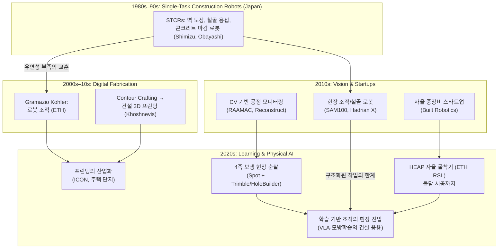

## English

How construction robotics got here — four eras, each answering the previous era's failure,
converging on today's physical-AI moment. Papers get notes as they are read; this page is
the map.

### The four eras

### Why each transition happened

1. **STCR era → digital fabrication**: 1980s Japan built dozens of single-task robots
   (spraying, finishing, welding). They worked — but each robot did one task in one
   structured setting, and construction sites are neither. Lesson: *the environment, not
   the mechanism, is the problem*.
2. **Digital fabrication era**: ETH's Gramazio Kohler flipped the framing — instead of
   robotizing existing tasks, design *for* robots (robotic bricklaying, later the NCCR
   Digital Fabrication program). In parallel, Contour Crafting (USC) seeded construction
   3D printing.
3. **Vision & startups era**: cheap cameras + deep learning ([[01-canonical-papers/notes/alexnet|the CNN revolution]])
   made *monitoring* tractable before manipulation: progress tracking from site photos
   (RAAMAC → Reconstruct). Meanwhile SAM100/Hadrian X commercialized structured tasks, and
   Built Robotics retrofitted autonomy onto excavators.
4. **Learning/physical-AI era**: ETH's HEAP walked excavators into research
   (autonomous landscaping, a 6m dry-stone wall from irregular local stones — perception +
   planning + force control in one system), quadrupeds patrol sites, ICON prints house
   communities — and the open question of the decade: can
   [[01-canonical-papers/notes/pi0|VLA-class]] learned manipulation survive the
   unstructured, safety-critical, low-data construction site? That question is this wiki's
   research direction ([[01-canonical-papers/notes/gr00t-n1|GR00T]]'s data pyramid and
   [[01-canonical-papers/notes/cosmos|world-model data engines]] are the candidate answers
   to the data problem).

### Reading list (section 8 of the [[01-canonical-papers/canonical-list|canonical list]])

- Bock, *The future of construction automation* (Automation in Construction, 2015) — the
  era-1-to-3 overview from the field's veteran
- Davila Delgado et al., *Robotics and automated systems in construction* (J. Building
  Engineering, 2019) — why adoption is hard (the industry-side constraints)
- Jud et al., *HEAP — the autonomous walking excavator* (ETH RSL) — the era-4 reference system
- Site perception: [[01-canonical-papers/notes/sam|SAM]]/[[01-canonical-papers/notes/vggt|VGGT]]-based
  as-built capture connects here from the CV track

## 한국어

건설로봇이 여기까지 온 길 — 네 시대가 각각 앞 시대의 실패에 답하며, 오늘의 physical AI
국면으로 수렴한다. 논문은 읽는 대로 노트가 붙는다; 이 페이지는 그 지도다.

### 각 전환이 일어난 이유

1. **STCR 시대 → 디지털 패브리케이션**: 1980년대 일본은 수십 종의 단일 작업 로봇(도장,
   미장, 용접)을 만들었다. 작동은 했다 — 하지만 각 로봇은 구조화된 환경의 한 작업만 했고,
   건설 현장은 어느 쪽도 아니다. 교훈: *문제는 기구가 아니라 환경이다*.
2. **디지털 패브리케이션 시대**: ETH의 Gramazio Kohler가 프레임을 뒤집었다 — 기존 작업을
   로봇화하는 대신, 로봇을 *위해* 설계하라(로봇 조적, 이후 NCCR Digital Fabrication
   프로그램). 병행해서 Contour Crafting(USC)이 건설 3D 프린팅의 씨앗을 심었다.
3. **비전·스타트업 시대**: 싼 카메라 + 딥러닝([[01-canonical-papers/notes/alexnet|CNN 혁명]])이
   조작보다 *모니터링*을 먼저 가능하게 했다: 현장 사진으로 공정 추적(RAAMAC →
   Reconstruct). 한편 SAM100/Hadrian X가 구조화된 작업을 상업화했고, Built Robotics는
   굴착기에 자율성을 후장착했다.
4. **학습/physical AI 시대**: ETH의 HEAP이 굴착기를 연구의 중심으로 걸어 들어오게 했고
   (자율 조경, 불규칙한 현지 돌로 6m 돌담 시공 — 인식+계획+힘 제어가 한 시스템에), 4족
   로봇이 현장을 순찰하고, ICON이 주택 단지를 프린트한다 — 그리고 이 10년의 열린 질문:
   [[01-canonical-papers/notes/pi0|VLA급]] 학습 조작이 비구조화·안전 중시·데이터 빈곤의
   건설 현장에서 살아남을 수 있는가? 이 질문이 이 위키의 연구 방향이다
   ([[01-canonical-papers/notes/gr00t-n1|GR00T]]의 데이터 피라미드와
   [[01-canonical-papers/notes/cosmos|월드모델 데이터 엔진]]이 데이터 문제에 대한 후보
   답안들이다).

### 읽기 목록 ([[01-canonical-papers/canonical-list|핵심 논문 리스트]] 8번 섹션)

- Bock, *The future of construction automation* (Automation in Construction, 2015) —
  이 분야 원로가 쓴 1~3시대 조감
- Davila Delgado et al., *Robotics and automated systems in construction* (J. Building
  Engineering, 2019) — 도입이 왜 어려운가 (산업 쪽 제약)
- Jud et al., *HEAP — 자율 보행 굴착기* (ETH RSL) — 4시대의 기준 시스템
- 현장 인식: CV 트랙의 [[01-canonical-papers/notes/sam|SAM]]/[[01-canonical-papers/notes/vggt|VGGT]]
  기반 준공 캡처가 여기로 합류한다

관련: [[05-construction-robotics/labs|주요 랩실 지도]] · [[05-construction-robotics/index|건설로봇 홈]]
