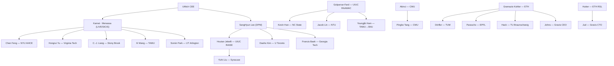
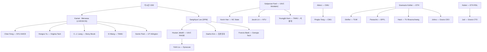

## English

How construction robotics got to its physical-AI moment — told as **three distinct
genealogies** that are easy to conflate. Solid connections below are ones with direct
documented evidence (dissertations, system papers, spinout records); loose influence is
stated as such.

> [!info] Why three genealogies
> "X descends from Y" can mean three different things: an *advisor trained a student*
> (academic), a *method line evolved* (technical), or a *machine/platform grew into the
> next one* (system). Papers cite across all three; keeping them separate is what lets you
> place a new paper precisely.

### 1. The technical genealogy — four eras

**Era 1 — Japanese STCR (1980s–90s).** Shimizu, Obayashi, Kajima and peers built dozens
of Single-Task Construction Robots (spray, tile, rebar). Technically impressive,
economically premature — the era ended with the 1990s Japanese recession, and its lesson
(**the environment, not the mechanism, is the problem**) defined everything after. Thomas
Bock's STCR taxonomy and reference volumes are the standard record.

**Era 1R — the parallel robotics-side lineage (1990s).** Independently of the
construction industry, **CMU's Robotics Institute formulated heavy-machine autonomy as a
robotics problem**: Sanjiv Singh's planning thesis (1995), Stentz–Bares–Singh–Rowe's
autonomous excavator loading trucks *at expert-operator speed* (1998–99), and Howard
Cannon's Caterpillar-embedded excavation work (1999). This line never stopped — it
commercialized through CMU's NREC into Caterpillar's MineStar Command (today's
operator-free mining fleets) and re-surfaced in quarry autonomy in 2024–25. **Heavy-machine
autonomy is a ~30-year robotics lineage that the construction-research community
re-entered after 2015.**

**Era 2 — digital models & sensing (2000s–2010s).** While robots waited, the *information*
side matured: BIM/VDC (Stanford CIFE), scan-to-BIM (Tang–Huber–Akinci 2010), and
vision-based progress monitoring (Golparvar-Fard's D4AR line, spun out as Reconstruct).
This era built the world models today's site robots consume. In parallel, Gramazio Kohler
at ETH founded architectural robotic fabrication (In situ Fabricator, Mesh Mould), and
Khoshnevis's Contour Crafting seeded construction 3D printing.

**Era 3 — commercialization of narrow autonomy (2015–2020).** Komatsu Smart Construction
(2015), Built Robotics retrofits, SAM100 bricklaying, Kajima's A4CSEL fleet automation,
Shimizu's Shimz Smart Site robots. Narrow tasks, structured slices of the site, human
supervisors close by.

**Era 4 — learning enters the machine (2020–).** Three clusters carried robot learning
onto real heavy machines: **ETH RSL** (force-based digging 2017 → HEAP platform 2021 →
sim-to-real RL hydraulics 2020–22 → the Science Robotics dry-stone wall 2023 → ExT
multitask pretraining 2025), **Baidu RAL** (the Science Robotics 2021 AES excavator
running 24 h uncrewed *per human intervention* at human-level throughput; ExACT bringing
[[01-canonical-papers/notes/4-vla/act|ACT]]-style imitation to excavators in 2024,
sim-validated), and the **Nordic wheel-loader groups** (Tampere, Luleå/Örebro,
Umeå+Algoryx — real-machine RL loading at ICRA). In parallel the **UMich manipulation
line** walked the same arc indoors: vision-guided assembly (2015) → adaptive autonomy →
learning-from-demonstration → digital-twin-grounded, language-instructable collaboration.

### 2. The academic genealogy — who trained whom

Two intermarried US family trees produce a striking share of the field's faculty, with a
European counterpart:

Every edge above is verified against dissertations, lab alumni pages, or committee
records (survey 2026-07). Notable pattern: **worker-sensing expertise radiates from
SangHyun Lee's students** (Jebelli, Kim, Baek — all now fusing physiological signals into
robot control), while **manipulation/digital-twin expertise radiates from Kamat–Menassa's**
(Feng, Yu, Liang, Wang, Park). Gramazio Kohler's tree seeded European fabrication chairs
the way Michigan seeded US robotics ones.

### 3. The system genealogy — machines that grew into machines

- **Menzi Muck M545 → HEAP (2021) → dry-stone wall (2023) → ExT (2025) → Gravis RACK
  retrofit kits** — one physical platform carrying an entire research program into a
  company.
- **CMU ALS (1998) → NREC programs → Cat MineStar Command → quarry autonomy (2024–25)** —
  the research-to-OEM arc.
- **Komatsu Smart Construction (2015) → EarthBrain → Pronto/Tier IV truck autonomy
  (2025–27)**; **Kajima A4CSEL**: dozer/roller/dump fleets on dam sites, centrally
  supervised from Tokyo since 2021 — the strongest contractor-side program.
- **UMich KUKA FabLab testbed → drywall/ceiling/handover task suite → descendants'
  testbeds** at VT, Stony Brook, TAMU — a *task suite* as the inherited artifact.

### 4. Reading this map as a new researcher

The sensing and narrow-commercialization stories (eras 2–3) are mature and crowded. The
open territory is where **era-4 learning meets era-1R machines and era-2 world models**:
bringing [[01-canonical-papers/notes/4-vla/pi0|π0]]-class manipulation onto real
construction tasks, and closing the loop between site perception (scan-to-BIM, digital
twins) and machine policies. The 2024–25 signals of that merge: ExACT (Baidu — porting
[[01-canonical-papers/notes/4-vla/act|ACT]] to an excavator) and
[[01-canonical-papers/notes/8-construction/ext|ExT]] (ETH — pretrain→fine-tune for
excavation). The [[05-construction-robotics/index|stream pages]] organize the literature
this map locates.

For example, start with a panel-fitting failure you can reproduce, then use the map to find which lineage already supplies its necessary interface: geometric correction, contact feedback, or human demonstration. Read an anchor paper for that interface before selecting a fashionable model. **The reading this gives you.** The useful research opening is a transferable assumption that breaks in your task. Write what you inherit, what condition changes, and what experiment could demonstrate the difference. A lineage then becomes a tool for choosing a defensible question rather than a ranking of laboratories.

### Reading list — the anchors

- Bock, *The future of construction automation* (Automation in Construction, 2015) — the
  era-1-to-3 overview from the field's veteran
- [[01-canonical-papers/notes/8-construction/stentz-excavator|Stentz et al., autonomous truck loading]]
  (IROS 1998 / Autonomous Robots 1999) — the era-1R anchor
- Davila Delgado et al. (J. Building Engineering, 2019) — why adoption is hard
- Jud et al., *HEAP* (Automation in Construction, 2021) — the era-4 reference platform
- [[01-canonical-papers/notes/8-construction/dry-stone-wall|Johns et al., dry-stone wall]]
  (Science Robotics, 2023) — era 4's flagship demonstration
- Zhai, Terenzi et al., *ExT* ([[01-canonical-papers/notes/8-construction/ext|note]]) —
  the pretrain→fine-tune signal
- Section 8 of the [[01-canonical-papers/canonical-list|canonical list]] carries the full
  curated set.

## 한국어

건설로봇이 physical AI의 순간에 도달하기까지 — 혼동하기 쉬운 **세 가지 서로 다른 계보**로
나누어 말한다. 아래의 실선 관계는 직접 증거(학위논문, 시스템 논문, 스핀아웃 기록)가 있는
것이고, 느슨한 영향은 느슨하다고 명시한다.

> [!info] 왜 세 가지 계보인가
> "X가 Y에서 나왔다"는 세 가지 다른 뜻일 수 있다: *지도교수가 제자를 길렀다*(학술),
> *방법론이 진화했다*(기술), *기계/플랫폼이 다음 기계로 자랐다*(시스템). 논문은 세 계보를
> 넘나들며 인용한다 — 셋을 구분해야 새 논문을 정확히 배치할 수 있다.

### 1. 기술 계보 — 네 시대

**1시대 — 일본 STCR (1980~90년대).** Shimizu, Obayashi, Kajima 등이 수십 종의 단일 작업
건설로봇(뿜칠, 타일, 철근)을 만들었다. 기술적으로 인상적이었지만 경제적으로 시기상조 —
1990년대 일본 불황과 함께 끝났고, 그 교훈(**문제는 기구가 아니라 환경이다**)이 이후
모든 것을 규정했다. Thomas Bock의 STCR 분류와 참고서가 표준 기록이다.

**1R시대 — 병렬의 로보틱스 쪽 계보 (1990년대).** 건설 산업과 독립적으로, **CMU 로보틱스
연구소가 중장비 자율성을 로보틱스 문제로 정식화했다**: Sanjiv Singh의 계획 학위논문(1995),
Stentz–Bares–Singh–Rowe의 *숙련 운전자 속도로* 트럭에 적재하는 자율 굴착기(1998–99),
Caterpillar 파견 엔지니어 Howard Cannon의 굴착 연구(1999). 이 라인은 멈춘 적이 없다 —
CMU NREC를 거쳐 Caterpillar MineStar Command(오늘날의 무인 광산 선단)로 상업화됐고
2024–25년 채석장 자율화로 재부상했다. **중장비 자율성은 건설 연구 커뮤니티가 2015년
이후 재진입한 ~30년 된 로보틱스 계보다.**

**2시대 — 디지털 모델과 센싱 (2000~2010년대).** 로봇이 기다리는 동안 *정보* 쪽이
성숙했다: BIM/VDC(Stanford CIFE), scan-to-BIM(Tang–Huber–Akinci 2010), 비전 기반 공정
모니터링(Golparvar-Fard의 D4AR 라인, Reconstruct로 창업). 오늘날 현장 로봇이 소비하는
월드모델을 이 시대가 만들었다. 병행하여 ETH의 Gramazio Kohler가 건축 로봇
패브리케이션(In situ Fabricator, Mesh Mould)을 창시했고, Khoshnevis의 Contour Crafting이
건설 3D 프린팅의 씨앗을 심었다.

**3시대 — 좁은 자율성의 상업화 (2015~2020).** Komatsu Smart Construction(2015), Built
Robotics 개조, SAM100 조적, Kajima A4CSEL 선단 자동화, Shimizu Shimz Smart Site 로봇.
좁은 작업, 현장의 구조화된 조각, 가까이 있는 인간 감독자.

**4시대 — 학습이 기계에 들어오다 (2020~).** 세 클러스터가 로봇 학습을 실제 중장비에
실었다: **ETH RSL**(힘 기반 굴착 2017 → HEAP 플랫폼 2021 → sim-to-real RL 유압 2020–22 →
Science Robotics 돌담 2023 → ExT 멀티태스크 사전학습 2025), **Baidu RAL**(사람 개입 1회당 24시간 무인·
인간급 처리량의 Science Robotics 2021 AES 굴착기; 2024년 ExACT가
[[01-canonical-papers/notes/4-vla/act|ACT]]식 모방학습을 굴착기에 이식 — 시뮬레이션 검증),
그리고 **북유럽 휠로더 그룹**(Tampere, Luleå/Örebro, Umeå+Algoryx — ICRA의 실기계 RL
적재). 병행하여 **미시간 조작 라인**이 실내에서 같은 궤적을 걸었다: 비전 유도 조립(2015)
→ 적응적 자율성 → 시연 학습 → 디지털 트윈에 접지된 언어 지시 협업.

### 2. 학술 계보 — 누가 누구를 길렀나

서로 얽힌 미국의 두 가계도가 이 분야 교수진의 놀라운 비율을 배출했고, 유럽에 대응물이
있다:

위의 모든 간선은 학위논문·랩 동문 페이지·심사위원 기록으로 검증됐다(2026-07 조사).
주목할 패턴: **작업자 센싱 전문성은 SangHyun Lee의 제자들에게서 방사**되고(Jebelli, Kim,
Baek — 모두 생리 신호를 로봇 제어에 융합 중), **조작/디지털 트윈 전문성은
Kamat–Menassa의 제자들에게서 방사**된다(Feng, Yu, Liang, Wang, Park). Gramazio Kohler의
나무는 미시간이 미국 로봇 교수진을 심은 방식 그대로 유럽 패브리케이션 석좌들을 심었다.

### 3. 시스템 계보 — 기계가 기계로 자라다

- **Menzi Muck M545 → HEAP(2021) → 돌담(2023) → ExT(2025) → Gravis RACK 개조 키트** —
  하나의 물리 플랫폼이 연구 프로그램 전체를 회사까지 실어 나른 경우.
- **CMU ALS(1998) → NREC 프로그램 → Cat MineStar Command → 채석장 자율화(2024–25)** —
  연구에서 OEM으로 가는 궤적.
- **Komatsu Smart Construction(2015) → EarthBrain → Pronto/Tier IV 트럭 자율화(2025–27)**;
  **Kajima A4CSEL**: 댐 현장의 도저/롤러/덤프 선단을 2021년부터 도쿄에서 중앙 감독 —
  가장 강한 시공사 쪽 프로그램.
- **미시간 KUKA FabLab 테스트베드 → 석고보드/천장/전달 과제 묶음 → 제자들의
  테스트베드**(VT, Stony Brook, TAMU) — *과제 묶음* 자체가 상속되는 유산.

### 4. 신진 연구자를 위한 이 지도의 독해

센싱과 좁은 상업화 이야기(2~3시대)는 성숙했고 붐빈다. 열린 영토는 **4시대의 학습이
1R시대의 기계·2시대의 월드모델과 만나는 곳**이다: [[01-canonical-papers/notes/4-vla/pi0|π0]]급
조작을 실제 건설 과제에 올리는 것, 그리고 현장 인식(scan-to-BIM, 디지털 트윈)과 기계
정책 사이의 루프를 닫는 것. 그 합류의 2024–25년 신호가 ExACT(Baidu —
[[01-canonical-papers/notes/4-vla/act|ACT]]의 굴착기 이식)와
[[01-canonical-papers/notes/8-construction/ext|ExT]](ETH — 굴착의 사전학습→파인튜닝)다.
이 지도가 위치를 잡아 주는 문헌은 [[05-construction-robotics/index|스트림 페이지]]들이
조직한다.

재현 가능한 패널 맞춤 실패에서 시작해 형상 보정, 접촉 피드백, 사람 시연 중 필요한 인터페이스를 제공하는 계보를 찾는다. 유행하는 모델을 고르기 전에 그 인터페이스의 기준 논문을 읽는다. **여기서 얻는 독법.** 쓸모 있는 연구 기회는 내 과제에서 깨지는 전이 가능한 가정이다. 무엇을 이어받고 어떤 조건이 바뀌며 어떤 실험으로 차이를 보일지 적는다. 계보는 연구실 순위가 아니라 방어 가능한 질문을 고르는 도구가 된다.

### 읽기 목록 — 앵커들

- Bock, *The future of construction automation* (Automation in Construction, 2015) —
  이 분야 원로가 쓴 1~3시대 조감
- [[01-canonical-papers/notes/8-construction/stentz-excavator|Stentz et al., 자율 트럭 적재]]
  (IROS 1998 / Autonomous Robots 1999) — 1R시대의 앵커
- Davila Delgado et al. (J. Building Engineering, 2019) — 도입이 왜 어려운가
- Jud et al., *HEAP* (Automation in Construction, 2021) — 4시대의 기준 플랫폼
- [[01-canonical-papers/notes/8-construction/dry-stone-wall|Johns et al., 돌담]]
  (Science Robotics, 2023) — 4시대의 대표 시연
- Zhai, Terenzi et al., *ExT* ([[01-canonical-papers/notes/8-construction/ext|노트]]) —
  사전학습→파인튜닝의 신호
- 전체 큐레이션은 [[01-canonical-papers/canonical-list|핵심 논문 리스트]] 8번 섹션에.
