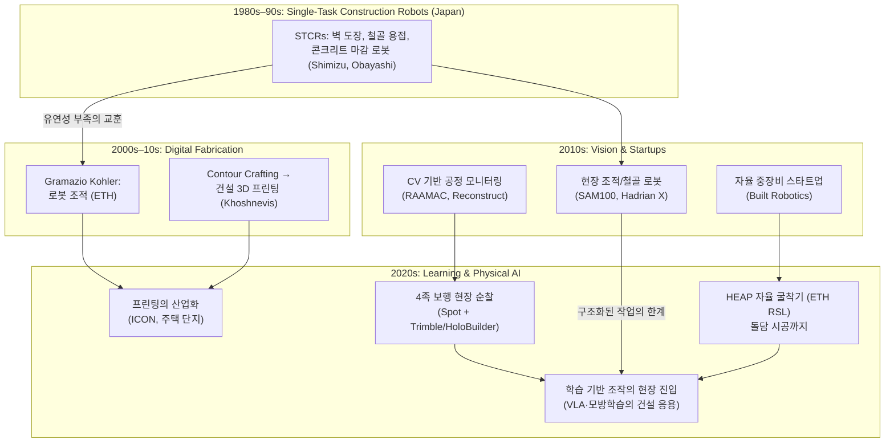

## English

How construction robotics got here — four eras, each answering the previous era's failure,
converging on today's physical-AI moment. Papers get notes as they are read; this page is
the map.

### The four eras

### Why each transition happened

1. **STCR era → digital fabrication**: 1980s Japan built dozens of single-task robots
   (spraying, finishing, welding). They worked — but each robot did one task in one
   structured setting, and construction sites are neither. Lesson: *the environment, not
   the mechanism, is the problem*.
2. **Digital fabrication era**: ETH's Gramazio Kohler flipped the framing — instead of
   robotizing existing tasks, design *for* robots (robotic bricklaying, later the NCCR
   Digital Fabrication program). In parallel, Contour Crafting (USC) seeded construction
   3D printing.
3. **Vision & startups era**: cheap cameras + deep learning ([[01-canonical-papers/notes/1-foundations/alexnet|the CNN revolution]])
   made *monitoring* tractable before manipulation: progress tracking from site photos
   (RAAMAC → Reconstruct). Meanwhile SAM100/Hadrian X commercialized structured tasks, and
   Built Robotics retrofitted autonomy onto excavators.
4. **Learning/physical-AI era**: ETH's HEAP walked excavators into research
   (autonomous landscaping, a 6m dry-stone wall from irregular local stones — perception +
   planning + force control in one system), quadrupeds patrol sites, ICON prints house
   communities — and the open question of the decade: can
   [[01-canonical-papers/notes/4-vla/pi0|VLA-class]] learned manipulation survive the
   unstructured, safety-critical, low-data construction site? That question is this wiki's
   research direction ([[01-canonical-papers/notes/4-vla/gr00t-n1|GR00T]]'s data pyramid and
   [[01-canonical-papers/notes/5-world-models/cosmos|world-model data engines]] are the candidate answers
   to the data problem).

### Current research streams (from the labs' actual publication records)

Analyzing the publication records of the [[05-construction-robotics/labs|mapped labs]]
(2019–2025) yields five active streams, each importing a different part of this wiki's
physical-AI stack:

1. **Imitation learning / skill transfer** — Yu (VT): *cloud-based hierarchical imitation
   learning for transferring construction skills from workers to robots* (2024) — the
   construction port of the [[01-canonical-papers/notes/4-vla/act|ACT]]/[[01-canonical-papers/notes/4-vla/diffusion-policy|Diffusion
   Policy]] wave. The newest and thinnest stream — VLA-class methods have barely entered.
2. **HRC + digital twins** — Wang (TAMU) & Yu: *BIM-driven collaborative workflows with
   closed-loop digital twins* (2021–24); Shah (MIT) supplies the manufacturing HRC
   playbook. Construction's home-grown analogue of the
   [[01-canonical-papers/notes/5-world-models/cosmos|world-model-as-coordination-medium]] idea.
3. **Worker-state sensing (human-centered)** — Lee (UMich) & Jebelli (UIUC): wearable
   biosensors, EEG workload; Wang's EEG-thermal studies; Baek's ergonomics; Yu's
   robot-acceptance factor studies. **A first-class topic here that mainstream physical AI
   barely touches** — construction's distinctive contribution.
4. **Site perception & the data problem** — Baek (GT): localization + GAN augmentation;
   Golparvar-Fard (UIUC): progress monitoring. Converging with the
   [[01-canonical-papers/notes/2-computer-vision/sam|SAM]]/[[01-canonical-papers/notes/2-computer-vision/vggt|VGGT]] foundation-model
   wave; data scarcity points the same direction as
   [[01-canonical-papers/notes/4-vla/gr00t-n1|GR00T]]'s synthetic-data pyramid.
5. **Heavy-machine autonomy** — ETH RSL (HEAP) and industry retrofits: learned/optimal
   control on excavators — the [[04-robotics/mpc|MPC]]-meets-learning stream.

**The reading of this map for a new researcher**: streams 2–4 are mature and crowded;
stream 1 (bringing [[01-canonical-papers/notes/4-vla/pi0|π0]]-class manipulation onto real
construction tasks) and its intersection with stream 5 are where the open territory lies.

### Reading list (section 8 of the [[01-canonical-papers/canonical-list|canonical list]])

- Bock, *The future of construction automation* (Automation in Construction, 2015) — the
  era-1-to-3 overview from the field's veteran
- Davila Delgado et al., *Robotics and automated systems in construction* (J. Building
  Engineering, 2019) — why adoption is hard (the industry-side constraints)
- Jud et al., *HEAP — the autonomous walking excavator* (ETH RSL) — the era-4 reference system
- Site perception: [[01-canonical-papers/notes/2-computer-vision/sam|SAM]]/[[01-canonical-papers/notes/2-computer-vision/vggt|VGGT]]-based
  as-built capture connects here from the CV track

## 한국어

건설로봇이 여기까지 온 길 — 네 시대가 각각 앞 시대의 실패에 답하며, 오늘의 physical AI
국면으로 수렴한다. 논문은 읽는 대로 노트가 붙는다; 이 페이지는 그 지도다.

### 각 전환이 일어난 이유

1. **STCR 시대 → 디지털 패브리케이션**: 1980년대 일본은 수십 종의 단일 작업 로봇(도장,
   미장, 용접)을 만들었다. 작동은 했다 — 하지만 각 로봇은 구조화된 환경의 한 작업만 했고,
   건설 현장은 어느 쪽도 아니다. 교훈: *문제는 기구가 아니라 환경이다*.
2. **디지털 패브리케이션 시대**: ETH의 Gramazio Kohler가 프레임을 뒤집었다 — 기존 작업을
   로봇화하는 대신, 로봇을 *위해* 설계하라(로봇 조적, 이후 NCCR Digital Fabrication
   프로그램). 병행해서 Contour Crafting(USC)이 건설 3D 프린팅의 씨앗을 심었다.
3. **비전·스타트업 시대**: 싼 카메라 + 딥러닝([[01-canonical-papers/notes/1-foundations/alexnet|CNN 혁명]])이
   조작보다 *모니터링*을 먼저 가능하게 했다: 현장 사진으로 공정 추적(RAAMAC →
   Reconstruct). 한편 SAM100/Hadrian X가 구조화된 작업을 상업화했고, Built Robotics는
   굴착기에 자율성을 후장착했다.
4. **학습/physical AI 시대**: ETH의 HEAP이 굴착기를 연구의 중심으로 걸어 들어오게 했고
   (자율 조경, 불규칙한 현지 돌로 6m 돌담 시공 — 인식+계획+힘 제어가 한 시스템에), 4족
   로봇이 현장을 순찰하고, ICON이 주택 단지를 프린트한다 — 그리고 이 10년의 열린 질문:
   [[01-canonical-papers/notes/4-vla/pi0|VLA급]] 학습 조작이 비구조화·안전 중시·데이터 빈곤의
   건설 현장에서 살아남을 수 있는가? 이 질문이 이 위키의 연구 방향이다
   ([[01-canonical-papers/notes/4-vla/gr00t-n1|GR00T]]의 데이터 피라미드와
   [[01-canonical-papers/notes/5-world-models/cosmos|월드모델 데이터 엔진]]이 데이터 문제에 대한 후보
   답안들이다).

### 현재 연구 흐름 (랩들의 실제 논문 기록 분석)

[[05-construction-robotics/labs|지도에 실린 랩들]]의 논문 기록(2019~2025)을 분석하면
다섯 개의 활성 흐름이 나오고, 각각 이 위키 physical AI 스택의 다른 부분을 수입하고 있다:

1. **모방학습 / 스킬 전이** — Yu(VT): *작업자의 건설 기술을 로봇에 전이하는 클라우드 기반
   계층적 모방학습* (2024) — [[01-canonical-papers/notes/4-vla/act|ACT]]/[[01-canonical-papers/notes/4-vla/diffusion-policy|Diffusion
   Policy]] 물결의 건설 이식. 가장 새롭고 가장 얇은 흐름 — VLA급 기법은 이제 막 진입했다.
2. **HRC + 디지털 트윈** — Wang(TAMU)과 Yu: *폐루프 디지털 트윈의 BIM 연동 협업 워크플로*
   (2021~24); Shah(MIT)가 제조 HRC 플레이북을 공급.
   [[01-canonical-papers/notes/5-world-models/cosmos|조율 매체로서의 월드모델]] 아이디어의 건설 자생판.
3. **작업자 상태 센싱 (인간 중심)** — Lee(미시간)와 Jebelli(UIUC): 웨어러블 바이오센서,
   EEG 작업부하; Wang의 EEG-온열 연구; Baek의 인간공학; Yu의 로봇 수용성 연구.
   **주류 physical AI가 거의 다루지 않는데 여기서는 1급 주제** — 건설 분야의 고유한 기여.
4. **현장 인식과 데이터 문제** — Baek(GT): 위치 추정 + GAN 증강; Golparvar-Fard(UIUC):
   공정 모니터링. [[01-canonical-papers/notes/2-computer-vision/sam|SAM]]/[[01-canonical-papers/notes/2-computer-vision/vggt|VGGT]]
   파운데이션 모델 물결과 합류 중; 데이터 빈곤은
   [[01-canonical-papers/notes/4-vla/gr00t-n1|GR00T]]의 합성 데이터 피라미드와 같은 방향을 가리킨다.
5. **중장비 자율화** — ETH RSL(HEAP)과 산업계 개조: 굴착기의 학습/최적 제어 —
   [[04-robotics/mpc|MPC]]와 학습이 만나는 흐름. 2024~25년에 1번과 합류하기 시작했다:
   ExACT(굴착기에 [[01-canonical-papers/notes/4-vla/act|ACT]] 이식, ICRA 2024 워크숍)와
   [ExT](https://arxiv.org/abs/2509.14992)(ETH RSL — 굴착의 대규모 사전학습→파인튜닝
   레시피)가 그 신호탄이다.

**신진 연구자를 위한 이 지도의 독해**: 2~4번 흐름은 성숙했고 붐빈다;
1번([[01-canonical-papers/notes/4-vla/pi0|π0]]급 조작을 실제 건설 과제에 올리는 것)과 그것이
5번과 만나는 교차점이 열린 영토다.

### 읽기 목록 ([[01-canonical-papers/canonical-list|핵심 논문 리스트]] 8번 섹션)

- Bock, *The future of construction automation* (Automation in Construction, 2015) —
  이 분야 원로가 쓴 1~3시대 조감
- Davila Delgado et al., *Robotics and automated systems in construction* (J. Building
  Engineering, 2019) — 도입이 왜 어려운가 (산업 쪽 제약)
- Jud et al., *HEAP — 자율 보행 굴착기* (ETH RSL) — 4시대의 기준 시스템
- 현장 인식: CV 트랙의 [[01-canonical-papers/notes/2-computer-vision/sam|SAM]]/[[01-canonical-papers/notes/2-computer-vision/vggt|VGGT]]
  기반 준공 캡처가 여기로 합류한다

관련: [[05-construction-robotics/labs|주요 랩실 지도]] · [[05-construction-robotics/index|건설로봇 홈]]
