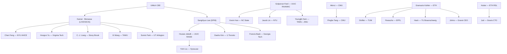
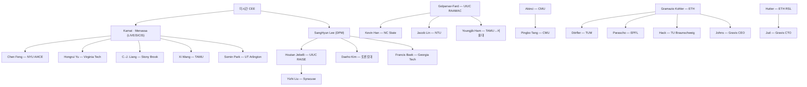

## English

How construction robotics got to its physical-AI moment — told as **three distinct
genealogies** that are easy to conflate. Solid connections below are ones with direct
documented evidence (dissertations, system papers, spinout records); loose influence is
stated as such.

> [!info] Why three genealogies
> "X descends from Y" can mean three different things: an *advisor trained a student*
> (academic), a *method line evolved* (technical), or a *machine/platform grew into the
> next one* (system). Papers cite across all three; keeping them separate is what lets you
> place a new paper precisely.

> [!note] First pass · 처음이라면
> Read §1's four eras and §4 on how to use the map first, then §5 and §6, which measure where the field stands now: who publishes most, how each stream moved since 2019, and which recent reviews to start from. §2 and §3 are reference you return to when a name or a machine comes up in a paper.

### 1. The technical genealogy — four eras

**Era 1 — Japanese STCR (1980s–90s).** Shimizu, Obayashi, Kajima and peers built dozens
of Single-Task Construction Robots (spray, tile, rebar). Technically impressive,
economically premature — the era ended with the 1990s Japanese recession, and its lesson
(**the environment, not the mechanism, is the problem**) defined everything after. Thomas
Bock's STCR taxonomy and reference volumes are the standard record.

**Era 1R — the parallel robotics-side lineage (1990s).** Independently of the
construction industry, **CMU's Robotics Institute formulated heavy-machine autonomy as a
robotics problem**:

- Sanjiv Singh's planning thesis (1995);
- Stentz–Bares–Singh–Rowe's autonomous excavator loading trucks *at expert-operator speed* (1998–99);
- Howard Cannon's Caterpillar-embedded excavation work (1999).

This line never stopped — it
commercialized through CMU's NREC into Caterpillar's MineStar Command (today's
operator-free mining fleets) and re-surfaced in quarry autonomy in 2024–25. **Heavy-machine
autonomy is a ~30-year robotics lineage that the construction-research community
re-entered after 2015.**

**Era 2 — digital models & sensing (2000s–2010s).** While robots waited, the *information*
side matured: BIM/VDC (Stanford CIFE), scan-to-BIM (Tang–Huber–Akinci 2010), and
vision-based progress monitoring (Golparvar-Fard's D4AR line, spun out as Reconstruct).
This era built the world models today's site robots consume. In parallel, Gramazio Kohler
at ETH founded architectural robotic fabrication (In situ Fabricator, Mesh Mould), and
Khoshnevis's Contour Crafting seeded construction 3D printing.

**Era 3 — commercialization of narrow autonomy (2015–2020).** Komatsu Smart Construction
(2015), Built Robotics retrofits, SAM100 bricklaying, Kajima's A4CSEL fleet automation,
Shimizu's Shimz Smart Site robots. Narrow tasks, structured slices of the site, human
supervisors close by.

**Era 4 — learning enters the machine (2020–).** Three clusters carried robot learning
onto real heavy machines, and a fourth line walked the same arc indoors:

- **ETH RSL**: force-based digging 2017 → HEAP platform 2021 → sim-to-real RL hydraulics
  2020–22 → the Science Robotics dry-stone wall 2023 → ExT multitask pretraining 2025.
- **Baidu RAL**: the Science Robotics 2021 AES excavator (Autonomous Excavator System,
  [[01-canonical-papers/notes/8-construction/aes|note]]), which ran 24 hours between human
  interventions, with hourly material throughput close to an experienced human operator's;
  ExACT bringing [[01-canonical-papers/notes/4-vla/act|ACT]]-style imitation to excavators
  in 2024, sim-validated.
- **Nordic wheel-loader groups** (Tampere, Luleå/Örebro, Umeå+Algoryx): real-machine RL
  loading at ICRA.
- In parallel, the **UMich manipulation line** indoors: vision-guided assembly (2015) →
  adaptive autonomy → learning-from-demonstration → digital-twin-grounded,
  language-instructable collaboration.

### 2. The academic genealogy — who trained whom

Two intermarried US family trees produce a striking share of the field's faculty, with a
European counterpart:

Every edge above is verified against dissertations, lab alumni pages, or committee
records (survey 2026-07). Notable pattern: **worker-sensing expertise radiates from
SangHyun Lee's students** (Jebelli, Kim, Baek — all now fusing physiological signals into
robot control), while **manipulation/digital-twin expertise radiates from Kamat–Menassa's**
(Feng, Yu, Liang, Wang, Park). Gramazio Kohler's tree seeded European fabrication chairs
the way Michigan seeded US robotics ones.

### 3. The system genealogy — machines that grew into machines

- **Menzi Muck M545 → HEAP (2021) → dry-stone wall (2023) → ExT (2025) → Gravis RACK
  retrofit kits** — one physical platform carrying an entire research program into a
  company.
- **CMU ALS (1998) → NREC programs → Cat MineStar Command → quarry autonomy (2024–25)** —
  the research-to-OEM arc.
- **Komatsu Smart Construction (2015) → EarthBrain → Pronto/Tier IV truck autonomy
  (2025–27)**; **Kajima A4CSEL**: dozer/roller/dump fleets on dam sites, centrally
  supervised from Tokyo since 2021 — the strongest contractor-side program.
- **UMich KUKA FabLab testbed → drywall/ceiling/handover task suite → descendants'
  testbeds** at VT, Stony Brook, TAMU — a *task suite* as the inherited artifact.

### 4. Reading this map as a new researcher

The sensing and narrow-commercialization stories (eras 2–3) are mature and crowded. The
open territory is where **era-4 learning meets era-1R machines and era-2 world models**:
bringing [[01-canonical-papers/notes/4-vla/pi0|π0]]-class manipulation onto real
construction tasks, and closing the loop between site perception (scan-to-BIM, digital
twins) and machine policies. The 2024–25 signals of that merge: ExACT (Baidu — porting
[[01-canonical-papers/notes/4-vla/act|ACT]] to an excavator) and
[[01-canonical-papers/notes/8-construction/ext|ExT]] (ETH — pretrain→fine-tune for
excavation). The [[05-construction-robotics/index|stream pages]] organize the literature
this map locates.

For example, start with a panel-fitting failure you can reproduce (panel fitting means seating a large, flexible building panel such as drywall into place; the task is treated in [[05-construction-robotics/construction-manipulation|construction manipulation]]), then use the map to find which lineage already supplies its necessary interface: geometric correction, contact feedback, or human demonstration. Read an anchor paper for that interface before selecting a fashionable model. **The reading this gives you.** The useful research opening is a transferable assumption that breaks in your task. Write what you inherit, what condition changes, and what experiment could demonstrate the difference. A lineage then becomes a tool for choosing a defensible question rather than a ranking of laboratories.

### 5. Where the field stands, measured

§1–§3 tell the history through genealogy: who trained whom, which machine grew into which. Genealogy answers *where this came from*, not *who does most of it now*, and the two can differ. This section and the next measure the second, so that a new researcher can tell the historical centre from the current one.

**How it was counted, on 2026-09-22.** Two sources, because neither is complete alone.

- **Volume and topics** come from Crossref: every research article in *Automation in Construction*, *Advanced Engineering Informatics*, the *Journal of Computing in Civil Engineering* and *Construction Robotics* since 2019, about $8{,}800$ records, kept when the title names a robot, excavator, manipulator, teleoperation, exoskeleton, quadruped or humanoid. *Advanced Engineering Informatics* also publishes manufacturing and warehouse robotics — only $40\%$ of its robot titles concern construction — so its records additionally had to name a construction object. Titles alone miss papers that say "robot" only in the abstract, so read the counts as a floor.
- **Countries and institutions** come from [OpenAlex](https://openalex.org): robot-centred papers (title or abstract) in those four venues plus the ISARC proceedings, and construction papers in seven robotics journals (RA-L, T-RO, *Science Robotics*, the *Journal of Field Robotics*, *Field Robotics*, *Autonomous Robots*, IJRR). A country or institution is credited once for each paper with at least one author there, so shares overlap. This slice still contains the manufacturing robotics of *Advanced Engineering Informatics*, which is the caveat on the country paragraph below.
- ICRA and IROS proceedings are indexed too patchily in either source to count; the [[08-research-radar/index|Research Radar]] covers them from DBLP.

<svg viewBox="0 0 560 300" style="max-width:100%;height:auto" role="img" aria-label="Left: construction robot papers per year in four construction journals, 2019 to 2025, rising from 27 to 95, between 5.5 and 7.5 percent of the articles in those journals. Right: the share of papers with at least one author from each country, 2016–2020 against 2021–2025; China rises from 9 to 29 percent and the United States from 19 to 22 percent, in a corpus that includes some manufacturing robotics.">
<text x="34" y="22" font-size="12.5" fill="currentColor" font-weight="600">construction robot papers per year</text>
<rect x="37.0" y="190.9" width="24.0" height="49.1" fill="currentColor" fill-opacity="0.45"/>
<rect x="37.0" y="190.9" width="24.0" height="0.0" fill="currentColor" fill-opacity="0.9"/>
<text x="49.0" y="186.9" font-size="10.5" fill="currentColor" text-anchor="middle">27</text>
<text x="49.0" y="254" font-size="10" fill="currentColor" text-anchor="middle">2019</text>
<rect x="67.0" y="161.8" width="24.0" height="78.2" fill="currentColor" fill-opacity="0.45"/>
<rect x="67.0" y="161.8" width="24.0" height="0.0" fill="currentColor" fill-opacity="0.9"/>
<text x="79.0" y="254" font-size="10" fill="currentColor" text-anchor="middle">20</text>
<rect x="97.0" y="145.5" width="24.0" height="94.5" fill="currentColor" fill-opacity="0.45"/>
<rect x="97.0" y="145.5" width="24.0" height="0.0" fill="currentColor" fill-opacity="0.9"/>
<text x="109.0" y="141.5" font-size="10.5" fill="currentColor" text-anchor="middle">52</text>
<text x="109.0" y="254" font-size="10" fill="currentColor" text-anchor="middle">21</text>
<rect x="127.0" y="109.1" width="24.0" height="130.9" fill="currentColor" fill-opacity="0.45"/>
<rect x="127.0" y="109.1" width="24.0" height="0.0" fill="currentColor" fill-opacity="0.9"/>
<text x="139.0" y="254" font-size="10" fill="currentColor" text-anchor="middle">22</text>
<rect x="157.0" y="132.7" width="24.0" height="107.3" fill="currentColor" fill-opacity="0.45"/>
<rect x="157.0" y="132.7" width="24.0" height="0.0" fill="currentColor" fill-opacity="0.9"/>
<text x="169.0" y="254" font-size="10" fill="currentColor" text-anchor="middle">23</text>
<rect x="187.0" y="61.8" width="24.0" height="178.2" fill="currentColor" fill-opacity="0.45"/>
<rect x="187.0" y="61.8" width="24.0" height="0.0" fill="currentColor" fill-opacity="0.9"/>
<text x="199.0" y="57.8" font-size="10.5" fill="currentColor" text-anchor="middle">98</text>
<text x="199.0" y="254" font-size="10" fill="currentColor" text-anchor="middle">24</text>
<rect x="217.0" y="67.3" width="24.0" height="172.7" fill="currentColor" fill-opacity="0.45"/>
<rect x="217.0" y="67.3" width="24.0" height="0.0" fill="currentColor" fill-opacity="0.9"/>
<text x="229.0" y="63.3" font-size="10.5" fill="currentColor" text-anchor="middle">95</text>
<text x="229.0" y="254" font-size="10" fill="currentColor" text-anchor="middle">2025</text>
<line x1="34" y1="240" x2="244" y2="240" stroke="currentColor" stroke-opacity="0.6"/>
<text x="34" y="274" font-size="10.5" fill="currentColor">four construction journals, titles only;</text>
<text x="34" y="290" font-size="10.5" fill="currentColor">5.5–7.5% of their articles each year</text>
<text x="280" y="22" font-size="12.5" fill="currentColor" font-weight="600">share of papers with an author from…</text>
<text x="339" y="51" font-size="10.5" fill="currentColor" text-anchor="end">China</text>
<rect x="345" y="41" width="40.8" height="6" fill="currentColor" fill-opacity="0.35"/>
<rect x="345" y="48" width="128.9" height="7" fill="currentColor" fill-opacity="0.9"/>
<text x="477.9" y="53" font-size="10" fill="currentColor">9 → 29%</text>
<text x="339" y="71" font-size="10.5" fill="currentColor" text-anchor="end">United States</text>
<rect x="345" y="61" width="81.5" height="6" fill="currentColor" fill-opacity="0.35"/>
<rect x="345" y="68" width="95.6" height="7" fill="currentColor" fill-opacity="0.9"/>
<text x="444.6" y="73" font-size="10" fill="currentColor">19 → 22%</text>
<text x="339" y="91" font-size="10.5" fill="currentColor" text-anchor="end">Germany</text>
<rect x="345" y="81" width="38.8" height="6" fill="currentColor" fill-opacity="0.35"/>
<rect x="345" y="88" width="38.1" height="7" fill="currentColor" fill-opacity="0.9"/>
<text x="387.8" y="93" font-size="10" fill="currentColor">9 → 9%</text>
<text x="339" y="111" font-size="10.5" fill="currentColor" text-anchor="end">Hong Kong</text>
<rect x="345" y="101" width="15.9" height="6" fill="currentColor" fill-opacity="0.35"/>
<rect x="345" y="108" width="35.7" height="7" fill="currentColor" fill-opacity="0.9"/>
<text x="384.7" y="113" font-size="10" fill="currentColor">4 → 8%</text>
<text x="339" y="131" font-size="10.5" fill="currentColor" text-anchor="end">United Kingdom</text>
<rect x="345" y="121" width="18.9" height="6" fill="currentColor" fill-opacity="0.35"/>
<rect x="345" y="128" width="23.2" height="7" fill="currentColor" fill-opacity="0.9"/>
<text x="372.2" y="133" font-size="10" fill="currentColor">4 → 5%</text>
<text x="339" y="151" font-size="10.5" fill="currentColor" text-anchor="end">South Korea</text>
<rect x="345" y="141" width="20.9" height="6" fill="currentColor" fill-opacity="0.35"/>
<rect x="345" y="148" width="21.2" height="7" fill="currentColor" fill-opacity="0.9"/>
<text x="370.2" y="153" font-size="10" fill="currentColor">5 → 5%</text>
<text x="339" y="171" font-size="10.5" fill="currentColor" text-anchor="end">Canada</text>
<rect x="345" y="161" width="16.9" height="6" fill="currentColor" fill-opacity="0.35"/>
<rect x="345" y="168" width="20.8" height="7" fill="currentColor" fill-opacity="0.9"/>
<text x="369.8" y="173" font-size="10" fill="currentColor">4 → 5%</text>
<text x="339" y="191" font-size="10.5" fill="currentColor" text-anchor="end">Switzerland</text>
<rect x="345" y="181" width="18.9" height="6" fill="currentColor" fill-opacity="0.35"/>
<rect x="345" y="188" width="18.8" height="7" fill="currentColor" fill-opacity="0.9"/>
<text x="367.9" y="193" font-size="10" fill="currentColor">4 → 4%</text>
<text x="339" y="211" font-size="10.5" fill="currentColor" text-anchor="end">Japan</text>
<rect x="345" y="201" width="16.9" height="6" fill="currentColor" fill-opacity="0.35"/>
<rect x="345" y="208" width="17.9" height="7" fill="currentColor" fill-opacity="0.9"/>
<text x="366.9" y="213" font-size="10" fill="currentColor">4 → 4%</text>
<text x="339" y="231" font-size="10.5" fill="currentColor" text-anchor="end">Australia</text>
<rect x="345" y="221" width="20.9" height="6" fill="currentColor" fill-opacity="0.35"/>
<rect x="345" y="228" width="13.0" height="7" fill="currentColor" fill-opacity="0.9"/>
<text x="369.9" y="233" font-size="10" fill="currentColor">5 → 3%</text>
<text x="339" y="251" font-size="10.5" fill="currentColor" text-anchor="end">Singapore</text>
<rect x="345" y="241" width="18.9" height="6" fill="currentColor" fill-opacity="0.35"/>
<rect x="345" y="248" width="8.7" height="7" fill="currentColor" fill-opacity="0.9"/>
<text x="367.9" y="253" font-size="10" fill="currentColor">4 → 2%</text>
<rect x="345" y="268" width="12" height="6" fill="currentColor" fill-opacity="0.35"/><text x="361" y="275" font-size="10.5" fill="currentColor">2016–20 (n=440)</text>
<rect x="345" y="280" width="12" height="7" fill="currentColor" fill-opacity="0.9"/><text x="361" y="288" font-size="10.5" fill="currentColor">2021–25 (n=906)</text>
</svg>

**Growth tracked the journals, not a breakout.** Construction robot papers in the four journals went from $27$ in 2019 to $52$ in 2021 and $95$–$98$ in 2024–2025, more than three times as many. But the journals themselves grew about as fast, and robot papers stayed between $5.5\%$ and $7.5\%$ of their articles every year. The seven robotics journals together carried only $3$ to $16$ construction papers a year. Construction robotics is still discussed mostly where roboticists do not read, which is one reason [[05-construction-robotics/construction-manipulation|9 §3]] finds so few site-verified results in the robotics literature.

**Who publishes it changed.** In the OpenAlex slice, papers with an author in mainland China went from $9\%$ of 2016–2020 ($n=440$) to $29\%$ of 2021–2025 ($n=906$), the United States from $19\%$ to $22\%$, and Hong Kong from $4\%$ to $8\%$; Germany held at $9\%$, and Australia and Singapore fell to $3\%$ and $2\%$. Chinese groups are prominent in the manufacturing robotics that this slice still contains, so whether mainland China has passed the United States *in construction robotics alone* is not settled by this count. What survives any such correction is the shape: China and the United States are now the two largest sources, followed by Germany and Hong Kong at about $8$–$9\%$ each, and the United States and Switzerland, home of §2's trees, together account for about a quarter of the volume, not most of it.

**The busiest institutions, 2021–2025**, with the same caveat: Hong Kong Polytechnic University ($32$ papers), ETH Zurich ($25$), the University of Hong Kong ($24$), HKUST ($22$), Zhejiang University ($20$), TU Munich ($18$), Tongji and Southeast ($17$ each), Michigan ($16$) and HUST ($15$), then Stuttgart, Chongqing, Tsinghua, Princeton, Florida, RWTH Aachen, Jilin, EPFL and Seoul National. For the three Hong Kong universities the papers were checked one by one and are construction work: worker sensing and equipment-operator fatigue, BIM-guided inspection and coverage planning, excavator pose estimation, worker-intention learning. The individually most prolific authors are mostly the European fabrication-and-automation school (Brell-Çokcan at RWTH, Menges at Stuttgart, Linner, Bock, Gramazio and Kohler), NYU Abu Dhabi's García de Soto, Hong Kong's Heng Li (PolyU) and Weisheng Lu (HKU), and the Michigan tree of §2 (Kamat, Menassa, Ham, Jebelli, Liang).

**What this means for reading the map.** The genealogy of §2 is right about where the *US* field's faculty came from, and ETH and Michigan are near the top by volume too. But by volume the centre has moved east: three of the five busiest institutions are in Hong Kong, and the [[05-construction-robotics/labs|labs map]] now lists the groups behind them. Volume is not influence — the most-cited systems of §1, AES, HEAP and the dry-stone wall, each came from one group — but a literature search that starts only from the US and Swiss trees misses much of the current field.

### 6. How the streams moved, and where to start reading

Sorting the same construction-journal titles into the streams of the [[05-construction-robotics/index|stream pages]] (a title can fall in more than one) and comparing 2019–2021 ($122$ papers) with 2023–2025 ($252$):

| Stream | 2019–2021 | 2023–2025 | Share of robot papers |
|---|---:|---:|---|
| human–robot collaboration, worker safety and sensing | $13$ | $64$ | $11\%\to25\%$ |
| site perception, inspection, localization and navigation | $16$ | $61$ | $13\%\to24\%$ |
| assembly, fabrication and printing | $33$ | $59$ | $27\%\to23\%$ |
| earthmoving and heavy machinery | $24$ | $41$ | $20\%\to16\%$ |
| learning (deep, reinforcement, imitation) | $9$ | $30$ | $7\%\to12\%$ |
| BIM and digital twins | $6$ | $25$ | $5\%\to10\%$ |
| legged and humanoid robots | $0$ | $4$ | $0\to2\%$ |
| large language or foundation models | $0$ | $1$ | — |

Three movements stand out. **The worker moved to the centre**: human–robot collaboration more than doubled its share and is now, narrowly, the largest stream, and its newer work reads the worker — intention, biosignals, trust — rather than only keeping people away. **Robots became site sensors**: perception and navigation nearly doubled, BIM became the robot's map, and quadrupeds arrived in 2023, three of their four papers as BIM-guided scanning platforms. **Earthmoving and assembly grew but lost share.** Of the $41$ earthmoving titles of 2023–2025, $18$ plan or control the machine (trajectory generation, contour control, teleoperation), $12$ perceive it (pose, activity, bucket fill) and $11$ do both or neither, and none mentions reinforcement or imitation learning: learned digging appears in robotics venues instead ([[01-canonical-papers/notes/8-construction/ext|ExT]], [[01-canonical-papers/notes/8-construction/exact-2024|ExACT]], [[01-canonical-papers/notes/8-construction/aes|AES]]).

The foundation-model wave is almost absent here: one paper by 2025, pairing a large language model with a virtual-reality interface for human–robot construction work, from the Michigan tree of §2 (Park, Menassa and Kamat 2025). Foundation models are reaching construction robots through robotics venues and arXiv first, which is where a thesis in this space would look for its methods and the construction journals for its problems.

**Reviews to start from (2023–2026)**, chosen from the same records by citations and coverage:

- Wu et al., "Research Status Quo and Trends of Construction Robotics: A Bibliometric Analysis," *J. Computing in Civil Engineering* 38, 2024 — an independent bibliometric map of the whole field to set against this section.
- Li et al., "Human-centric human-robot collaboration in on-site construction (2014–2024): Advances, barriers, and future directions," *Automation in Construction* 180, 2025 — the largest stream, reviewed over its first decade. Its most-cited paper of the period is Zhang et al., "Human–robot collaboration for on-site construction," *Automation in Construction* 150, 2023.
- Fu et al., "Human-robot collaboration for modular construction manufacturing: Review of academic research," *Automation in Construction* 158, 2024 — the off-site side of the same question.
- Chang et al., "Toward a Framework for Trust Building between Humans and Robots in the Construction Industry," *J. Computing in Civil Engineering* 38, 2024, and Chen et al., "Biosignal measurement for human-robot collaboration in construction: A systematic review," *Advanced Engineering Informatics* 68, 2025.
- Yarovoi and Cho, "Review of simultaneous localization and mapping (SLAM) for construction robotics applications," *Automation in Construction* 162, 2024, and Chen et al., "Localization and navigation of construction robots: A human-centric review," *Automation in Construction* 187, 2026.
- Pauwels et al., "Live semantic data from building digital twins for robot navigation: Overview of data transfer methods," *Advanced Engineering Informatics* 56, 2023.
- Li et al., "Learning from demonstration for autonomous generation of robotic trajectory: Status quo and forward-looking overview," *Advanced Engineering Informatics* 62, 2024.
- Çapunaman and Gürsoy, "Vision-augmented robotic fabrication (V-aRF): systematic review…," *Construction Robotics* 8, 2024, and Cisneros-Gonzalez et al., "Digital technologies and robotics in mass-timber manufacturing: a systematic literature review," *Construction Robotics* 8, 2024.
- Khan et al., "Advancing exoskeleton research in construction: Systematic review," *Automation in Construction* 188, 2026.

### Reading list — the anchors

- Bock, *The future of construction automation* (Automation in Construction, 2015) — the
  era-1-to-3 overview from the field's veteran
- [[01-canonical-papers/notes/8-construction/stentz-excavator|Stentz et al., autonomous truck loading]]
  (IROS 1998 / Autonomous Robots 1999) — the era-1R anchor
- Davila Delgado et al. (J. Building Engineering, 2019) — why adoption is hard
- Jud et al., *HEAP* (Automation in Construction, 2021) — the era-4 reference platform
- [[01-canonical-papers/notes/8-construction/dry-stone-wall|Johns et al., dry-stone wall]]
  (Science Robotics, 2023) — era 4's flagship demonstration
- Zhai, Terenzi et al., *ExT* ([[01-canonical-papers/notes/8-construction/ext|note]]) —
  the pretrain→fine-tune signal
- Section 8 of the [[01-canonical-papers/canonical-list|canonical list]] carries the full
  curated set.

## 한국어

건설로봇이 physical AI의 순간에 도달하기까지 — 혼동하기 쉬운 **세 가지 서로 다른 계보**로
나누어 말한다. 아래의 실선 관계는 직접 증거(학위논문, 시스템 논문, 스핀아웃 기록)가 있는
것이고, 느슨한 영향은 느슨하다고 명시한다.

> [!info] 왜 세 가지 계보인가
> "X가 Y에서 나왔다"는 세 가지 다른 뜻일 수 있다: *지도교수가 제자를 길렀다*(학술),
> *방법론이 진화했다*(기술), *기계/플랫폼이 다음 기계로 자랐다*(시스템). 논문은 세 계보를
> 넘나들며 인용한다 — 셋을 구분해야 새 논문을 정확히 배치할 수 있다.

> [!note] 처음이라면 · First pass
> §1의 네 시대와, 지도를 쓰는 법인 §4를 먼저 읽고, 그다음 분야가 지금 어디에 있는지 잰 §5와 §6을 읽는다. 누가 가장 많이 내는지, 흐름마다 2019년 이후 어떻게 움직였는지, 어느 최근 리뷰에서 출발할지. §2와 §3은 논문에서 이름이나 기계가 나올 때 다시 찾아보는 참고다.

### 1. 기술 계보 — 네 시대

**1시대 — 일본 STCR (1980~90년대).** Shimizu, Obayashi, Kajima 등이 수십 종의 단일 작업
건설로봇(뿜칠, 타일, 철근)을 만들었다. 기술적으로 인상적이었지만 경제적으로 시기상조 —
1990년대 일본 불황과 함께 끝났고, 그 교훈(**문제는 기구가 아니라 환경이다**)이 이후
모든 것을 규정했다. Thomas Bock의 STCR 분류와 참고서가 표준 기록이다.

**1R시대 — 병렬의 로보틱스 쪽 계보 (1990년대).** 건설 산업과 독립적으로, **CMU 로보틱스
연구소가 중장비 자율성을 로보틱스 문제로 정식화했다**:

- Sanjiv Singh의 계획 학위논문(1995);
- Stentz–Bares–Singh–Rowe의 *숙련 운전자 속도로* 트럭에 적재하는 자율 굴착기(1998–99);
- Caterpillar 파견 엔지니어 Howard Cannon의 굴착 연구(1999).

이 라인은 멈춘 적이 없다 —
CMU NREC를 거쳐 Caterpillar MineStar Command(오늘날의 무인 광산 선단)로 상업화됐고
2024–25년 채석장 자율화로 재부상했다. **중장비 자율성은 건설 연구 커뮤니티가 2015년
이후 재진입한 ~30년 된 로보틱스 계보다.**

**2시대 — 디지털 모델과 센싱 (2000~2010년대).** 로봇이 기다리는 동안 *정보* 쪽이
성숙했다: BIM/VDC(Stanford CIFE), scan-to-BIM(Tang–Huber–Akinci 2010), 비전 기반 공정
모니터링(Golparvar-Fard의 D4AR 라인, Reconstruct로 창업). 오늘날 현장 로봇이 소비하는
월드모델을 이 시대가 만들었다. 병행하여 ETH의 Gramazio Kohler가 건축 로봇
패브리케이션(In situ Fabricator, Mesh Mould)을 창시했고, Khoshnevis의 Contour Crafting이
건설 3D 프린팅의 씨앗을 심었다.

**3시대 — 좁은 자율성의 상업화 (2015~2020).** Komatsu Smart Construction(2015), Built
Robotics 개조, SAM100 조적, Kajima A4CSEL 선단 자동화, Shimizu Shimz Smart Site 로봇.
좁은 작업, 현장의 구조화된 조각, 가까이 있는 인간 감독자.

**4시대 — 학습이 기계에 들어오다 (2020~).** 세 클러스터가 로봇 학습을 실제 중장비에
실었고, 네 번째 라인이 실내에서 같은 궤적을 걸었다:

- **ETH RSL**: 힘 기반 굴착 2017 → HEAP 플랫폼 2021 → sim-to-real RL 유압 2020–22 →
  Science Robotics 돌담 2023 → ExT 멀티태스크 사전학습 2025.
- **Baidu RAL**: Science Robotics 2021 AES 굴착기(Autonomous Excavator System, 자율 굴착
  시스템, [[01-canonical-papers/notes/8-construction/aes|노트]]) — 사람의 개입 사이에 24시간
  무인으로 돌았고, 시간당 자재 처리량은 숙련 운전자와 거의 같았다; 2024년 ExACT가
  [[01-canonical-papers/notes/4-vla/act|ACT]]식 모방학습을 굴착기에 이식 — 시뮬레이션 검증.
- **북유럽 휠로더 그룹**(Tampere, Luleå/Örebro, Umeå+Algoryx): ICRA의 실기계 RL 적재.
- 병행하여 실내의 **미시간 조작 라인**: 비전 유도 조립(2015) → 적응적 자율성 → 시연 학습 →
  디지털 트윈에 접지된 언어 지시 협업.

### 2. 학술 계보 — 누가 누구를 길렀나

서로 얽힌 미국의 두 가계도가 이 분야 교수진의 놀라운 비율을 배출했고, 유럽에 대응물이
있다:

위의 모든 간선은 학위논문·랩 동문 페이지·심사위원 기록으로 검증됐다(2026-07 조사).
주목할 패턴: **작업자 센싱 전문성은 SangHyun Lee의 제자들에게서 방사**되고(Jebelli, Kim,
Baek — 모두 생리 신호를 로봇 제어에 융합 중), **조작/디지털 트윈 전문성은
Kamat–Menassa의 제자들에게서 방사**된다(Feng, Yu, Liang, Wang, Park). Gramazio Kohler의
나무는 미시간이 미국 로봇 교수진을 심은 방식 그대로 유럽 패브리케이션 석좌들을 심었다.

### 3. 시스템 계보 — 기계가 기계로 자라다

- **Menzi Muck M545 → HEAP(2021) → 돌담(2023) → ExT(2025) → Gravis RACK 개조 키트** —
  하나의 물리 플랫폼이 연구 프로그램 전체를 회사까지 실어 나른 경우.
- **CMU ALS(1998) → NREC 프로그램 → Cat MineStar Command → 채석장 자율화(2024–25)** —
  연구에서 OEM으로 가는 궤적.
- **Komatsu Smart Construction(2015) → EarthBrain → Pronto/Tier IV 트럭 자율화(2025–27)**;
  **Kajima A4CSEL**: 댐 현장의 도저/롤러/덤프 선단을 2021년부터 도쿄에서 중앙 감독 —
  가장 강한 시공사 쪽 프로그램.
- **미시간 KUKA FabLab 테스트베드 → 석고보드/천장/전달 과제 묶음 → 제자들의
  테스트베드**(VT, Stony Brook, TAMU) — *과제 묶음* 자체가 상속되는 유산.

### 4. 신진 연구자를 위한 이 지도의 독해

센싱과 좁은 상업화 이야기(2~3시대)는 성숙했고 붐빈다. 열린 영토는 **4시대의 학습이
1R시대의 기계·2시대의 월드모델과 만나는 곳**이다: [[01-canonical-papers/notes/4-vla/pi0|π0]]급
조작을 실제 건설 과제에 올리는 것, 그리고 현장 인식(scan-to-BIM, 디지털 트윈)과 기계
정책 사이의 루프를 닫는 것. 그 합류의 2024–25년 신호가 ExACT(Baidu —
[[01-canonical-papers/notes/4-vla/act|ACT]]의 굴착기 이식)와
[[01-canonical-papers/notes/8-construction/ext|ExT]](ETH — 굴착의 사전학습→파인튜닝)다.
이 지도가 위치를 잡아 주는 문헌은 [[05-construction-robotics/index|스트림 페이지]]들이
조직한다.

예를 들어 재현 가능한 패널 맞춤 실패에서 시작해(패널 맞춤은 석고보드 같은 크고 휘는 건축 패널을 제자리에 안착시키는 과제로, [[05-construction-robotics/construction-manipulation|건설 조작]] 페이지에서 다룬다) 형상 보정, 접촉 피드백, 사람 시연 중 필요한 인터페이스를 제공하는 계보를 찾는다. 유행하는 모델을 고르기 전에 그 인터페이스의 기준 논문을 읽는다. **여기서 얻는 독법.** 쓸모 있는 연구 기회는 내 과제에서 깨지는 전이 가능한 가정이다. 무엇을 이어받고 어떤 조건이 바뀌며 어떤 실험으로 차이를 보일지 적는다. 계보는 연구실 순위가 아니라 방어 가능한 질문을 고르는 도구가 된다.

### 5. 이 분야는 지금 어디에 있는가, 재어 보기

§1–§3은 계보로 역사를 말한다. 누가 누구를 길렀고, 어떤 기계가 어떤 기계로 자랐는지. 계보는 *이것이 어디서 왔는가*에 답하지, *지금 누가 가장 많이 하는가*에 답하지 않고, 둘은 다를 수 있다. 이 절과 다음 절은 두 번째를 재서, 새 연구자가 역사의 중심과 지금의 중심을 가를 수 있게 한다.

**어떻게 셌는가, 2026-09-22.** 어느 하나만으로는 완전하지 않아 두 출처를 썼다.

- **양과 주제**는 Crossref에서 왔다. 2019년 이후 *Automation in Construction*, *Advanced Engineering Informatics*, *Journal of Computing in Civil Engineering*, *Construction Robotics*의 모든 연구 논문, 약 $8{,}800$편 가운데 제목에 robot, excavator, manipulator, teleoperation, exoskeleton, quadruped, humanoid가 든 것을 남겼다. *Advanced Engineering Informatics*는 제조·물류 로봇도 싣고 그 로봇 제목의 $40\%$만 건설에 관한 것이어서, 그 학술지의 논문은 건설 대상도 제목에 이름으로 나와야 남겼다. 초록에서만 "로봇"을 말하는 논문은 제목 기준에서 빠지므로, 숫자는 하한으로 읽는다.
- **나라와 기관**은 [OpenAlex](https://openalex.org)에서 왔다. 그 네 곳과 ISARC 논문집의 로봇 중심 논문(제목이나 초록), 그리고 로봇 학술지 일곱 — RA-L, T-RO, *Science Robotics*, *Journal of Field Robotics*, *Field Robotics*, *Autonomous Robots*, IJRR — 의 건설 논문이다. 나라나 기관은 그곳 저자가 적어도 한 명 있는 논문마다 한 번씩 세므로 비율은 겹친다. 이 갈래에는 *Advanced Engineering Informatics*의 제조 로봇 논문이 아직 섞여 있고, 그것이 아래 나라 문단의 단서다.
- ICRA와 IROS 논문집은 두 출처 모두에 너무 드문드문 색인되어 셀 수 없고, [[08-research-radar/index|Research Radar]]가 DBLP로 그것을 덮는다.

<svg viewBox="0 0 560 300" style="max-width:100%;height:auto" role="img" aria-label="왼쪽: 건설 학술지 네 곳의 연도별 건설 로봇 논문 수, 2019년 27편에서 2025년 95편으로, 그 학술지 논문의 5.5–7.5퍼센트. 오른쪽: 각 나라 저자가 적어도 한 명 있는 논문의 비율, 2016–2020 대 2021–2025. 중국은 9퍼센트에서 29퍼센트로, 미국은 19퍼센트에서 22퍼센트로 올랐다. 이 자료에는 제조 로봇 논문이 일부 섞여 있다.">
<text x="34" y="22" font-size="12.5" fill="currentColor" font-weight="600">연도별 건설 로봇 논문 수</text>
<rect x="37.0" y="190.9" width="24.0" height="49.1" fill="currentColor" fill-opacity="0.45"/>
<rect x="37.0" y="190.9" width="24.0" height="0.0" fill="currentColor" fill-opacity="0.9"/>
<text x="49.0" y="186.9" font-size="10.5" fill="currentColor" text-anchor="middle">27</text>
<text x="49.0" y="254" font-size="10" fill="currentColor" text-anchor="middle">2019</text>
<rect x="67.0" y="161.8" width="24.0" height="78.2" fill="currentColor" fill-opacity="0.45"/>
<rect x="67.0" y="161.8" width="24.0" height="0.0" fill="currentColor" fill-opacity="0.9"/>
<text x="79.0" y="254" font-size="10" fill="currentColor" text-anchor="middle">20</text>
<rect x="97.0" y="145.5" width="24.0" height="94.5" fill="currentColor" fill-opacity="0.45"/>
<rect x="97.0" y="145.5" width="24.0" height="0.0" fill="currentColor" fill-opacity="0.9"/>
<text x="109.0" y="141.5" font-size="10.5" fill="currentColor" text-anchor="middle">52</text>
<text x="109.0" y="254" font-size="10" fill="currentColor" text-anchor="middle">21</text>
<rect x="127.0" y="109.1" width="24.0" height="130.9" fill="currentColor" fill-opacity="0.45"/>
<rect x="127.0" y="109.1" width="24.0" height="0.0" fill="currentColor" fill-opacity="0.9"/>
<text x="139.0" y="254" font-size="10" fill="currentColor" text-anchor="middle">22</text>
<rect x="157.0" y="132.7" width="24.0" height="107.3" fill="currentColor" fill-opacity="0.45"/>
<rect x="157.0" y="132.7" width="24.0" height="0.0" fill="currentColor" fill-opacity="0.9"/>
<text x="169.0" y="254" font-size="10" fill="currentColor" text-anchor="middle">23</text>
<rect x="187.0" y="61.8" width="24.0" height="178.2" fill="currentColor" fill-opacity="0.45"/>
<rect x="187.0" y="61.8" width="24.0" height="0.0" fill="currentColor" fill-opacity="0.9"/>
<text x="199.0" y="57.8" font-size="10.5" fill="currentColor" text-anchor="middle">98</text>
<text x="199.0" y="254" font-size="10" fill="currentColor" text-anchor="middle">24</text>
<rect x="217.0" y="67.3" width="24.0" height="172.7" fill="currentColor" fill-opacity="0.45"/>
<rect x="217.0" y="67.3" width="24.0" height="0.0" fill="currentColor" fill-opacity="0.9"/>
<text x="229.0" y="63.3" font-size="10.5" fill="currentColor" text-anchor="middle">95</text>
<text x="229.0" y="254" font-size="10" fill="currentColor" text-anchor="middle">2025</text>
<line x1="34" y1="240" x2="244" y2="240" stroke="currentColor" stroke-opacity="0.6"/>
<text x="34" y="274" font-size="10.5" fill="currentColor">건설 학술지 네 곳, 제목 기준.</text>
<text x="34" y="290" font-size="10.5" fill="currentColor">해마다 그 학술지 논문의 5.5–7.5%</text>
<text x="280" y="22" font-size="12.5" fill="currentColor" font-weight="600">나라별 저자가 있는 논문 비율</text>
<text x="339" y="51" font-size="10.5" fill="currentColor" text-anchor="end">중국</text>
<rect x="345" y="41" width="40.8" height="6" fill="currentColor" fill-opacity="0.35"/>
<rect x="345" y="48" width="128.9" height="7" fill="currentColor" fill-opacity="0.9"/>
<text x="477.9" y="53" font-size="10" fill="currentColor">9 → 29%</text>
<text x="339" y="71" font-size="10.5" fill="currentColor" text-anchor="end">미국</text>
<rect x="345" y="61" width="81.5" height="6" fill="currentColor" fill-opacity="0.35"/>
<rect x="345" y="68" width="95.6" height="7" fill="currentColor" fill-opacity="0.9"/>
<text x="444.6" y="73" font-size="10" fill="currentColor">19 → 22%</text>
<text x="339" y="91" font-size="10.5" fill="currentColor" text-anchor="end">독일</text>
<rect x="345" y="81" width="38.8" height="6" fill="currentColor" fill-opacity="0.35"/>
<rect x="345" y="88" width="38.1" height="7" fill="currentColor" fill-opacity="0.9"/>
<text x="387.8" y="93" font-size="10" fill="currentColor">9 → 9%</text>
<text x="339" y="111" font-size="10.5" fill="currentColor" text-anchor="end">홍콩</text>
<rect x="345" y="101" width="15.9" height="6" fill="currentColor" fill-opacity="0.35"/>
<rect x="345" y="108" width="35.7" height="7" fill="currentColor" fill-opacity="0.9"/>
<text x="384.7" y="113" font-size="10" fill="currentColor">4 → 8%</text>
<text x="339" y="131" font-size="10.5" fill="currentColor" text-anchor="end">영국</text>
<rect x="345" y="121" width="18.9" height="6" fill="currentColor" fill-opacity="0.35"/>
<rect x="345" y="128" width="23.2" height="7" fill="currentColor" fill-opacity="0.9"/>
<text x="372.2" y="133" font-size="10" fill="currentColor">4 → 5%</text>
<text x="339" y="151" font-size="10.5" fill="currentColor" text-anchor="end">한국</text>
<rect x="345" y="141" width="20.9" height="6" fill="currentColor" fill-opacity="0.35"/>
<rect x="345" y="148" width="21.2" height="7" fill="currentColor" fill-opacity="0.9"/>
<text x="370.2" y="153" font-size="10" fill="currentColor">5 → 5%</text>
<text x="339" y="171" font-size="10.5" fill="currentColor" text-anchor="end">캐나다</text>
<rect x="345" y="161" width="16.9" height="6" fill="currentColor" fill-opacity="0.35"/>
<rect x="345" y="168" width="20.8" height="7" fill="currentColor" fill-opacity="0.9"/>
<text x="369.8" y="173" font-size="10" fill="currentColor">4 → 5%</text>
<text x="339" y="191" font-size="10.5" fill="currentColor" text-anchor="end">스위스</text>
<rect x="345" y="181" width="18.9" height="6" fill="currentColor" fill-opacity="0.35"/>
<rect x="345" y="188" width="18.8" height="7" fill="currentColor" fill-opacity="0.9"/>
<text x="367.9" y="193" font-size="10" fill="currentColor">4 → 4%</text>
<text x="339" y="211" font-size="10.5" fill="currentColor" text-anchor="end">일본</text>
<rect x="345" y="201" width="16.9" height="6" fill="currentColor" fill-opacity="0.35"/>
<rect x="345" y="208" width="17.9" height="7" fill="currentColor" fill-opacity="0.9"/>
<text x="366.9" y="213" font-size="10" fill="currentColor">4 → 4%</text>
<text x="339" y="231" font-size="10.5" fill="currentColor" text-anchor="end">호주</text>
<rect x="345" y="221" width="20.9" height="6" fill="currentColor" fill-opacity="0.35"/>
<rect x="345" y="228" width="13.0" height="7" fill="currentColor" fill-opacity="0.9"/>
<text x="369.9" y="233" font-size="10" fill="currentColor">5 → 3%</text>
<text x="339" y="251" font-size="10.5" fill="currentColor" text-anchor="end">싱가포르</text>
<rect x="345" y="241" width="18.9" height="6" fill="currentColor" fill-opacity="0.35"/>
<rect x="345" y="248" width="8.7" height="7" fill="currentColor" fill-opacity="0.9"/>
<text x="367.9" y="253" font-size="10" fill="currentColor">4 → 2%</text>
<rect x="345" y="268" width="12" height="6" fill="currentColor" fill-opacity="0.35"/><text x="361" y="275" font-size="10.5" fill="currentColor">2016–20 (n=440)</text>
<rect x="345" y="280" width="12" height="7" fill="currentColor" fill-opacity="0.9"/><text x="361" y="288" font-size="10.5" fill="currentColor">2021–25 (n=906)</text>
</svg>

**늘었지만 학술지만큼 늘었다.** 네 학술지의 건설 로봇 논문은 2019년 $27$편에서 2021년 $52$편, 2024–2025년 $95$–$98$편으로 세 배 넘게 늘었다. 그러나 학술지 자체도 거의 같은 속도로 커졌고, 로봇 논문은 해마다 그 논문의 $5.5\%$에서 $7.5\%$ 사이에 머물렀다. 로봇 학술지 일곱 곳을 합쳐도 건설 논문은 한 해 $3$–$16$편이다. 건설 로보틱스는 여전히 대부분 로봇 연구자가 읽지 않는 곳에서 논의되고, 이것이 [[05-construction-robotics/construction-manipulation|9 §3]]이 로봇 문헌에서 현장 검증 결과를 그렇게 적게 찾는 이유 가운데 하나다.

**누가 내는지가 바뀌었다.** OpenAlex 갈래에서 중국 본토 저자가 있는 논문은 2016–2020년($n=440$)의 $9\%$에서 2021–2025년($n=906$)의 $29\%$로, 미국은 $19\%$에서 $22\%$로, 홍콩은 $4\%$에서 $8\%$로 늘었다. 독일은 $9\%$를 유지했고, 호주와 싱가포르는 $3\%$와 $2\%$로 떨어졌다. 이 갈래에 아직 섞인 제조 로봇 연구에서 중국 그룹이 두드러지므로, *건설 로보틱스만 놓고* 중국 본토가 미국을 앞질렀는지는 이 집계로 정해지지 않는다. 그런 보정을 해도 남는 것은 모양이다. 중국과 미국이 이제 가장 큰 두 출처이고, 독일과 홍콩이 각각 $8$–$9\%$ 정도로 뒤따르며, §2의 계보가 있는 미국과 스위스를 합쳐도 양의 약 4분의 1이지 대부분이 아니다.

**2021–2025년에 가장 많이 낸 기관**, 같은 단서와 함께: 홍콩이공대($32$편), ETH 취리히($25$), 홍콩대($24$), 홍콩과기대($22$), 저장대($20$), 뮌헨공대($18$), 퉁지대와 동남대(각 $17$), 미시간대($16$), 화중과기대($15$), 그다음 슈투트가르트대, 충칭대, 칭화대, 프린스턴대, 플로리다대, 아헨공대, 지린대, EPFL, 서울대다. 홍콩 세 대학은 논문을 하나씩 확인했고 건설 연구다. 작업자 센싱과 장비 운전자 피로, BIM을 따르는 점검과 커버리지 계획, 굴착기 자세 추정, 작업자 의도 학습. 개인으로 가장 많이 낸 저자는 대부분 유럽의 제작·자동화 학파(아헨공대의 Brell-Çokcan, 슈투트가르트의 Menges, Linner, Bock, Gramazio와 Kohler)이고, 뉴욕대 아부다비의 García de Soto, 홍콩의 Heng Li(홍콩이공대)와 Weisheng Lu(홍콩대), 그리고 §2의 미시간 계보(Kamat, Menassa, Ham, Jebelli, Liang)가 뒤따른다.

**이 지도를 읽는 데 무엇을 뜻하는가.** §2의 계보는 *미국* 분야의 교수진이 어디서 왔는지에 대해서는 맞고, ETH와 미시간은 양으로도 상위에 있다. 그러나 양으로 보면 중심은 동쪽으로 옮겨 갔다. 가장 많이 낸 다섯 기관 가운데 셋이 홍콩에 있고, [[05-construction-robotics/labs|연구실 지도]]가 이제 그 뒤의 그룹들을 싣는다. 양이 곧 영향력은 아니다 — §1에서 가장 많이 인용되는 시스템인 AES, HEAP, 돌담은 각각 한 그룹에서 나왔다 — 그러나 미국과 스위스 계보에서만 출발하는 문헌 검색은 지금 분야의 많은 부분을 놓친다.

### 6. 흐름들은 어떻게 움직였나, 그리고 어디서부터 읽을까

같은 건설 학술지 제목을 [[05-construction-robotics/index|흐름 페이지]]의 흐름으로 나누고(제목 하나가 여러 흐름에 들 수 있다) 2019–2021년($122$편)과 2023–2025년($252$편)을 비교하면:

| 흐름 | 2019–2021 | 2023–2025 | 로봇 논문 가운데 비율 |
|---|---:|---:|---|
| 인간–로봇 협업, 작업자 안전과 센싱 | $13$ | $64$ | $11\%\to25\%$ |
| 현장 인식, 점검, 위치 추정과 내비게이션 | $16$ | $61$ | $13\%\to24\%$ |
| 조립, 제작, 프린팅 | $33$ | $59$ | $27\%\to23\%$ |
| 토공과 중장비 | $24$ | $41$ | $20\%\to16\%$ |
| 학습(딥, 강화, 모방) | $9$ | $30$ | $7\%\to12\%$ |
| BIM과 디지털 트윈 | $6$ | $25$ | $5\%\to10\%$ |
| 다리형·휴머노이드 로봇 | $0$ | $4$ | $0\to2\%$ |
| 대규모 언어·파운데이션 모델 | $0$ | $1$ | — |

세 가지 움직임이 두드러진다. **작업자가 중심으로 옮겨 왔다.** 인간–로봇 협업은 비율이 두 배 넘게 늘어 근소하게 가장 큰 흐름이 됐고, 새 연구는 사람을 떼어 놓기만 하는 대신 작업자를 읽는다 — 의도, 생체 신호, 신뢰. **로봇이 현장 센서가 됐다.** 인식과 내비게이션은 거의 두 배가 됐고, BIM이 로봇의 지도가 됐으며, 사족 로봇은 2023년에 들어와 네 편 가운데 세 편이 BIM을 따르는 스캔 플랫폼이다. **토공과 조립은 늘었지만 비율을 잃었다.** 2023–2025년 토공 제목 $41$편 가운데 $18$편은 기계를 계획하거나 제어하고(궤적 생성, 윤곽 제어, 원격조작), $12$편은 기계를 인식하며(자세, 작업 동작, 버킷 채움), $11$편은 둘 다이거나 어느 쪽도 아니다. 강화학습이나 모방학습을 말하는 제목은 하나도 없다. 학습으로 파는 연구는 대신 로봇 학회·학술지에 나온다([[01-canonical-papers/notes/8-construction/ext|ExT]], [[01-canonical-papers/notes/8-construction/exact-2024|ExACT]], [[01-canonical-papers/notes/8-construction/aes|AES]]).

파운데이션 모델의 물결은 여기에 거의 없다. 2025년까지 한 편, 대규모 언어 모델을 가상현실 인터페이스와 묶어 인간–로봇 건설 작업을 돕는 §2의 미시간 계보 논문(Park, Menassa, Kamat 2025)이다. 파운데이션 모델은 로봇 학회·학술지와 arXiv를 먼저 거쳐 건설 로봇에 닿고 있다. 이 영역의 학위논문이라면 방법은 그쪽에서, 문제는 건설 학술지에서 찾게 된다.

**출발점이 될 리뷰(2023–2026)**, 같은 기록에서 인용 수와 범위로 골랐다.

- Wu 외, "Research Status Quo and Trends of Construction Robotics: A Bibliometric Analysis," *J. Computing in Civil Engineering* 38, 2024 — 이 절과 견주어 볼 독립적인 분야 전체의 계량서지 지도.
- Li 외, "Human-centric human-robot collaboration in on-site construction (2014–2024): Advances, barriers, and future directions," *Automation in Construction* 180, 2025 — 가장 큰 흐름의 첫 10년을 돌아본 리뷰. 그 기간 가장 많이 인용된 논문은 Zhang 외, "Human–robot collaboration for on-site construction," *Automation in Construction* 150, 2023이다.
- Fu 외, "Human-robot collaboration for modular construction manufacturing: Review of academic research," *Automation in Construction* 158, 2024 — 같은 질문의 공장 쪽.
- Chang 외, "Toward a Framework for Trust Building between Humans and Robots in the Construction Industry," *J. Computing in Civil Engineering* 38, 2024, 그리고 Chen 외, "Biosignal measurement for human-robot collaboration in construction: A systematic review," *Advanced Engineering Informatics* 68, 2025.
- Yarovoi와 Cho, "Review of simultaneous localization and mapping (SLAM) for construction robotics applications," *Automation in Construction* 162, 2024, 그리고 Chen 외, "Localization and navigation of construction robots: A human-centric review," *Automation in Construction* 187, 2026.
- Pauwels 외, "Live semantic data from building digital twins for robot navigation: Overview of data transfer methods," *Advanced Engineering Informatics* 56, 2023.
- Li 외, "Learning from demonstration for autonomous generation of robotic trajectory: Status quo and forward-looking overview," *Advanced Engineering Informatics* 62, 2024.
- Çapunaman과 Gürsoy, "Vision-augmented robotic fabrication (V-aRF): systematic review…," *Construction Robotics* 8, 2024, 그리고 Cisneros-Gonzalez 외, "Digital technologies and robotics in mass-timber manufacturing: a systematic literature review," *Construction Robotics* 8, 2024.
- Khan 외, "Advancing exoskeleton research in construction: Systematic review," *Automation in Construction* 188, 2026.

### 읽기 목록 — 앵커들

- Bock, *The future of construction automation* (Automation in Construction, 2015) —
  이 분야 원로가 쓴 1~3시대 조감
- [[01-canonical-papers/notes/8-construction/stentz-excavator|Stentz et al., 자율 트럭 적재]]
  (IROS 1998 / Autonomous Robots 1999) — 1R시대의 앵커
- Davila Delgado et al. (J. Building Engineering, 2019) — 도입이 왜 어려운가
- Jud et al., *HEAP* (Automation in Construction, 2021) — 4시대의 기준 플랫폼
- [[01-canonical-papers/notes/8-construction/dry-stone-wall|Johns et al., 돌담]]
  (Science Robotics, 2023) — 4시대의 대표 시연
- Zhai, Terenzi et al., *ExT* ([[01-canonical-papers/notes/8-construction/ext|노트]]) —
  사전학습→파인튜닝의 신호
- 전체 큐레이션은 [[01-canonical-papers/canonical-list|핵심 논문 리스트]] 8번 섹션에.
