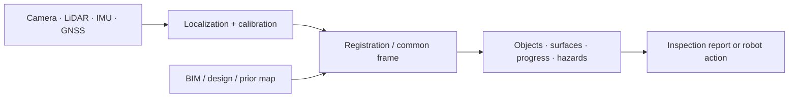

## English

Site perception answers three different questions: **Where is the robot? What exists
now? How does reality differ from the plan?** Treating them as one “vision” problem hides
the geometry and workflow assumptions.

> [!note] Prerequisites
> [[04-robotics/geometric-perception-calibration|Geometric Perception & Calibration]] ·
> [[04-robotics/state-estimation-slam|State Estimation & SLAM]] ·
> [[01-canonical-papers/notes/2-computer-vision/sam|SAM]] ·
> [[01-canonical-papers/notes/2-computer-vision/depth-anything|Depth Anything]]

### 1. The site-perception stack

The output may be a report for a manager or state for a robot. Only the latter closes a
physical-AI loop, and it imposes stricter latency, uncertainty, and failure requirements.

### 2. Four recurring problems

- **Robot localization and mapping**: SLAM/GNSS in dust, repetitive geometry, changing
  ground, and moving workers/equipment.
- **Scan-to-BIM / progress**: register point clouds or images to a design model, then
  infer installed, missing, or deviating components. Registration error can masquerade
  as construction deviation.
- **Inspection**: plan viewpoints, acquire coverage, detect defects, and attach findings
  to assets. A detection benchmark does not validate autonomous inspection.
- **Robot-ready scene understanding**: free space, traversability, materials, people,
  and task objects at the metric resolution and update rate needed downstream.

### 3. Geometry and foundation models

SAM supplies promptable masks, Depth Anything supplies monocular depth cues, and VGGT-
class models predict geometry. None automatically supplies a calibrated site coordinate,
metric scale, temporal consistency, safety certification, or BIM identity. A practical
system often combines learned proposals with geometric calibration, registration, and
tracking.

PointNet/PointNet++ are historical on-ramps for unordered point sets: PointNet aggregates
per-point features symmetrically; PointNet++ adds local hierarchical neighborhoods.
Modern sparse voxel and transformer models may outperform them, but these papers explain
why point clouds are not ordinary images.

### 4. Reading evaluation

Report localization/registration error in physical units, detection/segmentation quality,
coverage, inspection time, missed hazards/defects, and downstream task effect. Ask whether
train/test sites differ, whether ground truth came from the same BIM alignment being
evaluated, and whether the system ran online on the moving platform.

> [!warning] Reading the claim
> “Autonomous inspection” can mean autonomous navigation with offline human analysis, or
> automatic detection on manually collected data. Find which sensing, motion, analysis,
> and reporting steps were autonomous. “Scan-to-BIM accuracy” must separate sensor noise,
> calibration, registration, model tolerance, and true construction deviation.

### After reading

- Separate localization, state reconstruction, comparison-to-plan, and inspection.
- Explain why registration error can look like a construction defect.
- State what SAM/depth/foundation models add and what geometry still must supply.
- Judge whether a result closes a robot loop or only produces an offline report.

### Sources

- [Szeliski, *Computer Vision: Algorithms and Applications*](https://szeliski.org/Book/)
- [Tang et al., *Automatic Reconstruction of As-Built Building Information Models from Laser-Scanned Point Clouds*](https://doi.org/10.1016/j.autcon.2009.06.007)
- [PointNet](https://arxiv.org/abs/1612.00593) · [PointNet++](https://arxiv.org/abs/1706.02413)

## 한국어

현장 인식은 서로 다른 세 질문에 답한다: **로봇은 어디 있는가? 지금 무엇이 존재하는가?
현실은 계획과 어떻게 다른가?** 이를 하나의 “비전” 문제로 부르면 기하와 공정 가정이 숨는다.

> [!note] 선수지식
> [[04-robotics/geometric-perception-calibration|기하 인식과 보정]] ·
> [[04-robotics/state-estimation-slam|상태 추정과 SLAM]] ·
> [[01-canonical-papers/notes/2-computer-vision/sam|SAM]] ·
> [[01-canonical-papers/notes/2-computer-vision/depth-anything|Depth Anything]]

센서(카메라·LiDAR·IMU·GNSS) → 위치 추정·보정 → 공통 좌표계 정합 → 객체·표면·공정·
위험 상태 → 보고서 또는 로봇 행동의 흐름으로 읽는다. 관리자용 오프라인 보고서와 로봇
상태는 다르며, 후자는 지연·불확실성·실패 조건이 훨씬 엄격하다.

### 1. 네 가지 반복 문제

- **위치 추정·매핑**: 먼지, 반복 구조, 변하는 지면, 이동 작업자 속의 SLAM/GNSS.
- **Scan-to-BIM·공정**: 센서 자료를 설계 모델에 정합하고 설치·누락·편차를 추론한다. 정합
  오차가 시공 편차처럼 보일 수 있다.
- **점검**: 시점을 계획하고, 커버리지를 확보하고, 결함을 검출해 자산에 연결한다. 검출
  벤치마크만으로 자율 점검은 검증되지 않는다.
- **로봇용 장면 이해**: 하류 제어에 필요한 미터 단위 좌표·해상도·갱신률로 주행 가능성,
  재료, 사람, 작업 객체를 제공한다.

### 2. 기하와 파운데이션 모델

SAM은 promptable mask, Depth Anything은 단안 깊이 단서, VGGT 계열은 기하 예측을 준다.
그러나 보정된 현장 좌표, metric scale, 시간 일관성, 안전성, BIM 객체 ID를 자동 보장하지
않는다. 실제 시스템은 학습 제안과 기하 보정·정합·추적을 결합한다.

PointNet은 점별 특징을 대칭 집계하고, PointNet++는 국소 계층을 추가한다. 최신 sparse
voxel/transformer가 더 강할 수 있지만, 두 논문은 포인트 클라우드가 일반 이미지와 다른
이유를 이해하는 역사적 진입점이다.

### 3. 평가 읽기

위치·정합 오차를 물리 단위로, 검출·분할 품질, 커버리지, 점검 시간, 놓친 결함·위험,
하류 과제 영향을 함께 보라. 학습·시험 현장이 다른지, 평가 대상 BIM 정합으로 정답도
만들었는지, 이동 플랫폼에서 온라인으로 돌았는지 확인하라.

> [!warning] 주장 읽기
> “자율 점검”은 자율 주행+사람의 오프라인 분석일 수도, 사람이 모은 데이터의 자동 검출일
> 수도 있다. 센싱·이동·분석·보고 중 무엇이 자율인지 분해하라. Scan-to-BIM 정확도는 센서,
> 보정, 정합, 모델 공차, 실제 시공 편차를 구분해야 한다.

### 읽고 나면 말할 수 있어야 하는 것

- 위치 추정, 상태 복원, 계획 대비 비교, 점검을 구분한다.
- 정합 오차가 결함처럼 보이는 이유를 설명한다.
- 파운데이션 모델이 더하는 것과 기하가 여전히 공급할 것을 말한다.
- 결과가 로봇 루프를 닫는지 오프라인 보고서인지 판단한다.

### 출처

- [Szeliski, Computer Vision](https://szeliski.org/Book/)
- [Tang et al., scan-to-BIM review](https://doi.org/10.1016/j.autcon.2009.06.007)
- [PointNet](https://arxiv.org/abs/1612.00593) · [PointNet++](https://arxiv.org/abs/1706.02413)
