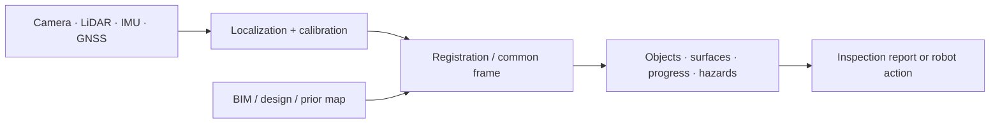
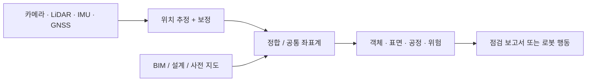

## English

Site perception answers three different questions: **Where is the robot? What exists
now? How does reality differ from the plan?** Treating them as one “vision” problem hides
the geometry and workflow assumptions.

> [!info] Depth target
> Read a site-perception paper and identify: which of the three questions it answers,
> what supplies the metric frame, whether the output is a report or robot state, where
> registration error could masquerade as construction deviation, and whether the system
> ran online on a moving platform. Building perception stacks is a working/mastery topic.

> [!note] Prerequisites
> [[05-construction-robotics/site-engineering|2.5 Site Robotics]] (S1 and its error budget, §2) ·
> [[04-robotics/geometric-perception-calibration|3.5 Geometric Perception & Calibration]] (§3 point clouds and frames, §4 registration and ICP, §5 calibration) ·
> [[04-robotics/sensor-models|3.2 Sensor Models & Noise]] (§1 the measurement model: bias versus noise) ·
> [[04-robotics/state-estimation-slam|3. State Estimation & SLAM]] (§2 estimate and covariance, §7.3 the information matrix) ·
> [[02-foundations/probability|3. Probability]] (§2: variances of independent errors add; §3: the normal distribution) ·
> [[02-foundations/lab-kernel|0.7 Lab Kernel]] for the Tier A lab. Follow: frames/rigid transforms →
> calibration → registration → uncertainty. Optional when a paper uses learned proposals/depth:
> [[01-canonical-papers/notes/2-computer-vision/sam|SAM]] · [[01-canonical-papers/notes/2-computer-vision/depth-anything|Depth Anything]].

> [!note] First pass · 처음이라면
> Read the Running object and look at the picture: S1's bracket hole as one scanner sees it from 10 m. Then §1 for what spacing and noise do to a single point (its worked example shows a 10 mm crack falling between LiDAR samples at 20 m), §2 for how edge points become a hole centre and a scan becomes a site coordinate, §4 for deciding a deviation against ±5 mm, and the Worked case after §4, which puts the numbers together. §3 and §5 are for reading papers: what learned models add, and where the stream is going.

### Running object · 이 페이지의 대상

**S1** from [[05-construction-robotics/site-engineering|2.5 Site Robotics as an Engineering System]], taken back to the moment before the robot moves: one scan of the wall where the panel will hang. S1's error budget gives the **map** term $1\,\mathrm{mm}$, the error allowed in where the target is in the site frame, and that is what this page's perception has to deliver. The target is each bracket's mounting hole, whose centre the panel's hole must meet. The same scan also answers a report's question, for which this page borrows S1's tolerance as the specification: is each hole within $\pm5\,\mathrm{mm}$ of where the BIM puts it? The borrowed number is a loose bound, a necessary condition only: a bracket further off than that could not take a panel placed at its design position even if every other link were perfect, and once the other links' errors are counted it would have to be closer still ([[05-construction-robotics/digital-twin-workflows|7]]'s Worked case).

| Symbol | Value | What it is |
|---|---:|---|
| map term | $1\,\mathrm{mm}$ | S1's allocation (2.5 §2), read here as a two-sigma bound per axis across the hole, so $\sigma\le0.5\,\mathrm{mm}$ |
| $D$ | $18\,\mathrm{mm}$ | the bracket hole's diameter, a clearance hole for a $16\,\mathrm{mm}$ fastener |
| $d$ | $10\,\mathrm{m}$ | one scanner station's range to the bracket plate, with the beam square to the plate |
| $\Delta\theta$ | $0.3\,\mathrm{mrad}$ ($0.0172^\circ$) | the angular step between neighbouring beams, horizontal and vertical |
| $\sigma_r$ | $1.0\,\mathrm{mm}$ | ranging noise, one sigma, along the beam |
| $\sigma_\theta$ | $0.05\,\mathrm{mrad}$ | angular noise, one sigma, in each angle |
| $n,\ \rho,\ \sigma_t$ | $4$ targets, $2.0\,\mathrm{m}$, $0.5\,\mathrm{mm}$ | registration targets surveyed in site control: their number, their RMS distance from their centroid, and the one-sigma error of each measured target centre per axis |
| $\ell$ | $2.0\,\mathrm{m}$ | the hole's distance from the targets' centroid, vertical: the targets sit around a point $2\,\mathrm{m}$ below the bracket, so a registration rotation moves the hole along the facade |

The scanner and target rows are this page's own frozen numbers, course numbers rather than a product's datasheet; S1's numbers are unchanged. Reading the map term as a two-sigma bound per axis is this page's choice, the statement 2.5 §2 says must be made, and it is the reading [[05-construction-robotics/construction-manipulation|9]] later applies to all five allocations. 2.5 §2 writes the map term as the first link of S1's chain, the design model tied to the site map. When the robot aims at the scanned hole, that link is this page's scan and registration; when it aims at the design position, it is the survey's tie between the BIM and the site plus the bracket's as-built offset. This page takes the tie as exact, and [[05-construction-robotics/digital-twin-workflows|7]] prices it.

*Scope: this page teaches how one scanner station samples S1's bracket, how many edge points fix a hole's centre, how a scan reaches the site frame, and how a measured deviation is decided against a tolerance. It does not teach registration and ICP themselves ([[04-robotics/geometric-perception-calibration|3.5 §4]]), sensor calibration ([[04-robotics/geometric-perception-calibration|3.5 §5]]), SLAM ([[04-robotics/state-estimation-slam|3. State Estimation §7]]) or the chain of frames from the BIM to the robot's tool ([[05-construction-robotics/digital-twin-workflows|7]]); it uses them.*

### The picture · 그림으로 먼저 보기

<svg viewBox="0 0 560 330" style="max-width:100%;height:auto" role="img" aria-label="Left: an 18 mm bracket hole on a 3 mm grid of scanner beams at 10 m, with 24 edge points between beams on the plate and beams through the hole, and the fitted centre with its 0.91 mm two-sigma circle. Right: the centre&#8217;s two-sigma error against station range, 0.74 mm at 5 m rising to 1.27 mm at 15 m and crossing the 1 mm map term at 11.4 m, with the fit alone and the 0.71 mm registration floor.">
<text x="20" y="22" font-size="12" fill="currentColor" font-weight="600">S1's bracket hole from 10 m (mm scale)</text>
<circle cx="68.2" cy="264.8" r="1.7" fill="currentColor" fill-opacity="0.55"/>
<circle cx="90.8" cy="264.8" r="1.7" fill="currentColor" fill-opacity="0.55"/>
<circle cx="113.2" cy="264.8" r="1.7" fill="currentColor" fill-opacity="0.55"/>
<circle cx="135.8" cy="264.8" r="1.7" fill="currentColor" fill-opacity="0.55"/>
<circle cx="158.2" cy="264.8" r="1.7" fill="currentColor" fill-opacity="0.55"/>
<circle cx="180.8" cy="264.8" r="1.7" fill="currentColor" fill-opacity="0.55"/>
<circle cx="203.2" cy="264.8" r="1.7" fill="currentColor" fill-opacity="0.55"/>
<circle cx="225.8" cy="264.8" r="1.7" fill="currentColor" fill-opacity="0.55"/>
<circle cx="248.2" cy="264.8" r="1.7" fill="currentColor" fill-opacity="0.55"/>
<circle cx="68.2" cy="242.2" r="1.7" fill="currentColor" fill-opacity="0.55"/>
<circle cx="90.8" cy="242.2" r="1.7" fill="currentColor" fill-opacity="0.55"/>
<circle cx="113.2" cy="242.2" r="1.7" fill="currentColor" fill-opacity="0.55"/>
<circle cx="135.8" cy="242.2" r="1.9" fill="none" stroke="currentColor" stroke-opacity="0.45"/>
<circle cx="158.2" cy="242.2" r="1.9" fill="none" stroke="currentColor" stroke-opacity="0.45"/>
<circle cx="180.8" cy="242.2" r="1.7" fill="currentColor" fill-opacity="0.55"/>
<circle cx="203.2" cy="242.2" r="1.7" fill="currentColor" fill-opacity="0.55"/>
<circle cx="225.8" cy="242.2" r="1.7" fill="currentColor" fill-opacity="0.55"/>
<circle cx="248.2" cy="242.2" r="1.7" fill="currentColor" fill-opacity="0.55"/>
<circle cx="68.2" cy="219.8" r="1.7" fill="currentColor" fill-opacity="0.55"/>
<circle cx="90.8" cy="219.8" r="1.7" fill="currentColor" fill-opacity="0.55"/>
<circle cx="113.2" cy="219.8" r="1.9" fill="none" stroke="currentColor" stroke-opacity="0.45"/>
<circle cx="135.8" cy="219.8" r="1.9" fill="none" stroke="currentColor" stroke-opacity="0.45"/>
<circle cx="158.2" cy="219.8" r="1.9" fill="none" stroke="currentColor" stroke-opacity="0.45"/>
<circle cx="180.8" cy="219.8" r="1.9" fill="none" stroke="currentColor" stroke-opacity="0.45"/>
<circle cx="203.2" cy="219.8" r="1.9" fill="none" stroke="currentColor" stroke-opacity="0.45"/>
<circle cx="225.8" cy="219.8" r="1.7" fill="currentColor" fill-opacity="0.55"/>
<circle cx="248.2" cy="219.8" r="1.7" fill="currentColor" fill-opacity="0.55"/>
<circle cx="68.2" cy="197.2" r="1.7" fill="currentColor" fill-opacity="0.55"/>
<circle cx="90.8" cy="197.2" r="1.9" fill="none" stroke="currentColor" stroke-opacity="0.45"/>
<circle cx="113.2" cy="197.2" r="1.9" fill="none" stroke="currentColor" stroke-opacity="0.45"/>
<circle cx="135.8" cy="197.2" r="1.9" fill="none" stroke="currentColor" stroke-opacity="0.45"/>
<circle cx="158.2" cy="197.2" r="1.9" fill="none" stroke="currentColor" stroke-opacity="0.45"/>
<circle cx="180.8" cy="197.2" r="1.9" fill="none" stroke="currentColor" stroke-opacity="0.45"/>
<circle cx="203.2" cy="197.2" r="1.9" fill="none" stroke="currentColor" stroke-opacity="0.45"/>
<circle cx="225.8" cy="197.2" r="1.7" fill="currentColor" fill-opacity="0.55"/>
<circle cx="248.2" cy="197.2" r="1.7" fill="currentColor" fill-opacity="0.55"/>
<circle cx="68.2" cy="174.8" r="1.7" fill="currentColor" fill-opacity="0.55"/>
<circle cx="90.8" cy="174.8" r="1.9" fill="none" stroke="currentColor" stroke-opacity="0.45"/>
<circle cx="113.2" cy="174.8" r="1.9" fill="none" stroke="currentColor" stroke-opacity="0.45"/>
<circle cx="135.8" cy="174.8" r="1.9" fill="none" stroke="currentColor" stroke-opacity="0.45"/>
<circle cx="158.2" cy="174.8" r="1.9" fill="none" stroke="currentColor" stroke-opacity="0.45"/>
<circle cx="180.8" cy="174.8" r="1.9" fill="none" stroke="currentColor" stroke-opacity="0.45"/>
<circle cx="203.2" cy="174.8" r="1.9" fill="none" stroke="currentColor" stroke-opacity="0.45"/>
<circle cx="225.8" cy="174.8" r="1.7" fill="currentColor" fill-opacity="0.55"/>
<circle cx="248.2" cy="174.8" r="1.7" fill="currentColor" fill-opacity="0.55"/>
<circle cx="68.2" cy="152.2" r="1.7" fill="currentColor" fill-opacity="0.55"/>
<circle cx="90.8" cy="152.2" r="1.9" fill="none" stroke="currentColor" stroke-opacity="0.45"/>
<circle cx="113.2" cy="152.2" r="1.9" fill="none" stroke="currentColor" stroke-opacity="0.45"/>
<circle cx="135.8" cy="152.2" r="1.9" fill="none" stroke="currentColor" stroke-opacity="0.45"/>
<circle cx="158.2" cy="152.2" r="1.9" fill="none" stroke="currentColor" stroke-opacity="0.45"/>
<circle cx="180.8" cy="152.2" r="1.9" fill="none" stroke="currentColor" stroke-opacity="0.45"/>
<circle cx="203.2" cy="152.2" r="1.9" fill="none" stroke="currentColor" stroke-opacity="0.45"/>
<circle cx="225.8" cy="152.2" r="1.7" fill="currentColor" fill-opacity="0.55"/>
<circle cx="248.2" cy="152.2" r="1.7" fill="currentColor" fill-opacity="0.55"/>
<circle cx="68.2" cy="129.8" r="1.7" fill="currentColor" fill-opacity="0.55"/>
<circle cx="90.8" cy="129.8" r="1.7" fill="currentColor" fill-opacity="0.55"/>
<circle cx="113.2" cy="129.8" r="1.9" fill="none" stroke="currentColor" stroke-opacity="0.45"/>
<circle cx="135.8" cy="129.8" r="1.9" fill="none" stroke="currentColor" stroke-opacity="0.45"/>
<circle cx="158.2" cy="129.8" r="1.9" fill="none" stroke="currentColor" stroke-opacity="0.45"/>
<circle cx="180.8" cy="129.8" r="1.9" fill="none" stroke="currentColor" stroke-opacity="0.45"/>
<circle cx="203.2" cy="129.8" r="1.7" fill="currentColor" fill-opacity="0.55"/>
<circle cx="225.8" cy="129.8" r="1.7" fill="currentColor" fill-opacity="0.55"/>
<circle cx="248.2" cy="129.8" r="1.7" fill="currentColor" fill-opacity="0.55"/>
<circle cx="68.2" cy="107.2" r="1.7" fill="currentColor" fill-opacity="0.55"/>
<circle cx="90.8" cy="107.2" r="1.7" fill="currentColor" fill-opacity="0.55"/>
<circle cx="113.2" cy="107.2" r="1.7" fill="currentColor" fill-opacity="0.55"/>
<circle cx="135.8" cy="107.2" r="1.7" fill="currentColor" fill-opacity="0.55"/>
<circle cx="158.2" cy="107.2" r="1.7" fill="currentColor" fill-opacity="0.55"/>
<circle cx="180.8" cy="107.2" r="1.7" fill="currentColor" fill-opacity="0.55"/>
<circle cx="203.2" cy="107.2" r="1.7" fill="currentColor" fill-opacity="0.55"/>
<circle cx="225.8" cy="107.2" r="1.7" fill="currentColor" fill-opacity="0.55"/>
<circle cx="248.2" cy="107.2" r="1.7" fill="currentColor" fill-opacity="0.55"/>
<circle cx="68.2" cy="84.8" r="1.7" fill="currentColor" fill-opacity="0.55"/>
<circle cx="90.8" cy="84.8" r="1.7" fill="currentColor" fill-opacity="0.55"/>
<circle cx="113.2" cy="84.8" r="1.7" fill="currentColor" fill-opacity="0.55"/>
<circle cx="135.8" cy="84.8" r="1.7" fill="currentColor" fill-opacity="0.55"/>
<circle cx="158.2" cy="84.8" r="1.7" fill="currentColor" fill-opacity="0.55"/>
<circle cx="180.8" cy="84.8" r="1.7" fill="currentColor" fill-opacity="0.55"/>
<circle cx="203.2" cy="84.8" r="1.7" fill="currentColor" fill-opacity="0.55"/>
<circle cx="225.8" cy="84.8" r="1.7" fill="currentColor" fill-opacity="0.55"/>
<circle cx="248.2" cy="84.8" r="1.7" fill="currentColor" fill-opacity="0.55"/>
<circle cx="150.0" cy="180.0" r="67.5" fill="none" stroke="currentColor" stroke-width="1.3"/>
<rect x="121.5" y="239.2" width="6" height="6" transform="rotate(45 124.5 242.2)" fill="currentColor"/>
<rect x="166.5" y="239.2" width="6" height="6" transform="rotate(45 169.5 242.2)" fill="currentColor"/>
<rect x="99.0" y="216.8" width="6" height="6" transform="rotate(45 102.0 219.8)" fill="currentColor"/>
<rect x="211.5" y="216.8" width="6" height="6" transform="rotate(45 214.5 219.8)" fill="currentColor"/>
<rect x="76.5" y="194.2" width="6" height="6" transform="rotate(45 79.5 197.2)" fill="currentColor"/>
<rect x="211.5" y="194.2" width="6" height="6" transform="rotate(45 214.5 197.2)" fill="currentColor"/>
<rect x="76.5" y="171.8" width="6" height="6" transform="rotate(45 79.5 174.8)" fill="currentColor"/>
<rect x="211.5" y="171.8" width="6" height="6" transform="rotate(45 214.5 174.8)" fill="currentColor"/>
<rect x="76.5" y="149.2" width="6" height="6" transform="rotate(45 79.5 152.2)" fill="currentColor"/>
<rect x="211.5" y="149.2" width="6" height="6" transform="rotate(45 214.5 152.2)" fill="currentColor"/>
<rect x="99.0" y="126.8" width="6" height="6" transform="rotate(45 102.0 129.8)" fill="currentColor"/>
<rect x="189.0" y="126.8" width="6" height="6" transform="rotate(45 192.0 129.8)" fill="currentColor"/>
<rect x="132.8" y="250.5" width="6" height="6" transform="rotate(45 135.8 253.5)" fill="currentColor"/>
<rect x="155.2" y="250.5" width="6" height="6" transform="rotate(45 158.2 253.5)" fill="currentColor"/>
<rect x="110.2" y="228.0" width="6" height="6" transform="rotate(45 113.2 231.0)" fill="currentColor"/>
<rect x="177.8" y="228.0" width="6" height="6" transform="rotate(45 180.8 231.0)" fill="currentColor"/>
<rect x="200.2" y="228.0" width="6" height="6" transform="rotate(45 203.2 231.0)" fill="currentColor"/>
<rect x="87.8" y="205.5" width="6" height="6" transform="rotate(45 90.8 208.5)" fill="currentColor"/>
<rect x="87.8" y="138.0" width="6" height="6" transform="rotate(45 90.8 141.0)" fill="currentColor"/>
<rect x="200.2" y="138.0" width="6" height="6" transform="rotate(45 203.2 141.0)" fill="currentColor"/>
<rect x="110.2" y="115.5" width="6" height="6" transform="rotate(45 113.2 118.5)" fill="currentColor"/>
<rect x="132.8" y="115.5" width="6" height="6" transform="rotate(45 135.8 118.5)" fill="currentColor"/>
<rect x="155.2" y="115.5" width="6" height="6" transform="rotate(45 158.2 118.5)" fill="currentColor"/>
<rect x="177.8" y="115.5" width="6" height="6" transform="rotate(45 180.8 118.5)" fill="currentColor"/>
<circle cx="149.2" cy="180.7" r="6.8" fill="currentColor" fill-opacity="0.18" stroke="currentColor" stroke-dasharray="2 2"/>
<line x1="145.2" y1="180.7" x2="153.2" y2="180.7" stroke="currentColor" stroke-width="1.2"/><line x1="149.2" y1="176.7" x2="149.2" y2="184.7" stroke="currentColor" stroke-width="1.2"/>
<line x1="225.8" y1="273.8" x2="248.2" y2="273.8" stroke="currentColor"/><line x1="225.8" y1="270.8" x2="225.8" y2="276.8" stroke="currentColor"/><line x1="248.2" y1="270.8" x2="248.2" y2="276.8" stroke="currentColor"/>
<text x="237.0" y="286.8" font-size="10.5" fill="currentColor" text-anchor="middle">3 mm spacing</text>
<line x1="82.5" y1="298" x2="217.5" y2="298" stroke="currentColor"/>
<line x1="82.5" y1="294" x2="82.5" y2="302" stroke="currentColor"/><line x1="217.5" y1="294" x2="217.5" y2="302" stroke="currentColor"/>
<text x="150.0" y="313" font-size="11" fill="currentColor" text-anchor="middle">18 mm hole</text>
<circle cx="26" cy="41" r="1.7" fill="currentColor" fill-opacity="0.55"/><text x="33" y="45" font-size="10.5" fill="currentColor">hit on the plate</text>
<circle cx="138" cy="41" r="1.9" fill="none" stroke="currentColor" stroke-opacity="0.45"/><text x="145" y="45" font-size="10.5" fill="currentColor">beam through the hole</text>
<rect x="23" y="55" width="6" height="6" transform="rotate(45 26 58)" fill="currentColor"/><text x="33" y="62" font-size="10.5" fill="currentColor">24 edge points</text>
<circle cx="138" cy="58" r="5" fill="currentColor" fill-opacity="0.18" stroke="currentColor" stroke-dasharray="2 2"/><text x="147" y="62" font-size="10.5" fill="currentColor">centre ±0.91 (2σ)</text>
<text x="320" y="22" font-size="12" fill="currentColor" font-weight="600">hole centre, two-sigma (mm)</text>
<line x1="330" y1="275" x2="540" y2="275" stroke="currentColor" stroke-opacity="0.6"/><line x1="330" y1="275" x2="330" y2="65" stroke="currentColor" stroke-opacity="0.6"/>
<line x1="330.0" y1="275" x2="330.0" y2="279" stroke="currentColor"/><text x="330.0" y="291" font-size="10.5" fill="currentColor" text-anchor="middle">4</text>
<line x1="365.0" y1="275" x2="365.0" y2="279" stroke="currentColor"/><text x="365.0" y="291" font-size="10.5" fill="currentColor" text-anchor="middle">6</text>
<line x1="400.0" y1="275" x2="400.0" y2="279" stroke="currentColor"/><text x="400.0" y="291" font-size="10.5" fill="currentColor" text-anchor="middle">8</text>
<line x1="435.0" y1="275" x2="435.0" y2="279" stroke="currentColor"/><text x="435.0" y="291" font-size="10.5" fill="currentColor" text-anchor="middle">10</text>
<line x1="470.0" y1="275" x2="470.0" y2="279" stroke="currentColor"/><text x="470.0" y="291" font-size="10.5" fill="currentColor" text-anchor="middle">12</text>
<line x1="505.0" y1="275" x2="505.0" y2="279" stroke="currentColor"/><text x="505.0" y="291" font-size="10.5" fill="currentColor" text-anchor="middle">14</text>
<line x1="540.0" y1="275" x2="540.0" y2="279" stroke="currentColor"/><text x="540.0" y="291" font-size="10.5" fill="currentColor" text-anchor="middle">16</text>
<line x1="326" y1="275.0" x2="330" y2="275.0" stroke="currentColor"/><text x="323" y="278.5" font-size="10.5" fill="currentColor" text-anchor="end">0</text>
<line x1="326" y1="223.8" x2="330" y2="223.8" stroke="currentColor"/><text x="323" y="227.2" font-size="10.5" fill="currentColor" text-anchor="end">0.4</text>
<line x1="326" y1="172.5" x2="330" y2="172.5" stroke="currentColor"/><text x="323" y="176.0" font-size="10.5" fill="currentColor" text-anchor="end">0.8</text>
<line x1="326" y1="121.3" x2="330" y2="121.3" stroke="currentColor"/><text x="323" y="124.8" font-size="10.5" fill="currentColor" text-anchor="end">1.2</text>
<line x1="326" y1="70.0" x2="330" y2="70.0" stroke="currentColor"/><text x="323" y="73.5" font-size="10.5" fill="currentColor" text-anchor="end">1.6</text>
<text x="435.0" y="306" font-size="11" fill="currentColor" text-anchor="middle">station range (m)</text>
<polyline points="330.0,182.5 333.5,182.2 337.0,181.9 340.5,181.5 344.0,181.1 347.5,180.7 351.0,180.3 354.5,179.8 358.0,179.2 361.5,178.7 365.0,178.1 368.5,177.5 372.0,176.8 375.5,176.1 379.0,175.4 382.5,174.6 386.0,173.8 389.5,172.9 393.0,172.0 396.5,171.1 400.0,170.1 403.5,169.1 407.0,168.0 410.5,166.9 414.0,165.7 417.5,164.6 421.0,163.3 424.5,162.1 428.0,160.8 431.5,159.4 435.0,158.0 438.5,156.6 442.0,155.2 445.5,153.7 449.0,152.1 452.5,150.5 456.0,148.9 459.5,147.3 463.0,145.6 466.5,143.9 470.0,142.1 473.5,140.3 477.0,138.5 480.5,136.6 484.0,134.7 487.5,132.8 491.0,130.8 494.5,128.8 498.0,126.8 501.5,124.7 505.0,122.6 508.5,120.5 512.0,118.3 515.5,116.1 519.0,113.9 522.5,111.7 526.0,109.4 529.5,107.1 533.0,104.8 536.5,102.4 540.0,100.0" fill="none" stroke="currentColor" stroke-width="1.8"/>
<polyline points="330.0,256.3 333.5,254.9 337.0,253.4 340.5,251.9 344.0,250.4 347.5,248.8 351.0,247.3 354.5,245.6 358.0,244.0 361.5,242.3 365.0,240.6 368.5,238.9 372.0,237.1 375.5,235.3 379.0,233.5 382.5,231.7 386.0,229.8 389.5,227.9 393.0,226.0 396.5,224.0 400.0,222.1 403.5,220.1 407.0,218.1 410.5,216.0 414.0,213.9 417.5,211.8 421.0,209.7 424.5,207.6 428.0,205.4 431.5,203.2 435.0,201.0 438.5,198.8 442.0,196.5 445.5,194.3 449.0,192.0 452.5,189.7 456.0,187.3 459.5,185.0 463.0,182.6 466.5,180.2 470.0,177.8 473.5,175.3 477.0,172.9 480.5,170.4 484.0,167.9 487.5,165.4 491.0,162.8 494.5,160.3 498.0,157.7 501.5,155.1 505.0,152.5 508.5,149.8 512.0,147.2 515.5,144.5 519.0,141.8 522.5,139.1 526.0,136.4 529.5,133.6 533.0,130.9 536.5,128.1 540.0,125.3" fill="none" stroke="currentColor" stroke-width="1.3" stroke-dasharray="5 3"/>
<line x1="330" y1="184.4" x2="540" y2="184.4" stroke="currentColor" stroke-dasharray="1.5 3" stroke-opacity="0.8"/>
<line x1="330" y1="146.9" x2="540" y2="146.9" stroke="currentColor" stroke-opacity="0.9"/>
<text x="334" y="141.9" font-size="10.5" fill="currentColor">map term 1 mm</text>
<line x1="342" y1="78" x2="364" y2="78" stroke="currentColor" stroke-width="1.8"/><text x="370" y="82" font-size="10.5" fill="currentColor">total</text>
<line x1="342" y1="95" x2="364" y2="95" stroke="currentColor" stroke-width="1.3" stroke-dasharray="5 3"/><text x="370" y="99" font-size="10.5" fill="currentColor">centre fit alone</text>
<line x1="342" y1="112" x2="364" y2="112" stroke="currentColor" stroke-dasharray="1.5 3"/><text x="370" y="116" font-size="10.5" fill="currentColor">registration alone, 0.71</text>
<circle cx="435.0" cy="158.0" r="3.2" fill="currentColor"/>
<text x="440.0" y="171.0" font-size="10.5" fill="currentColor">0.91</text>
<line x1="460.3" y1="146.9" x2="460.3" y2="275" stroke="currentColor" stroke-dasharray="3 3" stroke-opacity="0.8"/>
<text x="464.3" y="269" font-size="10.5" fill="currentColor">11.4 m</text>
</svg>

S1's bracket hole scanned from $10\,\mathrm{m}$. At a $3\,\mathrm{mm}$ spacing, $24$ edge points fall on the $18\,\mathrm{mm}$ hole, enough to fit its centre to $0.29\,\mathrm{mm}$ (one sigma); with the registration's $0.35\,\mathrm{mm}$ the centre is known to $0.91\,\mathrm{mm}$ at two sigma, just inside the $1\,\mathrm{mm}$ map term. On the right, range is the knob: the fit's error grows as range to the power $1.5$, and in the model the map term is lost beyond $11.4\,\mathrm{m}$.

### 1. The site-perception stack

BIM (Building Information Modeling) is the structured 3D design model of a building, in which each component is an object with an ID and properties; the [[05-construction-robotics/digital-twin-workflows|digital-twin workflows]] page treats it in depth.



The output may be a report for a manager or state for a robot. Only the latter closes a
physical-AI loop, and it imposes stricter latency, uncertainty, and failure requirements.

**The three questions, on S1.** *Where is the robot?* is S1's base term, $2\,\mathrm{mm}$, owned by localization ([[04-robotics/state-estimation-slam|3. State Estimation]]). *What exists now?* is the bracket hole's centre in the site frame, the $1\,\mathrm{mm}$ map term, and it is this page's job. *How does reality differ from the plan?* is the hole's deviation from its BIM position, decided against $\pm5\,\mathrm{mm}$ in §4. The first two are robot state and the third is a report, and one scan answers both, which is why the same numbers have to serve two readers. Before any of that, a scanner has to put points on the hole, and two properties of a scan decide what it can say: how far apart its points land, and how each point errs. The same two properties for the sensors a robot carries — a camera's pixel, a LiDAR's spots and rings, a radar's cell — are worked at S1's facade in [[04-robotics/perception-sensors-rigs|3.6 Perception Sensors §5–§7]].

> **Point spacing, defined.** The **point spacing** $s$ of a scan is a *length on the scanned surface*: the distance between the spots of two neighbouring beams. Three things set it, and a spacing quoted without all three is not yet a number. The scanner's **angular step** $\Delta\theta$, the angle between neighbouring beams; the **range** $d$ from the scanner to the surface; and the **incidence angle** $\alpha$ between the beam and the surface normal, which stretches the spacing in the direction the surface turns away from the beam (across that direction it stays $d\,\Delta\theta$).
>
> $$s=\frac{d\,\Delta\theta}{\cos\alpha}$$
>
> with $\Delta\theta$ in radians and small, since a small step sweeps an arc of length $d\,\Delta\theta$ across the beam and a surface turned by $\alpha$ needs $1/\cos\alpha$ more length to cover that arc.
>
> - **Example**: S1's station, $d=10\,\mathrm{m}$ and $\Delta\theta=0.3\,\mathrm{mrad}$, square to the plate: $s=10\,000\times0.0003=3.0\,\mathrm{mm}$. A station placed so that the plate is turned $60^\circ$ from the beam stretches it to $6.0\,\mathrm{mm}$ along the turn, the same cost as doubling the range.
> - **Non-example**: the spacing is not the scanner's resolution. Each return comes from a laser spot of finite width, and angular resolution is governed primarily by the sampling interval and the beam width together, so considering only one of them, usually the spacing, can misstate what the scan can resolve (Lichti & Jamtsho 2006). Two features closer than the spot can blur into one however fine the spacing.
> - **Why it matters**: the spacing fixes how many samples land on a feature. The $18\,\mathrm{mm}$ hole at $3\,\mathrm{mm}$ is crossed by about $D/s=6$ rows and $6$ columns of beams, each entering and leaving it once, so about $4D/s=24$ places where a beam on the plate sits next to a beam through the hole: $24$ edge points, which §2 turns into the centre's accuracy.

> **A scan point's error, defined.** A scanner measures each point in polar form, a **range** along the beam and **two angles** that aim it, so a point's error has a shape rather than one size. It is the measurement model of [[04-robotics/sensor-models|3.2 Sensor Models §1]] written for one point, with three defining conditions. The **ranging noise** $\sigma_r$ acts *along* the beam. The **angular noise** $\sigma_\theta$ of each angle acts *across* the beam, as a length that grows with range, $d\,\sigma_\theta$. And all three are zero-mean and independent, from point to point and of one another; whatever repeats from point to point, a rangefinder offset or a tilted axis, is a bias that calibration removes ([[04-robotics/geometric-perception-calibration|3.5 §5]]) and averaging does not.
>
> $$\Sigma_{\text{beam}}=\operatorname{diag}\big(\sigma_r^2,\ (d\,\sigma_\theta)^2,\ (d\,\sigma_\theta)^2\big)$$
>
> is the point's covariance in beam coordinates (along, across, across), because a range error slides the point along its beam while each angle error swings it sideways by the arc $d\,\sigma_\theta$.
>
> - **Example**: at S1's $10\,\mathrm{m}$ that is $1.0\,\mathrm{mm}$ along the beam and $10\,000\times0.00005=0.5\,\mathrm{mm}$ across it. The beam meets the plate square, so the range error moves points *out of* the plate and the across-beam error moves them *within* it. The plate itself, fitted as a plane through the roughly $370$ points of a $60\,\mathrm{mm}$ square around the hole, is placed to $\sigma_r/\sqrt{370}=0.05\,\mathrm{mm}$, while the hole's centre in the plate is set by the spacing and the angles (§2) and the range noise hardly touches it.
> - **Non-example**: the same scanner at a steep angle. With the plate turned $60^\circ$ from the beam, the range error gains an in-plate component $\sigma_r\sin60^\circ=0.87\,\mathrm{mm}$, and the range noise itself grows, because a surface turned away returns less light: for a surface that scatters diffusely (a Lambertian surface) the received power falls with $\cos\alpha$, and in the authors' reference-plate experiment the incidence angle dominated a point's precision above about $60^\circ$ (Soudarissanane et al. 2009). A single ranging-noise figure hides this dependence on the angle.
> - **Why it matters**: it says which specification limits which coordinate. For a feature on a surface facing the station, angular accuracy and spacing set the in-plane coordinates; the range noise sets the out-of-plane one, and everything seen obliquely.

> [!example] Worked example · 계산 예제
> **Distance changes what reaches the detector.** With a hypothetical LiDAR angular step of 0.1°, adjacent-ray spacing on a perpendicular surface at 20 m is 20 × tan(0.1°) ≈ **34.9 mm**. At 5 m it is about **8.7 mm**. A 10 mm crack can fall between samples at the longer distance.
>
> **The reading this gives you.** Detection accuracy needs a distance and sampling protocol. Closer spacing alone does not guarantee detection: beam footprint, angle of incidence, occlusion, and the crack's geometry also matter. If the sensor never sampled the defect, changing the classifier cannot reconstruct missing evidence. Report coverage alongside accuracy on the observations that actually arrived.

### 2. Four recurring problems

- **Robot localization and mapping**: SLAM/GNSS in dust, repetitive geometry, changing
  ground, and moving workers/equipment — on ground robots this runs on top of the
  wheeled-base kinematics and odometry drift of
  [[04-robotics/modern-robotics/ch13-wheeled-mobile-robots|MR ch.13]]. The canonical construction entry is
  [[01-canonical-papers/notes/8-construction/cho-slam|Cho SLAM 2018]] — a mobile robot
  that autonomously scans and registers site point clouds, a line that continued into
  UAV+UGV teams (2019) and adaptive view planning tested at a disaster site (JCCE 40(5), online June 2026).
- **Scan-to-BIM / progress**: register point clouds or images to a design model, then
  infer installed, missing, or deviating components. Registration error can masquerade
  as construction deviation.
- **Inspection**: plan viewpoints, acquire coverage, detect defects, and attach findings
  to assets (tracked building components, each with its own ID in the BIM or facility records). A detection benchmark does not validate autonomous inspection.
- **Robot-ready scene understanding**: free space, traversability, materials, people,
  and task objects at the metric resolution and update rate needed downstream.

On S1 the second and fourth problems are one computation in two steps. The scan must first turn a ring of edge points into a hole centre in the scanner's frame, and then carry that centre into the site frame, where both the robot and the BIM can use it.

> **The hole centre from its edge points, defined.** The **centre estimate** is the centre of the circle fitted by least squares to the points found on a hole's edge, and its **standard error** says how far that centre wanders from one scan to the next. Three conditions give the formula below. The $N$ edge points are spread **evenly around the whole edge**; each has an independent, zero-mean error **across the edge** with the same standard deviation $\sigma_e$; and the **radius is fitted too**, so an error shared by every point (a laser spot that nibbles the edge, or edge points taken as the last beam on the plate, which sit half a spacing outside the edge on average) moves the radius and leaves the centre alone.
>
> $$\sigma_c=\sigma_e\sqrt{2/N}$$
>
> per axis, because each point constrains the centre only along its own radius: a point at angle $\varphi$ carries information $\cos^2\varphi/\sigma_e^2$ about the $x$ coordinate, and for evenly spread points $\sum_i\cos^2\varphi_i=N/2$, so the variance is $\sigma_e^2/(N/2)$ (the information matrix of a least-squares fit, [[04-robotics/state-estimation-slam|3. State Estimation §7.3]]).
>
> - **Example**: at S1's $10\,\mathrm{m}$ an edge point's error across the edge has two parts. The edge lies somewhere between the last beam on the plate and the first beam through the hole, and taking the midpoint leaves an error uniform over one spacing along the row or column, $s/\sqrt{12}=0.87\,\mathrm{mm}$, of which only part crosses the edge; this page takes it whole. The angular noise adds $0.5\,\mathrm{mm}$. So $\sigma_e=\sqrt{0.75+0.25}=1.00\,\mathrm{mm}$, and with $N=24$, $\sigma_c=1.00\sqrt{2/24}=0.29\,\mathrm{mm}$.
> - **Non-example**: an arc. If the bracket's lip hides the far half of the edge, the $12$ points left all sit on one side, the centre and the radius can trade against each other along the arc's axis, and $\sigma_c$ on that axis becomes $0.94\,\mathrm{mm}$: more than three times $0.29$, from half as many points. Fixing the radius at its nominal $9\,\mathrm{mm}$ brings it back to about $0.4\,\mathrm{mm}$, but then any error in the assumed radius moves the centre along the arc by $1.27$ times that error.
> - **Why it matters**: it turns S1's map term into a point count. The centre may use only the share of the $0.5\,\mathrm{mm}$ that registration leaves (below), and the count follows from $N\ge2\sigma_e^2/\sigma_c^2$.

The formula takes the spacing's contribution whole and treats it as random, and neither is quite true. Only part of a row's error crosses the edge, which lowers the centre's error; and where the grid falls on the hole is one fixed offset per scan, so when a chord of the hole spans close to a whole number of spacings its two ends err together instead of averaging, which raises it. The Tier A lab finds that the two roughly cancel on average, with a ripple of up to about a fifth either side of the formula.

> **Registration error at a point, defined.** Registering a scan to the site frame fits one rigid transform to a few targets whose site coordinates were surveyed: the solve step of [[04-robotics/geometric-perception-calibration|3.5 §4]], here with known correspondences. The **registration error at a point** is the error that fitted transform leaves at a point *other than* the targets. In the plane of the facade it has two parts: the translation, known as well as the targets' average, and the rotation, whose error swings a point by its distance from the targets' centroid, the lever arm of [[04-robotics/geometric-perception-calibration|3.5 §3]]. Four conditions: $n$ targets with independent errors $\sigma_t$ per axis; correct correspondences; a small rotation error; and a point at distance $\ell$ from the centroid of targets whose RMS distance from that centroid is $\rho$.
>
> $$\sigma_\perp(\ell)=\frac{\sigma_t}{\sqrt n}\sqrt{1+\frac{\ell^2}{\rho^2}}$$
>
> across the lever arm, and $\sigma_t/\sqrt n$ along it, because the translation error is the average of $n$ target errors and the rotation's variance is $\sigma_t^2/(n\rho^2)$, which a lever of length $\ell$ turns into $\ell^2\sigma_t^2/(n\rho^2)$.
>
> - **Example**: S1's four targets at $\rho=2\,\mathrm{m}$ with $\sigma_t=0.5\,\mathrm{mm}$, and the hole at $\ell=2\,\mathrm{m}$: $\sigma_\perp=(0.5/2)\sqrt2=0.35\,\mathrm{mm}$ across the lever arm and $0.25\,\mathrm{mm}$ along it.
> - **Non-example**: the same four targets, still spread $2\,\mathrm{m}$ about their centroid, with the hole $10\,\mathrm{m}$ from that centroid: $0.25\sqrt{1+25}=1.27\,\mathrm{mm}$, more than the whole map term. Targets that are precise where they stand can be imprecise where the work is.
> - **Why it matters**: the rotation is where registration error hides, because a residual at the targets never shows it. Put the targets around the work, not beside it; S1's layout, with the hole as far from the centroid as the targets themselves, already pays a factor $\sqrt2$ for not doing so.

**Registering to the thing being checked.** A registration fitted to the bracket's own surfaces uses the bracket to decide where the scan is, so a bracket built out of place drags the scan with it. With $n$ equally weighted features of which one is off by $\delta$, a fit that solves for translation alone moves by $\delta/n$, and that feature's measured deviation is $\delta(1-1/n)$. Registered to the bracket alone, $n=1$, it reads $0$; to four features, $2.93\,\mathrm{mm}$ of a true $3.9$. A fit that also solves for rotation takes more of a deviation that lies across the feature's lever, leaving $\delta(1-1/n-\ell^2/\sum_i\ell_i^2)$, which is $1.95\,\mathrm{mm}$ of $3.9$ when the four sit at one distance from their centroid. And if every feature shares one offset, a slab edge built $4\,\mathrm{mm}$ out, the registration absorbs all of it. ICP against the BIM does this by construction unless the surfaces it matches are independent of the ones being checked, which is why S1's targets are surveyed in site control. Bosché (2010) registers the whole project model to a site scan before recovering each object's as-built pose; in the terms of these formulas, a registration spread over many objects dilutes any one object's pull to the order of $1/n$, which is small but not zero.

### 3. Geometry and foundation models

SAM supplies promptable masks, Depth Anything supplies monocular depth cues, and [[01-canonical-papers/notes/2-computer-vision/vggt|VGGT]]-class
models predict geometry. None automatically supplies a calibrated site coordinate,
metric scale, temporal consistency, safety certification, or BIM identity. A practical
system often combines learned proposals with geometric calibration, registration, and
tracking.

PointNet/PointNet++ are historical on-ramps for unordered point sets: PointNet aggregates
per-point features symmetrically (with an order-independent pooling), because a point cloud
lists its points in no meaningful order and shuffling them must not change the output; PointNet++ adds local hierarchical neighborhoods.
Modern sparse voxel and transformer models may outperform them, but these papers explain
why point clouds are not ordinary images.

The integration is necessary because a plausible shape and an actionable coordinate are different outputs. For example, a mask can identify a pipe in an image without locating its axis in the robot frame. **The reading this gives you.** Follow the prediction through metric calibration, registration, and uncertainty propagation to the actual task tolerance. A visually convincing model output is only one input to that chain.

**On S1, in numbers.** A learned model can find S1's hole; it cannot, by itself, place it. Run SAM on the scanner's own panoramic image, sampled at the same $0.3\,\mathrm{mrad}$ as the points, and a mask boundary that is off by one pixel is off by $3\,\mathrm{mm}$ at $10\,\mathrm{m}$, a full spacing: the mask is the right tool for *choosing* which points belong to the hole's edge, and the circle fit of §2 then does the measuring. A monocular depth network is further away still. Even a hypothetical $1\%$ depth error is $100\,\mathrm{mm}$ at $10\,\mathrm{m}$, a hundred times the map term, and a depth that is correct only up to scale fixes no metre at all until something metric, a target or a scan, supplies one. The permutation invariance PointNet builds in is also a property of the circle fit: the fit sums over its points, $\sum_i(\cdot)$, so shuffling them changes nothing, and that is one reason a classical fit and a learned point-set model can share a pipeline. The division of labour that survives the numbers is the one §1's figure implies: learned models propose and select, geometry measures, and the registration of §2 decides whether the measurement is in the frame the robot uses.

**What one wrong label costs.** The selection step has an error budget of its own. Suppose the mask calls one plate beam a hole beam: that edge point moves outward by a full spacing, $3\,\mathrm{mm}$, which is $3\sigma_e$. A least-squares fit spreads the error around the circle, but not evenly, because one point displaced by $\delta$ along its radius pulls the centre about $2\delta/N$ toward itself: $2\times3/24=0.25\,\mathrm{mm}$ for a geometric fit, and $0.36\,\mathrm{mm}$ for the algebraic fit the lab uses, which weights far points more. One label costs nearly a whole $\sigma_c$. Noise can hardly put a point there: the spacing's error never exceeds half a spacing, $1.5\,\mathrm{mm}$, so the angular noise would have to supply at least the other $1.5\,\mathrm{mm}$, three of its standard deviations, which it does for fewer than $0.14\%$ of points. The fit should gate such a point out and check it rather than average it in, the same test [[04-robotics/state-estimation-slam|3. State Estimation §8.5]] puts in front of a filter's update. A learned proposal does not remove the geometric check; it is what makes the check necessary.

### 4. Reading evaluation

Report localization/registration error in physical units, detection/segmentation quality,
coverage, inspection time, missed hazards/defects, and downstream task effect. Ask whether
train/test sites differ, whether ground truth came from the same BIM alignment being
evaluated, and whether the system ran online on the moving platform.

> [!warning] Reading the claim · 핵심 주장 읽는 법
> “Autonomous inspection” can mean autonomous navigation with offline human analysis, or
> automatic detection on manually collected data. Find which sensing, motion, analysis,
> and reporting steps were autonomous. “Scan-to-BIM accuracy” must separate sensor noise,
> calibration, registration, model tolerance, and true construction deviation.

Evaluation needs an independent reference because alignment can hide the error being measured. For example, checking detected anchor positions against the same model used to register the scan can reward agreement with the model rather than agreement with the built site. **The reading this gives you.** Identify which reference was independently measured, how unobserved regions enter the denominator, and whether the final robot action stayed within its required tolerance.

The warning's list of error sources has a precise use: every item in it belongs in the uncertainty of a measured deviation, and a deviation is only a finding once that uncertainty is attached to it and a rule decides what the number means.

> **Measured deviation and guarded acceptance, defined.** The **measured deviation** of a feature is its measured position minus its design position, both in one frame, $\hat\delta=\hat p-p_{\text{design}}$. It is not the as-built deviation $\delta$ but $\delta$ plus the measurement's error, whose standard uncertainty $u$ gathers every term between the sensor and that frame: noise, the fit, registration, calibration, and the tie that brings the design into the frame. A **decision rule** turns $\hat\delta$ into accept or not, and **guarded acceptance** accepts only inside the tolerance shrunk on each side by a **guard band**, the interval between a tolerance limit and its acceptance limit (JCGM 106:2012 §3.3.11 and §8.3.2). Its conditions: a tolerance $\pm T$; an uncertainty $u$ for this measurement, not for the scanner in general; and a guard band, commonly $w=U=2u$, the expanded uncertainty with coverage factor $2$, which JCGM 106 reports as the default rule of ISO 14253-1.
>
> $$\text{accept}\iff|\hat\delta|\le T-2u$$
>
> so that an accepted feature is out of tolerance only if its measurement erred by more than two standard uncertainties, which for a normal error has probability at most $2.3\%$ (JCGM 106's figure, $1-\Phi(2)$).
>
> - **Example**: S1's hole with $u=0.456\,\mathrm{mm}$ (the Worked case, which takes the BIM-to-site tie as exact; 7 adds it) and $T=5\,\mathrm{mm}$: accept when $|\hat\delta|\le4.09\,\mathrm{mm}$. A hole measured at $3.9\,\mathrm{mm}$ is accepted, and the probability that it is actually beyond $5\,\mathrm{mm}$ is $1-\Phi(1.1/0.456)=0.8\%$.
> - **Non-example**: comparing $\hat\delta$ with $\pm5\,\mathrm{mm}$ directly, with no guard band. A hole measured at $4.9\,\mathrm{mm}$ is then accepted, although with $u=0.456\,\mathrm{mm}$ it is out of tolerance with probability $1-\Phi(0.1/0.456)=41\%$. The other non-example is a small $u$ that is not independent: registered to the bracket itself, $\hat\delta$ reads zero and every hole passes (§2).
> - **Why it matters**: the rule says what $u$ has to be before a scan can decide anything. The measurement capability index $C_m=2T/(4u)$ (JCGM 106 §7.6) is $10/1.83=5.5$ for S1's scan, while a scan with $u=2.5\,\mathrm{mm}$ has $C_m=1$, two guard bands that between them fill the whole tolerance interval, and can accept nothing but a perfect reading.

### Worked case · 대상으로 한 번 끝까지

Five steps on S1's bracket hole, from one station at $10\,\mathrm{m}$ to a decision. These are course computations on the frozen scanner, not measurements of a real instrument; the lab in the problem set repeats them by simulation.

**Step 1 — spacing and edge points.** Square to the plate, $s=d\,\Delta\theta=10\,000\times0.0003=3.0\,\mathrm{mm}$ (§1). The $18\,\mathrm{mm}$ hole is crossed by about $D/s=6$ rows and $6$ columns of beams, each entering and leaving it, so $N=4D/s=4\times18/3=24$ edge points.

**Step 2 — each edge point's error.** Across the edge, the spacing contributes $s/\sqrt{12}=3/3.464=0.87\,\mathrm{mm}$ and the angular noise $d\,\sigma_\theta=10\,000\times0.00005=0.50\,\mathrm{mm}$, and independent errors add in variance ([[02-foundations/probability|3. Probability §2]]): $\sigma_e=\sqrt{0.75+0.25}=1.00\,\mathrm{mm}$. The ranging noise, $1.0\,\mathrm{mm}$ along the beam, points out of the plate; averaged over about $370$ plate points it places the plate to $0.05\,\mathrm{mm}$ and leaves the centre in the plate alone.

**Step 3 — the centre.** $\sigma_c=\sigma_e\sqrt{2/N}=1.00\times\sqrt{2/24}=0.29\,\mathrm{mm}$ per axis (§2).

**Step 4 — into the site frame, against the map term.** Registration adds $\sigma_\perp=(0.5/\sqrt4)\sqrt{1+2^2/2^2}=0.35\,\mathrm{mm}$ across the lever arm, which here is along the facade, the axis of Step 5's deviation and of the drift in 7; the vertical axis is better, $0.25\,\mathrm{mm}$, and this case quotes the worse for both. Variances add, $\sigma^2=\sigma_c^2+\sigma_\perp^2=2/24+0.125=0.208\,\mathrm{mm^2}$, so $\sigma=0.456\,\mathrm{mm}$ and the two-sigma error is $0.91\,\mathrm{mm}$: inside the $1\,\mathrm{mm}$ map term, with $0.09\,\mathrm{mm}$ to spare. Read backwards, registration takes $0.125\,\mathrm{mm^2}$ of the $0.25\,\mathrm{mm^2}$ the map term allows, the centre may take the other $0.125$, so $\sigma_c\le0.354\,\mathrm{mm}$ and $N\ge2\times1.00^2/0.125=16$ edge points. The scan delivers $24$. The margin shrinks with range, because $\sigma_e$ grows in proportion to $d$ while $N$ falls as $1/d$, so $\sigma_c\propto d^{1.5}$: the map term holds while $0.29\,(d/10)^{1.5}\le0.354$, that is out to $d=11.4\,\mathrm{m}$ in the model; in the lab the first simulated failure comes at $11.5\,\mathrm{m}$, and beyond it the verdict flips with range.

**Step 5 — the deviation check.** The scan finds hole A $3.9\,\mathrm{mm}$ from its BIM position along the facade and $1.2\,\mathrm{mm}$ below it. With $u=0.456\,\mathrm{mm}$ the guard band is $2u=0.91\,\mathrm{mm}$ and the acceptance limit $5-0.91=4.09\,\mathrm{mm}$ (§4): both components are accepted, and the probability that hole A lies beyond $5\,\mathrm{mm}$ along the facade is $1-\Phi\big((5-3.9)/0.456\big)=1-\Phi(2.41)=0.8\%$. That acceptance takes the BIM-to-site tie as exact. [[05-construction-robotics/digital-twin-workflows|7]]'s Worked case adds the tie's own error and finds that it no longer holds.

**What moves if the station moves.** At $12\,\mathrm{m}$: $s=3.6\,\mathrm{mm}$, $N=20$, $\sigma_e=1.2\,\mathrm{mm}$, $\sigma_c=0.38\,\mathrm{mm}$, and the two-sigma error is $1.04\,\mathrm{mm}$, so two metres further back the map term is gone. At $5\,\mathrm{m}$ it is $0.74\,\mathrm{mm}$, against $0.71\,\mathrm{mm}$ from registration alone: past a point, standing closer buys nothing and only better targets help. And the robot's two readers get two different things from the same scan. The robot takes the measured centre as its target, carrying $0.91\,\mathrm{mm}$ of its $1\,\mathrm{mm}$ map term; the report takes the deviation, $3.9\,\mathrm{mm}$ from the design, accepted with its guard band. Neither number substitutes for the other.

### 5. Where this stream is moving (2019–2025)

Counted as in [[05-construction-robotics/lineage|lineage §6]], perception, inspection, localization and navigation is now the second-largest stream, narrowly behind human–robot collaboration: from $16$ robot papers in 2019–2021 to $61$ in 2023–2025, from $13\%$ to $24\%$ of construction robot papers. Three shifts carry it. Robots became mobile scanners: robot-assisted scanning and point-cloud segmentation of building interiors (Hu et al., *AutCon* 152, 2023, [DOI](https://doi.org/10.1016/j.autcon.2023.104949)) and a crack-recognition robot that is the stream's most-cited paper (Hu et al., *AutCon* 159, 2024, [DOI](https://doi.org/10.1016/j.autcon.2023.105262)). Quadrupeds arrived as BIM-guided scanning platforms (Park et al., *AutCon* 152, 2023, [DOI](https://doi.org/10.1016/j.autcon.2023.104911); Chen et al., *AutCon* 170, 2025, [DOI](https://doi.org/10.1016/j.autcon.2024.105930)). And the stream acquired shared data and a map of itself: the ConSLAM dataset (Trzeciak et al., *J. Computing in Civil Engineering* 37, 2023, [DOI](https://doi.org/10.1061/jccee5.cpeng-5212)) and the SLAM review of Yarovoi and Cho (*AutCon* 162, 2024, [DOI](https://doi.org/10.1016/j.autcon.2024.105344)).

### After reading

- Separate localization, state reconstruction, comparison-to-plan, and inspection.
- Explain why registration error can look like a construction defect.
- State what SAM/depth/foundation models add and what geometry still must supply.
- Judge whether a result closes a robot loop or only produces an offline report.
- Compute a scan's point spacing and edge-point count on a named feature, and say which scanner specification limits which coordinate.
- Turn a map-term allocation into a required number of edge points and a maximum station range.
- Decide a measured deviation against a tolerance with a guard band, and name the independent reference it rests on.

### Self-check

1. A progress-monitoring paper reports 4 cm mean deviation between scans and BIM. Name
   the error sources that must be separated before calling this construction deviation.
2. What distinguishes perception output that feeds a manager's report from perception
   output that feeds a robot, and why does only the latter close a physical-AI loop?
3. SAM segments a rebar cage (steel reinforcing bars tied into a grid before concrete is poured) perfectly in an image. What does the downstream robot still
   lack before it can act on that mask?
4. In Cho SLAM 2018, what makes the mapping "robotic" rather than a scan-processing
   pipeline, and what would you check before crediting it as autonomous inspection?
5. With the station square to S1's bracket, why does the $1\,\mathrm{mm}$ ranging noise hardly move the hole's centre, and what would make it matter?
6. A scan-to-BIM paper finds every bracket within tolerance after registering the scan to the brackets with ICP. Why does that result say little, in numbers?

> [!tip]- Answers
> 1. Sensor noise, extrinsic/intrinsic calibration error, registration (alignment) error between cloud and model, BIM modeling tolerance, and only then true as-built deviation. Registration error in particular can systematically masquerade as construction error.
> 2. A report is offline, human-interpreted, and tolerant of latency and gaps; robot state must arrive at the metric resolution, update rate, latency, and reliability the downstream planner/controller needs, with quantified uncertainty and defined failure behavior. Only the robot path feeds action back into the physical world.
> 3. A calibrated site coordinate and metric scale for the mask, temporal consistency across frames, association with a BIM/asset identity, and a safety-rated treatment of uncertainty — a mask is image-space evidence, not actionable state.
> 4. The robot plans and executes its own scanning motion and registers the clouds it collects — sensing and motion are autonomous, closing the acquisition loop. Before calling it autonomous inspection, check whether analysis (defect/deviation detection) and reporting were also autonomous or done offline by humans.
> 5. Square to the plate, the range error slides each point along its beam, which is out of the plate, while the centre lies in the plate and is set by the spacing and the angles (§1, §2); the range noise instead fixes the plate's depth, averaged over hundreds of points to $0.05\,\mathrm{mm}$. It starts to matter obliquely: at $60^\circ$ incidence it has an in-plate component $\sigma_r\sin60^\circ=0.87\,\mathrm{mm}$ per point, and the noise itself grows as the returned power falls, with $\cos\alpha$ on a diffuse surface.
> 6. A registration fitted to the features being checked moves with them: one feature among $n$ keeps only $\delta(1-1/n)$ of its deviation, and less once rotation is fitted, a bracket registered to itself reads $0$, and an offset shared by every feature is absorbed completely. The result would need an independent reference, targets surveyed in site control, before a small deviation meant a well-built bracket.

### Problem set · 과제

Tier A. S1's bracket hole with this page's frozen scanner, [[05-construction-robotics/site-engineering|2.5]] for S1 and [[04-robotics/geometric-perception-calibration|3.5]] behind the registration. The lab simulates the scan with numpy; there is no simulator.

1. **Draw.** The picture for a station at $15\,\mathrm{m}$: the $4.5\,\mathrm{mm}$ grid of beams on the $18\,\mathrm{mm}$ hole with its edge points, the fitted centre with its two-sigma circle, and on the right the station's point on the total curve against the map term.
2. **Derive.** (a) At $15\,\mathrm{m}$: $s$, $N$, $\sigma_e$, $\sigma_c$ and the two-sigma error in the site frame. Does the scan meet the map term? (b) Back at $10\,\mathrm{m}$, the targets' error doubles to $\sigma_t=1.0\,\mathrm{mm}$. Find $\sigma_\perp$, and the station range that meets the map term, or show that none does; then the number of targets, at the same spread, that restores $\sigma_\perp=0.35\,\mathrm{mm}$. (c) Hole B measures $4.6\,\mathrm{mm}$ from its BIM position. Is it accepted, how likely is it to be out of tolerance, and what $u$ would accept it? (d) A crack is reliably detected only if at least three LiDAR samples fall across it: the largest range at which a $10\,\mathrm{mm}$ crack gets three samples at $0.1^\circ$; the same at $0.05^\circ$; and the sample spacing at $5\,\mathrm{m}$ when the surface is turned $60^\circ$ from facing the scanner.
3. **Do.** Fill the `?` so that the script simulates the scan of S1's hole, fits its centre, and reproduces Steps 1–4 at every range of the sweep, then fits the half-hidden edge. Read the output: where do the simulated centre errors depart from the model's, by how much, and why? Where does the map term fail in simulation, against the model's $11.4\,\mathrm{m}$? What does hiding half the edge cost?

```python
import numpy as np
D, dth, sth = 18.0, 0.3e-3, 0.05e-3          # hole diameter (mm); angular step and angular noise (rad)
st, nt, rho, ell = 0.5, 4, 2.0, 2.0           # target error (mm), number of targets, their spread and the hole's distance (m)
rng = np.random.default_rng(5)

def edge_points(s, noise, half=False):
    u, v = rng.uniform(0.0, s, 2)             # where the scan grid happens to fall on the hole
    k = np.arange(-int(D/s) - 2, int(D/s) + 3)
    X, Y = np.meshgrid(k*s + u, k*s + v)
    inside = ?                                # beams that pass through the hole
    rows = inside[:, 1:] != inside[:, :-1]    # plate-to-hole transitions along a row
    cols = inside[1:, :] != inside[:-1, :]    # ... and along a column
    P = np.vstack((np.column_stack(((X[:, 1:] + X[:, :-1])[rows]/2, Y[:, 1:][rows])),
                   np.column_stack((X[1:, :][cols], (Y[1:, :] + Y[:-1, :])[cols]/2))))
    if half:
        P = P[P[:, 0] > 0]                    # the far half of the edge hidden
    return P + rng.normal(0.0, noise, P.shape)

def fit_centre(P):                            # algebraic circle fit: x^2 + y^2 + a x + b y + c = 0
    A = np.column_stack((P[:, 0], P[:, 1], np.ones(len(P))))
    a, b, c = np.linalg.lstsq(A, -(P**2).sum(axis=1), rcond=None)[0]
    return -a/2, -b/2

sig_reg = ?                                   # registration error at the hole, across the lever arm (mm)
def model_sigma(s, noise):                    # sigma_e * sqrt(2/N), with N = 4D/s
    return ?
def total2(sim):                              # two-sigma of the centre in the site frame
    return ?

print("registration at the hole (mm):", round(float(sig_reg), 3))
print(" d(m)  s(mm)    N  model    sim  2sig_tot  map term")
for d in (5.0, 8.0, 10.0, 11.0, 12.0, 15.0):
    s, noise = d*1000*dth, d*1000*sth         # spacing and cross-beam noise at this range (mm)
    runs = [edge_points(s, noise) for _ in range(3000)]
    C = np.array([fit_centre(P) for P in runs])
    N = np.mean([len(P) for P in runs])
    model, sim = model_sigma(s, noise), float(C.std(axis=0).max())
    tot2 = total2(sim)
    print(f"{d:5.0f} {s:6.2f} {N:5.1f} {model:6.3f} {sim:6.3f} {tot2:8.3f}  {'meets' if tot2 <= 1.0 else 'fails'}")
ratios, fails = [], []
for d in np.arange(8.0, 13.01, 0.25):         # the same loop, finer, to see the ripple
    s, noise = d*1000*dth, d*1000*sth
    sim = float(np.array([fit_centre(edge_points(s, noise)) for _ in range(3000)]).std(axis=0).max())
    ratios.append(sim/model_sigma(s, noise))
    if total2(sim) > 1.0:
        fails.append(float(d))
print("fine sweep 8-13 m: sim/model from", round(min(ratios), 2), "to", round(max(ratios), 2),
      "mean", round(float(np.mean(ratios)), 2), "; map term fails at", fails)
C = np.array([fit_centre(edge_points(3.0, 0.5, half=True)) for _ in range(3000)])
print("half edge at 10 m, sigma per axis (mm):", C.std(axis=0).round(3))
```

4. **Interpret.** (a) Tang, Huber and Akinci (2011) report that laser scanning can detect surface flatness defects as small as $3\,\mathrm{cm}$ across and $1\,\mathrm{mm}$ thick from a distance of $20\,\mathrm{m}$. What does this support about S1's hole centre from a station at $10\,\mathrm{m}$, and what does it not? (b) A crack-detection paper reports $95\%$ recall on images taken at $2\,\mathrm{m}$. What does that support for a scanner mounted $20\,\mathrm{m}$ from the wall?

> [!note]- How to draw it · 그리는 법
> - **Left, the hole to scale in millimetres**: an $18\,\mathrm{mm}$ circle on a square grid of beams $4.5\,\mathrm{mm}$ apart, filled dots on the plate and open dots through the hole. The hole spans only four spacings, so about $4\times18/4.5=16$ edge points sit between a filled and an open dot.
> - **The fitted centre with a two-sigma circle of $1.27\,\mathrm{mm}$**, visibly larger than the picture's $0.91$ and larger than the $1\,\mathrm{mm}$ the map term allows.
> - **Right, the same axes as the picture**: the total curve, the fit-alone curve and the $0.71\,\mathrm{mm}$ registration floor, the $1\,\mathrm{mm}$ map-term line, and the station's point at $(15\,\mathrm{m},\ 1.27\,\mathrm{mm})$, above the line and to the right of the $11.4\,\mathrm{m}$ crossing.
> - **Write under the left panel what failed**: the spacing grew by half, the edge points fell by a third, and the centre's error grew by $1.5^{1.5}=1.84$.
> - The drawing is wrong if the grid still shows six beams across the hole: at $4.5\,\mathrm{mm}$ an $18\,\mathrm{mm}$ hole holds four.

> [!tip]- Solutions
> 1. As in the How-to-draw list: $s=4.5\,\mathrm{mm}$, about $16$ edge points, $\sigma_c=0.53\,\mathrm{mm}$, and a two-sigma error of $1.27\,\mathrm{mm}$ at $15\,\mathrm{m}$, above the map term.
> 2. (a) $s=15\,000\times0.0003=4.5\,\mathrm{mm}$ and $N=4\times18/4.5=16$. The angular noise is $15\,000\times0.00005=0.75\,\mathrm{mm}$, so $\sigma_e=\sqrt{4.5^2/12+0.75^2}=\sqrt{1.6875+0.5625}=1.50\,\mathrm{mm}$ and $\sigma_c=1.50\sqrt{2/16}=0.53\,\mathrm{mm}$. In the site frame $\sigma=\sqrt{0.53^2+0.354^2}=0.64\,\mathrm{mm}$, two sigma $1.27\,\mathrm{mm}$: the map term is not met. (b) $\sigma_\perp=(1.0/2)\sqrt2=0.71\,\mathrm{mm}$, already above the $0.5\,\mathrm{mm}$ the map term allows per axis before the fit adds anything, and moving the station changes only $\sigma_c$, which can only add: no range meets it. Restoring $0.35\,\mathrm{mm}$ needs $\sigma_t/\sqrt n=0.25\,\mathrm{mm}$, so $\sqrt n=4$ and $n=16$ targets at the same spread. Spreading four targets wider cannot do it alone: even with the hole at their centroid, $\sigma_t/\sqrt n=0.5\,\mathrm{mm}$ uses the whole map term. (c) $4.6>4.09\,\mathrm{mm}$, so hole B is not accepted, and the probability that it is out of tolerance is $1-\Phi(0.4/0.456)=1-\Phi(0.88)=19\%$. Accepting $4.6\,\mathrm{mm}$ needs $5-2u\ge4.6$, so $u\le0.20\,\mathrm{mm}$, and neither knob gets there alone. The fit alone is $0.29\,\mathrm{mm}$ at $10\,\mathrm{m}$, so even with perfect registration the station must come within $10\,(0.20/0.289)^{2/3}=7.8\,\mathrm{m}$; and four targets with $\sigma_t=0.5\,\mathrm{mm}$ cannot get below $\sigma_t/\sqrt n=0.25\,\mathrm{mm}$ however they are spread. Both must move: at $5\,\mathrm{m}$ ($\sigma_c=0.10\,\mathrm{mm}$) registration may take $\sqrt{0.04-0.0104}=0.17\,\mathrm{mm}$, which needs $n\ge17$ targets at the same spread. (d) Three samples on $10\,\mathrm{mm}$ need a spacing of at most $10/3=3.33\,\mathrm{mm}$, so $d\le0.00333/\tan0.1^\circ=1.91\,\mathrm{m}$; at $0.05^\circ$ the range doubles to $3.82\,\mathrm{m}$; and turning the surface $60^\circ$ multiplies the spacing by $1/\cos60^\circ=2$, so $8.73\times2=17.5\,\mathrm{mm}$ at $5\,\mathrm{m}$: obliquity costs as much as doubling the distance.
> 3. The blanks are `X**2 + Y**2 < (D/2)**2`, `st/np.sqrt(nt)*np.sqrt(1 + ell**2/rho**2)`, `np.sqrt(s*s/12 + noise**2)*np.sqrt(2/(4*D/s))` and `2*np.sqrt(sim**2 + sig_reg**2)`. The filled script:
>
> ```python
> import numpy as np
> D, dth, sth = 18.0, 0.3e-3, 0.05e-3          # hole diameter (mm); angular step and angular noise (rad)
> st, nt, rho, ell = 0.5, 4, 2.0, 2.0           # target error (mm), number of targets, their spread and the hole's distance (m)
> rng = np.random.default_rng(5)
>
> def edge_points(s, noise, half=False):
>     u, v = rng.uniform(0.0, s, 2)             # where the scan grid happens to fall on the hole
>     k = np.arange(-int(D/s) - 2, int(D/s) + 3)
>     X, Y = np.meshgrid(k*s + u, k*s + v)
>     inside = X**2 + Y**2 < (D/2)**2           # beams that pass through the hole
>     rows = inside[:, 1:] != inside[:, :-1]    # plate-to-hole transitions along a row
>     cols = inside[1:, :] != inside[:-1, :]    # ... and along a column
>     P = np.vstack((np.column_stack(((X[:, 1:] + X[:, :-1])[rows]/2, Y[:, 1:][rows])),
>                    np.column_stack((X[1:, :][cols], (Y[1:, :] + Y[:-1, :])[cols]/2))))
>     if half:
>         P = P[P[:, 0] > 0]                    # the far half of the edge hidden
>     return P + rng.normal(0.0, noise, P.shape)
>
> def fit_centre(P):                            # algebraic circle fit: x^2 + y^2 + a x + b y + c = 0
>     A = np.column_stack((P[:, 0], P[:, 1], np.ones(len(P))))
>     a, b, c = np.linalg.lstsq(A, -(P**2).sum(axis=1), rcond=None)[0]
>     return -a/2, -b/2
>
> sig_reg = st/np.sqrt(nt)*np.sqrt(1 + ell**2/rho**2)
> def model_sigma(s, noise):                    # sigma_e * sqrt(2/N), with N = 4D/s
>     return np.sqrt(s*s/12 + noise**2)*np.sqrt(2/(4*D/s))
> def total2(sim):                              # two-sigma of the centre in the site frame
>     return 2*np.sqrt(sim**2 + sig_reg**2)
>
> print("registration at the hole (mm):", round(float(sig_reg), 3))
> print(" d(m)  s(mm)    N  model    sim  2sig_tot  map term")
> for d in (5.0, 8.0, 10.0, 11.0, 12.0, 15.0):
>     s, noise = d*1000*dth, d*1000*sth         # spacing and cross-beam noise at this range (mm)
>     runs = [edge_points(s, noise) for _ in range(3000)]
>     C = np.array([fit_centre(P) for P in runs])
>     N = np.mean([len(P) for P in runs])
>     model, sim = model_sigma(s, noise), float(C.std(axis=0).max())
>     tot2 = total2(sim)
>     print(f"{d:5.0f} {s:6.2f} {N:5.1f} {model:6.3f} {sim:6.3f} {tot2:8.3f}  {'meets' if tot2 <= 1.0 else 'fails'}")
> ratios, fails = [], []
> for d in np.arange(8.0, 13.01, 0.25):         # the same loop, finer, to see the ripple
>     s, noise = d*1000*dth, d*1000*sth
>     sim = float(np.array([fit_centre(edge_points(s, noise)) for _ in range(3000)]).std(axis=0).max())
>     ratios.append(sim/model_sigma(s, noise))
>     if total2(sim) > 1.0:
>         fails.append(float(d))
> print("fine sweep 8-13 m: sim/model from", round(min(ratios), 2), "to", round(max(ratios), 2),
>       "mean", round(float(np.mean(ratios)), 2), "; map term fails at", fails)
> C = np.array([fit_centre(edge_points(3.0, 0.5, half=True)) for _ in range(3000)])
> print("half edge at 10 m, sigma per axis (mm):", C.std(axis=0).round(3))
> ```
>
> It prints the registration term `0.354` and this table, then the finer sweep and the half edge:
>
> ```text
>  d(m)  s(mm)    N  model    sim  2sig_tot  map term
>     5   1.50  48.0  0.102  0.100    0.735  meets
>     8   2.40  30.0  0.207  0.181    0.794  meets
>    10   3.00  23.9  0.289  0.307    0.937  meets
>    11   3.30  21.7  0.333  0.317    0.949  meets
>    12   3.60  19.9  0.379  0.442    1.132  fails
>    15   4.50  15.8  0.530  0.545    1.299  fails
> fine sweep 8-13 m: sim/model from 0.81 to 1.22 mean 1.0 ; map term fails at [11.5, 11.75, 12.0, 12.25, 13.0]
> half edge at 10 m, sigma per axis (mm): [0.898 0.409]
> ```
>
> The edge-point count matches $4D/s$ at every range, and in the table the simulated centre error departs from the model by $-13\%$ at $8\,\mathrm{m}$ to $+17\%$ at $12\,\mathrm{m}$. That is not sampling noise in the simulation, since three thousand scans pin each value to about $1.3\%$. Two things are at work, as §2 says: only part of a row's error crosses the edge, which lowers the error, and the grid's fixed pattern raises it where a chord of the hole spans close to a whole number of spacings, whose two ends then err together. On average they cancel, and the finer sweep's mean ratio is $1.0$; but the second is not monotone in range, and the ratio swings from $0.81$ to $1.22$. So the simulated map term holds everywhere from $8$ to $11.25\,\mathrm{m}$, fails first at $11.5\,\mathrm{m}$, just past the model's $11.4\,\mathrm{m}$, and beyond that its verdict flips with range: it fails to $12.25\,\mathrm{m}$, holds at $12.5$ and $12.75\,\mathrm{m}$, and fails at $13\,\mathrm{m}$. Entries within a standard error of $1\,\mathrm{mm}$, such as $11.25$ and $12.25\,\mathrm{m}$, could flip with the random seed. Hiding half the edge raises the error on the arc's axis to $0.90\,\mathrm{mm}$, against the $0.94$ the information matrix predicts, while the other axis rises only from about $0.31$ to $0.41$: half the points, three times the error on one axis.
> 4. (a) A flatness defect $1\,\mathrm{mm}$ thick is a deviation *perpendicular* to the surface, spread over a $3\,\mathrm{cm}$ patch, which every point on the patch measures along its beam: the direction in which §1's plane fit shows range noise averaging down. S1's hole centre is an *in-plane* position set by the spacing and the angles, fixed by a fit to edge points rather than detected over a patch. So the claim supports that millimetre out-of-plane deviations are detectable at twice S1's range; it does not tell you how well an $18\,\mathrm{mm}$ hole's centre can be located in the plane, which is a different axis, a different estimator and a different decision (locate, not detect). (b) Nothing directly: a sensor with the same angular step samples ten times farther apart at $20\,\mathrm{m}$ than at $2\,\mathrm{m}$, and a $10\,\mathrm{mm}$ crack may not be sampled at all, so recall measured at $2\,\mathrm{m}$ is a statement about a different input. The paper would need recall as a function of range and incidence angle, or a resolution argument like the one in §1.

### Sources

- [Szeliski, *Computer Vision: Algorithms and Applications*](https://szeliski.org/Book/)
- [Tang et al., *Automatic reconstruction of as-built building information models from laser-scanned point clouds: A review of related techniques*](https://doi.org/10.1016/j.autcon.2010.06.007)
- [PointNet](https://arxiv.org/abs/1612.00593) · [PointNet++](https://arxiv.org/abs/1706.02413)
- D. D. Lichti, S. Jamtsho, "Angular resolution of terrestrial laser scanners," *The Photogrammetric Record* 21(114):141–160, 2006, [DOI](https://doi.org/10.1111/j.1477-9730.2006.00367.x). Angular resolution is governed primarily by the sampling interval and the laser beamwidth, and considering only one of them can lead to a misunderstanding; the paper proposes the effective instantaneous field of view as the measure.
- S. Soudarissanane, R. Lindenbergh, M. Menenti, P. Teunissen, "Incidence angle influence on the quality of terrestrial laser scanning points," *Laser Scanning 2009*, IAPRS XXXVIII-3/W8, Paris, 2009, [TU Delft repository](https://repository.tudelft.nl/record/uuid:b739bd05-c5bc-4ffa-aedb-318726f15e34). For a Lambertian surface the received power falls with the cosine of the incidence angle and measurement noise grows with it; in their reference-plate experiment the incidence angle dominated a point's precision above $60^\circ$.
- F. Bosché, "Automated recognition of 3D CAD model objects in laser scans and calculation of as-built dimensions for dimensional compliance control in construction," *Advanced Engineering Informatics* 24(1):107–118, 2010, [DOI](https://doi.org/10.1016/j.aei.2009.08.006). ICP-based registration of the project model to a site scan, then each object's as-built pose, checked against dimensional tolerances on a steel structure under erection.
- P. Tang, D. Huber, B. Akinci, "Characterization of laser scanners and algorithms for detecting flatness defects on concrete surfaces," *Journal of Computing in Civil Engineering* 25(1):31–42, 2011, [DOI](https://doi.org/10.1061/%28ASCE%29CP.1943-5487.0000073). Three algorithms on three scanners; flatness defects as small as $3\,\mathrm{cm}$ across and $1\,\mathrm{mm}$ thick detected from $20\,\mathrm{m}$.
- JCGM 106:2012, *Evaluation of measurement data — The role of measurement uncertainty in conformity assessment*, BIPM, [PDF](https://www.bipm.org/documents/20126/2071204/JCGM_106_2012_E.pdf/fe9537d2-e7d7-e146-5abb-2649c3450b25). Guard band (§3.3.11), guarded acceptance with $w=U=2u$ and its $2.3\%$ bound (§8.3.2), the measurement capability index (§7.6).

## 한국어

현장 인식은 서로 다른 세 질문에 답한다: **로봇은 어디 있는가? 지금 무엇이 존재하는가?
현실은 계획과 어떻게 다른가?** 이를 하나의 “비전” 문제로 부르면 기하와 공정 가정이 숨는다.

> [!info] 깊이 목표
> 현장 인식 논문을 읽고 다음을 짚는다: 세 질문 중 무엇에 답하는지, 무엇이 미터 좌표계를
> 공급하는지, 출력이 보고서인지 로봇 상태인지, 정합 오차가 어디서 시공 편차로 위장할 수
> 있는지, 이동 플랫폼에서 온라인으로 돌았는지. 인식 스택 구축은 실무/숙달 단계의 주제다.

> [!note] 선수 지식
> [[05-construction-robotics/site-engineering|2.5 현장 로보틱스]](S1과 그 오차 예산, §2) ·
> [[04-robotics/geometric-perception-calibration|3.5 기하 인식과 보정]](§3 포인트 클라우드와 좌표계, §4 정합과 ICP, §5 보정) ·
> [[04-robotics/sensor-models|3.2 센서 모델과 잡음]](§1 측정 모델: 편향과 잡음) ·
> [[04-robotics/state-estimation-slam|3. 상태 추정과 SLAM]](§2 추정값과 공분산, §7.3 정보 행렬) ·
> [[02-foundations/probability|3. 확률]](§2: 독립인 오차의 분산은 더해진다, §3: 정규분포) ·
> Tier A 실습에는 [[02-foundations/lab-kernel|0.7 Lab Kernel]]. 좌표계와 강체 변환 → 보정 → 정합 → 불확실성 순으로 따라간다.
> 의미 분할이나 단안 깊이를 쓰는 연구라면 그때
> [[01-canonical-papers/notes/2-computer-vision/sam|SAM]]과
> [[01-canonical-papers/notes/2-computer-vision/depth-anything|Depth Anything]]을 추가한다.

> [!note] 처음이라면 · First pass
> 이 페이지의 대상을 읽고 그림을 본다. 스캐너 한 대가 10 m에서 본 S1의 브래킷 구멍이다. 그다음 §1에서 간격과 잡음이 점 하나에 무엇을 하는지(그 계산 예제는 20 m에서 10 mm 균열이 LiDAR 표본 사이로 빠지는 것을 보여 준다), §2에서 가장자리 점이 어떻게 구멍 중심이 되고 스캔이 어떻게 현장 좌표가 되는지, §4에서 편차를 ±5 mm에 대어 어떻게 판정하는지 읽고, §4 뒤의 계산 절에서 숫자를 한데 모은다. §3과 §5는 논문을 읽을 때 쓴다. 학습 모델이 더하는 것과 이 흐름이 가는 곳이다.

### 이 페이지의 대상 · Running object

[[05-construction-robotics/site-engineering|2.5 현장 로보틱스를 공학 시스템으로]]의 **S1**을 로봇이 움직이기 직전으로 되돌린다. 패널이 걸릴 벽을 한 번 스캔하는 순간이다. S1의 오차 예산은 **지도** 항에 $1\,\mathrm{mm}$를 준다. 현장 좌표계에서 표적이 어디 있는지에 허용된 오차이고, 이 페이지의 인식이 내놓아야 하는 것이 바로 이것이다. 표적은 브래킷마다 있는 체결 구멍이고, 패널의 구멍이 그 중심을 만나야 한다. 같은 스캔은 보고서의 질문에도 답하는데, 이 페이지는 그 질문의 사양으로 S1의 허용오차를 빌려 쓴다. 구멍마다 BIM이 둔 자리에서 $\pm5\,\mathrm{mm}$ 안에 있는가? 빌린 숫자는 느슨한 한계, 곧 필요조건일 뿐이다. 그보다 더 벗어난 브래킷은 다른 모든 고리가 완벽해도 설계 위치에 놓은 패널을 받을 수 없고, 다른 고리의 오차까지 세면 더 가까워야 한다([[05-construction-robotics/digital-twin-workflows|7]]의 계산 절).

| 기호 | 값 | 무엇인가 |
|---|---:|---|
| 지도 항 | $1\,\mathrm{mm}$ | S1의 배분(2.5 §2). 여기서는 구멍을 가로지르는 축마다의 2시그마 경계로 읽으므로 $\sigma\le0.5\,\mathrm{mm}$ |
| $D$ | $18\,\mathrm{mm}$ | 브래킷 구멍의 지름. $16\,\mathrm{mm}$ 체결재를 위한 여유 구멍 |
| $d$ | $10\,\mathrm{m}$ | 스캐너 스테이션 하나에서 브래킷 판까지의 거리. 빔은 판에 수직으로 닿는다 |
| $\Delta\theta$ | $0.3\,\mathrm{mrad}$ ($0.0172^\circ$) | 이웃한 빔 사이의 각 간격, 수평과 수직 모두 |
| $\sigma_r$ | $1.0\,\mathrm{mm}$ | 거리 잡음, 1시그마, 빔 방향 |
| $\sigma_\theta$ | $0.05\,\mathrm{mrad}$ | 각도 잡음, 1시그마, 각도마다 |
| $n,\ \rho,\ \sigma_t$ | 표적 $4$개, $2.0\,\mathrm{m}$, $0.5\,\mathrm{mm}$ | 현장 기준점망에서 측량한 정합 표적: 개수, 표적들의 도심에서 잰 RMS 거리, 측정한 표적 중심 하나의 축별 1시그마 오차 |
| $\ell$ | $2.0\,\mathrm{m}$ | 표적들의 도심에서 구멍까지의 거리, 수직 방향: 표적들은 브래킷 $2\,\mathrm{m}$ 아래의 한 점을 둘러싸므로, 정합의 회전은 구멍을 파사드 방향으로 옮긴다 |

스캐너와 표적 행은 이 페이지가 고정한 숫자다. 어떤 제품의 사양서가 아니라 교과 숫자이고, S1의 숫자는 그대로다. 지도 항을 축마다의 2시그마 경계로 읽는 것은 이 페이지의 선택이다. 2.5 §2가 밝혀야 한다고 말한 바로 그 진술이고, 나중에 [[05-construction-robotics/construction-manipulation|9]]가 다섯 배분 모두에 쓰는 읽기이기도 하다. 2.5 §2는 지도 항을 S1 사슬의 첫 고리, 곧 현장 지도에 이어 둔 설계 모델로 쓴다. 로봇이 스캔한 구멍을 겨누면 그 고리는 이 페이지의 스캔과 정합이고, 설계 위치를 겨누면 측량이 BIM과 현장을 이어 둔 연결에 브래킷의 시공 편차를 더한 것이다. 이 페이지는 연결을 정확하다고 두고, 그 값은 [[05-construction-robotics/digital-twin-workflows|7]]이 매긴다.

*범위: 이 페이지는 스캐너 스테이션 하나가 S1의 브래킷을 어떻게 표집하는지, 가장자리 점이 몇 개면 구멍 중심이 정해지는지, 스캔이 어떻게 현장 좌표계에 들어가는지, 측정 편차를 허용오차에 대어 어떻게 판정하는지 가르친다. 정합과 ICP 자체([[04-robotics/geometric-perception-calibration|3.5 §4]]), 센서 보정([[04-robotics/geometric-perception-calibration|3.5 §5]]), SLAM([[04-robotics/state-estimation-slam|3. 상태 추정 §7]]), BIM에서 로봇 공구까지의 좌표계 사슬([[05-construction-robotics/digital-twin-workflows|7]])은 가르치지 않고 가져다 쓴다.*

### 그림으로 먼저 보기 · The picture

<svg viewBox="0 0 560 330" style="max-width:100%;height:auto" role="img" aria-label="왼쪽: 10 m 거리에서 3 mm 간격의 스캐너 빔 격자 위에 놓인 18 mm 브래킷 구멍. 판에 맞은 빔과 구멍을 지난 빔 사이의 가장자리 점 24개, 맞춘 중심과 그 2시그마 0.91 mm 원. 오른쪽: 스테이션 거리에 따른 중심의 2시그마 오차. 5 m의 0.74 mm에서 15 m의 1.27 mm로 오르며 11.4 m에서 1 mm 지도 항을 넘는다. 중심 맞춤만의 곡선과 0.71 mm 정합 바닥도 함께 그렸다.">
<text x="20" y="22" font-size="12" fill="currentColor" font-weight="600">10 m에서 본 S1 브래킷 구멍 (mm 축척)</text>
<circle cx="68.2" cy="264.8" r="1.7" fill="currentColor" fill-opacity="0.55"/>
<circle cx="90.8" cy="264.8" r="1.7" fill="currentColor" fill-opacity="0.55"/>
<circle cx="113.2" cy="264.8" r="1.7" fill="currentColor" fill-opacity="0.55"/>
<circle cx="135.8" cy="264.8" r="1.7" fill="currentColor" fill-opacity="0.55"/>
<circle cx="158.2" cy="264.8" r="1.7" fill="currentColor" fill-opacity="0.55"/>
<circle cx="180.8" cy="264.8" r="1.7" fill="currentColor" fill-opacity="0.55"/>
<circle cx="203.2" cy="264.8" r="1.7" fill="currentColor" fill-opacity="0.55"/>
<circle cx="225.8" cy="264.8" r="1.7" fill="currentColor" fill-opacity="0.55"/>
<circle cx="248.2" cy="264.8" r="1.7" fill="currentColor" fill-opacity="0.55"/>
<circle cx="68.2" cy="242.2" r="1.7" fill="currentColor" fill-opacity="0.55"/>
<circle cx="90.8" cy="242.2" r="1.7" fill="currentColor" fill-opacity="0.55"/>
<circle cx="113.2" cy="242.2" r="1.7" fill="currentColor" fill-opacity="0.55"/>
<circle cx="135.8" cy="242.2" r="1.9" fill="none" stroke="currentColor" stroke-opacity="0.45"/>
<circle cx="158.2" cy="242.2" r="1.9" fill="none" stroke="currentColor" stroke-opacity="0.45"/>
<circle cx="180.8" cy="242.2" r="1.7" fill="currentColor" fill-opacity="0.55"/>
<circle cx="203.2" cy="242.2" r="1.7" fill="currentColor" fill-opacity="0.55"/>
<circle cx="225.8" cy="242.2" r="1.7" fill="currentColor" fill-opacity="0.55"/>
<circle cx="248.2" cy="242.2" r="1.7" fill="currentColor" fill-opacity="0.55"/>
<circle cx="68.2" cy="219.8" r="1.7" fill="currentColor" fill-opacity="0.55"/>
<circle cx="90.8" cy="219.8" r="1.7" fill="currentColor" fill-opacity="0.55"/>
<circle cx="113.2" cy="219.8" r="1.9" fill="none" stroke="currentColor" stroke-opacity="0.45"/>
<circle cx="135.8" cy="219.8" r="1.9" fill="none" stroke="currentColor" stroke-opacity="0.45"/>
<circle cx="158.2" cy="219.8" r="1.9" fill="none" stroke="currentColor" stroke-opacity="0.45"/>
<circle cx="180.8" cy="219.8" r="1.9" fill="none" stroke="currentColor" stroke-opacity="0.45"/>
<circle cx="203.2" cy="219.8" r="1.9" fill="none" stroke="currentColor" stroke-opacity="0.45"/>
<circle cx="225.8" cy="219.8" r="1.7" fill="currentColor" fill-opacity="0.55"/>
<circle cx="248.2" cy="219.8" r="1.7" fill="currentColor" fill-opacity="0.55"/>
<circle cx="68.2" cy="197.2" r="1.7" fill="currentColor" fill-opacity="0.55"/>
<circle cx="90.8" cy="197.2" r="1.9" fill="none" stroke="currentColor" stroke-opacity="0.45"/>
<circle cx="113.2" cy="197.2" r="1.9" fill="none" stroke="currentColor" stroke-opacity="0.45"/>
<circle cx="135.8" cy="197.2" r="1.9" fill="none" stroke="currentColor" stroke-opacity="0.45"/>
<circle cx="158.2" cy="197.2" r="1.9" fill="none" stroke="currentColor" stroke-opacity="0.45"/>
<circle cx="180.8" cy="197.2" r="1.9" fill="none" stroke="currentColor" stroke-opacity="0.45"/>
<circle cx="203.2" cy="197.2" r="1.9" fill="none" stroke="currentColor" stroke-opacity="0.45"/>
<circle cx="225.8" cy="197.2" r="1.7" fill="currentColor" fill-opacity="0.55"/>
<circle cx="248.2" cy="197.2" r="1.7" fill="currentColor" fill-opacity="0.55"/>
<circle cx="68.2" cy="174.8" r="1.7" fill="currentColor" fill-opacity="0.55"/>
<circle cx="90.8" cy="174.8" r="1.9" fill="none" stroke="currentColor" stroke-opacity="0.45"/>
<circle cx="113.2" cy="174.8" r="1.9" fill="none" stroke="currentColor" stroke-opacity="0.45"/>
<circle cx="135.8" cy="174.8" r="1.9" fill="none" stroke="currentColor" stroke-opacity="0.45"/>
<circle cx="158.2" cy="174.8" r="1.9" fill="none" stroke="currentColor" stroke-opacity="0.45"/>
<circle cx="180.8" cy="174.8" r="1.9" fill="none" stroke="currentColor" stroke-opacity="0.45"/>
<circle cx="203.2" cy="174.8" r="1.9" fill="none" stroke="currentColor" stroke-opacity="0.45"/>
<circle cx="225.8" cy="174.8" r="1.7" fill="currentColor" fill-opacity="0.55"/>
<circle cx="248.2" cy="174.8" r="1.7" fill="currentColor" fill-opacity="0.55"/>
<circle cx="68.2" cy="152.2" r="1.7" fill="currentColor" fill-opacity="0.55"/>
<circle cx="90.8" cy="152.2" r="1.9" fill="none" stroke="currentColor" stroke-opacity="0.45"/>
<circle cx="113.2" cy="152.2" r="1.9" fill="none" stroke="currentColor" stroke-opacity="0.45"/>
<circle cx="135.8" cy="152.2" r="1.9" fill="none" stroke="currentColor" stroke-opacity="0.45"/>
<circle cx="158.2" cy="152.2" r="1.9" fill="none" stroke="currentColor" stroke-opacity="0.45"/>
<circle cx="180.8" cy="152.2" r="1.9" fill="none" stroke="currentColor" stroke-opacity="0.45"/>
<circle cx="203.2" cy="152.2" r="1.9" fill="none" stroke="currentColor" stroke-opacity="0.45"/>
<circle cx="225.8" cy="152.2" r="1.7" fill="currentColor" fill-opacity="0.55"/>
<circle cx="248.2" cy="152.2" r="1.7" fill="currentColor" fill-opacity="0.55"/>
<circle cx="68.2" cy="129.8" r="1.7" fill="currentColor" fill-opacity="0.55"/>
<circle cx="90.8" cy="129.8" r="1.7" fill="currentColor" fill-opacity="0.55"/>
<circle cx="113.2" cy="129.8" r="1.9" fill="none" stroke="currentColor" stroke-opacity="0.45"/>
<circle cx="135.8" cy="129.8" r="1.9" fill="none" stroke="currentColor" stroke-opacity="0.45"/>
<circle cx="158.2" cy="129.8" r="1.9" fill="none" stroke="currentColor" stroke-opacity="0.45"/>
<circle cx="180.8" cy="129.8" r="1.9" fill="none" stroke="currentColor" stroke-opacity="0.45"/>
<circle cx="203.2" cy="129.8" r="1.7" fill="currentColor" fill-opacity="0.55"/>
<circle cx="225.8" cy="129.8" r="1.7" fill="currentColor" fill-opacity="0.55"/>
<circle cx="248.2" cy="129.8" r="1.7" fill="currentColor" fill-opacity="0.55"/>
<circle cx="68.2" cy="107.2" r="1.7" fill="currentColor" fill-opacity="0.55"/>
<circle cx="90.8" cy="107.2" r="1.7" fill="currentColor" fill-opacity="0.55"/>
<circle cx="113.2" cy="107.2" r="1.7" fill="currentColor" fill-opacity="0.55"/>
<circle cx="135.8" cy="107.2" r="1.7" fill="currentColor" fill-opacity="0.55"/>
<circle cx="158.2" cy="107.2" r="1.7" fill="currentColor" fill-opacity="0.55"/>
<circle cx="180.8" cy="107.2" r="1.7" fill="currentColor" fill-opacity="0.55"/>
<circle cx="203.2" cy="107.2" r="1.7" fill="currentColor" fill-opacity="0.55"/>
<circle cx="225.8" cy="107.2" r="1.7" fill="currentColor" fill-opacity="0.55"/>
<circle cx="248.2" cy="107.2" r="1.7" fill="currentColor" fill-opacity="0.55"/>
<circle cx="68.2" cy="84.8" r="1.7" fill="currentColor" fill-opacity="0.55"/>
<circle cx="90.8" cy="84.8" r="1.7" fill="currentColor" fill-opacity="0.55"/>
<circle cx="113.2" cy="84.8" r="1.7" fill="currentColor" fill-opacity="0.55"/>
<circle cx="135.8" cy="84.8" r="1.7" fill="currentColor" fill-opacity="0.55"/>
<circle cx="158.2" cy="84.8" r="1.7" fill="currentColor" fill-opacity="0.55"/>
<circle cx="180.8" cy="84.8" r="1.7" fill="currentColor" fill-opacity="0.55"/>
<circle cx="203.2" cy="84.8" r="1.7" fill="currentColor" fill-opacity="0.55"/>
<circle cx="225.8" cy="84.8" r="1.7" fill="currentColor" fill-opacity="0.55"/>
<circle cx="248.2" cy="84.8" r="1.7" fill="currentColor" fill-opacity="0.55"/>
<circle cx="150.0" cy="180.0" r="67.5" fill="none" stroke="currentColor" stroke-width="1.3"/>
<rect x="121.5" y="239.2" width="6" height="6" transform="rotate(45 124.5 242.2)" fill="currentColor"/>
<rect x="166.5" y="239.2" width="6" height="6" transform="rotate(45 169.5 242.2)" fill="currentColor"/>
<rect x="99.0" y="216.8" width="6" height="6" transform="rotate(45 102.0 219.8)" fill="currentColor"/>
<rect x="211.5" y="216.8" width="6" height="6" transform="rotate(45 214.5 219.8)" fill="currentColor"/>
<rect x="76.5" y="194.2" width="6" height="6" transform="rotate(45 79.5 197.2)" fill="currentColor"/>
<rect x="211.5" y="194.2" width="6" height="6" transform="rotate(45 214.5 197.2)" fill="currentColor"/>
<rect x="76.5" y="171.8" width="6" height="6" transform="rotate(45 79.5 174.8)" fill="currentColor"/>
<rect x="211.5" y="171.8" width="6" height="6" transform="rotate(45 214.5 174.8)" fill="currentColor"/>
<rect x="76.5" y="149.2" width="6" height="6" transform="rotate(45 79.5 152.2)" fill="currentColor"/>
<rect x="211.5" y="149.2" width="6" height="6" transform="rotate(45 214.5 152.2)" fill="currentColor"/>
<rect x="99.0" y="126.8" width="6" height="6" transform="rotate(45 102.0 129.8)" fill="currentColor"/>
<rect x="189.0" y="126.8" width="6" height="6" transform="rotate(45 192.0 129.8)" fill="currentColor"/>
<rect x="132.8" y="250.5" width="6" height="6" transform="rotate(45 135.8 253.5)" fill="currentColor"/>
<rect x="155.2" y="250.5" width="6" height="6" transform="rotate(45 158.2 253.5)" fill="currentColor"/>
<rect x="110.2" y="228.0" width="6" height="6" transform="rotate(45 113.2 231.0)" fill="currentColor"/>
<rect x="177.8" y="228.0" width="6" height="6" transform="rotate(45 180.8 231.0)" fill="currentColor"/>
<rect x="200.2" y="228.0" width="6" height="6" transform="rotate(45 203.2 231.0)" fill="currentColor"/>
<rect x="87.8" y="205.5" width="6" height="6" transform="rotate(45 90.8 208.5)" fill="currentColor"/>
<rect x="87.8" y="138.0" width="6" height="6" transform="rotate(45 90.8 141.0)" fill="currentColor"/>
<rect x="200.2" y="138.0" width="6" height="6" transform="rotate(45 203.2 141.0)" fill="currentColor"/>
<rect x="110.2" y="115.5" width="6" height="6" transform="rotate(45 113.2 118.5)" fill="currentColor"/>
<rect x="132.8" y="115.5" width="6" height="6" transform="rotate(45 135.8 118.5)" fill="currentColor"/>
<rect x="155.2" y="115.5" width="6" height="6" transform="rotate(45 158.2 118.5)" fill="currentColor"/>
<rect x="177.8" y="115.5" width="6" height="6" transform="rotate(45 180.8 118.5)" fill="currentColor"/>
<circle cx="149.2" cy="180.7" r="6.8" fill="currentColor" fill-opacity="0.18" stroke="currentColor" stroke-dasharray="2 2"/>
<line x1="145.2" y1="180.7" x2="153.2" y2="180.7" stroke="currentColor" stroke-width="1.2"/><line x1="149.2" y1="176.7" x2="149.2" y2="184.7" stroke="currentColor" stroke-width="1.2"/>
<line x1="225.8" y1="273.8" x2="248.2" y2="273.8" stroke="currentColor"/><line x1="225.8" y1="270.8" x2="225.8" y2="276.8" stroke="currentColor"/><line x1="248.2" y1="270.8" x2="248.2" y2="276.8" stroke="currentColor"/>
<text x="237.0" y="286.8" font-size="10.5" fill="currentColor" text-anchor="middle">간격 3 mm</text>
<line x1="82.5" y1="298" x2="217.5" y2="298" stroke="currentColor"/>
<line x1="82.5" y1="294" x2="82.5" y2="302" stroke="currentColor"/><line x1="217.5" y1="294" x2="217.5" y2="302" stroke="currentColor"/>
<text x="150.0" y="313" font-size="11" fill="currentColor" text-anchor="middle">18 mm 구멍</text>
<circle cx="26" cy="41" r="1.7" fill="currentColor" fill-opacity="0.55"/><text x="33" y="45" font-size="10.5" fill="currentColor">판에 맞은 빔</text>
<circle cx="138" cy="41" r="1.9" fill="none" stroke="currentColor" stroke-opacity="0.45"/><text x="145" y="45" font-size="10.5" fill="currentColor">구멍을 지난 빔</text>
<rect x="23" y="55" width="6" height="6" transform="rotate(45 26 58)" fill="currentColor"/><text x="33" y="62" font-size="10.5" fill="currentColor">가장자리 점 24개</text>
<circle cx="138" cy="58" r="5" fill="currentColor" fill-opacity="0.18" stroke="currentColor" stroke-dasharray="2 2"/><text x="147" y="62" font-size="10.5" fill="currentColor">중심 ±0.91 (2σ)</text>
<text x="320" y="22" font-size="12" fill="currentColor" font-weight="600">구멍 중심, 2시그마 (mm)</text>
<line x1="330" y1="275" x2="540" y2="275" stroke="currentColor" stroke-opacity="0.6"/><line x1="330" y1="275" x2="330" y2="65" stroke="currentColor" stroke-opacity="0.6"/>
<line x1="330.0" y1="275" x2="330.0" y2="279" stroke="currentColor"/><text x="330.0" y="291" font-size="10.5" fill="currentColor" text-anchor="middle">4</text>
<line x1="365.0" y1="275" x2="365.0" y2="279" stroke="currentColor"/><text x="365.0" y="291" font-size="10.5" fill="currentColor" text-anchor="middle">6</text>
<line x1="400.0" y1="275" x2="400.0" y2="279" stroke="currentColor"/><text x="400.0" y="291" font-size="10.5" fill="currentColor" text-anchor="middle">8</text>
<line x1="435.0" y1="275" x2="435.0" y2="279" stroke="currentColor"/><text x="435.0" y="291" font-size="10.5" fill="currentColor" text-anchor="middle">10</text>
<line x1="470.0" y1="275" x2="470.0" y2="279" stroke="currentColor"/><text x="470.0" y="291" font-size="10.5" fill="currentColor" text-anchor="middle">12</text>
<line x1="505.0" y1="275" x2="505.0" y2="279" stroke="currentColor"/><text x="505.0" y="291" font-size="10.5" fill="currentColor" text-anchor="middle">14</text>
<line x1="540.0" y1="275" x2="540.0" y2="279" stroke="currentColor"/><text x="540.0" y="291" font-size="10.5" fill="currentColor" text-anchor="middle">16</text>
<line x1="326" y1="275.0" x2="330" y2="275.0" stroke="currentColor"/><text x="323" y="278.5" font-size="10.5" fill="currentColor" text-anchor="end">0</text>
<line x1="326" y1="223.8" x2="330" y2="223.8" stroke="currentColor"/><text x="323" y="227.2" font-size="10.5" fill="currentColor" text-anchor="end">0.4</text>
<line x1="326" y1="172.5" x2="330" y2="172.5" stroke="currentColor"/><text x="323" y="176.0" font-size="10.5" fill="currentColor" text-anchor="end">0.8</text>
<line x1="326" y1="121.3" x2="330" y2="121.3" stroke="currentColor"/><text x="323" y="124.8" font-size="10.5" fill="currentColor" text-anchor="end">1.2</text>
<line x1="326" y1="70.0" x2="330" y2="70.0" stroke="currentColor"/><text x="323" y="73.5" font-size="10.5" fill="currentColor" text-anchor="end">1.6</text>
<text x="435.0" y="306" font-size="11" fill="currentColor" text-anchor="middle">스테이션 거리 (m)</text>
<polyline points="330.0,182.5 333.5,182.2 337.0,181.9 340.5,181.5 344.0,181.1 347.5,180.7 351.0,180.3 354.5,179.8 358.0,179.2 361.5,178.7 365.0,178.1 368.5,177.5 372.0,176.8 375.5,176.1 379.0,175.4 382.5,174.6 386.0,173.8 389.5,172.9 393.0,172.0 396.5,171.1 400.0,170.1 403.5,169.1 407.0,168.0 410.5,166.9 414.0,165.7 417.5,164.6 421.0,163.3 424.5,162.1 428.0,160.8 431.5,159.4 435.0,158.0 438.5,156.6 442.0,155.2 445.5,153.7 449.0,152.1 452.5,150.5 456.0,148.9 459.5,147.3 463.0,145.6 466.5,143.9 470.0,142.1 473.5,140.3 477.0,138.5 480.5,136.6 484.0,134.7 487.5,132.8 491.0,130.8 494.5,128.8 498.0,126.8 501.5,124.7 505.0,122.6 508.5,120.5 512.0,118.3 515.5,116.1 519.0,113.9 522.5,111.7 526.0,109.4 529.5,107.1 533.0,104.8 536.5,102.4 540.0,100.0" fill="none" stroke="currentColor" stroke-width="1.8"/>
<polyline points="330.0,256.3 333.5,254.9 337.0,253.4 340.5,251.9 344.0,250.4 347.5,248.8 351.0,247.3 354.5,245.6 358.0,244.0 361.5,242.3 365.0,240.6 368.5,238.9 372.0,237.1 375.5,235.3 379.0,233.5 382.5,231.7 386.0,229.8 389.5,227.9 393.0,226.0 396.5,224.0 400.0,222.1 403.5,220.1 407.0,218.1 410.5,216.0 414.0,213.9 417.5,211.8 421.0,209.7 424.5,207.6 428.0,205.4 431.5,203.2 435.0,201.0 438.5,198.8 442.0,196.5 445.5,194.3 449.0,192.0 452.5,189.7 456.0,187.3 459.5,185.0 463.0,182.6 466.5,180.2 470.0,177.8 473.5,175.3 477.0,172.9 480.5,170.4 484.0,167.9 487.5,165.4 491.0,162.8 494.5,160.3 498.0,157.7 501.5,155.1 505.0,152.5 508.5,149.8 512.0,147.2 515.5,144.5 519.0,141.8 522.5,139.1 526.0,136.4 529.5,133.6 533.0,130.9 536.5,128.1 540.0,125.3" fill="none" stroke="currentColor" stroke-width="1.3" stroke-dasharray="5 3"/>
<line x1="330" y1="184.4" x2="540" y2="184.4" stroke="currentColor" stroke-dasharray="1.5 3" stroke-opacity="0.8"/>
<line x1="330" y1="146.9" x2="540" y2="146.9" stroke="currentColor" stroke-opacity="0.9"/>
<text x="334" y="141.9" font-size="10.5" fill="currentColor">지도 항 1 mm</text>
<line x1="342" y1="78" x2="364" y2="78" stroke="currentColor" stroke-width="1.8"/><text x="370" y="82" font-size="10.5" fill="currentColor">합계</text>
<line x1="342" y1="95" x2="364" y2="95" stroke="currentColor" stroke-width="1.3" stroke-dasharray="5 3"/><text x="370" y="99" font-size="10.5" fill="currentColor">중심 맞춤만</text>
<line x1="342" y1="112" x2="364" y2="112" stroke="currentColor" stroke-dasharray="1.5 3"/><text x="370" y="116" font-size="10.5" fill="currentColor">정합만, 0.71</text>
<circle cx="435.0" cy="158.0" r="3.2" fill="currentColor"/>
<text x="440.0" y="171.0" font-size="10.5" fill="currentColor">0.91</text>
<line x1="460.3" y1="146.9" x2="460.3" y2="275" stroke="currentColor" stroke-dasharray="3 3" stroke-opacity="0.8"/>
<text x="464.3" y="269" font-size="10.5" fill="currentColor">11.4 m</text>
</svg>

$10\,\mathrm{m}$에서 스캔한 S1의 브래킷 구멍이다. 간격 $3\,\mathrm{mm}$이면 $18\,\mathrm{mm}$ 구멍에 가장자리 점 $24$개가 떨어지고, 중심을 $0.29\,\mathrm{mm}$(1시그마)로 맞추기에 충분하다. 정합의 $0.35\,\mathrm{mm}$를 더하면 중심은 2시그마로 $0.91\,\mathrm{mm}$ 안에 알려지고, $1\,\mathrm{mm}$ 지도 항 바로 안쪽이다. 오른쪽에서 손잡이는 거리다. 맞춤의 오차는 거리의 $1.5$제곱으로 커지고, 모델에서는 $11.4\,\mathrm{m}$를 넘으면 지도 항을 잃는다.

### 1. 현장 인식 스택

BIM(Building Information Modeling)은 건물의 구조화된 3D 설계 모델로, 각 부재가 ID와 속성을 가진 객체로 들어 있다. 자세한 내용은 [[05-construction-robotics/digital-twin-workflows|디지털 트윈 워크플로]]에서 다룬다.



출력은 관리자용 보고서일 수도, 로봇용 상태일 수도 있다. 후자만이 physical-AI 루프를
닫으며, 지연·불확실성·실패 조건이 훨씬 엄격하다.

**세 질문을 S1에서.** *로봇은 어디 있는가?*는 S1의 베이스 항 $2\,\mathrm{mm}$이고 위치 추정([[04-robotics/state-estimation-slam|3. 상태 추정]])의 몫이다. *지금 무엇이 존재하는가?*는 현장 좌표계에서 본 브래킷 구멍의 중심, 곧 $1\,\mathrm{mm}$ 지도 항이고 이 페이지의 일이다. *현실은 계획과 어떻게 다른가?*는 구멍이 BIM 위치에서 벗어난 편차이고 §4에서 $\pm5\,\mathrm{mm}$에 대어 판정한다. 앞의 둘은 로봇 상태이고 셋째는 보고서인데, 스캔 한 번이 둘 다에 답한다. 그래서 같은 숫자가 두 독자를 섬겨야 한다. 그 전에 스캐너는 구멍 위에 점을 찍어야 하고, 스캔이 무엇을 말할 수 있는지는 두 성질이 정한다. 점들이 얼마나 떨어져 찍히는지, 그리고 점 하나가 어떻게 틀리는지다. 로봇이 싣는 센서 — 카메라의 픽셀, LiDAR의 점과 링, 레이더의 셀 — 에 대한 같은 두 성질은 S1의 파사드에서 [[04-robotics/perception-sensors-rigs|3.6 인식 센서 §5–§7]]이 계산한다.

> **점 간격의 정의.** 스캔의 **점 간격**(point spacing) $s$는 *스캔한 표면 위의 길이*다. 이웃한 두 빔이 표면에 만든 점 사이의 거리다. 세 가지가 그것을 정하고, 셋을 다 말하지 않은 간격은 아직 숫자가 아니다. 이웃한 빔 사이의 각도인 스캐너의 **각 간격** $\Delta\theta$, 스캐너에서 표면까지의 **거리** $d$, 그리고 빔과 표면 법선 사이의 **입사각** $\alpha$다. 입사각은 표면이 빔에서 돌아선 방향으로 간격을 늘인다(그 방향과 직각으로는 $d\,\Delta\theta$ 그대로다).
>
> $$s=\frac{d\,\Delta\theta}{\cos\alpha}$$
>
> 여기서 $\Delta\theta$는 라디안이고 작다. 작은 각 간격은 빔을 가로질러 길이 $d\,\Delta\theta$의 호를 쓸고, $\alpha$만큼 돌아선 표면은 그 호를 덮는 데 $1/\cos\alpha$배의 길이가 들기 때문이다.
>
> - **예**: S1의 스테이션, $d=10\,\mathrm{m}$와 $\Delta\theta=0.3\,\mathrm{mrad}$에 판과 수직이면 $s=10\,000\times0.0003=3.0\,\mathrm{mm}$다. 판이 빔에서 $60^\circ$ 돌아서도록 스테이션을 놓으면 돌아선 방향으로 $6.0\,\mathrm{mm}$가 된다. 거리를 두 배로 한 것과 같은 값이다.
> - **비예**: 간격은 스캐너의 분해능이 아니다. 반환 신호는 폭이 있는 레이저 점에서 오고, 각 분해능은 주로 표집 간격과 빔 폭이 함께 정한다. 그래서 둘 중 하나, 흔히 간격만 보면 스캔이 분해할 수 있는 것을 잘못 알 수 있다(Lichti & Jamtsho 2006). 레이저 점보다 가까운 두 특징은 간격이 아무리 촘촘해도 하나로 뭉개질 수 있다.
> - **왜 중요한가**: 간격은 특징 위에 표본이 몇 개 떨어지는지를 정한다. $3\,\mathrm{mm}$ 간격에서 $18\,\mathrm{mm}$ 구멍을 가로지르는 빔은 대략 $D/s=6$행과 $6$열이고, 각각이 구멍에 한 번 들어갔다 나온다. 그러니 판에 맞은 빔과 구멍을 지난 빔이 이웃하는 자리가 대략 $4D/s=24$곳, 곧 가장자리 점 $24$개이고, §2가 이 개수를 중심의 정확도로 바꾼다.

> **스캔 점 하나의 오차 정의.** 스캐너는 점마다 극좌표로 잰다. 빔을 따르는 **거리** 하나와 빔을 겨누는 **각도** 둘이다. 그래서 점의 오차는 크기 하나가 아니라 모양을 가진다. [[04-robotics/sensor-models|3.2 센서 모델 §1]]의 측정 모델을 점 하나에 대해 쓴 것이고, 정의 조건은 셋이다. **거리 잡음** $\sigma_r$는 빔을 *따라* 작용한다. 각도마다의 **각도 잡음** $\sigma_\theta$는 빔을 *가로질러* 작용하고, 그 길이는 거리에 비례해 $d\,\sigma_\theta$로 커진다. 그리고 셋 모두 평균이 0이고 점과 점 사이, 서로 사이에 독립이다. 점마다 되풀이되는 것, 곧 거리계의 오프셋이나 기울어진 축은 편향이고, 보정이 없앤다([[04-robotics/geometric-perception-calibration|3.5 §5]]). 평균으로는 없어지지 않는다.
>
> $$\Sigma_{\text{beam}}=\operatorname{diag}\big(\sigma_r^2,\ (d\,\sigma_\theta)^2,\ (d\,\sigma_\theta)^2\big)$$
>
> 는 빔 좌표(빔 방향, 가로, 가로)로 쓴 점의 공분산이다. 거리 오차는 점을 제 빔을 따라 미끄러뜨리고, 각도 오차는 호 $d\,\sigma_\theta$만큼 옆으로 흔들기 때문이다.
>
> - **예**: S1의 $10\,\mathrm{m}$에서는 빔 방향으로 $1.0\,\mathrm{mm}$, 가로로 $10\,000\times0.00005=0.5\,\mathrm{mm}$다. 빔이 판에 수직으로 닿으므로 거리 오차는 점을 판 *밖으로* 옮기고, 가로 오차는 판 *안에서* 옮긴다. 판 자체는 구멍 둘레 $60\,\mathrm{mm}$ 사각형에 든 약 $370$개 점에 평면을 맞추어 $\sigma_r/\sqrt{370}=0.05\,\mathrm{mm}$로 놓인다. 반면 판 안에서 구멍의 중심은 간격과 각도가 정하고(§2), 거리 잡음은 거의 건드리지 않는다.
> - **비예**: 같은 스캐너를 가파른 각도로 쓸 때. 판이 빔에서 $60^\circ$ 돌아서면 거리 오차가 판 안의 성분 $\sigma_r\sin60^\circ=0.87\,\mathrm{mm}$를 얻고, 거리 잡음 자체도 커진다. 돌아선 표면은 빛을 덜 돌려보내기 때문이다. 빛을 고르게 흩뜨리는 표면(램버트 표면)이면 받는 세기는 $\cos\alpha$에 비례해 줄고, 저자들의 기준판 실험에서는 약 $60^\circ$를 넘으면 입사각이 점의 정밀도를 지배했다(Soudarissanane 외 2009). 거리 잡음 숫자 하나는 이 각도 의존성을 가린다.
> - **왜 중요한가**: 어느 사양이 어느 좌표를 제한하는지 알려 준다. 스테이션을 마주 보는 면 위의 특징이라면 면 안의 좌표는 각도 정확도와 간격이 정하고, 거리 잡음은 면 밖의 좌표와 비스듬히 보이는 모든 것을 정한다.

> [!example] 계산 예제 · Worked example
> **거리가 검출기에 도착하는 정보를 바꾼다.** 각 간격 0.1°인 가상 LiDAR에서 수직 표면의 인접 광선 간격은 20 m일 때 20 × tan(0.1°) ≈ **34.9 mm** 수준이다. 5 m에서는 약 **8.7 mm** 수준이다. 10 mm 균열은 먼 거리에서 샘플 사이로 빠질 수 있다.
>
> **여기서 얻는 독법.** 검출 정확도에는 거리와 표집 절차가 필요하다. 촘촘한 간격만으로 검출이 보장되지는 않는다. 빔 크기, 입사각, 가림, 균열 형상도 중요하다. 센서가 결함을 표집하지 않았다면 분류기를 바꿔도 빠진 증거를 복원할 수 없다. 도착한 관측의 정확도와 함께 관측 범위를 보고한다.

### 2. 네 가지 반복 문제

- **위치 추정·매핑**: 먼지, 반복 구조, 변하는 지면, 이동 작업자 속의 SLAM/GNSS — 지상
  로봇에서는 [[04-robotics/modern-robotics/ch13-wheeled-mobile-robots|MR 13장]]의 바퀴 베이스
  기구학과 오도메트리 드리프트 위에서 돈다. 건설의 정본 진입점은 [[01-canonical-papers/notes/8-construction/cho-slam|Cho SLAM 2018]] —
  현장 포인트 클라우드를 자율적으로 스캔·정합하는 모바일 로봇으로, 이 라인은 UAV+UGV
  팀(2019)과 재난 현장에서 시험한 적응적 시점 계획(JCCE 40(5), 2026년 6월 온라인)으로 이어졌다.
- **Scan-to-BIM·공정**: 센서 자료를 설계 모델에 정합하고 설치·누락·편차를 추론한다. 정합
  오차가 시공 편차처럼 보일 수 있다.
- **점검**: 시점을 계획하고, 커버리지를 확보하고, 결함을 검출해 자산(BIM이나 시설 기록에서 고유 ID로 추적되는 건물 부재)에 연결한다. 검출
  벤치마크만으로 자율 점검은 검증되지 않는다.
- **로봇용 장면 이해**: 하류 제어에 필요한 미터 단위 좌표·해상도·갱신률로 자유 공간,
  주행 가능성, 재료, 사람, 작업 객체를 제공한다.

S1에서는 둘째와 넷째 문제가 두 단계짜리 계산 하나다. 스캔은 먼저 가장자리 점들의 고리를 스캐너 좌표계의 구멍 중심으로 바꾸고, 그다음 그 중심을 현장 좌표계로 옮겨야 한다. 로봇과 BIM이 모두 쓸 수 있는 곳이 거기다.

> **가장자리 점으로 정한 구멍 중심의 정의.** **중심 추정**(centre estimate)은 구멍 가장자리에서 찾은 점들에 최소제곱으로 맞춘 원의 중심이고, 그 **표준오차**는 스캔마다 그 중심이 얼마나 흔들리는지를 말한다. 아래 식에는 조건 셋이 필요하다. 가장자리 점 $N$개가 **가장자리 전체에 고르게** 퍼져 있고, 각 점이 **가장자리를 가로지르는 방향으로** 평균 0, 같은 표준편차 $\sigma_e$의 독립 오차를 가지며, **반지름도 함께 맞춘다**. 그래야 모든 점이 함께 가진 오차(가장자리를 갉아먹는 레이저 점, 또는 가장자리 점을 판 위의 마지막 빔으로 잡을 때 평균 반 간격만큼 바깥에 앉는 것)가 반지름을 움직이고 중심은 건드리지 않는다.
>
> $$\sigma_c=\sigma_e\sqrt{2/N}$$
>
> 축마다 이렇다. 각 점은 제 반지름 방향으로만 중심을 구속하기 때문이다. 각도 $\varphi$의 점은 $x$ 좌표에 대해 정보 $\cos^2\varphi/\sigma_e^2$를 주고, 고르게 퍼진 점이면 $\sum_i\cos^2\varphi_i=N/2$이므로 분산은 $\sigma_e^2/(N/2)$다(최소제곱 맞춤의 정보 행렬, [[04-robotics/state-estimation-slam|3. 상태 추정 §7.3]]).
>
> - **예**: S1의 $10\,\mathrm{m}$에서 가장자리 점의 가로 오차는 두 부분이다. 가장자리는 판 위의 마지막 빔과 구멍을 지난 첫 빔 사이 어딘가에 있고, 그 중점을 잡으면 행이나 열을 따라 한 간격에 걸친 균등 오차 $s/\sqrt{12}=0.87\,\mathrm{mm}$가 남는다. 그 가운데 일부만 가장자리를 가로지르지만, 이 페이지는 통째로 잡는다. 각도 잡음이 $0.5\,\mathrm{mm}$를 더한다. 그래서 $\sigma_e=\sqrt{0.75+0.25}=1.00\,\mathrm{mm}$이고, $N=24$이면 $\sigma_c=1.00\sqrt{2/24}=0.29\,\mathrm{mm}$다.
> - **비예**: 호. 브래킷의 턱이 가장자리의 먼 절반을 가리면 남은 점 $12$개가 모두 한쪽에 앉고, 호의 축을 따라 중심과 반지름이 서로 맞바꿀 수 있게 되어, 그 축의 $\sigma_c$는 $0.94\,\mathrm{mm}$가 된다. 점은 절반인데 오차는 $0.29$의 세 배가 넘는다. 반지름을 공칭 $9\,\mathrm{mm}$로 고정하면 약 $0.4\,\mathrm{mm}$로 돌아오지만, 그때는 가정한 반지름의 오차가 중심을 호를 따라 그 오차의 $1.27$배만큼 옮긴다.
> - **왜 중요한가**: S1의 지도 항을 점의 개수로 바꾼다. 중심은 $0.5\,\mathrm{mm}$ 가운데 정합이 남긴 몫(아래)만 쓸 수 있고, 개수는 $N\ge2\sigma_e^2/\sigma_c^2$에서 나온다.

이 식은 간격의 기여를 통째로 잡고 무작위로 다루는데, 둘 다 꼭 맞지는 않다. 행의 오차 가운데 일부만 가장자리를 가로지르므로 중심의 오차는 줄어든다. 또 격자가 구멍 위에 떨어지는 자리는 스캔마다 정해진 오프셋 하나라서, 구멍의 현(chord)이 간격의 정수배에 가깝게 걸치면 현의 두 끝이 평균되지 않고 함께 틀려 오차를 키운다. Tier A 실습은 둘이 평균으로는 대체로 상쇄되고, 식의 양쪽으로 약 5분의 1까지 물결이 남는다는 것을 찾는다.

> **한 점에서의 정합 오차 정의.** 스캔을 현장 좌표계에 정합한다는 것은 현장 좌표를 측량해 둔 표적 몇 개에 강체 변환 하나를 맞추는 일이다. [[04-robotics/geometric-perception-calibration|3.5 §4]]의 풀이 단계를 대응이 알려진 채로 쓰는 것이다. **한 점에서의 정합 오차**는 그렇게 맞춘 변환이 표적이 *아닌* 점에 남기는 오차다. 파사드 면 안에서는 두 부분이 있다. 표적들의 평균만큼 알려지는 병진, 그리고 오차가 점을 표적들의 도심에서 떨어진 거리만큼 흔드는 회전이다. 이 거리가 [[04-robotics/geometric-perception-calibration|3.5 §3]]의 지렛대 팔(lever arm)이다. 조건은 넷이다. 축마다 독립 오차 $\sigma_t$를 가진 표적 $n$개, 옳은 대응, 작은 회전 오차, 그리고 도심에서 잰 RMS 거리가 $\rho$인 표적들의 도심에서 거리 $\ell$에 있는 점.
>
> $$\sigma_\perp(\ell)=\frac{\sigma_t}{\sqrt n}\sqrt{1+\frac{\ell^2}{\rho^2}}$$
>
> 는 지렛대 팔을 가로지르는 방향의 값이고, 팔을 따라서는 $\sigma_t/\sqrt n$이다. 병진 오차는 표적 오차 $n$개의 평균이고, 회전의 분산은 $\sigma_t^2/(n\rho^2)$이며, 길이 $\ell$의 지렛대가 그것을 $\ell^2\sigma_t^2/(n\rho^2)$로 바꾸기 때문이다.
>
> - **예**: S1의 표적 넷이 $\rho=2\,\mathrm{m}$에 $\sigma_t=0.5\,\mathrm{mm}$이고 구멍이 $\ell=2\,\mathrm{m}$에 있으면 지렛대 팔을 가로질러 $\sigma_\perp=(0.5/2)\sqrt2=0.35\,\mathrm{mm}$, 팔을 따라 $0.25\,\mathrm{mm}$다.
> - **비예**: 같은 표적 넷이 여전히 도심 둘레 $2\,\mathrm{m}$에 퍼져 있는데 구멍이 그 도심에서 $10\,\mathrm{m}$ 떨어져 있으면 $0.25\sqrt{1+25}=1.27\,\mathrm{mm}$로, 지도 항 전체보다 크다. 서 있는 자리에서 정밀한 표적이 일하는 자리에서는 부정밀할 수 있다.
> - **왜 중요한가**: 정합 오차가 숨는 곳이 회전이다. 표적에서의 잔차는 그것을 결코 보여 주지 않는다. 표적은 작업 옆이 아니라 작업을 둘러싸게 놓는다. 구멍이 표적들만큼 도심에서 떨어져 있는 S1의 배치는 그러지 않은 값으로 이미 $\sqrt2$배를 치른다.

**검사 대상에 대고 정합하기.** 브래킷 자신의 면에 맞춘 정합은 스캔이 어디 있는지를 브래킷으로 정하므로, 제자리를 벗어나 지어진 브래킷이 스캔을 끌고 간다. 똑같은 가중의 특징 $n$개 가운데 하나가 $\delta$만큼 벗어나 있으면, 병진만 푸는 맞춤은 $\delta/n$만큼 움직이고 그 특징의 측정 편차는 $\delta(1-1/n)$이 된다. 브래킷 하나에만 정합하면($n=1$) $0$으로 읽히고, 특징 넷이면 참값 $3.9$ 가운데 $2.93\,\mathrm{mm}$만 보인다. 회전까지 푸는 맞춤은 그 특징의 지렛대를 가로지르는 편차를 더 가져가 $\delta(1-1/n-\ell^2/\sum_i\ell_i^2)$을 남기고, 넷이 도심에서 같은 거리에 있으면 $3.9$ 가운데 $1.95\,\mathrm{mm}$다. 그리고 모든 특징이 같은 오프셋을 공유하면, 이를테면 슬래브 끝이 $4\,\mathrm{mm}$ 밖으로 지어졌다면, 정합이 그것을 전부 흡수한다. BIM에 대고 하는 ICP는 맞추는 면이 검사하는 면과 독립이 아닌 한 구조상 이렇게 된다. S1의 표적을 현장 기준점망에서 측량하는 이유다. Bosché(2010)는 각 객체의 시공 자세를 구하기 전에 프로젝트 모델 전체를 현장 스캔에 정합한다. 이 식들로 말하면 많은 객체에 퍼진 정합은 객체 하나가 끄는 힘을 $1/n$ 정도로 묽힌다. 작지만 0은 아니다.

### 3. 기하와 파운데이션 모델

SAM은 promptable mask, Depth Anything은 단안 깊이 단서, [[01-canonical-papers/notes/2-computer-vision/vggt|VGGT]] 계열은 기하 예측을 준다.
그러나 보정된 현장 좌표, metric scale, 시간 일관성, 안전성, BIM 객체 ID를 자동 보장하지
않는다. 실제 시스템은 학습 제안과 기하 보정·정합·추적을 결합한다.

PointNet은 점별 특징을 순서와 무관한 풀링으로 대칭 집계하고(포인트 클라우드의 점에는 의미 있는 순서가 없어 순서를 섞어도 출력이 같아야 하기 때문이다), PointNet++는 국소 계층을 추가한다. 최신 sparse
voxel/transformer가 더 강할 수 있지만, 두 논문은 포인트 클라우드가 일반 이미지와 다른
이유를 이해하는 역사적 진입점이다.

그럴듯한 형상과 행동에 쓸 좌표는 달라 통합이 필요하다. 마스크는 영상의 파이프를 찾아도 로봇 좌표계의 축 위치는 알려 주지 않을 수 있다. **여기서 얻는 독법.** 예측에서 미터법 보정, 정합, 불확실성 전파를 거쳐 실제 과제 허용오차까지 따라간다. 시각적으로 설득력 있는 출력은 그 사슬의 입력 하나다.

**S1에서, 숫자로.** 학습 모델은 S1의 구멍을 찾을 수 있지만, 혼자서 그 위치를 정하지는 못한다. 점과 같은 $0.3\,\mathrm{mrad}$로 표집된 스캐너 자신의 파노라마 영상에 SAM을 돌리면, 한 픽셀 어긋난 마스크 경계는 $10\,\mathrm{m}$에서 $3\,\mathrm{mm}$, 간격 하나만큼 어긋난다. 마스크는 어느 점이 구멍 가장자리에 속하는지 *고르는* 데 알맞은 도구이고, 재는 일은 §2의 원 맞춤이 한다. 단안 깊이 망은 더 멀다. 가상의 $1\%$ 깊이 오차도 $10\,\mathrm{m}$에서 $100\,\mathrm{mm}$로 지도 항의 백 배이고, 축척까지만 맞는 깊이는 표적이나 스캔처럼 미터를 가진 무언가가 주기 전까지 1미터도 정하지 못한다. PointNet이 구조에 넣은 순열 불변성은 원 맞춤의 성질이기도 하다. 맞춤은 점들에 대한 합 $\sum_i(\cdot)$이므로 점을 섞어도 아무것도 바뀌지 않고, 그래서 고전적 맞춤과 학습된 점 집합 모델이 한 파이프라인을 나눠 쓸 수 있다. 숫자를 통과해 남는 분업은 §1의 그림이 말하는 그대로다. 학습 모델은 제안하고 고르며, 기하는 재고, §2의 정합은 그 측정이 로봇이 쓰는 좌표계에 있는지를 정한다.

**잘못된 레이블 하나의 값.** 고르는 단계에도 제 오차 예산이 있다. 마스크가 판에 맞은 빔 하나를 구멍을 지난 빔이라고 부른다고 하자. 그 가장자리 점은 간격 하나, $3\,\mathrm{mm}$만큼 바깥으로 옮겨지고, 이는 $3\sigma_e$다. 최소제곱 맞춤은 오차를 원 둘레에 퍼뜨리지만 고르게는 아니다. 반지름 방향으로 $\delta$만큼 옮겨진 점 하나는 중심을 제 쪽으로 약 $2\delta/N$ 끌어당기기 때문이다. 기하 맞춤이면 $2\times3/24=0.25\,\mathrm{mm}$이고, 먼 점에 더 큰 가중을 주는 실습의 대수 맞춤이면 $0.36\,\mathrm{mm}$다. 레이블 하나가 $\sigma_c$ 거의 하나를 쓴다. 잡음은 점을 거기까지 거의 보내지 못한다. 간격의 오차는 반 간격 $1.5\,\mathrm{mm}$를 결코 넘지 않으므로 각도 잡음이 나머지 $1.5\,\mathrm{mm}$ 이상, 곧 제 표준편차 셋을 대야 하고, 그런 점은 $0.14\%$에도 못 미친다. 맞춤은 그런 점을 평균에 넣지 말고 게이트로 걸러 확인해야 한다. [[04-robotics/state-estimation-slam|3. 상태 추정 §8.5]]가 필터 갱신 앞에 두는 것과 같은 검사다. 학습된 제안은 기하 검사를 없애지 않는다. 오히려 그 검사를 필요하게 만든다.

### 4. 평가 읽기

위치·정합 오차를 물리 단위로, 검출·분할 품질, 커버리지, 점검 시간, 놓친 결함·위험,
하류 과제 영향을 함께 보라. 학습·시험 현장이 다른지, 평가 대상 BIM 정합으로 정답도
만들었는지, 이동 플랫폼에서 온라인으로 돌았는지 확인하라.

> [!warning] 주장 읽기
> “자율 점검”은 자율 주행+사람의 오프라인 분석일 수도, 사람이 모은 데이터의 자동 검출일
> 수도 있다. 센싱·이동·분석·보고 중 무엇이 자율인지 분해하라. Scan-to-BIM 정확도는 센서,
> 보정, 정합, 모델 공차, 실제 시공 편차를 구분해야 한다.

정렬이 측정할 오차를 가릴 수 있어 독립 기준이 필요하다. 스캔 정합에 쓴 모델로 검출 앵커 위치를 검사하면 실제 현장보다 모델과의 일치를 보상할 수 있다. **여기서 얻는 독법.** 어떤 기준을 독립 측정했는지, 미관측 영역을 분모에 어떻게 넣었는지, 최종 로봇 행동이 요구 허용오차 안에 있었는지 확인한다.

경고 상자가 나열한 오차 원천에는 정확한 쓰임이 있다. 그 항목 하나하나가 측정 편차의 불확실성에 들어가야 하고, 편차는 그 불확실성이 붙고 규칙이 그 숫자의 뜻을 정한 뒤에야 발견이 된다.

> **측정 편차와 보호 대역 합격의 정의.** 특징의 **측정 편차**(measured deviation)는 한 좌표계 안에서 측정 위치에서 설계 위치를 뺀 것, $\hat\delta=\hat p-p_{\text{design}}$이다. 이것은 시공 편차 $\delta$ 자체가 아니라 $\delta$에 측정 오차를 더한 것이고, 그 표준 불확실성 $u$는 센서에서 그 좌표계까지의 모든 항을 모은다. 잡음, 맞춤, 정합, 보정, 그리고 설계를 그 좌표계로 들여오는 연결이다. **판정 규칙**은 $\hat\delta$를 합격 여부로 바꾸고, **보호 대역 합격**(guarded acceptance)은 허용오차를 양쪽에서 **보호 대역**(guard band)만큼 줄인 안쪽에서만 합격시킨다. 보호 대역은 허용 한계와 그에 대응하는 합격 한계 사이의 구간이다(JCGM 106:2012 §3.3.11, §8.3.2). 조건은 셋이다. 허용오차 $\pm T$, 스캐너 일반이 아니라 이 측정에 대한 불확실성 $u$, 그리고 보호 대역인데, 흔히 포함 인자 $2$의 확장 불확실성 $w=U=2u$를 쓰며 JCGM 106은 이것을 ISO 14253-1의 기본 규칙으로 소개한다.
>
> $$\text{accept}\iff|\hat\delta|\le T-2u$$
>
> 그러므로 합격한 특징이 허용오차 밖에 있으려면 측정이 표준 불확실성 두 개보다 크게 틀려야 하고, 정규 오차라면 그 확률은 많아야 $2.3\%$다(JCGM 106의 값, $1-\Phi(2)$).
>
> - **예**: $u=0.456\,\mathrm{mm}$(계산 절. BIM–현장 연결을 정확하다고 둔 값이고, 7이 연결을 더한다)와 $T=5\,\mathrm{mm}$인 S1의 구멍은 $|\hat\delta|\le4.09\,\mathrm{mm}$일 때 합격이다. $3.9\,\mathrm{mm}$로 잰 구멍은 합격하고, 실제로 $5\,\mathrm{mm}$ 너머에 있을 확률은 $1-\Phi(1.1/0.456)=0.8\%$다.
> - **비예**: 보호 대역 없이 $\hat\delta$를 $\pm5\,\mathrm{mm}$와 바로 비교하는 것. 그러면 $4.9\,\mathrm{mm}$로 잰 구멍이 합격하는데, $u=0.456\,\mathrm{mm}$에서 그것이 허용오차 밖일 확률은 $1-\Phi(0.1/0.456)=41\%$다. 다른 비예는 독립이 아닌 작은 $u$다. 브래킷 자신에 정합하면 $\hat\delta$가 0으로 읽히고 모든 구멍이 통과한다(§2).
> - **왜 중요한가**: 스캔이 무엇이든 판정하려면 $u$가 얼마여야 하는지를 규칙이 말해 준다. 측정 능력 지수 $C_m=2T/(4u)$(JCGM 106 §7.6)는 S1의 스캔에서 $10/1.83=5.5$이고, $u=2.5\,\mathrm{mm}$인 스캔은 $C_m=1$로 두 보호 대역이 허용 구간 전체를 채워 완벽한 판독 말고는 아무것도 합격시키지 못한다.

### 대상으로 한 번 끝까지 · Worked case

S1의 브래킷 구멍에서 다섯 단계, $10\,\mathrm{m}$의 스테이션 하나에서 판정까지다. 고정한 스캐너에 대한 교과 계산이지 실제 기기의 측정이 아니다. 과제의 실습이 같은 계산을 시뮬레이션으로 되풀이한다.

**1단계 — 간격과 가장자리 점.** 판과 수직이면 $s=d\,\Delta\theta=10\,000\times0.0003=3.0\,\mathrm{mm}$다(§1). $18\,\mathrm{mm}$ 구멍을 가로지르는 빔은 약 $D/s=6$행과 $6$열이고 각각이 구멍에 들어갔다 나오므로, 가장자리 점은 $N=4D/s=4\times18/3=24$개다.

**2단계 — 가장자리 점 하나의 오차.** 가장자리를 가로질러 간격이 $s/\sqrt{12}=3/3.464=0.87\,\mathrm{mm}$, 각도 잡음이 $d\,\sigma_\theta=10\,000\times0.00005=0.50\,\mathrm{mm}$를 주고, 독립인 오차는 분산으로 더해진다([[02-foundations/probability|3. 확률 §2]]). $\sigma_e=\sqrt{0.75+0.25}=1.00\,\mathrm{mm}$다. 빔 방향의 거리 잡음 $1.0\,\mathrm{mm}$는 판 밖을 향한다. 판 위 약 $370$개 점에 걸쳐 평균되면 판을 $0.05\,\mathrm{mm}$로 놓고, 판 안의 중심은 건드리지 않는다.

**3단계 — 중심.** 축마다 $\sigma_c=\sigma_e\sqrt{2/N}=1.00\times\sqrt{2/24}=0.29\,\mathrm{mm}$다(§2).

**4단계 — 현장 좌표계로, 지도 항에 대어.** 정합이 지렛대 팔을 가로질러 $\sigma_\perp=(0.5/\sqrt4)\sqrt{1+2^2/2^2}=0.35\,\mathrm{mm}$를 더한다. 여기서 그 방향은 파사드 방향, 곧 5단계의 편차와 7의 표류가 놓이는 축이다. 수직 축은 $0.25\,\mathrm{mm}$로 더 낫고, 이 계산은 나쁜 쪽을 두 축 모두에 쓴다. 분산이 더해지므로 $\sigma^2=\sigma_c^2+\sigma_\perp^2=2/24+0.125=0.208\,\mathrm{mm^2}$, 곧 $\sigma=0.456\,\mathrm{mm}$이고 2시그마 오차는 $0.91\,\mathrm{mm}$다. $1\,\mathrm{mm}$ 지도 항 안이고, 여유는 $0.09\,\mathrm{mm}$다. 거꾸로 읽으면 지도 항이 허락하는 $0.25\,\mathrm{mm^2}$ 가운데 정합이 $0.125\,\mathrm{mm^2}$를 가져가고 중심이 나머지 $0.125$를 쓸 수 있으므로 $\sigma_c\le0.354\,\mathrm{mm}$, 곧 $N\ge2\times1.00^2/0.125=16$개의 가장자리 점이 필요하다. 스캔은 $24$개를 준다. 여유는 거리와 함께 줄어든다. $\sigma_e$는 $d$에 비례해 커지고 $N$은 $1/d$로 줄어 $\sigma_c\propto d^{1.5}$이므로, 지도 항은 모델에서 $0.29\,(d/10)^{1.5}\le0.354$인 동안, 곧 $d=11.4\,\mathrm{m}$까지 지켜진다. 실습에서는 첫 시뮬레이션 실패가 $11.5\,\mathrm{m}$에서 오고, 그 너머에서는 판정이 거리에 따라 뒤집힌다.

**5단계 — 편차 판정.** 스캔은 구멍 A가 BIM 위치에서 파사드 방향으로 $3.9\,\mathrm{mm}$, 아래로 $1.2\,\mathrm{mm}$ 벗어나 있음을 찾는다. $u=0.456\,\mathrm{mm}$이면 보호 대역은 $2u=0.91\,\mathrm{mm}$, 합격 한계는 $5-0.91=4.09\,\mathrm{mm}$다(§4). 두 성분 모두 합격하고, 구멍 A가 파사드 방향으로 $5\,\mathrm{mm}$ 너머에 있을 확률은 $1-\Phi\big((5-3.9)/0.456\big)=1-\Phi(2.41)=0.8\%$다. 이 합격은 BIM–현장 연결을 정확하다고 둔 것이다. [[05-construction-robotics/digital-twin-workflows|7]]의 계산 절이 연결 자신의 오차를 더하고, 합격이 더는 성립하지 않음을 찾는다.

**스테이션이 움직이면 무엇이 바뀌나.** $12\,\mathrm{m}$에서는 $s=3.6\,\mathrm{mm}$, $N=20$, $\sigma_e=1.2\,\mathrm{mm}$, $\sigma_c=0.38\,\mathrm{mm}$이고 2시그마 오차는 $1.04\,\mathrm{mm}$다. 2미터 물러서자 지도 항이 사라진다. $5\,\mathrm{m}$에서는 $0.74\,\mathrm{mm}$인데 정합만으로 $0.71\,\mathrm{mm}$다. 어느 지점을 지나면 가까이 서는 것은 아무것도 사 주지 않고 더 나은 표적만 돕는다. 그리고 같은 스캔에서 두 독자는 서로 다른 것을 가져간다. 로봇은 측정한 중심을 표적으로 삼고, $1\,\mathrm{mm}$ 지도 항 가운데 $0.91\,\mathrm{mm}$를 안고 간다. 보고서는 편차, 곧 설계에서 $3.9\,\mathrm{mm}$를 보호 대역과 함께 합격으로 받는다. 어느 숫자도 다른 숫자를 대신하지 않는다.

### 5. 이 흐름은 어디로 가고 있나 (2019–2025)

[[05-construction-robotics/lineage|계보 §6]]과 같은 방식으로 세면, 인식·점검·위치 추정·내비게이션은 이제 인간–로봇 협업 바로 다음가는 두 번째로 큰 흐름이다. 로봇 논문이 2019–2021년 $16$편에서 2023–2025년 $61$편으로, 건설 로봇 논문의 $13\%$에서 $24\%$로 늘었다. 세 가지 변화가 이것을 이끈다. 로봇이 움직이는 스캐너가 됐다. 로봇을 이용한 건물 내부 스캔과 점군 분할(Hu 외, *AutCon* 152, 2023, [DOI](https://doi.org/10.1016/j.autcon.2023.104949)), 그리고 이 흐름에서 가장 많이 인용된 균열 인식 로봇(Hu 외, *AutCon* 159, 2024, [DOI](https://doi.org/10.1016/j.autcon.2023.105262)). 사족 로봇이 BIM을 따르는 스캔 플랫폼으로 들어왔다(Park 외, *AutCon* 152, 2023, [DOI](https://doi.org/10.1016/j.autcon.2023.104911); Chen 외, *AutCon* 170, 2025, [DOI](https://doi.org/10.1016/j.autcon.2024.105930)). 그리고 흐름이 공유 데이터와 스스로의 지도를 얻었다. ConSLAM 데이터셋(Trzeciak 외, *J. Computing in Civil Engineering* 37, 2023, [DOI](https://doi.org/10.1061/jccee5.cpeng-5212))과 Yarovoi와 Cho의 SLAM 리뷰(*AutCon* 162, 2024, [DOI](https://doi.org/10.1016/j.autcon.2024.105344))다.

### 읽고 나면 말할 수 있어야 하는 것

- 위치 추정, 상태 복원, 계획 대비 비교, 점검을 구분한다.
- 정합 오차가 결함처럼 보이는 이유를 설명한다.
- 파운데이션 모델이 더하는 것과 기하가 여전히 공급할 것을 말한다.
- 결과가 로봇 루프를 닫는지 오프라인 보고서인지 판단한다.
- 이름 붙은 특징 위에서 스캔의 점 간격과 가장자리 점 개수를 계산하고, 어느 스캐너 사양이 어느 좌표를 제한하는지 말한다.
- 지도 항 배분을 필요한 가장자리 점 개수와 최대 스테이션 거리로 바꾼다.
- 측정 편차를 보호 대역과 함께 허용오차에 대어 판정하고, 그것이 기대는 독립 기준을 댄다.

### 스스로 점검

1. 공정 모니터링 논문이 스캔과 BIM 사이 평균 편차 4cm를 보고한다. 이를 시공 편차라고
   부르기 전에 분리해야 하는 오차 원천들을 나열하라.
2. 관리자 보고서로 가는 인식 출력과 로봇으로 가는 인식 출력은 무엇이 다르며, 왜 후자만
   physical-AI 루프를 닫는가?
3. SAM이 이미지에서 철근망(콘크리트 타설 전에 강철 보강근을 격자로 묶은 것)을 완벽하게 분할했다. 하류 로봇이 그 마스크로 행동하기 전에
   여전히 부족한 것은?
4. Cho SLAM 2018에서 매핑을 스캔 처리 파이프라인이 아니라 “로봇적”으로 만드는 것은
   무엇이며, 자율 점검으로 인정하기 전에 무엇을 확인해야 하는가?
5. 스테이션이 S1의 브래킷과 수직으로 마주할 때 $1\,\mathrm{mm}$ 거리 잡음이 구멍의 중심을 거의 움직이지 못하는 이유는 무엇이며, 무엇이 그것을 중요하게 만드는가?
6. 어떤 scan-to-BIM 논문이 스캔을 브래킷에 ICP로 정합한 뒤 모든 브래킷이 허용오차 안이라고 찾는다. 그 결과가 별말을 하지 못하는 이유를 숫자로 말하라.

> [!tip]- 스스로 점검 정답 · Answers
> 1. 센서 노이즈, 외부/내부 보정 오차, 클라우드와 모델 사이의 정합(정렬) 오차, BIM 모델링 공차, 그리고 나서야 진짜 as-built 편차. 특히 정합 오차는 체계적으로 시공 오차처럼 위장할 수 있다.
> 2. 보고서는 오프라인이고 인간이 해석하며 지연과 공백을 견딘다; 로봇 상태는 하류 플래너/제어기가 요구하는 미터 해상도·갱신률·지연·신뢰성으로, 정량화된 불확실성과 정의된 실패 거동과 함께 도착해야 한다. 로봇 경로만이 행동을 물리 세계로 되먹인다.
> 3. 마스크의 보정된 현장 좌표와 metric scale, 프레임 간 시간 일관성, BIM/자산 ID와의 연결, 불확실성의 안전 등급 처리 — 마스크는 이미지 공간의 증거이지 행동 가능한 상태가 아니다.
> 4. 로봇이 스스로 스캔 동작을 계획·실행하고 수집한 클라우드를 정합한다 — 센싱과 이동이 자율이어서 취득 루프가 닫힌다. 자율 점검이라 부르기 전에 분석(결함/편차 검출)과 보고도 자율이었는지, 사람이 오프라인으로 했는지 확인하라.
> 5. 판과 수직이면 거리 오차는 점을 제 빔을 따라, 곧 판 밖으로 미끄러뜨리는데, 중심은 판 안에 있고 간격과 각도가 정한다(§1, §2). 거리 잡음은 대신 판의 깊이를 정하고, 수백 개 점에 걸쳐 $0.05\,\mathrm{mm}$로 평균된다. 비스듬할 때 중요해진다. 입사각 $60^\circ$에서는 점마다 판 안의 성분 $\sigma_r\sin60^\circ=0.87\,\mathrm{mm}$가 생기고, 빛을 고르게 흩뜨리는 표면이면 돌아오는 세기가 $\cos\alpha$로 줄면서 잡음 자체도 커진다.
> 6. 검사하는 특징에 맞춘 정합은 그 특징과 함께 움직인다. $n$개 중 하나인 특징은 편차의 $\delta(1-1/n)$만 남기고 회전까지 맞추면 그보다도 적게 남기며, 자기 자신에 정합한 브래킷은 $0$으로 읽히며, 모든 특징이 공유한 오프셋은 완전히 흡수된다. 작은 편차가 잘 지어진 브래킷을 뜻하려면 현장 기준점망에서 측량한 표적 같은 독립 기준이 먼저 필요하다.

### 과제 · Problem set

Tier A. 이 페이지가 고정한 스캐너로 본 S1의 브래킷 구멍이고, S1은 [[05-construction-robotics/site-engineering|2.5]], 정합 뒤에는 [[04-robotics/geometric-perception-calibration|3.5]]가 있다. 실습은 numpy로 스캔을 시뮬레이션하고, 시뮬레이터는 없다.

1. **그리기.** $15\,\mathrm{m}$ 스테이션에 대한 위의 그림. $18\,\mathrm{mm}$ 구멍 위의 $4.5\,\mathrm{mm}$ 빔 격자와 그 가장자리 점, 맞춘 중심과 2시그마 원, 그리고 오른쪽에 지도 항과 함께 합계 곡선 위에 놓인 이 스테이션의 점.
2. **유도.** (a) $15\,\mathrm{m}$에서 $s$, $N$, $\sigma_e$, $\sigma_c$와 현장 좌표계의 2시그마 오차. 스캔이 지도 항을 지키는가? (b) 다시 $10\,\mathrm{m}$에서 표적 오차가 $\sigma_t=1.0\,\mathrm{mm}$로 두 배가 된다. $\sigma_\perp$를 구하고, 지도 항을 지키는 스테이션 거리를 찾거나 그런 거리가 없음을 보여라. 그다음 같은 퍼짐에서 $\sigma_\perp=0.35\,\mathrm{mm}$를 되찾는 표적 개수. (c) 구멍 B가 BIM 위치에서 $4.6\,\mathrm{mm}$로 측정된다. 합격인가, 허용오차 밖일 확률은 얼마인가, 어떤 $u$라면 합격하는가? (d) 균열 위에 LiDAR 표본이 적어도 셋 떨어져야 믿을 만하게 검출된다. 각 간격 $0.1^\circ$에서 $10\,\mathrm{mm}$ 균열이 표본 셋을 받는 가장 먼 거리, $0.05^\circ$에서 같은 것, 그리고 표면이 스캐너를 마주한 방향에서 $60^\circ$ 돌아섰을 때 $5\,\mathrm{m}$에서의 표본 간격.
3. **실행.** 영어 절 템플릿의 `?`를 채워, 스크립트가 S1의 구멍 스캔을 시뮬레이션하고 중심을 맞추어 훑기의 거리마다 1–4단계를 다시 내고, 이어서 절반이 가려진 가장자리를 맞추게 하라. 출력을 읽어라. 시뮬레이션한 중심 오차는 어디서 모델과 갈라지고, 얼마나, 왜 그런가? 시뮬레이션에서 지도 항은 어디서 무너지고, 모델의 $11.4\,\mathrm{m}$와 어떻게 비교되는가? 가장자리 절반을 가리면 무엇을 잃는가?
4. **해석.** (a) Tang, Huber, Akinci(2011)는 레이저 스캐닝이 $20\,\mathrm{m}$ 거리에서 가로 $3\,\mathrm{cm}$, 두께 $1\,\mathrm{mm}$만큼 작은 평탄도 결함을 검출할 수 있다고 보고한다. 이것은 $10\,\mathrm{m}$ 스테이션에서 본 S1의 구멍 중심에 대해 무엇을 뒷받침하고, 무엇을 뒷받침하지 않는가? (b) 어떤 균열 검출 논문이 $2\,\mathrm{m}$에서 찍은 영상으로 재현율 $95\%$를 보고한다. 벽에서 $20\,\mathrm{m}$ 떨어진 스캐너에 대해 그것은 무엇을 뒷받침하는가?

> [!note]- 그리는 법 · How to draw it
> - **왼쪽, 밀리미터 축척의 구멍**: $4.5\,\mathrm{mm}$ 간격의 정사각 빔 격자 위에 $18\,\mathrm{mm}$ 원. 판 위는 채운 점, 구멍을 지난 빔은 빈 점. 구멍이 간격 넷에만 걸치므로 채운 점과 빈 점 사이에 가장자리 점이 약 $4\times18/4.5=16$개 앉는다.
> - **맞춘 중심과 $1.27\,\mathrm{mm}$의 2시그마 원**. 그림의 $0.91$보다 눈에 띄게 크고, 지도 항이 허락하는 $1\,\mathrm{mm}$보다도 크다.
> - **오른쪽, 그림과 같은 축**: 합계 곡선, 맞춤만의 곡선과 $0.71\,\mathrm{mm}$ 정합 바닥, $1\,\mathrm{mm}$ 지도 항 선, 그리고 선 위, $11.4\,\mathrm{m}$ 교차점 오른쪽의 $(15\,\mathrm{m},\ 1.27\,\mathrm{mm})$에 이 스테이션의 점.
> - **왼쪽 칸 아래에 무엇이 무너졌는지 적는다**: 간격은 절반만큼 커졌고, 가장자리 점은 3분의 1이 줄었으며, 중심의 오차는 $1.5^{1.5}=1.84$배가 됐다.
> - 격자가 여전히 구멍을 가로질러 빔 여섯 개를 보이면 그림이 틀린 것이다. $4.5\,\mathrm{mm}$에서 $18\,\mathrm{mm}$ 구멍에는 넷이 든다.

> [!tip]- 정답 · Solutions
> 1. 그리는 법 목록과 같다. $s=4.5\,\mathrm{mm}$, 가장자리 점 약 $16$개, $\sigma_c=0.53\,\mathrm{mm}$, 그리고 $15\,\mathrm{m}$에서 2시그마 오차 $1.27\,\mathrm{mm}$로 지도 항 위다.
> 2. (a) $s=15\,000\times0.0003=4.5\,\mathrm{mm}$, $N=4\times18/4.5=16$. 각도 잡음은 $15\,000\times0.00005=0.75\,\mathrm{mm}$이므로 $\sigma_e=\sqrt{4.5^2/12+0.75^2}=\sqrt{1.6875+0.5625}=1.50\,\mathrm{mm}$, $\sigma_c=1.50\sqrt{2/16}=0.53\,\mathrm{mm}$. 현장 좌표계에서 $\sigma=\sqrt{0.53^2+0.354^2}=0.64\,\mathrm{mm}$, 2시그마 $1.27\,\mathrm{mm}$로 지도 항을 지키지 못한다. (b) $\sigma_\perp=(1.0/2)\sqrt2=0.71\,\mathrm{mm}$로, 맞춤이 무엇을 더하기도 전에 지도 항이 축마다 허락하는 $0.5\,\mathrm{mm}$를 넘는다. 스테이션을 옮기면 $\sigma_c$만 바뀌고 그것은 더할 뿐이므로 지도 항을 지키는 거리는 없다. $0.35\,\mathrm{mm}$를 되찾으려면 $\sigma_t/\sqrt n=0.25\,\mathrm{mm}$, 곧 $\sqrt n=4$로 같은 퍼짐에 표적 $n=16$개가 필요하다. 표적 넷을 더 넓게 펼치는 것만으로는 안 된다. 구멍이 도심에 있어도 $\sigma_t/\sqrt n=0.5\,\mathrm{mm}$가 지도 항 전체를 쓴다. (c) $4.6>4.09\,\mathrm{mm}$이므로 구멍 B는 합격하지 않고, 허용오차 밖일 확률은 $1-\Phi(0.4/0.456)=1-\Phi(0.88)=19\%$다. $4.6\,\mathrm{mm}$를 합격시키려면 $5-2u\ge4.6$, 곧 $u\le0.20\,\mathrm{mm}$이어야 하고, 어느 손잡이도 혼자서는 거기 닿지 못한다. $10\,\mathrm{m}$에서 맞춤만 $0.29\,\mathrm{mm}$이므로 정합이 완벽해도 스테이션은 $10\,(0.20/0.289)^{2/3}=7.8\,\mathrm{m}$ 안으로 와야 하고, $\sigma_t=0.5\,\mathrm{mm}$인 표적 넷은 어떻게 펼쳐도 $\sigma_t/\sqrt n=0.25\,\mathrm{mm}$ 아래로 내려가지 못한다. 둘 다 움직여야 한다. $5\,\mathrm{m}$($\sigma_c=0.10\,\mathrm{mm}$)에서는 정합이 $\sqrt{0.04-0.0104}=0.17\,\mathrm{mm}$를 쓸 수 있고, 같은 퍼짐이면 표적이 $n\ge17$개 필요하다. (d) $10\,\mathrm{mm}$에 표본 셋이면 간격이 $10/3=3.33\,\mathrm{mm}$ 이하여야 하므로 $d\le0.00333/\tan0.1^\circ=1.91\,\mathrm{m}$. $0.05^\circ$에서는 거리가 두 배인 $3.82\,\mathrm{m}$. 표면을 $60^\circ$ 돌리면 간격이 $1/\cos60^\circ=2$배가 되어 $5\,\mathrm{m}$에서 $8.73\times2=17.5\,\mathrm{mm}$다. 비스듬함은 거리를 두 배로 하는 것만큼 비싸다.
> 3. 빈칸은 영어 절 정답과 같다. 스크립트는 정합 항 `0.354`를 찍고, 거리 $5$, $8$, $10$, $11$, $12$, $15\,\mathrm{m}$에서 간격 $1.50$–$4.50\,\mathrm{mm}$, 가장자리 점 $48.0$, $30.0$, $23.9$, $21.7$, $19.9$, $15.8$개, 모델의 $\sigma_c$ $0.102$, $0.207$, $0.289$, $0.333$, $0.379$, $0.530$, 시뮬레이션 $0.100$, $0.181$, $0.307$, $0.317$, $0.442$, $0.545\,\mathrm{mm}$, 2시그마 합계 $0.735$, $0.794$, $0.937$, $0.949$, $1.132$, $1.299\,\mathrm{mm}$를 찍는다. 앞의 넷은 지도 항을 지키고 뒤의 둘은 무너진다. 이어서 촘촘한 훑기가 시뮬레이션/모델 비 $0.81$–$1.22$와 그 평균 $1.0$, 지도 항이 무너지는 거리 $11.5$, $11.75$, $12.0$, $12.25$, $13.0\,\mathrm{m}$를, 절반 가장자리가 축마다 `[0.898 0.409]`를 찍는다. 가장자리 점 개수는 모든 거리에서 $4D/s$와 맞고, 표에서 시뮬레이션한 중심 오차는 $8\,\mathrm{m}$의 $-13\%$에서 $12\,\mathrm{m}$의 $+17\%$까지 모델에서 벗어난다. 스캔 삼천 번이면 값마다 약 $1.3\%$로 고정되므로 시뮬레이션의 표집 잡음이 아니다. §2가 말한 두 가지가 작용한다. 행의 오차 가운데 일부만 가장자리를 가로지르므로 오차가 줄고, 격자의 정해진 무늬는 구멍의 현이 간격의 정수배에 가깝게 걸치는 곳에서 현의 두 끝을 함께 틀리게 해 오차를 키운다. 평균으로는 둘이 상쇄되어 촘촘한 훑기의 평균 비가 $1.0$이지만, 뒤의 것은 거리에 대해 단조롭지 않아 비가 $0.81$에서 $1.22$ 사이를 오간다. 그래서 시뮬레이션의 지도 항은 $8$에서 $11.25\,\mathrm{m}$까지 어디서나 지켜지다가 모델의 $11.4\,\mathrm{m}$ 바로 너머인 $11.5\,\mathrm{m}$에서 처음 무너지고, 그 너머에서는 판정이 거리에 따라 뒤집힌다. $12.25\,\mathrm{m}$까지 무너지고, $12.5$와 $12.75\,\mathrm{m}$에서 지켜지고, $13\,\mathrm{m}$에서 무너진다. $11.25$와 $12.25\,\mathrm{m}$처럼 $1\,\mathrm{mm}$에서 표준오차 하나 안쪽에 있는 값은 난수 씨앗에 따라 뒤집힐 수 있다. 가장자리 절반을 가리면 호의 축 오차가 정보 행렬이 예측한 $0.94$에 대해 $0.90\,\mathrm{mm}$로 오르고, 다른 축은 약 $0.31$에서 $0.41$로만 오른다. 점은 절반인데 한 축의 오차는 세 배다.
> 4. (a) 두께 $1\,\mathrm{mm}$의 평탄도 결함은 표면에 *수직인* 편차이고, $3\,\mathrm{cm}$ 조각에 퍼져 있어 조각 위의 점마다 제 빔 방향으로 그것을 잰다. §1의 평면 맞춤이 거리 잡음을 평균으로 줄이는 바로 그 방향이다. S1의 구멍 중심은 간격과 각도가 정하는 *면 안의* 위치이고, 조각 위에서 검출하는 것이 아니라 가장자리 점에 맞추어 정한다. 그러므로 이 주장은 S1 거리의 두 배에서 밀리미터급 면 밖 편차를 검출할 수 있음을 뒷받침하지만, $18\,\mathrm{mm}$ 구멍의 중심을 면 안에서 얼마나 잘 찾을 수 있는지는 말하지 않는다. 축이 다르고, 추정기가 다르고, 판정이 다르다(검출이 아니라 위치 찾기다). (b) 직접적으로는 아무것도. 각 간격이 같은 센서라면 $20\,\mathrm{m}$에서는 $2\,\mathrm{m}$에서보다 표본 간격이 열 배이고 $10\,\mathrm{mm}$ 균열은 아예 표본에 안 잡힐 수 있으므로, $2\,\mathrm{m}$에서 잰 재현율은 다른 입력에 대한 진술이다. 거리와 입사각에 따른 재현율, 또는 §1과 같은 분해능 논증이 필요하다.

### 출처

- [Szeliski, Computer Vision](https://szeliski.org/Book/)
- [Tang et al., scan-to-BIM review](https://doi.org/10.1016/j.autcon.2010.06.007)
- [PointNet](https://arxiv.org/abs/1612.00593) · [PointNet++](https://arxiv.org/abs/1706.02413)
- D. D. Lichti, S. Jamtsho, "Angular resolution of terrestrial laser scanners," *The Photogrammetric Record* 21(114):141–160, 2006, [DOI](https://doi.org/10.1111/j.1477-9730.2006.00367.x). 각 분해능은 주로 표집 간격과 레이저 빔 폭이 정하며, 하나만 보면 오해할 수 있다. 척도로 유효 순간 시야(EIFOV)를 제안한다.
- S. Soudarissanane, R. Lindenbergh, M. Menenti, P. Teunissen, "Incidence angle influence on the quality of terrestrial laser scanning points," *Laser Scanning 2009*, IAPRS XXXVIII-3/W8, Paris, 2009, [TU Delft 저장소](https://repository.tudelft.nl/record/uuid:b739bd05-c5bc-4ffa-aedb-318726f15e34). 램버트 표면에서 받는 세기는 입사각의 코사인에 따라 줄고 측정 잡음은 입사각과 함께 커지며, 기준판 실험에서는 $60^\circ$를 넘으면 입사각이 점의 정밀도를 지배했다.
- F. Bosché, "Automated recognition of 3D CAD model objects in laser scans and calculation of as-built dimensions for dimensional compliance control in construction," *Advanced Engineering Informatics* 24(1):107–118, 2010, [DOI](https://doi.org/10.1016/j.aei.2009.08.006). 프로젝트 모델을 현장 스캔에 ICP로 정합한 뒤 객체마다의 시공 자세를 구해, 세우는 중인 철골 구조에서 치수 허용오차에 대어 검사한다.
- P. Tang, D. Huber, B. Akinci, "Characterization of laser scanners and algorithms for detecting flatness defects on concrete surfaces," *Journal of Computing in Civil Engineering* 25(1):31–42, 2011, [DOI](https://doi.org/10.1061/%28ASCE%29CP.1943-5487.0000073). 스캐너 셋에서 알고리즘 셋을 비교했고, $20\,\mathrm{m}$ 거리에서 가로 $3\,\mathrm{cm}$, 두께 $1\,\mathrm{mm}$만큼 작은 평탄도 결함을 검출했다.
- JCGM 106:2012, *Evaluation of measurement data — The role of measurement uncertainty in conformity assessment*, BIPM, [PDF](https://www.bipm.org/documents/20126/2071204/JCGM_106_2012_E.pdf/fe9537d2-e7d7-e146-5abb-2649c3450b25). 보호 대역(§3.3.11), $w=U=2u$의 보호 대역 합격과 그 $2.3\%$ 한계(§8.3.2), 측정 능력 지수(§7.6).
