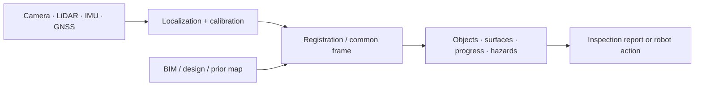
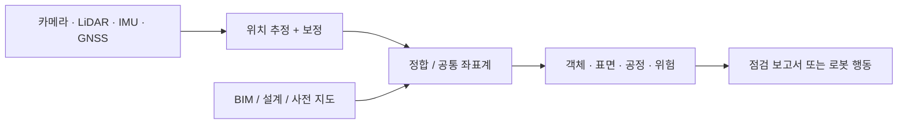

## English

Site perception answers three different questions: **Where is the robot? What exists
now? How does reality differ from the plan?** Treating them as one “vision” problem hides
the geometry and workflow assumptions.

> [!info] Depth target
> Read a site-perception paper and identify: which of the three questions it answers,
> what supplies the metric frame, whether the output is a report or robot state, where
> registration error could masquerade as construction deviation, and whether the system
> ran online on a moving platform. Building perception stacks is a working/mastery topic.

> [!note] Prerequisites
> [[04-robotics/geometric-perception-calibration|Geometric Perception & Calibration]] ·
> [[04-robotics/state-estimation-slam|State Estimation & SLAM]] ·
> [[01-canonical-papers/notes/2-computer-vision/sam|SAM]] ·
> [[01-canonical-papers/notes/2-computer-vision/depth-anything|Depth Anything]]

### 1. The site-perception stack

The output may be a report for a manager or state for a robot. Only the latter closes a
physical-AI loop, and it imposes stricter latency, uncertainty, and failure requirements.

### 2. Four recurring problems

- **Robot localization and mapping**: SLAM/GNSS in dust, repetitive geometry, changing
  ground, and moving workers/equipment — on ground robots this runs on top of the
  wheeled-base kinematics and odometry drift of
  [[04-robotics/modern-robotics/ch13-wheeled-mobile-robots|MR ch.13]]. The canonical construction entry is
  [[01-canonical-papers/notes/8-construction/cho-slam|Cho SLAM 2018]] — a mobile robot
  that autonomously scans and registers site point clouds, a line that continued into
  UAV+UGV teams (2019) and field-deployed adaptive view planning (2025).
- **Scan-to-BIM / progress**: register point clouds or images to a design model, then
  infer installed, missing, or deviating components. Registration error can masquerade
  as construction deviation.
- **Inspection**: plan viewpoints, acquire coverage, detect defects, and attach findings
  to assets. A detection benchmark does not validate autonomous inspection.
- **Robot-ready scene understanding**: free space, traversability, materials, people,
  and task objects at the metric resolution and update rate needed downstream.

### 3. Geometry and foundation models

SAM supplies promptable masks, Depth Anything supplies monocular depth cues, and VGGT-
class models predict geometry. None automatically supplies a calibrated site coordinate,
metric scale, temporal consistency, safety certification, or BIM identity. A practical
system often combines learned proposals with geometric calibration, registration, and
tracking.

PointNet/PointNet++ are historical on-ramps for unordered point sets: PointNet aggregates
per-point features symmetrically; PointNet++ adds local hierarchical neighborhoods.
Modern sparse voxel and transformer models may outperform them, but these papers explain
why point clouds are not ordinary images.

### 4. Reading evaluation

Report localization/registration error in physical units, detection/segmentation quality,
coverage, inspection time, missed hazards/defects, and downstream task effect. Ask whether
train/test sites differ, whether ground truth came from the same BIM alignment being
evaluated, and whether the system ran online on the moving platform.

> [!warning] Reading the claim · 핵심 주장 읽는 법
> “Autonomous inspection” can mean autonomous navigation with offline human analysis, or
> automatic detection on manually collected data. Find which sensing, motion, analysis,
> and reporting steps were autonomous. “Scan-to-BIM accuracy” must separate sensor noise,
> calibration, registration, model tolerance, and true construction deviation.

### After reading

- Separate localization, state reconstruction, comparison-to-plan, and inspection.
- Explain why registration error can look like a construction defect.
- State what SAM/depth/foundation models add and what geometry still must supply.
- Judge whether a result closes a robot loop or only produces an offline report.

### Self-check

1. A progress-monitoring paper reports 4 cm mean deviation between scans and BIM. Name
   the error sources that must be separated before calling this construction deviation.
2. What distinguishes perception output that feeds a manager's report from perception
   output that feeds a robot, and why does only the latter close a physical-AI loop?
3. SAM segments a rebar cage perfectly in an image. What does the downstream robot still
   lack before it can act on that mask?
4. In Cho SLAM 2018, what makes the mapping "robotic" rather than a scan-processing
   pipeline, and what would you check before crediting it as autonomous inspection?

> [!tip]- Answers
> 1. Sensor noise, extrinsic/intrinsic calibration error, registration (alignment) error between cloud and model, BIM modeling tolerance, and only then true as-built deviation. Registration error in particular can systematically masquerade as construction error.
> 2. A report is offline, human-interpreted, and tolerant of latency and gaps; robot state must arrive at the metric resolution, update rate, latency, and reliability the downstream planner/controller needs, with quantified uncertainty and defined failure behavior. Only the robot path feeds action back into the physical world.
> 3. A calibrated site coordinate and metric scale for the mask, temporal consistency across frames, association with a BIM/asset identity, and a safety-rated treatment of uncertainty — a mask is image-space evidence, not actionable state.
> 4. The robot plans and executes its own scanning motion and registers the clouds it collects — sensing and motion are autonomous, closing the acquisition loop. Before calling it autonomous inspection, check whether analysis (defect/deviation detection) and reporting were also autonomous or done offline by humans.

### Sources

- [Szeliski, *Computer Vision: Algorithms and Applications*](https://szeliski.org/Book/)
- [Tang et al., *Automatic Reconstruction of As-Built Building Information Models from Laser-Scanned Point Clouds*](https://doi.org/10.1016/j.autcon.2010.06.007)
- [PointNet](https://arxiv.org/abs/1612.00593) · [PointNet++](https://arxiv.org/abs/1706.02413)

## 한국어

현장 인식은 서로 다른 세 질문에 답한다: **로봇은 어디 있는가? 지금 무엇이 존재하는가?
현실은 계획과 어떻게 다른가?** 이를 하나의 “비전” 문제로 부르면 기하와 공정 가정이 숨는다.

> [!info] 깊이 목표
> 현장 인식 논문을 읽고 다음을 짚는다: 세 질문 중 무엇에 답하는지, 무엇이 미터 좌표계를
> 공급하는지, 출력이 보고서인지 로봇 상태인지, 정합 오차가 어디서 시공 편차로 위장할 수
> 있는지, 이동 플랫폼에서 온라인으로 돌았는지. 인식 스택 구축은 실무/숙달 단계의 주제다.

> [!note] 선수 지식
> [[04-robotics/geometric-perception-calibration|기하 인식과 보정]] ·
> [[04-robotics/state-estimation-slam|상태 추정과 SLAM]] ·
> [[01-canonical-papers/notes/2-computer-vision/sam|SAM]] ·
> [[01-canonical-papers/notes/2-computer-vision/depth-anything|Depth Anything]]

### 1. 현장 인식 스택

출력은 관리자용 보고서일 수도, 로봇용 상태일 수도 있다. 후자만이 physical-AI 루프를
닫으며, 지연·불확실성·실패 조건이 훨씬 엄격하다.

### 2. 네 가지 반복 문제

- **위치 추정·매핑**: 먼지, 반복 구조, 변하는 지면, 이동 작업자 속의 SLAM/GNSS — 지상
  로봇에서는 [[04-robotics/modern-robotics/ch13-wheeled-mobile-robots|MR 13장]]의 바퀴 베이스
  기구학과 오도메트리 드리프트 위에서 돈다. 건설의 정본 진입점은 [[01-canonical-papers/notes/8-construction/cho-slam|Cho SLAM 2018]] —
  현장 포인트 클라우드를 자율적으로 스캔·정합하는 모바일 로봇으로, 이 라인은 UAV+UGV
  팀(2019)과 현장 배치된 적응적 시점 계획(2025)으로 이어졌다.
- **Scan-to-BIM·공정**: 센서 자료를 설계 모델에 정합하고 설치·누락·편차를 추론한다. 정합
  오차가 시공 편차처럼 보일 수 있다.
- **점검**: 시점을 계획하고, 커버리지를 확보하고, 결함을 검출해 자산에 연결한다. 검출
  벤치마크만으로 자율 점검은 검증되지 않는다.
- **로봇용 장면 이해**: 하류 제어에 필요한 미터 단위 좌표·해상도·갱신률로 주행 가능성,
  재료, 사람, 작업 객체를 제공한다.

### 3. 기하와 파운데이션 모델

SAM은 promptable mask, Depth Anything은 단안 깊이 단서, VGGT 계열은 기하 예측을 준다.
그러나 보정된 현장 좌표, metric scale, 시간 일관성, 안전성, BIM 객체 ID를 자동 보장하지
않는다. 실제 시스템은 학습 제안과 기하 보정·정합·추적을 결합한다.

PointNet은 점별 특징을 대칭 집계하고, PointNet++는 국소 계층을 추가한다. 최신 sparse
voxel/transformer가 더 강할 수 있지만, 두 논문은 포인트 클라우드가 일반 이미지와 다른
이유를 이해하는 역사적 진입점이다.

### 4. 평가 읽기

위치·정합 오차를 물리 단위로, 검출·분할 품질, 커버리지, 점검 시간, 놓친 결함·위험,
하류 과제 영향을 함께 보라. 학습·시험 현장이 다른지, 평가 대상 BIM 정합으로 정답도
만들었는지, 이동 플랫폼에서 온라인으로 돌았는지 확인하라.

> [!warning] 주장 읽기
> “자율 점검”은 자율 주행+사람의 오프라인 분석일 수도, 사람이 모은 데이터의 자동 검출일
> 수도 있다. 센싱·이동·분석·보고 중 무엇이 자율인지 분해하라. Scan-to-BIM 정확도는 센서,
> 보정, 정합, 모델 공차, 실제 시공 편차를 구분해야 한다.

### 읽고 나면 말할 수 있어야 하는 것

- 위치 추정, 상태 복원, 계획 대비 비교, 점검을 구분한다.
- 정합 오차가 결함처럼 보이는 이유를 설명한다.
- 파운데이션 모델이 더하는 것과 기하가 여전히 공급할 것을 말한다.
- 결과가 로봇 루프를 닫는지 오프라인 보고서인지 판단한다.

### 스스로 점검

1. 공정 모니터링 논문이 스캔과 BIM 사이 평균 편차 4cm를 보고한다. 이를 시공 편차라고
   부르기 전에 분리해야 하는 오차 원천들을 나열하라.
2. 관리자 보고서로 가는 인식 출력과 로봇으로 가는 인식 출력은 무엇이 다르며, 왜 후자만
   physical-AI 루프를 닫는가?
3. SAM이 이미지에서 철근망을 완벽하게 분할했다. 하류 로봇이 그 마스크로 행동하기 전에
   여전히 부족한 것은?
4. Cho SLAM 2018에서 매핑을 스캔 처리 파이프라인이 아니라 “로봇적”으로 만드는 것은
   무엇이며, 자율 점검으로 인정하기 전에 무엇을 확인해야 하는가?

> [!tip]- 정답 · Answers
> 1. 센서 노이즈, 외부/내부 보정 오차, 클라우드와 모델 사이의 정합(정렬) 오차, BIM 모델링 공차, 그리고 나서야 진짜 as-built 편차. 특히 정합 오차는 체계적으로 시공 오차처럼 위장할 수 있다.
> 2. 보고서는 오프라인이고 인간이 해석하며 지연과 공백을 견딘다; 로봇 상태는 하류 플래너/제어기가 요구하는 미터 해상도·갱신률·지연·신뢰성으로, 정량화된 불확실성과 정의된 실패 거동과 함께 도착해야 한다. 로봇 경로만이 행동을 물리 세계로 되먹인다.
> 3. 마스크의 보정된 현장 좌표와 metric scale, 프레임 간 시간 일관성, BIM/자산 ID와의 연결, 불확실성의 안전 등급 처리 — 마스크는 이미지 공간의 증거이지 행동 가능한 상태가 아니다.
> 4. 로봇이 스스로 스캔 동작을 계획·실행하고 수집한 클라우드를 정합한다 — 센싱과 이동이 자율이어서 취득 루프가 닫힌다. 자율 점검이라 부르기 전에 분석(결함/편차 검출)과 보고도 자율이었는지, 사람이 오프라인으로 했는지 확인하라.

### 출처

- [Szeliski, Computer Vision](https://szeliski.org/Book/)
- [Tang et al., scan-to-BIM review](https://doi.org/10.1016/j.autcon.2010.06.007)
- [PointNet](https://arxiv.org/abs/1612.00593) · [PointNet++](https://arxiv.org/abs/1706.02413)
