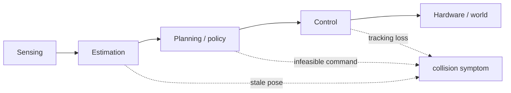
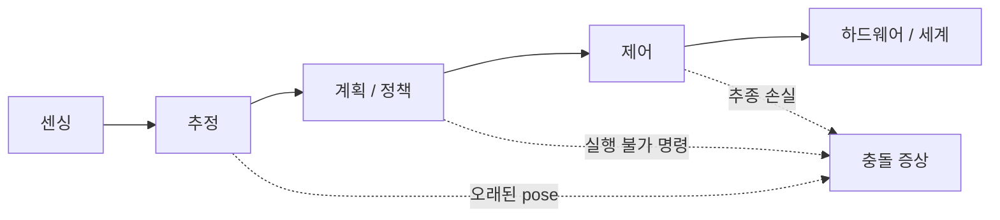

## English

Aggregate success rate says how often a pipeline reached an endpoint; it rarely explains why. Physical-AI research needs failure analysis that finds the earliest causal subsystem, distinguishes recovery from reset, and reports consequential rare events.

> [!note] Prerequisites
> [[06-research-practice/experimental-design-reproducibility|Experimental Design]] (oracle, exposure, trials) · [[04-robotics/robot-systems-deployment|Robot Systems]] (failure taxonomy, logging)

### 1. First failure and downstream symptom

A collision is an outcome, not a root-cause category. Identify the first divergence from intended operation, then trace how it propagated.

The distinction matters because fixing the last visible symptom can leave the initiating fault intact. A controller can track its reference correctly while the overall robot moves into danger. Diagnosis therefore needs both the intended contract of each subsystem and the actual information available when it acted.

For example, consider a hypothetical collision at t = 12.4 s. The pose stream stopped updating at t = 10.3 s and remained stale for 2.1 s. The planner trusted that old pose and produced a path through a wall; the controller followed the path accurately. The first observed failure is estimation freshness, and collision is the downstream symptom. This does not excuse a missing protective stop elsewhere in the system.

**The reading this gives you.** Ask which timestamp first violated a subsystem contract. The same distinction underlies [[04-robotics/robot-systems-deployment|Robot Systems §10]]: a failure label should tell you where to investigate, not merely describe what the video shows.

### 2. Failure taxonomy

Use task-specific categories such as sensing, calibration/synchronization, estimation, data association, planning, policy, control, communication/compute, actuator/mechanical, environment/material, human interaction, and procedure. Categories should be mutually interpretable and linked to observable evidence.

A useful taxonomy separates initiating faults from propagation and consequences because these require different fixes. Otherwise the same event appears under several labels and the aggregate chart depends on whoever annotated the video. Define what observation qualifies an event for each category and retain uncertainty when the necessary logs are absent.

In the stale-pose example, estimation receives the first-failure label because the estimate stopped refreshing. Planning receives a propagation annotation because it consumed expired state. Collision is the consequence. Communication or compute becomes an alternative initiating category only if additional logs explain why estimation stopped. Correct tracking is evidence against a tracking-error explanation, not evidence that the entire controller interface was safe.

**The reading this gives you.** Check whether the paper counts episodes or subsystem events. An episode may contain several contributing faults, but counting each as a separate failed trial changes the denominator. Keep an episode identifier, an initiating category, contributing categories, and the observed outcome together.

### 3. Instrumentation and synchronized replay

Log raw sensors, timestamps, frame transforms, estimates and uncertainty, candidate and selected plans, policy outputs, safety filters, commands, actuator feedback, watchdogs, interventions, configuration, and video. A synchronized timeline enables causal reconstruction; a final camera clip often does not.

Synchronization is needed because log order is not necessarily event order. A camera at 30 Hz, control at 1 kHz, and estimation at 20 Hz produce different numbers of records. Aligning their row indices would compare different physical moments. Message arrival time can also hide the age of a measurement if a queued packet is mistaken for a new observation.

For the collision example, retain acquisition time, arrival time, and the timestamp of the estimate actually consumed by the planner. Place them on a shared clock or record the clock conversion. Then the 2.1 s estimation gap becomes visible alongside continued control commands. Without that relationship, a fresh-looking log entry can conceal an old pose.

**The reading this gives you.** Look for the information that lets another reader reconstruct what the planner knew before collision. A replay should preserve delays, dropped updates, frame versions, and commands; merely replaying images at a convenient rate can erase the mechanism being investigated.

### 4. Isolation and fault injection

Replay the same sensor stream, substitute ground-truth state, replace a learned component with an oracle, or inject controlled delay/noise/dropout to locate sensitivity. Fault injection must be bounded and safe. Oracle replacement diagnoses an upper bound; it does not represent deployable performance.

Isolation works by changing a suspected cause while holding the rest of the recorded situation fixed. First replay with the original estimates, then with a timely reference pose. If the bad path disappears only with the replacement, estimation is a plausible bottleneck. This comparison still depends on whether replay represents the feedback that would have occurred in the world.

Next, deliberately freeze estimation for 2 s in a bounded simulation or protected test. Reproducing the same stale-state path supports the causal chain. It does not by itself prove why the original estimator stalled: overload and sensor loss could both produce that freeze. Examine those alternatives before calling the initiating software defect confirmed.

**The reading this gives you.** Separate evidence that a fault is sufficient to cause failure from evidence that this fault actually occurred. A strong diagnosis combines original timestamps, controlled reproduction, and disappearance after a targeted fix. Report the protected test conditions alongside that conclusion.

### 5. Recovery, intervention, and reset

- Recovery: system returns to progress without external reset under the declared policy.
- Intervention: human modifies or takes control.
- Reset: environment or robot is restored for a new attempt.
- Near miss: no harm occurred, but a plausible hazardous trajectory/event did.

Report time-to-recovery, success after recovery, interventions and resets separately. Hidden resets exaggerate autonomy.

These labels matter because an intervention policy changes what success means. If an operator stops the excavator before contact, the run may end without damage while still failing the autonomous task. If the operator then repositions the bucket and the robot finishes, assisted completion and autonomous completion describe different outcomes.

Declare whether intervention terminates an attempt, whether later completion is retained as a separate assisted metric, and when a reset begins a new trial. Keep the original attempt in the accounting. Otherwise a system that repeatedly needs rescue can look as successful as one that recovers by itself.

**The reading this gives you.** Connect the reported success denominator to the division of authority in [[04-robotics/hri-safety|HRI & Safety §2]]. Ask who detected the problem, who decided the response, and who executed recovery. A low collision count with continuous expert supervision supports a claim about that supervised system, with its human workload included.

### 6. Reliability and field exposure

Report failures per hour/cycle/distance as well as per-episode success when appropriate. Availability includes uptime and repair/recovery time. Rare severe failures require much greater exposure than ordinary task errors; zero observed events does not establish zero risk.

Exposure also does not stop accumulating when the paper is finished. A deployed system meets
seasons, wear, replaced parts and retrained models, so the risk it was shown to carry at
acceptance is a measurement of that moment, not a property it now owns. Designing for that
means deciding in advance which quantities keep being logged after deployment and what
change in them triggers a re-evaluation — the continuing half of the verification and
validation distinction in [[06-research-practice/experimental-design-reproducibility|Experimental Design §1]].

> [!example] Worked example · 계산 예제
> **No observed accident is a small sample, not a reliability guarantee.** Suppose a hypothetical robot completes 20 independent, comparable trials without an accident. The rule of three gives a rough upper failure-rate bound of 3/20 = 15% at approximately 95% confidence.
>
> This is a rough illustration, not an exact interval: [[06-research-practice/experimental-design-reproducibility|Experimental Design §4]] explains the approximation's small-sample limitation. Use an exact interval for reporting this sample. The calculation assumes the trials represent the same underlying failure process; changing the terrain or supervision changes that process.
>
> **The reading this gives you.** A clean demonstration set can still leave substantial failure probability unresolved. Report exposure and its conditions, not just the absence of accidents. Long easy runs cannot establish reliability on an untested hazardous maneuver, and a supervisor's rescues must remain visible in the record.

### 7. Worked diagnosis

An excavator misses a trench boundary. Logs show the planner's path was correct in map coordinates, but GNSS correction changed `map→odom` while a delayed perception message used an old transform. The controller accurately followed the resulting wrong reference. Labeling this “control failure” would target the wrong subsystem; the earliest fault is temporal/frame inconsistency in estimation integration.

For a complete diagnosis, consider a second, hypothetical excavator run that collides with a wall at t = 12.4 s. Start with the symptom, but leave its cause open. Preserve the original configuration before trying a fix; otherwise the reproduction may silently test a different system.

The decisive log extract has three entries: at t = 10.3 s, the last fresh pose is published; over the following 2.1 s, the planner continues consuming that same timestamp and emits a wall-crossing path; at t = 12.4 s, actuator feedback shows accurate tracking of the commanded path when contact occurs. These records describe an information-age failure rather than merely a geometric mismatch.

Consider competing hypotheses. The controller may have deviated from a valid reference, or the planner may have received expired state and issued an invalid reference. Compare commanded and measured motion to reject the first explanation for this event. Replay with a timely reference pose to investigate the second. If the collision path disappears, the estimate is implicated, subject to the validity of replay. Preserve logs of sensor arrival and compute load to distinguish the estimator's stall from upstream starvation.

Then inject a 2 s estimation freeze in a protected test. Reproduction of the path failure, together with the original stale timestamp, establishes the stale-state propagation mechanism for this case. It does not identify every possible collision cause.

Fix both the triggering defect, once identified, and the missing boundary check: consumers should reject expired state and enter a defined stop or recovery behavior. Revalidate the original replay, controlled freezes, timely-state runs, and resumption after updates return. Report any unnecessary stops as well as prevented unsafe commands. The defensible conclusion is that the observed stale-state failure path was reproduced and blocked under the tested conditions. A broader field-reliability claim still needs representative exposure.

### 8. Reporting negative results

A negative result is useful when the question, implementation quality, operating conditions, statistical exposure, and failure mechanism are documented. “It did not work” without diagnostics is not evidence that the idea cannot work.

The following are hypothetical writing examples, not reported experimental findings.

**Before:** “The system worked reliably except for occasional external issues.” **Problem:** the exclusions hide whether those issues belong to the intended operating conditions. **After:** “Runs with stale localization required operator stops; we retain them as failed autonomous attempts and report their timestamps and recovery procedure.”

**Before:** “Tactile feedback did not improve performance, so touch is unnecessary.” **Problem:** one implementation and test distribution cannot settle the value of an entire sensing modality. **After:** “Under the tested contact conditions, this tactile estimator did not improve recovery over the matched visual baseline; delayed updates remain a candidate explanation that the present experiment does not isolate.”

**The reading this gives you.** A useful negative result makes the failed prediction inspectable. Check what should have changed, which comparison could reveal that change, and whether implementation checks rule out a broken instrument. Distinguish absence of a measured advantage from evidence that meaningful advantage is unlikely.

### After reading

- Separate outcome, first failure, and downstream propagation.
- Design a task-specific failure taxonomy.
- List logs needed for synchronized replay.
- Use oracle replacement or controlled fault injection appropriately.
- Distinguish recovery, intervention, reset, and near miss.
- Report field exposure and negative results without overclaiming.

### Self-check

1. Why is “collision” a poor root-cause label?
2. How can ground-truth pose isolate an estimation bottleneck?
3. Why should intervention and reset counts be separate from success rate?
4. What makes a negative result informative?

> [!tip]- Answers
> 1. Sensing, estimation, planning, control, hardware, or people can all produce it. 2. Re-run downstream planning/control with ground truth; improvement estimates how much error originated upstream, subject to replay validity. 3. They reveal hidden human labor, autonomy boundaries, and recovery capability. 4. A clear hypothesis, credible implementation, sufficient and relevant tests, and diagnosed boundary/failure mechanism.

### Sources

- [NASA Systems Engineering Handbook](https://www.nasa.gov/reference/systems-engineering-handbook/) — the systems view of fault propagation, verification, and staged testing
- [NIST Robotic Systems for Smart Manufacturing program](https://www.nist.gov/programs-projects/robotic-systems-smart-manufacturing-program) — NIST's robot performance/failure measurement program (its standardized test-method pages branch from here)

## 한국어

합산 성공률은 파이프라인이 끝점에 얼마나 자주 도달했는지 말할 뿐, 왜인지는 거의 설명하지
않는다. Physical-AI 연구에는 최초의 인과적 하위 시스템을 찾고, 회복과 리셋을 구분하고,
결과가 무거운 희귀 사건을 보고하는 실패 분석이 필요하다.

> [!note] 선수 지식
> [[06-research-practice/experimental-design-reproducibility|실험 설계]] (oracle·노출·시행) · [[04-robotics/robot-systems-deployment|로봇 시스템]] (실패 분류·로깅)

### 1. 최초 실패와 하류 증상

충돌은 결과이지 근본 원인 범주가 아니다. 의도된 동작에서 **처음 벗어난 지점**을 찾고,
그것이 어떻게 전파됐는지 추적하라.

마지막 증상만 고치면 시작점의 결함은 남는다. 제어기는 기준 경로를 정확히 따라가면서도 로봇 전체를 위험하게 만들 수 있다. 각 하위 시스템이 무엇을 보장해야 했는지, 행동 당시 어떤 정보를 받았는지를 함께 봐야 한다.

가상 사례에서 충돌은 t = 12.4 s에 일어난다. 위치 추정은 t = 10.3 s부터 2.1 s 동안 갱신되지 않았다. 계획기는 낡은 위치를 믿고 벽을 통과하는 경로를 냈다. 제어기는 그 경로를 정확히 추종했다. 최초 관찰 실패는 추정값의 갱신 중단이고, 충돌은 하류 증상이다. 다만 다른 계층에 보호 정지가 없었다는 문제까지 면제되지는 않는다.

**여기서 얻는 독법.** 어느 시각에 어느 하위 시스템의 약속이 처음 깨졌는지 묻는다. [[04-robotics/robot-systems-deployment|로봇 시스템 §10]]도 같은 구분을 쓴다. 실패 분류는 영상의 장면 이름이 아니라 다음 조사 위치를 알려 줘야 한다.

### 2. 실패 분류 체계

센싱, 보정/동기화, 추정, data association, 계획, 정책, 제어, 통신/컴퓨트, 액추에이터/기계,
환경/재료, 인간 상호작용, 절차 같은 과제 맞춤 범주를 써라. 범주는 상호 해석 가능해야
하고 관찰 가능한 증거와 연결돼야 한다.

시작 결함, 전파 경로, 결과는 고치는 방법이 다르다. 이를 섞으면 같은 사건이 여러 분류에 중복 집계되고, 영상 판독자에 따라 실패 분포도 달라진다. 각 분류에 필요한 관찰을 정하고 로그가 없으면 불확실성을 남긴다.

낡은 위치 사례에서는 추정값 갱신이 멈췄으므로 최초 실패를 추정으로 분류한다. 만료된 상태를 쓴 계획에는 전파 표시를 붙인다. 충돌은 결과다. 통신·연산 때문에 추정이 멈췄다는 추가 로그가 나오면 최초 원인 분류를 더 앞당길 수 있다. 정확한 추종은 추종 오차 가설을 약화하지만 제어 인터페이스 전체의 안전성을 증명하지는 않는다.

**여기서 얻는 독법.** 논문이 에피소드를 세는지 하위 시스템의 사건을 세는지 확인한다. 한 에피소드에 여러 기여 결함이 있어도 각각을 실패 시행으로 세면 분모가 달라진다. 에피소드 식별자, 최초 실패 분류, 기여 분류, 관찰 결과를 함께 보존한다.

### 3. 계측과 동기화 재생

원시 센서, 타임스탬프, 프레임 변환, 추정값과 불확실성, 후보·선택된 계획, 정책 출력, 안전
필터, 명령, 액추에이터 피드백, watchdog, 개입, 설정, 비디오를 기록하라. 동기화된
타임라인이 인과적 재구성을 가능하게 한다 — 마지막 카메라 클립 하나로는 대개 안 된다.

로그에 적힌 순서가 사건이 일어난 순서와 같지는 않다. 카메라 30 Hz, 제어 1 kHz, 위치 추정 20 Hz는 서로 다른 수의 기록을 만든다. 같은 행 번호끼리 맞추면 다른 시각을 비교하게 된다. 대기열을 거친 메시지의 도착 시각을 측정 시각으로 쓰면 오래된 관측도 새것처럼 보인다.

충돌 사례에서는 센서 취득 시각, 메시지 도착 시각, 계획기가 실제 소비한 추정값의 시각을 남긴다. 공통 시계로 정렬하거나 시계 변환을 기록한다. 그래야 제어 명령이 계속 나가는 동안 추정에 2.1 s 공백이 있었다는 사실이 드러난다. 이 관계가 없으면 새 로그 항목이 낡은 위치를 감춘다.

**여기서 얻는 독법.** 충돌 전에 계획기가 알고 있던 정보를 재구성할 수 있는지 본다. 재생에는 지연, 누락, 좌표계 버전, 명령이 보존돼야 한다. 영상을 편한 속도로 다시 트는 것만으로는 조사할 기전 자체가 사라질 수 있다.

### 4. 분리와 결함 주입

같은 센서 스트림을 재생하거나, ground-truth 상태로 치환하거나, 학습 구성요소를 oracle로
바꾸거나, 통제된 지연/잡음/드롭아웃을 주입해 민감한 곳을 찾는다. 결함 주입은 한계가
정해지고 안전해야 한다. Oracle 치환은 상한을 진단하는 것이지 배포 가능한 성능이 아니다.

분리는 기록된 상황을 고정한 채 의심 원인만 바꾸는 것이다. 원래 추정값으로 재생한 뒤 제때 들어온 기준 위치로 바꿔 본다. 교체했을 때만 잘못된 경로가 사라지면 추정 병목 가설을 지지한다. 단, 재생이 실제 세계의 피드백을 얼마나 보존하는지에 따라 해석 범위가 달라진다.

다음으로 제한된 시뮬레이션이나 보호된 시험에서 추정을 의도적으로 2 s 멈춘다. 같은 낡은 상태 경로가 재현되면 인과 사슬을 지지한다. 이것만으로 원래 추정기가 멈춘 이유까지 확정되지는 않는다. 연산 과부하와 센서 손실 모두 같은 정지를 만들 수 있기 때문이다. 최초 소프트웨어 결함을 확정하기 전에 이 대안을 조사한다.

**여기서 얻는 독법.** 어떤 결함이 실패를 일으킬 수 있다는 증거와 그 결함이 실제로 발생했다는 증거를 나눈다. 원본 시각 기록, 통제된 재현, 표적 수정 뒤의 소멸이 함께 있어야 진단이 강해진다. 보호된 시험 조건도 같이 보고한다.

### 5. 회복, 개입, 리셋

- 회복(recovery): 선언된 정책 아래 외부 리셋 없이 진행으로 복귀.
- 개입(intervention): 사람이 수정하거나 제어를 가져감.
- 리셋(reset): 새 시도를 위해 환경·로봇을 복원.
- Near miss: 해는 없었지만 그럴듯하게 위험했던 궤적·사건.

회복 시간, 회복 후 성공, 개입과 리셋을 **분리해서** 보고하라. 숨긴 리셋은 자율성을
과장한다.

개입 정책이 성공의 뜻을 바꾼다. 운전자가 접촉 전에 굴착기를 멈추면 손상은 없지만 자율 과제는 실패했을 수 있다. 이후 운전자가 버킷을 다시 놓고 로봇이 마쳐도 보조 완료와 자율 완료는 다른 결과다.

개입이 시도를 종료하는지, 이후 완료를 별도 보조 지표로 남기는지, 리셋 뒤 언제 새 시행을 시작하는지 미리 정한다. 최초 시도도 집계에 남긴다. 그렇지 않으면 반복 구조가 필요한 시스템과 스스로 회복하는 시스템이 똑같이 성공적으로 보인다.

**여기서 얻는 독법.** 성공률의 분모를 [[04-robotics/hri-safety|HRI와 안전 §2]]의 권한 분배와 연결한다. 누가 문제를 알아챘고, 대응을 결정했고, 회복을 실행했는지 묻는다. 전문가가 계속 감독한 상태의 낮은 충돌 횟수는 그 감독 시스템에 대한 주장이다. 사람의 작업부하도 그 범위에 포함된다.

### 6. 신뢰성과 현장 노출

적절할 때 에피소드당 성공만이 아니라 시간/사이클/거리당 실패도 보고하라. 가용성
(availability)은 가동 시간과 수리·회복 시간을 포함한다. 드물고 심각한 실패는 일반 과제
오류보다 훨씬 큰 노출을 요구한다 — 관측된 사건이 0이라는 것이 위험이 0이라는 뜻은
아니다.

노출은 논문이 끝난다고 해서 쌓이기를 멈추지도 않는다. 배치된 시스템은 계절과 마모, 교체된 부품과
재학습된 모델을 만난다. 그러므로 게재 시점에 보인 위험 수준은 그 순간의 측정값이지 시스템이
이제 소유한 성질이 아니다. 이것을 설계에 넣는다는 것은 배치 이후에도 어떤 양을 계속 기록할지,
그 값이 얼마나 변하면 재평가를 촉발할지를 미리 정하는 일이다 —
[[06-research-practice/experimental-design-reproducibility|실험 설계 §1]]의 verification과
validation 구분에서 계속되는 쪽 절반이다.

> [!example] 계산 예제 · Worked example
> **무사고 관찰은 작은 표본이지 신뢰성 보장이 아니다.** 가상의 로봇이 독립적이고 비교 가능한 20회 시행을 무사고로 마쳤다고 하자. 3의 법칙을 쓰면 약 95% 신뢰수준에서 실패율 상한의 거친 근사는 3/20 = 15%다.
>
> 이는 정확한 구간이 아닌 설명용 근사다. [[06-research-practice/experimental-design-reproducibility|실험 설계 §4]]에서 작은 표본의 근사 한계를 설명한다. 이 표본을 보고할 때는 정확 구간을 쓴다. 계산은 시행들이 같은 실패 과정을 대표한다고 가정한다. 지형이나 감독 방식이 바뀌면 그 과정도 달라진다.
>
> **여기서 얻는 독법.** 깨끗한 시연 묶음에도 상당한 실패 확률의 불확실성이 남을 수 있다. 사고가 없었다는 사실과 함께 노출량과 조건을 보고한다. 쉬운 구간의 긴 운전으로 시험하지 않은 위험 동작의 신뢰성을 보장할 수 없다. 감독자의 구조도 기록에 남아야 한다.

### 7. 진단 예제

굴착기가 도랑 경계를 놓쳤다. 로그를 보니 플래너의 경로는 map 좌표에서 옳았지만, GNSS
보정이 `map→odom`을 바꾸는 사이 지연된 인식 메시지가 낡은 변환을 썼다. 제어기는 그
잘못된 기준을 정확하게 추종했다. 이것을 "제어 실패"라 부르면 엉뚱한 하위 시스템을
겨냥하게 된다 — 최초 결함은 추정 통합의 시간/프레임 비일관성이다.

진단을 끝까지 해 보자. 별도의 가상 굴착기 시행에서 t = 12.4 s에 벽과 충돌했다. 증상부터 적되 원인은 열어 둔다. 수정 전에 원래 설정을 보존한다. 그렇지 않으면 재현 시험이 다른 시스템을 시험하게 된다.

핵심 로그는 세 줄이다. t = 10.3 s에 마지막 새 위치가 발행된다. 이후 2.1 s 동안 계획기는 같은 시각의 위치를 계속 소비하고 벽을 통과하는 경로를 낸다. t = 12.4 s에는 구동기 피드백이 명령 경로를 정확히 추종한 상태에서 접촉을 기록한다. 이는 단순한 기하 오차보다 정보의 노후화 문제를 가리킨다.

가설을 둘로 나눈다. 제어기가 올바른 기준에서 이탈했거나, 계획기가 만료된 상태를 받아 잘못된 기준을 냈을 수 있다. 명령과 측정 궤적을 비교해 이 사건의 첫 가설을 배제한다. 다음으로 제때 들어온 기준 위치를 넣어 재생한다. 충돌 경로가 사라지면 재생 타당성의 범위에서 추정값을 원인 후보로 좁힌다. 추정기 자체의 정지인지 상류 입력 고갈인지 구별하려면 센서 도착과 연산 부하도 남겨야 한다.

이후 보호된 시험에서 추정을 2 s 멈춘다. 원본의 낡은 타임스탬프와 같은 경로 실패의 재현을 함께 보면 이 사례의 낡은 상태 전파 기전을 확인할 수 있다. 모든 충돌의 원인을 찾았다는 뜻은 아니다.

발견된 시작 결함과 빠진 경계 검사를 함께 고친다. 소비자는 만료된 상태를 거부하고 정해진 정지·회복으로 넘어가야 한다. 원래 재생, 통제된 정지, 정상 갱신, 갱신 복귀 뒤 재개를 다시 시험한다. 막은 위험 명령뿐 아니라 불필요한 정지도 보고한다. 방어 가능한 결론은 시험 조건에서 관찰된 실패 경로를 재현하고 차단했다는 것이다. 더 넓은 현장 신뢰성에는 대표성 있는 노출이 필요하다.

### 8. 부정적 결과 보고

부정적 결과는 질문, 구현 품질, 운용 조건, 통계적 노출, 실패 기전이 문서화될 때 유용하다.
진단 없는 "안 됐다"는 그 아이디어가 성립할 수 없다는 증거가 아니다.

다음은 실제 실험 보고가 아닌 가상의 글쓰기 예다.

**수정 전:** “간헐적인 외부 문제를 제외하면 시스템은 신뢰성 있게 작동했다.” **문제:** 그 문제가 의도한 운용 조건에 포함되는지를 제외 문구가 숨긴다. **수정 후:** “위치 추정이 낡은 시행에서는 운전자 정지가 필요했다. 이를 자율 시도의 실패로 유지하고 시각 기록과 회복 절차를 보고한다.”

**수정 전:** “촉각 피드백이 성능을 높이지 않았으므로 촉각은 필요 없다.” **문제:** 한 구현과 시험 분포로 센싱 방식 전체의 가치를 판정할 수 없다. **수정 후:** “시험한 접촉 조건에서 이 촉각 추정기는 짝지은 시각 베이스라인보다 회복을 개선하지 않았다. 갱신 지연은 후보 설명이지만 이번 실험은 이를 분리하지 못한다.”

**여기서 얻는 독법.** 유익한 부정 결과는 실패한 예측을 확인 가능하게 만든다. 무엇이 달라져야 했고, 어떤 비교가 이를 드러내며, 측정 도구의 고장을 구현 점검으로 배제했는지 본다. 이점을 관찰하지 못한 것과 의미 있는 이점이 없을 가능성을 지지하는 증거는 구분한다.

### 읽고 나면 말할 수 있어야 하는 것

- 결과·최초 실패·하류 전파를 분리할 수 있다
- 과제 맞춤 실패 분류 체계를 설계할 수 있다
- 동기화 재생에 필요한 로그를 나열할 수 있다
- oracle 치환·통제된 결함 주입을 적절히 쓸 수 있다
- 회복·개입·리셋·near miss를 구분할 수 있다
- 현장 노출과 부정적 결과를 과장 없이 보고할 수 있다

### 스스로 점검

1. "충돌"이 근본 원인 라벨로 나쁜 이유는?
2. ground-truth pose가 추정 병목을 어떻게 분리할 수 있는가?
3. 개입·리셋 횟수를 성공률과 분리해야 하는 이유는?
4. 부정적 결과를 유익하게 만드는 것은?

> [!tip]- 정답 · Answers
> 1. 센싱, 추정, 계획, 제어, 하드웨어, 사람 모두가 충돌을 만들 수 있다.
> 2. 하류 계획/제어를 ground truth로 다시 돌려 본다 — 개선 폭이 상류에서 온 오차를 추정한다(재생 타당성 전제).
> 3. 숨은 인간 노동, 자율성의 경계, 회복 능력을 드러낸다.
> 4. 명확한 가설, 신뢰할 만한 구현, 충분하고 관련 있는 시험, 진단된 경계·실패 기전.

### 출처

- [NASA Systems Engineering Handbook](https://www.nasa.gov/reference/systems-engineering-handbook/) — 결함 전파·검증·단계적 시험의 시스템 관점
- [NIST Robotic Systems for Smart Manufacturing program](https://www.nist.gov/programs-projects/robotic-systems-smart-manufacturing-program) — NIST의 로봇 성능·실패 측정 프로그램(표준 시험법 페이지들이 여기서 갈라진다)
