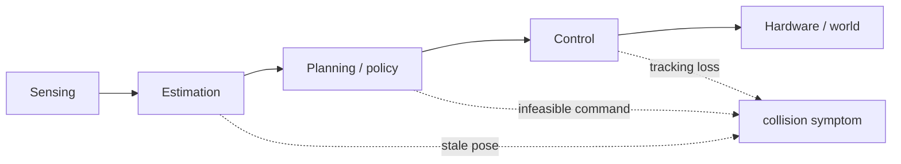

## English

Aggregate success rate says how often a pipeline reached an endpoint; it rarely explains why. Physical-AI research needs failure analysis that finds the earliest causal subsystem, distinguishes recovery from reset, and reports consequential rare events.

### 1. First failure and downstream symptom

A collision is an outcome, not a root-cause category. Identify the first divergence from intended operation, then trace how it propagated.

### 2. Failure taxonomy

Use task-specific categories such as sensing, calibration/synchronization, estimation, data association, planning, policy, control, communication/compute, actuator/mechanical, environment/material, human interaction, and procedure. Categories should be mutually interpretable and linked to observable evidence.

### 3. Instrumentation and synchronized replay

Log raw sensors, timestamps, frame transforms, estimates and uncertainty, candidate and selected plans, policy outputs, safety filters, commands, actuator feedback, watchdogs, interventions, configuration, and video. A synchronized timeline enables causal reconstruction; a final camera clip often does not.

### 4. Isolation and fault injection

Replay the same sensor stream, substitute ground-truth state, replace a learned component with an oracle, or inject controlled delay/noise/dropout to locate sensitivity. Fault injection must be bounded and safe. Oracle replacement diagnoses an upper bound; it does not represent deployable performance.

### 5. Recovery, intervention, and reset

- Recovery: system returns to progress without external reset under the declared policy.
- Intervention: human modifies or takes control.
- Reset: environment or robot is restored for a new attempt.
- Near miss: no harm occurred, but a plausible hazardous trajectory/event did.

Report time-to-recovery, success after recovery, interventions and resets separately. Hidden resets exaggerate autonomy.

### 6. Reliability and field exposure

Report failures per hour/cycle/distance as well as per-episode success when appropriate. Availability includes uptime and repair/recovery time. Rare severe failures require much greater exposure than ordinary task errors; zero observed events does not establish zero risk.

### 7. Worked diagnosis

An excavator misses a trench boundary. Logs show the planner's path was correct in map coordinates, but GNSS correction changed `map→odom` while a delayed perception message used an old transform. The controller accurately followed the resulting wrong reference. Labeling this “control failure” would target the wrong subsystem; the earliest fault is temporal/frame inconsistency in estimation integration.

### 8. Reporting negative results

A negative result is useful when the question, implementation quality, operating conditions, statistical exposure, and failure mechanism are documented. “It did not work” without diagnostics is not evidence that the idea cannot work.

### After reading

- Separate outcome, first failure, and downstream propagation.
- Design a task-specific failure taxonomy.
- List logs needed for synchronized replay.
- Use oracle replacement or controlled fault injection appropriately.
- Distinguish recovery, intervention, reset, and near miss.
- Report field exposure and negative results without overclaiming.

### Self-check

1. Why is “collision” a poor root-cause label?
2. How can ground-truth pose isolate an estimation bottleneck?
3. Why should intervention and reset counts be separate from success rate?
4. What makes a negative result informative?

> [!tip]- Answers
> 1. Sensing, estimation, planning, control, hardware, or people can all produce it. 2. Re-run downstream planning/control with ground truth; improvement estimates how much error originated upstream, subject to replay validity. 3. They reveal hidden human labor, autonomy boundaries, and recovery capability. 4. A clear hypothesis, credible implementation, sufficient and relevant tests, and diagnosed boundary/failure mechanism.

## 한국어

Aggregate success rate는 pipeline이 끝점에 도달한 빈도만 말하고 왜 실패했는지는 거의 알려주지 않는다. Collision은 결과이지 root cause가 아니다. 의도한 동작에서 처음 벗어난 subsystem과 downstream propagation을 구분한다.

Raw sensor, timestamp, TF, estimate와 uncertainty, candidate/selected plan, policy output, safety filter, command, actuator feedback, intervention, configuration과 video를 동기화해 기록한다. Ground-truth state나 oracle component로 교체하거나 bounded delay/noise를 주입하면 병목을 분리할 수 있다.

Recovery, human intervention, reset, near miss를 별도로 보고하고 failures per hour/cycle/distance와 repair time도 필요할 때 제시한다. Negative result는 질문·구현·조건·노출과 실패 원인이 문서화될 때 지식이 된다.
