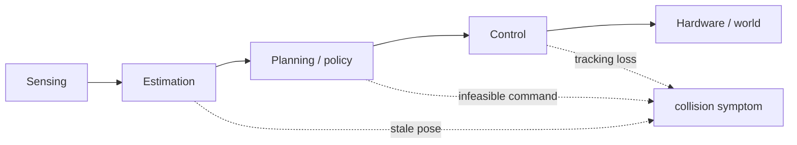
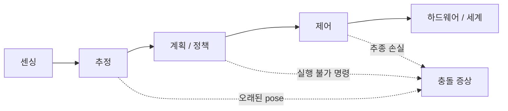

## English

Aggregate success rate says how often a pipeline reached an endpoint; it rarely explains why. Physical-AI research needs failure analysis that finds the earliest causal subsystem, distinguishes recovery from reset, and reports consequential rare events.

### 1. First failure and downstream symptom

A collision is an outcome, not a root-cause category. Identify the first divergence from intended operation, then trace how it propagated.

### 2. Failure taxonomy

Use task-specific categories such as sensing, calibration/synchronization, estimation, data association, planning, policy, control, communication/compute, actuator/mechanical, environment/material, human interaction, and procedure. Categories should be mutually interpretable and linked to observable evidence.

### 3. Instrumentation and synchronized replay

Log raw sensors, timestamps, frame transforms, estimates and uncertainty, candidate and selected plans, policy outputs, safety filters, commands, actuator feedback, watchdogs, interventions, configuration, and video. A synchronized timeline enables causal reconstruction; a final camera clip often does not.

### 4. Isolation and fault injection

Replay the same sensor stream, substitute ground-truth state, replace a learned component with an oracle, or inject controlled delay/noise/dropout to locate sensitivity. Fault injection must be bounded and safe. Oracle replacement diagnoses an upper bound; it does not represent deployable performance.

### 5. Recovery, intervention, and reset

- Recovery: system returns to progress without external reset under the declared policy.
- Intervention: human modifies or takes control.
- Reset: environment or robot is restored for a new attempt.
- Near miss: no harm occurred, but a plausible hazardous trajectory/event did.

Report time-to-recovery, success after recovery, interventions and resets separately. Hidden resets exaggerate autonomy.

### 6. Reliability and field exposure

Report failures per hour/cycle/distance as well as per-episode success when appropriate. Availability includes uptime and repair/recovery time. Rare severe failures require much greater exposure than ordinary task errors; zero observed events does not establish zero risk.

### 7. Worked diagnosis

An excavator misses a trench boundary. Logs show the planner's path was correct in map coordinates, but GNSS correction changed `map→odom` while a delayed perception message used an old transform. The controller accurately followed the resulting wrong reference. Labeling this “control failure” would target the wrong subsystem; the earliest fault is temporal/frame inconsistency in estimation integration.

### 8. Reporting negative results

A negative result is useful when the question, implementation quality, operating conditions, statistical exposure, and failure mechanism are documented. “It did not work” without diagnostics is not evidence that the idea cannot work.

### After reading

- Separate outcome, first failure, and downstream propagation.
- Design a task-specific failure taxonomy.
- List logs needed for synchronized replay.
- Use oracle replacement or controlled fault injection appropriately.
- Distinguish recovery, intervention, reset, and near miss.
- Report field exposure and negative results without overclaiming.

### Self-check

1. Why is “collision” a poor root-cause label?
2. How can ground-truth pose isolate an estimation bottleneck?
3. Why should intervention and reset counts be separate from success rate?
4. What makes a negative result informative?

> [!tip]- Answers
> 1. Sensing, estimation, planning, control, hardware, or people can all produce it. 2. Re-run downstream planning/control with ground truth; improvement estimates how much error originated upstream, subject to replay validity. 3. They reveal hidden human labor, autonomy boundaries, and recovery capability. 4. A clear hypothesis, credible implementation, sufficient and relevant tests, and diagnosed boundary/failure mechanism.

### Sources

- [NASA Systems Engineering Handbook](https://www.nasa.gov/reference/systems-engineering-handbook/) — the systems view of fault propagation, verification, and staged testing
- [NIST Robotics Test Methods](https://www.nist.gov/programs-projects/robotic-systems-smart-manufacturing-program) — standardized performance and failure evaluation for robot systems

## 한국어

합산 성공률은 파이프라인이 끝점에 얼마나 자주 도달했는지 말할 뿐, 왜인지는 거의 설명하지
않는다. Physical-AI 연구에는 최초의 인과적 하위 시스템을 찾고, 회복과 리셋을 구분하고,
결과가 무거운 희귀 사건을 보고하는 실패 분석이 필요하다.

### 1. 최초 실패와 하류 증상

충돌은 결과이지 근본 원인 범주가 아니다. 의도된 동작에서 **처음 벗어난 지점**을 찾고,
그것이 어떻게 전파됐는지 추적하라.

### 2. 실패 분류 체계

센싱, 보정/동기화, 추정, data association, 계획, 정책, 제어, 통신/컴퓨트, 액추에이터/기계,
환경/재료, 인간 상호작용, 절차 같은 과제 맞춤 범주를 써라. 범주는 상호 해석 가능해야
하고 관찰 가능한 증거와 연결돼야 한다.

### 3. 계측과 동기화 재생

원시 센서, 타임스탬프, 프레임 변환, 추정값과 불확실성, 후보·선택된 계획, 정책 출력, 안전
필터, 명령, 액추에이터 피드백, watchdog, 개입, 설정, 비디오를 기록하라. 동기화된
타임라인이 인과적 재구성을 가능하게 한다 — 마지막 카메라 클립 하나로는 대개 안 된다.

### 4. 분리와 결함 주입

같은 센서 스트림을 재생하거나, ground-truth 상태로 치환하거나, 학습 구성요소를 oracle로
바꾸거나, 통제된 지연/잡음/드롭아웃을 주입해 민감한 곳을 찾는다. 결함 주입은 한계가
정해지고 안전해야 한다. Oracle 치환은 상한을 진단하는 것이지 배포 가능한 성능이 아니다.

### 5. 회복, 개입, 리셋

- 회복(recovery): 선언된 정책 아래 외부 리셋 없이 진행으로 복귀.
- 개입(intervention): 사람이 수정하거나 제어를 가져감.
- 리셋(reset): 새 시도를 위해 환경·로봇을 복원.
- Near miss: 해는 없었지만 그럴듯하게 위험했던 궤적·사건.

회복 시간, 회복 후 성공, 개입과 리셋을 **분리해서** 보고하라. 숨긴 리셋은 자율성을
과장한다.

### 6. 신뢰성과 현장 노출

적절할 때 에피소드당 성공만이 아니라 시간/사이클/거리당 실패도 보고하라. 가용성
(availability)은 가동 시간과 수리·회복 시간을 포함한다. 드물고 심각한 실패는 일반 과제
오류보다 훨씬 큰 노출을 요구한다 — 관측된 사건이 0이라는 것이 위험이 0이라는 뜻은
아니다.

### 7. 진단 예제

굴착기가 도랑 경계를 놓쳤다. 로그를 보니 플래너의 경로는 map 좌표에서 옳았지만, GNSS
보정이 `map→odom`을 바꾸는 사이 지연된 인식 메시지가 낡은 변환을 썼다. 제어기는 그
잘못된 기준을 정확하게 추종했다. 이것을 "제어 실패"라 부르면 엉뚱한 하위 시스템을
겨냥하게 된다 — 최초 결함은 추정 통합의 시간/프레임 비일관성이다.

### 8. 부정적 결과 보고

부정적 결과는 질문, 구현 품질, 운용 조건, 통계적 노출, 실패 기전이 문서화될 때 유용하다.
진단 없는 "안 됐다"는 그 아이디어가 성립할 수 없다는 증거가 아니다.

### 읽고 나면 말할 수 있어야 하는 것

- 결과·최초 실패·하류 전파를 분리할 수 있다
- 과제 맞춤 실패 분류 체계를 설계할 수 있다
- 동기화 재생에 필요한 로그를 나열할 수 있다
- oracle 치환·통제된 결함 주입을 적절히 쓸 수 있다
- 회복·개입·리셋·near miss를 구분할 수 있다
- 현장 노출과 부정적 결과를 과장 없이 보고할 수 있다

### 스스로 점검

1. "충돌"이 근본 원인 라벨로 나쁜 이유는?
2. ground-truth pose가 추정 병목을 어떻게 분리할 수 있는가?
3. 개입·리셋 횟수를 성공률과 분리해야 하는 이유는?
4. 부정적 결과를 유익하게 만드는 것은?

> [!tip]- 정답 · Answers
> 1. 센싱, 추정, 계획, 제어, 하드웨어, 사람 모두가 충돌을 만들 수 있다.
> 2. 하류 계획/제어를 ground truth로 다시 돌려 본다 — 개선 폭이 상류에서 온 오차를 추정한다(재생 타당성 전제).
> 3. 숨은 인간 노동, 자율성의 경계, 회복 능력을 드러낸다.
> 4. 명확한 가설, 신뢰할 만한 구현, 충분하고 관련 있는 시험, 진단된 경계·실패 기전.

### 출처

- [NASA Systems Engineering Handbook](https://www.nasa.gov/reference/systems-engineering-handbook/) — 결함 전파·검증·단계적 시험의 시스템 관점
- [NIST Robotics Test Methods](https://www.nist.gov/programs-projects/robotic-systems-smart-manufacturing-program) — 로봇 시스템의 표준화된 성능·실패 평가
