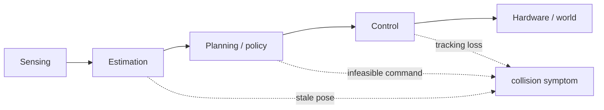
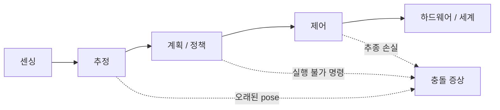

> [!note] Prerequisites · 선수 지식
> [[06-research-practice/experimental-design-reproducibility|2. Experimental Design]] (RS1; oracle, exposure, trials; the exact bound after zero failures in §4) · [[04-robotics/robot-systems-deployment|10. Robot Systems]] (failure taxonomy, logging) · [[02-foundations/probability|3. Probability §2]] (the Poisson and exponential distributions) · [[02-foundations/probability|3. Probability §6]] (the confidence-interval procedure)
> [[06-research-practice/experimental-design-reproducibility|2. 실험 설계]](RS1, oracle·노출·시행, §4의 실패 0회 뒤 정확 상한) · [[04-robotics/robot-systems-deployment|10. 로봇 시스템]](실패 분류·로깅) · [[02-foundations/probability|3. 확률 §2]](포아송·지수 분포) · [[02-foundations/probability|3. 확률 §6]](신뢰구간 절차)

## English

*Stands on [[06-research-practice/experimental-design-reproducibility|2. Experimental Design]], which planned RS1's trials; this page is what you do when those trials, or the rig that runs them, fail.*

Aggregate success rate says how often a pipeline reached an endpoint; it rarely explains why. Physical-AI research needs failure analysis that finds the earliest causal subsystem, distinguishes recovery from reset, and reports consequential rare events.

> [!note] First pass · 처음이라면
> Read the running object — RS1's rig and its 200-hour log, F1 — and then the worked case, which takes one incident from the symptom back to the first failure, classifies the whole log, isolates the mechanism, and turns six failures into a rate with an honest interval. Then §1, §2, §4 and §6, which define what the worked case used. §7 is a second diagnosis on a different robot; §3, §5 and §8 are what you check before writing it up.

### Running object · 이 페이지의 대상

**RS1** from [[06-research-practice/experimental-design-reproducibility|2. Experimental Design]]: does impedance control (**B**) make the contact of plant **P2** with a 400 N/m panel safer than position control with a force-threshold stop (**A**)? One trial is one approach ending in contact, and it succeeds when the peak contact force is at most 10 N; the frozen pilot went 6 of 10 for A and 9 of 10 for B. On top of RS1 this page freezes one object of its own, specified in full here and never changed.

**F1 — the first 200 hours of RS1's test rig.** Illustrative: every number below is invented for teaching, not measured.

- **Rig.** The arm is **P2** from [[02-foundations/lab-plants|0.6 Lab Plants]]; the panel's stiffness is $k_w = 400$ N/m, **P3**'s wall. A wrist force/torque (F/T) sensor streams at 1 kHz and stamps every sample with a sequence number; it feeds A's stop and the force record of every trial. B's impedance law uses only the joint encoders and torque commands. The tip's penetration $\delta$ past the calibrated panel plane, from the encoders and P2's forward kinematics, gives an independent force estimate $k_w\delta$.
- **Cycle.** One approach-and-contact cycle per minute, alternating A and B. The tip starts 60 mm from the panel and approaches at 0.05 m/s, so after contact the force rises at $k_w v = 20$ N/s. Under A the commanded approach ends 100 mm past the panel plane, so the stop — commanded when the measured force reaches 6 N — is what ends every approach. The tip is within 30 mm of the panel for 6 s of each 60-s cycle, 10% of the time.
- **Exposure.** $T = 200$ h of powered operation: 12,000 cycles, 100 h under each controller.
- **Failure, as counted here.** An event that ends a cycle other than by its normal retreat, or makes its force record invalid, and needs a person to restart or re-run the cycle.

| # | log time (h) | controller | first observed failure | initiating category | outcome | down (h) |
|---:|---:|---|---|---|---|---:|
| 1 | 18.4 | A | F/T sequence number stops while the tip retreats, 20 mm from the panel | sensing / communication | the driver's 2 s timeout aborts the cycle; no contact force | 0.4 |
| 2 | 52.9 | B | control loop misses its 1 ms deadline 12 times in a row | compute | watchdog protective stop in free space | 0.8 |
| 3 | 88.0 | A | panel not re-clamped after a stiffness check | procedure | panel shifts 4 mm at contact; trial invalid, re-run | 0.5 |
| 4 | 101.6 | B | F/T sequence number stops on approach, 25 mm from the panel | sensing / communication | contact normal under B's law, but the force record is stale; trial invalid, re-run | 0.4 |
| 5 | 137.2 | A | F/T sequence number stops 0.18 s before contact | sensing / communication | contact force reaches 31 N; hardware stop | 1.2 |
| 6 | 171.5 | B | joint-2 encoder count jumps by 0.8° | actuator / wiring | drive fault stop in free space | 0.3 |

Six failures and 3.6 h of downtime in all.

**Incident 5, as the logs record it**, on the trial clock (seconds from the start of the cycle):

| t (s) | the logs |
|---:|---|
| 0.00 | cycle starts under A, tip 60 mm from the panel, approaching at 0.05 m/s |
| 0.00–2.75 | commanded and measured joint angles agree within 0.1° throughout |
| 1.02 | last F/T sample with a new sequence number, reading 0.4 N; from here the driver re-publishes that value with fresh arrival stamps |
| 1.20 | contact: the tip crosses the panel plane |
| 1.50 | when a normal cycle's force reaches the 6 N threshold ($1.20 + 6/20$); no stop is commanded |
| 2.75 | contact force $k_w\delta = 400 \times 0.0775 = 31$ N; the drives' torque limit trips the hardware stop |
| 3.02 | the F/T driver's 2 s timeout fires; the driver restarts and logs the incident's first error line |

*Scope: this page teaches how to diagnose a failure — find the first failure behind a symptom, classify it, isolate its mechanism — and how to turn a failure log into a rate, an MTBF and an availability with honest intervals. It does not teach how to plan the trials those failures interrupt, which is [[06-research-practice/experimental-design-reproducibility|2. Experimental Design]]; the safety functions that should have caught them, which are [[04-robotics/hri-safety|11. HRI & Safety]]; or the logging and deployment infrastructure itself, which is [[04-robotics/robot-systems-deployment|10. Robot Systems]].*

### Homework diagram · 과제가 그릴 그림

Incident 5 on one clock. The problem set asks for the same drawing of a variant.

<svg viewBox="0 0 640 330" style="max-width:100%;height:auto" role="img" aria-label="incident 5 of the RS1 rig on one clock: the force stream freezes at 1.02 s, contact at 1.20 s, the stop never fires, the hardware stop trips at 31 N at 2.75 s">
  <g stroke="currentColor" stroke-width="1" stroke-dasharray="3 3" opacity="0.45"><line x1="279.2" y1="30" x2="279.2" y2="266"/><line x1="307.6" y1="44" x2="307.6" y2="266"/><line x1="552.5" y1="30" x2="552.5" y2="266"/></g>
  <g font-size="10.5" fill="currentColor" text-anchor="middle"><text x="273.2" y="24" text-anchor="end" font-weight="bold">first failure 1.02 s</text><text x="311.6" y="40" text-anchor="start">contact 1.20 s</text><text x="552.5" y="24" font-weight="bold">symptom 2.75 s</text></g>
  <g font-size="10.5" fill="currentColor" text-anchor="end"><text x="96" y="72">F/T stream</text><text x="96" y="140">force (N)</text><text x="96" y="222">A’s stop</text><text x="96" y="250">hardware stop</text></g>
  <rect x="118.0" y="62" width="161.2" height="12" fill="currentColor" opacity="0.55"/>
  <rect x="279.2" y="62" width="316.0" height="12" fill="none" stroke="currentColor" stroke-width="1.2" stroke-dasharray="4 3"/>
  <line x1="595.2" y1="56" x2="595.2" y2="80" stroke="currentColor" stroke-width="2"/>
  <g font-size="9.5" fill="currentColor"><text x="197.0" y="92" text-anchor="middle">new sequence numbers</text><text x="434.0" y="92" text-anchor="middle">same value re-sent, fresh arrival stamps</text><text x="595.2" y="52" text-anchor="middle">timeout 3.02 s</text></g>
  <line x1="118.0" y1="186" x2="623.6" y2="186" stroke="currentColor" stroke-width="1" opacity="0.35"/>
  <line x1="118.0" y1="96.0" x2="118.0" y2="186" stroke="currentColor" stroke-width="1" opacity="0.35"/>
  <g font-size="9" fill="currentColor" text-anchor="end" opacity="0.8"><text x="115.0" y="189.0">0</text><text x="115.0" y="163.3">10</text><text x="115.0" y="137.6">20</text><text x="115.0" y="111.9">30</text></g>
  <line x1="118.0" y1="170.6" x2="623.6" y2="170.6" stroke="currentColor" stroke-width="1" stroke-dasharray="6 3" opacity="0.6"/>
  <line x1="118.0" y1="160.3" x2="623.6" y2="160.3" stroke="currentColor" stroke-width="1" stroke-dasharray="1 3" opacity="0.8"/>
  <path d="M118.0 186.0L307.6 186.0L552.5 106.3" fill="none" stroke="currentColor" stroke-width="2.2"/>
  <circle cx="552.5" cy="106.3" r="3.5" fill="currentColor"/>
  <path d="M118.0 184.0L279.2 184.0" stroke="currentColor" stroke-width="1.4" opacity="0.7"/>
  <path d="M279.2 184.0L552.5 184.0" stroke="currentColor" stroke-width="1.4" stroke-dasharray="4 3" opacity="0.7"/>
  <circle cx="355.0" cy="170.6" r="4" fill="none" stroke="currentColor" stroke-width="1.4"/>
  <g font-size="9.5" fill="currentColor"><text x="559.5" y="110.3">31 N</text><text x="441.9" y="137.1" text-anchor="end">true force k<tspan font-size="7.5" dy="2">w</tspan><tspan dy="-2">δ</tspan></text><text x="323.4" y="199.0" text-anchor="start">what A’s stop saw: 0.4 N</text><text x="623.6" y="181.6" text-anchor="end">6 N stop threshold</text><text x="623.6" y="157.3" text-anchor="end">10 N success limit</text></g>
  <line x1="118.0" y1="218" x2="623.6" y2="218" stroke="currentColor" stroke-width="1.2" opacity="0.6"/>
  <circle cx="355.0" cy="218" r="4" fill="none" stroke="currentColor" stroke-width="1.4"/>
  <line x1="118.0" y1="246" x2="623.6" y2="246" stroke="currentColor" stroke-width="1.2" opacity="0.6"/>
  <path d="M552.5 238L559.5 252L545.5 252Z" fill="currentColor"/>
  <g font-size="9.5" fill="currentColor"><text x="363.0" y="214">a normal cycle stops here, 1.50 s</text><text x="125.9" y="214">never commanded</text><text x="562.5" y="240">trips at 31 N</text></g>
  <g stroke="currentColor" stroke-width="1.2" fill="none"><path d="M307.6 270v6h47.4v-6"/><path d="M279.2 290v6h316.0v-6"/></g>
  <g font-size="9.5" fill="currentColor"><text x="361.0" y="280">0.30 s: contact to threshold</text><text x="437.2" y="306" text-anchor="middle">2.00 s: driver timeout</text></g>
  <g stroke="currentColor" stroke-width="1" opacity="0.4"><line x1="118.0" y1="312" x2="623.6" y2="312"/><line x1="118.0" y1="312" x2="118.0" y2="317"/><line x1="197.0" y1="312" x2="197.0" y2="317"/><line x1="276.0" y1="312" x2="276.0" y2="317"/><line x1="355.0" y1="312" x2="355.0" y2="317"/><line x1="434.0" y1="312" x2="434.0" y2="317"/><line x1="513.0" y1="312" x2="513.0" y2="317"/><line x1="592.0" y1="312" x2="592.0" y2="317"/></g>
  <g font-size="9.5" fill="currentColor" text-anchor="middle"><text x="118.0" y="327">0</text><text x="197.0" y="327">0.5</text><text x="276.0" y="327">1</text><text x="355.0" y="327">1.5</text><text x="434.0" y="327">2</text><text x="513.0" y="327">2.5</text><text x="592.0" y="327">3</text><text x="60" y="327">trial clock (s)</text></g>
</svg>

Four things the drawing has to get right.
- **One clock for every lane.** Sensor stream, force, stop logic and hardware stop share one time axis, because a diagnosis is a claim about order, and rows of different logs lined up by index compare different moments (§3).
- **Fresh against stale by sequence number, not by arrival.** The F/T bar turns from solid to dashed at 1.02 s, where the sequence number stops, although samples keep arriving; a bar drawn from arrival stamps would show no gap at all.
- **Two force lines, and the gap between them is the failure.** The true force $k_w\delta$ rises at 20 N/s from 1.20 s and crosses the 6 N threshold at 1.50 s; the force A's stop saw stays at 0.4 N. Put a hollow circle on the stop lane at 1.50 s: the stop that should have happened.
- **Two durations, written on.** 0.30 s from contact to threshold is the time the stop logic had; 2.00 s is the driver's timeout. A watchdog 6.7 times slower than the hazard it guards cannot guard it.

### Worked case · 대상으로 한 번 끝까지

F1, from the symptom to a reliability number, in four steps. Each concept used here is defined in the section named beside the step.

**Step 1 — symptom and first failure (§1).** The symptom is what anyone saw: a 31 N contact and a hardware stop at 2.75 s. Walk back along the timeline, checking each subsystem's contract. *Control:* commanded and measured joint angles agree within 0.1° throughout, so the arm did what it was told, and tracking is not where it went wrong. *The stop:* the true force crossed 6 N at 1.50 s and no stop was commanded, so the stop's contract broke at 1.50 s — but the stop compared the value it received with 6 N, and that value had not changed since 1.02 s. *The sensor stream:* its sequence number stopped at 1.02 s while the driver kept re-publishing the last value. That is the earliest contract violation on the path to the symptom, so **the first failure is the F/T stall at 1.02 s, 1.73 s before the symptom.** Two contributing faults let it through: the stop had no check on the age of its input, and the driver's 2 s timeout is longer than the 0.30 s between contact and threshold. Notice where the log's first error line falls: at 3.02 s, after the symptom.

**Step 2 — the taxonomy of the whole log (§2).** One initiating label per event, with the contributing labels and the outcome kept beside it:

| initiating category | events | contributing | outcomes |
|---|---:|---|---|
| sensing / communication | 3 (#1, #4, #5) | #5: stop without a freshness check; driver timeout 2 s | cycle aborted (#1); record invalid (#4); 31 N contact (#5) |
| compute | 1 (#2) | — | protective stop |
| procedure | 1 (#3) | — | trial invalid |
| actuator / wiring | 1 (#6) | — | drive fault stop |

Two readings the counts alone would miss. First, one initiating fault had three different consequences, decided by what was running at the time: under A while retreating (#1) it cost nothing; under B (#4) it corrupted the measurement but not the behaviour, since B's law does not read the F/T sensor; under A while approaching (#5) it disabled the stop. A taxonomy that filed #5 under "excessive force" would hide that the rig and the controller interact. Second, all three stalls happened with the tip within 30 mm of the panel, a zone the tip occupies 10% of the time. If stalls were unrelated to pose, the chance of all three landing there would be $0.1^3 = 0.001$. That points upstream of the driver, to something that depends on pose — the sensor cable at full extension is the obvious candidate — so the initiating label stays "sensing / communication", with "wiring" recorded as the candidate cause until a bench test decides.

**Step 3 — isolation (§4).** Three moves, each changing one thing while the rest of the recorded situation stays fixed.
- *Replay.* Run A's stop logic offline on the logged streams. With the logged F/T values it never fires, as in the incident. Substitute the encoder-based force $k_w\delta$ and it fires at 1.50 s. The stop logic is correct when its input is fresh, and the stale stream is sufficient to explain the event.
- *Fault injection,* in a protected test: approach at 0.01 m/s, so the force rises at only 4 N/s, with the hardware stop armed at 12 N. Freeze the F/T stream 0.18 s before contact in 10 cycles: the stop misses all 10, and the hardware stop ends each one. In 10 cycles without the freeze it fires all 10 times.
- *Fix and repeat.* Add a freshness check — command a stop whenever the newest F/T sample is more than 5 ms old — and repeat the 10 injected freezes: the stop now fires in all 10, within 5 ms of each freeze and before contact.

What this establishes is that the stale-force mechanism was reproduced and then blocked under the tested conditions. It does not establish that the fix is reliable: 0 misses in 10 trials leaves the one-sided 95% upper bound on the miss probability at $1 - 0.05^{1/10} = 26\%$ ([[06-research-practice/experimental-design-reproducibility|2. Experimental Design §4]]). Nor does it find the stall's own cause, which step 2 left with the cable.

**Step 4 — reliability (§6).** Six failures in 200 powered hours:

- failure rate $\hat\lambda = 6/200 = 0.030$ per hour; per cycle, $6/12{,}000 = 5 \times 10^{-4}$, one failure in 2,000 cycles;
- $\widehat{\text{MTBF}} = 200/6 = 33.3$ h;
- the exact 95% interval for the count is $[2.20,\ 13.06]$, so $\lambda \in [0.0110,\ 0.0653]$ per hour and the MTBF lies in $[15.3,\ 90.8]$ h;
- MTTR $= 3.6/6 = 0.6$ h, and availability $A = 200/(200 + 3.6) = 0.982$.

Split by what matters: the three F/T stalls give 0.015 per hour, interval $[0.0031,\ 0.0438]$. The one event with a safety consequence — 31 N under A — is one event in A's 100 hours: 0.010 per hour, interval $[0.00025,\ 0.0557]$, a range of more than 200 to 1. One event says almost nothing about its own rate. It says a great deal about the design, because step 1 traced its mechanism; that is the division of labour between counting and diagnosis.

### 1. First failure and downstream symptom



A collision is an outcome, not a root-cause category. Identify the first divergence from intended operation, then trace how it propagated.

The distinction matters because fixing the last visible symptom can leave the initiating fault intact. A controller can track its reference correctly while the overall robot moves into danger. Diagnosis therefore needs both the intended contract of each subsystem and the actual information available when it acted.

For example, consider a hypothetical collision at t = 12.4 s. The pose stream stopped updating at t = 10.3 s and remained stale for 2.1 s. The planner trusted that old pose and produced a path through a wall; the controller followed the path accurately. The first observed failure is estimation freshness, and collision is the downstream symptom. This does not excuse a missing protective stop elsewhere in the system.

**The reading this gives you.** Ask which timestamp first violated a subsystem contract. The same distinction underlies [[04-robotics/robot-systems-deployment|Robot Systems §10]]: a failure label should tell you where to investigate, not merely describe what the video shows.

> [!info] Definition — first failure
> **What kind of thing it is:** an **event** on a system's timeline — not a category, not a component. Four conditions: it is a **departure from a stated contract** of one subsystem (a stream that promised fresh samples, a stop that promised to fire at 6 N); it is **observable** in the record; it lies **on the causal path** to the outcome; and it is the **earliest** event with the first three properties. The outcome at the end of that path is the **symptom**.
> $$t_{\text{first}} = \min\big\{\, t_e \ :\ e \text{ breaks a subsystem contract and lies on the causal path to the outcome} \,\big\}$$
> where $e$ ranges over logged events and $t_e$ is an event's time on the shared clock, so the definition cannot be applied until the synchronized record of §3 exists.
> **Example.** F1's incident 5: the F/T sequence number stops at 1.02 s; the symptom, 31 N and a hardware stop, comes at 2.75 s.
> **Non-example.** The first *error message*: the driver's timeout at 3.02 s is the first line the log marks as an error, and it comes after the symptom. And the symptom itself, the 31 N contact, which sensing, estimation, control or a person could each have produced.
> **Why it matters.** A fix belongs where the path starts. Lowering the torque limit would soften the symptom and leave the stall in place for the next cycle.

**On RS1.** Incident 5 is this section's stale-pose collision with the pose replaced by a force: a stream stops refreshing, a consumer trusts its last value, and a component downstream does exactly what it is told. The worked case walks it back from 2.75 s to 1.02 s.

### 2. Failure taxonomy

Use task-specific categories such as sensing, calibration/synchronization, estimation, data association ([[04-robotics/state-estimation-slam|3. State Estimation §8.5]]), planning, policy, control, communication/compute, actuator/mechanical, environment/material, human interaction, and procedure. Define each category clearly enough that two annotators looking at the same evidence assign the same label, and link it to observable evidence.

A useful taxonomy separates initiating faults from propagation and consequences because these require different fixes. Otherwise the same event appears under several labels and the aggregate chart depends on whoever annotated the video. Define what observation qualifies an event for each category and retain uncertainty when the necessary logs are absent.

In the stale-pose example, estimation receives the first-failure label because the estimate stopped refreshing. Planning receives a propagation annotation because it consumed expired state. Collision is the consequence. Communication or compute becomes an alternative initiating category only if additional logs explain why estimation stopped. Correct tracking is evidence against a tracking-error explanation, not evidence that the entire controller interface was safe.

**The reading this gives you.** Check whether the paper counts episodes or subsystem events. An episode may contain several contributing faults, but counting each as a separate failed trial changes the denominator. Keep an episode identifier, an initiating category, contributing categories, and the observed outcome together.

**On RS1.** F1 keeps exactly this record: each of its six events has an episode number, one initiating category, contributing categories where the logs show them, and an outcome. Counting the six by outcome instead would have filed incident 5 as "excessive force" with nothing beside it, and the pattern the worked case found — one stall costing nothing, corrupting a measurement, or disabling a stop, depending on the controller and the moment — would appear in no chart.

### 3. Instrumentation and synchronized replay

Log raw sensors, timestamps, frame transforms, estimates and uncertainty, candidate and selected plans, policy outputs, safety filters, commands, actuator feedback, watchdogs (timers that flag or reset a process that stops responding), interventions, configuration, and video. A synchronized timeline enables causal reconstruction; a final camera clip often does not.

Synchronization is needed because log order is not necessarily event order. A camera at 30 Hz, control at 1 kHz, and estimation at 20 Hz produce different numbers of records. Aligning their row indices would compare different physical moments. Message arrival time can also hide the age of a measurement if a queued packet is mistaken for a new observation.

For the collision example, retain acquisition time, arrival time, and the timestamp of the estimate actually consumed by the planner. Place them on a shared clock or record the clock conversion. Then the 2.1 s estimation gap becomes visible alongside continued control commands. Without that relationship, a fresh-looking log entry can conceal an old pose.

**The reading this gives you.** Look for the information that lets another reader reconstruct what the planner knew before collision. A replay should preserve delays, dropped updates, frame versions, and commands; merely replaying images at a convenient rate can erase the mechanism being investigated.

**On RS1.** The F/T driver in F1 re-published its last value with fresh arrival stamps, so a log ordered by arrival shows an unbroken stream. Only the sensor's own sequence number, a counter on the acquisition side, shows the stall. Log it, and log each sample's acquisition time beside the time the stop logic consumed it: the difference is the age of the force the stop acted on, and in incident 5 it grew from 1 ms to 1.73 s.

### 4. Isolation and fault injection

Replay the same sensor stream, substitute ground-truth state, replace a learned component with an oracle, or inject controlled delay/noise/dropout to locate sensitivity. Fault injection must be bounded and safe. Oracle replacement diagnoses an upper bound; it does not represent deployable performance.

Isolation works by changing a suspected cause while holding the rest of the recorded situation fixed. First replay with the original estimates, then with a timely reference pose. If the bad path disappears only with the replacement, estimation is a plausible bottleneck. This comparison still depends on whether replay represents the feedback that would have occurred in the world.

Next, deliberately freeze estimation for 2 s in a bounded simulation or protected test. Reproducing the same stale-state path supports the causal chain. It does not by itself prove why the original estimator stalled: overload and sensor loss could both produce that freeze. Examine those alternatives before calling the initiating software defect confirmed.

**The reading this gives you.** Separate evidence that a fault is sufficient to cause failure from evidence that this fault actually occurred. A strong diagnosis combines original timestamps, controlled reproduction, and disappearance after a targeted fix. Report the protected test conditions alongside that conclusion.

**On RS1.** The worked case's step 3 is this section run end to end: replay with the logged force and with the encoder-based $k_w\delta$ (the substitution), a bounded freeze at 0.01 m/s with the hardware stop armed at 12 N (the injection), and the freshness check repeated under the same freezes (the targeted fix). Its conclusion has the same shape as the one above: the mechanism was reproduced and blocked, and why the stream froze is a separate question, which the pose clustering hands to a bench test.

### 5. Recovery, intervention, and reset

- Recovery: system returns to progress without external reset under the declared policy.
- Intervention: human modifies or takes control.
- Reset: environment or robot is restored for a new attempt.
- Near miss: no harm occurred, but a plausible hazardous trajectory/event did.

Report time-to-recovery, success after recovery, interventions and resets separately. Hidden resets exaggerate autonomy.

These labels matter because an intervention policy changes what success means. If an operator stops the excavator before contact, the run may end without damage while still failing the autonomous task. If the operator then repositions the bucket and the robot finishes, assisted completion and autonomous completion describe different outcomes.

Declare whether intervention terminates an attempt, whether later completion is retained as a separate assisted metric, and when a reset begins a new trial. Keep the original attempt in the accounting. Otherwise a system that repeatedly needs rescue can look as successful as one that recovers by itself.

**The reading this gives you.** Connect the reported success denominator to the division of authority in [[04-robotics/hri-safety|HRI & Safety §2]]. Ask who detected the problem, who decided the response, and who executed recovery. A low collision count with continuous expert supervision supports a claim about that supervised system, with its human workload included.

**On RS1.** In incident 5 nothing recovered. The hardware stop is a protective stop, a safety function that ended the attempt, and the restart after inspection was an intervention. Re-running incidents 3 and 4, whose force records were invalid, is a reset that begins a new trial. Whether incident 5 counts as a failed RS1 trial of controller A is decided by the rule declared before the trials ([[06-research-practice/experimental-design-reproducibility|2. Experimental Design §7]]). Excluding it as "a rig fault" would remove from A's record exactly the failure mode that makes A less safe — its stop depends on a fresh force signal — so the defensible report keeps it as a failed attempt and labels its cause.

### 6. Reliability and field exposure

Report failures per hour/cycle/distance as well as per-episode success when appropriate. Availability includes uptime and repair/recovery time. Rare severe failures require much greater exposure than ordinary task errors; zero observed events does not establish zero risk.

Exposure also does not stop accumulating when the paper is finished. A deployed system meets
seasons, wear, replaced parts and retrained models, so the risk it was shown to carry at
acceptance is a measurement of that moment, not a property it now owns. Designing for that
means deciding in advance which quantities keep being logged after deployment and what
change in them triggers a re-evaluation — the continuing half of the verification and
validation distinction in [[06-research-practice/experimental-design-reproducibility|Experimental Design §1]].

> [!example] Worked example · 계산 예제
> **No observed accident is a small sample, not a reliability guarantee.** Suppose a hypothetical robot completes 20 independent, comparable trials without an accident. The rule of three gives a rough upper failure-rate bound of 3/20 = 15% at approximately 95% confidence.
>
> This is a rough illustration, not an exact interval: [[06-research-practice/experimental-design-reproducibility|Experimental Design §4]] explains the approximation's small-sample limitation. Use an exact interval for reporting this sample. The calculation assumes the trials represent the same underlying failure process; changing the terrain or supervision changes that process.
>
> **The reading this gives you.** A clean demonstration set can still leave substantial failure probability unresolved. Report exposure and its conditions, not just the absence of accidents. Long easy runs cannot establish reliability on an untested hazardous maneuver, and a supervisor's rescues must remain visible in the record.

Three quantities turn a log into a reliability statement. Each is defined here and applied to F1 in the worked case.

> [!info] Definition — failure rate and MTBF
> **What kind of thing it is:** two descriptions of one **parameter** of a repairable system's failure process — the rate $\lambda$ at which failures arrive per unit of exposure, and its reciprocal, the mean exposure between them (mean time between failures). The reciprocal relation, and the interval below, need a **homogeneous Poisson process** ([[02-foundations/probability|3. Probability §2]]): a **constant rate** over the window, with no burn-in and no wear-out; failures **independent** of one another, so one does not trigger the next; the system **restored** after each failure to the condition it was in before; and exposure counted in **operating units** — powered hours, cycles, metres — not calendar time. Both also need a stated definition of what counts as a failure.
> $$\hat\lambda = \frac{k}{T}, \qquad \widehat{\text{MTBF}} = \frac{T}{k} = \frac{1}{\hat\lambda}$$
> where $k$ is the number of failures observed during $T$ units of exposure, so both estimates are only as good as the count and the exposure beneath them.
> **Example.** F1: $\hat\lambda = 6/200 = 0.030$ per hour and $\widehat{\text{MTBF}} = 33.3$ h; per cycle, $6/12{,}000 = 5 \times 10^{-4}$.
> **Non-example.** MTBF as a failure-free promise. At a constant rate the chance of running one whole MTBF without a failure is $e^{-1} = 0.37$, so most 33-hour stretches of this rig contain a failure. And zero failures do not make the MTBF infinite: $T/0$ is not an estimate, while the interval below still gives the rate a finite upper end.
> **Why it matters.** It turns "it failed a few times" into a number with a unit, which can be set against a requirement and against the exposure a claim needs.

> [!info] Definition — exact (Garwood) interval for a rate
> **What kind of thing it is:** a confidence-interval **procedure** in the sense of [[02-foundations/probability|3. Probability §6]], for the rate of a Poisson count; exact because it uses the Poisson distribution itself instead of a normal approximation. Its conditions: the count $X$ is Poisson with mean $\lambda T$; the lower end is the rate at which a count of $k$ or more would be just $\alpha/2$ likely; the upper end is the rate at which $k$ or fewer would be just $\alpha/2$ likely; and the lower end is 0 when $k = 0$.
> $$P\big(X \ge k \mid \lambda_L T\big) = \tfrac{\alpha}{2}, \quad P\big(X \le k \mid \lambda_U T\big) = \tfrac{\alpha}{2}, \quad \lambda_L = \frac{\chi^2_{\alpha/2}(2k)}{2T}, \quad \lambda_U = \frac{\chi^2_{1-\alpha/2}(2k+2)}{2T}$$
> where $\chi^2_q(\nu)$ is the $q$ quantile of a chi-square distribution with $\nu$ degrees of freedom. The two forms agree because "at most $k$ failures by time $T$" means the $(k+1)$-th failure comes after $T$, and twice the rate times that waiting time is chi-square with $2k + 2$ degrees of freedom.
> **Example.** F1's six failures, with $\chi^2_{0.025}(12) = 4.404$ and $\chi^2_{0.975}(14) = 26.119$: counts $[2.20,\ 13.06]$, rates $[0.0110,\ 0.0653]$ per hour. By hand, the upper end checks as $\sum_{i=0}^{6} e^{-13.06}\,13.06^i/i! = 0.025$.
> **Non-example.** The normal interval $\hat\lambda \pm 1.96\sqrt{k}/T = 0.030 \pm 0.024$: symmetric where the uncertainty is skewed, and at $k = 1$ it runs below zero, $0.005 \pm 0.0098$.
> **Why it matters.** Rare events are where reliability claims live, and at small $k$ only an exact interval stays honest.

> [!info] Definition — availability
> **What kind of thing it is:** a **fraction of time** between 0 and 1 — the share of the time the system was wanted in which it was able to work. Conditions: a stated **window**; stated definitions of **up** (able to run cycles) and **down** (from a failure until the restart); and repair and recovery counted as down.
> $$A = \frac{\text{up time}}{\text{up time} + \text{down time}} = \frac{\text{MTBF}}{\text{MTBF} + \text{MTTR}}$$
> where MTTR, the mean time to restore, is the total down time divided by the number of failures, so the second form is the first with numerator and denominator divided by $k$.
> **Example.** F1: MTTR $= 3.6/6 = 0.6$ h, and $A = 200/203.6 = 33.3/(33.3 + 0.6) = 0.982$.
> **Non-example.** A 98.2% success rate. Availability counts the time the rig could not run at all; a success rate counts the outcomes of cycles that did run, and the two answer different questions.
> **Why it matters.** Two rigs with the same MTBF lose ten times as much time if one takes ten times as long to restore, and a field claim is about both.

The exact interval needs chi-square quantiles, which a calculator rarely has. This finds them by bisection on the Poisson distribution itself, with the standard library only:

```python
# Exact (Garwood) interval for a failure rate, standard library only.
from math import exp, factorial

def poisson_cdf(k, mu):                           # P(X <= k) for X ~ Poisson(mu)
    return sum(exp(-mu) * mu**i / factorial(i) for i in range(k + 1))

def exact_rate_interval(k, T, conf=0.95):
    a = (1 - conf) / 2
    def solve(k_, target):                        # the mu at which P(X <= k_ | mu) = target
        lo, hi = 0.0, 10.0 * (k_ + 5)
        for _ in range(100):                      # bisection; P(X <= k_ | mu) falls as mu grows
            mid = (lo + hi) / 2
            lo, hi = (mid, hi) if poisson_cdf(k_, mid) > target else (lo, mid)
        return (lo + hi) / 2
    lower = 0.0 if k == 0 else solve(k - 1, 1 - a)   # P(X >= k | mu) = a
    upper = solve(k, a)                               # P(X <= k | mu) = a
    return lower / T, upper / T

# F1: all six failures; the three F/T stalls; high-force contacts under A (one) and under B (none)
for k, T in ((6, 200), (3, 200), (1, 100), (0, 100)):
    lo, hi = exact_rate_interval(k, T)
    mtbf_hi = f"{1/lo:.1f}" if lo > 0 else "inf"
    print(f"k = {k} in {T} h: rate [{lo:.5f}, {hi:.5f}] per h, MTBF [{1/hi:.1f}, {mtbf_hi}] h")
```

```text
k = 6 in 200 h: rate [0.01101, 0.06530] per h, MTBF [15.3, 90.8] h
k = 3 in 200 h: rate [0.00309, 0.04384] per h, MTBF [22.8, 323.3] h
k = 1 in 100 h: rate [0.00025, 0.05572] per h, MTBF [17.9, 3949.8] h
k = 0 in 100 h: rate [0.00000, 0.03689] per h, MTBF [27.1, inf] h
```

**On RS1.** The worked case's step 4 is these three definitions applied to F1. The last two rows above are the same comparison drawn from both controllers' 100 hours — one high-force event under A, none under B — and the two intervals, $[0.00025,\ 0.0557]$ and $[0,\ 0.0369]$ per hour, overlap almost entirely: counting cannot tell the controllers apart on this event, and only the diagnosis can.

### 7. Worked diagnosis

The worked case ran this procedure on RS1's rig, where the stale input was a force. Here it is again on a different robot, where it is a pose, and the steps come in the same order.

An excavator misses a trench boundary. Logs show the planner's path was correct in map coordinates, but GNSS correction changed `map→odom` while a delayed perception message used an old transform. The controller accurately followed the resulting wrong reference. Labeling this “control failure” would target the wrong subsystem; the earliest fault is temporal/frame inconsistency in estimation integration.

For a complete diagnosis, consider a second, hypothetical excavator run that collides with a wall at t = 12.4 s. Start with the symptom, but leave its cause open. Preserve the original configuration before trying a fix; otherwise the reproduction may silently test a different system.

The decisive log extract has three entries: at t = 10.3 s, the last fresh pose is published; over the following 2.1 s, the planner continues consuming that same timestamp and emits a wall-crossing path; at t = 12.4 s, actuator feedback shows accurate tracking of the commanded path when contact occurs. These records describe an information-age failure rather than merely a geometric mismatch.

Consider competing hypotheses. The controller may have deviated from a valid reference, or the planner may have received expired state and issued an invalid reference. Compare commanded and measured motion to reject the first explanation for this event. Replay with a timely reference pose to investigate the second. If the collision path disappears, the estimate is implicated, subject to the validity of replay. Preserve logs of sensor arrival and compute load to distinguish the estimator's stall from upstream starvation.

Then inject a 2 s estimation freeze in a protected test. Reproduction of the path failure, together with the original stale timestamp, establishes the stale-state propagation mechanism for this case. It does not identify every possible collision cause.

Fix both the triggering defect, once identified, and the missing boundary check: consumers should reject expired state and enter a defined stop or recovery behavior. Revalidate the original replay, controlled freezes, timely-state runs, and resumption after updates return. Report any unnecessary stops as well as prevented unsafe commands. The defensible conclusion is that the observed stale-state failure path was reproduced and blocked under the tested conditions. A broader field-reliability claim still needs representative exposure.

### 8. Reporting negative results

A negative result is useful when the question, implementation quality, operating conditions, statistical exposure, and failure mechanism are documented. “It did not work” without diagnostics is not evidence that the idea cannot work.

The following are hypothetical writing examples, not reported experimental findings.

**Before:** “The system worked reliably except for occasional external issues.” **Problem:** the exclusions hide whether those issues belong to the intended operating conditions. **After:** “Runs with stale localization required operator stops; we retain them as failed autonomous attempts and report their timestamps and recovery procedure.”

**Before:** “Tactile feedback did not improve performance, so touch is unnecessary.” **Problem:** one implementation and test distribution cannot settle the value of an entire sensing modality. **After:** “Under the tested contact conditions, this tactile estimator did not improve recovery over the matched visual baseline; delayed updates remain a candidate explanation that the present experiment does not isolate.”

**The reading this gives you.** A useful negative result makes the failed prediction inspectable. Check what should have changed, which comparison could reveal that change, and whether implementation checks rule out a broken instrument. Distinguish absence of a measured advantage from evidence that meaningful advantage is unlikely.

**On RS1.** *Before:* "Rig failures were equally frequent under both controllers, three each, so impedance control brings no reliability benefit." *Problem:* the counts measure the rig, not the control law, and three against three in 100 hours each cannot separate anything — both exact intervals are $[0.0062,\ 0.0877]$ per hour. *After:* "Rig failures per 100 h did not differ between controllers (3 and 3; the exact 95% intervals coincide). The only high-force contact occurred under A and was traced to its stop's dependence on a fresh force signal, a mechanism B's law does not share; one event does not estimate its rate."

### After reading

- Separate outcome, first failure, and downstream propagation.
- Design a task-specific failure taxonomy.
- List logs needed for synchronized replay.
- Use oracle replacement or controlled fault injection appropriately.
- Distinguish recovery, intervention, reset, and near miss.
- Report field exposure and negative results without overclaiming.
- Walk an incident back from its symptom to the first failure, and say why the first error message is not it.
- Turn a failure log into a rate, an MTBF and an availability, with an exact interval for the rate.

### Self-check

1. Why is “collision” a poor root-cause label?
2. How can ground-truth pose isolate an estimation bottleneck?
3. Why should intervention and reset counts be separate from success rate?
4. What makes a negative result informative?
5. In incident 5 the first line the log marks as an error is the driver's timeout at 3.02 s. Why is that not the first failure?
6. F1 holds one high-force contact in A's 100 hours. What can that event tell you, and what can it not?
7. The rig's MTBF is 33.3 h. If the rate is constant, what is the chance that a 33-hour run goes without a failure?

> [!tip]- Answers
> 1. Sensing, estimation, planning, control, hardware, or people can all produce it.
> 2. Re-run downstream planning/control with ground truth; improvement estimates how much error originated upstream, subject to replay validity.
> 3. They reveal hidden human labor, autonomy boundaries, and recovery capability.
> 4. A clear hypothesis, credible implementation, sufficient and relevant tests, and diagnosed boundary/failure mechanism.
> 5. It comes after the symptom at 2.75 s. The first failure is the earliest contract violation on the causal path — the F/T sequence number stopping at 1.02 s — and the timeout is the driver noticing its own failure, 2 s late.
> 6. About its rate, very little: the exact interval runs from 0.00025 to 0.056 per hour. About the design, a great deal, because its mechanism was traced: A's stop trusts a force value whatever its age, which no count would have revealed.
> 7. $e^{-1} = 0.37$. MTBF is a mean, not a failure-free guarantee.

### Problem set · 과제

Tier B. Hand derivation on RS1 and F1, using only this page and its prerequisites. The variant: the stall comes later, the log runs longer, and the pose clue gets one more data point.

1. **Draw.** The homework diagram for a variant of incident 5 in which the F/T stream stalls at 1.35 s — after contact, when the true force is 3 N — with everything else as in F1. Mark the first failure, the value A's stop sees, the times at which the true force crosses 6 N and 10 N, and the symptom if the hardware stop still trips at 31 N. Then add the worked case's freshness check, and mark when it commands the stop and what the true force is at that moment.
2. **Derive.** (a) The rig runs another 100 h with 2 more failures, so $k = 8$ in $T = 300$ h. Compute $\hat\lambda$, the MTBF, and the exact 95% interval for both, given $\chi^2_{0.025}(16) = 6.908$ and $\chi^2_{0.975}(18) = 31.526$. (b) A fourth F/T stall also happens within 30 mm of the panel. If stalls were unrelated to pose, how likely is it that all four land in that zone, and that at least three of the four do?
3. **Interpret.** (a) Should incident 5 count as a failed RS1 trial of controller A, or be excluded as a rig fault? Argue from §5 and the exclusion rules of [[06-research-practice/experimental-design-reproducibility|2. Experimental Design §7]]. (b) A requirement says the rig's MTBF must be at least 50 h. Does F1 show that the rig meets it, or that it fails it? (c) After the fix, 10 of 10 injected stalls were caught. Write the sentence the paper may print about the fix, and the one it may not.

> [!tip]- Solutions
> 1. The first failure is at 1.35 s, where the sequence number stops. A's stop now sees 3.0 N, frozen, and never reaches 6 N. The true force keeps rising at 20 N/s — 6 N at 1.50 s, 10 N at 1.70 s, 31 N at 2.75 s, where the hardware stop trips — so the symptom is unchanged and now comes 1.40 s after the first failure. The freshness check commands the stop 5 ms after the freeze, at 1.355 s, when the true force is $20 \times 0.155 = 3.1$ N; from there the cycle ends like any cycle A stops, with its usual stopping overshoot. A stall after contact is as dangerous as one before it, and the freshness check catches both because it watches the age of its input, not the value.
> 2. (a) $\hat\lambda = 8/300 = 0.0267$ per hour and MTBF $= 300/8 = 37.5$ h. Interval: $\lambda_L = 6.908/600 = 0.0115$ and $\lambda_U = 31.526/600 = 0.0525$ per hour, so the MTBF lies in $[19.0,\ 86.9]$ h. Half again as much exposure narrowed it only modestly, from $[15.3,\ 90.8]$ h, because the relative width shrinks roughly as $1/\sqrt{k}$. (b) All four: $0.1^4 = 10^{-4}$. At least three of four: $4 \times 0.1^3 \times 0.9 + 0.1^4 = 0.0037$. Either way a cause unrelated to pose is hard to believe, and the bench test on the cable is overdue.
> 3. (a) Keep it, as a failed attempt of A with its cause labelled. RS1 asks whether B is safer than A, and A's stop depending on a fresh force signal is part of A as built; excluding the event would remove from A's record the one failure mode that bears on the question. If the paper also wants rig reliability separated from controller behaviour, report the count both ways — and declare that rule before the trials, because a rule chosen after seeing the outcome is a choice made with the outcome in view. Incident 4 differs: B behaved normally and only the measurement failed, so re-running it is a reset of an invalid trial, reported as one. (b) Neither. The point estimate, 33.3 h, is below 50, but the exact interval, 15.3 to 90.8 h, contains 50, so F1 cannot tell whether the rig meets the requirement; deciding needs more exposure. (c) May print: "The freshness check stopped the arm in all 10 injected stalls, within 5 ms and before contact, under the tested conditions (approach at 0.01 m/s)." May not print: "The fix eliminates stale-force failures." Ten clean trials still leave the one-sided 95% upper bound on the miss probability at 26%, the tests ran at one fifth of the normal approach speed, and the stall's own cause is still open.

### Sources

- [NASA Systems Engineering Handbook](https://www.nasa.gov/reference/systems-engineering-handbook/) — the systems view of fault propagation, verification, and staged testing
- [NIST Robotic Systems for Smart Manufacturing program](https://www.nist.gov/programs-projects/robotic-systems-smart-manufacturing-program) — NIST's robot performance/failure measurement program (its standardized test-method pages branch from here)
- Garwood, "Fiducial limits for the Poisson distribution," *Biometrika* 28 (1936) — the exact interval for a Poisson rate used in §6
- Rausand & Høyland, *System Reliability Theory: Models, Statistical Methods, and Applications*, 2nd ed. (Wiley, 2004) — failure rate, MTBF, MTTR and availability for repairable systems

## 한국어

*[[06-research-practice/experimental-design-reproducibility|2. 실험 설계]]가 RS1의 시행을 계획했다면, 이 페이지는 그 시행이나 그것을 돌리는 시험 장치가 실패했을 때 하는 일이다.*

합산 성공률은 파이프라인이 끝점에 얼마나 자주 도달했는지 말할 뿐, 왜인지는 거의 설명하지
않는다. Physical-AI 연구에는 최초의 인과적 하위 시스템을 찾고, 회복과 리셋을 구분하고,
결과가 무거운 희귀 사건을 보고하는 실패 분석이 필요하다.

> [!note] 처음이라면 · First pass
> 이 페이지의 대상 — RS1의 시험 장치와 그 200시간 로그 F1 — 을 읽고 worked case를 따라가라. 사건 하나를 증상에서 최초 실패까지 거슬러 올라가고, 로그 전체를 분류하고, 기전을 분리하고, 실패 여섯 건을 정직한 구간이 붙은 고장률로 바꾼다. 그다음 worked case가 쓴 것을 정의하는 §1, §2, §4, §6을 읽어라. §7은 다른 로봇으로 한 두 번째 진단이고, §3, §5, §8은 보고서를 쓰기 전에 점검할 것들이다.

### 이 페이지의 대상 · Running object

[[06-research-practice/experimental-design-reproducibility|2. 실험 설계]]의 RS1: 임피던스 제어(**B**)가 힘 문턱 정지를 단 위치 제어(**A**)보다 장치 P2와 400 N/m 패널의 접촉을 더 안전하게 만드는가? 시행 하나는 접촉으로 끝나는 접근 한 번이고, 최대 접촉력이 10 N 이하이면 성공이다. 고정된 파일럿은 A가 10회 중 6회, B가 10회 중 9회 성공했다. 이 페이지는 RS1 위에 자기 대상 하나를 더 고정한다. 여기서 전부 규정하고 이후로 바꾸지 않는다.

**F1 — RS1 시험 장치의 처음 200시간.** 예시용이다. 아래 모든 숫자는 교육용으로 지어낸 것이며 측정값이 아니다.

- **장치.** 팔: [[02-foundations/lab-plants|0.6 Lab Plants]]의 장치 **P2**. 패널 강성: $k_w = 400$ N/m, **P3** 벽과 같은 값. 손목 힘/토크(F/T) 센서가 1 kHz로 스트리밍하며 표본마다 시퀀스 번호를 찍는다. 이 센서가 A의 정지와 모든 시행의 힘 기록에 값을 공급한다. B의 임피던스 법칙은 관절 엔코더와 토크 명령만 쓴다. 엔코더와 P2의 정기구학으로 구한, 보정된 패널 평면 너머로 들어간 끝점의 침투 깊이 $\delta$가 독립된 힘 추정값 $k_w\delta$를 준다.
- **주기.** 1분에 한 번 접근과 접촉, A와 B가 번갈아 돈다. 끝점은 패널에서 60 mm 떨어진 곳에서 출발해 0.05 m/s로 다가가므로, 접촉 뒤 힘은 $k_w v = 20$ N/s로 오른다. A에서는 명령된 접근이 패널 평면 100 mm 너머에서 끝나므로, 측정된 힘이 6 N에 닿을 때 명령되는 정지가 모든 접근을 끝내는 장치다. 끝점은 60 s 주기마다 6 s, 곧 시간의 10% 동안 패널 30 mm 안에 있다.
- **노출.** 전원이 켜진 운용 시간 $T = 200$ h: 12,000주기, 제어기마다 100 h.
- **여기서 세는 실패.** 정상적인 후퇴가 아닌 방식으로 주기를 끝내거나 그 힘 기록을 무효로 만들어, 사람이 다시 시작하거나 다시 돌려야 하는 사건.

| # | 로그 시각 (h) | 제어기 | 처음 관찰된 실패 | 시작 범주 | 결과 | 중단 (h) |
|---:|---:|---|---|---|---|---:|
| 1 | 18.4 | A | 끝점이 후퇴하던 중 패널 20 mm 앞에서 F/T 시퀀스 번호가 멈춤 | 센싱 / 통신 | 드라이버의 2 s 타임아웃이 주기를 중단; 접촉력 없음 | 0.4 |
| 2 | 52.9 | B | 제어 루프가 1 ms 마감을 12번 연속 놓침 | 연산 | 자유 공간에서 워치독 보호 정지 | 0.8 |
| 3 | 88.0 | A | 강성 점검 뒤 패널을 다시 고정하지 않음 | 절차 | 접촉 때 패널이 4 mm 밀림; 시행 무효, 재실행 | 0.5 |
| 4 | 101.6 | B | 접근 중 패널 25 mm 앞에서 F/T 시퀀스 번호가 멈춤 | 센싱 / 통신 | B의 법칙 아래 접촉은 정상이나 힘 기록이 낡음; 시행 무효, 재실행 | 0.4 |
| 5 | 137.2 | A | 접촉 0.18 s 전에 F/T 시퀀스 번호가 멈춤 | 센싱 / 통신 | 접촉력이 31 N에 이름; 하드웨어 정지 | 1.2 |
| 6 | 171.5 | B | 2번 관절 엔코더 값이 0.8° 튐 | 액추에이터 / 배선 | 자유 공간에서 드라이브 결함 정지 | 0.3 |

모두 실패 여섯 건, 중단 시간 3.6 h.

**로그가 기록한 사건 5**, 시행 시계(주기 시작부터의 초) 위에서:

| t (s) | 로그 |
|---:|---|
| 0.00 | A로 주기 시작, 끝점은 패널 60 mm 앞에서 0.05 m/s로 접근 |
| 0.00–2.75 | 명령한 관절각과 측정한 관절각이 내내 0.1° 안에서 일치 |
| 1.02 | 새 시퀀스 번호를 단 마지막 F/T 표본, 0.4 N; 이후 드라이버는 그 값을 도착 시각만 새로 찍어 재발행 |
| 1.20 | 접촉: 끝점이 패널 평면을 지남 |
| 1.50 | 정상 주기라면 힘이 6 N 문턱에 닿는 시각($1.20 + 6/20$); 정지는 명령되지 않음 |
| 2.75 | 접촉력 $k_w\delta = 400 \times 0.0775 = 31$ N; 드라이브의 토크 제한이 하드웨어 정지를 작동 |
| 3.02 | F/T 드라이버의 2 s 타임아웃이 발동; 드라이버가 재시작하며 이 사건의 첫 오류 줄을 기록 |

*범위: 이 페이지는 실패를 진단하는 법 — 증상 뒤의 최초 실패를 찾고, 분류하고, 기전을 분리하는 법 — 과 실패 로그를 정직한 구간이 붙은 고장률, MTBF, 가용성으로 바꾸는 법을 가르친다. 그 실패가 끊는 시행을 계획하는 법은 가르치지 않는다. 그것은 [[06-research-practice/experimental-design-reproducibility|2. 실험 설계]]다. 실패를 잡았어야 할 안전 기능은 [[04-robotics/hri-safety|11. HRI와 안전]], 로깅과 배치 인프라 자체는 [[04-robotics/robot-systems-deployment|10. 로봇 시스템]]에 있다.*

### 과제가 그릴 그림 · Homework diagram

시계 하나 위의 사건 5. 과제는 변형 사건에 대해 같은 그림을 요구한다.

<svg viewBox="0 0 640 330" style="max-width:100%;height:auto" role="img" aria-label="RS1 시험 장치의 사건 5를 한 시계 위에: 1.02 s에 힘 스트림이 멈추고, 1.20 s에 접촉, 정지는 끝내 명령되지 않고, 2.75 s에 31 N에서 하드웨어 정지">
  <g stroke="currentColor" stroke-width="1" stroke-dasharray="3 3" opacity="0.45"><line x1="279.2" y1="30" x2="279.2" y2="266"/><line x1="307.6" y1="44" x2="307.6" y2="266"/><line x1="552.5" y1="30" x2="552.5" y2="266"/></g>
  <g font-size="10.5" fill="currentColor" text-anchor="middle"><text x="273.2" y="24" text-anchor="end" font-weight="bold">최초 실패 1.02 s</text><text x="311.6" y="40" text-anchor="start">접촉 1.20 s</text><text x="552.5" y="24" font-weight="bold">증상 2.75 s</text></g>
  <g font-size="10.5" fill="currentColor" text-anchor="end"><text x="96" y="72">F/T 스트림</text><text x="96" y="140">힘 (N)</text><text x="96" y="222">A의 정지</text><text x="96" y="250">하드웨어 정지</text></g>
  <rect x="118.0" y="62" width="161.2" height="12" fill="currentColor" opacity="0.55"/>
  <rect x="279.2" y="62" width="316.0" height="12" fill="none" stroke="currentColor" stroke-width="1.2" stroke-dasharray="4 3"/>
  <line x1="595.2" y1="56" x2="595.2" y2="80" stroke="currentColor" stroke-width="2"/>
  <g font-size="9.5" fill="currentColor"><text x="197.0" y="92" text-anchor="middle">새 시퀀스 번호</text><text x="434.0" y="92" text-anchor="middle">같은 값 재발행, 도착 시각만 새것</text><text x="595.2" y="52" text-anchor="middle">타임아웃 3.02 s</text></g>
  <line x1="118.0" y1="186" x2="623.6" y2="186" stroke="currentColor" stroke-width="1" opacity="0.35"/>
  <line x1="118.0" y1="96.0" x2="118.0" y2="186" stroke="currentColor" stroke-width="1" opacity="0.35"/>
  <g font-size="9" fill="currentColor" text-anchor="end" opacity="0.8"><text x="115.0" y="189.0">0</text><text x="115.0" y="163.3">10</text><text x="115.0" y="137.6">20</text><text x="115.0" y="111.9">30</text></g>
  <line x1="118.0" y1="170.6" x2="623.6" y2="170.6" stroke="currentColor" stroke-width="1" stroke-dasharray="6 3" opacity="0.6"/>
  <line x1="118.0" y1="160.3" x2="623.6" y2="160.3" stroke="currentColor" stroke-width="1" stroke-dasharray="1 3" opacity="0.8"/>
  <path d="M118.0 186.0L307.6 186.0L552.5 106.3" fill="none" stroke="currentColor" stroke-width="2.2"/>
  <circle cx="552.5" cy="106.3" r="3.5" fill="currentColor"/>
  <path d="M118.0 184.0L279.2 184.0" stroke="currentColor" stroke-width="1.4" opacity="0.7"/>
  <path d="M279.2 184.0L552.5 184.0" stroke="currentColor" stroke-width="1.4" stroke-dasharray="4 3" opacity="0.7"/>
  <circle cx="355.0" cy="170.6" r="4" fill="none" stroke="currentColor" stroke-width="1.4"/>
  <g font-size="9.5" fill="currentColor"><text x="559.5" y="110.3">31 N</text><text x="441.9" y="137.1" text-anchor="end">실제 힘 k<tspan font-size="7.5" dy="2">w</tspan><tspan dy="-2">δ</tspan></text><text x="323.4" y="199.0" text-anchor="start">A의 정지가 본 값: 0.4 N</text><text x="623.6" y="181.6" text-anchor="end">정지 문턱 6 N</text><text x="623.6" y="157.3" text-anchor="end">성공 한계 10 N</text></g>
  <line x1="118.0" y1="218" x2="623.6" y2="218" stroke="currentColor" stroke-width="1.2" opacity="0.6"/>
  <circle cx="355.0" cy="218" r="4" fill="none" stroke="currentColor" stroke-width="1.4"/>
  <line x1="118.0" y1="246" x2="623.6" y2="246" stroke="currentColor" stroke-width="1.2" opacity="0.6"/>
  <path d="M552.5 238L559.5 252L545.5 252Z" fill="currentColor"/>
  <g font-size="9.5" fill="currentColor"><text x="363.0" y="214">정상 주기라면 여기서 정지, 1.50 s</text><text x="125.9" y="214">명령되지 않음</text><text x="562.5" y="240">31 N에서 작동</text></g>
  <g stroke="currentColor" stroke-width="1.2" fill="none"><path d="M307.6 270v6h47.4v-6"/><path d="M279.2 290v6h316.0v-6"/></g>
  <g font-size="9.5" fill="currentColor"><text x="361.0" y="280">0.30 s: 접촉부터 문턱까지</text><text x="437.2" y="306" text-anchor="middle">2.00 s: 드라이버 타임아웃</text></g>
  <g stroke="currentColor" stroke-width="1" opacity="0.4"><line x1="118.0" y1="312" x2="623.6" y2="312"/><line x1="118.0" y1="312" x2="118.0" y2="317"/><line x1="197.0" y1="312" x2="197.0" y2="317"/><line x1="276.0" y1="312" x2="276.0" y2="317"/><line x1="355.0" y1="312" x2="355.0" y2="317"/><line x1="434.0" y1="312" x2="434.0" y2="317"/><line x1="513.0" y1="312" x2="513.0" y2="317"/><line x1="592.0" y1="312" x2="592.0" y2="317"/></g>
  <g font-size="9.5" fill="currentColor" text-anchor="middle"><text x="118.0" y="327">0</text><text x="197.0" y="327">0.5</text><text x="276.0" y="327">1</text><text x="355.0" y="327">1.5</text><text x="434.0" y="327">2</text><text x="513.0" y="327">2.5</text><text x="592.0" y="327">3</text><text x="60" y="327">시행 시계 (s)</text></g>
</svg>

그림이 반드시 맞혀야 할 네 가지.
- **모든 줄에 시계 하나.** 센서 스트림, 힘, 정지 논리, 하드웨어 정지가 한 시간 축을 공유한다. 진단은 순서에 대한 주장이고, 서로 다른 로그의 행을 번호대로 맞추면 다른 순간을 비교하게 되기 때문이다(§3).
- **새것과 낡은 것은 도착 시각이 아니라 시퀀스 번호로 가른다.** 표본은 계속 도착하지만, F/T 막대는 시퀀스 번호가 멈춘 1.02 s에서 실선에서 점선으로 바뀐다. 도착 시각으로 그린 막대에는 틈이 전혀 보이지 않는다.
- **힘 곡선 둘, 그 둘 사이의 틈이 실패다.** 실제 힘 $k_w\delta$는 1.20 s부터 20 N/s로 올라 1.50 s에 6 N 문턱을 넘는다. A의 정지가 본 힘은 0.4 N에 머문다. 정지 줄의 1.50 s에 빈 원을 그려라. 일어났어야 할 정지다.
- **두 시간 길이를 적어라.** 접촉부터 문턱까지의 0.30 s가 정지 논리에게 주어진 시간이고, 2.00 s는 드라이버의 타임아웃이다. 지켜야 할 위험보다 6.7배 느린 워치독은 그 위험을 지키지 못한다.

### 대상으로 한 번 끝까지 · Worked case

F1을 증상에서 신뢰성 수치까지 네 단계로 따라간다. 여기서 쓰는 개념은 단계 옆에 적은 절에서 정의한다.

**1단계 — 증상과 최초 실패(§1).** 증상은 누구나 본 것이다. 2.75 s의 31 N 접촉과 하드웨어 정지. 시간표를 거꾸로 걸으며 하위 시스템마다 약속을 확인한다. *제어:* 명령한 관절각과 측정한 관절각이 내내 0.1° 안에서 일치하므로 팔은 시킨 대로 움직였고, 추종은 잘못된 곳이 아니다. *정지:* 실제 힘은 1.50 s에 6 N을 넘었는데 정지가 명령되지 않았으므로 정지의 약속은 1.50 s에 깨졌다. 그러나 정지 논리는 받은 값을 6 N과 비교했고, 그 값은 1.02 s 이후 바뀐 적이 없다. *센서 스트림:* 드라이버가 마지막 값을 계속 재발행하는 동안 시퀀스 번호는 1.02 s에 멈췄다. 이것이 증상으로 가는 경로 위에서 가장 이른 약속 위반이므로, **최초 실패는 1.02 s의 F/T 멈춤이다. 증상보다 1.73 s 이르다.** 이것을 통과시킨 기여 결함이 둘이다. 정지가 입력의 나이를 검사하지 않았고, 드라이버의 2 s 타임아웃이 접촉과 문턱 사이의 0.30 s보다 길었다. 로그의 첫 오류 줄이 어디에 있는지도 보라. 3.02 s, 증상 뒤다.

**2단계 — 로그 전체의 분류(§2).** 사건마다 시작 분류 하나, 그 옆에 기여 분류와 결과를 함께 둔다.

| 시작 범주 | 사건 | 기여 | 결과 |
|---|---:|---|---|
| 센싱 / 통신 | 3 (#1, #4, #5) | #5: 신선도 검사 없는 정지; 드라이버 타임아웃 2 s | 주기 중단(#1); 기록 무효(#4); 31 N 접촉(#5) |
| 연산 | 1 (#2) | — | 보호 정지 |
| 절차 | 1 (#3) | — | 시행 무효 |
| 액추에이터 / 배선 | 1 (#6) | — | 드라이브 결함 정지 |

개수만으로는 놓칠 두 가지 독해. 첫째, 하나의 시작 결함이 그때 돌던 것에 따라 세 가지 다른 결과를 냈다. A가 후퇴하던 중(#1)에는 아무 비용이 없었다. B에서는(#4) 행동이 아니라 측정을 망가뜨렸다. B의 법칙은 F/T 센서를 읽지 않기 때문이다. A가 접근하던 중(#5)에는 정지를 무력화했다. #5를 "과도한 힘"으로 분류한 체계라면 시험 장치와 제어기가 상호작용한다는 사실을 감춘다. 둘째, 세 번의 멈춤이 모두 끝점이 패널 30 mm 안에 있을 때 일어났는데, 끝점은 시간의 10%만 그 구역에 있다. 멈춤이 자세와 무관하다면 세 번 모두 그 구역에 떨어질 확률은 $0.1^3 = 0.001$이다. 이것은 드라이버보다 상류, 자세에 따라 달라지는 무언가를 가리킨다. 팔을 끝까지 뻗었을 때의 센서 케이블이 가장 뚜렷한 후보다. 그러니 벤치 시험이 결판낼 때까지 시작 분류는 "센싱 / 통신"으로 두고 "배선"을 후보 원인으로 기록한다.

**3단계 — 분리(§4).** 세 수, 각각 기록된 상황의 나머지를 고정한 채 한 가지만 바꾼다.
- *재생.* A의 정지 논리를 기록된 스트림 위에서 오프라인으로 돌린다. 기록된 F/T 값으로는 사건처럼 끝내 작동하지 않는다. 엔코더 기반 힘 $k_w\delta$로 바꾸면 1.50 s에 작동한다. 입력이 신선하면 정지 논리는 옳고, 낡은 스트림만으로 사건을 설명할 수 있다.
- *결함 주입*, 보호된 시험에서: 0.01 m/s로 접근해 힘이 4 N/s로만 오르게 하고, 하드웨어 정지를 12 N에 걸어 둔다. 10주기에서 접촉 0.18 s 전에 F/T 스트림을 얼리면 정지는 10번 모두 놓치고, 매번 하드웨어 정지가 주기를 끝낸다. 얼리지 않은 10주기에서는 10번 모두 작동한다.
- *수정하고 반복.* 신선도 검사 — 가장 새 F/T 표본이 5 ms보다 오래되면 정지를 명령 — 를 넣고 주입한 동결 10번을 반복하면, 정지가 10번 모두 동결 5 ms 안에, 접촉 전에 작동한다.

이것이 확립하는 것은 시험한 조건에서 낡은 힘의 기전을 재현하고 막았다는 사실이다. 수정이 믿을 만하다는 것은 확립하지 않는다. 10회 중 놓침 0회는 놓칠 확률의 단측 95% 상한을 $1 - 0.05^{1/10} = 26\%$에 남겨 둔다([[06-research-practice/experimental-design-reproducibility|2. 실험 설계 §4]]). 스트림이 멈춘 원인 자체도 찾지 못했다. 2단계가 그것을 케이블에 넘겨 두었다.

**4단계 — 신뢰성(§6).** 전원이 켜진 200시간 동안 실패 여섯 건:

- 고장률 $\hat\lambda = 6/200 = 0.030$ /h; 주기당 $6/12{,}000 = 5 \times 10^{-4}$, 곧 2,000주기에 한 번;
- $\widehat{\text{MTBF}} = 200/6 = 33.3$ h;
- 개수의 정확 95% 구간은 $[2.20,\ 13.06]$이므로 $\lambda \in [0.0110,\ 0.0653]$ /h, MTBF는 $[15.3,\ 90.8]$ h 안에 있다;
- MTTR $= 3.6/6 = 0.6$ h, 가용성 $A = 200/(200 + 3.6) = 0.982$.

중요한 것별로 나누면, F/T 멈춤 세 번은 0.015 /h, 구간 $[0.0031,\ 0.0438]$이다. 안전에 결과를 남긴 유일한 사건 — A에서의 31 N — 은 A의 100시간 중 한 번이다. 0.010 /h, 구간 $[0.00025,\ 0.0557]$, 200배가 넘는 폭이다. 사건 하나는 자기 비율에 대해 거의 아무것도 말하지 않는다. 그러나 1단계가 기전을 추적했으므로 설계에 대해서는 많은 것을 말한다. 세는 일과 진단하는 일의 분업이 이것이다.

### 1. 최초 실패와 하류 증상



충돌은 결과이지 근본 원인 범주가 아니다. 의도된 동작에서 **처음 벗어난 지점**을 찾고,
그것이 어떻게 전파됐는지 추적하라.

마지막 증상만 고치면 시작점의 결함은 남는다. 제어기는 기준 경로를 정확히 따라가면서도 로봇 전체를 위험하게 만들 수 있다. 각 하위 시스템이 무엇을 보장해야 했는지, 행동 당시 어떤 정보를 받았는지를 함께 봐야 한다.

가상 사례에서 충돌은 t = 12.4 s에 일어난다. 위치 추정은 t = 10.3 s부터 2.1 s 동안 갱신되지 않았다. 계획기는 낡은 위치를 믿고 벽을 통과하는 경로를 냈다. 제어기는 그 경로를 정확히 추종했다. 최초 관찰 실패는 추정값의 갱신 중단이고, 충돌은 하류 증상이다. 다만 다른 계층에 보호 정지가 없었다는 문제까지 면제되지는 않는다.

**여기서 얻는 독법.** 어느 시각에 어느 하위 시스템의 약속이 처음 깨졌는지 묻는다. [[04-robotics/robot-systems-deployment|로봇 시스템 §10]]도 같은 구분을 쓴다. 실패 분류는 영상의 장면 이름이 아니라 다음 조사 위치를 알려 줘야 한다.

> [!info] 정의 — 최초 실패
> **어떤 종류의 것인가:** 시스템 시간표 위의 사건이다. 범주도 부품도 아니다. 네 조건: 한 하위 시스템이 밝힌 약속(새 표본을 약속한 스트림, 6 N에서 작동하기로 한 정지)에서 벗어난 것이다; 기록에서 관찰할 수 있다; 결과로 가는 인과 경로 위에 있다; 앞의 세 성질을 가진 사건 중 가장 이르다. 그 경로 끝의 결과가 증상이다.
> $$t_{\text{first}} = \min\big\{\, t_e \ :\ e \text{ breaks a subsystem contract and lies on the causal path to the outcome} \,\big\}$$
> 여기서 $e$는 기록된 사건들을, $t_e$는 공유 시계 위의 사건 시각을 가리킨다. 그래서 §3의 동기화된 기록이 있어야 이 정의를 적용할 수 있다.
> **예.** F1의 사건 5: F/T 시퀀스 번호가 1.02 s에 멈춘다. 증상, 곧 31 N과 하드웨어 정지는 2.75 s에 온다.
> **반례.** 첫 *오류 메시지*: 3.02 s의 드라이버 타임아웃은 로그가 오류로 표시한 첫 줄이지만 증상보다 뒤에 온다. 그리고 증상 자체, 곧 센싱·추정·제어·사람 누구든 만들 수 있었던 31 N 접촉.
> **왜 중요한가.** 수정은 경로가 시작하는 곳에 속한다. 토크 제한을 낮추면 증상은 누그러지지만 멈춤은 다음 주기를 위해 그대로 남는다.

**RS1에서는.** 사건 5는 이 절의 낡은 위치 충돌에서 위치를 힘으로 바꾼 것이다. 스트림이 갱신을 멈추고, 소비자가 마지막 값을 믿고, 하류의 부품은 시킨 일을 정확히 한다. worked case가 그것을 2.75 s에서 1.02 s까지 거슬러 올라간다.

### 2. 실패 분류 체계

센싱, 보정/동기화, 추정, data association([[04-robotics/state-estimation-slam|3. 상태 추정 §8.5]]), 계획, 정책, 제어, 통신/컴퓨트, 액추에이터/기계,
환경/재료, 인간 상호작용, 절차 같은 과제 맞춤 범주를 써라. 각 범주는 같은 증거를 본 두 판독자가 같은
분류를 붙일 만큼 명확히 정의하고, 관찰 가능한 증거와 연결해야 한다.

시작 결함, 전파 경로, 결과는 고치는 방법이 다르다. 이를 섞으면 같은 사건이 여러 분류에 중복 집계되고, 영상 판독자에 따라 실패 분포도 달라진다. 각 분류에 필요한 관찰을 정하고 로그가 없으면 불확실성을 남긴다.

낡은 위치 사례에서는 추정값 갱신이 멈췄으므로 최초 실패를 추정으로 분류한다. 만료된 상태를 쓴 계획에는 전파 표시를 붙인다. 충돌은 결과다. 통신·연산 때문에 추정이 멈췄다는 추가 로그가 나오면 최초 원인 분류를 더 앞당길 수 있다. 정확한 추종은 추종 오차 가설을 약화하지만 제어 인터페이스 전체의 안전성을 증명하지는 않는다.

**여기서 얻는 독법.** 논문이 에피소드를 세는지 하위 시스템의 사건을 세는지 확인한다. 한 에피소드에 여러 기여 결함이 있어도 각각을 실패 시행으로 세면 분모가 달라진다. 에피소드 식별자, 최초 실패 분류, 기여 분류, 관찰 결과를 함께 보존한다.

**RS1에서는.** F1은 정확히 이런 기록을 남긴다. 여섯 사건마다 에피소드 번호, 시작 범주 하나, 로그가 보여 주는 곳에서는 기여 범주, 그리고 결과가 있다. 여섯 건을 결과로 셌다면 사건 5는 "과도한 힘"으로 홀로 분류됐을 것이고, worked case가 찾은 패턴 — 같은 멈춤이 제어기와 순간에 따라 아무 비용도 없거나, 측정을 망치거나, 정지를 무력화하는 것 — 은 어떤 차트에도 나타나지 않았을 것이다.

### 3. 계측과 동기화 재생

원시 센서, 타임스탬프, 프레임 변환, 추정값과 불확실성, 후보·선택된 계획, 정책 출력, 안전
필터, 명령, 액추에이터 피드백, watchdog(응답이 멈춘 프로세스를 표시하거나 재시작하는 타이머), 개입, 설정, 비디오를 기록하라. 동기화된
타임라인이 인과적 재구성을 가능하게 한다 — 마지막 카메라 클립 하나로는 대개 안 된다.

로그에 적힌 순서가 사건이 일어난 순서와 같지는 않다. 카메라 30 Hz, 제어 1 kHz, 위치 추정 20 Hz는 서로 다른 수의 기록을 만든다. 같은 행 번호끼리 맞추면 다른 시각을 비교하게 된다. 대기열을 거친 메시지의 도착 시각을 측정 시각으로 쓰면 오래된 관측도 새것처럼 보인다.

충돌 사례에서는 센서 취득 시각, 메시지 도착 시각, 계획기가 실제 소비한 추정값의 시각을 남긴다. 공통 시계로 정렬하거나 시계 변환을 기록한다. 그래야 제어 명령이 계속 나가는 동안 추정에 2.1 s 공백이 있었다는 사실이 드러난다. 이 관계가 없으면 새 로그 항목이 낡은 위치를 감춘다.

**여기서 얻는 독법.** 충돌 전에 계획기가 알고 있던 정보를 재구성할 수 있는지 본다. 재생에는 지연, 누락, 좌표계 버전, 명령이 보존돼야 한다. 영상을 편한 속도로 다시 트는 것만으로는 조사할 기전 자체가 사라질 수 있다.

**RS1에서는.** F1의 F/T 드라이버는 마지막 값을 도착 시각만 새로 찍어 재발행했으므로, 도착 순서로 정렬한 로그에서는 스트림이 끊기지 않은 것처럼 보인다. 멈춤을 보여 주는 것은 센서 자신의 시퀀스 번호, 곧 취득 쪽의 계수기뿐이다. 그것을 기록하고, 표본마다 취득 시각을 정지 논리가 그 값을 소비한 시각 옆에 기록하라. 둘의 차이가 정지가 근거로 삼은 힘의 나이이고, 사건 5에서 그 나이는 1 ms에서 1.73 s까지 자랐다.

### 4. 분리와 결함 주입

같은 센서 스트림을 재생하거나, ground-truth 상태로 치환하거나, 학습 구성요소를 oracle로
바꾸거나, 통제된 지연/잡음/드롭아웃을 주입해 민감한 곳을 찾는다. 결함 주입은 한계가
정해지고 안전해야 한다. Oracle 치환은 상한을 진단하는 것이지 배포 가능한 성능이 아니다.

분리는 기록된 상황을 고정한 채 의심 원인만 바꾸는 것이다. 원래 추정값으로 재생한 뒤 제때 들어온 기준 위치로 바꿔 본다. 교체했을 때만 잘못된 경로가 사라지면 추정 병목 가설을 지지한다. 단, 재생이 실제 세계의 피드백을 얼마나 보존하는지에 따라 해석 범위가 달라진다.

다음으로 제한된 시뮬레이션이나 보호된 시험에서 추정을 의도적으로 2 s 멈춘다. 같은 낡은 상태 경로가 재현되면 인과 사슬을 지지한다. 이것만으로 원래 추정기가 멈춘 이유까지 확정되지는 않는다. 연산 과부하와 센서 손실 모두 같은 정지를 만들 수 있기 때문이다. 최초 소프트웨어 결함을 확정하기 전에 이 대안을 조사한다.

**여기서 얻는 독법.** 어떤 결함이 실패를 일으킬 수 있다는 증거와 그 결함이 실제로 발생했다는 증거를 나눈다. 원본 시각 기록, 통제된 재현, 표적 수정 뒤의 소멸이 함께 있어야 진단이 강해진다. 보호된 시험 조건도 같이 보고한다.

**RS1에서는.** worked case의 3단계가 이 절을 처음부터 끝까지 돌린 것이다. 기록된 힘과 엔코더 기반 $k_w\delta$로 한 재생(치환), 하드웨어 정지를 12 N에 걸고 0.01 m/s로 한 제한된 동결(주입), 같은 동결 아래에서 반복한 신선도 검사(표적 수정). 결론의 모양도 위와 같다. 기전은 재현되고 차단되었고, 스트림이 왜 멈췄는지는 별개의 질문이며, 자세에 몰린 분포가 그 질문을 벤치 시험에 넘긴다.

### 5. 회복, 개입, 리셋

- 회복(recovery): 선언된 정책 아래 외부 리셋 없이 진행으로 복귀.
- 개입(intervention): 사람이 수정하거나 제어를 가져감.
- 리셋(reset): 새 시도를 위해 환경·로봇을 복원.
- Near miss: 해는 없었지만 그럴듯하게 위험했던 궤적·사건.

회복 시간, 회복 후 성공, 개입과 리셋을 **분리해서** 보고하라. 숨긴 리셋은 자율성을
과장한다.

개입 정책이 성공의 뜻을 바꾼다. 운전자가 접촉 전에 굴착기를 멈추면 손상은 없지만 자율 과제는 실패했을 수 있다. 이후 운전자가 버킷을 다시 놓고 로봇이 마쳐도 보조 완료와 자율 완료는 다른 결과다.

개입이 시도를 종료하는지, 이후 완료를 별도 보조 지표로 남기는지, 리셋 뒤 언제 새 시행을 시작하는지 미리 정한다. 최초 시도도 집계에 남긴다. 그렇지 않으면 반복 구조가 필요한 시스템과 스스로 회복하는 시스템이 똑같이 성공적으로 보인다.

**여기서 얻는 독법.** 성공률의 분모를 [[04-robotics/hri-safety|HRI와 안전 §2]]의 권한 분배와 연결한다. 누가 문제를 알아챘고, 대응을 결정했고, 회복을 실행했는지 묻는다. 전문가가 계속 감독한 상태의 낮은 충돌 횟수는 그 감독 시스템에 대한 주장이다. 사람의 작업부하도 그 범위에 포함된다.

**RS1에서는.** 사건 5에서는 아무것도 회복하지 않았다. 하드웨어 정지는 시도를 끝낸 안전 기능, 곧 보호 정지이고, 점검 뒤의 재시작은 개입이었다. 힘 기록이 무효였던 사건 3과 4를 다시 돌리는 것은 새 시행을 시작하는 리셋이다. 사건 5를 제어기 A의 실패한 RS1 시행으로 셀지는 시행 전에 선언한 규칙이 정한다([[06-research-practice/experimental-design-reproducibility|2. 실험 설계 §7]]). 이것을 "시험 장치 결함"으로 제외하면 A를 덜 안전하게 만드는 바로 그 실패 방식 — A의 정지는 신선한 힘 신호에 의존한다 — 을 A의 기록에서 지우게 된다. 그러니 방어 가능한 보고는 이것을 실패한 시도로 남기고 원인을 표시한다.

### 6. 신뢰성과 현장 노출

적절할 때 에피소드당 성공만이 아니라 시간/사이클/거리당 실패도 보고하라. 가용성
(availability)은 가동 시간과 수리·회복 시간을 포함한다. 드물고 심각한 실패는 일반 과제
오류보다 훨씬 큰 노출을 요구한다 — 관측된 사건이 0이라는 것이 위험이 0이라는 뜻은
아니다.

노출은 논문이 끝난다고 해서 쌓이기를 멈추지도 않는다. 배치된 시스템은 계절과 마모, 교체된 부품과
재학습된 모델을 만난다. 그러므로 게재 시점에 보인 위험 수준은 그 순간의 측정값이지 시스템이
이제 소유한 성질이 아니다. 이것을 설계에 넣는다는 것은 배치 이후에도 어떤 양을 계속 기록할지,
그 값이 얼마나 변하면 재평가를 촉발할지를 미리 정하는 일이다 —
[[06-research-practice/experimental-design-reproducibility|실험 설계 §1]]의 verification과
validation 구분에서 계속되는 쪽 절반이다.

> [!example] 계산 예제 · Worked example
> **무사고 관찰은 작은 표본이지 신뢰성 보장이 아니다.** 가상의 로봇이 독립적이고 비교 가능한 20회 시행을 무사고로 마쳤다고 하자. 3의 법칙을 쓰면 약 95% 신뢰수준에서 실패율 상한의 거친 근사는 3/20 = 15%다.
>
> 이는 정확한 구간이 아닌 설명용 근사다. [[06-research-practice/experimental-design-reproducibility|실험 설계 §4]]에서 작은 표본의 근사 한계를 설명한다. 이 표본을 보고할 때는 정확 구간을 쓴다. 계산은 시행들이 같은 실패 과정을 대표한다고 가정한다. 지형이나 감독 방식이 바뀌면 그 과정도 달라진다.
>
> **여기서 얻는 독법.** 깨끗한 시연 묶음에도 상당한 실패 확률의 불확실성이 남을 수 있다. 사고가 없었다는 사실과 함께 노출량과 조건을 보고한다. 쉬운 구간의 긴 운전으로 시험하지 않은 위험 동작의 신뢰성을 보장할 수 없다. 감독자의 구조도 기록에 남아야 한다.

세 가지 양이 로그를 신뢰성 진술로 바꾼다. 각각을 여기서 정의하고, worked case에서 F1에 적용한다.

> [!info] 정의 — 고장률과 MTBF
> **어떤 종류의 것인가:** 수리 가능한 시스템의 고장 과정이 가진 모수 하나를 두 방식으로 기술한 것이다. 노출 단위당 고장이 오는 비율 $\lambda$와, 그 역수인 고장 사이의 평균 노출(평균 고장 간격, MTBF). 역수 관계와 아래 구간은 동질 포아송 과정([[02-foundations/probability|3. 확률 §2]])을 요구한다: 창 전체에서 비율이 일정하다(초기 고장도 마모도 없다); 고장이 서로 독립이라 하나가 다음을 일으키지 않는다; 고장마다 시스템을 그 전 상태로 복구한다; 노출은 달력 시간이 아니라 운용 단위 — 전원이 켜진 시간, 주기, 거리 — 로 센다. 둘 다 무엇을 고장으로 세는지에 대한 명시된 정의도 필요하다.
> $$\hat\lambda = \frac{k}{T}, \qquad \widehat{\text{MTBF}} = \frac{T}{k} = \frac{1}{\hat\lambda}$$
> 여기서 $k$는 노출 $T$ 동안 관찰한 고장 수다. 그래서 두 추정값은 그 밑의 개수와 노출만큼만 좋다.
> **예.** F1: $\hat\lambda = 6/200 = 0.030$ /h, $\widehat{\text{MTBF}} = 33.3$ h. 주기당 $6/12{,}000 = 5 \times 10^{-4}$.
> **반례.** 고장 없음을 약속하는 MTBF. 비율이 일정하면 MTBF 한 번을 고장 없이 버틸 확률은 $e^{-1} = 0.37$이므로, 이 장치의 33시간 구간 대부분에는 고장이 들어 있다. 그리고 고장 0회가 MTBF를 무한으로 만들지도 않는다. $T/0$은 추정값이 아니고, 아래 구간은 여전히 비율에 유한한 상한을 준다.
> **왜 중요한가.** "몇 번 고장 났다"를 단위가 붙은 숫자로 바꾼다. 그래야 요구 사항과, 주장에 필요한 노출과 견줄 수 있다.

> [!info] 정의 — 비율의 정확(Garwood) 구간
> **어떤 종류의 것인가:** [[02-foundations/probability|3. 확률 §6]]의 뜻에서의 신뢰구간 절차로, 포아송 개수의 비율에 대한 것이다. 정규근사 대신 포아송 분포 자체를 쓰므로 정확 구간이라 부른다. 조건: 개수 $X$는 평균 $\lambda T$인 포아송이다; 하한은 개수가 $k$ 이상일 확률이 딱 $\alpha/2$가 되는 비율이다; 상한은 $k$ 이하일 확률이 딱 $\alpha/2$가 되는 비율이다; $k = 0$이면 하한은 0이다.
> $$P\big(X \ge k \mid \lambda_L T\big) = \tfrac{\alpha}{2}, \quad P\big(X \le k \mid \lambda_U T\big) = \tfrac{\alpha}{2}, \quad \lambda_L = \frac{\chi^2_{\alpha/2}(2k)}{2T}, \quad \lambda_U = \frac{\chi^2_{1-\alpha/2}(2k+2)}{2T}$$
> 여기서 $\chi^2_q(\nu)$는 자유도 $\nu$인 카이제곱 분포의 $q$ 분위수다. 두 형태가 같은 것은 "시각 $T$까지 고장이 $k$번 이하"가 곧 $(k+1)$번째 고장이 $T$ 뒤에 온다는 뜻이고, 비율의 두 배에 그 대기 시간을 곱한 값이 자유도 $2k + 2$인 카이제곱이기 때문이다.
> **예.** F1의 여섯 건, $\chi^2_{0.025}(12) = 4.404$와 $\chi^2_{0.975}(14) = 26.119$로: 개수 $[2.20,\ 13.06]$, 비율 $[0.0110,\ 0.0653]$ /h. 손으로 상한을 확인하면 $\sum_{i=0}^{6} e^{-13.06}\,13.06^i/i! = 0.025$다.
> **반례.** 정규 구간 $\hat\lambda \pm 1.96\sqrt{k}/T = 0.030 \pm 0.024$. 불확실성이 한쪽으로 치우친 곳에서 대칭이고, $k = 1$이면 0 아래로 내려간다: $0.005 \pm 0.0098$.
> **왜 중요한가.** 신뢰성 주장이 사는 곳은 희귀 사건이고, 작은 $k$에서 정직한 구간은 정확 구간뿐이다.

> [!info] 정의 — 가용성
> **어떤 종류의 것인가:** 0과 1 사이의 시간 비율이다. 시스템이 필요했던 시간 중 일할 수 있었던 시간의 몫. 조건: 명시한 창; 명시한 가동(주기를 돌릴 수 있음)과 중단(고장부터 재시작까지)의 정의; 수리와 회복 시간을 중단으로 센다.
> $$A = \frac{\text{up time}}{\text{up time} + \text{down time}} = \frac{\text{MTBF}}{\text{MTBF} + \text{MTTR}}$$
> 여기서 MTTR(평균 복구 시간)은 전체 중단 시간을 고장 수로 나눈 값이다. 그래서 둘째 형태는 첫째 형태의 분자와 분모를 $k$로 나눈 것이다.
> **예.** F1: MTTR $= 3.6/6 = 0.6$ h, $A = 200/203.6 = 33.3/(33.3 + 0.6) = 0.982$.
> **반례.** 98.2%의 성공률. 가용성은 장치가 아예 돌 수 없던 시간을 세고, 성공률은 실제로 돈 주기의 결과를 센다. 둘은 다른 질문에 답한다.
> **왜 중요한가.** MTBF가 같은 두 장치라도 한쪽의 복구가 열 배 오래 걸리면 잃는 시간이 열 배다. 현장 주장은 둘 모두에 관한 것이다.

정확 구간에는 계산기에 잘 없는 카이제곱 분위수가 필요하다. 영어 절의 코드는 포아송 분포 자체에 이분법을 써서 표준 라이브러리만으로 그것을 찾는다. 출력:

```text
k = 6 in 200 h: rate [0.01101, 0.06530] per h, MTBF [15.3, 90.8] h
k = 3 in 200 h: rate [0.00309, 0.04384] per h, MTBF [22.8, 323.3] h
k = 1 in 100 h: rate [0.00025, 0.05572] per h, MTBF [17.9, 3949.8] h
k = 0 in 100 h: rate [0.00000, 0.03689] per h, MTBF [27.1, inf] h
```

**RS1에서는.** worked case의 4단계가 이 세 정의를 F1에 적용한 것이다. 위 출력의 마지막 두 줄은 두 제어기의 100시간에서 같은 비교를 뽑은 것이다 — 고력 사건이 A에서 한 번, B에서 0번 — 그리고 두 구간 $[0.00025,\ 0.0557]$ /h와 $[0,\ 0.0369]$ /h는 거의 전부 겹친다. 세는 일로는 이 사건에서 두 제어기를 가를 수 없고, 가를 수 있는 것은 진단뿐이다.

### 7. 진단 예제

worked case는 이 절차를 RS1의 시험 장치에서 돌렸고, 거기서 낡은 입력은 힘이었다. 여기서는 다른 로봇에서 다시 돌리며, 낡은 입력은 위치다. 단계의 순서는 같다.

굴착기가 도랑 경계를 놓쳤다. 로그를 보니 플래너의 경로는 map 좌표에서 옳았지만, GNSS
보정이 `map→odom`을 바꾸는 사이 지연된 인식 메시지가 낡은 변환을 썼다. 제어기는 그
잘못된 기준을 정확하게 추종했다. 이것을 "제어 실패"라 부르면 엉뚱한 하위 시스템을
겨냥하게 된다 — 최초 결함은 추정 통합의 시간/프레임 비일관성이다.

진단을 끝까지 해 보자. 별도의 가상 굴착기 시행에서 t = 12.4 s에 벽과 충돌했다. 증상부터 적되 원인은 열어 둔다. 수정 전에 원래 설정을 보존한다. 그렇지 않으면 재현 시험이 다른 시스템을 시험하게 된다.

핵심 로그는 세 줄이다. t = 10.3 s에 마지막 새 위치가 발행된다. 이후 2.1 s 동안 계획기는 같은 시각의 위치를 계속 소비하고 벽을 통과하는 경로를 낸다. t = 12.4 s에는 구동기 피드백이 명령 경로를 정확히 추종한 상태에서 접촉을 기록한다. 이는 단순한 기하 오차보다 정보의 노후화 문제를 가리킨다.

가설을 둘로 나눈다. 제어기가 올바른 기준에서 이탈했거나, 계획기가 만료된 상태를 받아 잘못된 기준을 냈을 수 있다. 명령과 측정 궤적을 비교해 이 사건의 첫 가설을 배제한다. 다음으로 제때 들어온 기준 위치를 넣어 재생한다. 충돌 경로가 사라지면 재생 타당성의 범위에서 추정값을 원인 후보로 좁힌다. 추정기 자체의 정지인지 상류 입력 고갈인지 구별하려면 센서 도착과 연산 부하도 남겨야 한다.

이후 보호된 시험에서 추정을 2 s 멈춘다. 원본의 낡은 타임스탬프와 같은 경로 실패의 재현을 함께 보면 이 사례의 낡은 상태 전파 기전을 확인할 수 있다. 모든 충돌의 원인을 찾았다는 뜻은 아니다.

발견된 시작 결함과 빠진 경계 검사를 함께 고친다. 소비자는 만료된 상태를 거부하고 정해진 정지·회복으로 넘어가야 한다. 원래 재생, 통제된 정지, 정상 갱신, 갱신 복귀 뒤 재개를 다시 시험한다. 막은 위험 명령뿐 아니라 불필요한 정지도 보고한다. 방어 가능한 결론은 시험 조건에서 관찰된 실패 경로를 재현하고 차단했다는 것이다. 더 넓은 현장 신뢰성에는 대표성 있는 노출이 필요하다.

### 8. 부정적 결과 보고

부정적 결과는 질문, 구현 품질, 운용 조건, 통계적 노출, 실패 기전이 문서화될 때 유용하다.
진단 없는 "안 됐다"는 그 아이디어가 성립할 수 없다는 증거가 아니다.

다음은 실제 실험 보고가 아닌 가상의 글쓰기 예다.

**수정 전:** “간헐적인 외부 문제를 제외하면 시스템은 신뢰성 있게 작동했다.” **문제:** 그 문제가 의도한 운용 조건에 포함되는지를 제외 문구가 숨긴다. **수정 후:** “위치 추정이 낡은 시행에서는 운전자 정지가 필요했다. 이를 자율 시도의 실패로 유지하고 시각 기록과 회복 절차를 보고한다.”

**수정 전:** “촉각 피드백이 성능을 높이지 않았으므로 촉각은 필요 없다.” **문제:** 한 구현과 시험 분포로 센싱 방식 전체의 가치를 판정할 수 없다. **수정 후:** “시험한 접촉 조건에서 이 촉각 추정기는 짝지은 시각 베이스라인보다 회복을 개선하지 않았다. 갱신 지연은 후보 설명이지만 이번 실험은 이를 분리하지 못한다.”

**여기서 얻는 독법.** 유익한 부정 결과는 실패한 예측을 확인 가능하게 만든다. 무엇이 달라져야 했고, 어떤 비교가 이를 드러내며, 측정 도구의 고장을 구현 점검으로 배제했는지 본다. 이점을 관찰하지 못한 것과 의미 있는 이점이 없을 가능성을 지지하는 증거는 구분한다.

**RS1에서는.** **수정 전:** "두 제어기에서 시험 장치 고장이 똑같이 잦았으므로(각각 세 번) 임피던스 제어는 신뢰성 이점이 없다." **문제:** 개수는 제어 법칙이 아니라 시험 장치를 재고, 100시간씩의 3 대 3으로는 아무것도 가를 수 없다. 두 정확 구간이 모두 $[0.0062,\ 0.0877]$ /h다. **수정 후:** "100시간당 시험 장치 고장은 제어기 사이에 차이가 없었다(3과 3; 정확 95% 구간이 일치). 유일한 고력 접촉은 A에서 일어났고, 신선한 힘 신호에 의존하는 A의 정지로 추적되었다. B의 법칙에는 없는 기전이다. 사건 하나로는 그 비율을 추정할 수 없다."

### 읽고 나면 말할 수 있어야 하는 것

- 결과·최초 실패·하류 전파를 분리할 수 있다
- 과제 맞춤 실패 분류 체계를 설계할 수 있다
- 동기화 재생에 필요한 로그를 나열할 수 있다
- oracle 치환·통제된 결함 주입을 적절히 쓸 수 있다
- 회복·개입·리셋·near miss를 구분할 수 있다
- 현장 노출과 부정적 결과를 과장 없이 보고할 수 있다
- 사건을 증상에서 최초 실패까지 거슬러 올라가고, 첫 오류 메시지가 왜 그것이 아닌지 말할 수 있다
- 실패 로그를 고장률, MTBF, 가용성으로 바꾸고 고장률에 정확 구간을 붙일 수 있다

### 스스로 점검

1. "충돌"이 근본 원인 라벨로 나쁜 이유는?
2. ground-truth pose가 추정 병목을 어떻게 분리할 수 있는가?
3. 개입·리셋 횟수를 성공률과 분리해야 하는 이유는?
4. 부정적 결과를 유익하게 만드는 것은?
5. 사건 5에서 로그가 오류로 표시한 첫 줄은 3.02 s의 드라이버 타임아웃이다. 그것이 왜 최초 실패가 아닌가?
6. F1에는 A의 100시간 중 고력 접촉이 한 번 있다. 그 사건은 무엇을 말해 줄 수 있고 무엇을 말해 줄 수 없는가?
7. 장치의 MTBF는 33.3 h다. 비율이 일정하다면 33시간 운전이 고장 없이 끝날 확률은?

> [!tip]- 정답 · Answers
> 1. 센싱, 추정, 계획, 제어, 하드웨어, 사람 모두가 충돌을 만들 수 있다.
> 2. 하류 계획/제어를 ground truth로 다시 돌려 본다 — 개선 폭이 상류에서 온 오차를 추정한다(재생 타당성 전제).
> 3. 숨은 인간 노동, 자율성의 경계, 회복 능력을 드러낸다.
> 4. 명확한 가설, 신뢰할 만한 구현, 충분하고 관련 있는 시험, 진단된 경계·실패 기전.
> 5. 증상(2.75 s)보다 뒤에 온다. 최초 실패는 인과 경로 위에서 가장 이른 약속 위반, 곧 1.02 s에 F/T 시퀀스 번호가 멈춘 것이다. 타임아웃은 드라이버가 자기 실패를 2 s 늦게 알아챈 것이다.
> 6. 그 비율에 대해서는 거의 없다. 정확 구간이 0.00025에서 0.056 /h까지다. 설계에 대해서는 많다. 기전을 추적했기 때문이다. A의 정지는 나이와 상관없이 힘 값을 믿는데, 어떤 개수도 그것을 드러내지 못했을 것이다.
> 7. $e^{-1} = 0.37$. MTBF는 평균이지 고장 없음의 보장이 아니다.

### 과제 · Problem set

Tier B. RS1과 F1 위의 손 유도, 이 페이지와 선수 지식만 쓴다. 변형: 멈춤이 더 늦게 오고, 로그가 더 길어지고, 자세 단서에 데이터가 하나 더 붙는다.

1. **Draw.** F/T 스트림이 1.35 s — 접촉 뒤, 실제 힘이 3 N일 때 — 에 멈추고 나머지는 F1과 같은 사건 5의 변형에 대해 과제 그림을 그려라. 최초 실패, A의 정지가 보는 값, 실제 힘이 6 N과 10 N을 넘는 시각, 하드웨어 정지가 여전히 31 N에서 작동한다면 그 증상을 표시하라. 그다음 worked case의 신선도 검사를 더해, 그것이 언제 정지를 명령하는지와 그 순간의 실제 힘을 표시하라.
2. **Derive.** (a) 장치가 100 h를 더 돌며 고장 2건을 더해 $T = 300$ h에 $k = 8$이 되었다. $\chi^2_{0.025}(16) = 6.908$, $\chi^2_{0.975}(18) = 31.526$을 써서 $\hat\lambda$, MTBF, 둘의 정확 95% 구간을 구하라. (b) 네 번째 F/T 멈춤도 패널 30 mm 안에서 일어났다. 멈춤이 자세와 무관하다면 네 번 모두 그 구역에 떨어질 확률은? 넷 중 적어도 셋이 그럴 확률은?
3. **Interpret.** (a) 사건 5를 제어기 A의 실패한 RS1 시행으로 세야 하는가, 시험 장치 결함으로 제외해야 하는가? §5와 [[06-research-practice/experimental-design-reproducibility|2. 실험 설계 §7]]의 제외 규칙으로 논증하라. (b) 요구 사항이 장치의 MTBF가 50 h 이상이어야 한다고 말한다. F1은 장치가 그것을 충족한다고 보여 주는가, 못 한다고 보여 주는가? (c) 수정 뒤 주입한 멈춤 10번을 모두 잡았다. 논문이 이 수정에 대해 쓸 수 있는 문장과 쓸 수 없는 문장을 하나씩 써라.

> [!tip]- 풀이 · Solutions
> 1. 최초 실패는 시퀀스 번호가 멈춘 1.35 s다. A의 정지는 이제 얼어붙은 3.0 N을 보며 끝내 6 N에 닿지 않는다. 실제 힘은 계속 20 N/s로 오른다 — 1.50 s에 6 N, 1.70 s에 10 N, 2.75 s에 31 N, 거기서 하드웨어 정지가 작동한다 — 그러므로 증상은 그대로이고, 이제 최초 실패보다 1.40 s 뒤에 온다. 신선도 검사는 동결 5 ms 뒤인 1.355 s에 정지를 명령하며, 그때 실제 힘은 $20 \times 0.155 = 3.1$ N이다. 그 뒤 주기는 A가 멈추는 여느 주기처럼 평소의 정지 초과량과 함께 끝난다. 접촉 뒤의 멈춤도 접촉 전의 멈춤만큼 위험하고, 신선도 검사는 값이 아니라 입력의 나이를 보므로 둘 다 잡는다.
> 2. (a) $\hat\lambda = 8/300 = 0.0267$ /h, MTBF $= 300/8 = 37.5$ h. 구간: $\lambda_L = 6.908/600 = 0.0115$, $\lambda_U = 31.526/600 = 0.0525$ /h이므로 MTBF는 $[19.0,\ 86.9]$ h 안에 있다. 노출이 1.5배가 되었는데도 구간은 $[15.3,\ 90.8]$ h에서 조금밖에 좁아지지 않았다. 상대 폭이 대략 $1/\sqrt{k}$로 줄기 때문이다. (b) 넷 모두: $0.1^4 = 10^{-4}$. 넷 중 적어도 셋: $4 \times 0.1^3 \times 0.9 + 0.1^4 = 0.0037$. 어느 쪽이든 자세와 무관한 원인은 믿기 어렵고, 케이블 벤치 시험은 이미 늦었다.
> 3. (a) 남겨라. 원인을 표시한 A의 실패한 시도로. RS1은 B가 A보다 안전한지 묻고, 신선한 힘 신호에 의존하는 A의 정지는 만들어진 그대로의 A의 일부다. 이 사건을 제외하면 질문에 관계된 유일한 실패 방식을 A의 기록에서 지우게 된다. 논문이 시험 장치의 신뢰성을 제어기 행동과 따로 보고 싶다면 두 방식으로 모두 세어 보고하되, 그 규칙은 시행 전에 선언하라. 결과를 본 뒤 고른 규칙은 결과를 보며 한 선택이기 때문이다. 사건 4는 다르다. B는 정상으로 움직였고 측정만 실패했으므로, 다시 돌리는 것은 무효 시행의 리셋이며 그렇게 보고한다. (b) 둘 다 아니다. 점추정값 33.3 h는 50보다 작지만 정확 구간 15.3–90.8 h가 50을 포함하므로, F1은 장치가 요구를 충족하는지 가릴 수 없다. 가리려면 노출이 더 필요하다. (c) 쓸 수 있다: "시험한 조건(0.01 m/s 접근)에서 신선도 검사는 주입한 멈춤 10번 모두에서 5 ms 안에, 접촉 전에 팔을 멈췄다." 쓸 수 없다: "이 수정은 낡은 힘으로 인한 실패를 없앤다." 깨끗한 10회로도 놓칠 확률의 단측 95% 상한은 26%에 남고, 시험은 정상 접근 속도의 5분의 1에서 돌았으며, 스트림이 멈춘 원인도 아직 열려 있다.

### 출처

- [NASA Systems Engineering Handbook](https://www.nasa.gov/reference/systems-engineering-handbook/) — 결함 전파·검증·단계적 시험의 시스템 관점
- [NIST Robotic Systems for Smart Manufacturing program](https://www.nist.gov/programs-projects/robotic-systems-smart-manufacturing-program) — NIST의 로봇 성능·실패 측정 프로그램(표준 시험법 페이지들이 여기서 갈라진다)
- Garwood, "Fiducial limits for the Poisson distribution," *Biometrika* 28 (1936) — §6에서 쓴 포아송 비율의 정확 구간
- Rausand & Høyland, *System Reliability Theory: Models, Statistical Methods, and Applications*, 2판 (Wiley, 2004) — 수리 가능한 시스템의 고장률, MTBF, MTTR, 가용성
