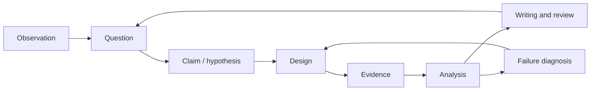
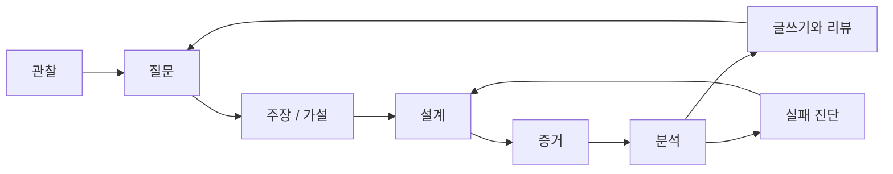

## English

Research literacy is not complete when a paper can be summarized. A researcher must turn an observation into a falsifiable question, design evidence that distinguishes explanations, diagnose system failures, and communicate claims at the strength supported by the data.

This section complements [[01-canonical-papers/how-to-read|How to Read Papers]] and [[02-foundations/ml-practice|ML Practice & Evaluation]]:

- **How to Read Papers:** consume and interrogate existing research.
- **ML Practice:** interpret datasets, metrics, and reported experiments.
- **Research Practice:** design, execute, diagnose, and defend new research.

### Running study · 이 트랙의 대상

Every page in this track works on one frozen study, **RS1**, so that a claim, its experiment, its failure log, its paper and its venue are the same object seen from eight sides — the way the robotics track reuses plant **P2**.

- **Question.** Does impedance control (B) make the planar arm's contact with a panel safer than position control with a force-threshold stop (A)? The arm is plant **P2** from [[02-foundations/lab-plants|0.6 Lab Plants]]; the panel has plant **P3**'s wall stiffness, $k_w=400\,\mathrm{N/m}$.
- **Trial and outcome.** One trial approaches the panel and makes contact; it succeeds when the peak contact force is at most $10\,\mathrm{N}$.
- **Pilot** (illustrative data, frozen — never change these numbers), peak force in newtons, 10 trials per arm:
  - A: 8.1, 9.4, 12.6, 9.8, 13.9, 7.7, 9.9, 9.1, 14.8, 11.3 — 6/10 successes, mean 10.66, sample sd 2.414
  - B: 6.2, 7.9, 8.4, 5.9, 7.1, 10.6, 6.8, 7.5, 8.0, 6.6 — 9/10 successes, mean 7.50, sample sd 1.356
- **What the pages compute from it.** A difference in means of $3.16\,\mathrm{N}$ (Welch $t=3.61$); a planned study of 32 trials per arm for the binary outcome at $\alpha=0.05$ and power 0.8, against 7 per arm for the continuous peak force (8 once the $t$-test is accounted for). Only part of that gap is the cost of cutting the force at 10 N — about a factor of two; the rest is that the pilot's success counts imply a smaller effect than its forces do. [[06-research-practice/experimental-design-reproducibility|2. Experimental Design]] separates the two.

A page may freeze a small object of its own on top of RS1 — a failure log, a simulated observer, a contact simulation — and says so in its Running object section.

### Study order

Each item carries its problem set's tier: Tier A adds a Python lab and a sweep, Tier B is worked by hand.

1. [[06-research-practice/research-questions-claims|Research Questions & Claims]] (Tier B)
2. [[06-research-practice/experimental-design-reproducibility|Experimental Design & Reproducibility]] (Tier A)
3. [[06-research-practice/failure-analysis-system-evaluation|Failure Analysis & System Evaluation]] (Tier B)
4. [[06-research-practice/scientific-writing-peer-review|Scientific Writing & Peer Review]] (Tier B)
5. [[06-research-practice/venue-strategy|Venue Strategy for Robotics & CS]] (Tier B) — where a result goes, what each review process does to it, and the submission rules that quietly block a later paper
6. [[06-research-practice/real-world-impact|Real-World Impact]] (Tier B) — what each rung of deployment evidence licenses you to claim, and which artifacts outlive the paper
7. [[06-research-practice/simulators-benchmarks-datasets|Simulators, Benchmarks & Datasets]] (Tier A) — which instrument to use for a stated experiment, what each one cannot represent, and the three verified absences that shape this domain
8. [[06-research-practice/psychophysics-human-measurement|Psychophysics & Human Measurement]] (Tier A) — threshold procedures for claims about people, and how a perceptual threshold becomes a hardware spec or a data-validity bound

The loop matters: failed experiments can revise the question or reveal that a system assumption—not the proposed algorithm—was responsible.

### Session schedule · 학습 일정

One row is one 60–90-minute session, in the study order above; [[02-foundations/overview|0. Overview]] sets the unit and keeps the pacing table these counts feed. Every row works on RS1: its frozen pilot is the object of each worked case and each problem set, and a page's own small object sits on top of it. A **bold** number marks a page's first pass — RS1's running object and the worked case plus the sections its First-pass callout names — and the bold rows alone are the Literacy pass; all rows together are the Working pass. Sizing as in the other tracks: the object and worked case open the page, the sections follow at about 1,500–2,500 words a session, each of the three Tier A pages adds a lab session, and the problem set with the self-check closes the page.

| # | Page and sections | Activity | Check that ends the session |
|---:|---|---|---|
| **1** | [[06-research-practice/research-questions-claims\|1]] object, diagram, worked case | first pass + worked case by hand | The vague sentence turned into a claim twenty numbers can contradict, its withdrawal rule written before the run (the Welch 95% CI must lie entirely above zero), and the licence table filled. |
| **2** | 1 §1–7 | first pass | One claim of each type in §4 written for RS1, and §7's claim–evidence table built for a question of your own. |
| 3 | 1 self-check, problem set | problem set | Solutions: at 12 N, A goes to 7/10 and B to 10/10; B's 10.6 N trial contradicts "eliminates". |
| **4** | [[06-research-practice/experimental-design-reproducibility\|2]] object, homework diagram | first pass | The power diagram read aloud: where the threshold $c$ sits, what is shaded as power, and why power belongs to a design rather than to a dataset. |
| **5** | 2 worked case | worked case by hand | Welch $t=3.61$ on the pilot; $32$ trials per arm for the success rate against $7$ ($8$ with the $t$-test) for peak force, by hand. |
| **6** | 2 §4 | lab and sweep | The simulated experiment reproduces power $0.81$ at $32$ per arm for rates $0.6$ and $0.9$, and gives the bootstrap interval on the force effect. |
| 7 | 2 §1–3, §8 | first pass | RS1's unit of analysis, comparison and split named (§1–3); §8's worked design read against RS1. |
| 8 | 2 §5–7, self-check, problem set 1–2 | problem set | Solutions 1–2: rates $0.6$ and $0.8$ need $82$ per arm, $2.6$ times RS1's $32$ for two-thirds of the gap. |
| 9 | 2 problem set 3 | lab and sweep | Formula against simulation at $32$, $50$, $70$, $82$ and $100$ per arm: $0.41$ and $0.43$ at $32$, $0.59$ and $0.59$ at $50$. |
| **10** | [[06-research-practice/failure-analysis-system-evaluation\|3]] object, diagram, worked case | first pass + worked case by hand | Incident 5 traced back to its first failure; six failures in $200$ h as $\hat\lambda=0.030$ per hour, MTBF $33.3$ h, exact interval $[15.3,\,90.8]$ h. |
| **11** | 3 §1–2, §4, §6 | first pass | First failure against downstream symptom on one incident (§1); a fault injection that would isolate it (§4); a rate with its interval (§6). |
| 12 | 3 §3, §5, §7–8, self-check | first pass | §7's second diagnosis followed on the other robot; what §8 says a negative result must still report. |
| 13 | 3 problem set | problem set | Solutions: the stall at $1.35$ s freezes A's stop at $3.0$ N; $k=8$ in $300$ h gives MTBF $37.5$ h in $[19.0,\,86.9]$ h. |
| **14** | [[06-research-practice/scientific-writing-peer-review\|4]] object, diagram, worked case | first pass + worked case by hand | Table 1 rebuilt: A $0.60\ [0.31,\,0.83]$ and B $0.90\ [0.60,\,0.98]$ with Fisher $p=0.30$, each number beside the sentence it licenses and the one it does not. |
| **15** | 4 §4, §6–7 | first pass | RS1's figure planned before its code (§4); its limitations paragraph (§6); one review comment classified (§7). |
| 16 | 4 §1–3, §5, §8–9, self-check | first pass | The paper-level argument in five sentences (§1); one compliant rebuttal written after §8's example. |
| 17 | 4 problem set | problem set | Solutions: under 12 N, B's 10/10 has the Wilson interval $[0.722,\,1.000]$; reading "not significant" as "no effect" is the reviewer's misreading. |
| **18** | [[06-research-practice/venue-strategy\|5]] object, diagram, worked case | first pass + worked case by hand | RS1's paper on both routes in relative months — Route B waits for no deadline and presents within $8.9$ months of acceptance — with the one rule on each route that closes a later journal version. |
| **19** | 5 §2, §4–6 | first pass | Whether each venue lets you reply and when you can submit (§2); the RA-L route (§4); the workshop rule that silently blocks a later paper (§6). |
| 20 | 5 §1, §3, §7, self-check | first pass | A venue choice defended to someone else in three sentences, from §1 and §3. |
| 21 | 5 problem set | problem set | Solutions: the route map keeps its shape for the null result; ISARC is refereed and indexed but accepts about 76%. |
| **22** | [[06-research-practice/real-world-impact\|6]] object, diagram, worked case | first pass + worked case by hand | The pilot placed on rung 1 of the ladder and the next rung priced: $32$ per arm by success rate, $8$ by peak force. |
| **23** | 6 §1–6 | first pass | What each rung of §2 licenses you to claim, and the rung chosen in advance for your own study (§4). |
| 24 | 6 self-check, problem set | problem set | Solutions: at $p_A=0.7$ and $p_B=0.9$ the next rung needs $62$ per arm; the draft abstract claims rung 2 on rung-1 evidence. |
| **25** | [[06-research-practice/simulators-benchmarks-datasets\|7]] object, diagram, §1 | first pass | The drop cell set up — P3's handle at $v_0=0.1$ m/s onto walls of $400$ and $40{,}000$ N/m — and the diagram's axes scaled so that energy is distance. |
| **26** | 7 worked case | worked case by hand | Explicit Euler multiplies the energy by $1+(\omega\Delta t)^2$ per step in contact; semi-implicit is stable only below $\Delta t=2/\omega$, $20$ ms on the panel and $2$ ms on the stiff wall; one bounce stepped by hand. |
| **27** | 7 §3 | lab and sweep | The same drop as a lab; its table prices what "fast and stable" costs a simulator. |
| **28** | 7 §2, §7–8 | first pass | The status traps of §2 named for one simulator; the missing force data of §7–8 stated as a citable absence. |
| 29 | 7 §4–6 | first pass | Terrain and deformable materials as stated gaps (§4–5); what one benchmark's numbers do and do not show (§6). |
| 30 | 7 §9–11, self-check | first pass | §10's questions put to someone else's tooling section, and §11's to one learned-policy evaluation. |
| 31 | 7 problem set | problem set + lab and sweep | Solutions: the lighter handle gives $\omega=141.4$ rad/s and $22.2$ ms of contact on the panel; problem 3's undamped sweep reported. |
| **32** | [[06-research-practice/psychophysics-human-measurement\|8]] object, diagram, worked case | first pass + worked case by hand | The observer's threshold carried to an encoder specification on P3: $\sigma=136.40$ N/m and $\Delta k_{70.7}=74.33$ N/m. |
| **33** | 8 §1–2 | first pass | §1's five definitions, each with its example; the derivation that closes §2 redone. |
| **34** | 8 §3, §7 | first pass + lab and sweep | §3's chain from threshold to hardware on P3; §7's staircase run and its bias read against the true threshold. |
| 35 | 8 §4–6, self-check | first pass | A data-validity bound from a threshold (§4), and one site-interface or workload claim checked against §5–6. |
| 36 | 8 problem set | problem set + lab and sweep | Solutions: 1-up-3-down targets $p^*=2^{-1/3}=0.7937$, a threshold of $111.76$ N/m; problem 3's sweep of the new rule reported. |

**Totals.** 36 sessions for the Working pass, 20 of them bold. A Literacy pass is the bold rows, or one session a page — 8 — when only RS1's object and each worked case are read. Plan on up to a fifth more for problems redone and labs debugged.

## 한국어

논문을 요약할 수 있다고 연구 문해력이 완성되는 것은 아니다. 연구자는 관찰을 반증 가능한
질문으로 바꾸고, 여러 설명을 구분하는 증거를 설계하고, 시스템 실패를 진단하고, 데이터가
지지하는 강도로 주장을 전달해야 한다.

이 섹션은 [[01-canonical-papers/how-to-read|How to Read Papers]]와
[[02-foundations/ml-practice|ML 실무와 평가]]를 보완한다:

- **How to Read Papers:** 기존 연구를 소비하고 심문한다.
- **ML Practice:** 데이터셋, 지표, 보고된 실험을 해석한다.
- **Research Practice:** 새 연구를 설계·실행·진단·방어한다.

### 이 트랙의 대상 · Running study

이 트랙의 모든 페이지는 고정된 연구 하나, **RS1** 위에서 일한다. 그래서 주장, 그 실험, 그 실패 기록, 그 논문, 그 venue가 여덟 방향에서 본 같은 대상이 된다 — 로보틱스 트랙이 장치 **P2**를 계속 쓰는 것과 같은 방식이다.

- **질문.** 임피던스 제어(B)가 힘 문턱 정지를 단 위치 제어(A)보다 평면 팔의 패널 접촉을 더 안전하게 만드는가? 팔은 [[02-foundations/lab-plants|0.6 Lab Plants]]의 장치 **P2**, 패널 강성은 장치 **P3**의 벽 강성 $k_w=400\,\mathrm{N/m}$이다.
- **시행과 결과.** 시행 하나는 패널에 다가가 접촉하는 것이고, 최대 접촉력이 $10\,\mathrm{N}$ 이하면 성공이다.
- **예비 실험**(예시용 데이터, 고정 — 이 숫자는 절대 바꾸지 않는다), 팔마다 10회, 최대 접촉력(뉴턴):
  - A: 8.1, 9.4, 12.6, 9.8, 13.9, 7.7, 9.9, 9.1, 14.8, 11.3 — 성공 6/10, 평균 10.66, 표본 표준편차 2.414
  - B: 6.2, 7.9, 8.4, 5.9, 7.1, 10.6, 6.8, 7.5, 8.0, 6.6 — 성공 9/10, 평균 7.50, 표본 표준편차 1.356
- **페이지들이 여기서 계산하는 것.** 평균 차이 $3.16\,\mathrm{N}$(Welch $t=3.61$). 이진 결과로는 $\alpha=0.05$, 검정력 0.8에서 팔마다 32회가 필요하지만 연속값인 최대 접촉력으로는 7회면 된다($t$-검정까지 따지면 8회). 그 차이 중 10 N에서 힘을 자르는 비용은 일부, 약 두 배뿐이고, 나머지는 예비 실험의 성공 횟수가 힘 데이터보다 작은 효과를 가리키기 때문이다. 둘을 나누는 것은 [[06-research-practice/experimental-design-reproducibility|2. 실험 설계]]다.

페이지는 RS1 위에 자기만의 작은 대상 — 실패 기록, 시뮬레이션 관찰자, 접촉 시뮬레이션 — 을 고정할 수 있고, 그 사실을 이 페이지의 대상 절에 적는다.

### 학습 순서

각 항목에는 그 페이지 과제의 tier를 적었다: Tier A는 Python 실습과 스윕을 더하고, Tier B는 손으로 푼다.

1. [[06-research-practice/research-questions-claims|연구 질문과 주장]] (Tier B)
2. [[06-research-practice/experimental-design-reproducibility|실험 설계와 재현성]] (Tier A)
3. [[06-research-practice/failure-analysis-system-evaluation|실패 분석과 시스템 평가]] (Tier B)
4. [[06-research-practice/scientific-writing-peer-review|과학적 글쓰기와 peer review]] (Tier B)
5. [[06-research-practice/venue-strategy|로보틱스·CS의 Venue 전략]] (Tier B) — 결과가 어디로 가는가, 각 심사 과정이 그것에 무엇을 하는가, 그리고 다음 논문을 조용히 막는 제출 규칙들
6. [[06-research-practice/real-world-impact|실세계 임팩트]] (Tier B) — 배치 증거의 각 단계가 무엇을 주장하도록 허락하는가, 그리고 어떤 산출물이 논문보다 오래 사는가
7. [[06-research-practice/simulators-benchmarks-datasets|시뮬레이터·벤치마크·데이터셋]] (Tier A) — 주어진 실험에 어느 도구를 쓸 것인가, 각각이 무엇을 표현하지 못하는가, 그리고 이 도메인을 규정하는 검증된 부재 셋
8. [[06-research-practice/psychophysics-human-measurement|심리물리와 인간 측정]] (Tier A) — 사람에 대한 주장을 위한 임계값 측정 절차, 그리고 지각 임계값이 하드웨어 사양과 데이터 타당성 경계가 되는 방식

루프가 핵심이다: 실패한 실험은 질문을 고치게 하거나, 제안한 알고리즘이 아니라 시스템
가정이 원인이었음을 드러낼 수 있다.

### 학습 일정 · Session schedule

한 행이 60–90분 학습 회차 하나이고, 순서는 위 학습 순서다. 그 단위와, 이 회차 수가 들어가는 페이스 표는 [[02-foundations/overview|0. Overview]]에 있다. 모든 행이 RS1 위에서 일한다: 고정된 예비 실험이 모든 계산 예제와 과제의 대상이고, 페이지 자신의 작은 대상은 그 위에 얹힌다. **굵은** 번호는 페이지의 첫 읽기 — RS1의 대상과 끝까지 계산, 그리고 처음이라면 콜아웃이 지목한 절 — 를 표시한다. 굵은 행만 하면 Literacy 통과이고, 모든 행을 하면 Working 통과다. 산정은 다른 트랙과 같다: 대상과 끝까지 계산이 페이지를 열고, 절은 회차당 영어 약 1,500–2,500단어씩 이어지며, Tier A 페이지 셋은 각각 실습 회차를 하나 더 두고, 과제와 스스로 점검이 페이지를 닫는다.

| # | 페이지와 절 | 활동 | 회차를 끝내는 확인 |
|---:|---|---|---|
| **1** | [[06-research-practice/research-questions-claims\|1]] 대상·과제 그림·끝까지 계산 | 첫 읽기 + 손 계산 | 막연한 문장을 스무 개 숫자가 반박할 수 있는 주장으로 바꾸고, 실행 전에 철회 규칙(Welch 95% CI가 0보다 완전히 위)을 쓰고, 허용 표를 채운다. |
| **2** | 1 §1–7 | 첫 읽기 | §4의 주장 유형마다 RS1에 대한 주장을 하나씩 쓰고, 자기 질문으로 §7의 주장–증거 표를 만든다. |
| 3 | 1 스스로 점검, 과제 | 과제 | 정답: 12 N 기준이면 A는 7/10, B는 10/10. B의 10.6 N 시행이 "없앤다"는 주장을 반박한다. |
| **4** | [[06-research-practice/experimental-design-reproducibility\|2]] 대상, 과제 그림 | 첫 읽기 | 검정력 그림을 소리 내어 읽는다: 문턱 $c$가 어디 있고 무엇이 검정력으로 칠해지며, 검정력이 왜 데이터가 아니라 설계의 성질인지. |
| **5** | 2 끝까지 계산 | 손 계산 | 예비 실험의 Welch $t=3.61$. 성공률로는 팔마다 $32$회, 최대 접촉력으로는 $7$회($t$-검정까지 따지면 $8$회)를 손으로 구한다. |
| **6** | 2 §4 | 실습과 스윕 | 시뮬레이션한 실험이 성공률 $0.6$, $0.9$에서 팔마다 $32$회의 검정력 $0.81$을 재현하고 힘 효과의 bootstrap 구간을 준다. |
| 7 | 2 §1–3, §8 | 첫 읽기 | RS1의 분석 단위·비교·분할을 댄다(§1–3). §8의 설계 예제를 RS1에 맞대어 읽는다. |
| 8 | 2 §5–7, 스스로 점검, 과제 1–2 | 과제 | 정답 1–2: 성공률 $0.6$과 $0.8$이면 팔마다 $82$회 — 차이의 3분의 2를 위해 RS1의 $32$회의 $2.6$배가 든다. |
| 9 | 2 과제 3 | 실습과 스윕 | 팔마다 $32$, $50$, $70$, $82$, $100$회에서 공식 대 시뮬레이션: $32$회에서 $0.41$과 $0.43$, $50$회에서 $0.59$와 $0.59$. |
| **10** | [[06-research-practice/failure-analysis-system-evaluation\|3]] 대상·과제 그림·끝까지 계산 | 첫 읽기 + 손 계산 | 사건 5를 첫 실패까지 거슬러 간다. $200$시간에 실패 6건은 시간당 $\hat\lambda=0.030$, MTBF $33.3$시간, 정확 구간 $[15.3,\,90.8]$시간이다. |
| **11** | 3 §1–2, §4, §6 | 첫 읽기 | 사건 하나에서 첫 실패와 하류 증상을 가른다(§1). 그것을 격리할 fault injection 하나(§4). 구간이 붙은 실패율(§6). |
| 12 | 3 §3, §5, §7–8, 스스로 점검 | 첫 읽기 | §7의 두 번째 진단을 다른 로봇에서 따라간다. §8이 말하는, 부정적 결과도 보고해야 하는 것. |
| 13 | 3 과제 | 과제 | 정답: $1.35$ s의 멈춤이 A의 정지를 $3.0$ N에 얼린다. $300$시간에 $k=8$이면 MTBF $37.5$시간, 구간 $[19.0,\,86.9]$시간. |
| **14** | [[06-research-practice/scientific-writing-peer-review\|4]] 대상·과제 그림·끝까지 계산 | 첫 읽기 + 손 계산 | 표 1을 다시 만든다: A $0.60\ [0.31,\,0.83]$, B $0.90\ [0.60,\,0.98]$, Fisher $p=0.30$. 숫자마다 그것이 허락하는 문장과 허락하지 않는 문장을 옆에 둔다. |
| **15** | 4 §4, §6–7 | 첫 읽기 | RS1의 그림을 코드보다 먼저 계획한다(§4). 한계 문단(§6). 리뷰 코멘트 하나를 분류한다(§7). |
| 16 | 4 §1–3, §5, §8–9, 스스로 점검 | 첫 읽기 | 논문 수준의 논증을 다섯 문장으로(§1). §8의 예를 따라 규정에 맞는 답변 하나를 쓴다. |
| 17 | 4 과제 | 과제 | 정답: 12 N 기준에서 B의 10/10은 Wilson 구간 $[0.722,\,1.000]$. "유의하지 않다"를 "효과가 없다"로 읽은 것이 리뷰어의 오독이다. |
| **18** | [[06-research-practice/venue-strategy\|5]] 대상·과제 그림·끝까지 계산 | 첫 읽기 + 손 계산 | RS1 논문을 두 경로에 상대 월로 올린다 — 경로 B는 마감을 기다리지 않고 채택 후 $8.9$개월 안에 발표한다 — 그리고 경로마다 나중 저널판을 막는 규칙 하나. |
| **19** | 5 §2, §4–6 | 첫 읽기 | venue마다 답변할 수 있는지와 언제 제출할 수 있는지(§2). RA-L 경로(§4). 나중 논문을 조용히 막는 워크숍 규칙(§6). |
| 20 | 5 §1, §3, §7, 스스로 점검 | 첫 읽기 | §1과 §3으로 venue 선택 하나를 남에게 세 문장으로 변호한다. |
| 21 | 5 과제 | 과제 | 정답: 영결과에서도 경로 지도의 모양은 그대로다. ISARC는 심사를 거치고 색인되지만 약 76%를 채택한다. |
| **22** | [[06-research-practice/real-world-impact\|6]] 대상·과제 그림·끝까지 계산 | 첫 읽기 + 손 계산 | 예비 실험을 사다리의 1단에 올리고 다음 단의 값을 매긴다: 성공률로는 팔마다 $32$회, 최대 접촉력으로는 $8$회. |
| **23** | 6 §1–6 | 첫 읽기 | §2의 단마다 무엇을 주장해도 되는지 말하고, 자기 연구의 단을 미리 고른다(§4). |
| 24 | 6 스스로 점검, 과제 | 과제 | 정답: $p_A=0.7$, $p_B=0.9$이면 다음 단에 팔마다 $62$회. 초고 초록은 1단의 증거로 2단을 주장한다. |
| **25** | [[06-research-practice/simulators-benchmarks-datasets\|7]] 대상, 과제 그림, §1 | 첫 읽기 | 낙하 셀을 세운다 — P3의 핸들이 $v_0=0.1$ m/s로 $400$, $40{,}000$ N/m 벽에 닿는다 — 그리고 에너지가 거리가 되도록 그림의 축을 맞춘다. |
| **26** | 7 끝까지 계산 | 손 계산 | explicit Euler는 접촉 중 스텝마다 에너지를 $1+(\omega\Delta t)^2$배 한다. semi-implicit는 $\Delta t=2/\omega$ 아래에서만 안정하다 — 패널 $20$ ms, 단단한 벽 $2$ ms. 튕김 한 번을 손으로 스텝한다. |
| **27** | 7 §3 | 실습과 스윕 | 같은 낙하를 실습으로 돌린다. 그 표가 "빠르고 안정하다"가 시뮬레이터에 치르게 하는 값을 매긴다. |
| **28** | 7 §2, §7–8 | 첫 읽기 | 시뮬레이터 하나에 대해 §2의 상태 함정을 댄다. §7–8의 빠진 힘 데이터를 인용할 수 있는 부재로 진술한다. |
| 29 | 7 §4–6 | 첫 읽기 | 지형과 변형 재료를 진술된 공백으로(§4–5). 벤치마크 하나의 숫자가 보여 주는 것과 보여 주지 않는 것(§6). |
| 30 | 7 §9–11, 스스로 점검 | 첫 읽기 | §10의 질문을 남의 도구 절에, §11의 질문을 학습 정책 평가 하나에 던진다. |
| 31 | 7 과제 | 과제 + 실습과 스윕 | 정답: 가벼운 핸들은 패널에서 $\omega=141.4$ rad/s, 접촉 $22.2$ ms. 과제 3의 감쇠 없는 스윕을 보고한다. |
| **32** | [[06-research-practice/psychophysics-human-measurement\|8]] 대상·과제 그림·끝까지 계산 | 첫 읽기 + 손 계산 | 관찰자의 임계값을 P3의 엔코더 사양까지 가져간다: $\sigma=136.40$ N/m, $\Delta k_{70.7}=74.33$ N/m. |
| **33** | 8 §1–2 | 첫 읽기 | §1의 다섯 정의를 각각의 예와 함께 정리하고, §2를 닫는 유도를 다시 한다. |
| **34** | 8 §3, §7 | 첫 읽기 + 실습과 스윕 | §3의 사슬: P3에서 임계값을 하드웨어 사양으로. §7의 staircase를 돌리고 그 편향을 참 임계값에 대어 읽는다. |
| 35 | 8 §4–6, 스스로 점검 | 첫 읽기 | 임계값에서 나온 데이터 타당성 경계(§4), 그리고 현장 인터페이스나 작업부하 주장 하나를 §5–6에 대어 본다. |
| 36 | 8 과제 | 과제 + 실습과 스윕 | 정답: 1-up-3-down의 목표 확률은 $p^*=2^{-1/3}=0.7937$, 임계값은 $111.76$ N/m. 과제 3의 새 규칙 스윕을 보고한다. |

**합계.** Working 통과는 36회이고 그중 굵은 회차가 20회다. Literacy 통과는 굵은 회차만 하는 것이고, RS1의 대상과 끝까지 계산만 읽으면 페이지당 1회로 8회다. 다시 푸는 과제와 실습 디버깅을 위해 최대 5분의 1을 더 잡는다.
