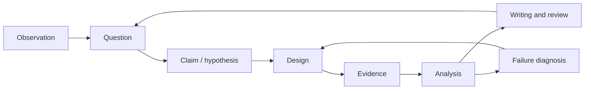
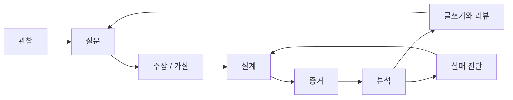

## English

Research literacy is not complete when a paper can be summarized. A researcher must turn an observation into a falsifiable question, design evidence that distinguishes explanations, diagnose system failures, and communicate claims at the strength supported by the data.

This section complements [[01-canonical-papers/how-to-read|How to Read Papers]] and [[02-foundations/ml-practice|ML Practice & Evaluation]]:

- **How to Read Papers:** consume and interrogate existing research.
- **ML Practice:** interpret datasets, metrics, and reported experiments.
- **Research Practice:** design, execute, diagnose, and defend new research.

### Running study · 이 트랙의 대상

Every page in this track works on one frozen study, **RS1**, so that a claim, its experiment, its failure log, its paper and its venue are the same object seen from eight sides — the way the robotics track reuses plant **P2**.

- **Question.** Does impedance control (B) make the planar arm's contact with a panel safer than position control with a force-threshold stop (A)? The arm is plant **P2** from [[02-foundations/lab-plants|0.6 Lab Plants]]; the panel has plant **P3**'s wall stiffness, $k_w=400\,\mathrm{N/m}$.
- **Trial and outcome.** One trial approaches the panel and makes contact; it succeeds when the peak contact force is at most $10\,\mathrm{N}$.
- **Pilot** (illustrative data, frozen — never change these numbers), peak force in newtons, 10 trials per arm:
  - A: 8.1, 9.4, 12.6, 9.8, 13.9, 7.7, 9.9, 9.1, 14.8, 11.3 — 6/10 successes, mean 10.66, sample sd 2.414
  - B: 6.2, 7.9, 8.4, 5.9, 7.1, 10.6, 6.8, 7.5, 8.0, 6.6 — 9/10 successes, mean 7.50, sample sd 1.356
- **What the pages compute from it.** A difference in means of $3.16\,\mathrm{N}$ (Welch $t=3.61$); a planned study of 32 trials per arm for the binary outcome at $\alpha=0.05$ and power 0.8, against 7 per arm for the continuous peak force (8 once the $t$-test is accounted for). Only part of that gap is the cost of cutting the force at 10 N — about a factor of two; the rest is that the pilot's success counts imply a smaller effect than its forces do. [[06-research-practice/experimental-design-reproducibility|2. Experimental Design]] separates the two.

A page may freeze a small object of its own on top of RS1 — a failure log, a simulated observer, a contact simulation — and says so in its Running object section.

### Study order

1. [[06-research-practice/research-questions-claims|Research Questions & Claims]]
2. [[06-research-practice/experimental-design-reproducibility|Experimental Design & Reproducibility]]
3. [[06-research-practice/failure-analysis-system-evaluation|Failure Analysis & System Evaluation]]
4. [[06-research-practice/scientific-writing-peer-review|Scientific Writing & Peer Review]]
5. [[06-research-practice/venue-strategy|Venue Strategy for Robotics & CS]] — where a result goes, what each review process does to it, and the submission rules that quietly block a later paper
6. [[06-research-practice/real-world-impact|Real-World Impact]] — what each rung of deployment evidence licenses you to claim, and which artifacts outlive the paper
7. [[06-research-practice/simulators-benchmarks-datasets|Simulators, Benchmarks & Datasets]] — which instrument to use for a stated experiment, what each one cannot represent, and the three verified absences that shape this domain
8. [[06-research-practice/psychophysics-human-measurement|Psychophysics & Human Measurement]] — threshold procedures for claims about people, and how a perceptual threshold becomes a hardware spec or a data-validity bound

The loop matters: failed experiments can revise the question or reveal that a system assumption—not the proposed algorithm—was responsible.

## 한국어

논문을 요약할 수 있다고 연구 문해력이 완성되는 것은 아니다. 연구자는 관찰을 반증 가능한
질문으로 바꾸고, 여러 설명을 구분하는 증거를 설계하고, 시스템 실패를 진단하고, 데이터가
지지하는 강도로 주장을 전달해야 한다.

이 섹션은 [[01-canonical-papers/how-to-read|How to Read Papers]]와
[[02-foundations/ml-practice|ML 실무와 평가]]를 보완한다:

- **How to Read Papers:** 기존 연구를 소비하고 심문한다.
- **ML Practice:** 데이터셋, 지표, 보고된 실험을 해석한다.
- **Research Practice:** 새 연구를 설계·실행·진단·방어한다.

### 이 트랙의 대상 · Running study

이 트랙의 모든 페이지는 고정된 연구 하나, **RS1** 위에서 일한다. 그래서 주장, 그 실험, 그 실패 기록, 그 논문, 그 venue가 여덟 방향에서 본 같은 대상이 된다 — 로보틱스 트랙이 장치 **P2**를 계속 쓰는 것과 같은 방식이다.

- **질문.** 임피던스 제어(B)가 힘 문턱 정지를 단 위치 제어(A)보다 평면 팔의 패널 접촉을 더 안전하게 만드는가? 팔은 [[02-foundations/lab-plants|0.6 Lab Plants]]의 장치 **P2**, 패널 강성은 장치 **P3**의 벽 강성 $k_w=400\,\mathrm{N/m}$이다.
- **시행과 결과.** 시행 하나는 패널에 다가가 접촉하는 것이고, 최대 접촉력이 $10\,\mathrm{N}$ 이하면 성공이다.
- **예비 실험**(예시용 데이터, 고정 — 이 숫자는 절대 바꾸지 않는다), 팔마다 10회, 최대 접촉력(뉴턴):
  - A: 8.1, 9.4, 12.6, 9.8, 13.9, 7.7, 9.9, 9.1, 14.8, 11.3 — 성공 6/10, 평균 10.66, 표본 표준편차 2.414
  - B: 6.2, 7.9, 8.4, 5.9, 7.1, 10.6, 6.8, 7.5, 8.0, 6.6 — 성공 9/10, 평균 7.50, 표본 표준편차 1.356
- **페이지들이 여기서 계산하는 것.** 평균 차이 $3.16\,\mathrm{N}$(Welch $t=3.61$). 이진 결과로는 $\alpha=0.05$, 검정력 0.8에서 팔마다 32회가 필요하지만 연속값인 최대 접촉력으로는 7회면 된다($t$-검정까지 따지면 8회). 그 차이 중 10 N에서 힘을 자르는 비용은 일부, 약 두 배뿐이고, 나머지는 예비 실험의 성공 횟수가 힘 데이터보다 작은 효과를 가리키기 때문이다. 둘을 나누는 것은 [[06-research-practice/experimental-design-reproducibility|2. 실험 설계]]다.

페이지는 RS1 위에 자기만의 작은 대상 — 실패 기록, 시뮬레이션 관찰자, 접촉 시뮬레이션 — 을 고정할 수 있고, 그 사실을 이 페이지의 대상 절에 적는다.

### 학습 순서

1. [[06-research-practice/research-questions-claims|연구 질문과 주장]]
2. [[06-research-practice/experimental-design-reproducibility|실험 설계와 재현성]]
3. [[06-research-practice/failure-analysis-system-evaluation|실패 분석과 시스템 평가]]
4. [[06-research-practice/scientific-writing-peer-review|과학적 글쓰기와 peer review]]
5. [[06-research-practice/venue-strategy|로보틱스·CS의 Venue 전략]] — 결과가 어디로 가는가, 각 심사 과정이 그것에 무엇을 하는가, 그리고 다음 논문을 조용히 막는 제출 규칙들
6. [[06-research-practice/real-world-impact|실세계 임팩트]] — 배치 증거의 각 단계가 무엇을 주장하도록 허락하는가, 그리고 어떤 산출물이 논문보다 오래 사는가
7. [[06-research-practice/simulators-benchmarks-datasets|시뮬레이터·벤치마크·데이터셋]] — 주어진 실험에 어느 도구를 쓸 것인가, 각각이 무엇을 표현하지 못하는가, 그리고 이 도메인을 규정하는 검증된 부재 셋
8. [[06-research-practice/psychophysics-human-measurement|심리물리와 인간 측정]] — 사람에 대한 주장을 위한 임계값 측정 절차, 그리고 지각 임계값이 하드웨어 사양과 데이터 타당성 경계가 되는 방식

루프가 핵심이다: 실패한 실험은 질문을 고치게 하거나, 제안한 알고리즘이 아니라 시스템
가정이 원인이었음을 드러낼 수 있다.
