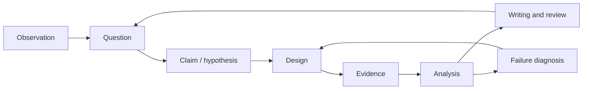

## English

Research literacy is not complete when a paper can be summarized. A researcher must turn an observation into a falsifiable question, design evidence that distinguishes explanations, diagnose system failures, and communicate claims at the strength supported by the data.

This section complements [[01-canonical-papers/how-to-read|How to Read Papers]] and [[02-foundations/ml-practice|ML Practice & Evaluation]]:

- **How to Read Papers:** consume and interrogate existing research.
- **ML Practice:** interpret datasets, metrics, and reported experiments.
- **Research Practice:** design, execute, diagnose, and defend new research.

### Study order

1. [[06-research-practice/research-questions-claims|Research Questions & Claims]]
2. [[06-research-practice/experimental-design-reproducibility|Experimental Design & Reproducibility]]
3. [[06-research-practice/failure-analysis-system-evaluation|Failure Analysis & System Evaluation]]
4. [[06-research-practice/scientific-writing-peer-review|Scientific Writing & Peer Review]]

The loop matters: failed experiments can revise the question or reveal that a system assumption—not the proposed algorithm—was responsible.

## 한국어

논문을 요약할 수 있다고 연구 수행 능력이 완성되는 것은 아니다. 연구자는 관찰을 반증 가능한 질문으로 바꾸고, 여러 설명을 구분할 증거를 설계하며, 시스템 실패를 진단하고, 데이터가 지지하는 강도로 주장을 써야 한다.

[[01-canonical-papers/how-to-read|How to Read Papers]]는 기존 연구를 읽는 법, [[02-foundations/ml-practice|ML Practice]]는 데이터·metric·실험 결과를 해석하는 법, 이 섹션은 새 연구를 설계·실행·진단·방어하는 법을 담당한다. 위 네 페이지를 순서대로 읽되 실제 연구에서는 질문–실험–실패 분석–글쓰기를 반복한다.
