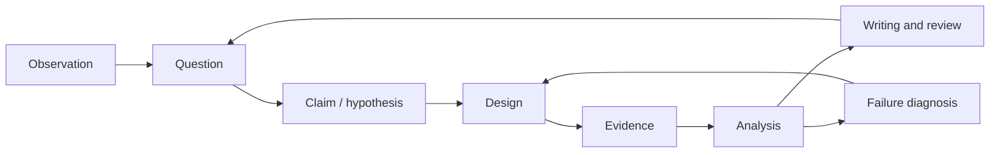
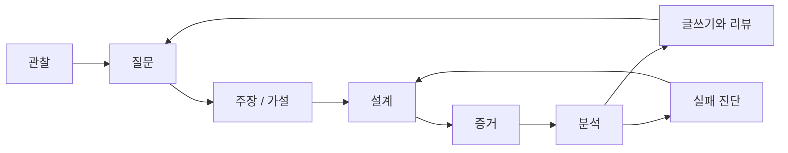

## English

Research literacy is not complete when a paper can be summarized. A researcher must turn an observation into a falsifiable question, design evidence that distinguishes explanations, diagnose system failures, and communicate claims at the strength supported by the data.

This section complements [[01-canonical-papers/how-to-read|How to Read Papers]] and [[02-foundations/ml-practice|ML Practice & Evaluation]]:

- **How to Read Papers:** consume and interrogate existing research.
- **ML Practice:** interpret datasets, metrics, and reported experiments.
- **Research Practice:** design, execute, diagnose, and defend new research.

### Study order

1. [[06-research-practice/research-questions-claims|Research Questions & Claims]]
2. [[06-research-practice/experimental-design-reproducibility|Experimental Design & Reproducibility]]
3. [[06-research-practice/failure-analysis-system-evaluation|Failure Analysis & System Evaluation]]
4. [[06-research-practice/scientific-writing-peer-review|Scientific Writing & Peer Review]]
5. [[06-research-practice/venue-strategy|Venue Strategy for Robotics & CS]] — where a result goes, what each review process does to it, and the submission rules that quietly block a later paper
6. [[06-research-practice/real-world-impact|Real-World Impact]] — what each rung of deployment evidence licenses you to claim, and which artifacts outlive the paper
7. [[06-research-practice/simulators-benchmarks-datasets|Simulators, Benchmarks & Datasets]] — which instrument to use for a stated experiment, what each one cannot represent, and the three verified absences that shape this domain

The loop matters: failed experiments can revise the question or reveal that a system assumption—not the proposed algorithm—was responsible.

## 한국어

논문을 요약할 수 있다고 연구 문해력이 완성되는 것은 아니다. 연구자는 관찰을 반증 가능한
질문으로 바꾸고, 여러 설명을 구분하는 증거를 설계하고, 시스템 실패를 진단하고, 데이터가
지지하는 강도로 주장을 전달해야 한다.

이 섹션은 [[01-canonical-papers/how-to-read|How to Read Papers]]와
[[02-foundations/ml-practice|ML 실무와 평가]]를 보완한다:

- **How to Read Papers:** 기존 연구를 소비하고 심문한다.
- **ML Practice:** 데이터셋, 지표, 보고된 실험을 해석한다.
- **Research Practice:** 새 연구를 설계·실행·진단·방어한다.

### 학습 순서

1. [[06-research-practice/research-questions-claims|연구 질문과 주장]]
2. [[06-research-practice/experimental-design-reproducibility|실험 설계와 재현성]]
3. [[06-research-practice/failure-analysis-system-evaluation|실패 분석과 시스템 평가]]
4. [[06-research-practice/scientific-writing-peer-review|과학적 글쓰기와 peer review]]
5. [[06-research-practice/venue-strategy|로보틱스·CS의 Venue 전략]] — 결과가 어디로 가는가, 각 심사 과정이 그것에 무엇을 하는가, 그리고 다음 논문을 조용히 막는 제출 규칙들
6. [[06-research-practice/real-world-impact|실세계 임팩트]] — 배치 증거의 각 단계가 무엇을 주장하도록 허락하는가, 그리고 어떤 산출물이 논문보다 오래 사는가
7. [[06-research-practice/simulators-benchmarks-datasets|시뮬레이터·벤치마크·데이터셋]] — 주어진 실험에 어느 도구를 쓸 것인가, 각각이 무엇을 표현하지 못하는가, 그리고 이 도메인을 규정하는 검증된 부재 셋

루프가 핵심이다: 실패한 실험은 질문을 고치게 하거나, 제안한 알고리즘이 아니라 시스템
가정이 원인이었음을 드러낼 수 있다.
