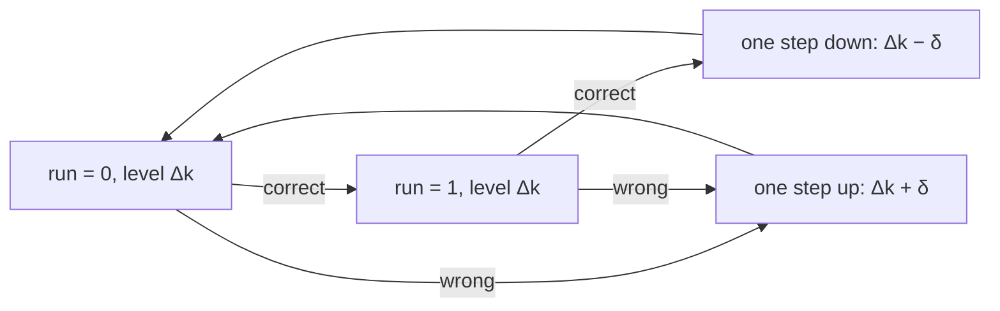
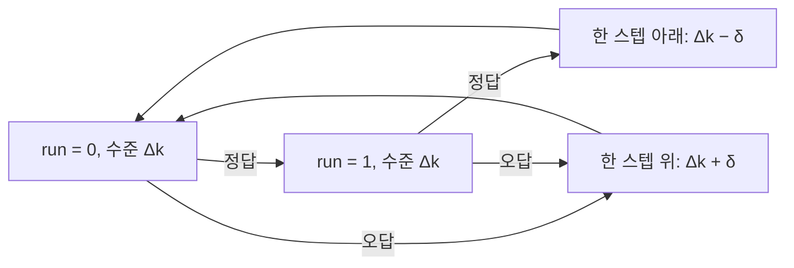

> [!abstract] Depth target · 깊이 목표
> **Working** — enough to pick a threshold procedure, use published thresholds as design
> numbers, and read a human-subjects evaluation without mistaking workload for perception.
> **Working** — 임계값 측정 절차를 고르고, 발표된 임계값을 설계 수치로 쓰고, 작업부하
> 연구를 지각 연구로 혼동하지 않고 인간 대상 평가를 읽을 수 있는 수준.

> [!note] Prerequisites · 선수 지식
> [[06-research-practice/experimental-design-reproducibility|2. Experimental Design & Reproducibility]] first — this page
> is that page's toolbox for the special case where the measured system is a person.
> Plant **P3** from [[02-foundations/lab-plants|0.6 Lab Plants]], with its encoder count from [[04-robotics/haptics-teleoperation/device-design-kinematics|24.3 §4]]; the normal CDF $\Phi$ from [[02-foundations/probability|3. Probability §2–§3]]; the blank-and-solve pattern of [[02-foundations/lab-kernel|0.7 §5]] for the lab.
> [[06-research-practice/experimental-design-reproducibility|2. 실험 설계와 재현성]]을 먼저 —
> 이 페이지는 측정 대상이 사람인 특수 사례를 위한 그 페이지의 공구함이다.
> [[02-foundations/lab-plants|0.6 Lab Plants]]의 **P3** 핸들, 그리고 [[04-robotics/haptics-teleoperation/device-design-kinematics|24.3 §4]]의 엔코더 한 카운트. 정규분포의 누적분포함수 $\Phi$는 [[02-foundations/probability|3. 확률 §2–§3]]. 랩은 [[02-foundations/lab-kernel|0.7 §5]]의 빈칸 채우기 방식을 따른다.

> [!tip] Haptics application path · 햅틱 응용 경로
> For touch physiology, psychometric functions, and a compact threshold worked example, continue with [[04-robotics/haptics-teleoperation/human-haptics-psychophysics|Human Haptics & Psychophysics]]. For the complete device → rendering → teleoperation → evidence sequence, use [[04-robotics/haptics-teleoperation/index|24. Haptics & Teleoperation]].
>
> 촉각 생리, psychometric function, 임계값 계산 예제는 [[04-robotics/haptics-teleoperation/human-haptics-psychophysics|Human Haptics & Psychophysics]]로 이어진다. 장치 → 렌더링 → 원격조작 → 증거의 전체 순서는 [[04-robotics/haptics-teleoperation/index|24. Haptics & Teleoperation]]을 따른다.

## English

*Stands on [[06-research-practice/experimental-design-reproducibility|2. Experimental Design]], whose first rule — the participant is the unit — this page applies to people, and on [[04-robotics/haptics-teleoperation/human-haptics-psychophysics|24.1]], which fits a psychometric function to a force table on the same handle. Later use of plant **P3**, here as a stiffness display for a discrimination study; the rendering loop behind it is [[04-robotics/haptics-teleoperation/rendering-sampling-stability|24.4]].*

A robot that works with or for people eventually makes a claim about a person: the
operator *felt* the contact, the worker *noticed* the alert, the interface *reduced*
difficulty. Psychophysics is the branch of experimental psychology that puts numbers on
"felt" and "noticed," and it is old enough — Weber's law dates to 1834 — that its
procedures are standardized. Using them badly is a reviewable offense; not knowing them
means hardware specs and data-validity arguments get made by guesswork.

> [!note] First pass · 처음이라면
> Read the Running object and the Worked case — one observer's threshold carried all the way to an encoder specification on P3. Then read §1's five definitions, the derivation that closes §2 and the P3 chain that closes §3, and run §7 before you trust a staircase number, including your own. §4–§6 are what you open when a data-validity argument, a site interface or a workload claim is on the table.

### Running object · 이 페이지의 대상

**RS1**, the study every page in this chapter shares, restated with its numbers unchanged. *Question:* does impedance control (**B**) make the planar arm's contact with a panel safer than position control with a force-threshold stop (**A**)? The arm is plant **P2** from [[02-foundations/lab-plants|0.6 Lab Plants]], and the panel's stiffness is **P3**'s wall, $k_w=400\,\mathrm{N/m}$. One trial is an approach and a contact; it succeeds when the peak contact force is at most $10\,\mathrm N$. The pilot ran ten trials per arm — **illustrative data, frozen for the whole chapter, not a measurement**:

| Arm | Peak contact force (N) | Successes | Mean | Sample sd | Median |
|---|---|---:|---:|---:|---:|
| A | 8.1, 9.4, 12.6, 9.8, 13.9, 7.7, 9.9, 9.1, 14.8, 11.3 | 6/10 | 10.66 | 2.414 | 9.85 |
| B | 6.2, 7.9, 8.4, 5.9, 7.1, 10.6, 6.8, 7.5, 8.0, 6.6 | 9/10 | 7.50 | 1.356 | 7.30 |

The confirmatory study it plans is 32 trials per arm (two proportions, 0.6 against 0.9, two-sided α = 0.05, power 0.8).

RS1 measures a machine, not a person: its outcome is a force at the panel. RS1 comes to this page the moment its paper says something about a person — that an operator *feels* the panel, or *can tell* A's contact from B's. A claim like that needs a threshold, measured on a device, with a procedure whose convergence point is known. So this page freezes one more object on top of RS1.

**S8 — a stiffness-discrimination study on P3's handle.** **The observer below is illustrative: a model this page defines so the arithmetic is exact. It borrows the size of §1's stiffness Weber fraction (Jones & Hunter 1990) and imposes this page's JND convention on it; it is not a fit to their data or to any person, and no empirical claim may be cited from it.**

| Symbol | Value | What it is |
|---|---:|---|
| $k_{\text{ref}}$ | $400\,\mathrm{N/m}$ | reference wall — P3's default $k_w$, which is RS1's panel |
| $k_c=k_{\text{ref}}+\Delta k$ | $\Delta k\ge0$ | comparison wall, always the stiffer of the two |
| task | two-interval forced choice | both walls on every trial, in random order; *which was stiffer?*; an answer is required, and naming the comparison is *correct* |
| $w$ | $0.23$ | the observer's Weber fraction, by the 25–75 convention of §1 |
| $\sigma$ | $136.40\,\mathrm{N/m}$ | spread of its psychometric function, derived from $w$ in the Worked case |
| $d$ | $2.5\,\mathrm{mm}$ | press depth used to price stiffness in newtons |
| $\Delta x$ | $6.14\times10^{-5}\,\mathrm m$ | one P3 encoder count at the handle, [[04-robotics/haptics-teleoperation/device-design-kinematics\|24.3 §4]] |

The observer calls the comparison stiffer with probability

$$P(\text{comparison called stiffer}\mid k_c)=\Phi\!\left(\frac{k_c-k_{\text{ref}}}{\sigma}\right)$$

where $\Phi$ is the standard normal CDF ([[02-foundations/probability|3. Probability §2]]); its trials are independent, and it never lapses, learns or tires. Because the comparison is always the stiffer wall, the probability of a correct answer at a difference $\Delta k$ is $\Phi(\Delta k/\sigma)$: one half at $\Delta k=0$, rising towards one. The press depth is not arbitrary. $d=2.5\,\mathrm{mm}$ is where P3's catalog hand ($k_h=400\,\mathrm{N/m}$), aiming $5\,\mathrm{mm}$ past the wall face ($x_d=0.035\,\mathrm m$), comes to rest against the reference wall — the equilibrium $x^\ast=0.0325\,\mathrm m$ of the problem set on [[04-robotics/haptics-teleoperation/rendering-sampling-stability|24.4]] — pressing with $k_{\text{ref}}d=1.0\,\mathrm N$.

*Scope: this page teaches the measurement side of a claim about a person — the two thresholds and the three quantities read off a psychometric function, the procedures that estimate them, where a staircase converges and how well it gets there, and how a threshold becomes a hardware number or a data check. It does not teach touch physiology or fitting a constant-stimuli table, which are [[04-robotics/haptics-teleoperation/human-haptics-psychophysics|24.1]]; nor the design and statistical unit of human experiments in general, which are [[06-research-practice/experimental-design-reproducibility|2. Experimental Design]]; nor the rendering loop that makes a wall on P3, which is [[04-robotics/haptics-teleoperation/rendering-sampling-stability|24.4]].*

### The picture · 그림으로 먼저 보기



<svg viewBox="0 0 560 516" style="max-width:100%;height:auto" role="img" aria-label="Panel B: the frozen observer’s probability correct, Phi of delta k over 136.40 N/m, rising from the guess rate 0.5, with the 1-up-2-down foot at 0.707 and 74.3 N/m, the JND by the 25–75 convention at 0.750 and 92.0 N/m, the 1-up-3-down foot at 0.794 and 111.8 N/m, a 20 N/m step bracket at the first foot and the start at 200 N/m, p 0.929. Panel C: the price ladder at a 2.5 mm press, one rung per P3 count of 0.0245 N, with the 0.050 N step at 2.04 counts and the 0.186 N threshold at 7.57 counts.">
  <text x="10" y="18" font-size="12.5" fill="currentColor">B · the curve of S8’s frozen observer</text>
  <text x="64" y="34" font-size="11" fill="currentColor" opacity="0.85">probability correct</text>
  <g stroke="currentColor" stroke-width="1.0" stroke-opacity="0.6"><line x1="64" y1="242" x2="540" y2="242"/><line x1="64" y1="242" x2="64" y2="42"/></g>
  <g stroke="currentColor" stroke-width="1.0" stroke-opacity="0.5"><line x1="159.2" y1="242" x2="159.2" y2="246"/><line x1="254.4" y1="242" x2="254.4" y2="246"/><line x1="349.6" y1="242" x2="349.6" y2="246"/><line x1="444.8" y1="242" x2="444.8" y2="246"/><line x1="540" y1="242" x2="540" y2="246"/></g>
  <line x1="60" y1="242" x2="64" y2="242" stroke="currentColor" stroke-width="1.0" stroke-opacity="0.6"/>
  <text x="57" y="246" font-size="11" fill="currentColor" text-anchor="end" opacity="0.85">0.5</text>
  <line x1="60" y1="42" x2="64" y2="42" stroke="currentColor" stroke-width="1.0" stroke-opacity="0.6"/>
  <text x="57" y="46" font-size="11" fill="currentColor" text-anchor="end" opacity="0.85">1</text>
  <g font-size="11" fill="currentColor" text-anchor="middle" opacity="0.85"><text x="64" y="258">0</text><text x="540" y="258">250</text></g>
  <text x="302" y="274" font-size="11.5" fill="currentColor" text-anchor="middle" opacity="0.9">Δk = comparison − reference (N/m)</text>
  <g stroke="currentColor" stroke-width="1.1" stroke-opacity="0.7" stroke-dasharray="5 3"><line x1="64" y1="124.5" x2="276.8" y2="124.5"/><line x1="276.8" y1="124.5" x2="276.8" y2="242"/></g>
  <circle cx="276.8" cy="124.5" r="2.6" fill="currentColor"/>
  <line x1="60" y1="124.5" x2="64" y2="124.5" stroke="currentColor" stroke-width="1.0" stroke-opacity="0.6"/>
  <text x="57" y="128.5" font-size="11" fill="currentColor" text-anchor="end">0.794</text>
  <text x="276.8" y="258" font-size="11.5" fill="currentColor" text-anchor="middle">111.8</text>
  <text x="69" y="119.5" font-size="11" fill="currentColor">1-up-3-down</text>
  <g stroke="currentColor" stroke-width="1.1" stroke-opacity="0.7" stroke-dasharray="5 3"><line x1="64" y1="142" x2="239.2" y2="142"/><line x1="239.2" y1="142" x2="239.2" y2="242"/></g>
  <circle cx="239.2" cy="142" r="2.6" fill="currentColor"/>
  <line x1="60" y1="142" x2="64" y2="142" stroke="currentColor" stroke-width="1.0" stroke-opacity="0.6"/>
  <text x="57" y="146" font-size="11" fill="currentColor" text-anchor="end">0.750</text>
  <text x="239.2" y="258" font-size="11.5" fill="currentColor" text-anchor="middle">92.0</text>
  <text x="69" y="137" font-size="11" fill="currentColor">JND, 25–75</text>
  <g stroke="currentColor" stroke-width="1.1" stroke-opacity="0.7" stroke-dasharray="5 3"><line x1="64" y1="159.2" x2="205.5" y2="159.2"/><line x1="205.5" y1="159.2" x2="205.5" y2="242"/></g>
  <circle cx="205.5" cy="159.2" r="2.6" fill="currentColor"/>
  <line x1="60" y1="159.2" x2="64" y2="159.2" stroke="currentColor" stroke-width="1.0" stroke-opacity="0.6"/>
  <text x="57" y="163.2" font-size="11" fill="currentColor" text-anchor="end">0.707</text>
  <text x="205.5" y="258" font-size="11.5" fill="currentColor" text-anchor="middle">74.3</text>
  <text x="69" y="154.2" font-size="11" fill="currentColor">1-up-2-down</text>
  <polyline points="64,242 67.8,239.7 71.6,237.3 75.4,235 79.2,232.6 83,230.3 86.8,228 90.7,225.6 94.5,223.3 98.3,221 102.1,218.7 105.9,216.4 109.7,214.1 113.5,211.8 117.3,209.5 121.1,207.2 124.9,204.9 128.7,202.6 132.5,200.4 136.4,198.1 140.2,195.9 144,193.6 147.8,191.4 151.6,189.2 155.4,187 159.2,184.8 163,182.6 166.8,180.4 170.6,178.3 174.4,176.1 178.2,174 182,171.9 185.9,169.8 189.7,167.7 193.5,165.6 197.3,163.6 201.1,161.5 204.9,159.5 208.7,157.5 212.5,155.5 216.3,153.5 220.1,151.5 223.9,149.6 227.7,147.7 231.6,145.8 235.4,143.9 239.2,142 243,140.1 246.8,138.3 250.6,136.5 254.4,134.7 258.2,132.9 262,131.2 265.8,129.4 269.6,127.7 273.4,126 277.2,124.3 281.1,122.7 284.9,121 288.7,119.4 292.5,117.8 296.3,116.2 300.1,114.7 303.9,113.1 307.7,111.6 311.5,110.1 315.3,108.6 319.1,107.2 322.9,105.7 326.8,104.3 330.6,102.9 334.4,101.6 338.2,100.2 342,98.9 345.8,97.6 349.6,96.3 353.4,95 357.2,93.8 361,92.5 364.8,91.3 368.6,90.2 372.4,89 376.3,87.8 380.1,86.7 383.9,85.6 387.7,84.5 391.5,83.5 395.3,82.4 399.1,81.4 402.9,80.4 406.7,79.4 410.5,78.4 414.3,77.5 418.1,76.5 422,75.6 425.8,74.7 429.6,73.8 433.4,73 437.2,72.1 441,71.3 444.8,70.5 448.6,69.7 452.4,69 456.2,68.2 460,67.5 463.8,66.7 467.6,66 471.5,65.3 475.3,64.7 479.1,64 482.9,63.4 486.7,62.7 490.5,62.1 494.3,61.5 498.1,60.9 501.9,60.4 505.7,59.8 509.5,59.2 513.3,58.7 517.2,58.2 521,57.7 524.8,57.2 528.6,56.7 532.4,56.3 536.2,55.8 540,55.4" fill="none" stroke="currentColor" stroke-width="2.0" stroke-linejoin="round"/>
  <text x="69" y="64" font-size="11.5" fill="currentColor">p = Φ(Δk / σ),  σ = 136.40 N/m</text>
  <circle cx="444.8" cy="70.5" r="4.2" fill="currentColor"/>
  <g font-size="11.5" fill="currentColor"><text x="452.8" y="88.5">start 200 N/m</text><text x="452.8" y="102.5">p = 0.929</text></g>
  <line x1="186.5" y1="232" x2="224.6" y2="232" stroke="currentColor" stroke-width="1.4"/>
  <g stroke="currentColor" stroke-width="1.2"><line x1="186.5" y1="228" x2="186.5" y2="236"/><line x1="224.6" y1="228" x2="224.6" y2="236"/></g>
  <text x="181.5" y="236" font-size="11.5" fill="currentColor" text-anchor="end">δ = 20 N/m</text>
  <text x="536" y="234" font-size="11" fill="currentColor" text-anchor="end" opacity="0.85">floor 0.5 = guessing</text>
  <line x1="8" y1="280" x2="552" y2="280" stroke="currentColor" stroke-width="0.8" stroke-opacity="0.25" stroke-dasharray="3 4"/>
  <text x="10" y="302" font-size="12.5" fill="currentColor">C · the price ladder: force ΔF at a 2.5 mm press, one rung per P3 count</text>
  <rect x="70" y="342" width="60" height="158" fill="currentColor" fill-opacity="0.08"/>
  <rect x="70" y="457.5" width="60" height="42.5" fill="currentColor" fill-opacity="0.12"/>
  <g stroke="currentColor" stroke-width="1.4"><line x1="70" y1="500" x2="70" y2="330"/><line x1="130" y1="500" x2="130" y2="330"/><line x1="64" y1="500" x2="136" y2="500"/></g>
  <line x1="70" y1="479.1" x2="130" y2="479.1" stroke="currentColor" stroke-width="1.0" stroke-opacity="0.55"/>
  <text x="63" y="483.1" font-size="11" fill="currentColor" text-anchor="end" opacity="0.85">1</text>
  <line x1="70" y1="458.3" x2="130" y2="458.3" stroke="currentColor" stroke-width="1.0" stroke-opacity="0.55"/>
  <text x="63" y="462.3" font-size="11" fill="currentColor" text-anchor="end" opacity="0.85">2</text>
  <line x1="70" y1="437.4" x2="130" y2="437.4" stroke="currentColor" stroke-width="1.0" stroke-opacity="0.55"/>
  <text x="63" y="441.4" font-size="11" fill="currentColor" text-anchor="end" opacity="0.85">3</text>
  <line x1="70" y1="416.6" x2="130" y2="416.6" stroke="currentColor" stroke-width="1.0" stroke-opacity="0.55"/>
  <text x="63" y="420.6" font-size="11" fill="currentColor" text-anchor="end" opacity="0.85">4</text>
  <line x1="70" y1="395.7" x2="130" y2="395.7" stroke="currentColor" stroke-width="1.0" stroke-opacity="0.55"/>
  <text x="63" y="399.7" font-size="11" fill="currentColor" text-anchor="end" opacity="0.85">5</text>
  <line x1="70" y1="374.8" x2="130" y2="374.8" stroke="currentColor" stroke-width="1.0" stroke-opacity="0.55"/>
  <text x="63" y="378.8" font-size="11" fill="currentColor" text-anchor="end" opacity="0.85">6</text>
  <line x1="70" y1="354" x2="130" y2="354" stroke="currentColor" stroke-width="1.0" stroke-opacity="0.55"/>
  <text x="63" y="358" font-size="11" fill="currentColor" text-anchor="end" opacity="0.85">7</text>
  <line x1="70" y1="333.1" x2="130" y2="333.1" stroke="currentColor" stroke-width="1.0" stroke-opacity="0.55"/>
  <g font-size="11" fill="currentColor" text-anchor="end" opacity="0.85"><text x="63" y="337.1">8</text><text x="63" y="504">0</text></g>
  <text x="100" y="323" font-size="11" fill="currentColor" text-anchor="middle" opacity="0.85">0.20 N</text>
  <line x1="70" y1="342" x2="142" y2="342" stroke="currentColor" stroke-width="2.2"/>
  <text x="148" y="346" font-size="11.5" fill="currentColor">threshold Δk<tspan font-size="11" dy="3">70.7</tspan><tspan dy="-3" dx="4">d = 74.33 N/m × 2.5 mm = 0.186 N = 7.57 counts</tspan></text>
  <line x1="70" y1="457.5" x2="142" y2="457.5" stroke="currentColor" stroke-width="2.2"/>
  <text x="148" y="461.5" font-size="11.5" fill="currentColor">step δd = 20 N/m × 2.5 mm = 0.050 N = 2.04 counts</text>
  <line x1="132" y1="479.1" x2="142" y2="479.1" stroke="currentColor" stroke-width="1.0" stroke-opacity="0.55"/>
  <g font-size="11.5" fill="currentColor" opacity="0.9"><text x="148" y="483.1">one rung = one count = 0.0245 N = 9.82 N/m × 2.5 mm</text><text x="148" y="392">at one rung, three equal fractions:</text></g>
  <text x="148" y="410" font-size="12" fill="currentColor">δ/k = ΔF/F = Δx/d</text>
  <text x="148" y="428" font-size="11.5" fill="currentColor" opacity="0.9">9.82/400 = 0.0245/1.0 = 61.4 μm / 2.5 mm = 1/40.7</text>
</svg>

Panel A is the worked case's 1-up-2-down rule as a machine: its only memory is the current level $\Delta k$ and `run`, the number of correct answers in a row since the last step, so no arrow depends on anything but the answer and `run` — the direction of the last step is needed only to record reversals. Two correct answers in a row, probability $p^2$, step the level down by $\delta$ and anything else steps it up, so the track settles where $p^2 = 1 - p^2$, at $p^\ast = 0.707$. On S8's observer that point is $\Delta k_{70.7} = 74.3\,\mathrm{N/m}$, 18.6% of the $400\,\mathrm{N/m}$ reference wall. Panel B puts that point on the observer's curve $\Phi(\Delta k/136.40)$, whose floor is the guess rate $0.5$, beside the JND by the 25–75 convention at $92.0$ and the 1-up-3-down point at $111.8\,\mathrm{N/m}$; panel C prices it on P3 at the $2.5\,\mathrm{mm}$ press, where one encoder count is a $0.0245\,\mathrm N$ rung, the threshold $0.186\,\mathrm N$ spans 7.57 of them and the $20\,\mathrm{N/m}$ step, $0.050\,\mathrm N$, spans 2.04 — more than one, so P3 can render the staircase.

### Worked case · 대상으로 한 번 끝까지

S8's observer under a 1-up-2-down rule, carried to one encoder number on P3. The problem set reuses this object and repeats every step with two knobs changed, the rule and the press depth.

**Step 1 — the observer's spread, from its Weber fraction.** The Weber fraction fixes the JND at the reference: $\mathrm{JND}=w\,k_{\text{ref}}=0.23\times400=92.0\,\mathrm{N/m}$. A cumulative Gaussian puts its 25% and 75% points $z_{0.75}\sigma$ below and above its centre, where $z_{0.75}=\Phi^{-1}(0.75)=0.67449$, so the half-span convention of §1 reads $\mathrm{JND}=z_{0.75}\,\sigma$ and

$$\sigma=\frac{\mathrm{JND}}{z_{0.75}}=\frac{92.0}{0.67449}=136.40\ \mathrm{N/m}.$$

**Step 2 — the point a 1-up-2-down rule settles on.** The level steps down only after two correct answers in a row. If trials are independent and $p$ is the probability of a correct answer near the level where the track settles, that happens with probability $p^2$, and every other outcome — a wrong answer, or a correct one followed by a wrong one — steps the level up, with probability $1-p^2$. The track stops drifting where the two balance, so

$$p^2=1-p^2\quad\Longrightarrow\quad p^\ast=\sqrt{1/2}=0.70711.$$

§2 does the same for any number of downs and lists the assumptions this line spent.

**Step 3 — the 70.7% point of this observer.** Setting $\Phi(\Delta k/\sigma)=0.70711$ gives $\Delta k/\sigma=\Phi^{-1}(0.70711)=0.54495$, so

$$\Delta k_{70.7}=0.54495\times136.40=74.33\ \mathrm{N/m},$$

since the observer's probability correct is $\Phi(\Delta k/\sigma)$ and $\Phi^{-1}$ undoes it. The comparison wall is then $474.3\,\mathrm{N/m}$. As a fraction of the reference that is $74.33/400=0.186$: an observer whose Weber fraction is 23% by the 25–75 convention comes out at **18.6%** through a 1-up-2-down staircase. Both numbers describe one curve; only the criterion differs.

**Step 4 — the step it implies at 400 N/m, as a display requirement.** For this observer to discriminate at its 70.7% point, the device must render a $74.3\,\mathrm{N/m}$ difference on a $400\,\mathrm{N/m}$ wall — 18.6% of the reference. Read the other way, a rendering error far below that is close to guessing: a $10\,\mathrm{N/m}$ error is picked out on $\Phi(10/136.40)=52.9\%$ of trials. That is not "invisible" — the curve has no step — but it is within three points of chance.

**Step 5 — the same step in P3 counts.** At the press depth the threshold is a force difference $\Delta k_{70.7}\,d=74.33\times0.0025=0.186\,\mathrm N$, and one encoder count on the reference wall is $k_{\text{ref}}\Delta x=400\times6.14\times10^{-5}=0.0245\,\mathrm N$ ([[04-robotics/haptics-teleoperation/device-design-kinematics|24.3 §4]]), so the threshold spans

$$\frac{\Delta k_{70.7}\,d}{k_{\text{ref}}\,\Delta x}=\frac{0.186}{0.0245}=7.57\ \text{counts},$$

because a count is the smallest force change the rendered wall can make. Written as $(\Delta k/k)(d/\Delta x)=0.186\times40.7$, it already shows why §3 finds that the reference stiffness cancels.

**Step 6 — the step it implies as a measurement requirement.** Measuring that threshold needs a staircase step, and §7's sweep shows the step to use is about a quarter of the threshold being hunted: $\delta=20\,\mathrm{N/m}$, 5% of the reference. On P3 that is $\delta d=0.050\,\mathrm N=2.04$ counts. The finest step P3 can render at this depth is one count, $k_{\text{ref}}\Delta x/d=9.82\,\mathrm{N/m}$, so the protocol's step clears it by a factor of two, and a $5\,\mathrm{N/m}$ step — half a count — is out of P3's reach (§7 shows it would also be the worst choice). As a specification for any device that runs this study: an encoder resolution at the handle of $\Delta x\le\delta d/k_{\text{ref}}=125\,\mathrm{\mu m}$ (P3 has $61.4\,\mathrm{\mu m}$), and a force-command resolution of $\delta d=50\,\mathrm{mN}$ or finer at a $1.0\,\mathrm N$ operating force, one part in twenty.

**Step 7 — what the numbers do not license.** They describe one simulated observer that never lapses, pressing to one depth, on a device that renders exactly what it is told. A person's threshold needs a real staircase, and §7 shows how wide a single run is; a real device adds friction and the sampled-data ceiling of [[04-robotics/haptics-teleoperation/rendering-sampling-stability|24.4 §2]]; and a claim about people needs participants, not trials (§2's first caution).

### 1. Two thresholds

Everything downstream rests on two quantities:

- **Absolute (detection) threshold** — the smallest stimulus a person can detect at all.
  Operationally: the intensity detected on 50% of trials, read off a fitted psychometric
  function.
- **Difference threshold (JND)** — the smallest *change* in a stimulus a person can
  detect. **Weber's law** says the JND is roughly proportional to the reference
  intensity: $\Delta I / I = c$, a constant *Weber fraction*, over the useful middle of
  the range (it degrades near threshold and at extremes).

Weber fractions worth memorizing for force interaction, all from the classical
literature: **force magnitude ≈ 7–10%** (Jones 1989; Tan et al. 1994), **stiffness
≈ 23%** (Jones & Hunter 1990). Vibrotactile detection is sharpest near **250 Hz**, where
displacement thresholds fall below a micrometer under ideal conditions (Bolanowski et
al. 1988). These few numbers do a surprising amount of engineering work in §3–§4.

**The five terms, defined.** Each is a convention applied to an observer in a task, so each carries its task with it. [[04-robotics/haptics-teleoperation/human-haptics-psychophysics|24.1 §2]] applies the same conventions to a force table; the running object applies them to stiffness.

> **Absolute (detection) threshold, defined.** The **absolute threshold** is a *stimulus level*, in the stimulus's own units — not a probability, and not a property of the device that delivers it. Three defining conditions. The task is **detection**: the alternative is no stimulus at all, so the reference is zero. The level is read at a **named criterion** $p$ on the detection curve — 50% in a yes/no task, a level above the guess rate in a forced-choice one. And it holds **under stated conditions** — site, contactor, frequency, masking, population — because each of them moves it.
>
> $$x_{\text{abs}}=\psi_{\text{det}}^{-1}(p),\qquad \psi_{\text{det}}(x)=P(\text{detected}\mid x)$$
>
> where $x$ is the stimulus intensity and $\psi_{\text{det}}$ the detection psychometric function defined below — so an absolute threshold given without its $p$ and its task is not yet a number.
>
> - **Example**: vibrotactile detection near $250\,\mathrm{Hz}$, where the displacement threshold falls below a micrometre under ideal conditions (Bolanowski et al. 1988).
> - **Non-example**: S8's $92.0\,\mathrm{N/m}$. It is measured on a $400\,\mathrm{N/m}$ pedestal, so it is a *difference* threshold; whether a person can tell a very soft wall from free space is a different task with a different curve.
> - **Why it matters**: in free space, where nothing is being rendered, the absolute threshold is the floor an artifact such as friction or cogging must stay under; during contact that floor becomes the JND (§3).

> **Difference threshold (JND), defined.** The **difference threshold**, or **just-noticeable difference**, is a *stimulus difference* — in the stimulus's units, measured from a reference, and not a level. Three defining conditions. There is a **nonzero reference** $I$, the pedestal the change is made on. The task is **discrimination** between that reference and a comparison. And it is read by a **stated convention**: this wiki takes half the span between the 25% and 75% points of the comparison curve, while a forced-choice procedure reports the increment at its own percent correct.
>
> $$\mathrm{JND}=\tfrac12\,(x_{75}-x_{25})$$
>
> where $x_{75}$ and $x_{25}$ are the comparison levels judged greater on 75% and 25% of trials — so a JND is the *width* of the uncertain region, not a step at which perception switches on.
>
> - **Example**: S8's observer, $\mathrm{JND}=z_{0.75}\,\sigma=92.0\,\mathrm{N/m}$ at $400\,\mathrm{N/m}$. Its curve is symmetric about $k_{\text{ref}}$, so the forced-choice increment for 75% correct is the same $92.0$.
> - **Non-example**: the $74.33\,\mathrm{N/m}$ a 1-up-2-down staircase converges to, reported as "the JND". It is the 70.7% point of the same curve, 19% smaller, and it is a JND only with its criterion attached.
> - **Why it matters**: during contact a rendering artifact is judged against the JND at the operating point, not against the absolute threshold — §3's second rule.

> **Weber fraction, defined.** The **Weber fraction** is a *dimensionless ratio*: a JND divided by the reference it was measured at. Three defining conditions. It needs a JND measured at a **stated reference** $I$. It **inherits that JND's convention**, so two Weber fractions compare only if their criteria match. And it is informative only **where Weber's law holds**, the middle of the range; near threshold and at the extremes it grows.
>
> $$w=\frac{\Delta I}{I}$$
>
> where $\Delta I$ is the JND at the reference intensity $I$ — so $w$ is the one quantity of the five that can be carried to another operating point, and then only locally.
>
> - **Example**: S8, $w=92.0/400=0.23$. And RS1, as a screening reference only: arm A's mean peak force exceeds arm B's by $3.16\,\mathrm N$, a fraction $3.16/7.50=0.42$ of B's — four to six times the force fraction of 7–10% above. A person holding the tool could plausibly tell those two means apart; that is not evidence that anyone did (§4).
> - **Non-example**: $74.33/400=0.186$ set beside Jones & Hunter's 23% as if it came from a more sensitive observer. S8 produces both numbers; unless the source used the same criterion, the comparison is between conventions, not people.
> - **Why it matters**: it is what lets §3 price a threshold in encoder counts once for every reference stiffness, because under Weber's law the reference cancels.

> **Psychometric function, defined.** A **psychometric function** is a *function* from stimulus level to response probability, for one observer in one task — a model of a person doing a task, not of the stimulus. Three defining conditions. It names a **task and a response category** — "comparison called stiffer", "correct", "yes" — and another category is another function. It is **bounded** below by the guess rate $\gamma$, which is $1/n$ in an $n$-alternative forced choice, and above by $1-\lambda$, where $\lambda$ is the lapse rate. And between the bounds it **rises monotonically** with the stimulus, fitted to trials treated as independent at each level.
>
> $$\psi(x)=\gamma+(1-\gamma-\lambda)\,F\!\left(\frac{x-\alpha}{\beta}\right)$$
>
> where $F$ is a sigmoid CDF (logistic, Weibull, cumulative Gaussian), $\alpha$ its location and $\beta$ its spread — the general form of Wichmann & Hill (2001) — so thresholds are read from $F$, and $\gamma$ and $\lambda$ are there to keep guessing and lapsing from being mistaken for sensitivity.
>
> - **Example**: S8's observer on the comparison axis, with $\gamma=\lambda=0$, $F=\Phi$, $\alpha=400\,\mathrm{N/m}$ and $\beta=\sigma=136.40\,\mathrm{N/m}$. Its percent-correct curve for $k_c\ge k_{\text{ref}}$ is the upper half of the same function, which starts at the two-alternative guess rate of one half.
> - **Non-example**: a staircase track, level against trial number. It is the record of one procedure run on the function, not the function. Nor is a set of measured proportions joined by straight segments, which is data — the picture at the top of [[04-robotics/haptics-teleoperation/human-haptics-psychophysics|24.1 Human Haptics & Psychophysics]] draws it that way on purpose.
> - **Why it matters**: every threshold, JND and PSE on this page is a point read off this function, so changing the task, the response category or the lapse rate changes all of them at once.

> **Point of subjective equality (PSE), defined.** The **PSE** is a *stimulus level* on the comparison axis: the comparison the observer judges greater exactly as often as smaller. Three defining conditions. It needs a **comparison task with a stated reference**. It is where the comparison curve crosses **one half**. And it is read on a curve that **spans the reference** from below to above — a curve of "comparison judged greater", not of percent correct.
>
> $$\psi_c(\mathrm{PSE})=\tfrac12,\qquad \text{bias}=\mathrm{PSE}-I_{\text{ref}}$$
>
> where $\psi_c$ is the comparison curve and $I_{\text{ref}}$ the reference — so the bias is a constant error of this observer with this device and this order of presentation, not noise to be averaged away.
>
> - **Example**: S8's observer has $\mathrm{PSE}=400\,\mathrm{N/m}$ and zero bias, by construction; the force participant of [[04-robotics/haptics-teleoperation/human-haptics-psychophysics|24.1 §5]] has a bias of $+43\,\mathrm{mN}$.
> - **Non-example**: the 50% point of a forced-choice percent-correct curve, $\Delta k=0$. That is the guess rate, not equality of appearance — which is why a staircase scored correct or wrong cannot measure a PSE at all.
> - **Why it matters**: bias and sensitivity are separate findings. A display that shifts this observer's PSE renders every wall systematically stiffer or softer, and no JND will say so.

### 2. The classical procedures

Four procedures measure the same thresholds with different bias/cost tradeoffs:

- **Method of limits.** Present ascending then descending series; the subject reports
  when the sensation appears/disappears; the threshold is the average transition point.
  Fast, but habituation and expectation bias the transitions — subjects keep saying
  "yes" on a descending run and "no" on an ascending one.
- **Method of adjustment.** The subject tunes the stimulus themselves until it is just
  perceptible (absolute) or matches a reference (difference). Fastest and most engaging;
  highest variance; the mean gives the point of subjective equality (PSE) and the
  standard deviation estimates the difference threshold.
- **Method of constant stimuli.** Fix 5–9 intensities spanning the threshold, present
  each many times in random order, record yes/no. Fitting the percent-yes curve gives
  the **psychometric function** — typically sigmoid — with the absolute threshold at
  50% and the JND read between the 25% and 75% points. Least biased (the subject cannot
  predict the next level), most trials, and the only procedure that hands you the whole
  curve rather than a point.
- **Staircase (adaptive) methods.** A transformed up-down rule (Levitt 1971) drives the
  stimulus toward the threshold and oscillates around it; averaging the reversal points
  estimates the threshold at a fraction of constant-stimuli cost. The workhorse of
  modern haptics studies; variants (step-size schedules, double staircases,
  two-interval forced choice) control where on the psychometric function the procedure
  converges.

Two cautions transfer straight from [[06-research-practice/experimental-design-reproducibility|2. Experimental Design §1]]:
the experimental unit is the **participant**, not the trial — a thousand staircase
trials from three people is n = 3 — and yes/no procedures confound sensitivity (how well the person
actually tells stimulus from no stimulus) with response bias (a tendency to answer "yes" or
"no" regardless of the stimulus), which is why forced-choice designs ("which interval contained it?")
are preferred when the claim matters.

**Where a transformed staircase settles, derived.** The procedure and its reversals are defined in full in [[04-robotics/haptics-teleoperation/experiments-readings|24.6 §2]]; what decides the answer here is the rule. A 1-up-$n$-down rule steps the level down one step after $n$ correct answers in a row and up one step after any wrong answer. Take the trials to be independent, and the probability correct $p$ to be the same at the few levels the track visits once it has settled. A down step then needs $n$ successes in a row, with probability $p^n$, and every other outcome ends in an up step, with probability $1-p^n$. The level drifts down while $p^n>1/2$ and up while $p^n<1/2$, so it settles where the two are equal:

$$p^n=1-p^n\quad\Longrightarrow\quad p^\ast=2^{-1/n}$$

That is $0.5$ for 1-up-1-down — chance in a two-alternative task, so the rule tracks a level at which the observer is guessing and estimates nothing — then $0.7071$ for 1-up-2-down and $0.7937$ for 1-up-3-down, the two targets of Levitt (1971) this page uses, and $0.8409$ for 1-up-4-down. On S8's observer they are $\Delta k=0$, $74.33$, $111.76$ and $136.15\,\mathrm{N/m}$: one observer, four "thresholds", chosen by the rule.

The derivation spent three assumptions, and §7 measures what two of them cost. **A stationary, independent observer** — no learning, fatigue or lapses; S8 is built that way and a person is not. **The same $p$ at every level the track visits**, true only as the step shrinks: a finite step straddles a curved psychometric function, and the mean of the reversals drifts off $p^\ast$ — by $+5.6\,\mathrm{N/m}$ at $\delta=40\,\mathrm{N/m}$ and $+15.0$ at $80$ (§7). **A track that has forgotten its start**, true only after enough reversals: §7 measures up to $+75\,\mathrm{N/m}$ when it has not. With a fixed step the staircase is a Markov chain on the pair (level, run count) ([[02-foundations/probability|3. Probability §7]]), and $p^\ast$ is where that chain's drift is zero — not a promise about where a short run's reversals average. García-Pérez (1998) maps that gap for forced-choice staircases with fixed steps.

### 3. Thresholds are hardware specs

A haptic or teleoperation interface displays forces to a person, so human thresholds
bound its useful resolution from below and its required fidelity from above. Two rules:

- A force artifact **below** the detection threshold and below the JND at operating
  force is invisible — money spent removing it buys nothing perceptible.
- A force artifact **above** the JND is part of what the operator feels — friction,
  cogging, and quantization at that scale are not implementation details, they are the
  displayed signal.

> [!example] Worked example · 계산 예제
> **When does encoder quantization become perceptible?** A 1-DoF capstan-drive device:
> motor pulley radius $r_p = 5$ mm, sector radius $r_s = 75$ mm (transmission ratio
> $R = 15$), handle lever $r_h = 70$ mm, encoder resolution $0.25°$ per count at the
> motor. Sector resolution is $0.25°/15 \approx 0.0167°$, so handle position resolves to
> $\Delta x = r_h \cdot \Delta\theta = 0.070 \times (0.0167 \cdot \pi/180) \approx
> \mathbf{0.02\ mm}$.
>
> Rendering a $k = 500$ N/m virtual surface, force steps in increments of
> $k\,\Delta x = 0.01$ N — at a 1 N contact that is 1%, far under the 7% force JND:
> the surface feels continuous. Render a "concrete-like" $k = 10^4$ N/m instead and the
> step becomes $0.2$ N — **20% of a light 1 N touch, nearly three JNDs**: the wall
> feels gritty. Same encoder, same math; the perceptual threshold is what decides which
> stiffness this hardware may honestly render. The device-side half of this chain lives
> in [[04-robotics/teleoperation-demonstration|12. Teleoperation §4.5]].

**From a stiffness threshold to P3's resolution.** The device in the example above is not P3 — its capstan and encoder are this section's own, and [[04-robotics/teleoperation-demonstration|12. Teleoperation §4.5]] borrows it as such. The running object prices the same logic on P3, and for stiffness the chain has one more link, the press depth. A stiffness difference $\delta$ felt at a penetration $d$ is a force difference

$$\Delta F=\delta\,d$$

because the two walls push with $k\,d$ and $(k+\delta)\,d$ at that depth. Inside one encoder count the rendered force does not change with position ([[04-robotics/haptics-teleoperation/device-design-kinematics|24.3 §4]]), so at depth $d$ the ratio of force to depth that a wall presents wanders over a band one count wide, $k\,\Delta x/d$ in stiffness. Two walls closer than one band present overlapping ratios, so a step has to clear the band — the one-count condition

$$\delta\,d\ \ge\ k\,\Delta x\quad\Longleftrightarrow\quad\frac{\delta}{k}\ \ge\ \frac{\Delta x}{d}$$

which says the relative stiffness step must be at least the fraction of the press that one count represents. The force channel owes the same number: its command resolution must be $\delta d$ or finer, or the two walls' forces round to the same command. And the threshold itself, counted in encoder steps, is

$$n_{\text{th}}=\frac{\Delta k_p\,d}{k\,\Delta x}=w_p\,\frac{d}{\Delta x}$$

where $w_p=\Delta k_p/k$ is the Weber fraction at criterion $p$ — so under Weber's law the reference stiffness cancels, and the specification is on $d/\Delta x$, the number of counts in one press, not on the wall.

On P3 at $d=2.5\,\mathrm{mm}$ one press is $d/\Delta x=40.7$ counts, so the 70.7% threshold is $0.186\times40.7=7.57$ counts and the finest renderable step is $k\,\Delta x/d=9.82\,\mathrm{N/m}$ at $400\,\mathrm{N/m}$. At the $1600\,\mathrm{N/m}$ ceiling of [[04-robotics/haptics-teleoperation/rendering-sampling-stability|24.4 §2]] the threshold is four times larger in N/m and each count four times larger in newtons, so the margin is the same 7.57 counts. The one-count condition is necessary, not sufficient: friction, the velocity estimate and the sampled-data ceiling shape the displayed stiffness before the encoder does.

### 4. Thresholds validate data

The same numbers police a demonstration corpus. If a dataset's stated value is that
operators *modulated force with intent* — the premise of a force-bearing corpus — then
recorded force variation smaller than what the operator could perceive does not, by itself,
establish tactilely guided intent. Concretely: at a 2 N task force with a 7% JND, ~0.14 N is
a screening reference, not an exclusion boundary for deliberate modulation. A smaller
variation may reflect tremor or friction, but also visually guided or learned feed-forward control.
This check belongs in the collection pipeline next to the manipulability check of
[[04-robotics/teleoperation-demonstration|12. Teleoperation §5]], not in the rebuttal.

The practical reason to check thresholds is to avoid giving sensor detail a stronger interpretation than the experiment supports. For example, in wall wiping, small recorded force fluctuations could reflect pad friction, involuntary motion, or purposeful correction driven by another cue. A published perceptual threshold is a screening reference, not proof of which mechanism generated an individual sample.

**The reading this gives you.** Ask whether deliberate modulation was independently validated under the actual interface and task conditions. Compare synchronized commands, task events, and perceptual evidence before labeling a force channel as intention. Preserve the raw signal, but distinguish measured variation from an inferred human purpose.

### 5. Perception on a construction site

Lab thresholds assume a bare, rested fingertip. A site removes every one of those
assumptions, and each removal is a design fact for worker-facing interfaces
([[05-construction-robotics/hrc-worker-centered|6. HRC & Worker-Centered Robotics]]):

| Channel (afferent) | Band | Carries | On site |
|---|---|---|---|
| Merkel (SA I) | 0.3–3 Hz | fine form, texture | blocked by gloves |
| Meissner (RA I) | 3–40 Hz | slip, grip events | strongly attenuated by gloves |
| Pacinian (PC) | 10–500 Hz, peak ≈ 250 Hz | vibration | passes through material |
| Ruffini (SA II) | sustained | skin stretch, lateral force | partly preserved |

(The four-afferent account is Johansson & Flanagan 2009; the channel psychophysics is
Bolanowski et al. 1988.)

- **Gloves gate by frequency, not uniformly.** Spatial detail dies; vibration in the PC
  band transmits through material — which is why a phone vibrating in a pocket is felt.
  A vibrotactile alert is therefore the one cutaneous channel a gloved worker keeps.
  The exception is engineered against you: anti-vibration gloves are certified (ISO
  10819) precisely by how much they attenuate that band.
- **Machinery masks the alert band.** Powered tools and heavy equipment put broadband
  vibration exactly into PC territory. A wrist-worn alert competing with a breaker in
  the same hands is signal against noise in one channel — masking and adaptation, not
  volume, are why site alert wearables fail quietly.
- **The population's thresholds are shifted.** Prolonged vibration exposure produces
  elevated vibrotactile thresholds — the sensorineural component of hand-arm vibration
  syndrome (Brammer, Taylor & Lundborg 1987; exposure metrics in ISO 5349-1). A
  detection threshold measured on students does not transfer to a crew of drillers;
  measure on the population the claim is about, or say so.

### 6. Beyond thresholds — performance and workload

Not every haptic experiment is psychophysical. Three families answer different
questions, and papers routinely blur them:

- **Perception**: can the person detect/discriminate it? (this page's §1–§2)
- **Performance**: does the interface change task outcomes? The classical instrument is
  **Fitts' law** — movement time grows with the index of difficulty
  $ID = \log_2(2D/W)$ for target distance $D$ and width $W$ — so "the haptic condition
  reduced difficulty" has a standard operationalization (Fitts 1954).
- **Workload / experience**: what did it cost the person? NASA-TLX (Hart & Staveland
  1988) and its kin are self-report; they measure something real that is not
  perception and not task time.

A claim of the form "haptic feedback improved teleoperation" should say which of the
three it measured. One that measured workload and concludes perception has changed
lanes mid-paper — the reviewer's phrase is *construct validity*: whether the
measurement actually measures the thing the claim names. Matching each claim to the
evidence it needs is the subject of
[[06-research-practice/research-questions-claims|1. Research Questions & Claims §7]].

### 7. The lab: a staircase on the frozen observer

The Worked case assumed the staircase lands on its 70.7% point, and §2 listed what that assumption costs. This section runs the staircase on S8's observer and measures the cost. The listing defines the observer and a fixed-step 1-up-$n$-down staircase. Every run starts at $\Delta k=200\,\mathrm{N/m}$ — a comparison 50% stiffer than the reference, which this observer gets right on 92.9% of trials: the easy start a participant needs to learn the task. A run stops at a set number of reversals, discards the first two and averages the rest, as in [[04-robotics/haptics-teleoperation/experiments-readings|24.6 §6]]. Part 1 is one run. Part 2 is the sweep, step size against the number of reversals, 2000 runs per cell. Part 3 isolates the step's own bias with one long run per step, started at the true value.

```python
# S8: a 1-up-n-down staircase on the frozen stiffness observer, then the sweep.
import numpy as np
from math import erf, sqrt
from statistics import NormalDist

K_REF = 400.0                                        # N/m: P3's default wall = RS1's panel
WEBER = 0.23                                         # illustrative (section 1), 25-75 convention
SIGMA = WEBER * K_REF / NormalDist().inv_cdf(0.75)   # 136.40 N/m
D, DX = 0.0025, 0.010 * 2 * np.pi / 1024             # press depth (m); one P3 count (m), 24.3
COUNT = K_REF * DX                                   # newtons per count on the 400 N/m wall

def p_correct(dk):
    """Frozen observer: probability the comparison K_REF + dk (N/m) is called stiffer."""
    return 0.5 * (1.0 + erf(dk / (SIGMA * sqrt(2.0))))

def staircase(rng, n_down, step, start, n_rev, n_discard):
    """One fixed-step 1-up/n_down-down run. Returns (mean of kept reversals, trials used)."""
    dk, run, direction, reversals, trials = start, 0, 0, [], 0
    while len(reversals) < n_rev:
        trials += 1
        if rng.random() < p_correct(dk):             # correct
            run += 1
            if run < n_down:
                continue                             # a down step needs n_down in a row
            run = 0
            if direction == +1:
                reversals.append(dk)                 # was climbing: reversal at this level
            direction = -1
            dk = max(dk - step, 0.0)
        else:                                        # wrong: up one step at once
            run = 0
            if direction == -1:
                reversals.append(dk)                 # was descending: reversal at this level
            direction = +1
            dk = dk + step
    return np.mean(reversals[n_discard:]), trials

TRUE = SIGMA * NormalDist().inv_cdf(0.5 ** (1 / 2))  # the 70.7 % point
print(f"sigma {SIGMA:.2f} N/m | target p {0.5 ** 0.5:.4f} | true threshold {TRUE:.2f} N/m"
      f" = {TRUE * D / COUNT:.2f} counts at d = {D * 1e3:.1f} mm")

# --- 1. one run: step 20 N/m, start 200 N/m, 16 reversals, first 2 discarded ---
est, n = staircase(np.random.default_rng(0), 2, 20.0, 200.0, 16, 2)
print(f"one run: {n} trials, estimate {est:.1f} N/m")

# --- 2. the sweep: step size x reversals, 2000 runs per cell, bias / SD (mean trials)
rng = np.random.default_rng(8)
for step in (5.0, 10.0, 20.0, 40.0, 80.0):
    cells = []
    for n_rev in (8, 16, 32):
        runs = np.array([staircase(rng, 2, step, 200.0, n_rev, 2) for _ in range(2000)])
        cells.append(f"{runs[:, 0].mean() - TRUE:+5.1f} / {runs[:, 0].std(ddof=1):4.1f}"
                     f" ({runs[:, 1].mean():3.0f})")
    print(f"step {step:3.0f} N/m = {step * D / COUNT:4.2f} counts | " + " | ".join(cells))

# --- 3. the step's own bias: one long run per step, started at the true value ---
for step in (5.0, 10.0, 20.0, 40.0, 80.0):
    est, _ = staircase(np.random.default_rng(1), 2, step, TRUE, 20000, 100)
    print(f"step {step:3.0f} N/m: long-run reversal mean {est:6.2f} N/m, bias {est - TRUE:+5.2f}")
```

**Part 1.** The listing prints $\sigma=136.40\,\mathrm{N/m}$ and the true threshold, $74.33\,\mathrm{N/m}$ or 7.57 counts at $2.5\,\mathrm{mm}$. One run at $\delta=20\,\mathrm{N/m}$ with 16 reversals takes 55 trials and returns $92.9\,\mathrm{N/m}$ — 25% high, which is what the sweep's spread predicts for a single run.

**Part 2 — the sweep.** Rows are the step, columns the number of reversals collected, the first two always discarded. Each cell is the bias and the standard deviation of the estimate in N/m, against the true $74.33$, with the mean number of trials in parentheses; with 2000 runs per cell the Monte Carlo error on a bias is under $1\,\mathrm{N/m}$.

| step δ (N/m) | δ in P3 counts at 2.5 mm | 8 reversals | 16 reversals | 32 reversals |
|---:|---:|---:|---:|---:|
| 5 | 0.51 | +74.8 / 22.0 (44) | +57.8 / 18.9 (76) | +38.1 / 16.2 (133) |
| 10 | 1.02 | +54.2 / 27.4 (38) | +34.9 / 23.0 (66) | +19.1 / 17.0 (119) |
| 20 | 2.04 | +30.9 / 33.5 (33) | +17.4 / 25.0 (58) | +8.9 / 18.0 (109) |
| 40 | 4.07 | +18.2 / 36.0 (28) | +10.8 / 25.0 (52) | +8.3 / 17.2 (100) |
| 80 | 8.15 | +20.5 / 33.3 (25) | +17.1 / 23.8 (46) | +16.5 / 17.3 (90) |

**Part 3 — the step's own bias.** One run of 20,000 reversals per step, started at the true value, the first 100 discarded:

| step δ (N/m) | 5 | 10 | 20 | 40 | 80 |
|---|---:|---:|---:|---:|---:|
| long-run mean of the reversals (N/m) | 74.29 | 74.38 | 75.19 | 79.88 | 89.37 |
| bias (N/m) | −0.04 | +0.05 | +0.86 | +5.55 | +15.04 |

What it says.

- **Spread is bought with reversals.** The standard deviation falls from 22–36 N/m at 8 reversals to 16–18 at 32 — roughly halving for four times the reversals, once the track has left its start — and hardly depends on the step. One run of about a hundred trials pins this observer's 70.7% point to about ±17 N/m, nearly a quarter of its value. That is why studies run several staircases per participant, often interleaved, and why §2's first caution counts participants, not trials.
- **Bias has two sources, and they behave differently.** The *start*: the track begins at 200 N/m and the reversals of its descent contaminate the mean; small steps take longest to get away, so at 5 N/m even 32 reversals leave +38.1 N/m. The *step*: Part 3 isolates it — negligible up to 20 N/m, +5.6 at 40, +15.0 at 80 — and more reversals do not remove it. The 80 N/m row still sits at +16.5 after 32 reversals: its long-run +15.0 plus a little start.
- **The protocol's step.** The best cells are 20 and 40 N/m at 32 reversals: bias +8.9 and +8.3, standard deviation 18.0 and 17.2, about a hundred trials. The protocol takes $\delta=20\,\mathrm{N/m}$, about a quarter of the threshold, because what remains of its bias is start-point bias, which a closer start or more discarded reversals removes, while the 40 N/m row's +5.6 is permanent. That is the step the Worked case prices at 2.04 P3 counts.
- **The encoder is not the limit here.** The 5 N/m row is half a count at 2.5 mm, so P3 cannot render it — and it is the worst row in the table anyway. The observer's own spread and the protocol set this measurement's precision.
- **What the simulation leaves out.** It hands the observer exactly the commanded stiffness, and an observer that never lapses. On P3 the quantization of §3, friction and the rendering loop of 24.4 come first. A lapse rate, which real participants have and S8 does not, lowers the ceiling the curve rises to, so it moves every target of §2, and it biases fitted psychometric parameters as well (Wichmann & Hill 2001).

### After reading

- [ ] Define absolute threshold, JND, Weber fraction, PSE, psychometric function.
- [ ] Pick between limits, adjustment, constant stimuli, and staircase for a stated
  question and budget, and name each procedure's characteristic bias.
- [ ] Turn a Weber fraction into a hardware spec (quantization, friction floor) and
  into a corpus-validity bound.
- [ ] Name the three site effects — glove frequency-gating, machinery masking in the PC
  band, HAVS-shifted thresholds — and what each does to an alert design.
- [ ] Classify a haptic evaluation as perception, performance, or workload.
- [ ] Derive where a 1-up-$n$-down staircase converges, and name the three assumptions the derivation spends.
- [ ] Price a stiffness threshold and a staircase step in P3 encoder counts, and state the encoder and force resolution they imply.

### Self-check

1. Why does the method of constant stimuli resist the habituation/expectation biases
   that affect the method of limits?
2. A staircase run yields 40 trials from each of 3 participants. What is n, and why?
3. A device's friction band is 0.05 N and the task force is 2 N. Is the friction
   perceptible mid-task (force JND 7%)? Near force reversals at ~0.3 N?
4. An alert wristband works in the lab and fails on site. Give two channel-level
   explanations before blaming the electronics.
5. A paper reports NASA-TLX improved with haptic feedback and concludes operators
   "perceived contact better." What is wrong?
6. A paper runs a 1-up-2-down stiffness staircase, reports a Weber fraction of 18.6%, and
   concludes that its participants discriminate stiffness better than the 23% of §1. What must
   it rule out first?
7. In §7's sweep the 80 N/m row keeps a bias of +16.5 N/m after 32 reversals, while the
   10 N/m row's falls from +54.2 to +19.1. Why do more reversals help one row and not the other?

> [!tip]- Answers
> 1. Because the subject cannot predict the next level: intensities are presented many times
> in *random order*, so there is no ascending or descending run to habituate to or anticipate.
> The methods of limits and adjustment both have a direction of travel, and the bias rides on
> it. The price is trial count — randomness costs data.
> 2. $n = 3$. The experimental unit is the participant, not the trial
> ([[06-research-practice/experimental-design-reproducibility|2. §1]]): the 40 trials within
> one staircase are made by the same nervous system on the same day and are not independent —
> they exist to estimate that *one* person's threshold well, not to be counted as 40 samples.
> 3. Mid-task, no: the JND at 2 N is $0.07 \times 2 = 0.14$ N, and 0.05 N of friction sits
> well below it. Near reversals, yes: at 0.3 N the JND is $0.07 \times 0.3 = 0.021$ N, and the
> same 0.05 N is now more than twice the detectable change. One friction spec is imperceptible
> and salient *in the same task*, which is why Weber's law makes "is it good enough" a question
> about the operating point, not the device.
> 4. From §5's channel table: **masking** — the tool in the same hands drives broadband
> vibration into the very Pacinian band the alert uses, so the signal competes with noise in
> one channel; and **gating/attenuation** — gloves (anti-vibration gloves by design, ISO 10819)
> attenuate the band the wristband transmits on. Both predict lab success and site failure with
> fully working electronics.
> 5. It measured workload and concluded perception. NASA-TLX is a self-report *cost* measure —
> §6's third family — and can improve while detection is unchanged (less effort, same
> percept) or even worsen while detection improves. A perception claim needs a psychophysical
> measurement: detection or discrimination performance, ideally forced-choice.
> 6. The criterion. The Worked case's observer has a Weber fraction of exactly 23% by the
> 25–75 convention and still comes out at 18.6% through a 1-up-2-down staircase, because that
> rule converges to the 70.7% point, not the 75% point. Until each number carries its
> criterion — or both are put through a stated psychometric model — "better" compares two
> conventions, not two groups of people; and the paper has to know how the source's own
> number was defined before it can say which convention that is.
> 7. Their biases have different sources (§7). The 80 N/m row's is the step's own: a wide step
> straddles the curved psychometric function, and Part 3's long run shows +15.0 with no start
> at all, so more reversals only average the same lopsided oscillation. The 10 N/m row's is
> the start: the track is still coming down from 200 N/m, each extra reversal dilutes the
> contaminated early ones, and its long-run bias is +0.05.

### Problem set · 과제

Tier A. Using this page, **P3** from [[02-foundations/lab-plants|0.6 Lab Plants]], its encoder count from [[04-robotics/haptics-teleoperation/device-design-kinematics|24.3 §4]], and the blank-and-solve pattern of [[02-foundations/lab-kernel|0.7 §5]]. Same observer, same reference wall, same start at $200\,\mathrm{N/m}$; two knobs change. The rule becomes **1-up-3-down**, and the press is shallower: $d=1.0\,\mathrm{mm}$, where P3's catalog hand aiming at $x_d=0.032\,\mathrm m$ comes to rest against the reference wall — the equilibrium $x^\ast=0.031\,\mathrm m$ of the Worked case on [[04-robotics/haptics-teleoperation/rendering-sampling-stability|24.4]] — pressing with $0.4\,\mathrm N$.

1. **Draw.** The picture above, for this variant: panel A with the run states the new rule needs; panel B with the one-step bracket moved to the foot this rule converges to (one of the three already drawn), once for each of the template's four steps (10, 20, 40 and 80 N/m); panel C at $d=1.0\,\mathrm{mm}$, with the same four steps marked against the rungs.
2. **Derive.** (a) The target probability of a 1-up-3-down rule by the Worked case's argument, this observer's threshold there, and its Weber fraction. (b) That threshold in P3 counts at $d=1.0\,\mathrm{mm}$, and the finest stiffness step P3 can render at that depth. (c) Show that under Weber's law the threshold's size in counts does not depend on $k_{\text{ref}}$, and check it at $k_{\text{ref}}=1600\,\mathrm{N/m}$ with $d=2.5\,\mathrm{mm}$. (d) The encoder resolution a $20\,\mathrm{N/m}$ step would need at $d=1.0\,\mathrm{mm}$, against P3's.
3. **Do.** Fill the `?` in the template and run it — §7's sweep for the new rule, 2000 runs per cell, seed 8. Report the bias and standard deviation against the true value from 2(a). Then say which of the four steps P3 can render at $d=1.0\,\mathrm{mm}$ and at $2.5\,\mathrm{mm}$, and which step you would run.

```python
# Problem set 3: the same observer under a 1-up-3-down rule. Fill the ?; keep the loop.
import numpy as np
from math import erf, sqrt
from statistics import NormalDist

K_REF, WEBER = 400.0, 0.23
SIGMA = WEBER * K_REF / NormalDist().inv_cdf(0.75)    # 136.40 N/m, as in section 7
N_DOWN = ?                                            # correct answers in a row per down step
TRUE = SIGMA * NormalDist().inv_cdf(?)                # the point this rule converges to

def p_correct(dk):
    return ?                                          # the frozen observer, Phi(dk / SIGMA)

def staircase(rng, n_down, step, start, n_rev, n_discard):
    dk, run, direction, reversals, trials = start, 0, 0, [], 0
    while len(reversals) < n_rev:
        trials += 1
        if rng.random() < p_correct(dk):
            run += 1
            if run < n_down:
                continue
            run = 0
            if direction == ?:                        # which direction makes this a reversal?
                reversals.append(dk)
            direction = -1
            dk = max(dk - step, 0.0)
        else:
            run = 0
            if direction == ?:
                reversals.append(dk)
            direction = +1
            dk = dk + step
    return np.mean(reversals[n_discard:]), trials

rng = np.random.default_rng(8)
for step in (10.0, 20.0, 40.0, 80.0):
    cells = []
    for n_rev in (8, 16, 32):
        runs = np.array([staircase(rng, N_DOWN, step, 200.0, n_rev, 2) for _ in range(2000)])
        cells.append(f"{runs[:, 0].mean() - TRUE:+5.1f} / {runs[:, 0].std(ddof=1):4.1f}"
                     f" ({runs[:, 1].mean():3.0f})")
    print(f"step {step:3.0f} N/m | " + " | ".join(cells))
```

> [!note]- How to draw it · 그리는 법
> - **Panel A is the rule as a machine:** one state per value of `run`, the number of correct answers in a row since the last step, each at the current level $\Delta k$. A correct answer moves one state along and, from the last state, steps the level down by $\delta$; a wrong answer from any state steps it up. The direction of the last step is needed only to record reversals, so it is not a state.
> - **No arrow in panel A depends on anything but the answer and `run`** — which is why §2 may treat a 1-up-$n$-down rule as a coin that comes up "down" with probability $p^n$.
> - **Panel B is the curve:** $\Delta k$ across, 0 to $250\,\mathrm{N/m}$; probability correct up, 0.5 to 1. Draw $\Phi(\Delta k/136.40)$.
> - **The floor is 0.5, not 0:** a forced-choice observer who feels nothing still guesses right half the time.
> - **Each foot carries its $p$:** rule a horizontal line at each target probability, drop a vertical from its crossing, and label the foot with its $\Delta k$ and with what lands there — in the worked case, 0.707, 0.750 and 0.794 for 1-up-2-down, the JND by the 25–75 convention and 1-up-3-down. No foot is labelled *the threshold*.
> - **Mark the start level**, $200\,\mathrm{N/m}$ on the curve ($p = 0.929$), and at the rule's foot a bracket one step wide — $\delta = 20\,\mathrm{N/m}$ in the worked case.
> - **Panel C is the price ladder at the press depth $d$:** a vertical force axis from 0 to $0.20\,\mathrm N$, ruled at every P3 count, $k_{\text{ref}}\Delta x = 0.0245\,\mathrm N$, with each step marked as the force $\delta d$ and the threshold as $\Delta k\,d$ — at $2.5\,\mathrm{mm}$ in the worked case, $0.050$ and $0.186\,\mathrm N$. Write the three equal fractions $\delta/k = \Delta F/F = \Delta x/d$ of §3 beside it.
> - **A step must sit at least one rung up**, or the device cannot render the staircase it is running.

> [!tip]- Solutions
> 1. Panel A has three states, run = 0, 1 and 2; a correct answer from run = 2 steps down and any wrong answer steps up, so the track dwells longer on each level. Panel B gains no foot: this rule converges to $p=0.794$, $111.8\,\mathrm{N/m}$, the third foot already drawn — to the right of the JND foot at $92.0$, because this rule targets a higher point of the same curve. Centred there, the four brackets span $106.8$–$116.8$, $101.8$–$121.8$, $91.8$–$131.8$ and $71.8$–$151.8\,\mathrm{N/m}$; from 40 N/m up, one step is wider than the $37.4\,\mathrm{N/m}$ that separates the 1-up-2-down and 1-up-3-down feet. Panel C: a rung is still one count, $0.0245\,\mathrm N$, but a $1.0\,\mathrm{mm}$ press turns each step into less force. The 10 and 20 N/m steps give $0.010$ and $0.020\,\mathrm N$, below the first rung (0.41 and 0.81 counts); 40 and 80 N/m give 1.63 and 3.26 counts.
> 2. (a) A down step needs three correct answers in a row, so $p^3=1-p^3$ and $p^\ast=2^{-1/3}=0.7937$. Then $\Phi^{-1}(0.7937)=0.81933$ and $\Delta k_{79.4}=0.81933\times136.40=111.76\,\mathrm{N/m}$, a Weber fraction of $111.76/400=0.279$ — the same observer that reads 23% by the JND convention and 18.6% through 1-up-2-down. (b) $111.76\times0.001/0.0245=4.55$ counts, and the finest renderable step is $k_{\text{ref}}\Delta x/d=0.0245/0.001=24.5\,\mathrm{N/m}$. (c) $n_{\text{th}}=\Delta k_p\,d/(k\,\Delta x)=(\Delta k_p/k)(d/\Delta x)=w_p\,d/\Delta x$, and under Weber's law $w_p$ does not depend on $k$. At $1600\,\mathrm{N/m}$: $\Delta k=0.2794\times1600=447.0\,\mathrm{N/m}$, a force difference of $447.0\times0.0025=1.118\,\mathrm N$ against a count of $1600\times6.14\times10^{-5}=0.0982\,\mathrm N$ — 11.38 counts, the same as $111.76\times0.0025/0.0245=11.38$ at $400\,\mathrm{N/m}$. (d) $\Delta x\le\delta d/k_{\text{ref}}=20\times0.001/400=5.0\times10^{-5}\,\mathrm m=50\,\mathrm{\mu m}$; P3's $61.4\,\mathrm{\mu m}$ is 1.23 times too coarse.
> 3. The blanks: `N_DOWN = 3`; `inv_cdf(0.5 ** (1 / N_DOWN))`; `return 0.5 * (1.0 + erf(dk / (SIGMA * sqrt(2.0))))`; the reversal test on a down step is `direction == +1` and on an up step `direction == -1`. The listing prints, against the true $111.76\,\mathrm{N/m}$:
>
> | step δ (N/m) | 8 reversals | 16 reversals | 32 reversals |
> |---:|---:|---:|---:|
> | 10 | +36.6 / 23.9 (49) | +23.9 / 19.8 (88) | +13.1 / 15.8 (163) |
> | 20 | +20.5 / 29.6 (44) | +12.1 / 23.0 (80) | +6.1 / 16.5 (152) |
> | 40 | +10.4 / 34.2 (38) | +5.1 / 25.3 (72) | +3.0 / 17.6 (140) |
> | 80 | +9.8 / 36.2 (33) | +6.5 / 25.6 (63) | +6.3 / 18.9 (124) |
>
> The start is now $200/111.76=1.8$ thresholds away rather than $200/74.33=2.7$, so start-point bias is smaller everywhere, and the best cell is 40 N/m at 32 reversals: bias +3.0, standard deviation 17.6, 140 trials. The 80 N/m row stops near +6, its own step bias (a Part 3 long run with this rule gives +5.4). The rule costs trials: 32 reversals take 140 trials here against 100 under 1-up-2-down at the same step. P3 renders 40 and 80 N/m at both depths; at $1.0\,\mathrm{mm}$ it cannot render 10 or 20 N/m, which it can at $2.5\,\mathrm{mm}$ (10 N/m only just, at 1.02 counts). Run 40 N/m: it is the best cell, and it clears the one-count condition at the shallow press with 1.63 counts. The shallower press made the encoder binding for every step below $24.5\,\mathrm{N/m}$ — but the observer's own spread had already ruled those steps out.

### Sources

- G. A. Gescheider, *Psychophysics: The Fundamentals*, 3rd ed., Erlbaum, 1997 — the
  standard procedures text.
- H. Levitt, "Transformed Up-Down Methods in Psychoacoustics," *JASA* 49(2):467–477,
  1971. DOI 10.1121/1.1912375 — the staircase rules.
- M. A. García-Pérez, "Forced-choice staircases with fixed step sizes: asymptotic and
  small-sample properties," *Vision Research* 38(12):1861–1881, 1998. DOI
  10.1016/S0042-6989(97)00340-4 — how the step, the start and the spread of the
  psychometric function move a fixed-step staircase off its nominal target.
- F. A. Wichmann, N. J. Hill, "The psychometric function: I. Fitting, sampling, and
  goodness of fit," *Perception & Psychophysics* 63(8):1293–1313, 2001. DOI
  10.3758/BF03194544 — the general form with a guess rate and a lapse rate.
- L. A. Jones, "Matching forces: constant errors and differential thresholds,"
  *Perception* 18(5):681–687, 1989 — force JND ≈ 7%.
- H. Z. Tan, M. A. Srinivasan, B. Eberman, B. Cheng, "Human factors for the design of
  force-reflecting haptic interfaces," *ASME DSC* 55-1, pp. 353–359, 1994 — design
  tables for force interaction.
- L. A. Jones, I. W. Hunter, "A perceptual analysis of stiffness," *Exp. Brain Res.*
  79:150–156, 1990 — stiffness JND ≈ 23%.
- S. J. Bolanowski, G. A. Gescheider, R. T. Verrillo, C. M. Checkosky, "Four channels
  mediate the mechanical aspects of touch," *JASA* 84(5):1680–1694, 1988 — channel
  bands and the 250 Hz sensitivity peak.
- R. S. Johansson, J. R. Flanagan, "Coding and use of tactile signals from the
  fingertips in object manipulation tasks," *Nat. Rev. Neurosci.* 10:345–359, 2009.
  DOI 10.1038/nrn2621 — the four-afferent account (also cited in
  [[04-robotics/tactile-visuotactile|14. Tactile & Visuotactile Sensing]]).
- P. M. Fitts, "The information capacity of the human motor system in controlling the
  amplitude of movement," *J. Exp. Psychol.* 47(6):381–391, 1954.
- S. G. Hart, L. E. Staveland, "Development of NASA-TLX (Task Load Index)," *Advances
  in Psychology* 52:139–183, 1988.
- A. J. Brammer, W. Taylor, G. Lundborg, "Sensorineural stages of the hand-arm
  vibration syndrome," *Scand. J. Work Environ. Health* 13(4):279–283, 1987.
- ISO 5349-1:2001, hand-transmitted vibration exposure; ISO 10819, anti-vibration
  glove transmissibility.
- K. E. MacLean, "Haptic interaction design for everyday interfaces," *Reviews of
  Human Factors and Ergonomics* 4:149–194, 2008 — when haptic feedback is worth using
  at all.

## 한국어

*[[06-research-practice/experimental-design-reproducibility|2. 실험 설계]] 위에 선다 — 참가자가 실험 단위라는 그 페이지의 첫 규칙을 이 페이지가 사람에게 적용한다. 그리고 같은 핸들의 힘 표에 심리측정 함수를 맞추는 [[04-robotics/haptics-teleoperation/human-haptics-psychophysics|24.1]] 위에 선다. **P3** 핸들을 다시 쓰되, 여기서는 변별 연구를 위한 강성 디스플레이로 쓴다. 그 뒤의 렌더링 루프는 [[04-robotics/haptics-teleoperation/rendering-sampling-stability|24.4]]다.*

사람과 함께, 혹은 사람을 위해 일하는 로봇은 결국 사람에 대한 주장을 하게 된다: 조작자가
접촉을 *느꼈다*, 작업자가 알림을 *알아챘다*, 인터페이스가 난이도를 *낮췄다*. 심리물리학은
"느꼈다"와 "알아챘다"에 숫자를 붙이는 실험심리학의 분과이고, Weber의 법칙이 1834년으로
거슬러 올라갈 만큼 오래되어 절차가 표준화되어 있다. 이 절차를 잘못 쓰면 심사에서 걸리고,
모르면 하드웨어 사양과 데이터 타당성 논증을 어림짐작으로 하게 된다.

> [!note] 처음이라면 · First pass
> 이 페이지의 대상과 계산 절부터 읽는다 — 관찰자 한 명의 임계값을 P3의 엔코더 사양까지 끝까지 옮기는 과정이다. 그다음 §1의 다섯 정의, §2를 닫는 유도, §3을 닫는 P3 사슬을 읽고, 계단법 숫자를 믿기 전에 — 자기 숫자까지 포함해 — §7을 돌려 본다. §4–§6은 데이터 타당성 논증, 현장 인터페이스, 작업부하 주장이 걸려 있을 때 연다.

### 이 페이지의 대상 · Running object

**RS1** — 이 장의 모든 페이지가 함께 쓰는 연구. 여기서 숫자를 바꾸지 않고 다시 적는다. *질문:* 임피던스 제어(**B**)가 힘 임계 정지를 붙인 위치 제어(**A**)보다 평면 팔과 패널의 접촉을 더 안전하게 만드는가? 팔은 [[02-foundations/lab-plants|0.6 Lab Plants]]의 장치 **P2**, 패널 강성은 **P3** 벽의 $k_w=400\,\mathrm{N/m}$다. 시행 하나는 접근과 접촉 한 번이고, 최대 접촉력이 $10\,\mathrm N$ 이하이면 성공이다. 파일럿은 팔마다 10회 — **장 전체에 고정된 예시 데이터이며 측정값이 아니다**:

| 팔 | 최대 접촉력 (N) | 성공 | 평균 | 표본 표준편차 | 중앙값 |
|---|---|---:|---:|---:|---:|
| A | 8.1, 9.4, 12.6, 9.8, 13.9, 7.7, 9.9, 9.1, 14.8, 11.3 | 6/10 | 10.66 | 2.414 | 9.85 |
| B | 6.2, 7.9, 8.4, 5.9, 7.1, 10.6, 6.8, 7.5, 8.0, 6.6 | 9/10 | 7.50 | 1.356 | 7.30 |

계획된 확증 연구는 팔마다 32회다(두 비율 0.6 대 0.9, 양측 α = 0.05, 검정력 0.8).

RS1은 사람이 아니라 기계를 잰다. 결과는 패널에 걸린 힘이다. RS1의 논문이 사람에 대해 무언가를 말하는 순간 — 조작자가 패널을 *느낀다*거나, A의 접촉과 B의 접촉을 *구별할 수 있다*거나 — RS1은 이 페이지로 온다. 그런 주장에는 임계값이 필요하고, 그 임계값은 장치 위에서, 수렴점을 아는 절차로 재야 한다. 그래서 이 페이지는 RS1 위에 대상 하나를 더 고정한다.

**S8 — P3 핸들 위의 강성 변별 연구.** **아래 관찰자는 예시다: 계산이 정확하도록 이 페이지가 정의한 모형이다. §1의 강성 Weber 분율(Jones & Hunter 1990)의 크기를 빌려 이 페이지의 JND 규약을 입혔을 뿐, 그들의 데이터나 어떤 사람에게 맞춘 것이 아니며, 여기서 어떤 경험적 주장도 인용할 수 없다.**

| 기호 | 값 | 뜻 |
|---|---:|---|
| $k_{\text{ref}}$ | $400\,\mathrm{N/m}$ | 기준 벽 — P3의 기본 $k_w$, 곧 RS1의 패널 |
| $k_c=k_{\text{ref}}+\Delta k$ | $\Delta k\ge0$ | 비교 벽, 언제나 둘 중 더 단단한 쪽 |
| 과제 | 2구간 강제선택 | 시행마다 두 벽을 무작위 순서로. *어느 쪽이 더 단단했는가?* 답은 반드시 하고, 비교 벽을 고르면 *정답* |
| $w$ | $0.23$ | 관찰자의 Weber 분율, §1의 25–75 규약으로 |
| $\sigma$ | $136.40\,\mathrm{N/m}$ | 심리측정 함수의 퍼짐, 계산 절에서 $w$로부터 유도 |
| $d$ | $2.5\,\mathrm{mm}$ | 강성을 뉴턴으로 환산할 때 쓰는 누름 깊이 |
| $\Delta x$ | $6.14\times10^{-5}\,\mathrm m$ | 핸들에서 P3 엔코더 한 카운트, [[04-robotics/haptics-teleoperation/device-design-kinematics\|24.3 §4]] |

관찰자가 비교 벽을 더 단단하다고 부를 확률은

$$P(\text{comparison called stiffer}\mid k_c)=\Phi\!\left(\frac{k_c-k_{\text{ref}}}{\sigma}\right)$$

이고, $\Phi$는 표준정규분포의 누적분포함수다([[02-foundations/probability|3. 확률 §2]]). 시행은 서로 독립이고, 관찰자는 실수(lapse)도 학습도 피로도 없다. 비교 벽이 언제나 더 단단하므로 차이 $\Delta k$에서의 정답 확률은 $\Phi(\Delta k/\sigma)$다 — $\Delta k=0$에서 절반, 그 위로 1을 향해 오른다. 누름 깊이도 임의가 아니다. $d=2.5\,\mathrm{mm}$는 P3 카탈로그의 손($k_h=400\,\mathrm{N/m}$)이 벽면 너머 $5\,\mathrm{mm}$($x_d=0.035\,\mathrm m$)를 겨냥할 때 기준 벽에 멈추는 자리다 — [[04-robotics/haptics-teleoperation/rendering-sampling-stability|24.4]] 과제의 평형 $x^\ast=0.0325\,\mathrm m$ — 그때 누르는 힘은 $k_{\text{ref}}d=1.0\,\mathrm N$이다.

*범위: 이 페이지는 사람에 대한 주장의 측정 쪽을 가르친다 — 두 임계값과 심리측정 함수에서 읽는 세 양, 그것을 추정하는 절차, 계단법이 어디로 얼마나 잘 수렴하는지, 임계값이 하드웨어 숫자나 데이터 점검으로 바뀌는 방식. 촉각 생리나 항상자극 표의 곡선 적합은 가르치지 않는다. 그것은 [[04-robotics/haptics-teleoperation/human-haptics-psychophysics|24.1]]이다. 인간 실험 일반의 설계와 통계 단위도 아니다. 그것은 [[06-research-practice/experimental-design-reproducibility|2. 실험 설계]]다. P3 위에 벽을 만드는 렌더링 루프도 아니다. 그것은 [[04-robotics/haptics-teleoperation/rendering-sampling-stability|24.4]]다.*

### 그림으로 먼저 보기 · The picture



<svg viewBox="0 0 560 516" style="max-width:100%;height:auto" role="img" aria-label="패널 B: 고정된 관찰자의 정답 확률 Φ(Δk/136.40 N/m)이 추측률 0.5에서 올라가고, 1-up-2-down의 발은 0.707과 74.3 N/m, 25–75 규약의 JND는 0.750과 92.0 N/m, 1-up-3-down의 발은 0.794와 111.8 N/m에 있으며, 첫 발에 20 N/m 스텝 괄호, 시작 수준은 200 N/m, p 0.929. 패널 C: 2.5 mm 누름의 가격 사다리, P3 한 카운트 0.0245 N마다 한 칸, 0.050 N 스텝은 2.04 카운트, 0.186 N 임계값은 7.57 카운트.">
  <text x="10" y="18" font-size="12.5" fill="currentColor">B · 곡선: S8의 고정된 관찰자</text>
  <text x="64" y="34" font-size="11" fill="currentColor" opacity="0.85">정답 확률</text>
  <g stroke="currentColor" stroke-width="1.0" stroke-opacity="0.6"><line x1="64" y1="242" x2="540" y2="242"/><line x1="64" y1="242" x2="64" y2="42"/></g>
  <g stroke="currentColor" stroke-width="1.0" stroke-opacity="0.5"><line x1="159.2" y1="242" x2="159.2" y2="246"/><line x1="254.4" y1="242" x2="254.4" y2="246"/><line x1="349.6" y1="242" x2="349.6" y2="246"/><line x1="444.8" y1="242" x2="444.8" y2="246"/><line x1="540" y1="242" x2="540" y2="246"/></g>
  <line x1="60" y1="242" x2="64" y2="242" stroke="currentColor" stroke-width="1.0" stroke-opacity="0.6"/>
  <text x="57" y="246" font-size="11" fill="currentColor" text-anchor="end" opacity="0.85">0.5</text>
  <line x1="60" y1="42" x2="64" y2="42" stroke="currentColor" stroke-width="1.0" stroke-opacity="0.6"/>
  <text x="57" y="46" font-size="11" fill="currentColor" text-anchor="end" opacity="0.85">1</text>
  <g font-size="11" fill="currentColor" text-anchor="middle" opacity="0.85"><text x="64" y="258">0</text><text x="540" y="258">250</text></g>
  <text x="302" y="274" font-size="11.5" fill="currentColor" text-anchor="middle" opacity="0.9">Δk = 비교 벽 − 기준 벽 (N/m)</text>
  <g stroke="currentColor" stroke-width="1.1" stroke-opacity="0.7" stroke-dasharray="5 3"><line x1="64" y1="124.5" x2="276.8" y2="124.5"/><line x1="276.8" y1="124.5" x2="276.8" y2="242"/></g>
  <circle cx="276.8" cy="124.5" r="2.6" fill="currentColor"/>
  <line x1="60" y1="124.5" x2="64" y2="124.5" stroke="currentColor" stroke-width="1.0" stroke-opacity="0.6"/>
  <text x="57" y="128.5" font-size="11" fill="currentColor" text-anchor="end">0.794</text>
  <text x="276.8" y="258" font-size="11.5" fill="currentColor" text-anchor="middle">111.8</text>
  <text x="69" y="119.5" font-size="11" fill="currentColor">1-up-3-down</text>
  <g stroke="currentColor" stroke-width="1.1" stroke-opacity="0.7" stroke-dasharray="5 3"><line x1="64" y1="142" x2="239.2" y2="142"/><line x1="239.2" y1="142" x2="239.2" y2="242"/></g>
  <circle cx="239.2" cy="142" r="2.6" fill="currentColor"/>
  <line x1="60" y1="142" x2="64" y2="142" stroke="currentColor" stroke-width="1.0" stroke-opacity="0.6"/>
  <text x="57" y="146" font-size="11" fill="currentColor" text-anchor="end">0.750</text>
  <text x="239.2" y="258" font-size="11.5" fill="currentColor" text-anchor="middle">92.0</text>
  <text x="69" y="137" font-size="11" fill="currentColor">JND, 25–75 규약</text>
  <g stroke="currentColor" stroke-width="1.1" stroke-opacity="0.7" stroke-dasharray="5 3"><line x1="64" y1="159.2" x2="205.5" y2="159.2"/><line x1="205.5" y1="159.2" x2="205.5" y2="242"/></g>
  <circle cx="205.5" cy="159.2" r="2.6" fill="currentColor"/>
  <line x1="60" y1="159.2" x2="64" y2="159.2" stroke="currentColor" stroke-width="1.0" stroke-opacity="0.6"/>
  <text x="57" y="163.2" font-size="11" fill="currentColor" text-anchor="end">0.707</text>
  <text x="205.5" y="258" font-size="11.5" fill="currentColor" text-anchor="middle">74.3</text>
  <text x="69" y="154.2" font-size="11" fill="currentColor">1-up-2-down</text>
  <polyline points="64,242 67.8,239.7 71.6,237.3 75.4,235 79.2,232.6 83,230.3 86.8,228 90.7,225.6 94.5,223.3 98.3,221 102.1,218.7 105.9,216.4 109.7,214.1 113.5,211.8 117.3,209.5 121.1,207.2 124.9,204.9 128.7,202.6 132.5,200.4 136.4,198.1 140.2,195.9 144,193.6 147.8,191.4 151.6,189.2 155.4,187 159.2,184.8 163,182.6 166.8,180.4 170.6,178.3 174.4,176.1 178.2,174 182,171.9 185.9,169.8 189.7,167.7 193.5,165.6 197.3,163.6 201.1,161.5 204.9,159.5 208.7,157.5 212.5,155.5 216.3,153.5 220.1,151.5 223.9,149.6 227.7,147.7 231.6,145.8 235.4,143.9 239.2,142 243,140.1 246.8,138.3 250.6,136.5 254.4,134.7 258.2,132.9 262,131.2 265.8,129.4 269.6,127.7 273.4,126 277.2,124.3 281.1,122.7 284.9,121 288.7,119.4 292.5,117.8 296.3,116.2 300.1,114.7 303.9,113.1 307.7,111.6 311.5,110.1 315.3,108.6 319.1,107.2 322.9,105.7 326.8,104.3 330.6,102.9 334.4,101.6 338.2,100.2 342,98.9 345.8,97.6 349.6,96.3 353.4,95 357.2,93.8 361,92.5 364.8,91.3 368.6,90.2 372.4,89 376.3,87.8 380.1,86.7 383.9,85.6 387.7,84.5 391.5,83.5 395.3,82.4 399.1,81.4 402.9,80.4 406.7,79.4 410.5,78.4 414.3,77.5 418.1,76.5 422,75.6 425.8,74.7 429.6,73.8 433.4,73 437.2,72.1 441,71.3 444.8,70.5 448.6,69.7 452.4,69 456.2,68.2 460,67.5 463.8,66.7 467.6,66 471.5,65.3 475.3,64.7 479.1,64 482.9,63.4 486.7,62.7 490.5,62.1 494.3,61.5 498.1,60.9 501.9,60.4 505.7,59.8 509.5,59.2 513.3,58.7 517.2,58.2 521,57.7 524.8,57.2 528.6,56.7 532.4,56.3 536.2,55.8 540,55.4" fill="none" stroke="currentColor" stroke-width="2.0" stroke-linejoin="round"/>
  <text x="69" y="64" font-size="11.5" fill="currentColor">p = Φ(Δk / σ),  σ = 136.40 N/m</text>
  <circle cx="444.8" cy="70.5" r="4.2" fill="currentColor"/>
  <g font-size="11.5" fill="currentColor"><text x="452.8" y="88.5">시작 200 N/m</text><text x="452.8" y="102.5">p = 0.929</text></g>
  <line x1="186.5" y1="232" x2="224.6" y2="232" stroke="currentColor" stroke-width="1.4"/>
  <g stroke="currentColor" stroke-width="1.2"><line x1="186.5" y1="228" x2="186.5" y2="236"/><line x1="224.6" y1="228" x2="224.6" y2="236"/></g>
  <text x="181.5" y="236" font-size="11.5" fill="currentColor" text-anchor="end">δ = 20 N/m</text>
  <text x="536" y="234" font-size="11" fill="currentColor" text-anchor="end" opacity="0.85">바닥 0.5 = 추측률</text>
  <line x1="8" y1="280" x2="552" y2="280" stroke="currentColor" stroke-width="0.8" stroke-opacity="0.25" stroke-dasharray="3 4"/>
  <text x="10" y="302" font-size="12.5" fill="currentColor">C · 가격 사다리: 2.5 mm 누름에서의 힘 ΔF, P3 한 카운트마다 한 칸</text>
  <rect x="70" y="342" width="60" height="158" fill="currentColor" fill-opacity="0.08"/>
  <rect x="70" y="457.5" width="60" height="42.5" fill="currentColor" fill-opacity="0.12"/>
  <g stroke="currentColor" stroke-width="1.4"><line x1="70" y1="500" x2="70" y2="330"/><line x1="130" y1="500" x2="130" y2="330"/><line x1="64" y1="500" x2="136" y2="500"/></g>
  <line x1="70" y1="479.1" x2="130" y2="479.1" stroke="currentColor" stroke-width="1.0" stroke-opacity="0.55"/>
  <text x="63" y="483.1" font-size="11" fill="currentColor" text-anchor="end" opacity="0.85">1</text>
  <line x1="70" y1="458.3" x2="130" y2="458.3" stroke="currentColor" stroke-width="1.0" stroke-opacity="0.55"/>
  <text x="63" y="462.3" font-size="11" fill="currentColor" text-anchor="end" opacity="0.85">2</text>
  <line x1="70" y1="437.4" x2="130" y2="437.4" stroke="currentColor" stroke-width="1.0" stroke-opacity="0.55"/>
  <text x="63" y="441.4" font-size="11" fill="currentColor" text-anchor="end" opacity="0.85">3</text>
  <line x1="70" y1="416.6" x2="130" y2="416.6" stroke="currentColor" stroke-width="1.0" stroke-opacity="0.55"/>
  <text x="63" y="420.6" font-size="11" fill="currentColor" text-anchor="end" opacity="0.85">4</text>
  <line x1="70" y1="395.7" x2="130" y2="395.7" stroke="currentColor" stroke-width="1.0" stroke-opacity="0.55"/>
  <text x="63" y="399.7" font-size="11" fill="currentColor" text-anchor="end" opacity="0.85">5</text>
  <line x1="70" y1="374.8" x2="130" y2="374.8" stroke="currentColor" stroke-width="1.0" stroke-opacity="0.55"/>
  <text x="63" y="378.8" font-size="11" fill="currentColor" text-anchor="end" opacity="0.85">6</text>
  <line x1="70" y1="354" x2="130" y2="354" stroke="currentColor" stroke-width="1.0" stroke-opacity="0.55"/>
  <text x="63" y="358" font-size="11" fill="currentColor" text-anchor="end" opacity="0.85">7</text>
  <line x1="70" y1="333.1" x2="130" y2="333.1" stroke="currentColor" stroke-width="1.0" stroke-opacity="0.55"/>
  <g font-size="11" fill="currentColor" text-anchor="end" opacity="0.85"><text x="63" y="337.1">8</text><text x="63" y="504">0</text></g>
  <text x="100" y="323" font-size="11" fill="currentColor" text-anchor="middle" opacity="0.85">0.20 N</text>
  <line x1="70" y1="342" x2="142" y2="342" stroke="currentColor" stroke-width="2.2"/>
  <text x="148" y="346" font-size="11.5" fill="currentColor">임계값 Δk<tspan font-size="11" dy="3">70.7</tspan><tspan dy="-3" dx="4">d = 74.33 N/m × 2.5 mm = 0.186 N = 7.57 카운트</tspan></text>
  <line x1="70" y1="457.5" x2="142" y2="457.5" stroke="currentColor" stroke-width="2.2"/>
  <text x="148" y="461.5" font-size="11.5" fill="currentColor">스텝 δd = 20 N/m × 2.5 mm = 0.050 N = 2.04 카운트</text>
  <line x1="132" y1="479.1" x2="142" y2="479.1" stroke="currentColor" stroke-width="1.0" stroke-opacity="0.55"/>
  <g font-size="11.5" fill="currentColor" opacity="0.9"><text x="148" y="483.1">한 칸 = 한 카운트 = 0.0245 N = 9.82 N/m × 2.5 mm</text><text x="148" y="392">한 칸에서 같아지는 세 비율:</text></g>
  <text x="148" y="410" font-size="12" fill="currentColor">δ/k = ΔF/F = Δx/d</text>
  <text x="148" y="428" font-size="11.5" fill="currentColor" opacity="0.9">9.82/400 = 0.0245/1.0 = 61.4 μm / 2.5 mm = 1/40.7</text>
</svg>

패널 A에는 계산 절의 1-up-2-down 규칙을, 현재 수준 $\Delta k$와 마지막 스텝 이후 연속으로 맞힌 횟수 `run` 두 가지만 기억하는 기계로 그렸다 — 그래서 어떤 화살표도 응답과 `run` 말고는 아무것에도 의존하지 않고, 마지막 스텝의 방향은 반전을 기록할 때만 필요하다. 연속 두 번의 정답(확률 $p^2$)은 수준을 $\delta$만큼 내리고 그 밖의 모든 결과는 올리므로, 트랙은 $p^2 = 1 - p^2$인 곳, $p^\ast = 0.707$에 자리 잡는다. S8의 관찰자에서 그 점은 $\Delta k_{70.7} = 74.3\,\mathrm{N/m}$, $400\,\mathrm{N/m}$ 기준 벽의 18.6%다. 패널 B는 그 점을 바닥이 추측률 $0.5$인 관찰자의 곡선 $\Phi(\Delta k/136.40)$ 위에 25–75 규약의 JND $92.0$, 1-up-3-down의 점 $111.8\,\mathrm{N/m}$와 나란히 놓고, 패널 C는 그것을 $2.5\,\mathrm{mm}$ 누름의 P3에 대어 값을 매긴다 — 엔코더 한 카운트가 $0.0245\,\mathrm N$짜리 한 칸이고, 임계값 $0.186\,\mathrm N$은 7.57 카운트, $20\,\mathrm{N/m}$ 스텝 $0.050\,\mathrm N$은 2.04 카운트로 한 칸을 넘으므로 P3가 이 계단법을 렌더링할 수 있다.

### 대상으로 한 번 끝까지 · Worked case

1-up-2-down 규칙 아래 S8의 관찰자를 P3의 엔코더 숫자 하나까지 옮긴다. 과제는 이 대상을 그대로 다시 쓰되 손잡이 둘, 곧 규칙과 누름 깊이를 바꿔 모든 단계를 되풀이한다.

**Step 1 — Weber 분율에서 관찰자의 퍼짐으로.** Weber 분율이 기준에서의 JND를 정한다: $\mathrm{JND}=w\,k_{\text{ref}}=0.23\times400=92.0\,\mathrm{N/m}$. 누적 가우시안은 25% 점과 75% 점을 중심에서 아래위로 $z_{0.75}\sigma$씩 떨어뜨리고 $z_{0.75}=\Phi^{-1}(0.75)=0.67449$이므로, §1의 반폭 규약은 $\mathrm{JND}=z_{0.75}\,\sigma$로 읽히고

$$\sigma=\frac{\mathrm{JND}}{z_{0.75}}=\frac{92.0}{0.67449}=136.40\ \mathrm{N/m}.$$

**Step 2 — 1-up-2-down 규칙이 자리 잡는 점.** 수준은 연속 두 번 맞혀야만 내려간다. 시행이 독립이고 $p$가 트랙이 자리 잡는 수준 근처의 정답 확률이라면 그 확률은 $p^2$이고, 나머지 모든 경우 — 오답, 또는 정답 뒤의 오답 — 에는 확률 $1-p^2$로 올라간다. 둘이 균형을 이루는 곳에서 트랙은 표류를 멈추므로

$$p^2=1-p^2\quad\Longrightarrow\quad p^\ast=\sqrt{1/2}=0.70711.$$

§2가 같은 일을 임의의 down 수에 대해 하고, 이 한 줄이 쓴 가정들을 늘어놓는다.

**Step 3 — 이 관찰자의 70.7% 점.** $\Phi(\Delta k/\sigma)=0.70711$로 두면 $\Delta k/\sigma=\Phi^{-1}(0.70711)=0.54495$이므로

$$\Delta k_{70.7}=0.54495\times136.40=74.33\ \mathrm{N/m},$$

관찰자의 정답 확률이 $\Phi(\Delta k/\sigma)$이고 $\Phi^{-1}$가 그것을 되돌리기 때문이다. 비교 벽은 $474.3\,\mathrm{N/m}$다. 기준에 대한 비율로는 $74.33/400=0.186$이다 — 25–75 규약으로 Weber 분율이 23%인 관찰자가 1-up-2-down 계단법을 거치면 18.6%로 나온다. 두 숫자는 한 곡선을 말하고, 다른 것은 기준뿐이다.

**Step 4 — 400 N/m에서 이것이 뜻하는 스텝, 표시 요건으로.** 이 관찰자가 70.7% 점에서 변별하려면 장치가 $400\,\mathrm{N/m}$ 벽 위에 $74.3\,\mathrm{N/m}$의 차이를 렌더링할 수 있어야 한다 — 기준의 18.6%. 거꾸로 읽으면, 그보다 한참 작은 렌더링 오차는 찍기에 가깝다: $10\,\mathrm{N/m}$ 오차는 $\Phi(10/136.40)=52.9\%$의 시행에서 골라진다. "안 보인다"는 뜻은 아니다 — 곡선에는 계단이 없다 — 하지만 우연에서 3퍼센트포인트 안이다.

**Step 5 — 같은 스텝을 P3 카운트로.** 누름 깊이에서 임계값은 힘의 차이 $\Delta k_{70.7}\,d=74.33\times0.0025=0.186\,\mathrm N$이고, 기준 벽에서 엔코더 한 카운트는 $k_{\text{ref}}\Delta x=400\times6.14\times10^{-5}=0.0245\,\mathrm N$이다([[04-robotics/haptics-teleoperation/device-design-kinematics|24.3 §4]]). 카운트 하나가 렌더링된 벽이 낼 수 있는 가장 작은 힘 변화이므로 임계값의 폭은

$$\frac{\Delta k_{70.7}\,d}{k_{\text{ref}}\,\Delta x}=\frac{0.186}{0.0245}=7.57\ \text{counts}$$

다. $(\Delta k/k)(d/\Delta x)=0.186\times40.7$로 쓰면, §3이 기준 강성이 약분된다는 것을 찾아내는 이유가 이미 보인다.

**Step 6 — 이것이 뜻하는 스텝, 측정 요건으로.** 그 임계값을 재려면 계단법 스텝이 필요하고, §7의 스윕은 쓸 스텝이 쫓는 임계값의 약 4분의 1임을 보인다: $\delta=20\,\mathrm{N/m}$, 기준의 5%. P3에서 이것은 $\delta d=0.050\,\mathrm N=2.04$ 카운트다. 이 깊이에서 P3가 렌더링할 수 있는 가장 가는 스텝은 한 카운트, $k_{\text{ref}}\Delta x/d=9.82\,\mathrm{N/m}$이므로 프로토콜의 스텝은 그것을 두 배로 넘고, $5\,\mathrm{N/m}$ 스텝 — 반 카운트 — 은 P3의 손이 닿지 않는다(§7은 그것이 어차피 최악의 선택임을 보인다). 이 연구를 돌리는 어떤 장치에 대한 사양으로 쓰면: 핸들에서의 엔코더 분해능 $\Delta x\le\delta d/k_{\text{ref}}=125\,\mathrm{\mu m}$(P3는 $61.4\,\mathrm{\mu m}$), 그리고 $1.0\,\mathrm N$ 작동 힘에서 $\delta d=50\,\mathrm{mN}$ 이하의 힘 명령 분해능, 곧 20분의 1.

**Step 7 — 이 숫자들이 허락하지 않는 것.** 이 숫자들은 실수하지 않는 시뮬레이션 관찰자 하나가, 한 깊이로 누르며, 들은 대로 정확히 렌더링하는 장치 위에 있는 경우를 말한다. 사람의 임계값에는 실제 계단법이 필요하고, §7은 run 하나가 얼마나 넓은지 보여 준다. 실제 장치는 마찰과 [[04-robotics/haptics-teleoperation/rendering-sampling-stability|24.4 §2]]의 샘플링 천장을 더한다. 그리고 사람에 대한 주장에는 시행이 아니라 참가자가 필요하다(§2의 첫 경고).

### 1. 두 개의 임계값

이후의 모든 것이 두 양 위에 선다:

- **절대(검출) 임계값** — 사람이 검출할 수 있는 가장 작은 자극. 조작적으로는: 적합된
  심리측정 함수에서 읽은, 시행의 50%에서 검출되는 강도.
- **차이 임계값(JND)** — 사람이 검출할 수 있는 가장 작은 자극의 *변화*. **Weber의
  법칙**은 JND가 기준 강도에 대략 비례한다고 말한다: $\Delta I / I = c$, 일정한 *Weber
  분율* — 유효 범위의 중간 대역에서 성립하고 임계값 근처와 양 극단에서는 무너진다.

힘 상호작용에서 외워둘 가치가 있는 Weber 분율, 모두 고전 문헌에서: **힘 크기 ≈ 7–10%**
(Jones 1989; Tan et al. 1994), **강성 ≈ 23%**(Jones & Hunter 1990). 진동촉각 검출은
**250 Hz** 근처에서 가장 예민하고, 이상적인 조건에서 변위 임계값이 1마이크로미터 아래로
내려간다(Bolanowski et al. 1988). 이 몇 개의 숫자가 §3–§4에서 놀랄 만큼 많은 공학적 일을
한다.

**다섯 용어의 정의.** 각각은 과제 속 관찰자에게 적용한 규약이므로 자기 과제를 달고 다닌다. [[04-robotics/haptics-teleoperation/human-haptics-psychophysics|24.1 §2]]는 같은 규약을 힘 표에 쓰고, 이 페이지의 대상은 강성에 쓴다.

> **절대(검출) 임계값의 정의.** 절대 임계값은 *자극 수준*이다 — 자극 자체의 단위로 재며, 확률도 아니고 자극을 전달하는 장치의 성질도 아니다. 정의 조건은 셋이다. 과제가 **검출** 과제다: 대안은 자극이 전혀 없는 것이므로 기준은 0이다. 수준은 검출 곡선 위의 **이름 붙은 기준** $p$에서 읽는다 — 예/아니오 과제에서는 50%, 강제선택 과제에서는 추측률보다 높은 수준. 그리고 **명시된 조건** 아래에서만 성립한다 — 부위, 접촉자, 주파수, 차폐, 모집단 — 하나하나가 그것을 옮기기 때문이다.
>
> $$x_{\text{abs}}=\psi_{\text{det}}^{-1}(p),\qquad \psi_{\text{det}}(x)=P(\text{detected}\mid x)$$
>
> 여기서 $x$는 자극 강도, $\psi_{\text{det}}$는 아래에서 정의하는 검출 심리측정 함수다 — 그러니 $p$와 과제 없이 주어진 절대 임계값은 아직 숫자가 아니다.
>
> - **예**: $250\,\mathrm{Hz}$ 근처의 진동촉각 검출. 이상적인 조건에서 변위 임계값이 1마이크로미터 아래로 내려간다(Bolanowski et al. 1988).
> - **반례**: S8의 $92.0\,\mathrm{N/m}$. $400\,\mathrm{N/m}$ 받침 위에서 잰 값이므로 *차이* 임계값이다. 아주 무른 벽을 자유 공간과 구별할 수 있는가는 다른 곡선을 가진 다른 과제다.
> - **왜 중요한가**: 아무것도 렌더링하지 않는 자유 공간에서는 마찰이나 코깅 같은 인공물이 숨어야 할 바닥이 절대 임계값이고, 접촉 중에는 그 바닥이 JND가 된다(§3).

> **차이 임계값(JND)의 정의.** 차이 임계값, 곧 JND(just-noticeable difference)는 *자극의 차이*다 — 자극의 단위로, 기준에서부터 재며, 수준이 아니다. 정의 조건은 셋이다. **0이 아닌 기준** $I$, 곧 변화를 얹는 받침이 있다. 과제는 그 기준과 비교 자극 사이의 **변별** 과제다. 그리고 읽는 방식이 **명시된 규약** 하나로 정해진다: 이 위키는 비교 곡선의 25% 점과 75% 점 사이 폭의 절반을 쓰고, 강제선택 절차는 자기 정답률에서의 증분을 보고한다.
>
> $$\mathrm{JND}=\tfrac12\,(x_{75}-x_{25})$$
>
> 여기서 $x_{75}$와 $x_{25}$는 시행의 75%와 25%에서 더 크다고 판단된 비교 수준이다 — 그러니 JND는 불확실한 영역의 *폭*이지, 지각이 켜지는 계단이 아니다.
>
> - **예**: S8의 관찰자, $400\,\mathrm{N/m}$에서 $\mathrm{JND}=z_{0.75}\,\sigma=92.0\,\mathrm{N/m}$. 곡선이 $k_{\text{ref}}$에 대해 대칭이므로 강제선택에서 75% 정답의 증분도 같은 $92.0$이다.
> - **반례**: 1-up-2-down 계단법이 수렴하는 $74.33\,\mathrm{N/m}$를 "그 JND"라고 보고하는 것. 같은 곡선의 70.7% 점이고 19% 작으며, 기준을 붙였을 때에만 JND다.
> - **왜 중요한가**: 접촉 중의 렌더링 인공물은 절대 임계값이 아니라 동작점의 JND에 대어 판단한다 — §3의 두 번째 규칙.

> **Weber 분율의 정의.** Weber 분율은 *차원 없는 비*다: JND를 그것을 잰 기준으로 나눈 값. 정의 조건은 셋이다. **명시된 기준** $I$에서 잰 JND가 있어야 한다. 그 JND의 **규약을 물려받는다** — 그래서 두 Weber 분율은 기준이 같을 때에만 비교된다. 그리고 **Weber 법칙이 성립하는 곳**, 곧 범위의 중간에서만 정보가 있다. 임계값 근처와 양 극단에서는 커진다.
>
> $$w=\frac{\Delta I}{I}$$
>
> 여기서 $\Delta I$는 기준 강도 $I$에서의 JND다 — 그러니 $w$는 다섯 가운데 다른 동작점으로 옮길 수 있는 유일한 양이고, 그것도 국소적으로만 그렇다.
>
> - **예**: S8, $w=92.0/400=0.23$. 그리고 선별 기준으로만 쓰는 RS1: 팔 A의 평균 최대 힘은 팔 B보다 $3.16\,\mathrm N$ 크고, 이는 B의 $3.16/7.50=0.42$다 — 위에 적은 힘 분율 7–10%의 네 배에서 여섯 배. 공구를 쥔 사람이 두 평균을 구별할 법하다는 뜻이지, 누군가 구별했다는 증거는 아니다(§4).
> - **반례**: $74.33/400=0.186$을 Jones & Hunter의 23% 옆에 놓고 더 예민한 관찰자에게서 나온 것처럼 읽는 것. S8 하나가 두 숫자를 다 낸다. 출처가 같은 기준을 쓰지 않았다면 그 비교는 사람과 사람이 아니라 규약과 규약의 비교다.
> - **왜 중요한가**: §3이 임계값을 모든 기준 강성에 대해 한 번에 엔코더 카운트로 환산할 수 있는 것이 이것 덕분이다 — Weber 법칙 아래에서는 기준이 약분되기 때문이다.

> **심리측정 함수의 정의.** 심리측정 함수는 한 과제 속 한 관찰자에 대해 자극 수준을 응답 확률로 보내는 *함수*다 — 자극의 모형이 아니라 과제를 하는 사람의 모형이다. 정의 조건은 셋이다. **과제와 응답 범주** 하나를 명명한다 — "비교가 더 단단하다", "정답", "예" — 범주가 다르면 함수도 다르다. 아래로는 추측률 $\gamma$($n$지선다 강제선택에서 $1/n$), 위로는 $1-\lambda$($\lambda$는 실수율)로 막힌 **유계** 함수다. 그리고 두 경계 사이에서는 자극이 커질수록 올라가기만 하며(**단조 증가**), 각 수준의 시행을 독립으로 보고 적합한다.
>
> $$\psi(x)=\gamma+(1-\gamma-\lambda)\,F\!\left(\frac{x-\alpha}{\beta}\right)$$
>
> 여기서 $F$는 S자형 CDF(로지스틱, 와이블, 누적 가우시안), $\alpha$는 위치, $\beta$는 퍼짐이다 — Wichmann & Hill(2001)의 일반형 — 그러니 임계값은 $F$에서 읽고, $\gamma$와 $\lambda$는 찍기와 실수가 민감도로 오인되지 않게 하려고 있다.
>
> - **예**: 비교 축 위의 S8 관찰자, $\gamma=\lambda=0$, $F=\Phi$, $\alpha=400\,\mathrm{N/m}$, $\beta=\sigma=136.40\,\mathrm{N/m}$. $k_c\ge k_{\text{ref}}$에서의 정답률 곡선은 같은 함수의 위쪽 절반이고, 두 선택지의 추측률인 절반에서 시작한다.
> - **반례**: 수준을 시행 번호에 대해 그린 계단법 트랙. 함수 위에서 돌린 절차 하나의 기록이지 함수가 아니다. 측정한 비율들을 직선으로 이은 것도 함수가 아니다. 그것은 데이터이고, [[04-robotics/haptics-teleoperation/human-haptics-psychophysics|24.1 인간 햅틱과 심리물리]] 맨 위의 그림이 일부러 그렇게 그린다.
> - **왜 중요한가**: 이 페이지의 모든 임계값, JND, PSE는 이 함수에서 읽은 점이므로, 과제나 응답 범주나 실수율을 바꾸면 그 모두가 한꺼번에 바뀐다.

> **주관적 동등점(PSE)의 정의.** PSE는 비교 축 위의 *자극 수준*이다: 관찰자가 더 크다고도, 더 작다고도 똑같이 자주 판단하는 비교 자극. 정의 조건은 셋이다. 비교 과제, 그것도 **명시된 기준** 하나가 있는 비교 과제가 필요하다. 비교 곡선이 **절반** 선을 지나는 곳이다. 그리고 기준의 아래에서 위까지 **기준을 가로지르는 곡선** 위에서 읽는다 — 정답률 곡선이 아니라 "비교가 더 크다고 판단됨"의 곡선.
>
> $$\psi_c(\mathrm{PSE})=\tfrac12,\qquad \text{bias}=\mathrm{PSE}-I_{\text{ref}}$$
>
> 여기서 $\psi_c$는 비교 곡선, $I_{\text{ref}}$는 기준이다 — 그러니 편향은 이 관찰자가 이 장치와 이 제시 순서에서 갖는 상수 오차이지, 평균으로 지울 잡음이 아니다.
>
> - **예**: S8의 관찰자는 구성상 $\mathrm{PSE}=400\,\mathrm{N/m}$, 편향 0이다. [[04-robotics/haptics-teleoperation/human-haptics-psychophysics|24.1 §5]]의 힘 참가자는 편향이 $+43\,\mathrm{mN}$이다.
> - **반례**: 강제선택 정답률 곡선의 50% 점, $\Delta k=0$. 그것은 추측률이지 겉보기의 동등이 아니다 — 정답/오답으로 채점하는 계단법이 PSE를 아예 잴 수 없는 이유다.
> - **왜 중요한가**: 편향과 민감도는 서로 다른 발견이다. 이 관찰자의 PSE를 옮기는 디스플레이는 모든 벽을 체계적으로 더 단단하게 또는 더 무르게 렌더링하고, 어떤 JND도 그것을 말해 주지 않는다.

### 2. 고전적 절차들

네 절차가 같은 임계값을 서로 다른 편향/비용 절충으로 잰다:

- **극한법(method of limits).** 상승 계열과 하강 계열을 제시하고, 감각이
  나타나는/사라지는 지점을 보고받아 전이점의 평균을 임계값으로 삼는다. 빠르지만 습관화와
  기대가 전이점을 편향시킨다 — 피험자는 하강 계열에서는 "예"를, 상승 계열에서는
  "아니오"를 계속 말하는 경향이 있다.
- **조정법(method of adjustment).** 피험자가 직접 자극을 조절해 겨우 지각되게(절대)
  하거나 기준과 일치시킨다(차이). 가장 빠르고 몰입되지만 분산이 가장 크다. 평균이 주관적
  동등점(PSE), 표준편차가 차이 임계값의 추정치다.
- **항상자극법(method of constant stimuli).** 임계값을 걸치는 5–9개 강도를 고정하고
  각각을 무작위 순서로 여러 번 제시해 예/아니오를 기록한다. 긍정 응답 비율 곡선을
  적합하면 — 보통 S자형인 — **심리측정 함수**가 나오고, 절대 임계값은 50% 지점, JND는
  25%와 75% 지점 사이에서 읽는다. 편향이 가장 적고(다음 강도를 예측할 수 없다) 시행이
  가장 많으며, 점이 아니라 곡선 전체를 주는 유일한 절차다.
- **계단법(staircase, 적응적 방법).** 변형 상하법(Levitt 1971)이 자극을 임계값 쪽으로
  몰아 그 주위에서 진동하게 하고, 반전점들의 평균으로 임계값을 추정한다 — 항상자극법
  비용의 몇 분의 일로. 현대 햅틱 연구의 주력 절차이고, 변형들(스텝 크기 스케줄, 이중
  계단, 2구간 강제선택)이 심리측정 함수의 어느 지점으로 수렴할지를 통제한다.

[[06-research-practice/experimental-design-reproducibility|2. 실험 설계 §1]]에서 두
경고가 그대로 넘어온다: 실험 단위는 시행이 아니라 **참가자**다 — 세 명에게서 나온 계단법
시행 천 번은 n = 3이다 — 그리고 예/아니오 절차는 민감도(자극이 있을 때와 없을 때를 실제로 얼마나 잘 구별하는가)와
응답 편향(자극과 상관없이 "예"나 "아니오"로 답하는 경향)을 뒤섞으므로, 주장이
중요할수록 강제선택 설계("어느 구간에 있었는가?")를 쓴다.

**변형 계단법이 자리 잡는 곳, 유도.** 절차와 그 반전은 [[04-robotics/haptics-teleoperation/experiments-readings|24.6 §2]]에 온전히 정의되어 있고, 여기서 답을 정하는 것은 규칙이다. 1-up-$n$-down 규칙은 연속 $n$번 맞히면 수준을 한 스텝 내리고, 한 번이라도 틀리면 한 스텝 올린다. 시행이 독립이고, 트랙이 자리 잡은 뒤 오가는 몇 수준에서 정답 확률 $p$가 같다고 하자. 그러면 내림 스텝에는 연속 $n$번의 성공, 곧 확률 $p^n$이 필요하고, 나머지 모든 경우는 확률 $1-p^n$으로 올림 스텝에서 끝난다. 수준은 $p^n>1/2$인 동안 내려가고 $p^n<1/2$인 동안 올라가므로, 둘이 같은 곳에 자리 잡는다:

$$p^n=1-p^n\quad\Longrightarrow\quad p^\ast=2^{-1/n}$$

1-up-1-down에서는 $0.5$ — 두 선택지 과제에서는 우연이므로, 관찰자가 찍고 있는 수준을 쫓을 뿐 아무것도 추정하지 않는다 — 1-up-2-down에서는 $0.7071$, 1-up-3-down에서는 $0.7937$(이 페이지가 쓰는 Levitt(1971)의 두 목표), 1-up-4-down에서는 $0.8409$다. S8의 관찰자에서는 $\Delta k=0$, $74.33$, $111.76$, $136.15\,\mathrm{N/m}$ — 관찰자 하나에 "임계값" 넷, 고른 것은 규칙이다.

유도는 가정 셋을 썼고, §7은 그중 둘의 비용을 잰다. **정상적이고 독립적인 관찰자** — 학습도 피로도 실수도 없다. S8은 그렇게 만들어졌지만 사람은 그렇지 않다. **트랙이 오가는 모든 수준에서 같은 $p$** — 스텝이 줄어들 때에만 참이다. 유한한 스텝은 휘어진 심리측정 함수를 걸치고, 반전들의 평균은 $p^\ast$에서 벗어난다 — $\delta=40\,\mathrm{N/m}$에서 $+5.6\,\mathrm{N/m}$, $80$에서 $+15.0$(§7). **시작점을 잊은 트랙** — 반전이 충분히 쌓인 뒤에만 참이다. 그렇지 못하면 §7은 최대 $+75\,\mathrm{N/m}$를 잰다. 스텝이 고정되면 계단법은 (수준, 연속 정답 수) 쌍 위의 마르코프 체인이고([[02-foundations/probability|3. 확률 §7]]), $p^\ast$는 그 체인의 표류가 0인 곳이지 짧은 run의 반전 평균이 어디에 떨어진다는 약속이 아니다. García-Pérez(1998)가 고정 스텝 강제선택 계단법에 대해 그 간극을 지도로 그린다.

### 3. 임계값은 하드웨어 사양이다

햅틱·원격조작 인터페이스는 사람에게 힘을 전시하므로, 인간의 임계값이 유용한 분해능을
아래에서, 요구 충실도를 위에서 경계 짓는다. 두 규칙:

- 검출 임계값 **아래**, 그리고 작동 힘에서의 JND 아래에 있는 힘 인공물은 보이지 않는다 —
  그것을 없애는 데 쓴 돈은 지각 가능한 어떤 것도 사지 못한다.
- JND **위**의 힘 인공물은 조작자가 느끼는 것의 일부다 — 그 크기의 마찰, 코깅, 양자화는
  구현 세부가 아니라 전시되는 신호다.

> [!example] Worked example · 계산 예제
> **엔코더 양자화는 언제 지각되는가?** 1자유도 캡스턴 구동 장치: 모터 풀리 반지름
> $r_p = 5$ mm, 섹터 반지름 $r_s = 75$ mm(전동비 $R = 15$), 핸들 레버 $r_h = 70$ mm,
> 모터 엔코더 분해능 카운트당 $0.25°$. 섹터 분해능은 $0.25°/15 \approx 0.0167°$, 핸들
> 위치 분해능은 $\Delta x = r_h \cdot \Delta\theta = 0.070 \times (0.0167 \cdot
> \pi/180) \approx \mathbf{0.02\ mm}$.
>
> $k = 500$ N/m 가상 표면을 렌더링하면 힘은 $k\,\Delta x = 0.01$ N 단위로 계단진다 —
> 1 N 접촉에서 1%로, 7% 힘 JND에 한참 못 미친다: 표면이 연속으로 느껴진다. 대신
> "콘크리트 같은" $k = 10^4$ N/m을 렌더링하면 계단이 $0.2$ N이 된다 — **가벼운 1 N
> 터치의 20%, JND의 약 세 배**: 벽이 껄끄럽게 느껴진다. 같은 엔코더, 같은 수식이지만,
> 이 하드웨어가 정직하게 렌더링할 수 있는 강성을 정하는 것은 지각 임계값이다. 이 사슬의
> 장치 쪽 절반은 [[04-robotics/teleoperation-demonstration|12. 원격조작 §4.5]]에 있다.

**강성 임계값에서 P3의 분해능으로.** 위 예제의 장치는 P3가 아니다 — 캡스턴과 엔코더는 이 절 고유의 것이고, [[04-robotics/teleoperation-demonstration|12. 원격조작 §4.5]]도 그 점을 밝히고 빌려 간다. 이 페이지의 대상은 같은 논리를 P3에 대어 값을 매기고, 강성에서는 사슬에 고리가 하나 더 붙는다: 누름 깊이. 침투 깊이 $d$에서 느끼는 강성 차이 $\delta$는 힘의 차이가 된다:

$$\Delta F=\delta\,d$$

그 깊이에서 두 벽이 $k\,d$와 $(k+\delta)\,d$로 밀기 때문이다. 엔코더 한 카운트 안에서는 렌더링되는 힘이 위치에 따라 변하지 않으므로([[04-robotics/haptics-teleoperation/device-design-kinematics|24.3 §4]]), 깊이 $d$에서 벽이 보여 주는 힘 대 깊이의 비는 한 카운트 폭의 띠, 강성으로 $k\,\Delta x/d$ 안에서 흔들린다. 띠 하나보다 가까운 두 벽은 겹치는 비를 보여 주므로 스텝은 띠를 넘어야 한다 — 한 카운트 조건:

$$\delta\,d\ \ge\ k\,\Delta x\quad\Longleftrightarrow\quad\frac{\delta}{k}\ \ge\ \frac{\Delta x}{d}$$

상대 강성 스텝이 적어도 한 카운트가 누름에서 차지하는 비율만큼은 되어야 한다는 말이다. 힘 채널도 같은 숫자를 갚아야 한다: 명령 분해능이 $\delta d$ 이하여야 하고, 그렇지 않으면 두 벽의 힘이 같은 명령으로 반올림된다. 그리고 임계값 자체를 엔코더 스텝으로 세면

$$n_{\text{th}}=\frac{\Delta k_p\,d}{k\,\Delta x}=w_p\,\frac{d}{\Delta x}$$

이고, $w_p=\Delta k_p/k$는 기준 $p$에서의 Weber 분율이다 — 그러니 Weber 법칙 아래에서는 기준 강성이 약분되고, 사양은 벽이 아니라 누름 한 번에 들어가는 카운트 수 $d/\Delta x$에 걸린다.

$d=2.5\,\mathrm{mm}$에서 P3의 누름 한 번은 $d/\Delta x=40.7$ 카운트이므로 70.7% 임계값은 $0.186\times40.7=7.57$ 카운트이고, $400\,\mathrm{N/m}$에서 렌더링 가능한 가장 가는 스텝은 $k\,\Delta x/d=9.82\,\mathrm{N/m}$다. [[04-robotics/haptics-teleoperation/rendering-sampling-stability|24.4 §2]]의 $1600\,\mathrm{N/m}$ 천장에서는 임계값이 N/m으로 네 배, 카운트 하나가 뉴턴으로 네 배가 되므로 여유는 똑같이 7.57 카운트다. 한 카운트 조건은 필요조건이지 충분조건이 아니다: 마찰, 속도 추정, 샘플링 천장이 엔코더보다 먼저 전시되는 강성을 빚는다.

### 4. 임계값은 데이터를 검증한다

같은 숫자가 시연 코퍼스를 감시한다. 데이터셋의 선언된 가치가 조작자가 *의도를 갖고 힘을
조절했다*는 것이라면 — force-bearing 코퍼스의 전제 — 조작자가 지각할 수 있는 것보다
작은 힘 변동만으로는 촉각적으로 유도된 의도를 입증할 수 없다. 구체적으로 2 N 작업 힘에서
JND 7%에 해당하는 약 0.14 N은 선별 참고값이지 의도적 조절의 배제 기준이 아니다. 더 작은 변동은
떨림·마찰에서 올 수도, 시각 단서나 학습된 피드포워드 제어에서 올 수도 있다. 이 점검은
[[04-robotics/teleoperation-demonstration|12. 원격조작 §5]]의 가조작성 점검 옆, 수집
파이프라인 안에 있어야 한다 — 리버틀에 있어서는 안 된다.

임계값을 확인하는 실무적 이유는 센서 세부에 실험이 지지하는 것보다 강한 뜻을 붙이지 않기 위해서다. 벽 닦기의 작은 힘 변동은 패드 마찰, 비자발적 움직임, 다른 단서에 따른 의도적 보정에서 올 수 있다. 발표된 지각 임계값은 선별 기준이지 개별 표본의 생성 기전을 증명하지는 않는다.

**여기서 얻는 독법.** 실제 인터페이스와 과제 조건에서 의도적 조절을 독립 검증했는지 묻는다. 힘 채널을 의도로 부르기 전에 동기화된 명령, 과제 사건, 지각 증거를 비교한다. 원신호는 보존하되 측정된 변동과 추론한 사람의 목적을 구분한다.

### 5. 건설 현장에서의 지각

실험실 임계값은 맨손의, 쉬고 있는 손끝을 가정한다. 현장은 그 가정을 하나씩 전부
제거하고, 각 제거는 작업자 대면 인터페이스의 설계 사실이 된다
([[05-construction-robotics/hrc-worker-centered|6. HRC와 작업자 중심 로보틱스]]):

| 채널(구심신경) | 대역 | 나르는 것 | 현장에서 |
|---|---|---|---|
| Merkel (SA I) | 0.3–3 Hz | 미세 형태, 질감 | 장갑에 차단됨 |
| Meissner (RA I) | 3–40 Hz | 미끄러짐, 그립 사건 | 장갑에 크게 감쇠 |
| Pacinian (PC) | 10–500 Hz, 피크 ≈ 250 Hz | 진동 | 재료를 통과함 |
| Ruffini (SA II) | 지속 | 피부 늘림, 측면 힘 | 부분 보존 |

(네 구심신경 체계는 Johansson & Flanagan 2009, 채널 심리물리는 Bolanowski et al. 1988.)

- **장갑은 균일하게가 아니라 주파수로 거른다.** 공간적 세부는 죽는다. PC 대역의 진동은
  재료를 타고 전달된다 — 주머니 속 휴대폰 진동이 느껴지는 이유다. 그러므로 진동촉각
  알림은 장갑 낀 작업자에게 남는 유일한 피부 채널이다. 예외는 당신에게 불리하게 설계되어
  있다: 방진 장갑은 정확히 그 대역을 얼마나 감쇠하는가로 인증받는다(ISO 10819).
- **기계가 알림 대역을 마스킹한다.** 동력 공구와 중장비는 광대역 진동을 정확히 PC 영역에
  넣는다. 브레이커를 쥔 같은 손의 손목에 찬 알림은 한 채널 안에서 신호 대 잡음 싸움이다 —
  현장 알림 웨어러블이 조용히 실패하는 이유는 음량이 아니라 마스킹과 순응이다.
- **모집단의 임계값이 이동해 있다.** 장기 진동 노출은 진동촉각 임계값을 올린다 —
  수부진동증후군의 감각신경 성분이다(Brammer, Taylor & Lundborg 1987; 노출 지표는 ISO
  5349-1). 학생에게서 잰 검출 임계값은 착암 작업조에 이전되지 않는다. 주장의 대상인
  모집단에서 재거나, 재지 않았다고 말하라.

### 6. 임계값 너머 — 성능과 작업부하

모든 햅틱 실험이 심리물리 실험은 아니다. 세 계열이 서로 다른 질문에 답하고, 논문은 이를
자주 흐린다:

- **지각**: 사람이 그것을 검출/변별할 수 있는가? (이 페이지의 §1–§2)
- **성능**: 인터페이스가 과제 결과를 바꾸는가? 고전적 도구는 **Fitts의 법칙** — 이동
  시간은 목표 거리 $D$와 폭 $W$에 대한 난이도 지수 $ID = \log_2(2D/W)$와 함께 증가한다 —
  이라서 "햅틱 조건이 난이도를 낮췄다"에는 표준적 조작화가 있다(Fitts 1954).
- **작업부하/경험**: 그것이 사람에게 얼마의 비용이었는가? NASA-TLX(Hart & Staveland
  1988) 계열은 자기보고다. 지각도 과제 시간도 아닌, 실재하는 무언가를 잰다.

"햅틱 피드백이 원격조작을 개선했다" 형태의 주장은 셋 중 무엇을 쟀는지 말해야 한다.
작업부하를 재고 지각을 결론 내린 논문은 중간에 차선을 바꾼 것이다 — 심사자의 용어로는
*구성 타당도*(construct validity), 곧 측정이 주장이 이름 붙인 대상을 실제로 재는가다.
주장마다 필요한 증거를 맞추는 일은
[[06-research-practice/research-questions-claims|1. 연구 질문과 주장 §7]]에서 다룬다.

### 7. 랩: 고정된 관찰자 위의 계단법

계산 절은 계단법이 70.7% 점에 내려앉는다고 가정했고, §2는 그 가정의 비용을 늘어놓았다. 이 절은 S8의 관찰자 위에서 계단법을 돌려 그 비용을 잰다. 코드(영어 절)는 관찰자와 고정 스텝 1-up-$n$-down 계단법을 정의한다. 모든 run은 $\Delta k=200\,\mathrm{N/m}$에서 시작한다 — 기준보다 50% 단단한 비교 벽으로, 이 관찰자가 92.9%의 시행에서 맞힌다. 참가자가 과제를 익히는 데 필요한 쉬운 출발점이다. run은 정해진 수의 반전에서 멈추고, 처음 둘을 버리고 나머지를 평균한다 — [[04-robotics/haptics-teleoperation/experiments-readings|24.6 §6]]과 같다. Part 1은 run 하나, Part 2는 스텝 크기 대 반전 수의 스윕으로 칸마다 2000 run, Part 3은 참값에서 출발한 긴 run 하나씩으로 스텝 자체의 편향을 떼어 낸다.

**Part 1.** 코드는 $\sigma=136.40\,\mathrm{N/m}$와 참 임계값 $74.33\,\mathrm{N/m}$, 곧 $2.5\,\mathrm{mm}$에서 7.57 카운트를 출력한다. $\delta=20\,\mathrm{N/m}$, 반전 16의 run 하나는 55 시행이 걸리고 $92.9\,\mathrm{N/m}$를 돌려준다 — 25% 높고, 스윕의 퍼짐이 run 하나에 대해 예측하는 바로 그만큼이다.

**Part 2 — 스윕.** 행은 스텝, 열은 모은 반전 수이고, 처음 둘은 언제나 버린다. 칸마다 참값 $74.33$에 대한 추정값의 편향과 표준편차(N/m), 괄호 안은 평균 시행 수다. 칸마다 2000 run이므로 편향의 몬테카를로 오차는 $1\,\mathrm{N/m}$ 미만이다.

| 스텝 δ (N/m) | 2.5 mm에서 P3 카운트 | 반전 8 | 반전 16 | 반전 32 |
|---:|---:|---:|---:|---:|
| 5 | 0.51 | +74.8 / 22.0 (44) | +57.8 / 18.9 (76) | +38.1 / 16.2 (133) |
| 10 | 1.02 | +54.2 / 27.4 (38) | +34.9 / 23.0 (66) | +19.1 / 17.0 (119) |
| 20 | 2.04 | +30.9 / 33.5 (33) | +17.4 / 25.0 (58) | +8.9 / 18.0 (109) |
| 40 | 4.07 | +18.2 / 36.0 (28) | +10.8 / 25.0 (52) | +8.3 / 17.2 (100) |
| 80 | 8.15 | +20.5 / 33.3 (25) | +17.1 / 23.8 (46) | +16.5 / 17.3 (90) |

**Part 3 — 스텝 자체의 편향.** 스텝마다 참값에서 출발한 반전 20,000개짜리 run 하나, 처음 100개는 버린다:

| 스텝 δ (N/m) | 5 | 10 | 20 | 40 | 80 |
|---|---:|---:|---:|---:|---:|
| 반전들의 장기 평균 (N/m) | 74.29 | 74.38 | 75.19 | 79.88 | 89.37 |
| 편향 (N/m) | −0.04 | +0.05 | +0.86 | +5.55 | +15.04 |

표가 말하는 것.

- **퍼짐은 반전으로 산다.** 표준편차는 반전 8에서 22–36 N/m, 반전 32에서 16–18로 떨어진다 — 트랙이 출발점을 벗어난 뒤로는 반전을 네 배로 늘리면 대략 절반이 된다 — 그리고 스텝에는 거의 의존하지 않는다. 약 백 시행짜리 run 하나가 이 관찰자의 70.7% 점을 ±17 N/m 정도, 값의 거의 4분의 1로 잡는다. 연구가 참가자마다 계단법을 여러 번, 흔히 교차해 돌리는 이유이고, §2의 첫 경고가 시행이 아니라 참가자를 세는 이유다.
- **편향의 원천은 둘이고, 다르게 움직인다.** *출발점*: 트랙은 200 N/m에서 시작하고 내려오는 동안의 반전이 평균을 오염시킨다. 작은 스텝일수록 빠져나오는 데 오래 걸려, 5 N/m에서는 반전 32개가 지나도 +38.1 N/m가 남는다. *스텝*: Part 3이 그것을 떼어 낸다 — 20 N/m까지는 무시할 만하고, 40에서 +5.6, 80에서 +15.0 — 그리고 반전을 더 모아도 사라지지 않는다. 80 N/m 행은 반전 32개 뒤에도 +16.5에 있다: 장기 +15.0에 출발점 몫이 조금 더해진 값이다.
- **프로토콜의 스텝.** 가장 좋은 칸은 반전 32의 20과 40 N/m다: 편향 +8.9와 +8.3, 표준편차 18.0과 17.2, 약 백 시행. 프로토콜은 임계값의 약 4분의 1인 $\delta=20\,\mathrm{N/m}$를 택한다. 남은 편향이 출발점 편향이라 더 가까운 출발이나 더 많은 반전 버리기로 지울 수 있지만, 40 N/m 행의 +5.6은 영구적이기 때문이다. 계산 절이 P3 2.04 카운트로 값을 매긴 스텝이 이것이다.
- **여기서 한계는 엔코더가 아니다.** 5 N/m 행은 2.5 mm에서 반 카운트라 P3가 렌더링하지 못한다 — 그리고 어차피 표에서 최악의 행이다. 이 측정의 정밀도를 정하는 것은 관찰자 자신의 퍼짐과 프로토콜이다.
- **시뮬레이션이 빼놓은 것.** 관찰자에게 명령한 강성을 정확히 건네고, 실수하지 않는 관찰자를 쓴다. P3에서는 §3의 양자화, 마찰, 24.4의 렌더링 루프가 먼저 온다. 실제 참가자에게는 있고 S8에게는 없는 실수율은 곡선이 올라가는 천장을 낮추므로 §2의 모든 목표를 옮기고, 적합한 심리측정 모수도 편향시킨다(Wichmann & Hill 2001).

### 읽고 나면 말할 수 있어야 하는 것

- [ ] 절대 임계값, JND, Weber 분율, PSE, 심리측정 함수를 정의한다.
- [ ] 주어진 질문과 예산에 대해 극한법·조정법·항상자극법·계단법 중 하나를 고르고, 각
  절차의 특징적 편향을 말한다.
- [ ] Weber 분율을 하드웨어 사양(양자화, 마찰 바닥)과 코퍼스 타당성 경계로 바꾼다.
- [ ] 세 가지 현장 효과 — 장갑의 주파수 거름, PC 대역의 기계 마스킹, HAVS로 이동한
  임계값 — 와 각각이 알림 설계에 하는 일을 말한다.
- [ ] 햅틱 평가를 지각·성능·작업부하로 분류한다.
- [ ] 1-up-$n$-down 계단법이 어디로 수렴하는지 유도하고, 그 유도가 쓰는 가정 셋을 말한다.
- [ ] 강성 임계값과 계단법 스텝을 P3 엔코더 카운트로 환산하고, 그것이 요구하는 엔코더·힘 분해능을 말한다.

### 스스로 점검

1. 항상자극법은 왜 극한법을 괴롭히는 습관화/기대 편향에 강한가?
2. 세 참가자에게서 계단법 시행이 각 40번 나왔다. n은 얼마이고, 왜인가?
3. 장치의 마찰 대역이 0.05 N이고 작업 힘이 2 N이다. 과제 중간에 마찰이 지각되는가(힘
   JND 7%)? 약 0.3 N의 힘 반전 근처에서는?
4. 알림 손목밴드가 실험실에서는 되고 현장에서는 안 된다. 전자회로를 탓하기 전에 채널
   수준의 설명 둘을 대라.
5. 논문이 햅틱 피드백으로 NASA-TLX가 개선됐다고 보고하고 조작자가 "접촉을 더 잘
   지각했다"고 결론 내린다. 무엇이 잘못인가?
6. 어떤 논문이 1-up-2-down 강성 계단법을 돌려 Weber 분율 18.6%를 보고하고, 참가자들이
   §1의 23%보다 강성을 더 잘 변별한다고 결론 낸다. 무엇을 먼저 배제해야 하는가?
7. §7의 스윕에서 80 N/m 행은 반전 32개 뒤에도 편향 +16.5 N/m를 유지하는데, 10 N/m 행의
   편향은 +54.2에서 +19.1로 떨어진다. 반전을 더 모으는 것이 왜 한 행에는 듣고 다른 행에는
   듣지 않는가?

> [!tip]- 정답 · Answers
> 1. 피험자가 다음 자극 수준을 예측할 수 없기 때문이다. 강도들을 *무작위 순서*로 여러 번
> 제시하므로 습관화하거나 기대할 상승·하강 진행이 없다. 극한법과 조정법에는 진행 방향이
> 있고, 편향은 그 방향에 올라탄다. 대가는 시행 수다 — 무작위성은 데이터로 값을 치른다.
> 2. $n = 3$. 실험 단위는 시행이 아니라 참가자다
> ([[06-research-practice/experimental-design-reproducibility|2. §1]]). 한 계단법 안의 40번
> 시행은 같은 신경계가 같은 날 만든 것이라 독립이 아니다 — 그 *한 사람*의 임계값을 잘
> 추정하기 위해 존재하는 것이지 표본 40개로 세라고 있는 것이 아니다.
> 3. 과제 중간에는 아니다: 2 N에서의 JND는 $0.07 \times 2 = 0.14$ N이고 마찰 0.05 N은 그보다
> 한참 아래다. 힘 반전 근처에서는 지각된다: 0.3 N에서의 JND는 $0.07 \times 0.3 = 0.021$ N이고
> 같은 0.05 N이 이제 감지 가능한 변화의 두 배가 넘는다. 마찰 사양 하나가 *같은 과제 안에서*
> 지각 불가능하기도 하고 두드러지기도 하다 — 베버 법칙이 "충분히 좋은가"를 장치가 아니라
> 동작점에 대한 질문으로 만드는 이유다.
> 4. §5의 채널 표에서: **차폐(masking)** — 같은 손에 든 공구가 광대역 진동을 알림이 쓰는 바로
> 그 파치니 대역에 밀어 넣으므로, 신호가 한 채널 안에서 잡음과 경쟁한다. 그리고
> **차단/감쇠** — 장갑(방진 장갑은 설계상, ISO 10819)이 손목밴드가 송신하는 그 대역을
> 감쇠시킨다. 둘 다 전자회로가 멀쩡한 채로 실험실 성공과 현장 실패를 예측한다.
> 5. 작업부하를 재고 지각을 결론 냈다. NASA-TLX는 자기보고식 *비용* 측정 — §6의 세 번째
> 계열 — 이라, 탐지가 그대로인데도 좋아질 수 있고(덜 힘들고 지각은 같음) 탐지가 좋아지는데도
> 나빠질 수 있다. 지각 주장에는 심리물리 측정이 필요하다: 탐지나 변별 성능, 이상적으로는
> 강제선택.
> 6. 기준이다. 계산 절의 관찰자는 25–75 규약으로 Weber 분율이 정확히 23%인데도 1-up-2-down
> 계단법을 거치면 18.6%로 나온다. 그 규칙이 75% 점이 아니라 70.7% 점으로 수렴하기 때문이다.
> 숫자마다 기준을 달기 전에는 — 혹은 둘을 명시된 심리측정 모형에 함께 통과시키기 전에는 —
> "더 잘"은 두 사람 집단이 아니라 두 규약을 비교할 뿐이다. 그리고 그것이 어느 규약인지 말하려면
> 논문은 출처의 숫자가 어떻게 정의되었는지부터 알아야 한다.
> 7. 두 편향의 원천이 다르다(§7). 80 N/m 행의 편향은 스텝 자체의 것이다: 넓은 스텝은 휘어진
> 심리측정 함수를 걸치고, Part 3의 긴 run은 출발점이 전혀 없이도 +15.0을 보이므로, 반전을 더
> 모아도 같은 한쪽으로 기운 진동을 평균할 뿐이다. 10 N/m 행의 편향은 출발점의 것이다: 트랙이
> 아직 200 N/m에서 내려오는 중이고, 반전이 하나 늘 때마다 오염된 초기 반전이 묽어지며, 장기
> 편향은 +0.05다.

### 과제 · Problem set

Tier A. 이 페이지, [[02-foundations/lab-plants|0.6 Lab Plants]]의 **P3** 핸들, [[04-robotics/haptics-teleoperation/device-design-kinematics|24.3 §4]]의 엔코더 한 카운트, [[02-foundations/lab-kernel|0.7 §5]]의 빈칸 채우기 방식을 쓴다. 영어 절의 템플릿을 채워라. 루프를 다시 쓰지 마라. 관찰자, 기준 벽, 출발점 $200\,\mathrm{N/m}$는 그대로이고 손잡이 둘이 바뀐다. 규칙은 **1-up-3-down** 규칙이 되고, 누름은 얕아진다: $d=1.0\,\mathrm{mm}$. P3 카탈로그의 손이 $x_d=0.032\,\mathrm m$를 겨냥할 때 기준 벽에 멈추는 자리로 — [[04-robotics/haptics-teleoperation/rendering-sampling-stability|24.4]] 계산 절의 평형 $x^\ast=0.031\,\mathrm m$ — 누르는 힘은 $0.4\,\mathrm N$이다.

1. **그리기.** 이 변형에 대한 위의 그림: 새 규칙에 필요한 run 상태를 담은 패널 A, 한 스텝 폭의 괄호를 이 규칙이 수렴하는 발(이미 그려진 세 발 가운데 하나)로 옮겨 템플릿의 네 스텝(10, 20, 40, 80 N/m)마다 하나씩 그린 패널 B, 같은 네 스텝을 눈금에 대어 표시한 $d=1.0\,\mathrm{mm}$의 패널 C.
2. **유도.** (a) 계산 절의 논증으로 1-up-3-down 규칙의 목표 확률, 거기서 이 관찰자의 임계값, 그 Weber 분율. (b) $d=1.0\,\mathrm{mm}$에서 그 임계값의 P3 카운트 수와, 그 깊이에서 P3가 렌더링할 수 있는 가장 가는 강성 스텝. (c) Weber 법칙 아래에서 임계값의 카운트 수가 $k_{\text{ref}}$에 의존하지 않음을 보이고, $k_{\text{ref}}=1600\,\mathrm{N/m}$, $d=2.5\,\mathrm{mm}$에서 확인하라. (d) $d=1.0\,\mathrm{mm}$에서 $20\,\mathrm{N/m}$ 스텝에 필요한 엔코더 분해능을 P3의 분해능과 비교하라.
3. **실행.** 템플릿의 `?`를 채워 돌린다 — 새 규칙에 대한 §7의 스윕, 칸마다 2000 run, 시드 8. 2(a)의 참값에 대한 편향과 표준편차를 보고하라. 그리고 네 스텝 가운데 P3가 $d=1.0\,\mathrm{mm}$와 $2.5\,\mathrm{mm}$에서 각각 무엇을 렌더링할 수 있는지, 어떤 스텝으로 돌릴지 말하라.

> [!note]- 그리는 법 · How to draw it
> - **패널 A는 기계로서의 규칙이다:** `run` — 마지막 스텝 이후 연속으로 맞힌 횟수 — 의 값마다 상태 하나이고, 각 상태는 현재 수준 $\Delta k$에 있다. 정답은 상태를 하나 앞으로 옮기고 마지막 상태에서는 수준을 $\delta$만큼 내리며, 오답은 어느 상태에서든 수준을 올린다. 마지막 스텝의 방향은 반전을 기록할 때만 필요하므로 상태가 아니다.
> - **패널 A의 어떤 화살표도 응답과 `run` 말고는 아무것에도 의존하지 않는다** — 그래서 §2의 유도가 1-up-$n$-down 규칙을 확률 $p^n$으로 "내림"이 나오는 동전으로 다룰 수 있다.
> - **패널 B는 곡선이다:** 가로는 $\Delta k$, 0에서 $250\,\mathrm{N/m}$. 세로는 정답 확률, 0.5에서 1. $\Phi(\Delta k/136.40)$를 그린다.
> - **바닥은 0이 아니라 0.5다:** 아무것도 못 느끼는 강제선택 관찰자도 절반은 맞힌다.
> - **발마다 자기 $p$를 단다:** 목표 확률마다 수평선을 긋고 교점에서 수직선을 내려, 발에 그 $\Delta k$와 거기 떨어지는 것을 적는다 — 계산 절에서는 0.707, 0.750, 0.794에 1-up-2-down, 25–75 규약의 JND, 1-up-3-down. 어떤 발에도 *그 임계값*이라고만 적지 않는다.
> - **시작 수준을 표시한다:** 곡선 위의 $200\,\mathrm{N/m}$($p = 0.929$), 그리고 규칙의 발에 한 스텝 폭의 괄호 — 계산 절에서는 $\delta = 20\,\mathrm{N/m}$.
> - **패널 C는 누름 깊이 $d$에서의 가격 사다리다:** 세로 힘 축을 0에서 $0.20\,\mathrm N$까지 긋고 P3 한 카운트, $k_{\text{ref}}\Delta x = 0.0245\,\mathrm N$마다 눈금을 친 뒤, 스텝은 힘 $\delta d$로, 임계값은 $\Delta k\,d$로 표시한다 — 계산 절의 $2.5\,\mathrm{mm}$에서는 $0.050$과 $0.186\,\mathrm N$. 사다리 옆에 §3이 유도하는 세 같은 비율 $\delta/k = \Delta F/F = \Delta x/d$를 적는다.
> - **스텝은 적어도 한 칸 위에 있어야 한다.** 그렇지 않으면 장치는 자기가 돌리는 계단법을 렌더링하지 못한다.

> [!tip]- 정답 · Solutions
> 1. 패널 A의 상태는 셋, run = 0, 1, 2다. run = 2에서 맞히면 내려가고 틀리면 언제든 올라가므로 트랙은 각 수준에 더 오래 머문다. 패널 B에는 새 발이 없다: 이 규칙은 $p=0.794$, $111.8\,\mathrm{N/m}$, 곧 이미 그려진 셋째 발로 수렴한다 — $92.0$의 JND 발보다 오른쪽이다. 이 규칙이 같은 곡선의 더 높은 점을 겨냥하기 때문이다. 그 발을 가운데 두면 네 괄호는 $106.8$–$116.8$, $101.8$–$121.8$, $91.8$–$131.8$, $71.8$–$151.8\,\mathrm{N/m}$에 걸친다. 40 N/m부터는 스텝 하나가 1-up-2-down 발과 1-up-3-down 발 사이의 $37.4\,\mathrm{N/m}$보다 넓다. 패널 C: 눈금 한 칸은 여전히 한 카운트, $0.0245\,\mathrm N$이지만 $1.0\,\mathrm{mm}$ 누름에서는 스텝마다 힘이 줄어든다. 10과 20 N/m 스텝은 $0.010$과 $0.020\,\mathrm N$으로 첫 칸 아래(0.41과 0.81 카운트)이고, 40과 80 N/m는 1.63과 3.26 카운트다.
> 2. (a) 내림 스텝에 연속 세 번의 정답이 필요하므로 $p^3=1-p^3$, $p^\ast=2^{-1/3}=0.7937$. $\Phi^{-1}(0.7937)=0.81933$이므로 $\Delta k_{79.4}=0.81933\times136.40=111.76\,\mathrm{N/m}$, Weber 분율로는 $111.76/400=0.279$ — JND 규약으로 23%, 1-up-2-down으로 18.6%인 바로 그 관찰자다. (b) $111.76\times0.001/0.0245=4.55$ 카운트이고, 렌더링 가능한 가장 가는 스텝은 $k_{\text{ref}}\Delta x/d=0.0245/0.001=24.5\,\mathrm{N/m}$다. (c) $n_{\text{th}}=\Delta k_p\,d/(k\,\Delta x)=(\Delta k_p/k)(d/\Delta x)=w_p\,d/\Delta x$이고, Weber 법칙 아래에서 $w_p$는 $k$에 의존하지 않는다. $1600\,\mathrm{N/m}$에서: $\Delta k=0.2794\times1600=447.0\,\mathrm{N/m}$, 힘 차이 $447.0\times0.0025=1.118\,\mathrm N$을 한 카운트 $1600\times6.14\times10^{-5}=0.0982\,\mathrm N$에 대면 11.38 카운트 — $400\,\mathrm{N/m}$에서의 $111.76\times0.0025/0.0245=11.38$과 같다. (d) $\Delta x\le\delta d/k_{\text{ref}}=20\times0.001/400=5.0\times10^{-5}\,\mathrm m=50\,\mathrm{\mu m}$. P3의 $61.4\,\mathrm{\mu m}$는 1.23배 거칠다.
> 3. 빈칸은 영어 해와 같다. 참값 $111.76\,\mathrm{N/m}$에 대해 코드가 출력하는 표:
>
> | 스텝 δ (N/m) | 반전 8 | 반전 16 | 반전 32 |
> |---:|---:|---:|---:|
> | 10 | +36.6 / 23.9 (49) | +23.9 / 19.8 (88) | +13.1 / 15.8 (163) |
> | 20 | +20.5 / 29.6 (44) | +12.1 / 23.0 (80) | +6.1 / 16.5 (152) |
> | 40 | +10.4 / 34.2 (38) | +5.1 / 25.3 (72) | +3.0 / 17.6 (140) |
> | 80 | +9.8 / 36.2 (33) | +6.5 / 25.6 (63) | +6.3 / 18.9 (124) |
>
> 출발점이 이제 임계값의 $200/74.33=2.7$배가 아니라 $200/111.76=1.8$배 거리에 있으므로 출발점 편향이 모든 곳에서 작고, 가장 좋은 칸은 반전 32의 40 N/m다: 편향 +3.0, 표준편차 17.6, 140 시행. 80 N/m 행은 +6 근처에서 멈춘다 — 스텝 자체의 편향이다(이 규칙으로 Part 3의 긴 run을 돌리면 +5.4). 규칙은 시행을 요구한다: 같은 스텝에서 반전 32개에 1-up-2-down은 100 시행, 여기서는 140 시행. P3는 40과 80 N/m를 두 깊이 모두에서 렌더링한다. $1.0\,\mathrm{mm}$에서는 10과 20 N/m를 렌더링하지 못하지만 $2.5\,\mathrm{mm}$에서는 할 수 있다(10 N/m는 1.02 카운트로 겨우). 40 N/m로 돌려라: 가장 좋은 칸이고, 얕은 누름에서도 1.63 카운트로 한 카운트 조건을 넘는다. 얕은 누름은 $24.5\,\mathrm{N/m}$ 아래의 모든 스텝에서 엔코더를 구속 조건으로 만들었다 — 하지만 관찰자 자신의 퍼짐이 이미 그 스텝들을 배제해 두었다.

### 출처

- G. A. Gescheider, *Psychophysics: The Fundamentals*, 3rd ed., Erlbaum, 1997 — 절차의
  표준 교과서.
- H. Levitt, "Transformed Up-Down Methods in Psychoacoustics," *JASA* 49(2):467–477,
  1971. DOI 10.1121/1.1912375 — 계단법 규칙.
- M. A. García-Pérez, "Forced-choice staircases with fixed step sizes: asymptotic and
  small-sample properties," *Vision Research* 38(12):1861–1881, 1998. DOI
  10.1016/S0042-6989(97)00340-4 — 스텝, 시작점, 심리측정 함수의 퍼짐이 고정 스텝
  계단법을 명목 목표에서 얼마나 비껴가게 하는가.
- F. A. Wichmann, N. J. Hill, "The psychometric function: I. Fitting, sampling, and
  goodness of fit," *Perception & Psychophysics* 63(8):1293–1313, 2001. DOI
  10.3758/BF03194544 — 추측률과 실수율을 갖춘 일반형.
- L. A. Jones, "Matching forces: constant errors and differential thresholds,"
  *Perception* 18(5):681–687, 1989 — 힘 JND ≈ 7%.
- H. Z. Tan, M. A. Srinivasan, B. Eberman, B. Cheng, "Human factors for the design of
  force-reflecting haptic interfaces," *ASME DSC* 55-1, pp. 353–359, 1994 — 힘
  상호작용 설계 표.
- L. A. Jones, I. W. Hunter, "A perceptual analysis of stiffness," *Exp. Brain Res.*
  79:150–156, 1990 — 강성 JND ≈ 23%.
- S. J. Bolanowski, G. A. Gescheider, R. T. Verrillo, C. M. Checkosky, "Four channels
  mediate the mechanical aspects of touch," *JASA* 84(5):1680–1694, 1988 — 채널 대역과
  250 Hz 민감도 피크.
- R. S. Johansson, J. R. Flanagan, "Coding and use of tactile signals from the
  fingertips in object manipulation tasks," *Nat. Rev. Neurosci.* 10:345–359, 2009.
  DOI 10.1038/nrn2621 — 네 구심신경 체계
  ([[04-robotics/tactile-visuotactile|14. 촉각·시촉각 센싱]]에도 인용됨).
- P. M. Fitts, "The information capacity of the human motor system in controlling the
  amplitude of movement," *J. Exp. Psychol.* 47(6):381–391, 1954.
- S. G. Hart, L. E. Staveland, "Development of NASA-TLX (Task Load Index)," *Advances
  in Psychology* 52:139–183, 1988.
- A. J. Brammer, W. Taylor, G. Lundborg, "Sensorineural stages of the hand-arm
  vibration syndrome," *Scand. J. Work Environ. Health* 13(4):279–283, 1987.
- ISO 5349-1:2001, 손 전달 진동 노출; ISO 10819, 방진 장갑 전달률.
- K. E. MacLean, "Haptic interaction design for everyday interfaces," *Reviews of
  Human Factors and Ergonomics* 4:149–194, 2008 — 애초에 햅틱 피드백이 쓸 가치가 있는
  경우.
