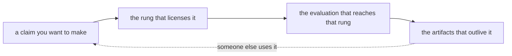

> [!abstract] Depth target · 깊이 목표
> **Working** — enough to plan a project's outputs deliberately and to state impact claims
> that survive being checked.
> **Working** — 프로젝트의 산출물을 의도적으로 계획하고, 확인을 견디는 임팩트 주장을 할 만큼.

> [!note] Prerequisites · 선수 지식
> Read [[07-research-program/index|7. Research Program]] and [[06-research-practice/research-questions-claims|Research Questions & Claims]] first — this page is about what evidence licenses which claim, and those two define the claims.
> [[07-research-program/index|7. 연구 프로그램]]과 [[06-research-practice/research-questions-claims|연구 질문과 주장]]을 먼저 읽어라 — 이 페이지는 어떤 증거가 어떤 주장을 허락하는가에 관한 것이고, 그 둘이 주장을 정의한다.

## English

### 1. Impact is a claim, and claims need evidence

"Real-world impact" is usually used as an aspiration. It is more useful as a **claim type**
with its own evidence requirements, exactly like a performance claim. The question is never
"did this have impact?" but "**what does this evidence license me to say?**"

That reframing does real work, because it turns an unbounded ambition into a checklist you
can act on this month.

For example, a robot fitting drywall in a prepared mock-up may establish that its contact strategy handles realistic geometry. It does not yet show that a crew can integrate the robot into a changing work schedule. Those claims require different evidence because task completion and workflow adoption have different failure modes.

Describe the benefit, its recipient, and the counterfactual: what would the worker or researcher otherwise do? Then identify which costs the experiment actually includes, such as setup and recovery, and which remain outside it. **The reading this gives you.** Translate “impact” into a sentence with a beneficiary and an observable change. That makes the next evaluation concrete and prevents a compelling demonstration from carrying an unsupported adoption claim.

### 2. The evidence ladder, and what each rung licenses

<svg viewBox="0 0 560 258" style="max-width:100%;height:auto" role="img" aria-label="five rungs of deployment evidence, each paired with the strongest claim it supports">
  <g fill="currentColor">
    <rect x="24" y="192" width="200" height="34" rx="3" fill-opacity="0.06"/>
    <rect x="24" y="152" width="200" height="34" rx="3" fill-opacity="0.12"/>
    <rect x="24" y="112" width="200" height="34" rx="3" fill-opacity="0.20"/>
    <rect x="24" y="72" width="200" height="34" rx="3" fill-opacity="0.28"/>
    <rect x="24" y="32" width="200" height="34" rx="3" fill-opacity="0.36"/>
  </g>
  <g stroke="currentColor" stroke-width="1" fill="none" opacity="0.55">
    <rect x="24" y="192" width="200" height="34" rx="3"/><rect x="24" y="152" width="200" height="34" rx="3"/><rect x="24" y="112" width="200" height="34" rx="3"/><rect x="24" y="72" width="200" height="34" rx="3"/><rect x="24" y="32" width="200" height="34" rx="3"/>
  </g>
  <g font-size="10.5" fill="currentColor">
    <text x="36" y="213">simulation</text>
    <text x="36" y="173">laboratory hardware</text>
    <text x="36" y="133">full-scale mock-up</text>
    <text x="36" y="93">active site, once</text>
    <text x="36" y="53">used by someone else</text>
  </g>
  <g font-size="10" fill="currentColor" opacity="0.9">
    <text x="240" y="213">&#8220;the method is sound under my assumptions&#8221;</text>
    <text x="240" y="173">&#8220;it works on real hardware, in my conditions&#8221;</text>
    <text x="240" y="133">&#8220;it survives realistic geometry and scale&#8221;</text>
    <text x="240" y="93">&#8220;it survived conditions I did not choose&#8221;</text>
    <text x="240" y="53">&#8220;it is useful to people who are not me&#8221;</text>
  </g>
  <g font-size="11" fill="currentColor" opacity="0.9">
    <text x="20" y="248">Each rung licenses one more sentence, and nothing licenses a sentence from a rung you did not reach — with one exception the ordering does not capture: **"used by someone else" sits on a different axis**. Another lab can independently run a simulation-only method, so adoption is not a strictly higher grade of evidence than a site trial.</text>
  </g>
</svg>

The top rung is the one people forget, and it is the only one that does not depend on you
being present. A method someone else runs — on their robot, for their problem, without
asking you — is the strongest impact evidence there is, and it is bought almost entirely by
the artifacts of §3 rather than by the result itself.

The rung below it is the one this domain lacks. As
[[05-construction-robotics/construction-manipulation|9. §3]] found, contact-rich
construction manipulation has almost no active-site results at all — which makes reaching
that rung both hard and unusually valuable.

> [!warning] The move this page exists to prevent
> Describing mock-up work with site language. It is easy, it is common in this literature,
> and it is the one thing that makes a reviewer distrust everything else in the paper. If
> the evidence is a mock-up, say mock-up and claim what a mock-up licenses — which is
> plenty.

> [!warning] Demo indigestion · 데모 소화불량
> The ladder assumes that producing evidence is the expensive step. That assumption is
> weakening. Policies, simulated rollouts, benchmark entries, synthetic data and successful
> demonstration videos can now be generated far faster than anyone can check them, while a
> real hardware trial still takes days and long-term reliability still takes months. Terence
> Tao named the version of this that mathematics faces, *proof indigestion*: proofs arriving
> faster than the community can verify, explain and absorb them. Giseop Kim's essay
> [증명 소화불량에서 데모 소화불량으로](https://gisbi-kim.github.io/tao-ai-math-for-physical-ai/)
> carries the argument into physical AI, where it is sharper, because a proof has a checker
> and a robot behaviour does not.
>
> Two consequences for this ladder. First, an unverified demonstration occupies no rung at
> all — the questions that place it are how many trials the video was drawn from, where the
> failures clustered, when a human intervened, and what the denominator of that success rate
> was. Second, when the same group builds the simulator, the evaluator and the benchmark, an
> optimiser will find their shared blind spots without anyone intending it. That is Goodhart's
> law with a specific mechanism: errors the evaluator cannot see are treated by the
> optimisation as though they do not exist.

### 3. Artifacts, and what each actually costs

Outputs that keep working after the paper is published. Each is listed with its real cost,
because an artifact you cannot maintain is worse than none.

| Artifact | What it buys | What it actually costs |
|---|---|---|
| **Released code** | reproduction, and other people's baselines | the cost is not release, it is *questions* — budget ongoing time |
| **Released dataset** | others use your problem, not just your method | curation, licensing, and storage that outlives the grant |
| **Hardware design files** | replication at other labs | documentation is most of the work; a BOM ages fast |
| **A benchmark** | shapes what the field measures | you inherit responsibility for its flaws |
| **A deployed system** | the site rung, plus problems you could not have imagined | schedule, access, safety, and a building that will not wait |
| **Industry collaboration** | data and realism you cannot get otherwise | publication delays, and sometimes restrictions — settle these in writing first |

Datasets deserve a specific note in this domain. There is no web-scale corpus of
the specific tasks this program targets — panel fitting, anchor-bolt fastening, pipe
insertion — and no sign of one forming
([[04-robotics/teleoperation-demonstration|12. §7]]), so a well-curated dataset of a real
construction task is disproportionately valuable — possibly more citable than the method
trained on it.

In robotics one artifact is worth naming separately, because releasing code alone rarely
achieves it: a **reproduction bundle** — sensor configuration, calibration parameters, a
recorded log, the simulator setup and the hardware specification alongside the code. It is
what decides whether another group can actually build on the work, which §5 argues is the
property that separates papers that generate a literature from papers that are cited once as
a baseline.

### 4. The pipeline, run deliberately

The ladder of §2 is also a plan, and the useful discipline is to decide **in advance** which
rung a given project is aiming at, then design the evaluation for that rung rather than
discovering at writing time that the evidence does not support the sentence you wanted.

Reading that chain backwards is the common failure: running the experiment that was
convenient, then choosing the strongest claim it can bear. That produces defensible papers
and no program.

For example, if the intended outcome is independent use of a panel-fitting dataset, plan a release that another group can interpret without the collectors present. That requires task definitions, calibration records, failed attempts, and a runnable evaluation. A beautiful policy video answers a different question and cannot reveal whether the data are usable.

Build a small handoff into the project schedule: ask a colleague unfamiliar with collection to trace a record through the protocol. Their questions identify missing artifacts before the original context is forgotten. **The reading this gives you.** Evaluate the pipeline by whether its planned evidence reaches its chosen claim. Milestones should name the uncertainty being resolved, not merely the next file or demonstration being produced.

### 5. Designing so the outputs compound

The [[07-research-program/paper-arc|arc]] already does this for publications — each paper
reuses the previous one's platform, dataset and protocol — strictly true of Paper 3 into Paper 4; Paper 1 is chosen so it does *not* need the platform, and Paper 2 exists to buy it. Extend the same logic to
artifacts:

- The **teleoperation rig** built for Paper 4 is a demonstration-collection artifact, a
  dataset generator, and a piece of releasable hardware.
- The **dataset** from that rig outlives the policy trained on it.
- The **evaluation protocol** for a construction task — how success is defined, in
  millimetres or newtons — is reusable by anyone attacking the same task, and defining it
  well is a quiet way to shape a subfield.

The test for whether a project is designed or merely executed: **name what will still be
used in three years.** If the honest answer is "the paper", the project was a paper.

There is a second reason to design this way, visible only years later. Papers accepted at the
same conference diverge enormously in what they generate: some become the starting point
hundreds of others build from, while equally sound neighbours are cited a few times as a
baseline and then forgotten. The property that separates them is not review score. It is
whether a later researcher can pick something up and carry it away — a method, a problem
definition, a dataset, a metric, a name — and how cheaply they can get it running. In
robotics that cost is unusually high, because released code is not the same as a reproducible
result: without the sensor configuration, the calibration parameters, a rosbag, the simulator
setup and the hardware specification, another group cannot follow. Bundle those together and
you are not being generous, you are buying the thing that compounds. Researchers rarely adopt
the best available method; they adopt the good-enough method that runs today, and once a few
groups build on it, it becomes the baseline everyone else compares against. Synthesised from
Giseop Kim's essay [왜 어떤 ICRA 논문은 대성하는가](https://gisbi-kim.github.io/why-some-icra-papers-thrive/).

> [!tip]- Going deeper: research as a system · 더 깊이 — 시스템으로서의 연구
> Five further essays by the same author, each on one part of making outputs compound. [논문을 쓰는 사람에서 연구 시스템을 만드는 사람으로](https://gisbi-kim.github.io/from-paper-writer-to-research-system-builder/) argues that a graduate education is about designing a research system, not producing a document. [첫 1,000회의 인용](https://gisbi-kim.github.io/first-1000-citations/) treats early citations as the point where a researcher stops starting from zero each time, and locates the cause in reusable assets rather than paper count. [이상적인 연구주제란?](https://gisbi-kim.github.io/ideal-research-topic-roic/) borrows return-on-invested-capital to ask which topics turn one result into cheaper next results, with a professor's attention and a student-year as the costly capital. [승률을 설계하는 연구실](https://gisbi-kim.github.io/lab-management-designing-win-rate/) makes the case that a lab wins by being decisive on the few questions that settle things rather than average at everything — the same principle as this wiki's own inclusion rule. [손안에 든 새 한마리](https://gisbi-kim.github.io/bird-in-hand-lab-management/) is the counterweight: existing data, a working codebase and a student who understands the problem are assets whose future value is systematically underrated against an exciting new topic.

### 6. What not to optimise

Two failure modes, stated plainly because they are tempting.

**Optimising for counts.** Numbers of papers and citations are downstream measurements, not
objectives. Work aimed at them tends to be safe, incremental and forgettable; work aimed at
a real problem accumulates them as a side effect. The distinction matters practically: it
decides whether you split a result into two papers or make one good one.

**Optimising for demonstrations.** A video of a robot doing something is not a result. The
test in [[07-research-program/paper-arc|7.1]] applies here too — if it cannot state what is
now possible that was not before, with an evaluation that could have come out the other
way, it is a demo. Demos are useful for funding and for morale; they are not evidence.

For example, polishing a successful drywall sequence can improve communication, but it leaves the research question unchanged if failed contacts remain unlogged. Spend effort on the record that would distinguish a better policy from easier setup. **The reading this gives you.** Ask which next action would change a skeptical reader's conclusion. A reusable failure protocol may do more for that purpose than another visually different demonstration of the same already-established behavior.

### After reading

- [ ] State the five rungs and the claim each licenses.
- [ ] Name an artifact you could release from current work, and its real cost.
- [ ] Say which rung a current project is aiming at, decided in advance.
- [ ] Name what from a current project will still be used in three years.

### Self-check

1. A paper says its system was "validated on site". The methods section describes a
   full-scale mock-up. What is the cost of that phrasing?
2. Why is a released dataset potentially more valuable than the method trained on it, in
   this domain specifically?
3. You could split a result into two papers or publish one. What decides it?
4. An industry partner offers site access and data, in exchange for review rights over
   publications. What do you settle first?
5. Which rung of §2 does not depend on your presence, and why does that matter?

> [!tip]- Answers
> 1. It buys nothing and costs the paper's credibility. A reviewer who checks the methods section finds the claim overstated, and then reasonably wonders what else is. The mock-up rung licenses a real and useful sentence — "it survives realistic geometry and scale" — and claiming exactly that is both honest and sufficient.
> 2. Because no web-scale corpus of construction manipulation exists and none is coming, so a curated dataset of a real construction task is a scarce resource rather than one contribution among many. Methods are superseded every couple of years; a dataset of a task nobody else can access keeps being the thing people build on.
> 3. Whether the two halves each state something that could have come out otherwise. If splitting produces one real claim and one thin one, the thin one costs more in credibility than it adds in count — and the arc's logic in [[07-research-program/paper-arc|7.1 §1]] says a coherent sequence beats a longer list.
> 4. The publication terms, in writing, before any data changes hands: what may be published, after what delay, and who decides. Review rights are often reasonable in practice and occasionally fatal, and the difference is entirely in the wording. A delay you agreed to is a schedule item; a veto you did not notice is a lost chapter.
> 5. The top one — someone else using the work. Every other rung is evidence that *you* made it work, which depends on your setup, your tuning and your presence. Independent use is the only evidence that the contribution transferred, and it is bought mostly through artifacts rather than through the result.

### Sources

- This page is method, not a literature claim. The deployment ladder is this wiki's own standard, applied throughout [[05-construction-robotics/index|Construction Robotics]] and is this page's own construct. Three different objects share the word *ladder* here, and **all three grade how real the evidence is** — sim-to-real's uses the word *rung* and places ExACT's claim on it explicitly. So the risk is not confusing kinds, it is confusing **scales**: this page's five rungs run from simulation to *use by someone else*; [[05-construction-robotics/construction-manipulation|9. §3]] is a coarser three (simulation / lab-or-mock-up / active site) for sorting the construction literature; and [[05-construction-robotics/sim-to-real|Sim-to-Real §3]] is five *transfer* stages, one of which — adaptation — is a method step rather than a realism level. Name the ladder as well as the rung.
- [[06-research-practice/research-questions-claims|Research Questions & Claims]] — what makes a claim defensible.
- [[06-research-practice/experimental-design-reproducibility|Experimental Design & Reproducibility]] — the evaluation design the rungs require.
- [[06-research-practice/venue-strategy|5. Venue Strategy]] — where the resulting papers go.

## 한국어

### 1. 임팩트는 주장이고, 주장에는 증거가 필요하다

"실세계 임팩트"는 보통 포부로 쓰인다. 성능 주장과 똑같이, 자기만의 증거 요건을 가진 **주장의
한 종류**로 쓰는 편이 더 쓸모 있다. 질문은 결코 "이것이 임팩트가 있었는가"가 아니라
"**이 증거가 내가 무엇을 말하도록 허락하는가**"다.

이 재프레이밍은 실제로 일을 한다. 끝이 없는 포부를 이번 달에 행동에 옮길 수 있는 체크리스트로
바꾸기 때문이다.

예를 들어 준비한 모형 현장에서 드라이월을 맞추는 로봇은 실제 크기의 형상에서 접촉 전략이 작동함을 보일 수 있다. 작업반이 변하는 공정 일정에 로봇을 통합할 수 있는지는 아직 모른다. 과제 완료와 작업 흐름의 채택은 실패 방식이 달라 필요한 증거도 다르다.

이점, 수혜자, 대안을 적는다. 로봇이 없으면 작업자나 연구자는 무엇을 하는가? 설치와 회복 같은 비용 중 무엇이 실험에 포함되고 무엇이 빠졌는지도 정한다. **여기서 얻는 독법.** 임팩트를 수혜자와 관찰 가능한 변화가 있는 문장으로 바꾼다. 다음 평가가 구체화되고 인상적인 시연이 입증하지 않은 채택 주장까지 떠맡지 않게 된다.

### 2. 증거의 사다리와, 각 단계가 허락하는 것

<svg viewBox="0 0 560 258" style="max-width:100%;height:auto" role="img" aria-label="배치 증거의 다섯 단계와 각각이 뒷받침하는 가장 강한 주장">
  <g fill="currentColor">
    <rect x="24" y="192" width="200" height="34" rx="3" fill-opacity="0.06"/>
    <rect x="24" y="152" width="200" height="34" rx="3" fill-opacity="0.12"/>
    <rect x="24" y="112" width="200" height="34" rx="3" fill-opacity="0.20"/>
    <rect x="24" y="72" width="200" height="34" rx="3" fill-opacity="0.28"/>
    <rect x="24" y="32" width="200" height="34" rx="3" fill-opacity="0.36"/>
  </g>
  <g stroke="currentColor" stroke-width="1" fill="none" opacity="0.55">
    <rect x="24" y="192" width="200" height="34" rx="3"/><rect x="24" y="152" width="200" height="34" rx="3"/><rect x="24" y="112" width="200" height="34" rx="3"/><rect x="24" y="72" width="200" height="34" rx="3"/><rect x="24" y="32" width="200" height="34" rx="3"/>
  </g>
  <g font-size="10.5" fill="currentColor">
    <text x="36" y="213">시뮬레이션</text>
    <text x="36" y="173">실험실 하드웨어</text>
    <text x="36" y="133">실물 크기 목업</text>
    <text x="36" y="93">가동 중 현장, 1회</text>
    <text x="36" y="53">다른 사람이 쓴다</text>
  </g>
  <g font-size="10" fill="currentColor" opacity="0.9">
    <text x="240" y="213">&#8220;내 가정 아래에서 방법이 타당하다&#8221;</text>
    <text x="240" y="173">&#8220;내 조건에서 실기계에서 동작한다&#8221;</text>
    <text x="240" y="133">&#8220;현실적인 기하와 규모를 견딘다&#8221;</text>
    <text x="240" y="93">&#8220;내가 고르지 않은 조건을 견뎠다&#8221;</text>
    <text x="240" y="53">&#8220;내가 아닌 사람들에게 쓸모 있다&#8221;</text>
  </g>
  <g font-size="11" fill="currentColor" opacity="0.9">
    <text x="20" y="248">각 단계가 문장을 하나씩 더 허락한다. 도달하지 않은 단계의 문장은 무엇도 허락하지 않는다.</text>
  </g>
</svg>

맨 위 단계가 사람들이 잊는 것이고, 당신이 그 자리에 있는지에 의존하지 않는 유일한 단계다.
다른 사람이 자기 로봇에서, 자기 문제에 대해, 당신에게 묻지 않고 돌리는 방법 — 그것이 존재하는
가장 강한 임팩트 증거이며, 거의 전적으로 결과 자체가 아니라 §3의 산출물로 사는 것이다.

그 아래 단계가 이 도메인에 없는 것이다. [[05-construction-robotics/construction-manipulation|9. §3]]이
찾아냈듯 접촉이 많은 건설 조작에는 가동 중 현장 결과가 거의 전무하고 — 그래서 그 단계에
도달하는 것이 어렵고 동시에 유난히 값어치 있다.

> [!warning] 이 페이지가 막으려고 존재하는 수
> 목업 작업을 현장의 언어로 서술하는 것. 쉽고, 이 문헌에서 흔하며, 심사자가 논문의 나머지
> 전부를 불신하게 만드는 유일한 것이다. 증거가 목업이면 목업이라고 말하고 목업이 허락하는
> 것을 주장하라 — 충분히 많다.

> [!warning] 데모 소화불량 · Demo indigestion
> 이 사다리는 증거를 만드는 일이 비싼 단계라고 전제한다. 그 전제가 약해지고 있다. 정책,
> 시뮬레이션 롤아웃, 벤치마크 기록, 합성 데이터, 성공 영상은 이제 누구도 검토를 따라갈 수 없는
> 속도로 생산되는데, 실기계 시험은 여전히 며칠이 걸리고 장기 신뢰성은 여전히 몇 달이 걸린다.
> 테렌스 타오는 수학이 맞은 같은 현상을 *증명 소화불량*이라 불렀다. 공동체가 검증하고 설명하고
> 흡수하는 속도보다 증명이 빨리 도착하는 상태다. 김기섭의 에세이
> [증명 소화불량에서 데모 소화불량으로](https://gisbi-kim.github.io/tao-ai-math-for-physical-ai/)가
> 그 논증을 물리 AI로 옮긴다. 여기서는 더 날카롭다. 증명에는 검증기가 있지만 로봇의 행동에는
> 없기 때문이다.
>
> 이 사다리에 주는 귀결이 둘이다. 첫째, 검증되지 않은 데모는 어느 단에도 놓이지 않는다.
> 그것을 자리에 앉히는 질문은 이렇다. 그 영상은 몇 번의 시행에서 골랐는가, 실패는 어디에
> 몰렸는가, 사람은 언제 개입했는가, 그 성공률의 분모는 무엇인가. 둘째, 같은 집단이 시뮬레이터와
> 평가기와 벤치마크를 함께 만들면, 최적화는 아무도 의도하지 않아도 그들의 공통 사각지대를 찾아
> 간다. 기전이 분명한 굿하트의 법칙이다. 평가기가 보지 못하는 오류는 최적화 과정에서 존재하지
> 않는 것으로 취급된다.

### 3. 산출물과, 각각의 실제 비용

논문이 나온 뒤에도 계속 작동하는 산출물들. 유지할 수 없는 산출물은 없느니만 못하므로 실제
비용과 함께 적는다.

| 산출물 | 사는 것 | 실제로 드는 비용 |
|---|---|---|
| **공개 코드** | 재현, 그리고 다른 사람들의 기준선 | 비용은 공개가 아니라 *질문*이다 — 계속되는 시간을 예산에 넣어라 |
| **공개 데이터셋** | 다른 사람들이 당신의 방법이 아니라 당신의 문제를 쓴다 | 큐레이션, 라이선싱, 그리고 과제보다 오래 사는 저장소 |
| **하드웨어 설계 파일** | 다른 랩에서의 복제 | 문서화가 일의 대부분이고, BOM은 빨리 낡는다 |
| **벤치마크** | 분야가 무엇을 재는지를 형성한다 | 그 결함에 대한 책임을 물려받는다 |
| **배치된 시스템** | 현장 단계, 그리고 상상할 수 없었던 문제들 | 공정, 출입, 안전, 그리고 기다려 주지 않는 건물 |
| **산업 협력** | 달리 얻을 수 없는 데이터와 현실성 | 출판 지연, 때로는 제약 — 먼저 문서로 정리하라 |

이 도메인에서 데이터셋은 따로 언급할 값이 있다. 건설 조작의 웹 규모 코퍼스는 없고 앞으로도
없을 것이므로([[04-robotics/teleoperation-demonstration|12. §7]]), 실제 건설 작업의 잘
큐레이션된 데이터셋은 불균형하게 값어치가 크다 — 그것으로 학습한 방법보다 더 인용될 수도 있다.

로보틱스에서는 따로 이름을 붙일 산출물이 하나 더 있다. 코드만 공개해서는 좀처럼 달성되지 않기
때문이다. **재현 번들** — 센서 구성, 보정 파라미터, 기록 로그, 시뮬레이터 설정, 하드웨어 사양을
코드와 함께 내는 것이다. 다른 팀이 이 연구 위에 실제로 쌓을 수 있는지를 이것이 정한다. §5는 그
성질이 하나의 문헌을 생성하는 논문과 baseline으로 한 번 인용되고 마는 논문을 가른다고 말한다.

### 4. 파이프라인을 의도적으로 돌리기

§2의 사다리는 계획이기도 하다. 쓸모 있는 규율은 주어진 프로젝트가 어느 단계를 겨냥하는지를
**미리** 정하고, 쓰는 시점에 가서야 증거가 원했던 문장을 뒷받침하지 않는다는 것을 발견하는
대신, 그 단계를 위해 평가를 설계하는 것이다.

그 사슬을 거꾸로 읽는 것이 흔한 실패다: 편한 실험을 돌리고, 그것이 견딜 수 있는 가장 강한
주장을 고르는 것. 그렇게 하면 방어 가능한 논문들은 나오고 프로그램은 나오지 않는다.

예를 들어 패널 맞춤 데이터셋을 다른 집단이 독립적으로 쓰는 것이 목표라면 수집자가 없어도 해석할 수 있는 공개를 계획한다. 과제 정의, 보정 기록, 실패 시도, 실행 가능한 평가가 필요하다. 멋진 정책 영상은 다른 질문에 답하며 데이터의 사용 가능성을 보여 주지 못한다.

수집을 모르는 동료가 기록 하나를 절차 끝까지 따라가 보는 작은 인계를 일정에 넣는다. 질문을 받으면 원래 맥락을 잊기 전에 빠진 산출물을 찾는다. **여기서 얻는 독법.** 계획한 증거가 선택한 주장에 도달하는지로 흐름을 평가한다. 이정표는 다음 파일이나 시연의 이름보다 해소할 불확실성을 밝혀야 한다.

### 5. 산출물이 복리로 쌓이도록 설계하기

[[07-research-program/paper-arc|arc]]는 출판에 대해 이미 이것을 한다 — 각 논문이 앞 논문의
플랫폼·데이터셋·프로토콜을 재사용한다 — 엄밀히는 3번에서 4번으로 갈 때 그렇다. 1번은 플랫폼이 필요 없도록 고른 것이고, 2번은 그것을 확보하려고 있다. 같은 논리를 산출물로 확장하라:

- 4편을 위해 만든 **원격조작 장비**는 시연 수집 산출물이자, 데이터 생성기이자, 공개 가능한
  하드웨어다.
- 그 장비에서 나온 **데이터셋**은 그것으로 학습한 정책보다 오래 산다.
- 건설 작업의 **평가 프로토콜** — 성공을 밀리미터나 뉴턴으로 어떻게 정의하는가 — 은 같은
  작업을 공략하는 누구에게나 재사용 가능하고, 그것을 잘 정의하는 것이 하위 분야를 형성하는
  조용한 방법이다.

프로젝트가 설계된 것인지 그냥 수행된 것인지를 가르는 시험: **3년 뒤에도 여전히 쓰이고 있을
것의 이름을 대라.** 정직한 답이 "논문"이라면 그 프로젝트는 논문이었다.

이렇게 설계할 두 번째 이유가 있는데, 몇 해가 지나야 보인다. 같은 학회에 함께 실린 논문들이
생성해 내는 후속 연구의 양은 극단적으로 갈린다. 어떤 논문은 수백 편이 당연하게 출발하는
기준점이 되고, 못지않게 튼튼한 이웃 논문은 baseline으로 몇 번 인용된 뒤 잊힌다. 둘을 가르는
성질은 심사 점수가 아니다. 뒤에 오는 연구자가 무언가를 집어 들고 갈 수 있는가다 — 방법이든,
문제 정의든, 데이터셋이든, 지표든, 이름이든 — 그리고 그것을 돌리는 데 얼마나 드는가다.
로보틱스에서는 그 비용이 유난히 크다. 코드를 공개했다는 것과 결과가 재현된다는 것이 같지 않기
때문이다. 센서 구성, 보정 파라미터, rosbag, 시뮬레이터 설정, 하드웨어 사양이 함께 있지 않으면
다른 팀은 따라올 수 없다. 그것들을 한 묶음으로 내는 것은 관대한 처신이 아니라 복리로 불어나는
것을 사는 일이다. 연구자는 구할 수 있는 최선의 방법을 채택하지 않는다. 충분히 좋으면서 오늘
돌아가는 방법을 채택하고, 몇 팀이 그 위에 쌓기 시작하면 그것이 나머지 전부가 비교하는
baseline이 된다. 김기섭의 에세이
[왜 어떤 ICRA 논문은 대성하는가](https://gisbi-kim.github.io/why-some-icra-papers-thrive/)를
요약·재구성한 것이다.

> [!tip]- 더 깊이 — 시스템으로서의 연구 · Going deeper: research as a system
> 같은 저자의 에세이 다섯 편이 각각 산출물을 복리로 만드는 한 부분을 다룬다. [논문을 쓰는 사람에서 연구 시스템을 만드는 사람으로](https://gisbi-kim.github.io/from-paper-writer-to-research-system-builder/)는 대학원이 문서를 생산하는 법이 아니라 자기 연구 시스템을 설계하는 법을 배우는 곳이라고 주장한다. [첫 1,000회의 인용](https://gisbi-kim.github.io/first-1000-citations/)은 초기 인용을 연구자가 매번 0에서 출발하지 않게 되는 지점으로 보고, 그 원인을 논문 편수가 아니라 재사용 가능한 자산에서 찾는다. [이상적인 연구주제란?](https://gisbi-kim.github.io/ideal-research-topic-roic/)은 투하자본 대비 이익률을 빌려, 한 결과가 다음 결과를 싸게 만들어 주는 주제가 무엇인지 묻는다. 여기서 비싼 자본은 교수의 주의와 학생의 1년이다. [승률을 설계하는 연구실](https://gisbi-kim.github.io/lab-management-designing-win-rate/)은 연구실이 모든 것을 평균적으로 잘해서가 아니라 승부를 가르는 소수의 질문에서 압도적이어서 이긴다고 말한다 — 이 위키 자신의 포함 규칙과 같은 원리다. [손안에 든 새 한마리](https://gisbi-kim.github.io/bird-in-hand-lab-management/)는 그 반대 추다. 이미 가진 데이터, 돌아가는 코드베이스, 문제를 깊이 아는 학생은 새롭고 매력적인 주제에 견주어 미래 가치가 체계적으로 과소평가되는 자산이다.

### 6. 최적화하지 말아야 할 것

두 실패 모드를, 유혹적이기 때문에 분명히 적는다.

**개수를 최적화하기.** 논문 수와 인용 수는 하류의 측정값이지 목표가 아니다. 그것을 겨냥한
연구는 안전하고 점진적이고 잊히기 쉽다. 실제 문제를 겨냥한 연구는 그것들을 부수적으로 쌓는다.
이 구분은 실전에서 중요하다: 결과를 논문 둘로 쪼갤지 좋은 하나로 만들지를 결정한다.

**실연을 최적화하기.** 로봇이 무언가를 하는 영상은 결과가 아니다. [[07-research-program/paper-arc|7.1]]의
시험이 여기에도 적용된다 — 전에는 불가능했고 지금은 가능한 것을, 반대 결과가 나올 수도 있었던
평가와 함께 말하지 못하면 그것은 데모다. 데모는 연구비와 사기에 쓸모 있다. 증거는 아니다.

예를 들어 성공한 드라이월 영상을 다듬으면 전달력은 좋아진다. 하지만 실패 접촉을 기록하지 않으면 연구 질문은 그대로다. 더 좋은 정책과 더 쉬운 준비 조건을 구분할 기록에 힘을 쓴다. **여기서 얻는 독법.** 다음 행동 중 무엇이 회의적인 독자의 결론을 바꿀지 묻는다. 이미 확인한 행동을 다른 모습으로 시연하는 것보다 재사용 가능한 실패 기록 절차가 더 유용할 수 있다.

### 읽고 나면 말할 수 있어야 하는 것

- [ ] 다섯 단계와 각각이 허락하는 주장을 말한다.
- [ ] 현재 연구에서 공개할 수 있는 산출물 하나와 그 실제 비용을 댄다.
- [ ] 현재 프로젝트가 어느 단계를 겨냥하는지, 미리 정해서 말한다.
- [ ] 현재 프로젝트에서 3년 뒤에도 쓰이고 있을 것을 댄다.

### 스스로 점검

1. 어떤 논문이 시스템을 "현장에서 검증했다"고 말한다. 방법 절은 실물 크기 목업을 서술한다.
   그 표현의 비용은?
2. 하필 이 도메인에서, 공개 데이터셋이 그것으로 학습한 방법보다 값어치 있을 수 있는 이유는?
3. 결과를 논문 둘로 쪼갤 수도, 하나로 낼 수도 있다. 무엇이 결정하는가?
4. 산업 파트너가 출판에 대한 검토 권한을 대가로 현장 출입과 데이터를 제안한다. 무엇을 먼저
   정리해야 하는가?
5. §2의 어느 단계가 당신의 존재에 의존하지 않으며, 왜 그것이 중요한가?

> [!tip]- 정답 · Answers
> 1. 사는 것은 없고 논문의 신뢰도를 잃는다. 방법 절을 확인하는 심사자는 주장이 과장되었음을 발견하고, 그다음 나머지는 또 어떨지 합리적으로 의심하게 된다. 목업 단계는 실재하고 쓸모 있는 문장 — "현실적인 기하와 규모를 견딘다" — 을 허락하고, 정확히 그것을 주장하는 것이 정직하면서 충분하다.
> 2. 건설 조작의 웹 규모 코퍼스가 없고 앞으로도 오지 않으므로, 실제 건설 작업의 큐레이션된 데이터셋은 여러 기여 중 하나가 아니라 희소 자원이다. 방법은 몇 년마다 밀려나지만, 다른 누구도 접근할 수 없는 작업의 데이터셋은 계속해서 사람들이 그 위에 쌓는 것으로 남는다.
> 3. 두 절반이 각각 반대 결과가 나올 수도 있었던 무언가를 말하는가다. 쪼개서 실한 주장 하나와 얄팍한 하나가 나온다면, 얄팍한 쪽이 개수로 더하는 것보다 신뢰도로 잃는 것이 크다 — 그리고 [[07-research-program/paper-arc|7.1 §1]]의 arc 논리가 일관된 연쇄가 긴 목록을 이긴다고 말한다.
> 4. 어떤 데이터가 오가기 전에, 문서로 출판 조건부터: 무엇을 출판할 수 있고, 얼마나 지연되며, 누가 결정하는가. 검토 권한은 실무에서 흔히 합리적이고 때로는 치명적인데, 그 차이가 전적으로 문구에 있다. 합의한 지연은 일정 항목이고, 알아차리지 못한 거부권은 잃어버린 장(章)이다.
> 5. 맨 위 — 다른 사람이 그 연구를 쓰는 것. 다른 모든 단계는 *당신이* 동작하게 만들었다는 증거이고, 당신의 셋업·튜닝·존재에 의존한다. 독립적 사용만이 기여가 이전되었다는 증거이며, 결과보다는 대체로 산출물로 사는 것이다.

### 출처

- 이 페이지는 방법이지 문헌 주장이 아니다. 배치 사다리는 이 위키 자신의 기준이고 이 페이지 자신의 구성물이며, [[05-construction-robotics/index|건설로봇]] 전반에 적용된다. 이 위키에서 *사다리*라는 단어를 세 대상이 함께 쓰고, **셋 다 증거가 얼마나 실제인지를 등급 매긴다** — sim-to-real 쪽도 "rung"이라는 말을 쓰고 ExACT의 주장을 그 위에 명시적으로 올려놓는다. 그러니 위험한 것은 종류를 혼동하는 것이 아니라 **척도**를 혼동하는 것이다: 이 페이지의 다섯 단은 시뮬레이션에서 *남이 쓰는 것*까지 가고, [[05-construction-robotics/construction-manipulation|9. §3]]은 건설 문헌을 분류하기 위한 더 거친 셋(시뮬레이션 / 실험실·목업 / 가동 중 현장)이며, [[05-construction-robotics/sim-to-real|Sim-to-Real §3]]은 다섯 *전이* 단계인데 그중 하나(적응)는 현실성 수준이 아니라 방법 단계다. 단만이 아니라 어느 사다리인지도 함께 말하라.
- [[06-research-practice/research-questions-claims|연구 질문과 주장]] — 무엇이 주장을 방어 가능하게 만드는가.
- [[06-research-practice/experimental-design-reproducibility|실험 설계와 재현성]] — 각 단계가 요구하는 평가 설계.
- [[06-research-practice/venue-strategy|5. Venue 전략]] — 그 결과 나온 논문들이 갈 곳.
