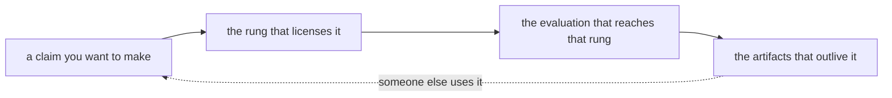

> [!abstract] Depth target · 깊이 목표
> **Working** — enough to plan a project's outputs deliberately and to state impact claims
> that survive being checked.
> **Working** — 프로젝트의 산출물을 의도적으로 계획하고, 확인을 견디는 임팩트 주장을 할 만큼.

> [!note] Prerequisites · 선수 지식
> Read [[07-research-program/index|7. Research Program]] and [[06-research-practice/research-questions-claims|Research Questions & Claims]] first — this page is about what evidence licenses which claim, and those two define the claims. For the running study RS1: [[06-research-practice/experimental-design-reproducibility|2. Experimental Design]] (power, effect size and the two sample-size formulas), [[06-research-practice/scientific-writing-peer-review|4. Scientific Writing]] (its results table and the licensed-sentence test) and [[02-foundations/probability|3. Probability §6]] (the two kinds of error).
> [[07-research-program/index|7. 연구 프로그램]]과 [[06-research-practice/research-questions-claims|연구 질문과 주장]]을 먼저 읽어라 — 이 페이지는 어떤 증거가 어떤 주장을 허락하는가에 관한 것이고, 그 둘이 주장을 정의한다. 관통 연구 RS1을 위해서는 [[06-research-practice/experimental-design-reproducibility|2. 실험 설계]](검정력, 효과 크기, 두 표본 크기 식), [[06-research-practice/scientific-writing-peer-review|4. 과학적 글쓰기]](결과 표와 허락된 문장의 판정), [[02-foundations/probability|3. 확률 §6]](두 종류의 오류).

## English

*Stands on [[06-research-practice/research-questions-claims|1. Research Questions & Claims]] and [[06-research-practice/scientific-writing-peer-review|4. Scientific Writing]], which turned RS1 into a claim and a results table, and on [[06-research-practice/experimental-design-reproducibility|2. Experimental Design]], which derived the sample sizes its next experiment needs. Here RS1 gets a rung: which sentence its pilot licenses, and what the next rung would cost in trials.*

> [!note] First pass · 처음이라면
> Read the running object and the worked case. They place RS1's pilot on §2's ladder and price the next rung in trials: 32 per arm if the claim is carried by the success rate, 8 if it is carried by peak force. Then read §2 (the ladder) and §4 (choosing the rung in advance). Sections 3, 5 and 6 are about artifacts and program design and stand on their own.

### Running object · 이 페이지의 대상

**RS1**, the running study of Research Practice, restated in full from [[06-research-practice/research-questions-claims|1. Research Questions & Claims]]. *Question:* does impedance control (**B**) make the planar arm's contact with a panel safer than position control with a force-threshold stop (**A**)? *Plant:* **P2** from [[02-foundations/lab-plants|0.6 Lab Plants]] (planar 2R, unit links, a 1 kg point mass at the end of each link), against a panel with **P3**'s wall stiffness, $k_w = 400$ N/m. *Trial:* the arm approaches the panel and makes contact; the outcome is the peak contact force in newtons, and a trial succeeds when that peak is at most 10 N. *Pilot:* ten unpaired trials per controller. **The data are illustrative — invented for teaching and frozen — not a measurement of any real controller.**

| Trial | 1 | 2 | 3 | 4 | 5 | 6 | 7 | 8 | 9 | 10 |
|---|---:|---:|---:|---:|---:|---:|---:|---:|---:|---:|
| A — position control + force-threshold stop (N) | 8.1 | 9.4 | 12.6 | 9.8 | 13.9 | 7.7 | 9.9 | 9.1 | 14.8 | 11.3 |
| B — impedance control (N) | 6.2 | 7.9 | 8.4 | 5.9 | 7.1 | 10.6 | 6.8 | 7.5 | 8.0 | 6.6 |

| Controller | Successes (peak ≤ 10 N) | Mean (N) | Sample sd (N) | Median (N) |
|---|---:|---:|---:|---:|
| A | 6/10 | 10.66 | 2.414 | 9.85 |
| B | 9/10 | 7.50 | 1.356 | 7.30 |

**What this page adds is the one fact the rung depends on: where the trials ran.** RS1 names its arm by a catalog id and its panel by a number. P2's unit links and point masses and P3's 400 N/m are model parameters, and the catalog's plants are the models the wiki's labs step in code ([[02-foundations/lab-kernel|0.65 Lab Kernel]]). Read literally, the pilot is evidence about that model, so this page places it on the simulation rung. Had the same twenty trials been run on a laboratory arm built to P2's numbers, against a spring-mounted 400 N/m panel, the pilot would sit one rung higher; the problem set works that case.

The planning values the worked case uses, all taken from the pilot: success probabilities $p_A = 0.6$ and $p_B = 0.9$; a difference of mean peak forces $\Delta = 3.16$ N; a pooled standard deviation $s_p = 1.958$ N.

*Scope: this page teaches what a piece of evidence licenses at each rung of the evidence ladder, what reaching the next rung costs — for RS1, in trials — and which artifacts outlive a paper. It does not teach how to form the claim ([[06-research-practice/research-questions-claims|1. Research Questions & Claims]]), how to design, randomize and analyse the confirmatory run ([[06-research-practice/experimental-design-reproducibility|2. Experimental Design]]), how to write the result up ([[06-research-practice/scientific-writing-peer-review|4. Scientific Writing]]), or which venue fits which rung ([[06-research-practice/venue-strategy|5. Venue Strategy]]).*

### Homework diagram · 과제가 그릴 그림

The ladder of §2, drawn with RS1 on it and a price on the next rung. The problem set asks for the same drawing with the pilot one rung higher.

<svg viewBox="0 0 560 319" style="max-width:100%;height:auto" role="img" aria-label="The evidence ladder with RS1 on it: four rungs from simulation up to an active site, each with the sentence it licenses, independent use on its own axis to the side, the RS1 pilot on the simulation rung with its sentence in RS1's numbers, price tags of 32 and 8 trials per arm on the hardware rung, and two arrows: more trials along a rung, a new setting up to the next">
  <defs><marker id="arRW" viewBox="0 0 10 10" refX="8" refY="5" markerWidth="6" markerHeight="6" orient="auto"><path d="M 0 0 L 10 5 L 0 10 z" fill="currentColor"/></marker></defs>
  <rect x="16" y="14" width="376" height="28" rx="3" fill="currentColor" fill-opacity="0.28" stroke="currentColor" stroke-width="1" stroke-opacity="0.55"/>
  <text x="24" y="32.5" font-size="11.5" fill="currentColor"><tspan font-weight="bold">4</tspan><tspan dx="6.4">active site, once</tspan></text>
  <text x="150" y="32.5" font-size="11" opacity="0.9" fill="currentColor">“it survived conditions I did not choose”</text>
  <line x1="395" y1="28" x2="427" y2="28" stroke="currentColor" stroke-width="1" stroke-dasharray="2 3" stroke-opacity="0.6" marker-end="url(#arRW)"/>
  <rect x="16" y="50" width="376" height="28" rx="3" fill="currentColor" fill-opacity="0.2" stroke="currentColor" stroke-width="1" stroke-opacity="0.55"/>
  <text x="24" y="68.5" font-size="11.5" fill="currentColor"><tspan font-weight="bold">3</tspan><tspan dx="6.4">full-scale mock-up</tspan></text>
  <text x="150" y="68.5" font-size="11" opacity="0.9" fill="currentColor">“it survives realistic geometry and scale”</text>
  <line x1="395" y1="64" x2="427" y2="64" stroke="currentColor" stroke-width="1" stroke-dasharray="2 3" stroke-opacity="0.6" marker-end="url(#arRW)"/>
  <rect x="16" y="86" width="376" height="28" rx="3" fill="currentColor" fill-opacity="0.12" stroke="currentColor" stroke-width="1" stroke-opacity="0.55"/>
  <text x="24" y="104.5" font-size="11.5" fill="currentColor"><tspan font-weight="bold">2</tspan><tspan dx="6.4">laboratory hardware</tspan></text>
  <text x="150" y="104.5" font-size="11" opacity="0.9" fill="currentColor">“it works on real hardware, in my conditions”</text>
  <line x1="395" y1="100" x2="427" y2="100" stroke="currentColor" stroke-width="1" stroke-dasharray="2 3" stroke-opacity="0.6" marker-end="url(#arRW)"/>
  <rect x="16" y="172" width="376" height="28" rx="3" fill="currentColor" fill-opacity="0.06" stroke="currentColor" stroke-width="1" stroke-opacity="0.55"/>
  <text x="24" y="190.5" font-size="11.5" fill="currentColor"><tspan font-weight="bold">1</tspan><tspan dx="6.4">simulation</tspan></text>
  <text x="150" y="190.5" font-size="11" opacity="0.9" fill="currentColor">“the method is sound under my assumptions”</text>
  <line x1="395" y1="186" x2="427" y2="186" stroke="currentColor" stroke-width="1" stroke-dasharray="2 3" stroke-opacity="0.6" marker-end="url(#arRW)"/>
  <rect x="430" y="14" width="118" height="186" rx="4" fill="currentColor" fill-opacity="0.10" stroke="currentColor" stroke-width="1.1" stroke-dasharray="5 3" stroke-opacity="0.7"/>
  <text x="489" y="32" font-size="11" text-anchor="middle" font-style="italic" opacity="0.7" fill="currentColor">second axis</text>
  <text x="489" y="56" font-size="11.5" text-anchor="middle" font-weight="bold" fill="currentColor">used by</text>
  <text x="489" y="71" font-size="11.5" text-anchor="middle" font-weight="bold" fill="currentColor">someone else</text>
  <text x="489" y="96" font-size="11" text-anchor="middle" opacity="0.9" fill="currentColor">“it is useful to</text>
  <text x="489" y="110" font-size="11" text-anchor="middle" opacity="0.9" fill="currentColor">people who are</text>
  <text x="489" y="124" font-size="11" text-anchor="middle" opacity="0.9" fill="currentColor">not me”</text>
  <text x="489" y="174" font-size="11" text-anchor="middle" opacity="0.7" fill="currentColor">reached from</text>
  <text x="489" y="188" font-size="11" text-anchor="middle" opacity="0.7" fill="currentColor">any rung</text>
  <line x1="42" y1="170" x2="42" y2="117" stroke="currentColor" stroke-width="1.6" marker-end="url(#arRW)"/>
  <text x="52" y="140" font-size="11" fill="currentColor">a new setting:</text>
  <text x="52" y="155" font-size="11" font-weight="bold" fill="currentColor">a new sentence</text>
  <line x1="159" y1="114" x2="159" y2="133" stroke="currentColor" stroke-width="1" stroke-opacity="0.6"/>
  <path d="M155 126 H297.4 V162 H155 L150 131 Z" fill="currentColor" fill-opacity="0.10" stroke="currentColor" stroke-width="1.1" stroke-opacity="0.75"/>
  <circle cx="159" cy="133" r="2.2" fill="none" stroke="currentColor" stroke-width="1"/>
  <text x="168" y="141" font-size="11" fill="currentColor">success rate: 32 per arm</text>
  <text x="168" y="155" font-size="11" fill="currentColor">(36 for the exact test)</text>
  <line x1="320.4" y1="114" x2="320.4" y2="133" stroke="currentColor" stroke-width="1" stroke-opacity="0.6"/>
  <path d="M316.4 126 H392.1 V162 H316.4 L311.4 131 Z" fill="currentColor" fill-opacity="0.10" stroke="currentColor" stroke-width="1.1" stroke-opacity="0.75"/>
  <circle cx="320.4" cy="133" r="2.2" fill="none" stroke="currentColor" stroke-width="1"/>
  <text x="329.4" y="141" font-size="11" fill="currentColor">peak force:</text>
  <text x="329.4" y="155" font-size="11" fill="currentColor">8 per arm</text>
  <circle cx="128" cy="186" r="8" fill="none" stroke="currentColor" stroke-width="1.3"/>
  <circle cx="128" cy="186" r="4.2" fill="currentColor"/>
  <line x1="128" y1="194" x2="128" y2="213" stroke="currentColor" stroke-width="1" stroke-opacity="0.7"/>
  <text x="128" y="224" font-size="11" text-anchor="middle" font-weight="bold" fill="currentColor">RS1 pilot, 10 + 10 trials</text>
  <line x1="200.3" y1="212" x2="390" y2="212" stroke="currentColor" stroke-width="1.6" marker-end="url(#arRW)"/>
  <text x="200.3" y="227" font-size="11" fill="currentColor">more trials here: narrower intervals, the same sentence</text>
  <path d="M16 236 H122 L128 230 L134 236 H544 V309 H16 Z" fill="currentColor" fill-opacity="0.05" stroke="currentColor" stroke-width="1" stroke-opacity="0.5"/>
  <text x="26" y="252" font-size="11" font-weight="bold" fill="currentColor">RS1’s pilot, in rung 1’s words:</text>
  <text x="26" y="268" font-size="11" opacity="0.95" fill="currentColor">“Under the P2 model against a 400 N/m panel, B’s mean peak contact force was 3.16 N lower than A’s</text>
  <text x="26" y="283" font-size="11" opacity="0.95" fill="currentColor">(95% CI 1.28 to 5.04 N), and B met the 10 N criterion in 9 of 10 trials against A’s 6 of 10, a difference</text>
  <text x="26" y="298" font-size="11" opacity="0.95" fill="currentColor">the pilot cannot distinguish (95% CI −0.08 to +0.60).”</text>
</svg>

1. **The ladder.** The four rungs of §2's figure, simulation at the bottom, with the sentence each licenses written beside it, and "used by someone else" drawn off to the side on its own axis.
2. **RS1 on it.** A marker on the simulation rung labelled *RS1 pilot, 10 + 10 trials*, and beside it the sentence that rung licenses, written in RS1's numbers (worked case, Step 1).
3. **The price tags.** Hung on the laboratory-hardware rung: *success rate: 32 per arm (36 for the exact test)* and *peak force: 8 per arm*.
4. **Two arrows.** A horizontal arrow along the simulation rung labelled *more trials here: narrower intervals, the same sentence*, and a vertical arrow up to the hardware rung labelled *a new setting: a new sentence*.

The two arrows are the lesson of the page in one picture: trials buy certainty within a rung, and only a new setting buys a new rung.

### Worked case · 대상으로 한 번 끝까지

Four steps on RS1: place the pilot on the ladder, see what more trials on the same rung would and would not buy, price the next rung in trials, and check what that price rests on.

**Step 1 — which rung, and which sentence.**

> [!info] Definition — evidence rung
> **What kind of thing it is:** a grade on this page's evidence ladder (§2), assigned to a body of evidence by the conditions it was produced under and paired with the strongest sentence those conditions license. **Defining conditions**, read in order: (1) was the plant physical hardware or a model; (2) were geometry and scale realistic; (3) did the experimenter choose the conditions, or did an operating site impose them; and, on a separate axis, (4) did people independent of the authors use the work. Each rung keeps the sentences of the rungs below it:
> $$\mathcal{L}(r) = \{\, s_1, \dots, s_r \,\}, \qquad r = 1, 2, 3, 4$$
> where $\mathcal{L}(r)$ is the set of sentences licensed at rung $r$ and $s_k$ is the sentence §2's figure writes beside rung $k$ — simulation, laboratory hardware, full-scale mock-up, active site — so climbing a rung adds a sentence and never removes one. Independent use adds its own sentence from any rung, on the second axis.
> **Example.** RS1's pilot. The plant is a model, so condition (1) already places it on rung 1, and $\mathcal{L}(1) = \{s_1\}$.
> **Non-example.** A full-scale mock-up written up as "validated on site". The rung is set by the conditions in the methods section, not by the words in the abstract — the first warning of §2.
> **Why it matters.** The rung is a fact about provenance, and the abstract's sentence has to belong to $\mathcal{L}(r)$. In the terms of [[06-research-practice/scientific-writing-peer-review|4. Scientific Writing]]'s licensed-sentence test, a sentence borrowed from a higher rung fails condition (3), scope.

RS1's pilot therefore sits on rung 1, whose sentence is "the method is sound under my assumptions". In RS1's words and with the numbers of Table 1 in 4. Scientific Writing:

> Under the P2 model against a 400 N/m panel, B's mean peak contact force was 3.16 N lower than A's (95% CI 1.28 to 5.04 N), and B met the 10 N criterion in 9 of 10 trials against A's 6 of 10, a difference the pilot cannot distinguish (95% CI −0.08 to +0.60).

**Step 2 — more trials on the same rung.** On the simulation rung a trial costs almost nothing, so ten per arm was a choice, not a constraint. Running 32, or 1,000, per arm there would narrow both intervals and could settle the success comparison — and the sentence would still begin "under the P2 model". Trials buy certainty within a rung; only a new setting buys a new rung. That is why Step 3 prices trials on the next rung, where they stop being free.

**Step 3 — the price of the next rung.** Rung 2 is laboratory hardware: the same protocol on a physical two-link arm against a physical 400 N/m panel, licensing "it works on real hardware, in my conditions". The comparison must be run again there, because rung-1 numbers are not hardware numbers. How many trials it needs depends on which outcome carries the claim.

*If the success rate carries the claim.* Statistical power (the detection probability of [[02-foundations/probability|3. Probability §6]] applied to a claim), effect size, and the normal-approximation sample size for two independent proportions are defined and derived in [[06-research-practice/experimental-design-reproducibility|2. Experimental Design]]'s worked case; this page only evaluates them for the next rung. Per arm,

$$n = \frac{\Big(z_{1-\alpha/2}\sqrt{2\bar p(1-\bar p)} + z_{1-\beta}\sqrt{p_A(1-p_A) + p_B(1-p_B)}\Big)^2}{(p_A - p_B)^2}, \qquad \bar p = \frac{p_A + p_B}{2}$$

since the first term fixes the false-alarm rate $\alpha$ under the null hypothesis and the second buys the power $1 - \beta$ under the planned difference; $z_q$ is the standard-normal quantile, $z_{0.975} = 1.960$ and $z_{0.80} = 0.8416$ (Fleiss, Levin & Paik 2003). Planning from the pilot, $p_A = 0.6$ and $p_B = 0.9$ at $\alpha = 0.05$ and power 0.8: $\bar p = 0.75$, $\sqrt{2(0.75)(0.25)} = 0.6124$ and $\sqrt{0.24 + 0.09} = 0.5745$, so $n = (1.960 \times 0.6124 + 0.8416 \times 0.5745)^2/0.3^2 = (1.2002 + 0.4835)^2/0.09 = 2.8349/0.09 = 31.5$, rounded up to **32 per arm**. The formula is a planning tool, used before the trials it sizes. Evaluated after a study at the study's own estimates it becomes "observed power", a function of the p-value that adds nothing to it (Hoenig & Heisey 2001); after the data, the interval of the difference is what to report, as Table 1 of 4. Scientific Writing does.

Solved for the power instead of $n$, the same approximation reads

$$1 - \beta = \Phi\!\left(\frac{|p_A - p_B|\sqrt{n} - z_{1-\alpha/2}\sqrt{2\bar p(1-\bar p)}}{\sqrt{p_A(1-p_A) + p_B(1-p_B)}}\right)$$

because the power is the probability that the standardized difference clears the critical value, where $\Phi$ is the standard-normal distribution function. At the pilot's size, $n = 10$, the argument is $(0.3 \times 3.162 - 1.2002)/0.5745 = -0.438$ and the power is $\Phi(-0.438) = 0.33$; at $n = 32$ it is $\Phi(0.865) = 0.81$. This is a property of the design, computed for a difference of 0.6 against 0.9, and it is the figure pages 1 and 4 quote. The normal approximation also flatters the test that would actually be run on the counts: enumerating every outcome of Fisher's exact test (defined in 4. Scientific Writing) gives power 0.15 at $n = 10$ and 0.75 at $n = 32$, and it takes **36 per arm** to reach 0.80.

*If peak force carries the claim.* The primary outcome keeps each trial's distance from the line, and its price is far lower. Its effect size is Cohen's $d$, the difference of means in units of the pooled standard deviation (defined in the same worked case of 2. Experimental Design): $s_p = \sqrt{(9 \times 2.414^2 + 9 \times 1.356^2)/18} = 1.958$ N, so $d = 3.16/1.958 = 1.614$, where Cohen (1988) called 0.8 large. Unlike $t = 3.61$, $d$ does not grow with the number of trials, which is why $d$ is what goes into a sample-size formula, and the required $n$ scales as $1/d^2$. For two means compared with a two-sided test, the normal approximation gives

$$n = \frac{2\,(z_{1-\alpha/2} + z_{1-\beta})^2}{d^2}$$

per arm, because the difference of two means of $n$ trials each has variance $2\sigma^2/n$. For RS1, $n = 2 \times (1.960 + 0.8416)^2/1.614^2 = 2 \times 7.849/2.605 = 6.03$, which rounds up to 7. The exact calculation with the noncentral $t$ distribution gives power 0.79 at 7 per arm and 0.85 at 8, so **8 per arm**.

| Claim carried by | Per arm, normal approximation | Per arm, exact test | Hardware trials in total |
|---|---:|---:|---:|
| success rate at 10 N | 31.5 → 32 | 36 (Fisher) | 64 to 72 |
| mean peak force | 6.03 → 7 | 8 ($t$) | 14 to 16 |

The gap between 31.5 and 6.03 is a factor of 5.2, and it is not all the price of the threshold: two things multiply into it. *Cutting the same force data at 10 N costs about 1.9 times the trials.* If the forces were normal with the pilot's means and pooled $\sigma = 1.958$ N, the success rates would be $\Phi\big((10 - 10.66)/1.958\big) = 0.37$ for A and $\Phi\big((10 - 7.50)/1.958\big) = 0.90$ for B, and the formula above asks for 11.7 per arm at those rates, against 6.03 for the forces of the same experiment; the lab in [[06-research-practice/experimental-design-reproducibility|2. Experimental Design]] measures the factor directly by analysing simulated experiments both ways. *The rest, $31.5/11.7 = 2.7$, is the pilot itself:* its counts, 6/10 against 9/10, imply a smaller effect than its forces do ($d = 1.614$ corresponds to a gap of 0.53 in the normal model, not 0.30), because four of A's peaks crowd just under the line, and ten trials per arm cannot say which summary is closer to the truth. Cutting a continuous outcome into categories always loses information and power (Altman & Royston 2006); for RS1 that loss is the factor of 1.9, not 5.

**Step 4 — what the price rests on.** Both prices use planning values measured on rung 1, and a change of rung is exactly what may move them: a physical arm adds friction, sensor noise and structural compliance that the P2 model does not have. Two short sweeps show how fast the price climbs if hardware narrows the gap:

| Success rates planned for rung 2 | $n$ per arm |
|---|---:|
| 0.6 and 0.9 (the pilot's) | 32 |
| 0.7 and 0.9 | 62 |
| 0.65 and 0.85 | 73 |
| 0.6 and 0.8 | 82 |

| Standardized effect planned for rung 2 | $n$ per arm, normal | $n$ per arm, $t$ |
|---|---:|---:|
| $d = 1.61$ (the pilot's) | 6.0 → 7 | 8 |
| $d = 1.21$ (three quarters) | 10.7 → 11 | 12 |
| $d = 0.81$ (half) | 24.1 → 25 | 26 |

A small pilot's effect is also an optimistic estimate: among small studies, the ones that happen to see a large effect are the ones that look worth following up (Button et al. 2013). So RS1's honest budget for the hardware rung is a short hardware pilot first, then **26 per arm on peak force** if the effect halves — still fewer trials than the success rate needs at the pilot's own flattering values.

### 1. Impact is a claim, and claims need evidence

"Real-world impact" is usually used as an aspiration. It is more useful as a **claim type**
with its own evidence requirements, exactly like a performance claim. The question is never
"did this have impact?" but "**what does this evidence license me to say?**"

That reframing does real work, because it turns an unbounded ambition into a checklist you
can act on this month.

For example, a robot fitting drywall in a prepared mock-up may establish that its contact strategy handles realistic geometry. It does not yet show that a crew can integrate the robot into a changing work schedule. Those claims require different evidence because task completion and workflow adoption have different failure modes.

Describe the benefit, its recipient, and the counterfactual: what would the worker or researcher otherwise do? Then identify which costs the experiment actually includes, such as setup and recovery, and which remain outside it. **The reading this gives you.** Translate “impact” into a sentence with a beneficiary and an observable change. That makes the next evaluation concrete and prevents a compelling demonstration from carrying an unsupported adoption claim.

### 2. The evidence ladder, and what each rung licenses

<svg viewBox="0 0 560 306" style="max-width:100%;height:auto" role="img" aria-label="five rungs of deployment evidence, each paired with the strongest claim it supports">
  <g fill="currentColor">
    <rect x="24" y="192" width="200" height="34" rx="3" fill-opacity="0.06"/>
    <rect x="24" y="152" width="200" height="34" rx="3" fill-opacity="0.12"/>
    <rect x="24" y="112" width="200" height="34" rx="3" fill-opacity="0.20"/>
    <rect x="24" y="72" width="200" height="34" rx="3" fill-opacity="0.28"/>
    <rect x="24" y="32" width="200" height="34" rx="3" fill-opacity="0.36"/>
  </g>
  <g stroke="currentColor" stroke-width="1" fill="none" opacity="0.55">
    <rect x="24" y="192" width="200" height="34" rx="3"/><rect x="24" y="152" width="200" height="34" rx="3"/><rect x="24" y="112" width="200" height="34" rx="3"/><rect x="24" y="72" width="200" height="34" rx="3"/><rect x="24" y="32" width="200" height="34" rx="3"/>
  </g>
  <g font-size="10.5" fill="currentColor">
    <text x="36" y="213">simulation</text>
    <text x="36" y="173">laboratory hardware</text>
    <text x="36" y="133">full-scale mock-up</text>
    <text x="36" y="93">active site, once</text>
    <text x="36" y="53">used by someone else</text>
  </g>
  <g font-size="10" fill="currentColor" opacity="0.9">
    <text x="240" y="213">&#8220;the method is sound under my assumptions&#8221;</text>
    <text x="240" y="173">&#8220;it works on real hardware, in my conditions&#8221;</text>
    <text x="240" y="133">&#8220;it survives realistic geometry and scale&#8221;</text>
    <text x="240" y="93">&#8220;it survived conditions I did not choose&#8221;</text>
    <text x="240" y="53">&#8220;it is useful to people who are not me&#8221;</text>
  </g>
  <g font-size="11" fill="currentColor" opacity="0.9">
    <text x="20" y="248">Each rung licenses one more sentence, and nothing licenses a sentence from a rung you did</text>
    <text x="20" y="264">not reach — with one exception the ordering does not capture: <tspan font-weight="bold">&#8220;used by someone else&#8221; sits on</tspan></text>
    <text x="20" y="280"><tspan font-weight="bold">a different axis</tspan>. Another lab can independently run a simulation-only method, so adoption is</text>
    <text x="20" y="296">not a strictly higher grade of evidence than a site trial.</text>
  </g>
</svg>

Independent use is the evidence people often forget, and it is the only item here that does
not depend on you being present. It sits on a second axis rather than strictly above field
realism: another group can independently reproduce a simulation-only method, while a site
trial can be realistic but still depend entirely on its authors. The strongest impact case
combines both axes — realistic deployment and independent use — and is enabled largely by
the artifacts of §3.

The rung below it is the one this domain lacks. As
[[05-construction-robotics/construction-manipulation|9. §3]] found, contact-rich
construction manipulation has almost no active-site results at all — which makes reaching
that rung both hard and unusually valuable.

RS1's pilot stands on the bottom rung, and the worked case puts a number on the step to the next one: 32 hardware trials per arm if the claim is carried by the success rate, 8 if it is carried by peak force.

> [!warning] The move this page exists to prevent
> Describing mock-up work with site language. It is easy, it is common in this literature,
> and it is the one thing that makes a reviewer distrust everything else in the paper. If
> the evidence is a mock-up, say mock-up and claim what a mock-up licenses — which is
> plenty.

> [!warning] An unverified demonstration occupies no rung · 검증되지 않은 데모는 어느 단에도 놓이지 않는다
> The ladder assumes that producing evidence is the expensive step, and that assumption is
> weakening. Policies, simulated rollouts, benchmark entries, synthetic data and successful
> demonstration videos can be generated far faster than anyone can check them, while a real
> hardware trial still takes days and long-term reliability still takes months. The scarce
> resource moves from generation to verification — which is a reason to be strict about what
> actually places a result on this ladder. Check four things:
>
> - how many trials the video was drawn from;
> - where the failures clustered;
> - when a human intervened;
> - what the denominator of the success rate was.
>
> A second consequence appears when one group builds the simulator, the evaluator and the
> benchmark. An optimisation will find their shared blind spots without anyone intending it,
> because an error the evaluator cannot see is treated as though it does not exist. That is
> Goodhart's law with a mechanism attached: a measure that becomes a target stops being a
> good measure.

### 3. Artifacts, and what each actually costs

Outputs that keep working after the paper is published. Each is listed with its real cost,
because an artifact you cannot maintain is worse than none.

| Artifact | What it buys | What it actually costs |
|---|---|---|
| **Released code** | reproduction, and other people's baselines | the cost is not release, it is *questions* — budget ongoing time |
| **Released dataset** | others use your problem, not just your method | curation, licensing, and storage that outlives the grant |
| **Hardware design files** | replication at other labs | documentation is most of the work; a BOM ages fast |
| **A benchmark** | shapes what the field measures | you inherit responsibility for its flaws |
| **A deployed system** | the site rung, plus problems you could not have imagined | schedule, access, safety, and a building that will not wait |
| **Industry collaboration** | data and realism you cannot get otherwise | publication delays, and sometimes restrictions — settle these in writing first |

Datasets deserve a specific note in this domain. There is no web-scale corpus of
the specific tasks this program targets — panel fitting, anchor-bolt fastening, pipe
insertion — and no sign of one forming
([[04-robotics/teleoperation-demonstration|12. §7]]), so a well-curated dataset of a real
construction task is disproportionately valuable — possibly more citable than the method
trained on it.

In robotics one artifact is worth naming separately, because releasing code alone rarely
achieves it: a **reproduction bundle** — sensor configuration, calibration parameters, a
recorded log, the simulator setup and the hardware specification alongside the code. It is what decides whether another group can
actually build on the work rather than merely cite it.

### 4. The pipeline, run deliberately

The ladder of §2 is also a plan, and the useful discipline is to decide **in advance** which
rung a given project is aiming at, then design the evaluation for that rung rather than
discovering at writing time that the evidence does not support the sentence you wanted.

Reading that chain backwards is the common failure: running the experiment that was
convenient, then choosing the strongest claim it can bear. That produces defensible papers
and no program.

For example, if the intended outcome is independent use of a panel-fitting dataset, plan a release that another group can interpret without the collectors present. That requires task definitions, calibration records, failed attempts, and a runnable evaluation. A beautiful policy video answers a different question and cannot reveal whether the data are usable.

Build a small handoff into the project schedule: ask a colleague unfamiliar with collection to trace a record through the protocol. Their questions identify missing artifacts before the original context is forgotten. **The reading this gives you.** Evaluate the pipeline by whether its planned evidence reaches its chosen claim. Milestones should name the uncertainty being resolved, not merely the next file or demonstration being produced.

For RS1 the advance decision has a number attached. Aiming at the hardware rung with the success rate carrying the claim commits the project to 64–72 hardware trials; with peak force carrying it, to 16, or about 52 if the effect halves on hardware (worked case, Steps 3 and 4). Choosing the claim's outcome is therefore also choosing the budget, and it has to happen before the first hardware trial, not at writing time.

### 5. Designing so the outputs compound

The [[07-research-program/paper-arc|arc]] already does this for publications — each paper
reuses the previous one's platform, dataset and protocol — strictly true of Paper 3 into Paper 4; Paper 1 is chosen so it does *not* need the platform, and Paper 2 exists to buy it. Extend the same logic to
artifacts:

- The **teleoperation rig** built for Paper 4 is a demonstration-collection artifact, a
  dataset generator, and a piece of releasable hardware.
- The **dataset** from that rig outlives the policy trained on it.
- The **evaluation protocol** for a construction task — how success is defined, in
  millimetres or newtons — is reusable by anyone attacking the same task, and defining it
  well is a quiet way to shape a subfield.

The test for whether a project is designed or merely executed: **name what will still be
used in three years.** If the honest answer is "the paper", the project was a paper.

### 6. What not to optimise

Two failure modes, stated plainly because they are tempting.

**Optimising for counts.** Numbers of papers and citations are downstream measurements, not
objectives. Work aimed at them tends to be safe, incremental and forgettable; work aimed at
a real problem accumulates them as a side effect. The distinction matters practically: it
decides whether you split a result into two papers or make one good one.

**Optimising for demonstrations.** A video of a robot doing something is not a result. The
test in [[07-research-program/paper-arc|7.1]] applies here too — if it cannot state what is
now possible that was not before, with an evaluation that could have come out the other
way, it is a demo. Demos are useful for funding and for morale; they are not evidence.

For example, polishing a successful drywall sequence can improve communication, but it leaves the research question unchanged if failed contacts remain unlogged. Spend effort on the record that would distinguish a better policy from easier setup. **The reading this gives you.** Ask which next action would change a skeptical reader's conclusion. A reusable failure protocol may do more for that purpose than another visually different demonstration of the same already-established behavior.

### After reading

- [ ] State the five rungs and the claim each licenses.
- [ ] Name an artifact you could release from current work, and its real cost.
- [ ] Say which rung a current project is aiming at, decided in advance.
- [ ] Name what from a current project will still be used in three years.
- [ ] Place a result on its rung from its methods section, and price the next rung in trials for the outcome that carries the claim.
- [ ] Explain why more trials on the same rung narrow an interval but never change the sentence.

### Self-check

1. A paper says its system was "validated on site". The methods section describes a
   full-scale mock-up. What is the cost of that phrasing?
2. Why is a released dataset potentially more valuable than the method trained on it, in
   this domain specifically?
3. You could split a result into two papers or publish one. What decides it?
4. An industry partner offers site access and data, in exchange for review rights over
   publications. What do you settle first?
5. Which rung of §2 does not depend on your presence, and why does that matter?
6. RS1's pilot could be rerun with 1,000 trials per arm on the simulation rung. What would the extra trials buy, and what would they not?
7. From the same pilot, the hardware rung costs 32 trials per arm on the success rate but 8 on peak force. Where does the difference come from, and why is 8 still an optimistic budget?

> [!tip]- Answers
> 1. It buys nothing and costs the paper's credibility. A reviewer who checks the methods section finds the claim overstated, and then reasonably wonders what else is. The mock-up rung licenses a real and useful sentence — "it survives realistic geometry and scale" — and claiming exactly that is both honest and sufficient.
> 2. Because no web-scale corpus of construction manipulation exists and none is coming, so a curated dataset of a real construction task is a scarce resource rather than one contribution among many. Methods are superseded every couple of years; a dataset of a task nobody else can access keeps being the thing people build on.
> 3. Whether the two halves each state something that could have come out otherwise. If splitting produces one real claim and one thin one, the thin one costs more in credibility than it adds in count — and the arc's logic in [[07-research-program/paper-arc|7.1 §1]] says a coherent sequence beats a longer list.
> 4. The publication terms, in writing, before any data changes hands: what may be published, after what delay, and who decides. Review rights are often reasonable in practice and occasionally fatal, and the difference is entirely in the wording. A delay you agreed to is a schedule item; a veto you did not notice is a lost chapter.
> 5. The top one — someone else using the work. Every other rung is evidence that *you* made it work, which depends on your setup, your tuning and your presence. Independent use is the only evidence that the contribution transferred, and it is bought mostly through artifacts rather than through the result.
> 6. Narrower intervals: both comparisons would be pinned down, and the success comparison, which ten trials cannot settle, would be settled one way or the other. They would not buy the next rung. Every one of the thousand trials would still be a trial of the P2 model against a modelled panel, so the sentence would still begin "under the P2 model": trials buy certainty within a rung, and only a new setting buys a new rung.
> 7. Two factors multiply. The success count keeps only which side of the 10 N line a trial fell on, and cutting the same normal force data at the line costs about 1.9 times the trials (11.7 per arm against 6.03). The other 2.7 times comes from the pilot's two summaries disagreeing: its counts put the rates 0.30 apart, while its forces, $d = 1.614$, imply 0.53. Eight is optimistic because $d$ was measured on ten trials per arm on the model rung: small pilots overstate effects, and hardware adds noise the model lacks. If $d$ halves, the budget is 26 per arm.

### Problem set · 과제

Tier B. Hand derivation on RS1, using only this page, its prerequisites and the pilot frozen in the running object. A different rung from the worked case: the pilot moved up to laboratory hardware, and the step after it.

1. **Draw.** Suppose RS1's twenty trials had been run on a laboratory arm built to P2's numbers, against a spring-mounted 400 N/m panel. Redraw the homework diagram for that case: the pilot's marker on its rung, the sentence it now licenses, and a price tag on the next rung up. Say which part of that price the pilot cannot supply, and why.
2. **Derive.** A short pilot at the next rung gives planning values $p_A = 0.7$ and $p_B = 0.9$ for success, and $d = 1.0$ for peak force. (a) The success-rate sample size per arm by the formula of the worked case, by hand. (b) The power of 32 per arm at these values, the worked case's budget. (c) The peak-force sample size per arm by the normal approximation. (d) A partner then asks for a reliability sentence at the active-site rung: "B exceeded 10 N in fewer than 5% of contacts." With no exceedance allowed, how many consecutive contacts would put the 95% upper bound below 5%?
3. **Interpret.** A draft abstract reads: "Impedance control was validated as safer for panel contact on a real robot (p = 0.003)." Using the frozen pilot, name every mismatch between this sentence and its evidence, and rewrite it as the strongest sentence the evidence licenses.

> [!tip]- Solutions
> 1. The pilot's marker moves to rung 2, laboratory hardware, and the sentence becomes "on our laboratory arm, against a 400 N/m spring-mounted panel, B's mean peak contact force was 3.16 N lower than A's (95% CI 1.28 to 5.04 N)". The next rung up is the full-scale mock-up, whose sentence is "it survives realistic geometry and scale". Its price tag can carry the formula but not the numbers: a real panel structure is far stiffer than 400 N/m, and under the half-sine model the contact at $10^5$ N/m lasts about 14 ms instead of 222 ms ([[04-robotics/force-compliance-control|13. Force & Compliance Control]]), so the controllers face a different contact, and neither the success rates nor $d$ from the 400 N/m pilot can be carried up. The tag should read *new pilot first, then n from its planning values*.
> 2. (a) $\bar p = 0.8$, $\sqrt{2(0.8)(0.2)} = 0.5657$ and $\sqrt{0.21 + 0.09} = 0.5477$, so $n = (1.960 \times 0.5657 + 0.8416 \times 0.5477)^2/0.2^2 = (1.1087 + 0.4610)^2/0.04 = 2.464/0.04 = 61.6$, rounded up to 62 per arm, nearly twice the worked case's 32: shrinking the gap from 0.3 to 0.2 alone would multiply $n$ by $(0.3/0.2)^2 = 2.25$, and the smaller variance near 0.8 takes some of that back. (b) The argument is $(0.2\sqrt{32} - 1.960 \times 0.5657)/0.5477 = (1.1314 - 1.1087)/0.5477 = 0.041$, so the power is $\Phi(0.041) = 0.52$: the budget planned on the rung-1 values would be close to a coin flip on this rung. (c) $n = 2 \times 7.849/1.0^2 = 15.7$, so 16 per arm (the exact $t$ calculation gives 17). (d) If B truly exceeded 10 N in 5% of contacts, $n$ contacts would all stay below with probability $0.95^n$; that falls to 0.05 at $n = \ln 0.05/\ln 0.95 = 58.4$, so 59 consecutive contacts without an exceedance ($0.95^{59} = 0.048$, $0.95^{58} = 0.051$). The rule of three, $3/n$, gives 60.
> 3. Three mismatches. *Rung:* "on a real robot" claims rung 2, but the pilot ran on the P2 model, rung 1. *Quantity:* "safer" is a safety claim, while the evidence is one force proxy — condition (1) of the licensed-sentence test in [[06-research-practice/scientific-writing-peer-review|4. Scientific Writing]]. *Borrowed strength:* $p = 0.003$ belongs to the peak-force comparison and is attached here to "safer"; the success comparison, the one closest to a safety criterion, has $p = 0.30$. "Validated" adds a fourth, smaller one: a pilot validates nothing. Rewrite: "In simulation of the P2 arm against a 400 N/m panel, mean peak contact force under impedance control was 3.16 N lower than under position control with a force-threshold stop (95% CI 1.28 to 5.04 N; ten trials per controller)."

### Sources

- This page is method, not a literature claim. The deployment ladder is this wiki's own standard, applied throughout [[05-construction-robotics/index|Construction Robotics]] and is this page's own construct. Three different objects share the word *ladder* here, and **all three grade how real the evidence is** — sim-to-real's uses the word *rung* and places ExACT's claim on it explicitly. So the risk is not confusing kinds, it is confusing **scales**: this page's five rungs run from simulation to *use by someone else*; [[05-construction-robotics/construction-manipulation|9. §3]] is a coarser three (simulation / lab-or-mock-up / active site) for sorting the construction literature; and [[05-construction-robotics/sim-to-real|Sim-to-Real §3]] is five *transfer* stages, one of which — adaptation — is a method step rather than a realism level. Name the ladder as well as the rung.
- [[06-research-practice/research-questions-claims|Research Questions & Claims]] — what makes a claim defensible.
- [[06-research-practice/experimental-design-reproducibility|Experimental Design & Reproducibility]] — the evaluation design the rungs require.
- [[06-research-practice/venue-strategy|5. Venue Strategy]] — where the resulting papers go.
- Joseph L. Fleiss, Bruce Levin & Myunghee Cho Paik, *Statistical Methods for Rates and Proportions*, 3rd ed. (Wiley, 2003) — the sample-size formula for comparing two proportions used in the worked case
- Jacob Cohen, *Statistical Power Analysis for the Behavioral Sciences*, 2nd ed. (Lawrence Erlbaum, 1988) — the standardized effect size $d$ and its conventional sizes
- John M. Hoenig & Dennis M. Heisey, "The abuse of power: the pervasive fallacy of power calculations for data analysis", *The American Statistician* 55(1):19–24 (2001) — why power is a planning quantity and "observed power" adds nothing to a p-value
- Douglas G. Altman & Patrick Royston, "The cost of dichotomising continuous variables", *BMJ* 332(7549):1080 (2006) — cutting a continuous outcome into two categories loses information and power
- Katherine S. Button, John P. A. Ioannidis, Claire Mokrysz, Brian A. Nosek, Jonathan Flint, Emma S. J. Robinson & Marcus R. Munafò, "Power failure: why small sample size undermines the reliability of neuroscience", *Nature Reviews Neuroscience* 14(5):365–376 (2013) — why effects estimated in small studies tend to be inflated

## 한국어

*RS1을 주장과 결과 표로 바꾼 [[06-research-practice/research-questions-claims|1. 연구 질문과 주장]]과 [[06-research-practice/scientific-writing-peer-review|4. 과학적 글쓰기]], 그리고 다음 실험에 필요한 표본 크기를 유도한 [[06-research-practice/experimental-design-reproducibility|2. 실험 설계]] 위에 선다. 여기서 RS1은 사다리의 한 단을 얻는다. 파일럿이 어떤 문장을 허락하는지, 그리고 다음 단이 시행 수로 얼마인지다.*

> [!note] 처음이라면 · First pass
> 이 페이지의 대상과 계산 예제를 먼저 읽는다. 둘은 RS1의 파일럿을 §2의 사다리 위에 놓고 다음 단의 값을 시행 수로 매긴다. 성공률이 주장을 떠받치면 제어기당 32회, 최대 접촉력이 떠받치면 8회다. 그다음 §2(사다리)와 §4(단을 미리 고르기)를 읽는다. 3절, 5절, 6절은 산출물과 프로그램 설계에 관한 것이라 따로 읽어도 된다.

### 이 페이지의 대상 · Running object

Research Practice의 관통 연구 RS1을 [[06-research-practice/research-questions-claims|1. 연구 질문과 주장]]에서 그대로 다시 적는다. *질문:* 임피던스 제어(B)는 평면 팔이 패널에 닿는 접촉을, 힘 문턱에서 멈추는 위치 제어(A)보다 더 안전하게 만드는가? *장치:* [[02-foundations/lab-plants|0.6 Lab Plants]]의 P2(평면 2R, 링크 길이 1 m, 각 링크 끝에 1 kg 점질량)가 P3 벽의 강성 $k_w = 400$ N/m를 가진 패널을 만난다. *시행:* 팔이 패널에 다가가 접촉한다. 결과는 뉴턴 단위의 최대 접촉력이고, 그 최댓값이 10 N 이하이면 성공이다. *파일럿:* 제어기마다 대응 없는 시행 10회. **이 데이터는 교육용으로 지어낸 예시이며 고정되어 있다. 실제 제어기를 측정한 값이 아니다.**

| 시행 | 1 | 2 | 3 | 4 | 5 | 6 | 7 | 8 | 9 | 10 |
|---|---:|---:|---:|---:|---:|---:|---:|---:|---:|---:|
| A — 위치 제어 + 힘 문턱 정지 (N) | 8.1 | 9.4 | 12.6 | 9.8 | 13.9 | 7.7 | 9.9 | 9.1 | 14.8 | 11.3 |
| B — 임피던스 제어 (N) | 6.2 | 7.9 | 8.4 | 5.9 | 7.1 | 10.6 | 6.8 | 7.5 | 8.0 | 6.6 |

| 제어기 | 성공(최대 ≤ 10 N) | 평균 (N) | 표본 표준편차 (N) | 중앙값 (N) |
|---|---:|---:|---:|---:|
| A | 6/10 | 10.66 | 2.414 | 9.85 |
| B | 9/10 | 7.50 | 1.356 | 7.30 |

**이 페이지가 더하는 것은 단을 정하는 사실 하나, 곧 시행이 어디서 돌았는가다.** RS1은 팔을 카탈로그 id로, 패널을 숫자 하나로 부른다. P2의 단위 링크와 점질량, P3의 400 N/m는 모델 파라미터이고, 카탈로그의 장치들은 위키의 랩이 코드로 적분하는 모델이다([[02-foundations/lab-kernel|0.65 Lab Kernel]]). 문자 그대로 읽으면 파일럿은 그 모델에 대한 증거이므로, 이 페이지는 파일럿을 시뮬레이션 단에 놓는다. 같은 스무 시행을 P2의 숫자대로 만든 실험실 팔로, 스프링에 단 400 N/m 패널에 대해 돌렸다면 파일럿은 한 단 위에 앉는다. 그 경우는 과제에서 다룬다.

계산 예제가 쓰는 계획값은 모두 파일럿에서 가져온다. 성공 확률 $p_A = 0.6$과 $p_B = 0.9$, 평균 최대 접촉력의 차 $\Delta = 3.16$ N, 합동 표준편차 $s_p = 1.958$ N이다.

*범위: 이 페이지는 증거 사다리의 각 단에서 증거가 무엇을 허락하는지, 다음 단에 오르는 데 무엇이 드는지(RS1이라면 시행 수로), 그리고 어떤 산출물이 논문보다 오래 사는지를 가르친다. 주장을 세우는 법([[06-research-practice/research-questions-claims|1. 연구 질문과 주장]]), 확인 실험을 설계하고 무작위화하고 분석하는 법([[06-research-practice/experimental-design-reproducibility|2. 실험 설계]]), 결과를 논문으로 쓰는 법([[06-research-practice/scientific-writing-peer-review|4. 과학적 글쓰기]]), 어느 단에 어느 venue가 맞는지([[06-research-practice/venue-strategy|5. Venue 전략]])는 가르치지 않는다.*

### 과제가 그릴 그림 · Homework diagram

§2의 사다리를, RS1을 올려놓고 다음 단에 가격표를 달아 그린다. 과제는 파일럿을 한 단 올린 같은 그림을 요구한다.

<svg viewBox="0 0 560 319" style="max-width:100%;height:auto" role="img" aria-label="RS1을 올린 증거 사다리: 시뮬레이션부터 가동 중 현장까지 네 단과 각 단이 허락하는 문장, 옆으로 떨어진 자기 축 위의 독립적 사용, 시뮬레이션 단 위의 RS1 파일럿과 RS1의 숫자로 쓴 그 문장, 하드웨어 단에 단 제어기당 32회와 8회의 가격표, 그리고 화살표 둘: 한 단을 따라가는 더 많은 시행과 다음 단으로 오르는 새로운 조건">
  <defs><marker id="arRWk" viewBox="0 0 10 10" refX="8" refY="5" markerWidth="6" markerHeight="6" orient="auto"><path d="M 0 0 L 10 5 L 0 10 z" fill="currentColor"/></marker></defs>
  <rect x="16" y="14" width="376" height="28" rx="3" fill="currentColor" fill-opacity="0.28" stroke="currentColor" stroke-width="1" stroke-opacity="0.55"/>
  <text x="24" y="32.5" font-size="11.5" fill="currentColor"><tspan font-weight="bold">4</tspan><tspan dx="6.4">가동 중 현장, 1회</tspan></text>
  <text x="150" y="32.5" font-size="11" opacity="0.9" fill="currentColor">“내가 고르지 않은 조건을 견뎠다”</text>
  <line x1="395" y1="28" x2="427" y2="28" stroke="currentColor" stroke-width="1" stroke-dasharray="2 3" stroke-opacity="0.6" marker-end="url(#arRWk)"/>
  <rect x="16" y="50" width="376" height="28" rx="3" fill="currentColor" fill-opacity="0.2" stroke="currentColor" stroke-width="1" stroke-opacity="0.55"/>
  <text x="24" y="68.5" font-size="11.5" fill="currentColor"><tspan font-weight="bold">3</tspan><tspan dx="6.4">실물 크기 목업</tspan></text>
  <text x="150" y="68.5" font-size="11" opacity="0.9" fill="currentColor">“현실적인 기하와 규모를 견딘다”</text>
  <line x1="395" y1="64" x2="427" y2="64" stroke="currentColor" stroke-width="1" stroke-dasharray="2 3" stroke-opacity="0.6" marker-end="url(#arRWk)"/>
  <rect x="16" y="86" width="376" height="28" rx="3" fill="currentColor" fill-opacity="0.12" stroke="currentColor" stroke-width="1" stroke-opacity="0.55"/>
  <text x="24" y="104.5" font-size="11.5" fill="currentColor"><tspan font-weight="bold">2</tspan><tspan dx="6.4">실험실 하드웨어</tspan></text>
  <text x="150" y="104.5" font-size="11" opacity="0.9" fill="currentColor">“내 조건에서 실기계에서 동작한다”</text>
  <line x1="395" y1="100" x2="427" y2="100" stroke="currentColor" stroke-width="1" stroke-dasharray="2 3" stroke-opacity="0.6" marker-end="url(#arRWk)"/>
  <rect x="16" y="172" width="376" height="28" rx="3" fill="currentColor" fill-opacity="0.06" stroke="currentColor" stroke-width="1" stroke-opacity="0.55"/>
  <text x="24" y="190.5" font-size="11.5" fill="currentColor"><tspan font-weight="bold">1</tspan><tspan dx="6.4">시뮬레이션</tspan></text>
  <text x="150" y="190.5" font-size="11" opacity="0.9" fill="currentColor">“내 가정 아래에서 방법이 타당하다”</text>
  <line x1="395" y1="186" x2="427" y2="186" stroke="currentColor" stroke-width="1" stroke-dasharray="2 3" stroke-opacity="0.6" marker-end="url(#arRWk)"/>
  <rect x="430" y="14" width="118" height="186" rx="4" fill="currentColor" fill-opacity="0.10" stroke="currentColor" stroke-width="1.1" stroke-dasharray="5 3" stroke-opacity="0.7"/>
  <text x="489" y="32" font-size="11" text-anchor="middle" opacity="0.7" fill="currentColor">두 번째 축</text>
  <text x="489" y="56" font-size="11.5" text-anchor="middle" font-weight="bold" fill="currentColor">다른 사람이</text>
  <text x="489" y="71" font-size="11.5" text-anchor="middle" font-weight="bold" fill="currentColor">쓴다</text>
  <text x="489" y="96" font-size="11" text-anchor="middle" opacity="0.9" fill="currentColor">“내가 아닌</text>
  <text x="489" y="110" font-size="11" text-anchor="middle" opacity="0.9" fill="currentColor">사람들에게</text>
  <text x="489" y="124" font-size="11" text-anchor="middle" opacity="0.9" fill="currentColor">쓸모 있다”</text>
  <text x="489" y="174" font-size="11" text-anchor="middle" opacity="0.7" fill="currentColor">어느 단에서든</text>
  <text x="489" y="188" font-size="11" text-anchor="middle" opacity="0.7" fill="currentColor">닿을 수 있다</text>
  <line x1="42" y1="170" x2="42" y2="117" stroke="currentColor" stroke-width="1.6" marker-end="url(#arRWk)"/>
  <text x="52" y="140" font-size="11" fill="currentColor">새로운 조건:</text>
  <text x="52" y="155" font-size="11" font-weight="bold" fill="currentColor">새로운 문장</text>
  <line x1="159" y1="114" x2="159" y2="133" stroke="currentColor" stroke-width="1" stroke-opacity="0.6"/>
  <path d="M155 126 H285.6 V162 H155 L150 131 Z" fill="currentColor" fill-opacity="0.10" stroke="currentColor" stroke-width="1.1" stroke-opacity="0.75"/>
  <circle cx="159" cy="133" r="2.2" fill="none" stroke="currentColor" stroke-width="1"/>
  <text x="168" y="141" font-size="11" fill="currentColor">성공률: 제어기당 32회</text>
  <text x="168" y="155" font-size="11" fill="currentColor">(정확 검정이면 36회)</text>
  <line x1="308.6" y1="114" x2="308.6" y2="133" stroke="currentColor" stroke-width="1" stroke-opacity="0.6"/>
  <path d="M304.6 126 H389.8 V162 H304.6 L299.6 131 Z" fill="currentColor" fill-opacity="0.10" stroke="currentColor" stroke-width="1.1" stroke-opacity="0.75"/>
  <circle cx="308.6" cy="133" r="2.2" fill="none" stroke="currentColor" stroke-width="1"/>
  <text x="317.6" y="141" font-size="11" fill="currentColor">최대 접촉력:</text>
  <text x="317.6" y="155" font-size="11" fill="currentColor">제어기당 8회</text>
  <circle cx="110.4" cy="186" r="8" fill="none" stroke="currentColor" stroke-width="1.3"/>
  <circle cx="110.4" cy="186" r="4.2" fill="currentColor"/>
  <line x1="110.4" y1="194" x2="110.4" y2="213" stroke="currentColor" stroke-width="1" stroke-opacity="0.7"/>
  <text x="110.4" y="224" font-size="11" text-anchor="middle" font-weight="bold" fill="currentColor">RS1 파일럿, 10 + 10회</text>
  <line x1="179.6" y1="212" x2="390" y2="212" stroke="currentColor" stroke-width="1.6" marker-end="url(#arRWk)"/>
  <text x="179.6" y="227" font-size="11" fill="currentColor">여기서 시행을 더하면: 좁아진 구간, 같은 문장</text>
  <path d="M16 236 H104.4 L110.4 230 L116.4 236 H544 V309 H16 Z" fill="currentColor" fill-opacity="0.05" stroke="currentColor" stroke-width="1" stroke-opacity="0.5"/>
  <text x="26" y="252" font-size="11" font-weight="bold" fill="currentColor">단 1의 말로 쓴 RS1의 파일럿:</text>
  <text x="26" y="268" font-size="11" opacity="0.95" fill="currentColor">“P2 모델과 400 N/m 패널에서 B의 평균 최대 접촉력은 A보다 3.16 N 낮았고(95% 신뢰구간</text>
  <text x="26" y="283" font-size="11" opacity="0.95" fill="currentColor">1.28–5.04 N), B는 10회 중 9회, A는 10회 중 6회 10 N 기준을 만족했으나 파일럿은 이 차이를 구별하지</text>
  <text x="26" y="298" font-size="11" opacity="0.95" fill="currentColor">못한다(95% 신뢰구간 −0.08–+0.60).”</text>
</svg>

1. **사다리.** §2 그림의 네 단을 시뮬레이션을 맨 아래로 하여 그리고, 단마다 허락하는 문장을 옆에 적는다. "다른 사람이 쓴다"는 옆으로 떨어진 자기 축 위에 그린다.
2. **그 위의 RS1.** 시뮬레이션 단에 *RS1 파일럿, 10 + 10회*라는 표지를 놓고, 그 옆에 그 단이 허락하는 문장을 RS1의 숫자로 적는다(계산 예제 1단계).
3. **가격표.** 실험실 하드웨어 단에 두 장을 단다. *성공률: 제어기당 32회(정확 검정이면 36회)*와 *최대 접촉력: 제어기당 8회*.
4. **화살표 둘.** 시뮬레이션 단을 따라 가로 화살표를 긋고 *여기서 시행을 더하면: 좁아진 구간, 같은 문장*이라고 적는다. 하드웨어 단으로 올라가는 세로 화살표에는 *새로운 조건: 새로운 문장*이라고 적는다.

두 화살표가 이 페이지의 교훈을 그림 한 장으로 말한다. 시행은 한 단 안에서 확실성을 사고, 새로운 조건만이 새로운 단을 산다.

### 대상으로 한 번 끝까지 · Worked case

RS1 위의 네 단계. 파일럿을 사다리에 놓고, 같은 단에서 시행을 더하면 무엇을 사고 무엇을 못 사는지 보고, 다음 단의 값을 시행 수로 매기고, 그 값이 무엇에 기대는지 확인한다.

**1단계 — 어느 단, 어느 문장.**

> [!info] 정의 — 증거의 단
> **무엇인가:** 이 페이지의 증거 사다리(§2) 위의 등급이다. 증거가 만들어진 조건으로 매기고, 그 조건이 허락하는 가장 강한 문장과 짝을 이룬다. **정의 조건**, 순서대로 읽는다. (1) 장치가 물리적 하드웨어였는가 모델이었는가, (2) 형상과 규모가 현실적이었는가, (3) 조건을 실험자가 골랐는가 가동 중인 현장이 부과했는가, 그리고 별도의 축에서 (4) 저자와 독립인 사람들이 그 결과물을 썼는가. 각 단은 아래 단들의 문장을 모두 간직한다.
> $$\mathcal{L}(r) = \{\, s_1, \dots, s_r \,\}, \qquad r = 1, 2, 3, 4$$
> 여기서 $\mathcal{L}(r)$은 단 $r$에서 허락되는 문장의 집합이고, $s_k$는 §2의 그림이 단 $k$ — 시뮬레이션, 실험실 하드웨어, 실물 크기 목업, 가동 중 현장 — 옆에 적은 문장이다. 그래서 단을 오르면 문장이 더해질 뿐 빠지지 않는다. 독립적 사용은 어느 단에서든 두 번째 축 위에 자기 문장을 더한다.
> **예.** RS1의 파일럿. 장치가 모델이므로 조건 (1)에서 이미 단 1에 놓이고, $\mathcal{L}(1) = \{s_1\}$이다.
> **반례.** 실물 크기 목업을 "현장에서 검증했다"고 쓴 논문. 단은 초록의 단어가 아니라 방법 절의 조건이 정한다. §2의 첫 번째 경고다.
> **왜 중요한가.** 단은 출처에 관한 사실이고, 초록의 문장은 $\mathcal{L}(r)$에 속해야 한다. [[06-research-practice/scientific-writing-peer-review|4. 과학적 글쓰기]]의 허락된 문장 판정으로 말하면, 더 높은 단에서 빌려 온 문장은 조건 (3), 곧 범위를 어긴다.

그러므로 RS1의 파일럿은 단 1에 앉고, 그 단의 문장은 "내 가정 아래에서 방법이 타당하다"이다. RS1의 말과 4. 과학적 글쓰기 표 1의 숫자로 쓰면 다음과 같다.

> P2 모델과 400 N/m 패널에서 B의 평균 최대 접촉력은 A보다 3.16 N 낮았고(95% 신뢰구간 1.28–5.04 N), B는 10회 중 9회, A는 10회 중 6회 10 N 기준을 만족했으나 파일럿은 이 차이를 구별하지 못한다(95% 신뢰구간 −0.08–+0.60).

**2단계 — 같은 단에서 시행을 더하면.** 시뮬레이션 단에서는 시행이 거의 공짜이므로, 제어기당 10회는 제약이 아니라 선택이었다. 거기서 32회나 1,000회를 돌리면 두 구간이 좁아지고 성공 비교도 결판이 날 수 있다. 그래도 문장은 여전히 "P2 모델에서"로 시작한다. 시행은 한 단 안에서 확실성을 사고, 새로운 조건만이 새로운 단을 산다. 3단계가 시행이 더 이상 공짜가 아닌 다음 단에서 시행의 값을 매기는 이유다.

**3단계 — 다음 단의 값.** 단 2는 실험실 하드웨어다. 같은 절차를 물리적인 2링크 팔과 물리적인 400 N/m 패널로 돌리고, 허락되는 문장은 "내 조건에서 실기계에서 동작한다"이다. 단 1의 숫자는 하드웨어의 숫자가 아니므로 비교를 거기서 다시 돌려야 한다. 몇 번이 필요한지는 어느 결과가 주장을 떠받치느냐에 달렸다.

*성공률이 주장을 떠받친다면.* 검정력([[02-foundations/probability|3. 확률 §6]]의 검출 확률을 주장에 적용한 것), 효과 크기, 그리고 독립인 두 비율에 대한 정규근사 표본 크기는 [[06-research-practice/experimental-design-reproducibility|2. 실험 설계]]의 계산 예제에서 정의하고 유도한다. 이 페이지는 그것을 다음 단에 대해 계산할 뿐이다. 제어기당

$$n = \frac{\Big(z_{1-\alpha/2}\sqrt{2\bar p(1-\bar p)} + z_{1-\beta}\sqrt{p_A(1-p_A) + p_B(1-p_B)}\Big)^2}{(p_A - p_B)^2}, \qquad \bar p = \frac{p_A + p_B}{2}$$

이다. 첫 항은 귀무가설 아래의 오경보율 $\alpha$를 고정하고 둘째 항은 계획한 차이 아래의 검정력 $1 - \beta$를 사기 때문이다. $z_q$는 표준정규 분위수이고 $z_{0.975} = 1.960$, $z_{0.80} = 0.8416$이다(Fleiss, Levin & Paik 2003). 파일럿에서 가져온 $p_A = 0.6$, $p_B = 0.9$, $\alpha = 0.05$, 검정력 0.8로 계획하면 $\bar p = 0.75$, $\sqrt{2(0.75)(0.25)} = 0.6124$, $\sqrt{0.24 + 0.09} = 0.5745$이므로 $n = (1.960 \times 0.6124 + 0.8416 \times 0.5745)^2/0.3^2 = (1.2002 + 0.4835)^2/0.09 = 2.8349/0.09 = 31.5$, 올림해서 제어기당 32회다. 이 식은 자기가 크기를 정하는 시행보다 먼저 쓰는 계획 도구다. 연구가 끝난 뒤 그 연구의 추정값으로 계산하면 "관측 검정력"이 되는데, 그것은 p-값의 함수일 뿐 p-값에 아무것도 더하지 않는다(Hoenig & Heisey 2001). 데이터가 나온 뒤에는 4. 과학적 글쓰기의 표 1처럼 차이의 구간을 보고한다.

같은 근사를 $n$ 대신 검정력에 대해 풀면

$$1 - \beta = \Phi\!\left(\frac{|p_A - p_B|\sqrt{n} - z_{1-\alpha/2}\sqrt{2\bar p(1-\bar p)}}{\sqrt{p_A(1-p_A) + p_B(1-p_B)}}\right)$$

이다. 검정력은 표준화한 차이가 임계값을 넘을 확률이기 때문이고, $\Phi$는 표준정규 분포함수다. 파일럿 크기 $n = 10$에서 괄호 안은 $(0.3 \times 3.162 - 1.2002)/0.5745 = -0.438$이고 검정력은 $\Phi(-0.438) = 0.33$, $n = 32$에서는 $\Phi(0.865) = 0.81$이다. 0.6 대 0.9의 차이에 대해 계산한 설계의 성질이고, 1쪽과 4쪽이 인용하는 값이다. 정규근사는 개수에 실제로 적용할 검정을 후하게 본다. Fisher 정확 검정(4. 과학적 글쓰기에서 정의)의 가능한 결과를 모두 열거하면 검정력은 $n = 10$에서 0.15, $n = 32$에서 0.75이고, 0.80에 이르려면 제어기당 36회가 필요하다.

*최대 접촉력이 주장을 떠받친다면.* 주 결과는 시행마다 선에서 떨어진 거리를 간직하고, 그 값은 훨씬 싸다. 효과 크기는 Cohen의 $d$, 곧 평균의 차를 합동 표준편차 단위로 잰 것이다(같은 2. 실험 설계 계산 예제에서 정의). $s_p = \sqrt{(9 \times 2.414^2 + 9 \times 1.356^2)/18} = 1.958$ N이므로 $d = 3.16/1.958 = 1.614$이고, Cohen(1988)은 0.8을 큰 효과라 불렀다. $t = 3.61$과 달리 $d$는 시행 수와 함께 커지지 않으므로 표본 크기 식에 들어가는 것은 $d$이고, 필요한 $n$은 $1/d^2$에 비례한다. 양측 검정으로 두 평균을 비교하면 정규근사로 제어기당

$$n = \frac{2\,(z_{1-\alpha/2} + z_{1-\beta})^2}{d^2}$$

이다. $n$회씩의 두 평균의 차는 분산이 $2\sigma^2/n$이기 때문이다. RS1이라면 $n = 2 \times (1.960 + 0.8416)^2/1.614^2 = 2 \times 7.849/2.605 = 6.03$이고, 올림하면 7이다. 비중심 $t$ 분포로 정확히 계산하면 제어기당 7회에서 검정력 0.79, 8회에서 0.85이므로 제어기당 8회다.

| 주장을 떠받치는 결과 | 제어기당, 정규근사 | 제어기당, 정확 검정 | 하드웨어 시행 총수 |
|---|---:|---:|---:|
| 10 N에서의 성공률 | 31.5 → 32 | 36 (Fisher) | 64–72 |
| 평균 최대 접촉력 | 6.03 → 7 | 8 ($t$) | 14–16 |

31.5와 6.03의 차이는 5.2배이지만, 전부가 문턱의 값은 아니다. 두 가지가 곱해져 있다. *같은 힘 데이터를 10 N에서 자르는 비용은 시행 약 1.9배다.* 힘이 파일럿의 평균과 합동 $\sigma = 1.958$ N을 가진 정규분포라면 성공률은 A가 $\Phi\big((10 - 10.66)/1.958\big) = 0.37$, B가 $\Phi\big((10 - 7.50)/1.958\big) = 0.90$이고, 위의 식은 그 비율에서 제어기당 11.7회를 요구한다. 같은 실험의 힘은 6.03회면 된다. [[06-research-practice/experimental-design-reproducibility|2. 실험 설계]]의 랩은 시뮬레이션한 실험을 두 방식으로 모두 분석해 이 배수를 직접 잰다. *나머지 $31.5/11.7 = 2.7$배는 파일럿 자체에서 온다.* 파일럿의 개수 6/10 대 9/10은 힘보다 작은 효과를 가리킨다. $d = 1.614$는 정규 모델에서 0.30이 아니라 0.53의 차이에 해당한다. A의 최댓값 넷이 선 바로 아래 몰려 있기 때문이고, 제어기당 10회로는 두 요약 중 어느 쪽이 참에 가까운지 말할 수 없다. 연속 결과를 범주로 자르면 언제나 정보와 검정력을 잃는다(Altman & Royston 2006). RS1에서 그 손실은 5배가 아니라 1.9배다.

**4단계 — 그 값이 기대는 것.** 두 값 모두 단 1에서 잰 계획값을 쓰는데, 단이 바뀌는 것이야말로 그 값을 움직일 수 있는 일이다. 물리적인 팔에는 P2 모델에 없는 마찰, 센서 잡음, 구조의 컴플라이언스가 더해진다. 하드웨어가 차이를 좁히면 값이 얼마나 빨리 오르는지 짧은 훑기 둘이 보여 준다.

| 단 2에서 계획하는 성공률 | 제어기당 $n$ |
|---|---:|
| 0.6과 0.9(파일럿의 값) | 32 |
| 0.7과 0.9 | 62 |
| 0.65와 0.85 | 73 |
| 0.6과 0.8 | 82 |

| 단 2에서 계획하는 표준화 효과 | 제어기당 $n$, 정규 | 제어기당 $n$, $t$ |
|---|---:|---:|
| $d = 1.61$(파일럿의 값) | 6.0 → 7 | 8 |
| $d = 1.21$(4분의 3) | 10.7 → 11 | 12 |
| $d = 0.81$(절반) | 24.1 → 25 | 26 |

작은 파일럿의 효과는 낙관적인 추정이기도 하다. 작은 연구들 중에서 우연히 큰 효과를 본 연구가 후속 연구할 가치가 있어 보이기 때문이다(Button 등 2013). 그러니 하드웨어 단을 위한 RS1의 정직한 예산은 먼저 짧은 하드웨어 파일럿, 그다음 효과가 절반이 된다면 최대 접촉력으로 제어기당 26회다. 그래도 성공률이 파일럿 자신의 후한 값에서 요구하는 시행보다 적다.

### 1. 임팩트는 주장이고, 주장에는 증거가 필요하다

"실세계 임팩트"는 보통 포부로 쓰인다. 성능 주장과 똑같이, 자기만의 증거 요건을 가진 **주장의
한 종류**로 쓰는 편이 더 쓸모 있다. 질문은 결코 "이것이 임팩트가 있었는가"가 아니라
"**이 증거가 내가 무엇을 말하도록 허락하는가**"다.

이 재프레이밍은 실제로 일을 한다. 끝이 없는 포부를 이번 달에 행동에 옮길 수 있는 체크리스트로
바꾸기 때문이다.

예를 들어 준비한 모형 현장에서 드라이월을 맞추는 로봇은 실제 크기의 형상에서 접촉 전략이 작동함을 보일 수 있다. 작업반이 변하는 공정 일정에 로봇을 통합할 수 있는지는 아직 모른다. 과제 완료와 작업 흐름의 채택은 실패 방식이 달라 필요한 증거도 다르다.

이점, 수혜자, 대안을 적는다. 로봇이 없으면 작업자나 연구자는 무엇을 하는가? 설치와 회복 같은 비용 중 무엇이 실험에 포함되고 무엇이 빠졌는지도 정한다. **여기서 얻는 독법.** 임팩트를 수혜자와 관찰 가능한 변화가 있는 문장으로 바꾼다. 다음 평가가 구체화되고 인상적인 시연이 입증하지 않은 채택 주장까지 떠맡지 않게 된다.

### 2. 증거의 사다리와, 각 단계가 허락하는 것

<svg viewBox="0 0 560 306" style="max-width:100%;height:auto" role="img" aria-label="배치 증거의 다섯 단계와 각각이 뒷받침하는 가장 강한 주장">
  <g fill="currentColor">
    <rect x="24" y="192" width="200" height="34" rx="3" fill-opacity="0.06"/>
    <rect x="24" y="152" width="200" height="34" rx="3" fill-opacity="0.12"/>
    <rect x="24" y="112" width="200" height="34" rx="3" fill-opacity="0.20"/>
    <rect x="24" y="72" width="200" height="34" rx="3" fill-opacity="0.28"/>
    <rect x="24" y="32" width="200" height="34" rx="3" fill-opacity="0.36"/>
  </g>
  <g stroke="currentColor" stroke-width="1" fill="none" opacity="0.55">
    <rect x="24" y="192" width="200" height="34" rx="3"/><rect x="24" y="152" width="200" height="34" rx="3"/><rect x="24" y="112" width="200" height="34" rx="3"/><rect x="24" y="72" width="200" height="34" rx="3"/><rect x="24" y="32" width="200" height="34" rx="3"/>
  </g>
  <g font-size="10.5" fill="currentColor">
    <text x="36" y="213">시뮬레이션</text>
    <text x="36" y="173">실험실 하드웨어</text>
    <text x="36" y="133">실물 크기 목업</text>
    <text x="36" y="93">가동 중 현장, 1회</text>
    <text x="36" y="53">다른 사람이 쓴다</text>
  </g>
  <g font-size="10" fill="currentColor" opacity="0.9">
    <text x="240" y="213">&#8220;내 가정 아래에서 방법이 타당하다&#8221;</text>
    <text x="240" y="173">&#8220;내 조건에서 실기계에서 동작한다&#8221;</text>
    <text x="240" y="133">&#8220;현실적인 기하와 규모를 견딘다&#8221;</text>
    <text x="240" y="93">&#8220;내가 고르지 않은 조건을 견뎠다&#8221;</text>
    <text x="240" y="53">&#8220;내가 아닌 사람들에게 쓸모 있다&#8221;</text>
  </g>
  <g font-size="11" fill="currentColor" opacity="0.9">
    <text x="20" y="248">각 단계가 문장을 하나씩 더 허락한다. 도달하지 않은 단계의 문장은 무엇도 허락하지 않는다.</text>
    <text x="20" y="264">단, 이 순서가 담지 못하는 예외가 하나 있다. <tspan font-weight="bold">&#8220;다른 사람이 쓴다&#8221;는 다른 축에 있다</tspan>.</text>
    <text x="20" y="280">다른 연구실이 시뮬레이션만의 방법을 독립적으로 돌릴 수 있으므로, 채택은 현장 시험보다</text>
    <text x="20" y="296">엄격히 더 높은 등급의 증거가 아니다.</text>
  </g>
</svg>

독립적 사용은 사람들이 자주 잊는 증거이며, 여기서 당신이 그 자리에 있는지에 의존하지 않는
유일한 항목이다. 다만 이는 현장 현실성 사다리의 맨 위가 아니라 **별도의 축**이다. 다른 연구실이
시뮬레이션 방법을 독립 재현할 수도 있고, 반대로 현실적인 현장 실험이 저자에게 전적으로 의존할
수도 있다. 가장 강한 임팩트는 두 축 — 현실적인 배치와 독립적 사용 — 을 함께 만족할 때 생기며,
그 가능성은 결과 자체뿐 아니라 §3의 산출물이 만든다.

그 아래 단계가 이 도메인에 없는 것이다. [[05-construction-robotics/construction-manipulation|9. §3]]이
찾아냈듯 접촉이 많은 건설 조작에는 가동 중 현장 결과가 거의 전무하고 — 그래서 그 단계에
도달하는 것이 어렵고 동시에 유난히 값어치 있다.

RS1의 파일럿은 맨 아래 단에 서 있고, 계산 예제는 다음 단으로 가는 걸음에 숫자를 붙인다. 성공률이 주장을 떠받치면 제어기당 하드웨어 시행 32회, 최대 접촉력이 떠받치면 8회다.

> [!warning] 이 페이지가 막으려고 존재하는 수
> 목업 작업을 현장의 언어로 서술하는 것. 쉽고, 이 문헌에서 흔하며, 심사자가 논문의 나머지
> 전부를 불신하게 만드는 유일한 것이다. 증거가 목업이면 목업이라고 말하고 목업이 허락하는
> 것을 주장하라 — 충분히 많다.

> [!warning] 검증되지 않은 데모는 어느 단에도 놓이지 않는다 · An unverified demonstration occupies no rung
> 이 사다리는 증거를 만드는 일이 비싼 단계라고 전제하는데, 그 전제가 약해지고 있다. 정책,
> 시뮬레이션 롤아웃, 벤치마크 기록, 합성 데이터, 성공 영상은 누구도 검토를 따라갈 수 없는 속도로
> 생산되는 반면, 실기계 시험은 여전히 며칠이 걸리고 장기 신뢰성은 여전히 몇 달이 걸린다. 희소한
> 자원이 생산에서 검증으로 옮겨 간다. 그러니 무엇이 결과를 실제로 이 사다리에 올리는지 엄격해질
> 이유가 있다. 네 가지를 확인한다.
>
> - 그 영상은 몇 번의 시행에서 골랐는가;
> - 실패는 어디에 몰렸는가;
> - 사람은 언제 개입했는가;
> - 그 성공률의 분모는 무엇인가.
>
> 두 번째 귀결은 한 집단이 시뮬레이터와 평가기와 벤치마크를 함께 만들 때 나타난다. 최적화는 아무도
> 의도하지 않아도 그들의 공통 사각지대를 찾아간다. 평가기가 보지 못하는 오류는 존재하지 않는 것으로
> 취급되기 때문이다. 기전이 붙은 굿하트의 법칙이다. 목표가 된 척도는 좋은 척도이기를 그친다.

### 3. 산출물과, 각각의 실제 비용

논문이 나온 뒤에도 계속 작동하는 산출물들. 유지할 수 없는 산출물은 없느니만 못하므로 실제
비용과 함께 적는다.

| 산출물 | 사는 것 | 실제로 드는 비용 |
|---|---|---|
| **공개 코드** | 재현, 그리고 다른 사람들의 기준선 | 비용은 공개가 아니라 *질문*이다 — 계속되는 시간을 예산에 넣어라 |
| **공개 데이터셋** | 다른 사람들이 당신의 방법이 아니라 당신의 문제를 쓴다 | 큐레이션, 라이선싱, 그리고 과제보다 오래 사는 저장소 |
| **하드웨어 설계 파일** | 다른 랩에서의 복제 | 문서화가 일의 대부분이고, BOM은 빨리 낡는다 |
| **벤치마크** | 분야가 무엇을 재는지를 형성한다 | 그 결함에 대한 책임을 물려받는다 |
| **배치된 시스템** | 현장 단계, 그리고 상상할 수 없었던 문제들 | 공정, 출입, 안전, 그리고 기다려 주지 않는 건물 |
| **산업 협력** | 달리 얻을 수 없는 데이터와 현실성 | 출판 지연, 때로는 제약 — 먼저 문서로 정리하라 |

이 도메인에서 데이터셋은 따로 언급할 값이 있다. 건설 조작의 웹 규모 코퍼스는 없고 앞으로도
없을 것이므로([[04-robotics/teleoperation-demonstration|12. §7]]), 실제 건설 작업의 잘
큐레이션된 데이터셋은 불균형하게 값어치가 크다 — 그것으로 학습한 방법보다 더 인용될 수도 있다.

로보틱스에서는 따로 이름을 붙일 산출물이 하나 더 있다. 코드만 공개해서는 좀처럼 달성되지 않기
때문이다. **재현 번들** — 센서 구성, 보정 파라미터, 기록 로그, 시뮬레이터 설정, 하드웨어 사양을
코드와 함께 내는 것이다. 다른 팀이 이 연구 위에 그저 인용하는 것을 넘어 실제로 쌓을 수
있는지를 이것이 정한다.

### 4. 파이프라인을 의도적으로 돌리기

§2의 사다리는 계획이기도 하다. 쓸모 있는 규율은 주어진 프로젝트가 어느 단계를 겨냥하는지를
**미리** 정하고, 쓰는 시점에 가서야 증거가 원했던 문장을 뒷받침하지 않는다는 것을 발견하는
대신, 그 단계를 위해 평가를 설계하는 것이다.

그 사슬을 거꾸로 읽는 것이 흔한 실패다: 편한 실험을 돌리고, 그것이 견딜 수 있는 가장 강한
주장을 고르는 것. 그렇게 하면 방어 가능한 논문들은 나오고 프로그램은 나오지 않는다.

예를 들어 패널 맞춤 데이터셋을 다른 집단이 독립적으로 쓰는 것이 목표라면 수집자가 없어도 해석할 수 있는 공개를 계획한다. 과제 정의, 보정 기록, 실패 시도, 실행 가능한 평가가 필요하다. 멋진 정책 영상은 다른 질문에 답하며 데이터의 사용 가능성을 보여 주지 못한다.

수집을 모르는 동료가 기록 하나를 절차 끝까지 따라가 보는 작은 인계를 일정에 넣는다. 질문을 받으면 원래 맥락을 잊기 전에 빠진 산출물을 찾는다. **여기서 얻는 독법.** 계획한 증거가 선택한 주장에 도달하는지로 흐름을 평가한다. 이정표는 다음 파일이나 시연의 이름보다 해소할 불확실성을 밝혀야 한다.

RS1에서는 이 사전 결정에 숫자가 붙는다. 성공률로 주장을 떠받치며 하드웨어 단을 겨냥하면 하드웨어 시행 64–72회를, 최대 접촉력이라면 16회를, 하드웨어에서 효과가 절반이 되면 약 52회를 약속하는 것이다(계산 예제 3·4단계). 그러니 주장의 결과를 고르는 일은 예산을 고르는 일이기도 하고, 논문을 쓸 때가 아니라 첫 하드웨어 시행 전에 이뤄져야 한다.

### 5. 산출물이 복리로 쌓이도록 설계하기

[[07-research-program/paper-arc|arc]]는 출판에 대해 이미 이것을 한다 — 각 논문이 앞 논문의
플랫폼·데이터셋·프로토콜을 재사용한다 — 엄밀히는 3번에서 4번으로 갈 때 그렇다. 1번은 플랫폼이 필요 없도록 고른 것이고, 2번은 그것을 확보하려고 있다. 같은 논리를 산출물로 확장하라:

- 4편을 위해 만든 **원격조작 장비**는 시연 수집 산출물이자, 데이터 생성기이자, 공개 가능한
  하드웨어다.
- 그 장비에서 나온 **데이터셋**은 그것으로 학습한 정책보다 오래 산다.
- 건설 작업의 **평가 프로토콜** — 성공을 밀리미터나 뉴턴으로 어떻게 정의하는가 — 은 같은
  작업을 공략하는 누구에게나 재사용 가능하고, 그것을 잘 정의하는 것이 하위 분야를 형성하는
  조용한 방법이다.

프로젝트가 설계된 것인지 그냥 수행된 것인지를 가르는 시험: **3년 뒤에도 여전히 쓰이고 있을
것의 이름을 대라.** 정직한 답이 "논문"이라면 그 프로젝트는 논문이었다.

### 6. 최적화하지 말아야 할 것

두 실패 모드를, 유혹적이기 때문에 분명히 적는다.

**개수를 최적화하기.** 논문 수와 인용 수는 하류의 측정값이지 목표가 아니다. 그것을 겨냥한
연구는 안전하고 점진적이고 잊히기 쉽다. 실제 문제를 겨냥한 연구는 그것들을 부수적으로 쌓는다.
이 구분은 실전에서 중요하다: 결과를 논문 둘로 쪼갤지 좋은 하나로 만들지를 결정한다.

**실연을 최적화하기.** 로봇이 무언가를 하는 영상은 결과가 아니다. [[07-research-program/paper-arc|7.1]]의
시험이 여기에도 적용된다 — 전에는 불가능했고 지금은 가능한 것을, 반대 결과가 나올 수도 있었던
평가와 함께 말하지 못하면 그것은 데모다. 데모는 연구비와 사기에 쓸모 있다. 증거는 아니다.

예를 들어 성공한 드라이월 영상을 다듬으면 전달력은 좋아진다. 하지만 실패 접촉을 기록하지 않으면 연구 질문은 그대로다. 더 좋은 정책과 더 쉬운 준비 조건을 구분할 기록에 힘을 쓴다. **여기서 얻는 독법.** 다음 행동 중 무엇이 회의적인 독자의 결론을 바꿀지 묻는다. 이미 확인한 행동을 다른 모습으로 시연하는 것보다 재사용 가능한 실패 기록 절차가 더 유용할 수 있다.

### 읽고 나면 말할 수 있어야 하는 것

- [ ] 다섯 단계와 각각이 허락하는 주장을 말한다.
- [ ] 현재 연구에서 공개할 수 있는 산출물 하나와 그 실제 비용을 댄다.
- [ ] 현재 프로젝트가 어느 단계를 겨냥하는지, 미리 정해서 말한다.
- [ ] 현재 프로젝트에서 3년 뒤에도 쓰이고 있을 것을 댄다.
- [ ] 방법 절로 결과를 단 위에 놓고, 주장을 떠받치는 결과에 대해 다음 단의 값을 시행 수로 매긴다.
- [ ] 같은 단에서 시행을 더하면 구간은 좁아지지만 문장은 바뀌지 않는 이유를 설명한다.

### 스스로 점검

1. 어떤 논문이 시스템을 "현장에서 검증했다"고 말한다. 방법 절은 실물 크기 목업을 서술한다.
   그 표현의 비용은?
2. 하필 이 도메인에서, 공개 데이터셋이 그것으로 학습한 방법보다 값어치 있을 수 있는 이유는?
3. 결과를 논문 둘로 쪼갤 수도, 하나로 낼 수도 있다. 무엇이 결정하는가?
4. 산업 파트너가 출판에 대한 검토 권한을 대가로 현장 출입과 데이터를 제안한다. 무엇을 먼저
   정리해야 하는가?
5. §2의 어느 단계가 당신의 존재에 의존하지 않으며, 왜 그것이 중요한가?
6. RS1의 파일럿은 시뮬레이션 단에서 제어기당 1,000회로 다시 돌릴 수 있다. 더한 시행은 무엇을 사고, 무엇을 사지 못하는가?
7. 같은 파일럿에서 하드웨어 단의 값은 성공률로는 제어기당 32회, 최대 접촉력으로는 8회다. 차이는 어디서 오며, 8회는 왜 여전히 낙관적인 예산인가?

> [!tip]- 정답 · Answers
> 1. 사는 것은 없고 논문의 신뢰도를 잃는다. 방법 절을 확인하는 심사자는 주장이 과장되었음을 발견하고, 그다음 나머지는 또 어떨지 합리적으로 의심하게 된다. 목업 단계는 실재하고 쓸모 있는 문장 — "현실적인 기하와 규모를 견딘다" — 을 허락하고, 정확히 그것을 주장하는 것이 정직하면서 충분하다.
> 2. 건설 조작의 웹 규모 코퍼스가 없고 앞으로도 오지 않으므로, 실제 건설 작업의 큐레이션된 데이터셋은 여러 기여 중 하나가 아니라 희소 자원이다. 방법은 몇 년마다 밀려나지만, 다른 누구도 접근할 수 없는 작업의 데이터셋은 계속해서 사람들이 그 위에 쌓는 것으로 남는다.
> 3. 두 절반이 각각 반대 결과가 나올 수도 있었던 무언가를 말하는가다. 쪼개서 실한 주장 하나와 얄팍한 하나가 나온다면, 얄팍한 쪽이 개수로 더하는 것보다 신뢰도로 잃는 것이 크다 — 그리고 [[07-research-program/paper-arc|7.1 §1]]의 arc 논리가 일관된 연쇄가 긴 목록을 이긴다고 말한다.
> 4. 어떤 데이터가 오가기 전에, 문서로 출판 조건부터: 무엇을 출판할 수 있고, 얼마나 지연되며, 누가 결정하는가. 검토 권한은 실무에서 흔히 합리적이고 때로는 치명적인데, 그 차이가 전적으로 문구에 있다. 합의한 지연은 일정 항목이고, 알아차리지 못한 거부권은 잃어버린 장(章)이다.
> 5. 맨 위 — 다른 사람이 그 연구를 쓰는 것. 다른 모든 단계는 *당신이* 동작하게 만들었다는 증거이고, 당신의 셋업·튜닝·존재에 의존한다. 독립적 사용만이 기여가 이전되었다는 증거이며, 결과보다는 대체로 산출물로 사는 것이다.
> 6. 좁아진 구간이다. 두 비교가 모두 단단히 정해지고, 시행 열 번으로는 결판나지 않는 성공 비교도 어느 쪽으로든 결판이 난다. 다음 단은 사지 못한다. 천 번의 시행 하나하나가 여전히 모델링한 패널에 대한 P2 모델의 시행이므로 문장은 여전히 "P2 모델에서"로 시작한다. 시행은 한 단 안에서 확실성을 사고, 새로운 조건만이 새로운 단을 산다.
> 7. 두 배수가 곱해진다. 성공 개수는 시행이 10 N 선의 어느 쪽에 떨어졌는지만 간직하고, 같은 정규 힘 데이터를 선에서 자르면 시행이 약 1.9배 든다(제어기당 11.7회 대 6.03회). 나머지 2.7배는 파일럿의 두 요약이 어긋나는 데서 온다. 개수는 두 비율을 0.30 떨어뜨려 놓지만, 힘($d = 1.614$)은 0.53을 가리킨다. 8회가 낙관적인 것은 $d$를 모델 단에서 제어기당 10회로 쟀기 때문이다. 작은 파일럿은 효과를 부풀리고, 하드웨어는 모델에 없는 잡음을 더한다. $d$가 절반이 되면 예산은 제어기당 26회다.

### 과제 · Problem set

Tier B. RS1 위의 손 유도다. 이 페이지, 선수 지식, 이 페이지의 대상에 고정한 파일럿만 쓴다. 계산 예제와 다른 단이다. 파일럿을 실험실 하드웨어로 한 단 올리고, 그다음 걸음을 본다.

1. **그리기.** RS1의 스무 시행을 P2의 숫자대로 만든 실험실 팔로, 스프링에 단 400 N/m 패널에 대해 돌렸다고 하자. 그 경우의 과제 그림을 다시 그린다. 파일럿 표지를 그 단에, 이제 허락되는 문장을 그 옆에, 그리고 한 단 위에 가격표를 단다. 그 가격 중 파일럿이 줄 수 없는 부분은 무엇이며 왜 그런가?
2. **유도.** 다음 단에서 짧은 파일럿이 성공에 대해 $p_A = 0.7$과 $p_B = 0.9$, 최대 접촉력에 대해 $d = 1.0$이라는 계획값을 준다. (가) 계산 예제의 식으로 성공률의 제어기당 표본 크기를 손으로. (나) 이 값에서, 계산 예제의 예산인 제어기당 32회의 검정력. (다) 정규근사로 최대 접촉력의 제어기당 표본 크기. (라) 이어서 협력사가 가동 중 현장 단에서의 신뢰성 문장을 요구한다. "B는 접촉의 5% 미만에서만 10 N을 넘었다." 초과를 하나도 허용하지 않는다면, 95% 상한이 5% 아래로 내려가려면 연속 접촉이 몇 번 필요한가?
3. **해석.** 초록 초안에 이렇게 적혀 있다. "임피던스 제어가 실제 로봇에서 패널 접촉에 대해 더 안전함이 검증되었다(p = 0.003)." 고정된 파일럿을 써서 이 문장과 그 증거 사이의 어긋남을 모두 짚고, 증거가 허락하는 가장 강한 문장으로 고쳐 쓴다.

> [!tip]- 정답 · Solutions
> 1. 파일럿 표지는 단 2, 실험실 하드웨어로 옮겨 가고, 문장은 "우리 실험실 팔에서 스프링에 단 400 N/m 패널에 대해, B의 평균 최대 접촉력은 A보다 3.16 N 낮았다(95% 신뢰구간 1.28–5.04 N)"가 된다. 한 단 위는 실물 크기 목업이고, 그 문장은 "현실적인 기하와 규모를 견딘다"이다. 그 가격표에는 식은 적을 수 있어도 숫자는 적을 수 없다. 실제 패널 구조는 400 N/m보다 훨씬 뻣뻣하고, 반정현 모델에서 $10^5$ N/m의 접촉은 222 ms가 아니라 약 14 ms 동안 이어진다([[04-robotics/force-compliance-control|13. 힘·컴플라이언스 제어]]). 그래서 제어기들은 다른 접촉을 마주하고, 400 N/m 파일럿의 성공률도 $d$도 위로 들고 갈 수 없다. 가격표에는 *먼저 새 파일럿, 그다음 그 계획값으로 n*이라고 적어야 한다.
> 2. (가) $\bar p = 0.8$, $\sqrt{2(0.8)(0.2)} = 0.5657$, $\sqrt{0.21 + 0.09} = 0.5477$이므로 $n = (1.960 \times 0.5657 + 0.8416 \times 0.5477)^2/0.2^2 = (1.1087 + 0.4610)^2/0.04 = 2.464/0.04 = 61.6$, 올림해서 제어기당 62회로 계산 예제의 32회의 거의 두 배다. 차이가 0.3에서 0.2로 줄어든 것만으로 $n$은 $(0.3/0.2)^2 = 2.25$배가 되지만, 0.8 근처의 작은 분산이 그중 일부를 되돌린다. (나) 괄호 안은 $(0.2\sqrt{32} - 1.960 \times 0.5657)/0.5477 = (1.1314 - 1.1087)/0.5477 = 0.041$이므로 검정력은 $\Phi(0.041) = 0.52$다. 단 1의 값으로 잡은 예산이 이 단에서는 동전 던지기에 가깝다. (다) $n = 2 \times 7.849/1.0^2 = 15.7$이므로 제어기당 16회다(정확한 $t$ 계산은 17회). (라) B가 정말로 접촉의 5%에서 10 N을 넘는다면 접촉 $n$번이 모두 선 아래에 머물 확률은 $0.95^n$이고, 이것은 $n = \ln 0.05/\ln 0.95 = 58.4$에서 0.05로 떨어진다. 그러니 초과 없는 연속 접촉 59회다($0.95^{59} = 0.048$, $0.95^{58} = 0.051$). 3의 규칙(rule of three) $3/n$으로는 60회다.
> 3. 어긋남은 셋이다. *단:* "실제 로봇에서"는 단 2를 주장하지만 파일럿은 P2 모델, 곧 단 1에서 돌았다. *양:* "더 안전하다"는 안전 주장인데 증거는 힘 대리 지표 하나다. [[06-research-practice/scientific-writing-peer-review|4. 과학적 글쓰기]]의 허락된 문장 판정의 조건 (1)이다. *빌려 온 강도:* $p = 0.003$은 최대 접촉력 비교의 것인데 여기서는 "더 안전하다"에 붙어 있다. 안전 기준에 가장 가까운 성공 비교는 $p = 0.30$이다. "검증되었다"는 넷째의 작은 어긋남이다. 파일럿은 아무것도 검증하지 않는다. 고쳐 쓰면: "400 N/m 패널에 대한 P2 팔의 시뮬레이션에서, 임피던스 제어의 평균 최대 접촉력은 힘 문턱 정지 위치 제어보다 3.16 N 낮았다(95% 신뢰구간 1.28–5.04 N; 제어기당 10회)."

### 출처

- 이 페이지는 방법이지 문헌 주장이 아니다. 배치 사다리는 이 위키 자신의 기준이고 이 페이지 자신의 구성물이며, [[05-construction-robotics/index|건설로봇]] 전반에 적용된다. 이 위키에서 *사다리*라는 단어를 세 대상이 함께 쓰고, **셋 다 증거가 얼마나 실제인지를 등급 매긴다** — sim-to-real 쪽도 "rung"이라는 말을 쓰고 ExACT의 주장을 그 위에 명시적으로 올려놓는다. 그러니 위험한 것은 종류를 혼동하는 것이 아니라 **척도**를 혼동하는 것이다: 이 페이지의 다섯 단은 시뮬레이션에서 *남이 쓰는 것*까지 가고, [[05-construction-robotics/construction-manipulation|9. §3]]은 건설 문헌을 분류하기 위한 더 거친 셋(시뮬레이션 / 실험실·목업 / 가동 중 현장)이며, [[05-construction-robotics/sim-to-real|Sim-to-Real §3]]은 다섯 *전이* 단계인데 그중 하나(적응)는 현실성 수준이 아니라 방법 단계다. 단만이 아니라 어느 사다리인지도 함께 말하라.
- [[06-research-practice/research-questions-claims|연구 질문과 주장]] — 무엇이 주장을 방어 가능하게 만드는가.
- [[06-research-practice/experimental-design-reproducibility|실험 설계와 재현성]] — 각 단계가 요구하는 평가 설계.
- [[06-research-practice/venue-strategy|5. Venue 전략]] — 그 결과 나온 논문들이 갈 곳.
- Joseph L. Fleiss, Bruce Levin & Myunghee Cho Paik, *Statistical Methods for Rates and Proportions*, 3rd ed. (Wiley, 2003) — 계산 예제가 쓰는 두 비율 비교의 표본 크기 식
- Jacob Cohen, *Statistical Power Analysis for the Behavioral Sciences*, 2nd ed. (Lawrence Erlbaum, 1988) — 표준화 효과 크기 $d$와 그 관례적 크기
- John M. Hoenig & Dennis M. Heisey, "The abuse of power: the pervasive fallacy of power calculations for data analysis", *The American Statistician* 55(1):19–24 (2001) — 검정력이 계획의 양이며 "관측 검정력"이 p-값에 아무것도 더하지 않는 이유
- Douglas G. Altman & Patrick Royston, "The cost of dichotomising continuous variables", *BMJ* 332(7549):1080 (2006) — 연속 결과를 두 범주로 자르면 정보와 검정력을 잃는다
- Katherine S. Button, John P. A. Ioannidis, Claire Mokrysz, Brian A. Nosek, Jonathan Flint, Emma S. J. Robinson & Marcus R. Munafò, "Power failure: why small sample size undermines the reliability of neuroscience", *Nature Reviews Neuroscience* 14(5):365–376 (2013) — 작은 연구에서 추정한 효과가 부풀려지기 쉬운 이유
