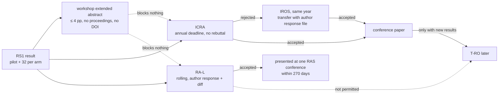
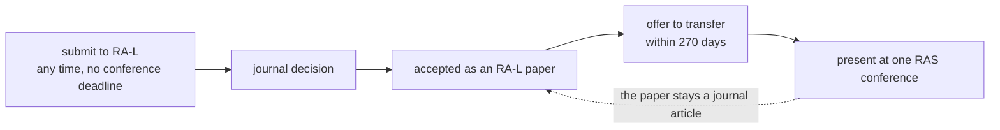
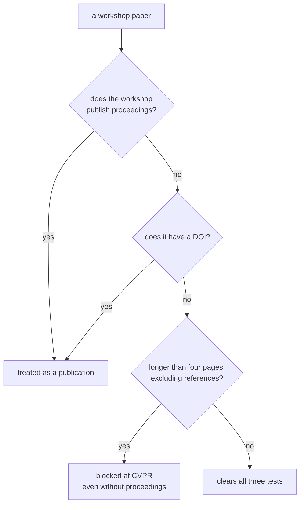
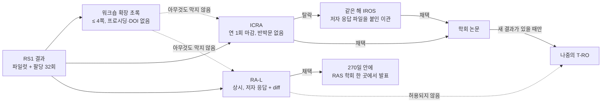
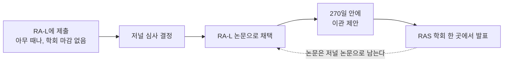
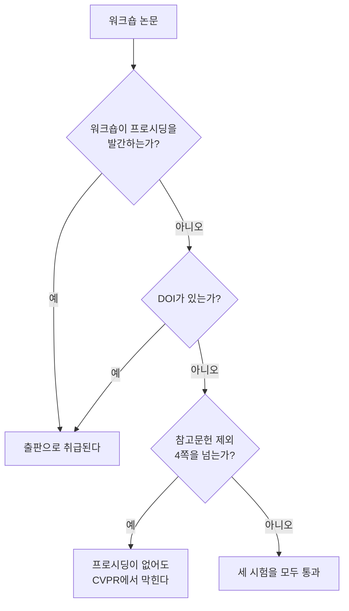

> [!abstract] Depth target · 깊이 목표
> **Working** — enough to pick a venue, predict the review process, and not lock yourself
> out of a journal version by accident.
> **Working** — venue를 고르고, 심사 과정을 예측하고, 실수로 저널 판본의 길을 막지 않을 만큼.

> [!note] Prerequisites · 선수 지식
> [[06-research-practice/research-questions-claims|1. Research Questions & Claims]] (RS1 and the claim a venue will judge) · [[06-research-practice/scientific-writing-peer-review|4. Scientific Writing & Peer Review §7]] (what a review and a rebuttal are — this page says which venues allow one)
> [[06-research-practice/research-questions-claims|1. 연구 질문과 주장]](RS1과 venue가 심사할 주장) · [[06-research-practice/scientific-writing-peer-review|4. 과학 글쓰기와 peer review §7]](심사와 반박문이 무엇인지 — 이 페이지는 어느 venue가 그것을 허용하는지를 말한다)

> [!warning] This page goes stale · 이 페이지는 낡는다
> Venue policies change, and outdated venue advice is worse than none because it sounds
> authoritative. Everything here was checked against official sources on **2026-08-21**, and
> every claim names the kind of source it came from. Before acting on any of it, re-read the
> venue's own current call for papers — and note that at least two rules below changed
> within the last three years.
> Venue 정책은 바뀌고, 낡은 venue 조언은 없느니만 못하다. 권위 있게 들리기 때문이다. 여기
> 있는 것은 전부 **2026-08-21**에 공식 출처로 확인했고, 모든 주장이 그 출처의 성격을 밝힌다.
> 무엇이든 행동에 옮기기 전에 그 venue의 현재 CFP를 직접 다시 읽어라 — 아래 규칙 중 최소
> 둘은 지난 3년 안에 바뀌었다.

## English

*Stands on [[06-research-practice/research-questions-claims|1. Research Questions & Claims]], which turned RS1 into a claim, and on [[06-research-practice/scientific-writing-peer-review|4. Scientific Writing & Peer Review]], which wrote it up. Here RS1's paper meets the venues: where it can go, what each review process will do to it, and which submission would close a later journal version.*

> [!note] First pass · 처음이라면
> Read the Running object and the Worked case — RS1's paper routed through this page's rules, with a calendar in relative months and the one rule on each route that would close a later journal version. Then §2 (whether you get to reply, and when you can submit), §4 (the RA-L route) and §5–§6 (the rules that block). §1, §3 and §7 are what you open when you have to defend a venue choice to someone else.

### Running object · 이 페이지의 대상

**RS1**, the running study of Research Practice, restated with its numbers unchanged. *Question:* does impedance control (**B**) make the planar arm's contact with a panel safer than position control with a force-threshold stop (**A**)? The arm is plant **P2** from [[02-foundations/lab-plants|0.6 Lab Plants]], and the panel's stiffness is **P3**'s wall, $k_w=400\,\mathrm{N/m}$. One trial is an approach and a contact; it succeeds when the peak contact force is at most $10\,\mathrm N$. The pilot ran ten trials per arm — **illustrative data, frozen for the whole chapter, not a measurement**:

| Arm | Peak contact force (N) | Successes | Mean | Sample sd | Median |
|---|---|---:|---:|---:|---:|
| A | 8.1, 9.4, 12.6, 9.8, 13.9, 7.7, 9.9, 9.1, 14.8, 11.3 | 6/10 | 10.66 | 2.414 | 9.85 |
| B | 6.2, 7.9, 8.4, 5.9, 7.1, 10.6, 6.8, 7.5, 8.0, 6.6 | 9/10 | 7.50 | 1.356 | 7.30 |

**The paper this page routes** is RS1's whole result: this pilot, and the confirmatory study planned at 32 trials per arm, 64 in all — the size [[06-research-practice/experimental-design-reproducibility|2. Experimental Design]] gives for the success rate, 0.6 against 0.9, at two-sided α = 0.05 and power 0.8 — written up as [[06-research-practice/scientific-writing-peer-review|4. Scientific Writing]] writes it. That is 84 trials of one two-controller comparison on one arm and one panel. Its contribution is a measured difference between two known controllers, not a new method, which is how a robotics reviewer will read it; §2's warning box says what a construction venue would ask instead.

**The calendar this page can support.** The page gives cadences, windows and the dates on which rules changed, and almost no review durations, so RS1's calendar is written in relative months. Month 0 is the day the confirmatory study is analysed. The next ICRA deadline falls $a$ months later; the page gives no date for it, so all it fixes is $0\le a<12$. Review times are unknowns $r$, for every venue except the one the page times, *Science Robotics*. The Worked case fills this calendar in, and no date on it is invented.

*Scope: this page teaches where a finished robotics result can be submitted, what each venue's review process will do to it, and which submission rules close a later option. It does not teach whether the result supports its claim — [[06-research-practice/research-questions-claims|1. Research Questions & Claims]] and [[06-research-practice/experimental-design-reproducibility|2. Experimental Design]] — nor how to write it up and answer a reviewer, which is [[06-research-practice/scientific-writing-peer-review|4. Scientific Writing & Peer Review]]. Every venue rule on it carries a date: re-read the venue's current call before acting on any of it (the warning above).*

### The picture · 그림으로 먼저 보기

<svg viewBox="0 0 560 160" style="max-width:100%;height:auto" role="img" aria-label="Time axis under the route map, in months after the result: on Route A the next ICRA deadline falls at month a, somewhere in 0 to 12, followed by an unstated review; on Route B the RA-L submission is at month 0, followed by an unstated review, and after acceptance a 270-day, 8.9-month window to present at one RAS conference. No calendar dates.">
  <text x="10" y="18" font-size="12.5" fill="currentColor">Time, in months after the result: relative only, no calendar dates</text>
  <line x1="132" y1="32" x2="132" y2="148" stroke="currentColor" stroke-width="1.0" stroke-opacity="0.5" stroke-dasharray="2 3"/>
  <text x="10" y="58" font-size="12" fill="currentColor">Route A · ICRA</text>
  <text x="140" y="41" font-size="11.5" fill="currentColor">next ICRA deadline: month a, with 0 ≤ a &lt; 12</text>
  <rect x="132" y="46" width="288" height="16" fill="currentColor" fill-opacity="0.12"/>
  <g stroke="currentColor" stroke-width="1.0" stroke-opacity="0.6"><line x1="132" y1="46" x2="420" y2="46"/><line x1="132" y1="62" x2="420" y2="62"/></g>
  <line x1="132" y1="43" x2="132" y2="65" stroke="currentColor" stroke-width="1.6"/>
  <line x1="420" y1="43" x2="420" y2="65" stroke="currentColor" stroke-width="1.2" stroke-dasharray="2 2"/>
  <text x="140" y="58" font-size="11.5" fill="currentColor">t<tspan font-size="11" dy="3">wait</tspan><tspan dy="-3" dx="4">= a</tspan></text>
  <text x="420" y="79" font-size="11" fill="currentColor" text-anchor="middle" opacity="0.85">12</text>
  <text x="430" y="53" font-size="11.5" fill="currentColor">+ r<tspan font-size="11" dy="3">ICRA</tspan></text>
  <text x="430" y="67" font-size="11" fill="currentColor" opacity="0.85">not stated</text>
  <text x="10" y="108" font-size="12" fill="currentColor">Route B · RA-L</text>
  <circle cx="132" cy="104" r="4.0" fill="currentColor"/>
  <line x1="136" y1="104" x2="222" y2="104" stroke="currentColor" stroke-width="1.4" stroke-dasharray="4 3"/>
  <g stroke="currentColor" stroke-width="1.3"><line x1="171" y1="111" x2="177" y2="97"/><line x1="177" y1="111" x2="183" y2="97"/></g>
  <text x="142" y="92" font-size="11.5" fill="currentColor">r<tspan font-size="11" dy="3">RA-L</tspan><tspan dy="-3">: not stated</tspan></text>
  <text x="137" y="126" font-size="11" fill="currentColor" opacity="0.85">submit</text>
  <line x1="222" y1="93" x2="222" y2="115" stroke="currentColor" stroke-width="1.6"/>
  <text x="222" y="126" font-size="11" fill="currentColor" text-anchor="middle" opacity="0.85">accepted</text>
  <rect x="222" y="96" width="212.9" height="16" fill="currentColor" fill-opacity="0.24" stroke="currentColor" stroke-width="1.0" stroke-opacity="0.7"/>
  <text x="328.4" y="108" font-size="11.5" fill="currentColor" text-anchor="middle">270 days = 8.9 months</text>
  <g font-size="11" fill="currentColor" opacity="0.85"><text x="442.9" y="103">to present at one</text><text x="442.9" y="117">RAS conference</text><text x="137" y="144">month 0: the day the confirmatory study is analysed</text></g>
</svg>

RS1's paper — the pilot plus the confirmatory study at 32 trials per arm — routed through the page's rules, each venue box carrying its cadence and its reply: ICRA, with an annual deadline and no rebuttal, and on rejection a same-year transfer to IROS with an author response file; RA-L, rolling, with an author response and a diff, whose accepted papers are presented at one RAS conference within 270 days; and a workshop extended abstract of at most 4 pages with no proceedings and no DOI. The pilot has no archival box of its own: its only early outlet is that workshop abstract, whose edges block nothing. Two edges close the journal route: RA-L to T-RO is not permitted, and a conference paper reaches T-RO later only with new results; the time axis under the map counts months from the result — RA-L submitted at 0, ICRA at the next deadline $a$ with $0\le a<12$, and 8.9 months (270 days) from an RA-L acceptance to its presentation — with no calendar date or review time, since the page states none.

### Worked case · 대상으로 한 번 끝까지

RS1's paper routed through the page's rules in four steps: what kind of result it is, what each route would block, what each route costs in time, and the decision.

**Step 1 — what kind of result it is.** A measured difference between two known controllers, 84 trials on one arm and one panel, with a confirmatory study sized before it ran. By §2's table and its warning box, that is a robotics result judged on its method and its baselines, and it belongs with ICRA, IROS and RA-L — the venues §7 gives for systems and incremental results; CoRL's audience is robot learning, which RS1 is not. Two other routes the page describes are set aside by the page's own criteria. *Science Robotics* wants a claim that matters outside robotics, and a two-controller comparison on a planar arm does not. *Automation in Construction* judges whether the construction problem is real, and RS1's panel is a stiffness, not a site.

**Step 2 — the rule on each route that would block a later journal version.**

| Route | What it does to a later journal version | The rule |
|---|---|---|
| Pilot alone to an archival venue now; the 32-per-arm study as the journal version later | **blocks it**: the journal paper would be more trials supporting the same claim | T-RO: not "a mere extension" adding "additional experiments"; IJRR: more experiments are "typically considered not substantial" (§5) |
| Whole result to RA-L | **blocks** an evolved T-RO version | RA-L → T-RO is not permitted (§5) |
| Whole result to ICRA, IROS transfer if rejected | leaves conference → T-RO open, **if** the T-RO paper carries new results | the extension rule (§5) |
| Pilot as a ≤ 4-page extended abstract at a workshop with no proceedings and no DOI, then any route above | **blocks nothing** | it clears all three tests (§6) |

The first row is the trap specific to RS1. A pilot and a confirmatory study are two papers' worth of work but one claim, so publishing the pilot first spends the claim, and the journal rules then read the confirmatory study as exactly the extension they refuse.

**Step 3 — the calendar, and the time-to-decision.** Time-to-decision is the wait for a deadline plus the review, $t_{\text{dec}}=t_{\text{wait}}+t_{\text{review}}$ (defined in §2), counted from month 0:

| | Route A — ICRA first | Route B — RA-L |
|---|---|---|
| submit | month $a$, the next annual deadline; $0\le a<12$, no date on this page | month 0 — rolling, all year |
| wait before review, $t_{\text{wait}}$ | $a$: anywhere from 0 to 12 months | 0 |
| review, $t_{\text{review}}$ | $r_{\text{ICRA}}$ — not stated on this page | $r_{\text{RA-L}}$ — not stated on this page |
| reply before the decision | none | author response + diff |
| after a rejection | the transfer (ICRA 2026 → IROS 2026 on this page) with an author response file — a second decision in the same year | revise, or submit elsewhere |
| after acceptance | a paper in the proceedings; T-RO later only with new results | presentation at one RAS conference within 270 days, $270/30.44=8.9$ months at an average month of 30.44 days; the paper stays a journal article |

So the page supports exactly one timing claim: RA-L removes the wait for a deadline, which is worth anywhere from 0 to 12 months depending on the day the result is ready. It does not support "RA-L decides faster", because that needs $r_{\text{RA-L}}<a+r_{\text{ICRA}}$ and the page states neither review time. The only review durations it does state are *Science Robotics*'s — about 1–2 weeks to hear that a paper was not selected, and 4 weeks asked of each referee otherwise — and by Step 1 that fast answer would be a fast no.

**Step 4 — the decision.** Of everything on this page, one question decides it: is a journal version of RS1 itself planned?

- **If RS1's paper is the whole contribution, send it to RA-L.** No wait for a deadline, a reply to the reviewers before the decision, journal status, and a presentation at one RAS conference within 8.9 months of acceptance. The price is the RA-L → T-RO rule, which costs nothing when no T-RO version was coming. §7's table reads incremental results the same way: RA-L's rolling deadline suits them.
- **If a larger journal paper is meant to grow from RS1** — say, the same controllers with the question of whether an operator can feel the difference, measured with the procedures of [[06-research-practice/psychophysics-human-measurement|8. Psychophysics]] — **send RS1 to ICRA** at month $a$, keep the transfer to IROS as the second chance, and build the T-RO paper around the new question, because more trials of the same comparison would not count.
- **On both routes, the pilot does not go to an archival venue on its own.** If early feedback is wanted, it goes to a workshop as a ≤ 4-page extended abstract with no proceedings and no DOI.

For RS1 as it stands — a comparison of two known controllers, with no follow-on journal paper planned in this chapter — the decision is Route B, RA-L.

### 1. Conferences are not the second tier

Outside computing, "conference paper" means an abstract and a talk. Inside it, the flagship
conferences are where the field's primary results appear, and a promotion committee from
another discipline will misread that if nobody tells them.

The reference for saying so is the CRA's 1999 best-practice memo, *Evaluating Computer
Scientists and Engineers For Promotion and Tenure* (Patterson, Snyder and Ullman), which
states plainly that **"Conference publication is both rigorous and prestigious"** and that
conference venues are inferior to prestige journals "only in having significant page
limitations and little time to polish the paper." Its 2025 successor, *Unique Considerations
for Evaluating Computing Researchers*, restates it for the current era: rigorously
peer-reviewed conferences are **the primary publication venue** for computing research, and
publication there is "on par with or preferred to journals."

> [!important] State it accurately, not maximally
> Neither ACM nor IEEE calls conference proceedings *archival* — both reserve that word for
> journals, and IEEE's operations manual assigns the archival-record role to Transactions,
> Journals and Letters specifically. What the official sources support is that flagship
> conference papers are **rigorously peer-reviewed, prestigious, primary, and count as prior
> publication of record**. That is a strong claim and it is defensible; "conference papers
> are archival" is a slightly stronger claim and it is not.

There is also a respectable dissent worth knowing, so the page does not read as advocacy:
Moshe Vardi's 2009 *CACM* editorial *Conferences vs. Journals in Computing Research* argues
that program-committee reviewing "does not rise to the level of careful refereeing."

### 2. What each venue's review process will actually do

*In one sentence:* venues differ most in whether you may answer the reviewers before they decide and whether you must wait for a yearly deadline, and construction and general-science venues judge a robotics result by different standards than robotics venues do.

*If you need only one thing from this section:* the time-to-decision $t_{\text{dec}}=t_{\text{wait}}+t_{\text{review}}$ — a rolling venue such as RA-L has $t_{\text{wait}}=0$, while an annual deadline can add anywhere up to $12$ months; it is defined after the transfer table and worked on RS1 in the Worked case's step 3.

The differences that matter day to day are not prestige rankings — they are **whether you
get to reply**, and **when you can submit**.

| Venue | Anonymity | Rebuttal | Cadence |
|---|---|---|---|
| **ICRA** | double-anonymous **from the 2026 edition** (2025 was single-blind) | **none** for regular papers | annual deadline |
| **IROS** | double-anonymous **from the 2026 edition** (2025 was single-blind) | **none** for regular papers | annual deadline |
| **RSS** | double-blind | one page, **for a subset only** | annual deadline |
| **CoRL** | double-blind | one page, **non-interactive** | annual deadline, OpenReview |
| **T-RO** | double-anonymous **since January 2025** | revise & resubmit | rolling |
| **RA-L** | double-anonymous | author response + diff | **rolling, all year** |
| **IJRR** | **single-anonymized** — referees see your name | — | rolling |

**Two dates worth keeping straight.** IEEE RAS moved its *journals* to double-anonymous
review on 1 January 2025; the ICRA and IROS *conferences* followed one cycle later, with the
2026 editions. So a 2025 ICRA or IROS paper was reviewed single-blind, and anything you read
about "ICRA is single-blind" is describing the world up to that flip.

**And one exception to "no rebuttal".** ICRA and IROS now run a **transfer category** — a
paper rejected from ICRA 2026 may be submitted to IROS 2026 as an "ICRA-IROS transfer" with
an **author response file**, and the reverse path exists for IROS 2026 into ICRA 2027. That
is the only place in either conference where you get to answer reviewers.

The RAS transfer that runs the other way is journal → conference: a paper accepted in an
IEEE RAS journal can be presented at ICRA. There is no automated ICRA → journal path. What
the ICRA 2026 call says, journal by journal:

| Journal | Named as eligible for presentation | Transfer needs a code from the editor-in-chief |
|---|---|---|
| RA-L (*IEEE Robotics and Automation Letters*) | yes | no |
| RA-M (*IEEE Robotics & Automation Magazine*) | yes | no |
| T-RO (*IEEE Transactions on Robotics*) | yes | no |
| T-ASE (*IEEE Transactions on Automation Science and Engineering*) | yes | yes |
| T-FR (*IEEE Transactions on Field Robotics*) | yes | yes |
| RA-P (*IEEE Robotics and Automation Practice*) | not in that list | yes |
| T-RL (*IEEE Transactions on Robot Learning*) | not on the list | — |

Two things surprise people arriving from machine learning. **ICRA and IROS have no rebuttal
at all** — the reviews are the decision, and a reviewer who misread your paper cannot be
corrected. And **RSS and CoRL rebuttals are one page and non-interactive**, nothing like the
multi-round discussion threads of ICLR or NeurIPS. Budget your clarity for the submission,
because there is no second chance to explain.

IJRR's single-anonymized model is the other outlier: referees are told who you are.

**Two terms the table turns on, defined.** The Worked case uses both on RS1.

> **Time-to-decision, defined.** **Time-to-decision** is a *duration*, counted from the day a result is ready — not the day it is submitted — to the first decision you can act on: accept, reject or revise. Three defining conditions. It **starts when the result exists**, so the wait for a deadline is part of it. It **ends at an actionable decision**, not at publication or presentation. And it **adds the two parts a venue controls**: when it lets you submit, and how long its review takes.
>
> $$t_{\text{dec}}=t_{\text{wait}}+t_{\text{review}},\qquad 0\le t_{\text{wait}}<12\ \text{months for an annual deadline},\quad t_{\text{wait}}=0\ \text{for a rolling venue}$$
>
> where $t_{\text{wait}}$ comes from the Cadence column above and $t_{\text{review}}$ from the venue's own process — so this page, which states cadences but not review times, gives you the first term for every venue and the second for almost none.
>
> - **Example**: RA-L, rolling: $t_{\text{wait}}=0$ on any day of the year.
> - **Non-example**: "ICRA takes a few months" offered as a time-to-decision. It leaves out the wait, which for an annual deadline can be most of a year, and it is a review time this page does not state.
> - **Why it matters**: before review, two routes differ only by their waits, so that is the part you can compute; quote the review part only from the venue's own current figures.

> **Rebuttal, defined.** A **rebuttal** is an *author reply to the reviews of a submission, read before the decision on that same submission, with the submission itself unchanged*. Three defining conditions: it happens **inside one review cycle**; it is **read before the decision** it can change; and its **form is set by the venue** — its length, whether every paper gets one, whether anyone replies to it. There is no formula: whether a venue has one is a fact of its call for papers, and the table above is where this page records it.
>
> - **Example**: RSS's one page, for a subset of papers only; CoRL's one page, non-interactive.
> - **Non-example**: the author response file of the ICRA-IROS transfer, which answers a decision already made and travels to a different venue. Nor are T-RO's revise and resubmit and RA-L's author response with a diff rebuttals: in both a revised paper comes with the reply, which is a revision and more than a rebuttal.
> - **Why it matters**: without one, the reviews are the decision, so the submission has to survive a reader who will not ask a question — Self-check 5 below.

**The domain venues, which this table has been missing.** Most of the construction papers in
[[01-canonical-papers/canonical-list|§8 of the canonical list]] are in venues no robotics
reader has calibration for, and a systems paper reads differently there:

| Venue | Publisher | Review | What acceptance signals |
|---|---|---|---|
| ***Automation in Construction*** | Elsevier | **single-anonymized**; editor screens, then ≥2 reviewers | the domain's flagship. Scope is the whole construction life cycle — design, build, operate, dismantle — so a robotics result is judged on **whether the construction problem is real**, not on method novelty |
| ***J. Computing in Civil Engineering*** (JCCE) | ASCE | single-anonymized | computing/AI/BIM/sensing across civil subdomains; a US civil-engineering readership rather than a robotics one |
| ***Computer-Aided Civil and Infrastructure Engineering*** (CACAIE) | **moved from Wiley to Elsevier in January 2026**; the ISSN does not change with it — 1093-9687 is the print ISSN and 1467-8667 the online one, for the same title | **double**-anonymized | computational-method novelty, framed as a bridge from computing to civil engineering |
| **ISARC** (IAARC) | IAARC, **free to read**; publication is gated by paid registration, not an APC (article processing charge, a fee paid per accepted paper) | peer-refereed (≥2 reviewers) with a per-paper DOI and Scopus indexing — but ~76% acceptance, so refereed ≠ selective | the field's annual symposium — where to find what is being tried before it reaches a journal |
| ***Science Robotics*** | AAAS | an Editorial Board member screens first; authors of papers not selected hear within about 1–2 weeks, and papers selected for in-depth review go to ≥2 outside referees, asked to reply within 4 weeks | a **general-science** audience: the claim must matter outside robotics. Two construction landmarks are here — [[01-canonical-papers/notes/8-construction/aes\|AES]] and the [[01-canonical-papers/notes/8-construction/dry-stone-wall\|dry-stone wall]]. Note that [[01-canonical-papers/notes/8-construction/heap\|HEAP]] itself is *Automation in Construction*, two rows up |

Three consequences for reading. **Most of the civil-engineering side is single-anonymized, so
referees see the authors** — the same caveat IJRR carries above. CACAIE is the exception in
this table, and the exception matters operationally: submit it de-anonymised and you risk a
desk reject.
**Novelty is judged against a different baseline**: a method that a robotics reviewer would
call incremental can be a genuine contribution in *Automation in Construction* if it is the
first time the problem has been posed on a real site, and the reverse is also true. And
**ISARC is where the negative results and the early systems are**, because a symposium paper
costs less to write than a journal one — it is under-cited by robotics readers precisely
because they do not know it is refereed and indexed.

> [!warning] Writing for two audiences at once
> A construction-robotics paper submitted to ICRA and one submitted to *Automation in
> Construction* are not the same paper with a different template. ICRA wants the method
> contribution isolated and compared against robotics baselines; AutCon wants the construction
> process, the site constraints, and what changes for the trade. **Papers 1, 3 and 5 of
> [[07-research-program/paper-arc|the arc]] are routed to construction journals precisely
> because their contribution is the problem framing** — and that framing is what an ICRA
> reviewer will discount.

### 3. Acceptance rates — and which venues do not publish them

Read this table for the *pattern*, not the numbers, and check the current year before
quoting anything.

| Venue | Official figure? | Most recent official statement |
|---|---|---|
| **NeurIPS** | yes, from the program chairs | 2025: 21,575 valid submissions, 5,290 accepted, **24.52%** |
| **CVPR** | yes | 2026: 16,092 submissions. CVF says 4,089 presented and "about one-quarter"; the @CVPR account says 4,090 recommended and 25.42%. Two official sources, one paper apart — quote one |
| **IROS** | yes | 2025: 4,306 conference papers submitted, 1,991 accepted, **46%** |
| **ICRA** | **counts only, no rate** | 2025: 4,250 submissions, 1,606 accepted, 503 journal transfers |
| **RSS** | **no official figure published** | — |
| **CoRL** | **no official figure published** | — |

Two habits follow. First, **ICRA states counts but no percentage**, so any ICRA rate you see
is somebody's arithmetic — say so if you use it. Second, **RSS and CoRL publish nothing**,
so every RSS or CoRL selectivity figure in circulation is third-party. Writing "no official
figure is published" is more accurate than repeating one, and in a research-statement
context it is also more credible.

**What the counts give, worked.** ICRA's 2025 counts divide to $1{,}606/4{,}250 = 37.8\%$ for the papers that went through its review. The 503 journal transfers reached ICRA through an IEEE RAS journal instead (§2), and a reader who adds them to the accepted count gets $(1{,}606 + 503)/4{,}250 = 49.6\%$, one who adds them to both counts $44.4\%$: three rates from one official statement, so a quoted ICRA rate has to carry its arithmetic. The IROS figure checks the other way: $1{,}991/4{,}306 = 46.2\%$, which the organisers state as 46%. For RS1 no rate entered the decision. The Worked case chose between ICRA and RA-L by what each route blocks and when each lets the paper in, and an average over four thousand submissions says little about how one two-controller comparison will be read (§2's warning box).

### 4. The RA-L route, which changed

This is the item most likely to be wrong in advice a student has already absorbed.

**The old way, until the 2023 cycle**: submit to RA-L *with the ICRA or IROS option*, on a
conference-specific deadline, and get a joint journal-plus-conference outcome. ICRA 2022 was
the last edition with that track. IEEE RAS's own page for conference organisers now carries
a disclaimer that the old information "is outdated".

**The current way**: RA-L is a plain rolling journal. You submit whenever, acceptance is a
**journal** decision only, and on acceptance you are offered a transfer to present the paper
at a RAS conference within a **270-day** window. The paper is *not* in the conference
proceedings — it stays an RA-L journal article, and it may be presented at only one
conference.

One eligibility rule catches people: only **non-evolutionary** published papers are
eligible. A journal paper that was itself an extension of an earlier conference paper
cannot be taken back to a conference.

**On RS1's calendar.** The change is worth exactly one term of §2's time-to-decision. Under the old track RS1's paper would have waited for a conference-specific deadline, $t_{\text{wait}} = a$ with $0 \le a < 12$ months, the same wait as a plain ICRA submission; on today's rolling route $t_{\text{wait}} = 0$. Acceptance then starts a second clock: the presentation must fall within $270/30.44 = 8.9$ months, at one conference, and because the paper enters no proceedings, RS1's authors list one journal article and no conference paper. The eligibility rule gives the Worked case's advice about the pilot a second reason. RS1's RA-L paper extends no earlier paper, so it may be presented; had the pilot appeared at ICRA first and the confirmatory study gone to RA-L as its extension, the RA-L paper would be evolutionary and could not be taken to any conference.

### 5. Extending a conference paper into a journal paper

> [!warning] The "30% new material" rule does not exist
> There is **no official numeric threshold** in IEEE, IEEE RAS, or IJRR policy. IEEE's
> operations manual requires "substantial additional technical material" and then explicitly
> **delegates any quantitative threshold to the individual journal**, requiring that the
> journal publish it in its own author instructions. So the honest procedure is: read your
> target journal's author instructions; if it states no number, there is no number.
> ACM does publish a soft figure — generally at least 25% not previously published — but
> that is ACM's rule, not robotics'.
> **"신규 자료 30%" 규칙은 존재하지 않는다.** IEEE·IEEE RAS·IJRR 정책 어디에도 공식 수치
> 기준이 없다. IEEE 운영 매뉴얼은 "실질적인 추가 기술 자료"를 요구한 뒤 **정량 기준을 개별
> 저널에 명시적으로 위임**하고, 그 저널의 저자 안내에 게시할 것을 요구한다. ACM은 통상 25%
> 이상이라는 완만한 수치를 두지만 그것은 ACM의 규칙이지 로보틱스의 규칙이 아니다.

What the robotics journals *do* say is sharper than a percentage, and it is the same point
twice:

- **T-RO** states that a submission "must not be just a mere extension" filling in proofs,
  corollaries, **additional experiments**, or more background — it "must contain new results
  of substantive research significance and impact beyond the previous papers."
- **IJRR** states that "the mere inclusion of more details, experiments, or discussion is
  typically considered not substantial," and requires an ≤80-word novelty statement plus
  upload of the conference PDF.

**More experiments supporting the same claim are not, by themselves, a substantive extension.**
Explain the significance of new questions, methods, or results against the target journal's guidance.

Two structural rules on top:

- **T-RO's "evolved paper" category was retired in January 2025**, because the journal moved
  to double-anonymous review. You now cite your earlier work in the third person rather than
  writing "in our previous work".
- **RA-L → T-RO is not permitted.** RAS states the evolutionary paradigm does not apply
  between them because both are archival journal publications. Conference → T-RO is the
  natural path; conference → RA-L is discouraged, because a Letter is about the length of a
  conference paper to begin with.

> **Substantive extension, defined.** A **substantive extension** is a *journal paper built on the author's own earlier conference paper that the target journal accepts as new* — a judgment about the new paper's results, not a percentage of new text. Three defining conditions, all from the journals' own wording above. It carries **new results of substantive research significance** beyond the earlier paper (T-RO). **More of the same does not count**: added proofs, corollaries, experiments, details or background supporting the same claim are named as insufficient (T-RO, IJRR). And the **threshold is the target journal's**, published in its own author instructions, because IEEE delegates any number to the journal — so where the journal states no number, there is none. There is no formula, and that absence is the rule (the warning at the top of this section).
>
> - **Example**: RS1's conference paper followed by a journal paper that asks a new question of the same controllers — whether an operator can feel the difference between A's and B's contact — with a new measurement. Whether that is enough is the journal's call; it is at least the right kind of thing.
> - **Non-example**: RS1's pilot as the conference paper and its 32-per-arm confirmatory study as the journal paper. More trials supporting the same claim is the case both journals name.
> - **Why it matters**: it is decided at the first submission. Whether a journal version can exist is fixed by what the conference paper already contains.

### 6. Workshops — where a paper can silently block a later one

There are **three regimes**, and the two-way "archival versus non-archival" framing misses
the one that bites.

- **NeurIPS** states plainly that all its workshop papers are non-archival and do not appear
  in proceedings, and its main call permits previously workshopped papers so long as they
  did not appear in proceedings, a journal, or a book.
- **ICRA** applies a **DOI test**: a workshop paper without formal peer-reviewed proceedings
  may be submitted, but "if your workshop paper has a DOI, this would be considered as an
  archival publication equivalent to a conference paper. Such papers cannot be submitted."
- **CVPR** applies a **length test that ignores what the workshop calls itself**: a
  peer-reviewed written work longer than four pages excluding references counts as a
  publication, and the guideline says outright that this "does not depend upon whether such
  an accepted written work appears in a formal proceedings or whether the organizers declare
  that such work 'counts as a publication'."

The move that clears all three: a **four-page-or-shorter extended abstract, at a workshop
with no proceedings and no DOI**. That preserves every downstream option.

> [!note] What could not be confirmed
> IROS has **no** official statement on workshop archival status of its own — it requires
> organisers to comply with the IEEE RAS workshop guidelines, which say RAS workshop papers
> "cannot be published as peer reviewed papers", but IROS's own pages are silent. RSS
> likewise never declares its own workshops non-archival, though its call for papers permits
> submissions previously presented at workshops without published proceedings. Treat both as
> unconfirmed and ask the organisers.

> **Prior publication, defined as a submission rule.** A work's **prior-publication status** is a *verdict the receiving venue passes on earlier work* — whether it counts as published, and so whether it may be submitted again — not a label the work carries with it. Three defining conditions. It is **decided by the receiving venue's rule**, not by what the workshop calls itself, which CVPR says outright. It is **triggered by any one** of the tests that venue applies. And it is **venue-specific**: the same six-page paper can be unpublished at ICRA and published at CVPR (Self-check 4).
>
> $$\text{published at }V\iff\text{proceedings}\ \lor\ \text{DOI}\ \lor\ \big(V=\text{CVPR}\ \land\ \text{peer-reviewed}\ \land\ \text{pages}>4\big)$$
>
> which is this section's flowchart as one line, with pages counted excluding references — so a work for which all three disjuncts are false is clear at every venue in the chart.
>
> - **Example**: the four-page extended abstract at a workshop with no proceedings and no DOI. All three disjuncts are false.
> - **Non-example**: "our workshop is non-archival, so anything it accepts is safe." The workshop's own label appears nowhere in the formula, and a six-page peer-reviewed paper there is published at CVPR regardless.
> - **Why it matters**: the block is silent. It is discovered only when the later paper is submitted, which is too late to shorten the earlier one.

### 7. Where this program's papers go

Mapping [[07-research-program/paper-arc|the arc]] onto venues, with the reasoning rather
than a ranking:

| Arc paper | Natural venues | Why |
|---|---|---|
| 1 — human-aware | ICRA, IROS, or a construction journal | HRI results with human studies read well in *Automation in Construction* too |
| 2 — navigation / mobile manipulation | ICRA, IROS, RA-L | systems-integration results; RA-L's rolling deadline suits an incremental result |
| 3 — core construction manipulation | ICRA, RSS, or *Automation in Construction* | the domain journal reaches the people who would deploy it |
| 4 — contact-rich and learned | CoRL, RSS, RA-L | robot-learning audience |
| 5 — integrated system | T-RO, IJRR, or *Automation in Construction* | integration results need length, and journals give it |

The dual audience is a real asset and worth using deliberately: a robotics venue judges the
method, a construction venue judges whether it would survive a site. A result that passes
both is the kind [[07-research-program/index|the program]] is built to produce.

### After reading

- [ ] State what official sources do and do not support about conference-paper status.
- [ ] Name the two venues with no rebuttal, and what that means for how you write.
- [ ] Say which venues publish no official acceptance rate.
- [ ] Describe the current RA-L route and what changed.
- [ ] Give the three workshop tests and the submission shape that clears all of them.
- [ ] Write a result's calendar in relative months from the page's cadences and windows alone, and say which terms the page cannot fill.
- [ ] Name, for each route, the rule that would block a later journal version — including the one that blocks a pilot published on its own.

### Self-check

1. A colleague says "submit to RA-L with the ICRA option". What do you tell them?
2. You have an ICRA paper and a month free. Is adding two more experiments enough for a
   T-RO extension?
3. You want to cite CoRL's selectivity in a research statement. What can you write?
4. You presented a six-page peer-reviewed paper at a workshop with no proceedings and no
   DOI. Can you submit that work to ICRA? To CVPR?
5. Your reviewer at ICRA misunderstood the method. What is your recourse?
6. Why must RS1's pilot not appear on its own in an archival venue before the confirmatory study is published?
7. The page states no review time for RA-L or ICRA. What can you still say about the two routes' time-to-decision for RS1, and what can you not?

> [!tip]- Answers
> 1. That the option was discontinued in the 2023 cycle — ICRA 2022 was the last edition with it, and IEEE RAS's own organiser page now marks the old information outdated. RA-L is now a plain rolling journal; if accepted you get a 270-day window to transfer the paper for *presentation* at one RAS conference, and the paper stays a journal article rather than entering the proceedings.
> 2. No, and both journals say so explicitly. T-RO names "additional experiments" as among the things that do *not* make an extension substantial, and IJRR says the mere inclusion of more details, experiments or discussion is typically not substantial. The requirement is new results of substantive research significance — a different contribution, not a longer version of the same one.
> 3. That CoRL publishes no official acceptance rate. Any percentage in circulation is third-party, and stating the absence is both more accurate and more credible than repeating an unofficial number. If you need a selectivity signal, use a venue that publishes one — NeurIPS and IROS do, and CVPR states counts plus an approximate share.
> 4. **ICRA: yes** — no formal proceedings and no DOI clears the DOI test. **CVPR: no** — CVPR counts any peer-reviewed written work longer than four pages excluding references as a publication, explicitly regardless of proceedings or of what the organisers call it. Six pages fails that test even though the same paper is fine for ICRA. This is exactly why the safe shape is a four-page extended abstract.
> 5. None, in the review round — ICRA has no rebuttal, so the reviews are the decision. The recourse is preventive: write for a reviewer who will not ask you a question, and if rejected, use the ICRA-to-IROS transfer path, which is the one category where an author response file exists.
> 6. Because it would spend the claim. The pilot and the 32-per-arm study test the same claim, so once the pilot is a publication the confirmatory study can only be the journal version, and the journal rules read it as exactly what they refuse: T-RO names "additional experiments" among the things that do not make an extension substantial, and IJRR says the mere inclusion of more experiments is typically considered not substantial (§5). The safe place for an early pilot is a ≤ 4-page extended abstract at a workshop with no proceedings and no DOI (§6).
> 7. You can say that RA-L's wait is 0 and ICRA's is the time to its next annual deadline, anywhere from 0 to 12 months — so RA-L removes up to a year of waiting. You cannot say which route decides first, because that also needs the two review times, and the page states neither; the only review durations it gives are *Science Robotics*'s.

### Problem set · 과제

Tier B. Using this page, [[06-research-practice/research-questions-claims|1. Research Questions & Claims]] and [[06-research-practice/scientific-writing-peer-review|4. Scientific Writing & Peer Review]]; every venue fact must come from this page. Hand reasoning only.

**The variant.** RS1's confirmatory study runs as planned — 32 trials per arm, sized for power 0.8 — and comes back **null**: it does not separate B from A. Everything else is the Running object's. No numbers are frozen for the null result, and the questions below do not need any.

1. **Draw.** The route map of the picture above for the null result, with a time axis under it. Keep every box whose rules do not depend on the sign of the result, and add the ISARC box that §2 describes, with its edge to ICRA labelled by the rule that governs it.
2. **Derive.** (a) The relative calendar of the null result on Route A and on Route B: $t_{\text{wait}}$ for each, the number of decisions the ICRA route can give within one year, and the presentation window after an RA-L acceptance, in months. Say which terms the page cannot fill. (b) The rule that would block a later journal version if the null result goes to RA-L; to ISARC; to a workshop as a six-page peer-reviewed paper with a DOI. (c) Which of §6's three tests a ≤ 4-page extended abstract at a workshop with no proceedings and no DOI fails.
3. **Interpret.** (a) A labmate says negative results do not get published in robotics, so the study should be shelved. What does this page say, and what does it not say? (b) A reviewer is likely to read "no difference" as "too few trials". Which venues in §2's table let you answer that before the decision, and in what form — and what would you answer with? (c) A colleague argues for CoRL "because its acceptance rate is lower". What does §3 let you say?

> [!note]- How to draw it · 그리는 법
> - **Every venue box carries its cadence and its reply** — annual or rolling; no rebuttal, a transfer response, or an author response with a diff — because those two columns of §2 are what the calendar is made of.
> - **Every edge carries the rule that governs it:** the worked case's two blocking edges are RA-L to T-RO, *not permitted*, and conference paper to T-RO, *only with new results* (both §5); the workshop's edges read *blocks nothing*.
> - **The pilot is not a box of its own on any archival route;** it appears only inside the workshop box. Had it an archival paper of its own, the confirmatory study would become the "additional experiments" of §5 and the edge to T-RO would be cut.
> - **A time axis under the map, in relative months:** 0 at the result and at the RA-L submission, $a$ at the ICRA deadline with the bracket $0\le a<12$, and a bar 270 days long — 8.9 months — starting at the RA-L acceptance.
> - **No tick carries a calendar date**, because the page gives none, and review times stay unknowns.

> [!tip]- Solutions
> 1. The map keeps its shape: no venue rule on this page depends on whether a result is positive. The ISARC box carries §2's facts — refereed by at least two reviewers, a DOI for every paper, Scopus-indexed, about 76% acceptance, and named as where the negative results and early systems are. Its edge to ICRA is cut: the ICRA call treats a workshop paper with a DOI as an archival publication equivalent to a conference paper, and a refereed ISARC paper with its own DOI is at least that, so the same work cannot then be submitted to ICRA. The time axis is unchanged.
> 2. (a) Route B: $t_{\text{wait}}=0$, and after acceptance a presentation within 270 days, 8.9 months, at one RAS conference. Route A: $t_{\text{wait}}=a$ with $0\le a<12$, and up to two decisions in the year — ICRA 2026, then the IROS 2026 transfer. Both review times are unknown on this page, so it supports "RA-L removes up to 12 months of waiting" and not "RA-L decides faster". (b) RA-L: an evolved T-RO version is not permitted (§5). ISARC: the ICRA route for the same work closes by the DOI test, and any journal version must meet that journal's extension rule — for T-RO and IJRR, new results rather than more experiments (§5). A six-page peer-reviewed workshop paper with a DOI: published by the DOI test, so that work cannot go to ICRA, and by the length test it would count at CVPR even without the DOI (§6). (c) None. It has no proceedings, no DOI, and is not longer than four pages excluding references, so every later option survives.
> 3. (a) The page does not say negative results are unpublishable. It names ISARC as where negative results and early systems appear, refereed and indexed — and warns in the same row that about 76% acceptance means refereed is not the same as selective. It says nothing about how ICRA, IROS or RA-L treat null results, so this page supports the labmate's claim neither way. (b) ICRA and IROS: none — the answer has to be in the paper, and the one later chance is the transfer's author response file. RSS: one page, for a subset of papers only. CoRL: one page, non-interactive. RA-L: an author response with a diff; T-RO: revise and resubmit. The answer is the design itself: the study was sized before it ran, 32 per arm for power 0.8 against the pilot's 0.6 versus 0.9, so a null from it counts against a difference as large as the pilot suggested. That argument belongs in the submission, where a venue with no rebuttal still sees it. (c) That CoRL publishes no official acceptance rate: any percentage in circulation is third-party, and "lower" is somebody's arithmetic. §3's habit is to say so rather than repeat the number.

### Sources

All of the following were checked on **2026-08-21** against the venue's or society's own
pages. Where a claim rests on absence — "no official figure is published" — that means the
venue's calls for papers, statistics pages and chairs' reports were checked and contained none.

- IEEE RAS, [RA-L information page](https://www.ieee-ras.org/publications/ra-l/) — the current presentation-transfer policy and its 270-day window; and the [organiser page](https://www.ieee-ras.org/publications/ra-l/information-for-ra-l-option-conference-organizers/) whose own disclaimer dates the old conference option as outdated.
- IEEE RAS, [T-RO information for authors](https://www.ieee-ras.org/publications/t-ro/t-ro-information-for-authors/) — double-anonymous since January 2025, the retirement of the evolved-paper category, and what does not count as an extension.
- IEEE PSPB Operations Manual §8.1.7.F — "substantial additional technical material", with any quantitative threshold delegated to the individual periodical.
- SAGE, [IJRR submission guidelines](https://journals.sagepub.com/author-instructions/IJR) — single-anonymized review, the novelty statement, and the "more experiments is not substantial" wording.
- Venue calls for papers: [ICRA 2026](https://2026.ieee-icra.org/contribute/call-for-icra-2026-papers-now-accepting-submissions/) (the DOI test), [IROS 2026](https://2026.ieee-iros.org/contribute/call-for-papers/), [RSS](https://roboticsconference.org/information/cfp/), [CoRL author instructions](https://www.corl.org/contributions/instruction-for-authors) (the clearest definition of an archival venue), [CVPR 2026 author guidelines](https://cvpr.thecvf.com/Conferences/2026/AuthorGuidelines) (the four-page test), [NeurIPS workshop guidance](https://neurips.cc/Conferences/2026/WorkshopsGuidance).
- Acceptance figures: [NeurIPS 2025 program-chair reflections](https://blog.neurips.cc/2025/09/30/reflections-on-the-2025-review-process-from-the-program-committee-chairs/); [CVPR 2026 technical program announcement](https://cvpr.thecvf.com/Conferences/2026/News/Technical_Program); IROS 2025 official conference digest; [ICRA 2025 highlight statistics](https://2025.ieee-icra.org/announcements/icra-2025-highlight-statistics/).
- D. Patterson, L. Snyder, J. Ullman, [*Evaluating Computer Scientists and Engineers For Promotion and Tenure*](https://cra.org/resources/best-practice-memos/evaluating-computer-scientists-and-engineers-for-promotion-and-tenure/), CRA Best Practice Memo, August 1999; and *Unique Considerations for Evaluating Computing Researchers*, CRA, July 2025.
- M. Y. Vardi, "Conferences vs. Journals in Computing Research," *CACM*, vol. 52, no. 5, p. 5, 2009 — the dissent.

**Within this wiki**

- [[06-research-practice/scientific-writing-peer-review|Scientific Writing & Peer Review]] — writing for the review process this page describes
- [[07-research-program/paper-arc|7.1 Paper Arc]] — the papers being placed
- [[08-research-radar/index|Research Radar]] — which now indexes IROS, RSS, RA-L and T-RO

## 한국어

*RS1을 주장으로 바꾼 [[06-research-practice/research-questions-claims|1. 연구 질문과 주장]], 그리고 그것을 논문으로 쓴 [[06-research-practice/scientific-writing-peer-review|4. 과학 글쓰기와 peer review]] 위에 선다. 여기서 RS1의 논문이 venue를 만난다: 어디로 갈 수 있는지, 각 심사 과정이 그것에 무엇을 하는지, 어떤 제출이 나중의 저널 판본을 닫는지.*

> [!note] 처음이라면 · First pass
> 이 페이지의 대상과 계산 절부터 읽는다 — RS1의 논문을 이 페이지의 규칙에 통과시키고, 상대 월로 쓴 일정표와 경로마다 나중의 저널 판본을 닫는 규칙 하나를 붙인다. 그다음 §2(답할 기회가 있는가, 언제 낼 수 있는가), §4(RA-L 경로), §5–§6(막는 규칙들)을 읽는다. §1, §3, §7은 venue 선택을 다른 사람에게 변호해야 할 때 연다.

### 이 페이지의 대상 · Running object

**RS1** — 연구 실무의 관통 연구. 숫자를 바꾸지 않고 다시 적는다. *질문:* 임피던스 제어(**B**)가 힘 임계 정지를 붙인 위치 제어(**A**)보다 평면 팔과 패널의 접촉을 더 안전하게 만드는가? 팔은 [[02-foundations/lab-plants|0.6 Lab Plants]]의 장치 **P2**, 패널 강성은 **P3** 벽의 $k_w=400\,\mathrm{N/m}$다. 시행 하나는 접근과 접촉 한 번이고, 최대 접촉력이 $10\,\mathrm N$ 이하이면 성공이다. 파일럿은 팔마다 10회 — **장 전체에 고정된 예시 데이터이며 측정값이 아니다**:

| 팔 | 최대 접촉력 (N) | 성공 | 평균 | 표본 표준편차 | 중앙값 |
|---|---|---:|---:|---:|---:|
| A | 8.1, 9.4, 12.6, 9.8, 13.9, 7.7, 9.9, 9.1, 14.8, 11.3 | 6/10 | 10.66 | 2.414 | 9.85 |
| B | 6.2, 7.9, 8.4, 5.9, 7.1, 10.6, 6.8, 7.5, 8.0, 6.6 | 9/10 | 7.50 | 1.356 | 7.30 |

**경로를 정할 논문.** RS1의 결과 전체다: 이 파일럿, 그리고 팔마다 32회, 모두 64회로 계획된 확증 연구 — [[06-research-practice/experimental-design-reproducibility|2. 실험 설계]]가 성공률(0.6 대 0.9, 양측 α = 0.05, 검정력 0.8)에 대해 주는 크기 — 를 [[06-research-practice/scientific-writing-peer-review|4. 과학 글쓰기]]가 쓰는 방식으로 쓴 논문. 팔 하나와 패널 하나 위에서 두 제어기를 비교한 84회 시행이다. 기여는 새 방법이 아니라 이미 알려진 두 제어기 사이의 측정된 차이이고, 로보틱스 심사자는 그렇게 읽는다. 건설 venue라면 무엇을 물을지는 §2의 경고 상자가 말한다.

**이 페이지가 받쳐 줄 수 있는 일정표.** 이 페이지는 주기, 창, 규칙이 바뀐 날짜를 주지만 심사 기간은 거의 주지 않으므로, RS1의 일정표는 상대 월로 쓴다. 0월은 확증 연구의 분석이 끝난 날이다. 다음 ICRA 마감은 $a$개월 뒤인데, 이 페이지에 날짜가 없으므로 정해지는 것은 $0\le a<12$뿐이다. 심사 기간은 이 페이지가 기간을 밝히는 유일한 venue인 *Science Robotics*를 빼면 모두 미지수 $r$이다. 계산 절이 이 일정표를 채우고, 거기에 지어낸 날짜는 없다.

*범위: 이 페이지는 완성된 로보틱스 결과를 어디에 낼 수 있는지, 각 venue의 심사 과정이 그것에 무엇을 하는지, 어떤 제출 규칙이 나중의 선택지를 닫는지를 가르친다. 결과가 주장을 뒷받침하는지는 가르치지 않는다 — 그것은 [[06-research-practice/research-questions-claims|1. 연구 질문과 주장]]과 [[06-research-practice/experimental-design-reproducibility|2. 실험 설계]]다. 논문을 쓰고 심사자에게 답하는 법도 아니다 — 그것은 [[06-research-practice/scientific-writing-peer-review|4. 과학 글쓰기와 peer review]]다. 여기 있는 모든 venue 규칙에는 날짜가 붙어 있다: 행동에 옮기기 전에 그 venue의 현재 CFP를 다시 읽어라(위의 경고).*

### 그림으로 먼저 보기 · The picture

<svg viewBox="0 0 560 160" style="max-width:100%;height:auto" role="img" aria-label="경로 지도 밑의 시간 축, 결과로부터의 개월 수: 경로 A에서는 다음 ICRA 마감이 0에서 12 사이의 a월에 오고 그 뒤에 기간이 밝혀지지 않은 심사가 따른다. 경로 B에서는 RA-L 제출이 0월이고, 기간이 밝혀지지 않은 심사 뒤 채택되면 RAS 학회 한 곳에서 발표할 270일, 8.9개월의 창이 열린다. 달력 날짜는 없다.">
  <text x="10" y="18" font-size="12.5" fill="currentColor">시간: 결과로부터의 개월 수 — 상대 월뿐, 달력 날짜 없음</text>
  <line x1="132" y1="32" x2="132" y2="148" stroke="currentColor" stroke-width="1.0" stroke-opacity="0.5" stroke-dasharray="2 3"/>
  <text x="10" y="58" font-size="12" fill="currentColor">경로 A · ICRA</text>
  <text x="140" y="41" font-size="11.5" fill="currentColor">다음 ICRA 마감: a월, 0 ≤ a &lt; 12</text>
  <rect x="132" y="46" width="288" height="16" fill="currentColor" fill-opacity="0.12"/>
  <g stroke="currentColor" stroke-width="1.0" stroke-opacity="0.6"><line x1="132" y1="46" x2="420" y2="46"/><line x1="132" y1="62" x2="420" y2="62"/></g>
  <line x1="132" y1="43" x2="132" y2="65" stroke="currentColor" stroke-width="1.6"/>
  <line x1="420" y1="43" x2="420" y2="65" stroke="currentColor" stroke-width="1.2" stroke-dasharray="2 2"/>
  <text x="140" y="58" font-size="11.5" fill="currentColor">t<tspan font-size="11" dy="3">wait</tspan><tspan dy="-3" dx="4">= a</tspan></text>
  <text x="420" y="79" font-size="11" fill="currentColor" text-anchor="middle" opacity="0.85">12</text>
  <text x="430" y="53" font-size="11.5" fill="currentColor">+ r<tspan font-size="11" dy="3">ICRA</tspan></text>
  <text x="430" y="67" font-size="11" fill="currentColor" opacity="0.85">이 페이지에 없음</text>
  <text x="10" y="108" font-size="12" fill="currentColor">경로 B · RA-L</text>
  <circle cx="132" cy="104" r="4.0" fill="currentColor"/>
  <line x1="136" y1="104" x2="222" y2="104" stroke="currentColor" stroke-width="1.4" stroke-dasharray="4 3"/>
  <g stroke="currentColor" stroke-width="1.3"><line x1="171" y1="111" x2="177" y2="97"/><line x1="177" y1="111" x2="183" y2="97"/></g>
  <text x="142" y="92" font-size="11.5" fill="currentColor">r<tspan font-size="11" dy="3">RA-L</tspan><tspan dy="-3">: 이 페이지에 없음</tspan></text>
  <text x="137" y="126" font-size="11" fill="currentColor" opacity="0.85">제출</text>
  <line x1="222" y1="93" x2="222" y2="115" stroke="currentColor" stroke-width="1.6"/>
  <text x="222" y="126" font-size="11" fill="currentColor" text-anchor="middle" opacity="0.85">채택</text>
  <rect x="222" y="96" width="212.9" height="16" fill="currentColor" fill-opacity="0.24" stroke="currentColor" stroke-width="1.0" stroke-opacity="0.7"/>
  <text x="328.4" y="108" font-size="11.5" fill="currentColor" text-anchor="middle">270일 = 8.9개월</text>
  <g font-size="11" fill="currentColor" opacity="0.85"><text x="442.9" y="103">RAS 학회 한 곳에서</text><text x="442.9" y="117">발표할 창</text><text x="137" y="144">0월: 확증 연구의 분석이 끝난 날</text></g>
</svg>

RS1의 논문 — 파일럿과 팔당 32회의 확증 연구 — 을 이 페이지의 규칙에 따라 보낸 경로이고, venue 상자마다 주기와 답변 방식이 적혀 있다: 연 1회 마감에 반박문이 없고 탈락하면 저자 응답 파일을 붙여 같은 해 IROS로 이관되는 ICRA, 상시 심사에 diff를 붙인 저자 응답이 있고 채택되면 270일 안에 RAS 학회 한 곳에서 발표되는 RA-L, 그리고 프로시딩도 DOI도 없는 4쪽 이하의 워크숍 확장 초록. 파일럿은 자기 archival 상자를 갖지 않는다: 이르게 내보낼 곳은 그 워크숍 초록뿐이고, 그 화살표는 아무것도 막지 않는다. 저널 경로를 닫는 화살표는 둘이다: RA-L에서 T-RO로는 허용되지 않고, 학회 논문은 새 결과가 있을 때만 나중에 T-RO로 가며, 지도 밑의 시간 축은 결과로부터 개월 수를 센다 — RA-L 제출은 0월, ICRA 제출은 $0\le a<12$인 다음 마감 $a$월, RA-L 채택에서 발표까지는 8.9개월(270일)이고, 달력 날짜와 심사 기간은 이 페이지가 주지 않으므로 적지 않는다.

### 대상으로 한 번 끝까지 · Worked case

RS1의 논문을 이 페이지의 규칙에 네 단계로 통과시킨다: 어떤 결과인가, 경로마다 무엇을 막는가, 경로마다 시간이 얼마나 드는가, 그리고 결정.

**Step 1 — 어떤 결과인가.** 이미 알려진 두 제어기 사이의 측정된 차이, 팔 하나와 패널 하나 위의 84회 시행, 돌리기 전에 크기를 정한 확증 연구. §2의 표와 경고 상자에 따르면 방법과 베이스라인으로 심사받는 로보틱스 결과이고, ICRA, IROS, RA-L — §7이 시스템 결과와 점진적 결과에 주는 venue — 에 속한다. CoRL의 독자는 로봇 학습이고, RS1은 그것이 아니다. 이 페이지가 기술하는 다른 두 경로는 이 페이지 자신의 기준으로 제쳐진다. *Science Robotics*는 로보틱스 바깥에서도 중요한 주장을 원하고, 평면 팔 위의 두 제어기 비교는 그렇지 않다. *Automation in Construction*은 건설 문제가 진짜인가를 심사하는데, RS1의 패널은 현장이 아니라 강성이다.

**Step 2 — 경로마다 나중의 저널 판본을 막는 규칙.**

| 경로 | 나중의 저널 판본에 미치는 영향 | 규칙 |
|---|---|---|
| 지금 파일럿만 archival venue에, 나중에 팔당 32회 연구를 저널 판본으로 | **막는다**: 저널 논문이 같은 주장을 뒷받침하는 시행 추가가 된다 | T-RO: "단순한 확장"이어서는 안 되고 "추가 실험"은 확장을 실질적으로 만들지 않는다. IJRR: 실험을 더 넣는 것은 "통상 실질적이라고 보지 않는다"(§5) |
| 결과 전체를 RA-L에 | 진화된 T-RO 판본을 **막는다** | RA-L → T-RO는 허용되지 않는다(§5) |
| 결과 전체를 ICRA에, 탈락하면 IROS 이관 | 학회 → T-RO를 열어 둔다. **단** T-RO 논문이 새 결과를 담을 때 | 확장 규칙(§5) |
| 파일럿을 프로시딩·DOI 없는 워크숍의 4쪽 이하 확장 초록으로, 그다음 위의 어느 경로든 | **아무것도 막지 않는다** | 세 시험을 모두 통과한다(§6) |

첫 행이 RS1에 고유한 덫이다. 파일럿과 확증 연구는 논문 두 편 분량의 일이지만 주장은 하나다. 그래서 파일럿을 먼저 출판하면 주장을 써 버리고, 저널 규칙은 확증 연구를 바로 자기들이 거부하는 확장으로 읽는다.

**Step 3 — 일정표와 결정까지의 시간.** 결정까지의 시간은 마감 대기에 심사를 더한 것, $t_{\text{dec}}=t_{\text{wait}}+t_{\text{review}}$(§2에서 정의)이고, 0월부터 센다:

| | 경로 A — ICRA 먼저 | 경로 B — RA-L |
|---|---|---|
| 제출 | $a$월, 다음 연 1회 마감. $0\le a<12$, 이 페이지에 날짜 없음 | 0월 — 상시, 연중 |
| 심사 전 대기, $t_{\text{wait}}$ | $a$: 0에서 12개월 사이 어디든 | 0 |
| 심사, $t_{\text{review}}$ | $r_{\text{ICRA}}$ — 이 페이지에 없음 | $r_{\text{RA-L}}$ — 이 페이지에 없음 |
| 결정 전 답변 | 없음 | 저자 응답 + diff |
| 탈락 뒤 | 저자 응답 파일을 붙인 이관(이 페이지에서는 ICRA 2026 → IROS 2026) — 같은 해의 두 번째 결정 | 수정하거나 다른 곳에 제출 |
| 채택 뒤 | 프로시딩에 실린 논문. T-RO는 나중에 새 결과가 있을 때만 | 270일 안에 RAS 학회 한 곳에서 발표, 평균 한 달 30.44일로 $270/30.44=8.9$개월. 논문은 저널 논문으로 남는다 |

그러니 이 페이지가 뒷받침하는 시간 주장은 정확히 하나다: RA-L은 마감 대기를 없애고, 그 값어치는 결과가 준비된 날에 따라 0에서 12개월 사이다. "RA-L이 더 빨리 결정한다"는 뒷받침하지 않는다. 그러려면 $r_{\text{RA-L}}<a+r_{\text{ICRA}}$가 필요한데, 이 페이지는 두 심사 기간 모두 밝히지 않기 때문이다. 이 페이지가 밝히는 심사 기간은 *Science Robotics*의 것뿐이다 — 선택되지 않은 논문은 약 1~2주 안에 통보, 그렇지 않으면 심사자마다 4주 — 그리고 Step 1에 따르면 그 빠른 답은 빠른 거절일 것이다.

**Step 4 — 결정.** 이 페이지의 모든 것 가운데 결정을 가르는 질문은 하나다: RS1 자체의 저널 판본을 계획하는가?

- **RS1의 논문이 기여의 전부라면 RA-L에 낸다.** 마감 대기가 없고, 결정 전에 심사자에게 답할 수 있고, 저널 지위를 얻으며, 채택 뒤 8.9개월 안에 RAS 학회 한 곳에서 발표한다. 대가는 RA-L → T-RO 규칙인데, T-RO 판본이 올 예정이 없었다면 아무 비용도 아니다. §7의 표도 점진적 결과를 같은 식으로 읽는다: RA-L의 상시 마감이 그것에 맞는다.
- **더 큰 저널 논문이 RS1에서 자라날 예정이라면** — 예컨대 같은 제어기에 조작자가 그 차이를 느낄 수 있는가라는 질문을 더해 [[06-research-practice/psychophysics-human-measurement|8. 심리물리]]의 절차로 재는 논문 — **RS1을 $a$월에 ICRA에 낸다.** IROS 이관을 두 번째 기회로 남겨 두고, T-RO 논문은 새 질문을 중심으로 짠다. 같은 비교의 시행을 더하는 것은 인정되지 않기 때문이다.
- **두 경로 모두에서 파일럿은 혼자 archival venue에 가지 않는다.** 이른 피드백이 필요하면 프로시딩도 DOI도 없는 워크숍에 4쪽 이하 확장 초록으로 간다.

지금의 RS1 — 이미 알려진 두 제어기의 비교이고, 이 장에서 후속 저널 논문이 계획되어 있지 않다 — 에 대한 결정은 경로 B, RA-L이다.

### 1. 학회는 2군이 아니다

컴퓨팅 밖에서 "학회 논문"은 초록과 발표를 뜻한다. 안에서는 대표 학회들이 그 분야의 1차
결과가 나오는 곳이고, 다른 분과의 심사위원회는 아무도 말해 주지 않으면 그것을 오독한다.

그렇게 말할 때의 근거는 CRA의 1999년 best-practice 메모 *Evaluating Computer Scientists and
Engineers For Promotion and Tenure*(Patterson, Snyder, Ullman)다. **"학회 출판은 엄격하고
권위 있다"** 고 분명히 말하며, 학회가 명망 있는 저널에 뒤지는 것은 "상당한 분량 제한과 논문을
다듬을 시간이 적다는 점뿐"이라고 한다. 2025년 후속 문서 *Unique Considerations for Evaluating
Computing Researchers*가 현재의 언어로 다시 말한다: 엄격하게 심사되는 학회가 컴퓨팅 연구의
**1차 출판 venue**이며, 거기서의 출판이 "저널과 대등하거나 선호된다".

> [!important] 최대치가 아니라 정확하게 말하라
> ACM도 IEEE도 학회 프로시딩을 *archival*이라 부르지 않는다 — 둘 다 그 단어를 저널에 남겨
> 두고, IEEE 운영 매뉴얼은 archival 기록의 역할을 Transactions·Journals·Letters에 특정해
> 배정한다. 공식 출처가 뒷받침하는 것은 대표 학회 논문이 **엄격하게 심사되고, 권위 있고,
> 1차적이며, 선행 출판으로 인정된다**는 것이다. 강한 주장이고 방어 가능하다. "학회 논문은
> archival이다"는 그보다 조금 더 강한 주장이고, 방어되지 않는다.

이 페이지가 옹호문처럼 읽히지 않도록, 알아 둘 만한 반대 의견도 있다: Moshe Vardi의 2009년
*CACM* 사설 *Conferences vs. Journals in Computing Research*는 프로그램 위원회 심사가
"꼼꼼한 refereeing의 수준에 이르지 못한다"고 주장한다.

### 2. 각 venue의 심사 과정이 실제로 하는 일

*한 문장으로:* venue들은 결정 전에 심사자에게 답할 수 있는가와 1년에 한 번 오는 마감을 기다려야 하는가에서 가장 크게 다르고, 건설 venue와 일반 과학 venue는 로보틱스 결과를 로보틱스 venue와 다른 잣대로 심사한다.

*이 절에서 하나만 가져간다면:* 결정까지의 시간 $t_{\text{dec}}=t_{\text{wait}}+t_{\text{review}}$ — RA-L 같은 상시 venue는 $t_{\text{wait}}=0$이지만 연 1회 마감은 최대 $12$개월까지 더할 수 있다. 이관 표 뒤에서 정의하고, ‘대상으로 한 번 끝까지’의 Step 3에서 RS1로 계산한다.

매일 중요한 차이는 명성 순위가 아니라 **답변할 기회가 있는가**와 **언제 낼 수 있는가**다.

| Venue | 익명성 | 반박문 | 주기 |
|---|---|---|---|
| **ICRA** | **2026년판부터** 양측 익명(2025는 단측) | 일반 논문은 **없음** | 연 1회 마감 |
| **IROS** | **2026년판부터** 양측 익명(2025는 단측) | 일반 논문은 **없음** | 연 1회 마감 |
| **RSS** | 이중 블라인드 | 1쪽, **일부 논문만** | 연 1회 마감 |
| **CoRL** | 이중 블라인드 | 1쪽, **비대화형** | 연 1회 마감, OpenReview |
| **T-RO** | **2025년 1월부터** 양측 익명 | revise & resubmit | 상시 |
| **RA-L** | 양측 익명 | 저자 응답 + diff | **상시, 연중** |
| **IJRR** | **단측 익명** — 심사자가 저자 이름을 본다 | — | 상시 |

**헷갈리지 말아야 할 날짜 둘.** IEEE RAS는 2025년 1월 1일 *저널*을 양측 익명으로 바꿨고,
ICRA와 IROS *학회*는 한 주기 늦은 2026년판부터 따라갔다. 그러니 2025년 ICRA·IROS 논문은
단측 심사를 받은 것이고, "ICRA는 단측이다"라는 서술은 그 전환 이전의 세계를 기술한 것이다.

**그리고 "반박문 없음"의 예외 하나.** ICRA와 IROS는 이제 **이관 카테고리**를 둔다 — ICRA
2026에서 떨어진 논문은 "ICRA-IROS transfer"로 IROS 2026에 낼 수 있고 **저자 응답 파일**을
첨부한다. 반대 경로(IROS 2026 → ICRA 2027)도 있다. 두 학회에서 심사자에게 답할 수 있는
자리는 그곳뿐이다.

반대 방향의 RAS 이관은 저널 → 학회다. IEEE RAS 저널에 실린 논문을 ICRA로 이관해 발표할 수 있다.
ICRA에서 저널로 가는 자동 경로는 없다. ICRA 2026 요강이 저널별로 말하는 내용은 다음과 같다.

| 저널 | 발표 자격으로 명시되는가 | 이관에 편집장이 주는 코드가 필요한가 |
|---|---|---|
| RA-L (*IEEE Robotics and Automation Letters*) | 예 | 아니오 |
| RA-M (*IEEE Robotics & Automation Magazine*) | 예 | 아니오 |
| T-RO (*IEEE Transactions on Robotics*) | 예 | 아니오 |
| T-ASE (*IEEE Transactions on Automation Science and Engineering*) | 예 | 예 |
| T-FR (*IEEE Transactions on Field Robotics*) | 예 | 예 |
| RA-P (*IEEE Robotics and Automation Practice*) | 그 목록에 없음 | 예 |
| T-RL (*IEEE Transactions on Robot Learning*) | 목록에 없음 | — |

기계학습에서 오는 사람을 놀라게 하는 것이 둘 있다. **ICRA와 IROS에는 반박문이 아예 없다** —
리뷰가 곧 결정이고, 논문을 오독한 심사자를 교정할 수 없다. 그리고 **RSS와 CoRL의 반박문은
1쪽이고 비대화형**이며, ICLR이나 NeurIPS의 여러 라운드 토론 스레드와는 전혀 다르다. 설명할
두 번째 기회가 없으므로, 명료함의 예산을 제출본에 쓰라.

IJRR의 단측 익명이 또 다른 예외다: 심사자가 당신이 누구인지 안다.

**표가 기대는 두 용어의 정의.** 계산 절이 둘 다 RS1에 쓴다.

> **결정까지의 시간의 정의.** 결정까지의 시간(time-to-decision)은 *기간*이다. 결과가 준비된 날부터 — 제출한 날이 아니라 — 행동할 수 있는 첫 결정, 곧 채택·탈락·수정 요구까지 센다. 정의 조건은 셋이다. **결과가 존재할 때 시작한다** — 그래서 마감 대기가 그 일부다. **행동할 수 있는 결정에서 끝난다** — 출판이나 발표가 아니다. 그리고 **venue가 정하는 두 부분을 더한다**: 언제 제출하게 해 주는가, 심사가 얼마나 걸리는가.
>
> $$t_{\text{dec}}=t_{\text{wait}}+t_{\text{review}},\qquad 0\le t_{\text{wait}}<12\ \text{months for an annual deadline},\quad t_{\text{wait}}=0\ \text{for a rolling venue}$$
>
> 여기서 $t_{\text{wait}}$는 위 표의 주기 열에서, $t_{\text{review}}$는 venue 자신의 절차에서 온다 — 그러니 주기는 밝히고 심사 기간은 밝히지 않는 이 페이지는 첫째 항은 모든 venue에 대해 주고, 둘째 항은 거의 어느 venue에 대해서도 주지 않는다.
>
> - **예**: 상시인 RA-L은 연중 어느 날이든 $t_{\text{wait}}=0$이다.
> - **반례**: "ICRA는 몇 달 걸린다"를 결정까지의 시간으로 내놓는 것. 연 1회 마감이라면 거의 1년이 될 수 있는 대기를 빼먹었고, 이 페이지가 밝히지 않는 심사 기간이다.
> - **왜 중요한가**: 심사 전에는 두 경로가 대기로만 다르므로 그것이 계산할 수 있는 부분이다. 심사 부분은 venue 자신의 현재 수치로만 인용하라.

> **반박문의 정의.** 반박문(rebuttal)은 *한 제출물의 심사평에 대한 저자의 답으로, 제출물 자체는 바꾸지 않은 채 같은 제출물에 대한 결정 전에 읽힌다*. 정의 조건은 셋이다: **한 심사 주기 안에서** 일어난다. 자기가 바꿀 수 있는 **결정 전에** 읽힌다. 그리고 **형식은 venue가 정한다** — 길이, 모든 논문이 받는가, 누가 거기에 다시 답하는가. 공식은 없다: venue에 반박문이 있는가는 그 CFP가 정하는 사실이고, 이 페이지는 위 표에 그것을 적어 둔다.
>
> - **예**: RSS의 1쪽(일부 논문만), CoRL의 1쪽(비대화형).
> - **반례**: ICRA-IROS 이관의 저자 응답 파일. 이미 내려진 결정에 답하고, 다른 venue로 옮겨 간다. T-RO의 revise & resubmit과 RA-L의 diff를 붙인 저자 응답도 반박문이 아니다: 둘 다 답과 함께 수정된 논문이 가므로, 반박문 이상인 수정이다.
> - **왜 중요한가**: 반박문이 없으면 리뷰가 곧 결정이고, 제출본은 질문하지 않을 독자를 견뎌야 한다 — 아래 스스로 점검 5.

**그동안 이 표에 빠져 있던 도메인 게재지들.** [[01-canonical-papers/canonical-list|핵심 논문 리스트 §8]]의
건설 논문 대부분은 로보틱스 독자에게 감각이 없는 게재지에 있고, 시스템 논문은
그곳에서 다르게 읽힌다:

| 게재지 | 출판사 | 심사 | 게재가 뜻하는 것 |
|---|---|---|---|
| ***Automation in Construction*** | Elsevier | **단측 익명**. 편집자 선별 후 심사자 2인 이상 | 이 분야의 대표 저널. 범위가 설계·시공·운영·해체의 건설 생애주기 전체이므로, 로보틱스 결과는 방법의 새로움이 아니라 **건설 문제가 진짜인가**로 판정된다 |
| ***J. Computing in Civil Engineering***(JCCE) | ASCE | 단측 익명 | 토목 하위 분야 전반의 컴퓨팅·AI·BIM·센싱. 로보틱스가 아니라 미국 토목 독자층 |
| ***Computer-Aided Civil and Infrastructure Engineering***(CACAIE) | **2026년 1월 Wiley에서 Elsevier로 이관**. ISSN이 함께 바뀌는 것은 아니다 — 1093-9687은 인쇄판, 1467-8667은 온라인판이며 같은 저널이다 | **양측** 익명 | 컴퓨팅에서 토목으로 잇는 다리로서의 계산 방법론적 새로움 |
| **ISARC**(IAARC) | IAARC, **읽기는 무료**. 게재는 APC(article processing charge, 채택 논문마다 내는 게재료)가 아니라 유료 등록비로 게이트된다 | 동료 심사(심사자 2인 이상), 논문별 DOI, Scopus 색인 — 다만 게재율 약 76%이므로 심사받았다는 것이 선별적이라는 뜻은 아니다 | 이 분야의 연례 심포지엄 — 저널에 닿기 전에 무엇이 시도되고 있는지를 찾을 곳 |
| ***Science Robotics*** | AAAS | 편집위원이 먼저 선별한다. 선택되지 않은 논문의 저자는 약 1~2주 안에 통보받고, 심층 심사로 넘어간 논문은 외부 심사자 2인 이상에게 가며 심사자는 4주 안에 의견을 보내도록 요청받는다 | **일반 과학** 독자 — 주장이 로보틱스 바깥에서도 중요해야 한다. 건설 쪽 이정표 둘이 여기 있다 — [[01-canonical-papers/notes/8-construction/aes\|AES]]와 [[01-canonical-papers/notes/8-construction/dry-stone-wall\|돌담]]. [[01-canonical-papers/notes/8-construction/heap\|HEAP]] 자체는 두 행 위의 *Automation in Construction*이다 |

읽기에 미치는 결과가 셋이다. **토목 쪽 대부분이 단측 익명이라 심사자가 저자를 본다** — 위에서
IJRR에 붙인 것과 같은 단서다. 이 표에서 CACAIE가 예외이고, 그 예외는 실무적으로 중요하다:
익명화하지 않고 내면 데스크 리젝을 각오해야 한다. **새로움이 다른 기준선에 대고 판정된다**:
로보틱스 심사자가 점진적이라 부를 방법이, 그 문제가 실제 현장에서 처음 제기된 것이라면
*Automation in Construction*에서는 진짜 기여일 수 있고, 그 역도 참이다. 그리고 **부정적 결과와
이른 시스템은 ISARC에 있다.** 심포지엄 논문이 저널 논문보다 쓰는 비용이 싸기 때문이다 —
로보틱스 독자가 이것을 과소 인용하는 이유는 정확히 그것이 심사받고 색인된다는 사실을 모르기
때문이다.

> [!warning] 두 독자를 동시에 쓰는 일
> ICRA에 내는 건설로봇 논문과 *Automation in Construction*에 내는 논문은 템플릿만 다른 같은
> 논문이 아니다. ICRA는 방법 기여를 분리해서 로보틱스 베이스라인과 비교하기를 원하고, AutCon은
> 건설 공정과 현장 제약, 그리고 그 직종에 무엇이 바뀌는지를 원한다. **[[07-research-program/paper-arc|논문 아크]]의 1·3·5번이 건설 저널로 배정된 이유가 바로 그 기여가 문제 설정이기 때문이고** — 그
> 설정이 바로 ICRA 심사자가 깎을 부분이다.

### 3. 채택률 — 그리고 그것을 발표하지 않는 venue들

이 표는 숫자가 아니라 *패턴*을 보라. 무엇이든 인용하기 전에 해당 연도를 확인하라.

| Venue | 공식 수치? | 가장 최근의 공식 진술 |
|---|---|---|
| **NeurIPS** | 있음, 프로그램 의장 발표 | 2025: 유효 제출 21,575, 채택 5,290, **24.52%** |
| **CVPR** | 있음 | 2026: 제출 16,092. CVF는 발표 4,089편에 "약 4분의 1", @CVPR 계정은 채택 권고 4,090편에 25.42% — 공식 출처 둘이 한 편 차이다. 하나만 인용하라 |
| **IROS** | 있음 | 2025: 학회 논문 제출 4,306, 채택 1,991, **46%** |
| **ICRA** | **건수만, 비율 없음** | 2025: 제출 4,250, 채택 1,606, 저널 이관 503 |
| **RSS** | **공식 수치 없음** | — |
| **CoRL** | **공식 수치 없음** | — |

두 가지 습관이 따라 나온다. 첫째, **ICRA는 건수를 말하고 백분율은 말하지 않으므로** 눈에 띄는
ICRA 비율은 누군가의 산수다. 쓴다면 그렇다고 밝혀라. 둘째, **RSS와 CoRL은 아무것도 발표하지
않으므로** 떠도는 모든 RSS·CoRL 선택성 수치가 제3자의 것이다. "공식 수치는 발표되지 않았다"고
쓰는 편이 하나를 되풀이하는 것보다 정확하고, 연구 계획서 맥락에서는 더 믿음직하기도 하다.

**건수로 해 본 산수.** ICRA 2025의 건수를 나누면 그 심사를 거친 논문에 대해 $1{,}606/4{,}250 = 37.8\%$다. 저널 이관 503편은 IEEE RAS 저널을 거쳐 ICRA에 온 논문이고(§2), 그것을 채택 건수에 더한 독자는 $(1{,}606 + 503)/4{,}250 = 49.6\%$를, 두 건수에 모두 더한 독자는 $44.4\%$를 얻는다. 공식 진술 하나에서 비율이 셋 나오므로, ICRA 비율을 인용할 때는 그 산수를 함께 적어야 한다. IROS 수치는 반대 방향으로 검산된다. $1{,}991/4{,}306 = 46.2\%$이고, 주최 측은 이것을 46%로 밝힌다. RS1에서는 어떤 비율도 결정에 들어가지 않았다. ‘대상으로 한 번 끝까지’는 ICRA와 RA-L 사이를 경로마다 무엇을 막는가와 언제 제출하게 해 주는가로 골랐고, 4천 편이 넘는 제출의 평균은 두 제어기를 비교한 논문 하나가 어떻게 읽힐지에 대해 거의 말해 주지 않는다(§2의 경고 상자).

### 4. 바뀐 RA-L 경로

학생이 이미 흡수한 조언에서 가장 틀려 있기 쉬운 항목이다.

**2023년 주기까지의 옛 방식**: 학회별 마감에 맞춰 *ICRA 또는 IROS 옵션과 함께* RA-L에 제출해
저널 + 학회 결과를 함께 받았다. ICRA 2022가 그 트랙이 있던 마지막 회차다. IEEE RAS의 학회
조직자용 페이지가 이제 옛 정보가 "낡았다"는 고지를 달고 있다.

**현재 방식**: RA-L은 평범한 상시 저널이다. 아무 때나 제출하고, 채택은 **저널** 결정일 뿐이며,
채택되면 **270일** 창 안에 RAS 학회에서 논문을 발표하도록 이관하는 제안을 받는다. 논문은 학회
프로시딩에 *들어가지 않는다* — RA-L 저널 논문으로 남고, 학회 한 곳에서만 발표할 수 있다.

사람들이 걸리는 자격 규칙 하나: **비진화적(non-evolutionary)** 으로 출판된 논문만 자격이 있다.
그 자체가 앞선 학회 논문의 확장이었던 저널 논문은 다시 학회로 가져갈 수 없다.

**RS1의 일정표에서.** 이 변화의 값은 정확히 §2의 결정까지의 시간 가운데 한 항이다. 옛 트랙이었다면 RS1의 논문은 학회별 마감을 기다려야 했고, 그 대기는 $t_{\text{wait}} = a$, $0 \le a < 12$개월로 평범한 ICRA 제출과 같았다. 지금의 상시 경로에서는 $t_{\text{wait}} = 0$이다. 채택되면 두 번째 시계가 돈다. 발표는 $270/30.44 = 8.9$개월 안에 학회 한 곳에서 해야 하고, 논문이 프로시딩에 들어가지 않으므로 RS1의 저자는 저널 논문 하나를 적고 학회 논문은 적지 않는다. 자격 규칙은 ‘대상으로 한 번 끝까지’가 파일럿에 대해 한 조언에 두 번째 이유를 준다. RS1의 RA-L 논문은 앞선 어떤 논문도 확장하지 않으므로 발표할 수 있다. 파일럿이 먼저 ICRA에 실리고 확증 연구가 그 확장으로 RA-L에 갔다면, 그 RA-L 논문은 진화적이어서 어느 학회에도 가져갈 수 없었을 것이다.

### 5. 학회 논문을 저널 논문으로 확장하기

> [!warning] "신규 자료 30%" 규칙은 존재하지 않는다
> IEEE·IEEE RAS·IJRR 정책 어디에도 **공식 수치 기준이 없다.** IEEE 운영 매뉴얼은 "실질적인
> 추가 기술 자료"를 요구한 뒤 **정량 기준을 개별 저널에 명시적으로 위임**하며, 그 저널의 저자
> 안내에 게시할 것을 요구한다. 그러니 정직한 절차는 이것이다: 목표 저널의 저자 안내를 읽어라.
> 거기에 숫자가 없으면 숫자는 없는 것이다. ACM은 통상 25% 이상이라는 완만한 수치를 두지만
> 그것은 ACM의 규칙이지 로보틱스의 규칙이 아니다.
> There is **no official numeric threshold** in IEEE, RAS, or IJRR policy; IEEE delegates it
> to each journal's own author instructions.

로보틱스 저널들이 *실제로* 말하는 것은 백분율보다 날카롭고, 같은 지적을 두 번 한다:

- **T-RO**는 제출본이 증명이나 따름정리, **추가 실험**, 더 자세한 배경을 채워 넣는 "단순한
  확장이어서는 안 되며", "앞선 논문들을 넘어서는 실질적 연구 의의와 영향을 가진 새 결과를
  담아야 한다"고 말한다.
- **IJRR**는 "세부, 실험, 논의를 더 넣는 것만으로는 통상 실질적이라고 보지 않는다"고 말하며,
  80단어 이하의 novelty statement와 학회 PDF 업로드를 요구한다.

**같은 주장을 뒷받침하는 실험을 더하는 것만으로는 실질적 확장이 아니다.**
새 질문·방법·결과의 연구 의의를 목표 저널 지침에 맞춰 설명해야 한다.

그 위의 구조적 규칙 둘:

- **T-RO의 "evolved paper" 범주는 2025년 1월에 폐지되었다.** 저널이 양측 익명 심사로
  옮겨 갔기 때문이다. 이제 "우리의 이전 연구에서"라고 쓰는 대신 자기 앞선 연구를 3인칭으로
  인용한다.
- **RA-L → T-RO는 허용되지 않는다.** 둘 다 archival 저널 출판이므로 진화적 패러다임이 그
  사이에는 적용되지 않는다고 RAS가 밝힌다. 학회 → T-RO가 자연스러운 경로이고, 학회 → RA-L은
  권장되지 않는다. Letter 자체가 애초에 학회 논문 정도의 분량이기 때문이다.

> **실질적 확장의 정의.** 실질적 확장(substantive extension)은 *저자 자신의 앞선 학회 논문 위에 세운 저널 논문으로서, 목표 저널이 새것으로 받아들이는 것*이다 — 새 텍스트의 백분율이 아니라 새 논문의 결과에 대한 판단이다. 정의 조건은 셋이고, 모두 위에 있는 저널들 자신의 문구에서 온다. 앞선 논문을 넘어서는 새 결과, 곧 **실질적 연구 의의를 가진 새 결과** 하나를 담는다(T-RO). **같은 것을 더하는 것은 치지 않는다**: 같은 주장을 뒷받침하는 증명, 따름정리, 실험, 세부, 배경의 추가는 불충분하다고 명시된다(T-RO, IJRR). 그리고 기준은 **목표 저널의 것** — IEEE가 어떤 수치든 저널에 위임하고 저널의 저자 안내에 게시하게 하므로, 저널이 수치를 밝히지 않으면 수치는 없다. 공식은 없고, 그 부재가 곧 규칙이다(이 절 맨 위의 경고).
>
> - **예**: RS1의 학회 논문 뒤에, 같은 제어기에 새 질문 — 조작자가 A와 B의 접촉 차이를 느낄 수 있는가 — 을 새 측정으로 묻는 저널 논문. 그것으로 충분한지는 저널이 정한다. 적어도 맞는 종류의 것이다.
> - **반례**: RS1의 파일럿을 학회 논문으로, 팔당 32회 확증 연구를 저널 논문으로. 같은 주장을 뒷받침하는 시행 추가는 두 저널이 모두 지목한 경우다.
> - **왜 중요한가**: 첫 제출에서 정해진다. 저널 판본이 존재할 수 있는가는 학회 논문이 이미 무엇을 담았는가로 정해진다.

### 6. 워크숍 — 논문이 다음 논문을 조용히 막을 수 있는 곳

**세 가지 체계**가 있고, "archival 대 non-archival"이라는 이분법은 정작 무는 쪽을 놓친다.

- **NeurIPS**는 자기 워크숍 논문이 전부 non-archival이며 프로시딩에 실리지 않는다고 분명히
  밝히고, 본 트랙은 프로시딩·저널·책에 실리지 않은 한 워크숍에 냈던 논문의 제출을 허용한다.
- **ICRA**는 **DOI 시험**을 적용한다: 공식 심사 프로시딩이 없는 워크숍 논문은 제출할 수 있지만,
  "워크숍 논문에 DOI가 있다면 학회 논문과 동등한 archival 출판으로 간주되며, 그런 논문은
  제출할 수 없다".
- **CVPR**는 **워크숍이 스스로를 뭐라 부르든 무시하는 분량 시험**을 적용한다: 참고문헌을 제외한
  4쪽을 넘는 심사된 저작은 출판으로 세며, 지침이 이것이 "정식 프로시딩에 실리는지, 또는
  조직자가 그 저작을 '출판으로 센다'고 선언하는지에 의존하지 않는다"고 명시한다.

세 시험을 모두 통과하는 수: **참고문헌 제외 4쪽 이하의 확장 초록을, 프로시딩도 DOI도 없는
워크숍에** 내는 것. 이후의 모든 선택지가 보존된다.

> [!note] 확인하지 못한 것
> IROS에는 워크숍 archival 여부에 대한 **자체** 공식 진술이 없다 — 조직자에게 IEEE RAS 워크숍
> 지침 준수를 요구하고 그 지침은 RAS 워크숍 논문이 "심사 논문으로 출판될 수 없다"고 말하지만,
> IROS 자신의 페이지들은 침묵한다. RSS도 자기 워크숍을 non-archival이라고 선언한 적이 없다.
> 다만 CFP가 프로시딩 없는 워크숍에서 발표한 논문의 제출은 허용한다. 둘 다 미확인으로 두고
> 조직자에게 물어라.

> **선행 출판의 정의, 제출 규칙으로서.** 어떤 저작의 선행 출판 지위는 *받는 venue가 앞선 저작에 내리는 판정*이다 — 그것이 출판으로 세어지는가, 그래서 다시 제출할 수 있는가 — 저작이 달고 다니는 꼬리표가 아니다. 정의 조건은 셋이다. 정하는 것은 **받는 venue의 규칙** — 워크숍이 스스로를 뭐라 부르는지가 아니며, CVPR이 이것을 명시한다. 그 venue가 적용하는 시험 가운데 **어느 하나만** 걸려도 성립한다. 그리고 **venue마다 다르다**: 같은 6쪽 논문이 ICRA에서는 출판이 아니고 CVPR에서는 출판이다(스스로 점검 4).
>
> $$\text{published at }V\iff\text{proceedings}\ \lor\ \text{DOI}\ \lor\ \big(V=\text{CVPR}\ \land\ \text{peer-reviewed}\ \land\ \text{pages}>4\big)$$
>
> 이 절의 흐름도를 한 줄로 쓴 것이고, 쪽수는 참고문헌을 뺀 것이다 — 그러니 세 선언지가 모두 거짓인 저작은 흐름도의 모든 venue에서 안전하다.
>
> - **예**: 프로시딩도 DOI도 없는 워크숍의 4쪽 확장 초록. 세 선언지가 모두 거짓이다.
> - **반례**: "우리 워크숍은 non-archival이니 채택된 것은 무엇이든 안전하다." 워크숍 자신의 꼬리표는 공식 어디에도 없고, 그곳의 6쪽 심사 논문은 어쨌든 CVPR에서 출판이다.
> - **왜 중요한가**: 막힘은 조용하다. 나중 논문을 제출할 때에야 드러나고, 그때는 앞의 논문을 줄이기에 너무 늦다.

### 7. 이 프로그램의 논문들이 갈 곳

[[07-research-program/paper-arc|arc]]를 venue에 대응시키되, 순위가 아니라 이유와 함께:

| arc 논문 | 자연스러운 venue | 이유 |
|---|---|---|
| 1 — 작업자 인지 | ICRA, IROS, 또는 건설 저널 | 인간 대상 연구가 담긴 HRI 결과는 *Automation in Construction*에서도 잘 읽힌다 |
| 2 — 내비게이션 / 모바일 조작 | ICRA, IROS, RA-L | 시스템 통합 결과. 점진적 결과에는 RA-L의 상시 마감이 맞는다 |
| 3 — 핵심 건설 조작 | ICRA, RSS, 또는 *Automation in Construction* | 도메인 저널이 그것을 실제로 배치할 사람들에게 닿는다 |
| 4 — 접촉이 많은 학습 기반 | CoRL, RSS, RA-L | 로봇 학습 독자 |
| 5 — 통합 시스템 | T-RO, IJRR, 또는 *Automation in Construction* | 통합 결과에는 분량이 필요하고, 저널이 그것을 준다 |

이중 독자는 진짜 자산이고 의도적으로 쓸 가치가 있다: 로보틱스 venue는 방법을 심사하고, 건설
venue는 그것이 현장에서 살아남을지를 심사한다. 둘 다 통과하는 결과가
[[07-research-program/index|프로그램]]이 만들어내려는 종류의 결과다.

### 읽고 나면 말할 수 있어야 하는 것

- [ ] 학회 논문의 지위에 대해 공식 출처가 뒷받침하는 것과 하지 않는 것을 말한다.
- [ ] 반박문이 없는 venue 둘을 대고, 그것이 글쓰기에 무엇을 뜻하는지 말한다.
- [ ] 공식 채택률을 발표하지 않는 venue를 말한다.
- [ ] 현재의 RA-L 경로와 무엇이 바뀌었는지 설명한다.
- [ ] 워크숍 세 시험과, 그것을 모두 통과하는 제출 형태를 댄다.
- [ ] 이 페이지의 주기와 창만으로 결과의 일정표를 상대 월로 쓰고, 이 페이지가 채울 수 없는 항을 말한다.
- [ ] 경로마다 나중의 저널 판본을 막는 규칙을 댄다 — 혼자 출판된 파일럿을 막는 규칙까지 포함해.

### 스스로 점검

1. 동료가 "RA-L에 ICRA 옵션으로 내라"고 한다. 뭐라고 말하겠는가?
2. ICRA 논문이 있고 한 달이 비었다. 실험 둘을 더하면 T-RO 확장으로 충분한가?
3. 연구 계획서에 CoRL의 선택성을 인용하고 싶다. 무엇을 쓸 수 있는가?
4. 프로시딩도 DOI도 없는 워크숍에서 6쪽짜리 심사 논문을 발표했다. 그 연구를 ICRA에 낼 수
   있는가? CVPR에는?
5. ICRA 심사자가 방법을 오해했다. 구제 수단은?
6. 확증 연구가 출판되기 전에 RS1의 파일럿이 혼자 archival venue에 실리면 안 되는 이유는?
7. 이 페이지는 RA-L과 ICRA의 심사 기간을 밝히지 않는다. 그래도 RS1에 대해 두 경로의 결정까지의 시간에 관해 말할 수 있는 것과 없는 것은?

> [!tip]- 정답 · Answers
> 1. 그 옵션은 2023년 주기에 폐지되었다 — ICRA 2022가 그것이 있던 마지막 회차이고, IEEE RAS의 조직자 페이지가 이제 옛 정보를 낡았다고 표시한다. RA-L은 이제 평범한 상시 저널이며, 채택되면 270일 창 안에 RAS 학회 한 곳에서의 *발표*를 위해 이관할 수 있고, 논문은 프로시딩에 들어가는 대신 저널 논문으로 남는다.
> 2. 아니다. 두 저널이 명시적으로 그렇게 말한다. T-RO는 "추가 실험"을 확장을 실질적으로 만들지 *않는* 것들 중 하나로 지목하고, IJRR는 세부·실험·논의를 더 넣는 것만으로는 통상 실질적이지 않다고 말한다. 요구되는 것은 실질적 연구 의의를 가진 새 결과다 — 같은 것의 긴 판본이 아니라 다른 기여.
> 3. CoRL은 공식 채택률을 발표하지 않는다고 쓸 수 있다. 떠도는 어떤 백분율도 제3자의 것이며, 부재를 진술하는 편이 비공식 수치를 되풀이하는 것보다 정확하고 믿음직하다. 선택성 신호가 필요하다면 발표하는 venue를 쓰라 — NeurIPS와 IROS가 발표하고, CVPR은 건수와 대략적 비중을 밝힌다.
> 4. **ICRA: 낼 수 있다** — 정식 프로시딩이 없고 DOI도 없으므로 DOI 시험을 통과한다. **CVPR: 낼 수 없다** — CVPR은 참고문헌 제외 4쪽을 넘는 심사된 저작을 출판으로 세며, 프로시딩 여부나 조직자의 선언과 무관하다고 명시한다. 같은 논문이 ICRA에는 괜찮은데 6쪽이라 그 시험에서 걸린다. 안전한 형태가 4쪽 확장 초록인 이유가 정확히 이것이다.
> 5. 심사 라운드 안에서는 없다 — ICRA에는 반박문이 없으므로 리뷰가 곧 결정이다. 구제는 예방적이다: 질문하지 않을 심사자를 상대로 쓰고, 떨어지면 저자 응답 파일이 존재하는 유일한 범주인 ICRA→IROS 이관 경로를 쓰라.
> 6. 주장을 써 버리기 때문이다. 파일럿과 팔당 32회 연구는 같은 주장을 시험하므로, 파일럿이 출판되고 나면 확증 연구는 저널 판본밖에 될 수 없고, 저널 규칙은 그것을 바로 자기들이 거부하는 것으로 읽는다: T-RO는 "추가 실험"을 확장을 실질적으로 만들지 않는 것 가운데 하나로 지목하고, IJRR는 실험을 더 넣는 것만으로는 통상 실질적이라고 보지 않는다고 말한다(§5). 이른 파일럿이 안전하게 갈 곳은 프로시딩도 DOI도 없는 워크숍의 4쪽 이하 확장 초록이다(§6).
> 7. RA-L의 대기는 0이고 ICRA의 대기는 다음 연 1회 마감까지의 시간, 곧 0에서 12개월 사이 어디든이라고 말할 수 있다 — 그러니 RA-L은 최대 1년의 대기를 없앤다. 어느 경로가 먼저 결정하는지는 말할 수 없다. 두 심사 기간도 필요한데 이 페이지는 둘 다 밝히지 않기 때문이다. 이 페이지가 주는 심사 기간은 *Science Robotics*의 것뿐이다.

### 과제 · Problem set

Tier B. 이 페이지, [[06-research-practice/research-questions-claims|1. 연구 질문과 주장]], [[06-research-practice/scientific-writing-peer-review|4. 과학 글쓰기와 peer review]]를 쓴다. venue에 관한 사실은 모두 이 페이지에서 와야 한다. 손으로 추론한다.

**변형.** RS1의 확증 연구가 계획대로 — 팔당 32회, 검정력 0.8로 크기를 정해 — 돌았고 결과가 **영(null)** 이다: B와 A를 가르지 못한다. 나머지는 이 페이지의 대상 그대로다. 영 결과에 대해 고정한 숫자는 없고, 아래 질문에는 숫자가 필요 없다.

1. **그리기.** 영 결과에 대한 위 그림의 경로 지도, 그리고 그 밑에 시간 축. 결과의 부호에 의존하지 않는 규칙을 가진 상자는 모두 남기고, §2가 기술하는 ISARC 상자를 더해 ICRA로 가는 화살표에 그것을 다스리는 규칙을 적어라.
2. **유도.** (a) 영 결과의 경로 A와 경로 B의 상대 일정표: 각각의 $t_{\text{wait}}$, ICRA 경로가 한 해 안에 줄 수 있는 결정의 수, RA-L 채택 뒤 발표 창(개월). 이 페이지가 채울 수 없는 항을 말하라. (b) 영 결과가 RA-L에, ISARC에, DOI가 있는 6쪽 심사 워크숍 논문으로 갈 때 각각 나중의 저널 판본을 막는 규칙. (c) 프로시딩도 DOI도 없는 워크숍의 4쪽 이하 확장 초록이 §6의 세 시험 가운데 어느 것에 걸리는가.
3. **해석.** (a) 연구실 동료가 로보틱스에서는 부정적 결과가 출판되지 않으니 연구를 묻어 두자고 한다. 이 페이지는 무엇을 말하고 무엇을 말하지 않는가? (b) 심사자는 "차이 없음"을 "시행이 너무 적다"로 읽기 쉽다. §2의 표에서 어떤 venue가 결정 전에 그것에 답하게 해 주고, 어떤 형식으로인가 — 그리고 무엇으로 답하겠는가? (c) 동료가 "채택률이 더 낮으니까" CoRL을 주장한다. §3으로 무엇을 말할 수 있는가?

> [!note]- 그리는 법 · How to draw it
> - **venue 상자마다 주기와 답변 방식을 적는다** — 연 1회 또는 상시, 반박문 없음·이관 응답·diff를 붙인 저자 응답 — §2의 그 두 열이 일정표의 재료이기 때문이다.
> - **화살표마다 그것을 다스리는 규칙을 적는다:** 계산 절의 막는 화살표 둘은 RA-L에서 T-RO로 *허용되지 않음*, 학회 논문에서 T-RO로 *새 결과가 있을 때만*(둘 다 §5)이고, 워크숍의 화살표에는 *아무것도 막지 않음*이라고 적는다.
> - **파일럿은 어떤 archival 경로에서도 자기 상자를 갖지 않는다.** 워크숍 상자 안에만 나타난다. 파일럿이 자기 archival 논문을 가졌다면 확증 연구는 §5의 "추가 실험"이 되고 T-RO로 가는 화살표가 끊긴다.
> - **지도 밑에 상대 월의 시간 축:** 결과와 RA-L 제출에 0, ICRA 마감에 $a$와 괄호 $0\le a<12$, 그리고 RA-L 채택에서 시작하는 270일 — 8.9개월 — 길이의 막대.
> - **어떤 눈금에도 달력 날짜를 적지 않는다.** 이 페이지가 주지 않기 때문이고, 심사 기간은 미지수로 남는다.

> [!tip]- 정답 · Solutions
> 1. 지도의 모양은 그대로다: 이 페이지의 어떤 venue 규칙도 결과가 긍정적인가에 의존하지 않는다. ISARC 상자에는 §2의 사실을 적는다 — 심사자 2인 이상의 동료 심사, 논문마다 DOI, Scopus 색인, 게재율 약 76%, 그리고 부정적 결과와 이른 시스템이 있는 곳. ICRA로 가는 화살표는 끊긴다: ICRA 요강은 DOI가 있는 워크숍 논문을 학회 논문과 동등한 archival 출판으로 보고, 자기 DOI를 가진 심사된 ISARC 논문은 적어도 그만큼이므로, 같은 연구를 그 뒤에 ICRA에 낼 수 없다. 시간 축은 그대로다.
> 2. (a) 경로 B: $t_{\text{wait}}=0$, 채택 뒤 270일, 곧 8.9개월 안에 RAS 학회 한 곳에서 발표. 경로 A: $0\le a<12$인 $t_{\text{wait}}=a$, 그리고 한 해에 결정이 최대 둘 — ICRA 2026, 그다음 IROS 2026 이관. 두 심사 기간은 이 페이지에 없으므로, 이 페이지는 "RA-L은 최대 12개월의 대기를 없앤다"를 뒷받침하지 "RA-L이 더 빨리 결정한다"를 뒷받침하지 않는다. (b) RA-L: 진화된 T-RO 판본은 허용되지 않는다(§5). ISARC: DOI 시험으로 같은 연구의 ICRA 경로가 닫히고, 어떤 저널 판본이든 그 저널의 확장 규칙을 넘어야 한다 — T-RO와 IJRR에서는 실험 추가가 아니라 새 결과(§5). DOI가 있는 6쪽 심사 워크숍 논문: DOI 시험으로 출판이므로 그 연구는 ICRA에 갈 수 없고, 분량 시험으로는 DOI가 없어도 CVPR에서 출판으로 센다(§6). (c) 아무것에도 걸리지 않는다. 프로시딩도 DOI도 없고 참고문헌 제외 4쪽을 넘지 않으므로 이후의 선택지가 모두 살아남는다.
> 3. (a) 이 페이지는 부정적 결과가 출판될 수 없다고 말하지 않는다. 부정적 결과와 이른 시스템이 나오는 곳으로 ISARC를 지목하고 — 심사받고 색인되는 곳 — 같은 행에서 게재율 약 76%이니 심사받았다는 것이 선별적이라는 뜻은 아니라고 경고한다. ICRA, IROS, RA-L이 영 결과를 어떻게 다루는지는 말하지 않으므로, 이 페이지는 동료의 주장을 어느 쪽으로도 뒷받침하지 않는다. (b) ICRA와 IROS: 없다 — 답은 논문 안에 있어야 하고, 나중의 기회는 이관의 저자 응답 파일 하나다. RSS: 1쪽, 일부 논문만. CoRL: 1쪽, 비대화형. RA-L: diff를 붙인 저자 응답. T-RO: revise & resubmit. 답은 설계 자체다: 이 연구는 돌리기 전에 파일럿의 0.6 대 0.9에 대해 검정력 0.8로 팔당 32회로 크기를 정했으므로, 그 영 결과는 파일럿이 시사한 만큼 큰 차이에 불리한 증거다. 그 논증은 제출본 안에 있어야 하고, 그래야 반박문 없는 venue에서도 읽힌다. (c) CoRL은 공식 채택률을 발표하지 않는다는 것: 떠도는 어떤 백분율도 제3자의 것이고 "더 낮다"는 누군가의 산수다. §3의 습관은 숫자를 되풀이하는 대신 그렇다고 말하는 것이다.

### 출처

아래는 전부 **2026-08-21**에 해당 venue나 학회의 자체 페이지로 확인했다. 부재에 근거한 주장 —
"공식 수치가 발표되지 않았다" — 은 그 venue의 CFP, 통계 페이지, 의장 보고를 확인했고 아무것도
없었다는 뜻이다.

- IEEE RAS, [RA-L 정보 페이지](https://www.ieee-ras.org/publications/ra-l/) — 현재의 발표 이관 정책과 270일 창. 그리고 옛 학회 옵션이 낡았음을 자체 고지로 밝히는 [조직자 페이지](https://www.ieee-ras.org/publications/ra-l/information-for-ra-l-option-conference-organizers/).
- IEEE RAS, [T-RO 저자 정보](https://www.ieee-ras.org/publications/t-ro/t-ro-information-for-authors/) — 2025년 1월부터의 양측 익명, evolved paper 범주 폐지, 그리고 무엇이 확장으로 인정되지 않는가.
- IEEE PSPB Operations Manual §8.1.7.F — "실질적인 추가 기술 자료", 정량 기준은 개별 정기간행물에 위임.
- SAGE, [IJRR 제출 지침](https://journals.sagepub.com/author-instructions/IJR) — 단측 익명 심사, novelty statement, "실험을 더 하는 것은 실질적이지 않다"는 문구.
- Venue CFP: [ICRA 2026](https://2026.ieee-icra.org/contribute/call-for-icra-2026-papers-now-accepting-submissions/)(DOI 시험), [IROS 2026](https://2026.ieee-iros.org/contribute/call-for-papers/), [RSS](https://roboticsconference.org/information/cfp/), [CoRL 저자 안내](https://www.corl.org/contributions/instruction-for-authors)(archival venue의 가장 명확한 정의), [CVPR 2026 저자 지침](https://cvpr.thecvf.com/Conferences/2026/AuthorGuidelines)(4쪽 시험), [NeurIPS 워크숍 안내](https://neurips.cc/Conferences/2026/WorkshopsGuidance).
- 채택 수치: [NeurIPS 2025 프로그램 의장 회고](https://blog.neurips.cc/2025/09/30/reflections-on-the-2025-review-process-from-the-program-committee-chairs/); [CVPR 2026 기술 프로그램 발표](https://cvpr.thecvf.com/Conferences/2026/News/Technical_Program); IROS 2025 공식 학회 다이제스트; [ICRA 2025 하이라이트 통계](https://2025.ieee-icra.org/announcements/icra-2025-highlight-statistics/).
- D. Patterson, L. Snyder, J. Ullman, [*Evaluating Computer Scientists and Engineers For Promotion and Tenure*](https://cra.org/resources/best-practice-memos/evaluating-computer-scientists-and-engineers-for-promotion-and-tenure/), CRA Best Practice Memo, 1999년 8월. 그리고 *Unique Considerations for Evaluating Computing Researchers*, CRA, 2025년 7월.
- M. Y. Vardi, "Conferences vs. Journals in Computing Research," *CACM*, vol. 52, no. 5, p. 5, 2009 — 반대 의견.

**이 위키 안에서**

- [[06-research-practice/scientific-writing-peer-review|과학 글쓰기와 peer review]] — 이 페이지가 묘사하는 심사 과정을 향해 쓰는 법
- [[07-research-program/paper-arc|7.1 논문 arc]] — 배치되는 논문들
- [[08-research-radar/index|Research Radar]] — 이제 IROS·RSS·RA-L·T-RO를 색인한다
