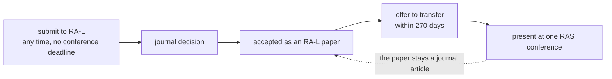
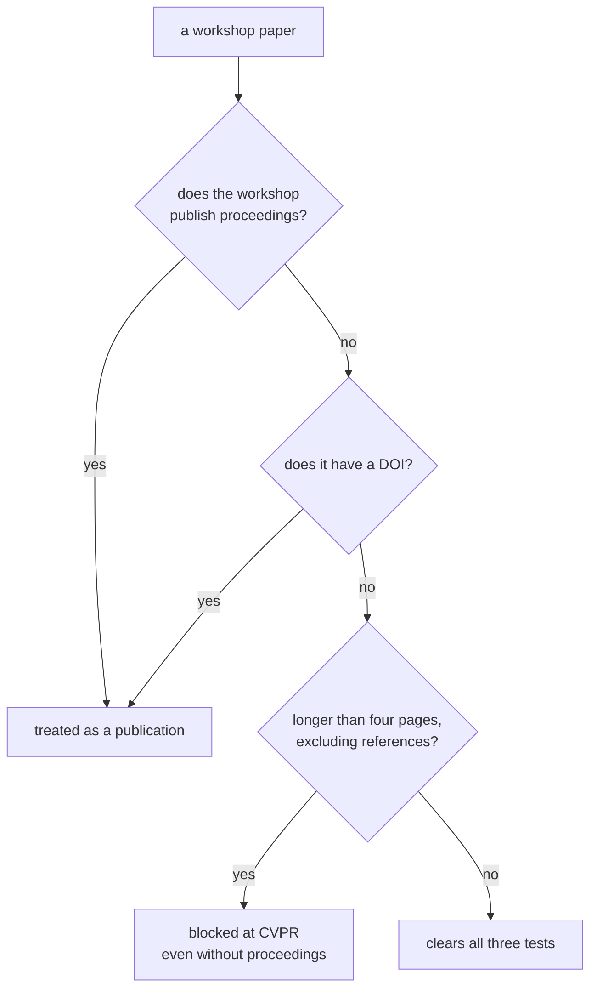
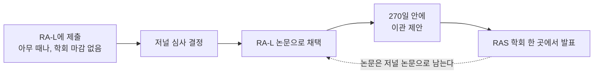
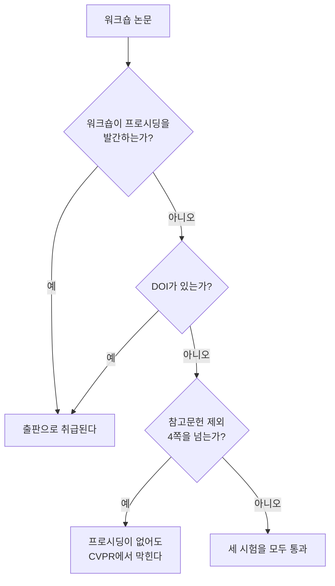

> [!abstract] Depth target · 깊이 목표
> **Working** — enough to pick a venue, predict the review process, and not lock yourself
> out of a journal version by accident.
> **Working** — venue를 고르고, 심사 과정을 예측하고, 실수로 저널 판본의 길을 막지 않을 만큼.

> [!warning] This page goes stale · 이 페이지는 낡는다
> Venue policies change, and outdated venue advice is worse than none because it sounds
> authoritative. Everything here was checked against official sources on **2026-08-21**, and
> every claim names the kind of source it came from. Before acting on any of it, re-read the
> venue's own current call for papers — and note that at least two rules below changed
> within the last three years.
> Venue 정책은 바뀌고, 낡은 venue 조언은 없느니만 못하다. 권위 있게 들리기 때문이다. 여기
> 있는 것은 전부 **2026-08-21**에 공식 출처로 확인했고, 모든 주장이 그 출처의 성격을 밝힌다.
> 무엇이든 행동에 옮기기 전에 그 venue의 현재 CFP를 직접 다시 읽어라 — 아래 규칙 중 최소
> 둘은 지난 3년 안에 바뀌었다.

## English

### 1. Conferences are not the second tier

Outside computing, "conference paper" means an abstract and a talk. Inside it, the flagship
conferences are where the field's primary results appear, and a promotion committee from
another discipline will misread that if nobody tells them.

The reference for saying so is the CRA's 1999 best-practice memo, *Evaluating Computer
Scientists and Engineers For Promotion and Tenure* (Patterson, Snyder and Ullman), which
states plainly that **"Conference publication is both rigorous and prestigious"** and that
conference venues are inferior to prestige journals "only in having significant page
limitations and little time to polish the paper." Its 2025 successor, *Unique Considerations
for Evaluating Computing Researchers*, restates it for the current era: rigorously
peer-reviewed conferences are **the primary publication venue** for computing research, and
publication there is "on par with or preferred to journals."

> [!important] State it accurately, not maximally
> Neither ACM nor IEEE calls conference proceedings *archival* — both reserve that word for
> journals, and IEEE's operations manual assigns the archival-record role to Transactions,
> Journals and Letters specifically. What the official sources support is that flagship
> conference papers are **rigorously peer-reviewed, prestigious, primary, and count as prior
> publication of record**. That is a strong claim and it is defensible; "conference papers
> are archival" is a slightly stronger claim and it is not.

There is also a respectable dissent worth knowing, so the page does not read as advocacy:
Moshe Vardi's 2009 *CACM* editorial *Conferences vs. Journals in Computing Research* argues
that program-committee reviewing "does not rise to the level of careful refereeing."

### 2. What each venue's review process will actually do

The differences that matter day to day are not prestige rankings — they are **whether you
get to reply**, and **when you can submit**.

| Venue | Anonymity | Rebuttal | Cadence |
|---|---|---|---|
| **ICRA** | double-anonymous **from the 2026 edition** (2025 was single-blind) | **none** for regular papers | annual deadline |
| **IROS** | double-anonymous **from the 2026 edition** (2025 was single-blind) | **none** for regular papers | annual deadline |
| **RSS** | double-blind | one page, **for a subset only** | annual deadline |
| **CoRL** | double-blind | one page, **non-interactive** | annual deadline, OpenReview |
| **T-RO** | double-anonymous **since January 2025** | revise & resubmit | rolling |
| **RA-L** | double-anonymous | author response + diff | **rolling, all year** |
| **IJRR** | **single-anonymized** — referees see your name | — | rolling |

**Two dates worth keeping straight.** IEEE RAS moved its *journals* to double-anonymous
review on 1 January 2025; the ICRA and IROS *conferences* followed one cycle later, with the
2026 editions. So a 2025 ICRA or IROS paper was reviewed single-blind, and anything you read
about "ICRA is single-blind" is describing the world up to that flip.

**And one exception to "no rebuttal".** ICRA and IROS now run a **transfer category** — a
paper rejected from ICRA 2026 may be submitted to IROS 2026 as an "ICRA-IROS transfer" with
an **author response file**, and the reverse path exists for IROS 2026 into ICRA 2027. That
is the only place in either conference where you get to answer reviewers. (The RAS transfer
that runs the other way is journal → conference: T-RO, RA-M, RA-L and T-RL papers can be
transferred into ICRA. There is no automated ICRA → journal path.)

Two things surprise people arriving from machine learning. **ICRA and IROS have no rebuttal
at all** — the reviews are the decision, and a reviewer who misread your paper cannot be
corrected. And **RSS and CoRL rebuttals are one page and non-interactive**, nothing like the
multi-round discussion threads of ICLR or NeurIPS. Budget your clarity for the submission,
because there is no second chance to explain.

IJRR's single-anonymized model is the other outlier: referees are told who you are.

**The domain venues, which this table has been missing.** Most of the construction papers in
[[01-canonical-papers/canonical-list|§8 of the canonical list]] are in venues no robotics
reader has calibration for, and a systems paper reads differently there:

| Venue | Publisher | Review | What acceptance signals |
|---|---|---|---|
| ***Automation in Construction*** | Elsevier | **single-anonymized**; editor screens, then ≥2 reviewers | the domain's flagship. Scope is the whole construction life cycle — design, build, operate, dismantle — so a robotics result is judged on **whether the construction problem is real**, not on method novelty |
| ***J. Computing in Civil Engineering*** (JCCE) | ASCE | single-anonymized | computing/AI/BIM/sensing across civil subdomains; a US civil-engineering readership rather than a robotics one |
| ***Computer-Aided Civil and Infrastructure Engineering*** (CACAIE) | **moved from Wiley to Elsevier in January 2026** — and the ISSN changes with it (Wiley 1467-8667 / Elsevier 1093-9687) | **double**-anonymized | computational-method novelty, framed as a bridge from computing to civil engineering |
| **ISARC** (IAARC) | IAARC, **free to read**; publication is gated by paid registration, not an APC | peer-refereed (≥2 reviewers) with a per-paper DOI and Scopus indexing — but ~76% acceptance, so refereed ≠ selective | the field's annual symposium — where to find what is being tried before it reaches a journal |
| ***Science Robotics*** | AAAS | a hard editorial triage rejects most submissions in 1–2 weeks; survivors go to ≥2 external referees | a **general-science** audience: the claim must matter outside robotics. Two construction landmarks are here — [[01-canonical-papers/notes/8-construction/aes\|AES]] and the [[01-canonical-papers/notes/8-construction/dry-stone-wall\|dry-stone wall]]. Note that [[01-canonical-papers/notes/8-construction/heap\|HEAP]] itself is *Automation in Construction*, two rows up |

Three consequences for reading. **Most of the civil-engineering side is single-anonymized, so
referees see the authors** — the same caveat IJRR carries above. CACAIE is the exception in
this table, and the exception matters operationally: submit it de-anonymised and you risk a
desk reject.
**Novelty is judged against a different baseline**: a method that a robotics reviewer would
call incremental can be a genuine contribution in *Automation in Construction* if it is the
first time the problem has been posed on a real site, and the reverse is also true. And
**ISARC is where the negative results and the early systems are**, because a symposium paper
costs less to write than a journal one — it is under-cited by robotics readers precisely
because they do not know it is refereed and indexed.

> [!warning] Writing for two audiences at once
> A construction-robotics paper submitted to ICRA and one submitted to *Automation in
> Construction* are not the same paper with a different template. ICRA wants the method
> contribution isolated and compared against robotics baselines; AutCon wants the construction
> process, the site constraints, and what changes for the trade. **Papers 1, 3 and 5 of
> [[07-research-program/paper-arc|the arc]] are routed to construction journals precisely
> because their contribution is the problem framing** — and that framing is what an ICRA
> reviewer will discount.

### 3. Acceptance rates — and which venues do not publish them

Read this table for the *pattern*, not the numbers, and check the current year before
quoting anything.

| Venue | Official figure? | Most recent official statement |
|---|---|---|
| **NeurIPS** | yes, from the program chairs | 2025: 21,575 valid submissions, 5,290 accepted, **24.52%** |
| **CVPR** | yes | 2026: 16,092 submissions. CVF says 4,089 presented and "about one-quarter"; the @CVPR account says 4,090 recommended and 25.42%. Two official sources, one paper apart — quote one |
| **IROS** | yes | 2025: 4,306 conference papers submitted, 1,991 accepted, **46%** |
| **ICRA** | **counts only, no rate** | 2025: 4,250 submissions, 1,606 accepted, 503 journal transfers |
| **RSS** | **no official figure published** | — |
| **CoRL** | **no official figure published** | — |

Two habits follow. First, **ICRA states counts but no percentage**, so any ICRA rate you see
is somebody's arithmetic — say so if you use it. Second, **RSS and CoRL publish nothing**,
so every RSS or CoRL selectivity figure in circulation is third-party. Writing "no official
figure is published" is more accurate than repeating one, and in a research-statement
context it is also more credible.

### 4. The RA-L route, which changed

This is the item most likely to be wrong in advice a student has already absorbed.

**The old way, until the 2023 cycle**: submit to RA-L *with the ICRA or IROS option*, on a
conference-specific deadline, and get a joint journal-plus-conference outcome. ICRA 2022 was
the last edition with that track. IEEE RAS's own page for conference organisers now carries
a disclaimer that the old information "is outdated".

**The current way**: RA-L is a plain rolling journal. You submit whenever, acceptance is a
**journal** decision only, and on acceptance you are offered a transfer to present the paper
at a RAS conference within a **270-day** window. The paper is *not* in the conference
proceedings — it stays an RA-L journal article, and it may be presented at only one
conference.

One eligibility rule catches people: only **non-evolutionary** published papers are
eligible. A journal paper that was itself an extension of an earlier conference paper
cannot be taken back to a conference.

### 5. Extending a conference paper into a journal paper

> [!warning] The "30% new material" rule does not exist
> There is **no official numeric threshold** in IEEE, IEEE RAS, or IJRR policy. IEEE's
> operations manual requires "substantial additional technical material" and then explicitly
> **delegates any quantitative threshold to the individual journal**, requiring that the
> journal publish it in its own author instructions. So the honest procedure is: read your
> target journal's author instructions; if it states no number, there is no number.
> ACM does publish a soft figure — generally at least 25% not previously published — but
> that is ACM's rule, not robotics'.
> **"신규 자료 30%" 규칙은 존재하지 않는다.** IEEE·IEEE RAS·IJRR 정책 어디에도 공식 수치
> 기준이 없다. IEEE 운영 매뉴얼은 "실질적인 추가 기술 자료"를 요구한 뒤 **정량 기준을 개별
> 저널에 명시적으로 위임**하고, 그 저널의 저자 안내에 게시할 것을 요구한다. ACM은 통상 25%
> 이상이라는 완만한 수치를 두지만 그것은 ACM의 규칙이지 로보틱스의 규칙이 아니다.

What the robotics journals *do* say is sharper than a percentage, and it is the same point
twice:

- **T-RO** states that a submission "must not be just a mere extension" filling in proofs,
  corollaries, **additional experiments**, or more background — it "must contain new results
  of substantive research significance and impact beyond the previous papers."
- **IJRR** states that "the mere inclusion of more details, experiments, or discussion is
  typically considered not substantial," and requires an ≤80-word novelty statement plus
  upload of the conference PDF.

**More experiments is not an extension.** Both journals name that specific move as
insufficient, which is worth knowing before spending a month on it.

Two structural rules on top:

- **T-RO's "evolved paper" category was retired in January 2025**, because the journal moved
  to double-anonymous review. You now cite your earlier work in the third person rather than
  writing "in our previous work".
- **RA-L → T-RO is not permitted.** RAS states the evolutionary paradigm does not apply
  between them because both are archival journal publications. Conference → T-RO is the
  natural path; conference → RA-L is discouraged, because a Letter is about the length of a
  conference paper to begin with.

### 6. Workshops — where a paper can silently block a later one

There are **three regimes**, and the two-way "archival versus non-archival" framing misses
the one that bites.

- **NeurIPS** states plainly that all its workshop papers are non-archival and do not appear
  in proceedings, and its main call permits previously workshopped papers so long as they
  did not appear in proceedings, a journal, or a book.
- **ICRA** applies a **DOI test**: a workshop paper without formal peer-reviewed proceedings
  may be submitted, but "if your workshop paper has a DOI, this would be considered as an
  archival publication equivalent to a conference paper. Such papers cannot be submitted."
- **CVPR** applies a **length test that ignores what the workshop calls itself**: a
  peer-reviewed written work longer than four pages excluding references counts as a
  publication, and the guideline says outright that this "does not depend upon whether such
  an accepted written work appears in a formal proceedings or whether the organizers declare
  that such work 'counts as a publication'."

The move that clears all three: a **four-page-or-shorter extended abstract, at a workshop
with no proceedings and no DOI**. That preserves every downstream option.

> [!note] What could not be confirmed
> IROS has **no** official statement on workshop archival status of its own — it requires
> organisers to comply with the IEEE RAS workshop guidelines, which say RAS workshop papers
> "cannot be published as peer reviewed papers", but IROS's own pages are silent. RSS
> likewise never declares its own workshops non-archival, though its call for papers permits
> submissions previously presented at workshops without published proceedings. Treat both as
> unconfirmed and ask the organisers.

### 7. Where this program's papers go

Mapping [[07-research-program/paper-arc|the arc]] onto venues, with the reasoning rather
than a ranking:

| Arc paper | Natural venues | Why |
|---|---|---|
| 1 — human-aware | ICRA, IROS, or a construction journal | HRI results with human studies read well in *Automation in Construction* too |
| 2 — navigation / mobile manipulation | ICRA, IROS, RA-L | systems-integration results; RA-L's rolling deadline suits an incremental result |
| 3 — core construction manipulation | ICRA, RSS, or *Automation in Construction* | the domain journal reaches the people who would deploy it |
| 4 — contact-rich and learned | CoRL, RSS, RA-L | robot-learning audience |
| 5 — integrated system | T-RO, IJRR, or *Automation in Construction* | integration results need length, and journals give it |

The dual audience is a real asset and worth using deliberately: a robotics venue judges the
method, a construction venue judges whether it would survive a site. A result that passes
both is the kind [[07-research-program/index|the program]] is built to produce.

### After reading

- [ ] State what official sources do and do not support about conference-paper status.
- [ ] Name the two venues with no rebuttal, and what that means for how you write.
- [ ] Say which venues publish no official acceptance rate.
- [ ] Describe the current RA-L route and what changed.
- [ ] Give the three workshop tests and the submission shape that clears all of them.

### Self-check

1. A colleague says "submit to RA-L with the ICRA option". What do you tell them?
2. You have an ICRA paper and a month free. Is adding two more experiments enough for a
   T-RO extension?
3. You want to cite CoRL's selectivity in a research statement. What can you write?
4. You presented a six-page peer-reviewed paper at a workshop with no proceedings and no
   DOI. Can you submit that work to ICRA? To CVPR?
5. Your reviewer at ICRA misunderstood the method. What is your recourse?

> [!tip]- Answers
> 1. That the option was discontinued in the 2023 cycle — ICRA 2022 was the last edition with it, and IEEE RAS's own organiser page now marks the old information outdated. RA-L is now a plain rolling journal; if accepted you get a 270-day window to transfer the paper for *presentation* at one RAS conference, and the paper stays a journal article rather than entering the proceedings.
> 2. No, and both journals say so explicitly. T-RO names "additional experiments" as among the things that do *not* make an extension substantial, and IJRR says the mere inclusion of more details, experiments or discussion is typically not substantial. The requirement is new results of substantive research significance — a different contribution, not a longer version of the same one.
> 3. That CoRL publishes no official acceptance rate. Any percentage in circulation is third-party, and stating the absence is both more accurate and more credible than repeating an unofficial number. If you need a selectivity signal, use a venue that publishes one — NeurIPS and IROS do, and CVPR states counts plus an approximate share.
> 4. **ICRA: yes** — no formal proceedings and no DOI clears the DOI test. **CVPR: no** — CVPR counts any peer-reviewed written work longer than four pages excluding references as a publication, explicitly regardless of proceedings or of what the organisers call it. Six pages fails that test even though the same paper is fine for ICRA. This is exactly why the safe shape is a four-page extended abstract.
> 5. None, in the review round — ICRA has no rebuttal, so the reviews are the decision. The recourse is preventive: write for a reviewer who will not ask you a question, and if rejected, use the ICRA-to-IROS transfer path, which is the one category where an author response file exists.

### Sources

All of the following were checked on **2026-08-21** against the venue's or society's own
pages. Where a claim rests on absence — "no official figure is published" — that means the
venue's calls for papers, statistics pages and chairs' reports were checked and contained none.

- IEEE RAS, [RA-L information page](https://www.ieee-ras.org/publications/ra-l/) — the current presentation-transfer policy and its 270-day window; and the [organiser page](https://www.ieee-ras.org/publications/ra-l/information-for-ra-l-option-conference-organizers/) whose own disclaimer dates the old conference option as outdated.
- IEEE RAS, [T-RO information for authors](https://www.ieee-ras.org/publications/t-ro/t-ro-information-for-authors/) — double-anonymous since January 2025, the retirement of the evolved-paper category, and what does not count as an extension.
- IEEE PSPB Operations Manual §8.1.7.F — "substantial additional technical material", with any quantitative threshold delegated to the individual periodical.
- SAGE, [IJRR submission guidelines](https://journals.sagepub.com/author-instructions/IJR) — single-anonymized review, the novelty statement, and the "more experiments is not substantial" wording.
- Venue calls for papers: [ICRA 2026](https://2026.ieee-icra.org/contribute/call-for-icra-2026-papers-now-accepting-submissions/) (the DOI test), [IROS 2026](https://2026.ieee-iros.org/contribute/call-for-papers/), [RSS](https://roboticsconference.org/information/cfp/), [CoRL author instructions](https://www.corl.org/contributions/instruction-for-authors) (the clearest definition of an archival venue), [CVPR 2026 author guidelines](https://cvpr.thecvf.com/Conferences/2026/AuthorGuidelines) (the four-page test), [NeurIPS workshop guidance](https://neurips.cc/Conferences/2026/WorkshopsGuidance).
- Acceptance figures: [NeurIPS 2025 program-chair reflections](https://blog.neurips.cc/2025/09/30/reflections-on-the-2025-review-process-from-the-program-committee-chairs/); [CVPR 2026 technical program announcement](https://cvpr.thecvf.com/Conferences/2026/News/Technical_Program); IROS 2025 official conference digest; [ICRA 2025 highlight statistics](https://2025.ieee-icra.org/announcements/icra-2025-highlight-statistics/).
- D. Patterson, L. Snyder, J. Ullman, [*Evaluating Computer Scientists and Engineers For Promotion and Tenure*](https://cra.org/resources/best-practice-memos/evaluating-computer-scientists-and-engineers-for-promotion-and-tenure/), CRA Best Practice Memo, August 1999; and *Unique Considerations for Evaluating Computing Researchers*, CRA, July 2025.
- M. Y. Vardi, "Conferences vs. Journals in Computing Research," *CACM*, vol. 52, no. 5, p. 5, 2009 — the dissent.

**Within this wiki**

- [[06-research-practice/scientific-writing-peer-review|Scientific Writing & Peer Review]] — writing for the review process this page describes
- [[07-research-program/paper-arc|7.1 Paper Arc]] — the papers being placed
- [[08-research-radar/index|Research Radar]] — which now indexes IROS, RSS, RA-L and T-RO

## 한국어

### 1. 학회는 2군이 아니다

컴퓨팅 밖에서 "학회 논문"은 초록과 발표를 뜻한다. 안에서는 대표 학회들이 그 분야의 1차
결과가 나오는 곳이고, 다른 분과의 심사위원회는 아무도 말해 주지 않으면 그것을 오독한다.

그렇게 말할 때의 근거는 CRA의 1999년 best-practice 메모 *Evaluating Computer Scientists and
Engineers For Promotion and Tenure*(Patterson, Snyder, Ullman)다. **"학회 출판은 엄격하고
권위 있다"** 고 분명히 말하며, 학회가 명망 있는 저널에 뒤지는 것은 "상당한 분량 제한과 논문을
다듬을 시간이 적다는 점뿐"이라고 한다. 2025년 후속 문서 *Unique Considerations for Evaluating
Computing Researchers*가 현재의 언어로 다시 말한다: 엄격하게 심사되는 학회가 컴퓨팅 연구의
**1차 출판 venue**이며, 거기서의 출판이 "저널과 대등하거나 선호된다".

> [!important] 최대치가 아니라 정확하게 말하라
> ACM도 IEEE도 학회 프로시딩을 *archival*이라 부르지 않는다 — 둘 다 그 단어를 저널에 남겨
> 두고, IEEE 운영 매뉴얼은 archival 기록의 역할을 Transactions·Journals·Letters에 특정해
> 배정한다. 공식 출처가 뒷받침하는 것은 대표 학회 논문이 **엄격하게 심사되고, 권위 있고,
> 1차적이며, 선행 출판으로 인정된다**는 것이다. 강한 주장이고 방어 가능하다. "학회 논문은
> archival이다"는 그보다 조금 더 강한 주장이고, 방어되지 않는다.

이 페이지가 옹호문처럼 읽히지 않도록, 알아 둘 만한 반대 의견도 있다: Moshe Vardi의 2009년
*CACM* 사설 *Conferences vs. Journals in Computing Research*는 프로그램 위원회 심사가
"꼼꼼한 refereeing의 수준에 이르지 못한다"고 주장한다.

### 2. 각 venue의 심사 과정이 실제로 하는 일

매일 중요한 차이는 명성 순위가 아니라 **답변할 기회가 있는가**와 **언제 낼 수 있는가**다.

| Venue | 익명성 | 반박문 | 주기 |
|---|---|---|---|
| **ICRA** | **2026년판부터** 양측 익명(2025는 단측) | 일반 논문은 **없음** | 연 1회 마감 |
| **IROS** | **2026년판부터** 양측 익명(2025는 단측) | 일반 논문은 **없음** | 연 1회 마감 |
| **RSS** | 이중 블라인드 | 1쪽, **일부 논문만** | 연 1회 마감 |
| **CoRL** | 이중 블라인드 | 1쪽, **비대화형** | 연 1회 마감, OpenReview |
| **T-RO** | **2025년 1월부터** 양측 익명 | revise & resubmit | 상시 |
| **RA-L** | 양측 익명 | 저자 응답 + diff | **상시, 연중** |
| **IJRR** | **단측 익명** — 심사자가 저자 이름을 본다 | — | 상시 |

**헷갈리지 말아야 할 날짜 둘.** IEEE RAS는 2025년 1월 1일 *저널*을 양측 익명으로 바꿨고,
ICRA와 IROS *학회*는 한 주기 늦은 2026년판부터 따라갔다. 그러니 2025년 ICRA·IROS 논문은
단측 심사를 받은 것이고, "ICRA는 단측이다"라는 서술은 그 전환 이전의 세계를 기술한 것이다.

**그리고 "반박문 없음"의 예외 하나.** ICRA와 IROS는 이제 **이관 카테고리**를 둔다 — ICRA
2026에서 떨어진 논문은 "ICRA-IROS transfer"로 IROS 2026에 낼 수 있고 **저자 응답 파일**을
첨부한다. 반대 경로(IROS 2026 → ICRA 2027)도 있다. 두 학회에서 심사자에게 답할 수 있는
자리는 그곳뿐이다. (반대 방향의 RAS 이관은 저널 → 학회다: T-RO·RA-M·RA-L·T-RL 논문을 ICRA로
이관할 수 있다. ICRA에서 저널로 가는 자동 경로는 없다.)

기계학습에서 오는 사람을 놀라게 하는 것이 둘 있다. **ICRA와 IROS에는 반박문이 아예 없다** —
리뷰가 곧 결정이고, 논문을 오독한 심사자를 교정할 수 없다. 그리고 **RSS와 CoRL의 반박문은
1쪽이고 비대화형**이며, ICLR이나 NeurIPS의 여러 라운드 토론 스레드와는 전혀 다르다. 설명할
두 번째 기회가 없으므로, 명료함의 예산을 제출본에 쓰라.

IJRR의 단측 익명이 또 다른 예외다: 심사자가 당신이 누구인지 안다.

**그동안 이 표에 빠져 있던 도메인 게재지들.** [[01-canonical-papers/canonical-list|핵심 논문 리스트 §8]]의
건설 논문 대부분은 로보틱스 독자에게 감각이 없는 게재지에 있고, 시스템 논문은
그곳에서 다르게 읽힌다:

| 게재지 | 출판사 | 심사 | 게재가 뜻하는 것 |
|---|---|---|---|
| ***Automation in Construction*** | Elsevier | **단측 익명**. 편집자 선별 후 심사자 2인 이상 | 이 분야의 대표 저널. 범위가 설계·시공·운영·해체의 건설 생애주기 전체이므로, 로보틱스 결과는 방법의 새로움이 아니라 **건설 문제가 진짜인가**로 판정된다 |
| ***J. Computing in Civil Engineering***(JCCE) | ASCE | 단측 익명 | 토목 하위 분야 전반의 컴퓨팅·AI·BIM·센싱. 로보틱스가 아니라 미국 토목 독자층 |
| ***Computer-Aided Civil and Infrastructure Engineering***(CACAIE) | **2026년 1월 Wiley에서 Elsevier로 이관** — ISSN도 함께 바뀐다(Wiley 1467-8667 / Elsevier 1093-9687) | **양측** 익명 | 컴퓨팅에서 토목으로 잇는 다리로서의 계산 방법론적 새로움 |
| **ISARC**(IAARC) | IAARC, **읽기는 무료**. 게재는 APC가 아니라 유료 등록비로 게이트된다 | 동료 심사(심사자 2인 이상), 논문별 DOI, Scopus 색인 — 다만 게재율 약 76%이므로 심사받았다는 것이 선별적이라는 뜻은 아니다 | 이 분야의 연례 심포지엄 — 저널에 닿기 전에 무엇이 시도되고 있는지를 찾을 곳 |
| ***Science Robotics*** | AAAS | 강한 편집자 트리아지가 1~2주 안에 대부분을 걸러내고, 통과한 것은 외부 심사자 2인 이상에게 간다 | **일반 과학** 독자 — 주장이 로보틱스 바깥에서도 중요해야 한다. 건설 쪽 이정표 둘이 여기 있다 — [[01-canonical-papers/notes/8-construction/aes\|AES]]와 [[01-canonical-papers/notes/8-construction/dry-stone-wall\|돌담]]. [[01-canonical-papers/notes/8-construction/heap\|HEAP]] 자체는 두 행 위의 *Automation in Construction*이다 |

읽기에 미치는 결과가 셋이다. **토목 쪽 대부분이 단측 익명이라 심사자가 저자를 본다** — 위에서
IJRR에 붙인 것과 같은 단서다. 이 표에서 CACAIE가 예외이고, 그 예외는 실무적으로 중요하다:
익명화하지 않고 내면 데스크 리젝을 각오해야 한다. **새로움이 다른 기준선에 대고 판정된다**:
로보틱스 심사자가 점진적이라 부를 방법이, 그 문제가 실제 현장에서 처음 제기된 것이라면
*Automation in Construction*에서는 진짜 기여일 수 있고, 그 역도 참이다. 그리고 **부정적 결과와
이른 시스템은 ISARC에 있다.** 심포지엄 논문이 저널 논문보다 쓰는 비용이 싸기 때문이다 —
로보틱스 독자가 이것을 과소 인용하는 이유는 정확히 그것이 심사받고 색인된다는 사실을 모르기
때문이다.

> [!warning] 두 독자를 동시에 쓰는 일
> ICRA에 내는 건설로봇 논문과 *Automation in Construction*에 내는 논문은 템플릿만 다른 같은
> 논문이 아니다. ICRA는 방법 기여를 분리해서 로보틱스 베이스라인과 비교하기를 원하고, AutCon은
> 건설 공정과 현장 제약, 그리고 그 직종에 무엇이 바뀌는지를 원한다. **[[07-research-program/paper-arc|논문 아크]]의 1·3·5번이 건설 저널로 배정된 이유가 바로 그 기여가 문제 설정이기 때문이고** — 그
> 설정이 바로 ICRA 심사자가 깎을 부분이다.

### 3. 채택률 — 그리고 그것을 발표하지 않는 venue들

이 표는 숫자가 아니라 *패턴*을 보라. 무엇이든 인용하기 전에 해당 연도를 확인하라.

| Venue | 공식 수치? | 가장 최근의 공식 진술 |
|---|---|---|
| **NeurIPS** | 있음, 프로그램 의장 발표 | 2025: 유효 제출 21,575, 채택 5,290, **24.52%** |
| **CVPR** | 있음 | 2026: 제출 16,092. CVF는 발표 4,089편에 "약 4분의 1", @CVPR 계정은 채택 권고 4,090편에 25.42% — 공식 출처 둘이 한 편 차이다. 하나만 인용하라 |
| **IROS** | 있음 | 2025: 학회 논문 제출 4,306, 채택 1,991, **46%** |
| **ICRA** | **건수만, 비율 없음** | 2025: 제출 4,250, 채택 1,606, 저널 이관 503 |
| **RSS** | **공식 수치 없음** | — |
| **CoRL** | **공식 수치 없음** | — |

두 가지 습관이 따라 나온다. 첫째, **ICRA는 건수를 말하고 백분율은 말하지 않으므로** 눈에 띄는
ICRA 비율은 누군가의 산수다. 쓴다면 그렇다고 밝혀라. 둘째, **RSS와 CoRL은 아무것도 발표하지
않으므로** 떠도는 모든 RSS·CoRL 선택성 수치가 제3자의 것이다. "공식 수치는 발표되지 않았다"고
쓰는 편이 하나를 되풀이하는 것보다 정확하고, 연구 계획서 맥락에서는 더 믿음직하기도 하다.

### 4. 바뀐 RA-L 경로

학생이 이미 흡수한 조언에서 가장 틀려 있기 쉬운 항목이다.

**2023년 주기까지의 옛 방식**: 학회별 마감에 맞춰 *ICRA 또는 IROS 옵션과 함께* RA-L에 제출해
저널 + 학회 결과를 함께 받았다. ICRA 2022가 그 트랙이 있던 마지막 회차다. IEEE RAS의 학회
조직자용 페이지가 이제 옛 정보가 "낡았다"는 고지를 달고 있다.

**현재 방식**: RA-L은 평범한 상시 저널이다. 아무 때나 제출하고, 채택은 **저널** 결정일 뿐이며,
채택되면 **270일** 창 안에 RAS 학회에서 논문을 발표하도록 이관하는 제안을 받는다. 논문은 학회
프로시딩에 *들어가지 않는다* — RA-L 저널 논문으로 남고, 학회 한 곳에서만 발표할 수 있다.

사람들이 걸리는 자격 규칙 하나: **비진화적(non-evolutionary)** 으로 출판된 논문만 자격이 있다.
그 자체가 앞선 학회 논문의 확장이었던 저널 논문은 다시 학회로 가져갈 수 없다.

### 5. 학회 논문을 저널 논문으로 확장하기

> [!warning] "신규 자료 30%" 규칙은 존재하지 않는다
> IEEE·IEEE RAS·IJRR 정책 어디에도 **공식 수치 기준이 없다.** IEEE 운영 매뉴얼은 "실질적인
> 추가 기술 자료"를 요구한 뒤 **정량 기준을 개별 저널에 명시적으로 위임**하며, 그 저널의 저자
> 안내에 게시할 것을 요구한다. 그러니 정직한 절차는 이것이다: 목표 저널의 저자 안내를 읽어라.
> 거기에 숫자가 없으면 숫자는 없는 것이다. ACM은 통상 25% 이상이라는 완만한 수치를 두지만
> 그것은 ACM의 규칙이지 로보틱스의 규칙이 아니다.
> There is **no official numeric threshold** in IEEE, RAS, or IJRR policy; IEEE delegates it
> to each journal's own author instructions.

로보틱스 저널들이 *실제로* 말하는 것은 백분율보다 날카롭고, 같은 지적을 두 번 한다:

- **T-RO**는 제출본이 증명이나 따름정리, **추가 실험**, 더 자세한 배경을 채워 넣는 "단순한
  확장이어서는 안 되며", "앞선 논문들을 넘어서는 실질적 연구 의의와 영향을 가진 새 결과를
  담아야 한다"고 말한다.
- **IJRR**는 "세부, 실험, 논의를 더 넣는 것만으로는 통상 실질적이라고 보지 않는다"고 말하며,
  80단어 이하의 novelty statement와 학회 PDF 업로드를 요구한다.

**실험을 더 하는 것은 확장이 아니다.** 두 저널 모두 그 특정한 수를 불충분하다고 지목하며,
거기에 한 달을 쓰기 전에 알아 둘 가치가 있다.

그 위의 구조적 규칙 둘:

- **T-RO의 "evolved paper" 범주는 2025년 1월에 폐지되었다.** 저널이 양측 익명 심사로
  옮겨 갔기 때문이다. 이제 "우리의 이전 연구에서"라고 쓰는 대신 자기 앞선 연구를 3인칭으로
  인용한다.
- **RA-L → T-RO는 허용되지 않는다.** 둘 다 archival 저널 출판이므로 진화적 패러다임이 그
  사이에는 적용되지 않는다고 RAS가 밝힌다. 학회 → T-RO가 자연스러운 경로이고, 학회 → RA-L은
  권장되지 않는다. Letter 자체가 애초에 학회 논문 정도의 분량이기 때문이다.

### 6. 워크숍 — 논문이 다음 논문을 조용히 막을 수 있는 곳

**세 가지 체계**가 있고, "archival 대 non-archival"이라는 이분법은 정작 무는 쪽을 놓친다.

- **NeurIPS**는 자기 워크숍 논문이 전부 non-archival이며 프로시딩에 실리지 않는다고 분명히
  밝히고, 본 트랙은 프로시딩·저널·책에 실리지 않은 한 워크숍에 냈던 논문의 제출을 허용한다.
- **ICRA**는 **DOI 시험**을 적용한다: 공식 심사 프로시딩이 없는 워크숍 논문은 제출할 수 있지만,
  "워크숍 논문에 DOI가 있다면 학회 논문과 동등한 archival 출판으로 간주되며, 그런 논문은
  제출할 수 없다".
- **CVPR**는 **워크숍이 스스로를 뭐라 부르든 무시하는 분량 시험**을 적용한다: 참고문헌을 제외한
  4쪽을 넘는 심사된 저작은 출판으로 세며, 지침이 이것이 "정식 프로시딩에 실리는지, 또는
  조직자가 그 저작을 '출판으로 센다'고 선언하는지에 의존하지 않는다"고 명시한다.

세 시험을 모두 통과하는 수: **참고문헌 제외 4쪽 이하의 확장 초록을, 프로시딩도 DOI도 없는
워크숍에** 내는 것. 이후의 모든 선택지가 보존된다.

> [!note] 확인하지 못한 것
> IROS에는 워크숍 archival 여부에 대한 **자체** 공식 진술이 없다 — 조직자에게 IEEE RAS 워크숍
> 지침 준수를 요구하고 그 지침은 RAS 워크숍 논문이 "심사 논문으로 출판될 수 없다"고 말하지만,
> IROS 자신의 페이지들은 침묵한다. RSS도 자기 워크숍을 non-archival이라고 선언한 적이 없다.
> 다만 CFP가 프로시딩 없는 워크숍에서 발표한 논문의 제출은 허용한다. 둘 다 미확인으로 두고
> 조직자에게 물어라.

### 7. 이 프로그램의 논문들이 갈 곳

[[07-research-program/paper-arc|arc]]를 venue에 대응시키되, 순위가 아니라 이유와 함께:

| arc 논문 | 자연스러운 venue | 이유 |
|---|---|---|
| 1 — 작업자 인지 | ICRA, IROS, 또는 건설 저널 | 인간 대상 연구가 담긴 HRI 결과는 *Automation in Construction*에서도 잘 읽힌다 |
| 2 — 내비게이션 / 모바일 조작 | ICRA, IROS, RA-L | 시스템 통합 결과. 점진적 결과에는 RA-L의 상시 마감이 맞는다 |
| 3 — 핵심 건설 조작 | ICRA, RSS, 또는 *Automation in Construction* | 도메인 저널이 그것을 실제로 배치할 사람들에게 닿는다 |
| 4 — 접촉이 많은 학습 기반 | CoRL, RSS, RA-L | 로봇 학습 독자 |
| 5 — 통합 시스템 | T-RO, IJRR, 또는 *Automation in Construction* | 통합 결과에는 분량이 필요하고, 저널이 그것을 준다 |

이중 독자는 진짜 자산이고 의도적으로 쓸 가치가 있다: 로보틱스 venue는 방법을 심사하고, 건설
venue는 그것이 현장에서 살아남을지를 심사한다. 둘 다 통과하는 결과가
[[07-research-program/index|프로그램]]이 만들어내려는 종류의 결과다.

### 읽고 나면 말할 수 있어야 하는 것

- [ ] 학회 논문의 지위에 대해 공식 출처가 뒷받침하는 것과 하지 않는 것을 말한다.
- [ ] 반박문이 없는 venue 둘을 대고, 그것이 글쓰기에 무엇을 뜻하는지 말한다.
- [ ] 공식 채택률을 발표하지 않는 venue를 말한다.
- [ ] 현재의 RA-L 경로와 무엇이 바뀌었는지 설명한다.
- [ ] 워크숍 세 시험과, 그것을 모두 통과하는 제출 형태를 댄다.

### 스스로 점검

1. 동료가 "RA-L에 ICRA 옵션으로 내라"고 한다. 뭐라고 말하겠는가?
2. ICRA 논문이 있고 한 달이 비었다. 실험 둘을 더하면 T-RO 확장으로 충분한가?
3. 연구 계획서에 CoRL의 선택성을 인용하고 싶다. 무엇을 쓸 수 있는가?
4. 프로시딩도 DOI도 없는 워크숍에서 6쪽짜리 심사 논문을 발표했다. 그 연구를 ICRA에 낼 수
   있는가? CVPR에는?
5. ICRA 심사자가 방법을 오해했다. 구제 수단은?

> [!tip]- 정답 · Answers
> 1. 그 옵션은 2023년 주기에 폐지되었다 — ICRA 2022가 그것이 있던 마지막 회차이고, IEEE RAS의 조직자 페이지가 이제 옛 정보를 낡았다고 표시한다. RA-L은 이제 평범한 상시 저널이며, 채택되면 270일 창 안에 RAS 학회 한 곳에서의 *발표*를 위해 이관할 수 있고, 논문은 프로시딩에 들어가는 대신 저널 논문으로 남는다.
> 2. 아니다. 두 저널이 명시적으로 그렇게 말한다. T-RO는 "추가 실험"을 확장을 실질적으로 만들지 *않는* 것들 중 하나로 지목하고, IJRR는 세부·실험·논의를 더 넣는 것만으로는 통상 실질적이지 않다고 말한다. 요구되는 것은 실질적 연구 의의를 가진 새 결과다 — 같은 것의 긴 판본이 아니라 다른 기여.
> 3. CoRL은 공식 채택률을 발표하지 않는다고 쓸 수 있다. 떠도는 어떤 백분율도 제3자의 것이며, 부재를 진술하는 편이 비공식 수치를 되풀이하는 것보다 정확하고 믿음직하다. 선택성 신호가 필요하다면 발표하는 venue를 쓰라 — NeurIPS와 IROS가 발표하고, CVPR은 건수와 대략적 비중을 밝힌다.
> 4. **ICRA: 낼 수 있다** — 정식 프로시딩이 없고 DOI도 없으므로 DOI 시험을 통과한다. **CVPR: 낼 수 없다** — CVPR은 참고문헌 제외 4쪽을 넘는 심사된 저작을 출판으로 세며, 프로시딩 여부나 조직자의 선언과 무관하다고 명시한다. 같은 논문이 ICRA에는 괜찮은데 6쪽이라 그 시험에서 걸린다. 안전한 형태가 4쪽 확장 초록인 이유가 정확히 이것이다.
> 5. 심사 라운드 안에서는 없다 — ICRA에는 반박문이 없으므로 리뷰가 곧 결정이다. 구제는 예방적이다: 질문하지 않을 심사자를 상대로 쓰고, 떨어지면 저자 응답 파일이 존재하는 유일한 범주인 ICRA→IROS 이관 경로를 쓰라.

### 출처

아래는 전부 **2026-08-21**에 해당 venue나 학회의 자체 페이지로 확인했다. 부재에 근거한 주장 —
"공식 수치가 발표되지 않았다" — 은 그 venue의 CFP, 통계 페이지, 의장 보고를 확인했고 아무것도
없었다는 뜻이다.

- IEEE RAS, [RA-L 정보 페이지](https://www.ieee-ras.org/publications/ra-l/) — 현재의 발표 이관 정책과 270일 창. 그리고 옛 학회 옵션이 낡았음을 자체 고지로 밝히는 [조직자 페이지](https://www.ieee-ras.org/publications/ra-l/information-for-ra-l-option-conference-organizers/).
- IEEE RAS, [T-RO 저자 정보](https://www.ieee-ras.org/publications/t-ro/t-ro-information-for-authors/) — 2025년 1월부터의 양측 익명, evolved paper 범주 폐지, 그리고 무엇이 확장으로 인정되지 않는가.
- IEEE PSPB Operations Manual §8.1.7.F — "실질적인 추가 기술 자료", 정량 기준은 개별 정기간행물에 위임.
- SAGE, [IJRR 제출 지침](https://journals.sagepub.com/author-instructions/IJR) — 단측 익명 심사, novelty statement, "실험을 더 하는 것은 실질적이지 않다"는 문구.
- Venue CFP: [ICRA 2026](https://2026.ieee-icra.org/contribute/call-for-icra-2026-papers-now-accepting-submissions/)(DOI 시험), [IROS 2026](https://2026.ieee-iros.org/contribute/call-for-papers/), [RSS](https://roboticsconference.org/information/cfp/), [CoRL 저자 안내](https://www.corl.org/contributions/instruction-for-authors)(archival venue의 가장 명확한 정의), [CVPR 2026 저자 지침](https://cvpr.thecvf.com/Conferences/2026/AuthorGuidelines)(4쪽 시험), [NeurIPS 워크숍 안내](https://neurips.cc/Conferences/2026/WorkshopsGuidance).
- 채택 수치: [NeurIPS 2025 프로그램 의장 회고](https://blog.neurips.cc/2025/09/30/reflections-on-the-2025-review-process-from-the-program-committee-chairs/); [CVPR 2026 기술 프로그램 발표](https://cvpr.thecvf.com/Conferences/2026/News/Technical_Program); IROS 2025 공식 학회 다이제스트; [ICRA 2025 하이라이트 통계](https://2025.ieee-icra.org/announcements/icra-2025-highlight-statistics/).
- D. Patterson, L. Snyder, J. Ullman, [*Evaluating Computer Scientists and Engineers For Promotion and Tenure*](https://cra.org/resources/best-practice-memos/evaluating-computer-scientists-and-engineers-for-promotion-and-tenure/), CRA Best Practice Memo, 1999년 8월. 그리고 *Unique Considerations for Evaluating Computing Researchers*, CRA, 2025년 7월.
- M. Y. Vardi, "Conferences vs. Journals in Computing Research," *CACM*, vol. 52, no. 5, p. 5, 2009 — 반대 의견.

**이 위키 안에서**

- [[06-research-practice/scientific-writing-peer-review|과학 글쓰기와 peer review]] — 이 페이지가 묘사하는 심사 과정을 향해 쓰는 법
- [[07-research-program/paper-arc|7.1 논문 arc]] — 배치되는 논문들
- [[08-research-radar/index|Research Radar]] — 이제 IROS·RSS·RA-L·T-RO를 색인한다
