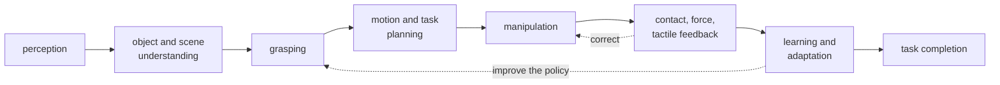
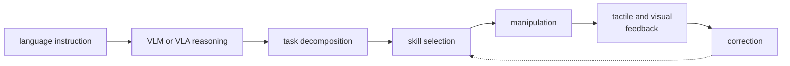

> [!abstract] Depth target · 깊이 목표
> **Working** — you should be able to state the research question, say which pillar a paper
> or idea serves, and reject a topic that does not serve it.
> **Working** — 연구 질문을 말할 수 있고, 어떤 논문이나 아이디어가 어느 기둥에 속하는지
> 판단할 수 있으며, 어느 기둥에도 기여하지 않는 주제를 거절할 수 있어야 한다.

> [!note] Before you start · 시작 전 점검
> Read [[00-study-depth-guide|0. Study Depth Guide]] first — this page assigns depth to
> topics, and that page defines what the depths mean. No technical prerequisite otherwise.
> [[00-study-depth-guide|0. Study Depth Guide]]를 먼저 읽어라 — 이 페이지는 주제에 깊이를
> 배정하고, 그 페이지가 깊이의 정의를 담고 있다. 그 외 기술적 선수 지식은 없다.

## English

Every other section of this wiki answers "what does this field know?" This section answers
a different question: **"what am I trying to contribute, and what does that make worth
studying?"**

It is a decision record. The claims here are choices, not findings — they can be wrong,
and they should be revised after the first baseline and the first failure analysis. Dated
decisions are more useful than undated intentions, so each revision goes in the
[[study-log|study log]].

### 1. The research identity

> **Construction Physical AI researcher specializing in robot manipulation, with
> navigation and human–robot interaction for real-world autonomous deployment.**

The load-bearing word is *specializing*. The weaker framing this replaces —
"civil engineer who uses AI" — makes the domain the identity and the technique a tool,
which invites the reader to evaluate the AI work against AI researchers and find it
shallow. The stronger framing inverts it:

| Layer | Role |
|---|---|
| Robotics / Physical AI | the **technical core** — what the contribution is made of |
| Construction & the built environment | the **differentiating domain** — where the problem comes from |

The domain is not decoration. Construction generates manipulation problems that factory
robotics has largely designed away: unstructured and changing geometry, irregular and
heavy parts, deformable materials, dust and occlusion, uncertain contact, human coworkers
in the workspace, high safety requirements, few fixtures, and task conditions that vary
between two instances of the same job. A contribution that survives those conditions is
hard to dismiss as incremental.

### 2. Three pillars, one hierarchy

The program has three areas, and they are **not** three equal programs:

| Pillar | Role in the program |
|---|---|
| **Manipulation** | the primary scientific and technical contribution |
| **Navigation** | reach the correct workspace and a manipulation-ready pose |
| **Human–robot interaction** | be safe and useful around construction workers |

The distinction matters because three independent specializations is three dissertations.
One dissertation is a single manipulation problem whose real-world success *requires*
navigation and HRI — they enter as necessary conditions, not as parallel novelty claims.

### 3. The dissertation question

> **How can autonomous construction robots safely navigate dynamic worksites, coordinate
> with human workers, and execute contact-rich manipulation tasks?**

A narrower framing that puts the technical contribution first, and is the one to prefer
when a paper's reviewers are roboticists:

> **Learning and control for contact-rich mobile manipulation in human-centered
> construction environments.**

Both questions have the same shape: one verb carries the contribution (*execute
contact-rich manipulation*), and the others name the conditions under which it has to hold.

### 4. Contribution balance

<svg viewBox="0 0 560 214" style="max-width:100%;height:auto" role="img" aria-label="a horizontal bar split into manipulation at about 55 percent, navigation at about 22, and human-robot interaction at about 23">
  <g font-size="11.5" fill="currentColor">
    <text x="30" y="26">Where the dissertation&#8217;s technical weight sits</text>
  </g>
  <g fill="currentColor">
    <rect x="30" y="42" width="275" height="46" rx="3" fill-opacity="0.30"/>
    <rect x="305" y="42" width="110" height="46" rx="3" fill-opacity="0.12"/>
    <rect x="415" y="42" width="115" height="46" rx="3" fill-opacity="0.12"/>
  </g>
  <g stroke="currentColor" stroke-width="1.1" fill="none" opacity="0.75">
    <rect x="30" y="42" width="275" height="46" rx="3"/><rect x="305" y="42" width="110" height="46" rx="3"/><rect x="415" y="42" width="115" height="46" rx="3"/>
  </g>
  <g font-size="12" fill="currentColor" text-anchor="middle">
    <text x="167" y="63">Manipulation</text><text x="167" y="79" font-size="11" opacity="0.85">50&#8211;60%</text>
    <text x="360" y="63">Navigation</text><text x="360" y="79" font-size="11" opacity="0.85">20&#8211;25%</text>
    <text x="472" y="63">HRI</text><text x="472" y="79" font-size="11" opacity="0.85">20&#8211;25%</text>
  </g>
  <g stroke="currentColor" stroke-width="1.4" fill="none" opacity="0.65">
    <path d="M 360 112 L 360 100 L 250 100 L 250 92" marker-end="url(#ar7)"/>
    <path d="M 472 130 L 472 108 L 220 108 L 220 92" marker-end="url(#ar7)"/>
  </g>
  <defs><marker id="ar7" viewBox="0 0 10 10" refX="8" refY="5" markerWidth="5" markerHeight="5" orient="auto"><path d="M 0 0 L 10 5 L 0 10 z" fill="currentColor"/></marker></defs>
  <g font-size="11" fill="currentColor" opacity="0.9">
    <text x="330" y="126">reaches the workspace</text>
    <text x="330" y="144">makes deployment around people possible</text>
    <text x="30" y="176">Both supporting pillars point inward: they are conditions the manipulation contribution has to</text>
    <text x="30" y="192">meet, not separate novelty claims. The percentages are a planning guide, not a requirement &#8212;</text>
    <text x="30" y="208">what matters is that manipulation stays recognizable as the main specialization.</text>
  </g>
</svg>

### 5. The manipulation-centered stack

The layer sequence a construction manipulation system runs through. Reading a paper in
this area is largely a matter of asking **which of these layers it claims to improve** and
which it borrows off the shelf.

At a higher level, the same stack driven by language — the form a construction VLA system
takes:

A worked instance: *"Install that panel on the frame."* The system resolves the
instruction, identifies panel and frame, decomposes the job, plans a grasp, moves the
component, detects contact, performs the fitting, and verifies completion. Every one of
those eight steps is a place where a real system fails, and therefore a place where a
paper can contribute.

### 6. Which wiki pages serve which pillar

This is what makes the wiki one program rather than a pile of notes.

| Pillar | Foundations | Method pages | Domain pages | Anchor papers |
|---|---|---|---|---|
| **Manipulation** (core) | [[02-foundations/linear-algebra\|1. Linear Algebra]], [[02-foundations/optimization\|4. Optimization]], [[02-foundations/se3-geometry\|8. SE(3)]], [[02-foundations/manipulator-kinematics-dynamics\|10. Manipulator Kinematics & Dynamics]] | [[04-robotics/modern-robotics/index\|MR ch.2–6, 8, 11, 12]], [[04-robotics/contact-force-tactile\|Contact, Force & Tactile]], [[04-robotics/force-compliance-control\|Force & Compliance Control]], [[04-robotics/planning-decision-making\|Planning]], [[04-robotics/control-theory-ce397\|Control Theory]], [[04-robotics/mpc\|MPC]], [[04-robotics/teleoperation-demonstration\|Teleoperation & Demonstration]] | [[05-construction-robotics/construction-manipulation\|Construction Manipulation]], [[05-construction-robotics/assembly-fabrication\|Assembly & Fabrication]] | [[01-canonical-papers/notes/4-vla/diffusion-policy\|Diffusion Policy]], [[01-canonical-papers/notes/4-vla/act\|ACT]], [[01-canonical-papers/notes/8-construction/vision-guided-assembly\|Vision-Guided Assembly]] |
| **Navigation** (support) | [[02-foundations/probability\|3. Probability]], [[02-foundations/signal-processing\|6. Signal Processing]] | [[04-robotics/state-estimation-slam\|State Estimation & SLAM]], [[04-robotics/navigation-mobile-manipulation\|16. Navigation & Mobile Manipulation]], [[04-robotics/traversability-off-road\|17. Traversability]], [[04-robotics/legged-locomotion\|18. Legged Locomotion]], [[04-robotics/semantic-language-navigation\|19. Semantic Navigation]] | [[05-construction-robotics/site-perception\|Site Perception]], [[05-construction-robotics/digital-twin-workflows\|Digital Twin Workflows]] | [[01-canonical-papers/notes/8-construction/cho-slam\|Cho — construction SLAM]], [[01-canonical-papers/notes/8-construction/heap\|HEAP]] |
| **HRI** (support) | [[02-foundations/ml-practice\|9. ML Practice]] (study design and statistics) | [[04-robotics/hri-safety\|HRI & Safety]], [[04-robotics/robot-systems-deployment\|Robot Systems & Deployment]] | [[05-construction-robotics/hrc-worker-centered\|Worker-Centered HRC]] | [[01-canonical-papers/notes/8-construction/lasota-shah\|Lasota & Shah]], [[01-canonical-papers/notes/8-construction/liang-hrc-survey\|Liang HRC survey]] |
| **The integration layer** | [[02-foundations/rl-basics\|7. RL Basics]] | — | [[05-construction-robotics/sim-to-real\|Sim-to-Real]], [[05-construction-robotics/industry-deployment\|Industry Deployment]] | [[01-canonical-papers/notes/4-vla/rt-2\|RT-2]], [[01-canonical-papers/notes/4-vla/pi0\|π0]], [[01-canonical-papers/notes/8-construction/ext\|ExT]] |

### 7. Scope control — the rule that keeps this one dissertation

Simultaneous major independent contributions in HRI theory, new SLAM algorithms,
manipulation, tactile sensor hardware, RL theory, and VLA architecture is not an ambitious
dissertation; it is five or six of them. The structure that stays finishable:

> **One core manipulation problem, supported by the minimum necessary HRI, navigation,
> perception, tactile, learning, and VLA components.**

The admission test for any new topic — a paper to read deeply, a method to implement, a
page to write:

> **Does this directly improve the construction manipulation research question?**

If yes, it can be promoted toward Working or Mastery. If no, it stays at Literacy, which
is not a demotion: Literacy is exactly enough to read the field, cite it correctly, and
recognize when it starts to matter. Most of this wiki is deliberately Literacy.

### After reading

- [ ] State the research identity in one sentence without reading it off the page.
- [ ] Name the three pillars and say which one carries the contribution.
- [ ] Given a paper, say which pillar it serves and whether it should be read at ★, ◐, or ○.
- [ ] Apply the admission test to a topic you are tempted by, and be willing to answer "no".

### Self-check

1. Why is "civil engineer who uses AI" a weaker identity than the one on this page, even
   though both describe the same person?
2. Navigation is 20–25% of the dissertation. Does that mean a novel SLAM algorithm is a
   good use of a year?
3. A tactile-sensor hardware paper looks fascinating. Apply the admission test.
4. What is the difference between this page's `study-depth` assignments and the ★◐○ marks
   in the paper list?

> [!tip]- Answers
> 1. It makes the domain the identity and AI the tool, so a robotics reviewer evaluates the AI content against AI researchers with nothing distinctive to weigh against it. The stronger framing puts robotics in the technical core and construction in the role of generating problems that other roboticists do not have — the domain becomes evidence of difficulty rather than an excuse for shallowness.
> 2. No. The pillar's role is to *reach a manipulation-ready pose*; a novel SLAM algorithm is a navigation contribution, which the program explicitly does not claim. Strong integration — localizing on a changing site, placing the base so the arm can reach — serves the dissertation; new SLAM does not.
> 3. Ask whether it directly improves contact-rich construction manipulation. Building a new sensor does not; *using* an existing tactile sensor to make fastening or insertion robust does. So: read it at Literacy, cite it, and keep sensor hardware out of the contribution.
> 4. ★◐○ says how much of one paper to read. `study-depth` says how well to command a topic. They are independent: a Literacy topic can still contain a ★ paper worth reading in full, because reading a landmark paper closely is cheap and understanding a whole field deeply is not.

### Sources

- The strategy this page records is a personal research decision, not a citable claim.
  The technical framings it uses — the manipulation stack, contact-rich task vocabulary,
  and the pillar structure — are standard in the robotics literature indexed elsewhere in
  this wiki; see [[04-robotics/index|Robotics & Physical Systems]] and
  [[05-construction-robotics/index|Construction Robotics]] for the underlying sources.
- [[07-research-program/paper-arc|Paper Arc]] — how these pillars become a sequence of papers.
- [[06-research-practice/venue-strategy|Venue Strategy]] and [[06-research-practice/real-world-impact|Real-World Impact]] — where the resulting papers go, and what evidence licenses which claim.

## 한국어

이 위키의 다른 모든 섹션은 "이 분야는 무엇을 알고 있는가"에 답한다. 이 섹션은 다른 질문에
답한다: **"나는 무엇을 기여하려 하며, 그 결정이 무엇을 공부할 가치가 있게 만드는가?"**

이것은 결정 기록이다. 여기 적힌 것들은 발견이 아니라 선택이다 — 틀릴 수 있고, 첫 베이스라인과
첫 실패 분석 뒤에 수정되어야 한다. 날짜 없는 의도보다 날짜 있는 결정이 쓸모 있으므로, 수정은
[[study-log|학습 일지]]에 남긴다.

### 1. 연구 정체성

> **로봇 매니퓰레이션을 전문으로 하는 Construction Physical AI 연구자. 실세계 자율 배치를
> 위해 내비게이션과 인간-로봇 상호작용을 함께 다룬다.**

핵심 단어는 *전문으로 한다*이다. 이것이 대체하는 약한 표현 — "AI를 쓰는 토목 엔지니어" —
는 도메인을 정체성으로, 기술을 도구로 만든다. 그러면 읽는 사람은 AI 연구자들과 견주어
평가하게 되고 얕다고 판단한다. 강한 표현은 이를 뒤집는다:

| 층 | 역할 |
|---|---|
| 로보틱스 / Physical AI | **기술적 핵심** — 기여가 무엇으로 만들어지는가 |
| 건설과 건조 환경 | **차별화하는 도메인** — 문제가 어디서 오는가 |

도메인은 장식이 아니다. 건설은 공장 로보틱스가 대체로 설계로 없애 버린 조작 문제들을
만들어낸다: 비정형이며 변하는 기하, 불규칙하고 무거운 부재, 변형되는 재료, 분진과 가림,
불확실한 접촉, 작업 공간 안의 동료 작업자, 높은 안전 요구, 적은 고정 지그, 그리고 같은
작업의 두 사례 사이에서도 달라지는 조건. 이 조건들을 견디는 기여는 점진적이라고 일축하기
어렵다.

### 2. 세 기둥, 하나의 위계

프로그램에는 세 영역이 있고, 이들은 **동등한 세 프로그램이 아니다**:

| 기둥 | 프로그램에서의 역할 |
|---|---|
| **매니퓰레이션** | 주된 과학적·기술적 기여 |
| **내비게이션** | 올바른 작업 공간과 조작 가능한 자세에 도달한다 |
| **인간-로봇 상호작용** | 건설 작업자 곁에서 안전하고 쓸모 있게 만든다 |

구분이 중요한 이유는, 독립적인 전문 분야 셋은 곧 학위논문 셋이기 때문이다. 하나의
학위논문은 **하나의 조작 문제**이고, 그 문제의 실세계 성공이 내비게이션과 HRI를 *요구하는*
구조다 — 이 둘은 병렬적인 novelty 주장이 아니라 필요조건으로 들어온다.

### 3. 학위논문 질문

> **자율 건설 로봇이 어떻게 변화하는 현장을 안전하게 이동하고, 작업자와 협응하며, 접촉이
> 많은 조작 작업을 수행할 수 있는가?**

기술적 기여를 앞세운 더 좁은 표현이며, 심사자가 로보틱스 연구자일 때 선호할 쪽이다:

> **인간 중심 건설 환경에서의 접촉 다량 모바일 매니퓰레이션을 위한 학습과 제어.**

두 질문은 같은 형태다: 동사 하나가 기여를 지고(*접촉 다량 조작을 수행한다*), 나머지는 그것이
성립해야 하는 조건들을 지명한다.

### 4. 기여 비중

<svg viewBox="0 0 560 214" style="max-width:100%;height:auto" role="img" aria-label="매니퓰레이션 약 55퍼센트, 내비게이션 약 22, 인간-로봇 상호작용 약 23으로 나뉜 가로 막대">
  <g font-size="11.5" fill="currentColor">
    <text x="30" y="26">학위논문의 기술적 무게가 놓이는 곳</text>
  </g>
  <g fill="currentColor">
    <rect x="30" y="42" width="275" height="46" rx="3" fill-opacity="0.30"/>
    <rect x="305" y="42" width="110" height="46" rx="3" fill-opacity="0.12"/>
    <rect x="415" y="42" width="115" height="46" rx="3" fill-opacity="0.12"/>
  </g>
  <g stroke="currentColor" stroke-width="1.1" fill="none" opacity="0.75">
    <rect x="30" y="42" width="275" height="46" rx="3"/><rect x="305" y="42" width="110" height="46" rx="3"/><rect x="415" y="42" width="115" height="46" rx="3"/>
  </g>
  <g font-size="12" fill="currentColor" text-anchor="middle">
    <text x="167" y="63">매니퓰레이션</text><text x="167" y="79" font-size="11" opacity="0.85">50&#8211;60%</text>
    <text x="360" y="63">내비게이션</text><text x="360" y="79" font-size="11" opacity="0.85">20&#8211;25%</text>
    <text x="472" y="63">HRI</text><text x="472" y="79" font-size="11" opacity="0.85">20&#8211;25%</text>
  </g>
  <g stroke="currentColor" stroke-width="1.4" fill="none" opacity="0.65">
    <path d="M 360 112 L 360 100 L 250 100 L 250 92" marker-end="url(#ar7k)"/>
    <path d="M 472 130 L 472 108 L 220 108 L 220 92" marker-end="url(#ar7k)"/>
  </g>
  <defs><marker id="ar7k" viewBox="0 0 10 10" refX="8" refY="5" markerWidth="5" markerHeight="5" orient="auto"><path d="M 0 0 L 10 5 L 0 10 z" fill="currentColor"/></marker></defs>
  <g font-size="11" fill="currentColor" opacity="0.9">
    <text x="330" y="126">작업 공간에 도달시킨다</text>
    <text x="330" y="144">사람 곁에서의 배치를 가능하게 한다</text>
    <text x="30" y="176">두 보조 기둥은 안쪽을 가리킨다: 병렬적인 novelty 주장이 아니라, 조작 기여가 충족해야 하는</text>
    <text x="30" y="192">조건이다. 백분율은 요구 사항이 아니라 계획의 기준선이다 &#8212; 중요한 것은 매니퓰레이션이</text>
    <text x="30" y="208">주 전문 분야로 알아볼 수 있게 남아 있는가이다.</text>
  </g>
</svg>

### 5. 매니퓰레이션 중심 스택

건설 조작 시스템이 통과하는 층의 순서. 이 분야의 논문을 읽는 일은 대체로 **이 중 어느 층을
개선했다고 주장하는가**, 그리고 어느 층을 기성품으로 가져다 썼는가를 묻는 일이다.

한 단계 위에서 같은 스택을 언어가 구동하면 — 건설 VLA 시스템의 형태가 된다:

구체적인 예: *"저 패널을 프레임에 설치해."* 시스템은 지시를 해석하고, 패널과 프레임을
식별하고, 작업을 분해하고, 파지를 계획하고, 부재를 옮기고, 접촉을 감지하고, 끼움을
수행하고, 완료를 검증한다. 이 여덟 단계 하나하나가 실제 시스템이 실패하는 지점이고,
따라서 논문이 기여할 수 있는 지점이다.

### 6. 어느 위키 페이지가 어느 기둥을 받치는가

이것이 위키를 노트 더미가 아니라 하나의 프로그램으로 만드는 부분이다.

| 기둥 | 기초 | 방법 페이지 | 도메인 페이지 | 앵커 논문 |
|---|---|---|---|---|
| **매니퓰레이션** (핵심) | [[02-foundations/linear-algebra\|1. 선형대수]], [[02-foundations/optimization\|4. 최적화]], [[02-foundations/se3-geometry\|8. SE(3)]], [[02-foundations/manipulator-kinematics-dynamics\|10. 매니퓰레이터 기구학·동역학]] | [[04-robotics/modern-robotics/index\|MR 2–6·8·11·12장]], [[04-robotics/contact-force-tactile\|접촉·힘·촉각]], [[04-robotics/force-compliance-control\|힘·컴플라이언스 제어]], [[04-robotics/planning-decision-making\|계획]], [[04-robotics/control-theory-ce397\|제어 이론]], [[04-robotics/mpc\|MPC]], [[04-robotics/teleoperation-demonstration\|원격조작·시연 수집]] | [[05-construction-robotics/construction-manipulation\|건설 매니퓰레이션]], [[05-construction-robotics/assembly-fabrication\|조립·제작]] | [[01-canonical-papers/notes/4-vla/diffusion-policy\|Diffusion Policy]], [[01-canonical-papers/notes/4-vla/act\|ACT]], [[01-canonical-papers/notes/8-construction/vision-guided-assembly\|비전 유도 조립]] |
| **내비게이션** (보조) | [[02-foundations/probability\|3. 확률]], [[02-foundations/signal-processing\|6. 신호처리]] | [[04-robotics/state-estimation-slam\|상태 추정·SLAM]], [[04-robotics/navigation-mobile-manipulation\|16. 내비게이션과 모바일 조작]], [[04-robotics/traversability-off-road\|17. Traversability]], [[04-robotics/legged-locomotion\|18. 레그드 로코모션]], [[04-robotics/semantic-language-navigation\|19. 의미 내비게이션]] | [[05-construction-robotics/site-perception\|현장 인식]], [[05-construction-robotics/digital-twin-workflows\|디지털 트윈]] | [[01-canonical-papers/notes/8-construction/cho-slam\|Cho — 건설 SLAM]], [[01-canonical-papers/notes/8-construction/heap\|HEAP]] |
| **HRI** (보조) | [[02-foundations/ml-practice\|9. ML 실무]] (연구 설계와 통계) | [[04-robotics/hri-safety\|HRI·안전]], [[04-robotics/robot-systems-deployment\|로봇 시스템·배치]] | [[05-construction-robotics/hrc-worker-centered\|작업자 중심 HRC]] | [[01-canonical-papers/notes/8-construction/lasota-shah\|Lasota & Shah]], [[01-canonical-papers/notes/8-construction/liang-hrc-survey\|Liang HRC 서베이]] |
| **통합 층** | [[02-foundations/rl-basics\|7. RL 기초]] | — | [[05-construction-robotics/sim-to-real\|Sim-to-Real]], [[05-construction-robotics/industry-deployment\|산업 배치]] | [[01-canonical-papers/notes/4-vla/rt-2\|RT-2]], [[01-canonical-papers/notes/4-vla/pi0\|π0]], [[01-canonical-papers/notes/8-construction/ext\|ExT]] |

### 7. 범위 통제 — 이것을 하나의 학위논문으로 유지하는 규칙

HRI 이론, 새 SLAM 알고리즘, 매니퓰레이션, 촉각 센서 하드웨어, RL 이론, VLA 아키텍처에서
동시에 주요한 독립 기여를 하는 것은 야심 찬 학위논문이 아니라 학위논문 대여섯 개다.
끝낼 수 있는 구조는 이것이다:

> **하나의 핵심 조작 문제, 그리고 그것을 받치는 최소한의 HRI·내비게이션·인식·촉각·학습·
> VLA 구성 요소.**

새 주제 — 깊이 읽을 논문, 구현할 방법, 쓸 페이지 — 에 대한 입장 시험:

> **이것이 건설 조작 연구 질문을 직접 개선하는가?**

그렇다면 Working이나 Mastery로 승격할 수 있다. 아니라면 Literacy에 남는다. 이것은 강등이
아니다: Literacy는 분야를 읽고, 정확히 인용하고, 그것이 중요해지기 시작하는 순간을 알아보는
데 정확히 충분한 깊이다. 이 위키의 대부분은 의도적으로 Literacy다.

### 읽고 나면 말할 수 있어야 하는 것

- [ ] 연구 정체성을 페이지를 보지 않고 한 문장으로 말한다.
- [ ] 세 기둥을 대고, 어느 것이 기여를 지는지 말한다.
- [ ] 논문 하나가 주어지면 어느 기둥에 속하는지, ★·◐·○ 중 어느 분량으로 읽어야 하는지 말한다.
- [ ] 끌리는 주제 하나에 입장 시험을 적용하고, "아니오"라고 답할 각오를 한다.

### 스스로 점검

1. "AI를 쓰는 토목 엔지니어"가 이 페이지의 정체성보다 약한 표현인 이유는? 둘 다 같은
   사람을 묘사하는데도.
2. 내비게이션은 학위논문의 20~25%다. 그렇다면 새 SLAM 알고리즘에 1년을 쓰는 것이 좋은
   선택인가?
3. 촉각 센서 하드웨어 논문이 매우 흥미로워 보인다. 입장 시험을 적용하라.
4. 이 페이지의 `study-depth` 배정과 논문 리스트의 ★◐○ 표기는 어떻게 다른가?

> [!tip]- 정답 · Answers
> 1. 도메인을 정체성으로, AI를 도구로 만들기 때문이다. 그러면 로보틱스 심사자는 AI 내용을 AI 연구자들과 견주게 되고, 견줄 만한 차별점이 남지 않는다. 강한 표현은 로보틱스를 기술적 핵심에 두고, 건설을 "다른 로보틱스 연구자들에게는 없는 문제를 만들어내는" 역할에 둔다 — 도메인이 얕음의 변명이 아니라 난이도의 증거가 된다.
> 2. 아니다. 이 기둥의 역할은 *조작 가능한 자세에 도달하는 것*이고, 새 SLAM 알고리즘은 내비게이션 기여이며 프로그램이 명시적으로 주장하지 않는 것이다. 강한 통합 — 변하는 현장에서 위치를 잡고, 팔이 닿도록 베이스를 배치하는 것 — 은 학위논문에 기여하지만 새 SLAM은 아니다.
> 3. 접촉 다량 건설 조작을 직접 개선하는지 물어라. 새 센서를 만드는 것은 아니고, 기존 촉각 센서를 *써서* 체결이나 삽입을 견고하게 만드는 것은 그렇다. 따라서 Literacy로 읽고, 인용하고, 센서 하드웨어는 기여 범위 밖에 둔다.
> 4. ★◐○는 한 논문을 얼마나 읽을지, `study-depth`는 한 주제를 얼마나 잘 다룰지를 말한다. 둘은 독립이다: Literacy 주제에도 전부 읽을 가치가 있는 ★ 논문이 있을 수 있다. 대표 논문 하나를 정독하는 비용은 싸고, 분야 전체를 깊이 이해하는 비용은 비싸기 때문이다.

### 출처

- 이 페이지가 기록하는 전략은 개인의 연구 결정이며 인용 가능한 주장이 아니다. 여기서 쓰는
  기술적 틀 — 조작 스택, 접촉 다량 작업 용어, 기둥 구조 — 은 이 위키의 다른 곳에 색인된
  로보틱스 문헌의 표준 개념이다. 근거 자료는 [[04-robotics/index|Robotics & Physical Systems]]와
  [[05-construction-robotics/index|Construction Robotics]]를 보라.
- [[07-research-program/paper-arc|논문 arc]] — 이 기둥들이 어떻게 논문의 연쇄가 되는가.
- [[06-research-practice/venue-strategy|Venue 전략]]과 [[06-research-practice/real-world-impact|실세계 임팩트]] — 그 논문들이 갈 곳, 그리고 어떤 증거가 어떤 주장을 허락하는가.
