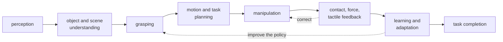
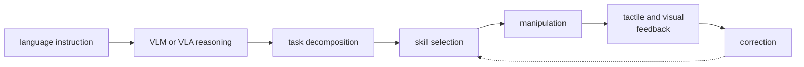
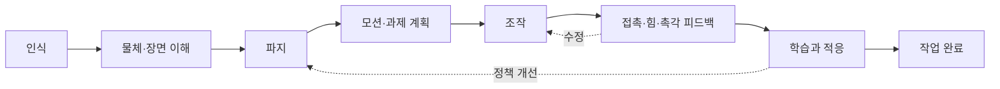

> [!abstract] Depth target · 깊이 목표
> **Working** — you should be able to state the research question, say which pillar a paper
> or idea serves, and reject a topic that does not serve it.
> **Working** — 연구 질문을 말할 수 있고, 어떤 논문이나 아이디어가 어느 기둥에 속하는지
> 판단할 수 있으며, 어느 기둥에도 기여하지 않는 주제를 거절할 수 있어야 한다.

> [!note] Prerequisites · 선수 지식
> Read [[00-study-depth-guide|0. Study Depth Guide]] first — this page assigns depth to
> topics, and that page defines what the depths mean. No technical prerequisite otherwise.
> [[00-study-depth-guide|0. Study Depth Guide]]를 먼저 읽어라 — 이 페이지는 주제에 깊이를
> 배정하고, 그 페이지가 깊이의 정의를 담고 있다. 그 외 기술적 선수 지식은 없다.

## English

Every other section of this wiki answers "what does this field know?" This section answers
a different question: **"what am I trying to contribute, and what does that make worth
studying?"**

It is a decision record. The claims here are choices, not findings — they can be wrong,
and they should be revised after the first baseline and the first failure analysis. Dated
decisions are more useful than undated intentions, so each revision goes in the
[[study-log|study log]].

### 1. The research identity

> **Construction Physical AI researcher specializing in robot manipulation, with
> navigation and human–robot interaction for real-world autonomous deployment.**

The load-bearing word is *specializing*. The weaker framing this replaces —
"civil engineer who uses AI" — makes the domain the identity and the technique a tool,
which invites the reader to evaluate the AI work against AI researchers and find it
shallow. The stronger framing inverts it:

| Layer | Role |
|---|---|
| Robotics / Physical AI | the **technical core** — what the contribution is made of |
| Construction & the built environment | the **differentiating domain** — where the problem comes from |

The domain is not decoration. Construction generates manipulation problems that factory
robotics has largely designed away: unstructured and changing geometry, irregular and
heavy parts, deformable materials, dust and occlusion, uncertain contact, human coworkers
in the workspace, high safety requirements, few fixtures, and task conditions that vary
between two instances of the same job. A contribution that survives those conditions is
hard to dismiss as incremental.

### 2. Three pillars, one hierarchy

The program has three areas, and they are **not** three equal programs:

| Pillar | Role in the program |
|---|---|
| **Manipulation** | the primary scientific and technical contribution |
| **Navigation** | reach the correct workspace and a manipulation-ready pose |
| **Human–robot interaction** | be safe and useful around construction workers |

The distinction matters because three independent specializations is three dissertations.
One dissertation is a single manipulation problem whose real-world success *requires*
navigation and HRI — they enter as necessary conditions, not as parallel novelty claims.

### 3. The dissertation question

> **How can autonomous construction robots safely navigate dynamic worksites, coordinate
> with human workers, and execute contact-rich manipulation tasks?**

A narrower framing that puts the technical contribution first, and is the one to prefer
when a paper's reviewers are roboticists:

> **Learning and control for contact-rich mobile manipulation in human-centered
> construction environments.**

Both questions have the same shape: one verb carries the contribution (*execute
contact-rich manipulation*), and the others name the conditions under which it has to hold.

### 4. Contribution balance

<svg viewBox="0 0 560 214" style="max-width:100%;height:auto" role="img" aria-label="a horizontal bar split into manipulation at about 55 percent, navigation at about 22, and human-robot interaction at about 23">
  <g font-size="11.5" fill="currentColor">
    <text x="30" y="26">Where the dissertation&#8217;s technical weight sits</text>
  </g>
  <g fill="currentColor">
    <rect x="30" y="42" width="275" height="46" rx="3" fill-opacity="0.30"/>
    <rect x="305" y="42" width="110" height="46" rx="3" fill-opacity="0.12"/>
    <rect x="415" y="42" width="115" height="46" rx="3" fill-opacity="0.12"/>
  </g>
  <g stroke="currentColor" stroke-width="1.1" fill="none" opacity="0.75">
    <rect x="30" y="42" width="275" height="46" rx="3"/><rect x="305" y="42" width="110" height="46" rx="3"/><rect x="415" y="42" width="115" height="46" rx="3"/>
  </g>
  <g font-size="12" fill="currentColor" text-anchor="middle">
    <text x="167" y="63">Manipulation</text><text x="167" y="79" font-size="11" opacity="0.85">50&#8211;60%</text>
    <text x="360" y="63">Navigation</text><text x="360" y="79" font-size="11" opacity="0.85">20&#8211;25%</text>
    <text x="472" y="63">HRI</text><text x="472" y="79" font-size="11" opacity="0.85">20&#8211;25%</text>
  </g>
  <g stroke="currentColor" stroke-width="1.4" fill="none" opacity="0.65">
    <path d="M 360 112 L 360 100 L 250 100 L 250 92" marker-end="url(#ar7)"/>
    <path d="M 472 130 L 472 108 L 220 108 L 220 92" marker-end="url(#ar7)"/>
  </g>
  <defs><marker id="ar7" viewBox="0 0 10 10" refX="8" refY="5" markerWidth="5" markerHeight="5" orient="auto"><path d="M 0 0 L 10 5 L 0 10 z" fill="currentColor"/></marker></defs>
  <g font-size="11" fill="currentColor" opacity="0.9">
    <text x="330" y="126">reaches the workspace</text>
    <text x="330" y="144">makes deployment around people possible</text>
    <text x="30" y="176">Both supporting pillars point inward: they are conditions the manipulation contribution has to</text>
    <text x="30" y="192">meet, not separate novelty claims. The percentages are a planning guide, not a requirement &#8212;</text>
    <text x="30" y="208">what matters is that manipulation stays recognizable as the main specialization.</text>
  </g>
</svg>

### 5. The manipulation-centered stack

The layer sequence a construction manipulation system runs through. Reading a paper in
this area is largely a matter of asking **which of these layers it claims to improve** and
which it borrows off the shelf. The [[physical-ai-map|Physical AI Map]] draws this stack on the three floors of tools, mathematics and physics, with every page of the wiki on it as a chip, so that any page can be placed in it.

At a higher level, the same stack driven by language — the form a construction VLA system
takes:

A worked instance: *"Install that panel on the frame."* The system resolves the
instruction, identifies panel and frame, decomposes the job, plans a grasp, moves the
component, detects contact, performs the fitting, and verifies completion. Every one of
those eight steps is a place where a real system fails, and therefore a place where a
paper can contribute.

### 6. Which wiki pages serve which pillar

This is what makes the wiki one program rather than a pile of notes.

| Pillar | Foundations | Method pages | Domain pages | Anchor papers |
|---|---|---|---|---|
| **Manipulation** (core) | [[02-foundations/linear-algebra\|1. Linear Algebra]], [[02-foundations/optimization\|4. Optimization]], [[02-foundations/se3-geometry\|8. SE(3)]], [[02-foundations/manipulator-kinematics-dynamics\|10. Manipulator Kinematics & Dynamics]] | [[04-robotics/modern-robotics/index\|MR ch.2–6, 8, 11, 12]], [[04-robotics/contact-force-tactile\|Contact, Force & Tactile]], [[04-robotics/force-compliance-control\|13. Force & Compliance Control]], [[04-robotics/tactile-visuotactile\|14. Tactile & Visuotactile]], [[04-robotics/grasping\|15. Grasping]], [[04-robotics/planning-decision-making\|Planning]], [[04-robotics/control-theory-ce397\|Control Theory]], [[04-robotics/mpc\|MPC]], [[04-robotics/teleoperation-demonstration\|Teleoperation & Demonstration]] | [[05-construction-robotics/construction-manipulation\|Construction Manipulation]], [[05-construction-robotics/assembly-fabrication\|Assembly & Fabrication]] | [[01-canonical-papers/notes/4-vla/diffusion-policy\|Diffusion Policy]], [[01-canonical-papers/notes/4-vla/act\|ACT]], [[01-canonical-papers/notes/8-construction/vision-guided-assembly\|Vision-Guided Assembly]] |
| **Navigation** (support) | [[02-foundations/probability\|3. Probability]], [[02-foundations/signal-processing\|6. Signal Processing]] | [[04-robotics/state-estimation-slam\|State Estimation & SLAM]], [[04-robotics/navigation-mobile-manipulation\|16. Navigation & Mobile Manipulation]], [[04-robotics/traversability-off-road\|17. Traversability]], [[04-robotics/legged-locomotion\|18. Legged Locomotion]], [[04-robotics/semantic-language-navigation\|19. Semantic Navigation]] | [[05-construction-robotics/site-perception\|Site Perception]], [[05-construction-robotics/digital-twin-workflows\|Digital Twin Workflows]] | [[01-canonical-papers/notes/9-navigation/gervet-real-world-objectnav\|Gervet et al. — 시뮬 77% → 현실 23%]], [[01-canonical-papers/notes/9-navigation/wild-visual-navigation\|WVN]], [[01-canonical-papers/notes/9-navigation/lee-quadruped-terrain\|Lee et al. 2020]], [[01-canonical-papers/notes/8-construction/cho-slam\|Cho — construction SLAM]], [[01-canonical-papers/notes/8-construction/heap\|HEAP]] |
| **HRI** (support) | [[02-foundations/ml-practice\|9. ML Practice]], [[06-research-practice/experimental-design-reproducibility\|Experimental Design]], [[06-research-practice/psychophysics-human-measurement\|Psychophysics & Human Measurement]] | [[04-robotics/hri-safety\|HRI & Safety]], [[04-robotics/video-action-understanding\|20. Video & Action Understanding]], [[04-robotics/human-pose-gaze\|21. Human Pose & Gaze]], [[04-robotics/egocentric-perception\|22. Egocentric Perception]], [[04-robotics/human-intent-prediction\|23. Human Intent & Trajectory Prediction]] | [[05-construction-robotics/hrc-worker-centered\|Worker-Centered HRC]] | [[01-canonical-papers/notes/8-construction/lasota-shah\|Lasota & Shah]], [[01-canonical-papers/notes/8-construction/liang-hrc-survey\|Liang HRC survey]] |
| **The integration layer** | [[02-foundations/rl-basics\|7. RL Basics]] | — | [[05-construction-robotics/sim-to-real\|Sim-to-Real]], [[05-construction-robotics/industry-deployment\|Industry Deployment]] | [[01-canonical-papers/notes/4-vla/rt-2\|RT-2]], [[01-canonical-papers/notes/4-vla/pi0\|π0]], [[01-canonical-papers/notes/8-construction/ext\|ExT]] |

**Where the haptics track sits.** [[04-robotics/haptics-teleoperation/index|24. Haptics & Teleoperation]] entered the wiki because the owner is taking a haptics course, not because the admission test asked for it, and it is not a pillar. Four of its pages pass the test on their own: [[04-robotics/haptics-teleoperation/rendering-sampling-stability|24.4]] and §5–§6 of [[04-robotics/haptics-teleoperation/rendering-in-practice|24.9]] (why sampled contact goes unstable and how to keep it passive) and [[04-robotics/haptics-teleoperation/bilateral-teleoperation|24.5]] and [[04-robotics/haptics-teleoperation/teleoperation-architectures-delay|24.8]] (teleoperation for demonstration collection and remote machines) serve **Manipulation**; [[04-robotics/haptics-teleoperation/human-haptics-psychophysics|24.1]] serves **HRI** through human measurement. [[04-robotics/haptics-teleoperation/tactile-display-design|24.2 Tactile Display Design]] and [[04-robotics/haptics-teleoperation/haptic-rendering-algorithms|24.7 Haptic Rendering Algorithms]] serve the course only, so they sit at Literacy for this program while keeping Working support for the course. Count the track's size against the pillars' weights, not against how much course material happened to arrive.

### 7. Scope control — the rule that keeps this one dissertation

Simultaneous major independent contributions in HRI theory, new SLAM algorithms,
manipulation, tactile sensor hardware, RL theory, and VLA architecture is not an ambitious
dissertation; it is five or six of them. The structure that stays finishable:

> **One core manipulation problem, supported by the minimum necessary HRI, navigation,
> perception, tactile, learning, and VLA components.**

The admission test for any new topic — a paper to read deeply, a method to implement, a
page to write:

> **Does this directly improve the construction manipulation research question?**

If yes, it can be promoted toward Working or Mastery. If no, it stays at Literacy, which
is not a demotion: Literacy is exactly enough to read the field, cite it correctly, and
recognize when it starts to matter.

**Where the test has actually landed, as of 2026-09-23.** 185 pages sit at Working, 88 at
Literacy, 8 at Mastery. Twelve of the Working pages are the ROS 2 track added on 2026-09-10,
which passes the test because running experiments on a real manipulator has no way around it. Fifteen more came on 2026-09-23 — the tools track 12 with its map and 25.0, the physics floor 0.6.1–0.6.3, and 3.6 Perception Sensors — and pass for the same reason: the rig, its code and its contact physics are how the experiment runs. That is the opposite of what this page used to claim, and the reason
is that all three pillars count as serving the question, so anything inside them passes.
Literacy is concentrated where it belongs — 55 of the 88 sit in
[[01-canonical-papers/index|1. Canonical Papers]] — while the concept pages that carry a
pillar are nearly all Working.

A Working majority is not by itself evidence that the filter has stopped working, because
[[00-study-depth-guide|0. Study Depth Guide]] prescribes Working in nine of its fifteen area
rows, and Working for part of three more: applying the guide honestly *produces* these numbers. The decidable question is the
narrower one — does any page sit **deeper** than its own area allows? `audit_depth.py` reads
both of the guide's tables and answers it on every build. It found exactly one: the Dreamer
note, left at Working after the paper itself was re-marked ◐, and now Literacy. All forty of
the remaining deviations run the other way, sitting at Literacy where the guide would permit
Working. So the filter is conservative rather than blunt — but read the three numbers as an
instrument, and if Working ever does become the default for everything, the honest move is to
demote, not to restate the rule.

### 8. The dissertation path, in sessions

*In one sentence:* about 180 sessions in seven blocks, in the order below, take the dissertation from the foundations gate to a learned policy seating the panel of S1, the construction track's 20 kg facade-panel task ([[05-construction-robotics/site-engineering|2.5]]), and the rest of the tracks wait until the experiment calls for them.

The schedules and pacing ranges of all the tracks add up to more than four hundred sessions at Working, and most of them serve some other reader. This section is the path through them for the question of §3, in the order the pages' prerequisites allow. Each count is read off a schedule in the track indexes — the Working pass is every row, the Literacy pass the bold rows — except for the gate, foundations 10, the manipulation pages and 7.5 RL, which no schedule covers; those are sized the way the schedules are, with a session for the object and worked case, one for about 1,600 words of sections, one more for a Tier A lab and one for the problem set.

| # | Block | Working | Literacy | Sessions, as scheduled | What it gives the dissertation |
|---:|---|---:|---:|---|---|
| 1 | The foundations gate, then [[02-foundations/manipulator-kinematics-dynamics\|10. Manipulator Kinematics & Dynamics]] | 1 + 6 | 1 + 1 | the gate check of [[02-foundations/overview\|0. Overview]] | where the foundations still have holes — each failed question names its page — and the task-space bridge a Mastery area needs |
| 2 | The robotics common track through the [[04-robotics/capstone-panel-contact\|capstone]] | 104 | 41 | [[04-robotics/index\|robotics]] 1–104 | the classical loop closed on a panel: the baseline a learned policy has to beat |
| 3 | [[04-robotics/teleoperation-demonstration\|12]], [[04-robotics/force-compliance-control\|13]] and [[04-robotics/grasping\|15]], with MR ch.12 | about 20 | 4 | none; robotics group H | demonstrations, impedance and grasping, three of the six Mastery areas |
| 4 | [[02-foundations/rl-robot-learning\|7.5 RL]] §1 and §4, then deep learning 1–4 | 3 + 16 | 1 + 8 | [[03-deep-learning/index\|deep learning]] 1–3, 11–13, 35–44 | behaviour cloning's argument, the safety filter, and the VLA bridge with only the modules it stands on |
| 5 | Research practice [[06-research-practice/experimental-design-reproducibility\|2]], and 4's worked case | 4 | 4 | [[06-research-practice/index\|research practice]] 4–6, 14 | the trial design, rule of three and Wilson interval that 2.5, 6 and 10 use |
| 6 | Construction [[05-construction-robotics/site-engineering\|2.5]], 4, 6 and [[05-construction-robotics/construction-manipulation\|9]], with 7.5 §7–§8 | 20 | 9 | [[05-construction-robotics/index\|construction]] 3–6, 12–15, 21–25, 30, 33, 37–41 | S1 from the work package to the pin: the error budget, two holes, the hold, capture, a bounded residual |
| 7 | [[05-construction-robotics/imitating-contact\|10. Imitating Contact]] | 6 | 2 | construction 42–47 | the dissertation sentence as one object: a learned policy run into the site tolerance |
| 8 | The rest of research practice | 32 | 16 | research practice 1–3, 7–13, 15–36 | failure analysis, writing, venues, benchmarks and human measurement, taken while the experiment runs |

**Reading the table.** Blocks 1–7 come to about 180 sessions at Working and 71 at Literacy before an experiment starts; block 8 adds 32 beside it, about 212 in all. At the overview's pace of two course sessions a week, 180 sessions is about 90 weeks, so the Working pass cannot all come before the first mock-up. Take blocks 1–7 at Literacy first — 71 sessions, about 36 weeks at that pace — and take each block's remaining rows at Working when the experiment reaches its page. [[physical-ai-map|The Physical AI Map §3]] draws the seven blocks as a timeline, and its whole map marks every page of the path with a heavy chip.

The order follows the prerequisite callouts. Block 4 comes after 2 and 3 because computer vision needs robotics 3.5 and the VLA page needs 10. Robot Systems and 12; block 5 comes before 6 because 2.5's protocol takes its trial design from it and 6's §4 its rule of three; block 7 needs every block before it. Where a page on the path leans on one section of a page off it — 2.5 on [[06-research-practice/real-world-impact|research practice 6 §2]], 9 on [[04-robotics/tactile-visuotactile|14. Tactile §1]], 6 on [[04-robotics/human-intent-prediction|23 §5]] and [[06-research-practice/psychophysics-human-measurement|research practice 8 §5]], 7.5 on [[05-construction-robotics/earthmoving-heavy-machinery|3]] for the machine of S2, the construction track's 5-tonne trench excavator ([[05-construction-robotics/site-engineering|2.5]]) — read that section when the callout names it.

### 9. What the path leaves out, and when to add it back

Deep learning 1.1–1.4, 5, 6 and 6.1 are off the path. Add [[03-deep-learning/foundations/attention-transformer|1.2]] when the policy's backbone itself changes, [[03-deep-learning/diffusion/index|6]] and 6.1 when its action head is a denoiser, [[03-deep-learning/foundations/training-at-scale|1.3]] and [[03-deep-learning/foundations/gpu-computing|1.4]] when it trains at scale or in a parallel simulator, and [[03-deep-learning/world-models/index|5]] when it plans with a learned model. In construction, 1, 2 and 8 are maps of one session each, readable at any time, and 3, 5 and 7 are the other streams, added when the machine (3), the perception layer (5) or the BIM chain (7) enters the contribution. In robotics, 14 and 16 of group H enter when the policy's inputs include touch or the base moves; navigation, human perception and haptics when the site asks for them; and the build track when the experiment needs its rig.

Two floors sit under the path without being counted in it. The physics floor, [[02-foundations/basic-mechanics|0.6.1 Basic Mechanics]], [[02-foundations/basic-circuits-electronics|0.6.2 Circuits & Electronics]] and [[02-foundations/fluid-power|0.6.3 Fluid Power]], belongs with block 1: take the pages your degree skipped before block 2, where the robotics track starts to lean on them. The tools track, [[02-foundations/tools/index|12. Code, Tools & File Formats]], is taken one page at a time when its first need arrives — [[02-foundations/tools/linux-shell|12.1]] and [[02-foundations/tools/git-research-code|12.2]] before the first robot or cluster work, [[02-foundations/tools/python-research-code|12.3]] before the first Tier A lab if Python is new, [[02-foundations/tools/config-data-formats|12.4]] and [[02-foundations/tools/computer-networks|12.5]] when the build track first loads a parameter file or links two machines, [[02-foundations/tools/gpu-clusters|12.7]] when training first leaves your own machine, [[02-foundations/tools/concurrency|12.8]] before 25.5.1 on the rig, [[02-foundations/tools/mechanical-design-fabrication|12.9]] before building the first rig and [[02-foundations/tools/latex-figures-references|12.6]] before writing the first paper — with [[04-robotics/ros2/cpp-for-robot-code|25.0 C++]] before the build track's first C++ node.

Papers follow the marks of [[01-canonical-papers/canonical-list|the canonical list]] — ★ read in full, ◐ the note and then a skim, ○ the note alone — not the folder order, at the overview's one paper session a week.

### After reading

- [ ] State the research identity in one sentence without reading it off the page.
- [ ] Name the three pillars and say which one carries the contribution.
- [ ] Given a paper, say which pillar it serves and whether it should be read at ★, ◐, or ○.
- [ ] Apply the admission test to a topic you are tempted by, and be willing to answer "no".
- [ ] Name the blocks of the dissertation path in order with their sessions, and say which tracks wait until the experiment calls for them.

### Self-check

1. Why is "civil engineer who uses AI" a weaker identity than the one on this page, even
   though both describe the same person?
2. Navigation is 20–25% of the dissertation. Does that mean a novel SLAM algorithm is a
   good use of a year?
3. A tactile-sensor hardware paper looks fascinating. Apply the admission test.
4. What is the difference between this page's `study-depth` assignments and the ★◐○ marks
   in the paper list?
5. On the path of §8, why does research practice 2 come before construction 2.5, and why does
   10. Imitating Contact come last?

> [!tip]- Answers
> 1. It makes the domain the identity and AI the tool, so a robotics reviewer evaluates the AI content against AI researchers with nothing distinctive to weigh against it. The stronger framing puts robotics in the technical core and construction in the role of generating problems that other roboticists do not have — the domain becomes evidence of difficulty rather than an excuse for shallowness.
> 2. No. The pillar's role is to *reach a manipulation-ready pose*; a novel SLAM algorithm is a navigation contribution, which the program explicitly does not claim. Strong integration — localizing on a changing site, placing the base so the arm can reach — serves the dissertation; new SLAM does not.
> 3. Ask whether it directly improves contact-rich construction manipulation. Building a new sensor does not; *using* an existing tactile sensor to make fastening or insertion robust does. So: read it at Literacy, cite it, and keep sensor hardware out of the contribution.
> 4. ★◐○ says how much of one paper to read. `study-depth` says how well to command a topic. They are independent: a Literacy topic can still contain a ★ paper worth reading in full, because reading a landmark paper closely is cheap and understanding a whole field deeply is not.
> 5. 2.5's evaluation protocol takes its trial design from research practice 2, and 6's §4 its rule of three for an event not yet seen, so neither can be done without it. 10 comes last because it stands on every block before it: 9's pin, 12's corpus, 13's impedance, the capstone's classical loop, the VLA page's behaviour cloning and 4's Wilson interval.

### Sources

- The strategy this page records is a personal research decision, not a citable claim.
  The technical framings it uses — the manipulation stack, contact-rich task vocabulary,
  and the pillar structure — are standard in the robotics literature indexed elsewhere in
  this wiki; see [[04-robotics/index|Robotics & Physical Systems]] and
  [[05-construction-robotics/index|Construction Robotics]] for the underlying sources.
- [[07-research-program/paper-arc|Paper Arc]] — how these pillars become a sequence of papers.
- [[06-research-practice/venue-strategy|Venue Strategy]] and [[06-research-practice/real-world-impact|Real-World Impact]] — where the resulting papers go, and what evidence licenses which claim.

## 한국어

이 위키의 다른 모든 섹션은 "이 분야는 무엇을 알고 있는가"에 답한다. 이 섹션은 다른 질문에
답한다: **"나는 무엇을 기여하려 하며, 그 결정이 무엇을 공부할 가치가 있게 만드는가?"**

이것은 결정 기록이다. 여기 적힌 것들은 발견이 아니라 선택이다 — 틀릴 수 있고, 첫 베이스라인과
첫 실패 분석 뒤에 수정되어야 한다. 날짜 없는 의도보다 날짜 있는 결정이 쓸모 있으므로, 수정은
[[study-log|학습 일지]]에 남긴다.

### 1. 연구 정체성

> **로봇 매니퓰레이션을 전문으로 하는 Construction Physical AI 연구자. 실세계 자율 배치를
> 위해 내비게이션과 인간-로봇 상호작용을 함께 다룬다.**

핵심 단어는 *전문으로 한다*이다. 이것이 대체하는 약한 표현 — "AI를 쓰는 토목 엔지니어" —
는 도메인을 정체성으로, 기술을 도구로 만든다. 그러면 읽는 사람은 AI 연구자들과 견주어
평가하게 되고 얕다고 판단한다. 강한 표현은 이를 뒤집는다:

| 층 | 역할 |
|---|---|
| 로보틱스 / Physical AI | **기술적 핵심** — 기여가 무엇으로 만들어지는가 |
| 건설과 건조 환경 | **차별화하는 도메인** — 문제가 어디서 오는가 |

도메인은 장식이 아니다. 건설은 공장 로보틱스가 대체로 설계로 없애 버린 조작 문제들을
만들어낸다: 비정형이며 변하는 기하, 불규칙하고 무거운 부재, 변형되는 재료, 분진과 가림,
불확실한 접촉, 작업 구역 안의 동료 작업자, 높은 안전 요구, 적은 고정 지그, 그리고 같은
작업의 두 사례 사이에서도 달라지는 조건. 이 조건들을 견디는 기여는 점진적이라고 일축하기
어렵다.

### 2. 세 기둥, 하나의 위계

프로그램에는 세 영역이 있고, 이들은 **동등한 세 프로그램이 아니다**:

| 기둥 | 프로그램에서의 역할 |
|---|---|
| **매니퓰레이션** | 주된 과학적·기술적 기여 |
| **내비게이션** | 올바른 작업 구역과 조작 가능한 자세에 도달한다 |
| **인간-로봇 상호작용** | 건설 작업자 곁에서 안전하고 쓸모 있게 만든다 |

구분이 중요한 이유는, 독립적인 전문 분야 셋은 곧 학위논문 셋이기 때문이다. 하나의
학위논문은 **하나의 조작 문제**이고, 그 문제의 실세계 성공이 내비게이션과 HRI를 *요구하는*
구조다 — 이 둘은 병렬적인 novelty 주장이 아니라 필요조건으로 들어온다.

### 3. 학위논문 질문

> **자율 건설 로봇이 어떻게 변화하는 현장을 안전하게 이동하고, 작업자와 협응하며, 접촉이
> 많은 조작 작업을 수행할 수 있는가?**

기술적 기여를 앞세운 더 좁은 표현이며, 심사자가 로보틱스 연구자일 때 선호할 쪽이다:

> **인간 중심 건설 환경에서의 접촉이 많은 모바일 매니퓰레이션을 위한 학습과 제어.**

두 질문은 같은 형태다: 동사 하나가 기여를 지고(*접촉이 많은 조작을 수행한다*), 나머지는 그것이
성립해야 하는 조건들을 지명한다.

### 4. 기여 비중

<svg viewBox="0 0 560 214" style="max-width:100%;height:auto" role="img" aria-label="매니퓰레이션 약 55퍼센트, 내비게이션 약 22, 인간-로봇 상호작용 약 23으로 나뉜 가로 막대">
  <g font-size="11.5" fill="currentColor">
    <text x="30" y="26">학위논문의 기술적 무게가 놓이는 곳</text>
  </g>
  <g fill="currentColor">
    <rect x="30" y="42" width="275" height="46" rx="3" fill-opacity="0.30"/>
    <rect x="305" y="42" width="110" height="46" rx="3" fill-opacity="0.12"/>
    <rect x="415" y="42" width="115" height="46" rx="3" fill-opacity="0.12"/>
  </g>
  <g stroke="currentColor" stroke-width="1.1" fill="none" opacity="0.75">
    <rect x="30" y="42" width="275" height="46" rx="3"/><rect x="305" y="42" width="110" height="46" rx="3"/><rect x="415" y="42" width="115" height="46" rx="3"/>
  </g>
  <g font-size="12" fill="currentColor" text-anchor="middle">
    <text x="167" y="63">매니퓰레이션</text><text x="167" y="79" font-size="11" opacity="0.85">50&#8211;60%</text>
    <text x="360" y="63">내비게이션</text><text x="360" y="79" font-size="11" opacity="0.85">20&#8211;25%</text>
    <text x="472" y="63">HRI</text><text x="472" y="79" font-size="11" opacity="0.85">20&#8211;25%</text>
  </g>
  <g stroke="currentColor" stroke-width="1.4" fill="none" opacity="0.65">
    <path d="M 360 112 L 360 100 L 250 100 L 250 92" marker-end="url(#ar7k)"/>
    <path d="M 472 130 L 472 108 L 220 108 L 220 92" marker-end="url(#ar7k)"/>
  </g>
  <defs><marker id="ar7k" viewBox="0 0 10 10" refX="8" refY="5" markerWidth="5" markerHeight="5" orient="auto"><path d="M 0 0 L 10 5 L 0 10 z" fill="currentColor"/></marker></defs>
  <g font-size="11" fill="currentColor" opacity="0.9">
    <text x="330" y="126">작업 구역에 도달시킨다</text>
    <text x="330" y="144">사람 곁에서의 배치를 가능하게 한다</text>
    <text x="30" y="176">두 보조 기둥은 안쪽을 가리킨다: 병렬적인 novelty 주장이 아니라, 조작 기여가 충족해야 하는</text>
    <text x="30" y="192">조건이다. 백분율은 요구 사항이 아니라 계획의 기준선이다 &#8212; 중요한 것은 매니퓰레이션이</text>
    <text x="30" y="208">주 전문 분야로 알아볼 수 있게 남아 있는가이다.</text>
  </g>
</svg>

### 5. 매니퓰레이션 중심 스택

건설 조작 시스템이 통과하는 층의 순서. 이 분야의 논문을 읽는 일은 대체로 **이 중 어느 층을
개선했다고 주장하는가**, 그리고 어느 층을 기성품으로 가져다 썼는가를 묻는 일이다. [[physical-ai-map|피지컬 AI 지도]]는 이 스택을 도구·수학·물리의 세 바닥 위에 그리고 위키의 모든 페이지를 칩으로 올려 두어, 어느 페이지든 그 안에 자리를 찾을 수 있게 한다.

한 단계 위에서 같은 스택을 언어가 구동하면 — 건설 VLA 시스템의 형태가 된다:

구체적인 예: *"저 패널을 프레임에 설치해."* 시스템은 지시를 해석하고, 패널과 프레임을
식별하고, 작업을 분해하고, 파지를 계획하고, 부재를 옮기고, 접촉을 감지하고, 끼움을
수행하고, 완료를 검증한다. 이 여덟 단계 하나하나가 실제 시스템이 실패하는 지점이고,
따라서 논문이 기여할 수 있는 지점이다.

### 6. 어느 위키 페이지가 어느 기둥을 받치는가

이것이 위키를 노트 더미가 아니라 하나의 프로그램으로 만드는 부분이다.

| 기둥 | 기초 | 방법 페이지 | 도메인 페이지 | 앵커 논문 |
|---|---|---|---|---|
| **매니퓰레이션** (핵심) | [[02-foundations/linear-algebra\|1. 선형대수]], [[02-foundations/optimization\|4. 최적화]], [[02-foundations/se3-geometry\|8. SE(3)]], [[02-foundations/manipulator-kinematics-dynamics\|10. 매니퓰레이터 기구학·동역학]] | [[04-robotics/modern-robotics/index\|MR 2–6·8·11·12장]], [[04-robotics/contact-force-tactile\|접촉·힘·촉각]], [[04-robotics/force-compliance-control\|13. 힘·컴플라이언스 제어]], [[04-robotics/tactile-visuotactile\|14. 촉각·시각촉각]], [[04-robotics/grasping\|15. 파지]], [[04-robotics/planning-decision-making\|계획]], [[04-robotics/control-theory-ce397\|제어 이론]], [[04-robotics/mpc\|MPC]], [[04-robotics/teleoperation-demonstration\|원격조작·시연 수집]] | [[05-construction-robotics/construction-manipulation\|건설 매니퓰레이션]], [[05-construction-robotics/assembly-fabrication\|조립·제작]] | [[01-canonical-papers/notes/4-vla/diffusion-policy\|Diffusion Policy]], [[01-canonical-papers/notes/4-vla/act\|ACT]], [[01-canonical-papers/notes/8-construction/vision-guided-assembly\|비전 유도 조립]] |
| **내비게이션** (보조) | [[02-foundations/probability\|3. 확률]], [[02-foundations/signal-processing\|6. 신호처리]] | [[04-robotics/state-estimation-slam\|상태 추정·SLAM]], [[04-robotics/navigation-mobile-manipulation\|16. 내비게이션과 모바일 조작]], [[04-robotics/traversability-off-road\|17. Traversability]], [[04-robotics/legged-locomotion\|18. 레그드 로코모션]], [[04-robotics/semantic-language-navigation\|19. 의미 내비게이션]] | [[05-construction-robotics/site-perception\|현장 인식]], [[05-construction-robotics/digital-twin-workflows\|디지털 트윈]] | [[01-canonical-papers/notes/9-navigation/gervet-real-world-objectnav\|Gervet 등 — 시뮬 77% → 현실 23%]], [[01-canonical-papers/notes/9-navigation/wild-visual-navigation\|WVN]], [[01-canonical-papers/notes/9-navigation/lee-quadruped-terrain\|Lee 등 2020]], [[01-canonical-papers/notes/8-construction/cho-slam\|Cho — 건설 SLAM]], [[01-canonical-papers/notes/8-construction/heap\|HEAP]] |
| **HRI** (보조) | [[02-foundations/ml-practice\|9. ML 실무]], [[06-research-practice/experimental-design-reproducibility\|실험 설계]], [[06-research-practice/psychophysics-human-measurement\|심리물리·인간 측정]] | [[04-robotics/hri-safety\|HRI·안전]], [[04-robotics/video-action-understanding\|20. 비디오·행동 이해]], [[04-robotics/human-pose-gaze\|21. 사람 자세·시선]], [[04-robotics/egocentric-perception\|22. 자기중심 인지]], [[04-robotics/human-intent-prediction\|23. 인간 의도·궤적 예측]] | [[05-construction-robotics/hrc-worker-centered\|작업자 중심 HRC]] | [[01-canonical-papers/notes/8-construction/lasota-shah\|Lasota & Shah]], [[01-canonical-papers/notes/8-construction/liang-hrc-survey\|Liang HRC 서베이]] |
| **통합 층** | [[02-foundations/rl-basics\|7. RL 기초]] | — | [[05-construction-robotics/sim-to-real\|Sim-to-Real]], [[05-construction-robotics/industry-deployment\|산업 배치]] | [[01-canonical-papers/notes/4-vla/rt-2\|RT-2]], [[01-canonical-papers/notes/4-vla/pi0\|π0]], [[01-canonical-papers/notes/8-construction/ext\|ExT]] |

**햅틱 트랙은 어디에 서는가.** [[04-robotics/haptics-teleoperation/index|24. 햅틱·원격조작]]은 입학 시험이 요구해서가 아니라 주인이 햅틱 과목을 듣기 때문에 위키에 들어왔고, 기둥이 아니다. 그 가운데 네 쪽은 스스로 시험을 통과한다. [[04-robotics/haptics-teleoperation/rendering-sampling-stability|24.4]]와 [[04-robotics/haptics-teleoperation/rendering-in-practice|24.9]]의 §5–§6(샘플된 접촉이 왜 불안정해지고 어떻게 수동적으로 지키는가), 그리고 [[04-robotics/haptics-teleoperation/bilateral-teleoperation|24.5]]와 [[04-robotics/haptics-teleoperation/teleoperation-architectures-delay|24.8]](시연 수집과 원격 기계를 위한 원격조작)은 **매니퓰레이션**을 받치고, [[04-robotics/haptics-teleoperation/human-haptics-psychophysics|24.1]]은 사람 측정을 통해 **HRI**를 받친다. [[04-robotics/haptics-teleoperation/tactile-display-design|24.2 촉각 디스플레이 설계]]와 [[04-robotics/haptics-teleoperation/haptic-rendering-algorithms|24.7 햅틱 렌더링 알고리즘]]은 과목에만 쓰이므로, 과목을 위한 Working 지원은 유지한 채 이 프로그램에서는 Literacy에 둔다. 트랙의 크기는 우연히 들어온 과목 자료의 양이 아니라 기둥의 비중에 대어 보라.

### 7. 범위 통제 — 이것을 하나의 학위논문으로 유지하는 규칙

HRI 이론, 새 SLAM 알고리즘, 매니퓰레이션, 촉각 센서 하드웨어, RL 이론, VLA 아키텍처에서
동시에 주요한 독립 기여를 하는 것은 야심 찬 학위논문이 아니라 학위논문 대여섯 개다.
끝낼 수 있는 구조는 이것이다:

> **하나의 핵심 조작 문제, 그리고 그것을 받치는 최소한의 HRI·내비게이션·인식·촉각·학습·
> VLA 구성 요소.**

새 주제 — 깊이 읽을 논문, 구현할 방법, 쓸 페이지 — 에 대한 입장 시험:

> **이것이 건설 조작 연구 질문을 직접 개선하는가?**

그렇다면 Working이나 Mastery로 승격할 수 있다. 아니라면 Literacy에 남는다. 이것은 강등이
아니다: Literacy는 분야를 읽고, 정확히 인용하고, 그것이 중요해지기 시작하는 순간을 알아보는
데 정확히 충분한 깊이다.

**이 시험이 실제로 어디에 도달했는가, 2026-09-23 기준.** Working이 185쪽, Literacy가 88쪽,
Mastery가 8쪽이다. Working 중 12쪽은 2026-09-10에 더한 ROS 2 트랙이다. 실기계 매니퓰레이터로
실험을 돌리는 데 우회로가 없으므로 입학 시험을 통과한다. 2026-09-23에 열다섯 쪽이 더해졌다 — 도구 트랙 12와 그 지도와 25.0, 물리 바닥 0.6.1–0.6.3, 그리고 3.6 인식 센서 — 그리고 같은 이유로 통과한다. 리그와 그 코드와 접촉의 물리가 곧 실험이 돌아가는 방식이다. 이 페이지가 예전에 주장하던 것과 반대이고, 이유는 세 기둥 모두가 연구 질문에
기여하는 것으로 계산되어 그 안에 있는 것은 전부 시험을 통과하기 때문이다. Literacy는 있어야 할
곳에 몰려 있다 — 88쪽 중 55쪽이 [[01-canonical-papers/index|1. 핵심 논문]]에 있다 — 반면
기둥을 지는 개념 페이지는 거의 다 Working이다.

Working이 다수라는 사실만으로는 거르는 기능이 멈췄다는 증거가 못 된다.
[[00-study-depth-guide|깊이 가이드]]의 영역 표 열다섯 행 중 아홉 행이 기본값을 Working으로
정해 두었고, 세 행은 일부를 Working으로 두었기 때문이다. 가이드를 정직하게 적용하면 이 숫자가 나온다. 판정할 수 있는 질문은 더
좁다 — 자기 영역이 허용하는 것보다 **깊게** 앉은 페이지가 있는가? `audit_depth.py`가 가이드의
두 표를 읽어 빌드마다 이 질문에 답한다. 걸린 것은 정확히 하나, Dreamer 노트다. 논문 자체가
◐로 재표시된 뒤에도 Working에 남아 있었고 지금은 Literacy다. 나머지 마흔 건의 이탈은 전부
반대 방향이다. 가이드가 Working을 허용하는 자리에 Literacy로 앉아 있다. 즉 이 필터는 무뎌진
것이 아니라 보수적이다. 다만 세 숫자는 계기판으로 읽어라. 언젠가 Working이 정말 모든 것의
기본값이 되면, 정직한 수는 규칙을 고쳐 쓰는 것이 아니라 강등하는 것이다.

### 8. 학위논문 경로, 회차로

*한 문장으로:* 아래 순서의 일곱 블록, 약 180회가 학위논문을 기초 통과 점검에서 S1(건설 트랙의 20 kg 외장 패널 과제, [[05-construction-robotics/site-engineering|2.5]]) 패널을 앉히는 학습된 정책까지 데려가고, 트랙의 나머지는 실험이 부를 때까지 기다린다.

모든 트랙의 일정표와 페이스 범위를 합치면 Working으로 400회가 넘고, 그 대부분은 다른 독자를 위한 것이다. 이 절은 §3의 질문을 위해 그 사이를 지나는 경로를, 페이지들의 선수 관계가 허락하는 순서로 적는다. 회차 수는 트랙 목차의 일정표에서 읽었다 — Working 통과는 모든 행, Literacy 통과는 굵은 행이다. 일정표가 다루지 않는 통과 점검, 기초 10, 조작 페이지들, 7.5 RL만은 일정표와 같은 방식으로 셌다. 대상과 끝까지 계산에 1회, 절 약 1,600단어에 1회, Tier A 실습에 1회 더, 과제에 1회다.

| # | 블록 | Working | Literacy | 일정표의 회차 | 학위논문에 주는 것 |
|---:|---|---:|---:|---|---|
| 1 | 기초 통과 점검, 그다음 [[02-foundations/manipulator-kinematics-dynamics\|10. 매니퓰레이터 기구학·동역학]] | 1 + 6 | 1 + 1 | [[02-foundations/overview\|0. Overview]]의 통과 점검 | 기초에 아직 남은 구멍(틀린 문항마다 자기 페이지를 지목한다)과, Mastery 영역에 필요한 작업 공간 다리 |
| 2 | [[04-robotics/capstone-panel-contact\|캡스톤]]까지의 로보틱스 공통 트랙 | 104 | 41 | [[04-robotics/index\|로보틱스]] 1–104 | 패널 위에서 닫은 고전 루프: 학습된 정책이 이겨야 할 기준선 |
| 3 | [[04-robotics/teleoperation-demonstration\|12]], [[04-robotics/force-compliance-control\|13]], [[04-robotics/grasping\|15]]와 MR 12장 | 약 20 | 4 | 없음, 로보틱스 H묶음 | 시연, 임피던스, 파지: 여섯 Mastery 영역 가운데 셋 |
| 4 | [[02-foundations/rl-robot-learning\|7.5 RL]] §1과 §4, 그다음 딥러닝 1–4 | 3 + 16 | 1 + 8 | [[03-deep-learning/index\|딥러닝]] 1–3, 11–13, 35–44 | 행동 복제의 논증, 안전 필터, 그리고 VLA 다리와 그것이 딛는 모듈만 |
| 5 | 연구 실무 [[06-research-practice/experimental-design-reproducibility\|2]]와 4의 끝까지 계산 | 4 | 4 | [[06-research-practice/index\|연구 실무]] 4–6, 14 | 2.5, 6, 10이 쓰는 시행 설계, 3의 규칙, Wilson 구간 |
| 6 | 건설 [[05-construction-robotics/site-engineering\|2.5]], 4, 6, [[05-construction-robotics/construction-manipulation\|9]]와 7.5 §7–§8 | 20 | 9 | [[05-construction-robotics/index\|건설]] 3–6, 12–15, 21–25, 30, 33, 37–41 | 작업 묶음에서 핀까지의 S1: 오차 예산, 두 구멍, 지지, 포착, 한계를 둔 잔차 |
| 7 | [[05-construction-robotics/imitating-contact\|10. 접촉 모방]] | 6 | 2 | 건설 42–47 | 학위논문의 문장을 대상 하나로: 현장 허용오차까지 돌린 학습된 정책 |
| 8 | 연구 실무의 나머지 | 32 | 16 | 연구 실무 1–3, 7–13, 15–36 | 실험이 도는 동안 하는 실패 분석, 글쓰기, 학회, 벤치마크, 사람 측정 |

**표 읽기.** 1–7 블록은 실험이 시작되기 전까지 Working으로 약 180회, Literacy로 71회이고, 8 블록이 그 곁에서 32회를 더해 모두 약 212회다. 개관이 권하는 주 2회 교과 속도로 180회는 약 90주이므로, Working 통과를 모두 첫 모형 실험 앞에 둘 수는 없다. 1–7 블록을 먼저 Literacy로 지나고(71회, 그 속도로 약 36주), 실험이 어느 페이지에 닿을 때 그 블록의 남은 행을 Working으로 한다. [[physical-ai-map|피지컬 AI 지도 §3]]이 일곱 블록을 시간표로 그리고, 전체 지도는 경로 위의 페이지를 모두 굵은 칩으로 표시한다.

순서는 선수 지식 상자를 따른다. 컴퓨터 비전이 로보틱스 3.5를, VLA 페이지가 10. 로봇 시스템과 12를 요구하므로 4 블록은 2와 3 뒤에 온다. 2.5의 프로토콜이 그 시행 설계를, 6의 §4가 그 3의 규칙을 쓰므로 5 블록은 6 앞에 온다. 7 블록은 앞의 모든 블록을 요구한다. 경로 위의 페이지가 경로 밖 페이지의 한 절에 기대는 곳 — 2.5는 [[06-research-practice/real-world-impact|연구 실무 6 §2]]에, 9는 [[04-robotics/tactile-visuotactile|14. 촉각 §1]]에, 6은 [[04-robotics/human-intent-prediction|23 §5]]와 [[06-research-practice/psychophysics-human-measurement|연구 실무 8 §5]]에, 7.5는 S2(건설 트랙의 5톤급 트렌치 굴착기, [[05-construction-robotics/site-engineering|2.5]])의 기계를 위해 [[05-construction-robotics/earthmoving-heavy-machinery|3]]에 기댄다 — 은 선수 지식 상자가 그 절을 부를 때 읽는다.

### 9. 경로가 빼는 것, 그리고 다시 넣을 때

딥러닝 1.1–1.4, 5, 6, 6.1은 경로 밖이다. 정책의 백본 자체가 바뀌면 [[03-deep-learning/foundations/attention-transformer|1.2]]를, 행동 헤드가 노이즈 제거기면 [[03-deep-learning/diffusion/index|6]]과 6.1을, 대규모로나 병렬 시뮬레이터에서 학습하면 [[03-deep-learning/foundations/training-at-scale|1.3]]과 [[03-deep-learning/foundations/gpu-computing|1.4]]를, 학습한 모델로 계획하면 [[03-deep-learning/world-models/index|5]]를 넣는다. 건설에서 1, 2, 8은 한 회차씩인 지도라 언제 읽어도 되고, 3, 5, 7은 다른 흐름이라 기계(3), 인식 층(5), BIM 사슬(7)이 기여에 들어올 때 넣는다. 로보틱스에서 H묶음의 14와 16은 정책의 입력에 촉각이 들어오거나 베이스가 움직일 때, 내비게이션·사람 인지·햅틱은 현장이 부를 때, 만드는 트랙은 실험이 장비를 요구할 때 들어온다.

경로 밑에는 회차에 세지 않은 바닥이 둘 있다. 물리 바닥 [[02-foundations/basic-mechanics|0.6.1 기초 역학]], [[02-foundations/basic-circuits-electronics|0.6.2 회로와 전자]], [[02-foundations/fluid-power|0.6.3 유체 동력]]은 1 블록에 속한다. 학위 과정이 건너뛴 페이지만, 로보틱스 트랙이 그것에 기대기 시작하는 2 블록 전에 한다. 도구 트랙 [[02-foundations/tools/index|12. 코드·도구·파일 형식]]은 필요가 처음 생길 때 한 페이지씩 한다 — 로봇이나 클러스터 작업을 처음 하기 전에 [[02-foundations/tools/linux-shell|12.1]]과 [[02-foundations/tools/git-research-code|12.2]], Python이 처음이면 첫 Tier A 실습 전에 [[02-foundations/tools/python-research-code|12.3]], 만드는 트랙이 처음으로 파라미터 파일을 읽거나 기계 두 대를 이을 때 [[02-foundations/tools/config-data-formats|12.4]]와 [[02-foundations/tools/computer-networks|12.5]], 학습이 처음으로 자기 기계를 떠날 때 [[02-foundations/tools/gpu-clusters|12.7]], 리그에서 25.5.1 전에 [[02-foundations/tools/concurrency|12.8]], 첫 리그를 만들기 전에 [[02-foundations/tools/mechanical-design-fabrication|12.9]], 첫 논문을 쓰기 전에 [[02-foundations/tools/latex-figures-references|12.6]]. 만드는 트랙의 첫 C++ 노드 전에는 [[04-robotics/ros2/cpp-for-robot-code|25.0 C++]]가 온다.

논문은 폴더 순서가 아니라 [[01-canonical-papers/canonical-list|핵심 논문 리스트]]의 표기를 따른다 — ★ 원문 정독, ◐ 노트 후 훑기, ○ 노트로 충분 — 개관이 권하는 주 1회 논문 회차로.

### 읽고 나면 말할 수 있어야 하는 것

- [ ] 연구 정체성을 페이지를 보지 않고 한 문장으로 말한다.
- [ ] 세 기둥을 대고, 어느 것이 기여를 지는지 말한다.
- [ ] 논문 하나가 주어지면 어느 기둥에 속하는지, ★·◐·○ 중 어느 분량으로 읽어야 하는지 말한다.
- [ ] 끌리는 주제 하나에 입장 시험을 적용하고, "아니오"라고 답할 각오를 한다.
- [ ] 학위논문 경로의 블록을 순서대로 회차와 함께 대고, 어느 트랙이 실험이 부를 때까지 기다리는지 말한다.

### 스스로 점검

1. "AI를 쓰는 토목 엔지니어"가 이 페이지의 정체성보다 약한 표현인 이유는? 둘 다 같은
   사람을 묘사하는데도.
2. 내비게이션은 학위논문의 20~25%다. 그렇다면 새 SLAM 알고리즘에 1년을 쓰는 것이 좋은
   선택인가?
3. 촉각 센서 하드웨어 논문이 매우 흥미로워 보인다. 입장 시험을 적용하라.
4. 이 페이지의 `study-depth` 배정과 논문 리스트의 ★◐○ 표기는 어떻게 다른가?
5. §8의 경로에서 연구 실무 2가 건설 2.5보다 앞에 오는 이유는 무엇이고, 10. 접촉 모방이
   마지막에 오는 이유는 무엇인가?

> [!tip]- 정답 · Answers
> 1. 도메인을 정체성으로, AI를 도구로 만들기 때문이다. 그러면 로보틱스 심사자는 AI 내용을 AI 연구자들과 견주게 되고, 견줄 만한 차별점이 남지 않는다. 강한 표현은 로보틱스를 기술적 핵심에 두고, 건설을 "다른 로보틱스 연구자들에게는 없는 문제를 만들어내는" 역할에 둔다 — 도메인이 얕음의 변명이 아니라 난이도의 증거가 된다.
> 2. 아니다. 이 기둥의 역할은 *조작 가능한 자세에 도달하는 것*이고, 새 SLAM 알고리즘은 내비게이션 기여이며 프로그램이 명시적으로 주장하지 않는 것이다. 강한 통합 — 변하는 현장에서 위치를 잡고, 팔이 닿도록 베이스를 배치하는 것 — 은 학위논문에 기여하지만 새 SLAM은 아니다.
> 3. 접촉이 많은 건설 조작을 직접 개선하는지 물어라. 새 센서를 만드는 것은 아니고, 기존 촉각 센서를 *써서* 체결이나 삽입을 견고하게 만드는 것은 그렇다. 따라서 Literacy로 읽고, 인용하고, 센서 하드웨어는 기여 범위 밖에 둔다.
> 4. ★◐○는 한 논문을 얼마나 읽을지, `study-depth`는 한 주제를 얼마나 잘 다룰지를 말한다. 둘은 독립이다: Literacy 주제에도 전부 읽을 가치가 있는 ★ 논문이 있을 수 있다. 대표 논문 하나를 정독하는 비용은 싸고, 분야 전체를 깊이 이해하는 비용은 비싸기 때문이다.
> 5. 2.5의 평가 프로토콜은 연구 실무 2에서 시행 설계를, 6의 §4는 아직 보지 못한 사건에 대한 3의 규칙을 가져오므로 그것 없이는 둘 다 할 수 없다. 10은 앞의 모든 블록 위에 서므로 마지막이다. 9의 핀, 12의 코퍼스, 13의 임피던스, 캡스톤의 고전 루프, VLA 페이지의 행동 복제, 4의 Wilson 구간이다.

### 출처

- 이 페이지가 기록하는 전략은 개인의 연구 결정이며 인용 가능한 주장이 아니다. 여기서 쓰는
  기술적 틀 — 조작 스택, 접촉이 많은 작업 용어, 기둥 구조 — 은 이 위키의 다른 곳에 색인된
  로보틱스 문헌의 표준 개념이다. 근거 자료는 [[04-robotics/index|Robotics & Physical Systems]]와
  [[05-construction-robotics/index|Construction Robotics]]를 보라.
- [[07-research-program/paper-arc|논문 arc]] — 이 기둥들이 어떻게 논문의 연쇄가 되는가.
- [[06-research-practice/venue-strategy|Venue 전략]]과 [[06-research-practice/real-world-impact|실세계 임팩트]] — 그 논문들이 갈 곳, 그리고 어떤 증거가 어떤 주장을 허락하는가.
