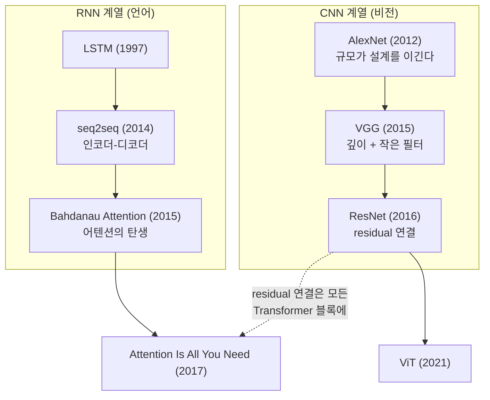
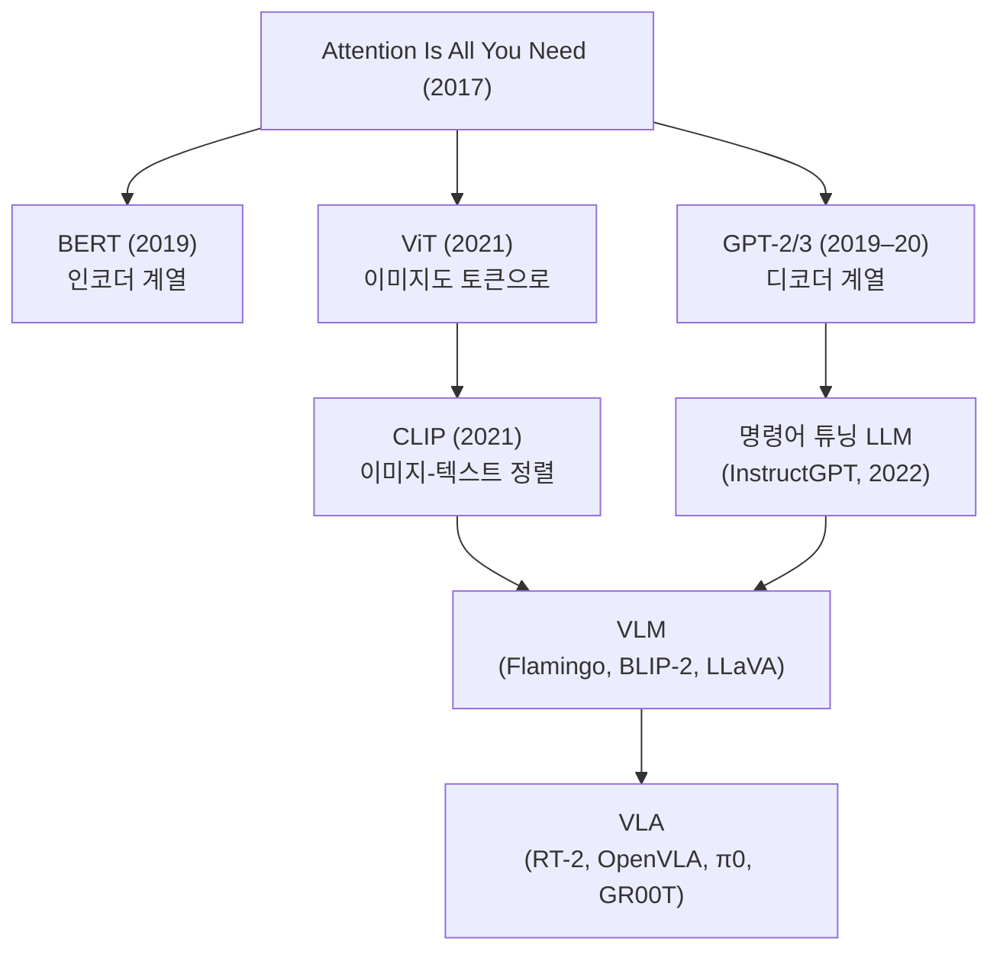
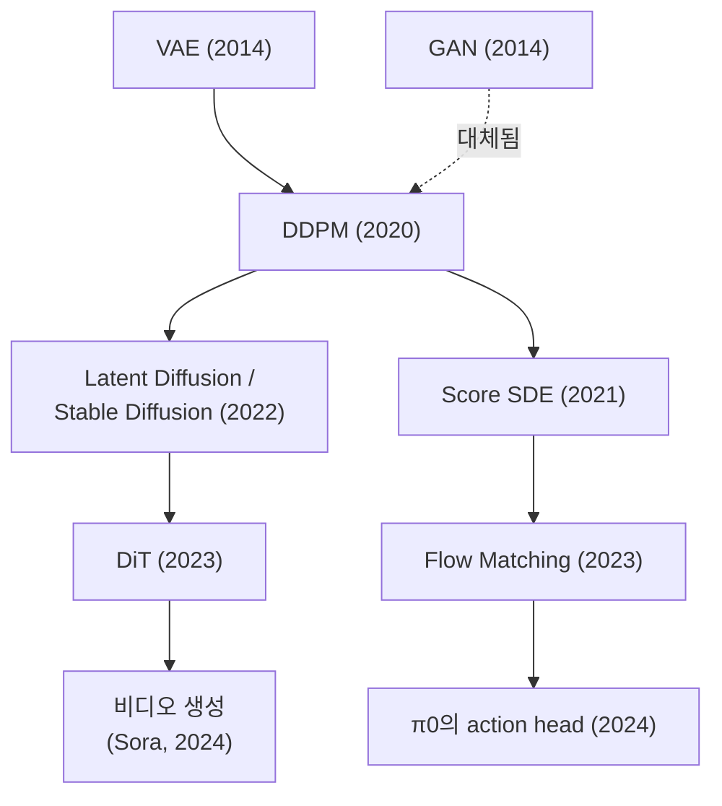
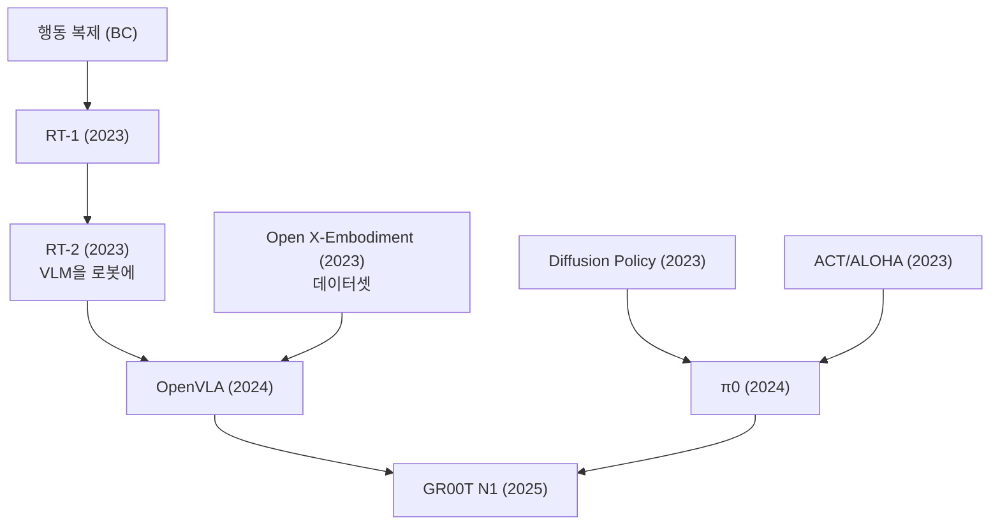
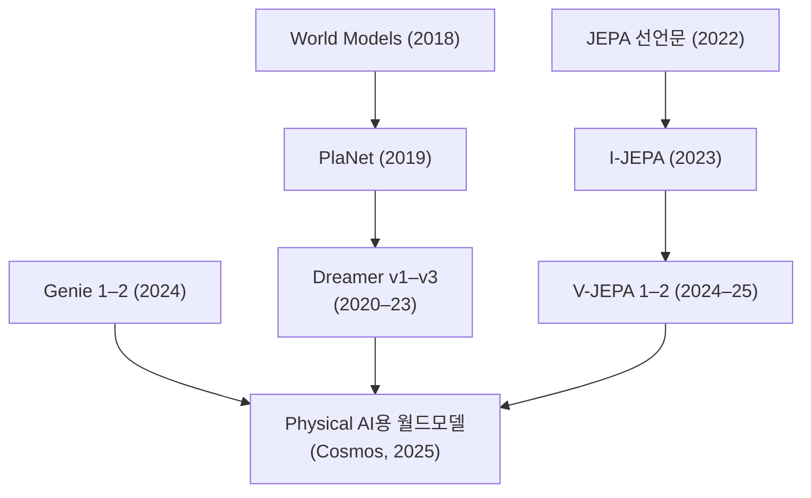

논문을 낱개로 읽으면 잊어버리지만, 계보로 읽으면 남는다.
각 분야가 어떤 논문에서 갈라져 나왔는지 한눈에 보기 위한 지도.
노트를 작성할 때마다 여기에 연결한다.

## 2012–2017: 딥러닝의 부상 — 두 갈래가 Transformer에서 만나다

## Backbone: Transformer 이후의 큰 흐름

## Generative: 디퓨전 계열

## Robot Learning: 시연에서 파운데이션 모델로

## World Models: 상상 속에서 배우기

관련: [[canonical-papers/canonical-list|핵심 논문 리스트]] · [[10-deep-learning/index|딥러닝 지도]]
